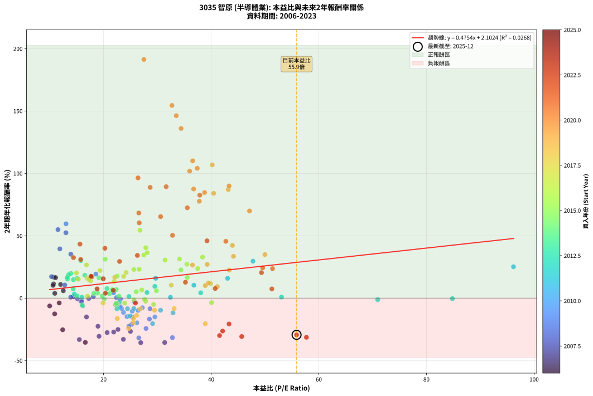
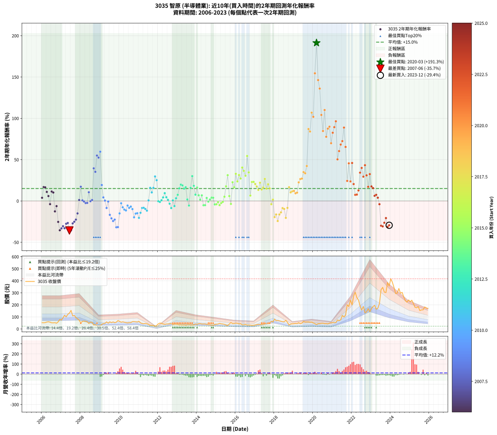

# 3035 智原 - 本益比與未來報酬率分析

!!! info "報告資訊"
    - **股票代號**: 3035
    - **公司名稱**: 智原
    - **產業別**: 半導體業
    - **分析期間**: 2006-2023 (216 個數據點)
    - **資料來源**: Type 12 (ShowMonthlyK_ChartFlow) 月收盤價與本益比
    - **報酬率口徑**: 含現金股利 (簡化: 年度合計，假設每年7/1入帳)
    - **報告生成時間**: 2026-01-13 13:39:16 CST

## 📈 視覺化圖表

### 圖表1: 本益比 vs 未來報酬率關係

*圖表1：3035 智原 本益比與2年期未來報酬率關係 (2006-2023)*

### 圖表2: 歷年買入時點的2年期實際報酬率

*圖表2：3035 智原 歷年買入時點的2年期實際報酬率 (2006-2023)*

## 📍 買點訊號說明

本報告提供兩種買點提示訊號（顯示於圖表2的股價子圖中）：

### ▲ 小綠色三角形（回測驗證）
- **計算方式**: 使用全部歷史資料計算本益比第25百分位數
- **用途**: 事後驗證，顯示歷史上哪些時點確實為低估區
- **限制**: 當下無法判斷，僅供回測參考
- **特性**: 後見之明（Look-Ahead Bias）

### ▲ 小橘色三角形（即時訊號）
- **計算方式**: 使用截至當月的過去5年資料計算本益比第25百分位數
- **用途**: 實際投資決策，當時即可判斷
- **優勢**: 可操作性強，符合實務需求
- **特性**: 無後見之明，滾動窗口計算

!!! tip "如何使用兩種訊號"
    - **綠色▲** 幫助理解歷史估值機會，驗證策略有效性
    - **橘色▲** 可作為實際買進參考，但仍需搭配基本面分析
    - 兩種訊號重疊時，表示即時判斷與事後驗證一致，信心度較高
    - 僅有綠色▲時，表示當時無法判斷（需要未來資料才能確認）
    - 僅有橘色▲時，表示即時判斷為買點，但事後可能不是最佳時機

## 📊 估值分析摘要

| 指標 | 數值 |
|:---:|:---:|
| **目前本益比** (2023-12) | **55.87 倍** |
| **歷史平均本益比** | 27.21 倍 |
| **估值水準** | 🔴 相對高估 |
| **預期2年年化報酬率** | **+28.66%** |
| **歷史平均報酬率** | +15.04% |
| **相關係數 (R²)** | 0.0268 |
| **趨勢線斜率** | 0.4754 |

!!! abstract "核心洞察"
    目前本益比顯著高於歷史平均，預期未來報酬率可能較低

    根據歷史數據回測，3035 智原 在目前本益比 **55.9倍** 的估值水準下，
    預期未來2年年化報酬率約為 **+28.7%**。

    **重要提醒**: 本分析基於歷史數據統計，實際報酬率會受到公司基本面變化、產業趨勢、
    總體經濟環境等多重因素影響。R² = 0.03 表示本益比可解釋約 2.7% 的報酬率變異。

## 📈 歷史估值統計

### 最佳買點 (最高報酬率)

| 項目 | 數值 |
|:---:|:---:|
| 起始時間 | 2020-03 |
| 當時本益比 | 27.50 倍 |
| 起始價格 | 36.3 元 |
| 2年後價格 | 305.5 元 |
| **2年年化報酬率** | **+191.31%** |

### 最差買點 (最低報酬率)

| 項目 | 數值 |
|:---:|:---:|
| 起始時間 | 2007-06 |
| 當時本益比 | 26.92 倍 |
| 起始價格 | 131.5 元 |
| 2年後價格 | 47.6 元 |
| **2年年化報酬率** | **-35.68%** |

## 🎯 投資啟示

### 本益比與報酬率關係

趨勢線方程式: **y = 0.4754x + 2.1024**

!!! info "弱相關或正相關"
    本益比與未來報酬率相關性較弱。這可能表示該股票的報酬率更多受到
    公司成長性、產業趨勢等因素影響，而非估值水準。**需綜合考量多項指標**。

### 估值區間建議

基於歷史數據分析:

- **🟢 低估區** (P/E < 21.8): 預期報酬率較高，可考慮增加持股
- **🟡 合理區** (P/E 21.8-32.6): 預期報酬率符合長期趨勢，正常持有
- **🔴 高估區** (P/E > 32.6): 預期報酬率較低，可考慮減碼或觀望

!!! danger "風險提示"
    - 過去表現不代表未來結果
    - 本分析假設公司基本面無重大結構性變化
    - 產業環境劇變可能使歷史規律失效
    - 應結合公司財報、產業趨勢、總體經濟等多重因素綜合判斷

!!! success "長期投資觀點"
    歷史數據顯示，在合理或低估的估值水準買入並長期持有，
    往往能獲得較佳的投資報酬。**耐心等待好價格**是價值投資的核心原則。

## 📊 數據品質

- **資料來源**: GoodInfo.tw Type 12 (ShowMonthlyK_ChartFlow)
- **資料頻率**: 月度收盤價與本益比
- **回測期間**: 2006-2023
- **數據點數量**: 216 個 (每個點代表一次2年期回測)

### 計算方法說明

1. **2年期年化報酬率**:
   - 對每個歷史時點，計算其後2年的實際投資報酬率
   - 期末價值(不含股利): 期末價格
   - 期末價值(含現金股利): 期末價格 + 持有期間內的現金股利合計 (簡化: 年度合計，假設每年7/1入帳)
   - 公式: 年化報酬率 = [(期末價值/期初價格)^(1/年數) - 1] × 100%

2. **本益比 (P/E Ratio)**:
   - 使用當時的月收盤價與EPS計算
   - 資料來源: Type 12 月度河流圖本益比數據

3. **趨勢線 (Linear Regression)**:
   - 使用最小平方法擬合線性趨勢線
   - R²值衡量本益比對報酬率的解釋能力

---

*本報告由 Stock Analysis System v1.9.0 自動生成*
*數據更新時間: 2026-01-13 13:39:16 CST*

## 📋 月度回測明細表

（每一列對應時間線圖中的一個買入點；可用來對照 SVG 圖上的每個點。）

| 買入月份 | 賣出月份 | 回測期限_年 | 實際持有年數 | 買入本益比_倍 | 買入收盤價_元 | 賣出收盤價_元 | 現金股利合計_元 | 總報酬率_pct | 年化報酬率_pct |
| --- | --- | --- | --- | --- | --- | --- | --- | --- | --- |
| 2006-01 | 2008-01 | 2 | 1.999 | 10.95 | 51.90 | 49.40 | 6.57 | +7.85 | +3.85 |
| 2006-02 | 2008-02 | 2 | 1.999 | 10.76 | 51.00 | 63.00 | 6.57 | +36.42 | +16.81 |
| 2006-03 | 2008-03 | 2 | 2.001 | 11.10 | 52.60 | 64.80 | 6.57 | +35.69 | +16.47 |
| 2006-04 | 2008-04 | 2 | 2.001 | 12.03 | 57.00 | 63.60 | 6.57 | +23.11 | +10.95 |
| 2006-05 | 2008-05 | 2 | 2.001 | 12.53 | 59.40 | 60.10 | 6.57 | +12.24 | +5.94 |
| 2006-06 | 2008-06 | 2 | 2.001 | 11.77 | 55.80 | 45.00 | 6.57 | -7.58 | -3.86 |
| 2006-07 | 2008-07 | 2 | 2.001 | 10.72 | 50.80 | 56.30 | 6.76 | +24.14 | +11.41 |
| 2006-08 | 2008-08 | 2 | 2.001 | 10.63 | 50.40 | 54.50 | 6.76 | +21.55 | +10.24 |
| 2006-09 | 2008-09 | 2 | 2.001 | 10.93 | 51.80 | 32.80 | 6.76 | -23.62 | -12.60 |
| 2006-10 | 2008-10 | 2 | 2.001 | 10.00 | 47.40 | 34.90 | 6.76 | -12.10 | -6.24 |
| 2006-11 | 2008-11 | 2 | 2.001 | 12.41 | 58.80 | 26.00 | 6.76 | -44.28 | -25.34 |
| 2006-12 | 2008-12 | 2 | 2.001 | 16.62 | 78.80 | 26.05 | 6.76 | -58.36 | -35.45 |
| 2007-01 | 2009-01 | 2 | 2.001 | 15.51 | 73.90 | 26.20 | 6.76 | -55.40 | -33.19 |
| 2007-02 | 2009-02 | 2 | 2.001 | 19.17 | 91.80 | 37.50 | 6.76 | -51.78 | -30.54 |
| 2007-03 | 2009-03 | 2 | 2.001 | 23.69 | 114.00 | 44.35 | 6.76 | -55.16 | -33.02 |
| 2007-04 | 2009-04 | 2 | 2.001 | 20.68 | 100.00 | 45.65 | 6.76 | -47.59 | -27.59 |
| 2007-05 | 2009-05 | 2 | 2.001 | 25.00 | 121.50 | 58.60 | 6.76 | -46.20 | -26.64 |
| 2007-06 | 2009-06 | 2 | 2.001 | 26.92 | 131.50 | 47.60 | 6.76 | -58.66 | -35.68 |
| 2007-07 | 2009-07 | 2 | 2.001 | 31.37 | 154.00 | 58.90 | 4.99 | -58.52 | -35.57 |
| 2007-08 | 2009-08 | 2 | 2.001 | 21.89 | 108.00 | 52.30 | 4.99 | -46.96 | -27.15 |
| 2007-09 | 2009-09 | 2 | 2.001 | 22.69 | 112.50 | 58.10 | 4.99 | -43.92 | -25.10 |
| 2007-10 | 2009-10 | 2 | 2.001 | 18.97 | 94.50 | 51.70 | 4.99 | -40.02 | -22.54 |
| 2007-11 | 2009-11 | 2 | 2.001 | 16.84 | 84.30 | 55.80 | 4.99 | -27.89 | -15.08 |
| 2007-12 | 2009-12 | 2 | 2.001 | 14.41 | 72.50 | 69.20 | 4.99 | +2.32 | +1.15 |
| 2008-01 | 2010-01 | 2 | 2.001 | 10.34 | 49.40 | 62.90 | 4.99 | +37.42 | +17.21 |
| 2008-02 | 2010-03 | 2 | 2.081 | 13.92 | 63.00 | 59.00 | 4.99 | +1.56 | +0.75 |
| 2008-03 | 2010-03 | 2 | 1.999 | 15.17 | 64.80 | 59.00 | 4.99 | -1.26 | -0.63 |
| 2008-04 | 2010-04 | 2 | 1.999 | 15.82 | 63.60 | 55.40 | 4.99 | -5.06 | -2.56 |
| 2008-05 | 2010-05 | 2 | 1.999 | 15.95 | 60.10 | 52.30 | 4.99 | -4.68 | -2.37 |
| 2008-06 | 2010-06 | 2 | 1.999 | 12.80 | 45.00 | 50.00 | 4.99 | +22.19 | +10.55 |
| 2008-07 | 2010-07 | 2 | 1.999 | 17.26 | 56.30 | 52.40 | 3.49 | -0.72 | -0.36 |
| 2008-08 | 2010-08 | 2 | 1.999 | 18.11 | 54.50 | 52.30 | 3.49 | +2.37 | +1.18 |
| 2008-09 | 2010-09 | 2 | 1.999 | 11.89 | 32.80 | 60.30 | 3.49 | +94.49 | +39.49 |
| 2008-10 | 2010-10 | 2 | 1.999 | 13.93 | 34.90 | 60.30 | 3.49 | +82.79 | +35.23 |
| 2008-11 | 2010-11 | 2 | 1.999 | 11.54 | 26.00 | 58.90 | 3.49 | +139.97 | +54.96 |
| 2008-12 | 2010-12 | 2 | 1.999 | 13.02 | 26.05 | 57.00 | 3.49 | +132.21 | +52.43 |
| 2009-01 | 2011-01 | 2 | 1.999 | 13.04 | 26.20 | 63.20 | 3.49 | +154.55 | +59.60 |
| 2009-02 | 2011-02 | 2 | 1.999 | 18.58 | 37.50 | 49.85 | 3.49 | +42.25 | +19.28 |
| 2009-03 | 2011-03 | 2 | 1.999 | 21.87 | 44.35 | 44.75 | 3.49 | +8.78 | +4.30 |
| 2009-04 | 2011-04 | 2 | 1.999 | 22.41 | 45.65 | 42.55 | 3.49 | +0.86 | +0.43 |
| 2009-05 | 2011-05 | 2 | 1.999 | 28.64 | 58.60 | 45.60 | 3.49 | -16.23 | -8.48 |
| 2009-06 | 2011-06 | 2 | 1.999 | 23.16 | 47.60 | 43.45 | 3.49 | -1.38 | -0.69 |
| 2009-07 | 2011-07 | 2 | 1.999 | 28.53 | 58.90 | 37.30 | 3.49 | -30.74 | -16.79 |
| 2009-08 | 2011-08 | 2 | 1.999 | 25.23 | 52.30 | 29.10 | 3.49 | -37.68 | -21.07 |
| 2009-09 | 2011-09 | 2 | 1.999 | 27.90 | 58.10 | 29.80 | 3.49 | -42.70 | -24.32 |
| 2009-10 | 2011-10 | 2 | 1.999 | 24.72 | 51.70 | 27.55 | 3.49 | -39.96 | -22.53 |
| 2009-11 | 2011-11 | 2 | 1.999 | 26.56 | 55.80 | 22.45 | 3.49 | -53.51 | -31.83 |
| 2009-12 | 2011-12 | 2 | 1.999 | 32.80 | 69.20 | 28.85 | 3.49 | -53.26 | -31.65 |
| 2010-01 | 2012-01 | 2 | 1.999 | 29.54 | 62.90 | 41.90 | 3.49 | -27.83 | -15.06 |
| 2010-02 | 2012-02 | 2 | 1.999 | 25.74 | 55.30 | 48.80 | 3.49 | -5.44 | -2.76 |
| 2010-03 | 2012-03 | 2 | 2.001 | 27.22 | 59.00 | 46.80 | 3.49 | -14.76 | -7.67 |
| 2010-04 | 2012-04 | 2 | 2.001 | 25.34 | 55.40 | 40.95 | 3.49 | -19.78 | -10.43 |
| 2010-05 | 2012-05 | 2 | 2.001 | 23.71 | 52.30 | 37.50 | 3.49 | -21.62 | -11.46 |
| 2010-06 | 2012-06 | 2 | 2.001 | 22.47 | 50.00 | 41.10 | 3.49 | -10.81 | -5.56 |
| 2010-07 | 2012-07 | 2 | 2.001 | 23.35 | 52.40 | 41.00 | 2.99 | -16.05 | -8.37 |
| 2010-08 | 2012-08 | 2 | 2.001 | 23.11 | 52.30 | 42.45 | 2.99 | -13.11 | -6.78 |
| 2010-09 | 2012-09 | 2 | 2.001 | 26.42 | 60.30 | 46.00 | 2.99 | -18.75 | -9.86 |
| 2010-10 | 2012-10 | 2 | 2.001 | 26.20 | 60.30 | 35.80 | 2.99 | -35.67 | -19.78 |
| 2010-11 | 2012-11 | 2 | 2.001 | 25.38 | 58.90 | 39.30 | 2.99 | -28.20 | -15.25 |
| 2010-12 | 2012-12 | 2 | 2.001 | 24.36 | 57.00 | 38.35 | 2.99 | -27.47 | -14.83 |
| 2011-01 | 2013-01 | 2 | 2.001 | 29.12 | 63.20 | 37.00 | 2.99 | -36.72 | -20.44 |
| 2011-02 | 2013-02 | 2 | 2.001 | 24.93 | 49.85 | 33.60 | 2.99 | -26.60 | -14.31 |
| 2011-03 | 2013-03 | 2 | 2.001 | 24.45 | 44.75 | 34.50 | 2.99 | -16.22 | -8.46 |
| 2011-04 | 2013-04 | 2 | 2.001 | 25.63 | 42.55 | 32.80 | 2.99 | -15.88 | -8.28 |
| 2011-05 | 2013-05 | 2 | 2.001 | 30.60 | 45.60 | 34.20 | 2.99 | -18.44 | -9.68 |
| 2011-06 | 2013-06 | 2 | 2.001 | 32.92 | 43.45 | 30.85 | 2.99 | -22.11 | -11.74 |
| 2011-07 | 2013-07 | 2 | 2.001 | 32.43 | 37.30 | 34.30 | 3.50 | +1.33 | +0.66 |
| 2011-08 | 2013-08 | 2 | 2.001 | 29.69 | 29.10 | 35.60 | 3.50 | +34.35 | +15.90 |
| 2011-09 | 2013-09 | 2 | 2.001 | 36.79 | 29.80 | 32.80 | 3.50 | +21.80 | +10.35 |
| 2011-10 | 2013-10 | 2 | 2.001 | 43.05 | 27.55 | 33.50 | 3.50 | +34.29 | +15.87 |
| 2011-11 | 2013-11 | 2 | 2.001 | 47.77 | 22.45 | 34.25 | 3.50 | +68.13 | +29.64 |
| 2011-12 | 2013-12 | 2 | 2.001 | 96.17 | 28.85 | 41.70 | 3.50 | +56.66 | +25.14 |
| 2012-01 | 2014-01 | 2 | 2.001 | 84.82 | 41.90 | 38.10 | 3.50 | -0.73 | -0.36 |
| 2012-02 | 2014-03 | 2 | 2.081 | 70.94 | 48.80 | 44.10 | 3.50 | -2.47 | -1.19 |
| 2012-03 | 2014-03 | 2 | 1.999 | 53.07 | 46.80 | 44.10 | 3.50 | +1.70 | +0.85 |
| 2012-04 | 2014-04 | 2 | 1.999 | 38.06 | 40.95 | 41.05 | 3.50 | +8.78 | +4.30 |
| 2012-05 | 2014-05 | 2 | 1.999 | 29.53 | 37.50 | 41.40 | 3.50 | +19.72 | +9.42 |
| 2012-06 | 2014-06 | 2 | 1.999 | 28.08 | 41.10 | 41.40 | 3.50 | +9.24 | +4.52 |
| 2012-07 | 2014-07 | 2 | 1.999 | 24.73 | 41.00 | 38.10 | 4.00 | +2.67 | +1.33 |
| 2012-08 | 2014-08 | 2 | 1.999 | 22.92 | 42.45 | 35.70 | 4.00 | -6.49 | -3.30 |
| 2012-09 | 2014-09 | 2 | 1.999 | 22.49 | 46.00 | 34.45 | 4.00 | -16.42 | -8.59 |
| 2012-10 | 2014-10 | 2 | 1.999 | 15.98 | 35.80 | 32.30 | 4.00 | +1.38 | +0.69 |
| 2012-11 | 2014-11 | 2 | 1.999 | 16.15 | 39.30 | 30.60 | 4.00 | -11.97 | -6.18 |
| 2012-12 | 2014-12 | 2 | 1.999 | 14.59 | 38.35 | 36.90 | 4.00 | +6.64 | +3.27 |
| 2013-01 | 2015-01 | 2 | 1.999 | 14.36 | 37.00 | 38.70 | 4.00 | +15.39 | +7.43 |
| 2013-02 | 2015-02 | 2 | 1.999 | 13.30 | 33.60 | 40.65 | 4.00 | +32.87 | +15.28 |
| 2013-03 | 2015-03 | 2 | 1.999 | 13.94 | 34.50 | 45.50 | 4.00 | +43.46 | +19.79 |
| 2013-04 | 2015-04 | 2 | 1.999 | 13.53 | 32.80 | 42.30 | 4.00 | +41.14 | +18.82 |
| 2013-05 | 2015-05 | 2 | 1.999 | 14.40 | 34.20 | 41.10 | 4.00 | +31.86 | +14.84 |
| 2013-06 | 2015-06 | 2 | 1.999 | 13.28 | 30.85 | 37.95 | 4.00 | +35.96 | +16.62 |
| 2013-07 | 2015-07 | 2 | 1.999 | 15.09 | 34.30 | 32.05 | 3.51 | +3.69 | +1.83 |
| 2013-08 | 2015-08 | 2 | 1.999 | 16.02 | 35.60 | 28.25 | 3.51 | -10.78 | -5.54 |
| 2013-09 | 2015-09 | 2 | 1.999 | 15.10 | 32.80 | 40.50 | 3.51 | +34.19 | +15.85 |
| 2013-10 | 2015-10 | 2 | 1.999 | 15.79 | 33.50 | 53.10 | 3.51 | +69.00 | +30.02 |
| 2013-11 | 2015-11 | 2 | 1.999 | 16.54 | 34.25 | 44.45 | 3.51 | +40.04 | +18.35 |
| 2013-12 | 2015-12 | 2 | 1.999 | 20.64 | 41.70 | 44.80 | 3.51 | +15.86 | +7.64 |
| 2014-01 | 2016-01 | 2 | 1.999 | 19.15 | 38.10 | 48.00 | 3.51 | +35.21 | +16.29 |
| 2014-02 | 2016-02 | 2 | 1.999 | 22.37 | 43.80 | 46.50 | 3.51 | +14.19 | +6.86 |
| 2014-03 | 2016-03 | 2 | 2.001 | 22.88 | 44.10 | 41.95 | 3.51 | +3.09 | +1.53 |
| 2014-04 | 2016-04 | 2 | 2.001 | 21.64 | 41.05 | 43.30 | 3.51 | +14.04 | +6.79 |
| 2014-05 | 2016-05 | 2 | 2.001 | 22.19 | 41.40 | 33.70 | 3.51 | -10.11 | -5.19 |
| 2014-06 | 2016-06 | 2 | 2.001 | 22.56 | 41.40 | 33.75 | 3.51 | -9.99 | -5.12 |
| 2014-07 | 2016-07 | 2 | 2.001 | 21.12 | 38.10 | 37.40 | 3.52 | +7.40 | +3.63 |
| 2014-08 | 2016-08 | 2 | 2.001 | 20.13 | 35.70 | 31.60 | 3.52 | -1.63 | -0.82 |
| 2014-09 | 2016-09 | 2 | 2.001 | 19.77 | 34.45 | 32.15 | 3.52 | +3.54 | +1.75 |
| 2014-10 | 2016-10 | 2 | 2.001 | 18.87 | 32.30 | 31.45 | 3.52 | +8.26 | +4.05 |
| 2014-11 | 2016-11 | 2 | 2.001 | 18.21 | 30.60 | 29.50 | 3.52 | +7.90 | +3.87 |
| 2014-12 | 2016-12 | 2 | 2.001 | 22.36 | 36.90 | 30.35 | 3.52 | -8.22 | -4.19 |
| 2015-01 | 2017-01 | 2 | 2.001 | 23.93 | 38.70 | 32.15 | 3.52 | -7.83 | -3.99 |
| 2015-02 | 2017-02 | 2 | 2.001 | 25.65 | 40.65 | 36.00 | 3.52 | -2.78 | -1.40 |
| 2015-03 | 2017-03 | 2 | 2.001 | 29.31 | 45.50 | 37.50 | 3.52 | -9.85 | -5.05 |
| 2015-04 | 2017-04 | 2 | 2.001 | 27.83 | 42.30 | 36.65 | 3.52 | -5.04 | -2.55 |
| 2015-05 | 2017-05 | 2 | 2.001 | 27.63 | 41.10 | 36.70 | 3.52 | -2.15 | -1.08 |
| 2015-06 | 2017-06 | 2 | 2.001 | 26.08 | 37.95 | 38.45 | 3.52 | +10.59 | +5.16 |
| 2015-07 | 2017-07 | 2 | 2.001 | 22.53 | 32.05 | 41.40 | 3.00 | +38.53 | +17.69 |
| 2015-08 | 2017-08 | 2 | 2.001 | 20.32 | 28.25 | 45.65 | 3.00 | +72.21 | +31.21 |
| 2015-09 | 2017-09 | 2 | 2.001 | 29.83 | 40.50 | 42.45 | 3.00 | +12.22 | +5.93 |
| 2015-10 | 2017-10 | 2 | 2.001 | 40.08 | 53.10 | 46.35 | 3.00 | -7.06 | -3.59 |
| 2015-11 | 2017-11 | 2 | 2.001 | 34.39 | 44.45 | 63.90 | 3.00 | +50.51 | +22.66 |
| 2015-12 | 2017-12 | 2 | 2.001 | 35.56 | 44.80 | 57.90 | 3.00 | +35.94 | +16.58 |
| 2016-01 | 2018-01 | 2 | 2.001 | 38.40 | 48.00 | 81.80 | 3.00 | +76.67 | +32.89 |
| 2016-02 | 2018-03 | 2 | 2.081 | 37.50 | 46.50 | 69.40 | 3.00 | +55.70 | +23.71 |
| 2016-03 | 2018-03 | 2 | 1.999 | 34.11 | 41.95 | 69.40 | 3.00 | +72.59 | +31.40 |
| 2016-04 | 2018-04 | 2 | 1.999 | 35.49 | 43.30 | 67.00 | 3.00 | +61.66 | +27.17 |
| 2016-05 | 2018-05 | 2 | 1.999 | 27.85 | 33.70 | 63.40 | 3.00 | +97.03 | +40.40 |
| 2016-06 | 2018-06 | 2 | 1.999 | 28.12 | 33.75 | 59.80 | 3.00 | +86.07 | +36.44 |
| 2016-07 | 2018-07 | 2 | 1.999 | 31.43 | 37.40 | 60.00 | 3.70 | +70.32 | +30.53 |
| 2016-08 | 2018-08 | 2 | 1.999 | 26.78 | 31.60 | 71.60 | 3.70 | +138.29 | +54.41 |
| 2016-09 | 2018-09 | 2 | 1.999 | 27.48 | 32.15 | 54.50 | 3.70 | +81.03 | +34.57 |
| 2016-10 | 2018-10 | 2 | 1.999 | 27.11 | 31.45 | 32.00 | 3.70 | +13.51 | +6.55 |
| 2016-11 | 2018-11 | 2 | 1.999 | 25.65 | 29.50 | 40.90 | 3.70 | +51.19 | +22.98 |
| 2016-12 | 2018-12 | 2 | 1.999 | 26.62 | 30.35 | 42.30 | 3.70 | +51.57 | +23.13 |
| 2017-01 | 2019-01 | 2 | 1.999 | 24.20 | 32.15 | 43.00 | 3.70 | +45.26 | +20.54 |
| 2017-02 | 2019-02 | 2 | 1.999 | 23.74 | 36.00 | 45.95 | 3.70 | +37.92 | +17.45 |
| 2017-03 | 2019-03 | 2 | 1.999 | 21.99 | 37.50 | 44.55 | 3.70 | +28.67 | +13.44 |
| 2017-04 | 2019-04 | 2 | 1.999 | 19.36 | 36.65 | 50.90 | 3.70 | +48.98 | +22.07 |
| 2017-05 | 2019-05 | 2 | 1.999 | 17.63 | 36.70 | 43.90 | 3.70 | +29.70 | +13.90 |
| 2017-06 | 2019-06 | 2 | 1.999 | 16.94 | 38.45 | 48.30 | 3.70 | +35.24 | +16.31 |
| 2017-07 | 2019-07 | 2 | 1.999 | 16.84 | 41.40 | 62.90 | 3.50 | +60.39 | +26.66 |
| 2017-08 | 2019-08 | 2 | 1.999 | 17.25 | 45.65 | 56.80 | 3.50 | +32.09 | +14.94 |
| 2017-09 | 2019-09 | 2 | 1.999 | 14.97 | 42.45 | 57.80 | 3.50 | +44.41 | +20.18 |
| 2017-10 | 2019-10 | 2 | 1.999 | 15.33 | 46.35 | 58.00 | 3.50 | +32.69 | +15.20 |
| 2017-11 | 2019-11 | 2 | 1.999 | 19.90 | 63.90 | 55.50 | 3.50 | -7.67 | -3.91 |
| 2017-12 | 2019-12 | 2 | 1.999 | 17.03 | 57.90 | 56.30 | 3.50 | +3.28 | +1.63 |
| 2018-01 | 2020-01 | 2 | 1.999 | 25.52 | 81.80 | 49.45 | 3.50 | -35.27 | -19.56 |
| 2018-02 | 2020-02 | 2 | 1.999 | 22.56 | 67.90 | 44.05 | 3.50 | -29.97 | -16.33 |
| 2018-03 | 2020-03 | 2 | 2.001 | 24.65 | 69.40 | 36.30 | 3.50 | -42.65 | -24.26 |
| 2018-04 | 2020-04 | 2 | 2.001 | 25.57 | 67.00 | 43.35 | 3.50 | -30.07 | -16.37 |
| 2018-05 | 2020-05 | 2 | 2.001 | 26.14 | 63.40 | 43.60 | 3.50 | -25.71 | -13.80 |
| 2018-06 | 2020-06 | 2 | 2.001 | 26.82 | 59.80 | 46.40 | 3.50 | -16.56 | -8.65 |
| 2018-07 | 2020-07 | 2 | 2.001 | 29.48 | 60.00 | 47.05 | 1.90 | -18.42 | -9.67 |
| 2018-08 | 2020-08 | 2 | 2.001 | 38.91 | 71.60 | 43.40 | 1.90 | -36.73 | -20.45 |
| 2018-09 | 2020-09 | 2 | 2.001 | 33.13 | 54.50 | 43.85 | 1.90 | -16.06 | -8.37 |
| 2018-10 | 2020-10 | 2 | 2.001 | 22.07 | 32.00 | 41.65 | 1.90 | +36.09 | +16.65 |
| 2018-11 | 2020-11 | 2 | 2.001 | 32.59 | 40.90 | 47.95 | 1.90 | +21.88 | +10.39 |
| 2018-12 | 2020-12 | 2 | 2.001 | 39.91 | 42.30 | 50.90 | 1.90 | +24.82 | +11.72 |
| 2019-01 | 2021-01 | 2 | 2.001 | 39.51 | 43.00 | 52.20 | 1.90 | +25.81 | +12.16 |
| 2019-02 | 2021-02 | 2 | 2.001 | 41.15 | 45.95 | 53.00 | 1.90 | +19.48 | +9.30 |
| 2019-03 | 2021-03 | 2 | 2.001 | 38.91 | 44.55 | 52.10 | 1.90 | +21.21 | +10.09 |
| 2019-04 | 2021-04 | 2 | 2.001 | 43.38 | 50.90 | 74.50 | 1.90 | +50.10 | +22.50 |
| 2019-05 | 2021-05 | 2 | 2.001 | 36.53 | 43.90 | 68.40 | 1.90 | +60.14 | +26.52 |
| 2019-06 | 2021-06 | 2 | 2.001 | 39.27 | 48.30 | 76.10 | 1.90 | +61.49 | +27.06 |
| 2019-07 | 2021-07 | 2 | 2.001 | 49.99 | 62.90 | 112.50 | 2.10 | +82.19 | +34.95 |
| 2019-08 | 2021-08 | 2 | 2.001 | 44.15 | 56.80 | 99.20 | 2.10 | +78.35 | +33.52 |
| 2019-09 | 2021-09 | 2 | 2.001 | 43.95 | 57.80 | 115.00 | 2.10 | +102.60 | +42.30 |
| 2019-10 | 2021-10 | 2 | 2.001 | 43.18 | 58.00 | 201.00 | 2.10 | +250.17 | +87.05 |
| 2019-11 | 2021-11 | 2 | 2.001 | 40.46 | 55.50 | 186.00 | 2.10 | +238.92 | +84.02 |
| 2019-12 | 2021-12 | 2 | 2.001 | 40.21 | 56.30 | 239.00 | 2.10 | +328.24 | +106.84 |
| 2020-01 | 2022-01 | 2 | 2.001 | 36.01 | 49.45 | 199.50 | 2.10 | +307.68 | +101.81 |
| 2020-02 | 2022-03 | 2 | 2.081 | 32.71 | 44.05 | 305.50 | 2.10 | +598.30 | +154.47 |
| 2020-03 | 2022-03 | 2 | 1.999 | 27.50 | 36.30 | 305.50 | 2.10 | +747.38 | +191.31 |
| 2020-04 | 2022-04 | 2 | 1.999 | 33.52 | 43.35 | 260.50 | 2.10 | +505.77 | +146.28 |
| 2020-05 | 2022-05 | 2 | 1.999 | 34.42 | 43.60 | 240.50 | 2.10 | +456.42 | +136.02 |
| 2020-06 | 2022-06 | 2 | 1.999 | 37.42 | 46.40 | 191.00 | 2.10 | +316.16 | +104.10 |
| 2020-07 | 2022-07 | 2 | 1.999 | 38.78 | 47.05 | 156.00 | 4.30 | +240.70 | +84.66 |
| 2020-08 | 2022-08 | 2 | 1.999 | 36.57 | 43.40 | 187.00 | 4.30 | +340.78 | +110.06 |
| 2020-09 | 2022-09 | 2 | 1.999 | 37.80 | 43.85 | 134.00 | 4.30 | +215.39 | +77.66 |
| 2020-10 | 2022-10 | 2 | 1.999 | 36.75 | 41.65 | 142.00 | 4.30 | +251.26 | +87.50 |
| 2020-11 | 2022-11 | 2 | 1.999 | 43.33 | 47.95 | 168.50 | 4.30 | +260.38 | +89.92 |
| 2020-12 | 2022-12 | 2 | 1.999 | 47.13 | 50.90 | 142.50 | 4.30 | +188.41 | +69.89 |
| 2021-01 | 2023-01 | 2 | 1.999 | 37.89 | 52.20 | 169.50 | 4.30 | +232.95 | +82.54 |
| 2021-02 | 2023-02 | 2 | 1.999 | 31.64 | 53.00 | 185.50 | 4.30 | +258.11 | +89.32 |
| 2021-03 | 2023-03 | 2 | 1.999 | 26.41 | 52.10 | 196.50 | 4.30 | +285.41 | +96.41 |
| 2021-04 | 2023-04 | 2 | 1.999 | 32.82 | 74.50 | 164.00 | 4.30 | +125.91 | +50.34 |
| 2021-05 | 2023-05 | 2 | 1.999 | 26.64 | 68.40 | 171.50 | 4.30 | +157.02 | +60.37 |
| 2021-06 | 2023-06 | 2 | 1.999 | 26.56 | 76.10 | 211.00 | 4.30 | +182.92 | +68.26 |
| 2021-07 | 2023-07 | 2 | 1.999 | 35.57 | 112.50 | 326.00 | 8.30 | +197.16 | +72.45 |
| 2021-08 | 2023-08 | 2 | 1.999 | 28.67 | 99.20 | 345.00 | 8.30 | +256.15 | +88.80 |
| 2021-09 | 2023-09 | 2 | 1.999 | 30.61 | 115.00 | 306.00 | 8.30 | +173.30 | +65.38 |
| 2021-10 | 2023-10 | 2 | 1.999 | 49.57 | 201.00 | 302.00 | 8.30 | +54.38 | +24.27 |
| 2021-11 | 2023-11 | 2 | 1.999 | 42.73 | 186.00 | 385.50 | 8.30 | +111.72 | +45.54 |
| 2021-12 | 2023-12 | 2 | 1.999 | 51.40 | 239.00 | 357.00 | 8.30 | +52.85 | +23.65 |
| 2022-01 | 2024-01 | 2 | 1.999 | 39.23 | 199.50 | 416.50 | 8.30 | +112.93 | +45.96 |
| 2022-02 | 2024-02 | 2 | 1.999 | 49.35 | 272.50 | 387.00 | 8.30 | +45.06 | +20.46 |
| 2022-03 | 2024-03 | 2 | 2.001 | 51.28 | 305.50 | 344.00 | 8.30 | +15.32 | +7.38 |
| 2022-04 | 2024-04 | 2 | 2.001 | 40.75 | 260.50 | 294.00 | 8.30 | +16.05 | +7.72 |
| 2022-05 | 2024-05 | 2 | 2.001 | 35.22 | 240.50 | 297.50 | 8.30 | +27.15 | +12.75 |
| 2022-06 | 2024-06 | 2 | 2.001 | 26.29 | 191.00 | 336.00 | 8.30 | +80.26 | +34.23 |
| 2022-07 | 2024-07 | 2 | 2.001 | 20.26 | 156.00 | 296.50 | 9.29 | +96.02 | +39.98 |
| 2022-08 | 2024-08 | 2 | 2.001 | 22.98 | 187.00 | 304.00 | 9.29 | +67.54 | +29.41 |
| 2022-09 | 2024-09 | 2 | 2.001 | 15.63 | 134.00 | 266.00 | 9.29 | +105.44 | +43.30 |
| 2022-10 | 2024-10 | 2 | 2.001 | 15.76 | 142.00 | 234.50 | 9.29 | +71.69 | +31.00 |
| 2022-11 | 2024-11 | 2 | 2.001 | 17.84 | 168.50 | 222.00 | 9.29 | +37.27 | +17.15 |
| 2022-12 | 2024-12 | 2 | 2.001 | 14.42 | 142.50 | 241.00 | 9.29 | +75.64 | +32.51 |
| 2023-01 | 2025-01 | 2 | 2.001 | 17.68 | 169.50 | 225.00 | 9.29 | +38.23 | +17.56 |
| 2023-02 | 2025-02 | 2 | 2.001 | 19.95 | 185.50 | 238.50 | 9.29 | +33.58 | +15.57 |
| 2023-03 | 2025-03 | 2 | 2.001 | 21.82 | 196.50 | 212.50 | 9.29 | +12.87 | +6.24 |
| 2023-04 | 2025-04 | 2 | 2.001 | 18.81 | 164.00 | 180.00 | 9.29 | +15.42 | +7.43 |
| 2023-05 | 2025-05 | 2 | 2.001 | 20.35 | 171.50 | 176.00 | 9.29 | +8.04 | +3.94 |
| 2023-06 | 2025-06 | 2 | 2.001 | 25.94 | 211.00 | 185.50 | 9.29 | -7.68 | -3.91 |
| 2023-07 | 2025-07 | 2 | 2.001 | 41.56 | 326.00 | 152.50 | 7.29 | -50.98 | -29.97 |
| 2023-08 | 2025-08 | 2 | 2.001 | 45.68 | 345.00 | 158.00 | 7.29 | -52.09 | -30.76 |
| 2023-09 | 2025-09 | 2 | 2.001 | 42.13 | 306.00 | 158.50 | 7.29 | -45.82 | -26.38 |
| 2023-10 | 2025-10 | 2 | 2.001 | 43.32 | 302.00 | 182.50 | 7.29 | -37.15 | -20.71 |
| 2023-11 | 2025-11 | 2 | 2.001 | 57.70 | 385.50 | 174.00 | 7.29 | -52.97 | -31.41 |
| 2023-12 | 2025-12 | 2 | 2.001 | 55.87 | 357.00 | 170.50 | 7.29 | -50.20 | -29.41 |
