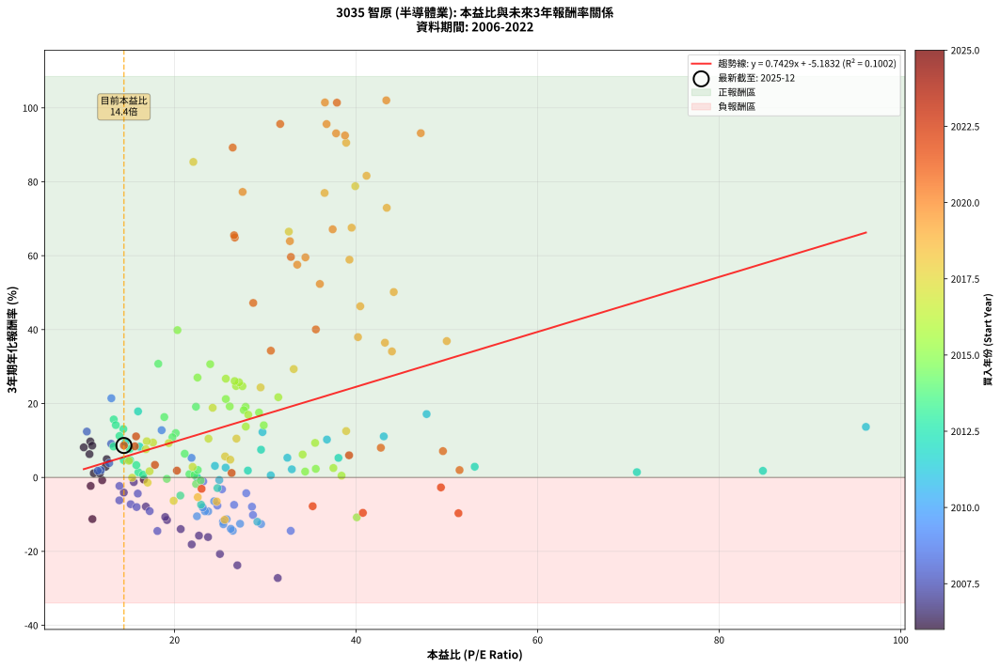

# 3035 智原 - 本益比與未來報酬率分析

!!! info "報告資訊"
    - **股票代號**: 3035
    - **公司名稱**: 智原
    - **產業別**: 半導體業
    - **分析期間**: 2006-2022 (204 個數據點)
    - **資料來源**: Type 12 (ShowMonthlyK_ChartFlow) 月收盤價與本益比
    - **報酬率口徑**: 含現金股利 (簡化: 年度合計，假設每年7/1入帳)
    - **報告生成時間**: 2026-01-05 00:51:31 CST

## 📈 視覺化圖表

### 圖表1: 本益比 vs 未來報酬率關係

*圖表1：3035 智原 本益比與3年期未來報酬率關係 (2006-2022)*

### 圖表2: 歷年買入時點的3年期實際報酬率

*圖表2：3035 智原 歷年買入時點的3年期實際報酬率 (2006-2022)*

## 📍 買點訊號說明

本報告提供兩種買點提示訊號（顯示於圖表2的股價子圖中）：

### ▲ 小綠色三角形（回測驗證）
- **計算方式**: 使用全部歷史資料計算本益比第25百分位數
- **用途**: 事後驗證，顯示歷史上哪些時點確實為低估區
- **限制**: 當下無法判斷，僅供回測參考
- **特性**: 後見之明（Look-Ahead Bias）

### ▲ 小橘色三角形（即時訊號）
- **計算方式**: 使用截至當月的過去5年資料計算本益比第25百分位數
- **用途**: 實際投資決策，當時即可判斷
- **優勢**: 可操作性強，符合實務需求
- **特性**: 無後見之明，滾動窗口計算

!!! tip "如何使用兩種訊號"
    - **綠色▲** 幫助理解歷史估值機會，驗證策略有效性
    - **橘色▲** 可作為實際買進參考，但仍需搭配基本面分析
    - 兩種訊號重疊時，表示即時判斷與事後驗證一致，信心度較高
    - 僅有綠色▲時，表示當時無法判斷（需要未來資料才能確認）
    - 僅有橘色▲時，表示即時判斷為買點，但事後可能不是最佳時機

## 📊 估值分析摘要

| 指標 | 數值 |
|:---:|:---:|
| **目前本益比** (2022-12) | **14.42 倍** |
| **歷史平均本益比** | 26.79 倍 |
| **估值水準** | 🟢 相對低估 |
| **預期3年年化報酬率** | **+5.53%** |
| **歷史平均報酬率** | +14.72% |
| **相關係數 (R²)** | 0.1002 |
| **趨勢線斜率** | 0.7429 |

!!! abstract "核心洞察"
    目前本益比顯著低於歷史平均，預期未來報酬率可能較高

    根據歷史數據回測，3035 智原 在目前本益比 **14.4倍** 的估值水準下，
    預期未來3年年化報酬率約為 **+5.5%**。

    **重要提醒**: 本分析基於歷史數據統計，實際報酬率會受到公司基本面變化、產業趨勢、
    總體經濟環境等多重因素影響。R² = 0.10 表示本益比可解釋約 10.0% 的報酬率變異。

## 📈 歷史估值統計

### 最佳買點 (最高報酬率)

| 項目 | 數值 |
|:---:|:---:|
| 起始時間 | 2020-11 |
| 當時本益比 | 43.33 倍 |
| 起始價格 | 48.0 元 |
| 3年後價格 | 385.5 元 |
| **3年年化報酬率** | **+102.03%** |

### 最差買點 (最低報酬率)

| 項目 | 數值 |
|:---:|:---:|
| 起始時間 | 2007-07 |
| 當時本益比 | 31.37 倍 |
| 起始價格 | 154.0 元 |
| 3年後價格 | 52.4 元 |
| **3年年化報酬率** | **-27.21%** |

## 🎯 投資啟示

### 本益比與報酬率關係

趨勢線方程式: **y = 0.7429x + -5.1832**

!!! info "弱相關或正相關"
    本益比與未來報酬率相關性較弱。這可能表示該股票的報酬率更多受到
    公司成長性、產業趨勢等因素影響，而非估值水準。**需綜合考量多項指標**。

### 估值區間建議

基於歷史數據分析:

- **🟢 低估區** (P/E < 21.4): 預期報酬率較高，可考慮增加持股
- **🟡 合理區** (P/E 21.4-32.2): 預期報酬率符合長期趨勢，正常持有
- **🔴 高估區** (P/E > 32.2): 預期報酬率較低，可考慮減碼或觀望

!!! danger "風險提示"
    - 過去表現不代表未來結果
    - 本分析假設公司基本面無重大結構性變化
    - 產業環境劇變可能使歷史規律失效
    - 應結合公司財報、產業趨勢、總體經濟等多重因素綜合判斷

!!! success "長期投資觀點"
    歷史數據顯示，在合理或低估的估值水準買入並長期持有，
    往往能獲得較佳的投資報酬。**耐心等待好價格**是價值投資的核心原則。

## 📊 數據品質

- **資料來源**: GoodInfo.tw Type 12 (ShowMonthlyK_ChartFlow)
- **資料頻率**: 月度收盤價與本益比
- **回測期間**: 2006-2022
- **數據點數量**: 204 個 (每個點代表一次3年期回測)

### 計算方法說明

1. **3年期年化報酬率**:
   - 對每個歷史時點，計算其後3年的實際投資報酬率
   - 期末價值(不含股利): 期末價格
   - 期末價值(含現金股利): 期末價格 + 持有期間內的現金股利合計 (簡化: 年度合計，假設每年7/1入帳)
   - 公式: 年化報酬率 = [(期末價值/期初價格)^(1/年數) - 1] × 100%

2. **本益比 (P/E Ratio)**:
   - 使用當時的月收盤價與EPS計算
   - 資料來源: Type 12 月度河流圖本益比數據

3. **趨勢線 (Linear Regression)**:
   - 使用最小平方法擬合線性趨勢線
   - R²值衡量本益比對報酬率的解釋能力

---

*本報告由 Stock Analysis System v1.9.0 自動生成*
*數據更新時間: 2026-01-05 00:51:31 CST*

## 📋 月度回測明細表

（每一列對應時間線圖中的一個買入點；可用來對照 SVG 圖上的每個點。）

| 買入月份 | 賣出月份 | 回測期限_年 | 實際持有年數 | 買入本益比_倍 | 買入收盤價_元 | 賣出收盤價_元 | 現金股利合計_元 | 總報酬率_pct | 年化報酬率_pct |
| --- | --- | --- | --- | --- | --- | --- | --- | --- | --- |
| 2006-01 | 2009-01 | 3 | 3.001 | 10.95 | 51.90 | 26.20 | 10.06 | -30.13 | -11.26 |
| 2006-02 | 2009-02 | 3 | 3.001 | 10.76 | 51.00 | 37.50 | 10.06 | -6.74 | -2.30 |
| 2006-03 | 2009-03 | 3 | 3.001 | 11.10 | 52.60 | 44.35 | 10.06 | +3.45 | +1.14 |
| 2006-04 | 2009-04 | 3 | 3.001 | 12.03 | 57.00 | 45.65 | 10.06 | -2.26 | -0.76 |
| 2006-05 | 2009-05 | 3 | 3.001 | 12.53 | 59.40 | 58.60 | 10.06 | +15.59 | +4.95 |
| 2006-06 | 2009-06 | 3 | 3.001 | 11.77 | 55.80 | 47.60 | 10.06 | +3.34 | +1.10 |
| 2006-07 | 2009-07 | 3 | 3.001 | 10.72 | 50.80 | 58.90 | 8.26 | +32.20 | +9.75 |
| 2006-08 | 2009-08 | 3 | 3.001 | 10.63 | 50.40 | 52.30 | 8.26 | +20.15 | +6.31 |
| 2006-09 | 2009-09 | 3 | 3.001 | 10.93 | 51.80 | 58.10 | 8.26 | +28.10 | +8.60 |
| 2006-10 | 2009-10 | 3 | 3.001 | 10.00 | 47.40 | 51.70 | 8.26 | +26.49 | +8.15 |
| 2006-11 | 2009-11 | 3 | 3.001 | 12.41 | 58.80 | 55.80 | 8.26 | +8.94 | +2.89 |
| 2006-12 | 2009-12 | 3 | 3.001 | 16.62 | 78.80 | 69.20 | 8.26 | -1.70 | -0.57 |
| 2007-01 | 2010-01 | 3 | 3.001 | 15.51 | 73.90 | 62.90 | 8.26 | -3.71 | -1.25 |
| 2007-02 | 2010-02 | 3 | 3.001 | 19.17 | 91.80 | 55.30 | 8.26 | -30.77 | -11.53 |
| 2007-03 | 2010-03 | 3 | 3.001 | 23.69 | 114.00 | 59.00 | 8.26 | -41.00 | -16.13 |
| 2007-04 | 2010-04 | 3 | 3.001 | 20.68 | 100.00 | 55.40 | 8.26 | -36.34 | -13.97 |
| 2007-05 | 2010-05 | 3 | 3.001 | 25.00 | 121.50 | 52.30 | 8.26 | -50.16 | -20.71 |
| 2007-06 | 2010-06 | 3 | 3.001 | 26.92 | 131.50 | 50.00 | 8.26 | -55.70 | -23.76 |
| 2007-07 | 2010-07 | 3 | 3.001 | 31.37 | 154.00 | 52.40 | 6.98 | -61.44 | -27.21 |
| 2007-08 | 2010-08 | 3 | 3.001 | 21.89 | 108.00 | 52.30 | 6.98 | -45.11 | -18.12 |
| 2007-09 | 2010-09 | 3 | 3.001 | 22.69 | 112.50 | 60.30 | 6.98 | -40.19 | -15.74 |
| 2007-10 | 2010-10 | 3 | 3.001 | 18.97 | 94.50 | 60.30 | 6.98 | -28.80 | -10.70 |
| 2007-11 | 2010-11 | 3 | 3.001 | 16.84 | 84.30 | 58.90 | 6.98 | -21.85 | -7.89 |
| 2007-12 | 2010-12 | 3 | 3.001 | 14.41 | 72.50 | 57.00 | 6.98 | -11.75 | -4.08 |
| 2008-01 | 2011-01 | 3 | 3.001 | 10.34 | 49.40 | 63.20 | 6.98 | +42.07 | +12.41 |
| 2008-02 | 2011-03 | 3 | 3.080 | 13.92 | 63.00 | 44.75 | 6.98 | -17.88 | -6.20 |
| 2008-03 | 2011-03 | 3 | 2.998 | 15.17 | 64.80 | 44.75 | 6.98 | -20.17 | -7.24 |
| 2008-04 | 2011-04 | 3 | 2.998 | 15.82 | 63.60 | 42.55 | 6.98 | -22.12 | -8.00 |
| 2008-05 | 2011-05 | 3 | 2.998 | 15.95 | 60.10 | 45.60 | 6.98 | -12.51 | -4.36 |
| 2008-06 | 2011-06 | 3 | 2.998 | 12.80 | 45.00 | 43.45 | 6.98 | +12.07 | +3.88 |
| 2008-07 | 2011-07 | 3 | 2.998 | 17.26 | 56.30 | 37.30 | 4.99 | -24.89 | -9.11 |
| 2008-08 | 2011-08 | 3 | 2.998 | 18.11 | 54.50 | 29.10 | 4.99 | -37.46 | -14.49 |
| 2008-09 | 2011-09 | 3 | 2.998 | 11.89 | 32.80 | 29.80 | 4.99 | +6.06 | +1.98 |
| 2008-10 | 2011-10 | 3 | 2.998 | 13.93 | 34.90 | 27.55 | 4.99 | -6.77 | -2.31 |
| 2008-11 | 2011-11 | 3 | 2.998 | 11.54 | 26.00 | 22.45 | 4.99 | +5.53 | +1.81 |
| 2008-12 | 2011-12 | 3 | 2.998 | 13.02 | 26.05 | 28.85 | 4.99 | +29.89 | +9.12 |
| 2009-01 | 2012-01 | 3 | 2.998 | 13.04 | 26.20 | 41.90 | 4.99 | +78.96 | +21.42 |
| 2009-02 | 2012-02 | 3 | 2.998 | 18.58 | 37.50 | 48.80 | 4.99 | +43.43 | +12.78 |
| 2009-03 | 2012-03 | 3 | 3.001 | 21.87 | 44.35 | 46.80 | 4.99 | +16.77 | +5.30 |
| 2009-04 | 2012-04 | 3 | 3.001 | 22.41 | 45.65 | 40.95 | 4.99 | +0.63 | +0.21 |
| 2009-05 | 2012-05 | 3 | 3.001 | 28.64 | 58.60 | 37.50 | 4.99 | -27.50 | -10.16 |
| 2009-06 | 2012-06 | 3 | 3.001 | 23.16 | 47.60 | 41.10 | 4.99 | -3.18 | -1.07 |
| 2009-07 | 2012-07 | 3 | 3.001 | 28.53 | 58.90 | 41.00 | 4.99 | -21.92 | -7.91 |
| 2009-08 | 2012-08 | 3 | 3.001 | 25.23 | 52.30 | 42.45 | 4.99 | -9.29 | -3.20 |
| 2009-09 | 2012-09 | 3 | 3.001 | 27.90 | 58.10 | 46.00 | 4.99 | -12.24 | -4.26 |
| 2009-10 | 2012-10 | 3 | 3.001 | 24.72 | 51.70 | 35.80 | 4.99 | -21.10 | -7.59 |
| 2009-11 | 2012-11 | 3 | 3.001 | 26.56 | 55.80 | 39.30 | 4.99 | -20.63 | -7.41 |
| 2009-12 | 2012-12 | 3 | 3.001 | 32.80 | 69.20 | 38.35 | 4.99 | -37.37 | -14.44 |
| 2010-01 | 2013-01 | 3 | 3.001 | 29.54 | 62.90 | 37.00 | 4.99 | -33.24 | -12.60 |
| 2010-02 | 2013-02 | 3 | 3.001 | 25.74 | 55.30 | 33.60 | 4.99 | -30.22 | -11.30 |
| 2010-03 | 2013-03 | 3 | 3.001 | 27.22 | 59.00 | 34.50 | 4.99 | -33.07 | -12.52 |
| 2010-04 | 2013-04 | 3 | 3.001 | 25.34 | 55.40 | 32.80 | 4.99 | -31.79 | -11.97 |
| 2010-05 | 2013-05 | 3 | 3.001 | 23.71 | 52.30 | 34.20 | 4.99 | -25.07 | -9.17 |
| 2010-06 | 2013-06 | 3 | 3.001 | 22.47 | 50.00 | 30.85 | 4.99 | -28.32 | -10.50 |
| 2010-07 | 2013-07 | 3 | 3.001 | 23.35 | 52.40 | 34.30 | 4.99 | -25.02 | -9.15 |
| 2010-08 | 2013-08 | 3 | 3.001 | 23.11 | 52.30 | 35.60 | 4.99 | -22.39 | -8.10 |
| 2010-09 | 2013-09 | 3 | 3.001 | 26.42 | 60.30 | 32.80 | 4.99 | -37.33 | -14.42 |
| 2010-10 | 2013-10 | 3 | 3.001 | 26.20 | 60.30 | 33.50 | 4.99 | -36.17 | -13.89 |
| 2010-11 | 2013-11 | 3 | 3.001 | 25.38 | 58.90 | 34.25 | 4.99 | -33.38 | -12.66 |
| 2010-12 | 2013-12 | 3 | 3.001 | 24.36 | 57.00 | 41.70 | 4.99 | -18.09 | -6.43 |
| 2011-01 | 2014-01 | 3 | 3.001 | 29.12 | 63.20 | 38.10 | 4.99 | -31.82 | -11.98 |
| 2011-02 | 2014-02 | 3 | 3.001 | 24.93 | 49.85 | 43.80 | 4.99 | -2.12 | -0.71 |
| 2011-03 | 2014-03 | 3 | 3.001 | 24.45 | 44.75 | 44.10 | 4.99 | +9.70 | +3.13 |
| 2011-04 | 2014-04 | 3 | 3.001 | 25.63 | 42.55 | 41.05 | 4.99 | +8.20 | +2.66 |
| 2011-05 | 2014-05 | 3 | 3.001 | 30.60 | 45.60 | 41.40 | 4.99 | +1.73 | +0.57 |
| 2011-06 | 2014-06 | 3 | 3.001 | 32.92 | 43.45 | 41.40 | 4.99 | +6.77 | +2.21 |
| 2011-07 | 2014-07 | 3 | 3.001 | 32.43 | 37.30 | 38.10 | 5.49 | +16.87 | +5.33 |
| 2011-08 | 2014-08 | 3 | 3.001 | 29.69 | 29.10 | 35.70 | 5.49 | +41.55 | +12.28 |
| 2011-09 | 2014-09 | 3 | 3.001 | 36.79 | 29.80 | 34.45 | 5.49 | +34.03 | +10.25 |
| 2011-10 | 2014-10 | 3 | 3.001 | 43.05 | 27.55 | 32.30 | 5.49 | +37.18 | +11.11 |
| 2011-11 | 2014-11 | 3 | 3.001 | 47.77 | 22.45 | 30.60 | 5.49 | +60.77 | +17.14 |
| 2011-12 | 2014-12 | 3 | 3.001 | 96.17 | 28.85 | 36.90 | 5.49 | +46.94 | +13.68 |
| 2012-01 | 2015-01 | 3 | 3.001 | 84.82 | 41.90 | 38.70 | 5.49 | +5.47 | +1.79 |
| 2012-02 | 2015-03 | 3 | 3.080 | 70.94 | 48.80 | 45.50 | 5.49 | +4.49 | +1.44 |
| 2012-03 | 2015-03 | 3 | 2.998 | 53.07 | 46.80 | 45.50 | 5.49 | +8.96 | +2.90 |
| 2012-04 | 2015-04 | 3 | 2.998 | 38.06 | 40.95 | 42.30 | 5.49 | +16.71 | +5.29 |
| 2012-05 | 2015-05 | 3 | 2.998 | 29.53 | 37.50 | 41.10 | 5.49 | +24.25 | +7.51 |
| 2012-06 | 2015-06 | 3 | 2.998 | 28.08 | 41.10 | 37.95 | 5.49 | +5.70 | +1.87 |
| 2012-07 | 2015-07 | 3 | 2.998 | 24.73 | 41.00 | 32.05 | 5.51 | -8.38 | -2.88 |
| 2012-08 | 2015-08 | 3 | 2.998 | 22.92 | 42.45 | 28.25 | 5.51 | -20.46 | -7.35 |
| 2012-09 | 2015-09 | 3 | 2.998 | 22.49 | 46.00 | 40.50 | 5.51 | +0.03 | +0.01 |
| 2012-10 | 2015-10 | 3 | 2.998 | 15.98 | 35.80 | 53.10 | 5.51 | +63.72 | +17.87 |
| 2012-11 | 2015-11 | 3 | 2.998 | 16.15 | 39.30 | 44.45 | 5.51 | +27.13 | +8.34 |
| 2012-12 | 2015-12 | 3 | 2.998 | 14.59 | 38.35 | 44.80 | 5.51 | +31.19 | +9.48 |
| 2013-01 | 2016-01 | 3 | 2.998 | 14.36 | 37.00 | 48.00 | 5.51 | +44.63 | +13.10 |
| 2013-02 | 2016-02 | 3 | 2.998 | 13.30 | 33.60 | 46.50 | 5.51 | +54.80 | +15.69 |
| 2013-03 | 2016-03 | 3 | 3.001 | 13.94 | 34.50 | 41.95 | 5.51 | +37.57 | +11.22 |
| 2013-04 | 2016-04 | 3 | 3.001 | 13.53 | 32.80 | 43.30 | 5.51 | +48.82 | +14.17 |
| 2013-05 | 2016-05 | 3 | 3.001 | 14.40 | 34.20 | 33.70 | 5.51 | +14.66 | +4.66 |
| 2013-06 | 2016-06 | 3 | 3.001 | 13.28 | 30.85 | 33.75 | 5.51 | +27.27 | +8.37 |
| 2013-07 | 2016-07 | 3 | 3.001 | 15.09 | 34.30 | 37.40 | 5.51 | +25.11 | +7.75 |
| 2013-08 | 2016-08 | 3 | 3.001 | 16.02 | 35.60 | 31.60 | 5.51 | +4.25 | +1.40 |
| 2013-09 | 2016-09 | 3 | 3.001 | 15.10 | 32.80 | 32.15 | 5.51 | +14.83 | +4.72 |
| 2013-10 | 2016-10 | 3 | 3.001 | 15.79 | 33.50 | 31.45 | 5.51 | +10.34 | +3.33 |
| 2013-11 | 2016-11 | 3 | 3.001 | 16.54 | 34.25 | 29.50 | 5.51 | +2.23 | +0.74 |
| 2013-12 | 2016-12 | 3 | 3.001 | 20.64 | 41.70 | 30.35 | 5.51 | -14.00 | -4.90 |
| 2014-01 | 2017-01 | 3 | 3.001 | 19.15 | 38.10 | 32.15 | 5.51 | -1.14 | -0.38 |
| 2014-02 | 2017-02 | 3 | 3.001 | 22.37 | 43.80 | 36.00 | 5.51 | -5.22 | -1.77 |
| 2014-03 | 2017-03 | 3 | 3.001 | 22.88 | 44.10 | 37.50 | 5.51 | -2.46 | -0.83 |
| 2014-04 | 2017-04 | 3 | 3.001 | 21.64 | 41.05 | 36.65 | 5.51 | +2.71 | +0.90 |
| 2014-05 | 2017-05 | 3 | 3.001 | 22.19 | 41.40 | 36.70 | 5.51 | +1.97 | +0.65 |
| 2014-06 | 2017-06 | 3 | 3.001 | 22.56 | 41.40 | 38.45 | 5.51 | +6.19 | +2.02 |
| 2014-07 | 2017-07 | 3 | 3.001 | 21.12 | 38.10 | 41.40 | 4.52 | +20.52 | +6.42 |
| 2014-08 | 2017-08 | 3 | 3.001 | 20.13 | 35.70 | 45.65 | 4.52 | +40.53 | +12.01 |
| 2014-09 | 2017-09 | 3 | 3.001 | 19.77 | 34.45 | 42.45 | 4.52 | +36.34 | +10.88 |
| 2014-10 | 2017-10 | 3 | 3.001 | 18.87 | 32.30 | 46.35 | 4.52 | +57.49 | +16.34 |
| 2014-11 | 2017-11 | 3 | 3.001 | 18.21 | 30.60 | 63.90 | 4.52 | +123.59 | +30.75 |
| 2014-12 | 2017-12 | 3 | 3.001 | 22.36 | 36.90 | 57.90 | 4.52 | +69.15 | +19.15 |
| 2015-01 | 2018-01 | 3 | 3.001 | 23.93 | 38.70 | 81.80 | 4.52 | +123.04 | +30.65 |
| 2015-02 | 2018-02 | 3 | 3.001 | 25.65 | 40.65 | 67.90 | 4.52 | +78.15 | +21.22 |
| 2015-03 | 2018-03 | 3 | 3.001 | 29.31 | 45.50 | 69.40 | 4.52 | +62.46 | +17.55 |
| 2015-04 | 2018-04 | 3 | 3.001 | 27.83 | 42.30 | 67.00 | 4.52 | +69.07 | +19.13 |
| 2015-05 | 2018-05 | 3 | 3.001 | 27.63 | 41.10 | 63.40 | 4.52 | +65.25 | +18.22 |
| 2015-06 | 2018-06 | 3 | 3.001 | 26.08 | 37.95 | 59.80 | 4.52 | +69.48 | +19.22 |
| 2015-07 | 2018-07 | 3 | 3.001 | 22.53 | 32.05 | 60.00 | 5.70 | +104.99 | +27.02 |
| 2015-08 | 2018-08 | 3 | 3.001 | 20.32 | 28.25 | 71.60 | 5.70 | +173.63 | +39.86 |
| 2015-09 | 2018-09 | 3 | 3.001 | 29.83 | 40.50 | 54.50 | 5.70 | +48.64 | +14.12 |
| 2015-10 | 2018-10 | 3 | 3.001 | 40.08 | 53.10 | 32.00 | 5.70 | -29.00 | -10.79 |
| 2015-11 | 2018-11 | 3 | 3.001 | 34.39 | 44.45 | 40.90 | 5.70 | +4.84 | +1.59 |
| 2015-12 | 2018-12 | 3 | 3.001 | 35.56 | 44.80 | 42.30 | 5.70 | +7.14 | +2.33 |
| 2016-01 | 2019-01 | 3 | 3.001 | 38.40 | 48.00 | 43.00 | 5.70 | +1.46 | +0.48 |
| 2016-02 | 2019-03 | 3 | 3.080 | 37.50 | 46.50 | 44.55 | 5.70 | +8.06 | +2.55 |
| 2016-03 | 2019-03 | 3 | 2.998 | 34.11 | 41.95 | 44.55 | 5.70 | +19.79 | +6.21 |
| 2016-04 | 2019-04 | 3 | 2.998 | 35.49 | 43.30 | 50.90 | 5.70 | +30.72 | +9.35 |
| 2016-05 | 2019-05 | 3 | 2.998 | 27.85 | 33.70 | 43.90 | 5.70 | +47.18 | +13.76 |
| 2016-06 | 2019-06 | 3 | 2.998 | 28.12 | 33.75 | 48.30 | 5.70 | +60.00 | +16.97 |
| 2016-07 | 2019-07 | 3 | 2.998 | 31.43 | 37.40 | 62.90 | 4.50 | +80.21 | +21.71 |
| 2016-08 | 2019-08 | 3 | 2.998 | 26.78 | 31.60 | 56.80 | 4.50 | +93.99 | +24.74 |
| 2016-09 | 2019-09 | 3 | 2.998 | 27.48 | 32.15 | 57.80 | 4.50 | +93.78 | +24.69 |
| 2016-10 | 2019-10 | 3 | 2.998 | 27.11 | 31.45 | 58.00 | 4.50 | +98.73 | +25.74 |
| 2016-11 | 2019-11 | 3 | 2.998 | 25.65 | 29.50 | 55.50 | 4.50 | +103.39 | +26.72 |
| 2016-12 | 2019-12 | 3 | 2.998 | 26.62 | 30.35 | 56.30 | 4.50 | +100.33 | +26.08 |
| 2017-01 | 2020-01 | 3 | 2.998 | 24.20 | 32.15 | 49.45 | 4.50 | +67.81 | +18.85 |
| 2017-02 | 2020-02 | 3 | 2.998 | 23.74 | 36.00 | 44.05 | 4.50 | +34.86 | +10.49 |
| 2017-03 | 2020-03 | 3 | 3.001 | 21.99 | 37.50 | 36.30 | 4.50 | +8.80 | +2.85 |
| 2017-04 | 2020-04 | 3 | 3.001 | 19.36 | 36.65 | 43.35 | 4.50 | +30.56 | +9.29 |
| 2017-05 | 2020-05 | 3 | 3.001 | 17.63 | 36.70 | 43.60 | 4.50 | +31.06 | +9.43 |
| 2017-06 | 2020-06 | 3 | 3.001 | 16.94 | 38.45 | 46.40 | 4.50 | +32.38 | +9.80 |
| 2017-07 | 2020-07 | 3 | 3.001 | 16.84 | 41.40 | 47.05 | 4.60 | +24.76 | +7.65 |
| 2017-08 | 2020-08 | 3 | 3.001 | 17.25 | 45.65 | 43.40 | 4.60 | +5.15 | +1.69 |
| 2017-09 | 2020-09 | 3 | 3.001 | 14.97 | 42.45 | 43.85 | 4.60 | +14.13 | +4.50 |
| 2017-10 | 2020-10 | 3 | 3.001 | 15.33 | 46.35 | 41.65 | 4.60 | -0.22 | -0.07 |
| 2017-11 | 2020-11 | 3 | 3.001 | 19.90 | 63.90 | 47.95 | 4.60 | -17.76 | -6.31 |
| 2017-12 | 2020-12 | 3 | 3.001 | 17.03 | 57.90 | 50.90 | 4.60 | -4.15 | -1.40 |
| 2018-01 | 2021-01 | 3 | 3.001 | 25.52 | 81.80 | 52.20 | 4.60 | -30.56 | -11.45 |
| 2018-02 | 2021-02 | 3 | 3.001 | 22.56 | 67.90 | 53.00 | 4.60 | -15.17 | -5.33 |
| 2018-03 | 2021-03 | 3 | 3.001 | 24.65 | 69.40 | 52.10 | 4.60 | -18.30 | -6.51 |
| 2018-04 | 2021-04 | 3 | 3.001 | 25.57 | 67.00 | 74.50 | 4.60 | +18.06 | +5.69 |
| 2018-05 | 2021-05 | 3 | 3.001 | 26.14 | 63.40 | 68.40 | 4.60 | +15.14 | +4.81 |
| 2018-06 | 2021-06 | 3 | 3.001 | 26.82 | 59.80 | 76.10 | 4.60 | +34.95 | +10.50 |
| 2018-07 | 2021-07 | 3 | 3.001 | 29.48 | 60.00 | 112.50 | 2.90 | +92.33 | +24.36 |
| 2018-08 | 2021-08 | 3 | 3.001 | 38.91 | 71.60 | 99.20 | 2.90 | +42.60 | +12.55 |
| 2018-09 | 2021-09 | 3 | 3.001 | 33.13 | 54.50 | 115.00 | 2.90 | +116.33 | +29.32 |
| 2018-10 | 2021-10 | 3 | 3.001 | 22.07 | 32.00 | 201.00 | 2.90 | +537.19 | +85.37 |
| 2018-11 | 2021-11 | 3 | 3.001 | 32.59 | 40.90 | 186.00 | 2.90 | +361.86 | +66.51 |
| 2018-12 | 2021-12 | 3 | 3.001 | 39.91 | 42.30 | 239.00 | 2.90 | +471.87 | +78.80 |
| 2019-01 | 2022-01 | 3 | 3.001 | 39.51 | 43.00 | 199.50 | 2.90 | +370.70 | +67.57 |
| 2019-02 | 2022-02 | 3 | 3.001 | 41.15 | 45.95 | 272.50 | 2.90 | +499.35 | +81.62 |
| 2019-03 | 2022-03 | 3 | 3.001 | 38.91 | 44.55 | 305.50 | 2.90 | +592.26 | +90.56 |
| 2019-04 | 2022-04 | 3 | 3.001 | 43.38 | 50.90 | 260.50 | 2.90 | +417.49 | +72.95 |
| 2019-05 | 2022-05 | 3 | 3.001 | 36.53 | 43.90 | 240.50 | 2.90 | +454.44 | +76.97 |
| 2019-06 | 2022-06 | 3 | 3.001 | 39.27 | 48.30 | 191.00 | 2.90 | +301.45 | +58.91 |
| 2019-07 | 2022-07 | 3 | 3.001 | 49.99 | 62.90 | 156.00 | 5.40 | +156.60 | +36.89 |
| 2019-08 | 2022-08 | 3 | 3.001 | 44.15 | 56.80 | 187.00 | 5.40 | +238.73 | +50.17 |
| 2019-09 | 2022-09 | 3 | 3.001 | 43.95 | 57.80 | 134.00 | 5.40 | +141.18 | +34.10 |
| 2019-10 | 2022-10 | 3 | 3.001 | 43.18 | 58.00 | 142.00 | 5.40 | +154.14 | +36.46 |
| 2019-11 | 2022-11 | 3 | 3.001 | 40.46 | 55.50 | 168.50 | 5.40 | +213.33 | +46.32 |
| 2019-12 | 2022-12 | 3 | 3.001 | 40.21 | 56.30 | 142.50 | 5.40 | +162.70 | +37.97 |
| 2020-01 | 2023-01 | 3 | 3.001 | 36.01 | 49.45 | 169.50 | 5.40 | +253.69 | +52.35 |
| 2020-02 | 2023-03 | 3 | 3.080 | 32.71 | 44.05 | 196.50 | 5.40 | +358.34 | +63.93 |
| 2020-03 | 2023-03 | 3 | 2.998 | 27.50 | 36.30 | 196.50 | 5.40 | +456.20 | +77.25 |
| 2020-04 | 2023-04 | 3 | 2.998 | 33.52 | 43.35 | 164.00 | 5.40 | +290.77 | +57.56 |
| 2020-05 | 2023-05 | 3 | 2.998 | 34.42 | 43.60 | 171.50 | 5.40 | +305.73 | +59.55 |
| 2020-06 | 2023-06 | 3 | 2.998 | 37.42 | 46.40 | 211.00 | 5.40 | +366.38 | +67.13 |
| 2020-07 | 2023-07 | 3 | 2.998 | 38.78 | 47.05 | 326.00 | 9.30 | +612.65 | +92.52 |
| 2020-08 | 2023-08 | 3 | 2.998 | 36.57 | 43.40 | 345.00 | 9.30 | +716.36 | +101.45 |
| 2020-09 | 2023-09 | 3 | 2.998 | 37.80 | 43.85 | 306.00 | 9.30 | +619.04 | +93.10 |
| 2020-10 | 2023-10 | 3 | 2.998 | 36.75 | 41.65 | 302.00 | 9.30 | +647.42 | +95.61 |
| 2020-11 | 2023-11 | 3 | 2.998 | 43.33 | 47.95 | 385.50 | 9.30 | +723.36 | +102.03 |
| 2020-12 | 2023-12 | 3 | 2.998 | 47.13 | 50.90 | 357.00 | 9.30 | +619.65 | +93.15 |
| 2021-01 | 2024-01 | 3 | 2.998 | 37.89 | 52.20 | 416.50 | 9.30 | +715.71 | +101.40 |
| 2021-02 | 2024-02 | 3 | 2.998 | 31.64 | 53.00 | 387.00 | 9.30 | +647.74 | +95.64 |
| 2021-03 | 2024-03 | 3 | 3.001 | 26.41 | 52.10 | 344.00 | 9.30 | +578.12 | +89.25 |
| 2021-04 | 2024-04 | 3 | 3.001 | 32.82 | 74.50 | 294.00 | 9.30 | +307.11 | +59.66 |
| 2021-05 | 2024-05 | 3 | 3.001 | 26.64 | 68.40 | 297.50 | 9.30 | +348.54 | +64.90 |
| 2021-06 | 2024-06 | 3 | 3.001 | 26.56 | 76.10 | 336.00 | 9.30 | +353.75 | +65.53 |
| 2021-07 | 2024-07 | 3 | 3.001 | 35.57 | 112.50 | 296.50 | 12.59 | +174.75 | +40.05 |
| 2021-08 | 2024-08 | 3 | 3.001 | 28.67 | 99.20 | 304.00 | 12.59 | +219.15 | +47.22 |
| 2021-09 | 2024-09 | 3 | 3.001 | 30.61 | 115.00 | 266.00 | 12.59 | +142.25 | +34.30 |
| 2021-10 | 2024-10 | 3 | 3.001 | 49.57 | 201.00 | 234.50 | 12.59 | +22.93 | +7.12 |
| 2021-11 | 2024-11 | 3 | 3.001 | 42.73 | 186.00 | 222.00 | 12.59 | +26.13 | +8.04 |
| 2021-12 | 2024-12 | 3 | 3.001 | 51.40 | 239.00 | 241.00 | 12.59 | +6.11 | +1.99 |
| 2022-01 | 2025-01 | 3 | 3.001 | 39.23 | 199.50 | 225.00 | 12.59 | +19.09 | +6.00 |
| 2022-02 | 2025-02 | 3 | 3.001 | 49.35 | 272.50 | 238.50 | 12.59 | -7.86 | -2.69 |
| 2022-03 | 2025-03 | 3 | 3.001 | 51.28 | 305.50 | 212.50 | 12.59 | -26.32 | -9.68 |
| 2022-04 | 2025-04 | 3 | 3.001 | 40.75 | 260.50 | 180.00 | 12.59 | -26.07 | -9.58 |
| 2022-05 | 2025-05 | 3 | 3.001 | 35.22 | 240.50 | 176.00 | 12.59 | -21.58 | -7.78 |
| 2022-06 | 2025-06 | 3 | 3.001 | 26.29 | 191.00 | 185.50 | 12.59 | +3.71 | +1.22 |
| 2022-07 | 2025-07 | 3 | 3.001 | 20.26 | 156.00 | 152.50 | 12.29 | +5.64 | +1.84 |
| 2022-08 | 2025-08 | 3 | 3.001 | 22.98 | 187.00 | 158.00 | 12.29 | -8.93 | -3.07 |
| 2022-09 | 2025-09 | 3 | 3.001 | 15.63 | 134.00 | 158.50 | 12.29 | +27.46 | +8.42 |
| 2022-10 | 2025-10 | 3 | 3.001 | 15.76 | 142.00 | 182.50 | 12.29 | +37.18 | +11.11 |
| 2022-11 | 2025-11 | 3 | 3.001 | 17.84 | 168.50 | 174.00 | 12.29 | +10.56 | +3.40 |
| 2022-12 | 2025-12 | 3 | 3.001 | 14.42 | 142.50 | 170.50 | 12.29 | +28.28 | +8.65 |
