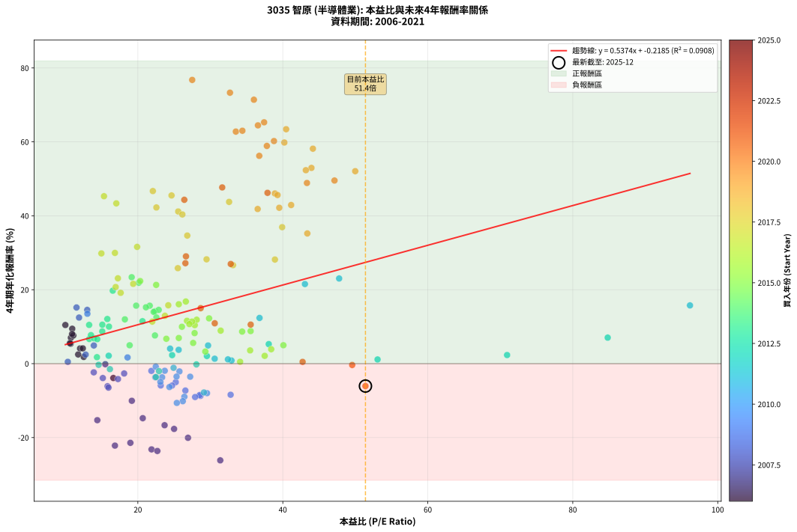

# 3035 智原 - 本益比與未來報酬率分析

!!! info "報告資訊"
    - **股票代號**: 3035
    - **公司名稱**: 智原
    - **產業別**: 半導體業
    - **分析期間**: 2006-2021 (192 個數據點)
    - **資料來源**: Type 12 (ShowMonthlyK_ChartFlow) 月收盤價與本益比
    - **報酬率口徑**: 含現金股利 (簡化: 年度合計，假設每年7/1入帳)
    - **報告生成時間**: 2026-01-06 00:53:43 CST

## 📈 視覺化圖表

### 圖表1: 本益比 vs 未來報酬率關係

*圖表1：3035 智原 本益比與4年期未來報酬率關係 (2006-2021)*

### 圖表2: 歷年買入時點的4年期實際報酬率

*圖表2：3035 智原 歷年買入時點的4年期實際報酬率 (2006-2021)*

## 📍 買點訊號說明

本報告提供兩種買點提示訊號（顯示於圖表2的股價子圖中）：

### ▲ 小綠色三角形（回測驗證）
- **計算方式**: 使用全部歷史資料計算本益比第25百分位數
- **用途**: 事後驗證，顯示歷史上哪些時點確實為低估區
- **限制**: 當下無法判斷，僅供回測參考
- **特性**: 後見之明（Look-Ahead Bias）

### ▲ 小橘色三角形（即時訊號）
- **計算方式**: 使用截至當月的過去5年資料計算本益比第25百分位數
- **用途**: 實際投資決策，當時即可判斷
- **優勢**: 可操作性強，符合實務需求
- **特性**: 無後見之明，滾動窗口計算

!!! tip "如何使用兩種訊號"
    - **綠色▲** 幫助理解歷史估值機會，驗證策略有效性
    - **橘色▲** 可作為實際買進參考，但仍需搭配基本面分析
    - 兩種訊號重疊時，表示即時判斷與事後驗證一致，信心度較高
    - 僅有綠色▲時，表示當時無法判斷（需要未來資料才能確認）
    - 僅有橘色▲時，表示即時判斷為買點，但事後可能不是最佳時機

## 📊 估值分析摘要

| 指標 | 數值 |
|:---:|:---:|
| **目前本益比** (2021-12) | **51.40 倍** |
| **歷史平均本益比** | 26.65 倍 |
| **估值水準** | 🔴 相對高估 |
| **預期4年年化報酬率** | **+27.40%** |
| **歷史平均報酬率** | +14.10% |
| **相關係數 (R²)** | 0.0908 |
| **趨勢線斜率** | 0.5374 |

!!! abstract "核心洞察"
    目前本益比顯著高於歷史平均，預期未來報酬率可能較低

    根據歷史數據回測，3035 智原 在目前本益比 **51.4倍** 的估值水準下，
    預期未來4年年化報酬率約為 **+27.4%**。

    **重要提醒**: 本分析基於歷史數據統計，實際報酬率會受到公司基本面變化、產業趨勢、
    總體經濟環境等多重因素影響。R² = 0.09 表示本益比可解釋約 9.1% 的報酬率變異。

## 📈 歷史估值統計

### 最佳買點 (最高報酬率)

| 項目 | 數值 |
|:---:|:---:|
| 起始時間 | 2020-03 |
| 當時本益比 | 27.50 倍 |
| 起始價格 | 36.3 元 |
| 4年後價格 | 344.0 元 |
| **4年年化報酬率** | **+76.77%** |

### 最差買點 (最低報酬率)

| 項目 | 數值 |
|:---:|:---:|
| 起始時間 | 2007-07 |
| 當時本益比 | 31.37 倍 |
| 起始價格 | 154.0 元 |
| 4年後價格 | 37.3 元 |
| **4年年化報酬率** | **-26.16%** |

## 🎯 投資啟示

### 本益比與報酬率關係

趨勢線方程式: **y = 0.5374x + -0.2185**

!!! info "弱相關或正相關"
    本益比與未來報酬率相關性較弱。這可能表示該股票的報酬率更多受到
    公司成長性、產業趨勢等因素影響，而非估值水準。**需綜合考量多項指標**。

### 估值區間建議

基於歷史數據分析:

- **🟢 低估區** (P/E < 21.3): 預期報酬率較高，可考慮增加持股
- **🟡 合理區** (P/E 21.3-32.0): 預期報酬率符合長期趨勢，正常持有
- **🔴 高估區** (P/E > 32.0): 預期報酬率較低，可考慮減碼或觀望

!!! danger "風險提示"
    - 過去表現不代表未來結果
    - 本分析假設公司基本面無重大結構性變化
    - 產業環境劇變可能使歷史規律失效
    - 應結合公司財報、產業趨勢、總體經濟等多重因素綜合判斷

!!! success "長期投資觀點"
    歷史數據顯示，在合理或低估的估值水準買入並長期持有，
    往往能獲得較佳的投資報酬。**耐心等待好價格**是價值投資的核心原則。

## 📊 數據品質

- **資料來源**: GoodInfo.tw Type 12 (ShowMonthlyK_ChartFlow)
- **資料頻率**: 月度收盤價與本益比
- **回測期間**: 2006-2021
- **數據點數量**: 192 個 (每個點代表一次4年期回測)

### 計算方法說明

1. **4年期年化報酬率**:
   - 對每個歷史時點，計算其後4年的實際投資報酬率
   - 期末價值(不含股利): 期末價格
   - 期末價值(含現金股利): 期末價格 + 持有期間內的現金股利合計 (簡化: 年度合計，假設每年7/1入帳)
   - 公式: 年化報酬率 = [(期末價值/期初價格)^(1/年數) - 1] × 100%

2. **本益比 (P/E Ratio)**:
   - 使用當時的月收盤價與EPS計算
   - 資料來源: Type 12 月度河流圖本益比數據

3. **趨勢線 (Linear Regression)**:
   - 使用最小平方法擬合線性趨勢線
   - R²值衡量本益比對報酬率的解釋能力

---

*本報告由 Stock Analysis System v1.9.0 自動生成*
*數據更新時間: 2026-01-06 00:53:43 CST*

## 📋 月度回測明細表

（每一列對應時間線圖中的一個買入點；可用來對照 SVG 圖上的每個點。）

| 買入月份 | 賣出月份 | 回測期限_年 | 實際持有年數 | 買入本益比_倍 | 買入收盤價_元 | 賣出收盤價_元 | 現金股利合計_元 | 總報酬率_pct | 年化報酬率_pct |
| --- | --- | --- | --- | --- | --- | --- | --- | --- | --- |
| 2006-01 | 2010-01 | 4 | 4.000 | 10.95 | 51.90 | 62.90 | 11.56 | +43.46 | +9.44 |
| 2006-02 | 2010-02 | 4 | 4.000 | 10.76 | 51.00 | 55.30 | 11.56 | +31.09 | +7.00 |
| 2006-03 | 2010-03 | 4 | 4.000 | 11.10 | 52.60 | 59.00 | 11.56 | +34.14 | +7.62 |
| 2006-04 | 2010-04 | 4 | 4.000 | 12.03 | 57.00 | 55.40 | 11.56 | +17.47 | +4.11 |
| 2006-05 | 2010-05 | 4 | 4.000 | 12.53 | 59.40 | 52.30 | 11.56 | +7.50 | +1.83 |
| 2006-06 | 2010-06 | 4 | 4.000 | 11.77 | 55.80 | 50.00 | 11.56 | +10.32 | +2.49 |
| 2006-07 | 2010-07 | 4 | 4.000 | 10.72 | 50.80 | 52.40 | 10.25 | +23.34 | +5.38 |
| 2006-08 | 2010-08 | 4 | 4.000 | 10.63 | 50.40 | 52.30 | 10.25 | +24.12 | +5.55 |
| 2006-09 | 2010-09 | 4 | 4.000 | 10.93 | 51.80 | 60.30 | 10.25 | +36.21 | +8.03 |
| 2006-10 | 2010-10 | 4 | 4.000 | 10.00 | 47.40 | 60.30 | 10.25 | +48.85 | +10.46 |
| 2006-11 | 2010-11 | 4 | 4.000 | 12.41 | 58.80 | 58.90 | 10.25 | +17.61 | +4.14 |
| 2006-12 | 2010-12 | 4 | 4.000 | 16.62 | 78.80 | 57.00 | 10.25 | -14.65 | -3.88 |
| 2007-01 | 2011-01 | 4 | 4.000 | 15.51 | 73.90 | 63.20 | 10.25 | -0.60 | -0.15 |
| 2007-02 | 2011-02 | 4 | 4.000 | 19.17 | 91.80 | 49.85 | 10.25 | -34.53 | -10.05 |
| 2007-03 | 2011-03 | 4 | 4.000 | 23.69 | 114.00 | 44.75 | 10.25 | -51.75 | -16.66 |
| 2007-04 | 2011-04 | 4 | 4.000 | 20.68 | 100.00 | 42.55 | 10.25 | -47.20 | -14.76 |
| 2007-05 | 2011-05 | 4 | 4.000 | 25.00 | 121.50 | 45.60 | 10.25 | -54.03 | -17.66 |
| 2007-06 | 2011-06 | 4 | 4.000 | 26.92 | 131.50 | 43.45 | 10.25 | -59.16 | -20.06 |
| 2007-07 | 2011-07 | 4 | 4.000 | 31.37 | 154.00 | 37.30 | 8.48 | -70.27 | -26.16 |
| 2007-08 | 2011-08 | 4 | 4.000 | 21.89 | 108.00 | 29.10 | 8.48 | -65.21 | -23.20 |
| 2007-09 | 2011-09 | 4 | 4.000 | 22.69 | 112.50 | 29.80 | 8.48 | -65.98 | -23.63 |
| 2007-10 | 2011-10 | 4 | 4.000 | 18.97 | 94.50 | 27.55 | 8.48 | -61.88 | -21.42 |
| 2007-11 | 2011-11 | 4 | 4.000 | 16.84 | 84.30 | 22.45 | 8.48 | -63.31 | -22.17 |
| 2007-12 | 2011-12 | 4 | 4.000 | 14.41 | 72.50 | 28.85 | 8.48 | -48.51 | -15.29 |
| 2008-01 | 2012-01 | 4 | 4.000 | 10.34 | 49.40 | 41.90 | 8.48 | +1.98 | +0.49 |
| 2008-02 | 2012-02 | 4 | 4.000 | 13.92 | 63.00 | 48.80 | 8.48 | -9.08 | -2.35 |
| 2008-03 | 2012-03 | 4 | 4.000 | 15.17 | 64.80 | 46.80 | 8.48 | -14.69 | -3.90 |
| 2008-04 | 2012-04 | 4 | 4.000 | 15.82 | 63.60 | 40.95 | 8.48 | -22.28 | -6.11 |
| 2008-05 | 2012-05 | 4 | 4.000 | 15.95 | 60.10 | 37.50 | 8.48 | -23.50 | -6.48 |
| 2008-06 | 2012-06 | 4 | 4.000 | 12.80 | 45.00 | 41.10 | 8.48 | +10.17 | +2.45 |
| 2008-07 | 2012-07 | 4 | 4.000 | 17.26 | 56.30 | 41.00 | 6.48 | -15.66 | -4.17 |
| 2008-08 | 2012-08 | 4 | 4.000 | 18.11 | 54.50 | 42.45 | 6.48 | -10.21 | -2.66 |
| 2008-09 | 2012-09 | 4 | 4.000 | 11.89 | 32.80 | 46.00 | 6.48 | +60.01 | +12.47 |
| 2008-10 | 2012-10 | 4 | 4.000 | 13.93 | 34.90 | 35.80 | 6.48 | +21.16 | +4.92 |
| 2008-11 | 2012-11 | 4 | 4.000 | 11.54 | 26.00 | 39.30 | 6.48 | +76.09 | +15.20 |
| 2008-12 | 2012-12 | 4 | 4.000 | 13.02 | 26.05 | 38.35 | 6.48 | +72.11 | +14.54 |
| 2009-01 | 2013-01 | 4 | 4.000 | 13.04 | 26.20 | 37.00 | 6.48 | +65.97 | +13.50 |
| 2009-02 | 2013-02 | 4 | 4.000 | 18.58 | 37.50 | 33.60 | 6.48 | +6.89 | +1.68 |
| 2009-03 | 2013-03 | 4 | 4.000 | 21.87 | 44.35 | 34.50 | 6.48 | -7.59 | -1.95 |
| 2009-04 | 2013-04 | 4 | 4.000 | 22.41 | 45.65 | 32.80 | 6.48 | -13.95 | -3.69 |
| 2009-05 | 2013-05 | 4 | 4.000 | 28.64 | 58.60 | 34.20 | 6.48 | -30.57 | -8.72 |
| 2009-06 | 2013-06 | 4 | 4.000 | 23.16 | 47.60 | 30.85 | 6.48 | -21.57 | -5.89 |
| 2009-07 | 2013-07 | 4 | 4.000 | 28.53 | 58.90 | 34.30 | 6.99 | -29.90 | -8.50 |
| 2009-08 | 2013-08 | 4 | 4.000 | 25.23 | 52.30 | 35.60 | 6.99 | -18.57 | -5.01 |
| 2009-09 | 2013-09 | 4 | 4.000 | 27.90 | 58.10 | 32.80 | 6.99 | -31.52 | -9.03 |
| 2009-10 | 2013-10 | 4 | 4.000 | 24.72 | 51.70 | 33.50 | 6.99 | -21.68 | -5.93 |
| 2009-11 | 2013-11 | 4 | 4.000 | 26.56 | 55.80 | 34.25 | 6.99 | -26.09 | -7.28 |
| 2009-12 | 2013-12 | 4 | 4.000 | 32.80 | 69.20 | 41.70 | 6.99 | -29.64 | -8.41 |
| 2010-01 | 2014-01 | 4 | 4.000 | 29.54 | 62.90 | 38.10 | 6.99 | -28.32 | -7.99 |
| 2010-02 | 2014-02 | 4 | 4.000 | 25.74 | 55.30 | 43.80 | 6.99 | -8.16 | -2.10 |
| 2010-03 | 2014-03 | 4 | 4.000 | 27.22 | 59.00 | 44.10 | 6.99 | -13.41 | -3.54 |
| 2010-04 | 2014-04 | 4 | 4.000 | 25.34 | 55.40 | 41.05 | 6.99 | -13.29 | -3.50 |
| 2010-05 | 2014-05 | 4 | 4.000 | 23.71 | 52.30 | 41.40 | 6.99 | -7.48 | -1.92 |
| 2010-06 | 2014-06 | 4 | 4.000 | 22.47 | 50.00 | 41.40 | 6.99 | -3.22 | -0.82 |
| 2010-07 | 2014-07 | 4 | 4.000 | 23.35 | 52.40 | 38.10 | 6.99 | -13.96 | -3.69 |
| 2010-08 | 2014-08 | 4 | 4.000 | 23.11 | 52.30 | 35.70 | 6.99 | -18.38 | -4.95 |
| 2010-09 | 2014-09 | 4 | 4.000 | 26.42 | 60.30 | 34.45 | 6.99 | -31.28 | -8.95 |
| 2010-10 | 2014-10 | 4 | 4.000 | 26.20 | 60.30 | 32.30 | 6.99 | -34.85 | -10.16 |
| 2010-11 | 2014-11 | 4 | 4.000 | 25.38 | 58.90 | 30.60 | 6.99 | -36.19 | -10.62 |
| 2010-12 | 2014-12 | 4 | 4.000 | 24.36 | 57.00 | 36.90 | 6.99 | -23.01 | -6.33 |
| 2011-01 | 2015-01 | 4 | 4.000 | 29.12 | 63.20 | 38.70 | 6.99 | -27.71 | -7.79 |
| 2011-02 | 2015-02 | 4 | 4.000 | 24.93 | 49.85 | 40.65 | 6.99 | -4.44 | -1.13 |
| 2011-03 | 2015-03 | 4 | 4.000 | 24.45 | 44.75 | 45.50 | 6.99 | +17.29 | +4.07 |
| 2011-04 | 2015-04 | 4 | 4.000 | 25.63 | 42.55 | 42.30 | 6.99 | +15.83 | +3.74 |
| 2011-05 | 2015-05 | 4 | 4.000 | 30.60 | 45.60 | 41.10 | 6.99 | +5.45 | +1.34 |
| 2011-06 | 2015-06 | 4 | 4.000 | 32.92 | 43.45 | 37.95 | 6.99 | +3.42 | +0.84 |
| 2011-07 | 2015-07 | 4 | 4.000 | 32.43 | 37.30 | 32.05 | 7.01 | +4.72 | +1.16 |
| 2011-08 | 2015-08 | 4 | 4.000 | 29.69 | 29.10 | 28.25 | 7.01 | +21.17 | +4.92 |
| 2011-09 | 2015-09 | 4 | 4.000 | 36.79 | 29.80 | 40.50 | 7.01 | +59.43 | +12.37 |
| 2011-10 | 2015-10 | 4 | 4.000 | 43.05 | 27.55 | 53.10 | 7.01 | +118.19 | +21.54 |
| 2011-11 | 2015-11 | 4 | 4.000 | 47.77 | 22.45 | 44.45 | 7.01 | +129.22 | +23.04 |
| 2011-12 | 2015-12 | 4 | 4.000 | 96.17 | 28.85 | 44.80 | 7.01 | +79.58 | +15.76 |
| 2012-01 | 2016-01 | 4 | 4.000 | 84.82 | 41.90 | 48.00 | 7.01 | +31.29 | +7.04 |
| 2012-02 | 2016-02 | 4 | 4.000 | 70.94 | 48.80 | 46.50 | 7.01 | +9.65 | +2.33 |
| 2012-03 | 2016-03 | 4 | 4.000 | 53.07 | 46.80 | 41.95 | 7.01 | +4.62 | +1.13 |
| 2012-04 | 2016-04 | 4 | 4.000 | 38.06 | 40.95 | 43.30 | 7.01 | +22.86 | +5.28 |
| 2012-05 | 2016-05 | 4 | 4.000 | 29.53 | 37.50 | 33.70 | 7.01 | +8.56 | +2.07 |
| 2012-06 | 2016-06 | 4 | 4.000 | 28.08 | 41.10 | 33.75 | 7.01 | -0.83 | -0.21 |
| 2012-07 | 2016-07 | 4 | 4.000 | 24.73 | 41.00 | 37.40 | 7.51 | +9.54 | +2.31 |
| 2012-08 | 2016-08 | 4 | 4.000 | 22.92 | 42.45 | 31.60 | 7.51 | -7.86 | -2.03 |
| 2012-09 | 2016-09 | 4 | 4.000 | 22.49 | 46.00 | 32.15 | 7.51 | -13.78 | -3.64 |
| 2012-10 | 2016-10 | 4 | 4.000 | 15.98 | 35.80 | 31.45 | 7.51 | +8.84 | +2.14 |
| 2012-11 | 2016-11 | 4 | 4.000 | 16.15 | 39.30 | 29.50 | 7.51 | -5.82 | -1.49 |
| 2012-12 | 2016-12 | 4 | 4.000 | 14.59 | 38.35 | 30.35 | 7.51 | -1.27 | -0.32 |
| 2013-01 | 2017-01 | 4 | 4.000 | 14.36 | 37.00 | 32.15 | 7.51 | +7.20 | +1.75 |
| 2013-02 | 2017-02 | 4 | 4.000 | 13.30 | 33.60 | 36.00 | 7.51 | +29.50 | +6.68 |
| 2013-03 | 2017-03 | 4 | 4.000 | 13.94 | 34.50 | 37.50 | 7.51 | +30.47 | +6.88 |
| 2013-04 | 2017-04 | 4 | 4.000 | 13.53 | 32.80 | 36.65 | 7.51 | +34.64 | +7.72 |
| 2013-05 | 2017-05 | 4 | 4.000 | 14.40 | 34.20 | 36.70 | 7.51 | +29.28 | +6.63 |
| 2013-06 | 2017-06 | 4 | 4.000 | 13.28 | 30.85 | 38.45 | 7.51 | +48.99 | +10.48 |
| 2013-07 | 2017-07 | 4 | 4.000 | 15.09 | 34.30 | 41.40 | 6.51 | +39.69 | +8.72 |
| 2013-08 | 2017-08 | 4 | 4.000 | 16.02 | 35.60 | 45.65 | 6.51 | +46.53 | +10.02 |
| 2013-09 | 2017-09 | 4 | 4.000 | 15.10 | 32.80 | 42.45 | 6.51 | +49.28 | +10.54 |
| 2013-10 | 2017-10 | 4 | 4.000 | 15.79 | 33.50 | 46.35 | 6.51 | +57.80 | +12.08 |
| 2013-11 | 2017-11 | 4 | 4.000 | 16.54 | 34.25 | 63.90 | 6.51 | +105.59 | +19.74 |
| 2013-12 | 2017-12 | 4 | 4.000 | 20.64 | 41.70 | 57.90 | 6.51 | +54.47 | +11.48 |
| 2014-01 | 2018-01 | 4 | 4.000 | 19.15 | 38.10 | 81.80 | 6.51 | +131.80 | +23.39 |
| 2014-02 | 2018-02 | 4 | 4.000 | 22.37 | 43.80 | 67.90 | 6.51 | +69.89 | +14.17 |
| 2014-03 | 2018-03 | 4 | 4.000 | 22.88 | 44.10 | 69.40 | 6.51 | +72.14 | +14.54 |
| 2014-04 | 2018-04 | 4 | 4.000 | 21.64 | 41.05 | 67.00 | 6.51 | +79.08 | +15.68 |
| 2014-05 | 2018-05 | 4 | 4.000 | 22.19 | 41.40 | 63.40 | 6.51 | +68.87 | +14.00 |
| 2014-06 | 2018-06 | 4 | 4.000 | 22.56 | 41.40 | 59.80 | 6.51 | +60.18 | +12.50 |
| 2014-07 | 2018-07 | 4 | 4.000 | 21.12 | 38.10 | 60.00 | 7.22 | +76.43 | +15.25 |
| 2014-08 | 2018-08 | 4 | 4.000 | 20.13 | 35.70 | 71.60 | 7.22 | +120.78 | +21.90 |
| 2014-09 | 2018-09 | 4 | 4.000 | 19.77 | 34.45 | 54.50 | 7.22 | +79.15 | +15.69 |
| 2014-10 | 2018-10 | 4 | 4.000 | 18.87 | 32.30 | 32.00 | 7.22 | +21.42 | +4.97 |
| 2014-11 | 2018-11 | 4 | 4.000 | 18.21 | 30.60 | 40.90 | 7.22 | +57.25 | +11.98 |
| 2014-12 | 2018-12 | 4 | 4.000 | 22.36 | 36.90 | 42.30 | 7.22 | +34.20 | +7.63 |
| 2015-01 | 2019-01 | 4 | 4.000 | 23.93 | 38.70 | 43.00 | 7.22 | +29.76 | +6.73 |
| 2015-02 | 2019-02 | 4 | 4.000 | 25.65 | 40.65 | 45.95 | 7.22 | +30.79 | +6.94 |
| 2015-03 | 2019-03 | 4 | 4.000 | 29.31 | 45.50 | 44.55 | 7.22 | +13.78 | +3.28 |
| 2015-04 | 2019-04 | 4 | 4.000 | 27.83 | 42.30 | 50.90 | 7.22 | +37.39 | +8.27 |
| 2015-05 | 2019-05 | 4 | 4.000 | 27.63 | 41.10 | 43.90 | 7.22 | +24.37 | +5.60 |
| 2015-06 | 2019-06 | 4 | 4.000 | 26.08 | 37.95 | 48.30 | 7.22 | +46.29 | +9.98 |
| 2015-07 | 2019-07 | 4 | 4.000 | 22.53 | 32.05 | 62.90 | 6.50 | +116.54 | +21.31 |
| 2015-08 | 2019-08 | 4 | 4.000 | 20.32 | 28.25 | 56.80 | 6.50 | +124.07 | +22.35 |
| 2015-09 | 2019-09 | 4 | 4.000 | 29.83 | 40.50 | 57.80 | 6.50 | +58.77 | +12.25 |
| 2015-10 | 2019-10 | 4 | 4.000 | 40.08 | 53.10 | 58.00 | 6.50 | +21.47 | +4.98 |
| 2015-11 | 2019-11 | 4 | 4.000 | 34.39 | 44.45 | 55.50 | 6.50 | +39.48 | +8.68 |
| 2015-12 | 2019-12 | 4 | 4.000 | 35.56 | 44.80 | 56.30 | 6.50 | +40.18 | +8.81 |
| 2016-01 | 2020-01 | 4 | 4.000 | 38.40 | 48.00 | 49.45 | 6.50 | +16.56 | +3.91 |
| 2016-02 | 2020-02 | 4 | 4.000 | 37.50 | 46.50 | 44.05 | 6.50 | +8.71 | +2.11 |
| 2016-03 | 2020-03 | 4 | 4.000 | 34.11 | 41.95 | 36.30 | 6.50 | +2.03 | +0.50 |
| 2016-04 | 2020-04 | 4 | 4.000 | 35.49 | 43.30 | 43.35 | 6.50 | +15.13 | +3.58 |
| 2016-05 | 2020-05 | 4 | 4.000 | 27.85 | 33.70 | 43.60 | 6.50 | +48.66 | +10.42 |
| 2016-06 | 2020-06 | 4 | 4.000 | 28.12 | 33.75 | 46.40 | 6.50 | +56.74 | +11.89 |
| 2016-07 | 2020-07 | 4 | 4.000 | 31.43 | 37.40 | 47.05 | 5.60 | +40.78 | +8.93 |
| 2016-08 | 2020-08 | 4 | 4.000 | 26.78 | 31.60 | 43.40 | 5.60 | +55.06 | +11.59 |
| 2016-09 | 2020-09 | 4 | 4.000 | 27.48 | 32.15 | 43.85 | 5.60 | +53.81 | +11.36 |
| 2016-10 | 2020-10 | 4 | 4.000 | 27.11 | 31.45 | 41.65 | 5.60 | +50.24 | +10.71 |
| 2016-11 | 2020-11 | 4 | 4.000 | 25.65 | 29.50 | 47.95 | 5.60 | +81.53 | +16.07 |
| 2016-12 | 2020-12 | 4 | 4.000 | 26.62 | 30.35 | 50.90 | 5.60 | +86.16 | +16.81 |
| 2017-01 | 2021-01 | 4 | 4.000 | 24.20 | 32.15 | 52.20 | 5.60 | +79.78 | +15.79 |
| 2017-02 | 2021-02 | 4 | 4.000 | 23.74 | 36.00 | 53.00 | 5.60 | +62.78 | +12.95 |
| 2017-03 | 2021-03 | 4 | 4.000 | 21.99 | 37.50 | 52.10 | 5.60 | +53.87 | +11.37 |
| 2017-04 | 2021-04 | 4 | 4.000 | 19.36 | 36.65 | 74.50 | 5.60 | +118.55 | +21.59 |
| 2017-05 | 2021-05 | 4 | 4.000 | 17.63 | 36.70 | 68.40 | 5.60 | +101.63 | +19.16 |
| 2017-06 | 2021-06 | 4 | 4.000 | 16.94 | 38.45 | 76.10 | 5.60 | +112.48 | +20.73 |
| 2017-07 | 2021-07 | 4 | 4.000 | 16.84 | 41.40 | 112.50 | 5.60 | +185.27 | +29.96 |
| 2017-08 | 2021-08 | 4 | 4.000 | 17.25 | 45.65 | 99.20 | 5.60 | +129.57 | +23.09 |
| 2017-09 | 2021-09 | 4 | 4.000 | 14.97 | 42.45 | 115.00 | 5.60 | +184.10 | +29.83 |
| 2017-10 | 2021-10 | 4 | 4.000 | 15.33 | 46.35 | 201.00 | 5.60 | +345.74 | +45.30 |
| 2017-11 | 2021-11 | 4 | 4.000 | 19.90 | 63.90 | 186.00 | 5.60 | +199.84 | +31.59 |
| 2017-12 | 2021-12 | 4 | 4.000 | 17.03 | 57.90 | 239.00 | 5.60 | +322.45 | +43.37 |
| 2018-01 | 2022-01 | 4 | 4.000 | 25.52 | 81.80 | 199.50 | 5.60 | +150.73 | +25.84 |
| 2018-02 | 2022-02 | 4 | 4.000 | 22.56 | 67.90 | 272.50 | 5.60 | +309.57 | +42.26 |
| 2018-03 | 2022-03 | 4 | 4.000 | 24.65 | 69.40 | 305.50 | 5.60 | +348.27 | +45.51 |
| 2018-04 | 2022-04 | 4 | 4.000 | 25.57 | 67.00 | 260.50 | 5.60 | +297.16 | +41.17 |
| 2018-05 | 2022-05 | 4 | 4.000 | 26.14 | 63.40 | 240.50 | 5.60 | +288.17 | +40.36 |
| 2018-06 | 2022-06 | 4 | 4.000 | 26.82 | 59.80 | 191.00 | 5.60 | +228.76 | +34.65 |
| 2018-07 | 2022-07 | 4 | 4.000 | 29.48 | 60.00 | 156.00 | 6.20 | +170.33 | +28.23 |
| 2018-08 | 2022-08 | 4 | 4.000 | 38.91 | 71.60 | 187.00 | 6.20 | +169.83 | +28.17 |
| 2018-09 | 2022-09 | 4 | 4.000 | 33.13 | 54.50 | 134.00 | 6.20 | +157.25 | +26.64 |
| 2018-10 | 2022-10 | 4 | 4.000 | 22.07 | 32.00 | 142.00 | 6.20 | +363.12 | +46.70 |
| 2018-11 | 2022-11 | 4 | 4.000 | 32.59 | 40.90 | 168.50 | 6.20 | +327.14 | +43.76 |
| 2018-12 | 2022-12 | 4 | 4.000 | 39.91 | 42.30 | 142.50 | 6.20 | +251.54 | +36.93 |
| 2019-01 | 2023-01 | 4 | 4.000 | 39.51 | 43.00 | 169.50 | 6.20 | +308.60 | +42.18 |
| 2019-02 | 2023-02 | 4 | 4.000 | 41.15 | 45.95 | 185.50 | 6.20 | +317.19 | +42.92 |
| 2019-03 | 2023-03 | 4 | 4.000 | 38.91 | 44.55 | 196.50 | 6.20 | +354.99 | +46.05 |
| 2019-04 | 2023-04 | 4 | 4.000 | 43.38 | 50.90 | 164.00 | 6.20 | +234.38 | +35.23 |
| 2019-05 | 2023-05 | 4 | 4.000 | 36.53 | 43.90 | 171.50 | 6.20 | +304.78 | +41.84 |
| 2019-06 | 2023-06 | 4 | 4.000 | 39.27 | 48.30 | 211.00 | 6.20 | +349.69 | +45.62 |
| 2019-07 | 2023-07 | 4 | 4.000 | 49.99 | 62.90 | 326.00 | 10.40 | +434.82 | +52.07 |
| 2019-08 | 2023-08 | 4 | 4.000 | 44.15 | 56.80 | 345.00 | 10.40 | +525.70 | +58.16 |
| 2019-09 | 2023-09 | 4 | 4.000 | 43.95 | 57.80 | 306.00 | 10.40 | +447.40 | +52.96 |
| 2019-10 | 2023-10 | 4 | 4.000 | 43.18 | 58.00 | 302.00 | 10.40 | +438.62 | +52.34 |
| 2019-11 | 2023-11 | 4 | 4.000 | 40.46 | 55.50 | 385.50 | 10.40 | +613.33 | +63.43 |
| 2019-12 | 2023-12 | 4 | 4.000 | 40.21 | 56.30 | 357.00 | 10.40 | +552.58 | +59.83 |
| 2020-01 | 2024-01 | 4 | 4.000 | 36.01 | 49.45 | 416.50 | 10.40 | +763.30 | +71.41 |
| 2020-02 | 2024-02 | 4 | 4.000 | 32.71 | 44.05 | 387.00 | 10.40 | +802.16 | +73.31 |
| 2020-03 | 2024-03 | 4 | 4.000 | 27.50 | 36.30 | 344.00 | 10.40 | +876.31 | +76.77 |
| 2020-04 | 2024-04 | 4 | 4.000 | 33.52 | 43.35 | 294.00 | 10.40 | +602.19 | +62.78 |
| 2020-05 | 2024-05 | 4 | 4.000 | 34.42 | 43.60 | 297.50 | 10.40 | +606.19 | +63.02 |
| 2020-06 | 2024-06 | 4 | 4.000 | 37.42 | 46.40 | 336.00 | 10.40 | +646.55 | +65.30 |
| 2020-07 | 2024-07 | 4 | 4.000 | 38.78 | 47.05 | 296.50 | 13.59 | +559.07 | +60.23 |
| 2020-08 | 2024-08 | 4 | 4.000 | 36.57 | 43.40 | 304.00 | 13.59 | +631.78 | +64.47 |
| 2020-09 | 2024-09 | 4 | 4.000 | 37.80 | 43.85 | 266.00 | 13.59 | +537.61 | +58.91 |
| 2020-10 | 2024-10 | 4 | 4.000 | 36.75 | 41.65 | 234.50 | 13.59 | +495.66 | +56.22 |
| 2020-11 | 2024-11 | 4 | 4.000 | 43.33 | 47.95 | 222.00 | 13.59 | +391.33 | +48.88 |
| 2020-12 | 2024-12 | 4 | 4.000 | 47.13 | 50.90 | 241.00 | 13.59 | +400.18 | +49.55 |
| 2021-01 | 2025-01 | 4 | 4.000 | 37.89 | 52.20 | 225.00 | 13.59 | +357.07 | +46.22 |
| 2021-02 | 2025-02 | 4 | 4.000 | 31.64 | 53.00 | 238.50 | 13.59 | +375.65 | +47.68 |
| 2021-03 | 2025-03 | 4 | 4.000 | 26.41 | 52.10 | 212.50 | 13.59 | +333.96 | +44.33 |
| 2021-04 | 2025-04 | 4 | 4.000 | 32.82 | 74.50 | 180.00 | 13.59 | +159.86 | +26.96 |
| 2021-05 | 2025-05 | 4 | 4.000 | 26.64 | 68.40 | 176.00 | 13.59 | +177.18 | +29.03 |
| 2021-06 | 2025-06 | 4 | 4.000 | 26.56 | 76.10 | 185.50 | 13.59 | +161.62 | +27.18 |
| 2021-07 | 2025-07 | 4 | 4.000 | 35.57 | 112.50 | 152.50 | 15.59 | +49.42 | +10.56 |
| 2021-08 | 2025-08 | 4 | 4.000 | 28.67 | 99.20 | 158.00 | 15.59 | +74.99 | +15.02 |
| 2021-09 | 2025-09 | 4 | 4.000 | 30.61 | 115.00 | 158.50 | 15.59 | +51.39 | +10.92 |
| 2021-10 | 2025-10 | 4 | 4.000 | 49.57 | 201.00 | 182.50 | 15.59 | -1.45 | -0.36 |
| 2021-11 | 2025-11 | 4 | 4.000 | 42.73 | 186.00 | 174.00 | 15.59 | +1.93 | +0.48 |
| 2021-12 | 2025-12 | 4 | 4.000 | 51.40 | 239.00 | 170.50 | 15.59 | -22.14 | -6.06 |
