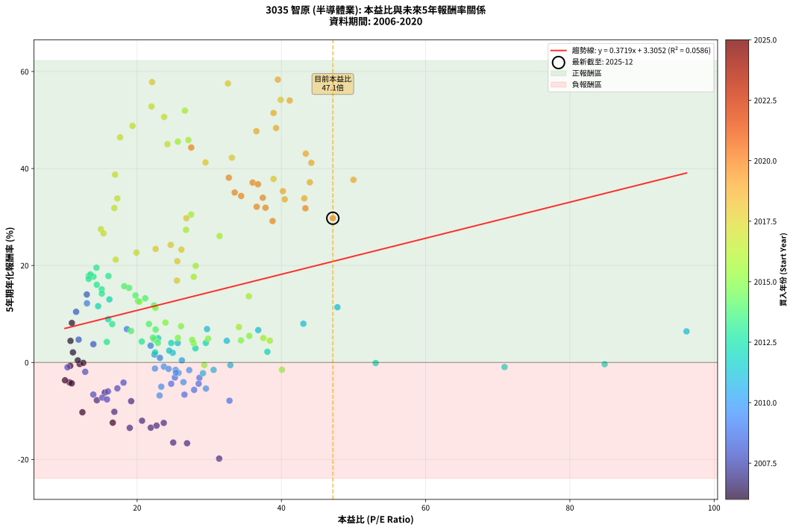
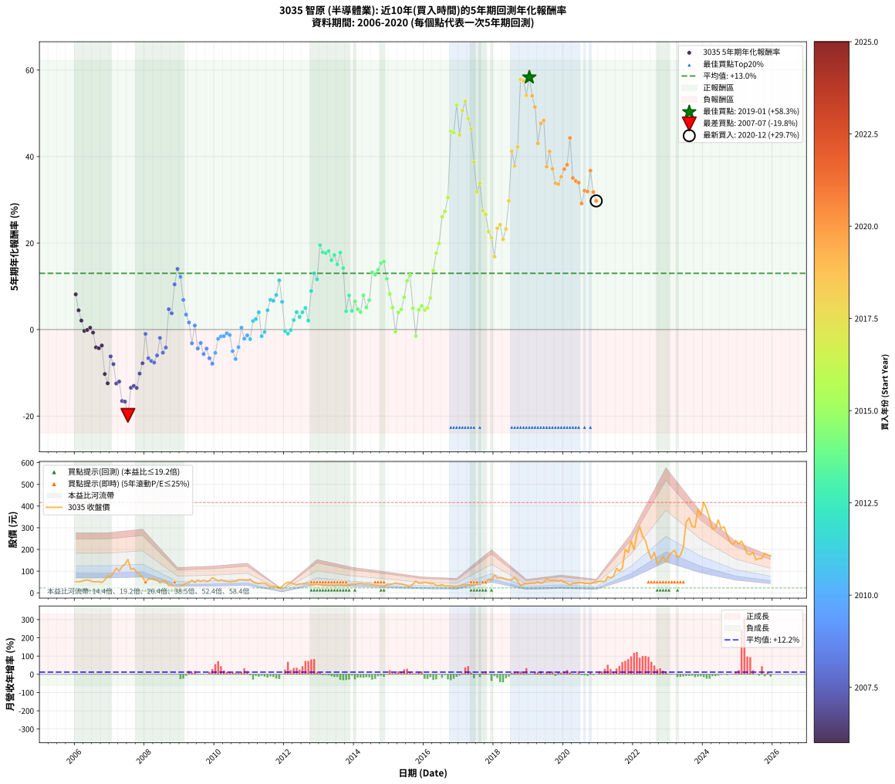

# 3035 智原 - 本益比與未來報酬率分析

!!! info "報告資訊"
    - **股票代號**: 3035
    - **公司名稱**: 智原
    - **產業別**: 半導體業
    - **分析期間**: 2006-2020 (180 個數據點)
    - **資料來源**: Type 12 (ShowMonthlyK_ChartFlow) 月收盤價與本益比
    - **報酬率口徑**: 含現金股利 (簡化: 年度合計，假設每年7/1入帳)
    - **報告生成時間**: 2026-01-06 22:52:06 CST

## 📈 視覺化圖表

### 圖表1: 本益比 vs 未來報酬率關係

*圖表1：3035 智原 本益比與5年期未來報酬率關係 (2006-2020)*

### 圖表2: 歷年買入時點的5年期實際報酬率

*圖表2：3035 智原 歷年買入時點的5年期實際報酬率 (2006-2020)*

## 📍 買點訊號說明

本報告提供兩種買點提示訊號（顯示於圖表2的股價子圖中）：

### ▲ 小綠色三角形（回測驗證）
- **計算方式**: 使用全部歷史資料計算本益比第25百分位數
- **用途**: 事後驗證，顯示歷史上哪些時點確實為低估區
- **限制**: 當下無法判斷，僅供回測參考
- **特性**: 後見之明（Look-Ahead Bias）

### ▲ 小橘色三角形（即時訊號）
- **計算方式**: 使用截至當月的過去5年資料計算本益比第25百分位數
- **用途**: 實際投資決策，當時即可判斷
- **優勢**: 可操作性強，符合實務需求
- **特性**: 無後見之明，滾動窗口計算

!!! tip "如何使用兩種訊號"
    - **綠色▲** 幫助理解歷史估值機會，驗證策略有效性
    - **橘色▲** 可作為實際買進參考，但仍需搭配基本面分析
    - 兩種訊號重疊時，表示即時判斷與事後驗證一致，信心度較高
    - 僅有綠色▲時，表示當時無法判斷（需要未來資料才能確認）
    - 僅有橘色▲時，表示即時判斷為買點，但事後可能不是最佳時機

## 📊 估值分析摘要

| 指標 | 數值 |
|:---:|:---:|
| **目前本益比** (2020-12) | **47.13 倍** |
| **歷史平均本益比** | 26.09 倍 |
| **估值水準** | 🔴 相對高估 |
| **預期5年年化報酬率** | **+20.83%** |
| **歷史平均報酬率** | +13.01% |
| **相關係數 (R²)** | 0.0586 |
| **趨勢線斜率** | 0.3719 |

!!! abstract "核心洞察"
    目前本益比顯著高於歷史平均，預期未來報酬率可能較低

    根據歷史數據回測，3035 智原 在目前本益比 **47.1倍** 的估值水準下，
    預期未來5年年化報酬率約為 **+20.8%**。

    **重要提醒**: 本分析基於歷史數據統計，實際報酬率會受到公司基本面變化、產業趨勢、
    總體經濟環境等多重因素影響。R² = 0.06 表示本益比可解釋約 5.9% 的報酬率變異。

## 📈 歷史估值統計

### 最佳買點 (最高報酬率)

| 項目 | 數值 |
|:---:|:---:|
| 起始時間 | 2019-01 |
| 當時本益比 | 39.51 倍 |
| 起始價格 | 43.0 元 |
| 5年後價格 | 416.5 元 |
| **5年年化報酬率** | **+58.33%** |

### 最差買點 (最低報酬率)

| 項目 | 數值 |
|:---:|:---:|
| 起始時間 | 2007-07 |
| 當時本益比 | 31.37 倍 |
| 起始價格 | 154.0 元 |
| 5年後價格 | 41.0 元 |
| **5年年化報酬率** | **-19.83%** |

## 🎯 投資啟示

### 本益比與報酬率關係

趨勢線方程式: **y = 0.3719x + 3.3052**

!!! info "弱相關或正相關"
    本益比與未來報酬率相關性較弱。這可能表示該股票的報酬率更多受到
    公司成長性、產業趨勢等因素影響，而非估值水準。**需綜合考量多項指標**。

### 估值區間建議

基於歷史數據分析:

- **🟢 低估區** (P/E < 20.9): 預期報酬率較高，可考慮增加持股
- **🟡 合理區** (P/E 20.9-31.3): 預期報酬率符合長期趨勢，正常持有
- **🔴 高估區** (P/E > 31.3): 預期報酬率較低，可考慮減碼或觀望

!!! danger "風險提示"
    - 過去表現不代表未來結果
    - 本分析假設公司基本面無重大結構性變化
    - 產業環境劇變可能使歷史規律失效
    - 應結合公司財報、產業趨勢、總體經濟等多重因素綜合判斷

!!! success "長期投資觀點"
    歷史數據顯示，在合理或低估的估值水準買入並長期持有，
    往往能獲得較佳的投資報酬。**耐心等待好價格**是價值投資的核心原則。

## 📊 數據品質

- **資料來源**: GoodInfo.tw Type 12 (ShowMonthlyK_ChartFlow)
- **資料頻率**: 月度收盤價與本益比
- **回測期間**: 2006-2020
- **數據點數量**: 180 個 (每個點代表一次5年期回測)

### 計算方法說明

1. **5年期年化報酬率**:
   - 對每個歷史時點，計算其後5年的實際投資報酬率
   - 期末價值(不含股利): 期末價格
   - 期末價值(含現金股利): 期末價格 + 持有期間內的現金股利合計 (簡化: 年度合計，假設每年7/1入帳)
   - 公式: 年化報酬率 = [(期末價值/期初價格)^(1/年數) - 1] × 100%

2. **本益比 (P/E Ratio)**:
   - 使用當時的月收盤價與EPS計算
   - 資料來源: Type 12 月度河流圖本益比數據

3. **趨勢線 (Linear Regression)**:
   - 使用最小平方法擬合線性趨勢線
   - R²值衡量本益比對報酬率的解釋能力

---

*本報告由 Stock Analysis System v1.9.0 自動生成*
*數據更新時間: 2026-01-06 22:52:06 CST*

## 📋 月度回測明細表

（每一列對應時間線圖中的一個買入點；可用來對照 SVG 圖上的每個點。）

| 買入月份 | 賣出月份 | 回測期限_年 | 實際持有年數 | 買入本益比_倍 | 買入收盤價_元 | 賣出收盤價_元 | 現金股利合計_元 | 總報酬率_pct | 年化報酬率_pct |
| --- | --- | --- | --- | --- | --- | --- | --- | --- | --- |
| 2006-01 | 2011-01 | 5 | 4.999 | 10.95 | 51.90 | 63.20 | 13.55 | +47.89 | +8.14 |
| 2006-02 | 2011-02 | 5 | 4.999 | 10.76 | 51.00 | 49.85 | 13.55 | +24.32 | +4.45 |
| 2006-03 | 2011-03 | 5 | 4.999 | 11.10 | 52.60 | 44.75 | 13.55 | +10.85 | +2.08 |
| 2006-04 | 2011-04 | 5 | 4.999 | 12.03 | 57.00 | 42.55 | 13.55 | -1.57 | -0.32 |
| 2006-05 | 2011-05 | 5 | 4.999 | 12.53 | 59.40 | 45.60 | 13.55 | -0.41 | -0.08 |
| 2006-06 | 2011-06 | 5 | 4.999 | 11.77 | 55.80 | 43.45 | 13.55 | +2.16 | +0.43 |
| 2006-07 | 2011-07 | 5 | 4.999 | 10.72 | 50.80 | 37.30 | 11.75 | -3.44 | -0.70 |
| 2006-08 | 2011-08 | 5 | 4.999 | 10.63 | 50.40 | 29.10 | 11.75 | -18.95 | -4.12 |
| 2006-09 | 2011-09 | 5 | 4.999 | 10.93 | 51.80 | 29.80 | 11.75 | -19.79 | -4.31 |
| 2006-10 | 2011-10 | 5 | 4.999 | 10.00 | 47.40 | 27.55 | 11.75 | -17.09 | -3.68 |
| 2006-11 | 2011-11 | 5 | 4.999 | 12.41 | 58.80 | 22.45 | 11.75 | -41.84 | -10.27 |
| 2006-12 | 2011-12 | 5 | 4.999 | 16.62 | 78.80 | 28.85 | 11.75 | -48.48 | -12.42 |
| 2007-01 | 2012-01 | 5 | 4.999 | 15.51 | 73.90 | 41.90 | 11.75 | -27.40 | -6.20 |
| 2007-02 | 2012-02 | 5 | 4.999 | 19.17 | 91.80 | 48.80 | 11.75 | -34.04 | -7.99 |
| 2007-03 | 2012-03 | 5 | 5.002 | 23.69 | 114.00 | 46.80 | 11.75 | -48.64 | -12.47 |
| 2007-04 | 2012-04 | 5 | 5.002 | 20.68 | 100.00 | 40.95 | 11.75 | -47.30 | -12.02 |
| 2007-05 | 2012-05 | 5 | 5.002 | 25.00 | 121.50 | 37.50 | 11.75 | -59.47 | -16.52 |
| 2007-06 | 2012-06 | 5 | 5.002 | 26.92 | 131.50 | 41.10 | 11.75 | -59.81 | -16.66 |
| 2007-07 | 2012-07 | 5 | 5.002 | 31.37 | 154.00 | 41.00 | 9.98 | -66.90 | -19.83 |
| 2007-08 | 2012-08 | 5 | 5.002 | 21.89 | 108.00 | 42.45 | 9.98 | -51.46 | -13.45 |
| 2007-09 | 2012-09 | 5 | 5.002 | 22.69 | 112.50 | 46.00 | 9.98 | -50.24 | -13.03 |
| 2007-10 | 2012-10 | 5 | 5.002 | 18.97 | 94.50 | 35.80 | 9.98 | -51.56 | -13.49 |
| 2007-11 | 2012-11 | 5 | 5.002 | 16.84 | 84.30 | 39.30 | 9.98 | -41.55 | -10.18 |
| 2007-12 | 2012-12 | 5 | 5.002 | 14.41 | 72.50 | 38.35 | 9.98 | -33.34 | -7.79 |
| 2008-01 | 2013-01 | 5 | 5.002 | 10.34 | 49.40 | 37.00 | 9.98 | -4.91 | -1.00 |
| 2008-02 | 2013-03 | 5 | 5.081 | 13.92 | 63.00 | 34.50 | 9.98 | -29.40 | -6.62 |
| 2008-03 | 2013-03 | 5 | 4.999 | 15.17 | 64.80 | 34.50 | 9.98 | -31.37 | -7.25 |
| 2008-04 | 2013-04 | 5 | 4.999 | 15.82 | 63.60 | 32.80 | 9.98 | -32.74 | -7.63 |
| 2008-05 | 2013-05 | 5 | 4.999 | 15.95 | 60.10 | 34.20 | 9.98 | -26.50 | -5.97 |
| 2008-06 | 2013-06 | 5 | 4.999 | 12.80 | 45.00 | 30.85 | 9.98 | -9.28 | -1.93 |
| 2008-07 | 2013-07 | 5 | 4.999 | 17.26 | 56.30 | 34.30 | 8.48 | -24.01 | -5.34 |
| 2008-08 | 2013-08 | 5 | 4.999 | 18.11 | 54.50 | 35.60 | 8.48 | -19.11 | -4.15 |
| 2008-09 | 2013-09 | 5 | 4.999 | 11.89 | 32.80 | 32.80 | 8.48 | +25.86 | +4.71 |
| 2008-10 | 2013-10 | 5 | 4.999 | 13.93 | 34.90 | 33.50 | 8.48 | +20.30 | +3.77 |
| 2008-11 | 2013-11 | 5 | 4.999 | 11.54 | 26.00 | 34.25 | 8.48 | +64.36 | +10.45 |
| 2008-12 | 2013-12 | 5 | 4.999 | 13.02 | 26.05 | 41.70 | 8.48 | +92.64 | +14.01 |
| 2009-01 | 2014-01 | 5 | 4.999 | 13.04 | 26.20 | 38.10 | 8.48 | +77.80 | +12.20 |
| 2009-02 | 2014-02 | 5 | 4.999 | 18.58 | 37.50 | 43.80 | 8.48 | +39.42 | +6.87 |
| 2009-03 | 2014-03 | 5 | 4.999 | 21.87 | 44.35 | 44.10 | 8.48 | +18.56 | +3.46 |
| 2009-04 | 2014-04 | 5 | 4.999 | 22.41 | 45.65 | 41.05 | 8.48 | +8.51 | +1.65 |
| 2009-05 | 2014-05 | 5 | 4.999 | 28.64 | 58.60 | 41.40 | 8.48 | -14.88 | -3.17 |
| 2009-06 | 2014-06 | 5 | 4.999 | 23.16 | 47.60 | 41.40 | 8.48 | +4.80 | +0.94 |
| 2009-07 | 2014-07 | 5 | 4.999 | 28.53 | 58.90 | 38.10 | 8.99 | -20.06 | -4.38 |
| 2009-08 | 2014-08 | 5 | 4.999 | 25.23 | 52.30 | 35.70 | 8.99 | -14.56 | -3.10 |
| 2009-09 | 2014-09 | 5 | 4.999 | 27.90 | 58.10 | 34.45 | 8.99 | -25.24 | -5.65 |
| 2009-10 | 2014-10 | 5 | 4.999 | 24.72 | 51.70 | 32.30 | 8.99 | -20.15 | -4.40 |
| 2009-11 | 2014-11 | 5 | 4.999 | 26.56 | 55.80 | 30.60 | 8.99 | -29.06 | -6.64 |
| 2009-12 | 2014-12 | 5 | 4.999 | 32.80 | 69.20 | 36.90 | 8.99 | -33.69 | -7.89 |
| 2010-01 | 2015-01 | 5 | 4.999 | 29.54 | 62.90 | 38.70 | 8.99 | -24.19 | -5.39 |
| 2010-02 | 2015-02 | 5 | 4.999 | 25.74 | 55.30 | 40.65 | 8.99 | -10.24 | -2.14 |
| 2010-03 | 2015-03 | 5 | 4.999 | 27.22 | 59.00 | 45.50 | 8.99 | -7.65 | -1.58 |
| 2010-04 | 2015-04 | 5 | 4.999 | 25.34 | 55.40 | 42.30 | 8.99 | -7.43 | -1.53 |
| 2010-05 | 2015-05 | 5 | 4.999 | 23.71 | 52.30 | 41.10 | 8.99 | -4.24 | -0.86 |
| 2010-06 | 2015-06 | 5 | 4.999 | 22.47 | 50.00 | 37.95 | 8.99 | -6.13 | -1.26 |
| 2010-07 | 2015-07 | 5 | 4.999 | 23.35 | 52.40 | 32.05 | 8.51 | -22.60 | -5.00 |
| 2010-08 | 2015-08 | 5 | 4.999 | 23.11 | 52.30 | 28.25 | 8.51 | -29.72 | -6.81 |
| 2010-09 | 2015-09 | 5 | 4.999 | 26.42 | 60.30 | 40.50 | 8.51 | -18.73 | -4.06 |
| 2010-10 | 2015-10 | 5 | 4.999 | 26.20 | 60.30 | 53.10 | 8.51 | +2.16 | +0.43 |
| 2010-11 | 2015-11 | 5 | 4.999 | 25.38 | 58.90 | 44.45 | 8.51 | -10.09 | -2.11 |
| 2010-12 | 2015-12 | 5 | 4.999 | 24.36 | 57.00 | 44.80 | 8.51 | -6.48 | -1.33 |
| 2011-01 | 2016-01 | 5 | 4.999 | 29.12 | 63.20 | 48.00 | 8.51 | -10.59 | -2.21 |
| 2011-02 | 2016-02 | 5 | 4.999 | 24.93 | 49.85 | 46.50 | 8.51 | +10.34 | +1.99 |
| 2011-03 | 2016-03 | 5 | 5.002 | 24.45 | 44.75 | 41.95 | 8.51 | +12.75 | +2.43 |
| 2011-04 | 2016-04 | 5 | 5.002 | 25.63 | 42.55 | 43.30 | 8.51 | +21.75 | +4.01 |
| 2011-05 | 2016-05 | 5 | 5.002 | 30.60 | 45.60 | 33.70 | 8.51 | -7.45 | -1.53 |
| 2011-06 | 2016-06 | 5 | 5.002 | 32.92 | 43.45 | 33.75 | 8.51 | -2.75 | -0.56 |
| 2011-07 | 2016-07 | 5 | 5.002 | 32.43 | 37.30 | 37.40 | 9.01 | +24.42 | +4.47 |
| 2011-08 | 2016-08 | 5 | 5.002 | 29.69 | 29.10 | 31.60 | 9.01 | +39.55 | +6.89 |
| 2011-09 | 2016-09 | 5 | 5.002 | 36.79 | 29.80 | 32.15 | 9.01 | +38.12 | +6.67 |
| 2011-10 | 2016-10 | 5 | 5.002 | 43.05 | 27.55 | 31.45 | 9.01 | +46.86 | +7.99 |
| 2011-11 | 2016-11 | 5 | 5.002 | 47.77 | 22.45 | 29.50 | 9.01 | +71.54 | +11.39 |
| 2011-12 | 2016-12 | 5 | 5.002 | 96.17 | 28.85 | 30.35 | 9.01 | +36.43 | +6.41 |
| 2012-01 | 2017-01 | 5 | 5.002 | 84.82 | 41.90 | 32.15 | 9.01 | -1.77 | -0.36 |
| 2012-02 | 2017-03 | 5 | 5.081 | 70.94 | 48.80 | 37.50 | 9.01 | -4.69 | -0.94 |
| 2012-03 | 2017-03 | 5 | 4.999 | 53.07 | 46.80 | 37.50 | 9.01 | -0.62 | -0.12 |
| 2012-04 | 2017-04 | 5 | 4.999 | 38.06 | 40.95 | 36.65 | 9.01 | +11.50 | +2.20 |
| 2012-05 | 2017-05 | 5 | 4.999 | 29.53 | 37.50 | 36.70 | 9.01 | +21.89 | +4.04 |
| 2012-06 | 2017-06 | 5 | 4.999 | 28.08 | 41.10 | 38.45 | 9.01 | +15.47 | +2.92 |
| 2012-07 | 2017-07 | 5 | 4.999 | 24.73 | 41.00 | 41.40 | 8.51 | +21.74 | +4.01 |
| 2012-08 | 2017-08 | 5 | 4.999 | 22.92 | 42.45 | 45.65 | 8.51 | +27.59 | +4.99 |
| 2012-09 | 2017-09 | 5 | 4.999 | 22.49 | 46.00 | 42.45 | 8.51 | +10.79 | +2.07 |
| 2012-10 | 2017-10 | 5 | 4.999 | 15.98 | 35.80 | 46.35 | 8.51 | +53.25 | +8.91 |
| 2012-11 | 2017-11 | 5 | 4.999 | 16.15 | 39.30 | 63.90 | 8.51 | +84.26 | +13.00 |
| 2012-12 | 2017-12 | 5 | 4.999 | 14.59 | 38.35 | 57.90 | 8.51 | +73.18 | +11.61 |
| 2013-01 | 2018-01 | 5 | 4.999 | 14.36 | 37.00 | 81.80 | 8.51 | +144.09 | +19.54 |
| 2013-02 | 2018-02 | 5 | 4.999 | 13.30 | 33.60 | 67.90 | 8.51 | +127.42 | +17.86 |
| 2013-03 | 2018-03 | 5 | 4.999 | 13.94 | 34.50 | 69.40 | 8.51 | +125.83 | +17.70 |
| 2013-04 | 2018-04 | 5 | 4.999 | 13.53 | 32.80 | 67.00 | 8.51 | +130.22 | +18.15 |
| 2013-05 | 2018-05 | 5 | 4.999 | 14.40 | 34.20 | 63.40 | 8.51 | +110.27 | +16.03 |
| 2013-06 | 2018-06 | 5 | 4.999 | 13.28 | 30.85 | 59.80 | 8.51 | +121.44 | +17.24 |
| 2013-07 | 2018-07 | 5 | 4.999 | 15.09 | 34.30 | 60.00 | 9.21 | +101.79 | +15.08 |
| 2013-08 | 2018-08 | 5 | 4.999 | 16.02 | 35.60 | 71.60 | 9.21 | +127.01 | +17.82 |
| 2013-09 | 2018-09 | 5 | 4.999 | 15.10 | 32.80 | 54.50 | 9.21 | +94.25 | +14.20 |
| 2013-10 | 2018-10 | 5 | 4.999 | 15.79 | 33.50 | 32.00 | 9.21 | +23.03 | +4.23 |
| 2013-11 | 2018-11 | 5 | 4.999 | 16.54 | 34.25 | 40.90 | 9.21 | +46.32 | +7.91 |
| 2013-12 | 2018-12 | 5 | 4.999 | 20.64 | 41.70 | 42.30 | 9.21 | +23.53 | +4.32 |
| 2014-01 | 2019-01 | 5 | 4.999 | 19.15 | 38.10 | 43.00 | 9.21 | +37.04 | +6.51 |
| 2014-02 | 2019-02 | 5 | 4.999 | 22.37 | 43.80 | 45.95 | 9.21 | +25.95 | +4.72 |
| 2014-03 | 2019-03 | 5 | 4.999 | 22.88 | 44.10 | 44.55 | 9.21 | +21.91 | +4.04 |
| 2014-04 | 2019-04 | 5 | 4.999 | 21.64 | 41.05 | 50.90 | 9.21 | +46.44 | +7.93 |
| 2014-05 | 2019-05 | 5 | 4.999 | 22.19 | 41.40 | 43.90 | 9.21 | +28.29 | +5.11 |
| 2014-06 | 2019-06 | 5 | 4.999 | 22.56 | 41.40 | 48.30 | 9.21 | +38.92 | +6.80 |
| 2014-07 | 2019-07 | 5 | 4.999 | 21.12 | 38.10 | 62.90 | 8.02 | +86.14 | +13.23 |
| 2014-08 | 2019-08 | 5 | 4.999 | 20.13 | 35.70 | 56.80 | 8.02 | +81.56 | +12.67 |
| 2014-09 | 2019-09 | 5 | 4.999 | 19.77 | 34.45 | 57.80 | 8.02 | +91.05 | +13.83 |
| 2014-10 | 2019-10 | 5 | 4.999 | 18.87 | 32.30 | 58.00 | 8.02 | +104.39 | +15.37 |
| 2014-11 | 2019-11 | 5 | 4.999 | 18.21 | 30.60 | 55.50 | 8.02 | +107.58 | +15.73 |
| 2014-12 | 2019-12 | 5 | 4.999 | 22.36 | 36.90 | 56.30 | 8.02 | +74.30 | +11.76 |
| 2015-01 | 2020-01 | 5 | 4.999 | 23.93 | 38.70 | 49.45 | 8.02 | +48.50 | +8.23 |
| 2015-02 | 2020-02 | 5 | 4.999 | 25.65 | 40.65 | 44.05 | 8.02 | +28.09 | +5.08 |
| 2015-03 | 2020-03 | 5 | 5.002 | 29.31 | 45.50 | 36.30 | 8.02 | -2.60 | -0.52 |
| 2015-04 | 2020-04 | 5 | 5.002 | 27.83 | 42.30 | 43.35 | 8.02 | +21.44 | +3.96 |
| 2015-05 | 2020-05 | 5 | 5.002 | 27.63 | 41.10 | 43.60 | 8.02 | +25.59 | +4.66 |
| 2015-06 | 2020-06 | 5 | 5.002 | 26.08 | 37.95 | 46.40 | 8.02 | +43.39 | +7.47 |
| 2015-07 | 2020-07 | 5 | 5.002 | 22.53 | 32.05 | 47.05 | 7.60 | +70.51 | +11.26 |
| 2015-08 | 2020-08 | 5 | 5.002 | 20.32 | 28.25 | 43.40 | 7.60 | +80.53 | +12.54 |
| 2015-09 | 2020-09 | 5 | 5.002 | 29.83 | 40.50 | 43.85 | 7.60 | +27.04 | +4.90 |
| 2015-10 | 2020-10 | 5 | 5.002 | 40.08 | 53.10 | 41.65 | 7.60 | -7.25 | -1.49 |
| 2015-11 | 2020-11 | 5 | 5.002 | 34.39 | 44.45 | 47.95 | 7.60 | +24.97 | +4.56 |
| 2015-12 | 2020-12 | 5 | 5.002 | 35.56 | 44.80 | 50.90 | 7.60 | +30.58 | +5.48 |
| 2016-01 | 2021-01 | 5 | 5.002 | 38.40 | 48.00 | 52.20 | 7.60 | +24.58 | +4.49 |
| 2016-02 | 2021-03 | 5 | 5.081 | 37.50 | 46.50 | 52.10 | 7.60 | +28.39 | +5.04 |
| 2016-03 | 2021-03 | 5 | 4.999 | 34.11 | 41.95 | 52.10 | 7.60 | +42.31 | +7.31 |
| 2016-04 | 2021-04 | 5 | 4.999 | 35.49 | 43.30 | 74.50 | 7.60 | +89.61 | +13.65 |
| 2016-05 | 2021-05 | 5 | 4.999 | 27.85 | 33.70 | 68.40 | 7.60 | +125.52 | +17.66 |
| 2016-06 | 2021-06 | 5 | 4.999 | 28.12 | 33.75 | 76.10 | 7.60 | +148.00 | +19.92 |
| 2016-07 | 2021-07 | 5 | 4.999 | 31.43 | 37.40 | 112.50 | 6.60 | +218.45 | +26.07 |
| 2016-08 | 2021-08 | 5 | 4.999 | 26.78 | 31.60 | 99.20 | 6.60 | +234.81 | +27.34 |
| 2016-09 | 2021-09 | 5 | 4.999 | 27.48 | 32.15 | 115.00 | 6.60 | +278.23 | +30.49 |
| 2016-10 | 2021-10 | 5 | 4.999 | 27.11 | 31.45 | 201.00 | 6.60 | +560.10 | +45.86 |
| 2016-11 | 2021-11 | 5 | 4.999 | 25.65 | 29.50 | 186.00 | 6.60 | +552.88 | +45.54 |
| 2016-12 | 2021-12 | 5 | 4.999 | 26.62 | 30.35 | 239.00 | 6.60 | +709.23 | +51.93 |
| 2017-01 | 2022-01 | 5 | 4.999 | 24.20 | 32.15 | 199.50 | 6.60 | +541.06 | +45.01 |
| 2017-02 | 2022-02 | 5 | 4.999 | 23.74 | 36.00 | 272.50 | 6.60 | +675.28 | +50.63 |
| 2017-03 | 2022-03 | 5 | 4.999 | 21.99 | 37.50 | 305.50 | 6.60 | +732.27 | +52.78 |
| 2017-04 | 2022-04 | 5 | 4.999 | 19.36 | 36.65 | 260.50 | 6.60 | +628.79 | +48.78 |
| 2017-05 | 2022-05 | 5 | 4.999 | 17.63 | 36.70 | 240.50 | 6.60 | +573.30 | +46.44 |
| 2017-06 | 2022-06 | 5 | 4.999 | 16.94 | 38.45 | 191.00 | 6.60 | +413.91 | +38.74 |
| 2017-07 | 2022-07 | 5 | 4.999 | 16.84 | 41.40 | 156.00 | 8.90 | +298.31 | +31.84 |
| 2017-08 | 2022-08 | 5 | 4.999 | 17.25 | 45.65 | 187.00 | 8.90 | +329.13 | +33.82 |
| 2017-09 | 2022-09 | 5 | 4.999 | 14.97 | 42.45 | 134.00 | 8.90 | +236.63 | +27.48 |
| 2017-10 | 2022-10 | 5 | 4.999 | 15.33 | 46.35 | 142.00 | 8.90 | +225.57 | +26.63 |
| 2017-11 | 2022-11 | 5 | 4.999 | 19.90 | 63.90 | 168.50 | 8.90 | +177.62 | +22.66 |
| 2017-12 | 2022-12 | 5 | 4.999 | 17.03 | 57.90 | 142.50 | 8.90 | +161.49 | +21.20 |
| 2018-01 | 2023-01 | 5 | 4.999 | 25.52 | 81.80 | 169.50 | 8.90 | +118.09 | +16.88 |
| 2018-02 | 2023-02 | 5 | 4.999 | 22.56 | 67.90 | 185.50 | 8.90 | +186.30 | +23.42 |
| 2018-03 | 2023-03 | 5 | 4.999 | 24.65 | 69.40 | 196.50 | 8.90 | +195.97 | +24.24 |
| 2018-04 | 2023-04 | 5 | 4.999 | 25.57 | 67.00 | 164.00 | 8.90 | +158.06 | +20.88 |
| 2018-05 | 2023-05 | 5 | 4.999 | 26.14 | 63.40 | 171.50 | 8.90 | +184.54 | +23.27 |
| 2018-06 | 2023-06 | 5 | 4.999 | 26.82 | 59.80 | 211.00 | 8.90 | +267.73 | +29.75 |
| 2018-07 | 2023-07 | 5 | 4.999 | 29.48 | 60.00 | 326.00 | 11.20 | +462.00 | +41.24 |
| 2018-08 | 2023-08 | 5 | 4.999 | 38.91 | 71.60 | 345.00 | 11.20 | +397.49 | +37.84 |
| 2018-09 | 2023-09 | 5 | 4.999 | 33.13 | 54.50 | 306.00 | 11.20 | +482.02 | +42.24 |
| 2018-10 | 2023-10 | 5 | 4.999 | 22.07 | 32.00 | 302.00 | 11.20 | +878.75 | +57.82 |
| 2018-11 | 2023-11 | 5 | 4.999 | 32.59 | 40.90 | 385.50 | 11.20 | +869.93 | +57.53 |
| 2018-12 | 2023-12 | 5 | 4.999 | 39.91 | 42.30 | 357.00 | 11.20 | +770.45 | +54.16 |
| 2019-01 | 2024-01 | 5 | 4.999 | 39.51 | 43.00 | 416.50 | 11.20 | +894.65 | +58.33 |
| 2019-02 | 2024-02 | 5 | 4.999 | 41.15 | 45.95 | 387.00 | 11.20 | +766.59 | +54.02 |
| 2019-03 | 2024-03 | 5 | 5.002 | 38.91 | 44.55 | 344.00 | 11.20 | +697.31 | +51.44 |
| 2019-04 | 2024-04 | 5 | 5.002 | 43.38 | 50.90 | 294.00 | 11.20 | +499.61 | +43.06 |
| 2019-05 | 2024-05 | 5 | 5.002 | 36.53 | 43.90 | 297.50 | 11.20 | +603.19 | +47.69 |
| 2019-06 | 2024-06 | 5 | 5.002 | 39.27 | 48.30 | 336.00 | 11.20 | +618.84 | +48.34 |
| 2019-07 | 2024-07 | 5 | 5.002 | 49.99 | 62.90 | 296.50 | 14.69 | +394.74 | +37.66 |
| 2019-08 | 2024-08 | 5 | 5.002 | 44.15 | 56.80 | 304.00 | 14.69 | +461.08 | +41.17 |
| 2019-09 | 2024-09 | 5 | 5.002 | 43.95 | 57.80 | 266.00 | 14.69 | +385.63 | +37.15 |
| 2019-10 | 2024-10 | 5 | 5.002 | 43.18 | 58.00 | 234.50 | 14.69 | +329.64 | +33.83 |
| 2019-11 | 2024-11 | 5 | 5.002 | 40.46 | 55.50 | 222.00 | 14.69 | +326.47 | +33.64 |
| 2019-12 | 2024-12 | 5 | 5.002 | 40.21 | 56.30 | 241.00 | 14.69 | +354.16 | +35.33 |
| 2020-01 | 2025-01 | 5 | 5.002 | 36.01 | 49.45 | 225.00 | 14.69 | +384.72 | +37.10 |
| 2020-02 | 2025-03 | 5 | 5.081 | 32.71 | 44.05 | 212.50 | 14.69 | +415.76 | +38.10 |
| 2020-03 | 2025-03 | 5 | 4.999 | 27.50 | 36.30 | 212.50 | 14.69 | +525.88 | +44.32 |
| 2020-04 | 2025-04 | 5 | 4.999 | 33.52 | 43.35 | 180.00 | 14.69 | +349.12 | +35.05 |
| 2020-05 | 2025-05 | 5 | 4.999 | 34.42 | 43.60 | 176.00 | 14.69 | +337.37 | +34.33 |
| 2020-06 | 2025-06 | 5 | 4.999 | 37.42 | 46.40 | 185.50 | 14.69 | +331.45 | +33.97 |
| 2020-07 | 2025-07 | 5 | 4.999 | 38.78 | 47.05 | 152.50 | 16.59 | +259.39 | +29.16 |
| 2020-08 | 2025-08 | 5 | 4.999 | 36.57 | 43.40 | 158.00 | 16.59 | +302.29 | +32.11 |
| 2020-09 | 2025-09 | 5 | 4.999 | 37.80 | 43.85 | 158.50 | 16.59 | +299.30 | +31.91 |
| 2020-10 | 2025-10 | 5 | 4.999 | 36.75 | 41.65 | 182.50 | 16.59 | +378.01 | +36.74 |
| 2020-11 | 2025-11 | 5 | 4.999 | 43.33 | 47.95 | 174.00 | 16.59 | +297.48 | +31.79 |
| 2020-12 | 2025-12 | 5 | 4.999 | 47.13 | 50.90 | 170.50 | 16.59 | +267.57 | +29.74 |
