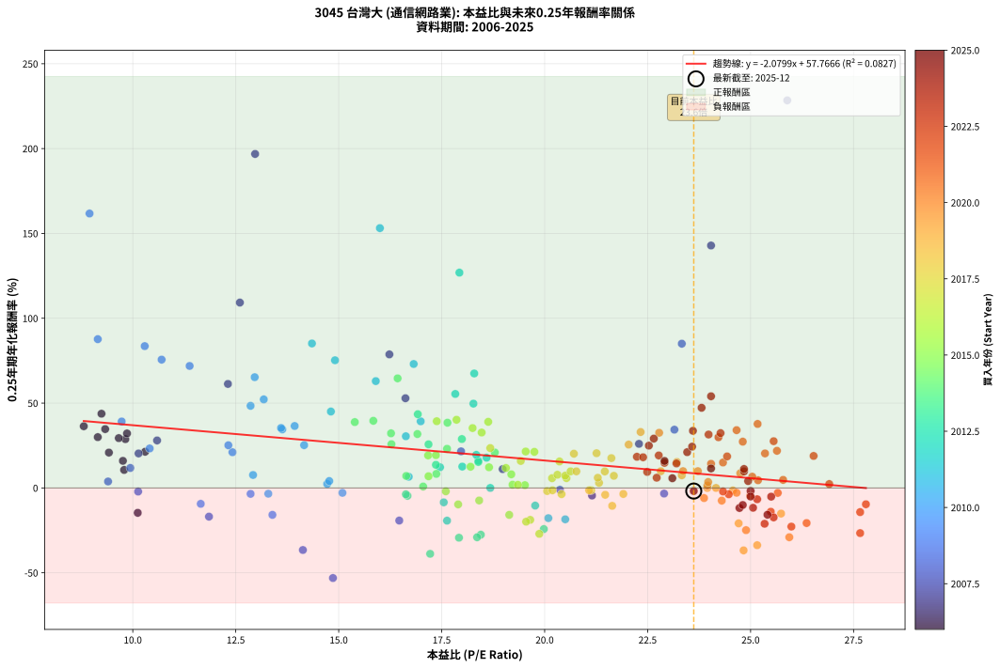
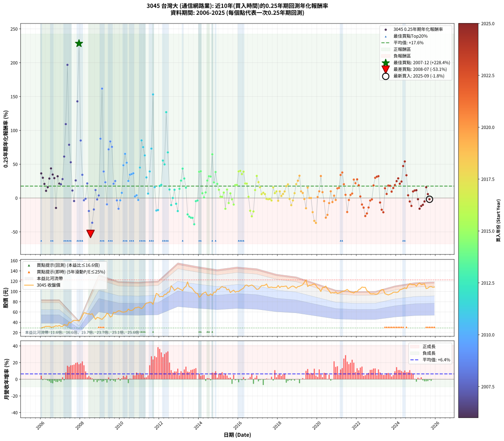

# 3045 台灣大 - 本益比與未來報酬率分析

!!! info "報告資訊"
    - **股票代號**: 3045
    - **公司名稱**: 台灣大
    - **產業別**: 通信網路業
    - **分析期間**: 2006-2025 (237 個數據點)
    - **資料來源**: Type 12 (ShowMonthlyK_ChartFlow) 月收盤價與本益比
    - **報酬率口徑**: 含現金股利 (簡化: 年度合計，假設每年7/1入帳)
    - **報告生成時間**: 2026-01-06 00:54:06 CST

## 📈 視覺化圖表

### 圖表1: 本益比 vs 未來報酬率關係

*圖表1：3045 台灣大 本益比與0.25年期未來報酬率關係 (2006-2025)*

### 圖表2: 歷年買入時點的0.25年期實際報酬率

*圖表2：3045 台灣大 歷年買入時點的0.25年期實際報酬率 (2006-2025)*

## 📍 買點訊號說明

本報告提供兩種買點提示訊號（顯示於圖表2的股價子圖中）：

### ▲ 小綠色三角形（回測驗證）
- **計算方式**: 使用全部歷史資料計算本益比第25百分位數
- **用途**: 事後驗證，顯示歷史上哪些時點確實為低估區
- **限制**: 當下無法判斷，僅供回測參考
- **特性**: 後見之明（Look-Ahead Bias）

### ▲ 小橘色三角形（即時訊號）
- **計算方式**: 使用截至當月的過去5年資料計算本益比第25百分位數
- **用途**: 實際投資決策，當時即可判斷
- **優勢**: 可操作性強，符合實務需求
- **特性**: 無後見之明，滾動窗口計算

!!! tip "如何使用兩種訊號"
    - **綠色▲** 幫助理解歷史估值機會，驗證策略有效性
    - **橘色▲** 可作為實際買進參考，但仍需搭配基本面分析
    - 兩種訊號重疊時，表示即時判斷與事後驗證一致，信心度較高
    - 僅有綠色▲時，表示當時無法判斷（需要未來資料才能確認）
    - 僅有橘色▲時，表示即時判斷為買點，但事後可能不是最佳時機

## 📊 估值分析摘要

| 指標 | 數值 |
|:---:|:---:|
| **目前本益比** (2025-09) | **23.62 倍** |
| **歷史平均本益比** | 19.30 倍 |
| **估值水準** | 🔴 相對高估 |
| **預期0.25年年化報酬率** | **+8.64%** |
| **歷史平均報酬率** | +17.62% |
| **相關係數 (R²)** | 0.0827 |
| **趨勢線斜率** | -2.0799 |

!!! abstract "核心洞察"
    目前本益比顯著高於歷史平均，預期未來報酬率可能較低

    根據歷史數據回測，3045 台灣大 在目前本益比 **23.6倍** 的估值水準下，
    預期未來0.25年年化報酬率約為 **+8.6%**。

    **重要提醒**: 本分析基於歷史數據統計，實際報酬率會受到公司基本面變化、產業趨勢、
    總體經濟環境等多重因素影響。R² = 0.08 表示本益比可解釋約 8.3% 的報酬率變異。

## 📈 歷史估值統計

### 最佳買點 (最高報酬率)

| 項目 | 數值 |
|:---:|:---:|
| 起始時間 | 2007-12 |
| 當時本益比 | 25.89 倍 |
| 起始價格 | 43.5 元 |
| 0.25年後價格 | 58.5 元 |
| **0.25年年化報酬率** | **+228.42%** |

### 最差買點 (最低報酬率)

| 項目 | 數值 |
|:---:|:---:|
| 起始時間 | 2008-07 |
| 當時本益比 | 14.86 倍 |
| 起始價格 | 55.3 元 |
| 0.25年後價格 | 45.7 元 |
| **0.25年年化報酬率** | **-53.09%** |

## 🎯 投資啟示

### 本益比與報酬率關係

趨勢線方程式: **y = -2.0799x + 57.7666**

!!! warning "強負相關"
    本益比與未來報酬率呈現強負相關。在高本益比時期買入，未來報酬率顯著較低；
    在低本益比時期買入，未來報酬率顯著較高。**估值紀律至關重要**。

### 估值區間建議

基於歷史數據分析:

- **🟢 低估區** (P/E < 15.4): 預期報酬率較高，可考慮增加持股
- **🟡 合理區** (P/E 15.4-23.2): 預期報酬率符合長期趨勢，正常持有
- **🔴 高估區** (P/E > 23.2): 預期報酬率較低，可考慮減碼或觀望

!!! danger "風險提示"
    - 過去表現不代表未來結果
    - 本分析假設公司基本面無重大結構性變化
    - 產業環境劇變可能使歷史規律失效
    - 應結合公司財報、產業趨勢、總體經濟等多重因素綜合判斷

!!! success "長期投資觀點"
    歷史數據顯示，在合理或低估的估值水準買入並長期持有，
    往往能獲得較佳的投資報酬。**耐心等待好價格**是價值投資的核心原則。

## 📊 數據品質

- **資料來源**: GoodInfo.tw Type 12 (ShowMonthlyK_ChartFlow)
- **資料頻率**: 月度收盤價與本益比
- **回測期間**: 2006-2025
- **數據點數量**: 237 個 (每個點代表一次0.25年期回測)

### 計算方法說明

1. **0.25年期年化報酬率**:
   - 對每個歷史時點，計算其後0.25年的實際投資報酬率
   - 期末價值(不含股利): 期末價格
   - 期末價值(含現金股利): 期末價格 + 持有期間內的現金股利合計 (簡化: 年度合計，假設每年7/1入帳)
   - 公式: 年化報酬率 = [(期末價值/期初價格)^(1/年數) - 1] × 100%

2. **本益比 (P/E Ratio)**:
   - 使用當時的月收盤價與EPS計算
   - 資料來源: Type 12 月度河流圖本益比數據

3. **趨勢線 (Linear Regression)**:
   - 使用最小平方法擬合線性趨勢線
   - R²值衡量本益比對報酬率的解釋能力

---

*本報告由 Stock Analysis System v1.9.0 自動生成*
*數據更新時間: 2026-01-06 00:54:06 CST*

## 📋 月度回測明細表

（每一列對應時間線圖中的一個買入點；可用來對照 SVG 圖上的每個點。）

| 買入月份 | 賣出月份 | 回測期限_年 | 實際持有年數 | 買入本益比_倍 | 買入收盤價_元 | 賣出收盤價_元 | 現金股利合計_元 | 總報酬率_pct | 年化報酬率_pct |
| --- | --- | --- | --- | --- | --- | --- | --- | --- | --- |
| 2006-01 | 2006-05 | 0.25 | 0.329 | 8.81 | 28.90 | 32.00 | 0.00 | +10.73 | +36.36 |
| 2006-02 | 2006-05 | 0.25 | 0.246 | 9.15 | 30.00 | 32.00 | 0.00 | +6.67 | +29.94 |
| 2006-03 | 2006-07 | 0.25 | 0.334 | 9.42 | 30.90 | 30.30 | 2.62 | +6.53 | +20.84 |
| 2006-04 | 2006-07 | 0.25 | 0.249 | 9.79 | 32.10 | 30.30 | 2.62 | +2.55 | +10.61 |
| 2006-05 | 2006-08 | 0.25 | 0.252 | 9.76 | 32.00 | 30.60 | 2.62 | +3.80 | +15.97 |
| 2006-06 | 2006-09 | 0.25 | 0.252 | 9.82 | 32.20 | 31.70 | 2.62 | +6.57 | +28.76 |
| 2006-07 | 2006-10 | 0.25 | 0.252 | 9.24 | 30.30 | 33.20 | 0.00 | +9.57 | +43.75 |
| 2006-08 | 2006-12 | 0.25 | 0.334 | 9.33 | 30.60 | 33.80 | 0.00 | +10.46 | +34.69 |
| 2006-09 | 2006-12 | 0.25 | 0.249 | 9.66 | 31.70 | 33.80 | 0.00 | +6.62 | +29.36 |
| 2006-10 | 2007-01 | 0.25 | 0.252 | 10.12 | 33.20 | 31.90 | 0.00 | -3.92 | -14.66 |
| 2006-11 | 2007-03 | 0.25 | 0.329 | 9.86 | 32.35 | 35.45 | 0.00 | +9.58 | +32.12 |
| 2006-12 | 2007-03 | 0.25 | 0.246 | 10.30 | 33.80 | 35.45 | 0.00 | +4.88 | +21.34 |
| 2007-01 | 2007-05 | 0.25 | 0.329 | 10.14 | 31.90 | 33.90 | 0.00 | +6.27 | +20.33 |
| 2007-02 | 2007-05 | 0.25 | 0.246 | 10.59 | 31.90 | 33.90 | 0.00 | +6.27 | +27.99 |
| 2007-03 | 2007-07 | 0.25 | 0.334 | 12.31 | 35.45 | 39.00 | 2.59 | +17.31 | +61.30 |
| 2007-04 | 2007-07 | 0.25 | 0.249 | 12.60 | 34.60 | 39.00 | 2.59 | +20.20 | +109.25 |
| 2007-05 | 2007-08 | 0.25 | 0.252 | 12.97 | 33.90 | 42.00 | 2.59 | +31.53 | +196.84 |
| 2007-06 | 2007-09 | 0.25 | 0.252 | 16.23 | 40.25 | 44.00 | 2.59 | +15.75 | +78.70 |
| 2007-07 | 2007-10 | 0.25 | 0.252 | 16.62 | 39.00 | 43.40 | 0.00 | +11.28 | +52.87 |
| 2007-08 | 2007-12 | 0.25 | 0.334 | 18.98 | 42.00 | 43.50 | 0.00 | +3.57 | +11.08 |
| 2007-09 | 2007-12 | 0.25 | 0.249 | 21.15 | 44.00 | 43.50 | 0.00 | -1.14 | -4.48 |
| 2007-10 | 2008-01 | 0.25 | 0.252 | 22.29 | 43.40 | 46.00 | 0.00 | +5.99 | +25.98 |
| 2007-11 | 2008-03 | 0.25 | 0.331 | 24.04 | 43.60 | 58.50 | 0.00 | +34.17 | +142.87 |
| 2007-12 | 2008-03 | 0.25 | 0.249 | 25.89 | 43.50 | 58.50 | 0.00 | +34.48 | +228.42 |
| 2008-01 | 2008-05 | 0.25 | 0.331 | 23.33 | 46.00 | 56.40 | 0.00 | +22.61 | +85.02 |
| 2008-02 | 2008-05 | 0.25 | 0.249 | 23.15 | 52.40 | 56.40 | 0.00 | +7.63 | +34.35 |
| 2008-03 | 2008-07 | 0.25 | 0.334 | 22.90 | 58.50 | 55.30 | 2.54 | -1.12 | -3.32 |
| 2008-04 | 2008-07 | 0.25 | 0.249 | 20.37 | 58.00 | 55.30 | 2.54 | -0.27 | -1.08 |
| 2008-05 | 2008-08 | 0.25 | 0.252 | 17.97 | 56.40 | 56.70 | 2.54 | +5.04 | +21.56 |
| 2008-06 | 2008-09 | 0.25 | 0.252 | 16.47 | 56.50 | 51.00 | 2.54 | -5.23 | -19.22 |
| 2008-07 | 2008-10 | 0.25 | 0.252 | 14.86 | 55.30 | 45.70 | 0.00 | -17.36 | -53.09 |
| 2008-08 | 2008-12 | 0.25 | 0.334 | 14.13 | 56.70 | 48.70 | 0.00 | -14.11 | -36.58 |
| 2008-09 | 2008-12 | 0.25 | 0.249 | 11.85 | 51.00 | 48.70 | 0.00 | -4.51 | -16.91 |
| 2008-10 | 2009-01 | 0.25 | 0.252 | 9.94 | 45.70 | 47.00 | 0.00 | +2.84 | +11.78 |
| 2008-11 | 2009-03 | 0.25 | 0.329 | 10.13 | 49.50 | 49.15 | 0.00 | -0.71 | -2.14 |
| 2008-12 | 2009-03 | 0.25 | 0.246 | 9.40 | 48.70 | 49.15 | 0.00 | +0.92 | +3.80 |
| 2009-01 | 2009-05 | 0.25 | 0.329 | 9.15 | 47.00 | 57.80 | 0.00 | +22.98 | +87.68 |
| 2009-02 | 2009-05 | 0.25 | 0.246 | 8.95 | 45.60 | 57.80 | 0.00 | +26.75 | +161.73 |
| 2009-03 | 2009-07 | 0.25 | 0.334 | 9.73 | 49.15 | 50.20 | 4.69 | +11.67 | +39.17 |
| 2009-04 | 2009-07 | 0.25 | 0.249 | 10.41 | 52.10 | 50.20 | 4.69 | +5.35 | +23.26 |
| 2009-05 | 2009-08 | 0.25 | 0.252 | 11.65 | 57.80 | 51.70 | 4.69 | -2.44 | -9.36 |
| 2009-06 | 2009-09 | 0.25 | 0.252 | 11.38 | 56.00 | 59.50 | 4.69 | +14.62 | +71.90 |
| 2009-07 | 2009-10 | 0.25 | 0.252 | 10.29 | 50.20 | 58.50 | 0.00 | +16.53 | +83.58 |
| 2009-08 | 2009-12 | 0.25 | 0.334 | 10.70 | 51.70 | 62.40 | 0.00 | +20.70 | +75.62 |
| 2009-09 | 2009-12 | 0.25 | 0.249 | 12.42 | 59.50 | 62.40 | 0.00 | +4.87 | +21.05 |
| 2009-10 | 2010-01 | 0.25 | 0.252 | 12.32 | 58.50 | 61.90 | 0.00 | +5.81 | +25.14 |
| 2009-11 | 2010-03 | 0.25 | 0.329 | 12.86 | 60.50 | 59.80 | 0.00 | -1.16 | -3.48 |
| 2009-12 | 2010-03 | 0.25 | 0.246 | 13.39 | 62.40 | 59.80 | 0.00 | -4.17 | -15.86 |
| 2010-01 | 2010-05 | 0.25 | 0.329 | 13.29 | 61.90 | 61.20 | 0.00 | -1.13 | -3.40 |
| 2010-02 | 2010-05 | 0.25 | 0.246 | 12.92 | 60.10 | 61.20 | 0.00 | +1.83 | +7.64 |
| 2010-03 | 2010-07 | 0.25 | 0.334 | 12.86 | 59.80 | 63.20 | 5.03 | +14.09 | +48.40 |
| 2010-04 | 2010-07 | 0.25 | 0.249 | 12.96 | 60.20 | 63.20 | 5.03 | +13.34 | +65.28 |
| 2010-05 | 2010-08 | 0.25 | 0.252 | 13.18 | 61.20 | 63.00 | 5.03 | +11.16 | +52.19 |
| 2010-06 | 2010-09 | 0.25 | 0.252 | 14.16 | 65.70 | 64.50 | 5.03 | +5.83 | +25.21 |
| 2010-07 | 2010-10 | 0.25 | 0.252 | 13.63 | 63.20 | 68.10 | 0.00 | +7.75 | +34.51 |
| 2010-08 | 2010-12 | 0.25 | 0.334 | 13.60 | 63.00 | 69.70 | 0.00 | +10.63 | +35.33 |
| 2010-09 | 2010-12 | 0.25 | 0.249 | 13.93 | 64.50 | 69.70 | 0.00 | +8.06 | +36.51 |
| 2010-10 | 2011-01 | 0.25 | 0.252 | 14.72 | 68.10 | 68.50 | 0.00 | +0.59 | +2.35 |
| 2010-11 | 2011-03 | 0.25 | 0.329 | 14.77 | 68.30 | 69.20 | 0.00 | +1.32 | +4.07 |
| 2010-12 | 2011-03 | 0.25 | 0.246 | 15.09 | 69.70 | 69.20 | 0.00 | -0.72 | -2.88 |
| 2011-01 | 2011-05 | 0.25 | 0.329 | 14.81 | 68.50 | 77.40 | 0.00 | +12.99 | +45.03 |
| 2011-02 | 2011-05 | 0.25 | 0.246 | 14.35 | 66.50 | 77.40 | 0.00 | +16.39 | +85.15 |
| 2011-03 | 2011-07 | 0.25 | 0.334 | 14.91 | 69.20 | 79.30 | 4.16 | +20.61 | +75.25 |
| 2011-04 | 2011-07 | 0.25 | 0.249 | 15.90 | 73.90 | 79.30 | 4.16 | +12.94 | +62.97 |
| 2011-05 | 2011-08 | 0.25 | 0.252 | 16.63 | 77.40 | 78.60 | 4.16 | +6.93 | +30.46 |
| 2011-06 | 2011-09 | 0.25 | 0.252 | 16.70 | 77.80 | 74.90 | 4.16 | +1.62 | +6.60 |
| 2011-07 | 2011-10 | 0.25 | 0.252 | 16.99 | 79.30 | 86.20 | 0.00 | +8.70 | +39.27 |
| 2011-08 | 2011-12 | 0.25 | 0.334 | 16.82 | 78.60 | 94.40 | 0.00 | +20.10 | +73.05 |
| 2011-09 | 2011-12 | 0.25 | 0.249 | 16.00 | 74.90 | 94.40 | 0.00 | +26.03 | +153.13 |
| 2011-10 | 2012-01 | 0.25 | 0.252 | 18.39 | 86.20 | 89.50 | 0.00 | +3.83 | +16.08 |
| 2011-11 | 2012-03 | 0.25 | 0.331 | 20.50 | 96.20 | 89.90 | 0.00 | -6.55 | -18.49 |
| 2011-12 | 2012-03 | 0.25 | 0.249 | 20.09 | 94.40 | 89.90 | 0.00 | -4.77 | -17.80 |
| 2012-01 | 2012-05 | 0.25 | 0.331 | 18.59 | 89.50 | 94.50 | 0.00 | +5.59 | +17.83 |
| 2012-02 | 2012-05 | 0.25 | 0.249 | 18.34 | 90.40 | 94.50 | 0.00 | +4.54 | +19.49 |
| 2012-03 | 2012-07 | 0.25 | 0.334 | 17.83 | 89.90 | 99.00 | 5.16 | +15.86 | +55.39 |
| 2012-04 | 2012-07 | 0.25 | 0.249 | 18.27 | 94.20 | 99.00 | 5.16 | +10.57 | +49.69 |
| 2012-05 | 2012-08 | 0.25 | 0.252 | 17.93 | 94.50 | 111.00 | 5.16 | +22.92 | +126.89 |
| 2012-06 | 2012-09 | 0.25 | 0.252 | 18.29 | 98.50 | 107.00 | 5.16 | +13.87 | +67.46 |
| 2012-07 | 2012-10 | 0.25 | 0.252 | 18.00 | 99.00 | 102.00 | 0.00 | +3.03 | +12.58 |
| 2012-08 | 2012-12 | 0.25 | 0.334 | 19.77 | 111.00 | 107.00 | 0.00 | -3.60 | -10.41 |
| 2012-09 | 2012-12 | 0.25 | 0.249 | 18.68 | 107.00 | 107.00 | 0.00 | +0.00 | +0.00 |
| 2012-10 | 2013-01 | 0.25 | 0.252 | 17.46 | 102.00 | 105.00 | 0.00 | +2.94 | +12.20 |
| 2012-11 | 2013-03 | 0.25 | 0.329 | 17.55 | 104.50 | 101.50 | 0.00 | -2.87 | -8.48 |
| 2012-12 | 2013-03 | 0.25 | 0.246 | 17.63 | 107.00 | 101.50 | 0.00 | -5.14 | -19.28 |
| 2013-01 | 2013-05 | 0.25 | 0.329 | 17.36 | 105.00 | 109.50 | 0.00 | +4.29 | +13.62 |
| 2013-02 | 2013-05 | 0.25 | 0.246 | 17.18 | 103.50 | 109.50 | 0.00 | +5.80 | +25.70 |
| 2013-03 | 2013-07 | 0.25 | 0.334 | 16.92 | 101.50 | 109.00 | 5.50 | +12.81 | +43.45 |
| 2013-04 | 2013-07 | 0.25 | 0.249 | 17.99 | 107.50 | 109.00 | 5.50 | +6.51 | +28.81 |
| 2013-05 | 2013-08 | 0.25 | 0.252 | 18.39 | 109.50 | 108.00 | 5.50 | +3.65 | +15.31 |
| 2013-06 | 2013-09 | 0.25 | 0.252 | 19.98 | 118.50 | 105.00 | 5.50 | -6.75 | -24.23 |
| 2013-07 | 2013-10 | 0.25 | 0.252 | 18.45 | 109.00 | 100.50 | 0.00 | -7.80 | -27.55 |
| 2013-08 | 2013-12 | 0.25 | 0.334 | 18.36 | 108.00 | 96.30 | 0.00 | -10.83 | -29.06 |
| 2013-09 | 2013-12 | 0.25 | 0.249 | 17.92 | 105.00 | 96.30 | 0.00 | -8.29 | -29.33 |
| 2013-10 | 2014-01 | 0.25 | 0.252 | 17.22 | 100.50 | 88.80 | 0.00 | -11.64 | -38.82 |
| 2013-11 | 2014-03 | 0.25 | 0.329 | 16.67 | 96.90 | 95.40 | 0.00 | -1.55 | -4.64 |
| 2013-12 | 2014-03 | 0.25 | 0.246 | 16.63 | 96.30 | 95.40 | 0.00 | -0.93 | -3.74 |
| 2014-01 | 2014-05 | 0.25 | 0.329 | 15.39 | 88.80 | 98.90 | 0.00 | +11.37 | +38.80 |
| 2014-02 | 2014-05 | 0.25 | 0.246 | 15.84 | 91.10 | 98.90 | 0.00 | +8.56 | +39.57 |
| 2014-03 | 2014-07 | 0.25 | 0.334 | 16.64 | 95.40 | 92.00 | 5.60 | +2.31 | +7.06 |
| 2014-04 | 2014-07 | 0.25 | 0.249 | 17.05 | 97.40 | 92.00 | 5.60 | +0.21 | +0.83 |
| 2014-05 | 2014-08 | 0.25 | 0.252 | 17.37 | 98.90 | 95.30 | 5.60 | +2.02 | +8.27 |
| 2014-06 | 2014-09 | 0.25 | 0.252 | 16.28 | 92.40 | 92.30 | 5.60 | +5.95 | +25.80 |
| 2014-07 | 2014-10 | 0.25 | 0.252 | 16.27 | 92.00 | 98.70 | 0.00 | +7.28 | +32.19 |
| 2014-08 | 2014-12 | 0.25 | 0.334 | 16.91 | 95.30 | 104.50 | 0.00 | +9.65 | +31.77 |
| 2014-09 | 2014-12 | 0.25 | 0.249 | 16.43 | 92.30 | 104.50 | 0.00 | +13.22 | +64.59 |
| 2014-10 | 2015-01 | 0.25 | 0.252 | 17.63 | 98.70 | 104.00 | 0.00 | +5.37 | +23.08 |
| 2014-11 | 2015-03 | 0.25 | 0.329 | 17.64 | 98.40 | 109.50 | 0.00 | +11.28 | +38.45 |
| 2014-12 | 2015-03 | 0.25 | 0.246 | 18.79 | 104.50 | 109.50 | 0.00 | +4.78 | +20.89 |
| 2015-01 | 2015-05 | 0.25 | 0.329 | 18.65 | 104.00 | 108.00 | 0.00 | +3.85 | +12.17 |
| 2015-02 | 2015-05 | 0.25 | 0.246 | 19.22 | 107.50 | 108.00 | 0.00 | +0.47 | +1.90 |
| 2015-03 | 2015-07 | 0.25 | 0.334 | 19.52 | 109.50 | 104.50 | 5.60 | +0.55 | +1.65 |
| 2015-04 | 2015-07 | 0.25 | 0.249 | 19.19 | 108.00 | 104.50 | 5.60 | +1.94 | +8.04 |
| 2015-05 | 2015-08 | 0.25 | 0.252 | 19.14 | 108.00 | 97.80 | 5.60 | -4.26 | -15.87 |
| 2015-06 | 2015-09 | 0.25 | 0.252 | 18.20 | 103.00 | 100.50 | 5.60 | +3.01 | +12.49 |
| 2015-07 | 2015-10 | 0.25 | 0.252 | 18.41 | 104.50 | 102.50 | 0.00 | -1.91 | -7.39 |
| 2015-08 | 2015-12 | 0.25 | 0.334 | 17.18 | 97.80 | 100.00 | 0.00 | +2.25 | +6.89 |
| 2015-09 | 2015-12 | 0.25 | 0.249 | 17.60 | 100.50 | 100.00 | 0.00 | -0.50 | -1.98 |
| 2015-10 | 2016-01 | 0.25 | 0.252 | 17.90 | 102.50 | 99.90 | 0.00 | -2.54 | -9.70 |
| 2015-11 | 2016-03 | 0.25 | 0.331 | 17.17 | 98.60 | 104.50 | 0.00 | +5.98 | +19.18 |
| 2015-12 | 2016-03 | 0.25 | 0.249 | 17.36 | 100.00 | 104.50 | 0.00 | +4.50 | +19.32 |
| 2016-01 | 2016-05 | 0.25 | 0.331 | 17.38 | 99.90 | 111.50 | 0.00 | +11.61 | +39.32 |
| 2016-02 | 2016-05 | 0.25 | 0.249 | 17.86 | 102.50 | 111.50 | 0.00 | +8.78 | +40.19 |
| 2016-03 | 2016-07 | 0.25 | 0.334 | 18.25 | 104.50 | 110.00 | 5.60 | +10.62 | +35.29 |
| 2016-04 | 2016-07 | 0.25 | 0.249 | 18.63 | 106.50 | 110.00 | 5.60 | +8.54 | +38.97 |
| 2016-05 | 2016-08 | 0.25 | 0.252 | 19.54 | 111.50 | 111.50 | 5.60 | +5.02 | +21.48 |
| 2016-06 | 2016-09 | 0.25 | 0.252 | 19.75 | 112.50 | 112.50 | 5.60 | +4.98 | +21.27 |
| 2016-07 | 2016-10 | 0.25 | 0.252 | 19.35 | 110.00 | 110.50 | 0.00 | +0.45 | +1.82 |
| 2016-08 | 2016-12 | 0.25 | 0.334 | 19.65 | 111.50 | 104.00 | 0.00 | -6.73 | -18.82 |
| 2016-09 | 2016-12 | 0.25 | 0.249 | 19.87 | 112.50 | 104.00 | 0.00 | -7.56 | -27.05 |
| 2016-10 | 2017-01 | 0.25 | 0.252 | 19.55 | 110.50 | 104.50 | 0.00 | -5.43 | -19.88 |
| 2016-11 | 2017-03 | 0.25 | 0.329 | 19.06 | 107.50 | 111.50 | 0.00 | +3.72 | +11.76 |
| 2016-12 | 2017-03 | 0.25 | 0.246 | 18.47 | 104.00 | 111.50 | 0.00 | +7.21 | +32.66 |
| 2017-01 | 2017-05 | 0.25 | 0.329 | 18.68 | 104.50 | 112.00 | 0.00 | +7.18 | +23.49 |
| 2017-02 | 2017-05 | 0.25 | 0.246 | 19.42 | 108.00 | 112.00 | 0.00 | +3.70 | +15.90 |
| 2017-03 | 2017-07 | 0.25 | 0.334 | 20.18 | 111.50 | 108.00 | 5.60 | +1.88 | +5.75 |
| 2017-04 | 2017-07 | 0.25 | 0.249 | 20.31 | 111.50 | 108.00 | 5.60 | +1.88 | +7.78 |
| 2017-05 | 2017-08 | 0.25 | 0.252 | 20.53 | 112.00 | 108.00 | 5.60 | +1.43 | +5.79 |
| 2017-06 | 2017-09 | 0.25 | 0.252 | 21.13 | 114.50 | 108.50 | 5.60 | -0.35 | -1.38 |
| 2017-07 | 2017-10 | 0.25 | 0.252 | 20.06 | 108.00 | 107.50 | 0.00 | -0.46 | -1.83 |
| 2017-08 | 2017-12 | 0.25 | 0.334 | 20.19 | 108.00 | 107.50 | 0.00 | -0.46 | -1.38 |
| 2017-09 | 2017-12 | 0.25 | 0.249 | 20.41 | 108.50 | 107.50 | 0.00 | -0.92 | -3.65 |
| 2017-10 | 2018-01 | 0.25 | 0.252 | 20.36 | 107.50 | 111.50 | 0.00 | +3.72 | +15.61 |
| 2017-11 | 2018-03 | 0.25 | 0.329 | 20.50 | 107.50 | 110.00 | 0.00 | +2.33 | +7.25 |
| 2017-12 | 2018-03 | 0.25 | 0.246 | 20.63 | 107.50 | 110.00 | 0.00 | +2.33 | +9.78 |
| 2018-01 | 2018-05 | 0.25 | 0.329 | 21.47 | 111.50 | 110.00 | 0.00 | -1.35 | -4.04 |
| 2018-02 | 2018-05 | 0.25 | 0.246 | 20.77 | 107.50 | 110.00 | 0.00 | +2.33 | +9.78 |
| 2018-03 | 2018-07 | 0.25 | 0.334 | 21.32 | 110.00 | 105.50 | 5.60 | +1.00 | +3.02 |
| 2018-04 | 2018-07 | 0.25 | 0.249 | 21.29 | 109.50 | 105.50 | 5.60 | +1.46 | +6.00 |
| 2018-05 | 2018-08 | 0.25 | 0.252 | 21.46 | 110.00 | 107.00 | 5.60 | +2.36 | +9.72 |
| 2018-06 | 2018-09 | 0.25 | 0.252 | 21.62 | 110.50 | 109.50 | 5.60 | +4.16 | +17.58 |
| 2018-07 | 2018-10 | 0.25 | 0.252 | 20.71 | 105.50 | 110.50 | 0.00 | +4.74 | +20.18 |
| 2018-08 | 2018-12 | 0.25 | 0.334 | 21.08 | 107.00 | 106.50 | 0.00 | -0.47 | -1.39 |
| 2018-09 | 2018-12 | 0.25 | 0.249 | 21.64 | 109.50 | 106.50 | 0.00 | -2.74 | -10.55 |
| 2018-10 | 2019-01 | 0.25 | 0.252 | 21.91 | 110.50 | 109.50 | 0.00 | -0.90 | -3.54 |
| 2018-11 | 2019-03 | 0.25 | 0.329 | 21.68 | 109.00 | 111.50 | 0.00 | +2.29 | +7.15 |
| 2018-12 | 2019-03 | 0.25 | 0.246 | 21.26 | 106.50 | 111.50 | 0.00 | +4.69 | +20.47 |
| 2019-01 | 2019-05 | 0.25 | 0.329 | 22.04 | 109.50 | 118.00 | 0.00 | +7.76 | +25.55 |
| 2019-02 | 2019-05 | 0.25 | 0.246 | 22.33 | 110.00 | 118.00 | 0.00 | +7.27 | +32.96 |
| 2019-03 | 2019-07 | 0.25 | 0.334 | 22.82 | 111.50 | 109.50 | 5.55 | +3.18 | +9.83 |
| 2019-04 | 2019-07 | 0.25 | 0.249 | 23.33 | 113.00 | 109.50 | 5.55 | +1.81 | +7.48 |
| 2019-05 | 2019-08 | 0.25 | 0.252 | 24.57 | 118.00 | 112.00 | 5.55 | -0.38 | -1.51 |
| 2019-06 | 2019-09 | 0.25 | 0.252 | 25.74 | 122.50 | 112.00 | 5.55 | -4.04 | -15.11 |
| 2019-07 | 2019-10 | 0.25 | 0.252 | 23.21 | 109.50 | 113.50 | 0.00 | +3.65 | +15.31 |
| 2019-08 | 2019-12 | 0.25 | 0.334 | 23.95 | 112.00 | 112.00 | 0.00 | +0.00 | +0.00 |
| 2019-09 | 2019-12 | 0.25 | 0.249 | 24.16 | 112.00 | 112.00 | 0.00 | +0.00 | +0.00 |
| 2019-10 | 2020-01 | 0.25 | 0.252 | 24.71 | 113.50 | 107.00 | 0.00 | -5.73 | -20.87 |
| 2019-11 | 2020-03 | 0.25 | 0.331 | 25.16 | 114.50 | 99.90 | 0.00 | -12.75 | -33.75 |
| 2019-12 | 2020-03 | 0.25 | 0.249 | 24.83 | 112.00 | 99.90 | 0.00 | -10.80 | -36.80 |
| 2020-01 | 2020-05 | 0.25 | 0.331 | 23.95 | 107.00 | 107.50 | 0.00 | +0.47 | +1.42 |
| 2020-02 | 2020-05 | 0.25 | 0.249 | 23.72 | 105.00 | 107.50 | 0.00 | +2.38 | +9.90 |
| 2020-03 | 2020-07 | 0.25 | 0.334 | 22.78 | 99.90 | 105.00 | 4.75 | +9.86 | +32.52 |
| 2020-04 | 2020-07 | 0.25 | 0.249 | 24.75 | 107.50 | 105.00 | 4.75 | +2.09 | +8.67 |
| 2020-05 | 2020-08 | 0.25 | 0.252 | 24.99 | 107.50 | 101.50 | 4.75 | -1.16 | -4.54 |
| 2020-06 | 2020-09 | 0.25 | 0.252 | 25.94 | 110.50 | 96.60 | 4.75 | -8.28 | -29.05 |
| 2020-07 | 2020-10 | 0.25 | 0.252 | 24.89 | 105.00 | 97.70 | 0.00 | -6.95 | -24.88 |
| 2020-08 | 2020-12 | 0.25 | 0.334 | 24.30 | 101.50 | 98.90 | 0.00 | -2.56 | -7.47 |
| 2020-09 | 2020-12 | 0.25 | 0.249 | 23.36 | 96.60 | 98.90 | 0.00 | +2.38 | +9.90 |
| 2020-10 | 2021-01 | 0.25 | 0.252 | 23.87 | 97.70 | 96.20 | 0.00 | -1.54 | -5.96 |
| 2020-11 | 2021-03 | 0.25 | 0.329 | 23.97 | 97.10 | 98.20 | 0.00 | +1.13 | +3.49 |
| 2020-12 | 2021-03 | 0.25 | 0.246 | 24.66 | 98.90 | 98.20 | 0.00 | -0.71 | -2.84 |
| 2021-01 | 2021-05 | 0.25 | 0.329 | 24.04 | 96.20 | 100.50 | 0.00 | +4.47 | +14.24 |
| 2021-02 | 2021-05 | 0.25 | 0.246 | 24.33 | 97.10 | 100.50 | 0.00 | +3.50 | +14.99 |
| 2021-03 | 2021-07 | 0.25 | 0.334 | 24.66 | 98.20 | 104.00 | 4.30 | +10.29 | +34.06 |
| 2021-04 | 2021-07 | 0.25 | 0.249 | 25.17 | 100.00 | 104.00 | 4.30 | +8.30 | +37.72 |
| 2021-05 | 2021-08 | 0.25 | 0.252 | 25.35 | 100.50 | 101.00 | 4.30 | +4.78 | +20.35 |
| 2021-06 | 2021-09 | 0.25 | 0.252 | 25.79 | 102.00 | 98.90 | 4.30 | +1.18 | +4.75 |
| 2021-07 | 2021-10 | 0.25 | 0.252 | 26.36 | 104.00 | 98.10 | 0.00 | -5.67 | -20.69 |
| 2021-08 | 2021-12 | 0.25 | 0.334 | 25.66 | 101.00 | 100.00 | 0.00 | -0.99 | -2.94 |
| 2021-09 | 2021-12 | 0.25 | 0.249 | 25.18 | 98.90 | 100.00 | 0.00 | +1.11 | +4.54 |
| 2021-10 | 2022-01 | 0.25 | 0.252 | 25.04 | 98.10 | 99.70 | 0.00 | +1.63 | +6.63 |
| 2021-11 | 2022-03 | 0.25 | 0.329 | 24.81 | 97.00 | 105.00 | 0.00 | +8.25 | +27.28 |
| 2021-12 | 2022-03 | 0.25 | 0.246 | 25.64 | 100.00 | 105.00 | 0.00 | +5.00 | +21.90 |
| 2022-01 | 2022-05 | 0.25 | 0.329 | 25.56 | 99.70 | 108.00 | 0.00 | +8.32 | +27.56 |
| 2022-02 | 2022-05 | 0.25 | 0.246 | 26.53 | 103.50 | 108.00 | 0.00 | +4.35 | +18.85 |
| 2022-03 | 2022-07 | 0.25 | 0.334 | 26.91 | 105.00 | 101.50 | 4.30 | +0.76 | +2.30 |
| 2022-04 | 2022-07 | 0.25 | 0.249 | 27.80 | 108.50 | 101.50 | 4.30 | -2.49 | -9.62 |
| 2022-05 | 2022-08 | 0.25 | 0.252 | 27.66 | 108.00 | 99.60 | 4.30 | -3.80 | -14.24 |
| 2022-06 | 2022-09 | 0.25 | 0.252 | 27.66 | 108.00 | 95.60 | 4.30 | -7.50 | -26.62 |
| 2022-07 | 2022-10 | 0.25 | 0.252 | 25.99 | 101.50 | 95.10 | 0.00 | -6.31 | -22.78 |
| 2022-08 | 2022-12 | 0.25 | 0.334 | 25.49 | 99.60 | 94.70 | 0.00 | -4.92 | -14.02 |
| 2022-09 | 2022-12 | 0.25 | 0.249 | 24.47 | 95.60 | 94.70 | 0.00 | -0.94 | -3.73 |
| 2022-10 | 2023-01 | 0.25 | 0.252 | 24.33 | 95.10 | 94.60 | 0.00 | -0.53 | -2.07 |
| 2022-11 | 2023-03 | 0.25 | 0.329 | 24.43 | 95.50 | 101.00 | 0.00 | +5.76 | +18.58 |
| 2022-12 | 2023-03 | 0.25 | 0.246 | 24.22 | 94.70 | 101.00 | 0.00 | +6.65 | +29.87 |
| 2023-01 | 2023-05 | 0.25 | 0.329 | 23.98 | 94.60 | 103.50 | 0.00 | +9.41 | +31.48 |
| 2023-02 | 2023-05 | 0.25 | 0.246 | 24.27 | 96.60 | 103.50 | 0.00 | +7.14 | +32.31 |
| 2023-03 | 2023-07 | 0.25 | 0.334 | 25.16 | 101.00 | 94.40 | 4.30 | -2.28 | -6.66 |
| 2023-04 | 2023-07 | 0.25 | 0.249 | 25.56 | 103.50 | 94.40 | 4.30 | -4.64 | -17.35 |
| 2023-05 | 2023-08 | 0.25 | 0.252 | 25.34 | 103.50 | 93.20 | 4.30 | -5.80 | -21.11 |
| 2023-06 | 2023-09 | 0.25 | 0.252 | 23.20 | 95.60 | 94.60 | 4.30 | +3.45 | +14.42 |
| 2023-07 | 2023-10 | 0.25 | 0.252 | 22.72 | 94.40 | 95.80 | 0.00 | +1.48 | +6.02 |
| 2023-08 | 2023-12 | 0.25 | 0.334 | 22.24 | 93.20 | 98.60 | 0.00 | +5.79 | +18.37 |
| 2023-09 | 2023-12 | 0.25 | 0.249 | 22.39 | 94.60 | 98.60 | 0.00 | +4.23 | +18.08 |
| 2023-10 | 2024-01 | 0.25 | 0.252 | 22.49 | 95.80 | 98.00 | 0.00 | +2.30 | +9.43 |
| 2023-11 | 2024-03 | 0.25 | 0.331 | 22.91 | 98.40 | 103.00 | 0.00 | +4.67 | +14.79 |
| 2023-12 | 2024-03 | 0.25 | 0.249 | 22.77 | 98.60 | 103.00 | 0.00 | +4.46 | +19.15 |
| 2024-01 | 2024-05 | 0.25 | 0.331 | 22.53 | 98.00 | 105.50 | 0.00 | +7.65 | +24.93 |
| 2024-02 | 2024-05 | 0.25 | 0.249 | 22.65 | 99.00 | 105.50 | 0.00 | +6.57 | +29.08 |
| 2024-03 | 2024-07 | 0.25 | 0.334 | 23.46 | 103.00 | 105.50 | 4.30 | +6.60 | +21.09 |
| 2024-04 | 2024-07 | 0.25 | 0.249 | 23.58 | 104.00 | 105.50 | 4.30 | +5.58 | +24.34 |
| 2024-05 | 2024-08 | 0.25 | 0.252 | 23.81 | 105.50 | 112.00 | 4.30 | +10.24 | +47.25 |
| 2024-06 | 2024-09 | 0.25 | 0.252 | 24.04 | 107.00 | 115.00 | 4.30 | +11.50 | +54.03 |
| 2024-07 | 2024-10 | 0.25 | 0.252 | 23.60 | 105.50 | 113.50 | 0.00 | +7.58 | +33.67 |
| 2024-08 | 2024-12 | 0.25 | 0.334 | 24.94 | 112.00 | 113.50 | 0.00 | +1.34 | +4.06 |
| 2024-09 | 2024-12 | 0.25 | 0.249 | 25.50 | 115.00 | 113.50 | 0.00 | -1.30 | -5.13 |
| 2024-10 | 2025-01 | 0.25 | 0.252 | 25.06 | 113.50 | 110.00 | 0.00 | -3.08 | -11.69 |
| 2024-11 | 2025-03 | 0.25 | 0.329 | 24.84 | 113.00 | 116.50 | 0.00 | +3.10 | +9.73 |
| 2024-12 | 2025-03 | 0.25 | 0.246 | 24.84 | 113.50 | 116.50 | 0.00 | +2.64 | +11.17 |
| 2025-01 | 2025-05 | 0.25 | 0.329 | 24.04 | 110.00 | 114.00 | 0.00 | +3.64 | +11.48 |
| 2025-02 | 2025-05 | 0.25 | 0.246 | 25.00 | 114.50 | 114.00 | 0.00 | -0.44 | -1.76 |
| 2025-03 | 2025-07 | 0.25 | 0.334 | 25.41 | 116.50 | 105.50 | 4.50 | -5.58 | -15.79 |
| 2025-04 | 2025-07 | 0.25 | 0.249 | 24.73 | 113.50 | 105.50 | 4.50 | -3.08 | -11.81 |
| 2025-05 | 2025-08 | 0.25 | 0.252 | 24.81 | 114.00 | 106.50 | 4.50 | -2.63 | -10.05 |
| 2025-06 | 2025-09 | 0.25 | 0.252 | 25.00 | 115.00 | 109.00 | 4.50 | -1.30 | -5.08 |
| 2025-07 | 2025-10 | 0.25 | 0.252 | 22.91 | 105.50 | 109.50 | 0.00 | +3.79 | +15.92 |
| 2025-08 | 2025-12 | 0.25 | 0.334 | 23.10 | 106.50 | 108.50 | 0.00 | +1.88 | +5.73 |
| 2025-09 | 2025-12 | 0.25 | 0.249 | 23.62 | 109.00 | 108.50 | 0.00 | -0.46 | -1.83 |
