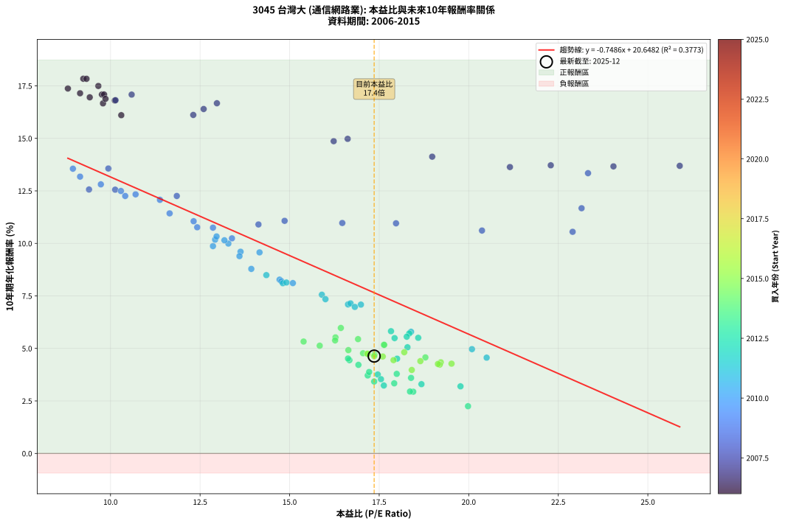
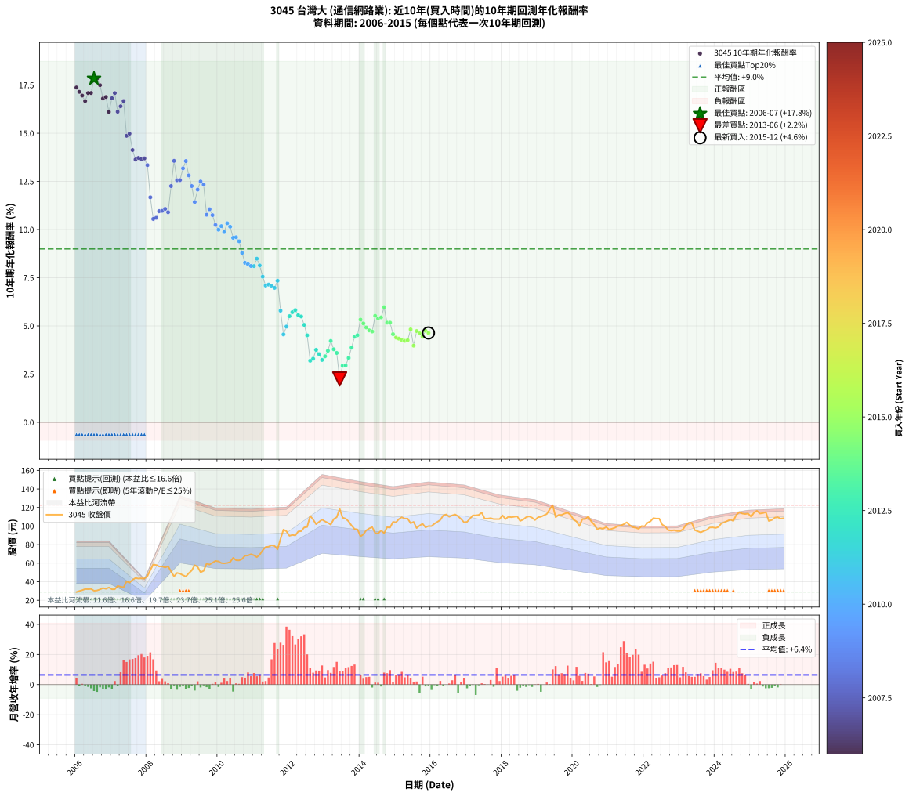

# 3045 台灣大 - 本益比與未來報酬率分析

!!! info "報告資訊"
    - **股票代號**: 3045
    - **公司名稱**: 台灣大
    - **產業別**: 通信網路業
    - **分析期間**: 2006-2015 (120 個數據點)
    - **資料來源**: Type 12 (ShowMonthlyK_ChartFlow) 月收盤價與本益比
    - **報酬率口徑**: 含現金股利 (簡化: 年度合計，假設每年7/1入帳)
    - **報告生成時間**: 2026-01-11 21:01:21 CST

## 📈 視覺化圖表

### 圖表1: 本益比 vs 未來報酬率關係

*圖表1：3045 台灣大 本益比與10年期未來報酬率關係 (2006-2015)*

### 圖表2: 歷年買入時點的10年期實際報酬率

*圖表2：3045 台灣大 歷年買入時點的10年期實際報酬率 (2006-2015)*

## 📍 買點訊號說明

本報告提供兩種買點提示訊號（顯示於圖表2的股價子圖中）：

### ▲ 小綠色三角形（回測驗證）
- **計算方式**: 使用全部歷史資料計算本益比第25百分位數
- **用途**: 事後驗證，顯示歷史上哪些時點確實為低估區
- **限制**: 當下無法判斷，僅供回測參考
- **特性**: 後見之明（Look-Ahead Bias）

### ▲ 小橘色三角形（即時訊號）
- **計算方式**: 使用截至當月的過去5年資料計算本益比第25百分位數
- **用途**: 實際投資決策，當時即可判斷
- **優勢**: 可操作性強，符合實務需求
- **特性**: 無後見之明，滾動窗口計算

!!! tip "如何使用兩種訊號"
    - **綠色▲** 幫助理解歷史估值機會，驗證策略有效性
    - **橘色▲** 可作為實際買進參考，但仍需搭配基本面分析
    - 兩種訊號重疊時，表示即時判斷與事後驗證一致，信心度較高
    - 僅有綠色▲時，表示當時無法判斷（需要未來資料才能確認）
    - 僅有橘色▲時，表示即時判斷為買點，但事後可能不是最佳時機

## 📊 估值分析摘要

| 指標 | 數值 |
|:---:|:---:|
| **目前本益比** (2015-12) | **17.36 倍** |
| **歷史平均本益比** | 15.56 倍 |
| **估值水準** | 🟡 合理範圍 |
| **預期10年年化報酬率** | **+7.65%** |
| **歷史平均報酬率** | +9.00% |
| **相關係數 (R²)** | 0.3773 |
| **趨勢線斜率** | -0.7486 |

!!! abstract "核心洞察"
    目前本益比接近歷史平均，預期報酬率符合長期趨勢

    根據歷史數據回測，3045 台灣大 在目前本益比 **17.4倍** 的估值水準下，
    預期未來10年年化報酬率約為 **+7.7%**。

    **重要提醒**: 本分析基於歷史數據統計，實際報酬率會受到公司基本面變化、產業趨勢、
    總體經濟環境等多重因素影響。R² = 0.38 表示本益比可解釋約 37.7% 的報酬率變異。

## 📈 歷史估值統計

### 最佳買點 (最高報酬率)

| 項目 | 數值 |
|:---:|:---:|
| 起始時間 | 2006-07 |
| 當時本益比 | 9.24 倍 |
| 起始價格 | 30.3 元 |
| 10年後價格 | 110.0 元 |
| **10年年化報酬率** | **+17.84%** |

### 最差買點 (最低報酬率)

| 項目 | 數值 |
|:---:|:---:|
| 起始時間 | 2013-06 |
| 當時本益比 | 19.98 倍 |
| 起始價格 | 118.5 元 |
| 10年後價格 | 95.6 元 |
| **10年年化報酬率** | **+2.25%** |

## 🎯 投資啟示

### 本益比與報酬率關係

趨勢線方程式: **y = -0.7486x + 20.6482**

!!! warning "強負相關"
    本益比與未來報酬率呈現強負相關。在高本益比時期買入，未來報酬率顯著較低；
    在低本益比時期買入，未來報酬率顯著較高。**估值紀律至關重要**。

### 估值區間建議

基於歷史數據分析:

- **🟢 低估區** (P/E < 12.4): 預期報酬率較高，可考慮增加持股
- **🟡 合理區** (P/E 12.4-18.7): 預期報酬率符合長期趨勢，正常持有
- **🔴 高估區** (P/E > 18.7): 預期報酬率較低，可考慮減碼或觀望

!!! danger "風險提示"
    - 過去表現不代表未來結果
    - 本分析假設公司基本面無重大結構性變化
    - 產業環境劇變可能使歷史規律失效
    - 應結合公司財報、產業趨勢、總體經濟等多重因素綜合判斷

!!! success "長期投資觀點"
    歷史數據顯示，在合理或低估的估值水準買入並長期持有，
    往往能獲得較佳的投資報酬。**耐心等待好價格**是價值投資的核心原則。

## 📊 數據品質

- **資料來源**: GoodInfo.tw Type 12 (ShowMonthlyK_ChartFlow)
- **資料頻率**: 月度收盤價與本益比
- **回測期間**: 2006-2015
- **數據點數量**: 120 個 (每個點代表一次10年期回測)

### 計算方法說明

1. **10年期年化報酬率**:
   - 對每個歷史時點，計算其後10年的實際投資報酬率
   - 期末價值(不含股利): 期末價格
   - 期末價值(含現金股利): 期末價格 + 持有期間內的現金股利合計 (簡化: 年度合計，假設每年7/1入帳)
   - 公式: 年化報酬率 = [(期末價值/期初價格)^(1/年數) - 1] × 100%

2. **本益比 (P/E Ratio)**:
   - 使用當時的月收盤價與EPS計算
   - 資料來源: Type 12 月度河流圖本益比數據

3. **趨勢線 (Linear Regression)**:
   - 使用最小平方法擬合線性趨勢線
   - R²值衡量本益比對報酬率的解釋能力

---

*本報告由 Stock Analysis System v1.9.0 自動生成*
*數據更新時間: 2026-01-11 21:01:21 CST*

## 📋 月度回測明細表

（每一列對應時間線圖中的一個買入點；可用來對照 SVG 圖上的每個點。）

| 買入月份 | 賣出月份 | 回測期限_年 | 實際持有年數 | 買入本益比_倍 | 買入收盤價_元 | 賣出收盤價_元 | 現金股利合計_元 | 總報酬率_pct | 年化報酬率_pct |
| --- | --- | --- | --- | --- | --- | --- | --- | --- | --- |
| 2006-01 | 2016-01 | 10 | 9.999 | 8.81 | 28.90 | 99.90 | 43.49 | +396.14 | +17.37 |
| 2006-02 | 2016-02 | 10 | 9.999 | 9.15 | 30.00 | 102.50 | 43.49 | +386.62 | +17.15 |
| 2006-03 | 2016-03 | 10 | 10.001 | 9.42 | 30.90 | 104.50 | 43.49 | +378.92 | +16.95 |
| 2006-04 | 2016-04 | 10 | 10.001 | 9.79 | 32.10 | 106.50 | 43.49 | +367.24 | +16.67 |
| 2006-05 | 2016-05 | 10 | 10.001 | 9.76 | 32.00 | 111.50 | 43.49 | +384.33 | +17.09 |
| 2006-06 | 2016-06 | 10 | 10.001 | 9.82 | 32.20 | 112.50 | 43.49 | +384.43 | +17.09 |
| 2006-07 | 2016-07 | 10 | 10.001 | 9.24 | 30.30 | 110.00 | 46.47 | +416.40 | +17.84 |
| 2006-08 | 2016-08 | 10 | 10.001 | 9.33 | 30.60 | 111.50 | 46.47 | +416.24 | +17.84 |
| 2006-09 | 2016-09 | 10 | 10.001 | 9.66 | 31.70 | 112.50 | 46.47 | +401.48 | +17.49 |
| 2006-10 | 2016-10 | 10 | 10.001 | 10.12 | 33.20 | 110.50 | 46.47 | +372.80 | +16.80 |
| 2006-11 | 2016-11 | 10 | 10.001 | 9.86 | 32.35 | 107.50 | 46.47 | +375.94 | +16.88 |
| 2006-12 | 2016-12 | 10 | 10.001 | 10.30 | 33.80 | 104.00 | 46.47 | +345.17 | +16.10 |
| 2007-01 | 2017-01 | 10 | 10.001 | 10.14 | 31.90 | 104.50 | 46.47 | +373.25 | +16.82 |
| 2007-02 | 2017-02 | 10 | 10.001 | 10.59 | 31.90 | 108.00 | 46.47 | +384.23 | +17.08 |
| 2007-03 | 2017-03 | 10 | 10.001 | 12.31 | 35.45 | 111.50 | 46.47 | +345.61 | +16.11 |
| 2007-04 | 2017-04 | 10 | 10.001 | 12.60 | 34.60 | 111.50 | 46.47 | +356.55 | +16.40 |
| 2007-05 | 2017-05 | 10 | 10.001 | 12.97 | 33.90 | 112.00 | 46.47 | +367.46 | +16.67 |
| 2007-06 | 2017-06 | 10 | 10.001 | 16.23 | 40.25 | 114.50 | 46.47 | +299.92 | +14.87 |
| 2007-07 | 2017-07 | 10 | 10.001 | 16.62 | 39.00 | 108.00 | 49.48 | +303.79 | +14.98 |
| 2007-08 | 2017-08 | 10 | 10.001 | 18.98 | 42.00 | 108.00 | 49.48 | +274.95 | +14.13 |
| 2007-09 | 2017-09 | 10 | 10.001 | 21.15 | 44.00 | 108.50 | 49.48 | +259.05 | +13.63 |
| 2007-10 | 2017-10 | 10 | 10.001 | 22.29 | 43.40 | 107.50 | 49.48 | +261.71 | +13.72 |
| 2007-11 | 2017-11 | 10 | 10.001 | 24.04 | 43.60 | 107.50 | 49.48 | +260.05 | +13.67 |
| 2007-12 | 2017-12 | 10 | 10.001 | 25.89 | 43.50 | 107.50 | 49.48 | +260.87 | +13.69 |
| 2008-01 | 2018-01 | 10 | 10.001 | 23.33 | 46.00 | 111.50 | 49.48 | +249.96 | +13.34 |
| 2008-02 | 2018-03 | 10 | 10.081 | 23.15 | 52.40 | 110.00 | 49.48 | +204.35 | +11.67 |
| 2008-03 | 2018-03 | 10 | 9.999 | 22.90 | 58.50 | 110.00 | 49.48 | +172.62 | +10.55 |
| 2008-04 | 2018-04 | 10 | 9.999 | 20.37 | 58.00 | 109.50 | 49.48 | +174.10 | +10.61 |
| 2008-05 | 2018-05 | 10 | 9.999 | 17.97 | 56.40 | 110.00 | 49.48 | +182.77 | +10.96 |
| 2008-06 | 2018-06 | 10 | 9.999 | 16.47 | 56.50 | 110.50 | 49.48 | +183.15 | +10.97 |
| 2008-07 | 2018-07 | 10 | 9.999 | 14.86 | 55.30 | 105.50 | 52.54 | +185.78 | +11.07 |
| 2008-08 | 2018-08 | 10 | 9.999 | 14.13 | 56.70 | 107.00 | 52.54 | +181.37 | +10.90 |
| 2008-09 | 2018-09 | 10 | 9.999 | 11.85 | 51.00 | 109.50 | 52.54 | +217.72 | +12.26 |
| 2008-10 | 2018-10 | 10 | 9.999 | 9.94 | 45.70 | 110.50 | 52.54 | +256.75 | +13.57 |
| 2008-11 | 2018-11 | 10 | 9.999 | 10.13 | 49.50 | 109.00 | 52.54 | +226.34 | +12.56 |
| 2008-12 | 2018-12 | 10 | 9.999 | 9.40 | 48.70 | 106.50 | 52.54 | +226.56 | +12.57 |
| 2009-01 | 2019-01 | 10 | 9.999 | 9.15 | 47.00 | 109.50 | 52.54 | +244.76 | +13.18 |
| 2009-02 | 2019-02 | 10 | 9.999 | 8.95 | 45.60 | 110.00 | 52.54 | +256.44 | +13.56 |
| 2009-03 | 2019-03 | 10 | 9.999 | 9.73 | 49.15 | 111.50 | 52.54 | +233.75 | +12.81 |
| 2009-04 | 2019-04 | 10 | 9.999 | 10.41 | 52.10 | 113.00 | 52.54 | +217.73 | +12.26 |
| 2009-05 | 2019-05 | 10 | 9.999 | 11.65 | 57.80 | 118.00 | 52.54 | +195.05 | +11.43 |
| 2009-06 | 2019-06 | 10 | 9.999 | 11.38 | 56.00 | 122.50 | 52.54 | +212.57 | +12.07 |
| 2009-07 | 2019-07 | 10 | 9.999 | 10.29 | 50.20 | 109.50 | 53.40 | +224.50 | +12.49 |
| 2009-08 | 2019-08 | 10 | 9.999 | 10.70 | 51.70 | 112.00 | 53.40 | +219.92 | +12.33 |
| 2009-09 | 2019-09 | 10 | 9.999 | 12.42 | 59.50 | 112.00 | 53.40 | +177.98 | +10.77 |
| 2009-10 | 2019-10 | 10 | 9.999 | 12.32 | 58.50 | 113.50 | 53.40 | +185.30 | +11.05 |
| 2009-11 | 2019-11 | 10 | 9.999 | 12.86 | 60.50 | 114.50 | 53.40 | +177.52 | +10.75 |
| 2009-12 | 2019-12 | 10 | 9.999 | 13.39 | 62.40 | 112.00 | 53.40 | +165.06 | +10.24 |
| 2010-01 | 2020-01 | 10 | 9.999 | 13.29 | 61.90 | 107.00 | 53.40 | +159.13 | +9.99 |
| 2010-02 | 2020-02 | 10 | 9.999 | 12.92 | 60.10 | 105.00 | 53.40 | +163.56 | +10.18 |
| 2010-03 | 2020-03 | 10 | 10.001 | 12.86 | 59.80 | 99.90 | 53.40 | +156.35 | +9.87 |
| 2010-04 | 2020-04 | 10 | 10.001 | 12.96 | 60.20 | 107.50 | 53.40 | +167.27 | +10.33 |
| 2010-05 | 2020-05 | 10 | 10.001 | 13.18 | 61.20 | 107.50 | 53.40 | +162.91 | +10.15 |
| 2010-06 | 2020-06 | 10 | 10.001 | 14.16 | 65.70 | 110.50 | 53.40 | +149.47 | +9.57 |
| 2010-07 | 2020-07 | 10 | 10.001 | 13.63 | 63.20 | 105.00 | 53.12 | +150.19 | +9.60 |
| 2010-08 | 2020-08 | 10 | 10.001 | 13.60 | 63.00 | 101.50 | 53.12 | +145.43 | +9.39 |
| 2010-09 | 2020-09 | 10 | 10.001 | 13.93 | 64.50 | 96.60 | 53.12 | +132.13 | +8.78 |
| 2010-10 | 2020-10 | 10 | 10.001 | 14.72 | 68.10 | 97.70 | 53.12 | +121.47 | +8.27 |
| 2010-11 | 2020-11 | 10 | 10.001 | 14.77 | 68.30 | 97.10 | 53.12 | +119.94 | +8.20 |
| 2010-12 | 2020-12 | 10 | 10.001 | 15.09 | 69.70 | 98.90 | 53.12 | +118.11 | +8.11 |
| 2011-01 | 2021-01 | 10 | 10.001 | 14.81 | 68.50 | 96.20 | 53.12 | +117.99 | +8.10 |
| 2011-02 | 2021-02 | 10 | 10.001 | 14.35 | 66.50 | 97.10 | 53.12 | +125.90 | +8.49 |
| 2011-03 | 2021-03 | 10 | 10.001 | 14.91 | 69.20 | 98.20 | 53.12 | +118.67 | +8.14 |
| 2011-04 | 2021-04 | 10 | 10.001 | 15.90 | 73.90 | 100.00 | 53.12 | +107.20 | +7.56 |
| 2011-05 | 2021-05 | 10 | 10.001 | 16.63 | 77.40 | 100.50 | 53.12 | +98.48 | +7.09 |
| 2011-06 | 2021-06 | 10 | 10.001 | 16.70 | 77.80 | 102.00 | 53.12 | +99.38 | +7.14 |
| 2011-07 | 2021-07 | 10 | 10.001 | 16.99 | 79.30 | 104.00 | 53.26 | +98.31 | +7.09 |
| 2011-08 | 2021-08 | 10 | 10.001 | 16.82 | 78.60 | 101.00 | 53.26 | +96.26 | +6.97 |
| 2011-09 | 2021-09 | 10 | 10.001 | 16.00 | 74.90 | 98.90 | 53.26 | +103.15 | +7.34 |
| 2011-10 | 2021-10 | 10 | 10.001 | 18.39 | 86.20 | 98.10 | 53.26 | +75.59 | +5.79 |
| 2011-11 | 2021-11 | 10 | 10.001 | 20.50 | 96.20 | 97.00 | 53.26 | +56.19 | +4.56 |
| 2011-12 | 2021-12 | 10 | 10.001 | 20.09 | 94.40 | 100.00 | 53.26 | +62.35 | +4.96 |
| 2012-01 | 2022-01 | 10 | 10.001 | 18.59 | 89.50 | 99.70 | 53.26 | +70.90 | +5.50 |
| 2012-02 | 2022-03 | 10 | 10.081 | 18.34 | 90.40 | 105.00 | 53.26 | +75.07 | +5.71 |
| 2012-03 | 2022-03 | 10 | 9.999 | 17.83 | 89.90 | 105.00 | 53.26 | +76.04 | +5.82 |
| 2012-04 | 2022-04 | 10 | 9.999 | 18.27 | 94.20 | 108.50 | 53.26 | +71.72 | +5.56 |
| 2012-05 | 2022-05 | 10 | 9.999 | 17.93 | 94.50 | 108.00 | 53.26 | +70.64 | +5.49 |
| 2012-06 | 2022-06 | 10 | 9.999 | 18.29 | 98.50 | 108.00 | 53.26 | +63.71 | +5.05 |
| 2012-07 | 2022-07 | 10 | 9.999 | 18.00 | 99.00 | 101.50 | 52.40 | +55.45 | +4.51 |
| 2012-08 | 2022-08 | 10 | 9.999 | 19.77 | 111.00 | 99.60 | 52.40 | +36.94 | +3.19 |
| 2012-09 | 2022-09 | 10 | 9.999 | 18.68 | 107.00 | 95.60 | 52.40 | +38.32 | +3.30 |
| 2012-10 | 2022-10 | 10 | 9.999 | 17.46 | 102.00 | 95.10 | 52.40 | +44.61 | +3.76 |
| 2012-11 | 2022-11 | 10 | 9.999 | 17.55 | 104.50 | 95.50 | 52.40 | +41.53 | +3.53 |
| 2012-12 | 2022-12 | 10 | 9.999 | 17.63 | 107.00 | 94.70 | 52.40 | +37.48 | +3.23 |
| 2013-01 | 2023-01 | 10 | 9.999 | 17.36 | 105.00 | 94.60 | 52.40 | +40.00 | +3.42 |
| 2013-02 | 2023-02 | 10 | 9.999 | 17.18 | 103.50 | 96.60 | 52.40 | +43.96 | +3.71 |
| 2013-03 | 2023-03 | 10 | 9.999 | 16.92 | 101.50 | 101.00 | 52.40 | +51.13 | +4.22 |
| 2013-04 | 2023-04 | 10 | 9.999 | 17.99 | 107.50 | 103.50 | 52.40 | +45.02 | +3.79 |
| 2013-05 | 2023-05 | 10 | 9.999 | 18.39 | 109.50 | 103.50 | 52.40 | +42.37 | +3.60 |
| 2013-06 | 2023-06 | 10 | 9.999 | 19.98 | 118.50 | 95.60 | 52.40 | +24.89 | +2.25 |
| 2013-07 | 2023-07 | 10 | 9.999 | 18.45 | 109.00 | 94.40 | 51.20 | +33.58 | +2.94 |
| 2013-08 | 2023-08 | 10 | 9.999 | 18.36 | 108.00 | 93.20 | 51.20 | +33.70 | +2.95 |
| 2013-09 | 2023-09 | 10 | 9.999 | 17.92 | 105.00 | 94.60 | 51.20 | +38.86 | +3.34 |
| 2013-10 | 2023-10 | 10 | 9.999 | 17.22 | 100.50 | 95.80 | 51.20 | +46.27 | +3.88 |
| 2013-11 | 2023-11 | 10 | 9.999 | 16.67 | 96.90 | 98.40 | 51.20 | +54.38 | +4.44 |
| 2013-12 | 2023-12 | 10 | 9.999 | 16.63 | 96.30 | 98.60 | 51.20 | +55.55 | +4.52 |
| 2014-01 | 2024-01 | 10 | 9.999 | 15.39 | 88.80 | 98.00 | 51.20 | +68.02 | +5.33 |
| 2014-02 | 2024-02 | 10 | 9.999 | 15.84 | 91.10 | 99.00 | 51.20 | +64.87 | +5.13 |
| 2014-03 | 2024-03 | 10 | 10.001 | 16.64 | 95.40 | 103.00 | 51.20 | +61.63 | +4.92 |
| 2014-04 | 2024-04 | 10 | 10.001 | 17.05 | 97.40 | 104.00 | 51.20 | +59.34 | +4.77 |
| 2014-05 | 2024-05 | 10 | 10.001 | 17.37 | 98.90 | 105.50 | 51.20 | +58.44 | +4.71 |
| 2014-06 | 2024-06 | 10 | 10.001 | 16.28 | 92.40 | 107.00 | 51.20 | +71.21 | +5.52 |
| 2014-07 | 2024-07 | 10 | 10.001 | 16.27 | 92.00 | 105.50 | 49.90 | +68.91 | +5.38 |
| 2014-08 | 2024-08 | 10 | 10.001 | 16.91 | 95.30 | 112.00 | 49.90 | +69.88 | +5.44 |
| 2014-09 | 2024-09 | 10 | 10.001 | 16.43 | 92.30 | 115.00 | 49.90 | +78.66 | +5.97 |
| 2014-10 | 2024-10 | 10 | 10.001 | 17.63 | 98.70 | 113.50 | 49.90 | +65.55 | +5.17 |
| 2014-11 | 2024-11 | 10 | 10.001 | 17.64 | 98.40 | 113.00 | 49.90 | +65.55 | +5.17 |
| 2014-12 | 2024-12 | 10 | 10.001 | 18.79 | 104.50 | 113.50 | 49.90 | +56.36 | +4.57 |
| 2015-01 | 2025-01 | 10 | 10.001 | 18.65 | 104.00 | 110.00 | 49.90 | +53.75 | +4.39 |
| 2015-02 | 2025-02 | 10 | 10.001 | 19.22 | 107.50 | 114.50 | 49.90 | +52.93 | +4.34 |
| 2015-03 | 2025-03 | 10 | 10.001 | 19.52 | 109.50 | 116.50 | 49.90 | +51.96 | +4.27 |
| 2015-04 | 2025-04 | 10 | 10.001 | 19.19 | 108.00 | 113.50 | 49.90 | +51.30 | +4.23 |
| 2015-05 | 2025-05 | 10 | 10.001 | 19.14 | 108.00 | 114.00 | 49.90 | +51.76 | +4.26 |
| 2015-06 | 2025-06 | 10 | 10.001 | 18.20 | 103.00 | 115.00 | 49.90 | +60.10 | +4.82 |
| 2015-07 | 2025-07 | 10 | 10.001 | 18.41 | 104.50 | 105.50 | 48.80 | +47.65 | +3.97 |
| 2015-08 | 2025-08 | 10 | 10.001 | 17.18 | 97.80 | 106.50 | 48.80 | +58.79 | +4.73 |
| 2015-09 | 2025-09 | 10 | 10.001 | 17.60 | 100.50 | 109.00 | 48.80 | +57.01 | +4.61 |
| 2015-10 | 2025-10 | 10 | 10.001 | 17.90 | 102.50 | 109.50 | 48.80 | +54.44 | +4.44 |
| 2015-11 | 2025-11 | 10 | 10.001 | 17.17 | 98.60 | 108.00 | 48.80 | +59.03 | +4.75 |
| 2015-12 | 2025-12 | 10 | 10.001 | 17.36 | 100.00 | 108.50 | 48.80 | +57.30 | +4.63 |
