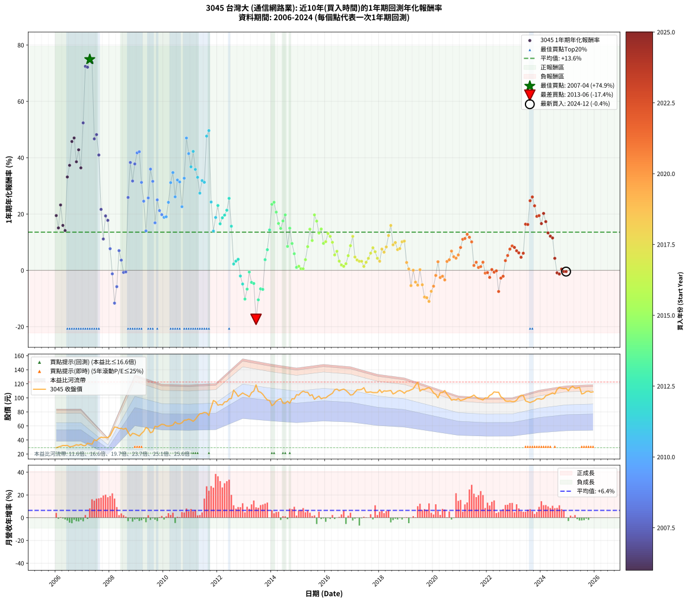

# 3045 台灣大 - 本益比與未來報酬率分析

!!! info "報告資訊"
    - **股票代號**: 3045
    - **公司名稱**: 台灣大
    - **產業別**: 通信網路業
    - **分析期間**: 2006-2024 (228 個數據點)
    - **資料來源**: Type 12 (ShowMonthlyK_ChartFlow) 月收盤價與本益比
    - **報酬率口徑**: 含現金股利 (簡化: 年度合計，假設每年7/1入帳)
    - **報告生成時間**: 2026-01-04 08:49:40 CST

## 📈 視覺化圖表

### 圖表1: 本益比 vs 未來報酬率關係

*圖表1：3045 台灣大 本益比與1年期未來報酬率關係 (2006-2024)*

### 圖表2: 歷年買入時點的1年期實際報酬率

*圖表2：3045 台灣大 歷年買入時點的1年期實際報酬率 (2006-2024)*

## 📍 買點訊號說明

本報告提供兩種買點提示訊號（顯示於圖表2的股價子圖中）：

### ▲ 小綠色三角形（回測驗證）
- **計算方式**: 使用全部歷史資料計算本益比第25百分位數
- **用途**: 事後驗證，顯示歷史上哪些時點確實為低估區
- **限制**: 當下無法判斷，僅供回測參考
- **特性**: 後見之明（Look-Ahead Bias）

### ▲ 小橘色三角形（即時訊號）
- **計算方式**: 使用截至當月的過去5年資料計算本益比第25百分位數
- **用途**: 實際投資決策，當時即可判斷
- **優勢**: 可操作性強，符合實務需求
- **特性**: 無後見之明，滾動窗口計算

!!! tip "如何使用兩種訊號"
    - **綠色▲** 幫助理解歷史估值機會，驗證策略有效性
    - **橘色▲** 可作為實際買進參考，但仍需搭配基本面分析
    - 兩種訊號重疊時，表示即時判斷與事後驗證一致，信心度較高
    - 僅有綠色▲時，表示當時無法判斷（需要未來資料才能確認）
    - 僅有橘色▲時，表示即時判斷為買點，但事後可能不是最佳時機

## 📊 估值分析摘要

| 指標 | 數值 |
|:---:|:---:|
| **目前本益比** (2024-12) | **24.84 倍** |
| **歷史平均本益比** | 19.11 倍 |
| **估值水準** | 🔴 相對高估 |
| **預期1年年化報酬率** | **+1.02%** |
| **歷史平均報酬率** | +13.56% |
| **相關係數 (R²)** | 0.4361 |
| **趨勢線斜率** | -2.1861 |

!!! abstract "核心洞察"
    目前本益比顯著高於歷史平均，預期未來報酬率可能較低

    根據歷史數據回測，3045 台灣大 在目前本益比 **24.8倍** 的估值水準下，
    預期未來1年年化報酬率約為 **+1.0%**。

    **重要提醒**: 本分析基於歷史數據統計，實際報酬率會受到公司基本面變化、產業趨勢、
    總體經濟環境等多重因素影響。R² = 0.44 表示本益比可解釋約 43.6% 的報酬率變異。

## 📈 歷史估值統計

### 最佳買點 (最高報酬率)

| 項目 | 數值 |
|:---:|:---:|
| 起始時間 | 2007-04 |
| 當時本益比 | 12.60 倍 |
| 起始價格 | 34.6 元 |
| 1年後價格 | 58.0 元 |
| **1年年化報酬率** | **+74.91%** |

### 最差買點 (最低報酬率)

| 項目 | 數值 |
|:---:|:---:|
| 起始時間 | 2013-06 |
| 當時本益比 | 19.98 倍 |
| 起始價格 | 118.5 元 |
| 1年後價格 | 92.4 元 |
| **1年年化報酬率** | **-17.39%** |

## 🎯 投資啟示

### 本益比與報酬率關係

趨勢線方程式: **y = -2.1861x + 55.3263**

!!! warning "強負相關"
    本益比與未來報酬率呈現強負相關。在高本益比時期買入，未來報酬率顯著較低；
    在低本益比時期買入，未來報酬率顯著較高。**估值紀律至關重要**。

### 估值區間建議

基於歷史數據分析:

- **🟢 低估區** (P/E < 15.3): 預期報酬率較高，可考慮增加持股
- **🟡 合理區** (P/E 15.3-22.9): 預期報酬率符合長期趨勢，正常持有
- **🔴 高估區** (P/E > 22.9): 預期報酬率較低，可考慮減碼或觀望

!!! danger "風險提示"
    - 過去表現不代表未來結果
    - 本分析假設公司基本面無重大結構性變化
    - 產業環境劇變可能使歷史規律失效
    - 應結合公司財報、產業趨勢、總體經濟等多重因素綜合判斷

!!! success "長期投資觀點"
    歷史數據顯示，在合理或低估的估值水準買入並長期持有，
    往往能獲得較佳的投資報酬。**耐心等待好價格**是價值投資的核心原則。

## 📊 數據品質

- **資料來源**: GoodInfo.tw Type 12 (ShowMonthlyK_ChartFlow)
- **資料頻率**: 月度收盤價與本益比
- **回測期間**: 2006-2024
- **數據點數量**: 228 個 (每個點代表一次1年期回測)

### 計算方法說明

1. **1年期年化報酬率**:
   - 對每個歷史時點，計算其後1年的實際投資報酬率
   - 期末價值(不含股利): 期末價格
   - 期末價值(含現金股利): 期末價格 + 持有期間內的現金股利合計 (簡化: 年度合計，假設每年7/1入帳)
   - 公式: 年化報酬率 = [(期末價值/期初價格)^(1/年數) - 1] × 100%

2. **本益比 (P/E Ratio)**:
   - 使用當時的月收盤價與EPS計算
   - 資料來源: Type 12 月度河流圖本益比數據

3. **趨勢線 (Linear Regression)**:
   - 使用最小平方法擬合線性趨勢線
   - R²值衡量本益比對報酬率的解釋能力

---

*本報告由 Stock Analysis System v1.9.0 自動生成*
*數據更新時間: 2026-01-04 08:49:40 CST*

## 📋 月度回測明細表

（每一列對應時間線圖中的一個買入點；可用來對照 SVG 圖上的每個點。）

| 買入月份 | 賣出月份 | 回測期限_年 | 實際持有年數 | 買入本益比_倍 | 買入收盤價_元 | 賣出收盤價_元 | 現金股利合計_元 | 總報酬率_pct | 年化報酬率_pct |
| --- | --- | --- | --- | --- | --- | --- | --- | --- | --- |
| 2006-01 | 2007-01 | 1 | 0.999 | 8.81 | 28.90 | 31.90 | 2.62 | +19.44 | +19.45 |
| 2006-02 | 2007-02 | 1 | 0.999 | 9.15 | 30.00 | 31.90 | 2.62 | +15.06 | +15.07 |
| 2006-03 | 2007-03 | 1 | 0.999 | 9.42 | 30.90 | 35.45 | 2.62 | +23.19 | +23.21 |
| 2006-04 | 2007-04 | 1 | 0.999 | 9.79 | 32.10 | 34.60 | 2.62 | +15.94 | +15.95 |
| 2006-05 | 2007-05 | 1 | 0.999 | 9.76 | 32.00 | 33.90 | 2.62 | +14.12 | +14.13 |
| 2006-06 | 2007-06 | 1 | 0.999 | 9.82 | 32.20 | 40.25 | 2.62 | +33.13 | +33.15 |
| 2006-07 | 2007-07 | 1 | 0.999 | 9.24 | 30.30 | 39.00 | 2.59 | +37.25 | +37.28 |
| 2006-08 | 2007-08 | 1 | 0.999 | 9.33 | 30.60 | 42.00 | 2.59 | +45.71 | +45.75 |
| 2006-09 | 2007-09 | 1 | 0.999 | 9.66 | 31.70 | 44.00 | 2.59 | +46.97 | +47.00 |
| 2006-10 | 2007-10 | 1 | 0.999 | 10.12 | 33.20 | 43.40 | 2.59 | +38.52 | +38.55 |
| 2006-11 | 2007-11 | 1 | 0.999 | 9.86 | 32.35 | 43.60 | 2.59 | +42.78 | +42.81 |
| 2006-12 | 2007-12 | 1 | 0.999 | 10.30 | 33.80 | 43.50 | 2.59 | +36.36 | +36.38 |
| 2007-01 | 2008-01 | 1 | 0.999 | 10.14 | 31.90 | 46.00 | 2.59 | +52.31 | +52.36 |
| 2007-02 | 2008-02 | 1 | 0.999 | 10.59 | 31.90 | 52.40 | 2.59 | +72.38 | +72.44 |
| 2007-03 | 2008-03 | 1 | 1.002 | 12.31 | 35.45 | 58.50 | 2.59 | +72.32 | +72.13 |
| 2007-04 | 2008-04 | 1 | 1.002 | 12.60 | 34.60 | 58.00 | 2.59 | +75.11 | +74.91 |
| 2007-05 | 2008-05 | 1 | 1.002 | 12.97 | 33.90 | 56.40 | 2.59 | +74.01 | +73.81 |
| 2007-06 | 2008-06 | 1 | 1.002 | 16.23 | 40.25 | 56.50 | 2.59 | +46.80 | +46.69 |
| 2007-07 | 2008-07 | 1 | 1.002 | 16.62 | 39.00 | 55.30 | 2.54 | +48.32 | +48.20 |
| 2007-08 | 2008-08 | 1 | 1.002 | 18.98 | 42.00 | 56.70 | 2.54 | +41.05 | +40.96 |
| 2007-09 | 2008-09 | 1 | 1.002 | 21.15 | 44.00 | 51.00 | 2.54 | +21.69 | +21.64 |
| 2007-10 | 2008-10 | 1 | 1.002 | 22.29 | 43.40 | 45.70 | 2.54 | +11.16 | +11.13 |
| 2007-11 | 2008-11 | 1 | 1.002 | 24.04 | 43.60 | 49.50 | 2.54 | +19.36 | +19.32 |
| 2007-12 | 2008-12 | 1 | 1.002 | 25.89 | 43.50 | 48.70 | 2.54 | +17.80 | +17.76 |
| 2008-01 | 2009-01 | 1 | 1.002 | 23.33 | 46.00 | 47.00 | 2.54 | +7.70 | +7.69 |
| 2008-02 | 2009-03 | 1 | 1.081 | 23.15 | 52.40 | 49.15 | 2.54 | -1.35 | -1.25 |
| 2008-03 | 2009-03 | 1 | 0.999 | 22.90 | 58.50 | 49.15 | 2.54 | -11.64 | -11.64 |
| 2008-04 | 2009-04 | 1 | 0.999 | 20.37 | 58.00 | 52.10 | 2.54 | -5.79 | -5.79 |
| 2008-05 | 2009-05 | 1 | 0.999 | 17.97 | 56.40 | 57.80 | 2.54 | +6.99 | +7.00 |
| 2008-06 | 2009-06 | 1 | 0.999 | 16.47 | 56.50 | 56.00 | 2.54 | +3.62 | +3.62 |
| 2008-07 | 2009-07 | 1 | 0.999 | 14.86 | 55.30 | 50.20 | 4.69 | -0.75 | -0.75 |
| 2008-08 | 2009-08 | 1 | 0.999 | 14.13 | 56.70 | 51.70 | 4.69 | -0.55 | -0.55 |
| 2008-09 | 2009-09 | 1 | 0.999 | 11.85 | 51.00 | 59.50 | 4.69 | +25.86 | +25.88 |
| 2008-10 | 2009-10 | 1 | 0.999 | 9.94 | 45.70 | 58.50 | 4.69 | +38.26 | +38.30 |
| 2008-11 | 2009-11 | 1 | 0.999 | 10.13 | 49.50 | 60.50 | 4.69 | +31.69 | +31.72 |
| 2008-12 | 2009-12 | 1 | 0.999 | 9.40 | 48.70 | 62.40 | 4.69 | +37.76 | +37.79 |
| 2009-01 | 2010-01 | 1 | 0.999 | 9.15 | 47.00 | 61.90 | 4.69 | +41.67 | +41.71 |
| 2009-02 | 2010-02 | 1 | 0.999 | 8.95 | 45.60 | 60.10 | 4.69 | +42.08 | +42.11 |
| 2009-03 | 2010-03 | 1 | 0.999 | 9.73 | 49.15 | 59.80 | 4.69 | +31.20 | +31.23 |
| 2009-04 | 2010-04 | 1 | 0.999 | 10.41 | 52.10 | 60.20 | 4.69 | +24.54 | +24.56 |
| 2009-05 | 2010-05 | 1 | 0.999 | 11.65 | 57.80 | 61.20 | 4.69 | +13.99 | +14.00 |
| 2009-06 | 2010-06 | 1 | 0.999 | 11.38 | 56.00 | 65.70 | 4.69 | +25.69 | +25.71 |
| 2009-07 | 2010-07 | 1 | 0.999 | 10.29 | 50.20 | 63.20 | 5.03 | +35.91 | +35.94 |
| 2009-08 | 2010-08 | 1 | 0.999 | 10.70 | 51.70 | 63.00 | 5.03 | +31.58 | +31.61 |
| 2009-09 | 2010-09 | 1 | 0.999 | 12.42 | 59.50 | 64.50 | 5.03 | +16.85 | +16.87 |
| 2009-10 | 2010-10 | 1 | 0.999 | 12.32 | 58.50 | 68.10 | 5.03 | +25.01 | +25.02 |
| 2009-11 | 2010-11 | 1 | 0.999 | 12.86 | 60.50 | 68.30 | 5.03 | +21.20 | +21.22 |
| 2009-12 | 2010-12 | 1 | 0.999 | 13.39 | 62.40 | 69.70 | 5.03 | +19.76 | +19.77 |
| 2010-01 | 2011-01 | 1 | 0.999 | 13.29 | 61.90 | 68.50 | 5.03 | +18.79 | +18.80 |
| 2010-02 | 2011-02 | 1 | 0.999 | 12.92 | 60.10 | 66.50 | 5.03 | +19.01 | +19.03 |
| 2010-03 | 2011-03 | 1 | 0.999 | 12.86 | 59.80 | 69.20 | 5.03 | +24.13 | +24.15 |
| 2010-04 | 2011-04 | 1 | 0.999 | 12.96 | 60.20 | 73.90 | 5.03 | +31.11 | +31.13 |
| 2010-05 | 2011-05 | 1 | 0.999 | 13.18 | 61.20 | 77.40 | 5.03 | +34.69 | +34.71 |
| 2010-06 | 2011-06 | 1 | 0.999 | 14.16 | 65.70 | 77.80 | 5.03 | +26.07 | +26.09 |
| 2010-07 | 2011-07 | 1 | 0.999 | 13.63 | 63.20 | 79.30 | 4.16 | +32.06 | +32.09 |
| 2010-08 | 2011-08 | 1 | 0.999 | 13.60 | 63.00 | 78.60 | 4.16 | +31.37 | +31.39 |
| 2010-09 | 2011-09 | 1 | 0.999 | 13.93 | 64.50 | 74.90 | 4.16 | +22.58 | +22.59 |
| 2010-10 | 2011-10 | 1 | 0.999 | 14.72 | 68.10 | 86.20 | 4.16 | +32.69 | +32.72 |
| 2010-11 | 2011-11 | 1 | 0.999 | 14.77 | 68.30 | 96.20 | 4.16 | +46.94 | +46.98 |
| 2010-12 | 2011-12 | 1 | 0.999 | 15.09 | 69.70 | 94.40 | 4.16 | +41.41 | +41.44 |
| 2011-01 | 2012-01 | 1 | 0.999 | 14.81 | 68.50 | 89.50 | 4.16 | +36.73 | +36.76 |
| 2011-02 | 2012-02 | 1 | 0.999 | 14.35 | 66.50 | 90.40 | 4.16 | +42.20 | +42.23 |
| 2011-03 | 2012-03 | 1 | 1.002 | 14.91 | 69.20 | 89.90 | 4.16 | +35.93 | +35.84 |
| 2011-04 | 2012-04 | 1 | 1.002 | 15.90 | 73.90 | 94.20 | 4.16 | +33.10 | +33.02 |
| 2011-05 | 2012-05 | 1 | 1.002 | 16.63 | 77.40 | 94.50 | 4.16 | +27.47 | +27.41 |
| 2011-06 | 2012-06 | 1 | 1.002 | 16.70 | 77.80 | 98.50 | 4.16 | +31.96 | +31.88 |
| 2011-07 | 2012-07 | 1 | 1.002 | 16.99 | 79.30 | 99.00 | 5.16 | +31.35 | +31.28 |
| 2011-08 | 2012-08 | 1 | 1.002 | 16.82 | 78.60 | 111.00 | 5.16 | +47.79 | +47.67 |
| 2011-09 | 2012-09 | 1 | 1.002 | 16.00 | 74.90 | 107.00 | 5.16 | +49.75 | +49.62 |
| 2011-10 | 2012-10 | 1 | 1.002 | 18.39 | 86.20 | 102.00 | 5.16 | +24.32 | +24.26 |
| 2011-11 | 2012-11 | 1 | 1.002 | 20.50 | 96.20 | 104.50 | 5.16 | +13.99 | +13.96 |
| 2011-12 | 2012-12 | 1 | 1.002 | 20.09 | 94.40 | 107.00 | 5.16 | +18.81 | +18.77 |
| 2012-01 | 2013-01 | 1 | 1.002 | 18.59 | 89.50 | 105.00 | 5.16 | +23.08 | +23.03 |
| 2012-02 | 2013-03 | 1 | 1.081 | 18.34 | 90.40 | 101.50 | 5.16 | +17.99 | +16.53 |
| 2012-03 | 2013-03 | 1 | 0.999 | 17.83 | 89.90 | 101.50 | 5.16 | +18.64 | +18.66 |
| 2012-04 | 2013-04 | 1 | 0.999 | 18.27 | 94.20 | 107.50 | 5.16 | +19.60 | +19.61 |
| 2012-05 | 2013-05 | 1 | 0.999 | 17.93 | 94.50 | 109.50 | 5.16 | +21.33 | +21.35 |
| 2012-06 | 2013-06 | 1 | 0.999 | 18.29 | 98.50 | 118.50 | 5.16 | +25.54 | +25.56 |
| 2012-07 | 2013-07 | 1 | 0.999 | 18.00 | 99.00 | 109.00 | 5.50 | +15.66 | +15.67 |
| 2012-08 | 2013-08 | 1 | 0.999 | 19.77 | 111.00 | 108.00 | 5.50 | +2.25 | +2.25 |
| 2012-09 | 2013-09 | 1 | 0.999 | 18.68 | 107.00 | 105.00 | 5.50 | +3.27 | +3.27 |
| 2012-10 | 2013-10 | 1 | 0.999 | 17.46 | 102.00 | 100.50 | 5.50 | +3.92 | +3.92 |
| 2012-11 | 2013-11 | 1 | 0.999 | 17.55 | 104.50 | 96.90 | 5.50 | -2.01 | -2.01 |
| 2012-12 | 2013-12 | 1 | 0.999 | 17.63 | 107.00 | 96.30 | 5.50 | -4.86 | -4.86 |
| 2013-01 | 2014-01 | 1 | 0.999 | 17.36 | 105.00 | 88.80 | 5.50 | -10.19 | -10.20 |
| 2013-02 | 2014-02 | 1 | 0.999 | 17.18 | 103.50 | 91.10 | 5.50 | -6.67 | -6.67 |
| 2013-03 | 2014-03 | 1 | 0.999 | 16.92 | 101.50 | 95.40 | 5.50 | -0.59 | -0.59 |
| 2013-04 | 2014-04 | 1 | 0.999 | 17.99 | 107.50 | 97.40 | 5.50 | -4.28 | -4.28 |
| 2013-05 | 2014-05 | 1 | 0.999 | 18.39 | 109.50 | 98.90 | 5.50 | -4.66 | -4.66 |
| 2013-06 | 2014-06 | 1 | 0.999 | 19.98 | 118.50 | 92.40 | 5.50 | -17.38 | -17.39 |
| 2013-07 | 2014-07 | 1 | 0.999 | 18.45 | 109.00 | 92.00 | 5.60 | -10.46 | -10.47 |
| 2013-08 | 2014-08 | 1 | 0.999 | 18.36 | 108.00 | 95.30 | 5.60 | -6.57 | -6.58 |
| 2013-09 | 2014-09 | 1 | 0.999 | 17.92 | 105.00 | 92.30 | 5.60 | -6.76 | -6.77 |
| 2013-10 | 2014-10 | 1 | 0.999 | 17.22 | 100.50 | 98.70 | 5.60 | +3.78 | +3.78 |
| 2013-11 | 2014-11 | 1 | 0.999 | 16.67 | 96.90 | 98.40 | 5.60 | +7.33 | +7.33 |
| 2013-12 | 2014-12 | 1 | 0.999 | 16.63 | 96.30 | 104.50 | 5.60 | +14.33 | +14.34 |
| 2014-01 | 2015-01 | 1 | 0.999 | 15.39 | 88.80 | 104.00 | 5.60 | +23.42 | +23.44 |
| 2014-02 | 2015-02 | 1 | 0.999 | 15.84 | 91.10 | 107.50 | 5.60 | +24.15 | +24.17 |
| 2014-03 | 2015-03 | 1 | 0.999 | 16.64 | 95.40 | 109.50 | 5.60 | +20.65 | +20.67 |
| 2014-04 | 2015-04 | 1 | 0.999 | 17.05 | 97.40 | 108.00 | 5.60 | +16.63 | +16.64 |
| 2014-05 | 2015-05 | 1 | 0.999 | 17.37 | 98.90 | 108.00 | 5.60 | +14.86 | +14.87 |
| 2014-06 | 2015-06 | 1 | 0.999 | 16.28 | 92.40 | 103.00 | 5.60 | +17.53 | +17.55 |
| 2014-07 | 2015-07 | 1 | 0.999 | 16.27 | 92.00 | 104.50 | 5.60 | +19.67 | +19.69 |
| 2014-08 | 2015-08 | 1 | 0.999 | 16.91 | 95.30 | 97.80 | 5.60 | +8.50 | +8.51 |
| 2014-09 | 2015-09 | 1 | 0.999 | 16.43 | 92.30 | 100.50 | 5.60 | +14.95 | +14.96 |
| 2014-10 | 2015-10 | 1 | 0.999 | 17.63 | 98.70 | 102.50 | 5.60 | +9.52 | +9.53 |
| 2014-11 | 2015-11 | 1 | 0.999 | 17.64 | 98.40 | 98.60 | 5.60 | +5.89 | +5.90 |
| 2014-12 | 2015-12 | 1 | 0.999 | 18.79 | 104.50 | 100.00 | 5.60 | +1.05 | +1.05 |
| 2015-01 | 2016-01 | 1 | 0.999 | 18.65 | 104.00 | 99.90 | 5.60 | +1.44 | +1.44 |
| 2015-02 | 2016-02 | 1 | 0.999 | 19.22 | 107.50 | 102.50 | 5.60 | +0.56 | +0.56 |
| 2015-03 | 2016-03 | 1 | 1.002 | 19.52 | 109.50 | 104.50 | 5.60 | +0.55 | +0.55 |
| 2015-04 | 2016-04 | 1 | 1.002 | 19.19 | 108.00 | 106.50 | 5.60 | +3.80 | +3.79 |
| 2015-05 | 2016-05 | 1 | 1.002 | 19.14 | 108.00 | 111.50 | 5.60 | +8.43 | +8.41 |
| 2015-06 | 2016-06 | 1 | 1.002 | 18.20 | 103.00 | 112.50 | 5.60 | +14.66 | +14.63 |
| 2015-07 | 2016-07 | 1 | 1.002 | 18.41 | 104.50 | 110.00 | 5.60 | +10.62 | +10.60 |
| 2015-08 | 2016-08 | 1 | 1.002 | 17.18 | 97.80 | 111.50 | 5.60 | +19.73 | +19.69 |
| 2015-09 | 2016-09 | 1 | 1.002 | 17.60 | 100.50 | 112.50 | 5.60 | +17.51 | +17.47 |
| 2015-10 | 2016-10 | 1 | 1.002 | 17.90 | 102.50 | 110.50 | 5.60 | +13.27 | +13.24 |
| 2015-11 | 2016-11 | 1 | 1.002 | 17.17 | 98.60 | 107.50 | 5.60 | +14.71 | +14.67 |
| 2015-12 | 2016-12 | 1 | 1.002 | 17.36 | 100.00 | 104.00 | 5.60 | +9.60 | +9.58 |
| 2016-01 | 2017-01 | 1 | 1.002 | 17.38 | 99.90 | 104.50 | 5.60 | +10.21 | +10.19 |
| 2016-02 | 2017-03 | 1 | 1.081 | 17.86 | 102.50 | 111.50 | 5.60 | +14.24 | +13.10 |
| 2016-03 | 2017-03 | 1 | 0.999 | 18.25 | 104.50 | 111.50 | 5.60 | +12.06 | +12.07 |
| 2016-04 | 2017-04 | 1 | 0.999 | 18.63 | 106.50 | 111.50 | 5.60 | +9.95 | +9.96 |
| 2016-05 | 2017-05 | 1 | 0.999 | 19.54 | 111.50 | 112.00 | 5.60 | +5.47 | +5.47 |
| 2016-06 | 2017-06 | 1 | 0.999 | 19.75 | 112.50 | 114.50 | 5.60 | +6.76 | +6.76 |
| 2016-07 | 2017-07 | 1 | 0.999 | 19.35 | 110.00 | 108.00 | 5.60 | +3.27 | +3.28 |
| 2016-08 | 2017-08 | 1 | 0.999 | 19.65 | 111.50 | 108.00 | 5.60 | +1.88 | +1.88 |
| 2016-09 | 2017-09 | 1 | 0.999 | 19.87 | 112.50 | 108.50 | 5.60 | +1.42 | +1.42 |
| 2016-10 | 2017-10 | 1 | 0.999 | 19.55 | 110.50 | 107.50 | 5.60 | +2.35 | +2.35 |
| 2016-11 | 2017-11 | 1 | 0.999 | 19.06 | 107.50 | 107.50 | 5.60 | +5.21 | +5.21 |
| 2016-12 | 2017-12 | 1 | 0.999 | 18.47 | 104.00 | 107.50 | 5.60 | +8.75 | +8.76 |
| 2017-01 | 2018-01 | 1 | 0.999 | 18.68 | 104.50 | 111.50 | 5.60 | +12.06 | +12.07 |
| 2017-02 | 2018-02 | 1 | 0.999 | 19.42 | 108.00 | 107.50 | 5.60 | +4.72 | +4.73 |
| 2017-03 | 2018-03 | 1 | 0.999 | 20.18 | 111.50 | 110.00 | 5.60 | +3.68 | +3.68 |
| 2017-04 | 2018-04 | 1 | 0.999 | 20.31 | 111.50 | 109.50 | 5.60 | +3.23 | +3.23 |
| 2017-05 | 2018-05 | 1 | 0.999 | 20.53 | 112.00 | 110.00 | 5.60 | +3.21 | +3.22 |
| 2017-06 | 2018-06 | 1 | 0.999 | 21.13 | 114.50 | 110.50 | 5.60 | +1.40 | +1.40 |
| 2017-07 | 2018-07 | 1 | 0.999 | 20.06 | 108.00 | 105.50 | 5.60 | +2.87 | +2.87 |
| 2017-08 | 2018-08 | 1 | 0.999 | 20.19 | 108.00 | 107.00 | 5.60 | +4.26 | +4.26 |
| 2017-09 | 2018-09 | 1 | 0.999 | 20.41 | 108.50 | 109.50 | 5.60 | +6.08 | +6.09 |
| 2017-10 | 2018-10 | 1 | 0.999 | 20.36 | 107.50 | 110.50 | 5.60 | +8.00 | +8.01 |
| 2017-11 | 2018-11 | 1 | 0.999 | 20.50 | 107.50 | 109.00 | 5.60 | +6.60 | +6.61 |
| 2017-12 | 2018-12 | 1 | 0.999 | 20.63 | 107.50 | 106.50 | 5.60 | +4.28 | +4.28 |
| 2018-01 | 2019-01 | 1 | 0.999 | 21.47 | 111.50 | 109.50 | 5.60 | +3.23 | +3.23 |
| 2018-02 | 2019-02 | 1 | 0.999 | 20.77 | 107.50 | 110.00 | 5.60 | +7.53 | +7.54 |
| 2018-03 | 2019-03 | 1 | 0.999 | 21.32 | 110.00 | 111.50 | 5.60 | +6.45 | +6.46 |
| 2018-04 | 2019-04 | 1 | 0.999 | 21.29 | 109.50 | 113.00 | 5.60 | +8.31 | +8.32 |
| 2018-05 | 2019-05 | 1 | 0.999 | 21.46 | 110.00 | 118.00 | 5.60 | +12.36 | +12.37 |
| 2018-06 | 2019-06 | 1 | 0.999 | 21.62 | 110.50 | 122.50 | 5.60 | +15.93 | +15.94 |
| 2018-07 | 2019-07 | 1 | 0.999 | 20.71 | 105.50 | 109.50 | 5.55 | +9.05 | +9.06 |
| 2018-08 | 2019-08 | 1 | 0.999 | 21.08 | 107.00 | 112.00 | 5.55 | +9.86 | +9.87 |
| 2018-09 | 2019-09 | 1 | 0.999 | 21.64 | 109.50 | 112.00 | 5.55 | +7.35 | +7.36 |
| 2018-10 | 2019-10 | 1 | 0.999 | 21.91 | 110.50 | 113.50 | 5.55 | +7.74 | +7.74 |
| 2018-11 | 2019-11 | 1 | 0.999 | 21.68 | 109.00 | 114.50 | 5.55 | +10.14 | +10.14 |
| 2018-12 | 2019-12 | 1 | 0.999 | 21.26 | 106.50 | 112.00 | 5.55 | +10.37 | +10.38 |
| 2019-01 | 2020-01 | 1 | 0.999 | 22.04 | 109.50 | 107.00 | 5.55 | +2.78 | +2.79 |
| 2019-02 | 2020-02 | 1 | 0.999 | 22.33 | 110.00 | 105.00 | 5.55 | +0.50 | +0.50 |
| 2019-03 | 2020-03 | 1 | 1.002 | 22.82 | 111.50 | 99.90 | 5.55 | -5.43 | -5.42 |
| 2019-04 | 2020-04 | 1 | 1.002 | 23.33 | 113.00 | 107.50 | 5.55 | +0.04 | +0.04 |
| 2019-05 | 2020-05 | 1 | 1.002 | 24.57 | 118.00 | 107.50 | 5.55 | -4.20 | -4.19 |
| 2019-06 | 2020-06 | 1 | 1.002 | 25.74 | 122.50 | 110.50 | 5.55 | -5.27 | -5.26 |
| 2019-07 | 2020-07 | 1 | 1.002 | 23.21 | 109.50 | 105.00 | 4.75 | +0.23 | +0.23 |
| 2019-08 | 2020-08 | 1 | 1.002 | 23.95 | 112.00 | 101.50 | 4.75 | -5.13 | -5.12 |
| 2019-09 | 2020-09 | 1 | 1.002 | 24.16 | 112.00 | 96.60 | 4.75 | -9.51 | -9.49 |
| 2019-10 | 2020-10 | 1 | 1.002 | 24.71 | 113.50 | 97.70 | 4.75 | -9.74 | -9.72 |
| 2019-11 | 2020-11 | 1 | 1.002 | 25.16 | 114.50 | 97.10 | 4.75 | -11.05 | -11.03 |
| 2019-12 | 2020-12 | 1 | 1.002 | 24.83 | 112.00 | 98.90 | 4.75 | -7.46 | -7.44 |
| 2020-01 | 2021-01 | 1 | 1.002 | 23.95 | 107.00 | 96.20 | 4.75 | -5.65 | -5.64 |
| 2020-02 | 2021-03 | 1 | 1.081 | 23.72 | 105.00 | 98.20 | 4.75 | -1.95 | -1.81 |
| 2020-03 | 2021-03 | 1 | 0.999 | 22.78 | 99.90 | 98.20 | 4.75 | +3.05 | +3.06 |
| 2020-04 | 2021-04 | 1 | 0.999 | 24.75 | 107.50 | 100.00 | 4.75 | -2.56 | -2.56 |
| 2020-05 | 2021-05 | 1 | 0.999 | 24.99 | 107.50 | 100.50 | 4.75 | -2.09 | -2.09 |
| 2020-06 | 2021-06 | 1 | 0.999 | 25.94 | 110.50 | 102.00 | 4.75 | -3.39 | -3.40 |
| 2020-07 | 2021-07 | 1 | 0.999 | 24.89 | 105.00 | 104.00 | 4.30 | +3.14 | +3.15 |
| 2020-08 | 2021-08 | 1 | 0.999 | 24.30 | 101.50 | 101.00 | 4.30 | +3.74 | +3.75 |
| 2020-09 | 2021-09 | 1 | 0.999 | 23.36 | 96.60 | 98.90 | 4.30 | +6.83 | +6.84 |
| 2020-10 | 2021-10 | 1 | 0.999 | 23.87 | 97.70 | 98.10 | 4.30 | +4.81 | +4.81 |
| 2020-11 | 2021-11 | 1 | 0.999 | 23.97 | 97.10 | 97.00 | 4.30 | +4.33 | +4.33 |
| 2020-12 | 2021-12 | 1 | 0.999 | 24.66 | 98.90 | 100.00 | 4.30 | +5.46 | +5.46 |
| 2021-01 | 2022-01 | 1 | 0.999 | 24.04 | 96.20 | 99.70 | 4.30 | +8.11 | +8.11 |
| 2021-02 | 2022-02 | 1 | 0.999 | 24.33 | 97.10 | 103.50 | 4.30 | +11.02 | +11.03 |
| 2021-03 | 2022-03 | 1 | 0.999 | 24.66 | 98.20 | 105.00 | 4.30 | +11.30 | +11.31 |
| 2021-04 | 2022-04 | 1 | 0.999 | 25.17 | 100.00 | 108.50 | 4.30 | +12.80 | +12.81 |
| 2021-05 | 2022-05 | 1 | 0.999 | 25.35 | 100.50 | 108.00 | 4.30 | +11.74 | +11.75 |
| 2021-06 | 2022-06 | 1 | 0.999 | 25.79 | 102.00 | 108.00 | 4.30 | +10.10 | +10.11 |
| 2021-07 | 2022-07 | 1 | 0.999 | 26.36 | 104.00 | 101.50 | 4.30 | +1.73 | +1.73 |
| 2021-08 | 2022-08 | 1 | 0.999 | 25.66 | 101.00 | 99.60 | 4.30 | +2.87 | +2.87 |
| 2021-09 | 2022-09 | 1 | 0.999 | 25.18 | 98.90 | 95.60 | 4.30 | +1.01 | +1.01 |
| 2021-10 | 2022-10 | 1 | 0.999 | 25.04 | 98.10 | 95.10 | 4.30 | +1.33 | +1.33 |
| 2021-11 | 2022-11 | 1 | 0.999 | 24.81 | 97.00 | 95.50 | 4.30 | +2.89 | +2.89 |
| 2021-12 | 2022-12 | 1 | 0.999 | 25.64 | 100.00 | 94.70 | 4.30 | -1.00 | -1.00 |
| 2022-01 | 2023-01 | 1 | 0.999 | 25.56 | 99.70 | 94.60 | 4.30 | -0.80 | -0.80 |
| 2022-02 | 2023-02 | 1 | 0.999 | 26.53 | 103.50 | 96.60 | 4.30 | -2.51 | -2.51 |
| 2022-03 | 2023-03 | 1 | 0.999 | 26.91 | 105.00 | 101.00 | 4.30 | +0.29 | +0.29 |
| 2022-04 | 2023-04 | 1 | 0.999 | 27.80 | 108.50 | 103.50 | 4.30 | -0.65 | -0.65 |
| 2022-05 | 2023-05 | 1 | 0.999 | 27.66 | 108.00 | 103.50 | 4.30 | -0.19 | -0.19 |
| 2022-06 | 2023-06 | 1 | 0.999 | 27.66 | 108.00 | 95.60 | 4.30 | -7.50 | -7.50 |
| 2022-07 | 2023-07 | 1 | 0.999 | 25.99 | 101.50 | 94.40 | 4.30 | -2.76 | -2.76 |
| 2022-08 | 2023-08 | 1 | 0.999 | 25.49 | 99.60 | 93.20 | 4.30 | -2.11 | -2.11 |
| 2022-09 | 2023-09 | 1 | 0.999 | 24.47 | 95.60 | 94.60 | 4.30 | +3.45 | +3.45 |
| 2022-10 | 2023-10 | 1 | 0.999 | 24.33 | 95.10 | 95.80 | 4.30 | +5.26 | +5.26 |
| 2022-11 | 2023-11 | 1 | 0.999 | 24.43 | 95.50 | 98.40 | 4.30 | +7.54 | +7.54 |
| 2022-12 | 2023-12 | 1 | 0.999 | 24.22 | 94.70 | 98.60 | 4.30 | +8.66 | +8.67 |
| 2023-01 | 2024-01 | 1 | 0.999 | 23.98 | 94.60 | 98.00 | 4.30 | +8.14 | +8.15 |
| 2023-02 | 2024-02 | 1 | 0.999 | 24.27 | 96.60 | 99.00 | 4.30 | +6.94 | +6.94 |
| 2023-03 | 2024-03 | 1 | 1.002 | 25.16 | 101.00 | 103.00 | 4.30 | +6.24 | +6.22 |
| 2023-04 | 2024-04 | 1 | 1.002 | 25.56 | 103.50 | 104.00 | 4.30 | +4.64 | +4.63 |
| 2023-05 | 2024-05 | 1 | 1.002 | 25.34 | 103.50 | 105.50 | 4.30 | +6.09 | +6.07 |
| 2023-06 | 2024-06 | 1 | 1.002 | 23.20 | 95.60 | 107.00 | 4.30 | +16.42 | +16.39 |
| 2023-07 | 2024-07 | 1 | 1.002 | 22.72 | 94.40 | 105.50 | 4.30 | +16.31 | +16.28 |
| 2023-08 | 2024-08 | 1 | 1.002 | 22.24 | 93.20 | 112.00 | 4.30 | +24.79 | +24.73 |
| 2023-09 | 2024-09 | 1 | 1.002 | 22.39 | 94.60 | 115.00 | 4.30 | +26.11 | +26.05 |
| 2023-10 | 2024-10 | 1 | 1.002 | 22.49 | 95.80 | 113.50 | 4.30 | +22.96 | +22.91 |
| 2023-11 | 2024-11 | 1 | 1.002 | 22.91 | 98.40 | 113.00 | 4.30 | +19.21 | +19.16 |
| 2023-12 | 2024-12 | 1 | 1.002 | 22.77 | 98.60 | 113.50 | 4.30 | +19.47 | +19.43 |
| 2024-01 | 2025-01 | 1 | 1.002 | 22.53 | 98.00 | 110.00 | 4.30 | +16.63 | +16.60 |
| 2024-02 | 2025-03 | 1 | 1.081 | 22.65 | 99.00 | 116.50 | 4.30 | +22.02 | +20.20 |
| 2024-03 | 2025-03 | 1 | 0.999 | 23.46 | 103.00 | 116.50 | 4.30 | +17.28 | +17.29 |
| 2024-04 | 2025-04 | 1 | 0.999 | 23.58 | 104.00 | 113.50 | 4.30 | +13.27 | +13.28 |
| 2024-05 | 2025-05 | 1 | 0.999 | 23.81 | 105.50 | 114.00 | 4.30 | +12.13 | +12.14 |
| 2024-06 | 2025-06 | 1 | 0.999 | 24.04 | 107.00 | 115.00 | 4.30 | +11.50 | +11.50 |
| 2024-07 | 2025-07 | 1 | 0.999 | 23.60 | 105.50 | 105.50 | 4.50 | +4.27 | +4.27 |
| 2024-08 | 2025-08 | 1 | 0.999 | 24.94 | 112.00 | 106.50 | 4.50 | -0.89 | -0.89 |
| 2024-09 | 2025-09 | 1 | 0.999 | 25.50 | 115.00 | 109.00 | 4.50 | -1.30 | -1.31 |
| 2024-10 | 2025-10 | 1 | 0.999 | 25.06 | 113.50 | 109.50 | 4.50 | +0.44 | +0.44 |
| 2024-11 | 2025-11 | 1 | 0.999 | 24.84 | 113.00 | 108.00 | 4.50 | -0.44 | -0.44 |
| 2024-12 | 2025-12 | 1 | 0.999 | 24.84 | 113.50 | 108.50 | 4.50 | -0.44 | -0.44 |
