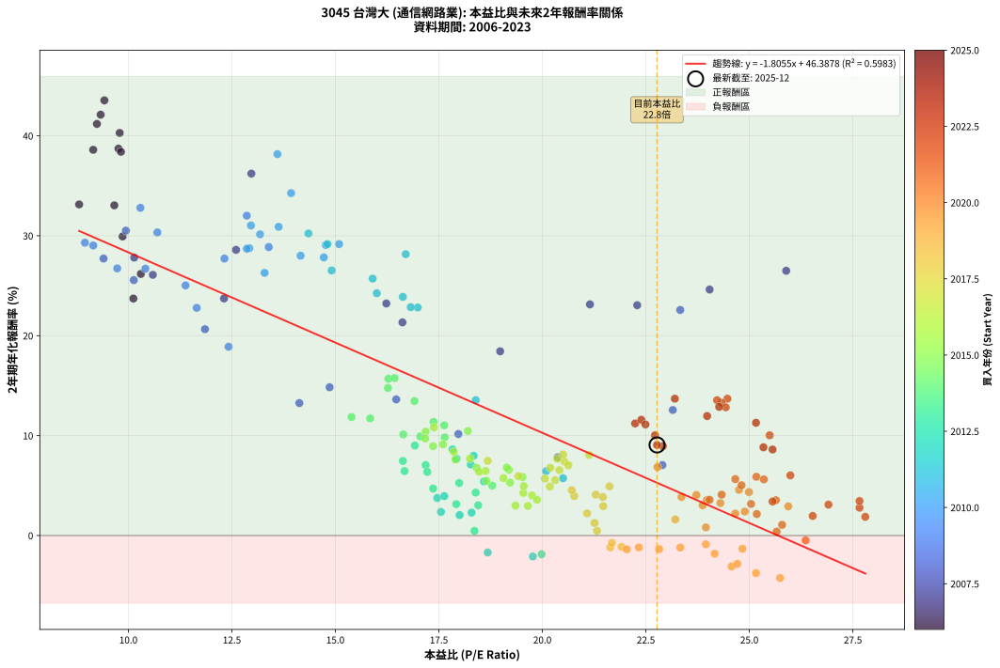
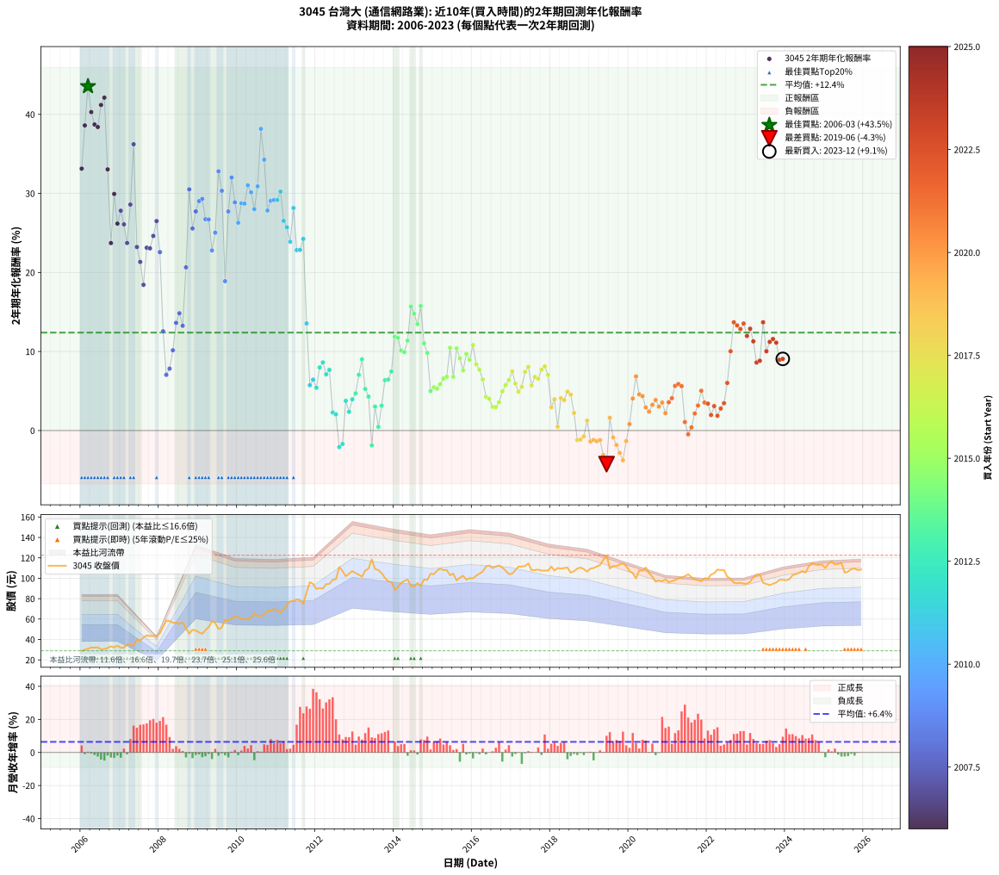

# 3045 台灣大 - 本益比與未來報酬率分析

!!! info "報告資訊"
    - **股票代號**: 3045
    - **公司名稱**: 台灣大
    - **產業別**: 通信網路業
    - **分析期間**: 2006-2023 (216 個數據點)
    - **資料來源**: Type 12 (ShowMonthlyK_ChartFlow) 月收盤價與本益比
    - **報酬率口徑**: 含現金股利 (簡化: 年度合計，假設每年7/1入帳)
    - **報告生成時間**: 2026-01-13 13:39:59 CST

## 📈 視覺化圖表

### 圖表1: 本益比 vs 未來報酬率關係

*圖表1：3045 台灣大 本益比與2年期未來報酬率關係 (2006-2023)*

### 圖表2: 歷年買入時點的2年期實際報酬率

*圖表2：3045 台灣大 歷年買入時點的2年期實際報酬率 (2006-2023)*

## 📍 買點訊號說明

本報告提供兩種買點提示訊號（顯示於圖表2的股價子圖中）：

### ▲ 小綠色三角形（回測驗證）
- **計算方式**: 使用全部歷史資料計算本益比第25百分位數
- **用途**: 事後驗證，顯示歷史上哪些時點確實為低估區
- **限制**: 當下無法判斷，僅供回測參考
- **特性**: 後見之明（Look-Ahead Bias）

### ▲ 小橘色三角形（即時訊號）
- **計算方式**: 使用截至當月的過去5年資料計算本益比第25百分位數
- **用途**: 實際投資決策，當時即可判斷
- **優勢**: 可操作性強，符合實務需求
- **特性**: 無後見之明，滾動窗口計算

!!! tip "如何使用兩種訊號"
    - **綠色▲** 幫助理解歷史估值機會，驗證策略有效性
    - **橘色▲** 可作為實際買進參考，但仍需搭配基本面分析
    - 兩種訊號重疊時，表示即時判斷與事後驗證一致，信心度較高
    - 僅有綠色▲時，表示當時無法判斷（需要未來資料才能確認）
    - 僅有橘色▲時，表示即時判斷為買點，但事後可能不是最佳時機

## 📊 估值分析摘要

| 指標 | 數值 |
|:---:|:---:|
| **目前本益比** (2023-12) | **22.77 倍** |
| **歷史平均本益比** | 18.83 倍 |
| **估值水準** | 🔴 相對高估 |
| **預期2年年化報酬率** | **+5.28%** |
| **歷史平均報酬率** | +12.39% |
| **相關係數 (R²)** | 0.5983 |
| **趨勢線斜率** | -1.8055 |

!!! abstract "核心洞察"
    目前本益比顯著高於歷史平均，預期未來報酬率可能較低

    根據歷史數據回測，3045 台灣大 在目前本益比 **22.8倍** 的估值水準下，
    預期未來2年年化報酬率約為 **+5.3%**。

    **重要提醒**: 本分析基於歷史數據統計，實際報酬率會受到公司基本面變化、產業趨勢、
    總體經濟環境等多重因素影響。R² = 0.60 表示本益比可解釋約 59.8% 的報酬率變異。

## 📈 歷史估值統計

### 最佳買點 (最高報酬率)

| 項目 | 數值 |
|:---:|:---:|
| 起始時間 | 2006-03 |
| 當時本益比 | 9.42 倍 |
| 起始價格 | 30.9 元 |
| 2年後價格 | 58.5 元 |
| **2年年化報酬率** | **+43.55%** |

### 最差買點 (最低報酬率)

| 項目 | 數值 |
|:---:|:---:|
| 起始時間 | 2019-06 |
| 當時本益比 | 25.74 倍 |
| 起始價格 | 122.5 元 |
| 2年後價格 | 102.0 元 |
| **2年年化報酬率** | **-4.25%** |

## 🎯 投資啟示

### 本益比與報酬率關係

趨勢線方程式: **y = -1.8055x + 46.3878**

!!! warning "強負相關"
    本益比與未來報酬率呈現強負相關。在高本益比時期買入，未來報酬率顯著較低；
    在低本益比時期買入，未來報酬率顯著較高。**估值紀律至關重要**。

### 估值區間建議

基於歷史數據分析:

- **🟢 低估區** (P/E < 15.1): 預期報酬率較高，可考慮增加持股
- **🟡 合理區** (P/E 15.1-22.6): 預期報酬率符合長期趨勢，正常持有
- **🔴 高估區** (P/E > 22.6): 預期報酬率較低，可考慮減碼或觀望

!!! danger "風險提示"
    - 過去表現不代表未來結果
    - 本分析假設公司基本面無重大結構性變化
    - 產業環境劇變可能使歷史規律失效
    - 應結合公司財報、產業趨勢、總體經濟等多重因素綜合判斷

!!! success "長期投資觀點"
    歷史數據顯示，在合理或低估的估值水準買入並長期持有，
    往往能獲得較佳的投資報酬。**耐心等待好價格**是價值投資的核心原則。

## 📊 數據品質

- **資料來源**: GoodInfo.tw Type 12 (ShowMonthlyK_ChartFlow)
- **資料頻率**: 月度收盤價與本益比
- **回測期間**: 2006-2023
- **數據點數量**: 216 個 (每個點代表一次2年期回測)

### 計算方法說明

1. **2年期年化報酬率**:
   - 對每個歷史時點，計算其後2年的實際投資報酬率
   - 期末價值(不含股利): 期末價格
   - 期末價值(含現金股利): 期末價格 + 持有期間內的現金股利合計 (簡化: 年度合計，假設每年7/1入帳)
   - 公式: 年化報酬率 = [(期末價值/期初價格)^(1/年數) - 1] × 100%

2. **本益比 (P/E Ratio)**:
   - 使用當時的月收盤價與EPS計算
   - 資料來源: Type 12 月度河流圖本益比數據

3. **趨勢線 (Linear Regression)**:
   - 使用最小平方法擬合線性趨勢線
   - R²值衡量本益比對報酬率的解釋能力

---

*本報告由 Stock Analysis System v1.9.0 自動生成*
*數據更新時間: 2026-01-13 13:39:59 CST*

## 📋 月度回測明細表

（每一列對應時間線圖中的一個買入點；可用來對照 SVG 圖上的每個點。）

| 買入月份 | 賣出月份 | 回測期限_年 | 實際持有年數 | 買入本益比_倍 | 買入收盤價_元 | 賣出收盤價_元 | 現金股利合計_元 | 總報酬率_pct | 年化報酬率_pct |
| --- | --- | --- | --- | --- | --- | --- | --- | --- | --- |
| 2006-01 | 2008-01 | 2 | 1.999 | 8.81 | 28.90 | 46.00 | 5.21 | +77.18 | +33.14 |
| 2006-02 | 2008-02 | 2 | 1.999 | 9.15 | 30.00 | 52.40 | 5.21 | +92.02 | +38.60 |
| 2006-03 | 2008-03 | 2 | 2.001 | 9.42 | 30.90 | 58.50 | 5.21 | +106.17 | +43.55 |
| 2006-04 | 2008-04 | 2 | 2.001 | 9.79 | 32.10 | 58.00 | 5.21 | +96.90 | +40.29 |
| 2006-05 | 2008-05 | 2 | 2.001 | 9.76 | 32.00 | 56.40 | 5.21 | +92.52 | +38.72 |
| 2006-06 | 2008-06 | 2 | 2.001 | 9.82 | 32.20 | 56.50 | 5.21 | +91.63 | +38.40 |
| 2006-07 | 2008-07 | 2 | 2.001 | 9.24 | 30.30 | 55.30 | 5.13 | +99.44 | +41.19 |
| 2006-08 | 2008-08 | 2 | 2.001 | 9.33 | 30.60 | 56.70 | 5.13 | +102.06 | +42.11 |
| 2006-09 | 2008-09 | 2 | 2.001 | 9.66 | 31.70 | 51.00 | 5.13 | +77.07 | +33.04 |
| 2006-10 | 2008-10 | 2 | 2.001 | 10.12 | 33.20 | 45.70 | 5.13 | +53.11 | +23.72 |
| 2006-11 | 2008-11 | 2 | 2.001 | 9.86 | 32.35 | 49.50 | 5.13 | +68.87 | +29.93 |
| 2006-12 | 2008-12 | 2 | 2.001 | 10.30 | 33.80 | 48.70 | 5.13 | +59.26 | +26.18 |
| 2007-01 | 2009-01 | 2 | 2.001 | 10.14 | 31.90 | 47.00 | 5.13 | +63.42 | +27.81 |
| 2007-02 | 2009-02 | 2 | 2.001 | 10.59 | 31.90 | 45.60 | 5.13 | +59.03 | +26.09 |
| 2007-03 | 2009-03 | 2 | 2.001 | 12.31 | 35.45 | 49.15 | 5.13 | +53.12 | +23.72 |
| 2007-04 | 2009-04 | 2 | 2.001 | 12.60 | 34.60 | 52.10 | 5.13 | +65.41 | +28.59 |
| 2007-05 | 2009-05 | 2 | 2.001 | 12.97 | 33.90 | 57.80 | 5.13 | +85.64 | +36.22 |
| 2007-06 | 2009-06 | 2 | 2.001 | 16.23 | 40.25 | 56.00 | 5.13 | +51.88 | +23.22 |
| 2007-07 | 2009-07 | 2 | 2.001 | 16.62 | 39.00 | 50.20 | 7.23 | +47.26 | +21.33 |
| 2007-08 | 2009-08 | 2 | 2.001 | 18.98 | 42.00 | 51.70 | 7.23 | +40.31 | +18.44 |
| 2007-09 | 2009-09 | 2 | 2.001 | 21.15 | 44.00 | 59.50 | 7.23 | +51.66 | +23.13 |
| 2007-10 | 2009-10 | 2 | 2.001 | 22.29 | 43.40 | 58.50 | 7.23 | +51.45 | +23.05 |
| 2007-11 | 2009-11 | 2 | 2.001 | 24.04 | 43.60 | 60.50 | 7.23 | +55.34 | +24.62 |
| 2007-12 | 2009-12 | 2 | 2.001 | 25.89 | 43.50 | 62.40 | 7.23 | +60.07 | +26.50 |
| 2008-01 | 2010-01 | 2 | 2.001 | 23.33 | 46.00 | 61.90 | 7.23 | +50.28 | +22.57 |
| 2008-02 | 2010-03 | 2 | 2.081 | 23.15 | 52.40 | 59.80 | 7.23 | +27.92 | +12.56 |
| 2008-03 | 2010-03 | 2 | 1.999 | 22.90 | 58.50 | 59.80 | 7.23 | +14.58 | +7.05 |
| 2008-04 | 2010-04 | 2 | 1.999 | 20.37 | 58.00 | 60.20 | 7.23 | +16.26 | +7.83 |
| 2008-05 | 2010-05 | 2 | 1.999 | 17.97 | 56.40 | 61.20 | 7.23 | +21.33 | +10.16 |
| 2008-06 | 2010-06 | 2 | 1.999 | 16.47 | 56.50 | 65.70 | 7.23 | +29.08 | +13.62 |
| 2008-07 | 2010-07 | 2 | 1.999 | 14.86 | 55.30 | 63.20 | 9.71 | +31.85 | +14.84 |
| 2008-08 | 2010-08 | 2 | 1.999 | 14.13 | 56.70 | 63.00 | 9.71 | +28.25 | +13.26 |
| 2008-09 | 2010-09 | 2 | 1.999 | 11.85 | 51.00 | 64.50 | 9.71 | +45.52 | +20.65 |
| 2008-10 | 2010-10 | 2 | 1.999 | 9.94 | 45.70 | 68.10 | 9.71 | +70.27 | +30.51 |
| 2008-11 | 2010-11 | 2 | 1.999 | 10.13 | 49.50 | 68.30 | 9.71 | +57.61 | +25.56 |
| 2008-12 | 2010-12 | 2 | 1.999 | 9.40 | 48.70 | 69.70 | 9.71 | +63.07 | +27.72 |
| 2009-01 | 2011-01 | 2 | 1.999 | 9.15 | 47.00 | 68.50 | 9.71 | +66.41 | +29.02 |
| 2009-02 | 2011-02 | 2 | 1.999 | 8.95 | 45.60 | 66.50 | 9.71 | +67.14 | +29.30 |
| 2009-03 | 2011-03 | 2 | 1.999 | 9.73 | 49.15 | 69.20 | 9.71 | +60.56 | +26.73 |
| 2009-04 | 2011-04 | 2 | 1.999 | 10.41 | 52.10 | 73.90 | 9.71 | +60.49 | +26.70 |
| 2009-05 | 2011-05 | 2 | 1.999 | 11.65 | 57.80 | 77.40 | 9.71 | +50.72 | +22.78 |
| 2009-06 | 2011-06 | 2 | 1.999 | 11.38 | 56.00 | 77.80 | 9.71 | +56.28 | +25.03 |
| 2009-07 | 2011-07 | 2 | 1.999 | 10.29 | 50.20 | 79.30 | 9.19 | +76.27 | +32.79 |
| 2009-08 | 2011-08 | 2 | 1.999 | 10.70 | 51.70 | 78.60 | 9.19 | +69.81 | +30.33 |
| 2009-09 | 2011-09 | 2 | 1.999 | 12.42 | 59.50 | 74.90 | 9.19 | +41.33 | +18.90 |
| 2009-10 | 2011-10 | 2 | 1.999 | 12.32 | 58.50 | 86.20 | 9.19 | +63.06 | +27.72 |
| 2009-11 | 2011-11 | 2 | 1.999 | 12.86 | 60.50 | 96.20 | 9.19 | +74.20 | +32.01 |
| 2009-12 | 2011-12 | 2 | 1.999 | 13.39 | 62.40 | 94.40 | 9.19 | +66.01 | +28.87 |
| 2010-01 | 2012-01 | 2 | 1.999 | 13.29 | 61.90 | 89.50 | 9.19 | +59.43 | +26.29 |
| 2010-02 | 2012-02 | 2 | 1.999 | 12.92 | 60.10 | 90.40 | 9.19 | +65.71 | +28.75 |
| 2010-03 | 2012-03 | 2 | 2.001 | 12.86 | 59.80 | 89.90 | 9.19 | +65.70 | +28.70 |
| 2010-04 | 2012-04 | 2 | 2.001 | 12.96 | 60.20 | 94.20 | 9.19 | +71.74 | +31.03 |
| 2010-05 | 2012-05 | 2 | 2.001 | 13.18 | 61.20 | 94.50 | 9.19 | +69.43 | +30.14 |
| 2010-06 | 2012-06 | 2 | 2.001 | 14.16 | 65.70 | 98.50 | 9.19 | +63.91 | +28.01 |
| 2010-07 | 2012-07 | 2 | 2.001 | 13.63 | 63.20 | 99.00 | 9.32 | +71.40 | +30.89 |
| 2010-08 | 2012-08 | 2 | 2.001 | 13.60 | 63.00 | 111.00 | 9.32 | +90.99 | +38.17 |
| 2010-09 | 2012-09 | 2 | 2.001 | 13.93 | 64.50 | 107.00 | 9.32 | +80.34 | +34.27 |
| 2010-10 | 2012-10 | 2 | 2.001 | 14.72 | 68.10 | 102.00 | 9.32 | +63.47 | +27.83 |
| 2010-11 | 2012-11 | 2 | 2.001 | 14.77 | 68.30 | 104.50 | 9.32 | +66.65 | +29.07 |
| 2010-12 | 2012-12 | 2 | 2.001 | 15.09 | 69.70 | 107.00 | 9.32 | +66.89 | +29.16 |
| 2011-01 | 2013-01 | 2 | 2.001 | 14.81 | 68.50 | 105.00 | 9.32 | +66.89 | +29.16 |
| 2011-02 | 2013-02 | 2 | 2.001 | 14.35 | 66.50 | 103.50 | 9.32 | +69.66 | +30.23 |
| 2011-03 | 2013-03 | 2 | 2.001 | 14.91 | 69.20 | 101.50 | 9.32 | +60.15 | +26.53 |
| 2011-04 | 2013-04 | 2 | 2.001 | 15.90 | 73.90 | 107.50 | 9.32 | +58.08 | +25.71 |
| 2011-05 | 2013-05 | 2 | 2.001 | 16.63 | 77.40 | 109.50 | 9.32 | +53.52 | +23.88 |
| 2011-06 | 2013-06 | 2 | 2.001 | 16.70 | 77.80 | 118.50 | 9.32 | +64.30 | +28.16 |
| 2011-07 | 2013-07 | 2 | 2.001 | 16.99 | 79.30 | 109.00 | 10.66 | +50.90 | +22.82 |
| 2011-08 | 2013-08 | 2 | 2.001 | 16.82 | 78.60 | 108.00 | 10.66 | +50.97 | +22.85 |
| 2011-09 | 2013-09 | 2 | 2.001 | 16.00 | 74.90 | 105.00 | 10.66 | +54.42 | +24.25 |
| 2011-10 | 2013-10 | 2 | 2.001 | 18.39 | 86.20 | 100.50 | 10.66 | +28.96 | +13.55 |
| 2011-11 | 2013-11 | 2 | 2.001 | 20.50 | 96.20 | 96.90 | 10.66 | +11.81 | +5.74 |
| 2011-12 | 2013-12 | 2 | 2.001 | 20.09 | 94.40 | 96.30 | 10.66 | +13.31 | +6.44 |
| 2012-01 | 2014-01 | 2 | 2.001 | 18.59 | 89.50 | 88.80 | 10.66 | +11.13 | +5.41 |
| 2012-02 | 2014-03 | 2 | 2.081 | 18.34 | 90.40 | 95.40 | 10.66 | +17.32 | +7.98 |
| 2012-03 | 2014-03 | 2 | 1.999 | 17.83 | 89.90 | 95.40 | 10.66 | +17.98 | +8.62 |
| 2012-04 | 2014-04 | 2 | 1.999 | 18.27 | 94.20 | 97.40 | 10.66 | +14.71 | +7.11 |
| 2012-05 | 2014-05 | 2 | 1.999 | 17.93 | 94.50 | 98.90 | 10.66 | +15.94 | +7.68 |
| 2012-06 | 2014-06 | 2 | 1.999 | 18.29 | 98.50 | 92.40 | 10.66 | +4.63 | +2.29 |
| 2012-07 | 2014-07 | 2 | 1.999 | 18.00 | 99.00 | 92.00 | 11.10 | +4.14 | +2.05 |
| 2012-08 | 2014-08 | 2 | 1.999 | 19.77 | 111.00 | 95.30 | 11.10 | -4.14 | -2.10 |
| 2012-09 | 2014-09 | 2 | 1.999 | 18.68 | 107.00 | 92.30 | 11.10 | -3.36 | -1.70 |
| 2012-10 | 2014-10 | 2 | 1.999 | 17.46 | 102.00 | 98.70 | 11.10 | +7.65 | +3.76 |
| 2012-11 | 2014-11 | 2 | 1.999 | 17.55 | 104.50 | 98.40 | 11.10 | +4.78 | +2.37 |
| 2012-12 | 2014-12 | 2 | 1.999 | 17.63 | 107.00 | 104.50 | 11.10 | +8.04 | +3.94 |
| 2013-01 | 2015-01 | 2 | 1.999 | 17.36 | 105.00 | 104.00 | 11.10 | +9.62 | +4.70 |
| 2013-02 | 2015-02 | 2 | 1.999 | 17.18 | 103.50 | 107.50 | 11.10 | +14.59 | +7.05 |
| 2013-03 | 2015-03 | 2 | 1.999 | 16.92 | 101.50 | 109.50 | 11.10 | +18.82 | +9.01 |
| 2013-04 | 2015-04 | 2 | 1.999 | 17.99 | 107.50 | 108.00 | 11.10 | +10.79 | +5.26 |
| 2013-05 | 2015-05 | 2 | 1.999 | 18.39 | 109.50 | 108.00 | 11.10 | +8.77 | +4.29 |
| 2013-06 | 2015-06 | 2 | 1.999 | 19.98 | 118.50 | 103.00 | 11.10 | -3.71 | -1.88 |
| 2013-07 | 2015-07 | 2 | 1.999 | 18.45 | 109.00 | 104.50 | 11.20 | +6.15 | +3.03 |
| 2013-08 | 2015-08 | 2 | 1.999 | 18.36 | 108.00 | 97.80 | 11.20 | +0.93 | +0.46 |
| 2013-09 | 2015-09 | 2 | 1.999 | 17.92 | 105.00 | 100.50 | 11.20 | +6.38 | +3.14 |
| 2013-10 | 2015-10 | 2 | 1.999 | 17.22 | 100.50 | 102.50 | 11.20 | +13.13 | +6.37 |
| 2013-11 | 2015-11 | 2 | 1.999 | 16.67 | 96.90 | 98.60 | 11.20 | +13.31 | +6.45 |
| 2013-12 | 2015-12 | 2 | 1.999 | 16.63 | 96.30 | 100.00 | 11.20 | +15.47 | +7.46 |
| 2014-01 | 2016-01 | 2 | 1.999 | 15.39 | 88.80 | 99.90 | 11.20 | +25.11 | +11.86 |
| 2014-02 | 2016-02 | 2 | 1.999 | 15.84 | 91.10 | 102.50 | 11.20 | +24.81 | +11.73 |
| 2014-03 | 2016-03 | 2 | 2.001 | 16.64 | 95.40 | 104.50 | 11.20 | +21.28 | +10.12 |
| 2014-04 | 2016-04 | 2 | 2.001 | 17.05 | 97.40 | 106.50 | 11.20 | +20.84 | +9.92 |
| 2014-05 | 2016-05 | 2 | 2.001 | 17.37 | 98.90 | 111.50 | 11.20 | +24.06 | +11.38 |
| 2014-06 | 2016-06 | 2 | 2.001 | 16.28 | 92.40 | 112.50 | 11.20 | +33.87 | +15.69 |
| 2014-07 | 2016-07 | 2 | 2.001 | 16.27 | 92.00 | 110.00 | 11.20 | +31.74 | +14.77 |
| 2014-08 | 2016-08 | 2 | 2.001 | 16.91 | 95.30 | 111.50 | 11.20 | +28.75 | +13.46 |
| 2014-09 | 2016-09 | 2 | 2.001 | 16.43 | 92.30 | 112.50 | 11.20 | +34.02 | +15.76 |
| 2014-10 | 2016-10 | 2 | 2.001 | 17.63 | 98.70 | 110.50 | 11.20 | +23.30 | +11.03 |
| 2014-11 | 2016-11 | 2 | 2.001 | 17.64 | 98.40 | 107.50 | 11.20 | +20.63 | +9.82 |
| 2014-12 | 2016-12 | 2 | 2.001 | 18.79 | 104.50 | 104.00 | 11.20 | +10.24 | +4.99 |
| 2015-01 | 2017-01 | 2 | 2.001 | 18.65 | 104.00 | 104.50 | 11.20 | +11.25 | +5.47 |
| 2015-02 | 2017-02 | 2 | 2.001 | 19.22 | 107.50 | 108.00 | 11.20 | +10.88 | +5.30 |
| 2015-03 | 2017-03 | 2 | 2.001 | 19.52 | 109.50 | 111.50 | 11.20 | +12.05 | +5.85 |
| 2015-04 | 2017-04 | 2 | 2.001 | 19.19 | 108.00 | 111.50 | 11.20 | +13.61 | +6.58 |
| 2015-05 | 2017-05 | 2 | 2.001 | 19.14 | 108.00 | 112.00 | 11.20 | +14.07 | +6.80 |
| 2015-06 | 2017-06 | 2 | 2.001 | 18.20 | 103.00 | 114.50 | 11.20 | +22.04 | +10.46 |
| 2015-07 | 2017-07 | 2 | 2.001 | 18.41 | 104.50 | 108.00 | 11.20 | +14.07 | +6.80 |
| 2015-08 | 2017-08 | 2 | 2.001 | 17.18 | 97.80 | 108.00 | 11.20 | +21.88 | +10.39 |
| 2015-09 | 2017-09 | 2 | 2.001 | 17.60 | 100.50 | 108.50 | 11.20 | +19.10 | +9.13 |
| 2015-10 | 2017-10 | 2 | 2.001 | 17.90 | 102.50 | 107.50 | 11.20 | +15.80 | +7.61 |
| 2015-11 | 2017-11 | 2 | 2.001 | 17.17 | 98.60 | 107.50 | 11.20 | +20.39 | +9.71 |
| 2015-12 | 2017-12 | 2 | 2.001 | 17.36 | 100.00 | 107.50 | 11.20 | +18.70 | +8.94 |
| 2016-01 | 2018-01 | 2 | 2.001 | 17.38 | 99.90 | 111.50 | 11.20 | +22.82 | +10.82 |
| 2016-02 | 2018-03 | 2 | 2.081 | 17.86 | 102.50 | 110.00 | 11.20 | +18.24 | +8.39 |
| 2016-03 | 2018-03 | 2 | 1.999 | 18.25 | 104.50 | 110.00 | 11.20 | +15.98 | +7.70 |
| 2016-04 | 2018-04 | 2 | 1.999 | 18.63 | 106.50 | 109.50 | 11.20 | +13.33 | +6.46 |
| 2016-05 | 2018-05 | 2 | 1.999 | 19.54 | 111.50 | 110.00 | 11.20 | +8.70 | +4.26 |
| 2016-06 | 2018-06 | 2 | 1.999 | 19.75 | 112.50 | 110.50 | 11.20 | +8.18 | +4.01 |
| 2016-07 | 2018-07 | 2 | 1.999 | 19.35 | 110.00 | 105.50 | 11.20 | +6.09 | +3.00 |
| 2016-08 | 2018-08 | 2 | 1.999 | 19.65 | 111.50 | 107.00 | 11.20 | +6.01 | +2.96 |
| 2016-09 | 2018-09 | 2 | 1.999 | 19.87 | 112.50 | 109.50 | 11.20 | +7.29 | +3.58 |
| 2016-10 | 2018-10 | 2 | 1.999 | 19.55 | 110.50 | 110.50 | 11.20 | +10.14 | +4.95 |
| 2016-11 | 2018-11 | 2 | 1.999 | 19.06 | 107.50 | 109.00 | 11.20 | +11.81 | +5.75 |
| 2016-12 | 2018-12 | 2 | 1.999 | 18.47 | 104.00 | 106.50 | 11.20 | +13.17 | +6.39 |
| 2017-01 | 2019-01 | 2 | 1.999 | 18.68 | 104.50 | 109.50 | 11.20 | +15.50 | +7.48 |
| 2017-02 | 2019-02 | 2 | 1.999 | 19.42 | 108.00 | 110.00 | 11.20 | +12.22 | +5.94 |
| 2017-03 | 2019-03 | 2 | 1.999 | 20.18 | 111.50 | 111.50 | 11.20 | +10.04 | +4.91 |
| 2017-04 | 2019-04 | 2 | 1.999 | 20.31 | 111.50 | 113.00 | 11.20 | +11.39 | +5.55 |
| 2017-05 | 2019-05 | 2 | 1.999 | 20.53 | 112.00 | 118.00 | 11.20 | +15.36 | +7.41 |
| 2017-06 | 2019-06 | 2 | 1.999 | 21.13 | 114.50 | 122.50 | 11.20 | +16.77 | +8.07 |
| 2017-07 | 2019-07 | 2 | 1.999 | 20.06 | 108.00 | 109.50 | 11.15 | +11.71 | +5.70 |
| 2017-08 | 2019-08 | 2 | 1.999 | 20.19 | 108.00 | 112.00 | 11.15 | +14.03 | +6.79 |
| 2017-09 | 2019-09 | 2 | 1.999 | 20.41 | 108.50 | 112.00 | 11.15 | +13.50 | +6.54 |
| 2017-10 | 2019-10 | 2 | 1.999 | 20.36 | 107.50 | 113.50 | 11.15 | +15.95 | +7.69 |
| 2017-11 | 2019-11 | 2 | 1.999 | 20.50 | 107.50 | 114.50 | 11.15 | +16.88 | +8.12 |
| 2017-12 | 2019-12 | 2 | 1.999 | 20.63 | 107.50 | 112.00 | 11.15 | +14.56 | +7.04 |
| 2018-01 | 2020-01 | 2 | 1.999 | 21.47 | 111.50 | 107.00 | 11.15 | +5.96 | +2.94 |
| 2018-02 | 2020-02 | 2 | 1.999 | 20.77 | 107.50 | 105.00 | 11.15 | +8.05 | +3.95 |
| 2018-03 | 2020-03 | 2 | 2.001 | 21.32 | 110.00 | 99.90 | 11.15 | +0.95 | +0.48 |
| 2018-04 | 2020-04 | 2 | 2.001 | 21.29 | 109.50 | 107.50 | 11.15 | +8.36 | +4.09 |
| 2018-05 | 2020-05 | 2 | 2.001 | 21.46 | 110.00 | 107.50 | 11.15 | +7.86 | +3.85 |
| 2018-06 | 2020-06 | 2 | 2.001 | 21.62 | 110.50 | 110.50 | 11.15 | +10.09 | +4.92 |
| 2018-07 | 2020-07 | 2 | 2.001 | 20.71 | 105.50 | 105.00 | 10.30 | +9.29 | +4.54 |
| 2018-08 | 2020-08 | 2 | 2.001 | 21.08 | 107.00 | 101.50 | 10.30 | +4.49 | +2.22 |
| 2018-09 | 2020-09 | 2 | 2.001 | 21.64 | 109.50 | 96.60 | 10.30 | -2.38 | -1.19 |
| 2018-10 | 2020-10 | 2 | 2.001 | 21.91 | 110.50 | 97.70 | 10.30 | -2.26 | -1.14 |
| 2018-11 | 2020-11 | 2 | 2.001 | 21.68 | 109.00 | 97.10 | 10.30 | -1.47 | -0.74 |
| 2018-12 | 2020-12 | 2 | 2.001 | 21.26 | 106.50 | 98.90 | 10.30 | +2.53 | +1.26 |
| 2019-01 | 2021-01 | 2 | 2.001 | 22.04 | 109.50 | 96.20 | 10.30 | -2.74 | -1.38 |
| 2019-02 | 2021-02 | 2 | 2.001 | 22.33 | 110.00 | 97.10 | 10.30 | -2.36 | -1.19 |
| 2019-03 | 2021-03 | 2 | 2.001 | 22.82 | 111.50 | 98.20 | 10.30 | -2.69 | -1.35 |
| 2019-04 | 2021-04 | 2 | 2.001 | 23.33 | 113.00 | 100.00 | 10.30 | -2.39 | -1.20 |
| 2019-05 | 2021-05 | 2 | 2.001 | 24.57 | 118.00 | 100.50 | 10.30 | -6.10 | -3.10 |
| 2019-06 | 2021-06 | 2 | 2.001 | 25.74 | 122.50 | 102.00 | 10.30 | -8.33 | -4.25 |
| 2019-07 | 2021-07 | 2 | 2.001 | 23.21 | 109.50 | 104.00 | 9.05 | +3.24 | +1.61 |
| 2019-08 | 2021-08 | 2 | 2.001 | 23.95 | 112.00 | 101.00 | 9.05 | -1.74 | -0.87 |
| 2019-09 | 2021-09 | 2 | 2.001 | 24.16 | 112.00 | 98.90 | 9.05 | -3.62 | -1.82 |
| 2019-10 | 2021-10 | 2 | 2.001 | 24.71 | 113.50 | 98.10 | 9.05 | -5.59 | -2.84 |
| 2019-11 | 2021-11 | 2 | 2.001 | 25.16 | 114.50 | 97.00 | 9.05 | -7.38 | -3.76 |
| 2019-12 | 2021-12 | 2 | 2.001 | 24.83 | 112.00 | 100.00 | 9.05 | -2.63 | -1.32 |
| 2020-01 | 2022-01 | 2 | 2.001 | 23.95 | 107.00 | 99.70 | 9.05 | +1.64 | +0.81 |
| 2020-02 | 2022-03 | 2 | 2.081 | 23.72 | 105.00 | 105.00 | 9.05 | +8.62 | +4.05 |
| 2020-03 | 2022-03 | 2 | 1.999 | 22.78 | 99.90 | 105.00 | 9.05 | +14.16 | +6.85 |
| 2020-04 | 2022-04 | 2 | 1.999 | 24.75 | 107.50 | 108.50 | 9.05 | +9.35 | +4.57 |
| 2020-05 | 2022-05 | 2 | 1.999 | 24.99 | 107.50 | 108.00 | 9.05 | +8.88 | +4.35 |
| 2020-06 | 2022-06 | 2 | 1.999 | 25.94 | 110.50 | 108.00 | 9.05 | +5.93 | +2.92 |
| 2020-07 | 2022-07 | 2 | 1.999 | 24.89 | 105.00 | 101.50 | 8.60 | +4.86 | +2.40 |
| 2020-08 | 2022-08 | 2 | 1.999 | 24.30 | 101.50 | 99.60 | 8.60 | +6.60 | +3.25 |
| 2020-09 | 2022-09 | 2 | 1.999 | 23.36 | 96.60 | 95.60 | 8.60 | +7.87 | +3.86 |
| 2020-10 | 2022-10 | 2 | 1.999 | 23.87 | 97.70 | 95.10 | 8.60 | +6.14 | +3.03 |
| 2020-11 | 2022-11 | 2 | 1.999 | 23.97 | 97.10 | 95.50 | 8.60 | +7.21 | +3.54 |
| 2020-12 | 2022-12 | 2 | 1.999 | 24.66 | 98.90 | 94.70 | 8.60 | +4.45 | +2.20 |
| 2021-01 | 2023-01 | 2 | 1.999 | 24.04 | 96.20 | 94.60 | 8.60 | +7.28 | +3.58 |
| 2021-02 | 2023-02 | 2 | 1.999 | 24.33 | 97.10 | 96.60 | 8.60 | +8.34 | +4.09 |
| 2021-03 | 2023-03 | 2 | 1.999 | 24.66 | 98.20 | 101.00 | 8.60 | +11.61 | +5.65 |
| 2021-04 | 2023-04 | 2 | 1.999 | 25.17 | 100.00 | 103.50 | 8.60 | +12.10 | +5.88 |
| 2021-05 | 2023-05 | 2 | 1.999 | 25.35 | 100.50 | 103.50 | 8.60 | +11.54 | +5.62 |
| 2021-06 | 2023-06 | 2 | 1.999 | 25.79 | 102.00 | 95.60 | 8.60 | +2.16 | +1.07 |
| 2021-07 | 2023-07 | 2 | 1.999 | 26.36 | 104.00 | 94.40 | 8.60 | -0.96 | -0.48 |
| 2021-08 | 2023-08 | 2 | 1.999 | 25.66 | 101.00 | 93.20 | 8.60 | +0.79 | +0.40 |
| 2021-09 | 2023-09 | 2 | 1.999 | 25.18 | 98.90 | 94.60 | 8.60 | +4.35 | +2.15 |
| 2021-10 | 2023-10 | 2 | 1.999 | 25.04 | 98.10 | 95.80 | 8.60 | +6.42 | +3.16 |
| 2021-11 | 2023-11 | 2 | 1.999 | 24.81 | 97.00 | 98.40 | 8.60 | +10.31 | +5.03 |
| 2021-12 | 2023-12 | 2 | 1.999 | 25.64 | 100.00 | 98.60 | 8.60 | +7.20 | +3.54 |
| 2022-01 | 2024-01 | 2 | 1.999 | 25.56 | 99.70 | 98.00 | 8.60 | +6.92 | +3.40 |
| 2022-02 | 2024-02 | 2 | 1.999 | 26.53 | 103.50 | 99.00 | 8.60 | +3.96 | +1.96 |
| 2022-03 | 2024-03 | 2 | 2.001 | 26.91 | 105.00 | 103.00 | 8.60 | +6.29 | +3.09 |
| 2022-04 | 2024-04 | 2 | 2.001 | 27.80 | 108.50 | 104.00 | 8.60 | +3.78 | +1.87 |
| 2022-05 | 2024-05 | 2 | 2.001 | 27.66 | 108.00 | 105.50 | 8.60 | +5.65 | +2.78 |
| 2022-06 | 2024-06 | 2 | 2.001 | 27.66 | 108.00 | 107.00 | 8.60 | +7.04 | +3.46 |
| 2022-07 | 2024-07 | 2 | 2.001 | 25.99 | 101.50 | 105.50 | 8.60 | +12.41 | +6.02 |
| 2022-08 | 2024-08 | 2 | 2.001 | 25.49 | 99.60 | 112.00 | 8.60 | +21.08 | +10.03 |
| 2022-09 | 2024-09 | 2 | 2.001 | 24.47 | 95.60 | 115.00 | 8.60 | +29.29 | +13.70 |
| 2022-10 | 2024-10 | 2 | 2.001 | 24.33 | 95.10 | 113.50 | 8.60 | +28.39 | +13.30 |
| 2022-11 | 2024-11 | 2 | 2.001 | 24.43 | 95.50 | 113.00 | 8.60 | +27.33 | +12.83 |
| 2022-12 | 2024-12 | 2 | 2.001 | 24.22 | 94.70 | 113.50 | 8.60 | +28.93 | +13.54 |
| 2023-01 | 2025-01 | 2 | 2.001 | 23.98 | 94.60 | 110.00 | 8.60 | +25.37 | +11.96 |
| 2023-02 | 2025-02 | 2 | 2.001 | 24.27 | 96.60 | 114.50 | 8.60 | +27.43 | +12.88 |
| 2023-03 | 2025-03 | 2 | 2.001 | 25.16 | 101.00 | 116.50 | 8.60 | +23.86 | +11.28 |
| 2023-04 | 2025-04 | 2 | 2.001 | 25.56 | 103.50 | 113.50 | 8.60 | +17.97 | +8.61 |
| 2023-05 | 2025-05 | 2 | 2.001 | 25.34 | 103.50 | 114.00 | 8.60 | +18.45 | +8.83 |
| 2023-06 | 2025-06 | 2 | 2.001 | 23.20 | 95.60 | 115.00 | 8.60 | +29.29 | +13.70 |
| 2023-07 | 2025-07 | 2 | 2.001 | 22.72 | 94.40 | 105.50 | 8.80 | +21.08 | +10.03 |
| 2023-08 | 2025-08 | 2 | 2.001 | 22.24 | 93.20 | 106.50 | 8.80 | +23.71 | +11.22 |
| 2023-09 | 2025-09 | 2 | 2.001 | 22.39 | 94.60 | 109.00 | 8.80 | +24.52 | +11.58 |
| 2023-10 | 2025-10 | 2 | 2.001 | 22.49 | 95.80 | 109.50 | 8.80 | +23.49 | +11.12 |
| 2023-11 | 2025-11 | 2 | 2.001 | 22.91 | 98.40 | 108.00 | 8.80 | +18.70 | +8.94 |
| 2023-12 | 2025-12 | 2 | 2.001 | 22.77 | 98.60 | 108.50 | 8.80 | +18.97 | +9.06 |
