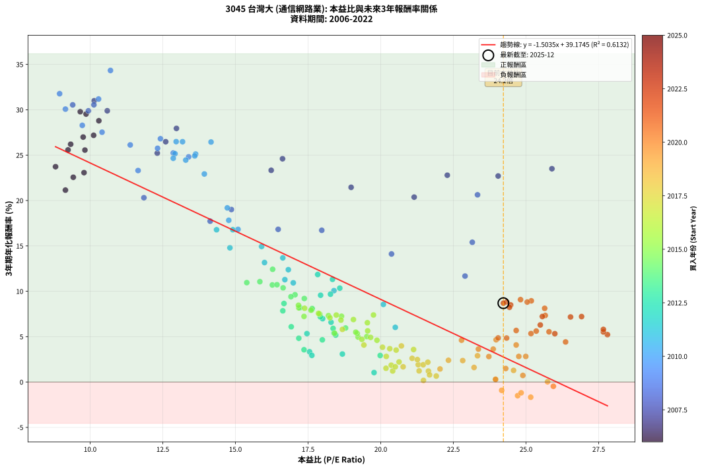
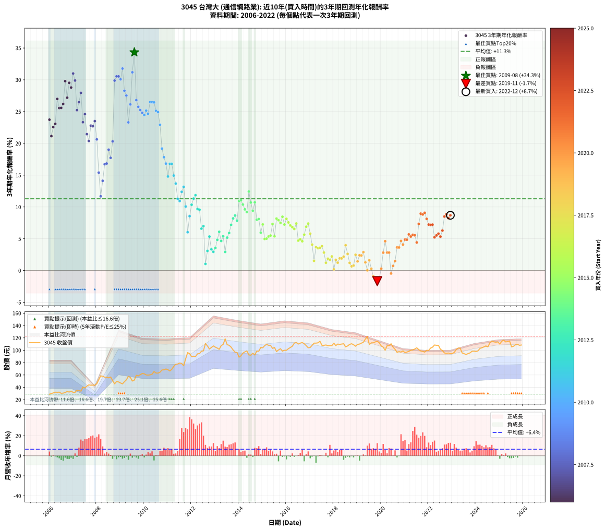

# 3045 台灣大 - 本益比與未來報酬率分析

!!! info "報告資訊"
    - **股票代號**: 3045
    - **公司名稱**: 台灣大
    - **產業別**: 通信網路業
    - **分析期間**: 2006-2022 (204 個數據點)
    - **資料來源**: Type 12 (ShowMonthlyK_ChartFlow) 月收盤價與本益比
    - **報酬率口徑**: 含現金股利 (簡化: 年度合計，假設每年7/1入帳)
    - **報告生成時間**: 2026-01-11 21:01:01 CST

## 📈 視覺化圖表

### 圖表1: 本益比 vs 未來報酬率關係

*圖表1：3045 台灣大 本益比與3年期未來報酬率關係 (2006-2022)*

### 圖表2: 歷年買入時點的3年期實際報酬率

*圖表2：3045 台灣大 歷年買入時點的3年期實際報酬率 (2006-2022)*

## 📍 買點訊號說明

本報告提供兩種買點提示訊號（顯示於圖表2的股價子圖中）：

### ▲ 小綠色三角形（回測驗證）
- **計算方式**: 使用全部歷史資料計算本益比第25百分位數
- **用途**: 事後驗證，顯示歷史上哪些時點確實為低估區
- **限制**: 當下無法判斷，僅供回測參考
- **特性**: 後見之明（Look-Ahead Bias）

### ▲ 小橘色三角形（即時訊號）
- **計算方式**: 使用截至當月的過去5年資料計算本益比第25百分位數
- **用途**: 實際投資決策，當時即可判斷
- **優勢**: 可操作性強，符合實務需求
- **特性**: 無後見之明，滾動窗口計算

!!! tip "如何使用兩種訊號"
    - **綠色▲** 幫助理解歷史估值機會，驗證策略有效性
    - **橘色▲** 可作為實際買進參考，但仍需搭配基本面分析
    - 兩種訊號重疊時，表示即時判斷與事後驗證一致，信心度較高
    - 僅有綠色▲時，表示當時無法判斷（需要未來資料才能確認）
    - 僅有橘色▲時，表示即時判斷為買點，但事後可能不是最佳時機

## 📊 估值分析摘要

| 指標 | 數值 |
|:---:|:---:|
| **目前本益比** (2022-12) | **24.22 倍** |
| **歷史平均本益比** | 18.55 倍 |
| **估值水準** | 🔴 相對高估 |
| **預期3年年化報酬率** | **+2.76%** |
| **歷史平均報酬率** | +11.28% |
| **相關係數 (R²)** | 0.6132 |
| **趨勢線斜率** | -1.5035 |

!!! abstract "核心洞察"
    目前本益比顯著高於歷史平均，預期未來報酬率可能較低

    根據歷史數據回測，3045 台灣大 在目前本益比 **24.2倍** 的估值水準下，
    預期未來3年年化報酬率約為 **+2.8%**。

    **重要提醒**: 本分析基於歷史數據統計，實際報酬率會受到公司基本面變化、產業趨勢、
    總體經濟環境等多重因素影響。R² = 0.61 表示本益比可解釋約 61.3% 的報酬率變異。

## 📈 歷史估值統計

### 最佳買點 (最高報酬率)

| 項目 | 數值 |
|:---:|:---:|
| 起始時間 | 2009-08 |
| 當時本益比 | 10.70 倍 |
| 起始價格 | 51.7 元 |
| 3年後價格 | 111.0 元 |
| **3年年化報酬率** | **+34.33%** |

### 最差買點 (最低報酬率)

| 項目 | 數值 |
|:---:|:---:|
| 起始時間 | 2019-11 |
| 當時本益比 | 25.16 倍 |
| 起始價格 | 114.5 元 |
| 3年後價格 | 95.5 元 |
| **3年年化報酬率** | **-1.67%** |

## 🎯 投資啟示

### 本益比與報酬率關係

趨勢線方程式: **y = -1.5035x + 39.1745**

!!! warning "強負相關"
    本益比與未來報酬率呈現強負相關。在高本益比時期買入，未來報酬率顯著較低；
    在低本益比時期買入，未來報酬率顯著較高。**估值紀律至關重要**。

### 估值區間建議

基於歷史數據分析:

- **🟢 低估區** (P/E < 14.8): 預期報酬率較高，可考慮增加持股
- **🟡 合理區** (P/E 14.8-22.3): 預期報酬率符合長期趨勢，正常持有
- **🔴 高估區** (P/E > 22.3): 預期報酬率較低，可考慮減碼或觀望

!!! danger "風險提示"
    - 過去表現不代表未來結果
    - 本分析假設公司基本面無重大結構性變化
    - 產業環境劇變可能使歷史規律失效
    - 應結合公司財報、產業趨勢、總體經濟等多重因素綜合判斷

!!! success "長期投資觀點"
    歷史數據顯示，在合理或低估的估值水準買入並長期持有，
    往往能獲得較佳的投資報酬。**耐心等待好價格**是價值投資的核心原則。

## 📊 數據品質

- **資料來源**: GoodInfo.tw Type 12 (ShowMonthlyK_ChartFlow)
- **資料頻率**: 月度收盤價與本益比
- **回測期間**: 2006-2022
- **數據點數量**: 204 個 (每個點代表一次3年期回測)

### 計算方法說明

1. **3年期年化報酬率**:
   - 對每個歷史時點，計算其後3年的實際投資報酬率
   - 期末價值(不含股利): 期末價格
   - 期末價值(含現金股利): 期末價格 + 持有期間內的現金股利合計 (簡化: 年度合計，假設每年7/1入帳)
   - 公式: 年化報酬率 = [(期末價值/期初價格)^(1/年數) - 1] × 100%

2. **本益比 (P/E Ratio)**:
   - 使用當時的月收盤價與EPS計算
   - 資料來源: Type 12 月度河流圖本益比數據

3. **趨勢線 (Linear Regression)**:
   - 使用最小平方法擬合線性趨勢線
   - R²值衡量本益比對報酬率的解釋能力

---

*本報告由 Stock Analysis System v1.9.0 自動生成*
*數據更新時間: 2026-01-11 21:01:01 CST*

## 📋 月度回測明細表

（每一列對應時間線圖中的一個買入點；可用來對照 SVG 圖上的每個點。）

| 買入月份 | 賣出月份 | 回測期限_年 | 實際持有年數 | 買入本益比_倍 | 買入收盤價_元 | 賣出收盤價_元 | 現金股利合計_元 | 總報酬率_pct | 年化報酬率_pct |
| --- | --- | --- | --- | --- | --- | --- | --- | --- | --- |
| 2006-01 | 2009-01 | 3 | 3.001 | 8.81 | 28.90 | 47.00 | 7.75 | +89.44 | +23.73 |
| 2006-02 | 2009-02 | 3 | 3.001 | 9.15 | 30.00 | 45.60 | 7.75 | +77.83 | +21.15 |
| 2006-03 | 2009-03 | 3 | 3.001 | 9.42 | 30.90 | 49.15 | 7.75 | +84.14 | +22.56 |
| 2006-04 | 2009-04 | 3 | 3.001 | 9.79 | 32.10 | 52.10 | 7.75 | +86.44 | +23.07 |
| 2006-05 | 2009-05 | 3 | 3.001 | 9.76 | 32.00 | 57.80 | 7.75 | +104.84 | +26.99 |
| 2006-06 | 2009-06 | 3 | 3.001 | 9.82 | 32.20 | 56.00 | 7.75 | +97.98 | +25.56 |
| 2006-07 | 2009-07 | 3 | 3.001 | 9.24 | 30.30 | 50.20 | 9.82 | +98.08 | +25.58 |
| 2006-08 | 2009-08 | 3 | 3.001 | 9.33 | 30.60 | 51.70 | 9.82 | +101.04 | +26.20 |
| 2006-09 | 2009-09 | 3 | 3.001 | 9.66 | 31.70 | 59.50 | 9.82 | +118.67 | +29.79 |
| 2006-10 | 2009-10 | 3 | 3.001 | 10.12 | 33.20 | 58.50 | 9.82 | +105.78 | +27.19 |
| 2006-11 | 2009-11 | 3 | 3.001 | 9.86 | 32.35 | 60.50 | 9.82 | +117.37 | +29.53 |
| 2006-12 | 2009-12 | 3 | 3.001 | 10.30 | 33.80 | 62.40 | 9.82 | +113.66 | +28.79 |
| 2007-01 | 2010-01 | 3 | 3.001 | 10.14 | 31.90 | 61.90 | 9.82 | +124.82 | +30.99 |
| 2007-02 | 2010-02 | 3 | 3.001 | 10.59 | 31.90 | 60.10 | 9.82 | +119.18 | +29.89 |
| 2007-03 | 2010-03 | 3 | 3.001 | 12.31 | 35.45 | 59.80 | 9.82 | +96.38 | +25.22 |
| 2007-04 | 2010-04 | 3 | 3.001 | 12.60 | 34.60 | 60.20 | 9.82 | +102.36 | +26.48 |
| 2007-05 | 2010-05 | 3 | 3.001 | 12.97 | 33.90 | 61.20 | 9.82 | +109.49 | +27.95 |
| 2007-06 | 2010-06 | 3 | 3.001 | 16.23 | 40.25 | 65.70 | 9.82 | +87.62 | +23.33 |
| 2007-07 | 2010-07 | 3 | 3.001 | 16.62 | 39.00 | 63.20 | 12.26 | +93.48 | +24.60 |
| 2007-08 | 2010-08 | 3 | 3.001 | 18.98 | 42.00 | 63.00 | 12.26 | +79.19 | +21.45 |
| 2007-09 | 2010-09 | 3 | 3.001 | 21.15 | 44.00 | 64.50 | 12.26 | +74.45 | +20.38 |
| 2007-10 | 2010-10 | 3 | 3.001 | 22.29 | 43.40 | 68.10 | 12.26 | +85.16 | +22.79 |
| 2007-11 | 2010-11 | 3 | 3.001 | 24.04 | 43.60 | 68.30 | 12.26 | +84.77 | +22.70 |
| 2007-12 | 2010-12 | 3 | 3.001 | 25.89 | 43.50 | 69.70 | 12.26 | +88.41 | +23.50 |
| 2008-01 | 2011-01 | 3 | 3.001 | 23.33 | 46.00 | 68.50 | 12.26 | +75.56 | +20.63 |
| 2008-02 | 2011-03 | 3 | 3.080 | 23.15 | 52.40 | 69.20 | 12.26 | +55.45 | +15.40 |
| 2008-03 | 2011-03 | 3 | 2.998 | 22.90 | 58.50 | 69.20 | 12.26 | +39.24 | +11.68 |
| 2008-04 | 2011-04 | 3 | 2.998 | 20.37 | 58.00 | 73.90 | 12.26 | +48.55 | +14.11 |
| 2008-05 | 2011-05 | 3 | 2.998 | 17.97 | 56.40 | 77.40 | 12.26 | +58.97 | +16.72 |
| 2008-06 | 2011-06 | 3 | 2.998 | 16.47 | 56.50 | 77.80 | 12.26 | +59.39 | +16.83 |
| 2008-07 | 2011-07 | 3 | 2.998 | 14.86 | 55.30 | 79.30 | 13.88 | +68.49 | +19.01 |
| 2008-08 | 2011-08 | 3 | 2.998 | 14.13 | 56.70 | 78.60 | 13.88 | +63.10 | +17.72 |
| 2008-09 | 2011-09 | 3 | 2.998 | 11.85 | 51.00 | 74.90 | 13.88 | +74.07 | +20.31 |
| 2008-10 | 2011-10 | 3 | 2.998 | 9.94 | 45.70 | 86.20 | 13.88 | +118.99 | +29.88 |
| 2008-11 | 2011-11 | 3 | 2.998 | 10.13 | 49.50 | 96.20 | 13.88 | +122.38 | +30.55 |
| 2008-12 | 2011-12 | 3 | 2.998 | 9.40 | 48.70 | 94.40 | 13.88 | +122.33 | +30.54 |
| 2009-01 | 2012-01 | 3 | 2.998 | 9.15 | 47.00 | 89.50 | 13.88 | +119.95 | +30.07 |
| 2009-02 | 2012-02 | 3 | 2.998 | 8.95 | 45.60 | 90.40 | 13.88 | +128.68 | +31.77 |
| 2009-03 | 2012-03 | 3 | 3.001 | 9.73 | 49.15 | 89.90 | 13.88 | +111.14 | +28.28 |
| 2009-04 | 2012-04 | 3 | 3.001 | 10.41 | 52.10 | 94.20 | 13.88 | +107.44 | +27.53 |
| 2009-05 | 2012-05 | 3 | 3.001 | 11.65 | 57.80 | 94.50 | 13.88 | +87.50 | +23.31 |
| 2009-06 | 2012-06 | 3 | 3.001 | 11.38 | 56.00 | 98.50 | 13.88 | +100.67 | +26.13 |
| 2009-07 | 2012-07 | 3 | 3.001 | 10.29 | 50.20 | 99.00 | 14.35 | +125.80 | +31.18 |
| 2009-08 | 2012-08 | 3 | 3.001 | 10.70 | 51.70 | 111.00 | 14.35 | +142.46 | +34.33 |
| 2009-09 | 2012-09 | 3 | 3.001 | 12.42 | 59.50 | 107.00 | 14.35 | +103.95 | +26.81 |
| 2009-10 | 2012-10 | 3 | 3.001 | 12.32 | 58.50 | 102.00 | 14.35 | +98.89 | +25.75 |
| 2009-11 | 2012-11 | 3 | 3.001 | 12.86 | 60.50 | 104.50 | 14.35 | +96.45 | +25.23 |
| 2009-12 | 2012-12 | 3 | 3.001 | 13.39 | 62.40 | 107.00 | 14.35 | +94.47 | +24.81 |
| 2010-01 | 2013-01 | 3 | 3.001 | 13.29 | 61.90 | 105.00 | 14.35 | +92.81 | +24.46 |
| 2010-02 | 2013-02 | 3 | 3.001 | 12.92 | 60.10 | 103.50 | 14.35 | +96.09 | +25.16 |
| 2010-03 | 2013-03 | 3 | 3.001 | 12.86 | 59.80 | 101.50 | 14.35 | +93.73 | +24.66 |
| 2010-04 | 2013-04 | 3 | 3.001 | 12.96 | 60.20 | 107.50 | 14.35 | +102.41 | +26.49 |
| 2010-05 | 2013-05 | 3 | 3.001 | 13.18 | 61.20 | 109.50 | 14.35 | +102.37 | +26.48 |
| 2010-06 | 2013-06 | 3 | 3.001 | 14.16 | 65.70 | 118.50 | 14.35 | +102.21 | +26.45 |
| 2010-07 | 2013-07 | 3 | 3.001 | 13.63 | 63.20 | 109.00 | 14.82 | +95.92 | +25.12 |
| 2010-08 | 2013-08 | 3 | 3.001 | 13.60 | 63.00 | 108.00 | 14.82 | +94.96 | +24.92 |
| 2010-09 | 2013-09 | 3 | 3.001 | 13.93 | 64.50 | 105.00 | 14.82 | +85.77 | +22.92 |
| 2010-10 | 2013-10 | 3 | 3.001 | 14.72 | 68.10 | 100.50 | 14.82 | +69.34 | +19.19 |
| 2010-11 | 2013-11 | 3 | 3.001 | 14.77 | 68.30 | 96.90 | 14.82 | +63.58 | +17.82 |
| 2010-12 | 2013-12 | 3 | 3.001 | 15.09 | 69.70 | 96.30 | 14.82 | +59.43 | +16.82 |
| 2011-01 | 2014-01 | 3 | 3.001 | 14.81 | 68.50 | 88.80 | 14.82 | +51.27 | +14.79 |
| 2011-02 | 2014-02 | 3 | 3.001 | 14.35 | 66.50 | 91.10 | 14.82 | +59.28 | +16.78 |
| 2011-03 | 2014-03 | 3 | 3.001 | 14.91 | 69.20 | 95.40 | 14.82 | +59.28 | +16.78 |
| 2011-04 | 2014-04 | 3 | 3.001 | 15.90 | 73.90 | 97.40 | 14.82 | +51.86 | +14.94 |
| 2011-05 | 2014-05 | 3 | 3.001 | 16.63 | 77.40 | 98.90 | 14.82 | +46.93 | +13.68 |
| 2011-06 | 2014-06 | 3 | 3.001 | 16.70 | 77.80 | 92.40 | 14.82 | +37.82 | +11.28 |
| 2011-07 | 2014-07 | 3 | 3.001 | 16.99 | 79.30 | 92.00 | 16.26 | +36.52 | +10.93 |
| 2011-08 | 2014-08 | 3 | 3.001 | 16.82 | 78.60 | 95.30 | 16.26 | +41.93 | +12.38 |
| 2011-09 | 2014-09 | 3 | 3.001 | 16.00 | 74.90 | 92.30 | 16.26 | +44.94 | +13.17 |
| 2011-10 | 2014-10 | 3 | 3.001 | 18.39 | 86.20 | 98.70 | 16.26 | +33.36 | +10.07 |
| 2011-11 | 2014-11 | 3 | 3.001 | 20.50 | 96.20 | 98.40 | 16.26 | +19.19 | +6.02 |
| 2011-12 | 2014-12 | 3 | 3.001 | 20.09 | 94.40 | 104.50 | 16.26 | +27.92 | +8.55 |
| 2012-01 | 2015-01 | 3 | 3.001 | 18.59 | 89.50 | 104.00 | 16.26 | +34.37 | +10.35 |
| 2012-02 | 2015-03 | 3 | 3.080 | 18.34 | 90.40 | 109.50 | 16.26 | +39.12 | +11.31 |
| 2012-03 | 2015-03 | 3 | 2.998 | 17.83 | 89.90 | 109.50 | 16.26 | +39.89 | +11.85 |
| 2012-04 | 2015-04 | 3 | 2.998 | 18.27 | 94.20 | 108.00 | 16.26 | +31.91 | +9.68 |
| 2012-05 | 2015-05 | 3 | 2.998 | 17.93 | 94.50 | 108.00 | 16.26 | +31.49 | +9.56 |
| 2012-06 | 2015-06 | 3 | 2.998 | 18.29 | 98.50 | 103.00 | 16.26 | +21.08 | +6.59 |
| 2012-07 | 2015-07 | 3 | 2.998 | 18.00 | 99.00 | 104.50 | 16.70 | +22.42 | +6.98 |
| 2012-08 | 2015-08 | 3 | 2.998 | 19.77 | 111.00 | 97.80 | 16.70 | +3.15 | +1.04 |
| 2012-09 | 2015-09 | 3 | 2.998 | 18.68 | 107.00 | 100.50 | 16.70 | +9.53 | +3.08 |
| 2012-10 | 2015-10 | 3 | 2.998 | 17.46 | 102.00 | 102.50 | 16.70 | +16.86 | +5.34 |
| 2012-11 | 2015-11 | 3 | 2.998 | 17.55 | 104.50 | 98.60 | 16.70 | +10.33 | +3.33 |
| 2012-12 | 2015-12 | 3 | 2.998 | 17.63 | 107.00 | 100.00 | 16.70 | +9.07 | +2.94 |
| 2013-01 | 2016-01 | 3 | 2.998 | 17.36 | 105.00 | 99.90 | 16.70 | +11.05 | +3.56 |
| 2013-02 | 2016-02 | 3 | 2.998 | 17.18 | 103.50 | 102.50 | 16.70 | +15.17 | +4.82 |
| 2013-03 | 2016-03 | 3 | 3.001 | 16.92 | 101.50 | 104.50 | 16.70 | +19.41 | +6.09 |
| 2013-04 | 2016-04 | 3 | 3.001 | 17.99 | 107.50 | 106.50 | 16.70 | +14.60 | +4.65 |
| 2013-05 | 2016-05 | 3 | 3.001 | 18.39 | 109.50 | 111.50 | 16.70 | +17.08 | +5.39 |
| 2013-06 | 2016-06 | 3 | 3.001 | 19.98 | 118.50 | 112.50 | 16.70 | +9.03 | +2.92 |
| 2013-07 | 2016-07 | 3 | 3.001 | 18.45 | 109.00 | 110.00 | 16.80 | +16.33 | +5.17 |
| 2013-08 | 2016-08 | 3 | 3.001 | 18.36 | 108.00 | 111.50 | 16.80 | +18.80 | +5.91 |
| 2013-09 | 2016-09 | 3 | 3.001 | 17.92 | 105.00 | 112.50 | 16.80 | +23.14 | +7.18 |
| 2013-10 | 2016-10 | 3 | 3.001 | 17.22 | 100.50 | 110.50 | 16.80 | +26.67 | +8.20 |
| 2013-11 | 2016-11 | 3 | 3.001 | 16.67 | 96.90 | 107.50 | 16.80 | +28.28 | +8.65 |
| 2013-12 | 2016-12 | 3 | 3.001 | 16.63 | 96.30 | 104.00 | 16.80 | +25.44 | +7.85 |
| 2014-01 | 2017-01 | 3 | 3.001 | 15.39 | 88.80 | 104.50 | 16.80 | +36.60 | +10.95 |
| 2014-02 | 2017-02 | 3 | 3.001 | 15.84 | 91.10 | 108.00 | 16.80 | +36.99 | +11.06 |
| 2014-03 | 2017-03 | 3 | 3.001 | 16.64 | 95.40 | 111.50 | 16.80 | +34.49 | +10.38 |
| 2014-04 | 2017-04 | 3 | 3.001 | 17.05 | 97.40 | 111.50 | 16.80 | +31.72 | +9.62 |
| 2014-05 | 2017-05 | 3 | 3.001 | 17.37 | 98.90 | 112.00 | 16.80 | +30.23 | +9.20 |
| 2014-06 | 2017-06 | 3 | 3.001 | 16.28 | 92.40 | 114.50 | 16.80 | +42.10 | +12.42 |
| 2014-07 | 2017-07 | 3 | 3.001 | 16.27 | 92.00 | 108.00 | 16.80 | +35.65 | +10.70 |
| 2014-08 | 2017-08 | 3 | 3.001 | 16.91 | 95.30 | 108.00 | 16.80 | +30.95 | +9.40 |
| 2014-09 | 2017-09 | 3 | 3.001 | 16.43 | 92.30 | 108.50 | 16.80 | +35.75 | +10.72 |
| 2014-10 | 2017-10 | 3 | 3.001 | 17.63 | 98.70 | 107.50 | 16.80 | +25.94 | +7.99 |
| 2014-11 | 2017-11 | 3 | 3.001 | 17.64 | 98.40 | 107.50 | 16.80 | +26.32 | +8.10 |
| 2014-12 | 2017-12 | 3 | 3.001 | 18.79 | 104.50 | 107.50 | 16.80 | +18.95 | +5.95 |
| 2015-01 | 2018-01 | 3 | 3.001 | 18.65 | 104.00 | 111.50 | 16.80 | +23.37 | +7.25 |
| 2015-02 | 2018-02 | 3 | 3.001 | 19.22 | 107.50 | 107.50 | 16.80 | +15.63 | +4.96 |
| 2015-03 | 2018-03 | 3 | 3.001 | 19.52 | 109.50 | 110.00 | 16.80 | +15.80 | +5.01 |
| 2015-04 | 2018-04 | 3 | 3.001 | 19.19 | 108.00 | 109.50 | 16.80 | +16.94 | +5.35 |
| 2015-05 | 2018-05 | 3 | 3.001 | 19.14 | 108.00 | 110.00 | 16.80 | +17.41 | +5.49 |
| 2015-06 | 2018-06 | 3 | 3.001 | 18.20 | 103.00 | 110.50 | 16.80 | +23.59 | +7.31 |
| 2015-07 | 2018-07 | 3 | 3.001 | 18.41 | 104.50 | 105.50 | 16.80 | +17.03 | +5.38 |
| 2015-08 | 2018-08 | 3 | 3.001 | 17.18 | 97.80 | 107.00 | 16.80 | +26.58 | +8.17 |
| 2015-09 | 2018-09 | 3 | 3.001 | 17.60 | 100.50 | 109.50 | 16.80 | +25.67 | +7.91 |
| 2015-10 | 2018-10 | 3 | 3.001 | 17.90 | 102.50 | 110.50 | 16.80 | +24.20 | +7.49 |
| 2015-11 | 2018-11 | 3 | 3.001 | 17.17 | 98.60 | 109.00 | 16.80 | +27.59 | +8.46 |
| 2015-12 | 2018-12 | 3 | 3.001 | 17.36 | 100.00 | 106.50 | 16.80 | +23.30 | +7.23 |
| 2016-01 | 2019-01 | 3 | 3.001 | 17.38 | 99.90 | 109.50 | 16.80 | +26.43 | +8.13 |
| 2016-02 | 2019-03 | 3 | 3.080 | 17.86 | 102.50 | 111.50 | 16.80 | +25.17 | +7.56 |
| 2016-03 | 2019-03 | 3 | 2.998 | 18.25 | 104.50 | 111.50 | 16.80 | +22.78 | +7.08 |
| 2016-04 | 2019-04 | 3 | 2.998 | 18.63 | 106.50 | 113.00 | 16.80 | +21.88 | +6.82 |
| 2016-05 | 2019-05 | 3 | 2.998 | 19.54 | 111.50 | 118.00 | 16.80 | +20.90 | +6.53 |
| 2016-06 | 2019-06 | 3 | 2.998 | 19.75 | 112.50 | 122.50 | 16.80 | +23.82 | +7.39 |
| 2016-07 | 2019-07 | 3 | 2.998 | 19.35 | 110.00 | 109.50 | 16.75 | +14.77 | +4.70 |
| 2016-08 | 2019-08 | 3 | 2.998 | 19.65 | 111.50 | 112.00 | 16.75 | +15.47 | +4.91 |
| 2016-09 | 2019-09 | 3 | 2.998 | 19.87 | 112.50 | 112.00 | 16.75 | +14.44 | +4.60 |
| 2016-10 | 2019-10 | 3 | 2.998 | 19.55 | 110.50 | 113.50 | 16.75 | +17.87 | +5.64 |
| 2016-11 | 2019-11 | 3 | 2.998 | 19.06 | 107.50 | 114.50 | 16.75 | +22.09 | +6.88 |
| 2016-12 | 2019-12 | 3 | 2.998 | 18.47 | 104.00 | 112.00 | 16.75 | +23.80 | +7.38 |
| 2017-01 | 2020-01 | 3 | 2.998 | 18.68 | 104.50 | 107.00 | 16.75 | +18.42 | +5.80 |
| 2017-02 | 2020-02 | 3 | 2.998 | 19.42 | 108.00 | 105.00 | 16.75 | +12.73 | +4.08 |
| 2017-03 | 2020-03 | 3 | 3.001 | 20.18 | 111.50 | 99.90 | 16.75 | +4.62 | +1.52 |
| 2017-04 | 2020-04 | 3 | 3.001 | 20.31 | 111.50 | 107.50 | 16.75 | +11.43 | +3.67 |
| 2017-05 | 2020-05 | 3 | 3.001 | 20.53 | 112.00 | 107.50 | 16.75 | +10.94 | +3.52 |
| 2017-06 | 2020-06 | 3 | 3.001 | 21.13 | 114.50 | 110.50 | 16.75 | +11.13 | +3.58 |
| 2017-07 | 2020-07 | 3 | 3.001 | 20.06 | 108.00 | 105.00 | 15.90 | +11.94 | +3.83 |
| 2017-08 | 2020-08 | 3 | 3.001 | 20.19 | 108.00 | 101.50 | 15.90 | +8.70 | +2.82 |
| 2017-09 | 2020-09 | 3 | 3.001 | 20.41 | 108.50 | 96.60 | 15.90 | +3.69 | +1.21 |
| 2017-10 | 2020-10 | 3 | 3.001 | 20.36 | 107.50 | 97.70 | 15.90 | +5.67 | +1.86 |
| 2017-11 | 2020-11 | 3 | 3.001 | 20.50 | 107.50 | 97.10 | 15.90 | +5.12 | +1.68 |
| 2017-12 | 2020-12 | 3 | 3.001 | 20.63 | 107.50 | 98.90 | 15.90 | +6.79 | +2.21 |
| 2018-01 | 2021-01 | 3 | 3.001 | 21.47 | 111.50 | 96.20 | 15.90 | +0.54 | +0.18 |
| 2018-02 | 2021-02 | 3 | 3.001 | 20.77 | 107.50 | 97.10 | 15.90 | +5.12 | +1.68 |
| 2018-03 | 2021-03 | 3 | 3.001 | 21.32 | 110.00 | 98.20 | 15.90 | +3.73 | +1.23 |
| 2018-04 | 2021-04 | 3 | 3.001 | 21.29 | 109.50 | 100.00 | 15.90 | +5.84 | +1.91 |
| 2018-05 | 2021-05 | 3 | 3.001 | 21.46 | 110.00 | 100.50 | 15.90 | +5.82 | +1.90 |
| 2018-06 | 2021-06 | 3 | 3.001 | 21.62 | 110.50 | 102.00 | 15.90 | +6.70 | +2.18 |
| 2018-07 | 2021-07 | 3 | 3.001 | 20.71 | 105.50 | 104.00 | 14.60 | +12.42 | +3.98 |
| 2018-08 | 2021-08 | 3 | 3.001 | 21.08 | 107.00 | 101.00 | 14.60 | +8.04 | +2.61 |
| 2018-09 | 2021-09 | 3 | 3.001 | 21.64 | 109.50 | 98.90 | 14.60 | +3.65 | +1.20 |
| 2018-10 | 2021-10 | 3 | 3.001 | 21.91 | 110.50 | 98.10 | 14.60 | +1.99 | +0.66 |
| 2018-11 | 2021-11 | 3 | 3.001 | 21.68 | 109.00 | 97.00 | 14.60 | +2.38 | +0.79 |
| 2018-12 | 2021-12 | 3 | 3.001 | 21.26 | 106.50 | 100.00 | 14.60 | +7.60 | +2.47 |
| 2019-01 | 2022-01 | 3 | 3.001 | 22.04 | 109.50 | 99.70 | 14.60 | +4.38 | +1.44 |
| 2019-02 | 2022-02 | 3 | 3.001 | 22.33 | 110.00 | 103.50 | 14.60 | +7.36 | +2.40 |
| 2019-03 | 2022-03 | 3 | 3.001 | 22.82 | 111.50 | 105.00 | 14.60 | +7.26 | +2.36 |
| 2019-04 | 2022-04 | 3 | 3.001 | 23.33 | 113.00 | 108.50 | 14.60 | +8.94 | +2.89 |
| 2019-05 | 2022-05 | 3 | 3.001 | 24.57 | 118.00 | 108.00 | 14.60 | +3.90 | +1.28 |
| 2019-06 | 2022-06 | 3 | 3.001 | 25.74 | 122.50 | 108.00 | 14.60 | +0.08 | +0.03 |
| 2019-07 | 2022-07 | 3 | 3.001 | 23.21 | 109.50 | 101.50 | 13.35 | +4.89 | +1.60 |
| 2019-08 | 2022-08 | 3 | 3.001 | 23.95 | 112.00 | 99.60 | 13.35 | +0.85 | +0.28 |
| 2019-09 | 2022-09 | 3 | 3.001 | 24.16 | 112.00 | 95.60 | 13.35 | -2.72 | -0.92 |
| 2019-10 | 2022-10 | 3 | 3.001 | 24.71 | 113.50 | 95.10 | 13.35 | -4.45 | -1.51 |
| 2019-11 | 2022-11 | 3 | 3.001 | 25.16 | 114.50 | 95.50 | 13.35 | -4.93 | -1.67 |
| 2019-12 | 2022-12 | 3 | 3.001 | 24.83 | 112.00 | 94.70 | 13.35 | -3.53 | -1.19 |
| 2020-01 | 2023-01 | 3 | 3.001 | 23.95 | 107.00 | 94.60 | 13.35 | +0.89 | +0.30 |
| 2020-02 | 2023-03 | 3 | 3.080 | 23.72 | 105.00 | 101.00 | 13.35 | +8.90 | +2.81 |
| 2020-03 | 2023-03 | 3 | 2.998 | 22.78 | 99.90 | 101.00 | 13.35 | +14.46 | +4.61 |
| 2020-04 | 2023-04 | 3 | 2.998 | 24.75 | 107.50 | 103.50 | 13.35 | +8.70 | +2.82 |
| 2020-05 | 2023-05 | 3 | 2.998 | 24.99 | 107.50 | 103.50 | 13.35 | +8.70 | +2.82 |
| 2020-06 | 2023-06 | 3 | 2.998 | 25.94 | 110.50 | 95.60 | 13.35 | -1.40 | -0.47 |
| 2020-07 | 2023-07 | 3 | 2.998 | 24.89 | 105.00 | 94.40 | 12.90 | +2.19 | +0.73 |
| 2020-08 | 2023-08 | 3 | 2.998 | 24.30 | 101.50 | 93.20 | 12.90 | +4.53 | +1.49 |
| 2020-09 | 2023-09 | 3 | 2.998 | 23.36 | 96.60 | 94.60 | 12.90 | +11.28 | +3.63 |
| 2020-10 | 2023-10 | 3 | 2.998 | 23.87 | 97.70 | 95.80 | 12.90 | +11.26 | +3.62 |
| 2020-11 | 2023-11 | 3 | 2.998 | 23.97 | 97.10 | 98.40 | 12.90 | +14.62 | +4.66 |
| 2020-12 | 2023-12 | 3 | 2.998 | 24.66 | 98.90 | 98.60 | 12.90 | +12.74 | +4.08 |
| 2021-01 | 2024-01 | 3 | 2.998 | 24.04 | 96.20 | 98.00 | 12.90 | +15.28 | +4.86 |
| 2021-02 | 2024-02 | 3 | 2.998 | 24.33 | 97.10 | 99.00 | 12.90 | +15.24 | +4.85 |
| 2021-03 | 2024-03 | 3 | 3.001 | 24.66 | 98.20 | 103.00 | 12.90 | +18.02 | +5.68 |
| 2021-04 | 2024-04 | 3 | 3.001 | 25.17 | 100.00 | 104.00 | 12.90 | +16.90 | +5.34 |
| 2021-05 | 2024-05 | 3 | 3.001 | 25.35 | 100.50 | 105.50 | 12.90 | +17.81 | +5.61 |
| 2021-06 | 2024-06 | 3 | 3.001 | 25.79 | 102.00 | 107.00 | 12.90 | +17.55 | +5.54 |
| 2021-07 | 2024-07 | 3 | 3.001 | 26.36 | 104.00 | 105.50 | 12.90 | +13.85 | +4.42 |
| 2021-08 | 2024-08 | 3 | 3.001 | 25.66 | 101.00 | 112.00 | 12.90 | +23.66 | +7.33 |
| 2021-09 | 2024-09 | 3 | 3.001 | 25.18 | 98.90 | 115.00 | 12.90 | +29.32 | +8.95 |
| 2021-10 | 2024-10 | 3 | 3.001 | 25.04 | 98.10 | 113.50 | 12.90 | +28.85 | +8.81 |
| 2021-11 | 2024-11 | 3 | 3.001 | 24.81 | 97.00 | 113.00 | 12.90 | +29.79 | +9.08 |
| 2021-12 | 2024-12 | 3 | 3.001 | 25.64 | 100.00 | 113.50 | 12.90 | +26.40 | +8.12 |
| 2022-01 | 2025-01 | 3 | 3.001 | 25.56 | 99.70 | 110.00 | 12.90 | +23.27 | +7.22 |
| 2022-02 | 2025-02 | 3 | 3.001 | 26.53 | 103.50 | 114.50 | 12.90 | +23.09 | +7.17 |
| 2022-03 | 2025-03 | 3 | 3.001 | 26.91 | 105.00 | 116.50 | 12.90 | +23.24 | +7.21 |
| 2022-04 | 2025-04 | 3 | 3.001 | 27.80 | 108.50 | 113.50 | 12.90 | +16.50 | +5.22 |
| 2022-05 | 2025-05 | 3 | 3.001 | 27.66 | 108.00 | 114.00 | 12.90 | +17.50 | +5.52 |
| 2022-06 | 2025-06 | 3 | 3.001 | 27.66 | 108.00 | 115.00 | 12.90 | +18.43 | +5.80 |
| 2022-07 | 2025-07 | 3 | 3.001 | 25.99 | 101.50 | 105.50 | 13.10 | +16.85 | +5.33 |
| 2022-08 | 2025-08 | 3 | 3.001 | 25.49 | 99.60 | 106.50 | 13.10 | +20.08 | +6.29 |
| 2022-09 | 2025-09 | 3 | 3.001 | 24.47 | 95.60 | 109.00 | 13.10 | +27.72 | +8.50 |
| 2022-10 | 2025-10 | 3 | 3.001 | 24.33 | 95.10 | 109.50 | 13.10 | +28.92 | +8.83 |
| 2022-11 | 2025-11 | 3 | 3.001 | 24.43 | 95.50 | 108.00 | 13.10 | +26.81 | +8.24 |
| 2022-12 | 2025-12 | 3 | 3.001 | 24.22 | 94.70 | 108.50 | 13.10 | +28.41 | +8.69 |
