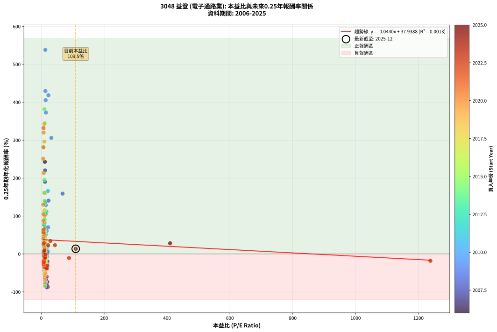
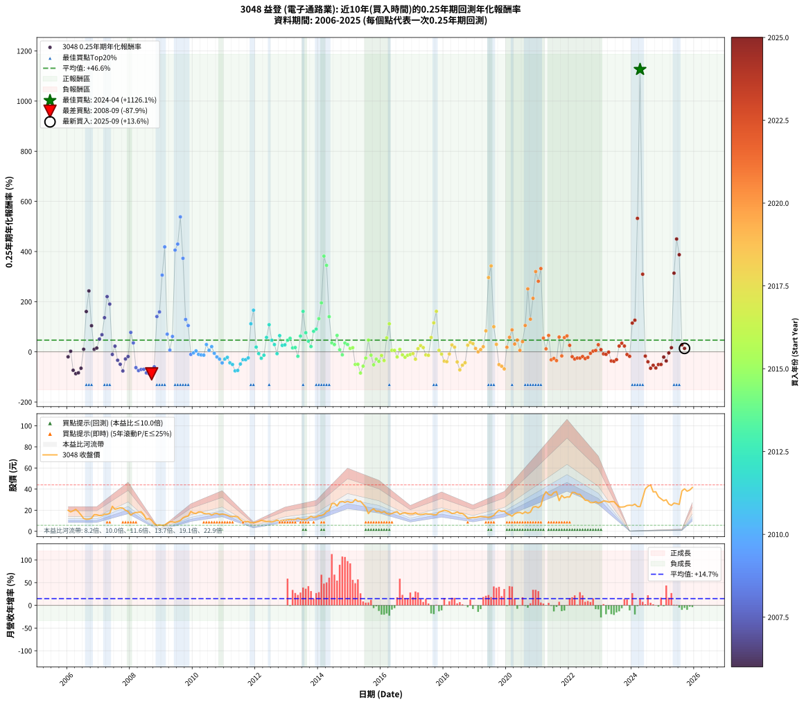

# 3048 益登 - 本益比與未來報酬率分析

!!! info "報告資訊"
    - **股票代號**: 3048
    - **公司名稱**: 益登
    - **產業別**: 電子通路業
    - **分析期間**: 2006-2025 (237 個數據點)
    - **資料來源**: Type 12 (ShowMonthlyK_ChartFlow) 月收盤價與本益比
    - **報酬率口徑**: 含現金股利 (簡化: 年度合計，假設每年7/1入帳)
    - **報告生成時間**: 2026-01-04 08:27:12 CST

## 📈 視覺化圖表

### 圖表1: 本益比 vs 未來報酬率關係

*圖表1：3048 益登 本益比與0.25年期未來報酬率關係 (2006-2025)*

### 圖表2: 歷年買入時點的0.25年期實際報酬率

*圖表2：3048 益登 歷年買入時點的0.25年期實際報酬率 (2006-2025)*

## 📍 買點訊號說明

本報告提供兩種買點提示訊號（顯示於圖表2的股價子圖中）：

### ▲ 小綠色三角形（回測驗證）
- **計算方式**: 使用全部歷史資料計算本益比第25百分位數
- **用途**: 事後驗證，顯示歷史上哪些時點確實為低估區
- **限制**: 當下無法判斷，僅供回測參考
- **特性**: 後見之明（Look-Ahead Bias）

### ▲ 小橘色三角形（即時訊號）
- **計算方式**: 使用截至當月的過去5年資料計算本益比第25百分位數
- **用途**: 實際投資決策，當時即可判斷
- **優勢**: 可操作性強，符合實務需求
- **特性**: 無後見之明，滾動窗口計算

!!! tip "如何使用兩種訊號"
    - **綠色▲** 幫助理解歷史估值機會，驗證策略有效性
    - **橘色▲** 可作為實際買進參考，但仍需搭配基本面分析
    - 兩種訊號重疊時，表示即時判斷與事後驗證一致，信心度較高
    - 僅有綠色▲時，表示當時無法判斷（需要未來資料才能確認）
    - 僅有橘色▲時，表示即時判斷為買點，但事後可能不是最佳時機

## 📊 估值分析摘要

| 指標 | 數值 |
|:---:|:---:|
| **目前本益比** (2025-09) | **109.50 倍** |
| **歷史平均本益比** | 20.75 倍 |
| **估值水準** | 🔴 相對高估 |
| **預期0.25年年化報酬率** | **+33.12%** |
| **歷史平均報酬率** | +46.60% |
| **相關係數 (R²)** | 0.0013 |
| **趨勢線斜率** | -0.0440 |

!!! abstract "核心洞察"
    目前本益比顯著高於歷史平均，預期未來報酬率可能較低

    根據歷史數據回測，3048 益登 在目前本益比 **109.5倍** 的估值水準下，
    預期未來0.25年年化報酬率約為 **+33.1%**。

    **重要提醒**: 本分析基於歷史數據統計，實際報酬率會受到公司基本面變化、產業趨勢、
    總體經濟環境等多重因素影響。R² = 0.00 表示本益比可解釋約 0.1% 的報酬率變異。

## 📈 歷史估值統計

### 最佳買點 (最高報酬率)

| 項目 | 數值 |
|:---:|:---:|
| 起始時間 | 2024-04 |
| 當時本益比 | nan 倍 |
| 起始價格 | 23.4 元 |
| 0.25年後價格 | 42.6 元 |
| **0.25年年化報酬率** | **+1126.09%** |

### 最差買點 (最低報酬率)

| 項目 | 數值 |
|:---:|:---:|
| 起始時間 | 2008-09 |
| 當時本益比 | 17.91 倍 |
| 起始價格 | 10.3 元 |
| 0.25年後價格 | 6.1 元 |
| **0.25年年化報酬率** | **-87.87%** |

## 🎯 投資啟示

### 本益比與報酬率關係

趨勢線方程式: **y = -0.0440x + 37.9388**

!!! note "負相關"
    本益比與未來報酬率呈現負相關。較低的本益比通常帶來較高的未來報酬率，
    但相關性不算非常強。**估值仍是重要參考指標之一**。

### 估值區間建議

基於歷史數據分析:

- **🟢 低估區** (P/E < 16.6): 預期報酬率較高，可考慮增加持股
- **🟡 合理區** (P/E 16.6-24.9): 預期報酬率符合長期趨勢，正常持有
- **🔴 高估區** (P/E > 24.9): 預期報酬率較低，可考慮減碼或觀望

!!! danger "風險提示"
    - 過去表現不代表未來結果
    - 本分析假設公司基本面無重大結構性變化
    - 產業環境劇變可能使歷史規律失效
    - 應結合公司財報、產業趨勢、總體經濟等多重因素綜合判斷

!!! success "長期投資觀點"
    歷史數據顯示，在合理或低估的估值水準買入並長期持有，
    往往能獲得較佳的投資報酬。**耐心等待好價格**是價值投資的核心原則。

## 📊 數據品質

- **資料來源**: GoodInfo.tw Type 12 (ShowMonthlyK_ChartFlow)
- **資料頻率**: 月度收盤價與本益比
- **回測期間**: 2006-2025
- **數據點數量**: 237 個 (每個點代表一次0.25年期回測)

### 計算方法說明

1. **0.25年期年化報酬率**:
   - 對每個歷史時點，計算其後0.25年的實際投資報酬率
   - 期末價值(不含股利): 期末價格
   - 期末價值(含現金股利): 期末價格 + 持有期間內的現金股利合計 (簡化: 年度合計，假設每年7/1入帳)
   - 公式: 年化報酬率 = [(期末價值/期初價格)^(1/年數) - 1] × 100%

2. **本益比 (P/E Ratio)**:
   - 使用當時的月收盤價與EPS計算
   - 資料來源: Type 12 月度河流圖本益比數據

3. **趨勢線 (Linear Regression)**:
   - 使用最小平方法擬合線性趨勢線
   - R²值衡量本益比對報酬率的解釋能力

---

*本報告由 Stock Analysis System v1.9.0 自動生成*
*數據更新時間: 2026-01-04 08:27:12 CST*

## 📋 月度回測明細表

（每一列對應時間線圖中的一個買入點；可用來對照 SVG 圖上的每個點。）

| 買入月份 | 賣出月份 | 回測期限_年 | 實際持有年數 | 買入本益比_倍 | 買入收盤價_元 | 賣出收盤價_元 | 現金股利合計_元 | 總報酬率_pct | 年化報酬率_pct |
| --- | --- | --- | --- | --- | --- | --- | --- | --- | --- |
| 2006-01 | 2006-05 | 0.25 | 0.329 | 19.51 | 19.90 | 18.50 | 0.00 | -7.04 | -19.91 |
| 2006-02 | 2006-05 | 0.25 | 0.246 | 18.04 | 18.40 | 18.50 | 0.00 | +0.54 | +2.22 |
| 2006-03 | 2006-07 | 0.25 | 0.334 | 19.07 | 19.45 | 12.15 | 0.30 | -35.99 | -73.70 |
| 2006-04 | 2006-07 | 0.25 | 0.249 | 20.39 | 20.80 | 12.15 | 0.30 | -40.14 | -87.25 |
| 2006-05 | 2006-08 | 0.25 | 0.252 | 18.14 | 18.50 | 11.40 | 0.30 | -36.76 | -83.78 |
| 2006-06 | 2006-09 | 0.25 | 0.252 | 15.20 | 15.50 | 11.55 | 0.30 | -23.55 | -65.56 |
| 2006-07 | 2006-10 | 0.25 | 0.252 | 11.91 | 12.15 | 12.45 | 0.00 | +2.47 | +10.17 |
| 2006-08 | 2006-12 | 0.25 | 0.334 | 11.18 | 11.40 | 15.70 | 0.00 | +37.72 | +160.69 |
| 2006-09 | 2006-12 | 0.25 | 0.249 | 11.32 | 11.55 | 15.70 | 0.00 | +35.93 | +242.85 |
| 2006-10 | 2007-01 | 0.25 | 0.252 | 12.21 | 12.45 | 14.90 | 0.00 | +19.68 | +104.05 |
| 2006-11 | 2007-03 | 0.25 | 0.329 | 15.44 | 15.75 | 16.25 | 0.00 | +3.17 | +9.98 |
| 2006-12 | 2007-03 | 0.25 | 0.246 | 15.39 | 15.70 | 16.25 | 0.00 | +3.50 | +15.00 |
| 2007-01 | 2007-05 | 0.25 | 0.329 | 13.49 | 14.90 | 17.05 | 0.00 | +14.43 | +50.72 |
| 2007-02 | 2007-05 | 0.25 | 0.246 | 12.62 | 15.00 | 17.05 | 0.00 | +13.67 | +68.18 |
| 2007-03 | 2007-07 | 0.25 | 0.334 | 12.77 | 16.25 | 20.90 | 0.75 | +33.23 | +136.07 |
| 2007-04 | 2007-07 | 0.25 | 0.249 | 11.94 | 16.20 | 20.90 | 0.75 | +33.64 | +220.26 |
| 2007-05 | 2007-08 | 0.25 | 0.252 | 11.83 | 17.05 | 21.55 | 0.75 | +30.79 | +190.29 |
| 2007-06 | 2007-09 | 0.25 | 0.252 | 15.54 | 23.70 | 22.30 | 0.75 | -2.74 | -10.45 |
| 2007-07 | 2007-10 | 0.25 | 0.252 | 12.99 | 20.90 | 22.00 | 0.00 | +5.26 | +22.59 |
| 2007-08 | 2007-12 | 0.25 | 0.334 | 12.73 | 21.55 | 18.80 | 0.00 | -12.76 | -33.55 |
| 2007-09 | 2007-12 | 0.25 | 0.249 | 12.55 | 22.30 | 18.80 | 0.00 | -15.70 | -49.60 |
| 2007-10 | 2008-01 | 0.25 | 0.252 | 11.82 | 22.00 | 15.30 | 0.00 | -30.45 | -76.35 |
| 2007-11 | 2008-03 | 0.25 | 0.331 | 10.25 | 19.95 | 17.85 | 0.00 | -10.53 | -28.52 |
| 2007-12 | 2008-03 | 0.25 | 0.249 | 9.26 | 18.80 | 17.85 | 0.00 | -5.05 | -18.79 |
| 2008-01 | 2008-05 | 0.25 | 0.331 | 8.19 | 15.30 | 18.50 | 0.00 | +20.92 | +77.41 |
| 2008-02 | 2008-05 | 0.25 | 0.249 | 10.05 | 17.15 | 18.50 | 0.00 | +7.87 | +35.54 |
| 2008-03 | 2008-07 | 0.25 | 0.334 | 11.55 | 17.85 | 11.40 | 1.40 | -28.29 | -63.05 |
| 2008-04 | 2008-07 | 0.25 | 0.249 | 13.05 | 18.05 | 11.40 | 1.40 | -29.09 | -74.83 |
| 2008-05 | 2008-08 | 0.25 | 0.252 | 15.14 | 18.50 | 12.20 | 1.40 | -26.49 | -70.52 |
| 2008-06 | 2008-09 | 0.25 | 0.252 | 14.91 | 15.80 | 10.30 | 1.40 | -25.95 | -69.66 |
| 2008-07 | 2008-10 | 0.25 | 0.252 | 12.69 | 11.40 | 7.15 | 0.00 | -37.28 | -84.31 |
| 2008-08 | 2008-12 | 0.25 | 0.334 | 16.56 | 12.20 | 6.09 | 0.00 | -50.08 | -87.51 |
| 2008-09 | 2008-12 | 0.25 | 0.249 | 17.91 | 10.30 | 6.09 | 0.00 | -40.87 | -87.87 |
| 2008-10 | 2009-01 | 0.25 | 0.252 | 17.30 | 7.15 | 5.68 | 0.00 | -20.56 | -59.90 |
| 2008-11 | 2009-03 | 0.25 | 0.329 | 22.93 | 5.77 | 7.70 | 0.00 | +33.45 | +140.67 |
| 2008-12 | 2009-03 | 0.25 | 0.246 | 67.67 | 6.09 | 7.70 | 0.00 | +26.44 | +159.08 |
| 2009-01 | 2009-05 | 0.25 | 0.329 | 32.00 | 5.68 | 9.00 | 0.00 | +58.45 | +305.91 |
| 2009-02 | 2009-05 | 0.25 | 0.246 | 22.64 | 6.00 | 9.00 | 0.00 | +50.00 | +418.37 |
| 2009-03 | 2009-07 | 0.25 | 0.334 | 21.84 | 7.70 | 9.20 | 0.00 | +19.48 | +70.38 |
| 2009-04 | 2009-07 | 0.25 | 0.249 | 20.57 | 9.05 | 9.20 | 0.00 | +1.66 | +6.82 |
| 2009-05 | 2009-08 | 0.25 | 0.252 | 17.06 | 9.00 | 10.15 | 0.00 | +12.78 | +61.19 |
| 2009-06 | 2009-09 | 0.25 | 0.252 | 13.84 | 8.51 | 12.80 | 0.00 | +50.41 | +405.62 |
| 2009-07 | 2009-10 | 0.25 | 0.252 | 13.10 | 9.20 | 14.00 | 0.00 | +52.17 | +429.55 |
| 2009-08 | 2009-12 | 0.25 | 0.334 | 12.85 | 10.15 | 18.85 | 0.00 | +85.71 | +538.09 |
| 2009-09 | 2009-12 | 0.25 | 0.249 | 14.59 | 12.80 | 18.85 | 0.00 | +47.27 | +372.84 |
| 2009-10 | 2010-01 | 0.25 | 0.252 | 14.51 | 14.00 | 17.25 | 0.00 | +23.21 | +129.05 |
| 2009-11 | 2010-03 | 0.25 | 0.329 | 13.78 | 14.50 | 18.35 | 0.00 | +26.55 | +104.78 |
| 2009-12 | 2010-03 | 0.25 | 0.246 | 16.54 | 18.85 | 18.35 | 0.00 | -2.65 | -10.34 |
| 2010-01 | 2010-05 | 0.25 | 0.329 | 14.56 | 17.25 | 17.00 | 0.00 | -1.45 | -4.35 |
| 2010-02 | 2010-05 | 0.25 | 0.246 | 13.70 | 16.85 | 17.00 | 0.00 | +0.89 | +3.66 |
| 2010-03 | 2010-07 | 0.25 | 0.334 | 14.39 | 18.35 | 16.70 | 1.00 | -3.54 | -10.23 |
| 2010-04 | 2010-07 | 0.25 | 0.249 | 13.86 | 18.30 | 16.70 | 1.00 | -3.28 | -12.52 |
| 2010-05 | 2010-08 | 0.25 | 0.252 | 12.45 | 17.00 | 15.40 | 1.00 | -3.53 | -13.29 |
| 2010-06 | 2010-09 | 0.25 | 0.252 | 11.74 | 16.55 | 16.65 | 1.00 | +6.65 | +29.11 |
| 2010-07 | 2010-10 | 0.25 | 0.252 | 11.48 | 16.70 | 16.95 | 0.00 | +1.50 | +6.08 |
| 2010-08 | 2010-12 | 0.25 | 0.334 | 10.27 | 15.40 | 16.40 | 0.00 | +6.49 | +20.73 |
| 2010-09 | 2010-12 | 0.25 | 0.249 | 10.78 | 16.65 | 16.40 | 0.00 | -1.50 | -5.89 |
| 2010-10 | 2011-01 | 0.25 | 0.252 | 10.66 | 16.95 | 16.00 | 0.00 | -5.60 | -20.47 |
| 2010-11 | 2011-03 | 0.25 | 0.329 | 9.72 | 15.90 | 14.20 | 0.00 | -10.69 | -29.12 |
| 2010-12 | 2011-03 | 0.25 | 0.246 | 9.76 | 16.40 | 14.20 | 0.00 | -13.41 | -44.26 |
| 2011-01 | 2011-05 | 0.25 | 0.329 | 10.17 | 16.00 | 14.30 | 0.00 | -10.62 | -28.96 |
| 2011-02 | 2011-05 | 0.25 | 0.246 | 10.38 | 15.20 | 14.30 | 0.00 | -5.92 | -21.94 |
| 2011-03 | 2011-07 | 0.25 | 0.334 | 10.46 | 14.20 | 11.00 | 0.71 | -17.55 | -43.88 |
| 2011-04 | 2011-07 | 0.25 | 0.249 | 11.16 | 13.95 | 11.00 | 0.71 | -16.07 | -50.50 |
| 2011-05 | 2011-08 | 0.25 | 0.252 | 12.52 | 14.30 | 9.27 | 0.71 | -30.22 | -76.04 |
| 2011-06 | 2011-09 | 0.25 | 0.252 | 13.19 | 13.65 | 9.00 | 0.71 | -28.88 | -74.15 |
| 2011-07 | 2011-10 | 0.25 | 0.252 | 11.86 | 11.00 | 9.29 | 0.00 | -15.55 | -48.87 |
| 2011-08 | 2011-12 | 0.25 | 0.334 | 11.30 | 9.27 | 8.19 | 0.00 | -11.65 | -30.99 |
| 2011-09 | 2011-12 | 0.25 | 0.249 | 12.63 | 9.00 | 8.19 | 0.00 | -9.00 | -31.51 |
| 2011-10 | 2012-01 | 0.25 | 0.252 | 15.36 | 9.29 | 8.66 | 0.00 | -6.78 | -24.33 |
| 2011-11 | 2012-03 | 0.25 | 0.331 | 16.38 | 8.15 | 10.45 | 0.00 | +28.22 | +111.78 |
| 2011-12 | 2012-03 | 0.25 | 0.249 | 21.00 | 8.19 | 10.45 | 0.00 | +27.59 | +165.94 |
| 2012-01 | 2012-05 | 0.25 | 0.331 | 19.64 | 8.66 | 9.17 | 0.00 | +5.89 | +18.85 |
| 2012-02 | 2012-05 | 0.25 | 0.249 | 19.00 | 9.34 | 9.17 | 0.00 | -1.82 | -7.11 |
| 2012-03 | 2012-07 | 0.25 | 0.334 | 19.26 | 10.45 | 8.78 | 0.68 | -9.47 | -25.77 |
| 2012-04 | 2012-07 | 0.25 | 0.249 | 16.53 | 9.81 | 8.78 | 0.68 | -3.57 | -13.57 |
| 2012-05 | 2012-08 | 0.25 | 0.252 | 14.24 | 9.17 | 9.60 | 0.68 | +12.10 | +57.40 |
| 2012-06 | 2012-09 | 0.25 | 0.252 | 13.55 | 9.42 | 10.65 | 0.68 | +20.28 | +108.12 |
| 2012-07 | 2012-10 | 0.25 | 0.252 | 11.77 | 8.78 | 9.66 | 0.00 | +10.02 | +46.11 |
| 2012-08 | 2012-12 | 0.25 | 0.334 | 12.05 | 9.60 | 10.45 | 0.00 | +8.85 | +28.92 |
| 2012-09 | 2012-12 | 0.25 | 0.249 | 12.57 | 10.65 | 10.45 | 0.00 | -1.88 | -7.33 |
| 2012-10 | 2013-01 | 0.25 | 0.252 | 10.75 | 9.66 | 10.95 | 0.00 | +13.35 | +64.48 |
| 2012-11 | 2013-03 | 0.25 | 0.329 | 10.85 | 10.30 | 11.10 | 0.00 | +7.77 | +25.57 |
| 2012-12 | 2013-03 | 0.25 | 0.246 | 10.45 | 10.45 | 11.10 | 0.00 | +6.22 | +27.75 |
| 2013-01 | 2013-05 | 0.25 | 0.329 | 10.70 | 10.95 | 12.40 | 0.00 | +13.24 | +46.01 |
| 2013-02 | 2013-05 | 0.25 | 0.246 | 10.65 | 11.15 | 12.40 | 0.00 | +11.21 | +53.91 |
| 2013-03 | 2013-07 | 0.25 | 0.334 | 10.37 | 11.10 | 11.15 | 0.50 | +4.95 | +15.58 |
| 2013-04 | 2013-07 | 0.25 | 0.249 | 10.24 | 11.20 | 11.15 | 0.50 | +4.02 | +17.13 |
| 2013-05 | 2013-08 | 0.25 | 0.252 | 11.10 | 12.40 | 11.30 | 0.50 | -4.84 | -17.87 |
| 2013-06 | 2013-09 | 0.25 | 0.252 | 10.09 | 11.50 | 12.50 | 0.50 | +13.04 | +62.70 |
| 2013-07 | 2013-10 | 0.25 | 0.252 | 9.58 | 11.15 | 14.20 | 0.00 | +27.35 | +161.16 |
| 2013-08 | 2013-12 | 0.25 | 0.334 | 9.52 | 11.30 | 13.65 | 0.00 | +20.80 | +76.06 |
| 2013-09 | 2013-12 | 0.25 | 0.249 | 10.33 | 12.50 | 13.65 | 0.00 | +9.20 | +42.37 |
| 2013-10 | 2014-01 | 0.25 | 0.252 | 11.51 | 14.20 | 14.90 | 0.00 | +4.93 | +21.05 |
| 2013-11 | 2014-03 | 0.25 | 0.329 | 10.46 | 13.15 | 16.00 | 0.00 | +21.67 | +81.68 |
| 2013-12 | 2014-03 | 0.25 | 0.246 | 10.66 | 13.65 | 16.00 | 0.00 | +17.22 | +90.53 |
| 2014-01 | 2014-05 | 0.25 | 0.329 | 10.71 | 14.90 | 19.65 | 0.00 | +31.88 | +132.16 |
| 2014-02 | 2014-05 | 0.25 | 0.246 | 10.02 | 15.05 | 19.65 | 0.00 | +30.56 | +195.16 |
| 2014-03 | 2014-07 | 0.25 | 0.334 | 9.92 | 16.00 | 26.55 | 0.50 | +69.06 | +381.66 |
| 2014-04 | 2014-07 | 0.25 | 0.249 | 10.82 | 18.65 | 26.55 | 0.50 | +45.04 | +344.81 |
| 2014-05 | 2014-08 | 0.25 | 0.252 | 10.71 | 19.65 | 24.00 | 0.50 | +24.68 | +140.08 |
| 2014-06 | 2014-09 | 0.25 | 0.252 | 13.50 | 26.25 | 27.85 | 0.50 | +8.00 | +35.74 |
| 2014-07 | 2014-10 | 0.25 | 0.252 | 12.91 | 26.55 | 28.30 | 0.00 | +6.59 | +28.84 |
| 2014-08 | 2014-12 | 0.25 | 0.334 | 11.08 | 24.00 | 28.40 | 0.00 | +18.33 | +65.53 |
| 2014-09 | 2014-12 | 0.25 | 0.249 | 12.23 | 27.85 | 28.40 | 0.00 | +1.97 | +8.17 |
| 2014-10 | 2015-01 | 0.25 | 0.252 | 11.85 | 28.30 | 27.40 | 0.00 | -3.18 | -12.04 |
| 2014-11 | 2015-03 | 0.25 | 0.329 | 10.96 | 27.40 | 30.25 | 0.00 | +10.40 | +35.15 |
| 2014-12 | 2015-03 | 0.25 | 0.246 | 10.88 | 28.40 | 30.25 | 0.00 | +6.51 | +29.19 |
| 2015-01 | 2015-05 | 0.25 | 0.329 | 10.67 | 27.40 | 28.55 | 0.00 | +4.20 | +13.33 |
| 2015-02 | 2015-05 | 0.25 | 0.246 | 10.88 | 27.50 | 28.55 | 0.00 | +3.82 | +16.42 |
| 2015-03 | 2015-07 | 0.25 | 0.334 | 12.17 | 30.25 | 22.95 | 0.99 | -20.85 | -50.35 |
| 2015-04 | 2015-07 | 0.25 | 0.249 | 11.62 | 28.40 | 22.95 | 0.99 | -15.70 | -49.61 |
| 2015-05 | 2015-08 | 0.25 | 0.252 | 11.89 | 28.55 | 16.80 | 0.99 | -37.68 | -84.70 |
| 2015-06 | 2015-09 | 0.25 | 0.252 | 10.91 | 25.75 | 19.80 | 0.99 | -19.25 | -57.22 |
| 2015-07 | 2015-10 | 0.25 | 0.252 | 9.90 | 22.95 | 21.35 | 0.00 | -6.97 | -24.94 |
| 2015-08 | 2015-12 | 0.25 | 0.334 | 7.38 | 16.80 | 19.10 | 0.00 | +13.69 | +46.84 |
| 2015-09 | 2015-12 | 0.25 | 0.249 | 8.86 | 19.80 | 19.10 | 0.00 | -3.54 | -13.45 |
| 2015-10 | 2016-01 | 0.25 | 0.252 | 9.73 | 21.35 | 17.75 | 0.00 | -16.86 | -51.96 |
| 2015-11 | 2016-03 | 0.25 | 0.331 | 8.83 | 19.00 | 16.95 | 0.00 | -10.79 | -29.15 |
| 2015-12 | 2016-03 | 0.25 | 0.249 | 9.05 | 19.10 | 16.95 | 0.00 | -11.26 | -38.08 |
| 2016-01 | 2016-05 | 0.25 | 0.331 | 8.77 | 17.75 | 16.85 | 0.00 | -5.07 | -14.54 |
| 2016-02 | 2016-05 | 0.25 | 0.249 | 9.68 | 18.75 | 16.85 | 0.00 | -10.13 | -34.87 |
| 2016-03 | 2016-07 | 0.25 | 0.334 | 9.16 | 16.95 | 18.65 | 1.00 | +15.93 | +55.66 |
| 2016-04 | 2016-07 | 0.25 | 0.249 | 9.24 | 16.30 | 18.65 | 1.00 | +20.55 | +111.75 |
| 2016-05 | 2016-08 | 0.25 | 0.252 | 10.05 | 16.85 | 16.10 | 1.00 | +1.48 | +6.02 |
| 2016-06 | 2016-09 | 0.25 | 0.252 | 11.26 | 17.90 | 17.15 | 1.00 | +1.40 | +5.66 |
| 2016-07 | 2016-10 | 0.25 | 0.252 | 12.41 | 18.65 | 17.60 | 0.00 | -5.63 | -20.55 |
| 2016-08 | 2016-12 | 0.25 | 0.334 | 11.36 | 16.10 | 16.60 | 0.00 | +3.11 | +9.59 |
| 2016-09 | 2016-12 | 0.25 | 0.249 | 12.89 | 17.15 | 16.60 | 0.00 | -3.21 | -12.26 |
| 2016-10 | 2017-01 | 0.25 | 0.252 | 14.16 | 17.60 | 16.55 | 0.00 | -5.97 | -21.67 |
| 2016-11 | 2017-03 | 0.25 | 0.329 | 14.65 | 16.95 | 16.15 | 0.00 | -4.72 | -13.68 |
| 2016-12 | 2017-03 | 0.25 | 0.246 | 15.51 | 16.60 | 16.15 | 0.00 | -2.71 | -10.55 |
| 2017-01 | 2017-05 | 0.25 | 0.329 | 14.82 | 16.55 | 16.15 | 0.00 | -2.42 | -7.18 |
| 2017-02 | 2017-05 | 0.25 | 0.246 | 15.13 | 17.60 | 16.15 | 0.00 | -8.24 | -29.46 |
| 2017-03 | 2017-07 | 0.25 | 0.334 | 13.35 | 16.15 | 16.30 | 0.50 | +4.02 | +12.54 |
| 2017-04 | 2017-07 | 0.25 | 0.249 | 12.65 | 15.90 | 16.30 | 0.50 | +5.66 | +24.73 |
| 2017-05 | 2017-08 | 0.25 | 0.252 | 12.39 | 16.15 | 16.30 | 0.50 | +4.02 | +16.96 |
| 2017-06 | 2017-09 | 0.25 | 0.252 | 12.37 | 16.70 | 15.65 | 0.50 | -3.29 | -12.45 |
| 2017-07 | 2017-10 | 0.25 | 0.252 | 11.67 | 16.30 | 15.70 | 0.00 | -3.68 | -13.83 |
| 2017-08 | 2017-12 | 0.25 | 0.334 | 11.29 | 16.30 | 18.95 | 0.00 | +16.26 | +56.99 |
| 2017-09 | 2017-12 | 0.25 | 0.249 | 10.50 | 15.65 | 18.95 | 0.00 | +21.09 | +115.54 |
| 2017-10 | 2018-01 | 0.25 | 0.252 | 10.22 | 15.70 | 20.00 | 0.00 | +27.39 | +161.44 |
| 2017-11 | 2018-03 | 0.25 | 0.329 | 11.46 | 18.15 | 18.50 | 0.00 | +1.93 | +5.99 |
| 2017-12 | 2018-03 | 0.25 | 0.246 | 11.63 | 18.95 | 18.50 | 0.00 | -2.37 | -9.29 |
| 2018-01 | 2018-05 | 0.25 | 0.329 | 12.62 | 20.00 | 17.15 | 0.00 | -14.25 | -37.37 |
| 2018-02 | 2018-05 | 0.25 | 0.246 | 12.60 | 19.40 | 17.15 | 0.00 | -11.60 | -39.36 |
| 2018-03 | 2018-07 | 0.25 | 0.334 | 12.37 | 18.50 | 16.95 | 1.00 | -2.97 | -8.64 |
| 2018-04 | 2018-07 | 0.25 | 0.249 | 11.66 | 16.90 | 16.95 | 1.00 | +6.21 | +27.37 |
| 2018-05 | 2018-08 | 0.25 | 0.252 | 12.21 | 17.15 | 16.90 | 1.00 | +4.37 | +18.52 |
| 2018-06 | 2018-09 | 0.25 | 0.252 | 13.49 | 18.35 | 15.10 | 1.00 | -12.26 | -40.51 |
| 2018-07 | 2018-10 | 0.25 | 0.252 | 12.89 | 16.95 | 12.30 | 0.00 | -27.43 | -72.00 |
| 2018-08 | 2018-12 | 0.25 | 0.334 | 13.31 | 16.90 | 13.10 | 0.00 | -22.49 | -53.35 |
| 2018-09 | 2018-12 | 0.25 | 0.249 | 12.33 | 15.10 | 13.10 | 0.00 | -13.25 | -43.46 |
| 2018-10 | 2019-01 | 0.25 | 0.252 | 10.42 | 12.30 | 13.05 | 0.00 | +6.10 | +26.49 |
| 2018-11 | 2019-03 | 0.25 | 0.329 | 11.15 | 12.65 | 14.05 | 0.00 | +11.07 | +37.64 |
| 2018-12 | 2019-03 | 0.25 | 0.246 | 12.02 | 13.10 | 14.05 | 0.00 | +7.25 | +32.86 |
| 2019-01 | 2019-05 | 0.25 | 0.329 | 11.48 | 13.05 | 13.60 | 0.00 | +4.21 | +13.39 |
| 2019-02 | 2019-05 | 0.25 | 0.246 | 11.49 | 13.60 | 13.60 | 0.00 | +0.00 | +0.00 |
| 2019-03 | 2019-07 | 0.25 | 0.334 | 11.42 | 14.05 | 13.75 | 0.70 | +2.85 | +8.77 |
| 2019-04 | 2019-07 | 0.25 | 0.249 | 10.81 | 13.80 | 13.75 | 0.70 | +4.71 | +20.29 |
| 2019-05 | 2019-08 | 0.25 | 0.252 | 10.28 | 13.60 | 15.15 | 0.70 | +16.54 | +83.64 |
| 2019-06 | 2019-09 | 0.25 | 0.252 | 9.60 | 13.15 | 17.90 | 0.70 | +41.44 | +296.14 |
| 2019-07 | 2019-10 | 0.25 | 0.252 | 9.71 | 13.75 | 20.00 | 0.00 | +45.45 | +342.63 |
| 2019-08 | 2019-12 | 0.25 | 0.334 | 10.35 | 15.15 | 19.10 | 0.00 | +26.07 | +100.10 |
| 2019-09 | 2019-12 | 0.25 | 0.249 | 11.85 | 17.90 | 19.10 | 0.00 | +6.70 | +29.75 |
| 2019-10 | 2020-01 | 0.25 | 0.252 | 12.85 | 20.00 | 16.70 | 0.00 | -16.50 | -51.12 |
| 2019-11 | 2020-03 | 0.25 | 0.331 | 11.88 | 19.05 | 14.35 | 0.00 | -24.67 | -57.48 |
| 2019-12 | 2020-03 | 0.25 | 0.249 | 11.58 | 19.10 | 14.35 | 0.00 | -24.87 | -68.26 |
| 2020-01 | 2020-05 | 0.25 | 0.331 | 9.42 | 16.70 | 17.65 | 0.00 | +5.69 | +18.18 |
| 2020-02 | 2020-05 | 0.25 | 0.249 | 8.30 | 15.75 | 17.65 | 0.00 | +12.06 | +57.96 |
| 2020-03 | 2020-07 | 0.25 | 0.334 | 7.10 | 14.35 | 16.70 | 1.00 | +23.34 | +87.41 |
| 2020-04 | 2020-07 | 0.25 | 0.249 | 7.72 | 16.55 | 16.70 | 1.00 | +6.95 | +30.95 |
| 2020-05 | 2020-08 | 0.25 | 0.252 | 7.79 | 17.65 | 18.45 | 1.00 | +10.20 | +47.04 |
| 2020-06 | 2020-09 | 0.25 | 0.252 | 7.49 | 17.90 | 17.15 | 1.00 | +1.40 | +5.66 |
| 2020-07 | 2020-10 | 0.25 | 0.252 | 6.64 | 16.70 | 18.20 | 0.00 | +8.98 | +40.70 |
| 2020-08 | 2020-12 | 0.25 | 0.334 | 7.00 | 18.45 | 23.45 | 0.00 | +27.10 | +105.02 |
| 2020-09 | 2020-12 | 0.25 | 0.249 | 6.21 | 17.15 | 23.45 | 0.00 | +36.73 | +251.06 |
| 2020-10 | 2021-01 | 0.25 | 0.252 | 6.31 | 18.20 | 22.45 | 0.00 | +23.35 | +130.07 |
| 2020-11 | 2021-03 | 0.25 | 0.329 | 7.63 | 22.95 | 33.40 | 0.00 | +45.53 | +213.34 |
| 2020-12 | 2021-03 | 0.25 | 0.246 | 7.49 | 23.45 | 33.40 | 0.00 | +42.43 | +320.12 |
| 2021-01 | 2021-05 | 0.25 | 0.329 | 6.90 | 22.45 | 34.85 | 0.00 | +55.23 | +281.34 |
| 2021-02 | 2021-05 | 0.25 | 0.246 | 7.19 | 24.30 | 34.85 | 0.00 | +43.42 | +332.04 |
| 2021-03 | 2021-07 | 0.25 | 0.334 | 9.53 | 33.40 | 36.75 | 1.90 | +15.72 | +54.82 |
| 2021-04 | 2021-07 | 0.25 | 0.249 | 10.36 | 37.60 | 36.75 | 1.90 | +2.79 | +11.69 |
| 2021-05 | 2021-08 | 0.25 | 0.252 | 9.28 | 34.85 | 37.65 | 1.90 | +13.49 | +65.25 |
| 2021-06 | 2021-09 | 0.25 | 0.252 | 8.79 | 34.10 | 29.05 | 1.90 | -9.24 | -31.94 |
| 2021-07 | 2021-10 | 0.25 | 0.252 | 9.18 | 36.75 | 34.00 | 0.00 | -7.48 | -26.57 |
| 2021-08 | 2021-12 | 0.25 | 0.334 | 9.12 | 37.65 | 32.60 | 0.00 | -13.41 | -35.03 |
| 2021-09 | 2021-12 | 0.25 | 0.249 | 6.83 | 29.05 | 32.60 | 0.00 | +12.22 | +58.85 |
| 2021-10 | 2022-01 | 0.25 | 0.252 | 7.76 | 34.00 | 32.50 | 0.00 | -4.41 | -16.40 |
| 2021-11 | 2022-03 | 0.25 | 0.329 | 7.05 | 31.75 | 36.80 | 0.00 | +15.91 | +56.72 |
| 2021-12 | 2022-03 | 0.25 | 0.246 | 7.04 | 32.60 | 36.80 | 0.00 | +12.88 | +63.53 |
| 2022-01 | 2022-05 | 0.25 | 0.329 | 7.22 | 32.50 | 35.05 | 0.00 | +7.85 | +25.85 |
| 2022-02 | 2022-05 | 0.25 | 0.246 | 8.44 | 36.95 | 35.05 | 0.00 | -5.14 | -19.28 |
| 2022-03 | 2022-07 | 0.25 | 0.334 | 8.66 | 36.80 | 29.45 | 3.40 | -10.73 | -28.82 |
| 2022-04 | 2022-07 | 0.25 | 0.249 | 8.55 | 35.25 | 29.45 | 3.40 | -6.81 | -24.65 |
| 2022-05 | 2022-08 | 0.25 | 0.252 | 8.77 | 35.05 | 29.20 | 3.40 | -6.99 | -25.00 |
| 2022-06 | 2022-09 | 0.25 | 0.252 | 8.35 | 32.30 | 27.25 | 3.40 | -5.11 | -18.79 |
| 2022-07 | 2022-10 | 0.25 | 0.252 | 7.87 | 29.45 | 27.20 | 0.00 | -7.64 | -27.06 |
| 2022-08 | 2022-12 | 0.25 | 0.334 | 8.07 | 29.20 | 26.85 | 0.00 | -8.05 | -22.21 |
| 2022-09 | 2022-12 | 0.25 | 0.249 | 7.81 | 27.25 | 26.85 | 0.00 | -1.47 | -5.76 |
| 2022-10 | 2023-01 | 0.25 | 0.252 | 8.09 | 27.20 | 27.40 | 0.00 | +0.74 | +2.95 |
| 2022-11 | 2023-03 | 0.25 | 0.329 | 8.67 | 28.05 | 28.55 | 0.00 | +1.78 | +5.53 |
| 2022-12 | 2023-03 | 0.25 | 0.246 | 8.63 | 26.85 | 28.55 | 0.00 | +6.33 | +28.29 |
| 2023-01 | 2023-05 | 0.25 | 0.329 | 9.61 | 27.40 | 28.15 | 0.00 | +2.74 | +8.57 |
| 2023-02 | 2023-05 | 0.25 | 0.246 | 11.08 | 28.75 | 28.15 | 0.00 | -2.09 | -8.20 |
| 2023-03 | 2023-07 | 0.25 | 0.334 | 12.21 | 28.55 | 25.55 | 2.00 | -3.50 | -10.12 |
| 2023-04 | 2023-07 | 0.25 | 0.249 | 13.29 | 27.65 | 25.55 | 2.00 | -0.36 | -1.44 |
| 2023-05 | 2023-08 | 0.25 | 0.252 | 15.45 | 28.15 | 23.10 | 2.00 | -10.83 | -36.57 |
| 2023-06 | 2023-09 | 0.25 | 0.252 | 18.02 | 28.20 | 23.00 | 2.00 | -11.35 | -38.01 |
| 2023-07 | 2023-10 | 0.25 | 0.252 | 19.54 | 25.55 | 23.25 | 0.00 | -9.00 | -31.24 |
| 2023-08 | 2023-12 | 0.25 | 0.334 | 22.00 | 23.10 | 24.75 | 0.00 | +7.14 | +22.94 |
| 2023-09 | 2023-12 | 0.25 | 0.249 | 29.02 | 23.00 | 24.75 | 0.00 | +7.61 | +34.22 |
| 2023-10 | 2024-01 | 0.25 | 0.252 | 43.46 | 23.25 | 24.50 | 0.00 | +5.38 | +23.11 |
| 2023-11 | 2024-03 | 0.25 | 0.331 | 88.11 | 24.45 | 23.55 | 0.00 | -3.68 | -10.70 |
| 2023-12 | 2024-03 | 0.25 | 0.249 | 1238.00 | 24.75 | 23.55 | 0.00 | -4.85 | -18.08 |
| 2024-01 | 2024-05 | 0.25 | 0.331 |  | 24.50 | 31.55 | 0.00 | +28.78 | +114.56 |
| 2024-02 | 2024-05 | 0.25 | 0.249 |  | 25.75 | 31.55 | 0.00 | +22.52 | +126.00 |
| 2024-03 | 2024-07 | 0.25 | 0.334 |  | 23.55 | 42.60 | 1.00 | +85.14 | +532.18 |
| 2024-04 | 2024-07 | 0.25 | 0.249 |  | 23.35 | 42.60 | 1.00 | +86.72 | +1126.09 |
| 2024-05 | 2024-08 | 0.25 | 0.252 |  | 31.55 | 44.00 | 1.00 | +42.63 | +309.49 |
| 2024-06 | 2024-09 | 0.25 | 0.252 |  | 40.20 | 37.35 | 1.00 | -4.60 | -17.06 |
| 2024-07 | 2024-10 | 0.25 | 0.252 |  | 42.60 | 37.50 | 0.00 | -11.97 | -39.72 |
| 2024-08 | 2024-12 | 0.25 | 0.334 |  | 44.00 | 30.80 | 0.00 | -30.00 | -65.62 |
| 2024-09 | 2024-12 | 0.25 | 0.249 |  | 37.35 | 30.80 | 0.00 | -17.54 | -53.88 |
| 2024-10 | 2025-01 | 0.25 | 0.252 |  | 37.50 | 28.90 | 0.00 | -22.93 | -64.45 |
| 2024-11 | 2025-03 | 0.25 | 0.329 |  | 32.70 | 25.90 | 0.00 | -20.80 | -50.82 |
| 2024-12 | 2025-03 | 0.25 | 0.246 |  | 30.80 | 25.90 | 0.00 | -15.91 | -50.50 |
| 2025-01 | 2025-05 | 0.25 | 0.329 |  | 28.90 | 26.75 | 0.00 | -7.44 | -20.97 |
| 2025-02 | 2025-05 | 0.25 | 0.246 |  | 29.90 | 26.75 | 0.00 | -10.54 | -36.35 |
| 2025-03 | 2025-07 | 0.25 | 0.334 |  | 25.90 | 25.50 | 0.00 | -1.54 | -4.55 |
| 2025-04 | 2025-07 | 0.25 | 0.249 |  | 24.55 | 25.50 | 0.00 | +3.87 | +16.46 |
| 2025-05 | 2025-08 | 0.25 | 0.252 |  | 26.75 | 38.25 | 0.00 | +42.99 | +313.61 |
| 2025-06 | 2025-09 | 0.25 | 0.252 |  | 26.20 | 40.25 | 0.00 | +53.63 | +449.90 |
| 2025-07 | 2025-10 | 0.25 | 0.252 |  | 25.50 | 38.00 | 0.00 | +49.02 | +387.30 |
| 2025-08 | 2025-12 | 0.25 | 0.334 | 409.80 | 38.25 | 41.55 | 0.00 | +8.63 | +28.11 |
| 2025-09 | 2025-12 | 0.25 | 0.249 | 109.50 | 40.25 | 41.55 | 0.00 | +3.23 | +13.61 |
