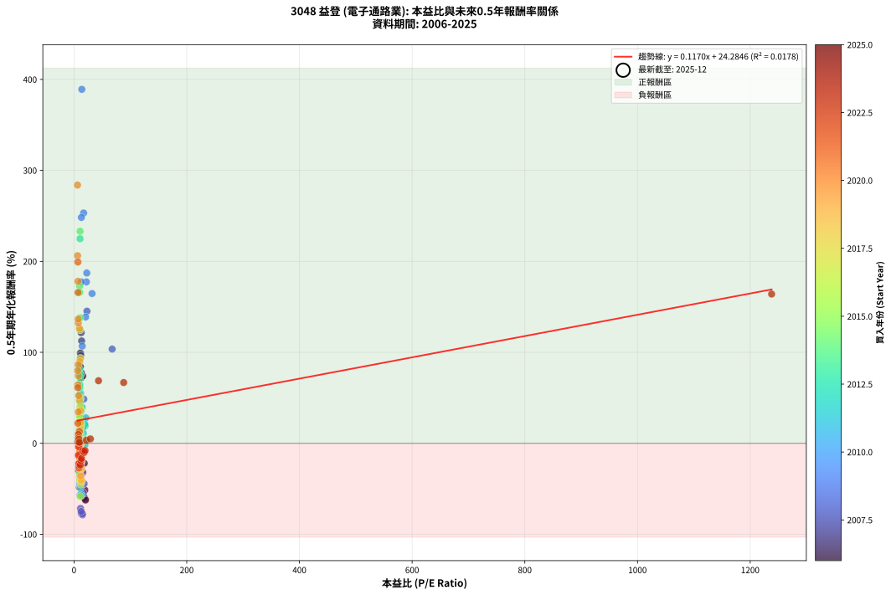
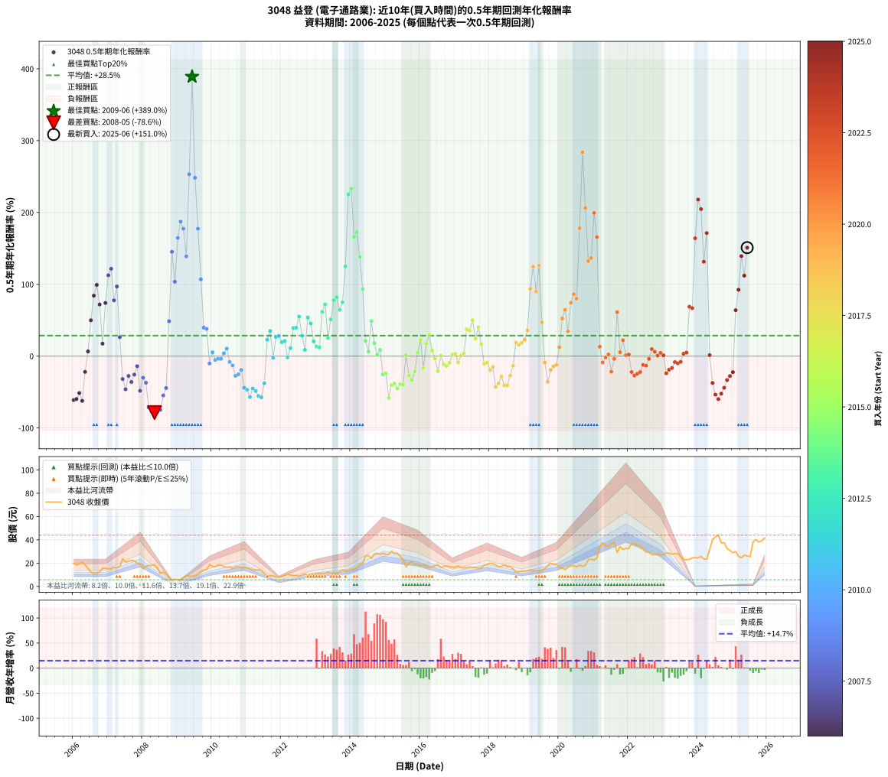

# 3048 益登 - 本益比與未來報酬率分析

!!! info "報告資訊"
    - **股票代號**: 3048
    - **公司名稱**: 益登
    - **產業別**: 電子通路業
    - **分析期間**: 2006-2025 (234 個數據點)
    - **資料來源**: Type 12 (ShowMonthlyK_ChartFlow) 月收盤價與本益比
    - **報酬率口徑**: 含現金股利 (簡化: 年度合計，假設每年7/1入帳)
    - **報告生成時間**: 2026-01-07 21:01:23 CST

## 📈 視覺化圖表

### 圖表1: 本益比 vs 未來報酬率關係

*圖表1：3048 益登 本益比與0.5年期未來報酬率關係 (2006-2025)*

### 圖表2: 歷年買入時點的0.5年期實際報酬率

*圖表2：3048 益登 歷年買入時點的0.5年期實際報酬率 (2006-2025)*

## 📍 買點訊號說明

本報告提供兩種買點提示訊號（顯示於圖表2的股價子圖中）：

### ▲ 小綠色三角形（回測驗證）
- **計算方式**: 使用全部歷史資料計算本益比第25百分位數
- **用途**: 事後驗證，顯示歷史上哪些時點確實為低估區
- **限制**: 當下無法判斷，僅供回測參考
- **特性**: 後見之明（Look-Ahead Bias）

### ▲ 小橘色三角形（即時訊號）
- **計算方式**: 使用截至當月的過去5年資料計算本益比第25百分位數
- **用途**: 實際投資決策，當時即可判斷
- **優勢**: 可操作性強，符合實務需求
- **特性**: 無後見之明，滾動窗口計算

!!! tip "如何使用兩種訊號"
    - **綠色▲** 幫助理解歷史估值機會，驗證策略有效性
    - **橘色▲** 可作為實際買進參考，但仍需搭配基本面分析
    - 兩種訊號重疊時，表示即時判斷與事後驗證一致，信心度較高
    - 僅有綠色▲時，表示當時無法判斷（需要未來資料才能確認）
    - 僅有橘色▲時，表示即時判斷為買點，但事後可能不是最佳時機

## 📊 估值分析摘要

| 指標 | 數值 |
|:---:|:---:|
| **目前本益比** (2025-06) | **nan 倍** |
| **歷史平均本益比** | 18.54 倍 |
| **估值水準** | 🟡 合理範圍 |
| **預期0.5年年化報酬率** | **+nan%** |
| **歷史平均報酬率** | +28.50% |
| **相關係數 (R²)** | 0.0178 |
| **趨勢線斜率** | 0.1170 |

!!! abstract "核心洞察"
    目前本益比接近歷史平均，預期報酬率符合長期趨勢

    根據歷史數據回測，3048 益登 在目前本益比 **nan倍** 的估值水準下，
    預期未來0.5年年化報酬率約為 **+nan%**。

    **重要提醒**: 本分析基於歷史數據統計，實際報酬率會受到公司基本面變化、產業趨勢、
    總體經濟環境等多重因素影響。R² = 0.02 表示本益比可解釋約 1.8% 的報酬率變異。

## 📈 歷史估值統計

### 最佳買點 (最高報酬率)

| 項目 | 數值 |
|:---:|:---:|
| 起始時間 | 2009-06 |
| 當時本益比 | 13.84 倍 |
| 起始價格 | 8.5 元 |
| 0.5年後價格 | 18.9 元 |
| **0.5年年化報酬率** | **+389.04%** |

### 最差買點 (最低報酬率)

| 項目 | 數值 |
|:---:|:---:|
| 起始時間 | 2008-05 |
| 當時本益比 | 15.14 倍 |
| 起始價格 | 18.5 元 |
| 0.5年後價格 | 6.1 元 |
| **0.5年年化報酬率** | **-78.63%** |

## 🎯 投資啟示

### 本益比與報酬率關係

趨勢線方程式: **y = 0.1170x + 24.2846**

!!! info "弱相關或正相關"
    本益比與未來報酬率相關性較弱。這可能表示該股票的報酬率更多受到
    公司成長性、產業趨勢等因素影響，而非估值水準。**需綜合考量多項指標**。

### 估值區間建議

基於歷史數據分析:

- **🟢 低估區** (P/E < 14.8): 預期報酬率較高，可考慮增加持股
- **🟡 合理區** (P/E 14.8-22.2): 預期報酬率符合長期趨勢，正常持有
- **🔴 高估區** (P/E > 22.2): 預期報酬率較低，可考慮減碼或觀望

!!! danger "風險提示"
    - 過去表現不代表未來結果
    - 本分析假設公司基本面無重大結構性變化
    - 產業環境劇變可能使歷史規律失效
    - 應結合公司財報、產業趨勢、總體經濟等多重因素綜合判斷

!!! success "長期投資觀點"
    歷史數據顯示，在合理或低估的估值水準買入並長期持有，
    往往能獲得較佳的投資報酬。**耐心等待好價格**是價值投資的核心原則。

## 📊 數據品質

- **資料來源**: GoodInfo.tw Type 12 (ShowMonthlyK_ChartFlow)
- **資料頻率**: 月度收盤價與本益比
- **回測期間**: 2006-2025
- **數據點數量**: 234 個 (每個點代表一次0.5年期回測)

### 計算方法說明

1. **0.5年期年化報酬率**:
   - 對每個歷史時點，計算其後0.5年的實際投資報酬率
   - 期末價值(不含股利): 期末價格
   - 期末價值(含現金股利): 期末價格 + 持有期間內的現金股利合計 (簡化: 年度合計，假設每年7/1入帳)
   - 公式: 年化報酬率 = [(期末價值/期初價格)^(1/年數) - 1] × 100%

2. **本益比 (P/E Ratio)**:
   - 使用當時的月收盤價與EPS計算
   - 資料來源: Type 12 月度河流圖本益比數據

3. **趨勢線 (Linear Regression)**:
   - 使用最小平方法擬合線性趨勢線
   - R²值衡量本益比對報酬率的解釋能力

---

*本報告由 Stock Analysis System v1.9.0 自動生成*
*數據更新時間: 2026-01-07 21:01:23 CST*

## 📋 月度回測明細表

（每一列對應時間線圖中的一個買入點；可用來對照 SVG 圖上的每個點。）

| 買入月份 | 賣出月份 | 回測期限_年 | 實際持有年數 | 買入本益比_倍 | 買入收盤價_元 | 賣出收盤價_元 | 現金股利合計_元 | 總報酬率_pct | 年化報酬率_pct |
| --- | --- | --- | --- | --- | --- | --- | --- | --- | --- |
| 2006-01 | 2006-07 | 0.5 | 0.496 | 19.51 | 19.90 | 12.15 | 0.30 | -37.44 | -61.19 |
| 2006-02 | 2006-08 | 0.5 | 0.498 | 18.04 | 18.40 | 11.40 | 0.30 | -36.41 | -59.69 |
| 2006-03 | 2006-10 | 0.5 | 0.586 | 19.07 | 19.45 | 12.45 | 0.30 | -34.45 | -51.36 |
| 2006-04 | 2006-10 | 0.5 | 0.501 | 20.39 | 20.80 | 12.45 | 0.30 | -38.70 | -62.35 |
| 2006-05 | 2006-12 | 0.5 | 0.586 | 18.14 | 18.50 | 15.70 | 0.30 | -13.51 | -21.95 |
| 2006-06 | 2006-12 | 0.5 | 0.501 | 15.20 | 15.50 | 15.70 | 0.30 | +3.23 | +6.54 |
| 2006-07 | 2007-01 | 0.5 | 0.504 | 11.91 | 12.15 | 14.90 | 0.00 | +22.63 | +49.93 |
| 2006-08 | 2007-03 | 0.5 | 0.580 | 11.18 | 11.40 | 16.25 | 0.00 | +42.54 | +84.18 |
| 2006-09 | 2007-03 | 0.5 | 0.496 | 11.32 | 11.55 | 16.25 | 0.00 | +40.69 | +99.16 |
| 2006-10 | 2007-05 | 0.5 | 0.580 | 12.21 | 12.45 | 17.05 | 0.00 | +36.95 | +71.90 |
| 2006-11 | 2007-05 | 0.5 | 0.496 | 15.44 | 15.75 | 17.05 | 0.00 | +8.25 | +17.36 |
| 2006-12 | 2007-07 | 0.5 | 0.580 | 15.39 | 15.70 | 20.90 | 0.75 | +37.90 | +73.96 |
| 2007-01 | 2007-07 | 0.5 | 0.496 | 13.49 | 14.90 | 20.90 | 0.75 | +45.30 | +112.55 |
| 2007-02 | 2007-08 | 0.5 | 0.498 | 12.62 | 15.00 | 21.55 | 0.75 | +48.67 | +121.62 |
| 2007-03 | 2007-10 | 0.5 | 0.586 | 12.77 | 16.25 | 22.00 | 0.75 | +40.00 | +77.59 |
| 2007-04 | 2007-10 | 0.5 | 0.501 | 11.94 | 16.20 | 22.00 | 0.75 | +40.43 | +96.94 |
| 2007-05 | 2007-12 | 0.5 | 0.586 | 11.83 | 17.05 | 18.80 | 0.75 | +14.66 | +26.31 |
| 2007-06 | 2007-12 | 0.5 | 0.501 | 15.54 | 23.70 | 18.80 | 0.75 | -17.51 | -31.90 |
| 2007-07 | 2008-01 | 0.5 | 0.504 | 12.99 | 20.90 | 15.30 | 0.00 | -26.79 | -46.16 |
| 2007-08 | 2008-03 | 0.5 | 0.583 | 12.73 | 21.55 | 17.85 | 0.00 | -17.17 | -27.60 |
| 2007-09 | 2008-03 | 0.5 | 0.498 | 12.55 | 22.30 | 17.85 | 0.00 | -19.96 | -36.03 |
| 2007-10 | 2008-05 | 0.5 | 0.583 | 11.82 | 22.00 | 18.50 | 0.00 | -15.91 | -25.70 |
| 2007-11 | 2008-05 | 0.5 | 0.498 | 10.25 | 19.95 | 18.50 | 0.00 | -7.27 | -14.05 |
| 2007-12 | 2008-07 | 0.5 | 0.583 | 9.26 | 18.80 | 11.40 | 1.40 | -31.91 | -48.27 |
| 2008-01 | 2008-07 | 0.5 | 0.498 | 8.19 | 15.30 | 11.40 | 1.40 | -16.34 | -30.10 |
| 2008-02 | 2008-08 | 0.5 | 0.501 | 10.05 | 17.15 | 12.20 | 1.40 | -20.70 | -37.05 |
| 2008-03 | 2008-10 | 0.5 | 0.586 | 11.55 | 17.85 | 7.15 | 1.40 | -52.10 | -71.53 |
| 2008-04 | 2008-10 | 0.5 | 0.501 | 13.05 | 18.05 | 7.15 | 1.40 | -52.63 | -77.49 |
| 2008-05 | 2008-12 | 0.5 | 0.586 | 15.14 | 18.50 | 6.09 | 1.40 | -59.51 | -78.63 |
| 2008-06 | 2008-12 | 0.5 | 0.501 | 14.91 | 15.80 | 6.09 | 1.40 | -52.59 | -77.46 |
| 2008-07 | 2009-01 | 0.5 | 0.504 | 12.69 | 11.40 | 5.68 | 0.00 | -50.18 | -74.92 |
| 2008-08 | 2009-03 | 0.5 | 0.580 | 16.56 | 12.20 | 7.70 | 0.00 | -36.89 | -54.75 |
| 2008-09 | 2009-03 | 0.5 | 0.496 | 17.91 | 10.30 | 7.70 | 0.00 | -25.24 | -44.40 |
| 2008-10 | 2009-05 | 0.5 | 0.580 | 17.30 | 7.15 | 9.00 | 0.00 | +25.87 | +48.65 |
| 2008-11 | 2009-05 | 0.5 | 0.496 | 22.93 | 5.77 | 9.00 | 0.00 | +55.98 | +145.24 |
| 2008-12 | 2009-07 | 0.5 | 0.580 | 67.67 | 6.09 | 9.20 | 0.00 | +51.07 | +103.56 |
| 2009-01 | 2009-07 | 0.5 | 0.496 | 32.00 | 5.68 | 9.20 | 0.00 | +61.97 | +164.63 |
| 2009-02 | 2009-08 | 0.5 | 0.498 | 22.64 | 6.00 | 10.15 | 0.00 | +69.17 | +187.21 |
| 2009-03 | 2009-10 | 0.5 | 0.586 | 21.84 | 7.70 | 14.00 | 0.00 | +81.82 | +177.42 |
| 2009-04 | 2009-10 | 0.5 | 0.501 | 20.57 | 9.05 | 14.00 | 0.00 | +54.70 | +138.88 |
| 2009-05 | 2009-12 | 0.5 | 0.586 | 17.06 | 9.00 | 18.85 | 0.00 | +109.44 | +253.18 |
| 2009-06 | 2009-12 | 0.5 | 0.501 | 13.84 | 8.51 | 18.85 | 0.00 | +121.50 | +389.04 |
| 2009-07 | 2010-01 | 0.5 | 0.504 | 13.10 | 9.20 | 17.25 | 0.00 | +87.50 | +248.28 |
| 2009-08 | 2010-03 | 0.5 | 0.580 | 12.85 | 10.15 | 18.35 | 0.00 | +80.79 | +177.38 |
| 2009-09 | 2010-03 | 0.5 | 0.496 | 14.59 | 12.80 | 18.35 | 0.00 | +43.36 | +106.85 |
| 2009-10 | 2010-05 | 0.5 | 0.580 | 14.51 | 14.00 | 17.00 | 0.00 | +21.43 | +39.73 |
| 2009-11 | 2010-05 | 0.5 | 0.496 | 13.78 | 14.50 | 17.00 | 0.00 | +17.24 | +37.85 |
| 2009-12 | 2010-07 | 0.5 | 0.580 | 16.54 | 18.85 | 16.70 | 1.00 | -6.10 | -10.28 |
| 2010-01 | 2010-07 | 0.5 | 0.496 | 14.56 | 17.25 | 16.70 | 1.00 | +2.61 | +5.33 |
| 2010-02 | 2010-08 | 0.5 | 0.498 | 13.70 | 16.85 | 15.40 | 1.00 | -2.67 | -5.29 |
| 2010-03 | 2010-10 | 0.5 | 0.586 | 14.39 | 18.35 | 16.95 | 1.00 | -2.18 | -3.69 |
| 2010-04 | 2010-10 | 0.5 | 0.501 | 13.86 | 18.30 | 16.95 | 1.00 | -1.91 | -3.78 |
| 2010-05 | 2010-12 | 0.5 | 0.586 | 12.45 | 17.00 | 16.40 | 1.00 | +2.35 | +4.05 |
| 2010-06 | 2010-12 | 0.5 | 0.501 | 11.74 | 16.55 | 16.40 | 1.00 | +5.14 | +10.51 |
| 2010-07 | 2011-01 | 0.5 | 0.504 | 11.48 | 16.70 | 16.00 | 0.00 | -4.19 | -8.15 |
| 2010-08 | 2011-03 | 0.5 | 0.580 | 10.27 | 15.40 | 14.20 | 0.00 | -7.79 | -13.04 |
| 2010-09 | 2011-03 | 0.5 | 0.496 | 10.78 | 16.65 | 14.20 | 0.00 | -14.71 | -27.47 |
| 2010-10 | 2011-05 | 0.5 | 0.580 | 10.66 | 16.95 | 14.30 | 0.00 | -15.63 | -25.39 |
| 2010-11 | 2011-05 | 0.5 | 0.496 | 9.72 | 15.90 | 14.30 | 0.00 | -10.06 | -19.27 |
| 2010-12 | 2011-07 | 0.5 | 0.580 | 9.76 | 16.40 | 11.00 | 0.71 | -28.61 | -44.05 |
| 2011-01 | 2011-07 | 0.5 | 0.496 | 10.17 | 16.00 | 11.00 | 0.71 | -26.82 | -46.75 |
| 2011-02 | 2011-08 | 0.5 | 0.498 | 10.38 | 15.20 | 9.27 | 0.71 | -34.36 | -57.03 |
| 2011-03 | 2011-10 | 0.5 | 0.586 | 10.46 | 14.20 | 9.29 | 0.71 | -29.59 | -45.05 |
| 2011-04 | 2011-10 | 0.5 | 0.501 | 11.16 | 13.95 | 9.29 | 0.71 | -28.33 | -48.56 |
| 2011-05 | 2011-12 | 0.5 | 0.586 | 12.52 | 14.30 | 8.19 | 0.71 | -37.78 | -55.50 |
| 2011-06 | 2011-12 | 0.5 | 0.501 | 13.19 | 13.65 | 8.19 | 0.71 | -34.81 | -57.43 |
| 2011-07 | 2012-01 | 0.5 | 0.504 | 11.86 | 11.00 | 8.66 | 0.00 | -21.27 | -37.80 |
| 2011-08 | 2012-03 | 0.5 | 0.583 | 11.30 | 9.27 | 10.45 | 0.00 | +12.73 | +22.81 |
| 2011-09 | 2012-03 | 0.5 | 0.498 | 12.63 | 9.00 | 10.45 | 0.00 | +16.11 | +34.96 |
| 2011-10 | 2012-05 | 0.5 | 0.583 | 15.36 | 9.29 | 9.17 | 0.00 | -1.29 | -2.20 |
| 2011-11 | 2012-05 | 0.5 | 0.498 | 16.38 | 8.15 | 9.17 | 0.00 | +12.52 | +26.70 |
| 2011-12 | 2012-07 | 0.5 | 0.583 | 21.00 | 8.19 | 8.78 | 0.68 | +15.51 | +28.04 |
| 2012-01 | 2012-07 | 0.5 | 0.498 | 19.64 | 8.66 | 8.78 | 0.68 | +9.24 | +19.40 |
| 2012-02 | 2012-08 | 0.5 | 0.501 | 19.00 | 9.34 | 9.60 | 0.68 | +10.06 | +21.09 |
| 2012-03 | 2012-10 | 0.5 | 0.586 | 19.26 | 10.45 | 9.66 | 0.68 | -1.05 | -1.79 |
| 2012-04 | 2012-10 | 0.5 | 0.501 | 16.53 | 9.81 | 9.66 | 0.68 | +5.40 | +11.07 |
| 2012-05 | 2012-12 | 0.5 | 0.586 | 14.24 | 9.17 | 10.45 | 0.68 | +21.37 | +39.18 |
| 2012-06 | 2012-12 | 0.5 | 0.501 | 13.55 | 9.42 | 10.45 | 0.68 | +18.15 | +39.51 |
| 2012-07 | 2013-01 | 0.5 | 0.504 | 11.77 | 8.78 | 10.95 | 0.00 | +24.72 | +55.03 |
| 2012-08 | 2013-03 | 0.5 | 0.580 | 12.05 | 9.60 | 11.10 | 0.00 | +15.62 | +28.42 |
| 2012-09 | 2013-03 | 0.5 | 0.496 | 12.57 | 10.65 | 11.10 | 0.00 | +4.23 | +8.71 |
| 2012-10 | 2013-05 | 0.5 | 0.580 | 10.75 | 9.66 | 12.40 | 0.00 | +28.36 | +53.76 |
| 2012-11 | 2013-05 | 0.5 | 0.496 | 10.85 | 10.30 | 12.40 | 0.00 | +20.39 | +45.42 |
| 2012-12 | 2013-07 | 0.5 | 0.580 | 10.45 | 10.45 | 11.15 | 0.50 | +11.48 | +20.60 |
| 2013-01 | 2013-07 | 0.5 | 0.496 | 10.70 | 10.95 | 11.15 | 0.50 | +6.39 | +13.32 |
| 2013-02 | 2013-08 | 0.5 | 0.498 | 10.65 | 11.15 | 11.30 | 0.50 | +5.83 | +12.04 |
| 2013-03 | 2013-10 | 0.5 | 0.586 | 10.37 | 11.10 | 14.20 | 0.50 | +32.43 | +61.52 |
| 2013-04 | 2013-10 | 0.5 | 0.501 | 10.24 | 11.20 | 14.20 | 0.50 | +31.25 | +72.07 |
| 2013-05 | 2013-12 | 0.5 | 0.586 | 11.10 | 12.40 | 13.65 | 0.50 | +14.11 | +25.27 |
| 2013-06 | 2013-12 | 0.5 | 0.501 | 10.09 | 11.50 | 13.65 | 0.50 | +23.04 | +51.27 |
| 2013-07 | 2014-01 | 0.5 | 0.504 | 9.58 | 11.15 | 14.90 | 0.00 | +33.63 | +77.80 |
| 2013-08 | 2014-03 | 0.5 | 0.580 | 9.52 | 11.30 | 16.00 | 0.00 | +41.59 | +82.06 |
| 2013-09 | 2014-03 | 0.5 | 0.496 | 10.33 | 12.50 | 16.00 | 0.00 | +28.00 | +64.57 |
| 2013-10 | 2014-05 | 0.5 | 0.580 | 11.51 | 14.20 | 19.65 | 0.00 | +38.38 | +75.01 |
| 2013-11 | 2014-05 | 0.5 | 0.496 | 10.46 | 13.15 | 19.65 | 0.00 | +49.43 | +124.91 |
| 2013-12 | 2014-07 | 0.5 | 0.580 | 10.66 | 13.65 | 26.55 | 0.50 | +98.17 | +224.90 |
| 2014-01 | 2014-07 | 0.5 | 0.496 | 10.71 | 14.90 | 26.55 | 0.50 | +81.54 | +233.13 |
| 2014-02 | 2014-08 | 0.5 | 0.498 | 10.02 | 15.05 | 24.00 | 0.50 | +62.79 | +165.90 |
| 2014-03 | 2014-10 | 0.5 | 0.586 | 9.92 | 16.00 | 28.30 | 0.50 | +80.00 | +172.70 |
| 2014-04 | 2014-10 | 0.5 | 0.501 | 10.82 | 18.65 | 28.30 | 0.50 | +54.42 | +138.04 |
| 2014-05 | 2014-12 | 0.5 | 0.586 | 10.71 | 19.65 | 28.40 | 0.50 | +47.07 | +93.17 |
| 2014-06 | 2014-12 | 0.5 | 0.501 | 13.50 | 26.25 | 28.40 | 0.50 | +10.10 | +21.16 |
| 2014-07 | 2015-01 | 0.5 | 0.504 | 12.91 | 26.55 | 27.40 | 0.00 | +3.20 | +6.46 |
| 2014-08 | 2015-03 | 0.5 | 0.580 | 11.08 | 24.00 | 30.25 | 0.00 | +26.04 | +49.00 |
| 2014-09 | 2015-03 | 0.5 | 0.496 | 12.23 | 27.85 | 30.25 | 0.00 | +8.62 | +18.15 |
| 2014-10 | 2015-05 | 0.5 | 0.580 | 11.85 | 28.30 | 28.55 | 0.00 | +0.88 | +1.53 |
| 2014-11 | 2015-05 | 0.5 | 0.496 | 10.96 | 27.40 | 28.55 | 0.00 | +4.20 | +8.65 |
| 2014-12 | 2015-07 | 0.5 | 0.580 | 10.88 | 28.40 | 22.95 | 0.99 | -15.70 | -25.49 |
| 2015-01 | 2015-07 | 0.5 | 0.496 | 10.67 | 27.40 | 22.95 | 0.99 | -12.62 | -23.83 |
| 2015-02 | 2015-08 | 0.5 | 0.498 | 10.88 | 27.50 | 16.80 | 0.99 | -35.30 | -58.27 |
| 2015-03 | 2015-10 | 0.5 | 0.586 | 12.17 | 30.25 | 21.35 | 0.99 | -26.14 | -40.38 |
| 2015-04 | 2015-10 | 0.5 | 0.501 | 11.62 | 28.40 | 21.35 | 0.99 | -21.33 | -38.05 |
| 2015-05 | 2015-12 | 0.5 | 0.586 | 11.89 | 28.55 | 19.10 | 0.99 | -29.63 | -45.10 |
| 2015-06 | 2015-12 | 0.5 | 0.501 | 10.91 | 25.75 | 19.10 | 0.99 | -21.97 | -39.06 |
| 2015-07 | 2016-01 | 0.5 | 0.504 | 9.90 | 22.95 | 17.75 | 0.00 | -22.66 | -39.95 |
| 2015-08 | 2016-03 | 0.5 | 0.583 | 7.38 | 16.80 | 16.95 | 0.00 | +0.89 | +1.54 |
| 2015-09 | 2016-03 | 0.5 | 0.498 | 8.86 | 19.80 | 16.95 | 0.00 | -14.39 | -26.79 |
| 2015-10 | 2016-05 | 0.5 | 0.583 | 9.73 | 21.35 | 16.85 | 0.00 | -21.08 | -33.36 |
| 2015-11 | 2016-05 | 0.5 | 0.498 | 8.83 | 19.00 | 16.85 | 0.00 | -11.32 | -21.42 |
| 2015-12 | 2016-07 | 0.5 | 0.583 | 9.05 | 19.10 | 18.65 | 1.00 | +2.88 | +4.99 |
| 2016-01 | 2016-07 | 0.5 | 0.498 | 8.77 | 17.75 | 18.65 | 1.00 | +10.70 | +22.64 |
| 2016-02 | 2016-08 | 0.5 | 0.501 | 9.68 | 18.75 | 16.10 | 1.00 | -8.80 | -16.79 |
| 2016-03 | 2016-10 | 0.5 | 0.586 | 9.16 | 16.95 | 17.60 | 1.00 | +9.73 | +17.18 |
| 2016-04 | 2016-10 | 0.5 | 0.501 | 9.24 | 16.30 | 17.60 | 1.00 | +14.11 | +30.14 |
| 2016-05 | 2016-12 | 0.5 | 0.586 | 10.05 | 16.85 | 16.60 | 1.00 | +4.45 | +7.72 |
| 2016-06 | 2016-12 | 0.5 | 0.501 | 11.26 | 17.90 | 16.60 | 1.00 | -1.68 | -3.32 |
| 2016-07 | 2017-01 | 0.5 | 0.504 | 12.41 | 18.65 | 16.55 | 0.00 | -11.26 | -21.11 |
| 2016-08 | 2017-03 | 0.5 | 0.580 | 11.36 | 16.10 | 16.15 | 0.00 | +0.31 | +0.54 |
| 2016-09 | 2017-03 | 0.5 | 0.496 | 12.89 | 17.15 | 16.15 | 0.00 | -5.83 | -11.42 |
| 2016-10 | 2017-05 | 0.5 | 0.580 | 14.16 | 17.60 | 16.15 | 0.00 | -8.24 | -13.77 |
| 2016-11 | 2017-05 | 0.5 | 0.496 | 14.65 | 16.95 | 16.15 | 0.00 | -4.72 | -9.30 |
| 2016-12 | 2017-07 | 0.5 | 0.580 | 15.51 | 16.60 | 16.30 | 0.50 | +1.20 | +2.08 |
| 2017-01 | 2017-07 | 0.5 | 0.496 | 14.82 | 16.55 | 16.30 | 0.50 | +1.51 | +3.07 |
| 2017-02 | 2017-08 | 0.5 | 0.498 | 15.13 | 17.60 | 16.30 | 0.50 | -4.55 | -8.91 |
| 2017-03 | 2017-10 | 0.5 | 0.586 | 13.35 | 16.15 | 15.70 | 0.50 | +0.31 | +0.53 |
| 2017-04 | 2017-10 | 0.5 | 0.501 | 12.65 | 15.90 | 15.70 | 0.50 | +1.89 | +3.80 |
| 2017-05 | 2017-12 | 0.5 | 0.586 | 12.39 | 16.15 | 18.95 | 0.50 | +20.43 | +37.35 |
| 2017-06 | 2017-12 | 0.5 | 0.501 | 12.37 | 16.70 | 18.95 | 0.50 | +16.47 | +35.56 |
| 2017-07 | 2018-01 | 0.5 | 0.504 | 11.67 | 16.30 | 20.00 | 0.00 | +22.70 | +50.09 |
| 2017-08 | 2018-03 | 0.5 | 0.580 | 11.29 | 16.30 | 18.50 | 0.00 | +13.50 | +24.37 |
| 2017-09 | 2018-03 | 0.5 | 0.496 | 10.50 | 15.65 | 18.50 | 0.00 | +18.21 | +40.16 |
| 2017-10 | 2018-05 | 0.5 | 0.580 | 10.22 | 15.70 | 17.15 | 0.00 | +9.24 | +16.44 |
| 2017-11 | 2018-05 | 0.5 | 0.496 | 11.46 | 18.15 | 17.15 | 0.00 | -5.51 | -10.81 |
| 2017-12 | 2018-07 | 0.5 | 0.580 | 11.63 | 18.95 | 16.95 | 1.00 | -5.28 | -8.92 |
| 2018-01 | 2018-07 | 0.5 | 0.496 | 12.62 | 20.00 | 16.95 | 1.00 | -10.25 | -19.61 |
| 2018-02 | 2018-08 | 0.5 | 0.498 | 12.60 | 19.40 | 16.90 | 1.00 | -7.73 | -14.91 |
| 2018-03 | 2018-10 | 0.5 | 0.586 | 12.37 | 18.50 | 12.30 | 1.00 | -28.11 | -43.06 |
| 2018-04 | 2018-10 | 0.5 | 0.501 | 11.66 | 16.90 | 12.30 | 1.00 | -21.30 | -38.01 |
| 2018-05 | 2018-12 | 0.5 | 0.586 | 12.21 | 17.15 | 13.10 | 1.00 | -17.78 | -28.41 |
| 2018-06 | 2018-12 | 0.5 | 0.501 | 13.49 | 18.35 | 13.10 | 1.00 | -23.16 | -40.89 |
| 2018-07 | 2019-01 | 0.5 | 0.504 | 12.89 | 16.95 | 13.05 | 0.00 | -23.01 | -40.49 |
| 2018-08 | 2019-03 | 0.5 | 0.580 | 13.31 | 16.90 | 14.05 | 0.00 | -16.86 | -27.25 |
| 2018-09 | 2019-03 | 0.5 | 0.496 | 12.33 | 15.10 | 14.05 | 0.00 | -6.95 | -13.54 |
| 2018-10 | 2019-05 | 0.5 | 0.580 | 10.42 | 12.30 | 13.60 | 0.00 | +10.57 | +18.90 |
| 2018-11 | 2019-05 | 0.5 | 0.496 | 11.15 | 12.65 | 13.60 | 0.00 | +7.51 | +15.73 |
| 2018-12 | 2019-07 | 0.5 | 0.580 | 12.02 | 13.10 | 13.75 | 0.70 | +10.31 | +18.41 |
| 2019-01 | 2019-07 | 0.5 | 0.496 | 11.48 | 13.05 | 13.75 | 0.70 | +10.73 | +22.83 |
| 2019-02 | 2019-08 | 0.5 | 0.498 | 11.49 | 13.60 | 15.15 | 0.70 | +16.54 | +35.97 |
| 2019-03 | 2019-10 | 0.5 | 0.586 | 11.42 | 14.05 | 20.00 | 0.70 | +47.33 | +93.75 |
| 2019-04 | 2019-10 | 0.5 | 0.501 | 10.81 | 13.80 | 20.00 | 0.70 | +50.00 | +124.63 |
| 2019-05 | 2019-12 | 0.5 | 0.586 | 10.28 | 13.60 | 19.10 | 0.70 | +45.59 | +89.85 |
| 2019-06 | 2019-12 | 0.5 | 0.501 | 9.60 | 13.15 | 19.10 | 0.70 | +50.57 | +126.33 |
| 2019-07 | 2020-01 | 0.5 | 0.504 | 9.71 | 13.75 | 16.70 | 0.00 | +21.45 | +47.08 |
| 2019-08 | 2020-03 | 0.5 | 0.583 | 10.35 | 15.15 | 14.35 | 0.00 | -5.28 | -8.88 |
| 2019-09 | 2020-03 | 0.5 | 0.498 | 11.85 | 17.90 | 14.35 | 0.00 | -19.83 | -35.83 |
| 2019-10 | 2020-05 | 0.5 | 0.583 | 12.85 | 20.00 | 17.65 | 0.00 | -11.75 | -19.29 |
| 2019-11 | 2020-05 | 0.5 | 0.498 | 11.88 | 19.05 | 17.65 | 0.00 | -7.35 | -14.20 |
| 2019-12 | 2020-07 | 0.5 | 0.583 | 11.58 | 19.10 | 16.70 | 1.00 | -7.33 | -12.24 |
| 2020-01 | 2020-07 | 0.5 | 0.498 | 9.42 | 16.70 | 16.70 | 1.00 | +5.99 | +12.38 |
| 2020-02 | 2020-08 | 0.5 | 0.501 | 8.30 | 15.75 | 18.45 | 1.00 | +23.49 | +52.37 |
| 2020-03 | 2020-10 | 0.5 | 0.586 | 7.10 | 14.35 | 18.20 | 1.00 | +33.80 | +64.37 |
| 2020-04 | 2020-10 | 0.5 | 0.501 | 7.72 | 16.55 | 18.20 | 1.00 | +16.01 | +34.51 |
| 2020-05 | 2020-12 | 0.5 | 0.586 | 7.79 | 17.65 | 23.45 | 1.00 | +38.53 | +74.41 |
| 2020-06 | 2020-12 | 0.5 | 0.501 | 7.49 | 17.90 | 23.45 | 1.00 | +36.59 | +86.34 |
| 2020-07 | 2021-01 | 0.5 | 0.504 | 6.64 | 16.70 | 22.45 | 0.00 | +34.43 | +79.92 |
| 2020-08 | 2021-03 | 0.5 | 0.580 | 7.00 | 18.45 | 33.40 | 0.00 | +81.03 | +178.02 |
| 2020-09 | 2021-03 | 0.5 | 0.496 | 6.21 | 17.15 | 33.40 | 0.00 | +94.75 | +283.85 |
| 2020-10 | 2021-05 | 0.5 | 0.580 | 6.31 | 18.20 | 34.85 | 0.00 | +91.48 | +206.25 |
| 2020-11 | 2021-05 | 0.5 | 0.496 | 7.63 | 22.95 | 34.85 | 0.00 | +51.85 | +132.33 |
| 2020-12 | 2021-07 | 0.5 | 0.580 | 7.49 | 23.45 | 36.75 | 1.90 | +64.82 | +136.52 |
| 2021-01 | 2021-07 | 0.5 | 0.496 | 6.90 | 22.45 | 36.75 | 1.90 | +72.16 | +199.30 |
| 2021-02 | 2021-08 | 0.5 | 0.498 | 7.19 | 24.30 | 37.65 | 1.90 | +62.76 | +165.79 |
| 2021-03 | 2021-10 | 0.5 | 0.586 | 9.53 | 33.40 | 34.00 | 1.90 | +7.49 | +13.11 |
| 2021-04 | 2021-10 | 0.5 | 0.501 | 10.36 | 37.60 | 34.00 | 1.90 | -4.52 | -8.82 |
| 2021-05 | 2021-12 | 0.5 | 0.586 | 9.28 | 34.85 | 32.60 | 1.90 | -1.00 | -1.71 |
| 2021-06 | 2021-12 | 0.5 | 0.501 | 8.79 | 34.10 | 32.60 | 1.90 | +1.17 | +2.35 |
| 2021-07 | 2022-01 | 0.5 | 0.504 | 9.18 | 36.75 | 32.50 | 0.00 | -11.56 | -21.65 |
| 2021-08 | 2022-03 | 0.5 | 0.580 | 9.12 | 37.65 | 36.80 | 0.00 | -2.26 | -3.86 |
| 2021-09 | 2022-03 | 0.5 | 0.496 | 6.83 | 29.05 | 36.80 | 0.00 | +26.68 | +61.16 |
| 2021-10 | 2022-05 | 0.5 | 0.580 | 7.76 | 34.00 | 35.05 | 0.00 | +3.09 | +5.38 |
| 2021-11 | 2022-05 | 0.5 | 0.496 | 7.05 | 31.75 | 35.05 | 0.00 | +10.39 | +22.08 |
| 2021-12 | 2022-07 | 0.5 | 0.580 | 7.04 | 32.60 | 29.45 | 3.40 | +0.77 | +1.32 |
| 2022-01 | 2022-07 | 0.5 | 0.496 | 7.22 | 32.50 | 29.45 | 3.40 | +1.08 | +2.19 |
| 2022-02 | 2022-08 | 0.5 | 0.498 | 8.44 | 36.95 | 29.20 | 3.40 | -11.77 | -22.23 |
| 2022-03 | 2022-10 | 0.5 | 0.586 | 8.66 | 36.80 | 27.20 | 3.40 | -16.85 | -27.01 |
| 2022-04 | 2022-10 | 0.5 | 0.501 | 8.55 | 35.25 | 27.20 | 3.40 | -13.19 | -24.60 |
| 2022-05 | 2022-12 | 0.5 | 0.586 | 8.77 | 35.05 | 26.85 | 3.40 | -13.69 | -22.23 |
| 2022-06 | 2022-12 | 0.5 | 0.501 | 8.35 | 32.30 | 26.85 | 3.40 | -6.35 | -12.27 |
| 2022-07 | 2023-01 | 0.5 | 0.504 | 7.87 | 29.45 | 27.40 | 0.00 | -6.96 | -13.34 |
| 2022-08 | 2023-03 | 0.5 | 0.580 | 8.07 | 29.20 | 28.55 | 0.00 | -2.23 | -3.80 |
| 2022-09 | 2023-03 | 0.5 | 0.496 | 7.81 | 27.25 | 28.55 | 0.00 | +4.77 | +9.86 |
| 2022-10 | 2023-05 | 0.5 | 0.580 | 8.09 | 27.20 | 28.15 | 0.00 | +3.49 | +6.09 |
| 2022-11 | 2023-05 | 0.5 | 0.496 | 8.67 | 28.05 | 28.15 | 0.00 | +0.36 | +0.72 |
| 2022-12 | 2023-07 | 0.5 | 0.580 | 8.63 | 26.85 | 25.55 | 2.00 | +2.61 | +4.53 |
| 2023-01 | 2023-07 | 0.5 | 0.496 | 9.61 | 27.40 | 25.55 | 2.00 | +0.55 | +1.11 |
| 2023-02 | 2023-08 | 0.5 | 0.498 | 11.08 | 28.75 | 23.10 | 2.00 | -12.70 | -23.85 |
| 2023-03 | 2023-10 | 0.5 | 0.586 | 12.21 | 28.55 | 23.25 | 2.00 | -11.56 | -18.91 |
| 2023-04 | 2023-10 | 0.5 | 0.501 | 13.29 | 27.65 | 23.25 | 2.00 | -8.68 | -16.58 |
| 2023-05 | 2023-12 | 0.5 | 0.586 | 15.45 | 28.15 | 24.75 | 2.00 | -4.97 | -8.34 |
| 2023-06 | 2023-12 | 0.5 | 0.501 | 18.02 | 28.20 | 24.75 | 2.00 | -5.14 | -10.00 |
| 2023-07 | 2024-01 | 0.5 | 0.504 | 19.54 | 25.55 | 24.50 | 0.00 | -4.11 | -7.99 |
| 2023-08 | 2024-03 | 0.5 | 0.583 | 22.00 | 23.10 | 23.55 | 0.00 | +1.95 | +3.36 |
| 2023-09 | 2024-03 | 0.5 | 0.498 | 29.02 | 23.00 | 23.55 | 0.00 | +2.39 | +4.86 |
| 2023-10 | 2024-05 | 0.5 | 0.583 | 43.46 | 23.25 | 31.55 | 0.00 | +35.70 | +68.79 |
| 2023-11 | 2024-05 | 0.5 | 0.498 | 88.11 | 24.45 | 31.55 | 0.00 | +29.04 | +66.80 |
| 2023-12 | 2024-07 | 0.5 | 0.583 | 1238.00 | 24.75 | 42.60 | 1.00 | +76.16 | +164.05 |
| 2024-01 | 2024-07 | 0.5 | 0.498 |  | 24.50 | 42.60 | 1.00 | +77.96 | +217.95 |
| 2024-02 | 2024-08 | 0.5 | 0.501 |  | 25.75 | 44.00 | 1.00 | +74.76 | +204.70 |
| 2024-03 | 2024-10 | 0.5 | 0.586 |  | 23.55 | 37.50 | 1.00 | +63.48 | +131.39 |
| 2024-04 | 2024-10 | 0.5 | 0.501 |  | 23.35 | 37.50 | 1.00 | +64.88 | +171.30 |
| 2024-05 | 2024-12 | 0.5 | 0.586 |  | 31.55 | 30.80 | 1.00 | +0.79 | +1.36 |
| 2024-06 | 2024-12 | 0.5 | 0.501 |  | 40.20 | 30.80 | 1.00 | -20.90 | -37.36 |
| 2024-07 | 2025-01 | 0.5 | 0.504 |  | 42.60 | 28.90 | 0.00 | -32.16 | -53.71 |
| 2024-08 | 2025-03 | 0.5 | 0.580 |  | 44.00 | 25.90 | 0.00 | -41.14 | -59.87 |
| 2024-09 | 2025-03 | 0.5 | 0.496 |  | 37.35 | 25.90 | 0.00 | -30.66 | -52.23 |
| 2024-10 | 2025-05 | 0.5 | 0.580 |  | 37.50 | 26.75 | 0.00 | -28.67 | -44.12 |
| 2024-11 | 2025-05 | 0.5 | 0.496 |  | 32.70 | 26.75 | 0.00 | -18.20 | -33.32 |
| 2024-12 | 2025-07 | 0.5 | 0.580 |  | 30.80 | 25.50 | 0.00 | -17.21 | -27.77 |
| 2025-01 | 2025-07 | 0.5 | 0.496 |  | 28.90 | 25.50 | 0.00 | -11.76 | -22.32 |
| 2025-02 | 2025-08 | 0.5 | 0.498 |  | 29.90 | 38.25 | 0.00 | +27.93 | +63.93 |
| 2025-03 | 2025-10 | 0.5 | 0.586 |  | 25.90 | 38.00 | 0.00 | +46.72 | +92.38 |
| 2025-04 | 2025-10 | 0.5 | 0.501 |  | 24.55 | 38.00 | 0.00 | +54.79 | +139.16 |
| 2025-05 | 2025-12 | 0.5 | 0.586 |  | 26.75 | 41.55 | 0.00 | +55.33 | +112.04 |
| 2025-06 | 2025-12 | 0.5 | 0.501 |  | 26.20 | 41.55 | 0.00 | +58.59 | +151.03 |
