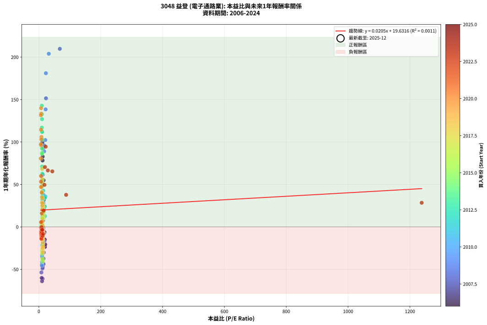
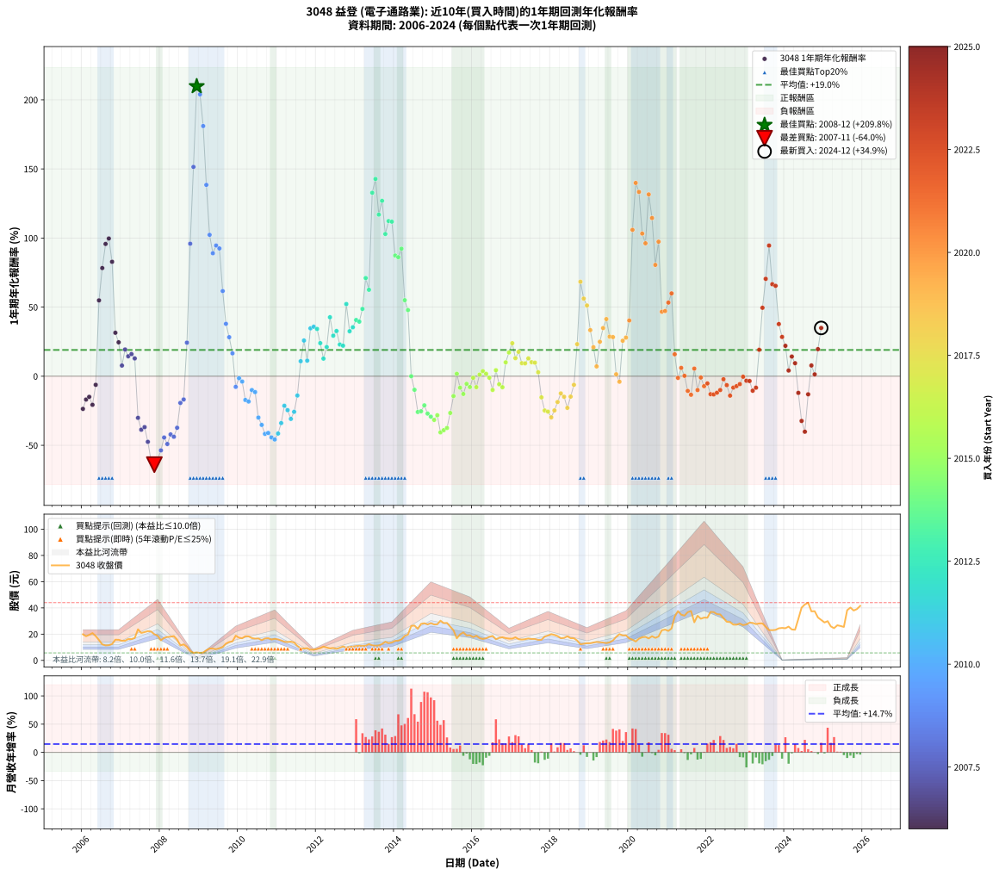

# 3048 益登 - 本益比與未來報酬率分析

!!! info "報告資訊"
    - **股票代號**: 3048
    - **公司名稱**: 益登
    - **產業別**: 電子通路業
    - **分析期間**: 2006-2024 (228 個數據點)
    - **資料來源**: Type 12 (ShowMonthlyK_ChartFlow) 月收盤價與本益比
    - **報酬率口徑**: 含現金股利 (簡化: 年度合計，假設每年7/1入帳)
    - **報告生成時間**: 2026-01-12 21:05:02 CST

## 📈 視覺化圖表

### 圖表1: 本益比 vs 未來報酬率關係

*圖表1：3048 益登 本益比與1年期未來報酬率關係 (2006-2024)*

### 圖表2: 歷年買入時點的1年期實際報酬率

*圖表2：3048 益登 歷年買入時點的1年期實際報酬率 (2006-2024)*

## 📍 買點訊號說明

本報告提供兩種買點提示訊號（顯示於圖表2的股價子圖中）：

### ▲ 小綠色三角形（回測驗證）
- **計算方式**: 使用全部歷史資料計算本益比第25百分位數
- **用途**: 事後驗證，顯示歷史上哪些時點確實為低估區
- **限制**: 當下無法判斷，僅供回測參考
- **特性**: 後見之明（Look-Ahead Bias）

### ▲ 小橘色三角形（即時訊號）
- **計算方式**: 使用截至當月的過去5年資料計算本益比第25百分位數
- **用途**: 實際投資決策，當時即可判斷
- **優勢**: 可操作性強，符合實務需求
- **特性**: 無後見之明，滾動窗口計算

!!! tip "如何使用兩種訊號"
    - **綠色▲** 幫助理解歷史估值機會，驗證策略有效性
    - **橘色▲** 可作為實際買進參考，但仍需搭配基本面分析
    - 兩種訊號重疊時，表示即時判斷與事後驗證一致，信心度較高
    - 僅有綠色▲時，表示當時無法判斷（需要未來資料才能確認）
    - 僅有橘色▲時，表示即時判斷為買點，但事後可能不是最佳時機

## 📊 估值分析摘要

| 指標 | 數值 |
|:---:|:---:|
| **目前本益比** (2024-12) | **nan 倍** |
| **歷史平均本益比** | 18.54 倍 |
| **估值水準** | 🟡 合理範圍 |
| **預期1年年化報酬率** | **+nan%** |
| **歷史平均報酬率** | +19.03% |
| **相關係數 (R²)** | 0.0011 |
| **趨勢線斜率** | 0.0205 |

!!! abstract "核心洞察"
    目前本益比接近歷史平均，預期報酬率符合長期趨勢

    根據歷史數據回測，3048 益登 在目前本益比 **nan倍** 的估值水準下，
    預期未來1年年化報酬率約為 **+nan%**。

    **重要提醒**: 本分析基於歷史數據統計，實際報酬率會受到公司基本面變化、產業趨勢、
    總體經濟環境等多重因素影響。R² = 0.00 表示本益比可解釋約 0.1% 的報酬率變異。

## 📈 歷史估值統計

### 最佳買點 (最高報酬率)

| 項目 | 數值 |
|:---:|:---:|
| 起始時間 | 2008-12 |
| 當時本益比 | 67.67 倍 |
| 起始價格 | 6.1 元 |
| 1年後價格 | 18.9 元 |
| **1年年化報酬率** | **+209.76%** |

### 最差買點 (最低報酬率)

| 項目 | 數值 |
|:---:|:---:|
| 起始時間 | 2007-11 |
| 當時本益比 | 10.25 倍 |
| 起始價格 | 19.9 元 |
| 1年後價格 | 5.8 元 |
| **1年年化報酬率** | **-63.98%** |

## 🎯 投資啟示

### 本益比與報酬率關係

趨勢線方程式: **y = 0.0205x + 19.6316**

!!! info "弱相關或正相關"
    本益比與未來報酬率相關性較弱。這可能表示該股票的報酬率更多受到
    公司成長性、產業趨勢等因素影響，而非估值水準。**需綜合考量多項指標**。

### 估值區間建議

基於歷史數據分析:

- **🟢 低估區** (P/E < 14.8): 預期報酬率較高，可考慮增加持股
- **🟡 合理區** (P/E 14.8-22.2): 預期報酬率符合長期趨勢，正常持有
- **🔴 高估區** (P/E > 22.2): 預期報酬率較低，可考慮減碼或觀望

!!! danger "風險提示"
    - 過去表現不代表未來結果
    - 本分析假設公司基本面無重大結構性變化
    - 產業環境劇變可能使歷史規律失效
    - 應結合公司財報、產業趨勢、總體經濟等多重因素綜合判斷

!!! success "長期投資觀點"
    歷史數據顯示，在合理或低估的估值水準買入並長期持有，
    往往能獲得較佳的投資報酬。**耐心等待好價格**是價值投資的核心原則。

## 📊 數據品質

- **資料來源**: GoodInfo.tw Type 12 (ShowMonthlyK_ChartFlow)
- **資料頻率**: 月度收盤價與本益比
- **回測期間**: 2006-2024
- **數據點數量**: 228 個 (每個點代表一次1年期回測)

### 計算方法說明

1. **1年期年化報酬率**:
   - 對每個歷史時點，計算其後1年的實際投資報酬率
   - 期末價值(不含股利): 期末價格
   - 期末價值(含現金股利): 期末價格 + 持有期間內的現金股利合計 (簡化: 年度合計，假設每年7/1入帳)
   - 公式: 年化報酬率 = [(期末價值/期初價格)^(1/年數) - 1] × 100%

2. **本益比 (P/E Ratio)**:
   - 使用當時的月收盤價與EPS計算
   - 資料來源: Type 12 月度河流圖本益比數據

3. **趨勢線 (Linear Regression)**:
   - 使用最小平方法擬合線性趨勢線
   - R²值衡量本益比對報酬率的解釋能力

---

*本報告由 Stock Analysis System v1.9.0 自動生成*
*數據更新時間: 2026-01-12 21:05:02 CST*

## 📋 月度回測明細表

（每一列對應時間線圖中的一個買入點；可用來對照 SVG 圖上的每個點。）

| 買入月份 | 賣出月份 | 回測期限_年 | 實際持有年數 | 買入本益比_倍 | 買入收盤價_元 | 賣出收盤價_元 | 現金股利合計_元 | 總報酬率_pct | 年化報酬率_pct |
| --- | --- | --- | --- | --- | --- | --- | --- | --- | --- |
| 2006-01 | 2007-01 | 1 | 0.999 | 19.51 | 19.90 | 14.90 | 0.30 | -23.62 | -23.63 |
| 2006-02 | 2007-02 | 1 | 0.999 | 18.04 | 18.40 | 15.00 | 0.30 | -16.85 | -16.86 |
| 2006-03 | 2007-03 | 1 | 0.999 | 19.07 | 19.45 | 16.25 | 0.30 | -14.91 | -14.92 |
| 2006-04 | 2007-04 | 1 | 0.999 | 20.39 | 20.80 | 16.20 | 0.30 | -20.67 | -20.69 |
| 2006-05 | 2007-05 | 1 | 0.999 | 18.14 | 18.50 | 17.05 | 0.30 | -6.22 | -6.22 |
| 2006-06 | 2007-06 | 1 | 0.999 | 15.20 | 15.50 | 23.70 | 0.30 | +54.84 | +54.89 |
| 2006-07 | 2007-07 | 1 | 0.999 | 11.91 | 12.15 | 20.90 | 0.75 | +78.19 | +78.26 |
| 2006-08 | 2007-08 | 1 | 0.999 | 11.18 | 11.40 | 21.55 | 0.75 | +95.61 | +95.70 |
| 2006-09 | 2007-09 | 1 | 0.999 | 11.32 | 11.55 | 22.30 | 0.75 | +99.57 | +99.66 |
| 2006-10 | 2007-10 | 1 | 0.999 | 12.21 | 12.45 | 22.00 | 0.75 | +82.73 | +82.81 |
| 2006-11 | 2007-11 | 1 | 0.999 | 15.44 | 15.75 | 19.95 | 0.75 | +31.43 | +31.45 |
| 2006-12 | 2007-12 | 1 | 0.999 | 15.39 | 15.70 | 18.80 | 0.75 | +24.52 | +24.54 |
| 2007-01 | 2008-01 | 1 | 0.999 | 13.49 | 14.90 | 15.30 | 0.75 | +7.72 | +7.72 |
| 2007-02 | 2008-02 | 1 | 0.999 | 12.62 | 15.00 | 17.15 | 0.75 | +19.33 | +19.35 |
| 2007-03 | 2008-03 | 1 | 1.002 | 12.77 | 16.25 | 17.85 | 0.75 | +14.46 | +14.43 |
| 2007-04 | 2008-04 | 1 | 1.002 | 11.94 | 16.20 | 18.05 | 0.75 | +16.05 | +16.01 |
| 2007-05 | 2008-05 | 1 | 1.002 | 11.83 | 17.05 | 18.50 | 0.75 | +12.90 | +12.88 |
| 2007-06 | 2008-06 | 1 | 1.002 | 15.54 | 23.70 | 15.80 | 0.75 | -30.17 | -30.12 |
| 2007-07 | 2008-07 | 1 | 1.002 | 12.99 | 20.90 | 11.40 | 1.40 | -38.76 | -38.69 |
| 2007-08 | 2008-08 | 1 | 1.002 | 12.73 | 21.55 | 12.20 | 1.40 | -36.89 | -36.83 |
| 2007-09 | 2008-09 | 1 | 1.002 | 12.55 | 22.30 | 10.30 | 1.40 | -47.53 | -47.46 |
| 2007-10 | 2008-10 | 1 | 1.002 | 11.82 | 22.00 | 7.15 | 1.40 | -61.14 | -61.06 |
| 2007-11 | 2008-11 | 1 | 1.002 | 10.25 | 19.95 | 5.77 | 1.40 | -64.06 | -63.98 |
| 2007-12 | 2008-12 | 1 | 1.002 | 9.26 | 18.80 | 6.09 | 1.40 | -60.16 | -60.08 |
| 2008-01 | 2009-01 | 1 | 1.002 | 8.19 | 15.30 | 5.68 | 1.40 | -53.73 | -53.65 |
| 2008-02 | 2009-03 | 1 | 1.081 | 10.05 | 17.15 | 7.70 | 1.40 | -46.94 | -44.34 |
| 2008-03 | 2009-03 | 1 | 0.999 | 11.55 | 17.85 | 7.70 | 1.40 | -49.02 | -49.04 |
| 2008-04 | 2009-04 | 1 | 0.999 | 13.05 | 18.05 | 9.05 | 1.40 | -42.11 | -42.13 |
| 2008-05 | 2009-05 | 1 | 0.999 | 15.14 | 18.50 | 9.00 | 1.40 | -43.78 | -43.81 |
| 2008-06 | 2009-06 | 1 | 0.999 | 14.91 | 15.80 | 8.51 | 1.40 | -37.28 | -37.30 |
| 2008-07 | 2009-07 | 1 | 0.999 | 12.69 | 11.40 | 9.20 | 0.00 | -19.30 | -19.31 |
| 2008-08 | 2009-08 | 1 | 0.999 | 16.56 | 12.20 | 10.15 | 0.00 | -16.80 | -16.81 |
| 2008-09 | 2009-09 | 1 | 0.999 | 17.91 | 10.30 | 12.80 | 0.00 | +24.27 | +24.29 |
| 2008-10 | 2009-10 | 1 | 0.999 | 17.30 | 7.15 | 14.00 | 0.00 | +95.80 | +95.89 |
| 2008-11 | 2009-11 | 1 | 0.999 | 22.93 | 5.77 | 14.50 | 0.00 | +151.30 | +151.46 |
| 2008-12 | 2009-12 | 1 | 0.999 | 67.67 | 6.09 | 18.85 | 0.00 | +209.52 | +209.76 |
| 2009-01 | 2010-01 | 1 | 0.999 | 32.00 | 5.68 | 17.25 | 0.00 | +203.70 | +203.93 |
| 2009-02 | 2010-02 | 1 | 0.999 | 22.64 | 6.00 | 16.85 | 0.00 | +180.83 | +181.03 |
| 2009-03 | 2010-03 | 1 | 0.999 | 21.84 | 7.70 | 18.35 | 0.00 | +138.31 | +138.45 |
| 2009-04 | 2010-04 | 1 | 0.999 | 20.57 | 9.05 | 18.30 | 0.00 | +102.21 | +102.31 |
| 2009-05 | 2010-05 | 1 | 0.999 | 17.06 | 9.00 | 17.00 | 0.00 | +88.89 | +88.97 |
| 2009-06 | 2010-06 | 1 | 0.999 | 13.84 | 8.51 | 16.55 | 0.00 | +94.48 | +94.57 |
| 2009-07 | 2010-07 | 1 | 0.999 | 13.10 | 9.20 | 16.70 | 1.00 | +92.39 | +92.48 |
| 2009-08 | 2010-08 | 1 | 0.999 | 12.85 | 10.15 | 15.40 | 1.00 | +61.58 | +61.63 |
| 2009-09 | 2010-09 | 1 | 0.999 | 14.59 | 12.80 | 16.65 | 1.00 | +37.89 | +37.92 |
| 2009-10 | 2010-10 | 1 | 0.999 | 14.51 | 14.00 | 16.95 | 1.00 | +28.21 | +28.24 |
| 2009-11 | 2010-11 | 1 | 0.999 | 13.78 | 14.50 | 15.90 | 1.00 | +16.55 | +16.56 |
| 2009-12 | 2010-12 | 1 | 0.999 | 16.54 | 18.85 | 16.40 | 1.00 | -7.69 | -7.70 |
| 2010-01 | 2011-01 | 1 | 0.999 | 14.56 | 17.25 | 16.00 | 1.00 | -1.45 | -1.45 |
| 2010-02 | 2011-02 | 1 | 0.999 | 13.70 | 16.85 | 15.20 | 1.00 | -3.86 | -3.86 |
| 2010-03 | 2011-03 | 1 | 0.999 | 14.39 | 18.35 | 14.20 | 1.00 | -17.17 | -17.18 |
| 2010-04 | 2011-04 | 1 | 0.999 | 13.86 | 18.30 | 13.95 | 1.00 | -18.31 | -18.32 |
| 2010-05 | 2011-05 | 1 | 0.999 | 12.45 | 17.00 | 14.30 | 1.00 | -10.00 | -10.01 |
| 2010-06 | 2011-06 | 1 | 0.999 | 11.74 | 16.55 | 13.65 | 1.00 | -11.48 | -11.49 |
| 2010-07 | 2011-07 | 1 | 0.999 | 11.48 | 16.70 | 11.00 | 0.71 | -29.89 | -29.91 |
| 2010-08 | 2011-08 | 1 | 0.999 | 10.27 | 15.40 | 9.27 | 0.71 | -35.21 | -35.23 |
| 2010-09 | 2011-09 | 1 | 0.999 | 10.78 | 16.65 | 9.00 | 0.71 | -41.69 | -41.72 |
| 2010-10 | 2011-10 | 1 | 0.999 | 10.66 | 16.95 | 9.29 | 0.71 | -41.01 | -41.04 |
| 2010-11 | 2011-11 | 1 | 0.999 | 9.72 | 15.90 | 8.15 | 0.71 | -44.29 | -44.31 |
| 2010-12 | 2011-12 | 1 | 0.999 | 9.76 | 16.40 | 8.19 | 0.71 | -45.74 | -45.77 |
| 2011-01 | 2012-01 | 1 | 0.999 | 10.17 | 16.00 | 8.66 | 0.71 | -41.45 | -41.47 |
| 2011-02 | 2012-02 | 1 | 0.999 | 10.38 | 15.20 | 9.34 | 0.71 | -33.89 | -33.91 |
| 2011-03 | 2012-03 | 1 | 1.002 | 10.46 | 14.20 | 10.45 | 0.71 | -21.42 | -21.38 |
| 2011-04 | 2012-04 | 1 | 1.002 | 11.16 | 13.95 | 9.81 | 0.71 | -24.60 | -24.56 |
| 2011-05 | 2012-05 | 1 | 1.002 | 12.52 | 14.30 | 9.17 | 0.71 | -30.92 | -30.87 |
| 2011-06 | 2012-06 | 1 | 1.002 | 13.19 | 13.65 | 9.42 | 0.71 | -25.80 | -25.76 |
| 2011-07 | 2012-07 | 1 | 1.002 | 11.86 | 11.00 | 8.78 | 0.68 | -14.00 | -13.97 |
| 2011-08 | 2012-08 | 1 | 1.002 | 11.30 | 9.27 | 9.60 | 0.68 | +10.90 | +10.87 |
| 2011-09 | 2012-09 | 1 | 1.002 | 12.63 | 9.00 | 10.65 | 0.68 | +25.89 | +25.83 |
| 2011-10 | 2012-10 | 1 | 1.002 | 15.36 | 9.29 | 9.66 | 0.68 | +11.30 | +11.28 |
| 2011-11 | 2012-11 | 1 | 1.002 | 16.38 | 8.15 | 10.30 | 0.68 | +34.72 | +34.64 |
| 2011-12 | 2012-12 | 1 | 1.002 | 21.00 | 8.19 | 10.45 | 0.68 | +35.90 | +35.81 |
| 2012-01 | 2013-01 | 1 | 1.002 | 19.64 | 8.66 | 10.95 | 0.68 | +34.30 | +34.21 |
| 2012-02 | 2013-03 | 1 | 1.081 | 19.00 | 9.34 | 11.10 | 0.68 | +26.12 | +23.94 |
| 2012-03 | 2013-03 | 1 | 0.999 | 19.26 | 10.45 | 11.10 | 0.68 | +12.73 | +12.74 |
| 2012-04 | 2013-04 | 1 | 0.999 | 16.53 | 9.81 | 11.20 | 0.68 | +21.10 | +21.12 |
| 2012-05 | 2013-05 | 1 | 0.999 | 14.24 | 9.17 | 12.40 | 0.68 | +42.64 | +42.67 |
| 2012-06 | 2013-06 | 1 | 0.999 | 13.55 | 9.42 | 11.50 | 0.68 | +29.30 | +29.32 |
| 2012-07 | 2013-07 | 1 | 0.999 | 11.77 | 8.78 | 11.15 | 0.50 | +32.69 | +32.71 |
| 2012-08 | 2013-08 | 1 | 0.999 | 12.05 | 9.60 | 11.30 | 0.50 | +22.92 | +22.93 |
| 2012-09 | 2013-09 | 1 | 0.999 | 12.57 | 10.65 | 12.50 | 0.50 | +22.07 | +22.08 |
| 2012-10 | 2013-10 | 1 | 0.999 | 10.75 | 9.66 | 14.20 | 0.50 | +52.17 | +52.22 |
| 2012-11 | 2013-11 | 1 | 0.999 | 10.85 | 10.30 | 13.15 | 0.50 | +32.52 | +32.55 |
| 2012-12 | 2013-12 | 1 | 0.999 | 10.45 | 10.45 | 13.65 | 0.50 | +35.41 | +35.43 |
| 2013-01 | 2014-01 | 1 | 0.999 | 10.70 | 10.95 | 14.90 | 0.50 | +40.64 | +40.67 |
| 2013-02 | 2014-02 | 1 | 0.999 | 10.65 | 11.15 | 15.05 | 0.50 | +39.46 | +39.49 |
| 2013-03 | 2014-03 | 1 | 0.999 | 10.37 | 11.10 | 16.00 | 0.50 | +48.65 | +48.69 |
| 2013-04 | 2014-04 | 1 | 0.999 | 10.24 | 11.20 | 18.65 | 0.50 | +70.98 | +71.04 |
| 2013-05 | 2014-05 | 1 | 0.999 | 11.10 | 12.40 | 19.65 | 0.50 | +62.50 | +62.55 |
| 2013-06 | 2014-06 | 1 | 0.999 | 10.09 | 11.50 | 26.25 | 0.50 | +132.61 | +132.74 |
| 2013-07 | 2014-07 | 1 | 0.999 | 9.58 | 11.15 | 26.55 | 0.50 | +142.60 | +142.75 |
| 2013-08 | 2014-08 | 1 | 0.999 | 9.52 | 11.30 | 24.00 | 0.50 | +116.81 | +116.93 |
| 2013-09 | 2014-09 | 1 | 0.999 | 10.33 | 12.50 | 27.85 | 0.50 | +126.80 | +126.93 |
| 2013-10 | 2014-10 | 1 | 0.999 | 11.51 | 14.20 | 28.30 | 0.50 | +102.82 | +102.92 |
| 2013-11 | 2014-11 | 1 | 0.999 | 10.46 | 13.15 | 27.40 | 0.50 | +112.17 | +112.28 |
| 2013-12 | 2014-12 | 1 | 0.999 | 10.66 | 13.65 | 28.40 | 0.50 | +111.72 | +111.83 |
| 2014-01 | 2015-01 | 1 | 0.999 | 10.71 | 14.90 | 27.40 | 0.50 | +87.25 | +87.33 |
| 2014-02 | 2015-02 | 1 | 0.999 | 10.02 | 15.05 | 27.50 | 0.50 | +86.05 | +86.13 |
| 2014-03 | 2015-03 | 1 | 0.999 | 9.92 | 16.00 | 30.25 | 0.50 | +92.19 | +92.27 |
| 2014-04 | 2015-04 | 1 | 0.999 | 10.82 | 18.65 | 28.40 | 0.50 | +54.96 | +55.01 |
| 2014-05 | 2015-05 | 1 | 0.999 | 10.71 | 19.65 | 28.55 | 0.50 | +47.84 | +47.88 |
| 2014-06 | 2015-06 | 1 | 0.999 | 13.50 | 26.25 | 25.75 | 0.50 | +0.00 | +0.00 |
| 2014-07 | 2015-07 | 1 | 0.999 | 12.91 | 26.55 | 22.95 | 0.99 | -9.82 | -9.83 |
| 2014-08 | 2015-08 | 1 | 0.999 | 11.08 | 24.00 | 16.80 | 0.99 | -25.87 | -25.88 |
| 2014-09 | 2015-09 | 1 | 0.999 | 12.23 | 27.85 | 19.80 | 0.99 | -25.34 | -25.36 |
| 2014-10 | 2015-10 | 1 | 0.999 | 11.85 | 28.30 | 21.35 | 0.99 | -21.05 | -21.07 |
| 2014-11 | 2015-11 | 1 | 0.999 | 10.96 | 27.40 | 19.00 | 0.99 | -27.04 | -27.05 |
| 2014-12 | 2015-12 | 1 | 0.999 | 10.88 | 28.40 | 19.10 | 0.99 | -29.25 | -29.27 |
| 2015-01 | 2016-01 | 1 | 0.999 | 10.67 | 27.40 | 17.75 | 0.99 | -31.60 | -31.62 |
| 2015-02 | 2016-02 | 1 | 0.999 | 10.88 | 27.50 | 18.75 | 0.99 | -28.21 | -28.23 |
| 2015-03 | 2016-03 | 1 | 1.002 | 12.17 | 30.25 | 16.95 | 0.99 | -40.69 | -40.62 |
| 2015-04 | 2016-04 | 1 | 1.002 | 11.62 | 28.40 | 16.30 | 0.99 | -39.11 | -39.05 |
| 2015-05 | 2016-05 | 1 | 1.002 | 11.89 | 28.55 | 16.85 | 0.99 | -37.51 | -37.45 |
| 2015-06 | 2016-06 | 1 | 1.002 | 10.91 | 25.75 | 17.90 | 0.99 | -26.63 | -26.59 |
| 2015-07 | 2016-07 | 1 | 1.002 | 9.90 | 22.95 | 18.65 | 1.00 | -14.38 | -14.35 |
| 2015-08 | 2016-08 | 1 | 1.002 | 7.38 | 16.80 | 16.10 | 1.00 | +1.79 | +1.78 |
| 2015-09 | 2016-09 | 1 | 1.002 | 8.86 | 19.80 | 17.15 | 1.00 | -8.33 | -8.32 |
| 2015-10 | 2016-10 | 1 | 1.002 | 9.73 | 21.35 | 17.60 | 1.00 | -12.88 | -12.86 |
| 2015-11 | 2016-11 | 1 | 1.002 | 8.83 | 19.00 | 16.95 | 1.00 | -5.53 | -5.52 |
| 2015-12 | 2016-12 | 1 | 1.002 | 9.05 | 19.10 | 16.60 | 1.00 | -7.85 | -7.84 |
| 2016-01 | 2017-01 | 1 | 1.002 | 8.77 | 17.75 | 16.55 | 1.00 | -1.13 | -1.12 |
| 2016-02 | 2017-03 | 1 | 1.081 | 9.68 | 18.75 | 16.15 | 1.00 | -8.53 | -7.92 |
| 2016-03 | 2017-03 | 1 | 0.999 | 9.16 | 16.95 | 16.15 | 1.00 | +1.18 | +1.18 |
| 2016-04 | 2017-04 | 1 | 0.999 | 9.24 | 16.30 | 15.90 | 1.00 | +3.68 | +3.68 |
| 2016-05 | 2017-05 | 1 | 0.999 | 10.05 | 16.85 | 16.15 | 1.00 | +1.78 | +1.78 |
| 2016-06 | 2017-06 | 1 | 0.999 | 11.26 | 17.90 | 16.70 | 1.00 | -1.12 | -1.12 |
| 2016-07 | 2017-07 | 1 | 0.999 | 12.41 | 18.65 | 16.30 | 0.50 | -9.92 | -9.93 |
| 2016-08 | 2017-08 | 1 | 0.999 | 11.36 | 16.10 | 16.30 | 0.50 | +4.35 | +4.35 |
| 2016-09 | 2017-09 | 1 | 0.999 | 12.89 | 17.15 | 15.65 | 0.50 | -5.83 | -5.83 |
| 2016-10 | 2017-10 | 1 | 0.999 | 14.16 | 17.60 | 15.70 | 0.50 | -7.95 | -7.96 |
| 2016-11 | 2017-11 | 1 | 0.999 | 14.65 | 16.95 | 18.15 | 0.50 | +10.03 | +10.04 |
| 2016-12 | 2017-12 | 1 | 0.999 | 15.51 | 16.60 | 18.95 | 0.50 | +17.17 | +17.18 |
| 2017-01 | 2018-01 | 1 | 0.999 | 14.82 | 16.55 | 20.00 | 0.50 | +23.87 | +23.89 |
| 2017-02 | 2018-02 | 1 | 0.999 | 15.13 | 17.60 | 19.40 | 0.50 | +13.07 | +13.08 |
| 2017-03 | 2018-03 | 1 | 0.999 | 13.35 | 16.15 | 18.50 | 0.50 | +17.65 | +17.66 |
| 2017-04 | 2018-04 | 1 | 0.999 | 12.65 | 15.90 | 16.90 | 0.50 | +9.43 | +9.44 |
| 2017-05 | 2018-05 | 1 | 0.999 | 12.39 | 16.15 | 17.15 | 0.50 | +9.29 | +9.29 |
| 2017-06 | 2018-06 | 1 | 0.999 | 12.37 | 16.70 | 18.35 | 0.50 | +12.87 | +12.88 |
| 2017-07 | 2018-07 | 1 | 0.999 | 11.67 | 16.30 | 16.95 | 1.00 | +10.12 | +10.13 |
| 2017-08 | 2018-08 | 1 | 0.999 | 11.29 | 16.30 | 16.90 | 1.00 | +9.82 | +9.82 |
| 2017-09 | 2018-09 | 1 | 0.999 | 10.50 | 15.65 | 15.10 | 1.00 | +2.88 | +2.88 |
| 2017-10 | 2018-10 | 1 | 0.999 | 10.22 | 15.70 | 12.30 | 1.00 | -15.29 | -15.30 |
| 2017-11 | 2018-11 | 1 | 0.999 | 11.46 | 18.15 | 12.65 | 1.00 | -24.79 | -24.81 |
| 2017-12 | 2018-12 | 1 | 0.999 | 11.63 | 18.95 | 13.10 | 1.00 | -25.59 | -25.61 |
| 2018-01 | 2019-01 | 1 | 0.999 | 12.62 | 20.00 | 13.05 | 1.00 | -29.75 | -29.77 |
| 2018-02 | 2019-02 | 1 | 0.999 | 12.60 | 19.40 | 13.60 | 1.00 | -24.74 | -24.76 |
| 2018-03 | 2019-03 | 1 | 0.999 | 12.37 | 18.50 | 14.05 | 1.00 | -18.65 | -18.66 |
| 2018-04 | 2019-04 | 1 | 0.999 | 11.66 | 16.90 | 13.80 | 1.00 | -12.43 | -12.43 |
| 2018-05 | 2019-05 | 1 | 0.999 | 12.21 | 17.15 | 13.60 | 1.00 | -14.87 | -14.88 |
| 2018-06 | 2019-06 | 1 | 0.999 | 13.49 | 18.35 | 13.15 | 1.00 | -22.89 | -22.90 |
| 2018-07 | 2019-07 | 1 | 0.999 | 12.89 | 16.95 | 13.75 | 0.70 | -14.75 | -14.76 |
| 2018-08 | 2019-08 | 1 | 0.999 | 13.31 | 16.90 | 15.15 | 0.70 | -6.21 | -6.22 |
| 2018-09 | 2019-09 | 1 | 0.999 | 12.33 | 15.10 | 17.90 | 0.70 | +23.18 | +23.20 |
| 2018-10 | 2019-10 | 1 | 0.999 | 10.42 | 12.30 | 20.00 | 0.70 | +68.29 | +68.35 |
| 2018-11 | 2019-11 | 1 | 0.999 | 11.15 | 12.65 | 19.05 | 0.70 | +56.13 | +56.17 |
| 2018-12 | 2019-12 | 1 | 0.999 | 12.02 | 13.10 | 19.10 | 0.70 | +51.15 | +51.19 |
| 2019-01 | 2020-01 | 1 | 0.999 | 11.48 | 13.05 | 16.70 | 0.70 | +33.33 | +33.36 |
| 2019-02 | 2020-02 | 1 | 0.999 | 11.49 | 13.60 | 15.75 | 0.70 | +20.96 | +20.97 |
| 2019-03 | 2020-03 | 1 | 1.002 | 11.42 | 14.05 | 14.35 | 0.70 | +7.12 | +7.10 |
| 2019-04 | 2020-04 | 1 | 1.002 | 10.81 | 13.80 | 16.55 | 0.70 | +25.00 | +24.94 |
| 2019-05 | 2020-05 | 1 | 1.002 | 10.28 | 13.60 | 17.65 | 0.70 | +34.93 | +34.84 |
| 2019-06 | 2020-06 | 1 | 1.002 | 9.60 | 13.15 | 17.90 | 0.70 | +41.44 | +41.34 |
| 2019-07 | 2020-07 | 1 | 1.002 | 9.71 | 13.75 | 16.70 | 1.00 | +28.73 | +28.66 |
| 2019-08 | 2020-08 | 1 | 1.002 | 10.35 | 15.15 | 18.45 | 1.00 | +28.38 | +28.32 |
| 2019-09 | 2020-09 | 1 | 1.002 | 11.85 | 17.90 | 17.15 | 1.00 | +1.40 | +1.39 |
| 2019-10 | 2020-10 | 1 | 1.002 | 12.85 | 20.00 | 18.20 | 1.00 | -4.00 | -3.99 |
| 2019-11 | 2020-11 | 1 | 1.002 | 11.88 | 19.05 | 22.95 | 1.00 | +25.72 | +25.66 |
| 2019-12 | 2020-12 | 1 | 1.002 | 11.58 | 19.10 | 23.45 | 1.00 | +28.01 | +27.95 |
| 2020-01 | 2021-01 | 1 | 1.002 | 9.42 | 16.70 | 22.45 | 1.00 | +40.42 | +40.32 |
| 2020-02 | 2021-03 | 1 | 1.081 | 8.30 | 15.75 | 33.40 | 1.00 | +118.41 | +105.93 |
| 2020-03 | 2021-03 | 1 | 0.999 | 7.10 | 14.35 | 33.40 | 1.00 | +139.72 | +139.86 |
| 2020-04 | 2021-04 | 1 | 0.999 | 7.72 | 16.55 | 37.60 | 1.00 | +133.23 | +133.37 |
| 2020-05 | 2021-05 | 1 | 0.999 | 7.79 | 17.65 | 34.85 | 1.00 | +103.12 | +103.21 |
| 2020-06 | 2021-06 | 1 | 0.999 | 7.49 | 17.90 | 34.10 | 1.00 | +96.09 | +96.18 |
| 2020-07 | 2021-07 | 1 | 0.999 | 6.64 | 16.70 | 36.75 | 1.90 | +131.44 | +131.57 |
| 2020-08 | 2021-08 | 1 | 0.999 | 7.00 | 18.45 | 37.65 | 1.90 | +114.36 | +114.48 |
| 2020-09 | 2021-09 | 1 | 0.999 | 6.21 | 17.15 | 29.05 | 1.90 | +80.47 | +80.54 |
| 2020-10 | 2021-10 | 1 | 0.999 | 6.31 | 18.20 | 34.00 | 1.90 | +97.25 | +97.34 |
| 2020-11 | 2021-11 | 1 | 0.999 | 7.63 | 22.95 | 31.75 | 1.90 | +46.62 | +46.66 |
| 2020-12 | 2021-12 | 1 | 0.999 | 7.49 | 23.45 | 32.60 | 1.90 | +47.12 | +47.16 |
| 2021-01 | 2022-01 | 1 | 0.999 | 6.90 | 22.45 | 32.50 | 1.90 | +53.23 | +53.27 |
| 2021-02 | 2022-02 | 1 | 0.999 | 7.19 | 24.30 | 36.95 | 1.90 | +59.88 | +59.93 |
| 2021-03 | 2022-03 | 1 | 0.999 | 9.53 | 33.40 | 36.80 | 1.90 | +15.87 | +15.88 |
| 2021-04 | 2022-04 | 1 | 0.999 | 10.36 | 37.60 | 35.25 | 1.90 | -1.20 | -1.20 |
| 2021-05 | 2022-05 | 1 | 0.999 | 9.28 | 34.85 | 35.05 | 1.90 | +6.03 | +6.03 |
| 2021-06 | 2022-06 | 1 | 0.999 | 8.79 | 34.10 | 32.30 | 1.90 | +0.29 | +0.29 |
| 2021-07 | 2022-07 | 1 | 0.999 | 9.18 | 36.75 | 29.45 | 3.40 | -10.61 | -10.62 |
| 2021-08 | 2022-08 | 1 | 0.999 | 9.12 | 37.65 | 29.20 | 3.40 | -13.41 | -13.42 |
| 2021-09 | 2022-09 | 1 | 0.999 | 6.83 | 29.05 | 27.25 | 3.40 | +5.51 | +5.51 |
| 2021-10 | 2022-10 | 1 | 0.999 | 7.76 | 34.00 | 27.20 | 3.40 | -10.00 | -10.01 |
| 2021-11 | 2022-11 | 1 | 0.999 | 7.05 | 31.75 | 28.05 | 3.40 | -0.94 | -0.95 |
| 2021-12 | 2022-12 | 1 | 0.999 | 7.04 | 32.60 | 26.85 | 3.40 | -7.21 | -7.21 |
| 2022-01 | 2023-01 | 1 | 0.999 | 7.22 | 32.50 | 27.40 | 3.40 | -5.23 | -5.23 |
| 2022-02 | 2023-02 | 1 | 0.999 | 8.44 | 36.95 | 28.75 | 3.40 | -12.99 | -13.00 |
| 2022-03 | 2023-03 | 1 | 0.999 | 8.66 | 36.80 | 28.55 | 3.40 | -13.18 | -13.19 |
| 2022-04 | 2023-04 | 1 | 0.999 | 8.55 | 35.25 | 27.65 | 3.40 | -11.91 | -11.92 |
| 2022-05 | 2023-05 | 1 | 0.999 | 8.77 | 35.05 | 28.15 | 3.40 | -9.99 | -9.99 |
| 2022-06 | 2023-06 | 1 | 0.999 | 8.35 | 32.30 | 28.20 | 3.40 | -2.17 | -2.17 |
| 2022-07 | 2023-07 | 1 | 0.999 | 7.87 | 29.45 | 25.55 | 2.00 | -6.45 | -6.46 |
| 2022-08 | 2023-08 | 1 | 0.999 | 8.07 | 29.20 | 23.10 | 2.00 | -14.04 | -14.05 |
| 2022-09 | 2023-09 | 1 | 0.999 | 7.81 | 27.25 | 23.00 | 2.00 | -8.26 | -8.26 |
| 2022-10 | 2023-10 | 1 | 0.999 | 8.09 | 27.20 | 23.25 | 2.00 | -7.17 | -7.17 |
| 2022-11 | 2023-11 | 1 | 0.999 | 8.67 | 28.05 | 24.45 | 2.00 | -5.70 | -5.71 |
| 2022-12 | 2023-12 | 1 | 0.999 | 8.63 | 26.85 | 24.75 | 2.00 | -0.37 | -0.37 |
| 2023-01 | 2024-01 | 1 | 0.999 | 9.61 | 27.40 | 24.50 | 2.00 | -3.28 | -3.29 |
| 2023-02 | 2024-02 | 1 | 0.999 | 11.08 | 28.75 | 25.75 | 2.00 | -3.48 | -3.48 |
| 2023-03 | 2024-03 | 1 | 1.002 | 12.21 | 28.55 | 23.55 | 2.00 | -10.51 | -10.49 |
| 2023-04 | 2024-04 | 1 | 1.002 | 13.29 | 27.65 | 23.35 | 2.00 | -8.32 | -8.30 |
| 2023-05 | 2024-05 | 1 | 1.002 | 15.45 | 28.15 | 31.55 | 2.00 | +19.18 | +19.14 |
| 2023-06 | 2024-06 | 1 | 1.002 | 18.02 | 28.20 | 40.20 | 2.00 | +49.65 | +49.52 |
| 2023-07 | 2024-07 | 1 | 1.002 | 19.54 | 25.55 | 42.60 | 1.00 | +70.65 | +70.46 |
| 2023-08 | 2024-08 | 1 | 1.002 | 22.00 | 23.10 | 44.00 | 1.00 | +94.81 | +94.54 |
| 2023-09 | 2024-09 | 1 | 1.002 | 29.02 | 23.00 | 37.35 | 1.00 | +66.74 | +66.56 |
| 2023-10 | 2024-10 | 1 | 1.002 | 43.46 | 23.25 | 37.50 | 1.00 | +65.59 | +65.42 |
| 2023-11 | 2024-11 | 1 | 1.002 | 88.11 | 24.45 | 32.70 | 1.00 | +37.83 | +37.74 |
| 2023-12 | 2024-12 | 1 | 1.002 | 1238.00 | 24.75 | 30.80 | 1.00 | +28.48 | +28.42 |
| 2024-01 | 2025-01 | 1 | 1.002 |  | 24.50 | 28.90 | 1.00 | +22.04 | +21.99 |
| 2024-02 | 2025-03 | 1 | 1.081 |  | 25.75 | 25.90 | 1.00 | +4.47 | +4.12 |
| 2024-03 | 2025-03 | 1 | 0.999 |  | 23.55 | 25.90 | 1.00 | +14.23 | +14.24 |
| 2024-04 | 2025-04 | 1 | 0.999 |  | 23.35 | 24.55 | 1.00 | +9.42 | +9.43 |
| 2024-05 | 2025-05 | 1 | 0.999 |  | 31.55 | 26.75 | 1.00 | -12.04 | -12.05 |
| 2024-06 | 2025-06 | 1 | 0.999 |  | 40.20 | 26.20 | 1.00 | -32.34 | -32.36 |
| 2024-07 | 2025-07 | 1 | 0.999 |  | 42.60 | 25.50 | 0.00 | -40.14 | -40.16 |
| 2024-08 | 2025-08 | 1 | 0.999 |  | 44.00 | 38.25 | 0.00 | -13.07 | -13.08 |
| 2024-09 | 2025-09 | 1 | 0.999 |  | 37.35 | 40.25 | 0.00 | +7.76 | +7.77 |
| 2024-10 | 2025-10 | 1 | 0.999 |  | 37.50 | 38.00 | 0.00 | +1.33 | +1.33 |
| 2024-11 | 2025-11 | 1 | 0.999 |  | 32.70 | 39.10 | 0.00 | +19.57 | +19.59 |
| 2024-12 | 2025-12 | 1 | 0.999 |  | 30.80 | 41.55 | 0.00 | +34.90 | +34.93 |
