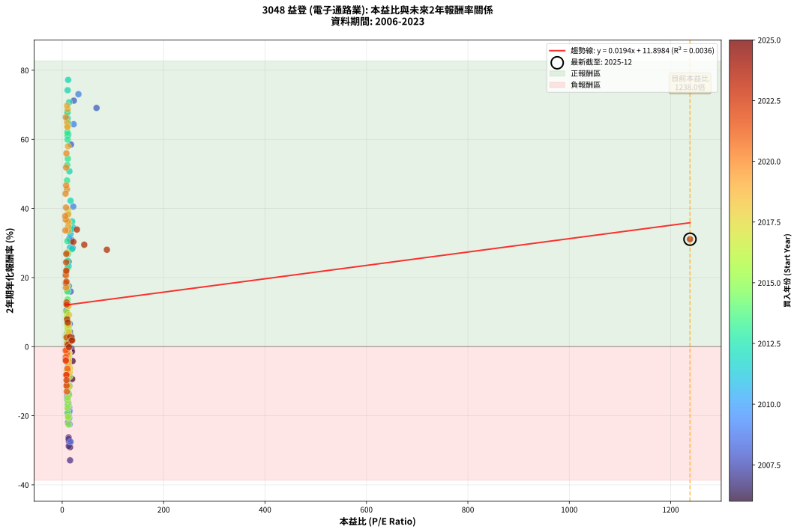
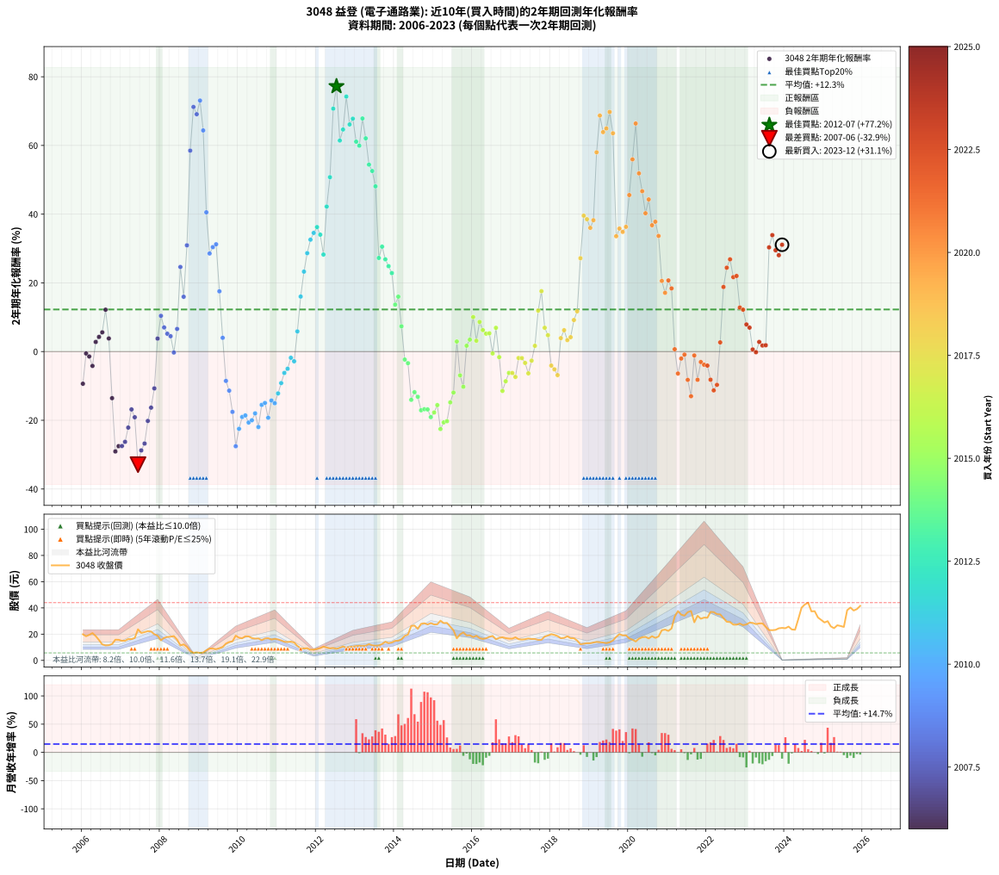

# 3048 益登 - 本益比與未來報酬率分析

!!! info "報告資訊"
    - **股票代號**: 3048
    - **公司名稱**: 益登
    - **產業別**: 電子通路業
    - **分析期間**: 2006-2023 (216 個數據點)
    - **資料來源**: Type 12 (ShowMonthlyK_ChartFlow) 月收盤價與本益比
    - **報酬率口徑**: 含現金股利 (簡化: 年度合計，假設每年7/1入帳)
    - **報告生成時間**: 2026-01-11 18:50:49 CST

## 📈 視覺化圖表

### 圖表1: 本益比 vs 未來報酬率關係

*圖表1：3048 益登 本益比與2年期未來報酬率關係 (2006-2023)*

### 圖表2: 歷年買入時點的2年期實際報酬率

*圖表2：3048 益登 歷年買入時點的2年期實際報酬率 (2006-2023)*

## 📍 買點訊號說明

本報告提供兩種買點提示訊號（顯示於圖表2的股價子圖中）：

### ▲ 小綠色三角形（回測驗證）
- **計算方式**: 使用全部歷史資料計算本益比第25百分位數
- **用途**: 事後驗證，顯示歷史上哪些時點確實為低估區
- **限制**: 當下無法判斷，僅供回測參考
- **特性**: 後見之明（Look-Ahead Bias）

### ▲ 小橘色三角形（即時訊號）
- **計算方式**: 使用截至當月的過去5年資料計算本益比第25百分位數
- **用途**: 實際投資決策，當時即可判斷
- **優勢**: 可操作性強，符合實務需求
- **特性**: 無後見之明，滾動窗口計算

!!! tip "如何使用兩種訊號"
    - **綠色▲** 幫助理解歷史估值機會，驗證策略有效性
    - **橘色▲** 可作為實際買進參考，但仍需搭配基本面分析
    - 兩種訊號重疊時，表示即時判斷與事後驗證一致，信心度較高
    - 僅有綠色▲時，表示當時無法判斷（需要未來資料才能確認）
    - 僅有橘色▲時，表示即時判斷為買點，但事後可能不是最佳時機

## 📊 估值分析摘要

| 指標 | 數值 |
|:---:|:---:|
| **目前本益比** (2023-12) | **1238.00 倍** |
| **歷史平均本益比** | 18.54 倍 |
| **估值水準** | 🔴 相對高估 |
| **預期2年年化報酬率** | **+35.87%** |
| **歷史平均報酬率** | +12.26% |
| **相關係數 (R²)** | 0.0036 |
| **趨勢線斜率** | 0.0194 |

!!! abstract "核心洞察"
    目前本益比顯著高於歷史平均，預期未來報酬率可能較低

    根據歷史數據回測，3048 益登 在目前本益比 **1238.0倍** 的估值水準下，
    預期未來2年年化報酬率約為 **+35.9%**。

    **重要提醒**: 本分析基於歷史數據統計，實際報酬率會受到公司基本面變化、產業趨勢、
    總體經濟環境等多重因素影響。R² = 0.00 表示本益比可解釋約 0.4% 的報酬率變異。

## 📈 歷史估值統計

### 最佳買點 (最高報酬率)

| 項目 | 數值 |
|:---:|:---:|
| 起始時間 | 2012-07 |
| 當時本益比 | 11.77 倍 |
| 起始價格 | 8.8 元 |
| 2年後價格 | 26.6 元 |
| **2年年化報酬率** | **+77.21%** |

### 最差買點 (最低報酬率)

| 項目 | 數值 |
|:---:|:---:|
| 起始時間 | 2007-06 |
| 當時本益比 | 15.54 倍 |
| 起始價格 | 23.7 元 |
| 2年後價格 | 8.5 元 |
| **2年年化報酬率** | **-32.92%** |

## 🎯 投資啟示

### 本益比與報酬率關係

趨勢線方程式: **y = 0.0194x + 11.8984**

!!! info "弱相關或正相關"
    本益比與未來報酬率相關性較弱。這可能表示該股票的報酬率更多受到
    公司成長性、產業趨勢等因素影響，而非估值水準。**需綜合考量多項指標**。

### 估值區間建議

基於歷史數據分析:

- **🟢 低估區** (P/E < 14.8): 預期報酬率較高，可考慮增加持股
- **🟡 合理區** (P/E 14.8-22.2): 預期報酬率符合長期趨勢，正常持有
- **🔴 高估區** (P/E > 22.2): 預期報酬率較低，可考慮減碼或觀望

!!! danger "風險提示"
    - 過去表現不代表未來結果
    - 本分析假設公司基本面無重大結構性變化
    - 產業環境劇變可能使歷史規律失效
    - 應結合公司財報、產業趨勢、總體經濟等多重因素綜合判斷

!!! success "長期投資觀點"
    歷史數據顯示，在合理或低估的估值水準買入並長期持有，
    往往能獲得較佳的投資報酬。**耐心等待好價格**是價值投資的核心原則。

## 📊 數據品質

- **資料來源**: GoodInfo.tw Type 12 (ShowMonthlyK_ChartFlow)
- **資料頻率**: 月度收盤價與本益比
- **回測期間**: 2006-2023
- **數據點數量**: 216 個 (每個點代表一次2年期回測)

### 計算方法說明

1. **2年期年化報酬率**:
   - 對每個歷史時點，計算其後2年的實際投資報酬率
   - 期末價值(不含股利): 期末價格
   - 期末價值(含現金股利): 期末價格 + 持有期間內的現金股利合計 (簡化: 年度合計，假設每年7/1入帳)
   - 公式: 年化報酬率 = [(期末價值/期初價格)^(1/年數) - 1] × 100%

2. **本益比 (P/E Ratio)**:
   - 使用當時的月收盤價與EPS計算
   - 資料來源: Type 12 月度河流圖本益比數據

3. **趨勢線 (Linear Regression)**:
   - 使用最小平方法擬合線性趨勢線
   - R²值衡量本益比對報酬率的解釋能力

---

*本報告由 Stock Analysis System v1.9.0 自動生成*
*數據更新時間: 2026-01-11 18:50:49 CST*

## 📋 月度回測明細表

（每一列對應時間線圖中的一個買入點；可用來對照 SVG 圖上的每個點。）

| 買入月份 | 賣出月份 | 回測期限_年 | 實際持有年數 | 買入本益比_倍 | 買入收盤價_元 | 賣出收盤價_元 | 現金股利合計_元 | 總報酬率_pct | 年化報酬率_pct |
| --- | --- | --- | --- | --- | --- | --- | --- | --- | --- |
| 2006-01 | 2008-01 | 2 | 1.999 | 19.51 | 19.90 | 15.30 | 1.05 | -17.84 | -9.36 |
| 2006-02 | 2008-02 | 2 | 1.999 | 18.04 | 18.40 | 17.15 | 1.05 | -1.09 | -0.55 |
| 2006-03 | 2008-03 | 2 | 2.001 | 19.07 | 19.45 | 17.85 | 1.05 | -2.83 | -1.42 |
| 2006-04 | 2008-04 | 2 | 2.001 | 20.39 | 20.80 | 18.05 | 1.05 | -8.17 | -4.17 |
| 2006-05 | 2008-05 | 2 | 2.001 | 18.14 | 18.50 | 18.50 | 1.05 | +5.68 | +2.80 |
| 2006-06 | 2008-06 | 2 | 2.001 | 15.20 | 15.50 | 15.80 | 1.05 | +8.71 | +4.26 |
| 2006-07 | 2008-07 | 2 | 2.001 | 11.91 | 12.15 | 11.40 | 2.15 | +11.52 | +5.60 |
| 2006-08 | 2008-08 | 2 | 2.001 | 11.18 | 11.40 | 12.20 | 2.15 | +25.88 | +12.19 |
| 2006-09 | 2008-09 | 2 | 2.001 | 11.32 | 11.55 | 10.30 | 2.15 | +7.79 | +3.82 |
| 2006-10 | 2008-10 | 2 | 2.001 | 12.21 | 12.45 | 7.15 | 2.15 | -25.30 | -13.56 |
| 2006-11 | 2008-11 | 2 | 2.001 | 15.44 | 15.75 | 5.77 | 2.15 | -49.71 | -29.07 |
| 2006-12 | 2008-12 | 2 | 2.001 | 15.39 | 15.70 | 6.09 | 2.15 | -47.52 | -27.54 |
| 2007-01 | 2009-01 | 2 | 2.001 | 13.49 | 14.90 | 5.68 | 2.15 | -47.45 | -27.49 |
| 2007-02 | 2009-02 | 2 | 2.001 | 12.62 | 15.00 | 6.00 | 2.15 | -45.67 | -26.27 |
| 2007-03 | 2009-03 | 2 | 2.001 | 12.77 | 16.25 | 7.70 | 2.15 | -39.38 | -22.13 |
| 2007-04 | 2009-04 | 2 | 2.001 | 11.94 | 16.20 | 9.05 | 2.15 | -30.86 | -16.84 |
| 2007-05 | 2009-05 | 2 | 2.001 | 11.83 | 17.05 | 9.00 | 2.15 | -34.60 | -19.12 |
| 2007-06 | 2009-06 | 2 | 2.001 | 15.54 | 23.70 | 8.51 | 2.15 | -55.02 | -32.92 |
| 2007-07 | 2009-07 | 2 | 2.001 | 12.99 | 20.90 | 9.20 | 1.40 | -49.28 | -28.77 |
| 2007-08 | 2009-08 | 2 | 2.001 | 12.73 | 21.55 | 10.15 | 1.40 | -46.40 | -26.77 |
| 2007-09 | 2009-09 | 2 | 2.001 | 12.55 | 22.30 | 12.80 | 1.40 | -36.32 | -20.19 |
| 2007-10 | 2009-10 | 2 | 2.001 | 11.82 | 22.00 | 14.00 | 1.40 | -30.00 | -16.32 |
| 2007-11 | 2009-11 | 2 | 2.001 | 10.25 | 19.95 | 14.50 | 1.40 | -20.30 | -10.72 |
| 2007-12 | 2009-12 | 2 | 2.001 | 9.26 | 18.80 | 18.85 | 1.40 | +7.71 | +3.78 |
| 2008-01 | 2010-01 | 2 | 2.001 | 8.19 | 15.30 | 17.25 | 1.40 | +21.90 | +10.40 |
| 2008-02 | 2010-03 | 2 | 2.081 | 10.05 | 17.15 | 18.35 | 1.40 | +15.16 | +7.02 |
| 2008-03 | 2010-03 | 2 | 1.999 | 11.55 | 17.85 | 18.35 | 1.40 | +10.64 | +5.19 |
| 2008-04 | 2010-04 | 2 | 1.999 | 13.05 | 18.05 | 18.30 | 1.40 | +9.14 | +4.47 |
| 2008-05 | 2010-05 | 2 | 1.999 | 15.14 | 18.50 | 17.00 | 1.40 | -0.54 | -0.27 |
| 2008-06 | 2010-06 | 2 | 1.999 | 14.91 | 15.80 | 16.55 | 1.40 | +13.61 | +6.59 |
| 2008-07 | 2010-07 | 2 | 1.999 | 12.69 | 11.40 | 16.70 | 1.00 | +55.26 | +24.62 |
| 2008-08 | 2010-08 | 2 | 1.999 | 16.56 | 12.20 | 15.40 | 1.00 | +34.43 | +15.95 |
| 2008-09 | 2010-09 | 2 | 1.999 | 17.91 | 10.30 | 16.65 | 1.00 | +71.36 | +30.93 |
| 2008-10 | 2010-10 | 2 | 1.999 | 17.30 | 7.15 | 16.95 | 1.00 | +151.05 | +58.50 |
| 2008-11 | 2010-11 | 2 | 1.999 | 22.93 | 5.77 | 15.90 | 1.00 | +192.89 | +71.20 |
| 2008-12 | 2010-12 | 2 | 1.999 | 67.67 | 6.09 | 16.40 | 1.00 | +185.71 | +69.09 |
| 2009-01 | 2011-01 | 2 | 1.999 | 32.00 | 5.68 | 16.00 | 1.00 | +199.30 | +73.07 |
| 2009-02 | 2011-02 | 2 | 1.999 | 22.64 | 6.00 | 15.20 | 1.00 | +170.00 | +64.37 |
| 2009-03 | 2011-03 | 2 | 1.999 | 21.84 | 7.70 | 14.20 | 1.00 | +97.40 | +40.53 |
| 2009-04 | 2011-04 | 2 | 1.999 | 20.57 | 9.05 | 13.95 | 1.00 | +65.19 | +28.55 |
| 2009-05 | 2011-05 | 2 | 1.999 | 17.06 | 9.00 | 14.30 | 1.00 | +70.00 | +30.41 |
| 2009-06 | 2011-06 | 2 | 1.999 | 13.84 | 8.51 | 13.65 | 1.00 | +72.15 | +31.23 |
| 2009-07 | 2011-07 | 2 | 1.999 | 13.10 | 9.20 | 11.00 | 1.71 | +38.13 | +17.54 |
| 2009-08 | 2011-08 | 2 | 1.999 | 12.85 | 10.15 | 9.27 | 1.71 | +8.16 | +4.00 |
| 2009-09 | 2011-09 | 2 | 1.999 | 14.59 | 12.80 | 9.00 | 1.71 | -16.34 | -8.54 |
| 2009-10 | 2011-10 | 2 | 1.999 | 14.51 | 14.00 | 9.29 | 1.71 | -21.44 | -11.37 |
| 2009-11 | 2011-11 | 2 | 1.999 | 13.78 | 14.50 | 8.15 | 1.71 | -32.01 | -17.56 |
| 2009-12 | 2011-12 | 2 | 1.999 | 16.54 | 18.85 | 8.19 | 1.71 | -47.49 | -27.55 |
| 2010-01 | 2012-01 | 2 | 1.999 | 14.56 | 17.25 | 8.66 | 1.71 | -39.90 | -22.49 |
| 2010-02 | 2012-02 | 2 | 1.999 | 13.70 | 16.85 | 9.34 | 1.71 | -34.43 | -19.04 |
| 2010-03 | 2012-03 | 2 | 2.001 | 14.39 | 18.35 | 10.45 | 1.71 | -33.74 | -18.59 |
| 2010-04 | 2012-04 | 2 | 2.001 | 13.86 | 18.30 | 9.81 | 1.71 | -37.06 | -20.65 |
| 2010-05 | 2012-05 | 2 | 2.001 | 12.45 | 17.00 | 9.17 | 1.71 | -36.01 | -20.00 |
| 2010-06 | 2012-06 | 2 | 2.001 | 11.74 | 16.55 | 9.42 | 1.71 | -32.76 | -17.99 |
| 2010-07 | 2012-07 | 2 | 2.001 | 11.48 | 16.70 | 8.78 | 1.39 | -39.11 | -21.96 |
| 2010-08 | 2012-08 | 2 | 2.001 | 10.27 | 15.40 | 9.60 | 1.39 | -28.65 | -15.52 |
| 2010-09 | 2012-09 | 2 | 2.001 | 10.78 | 16.65 | 10.65 | 1.39 | -27.70 | -14.96 |
| 2010-10 | 2012-10 | 2 | 2.001 | 10.66 | 16.95 | 9.66 | 1.39 | -34.82 | -19.25 |
| 2010-11 | 2012-11 | 2 | 2.001 | 9.72 | 15.90 | 10.30 | 1.39 | -26.49 | -14.25 |
| 2010-12 | 2012-12 | 2 | 2.001 | 9.76 | 16.40 | 10.45 | 1.39 | -27.82 | -15.03 |
| 2011-01 | 2013-01 | 2 | 2.001 | 10.17 | 16.00 | 10.95 | 1.39 | -22.89 | -12.18 |
| 2011-02 | 2013-02 | 2 | 2.001 | 10.38 | 15.20 | 11.15 | 1.39 | -17.51 | -9.17 |
| 2011-03 | 2013-03 | 2 | 2.001 | 10.46 | 14.20 | 11.10 | 1.39 | -12.06 | -6.22 |
| 2011-04 | 2013-04 | 2 | 2.001 | 11.16 | 13.95 | 11.20 | 1.39 | -9.76 | -5.00 |
| 2011-05 | 2013-05 | 2 | 2.001 | 12.52 | 14.30 | 12.40 | 1.39 | -3.58 | -1.81 |
| 2011-06 | 2013-06 | 2 | 2.001 | 13.19 | 13.65 | 11.50 | 1.39 | -5.58 | -2.83 |
| 2011-07 | 2013-07 | 2 | 2.001 | 11.86 | 11.00 | 11.15 | 1.18 | +12.09 | +5.87 |
| 2011-08 | 2013-08 | 2 | 2.001 | 11.30 | 9.27 | 11.30 | 1.18 | +34.63 | +16.02 |
| 2011-09 | 2013-09 | 2 | 2.001 | 12.63 | 9.00 | 12.50 | 1.18 | +52.00 | +23.27 |
| 2011-10 | 2013-10 | 2 | 2.001 | 15.36 | 9.29 | 14.20 | 1.18 | +65.55 | +28.65 |
| 2011-11 | 2013-11 | 2 | 2.001 | 16.38 | 8.15 | 13.15 | 1.18 | +75.83 | +32.57 |
| 2011-12 | 2013-12 | 2 | 2.001 | 21.00 | 8.19 | 13.65 | 1.18 | +81.07 | +34.54 |
| 2012-01 | 2014-01 | 2 | 2.001 | 19.64 | 8.66 | 14.90 | 1.18 | +85.68 | +36.24 |
| 2012-02 | 2014-03 | 2 | 2.081 | 19.00 | 9.34 | 16.00 | 1.18 | +83.94 | +34.03 |
| 2012-03 | 2014-03 | 2 | 1.999 | 19.26 | 10.45 | 16.00 | 1.18 | +64.40 | +28.24 |
| 2012-04 | 2014-04 | 2 | 1.999 | 16.53 | 9.81 | 18.65 | 1.18 | +102.14 | +42.21 |
| 2012-05 | 2014-05 | 2 | 1.999 | 14.24 | 9.17 | 19.65 | 1.18 | +127.15 | +50.76 |
| 2012-06 | 2014-06 | 2 | 1.999 | 13.55 | 9.42 | 26.25 | 1.18 | +191.19 | +70.71 |
| 2012-07 | 2014-07 | 2 | 1.999 | 11.77 | 8.78 | 26.55 | 1.00 | +213.78 | +77.21 |
| 2012-08 | 2014-08 | 2 | 1.999 | 12.05 | 9.60 | 24.00 | 1.00 | +160.42 | +61.43 |
| 2012-09 | 2014-09 | 2 | 1.999 | 12.57 | 10.65 | 27.85 | 1.00 | +170.89 | +64.64 |
| 2012-10 | 2014-10 | 2 | 1.999 | 10.75 | 9.66 | 28.30 | 1.00 | +203.31 | +74.22 |
| 2012-11 | 2014-11 | 2 | 1.999 | 10.85 | 10.30 | 27.40 | 1.00 | +175.73 | +66.11 |
| 2012-12 | 2014-12 | 2 | 1.999 | 10.45 | 10.45 | 28.40 | 1.00 | +181.34 | +67.79 |
| 2013-01 | 2015-01 | 2 | 1.999 | 10.70 | 10.95 | 27.40 | 1.00 | +159.36 | +61.10 |
| 2013-02 | 2015-02 | 2 | 1.999 | 10.65 | 11.15 | 27.50 | 1.00 | +155.61 | +59.93 |
| 2013-03 | 2015-03 | 2 | 1.999 | 10.37 | 11.10 | 30.25 | 1.00 | +181.53 | +67.85 |
| 2013-04 | 2015-04 | 2 | 1.999 | 10.24 | 11.20 | 28.40 | 1.00 | +162.50 | +62.07 |
| 2013-05 | 2015-05 | 2 | 1.999 | 11.10 | 12.40 | 28.55 | 1.00 | +138.31 | +54.42 |
| 2013-06 | 2015-06 | 2 | 1.999 | 10.09 | 11.50 | 25.75 | 1.00 | +132.61 | +52.56 |
| 2013-07 | 2015-07 | 2 | 1.999 | 9.58 | 11.15 | 22.95 | 1.49 | +119.21 | +48.10 |
| 2013-08 | 2015-08 | 2 | 1.999 | 9.52 | 11.30 | 16.80 | 1.49 | +61.88 | +27.25 |
| 2013-09 | 2015-09 | 2 | 1.999 | 10.33 | 12.50 | 19.80 | 1.49 | +70.34 | +30.54 |
| 2013-10 | 2015-10 | 2 | 1.999 | 11.51 | 14.20 | 21.35 | 1.49 | +60.86 | +26.85 |
| 2013-11 | 2015-11 | 2 | 1.999 | 10.46 | 13.15 | 19.00 | 1.49 | +55.83 | +24.85 |
| 2013-12 | 2015-12 | 2 | 1.999 | 10.66 | 13.65 | 19.10 | 1.49 | +50.86 | +22.84 |
| 2014-01 | 2016-01 | 2 | 1.999 | 10.71 | 14.90 | 17.75 | 1.49 | +29.14 | +13.65 |
| 2014-02 | 2016-02 | 2 | 1.999 | 10.02 | 15.05 | 18.75 | 1.49 | +34.50 | +15.99 |
| 2014-03 | 2016-03 | 2 | 2.001 | 9.92 | 16.00 | 16.95 | 1.49 | +15.26 | +7.36 |
| 2014-04 | 2016-04 | 2 | 2.001 | 10.82 | 18.65 | 16.30 | 1.49 | -4.60 | -2.33 |
| 2014-05 | 2016-05 | 2 | 2.001 | 10.71 | 19.65 | 16.85 | 1.49 | -6.66 | -3.38 |
| 2014-06 | 2016-06 | 2 | 2.001 | 13.50 | 26.25 | 17.90 | 1.49 | -26.13 | -14.04 |
| 2014-07 | 2016-07 | 2 | 2.001 | 12.91 | 26.55 | 18.65 | 1.99 | -22.25 | -11.82 |
| 2014-08 | 2016-08 | 2 | 2.001 | 11.08 | 24.00 | 16.10 | 1.99 | -24.62 | -13.17 |
| 2014-09 | 2016-09 | 2 | 2.001 | 12.23 | 27.85 | 17.15 | 1.99 | -31.27 | -17.08 |
| 2014-10 | 2016-10 | 2 | 2.001 | 11.85 | 28.30 | 17.60 | 1.99 | -30.77 | -16.79 |
| 2014-11 | 2016-11 | 2 | 2.001 | 10.96 | 27.40 | 16.95 | 1.99 | -30.87 | -16.84 |
| 2014-12 | 2016-12 | 2 | 2.001 | 10.88 | 28.40 | 16.60 | 1.99 | -34.54 | -19.08 |
| 2015-01 | 2017-01 | 2 | 2.001 | 10.67 | 27.40 | 16.55 | 1.99 | -32.33 | -17.73 |
| 2015-02 | 2017-02 | 2 | 2.001 | 10.88 | 27.50 | 17.60 | 1.99 | -28.76 | -15.58 |
| 2015-03 | 2017-03 | 2 | 2.001 | 12.17 | 30.25 | 16.15 | 1.99 | -40.03 | -22.54 |
| 2015-04 | 2017-04 | 2 | 2.001 | 11.62 | 28.40 | 15.90 | 1.99 | -37.00 | -20.61 |
| 2015-05 | 2017-05 | 2 | 2.001 | 11.89 | 28.55 | 16.15 | 1.99 | -36.46 | -20.27 |
| 2015-06 | 2017-06 | 2 | 2.001 | 10.91 | 25.75 | 16.70 | 1.99 | -27.41 | -14.79 |
| 2015-07 | 2017-07 | 2 | 2.001 | 9.90 | 22.95 | 16.30 | 1.50 | -22.44 | -11.92 |
| 2015-08 | 2017-08 | 2 | 2.001 | 7.38 | 16.80 | 16.30 | 1.50 | +5.95 | +2.93 |
| 2015-09 | 2017-09 | 2 | 2.001 | 8.86 | 19.80 | 15.65 | 1.50 | -13.38 | -6.93 |
| 2015-10 | 2017-10 | 2 | 2.001 | 9.73 | 21.35 | 15.70 | 1.50 | -19.44 | -10.24 |
| 2015-11 | 2017-11 | 2 | 2.001 | 8.83 | 19.00 | 18.15 | 1.50 | +3.42 | +1.69 |
| 2015-12 | 2017-12 | 2 | 2.001 | 9.05 | 19.10 | 18.95 | 1.50 | +7.07 | +3.47 |
| 2016-01 | 2018-01 | 2 | 2.001 | 8.77 | 17.75 | 20.00 | 1.50 | +21.13 | +10.05 |
| 2016-02 | 2018-03 | 2 | 2.081 | 9.68 | 18.75 | 18.50 | 1.50 | +6.67 | +3.15 |
| 2016-03 | 2018-03 | 2 | 1.999 | 9.16 | 16.95 | 18.50 | 1.50 | +17.99 | +8.63 |
| 2016-04 | 2018-04 | 2 | 1.999 | 9.24 | 16.30 | 16.90 | 1.50 | +12.88 | +6.25 |
| 2016-05 | 2018-05 | 2 | 1.999 | 10.05 | 16.85 | 17.15 | 1.50 | +10.68 | +5.21 |
| 2016-06 | 2018-06 | 2 | 1.999 | 11.26 | 17.90 | 18.35 | 1.50 | +10.89 | +5.31 |
| 2016-07 | 2018-07 | 2 | 1.999 | 12.41 | 18.65 | 16.95 | 1.50 | -1.07 | -0.54 |
| 2016-08 | 2018-08 | 2 | 1.999 | 11.36 | 16.10 | 16.90 | 1.50 | +14.29 | +6.91 |
| 2016-09 | 2018-09 | 2 | 1.999 | 12.89 | 17.15 | 15.10 | 1.50 | -3.21 | -1.62 |
| 2016-10 | 2018-10 | 2 | 1.999 | 14.16 | 17.60 | 12.30 | 1.50 | -21.59 | -11.46 |
| 2016-11 | 2018-11 | 2 | 1.999 | 14.65 | 16.95 | 12.65 | 1.50 | -16.52 | -8.64 |
| 2016-12 | 2018-12 | 2 | 1.999 | 15.51 | 16.60 | 13.10 | 1.50 | -12.05 | -6.22 |
| 2017-01 | 2019-01 | 2 | 1.999 | 14.82 | 16.55 | 13.05 | 1.50 | -12.08 | -6.24 |
| 2017-02 | 2019-02 | 2 | 1.999 | 15.13 | 17.60 | 13.60 | 1.50 | -14.20 | -7.38 |
| 2017-03 | 2019-03 | 2 | 1.999 | 13.35 | 16.15 | 14.05 | 1.50 | -3.72 | -1.88 |
| 2017-04 | 2019-04 | 2 | 1.999 | 12.65 | 15.90 | 13.80 | 1.50 | -3.77 | -1.91 |
| 2017-05 | 2019-05 | 2 | 1.999 | 12.39 | 16.15 | 13.60 | 1.50 | -6.50 | -3.31 |
| 2017-06 | 2019-06 | 2 | 1.999 | 12.37 | 16.70 | 13.15 | 1.50 | -12.28 | -6.34 |
| 2017-07 | 2019-07 | 2 | 1.999 | 11.67 | 16.30 | 13.75 | 1.70 | -5.21 | -2.64 |
| 2017-08 | 2019-08 | 2 | 1.999 | 11.29 | 16.30 | 15.15 | 1.70 | +3.37 | +1.67 |
| 2017-09 | 2019-09 | 2 | 1.999 | 10.50 | 15.65 | 17.90 | 1.70 | +25.24 | +11.92 |
| 2017-10 | 2019-10 | 2 | 1.999 | 10.22 | 15.70 | 20.00 | 1.70 | +38.22 | +17.58 |
| 2017-11 | 2019-11 | 2 | 1.999 | 11.46 | 18.15 | 19.05 | 1.70 | +14.33 | +6.93 |
| 2017-12 | 2019-12 | 2 | 1.999 | 11.63 | 18.95 | 19.10 | 1.70 | +9.76 | +4.77 |
| 2018-01 | 2020-01 | 2 | 1.999 | 12.62 | 20.00 | 16.70 | 1.70 | -8.00 | -4.09 |
| 2018-02 | 2020-02 | 2 | 1.999 | 12.60 | 19.40 | 15.75 | 1.70 | -10.05 | -5.16 |
| 2018-03 | 2020-03 | 2 | 2.001 | 12.37 | 18.50 | 14.35 | 1.70 | -13.24 | -6.85 |
| 2018-04 | 2020-04 | 2 | 2.001 | 11.66 | 16.90 | 16.55 | 1.70 | +7.99 | +3.91 |
| 2018-05 | 2020-05 | 2 | 2.001 | 12.21 | 17.15 | 17.65 | 1.70 | +12.83 | +6.22 |
| 2018-06 | 2020-06 | 2 | 2.001 | 13.49 | 18.35 | 17.90 | 1.70 | +6.81 | +3.35 |
| 2018-07 | 2020-07 | 2 | 2.001 | 12.89 | 16.95 | 16.70 | 1.70 | +8.55 | +4.19 |
| 2018-08 | 2020-08 | 2 | 2.001 | 13.31 | 16.90 | 18.45 | 1.70 | +19.23 | +9.19 |
| 2018-09 | 2020-09 | 2 | 2.001 | 12.33 | 15.10 | 17.15 | 1.70 | +24.83 | +11.72 |
| 2018-10 | 2020-10 | 2 | 2.001 | 10.42 | 12.30 | 18.20 | 1.70 | +61.79 | +27.18 |
| 2018-11 | 2020-11 | 2 | 2.001 | 11.15 | 12.65 | 22.95 | 1.70 | +94.86 | +39.56 |
| 2018-12 | 2020-12 | 2 | 2.001 | 12.02 | 13.10 | 23.45 | 1.70 | +91.98 | +38.53 |
| 2019-01 | 2021-01 | 2 | 2.001 | 11.48 | 13.05 | 22.45 | 1.70 | +85.06 | +36.01 |
| 2019-02 | 2021-02 | 2 | 2.001 | 11.49 | 13.60 | 24.30 | 1.70 | +91.18 | +38.24 |
| 2019-03 | 2021-03 | 2 | 2.001 | 11.42 | 14.05 | 33.40 | 1.70 | +149.82 | +58.01 |
| 2019-04 | 2021-04 | 2 | 2.001 | 10.81 | 13.80 | 37.60 | 1.70 | +184.78 | +68.69 |
| 2019-05 | 2021-05 | 2 | 2.001 | 10.28 | 13.60 | 34.85 | 1.70 | +168.75 | +63.88 |
| 2019-06 | 2021-06 | 2 | 2.001 | 9.60 | 13.15 | 34.10 | 1.70 | +172.24 | +64.94 |
| 2019-07 | 2021-07 | 2 | 2.001 | 9.71 | 13.75 | 36.75 | 2.90 | +188.36 | +69.75 |
| 2019-08 | 2021-08 | 2 | 2.001 | 10.35 | 15.15 | 37.65 | 2.90 | +167.66 | +63.55 |
| 2019-09 | 2021-09 | 2 | 2.001 | 11.85 | 17.90 | 29.05 | 2.90 | +78.49 | +33.57 |
| 2019-10 | 2021-10 | 2 | 2.001 | 12.85 | 20.00 | 34.00 | 2.90 | +84.50 | +35.80 |
| 2019-11 | 2021-11 | 2 | 2.001 | 11.88 | 19.05 | 31.75 | 2.90 | +81.89 | +34.84 |
| 2019-12 | 2021-12 | 2 | 2.001 | 11.58 | 19.10 | 32.60 | 2.90 | +85.86 | +36.30 |
| 2020-01 | 2022-01 | 2 | 2.001 | 9.42 | 16.70 | 32.50 | 2.90 | +111.98 | +45.56 |
| 2020-02 | 2022-03 | 2 | 2.081 | 8.30 | 15.75 | 36.80 | 2.90 | +152.06 | +55.94 |
| 2020-03 | 2022-03 | 2 | 1.999 | 7.10 | 14.35 | 36.80 | 2.90 | +176.66 | +66.39 |
| 2020-04 | 2022-04 | 2 | 1.999 | 7.72 | 16.55 | 35.25 | 2.90 | +130.51 | +51.87 |
| 2020-05 | 2022-05 | 2 | 1.999 | 7.79 | 17.65 | 35.05 | 2.90 | +115.01 | +46.67 |
| 2020-06 | 2022-06 | 2 | 1.999 | 7.49 | 17.90 | 32.30 | 2.90 | +96.65 | +40.26 |
| 2020-07 | 2022-07 | 2 | 1.999 | 6.64 | 16.70 | 29.45 | 5.30 | +108.08 | +44.29 |
| 2020-08 | 2022-08 | 2 | 1.999 | 7.00 | 18.45 | 29.20 | 5.30 | +86.99 | +36.77 |
| 2020-09 | 2022-09 | 2 | 1.999 | 6.21 | 17.15 | 27.25 | 5.30 | +89.80 | +37.80 |
| 2020-10 | 2022-10 | 2 | 1.999 | 6.31 | 18.20 | 27.20 | 5.30 | +78.57 | +33.66 |
| 2020-11 | 2022-11 | 2 | 1.999 | 7.63 | 22.95 | 28.05 | 5.30 | +45.32 | +20.56 |
| 2020-12 | 2022-12 | 2 | 1.999 | 7.49 | 23.45 | 26.85 | 5.30 | +37.10 | +17.10 |
| 2021-01 | 2023-01 | 2 | 1.999 | 6.90 | 22.45 | 27.40 | 5.30 | +45.66 | +20.70 |
| 2021-02 | 2023-02 | 2 | 1.999 | 7.19 | 24.30 | 28.75 | 5.30 | +40.12 | +18.39 |
| 2021-03 | 2023-03 | 2 | 1.999 | 9.53 | 33.40 | 28.55 | 5.30 | +1.35 | +0.67 |
| 2021-04 | 2023-04 | 2 | 1.999 | 10.36 | 37.60 | 27.65 | 5.30 | -12.37 | -6.39 |
| 2021-05 | 2023-05 | 2 | 1.999 | 9.28 | 34.85 | 28.15 | 5.30 | -4.02 | -2.03 |
| 2021-06 | 2023-06 | 2 | 1.999 | 8.79 | 34.10 | 28.20 | 5.30 | -1.76 | -0.88 |
| 2021-07 | 2023-07 | 2 | 1.999 | 9.18 | 36.75 | 25.55 | 5.40 | -15.78 | -8.24 |
| 2021-08 | 2023-08 | 2 | 1.999 | 9.12 | 37.65 | 23.10 | 5.40 | -24.30 | -13.00 |
| 2021-09 | 2023-09 | 2 | 1.999 | 6.83 | 29.05 | 23.00 | 5.40 | -2.24 | -1.13 |
| 2021-10 | 2023-10 | 2 | 1.999 | 7.76 | 34.00 | 23.25 | 5.40 | -15.74 | -8.21 |
| 2021-11 | 2023-11 | 2 | 1.999 | 7.05 | 31.75 | 24.45 | 5.40 | -5.98 | -3.04 |
| 2021-12 | 2023-12 | 2 | 1.999 | 7.04 | 32.60 | 24.75 | 5.40 | -7.52 | -3.83 |
| 2022-01 | 2024-01 | 2 | 1.999 | 7.22 | 32.50 | 24.50 | 5.40 | -8.00 | -4.09 |
| 2022-02 | 2024-02 | 2 | 1.999 | 8.44 | 36.95 | 25.75 | 5.40 | -15.70 | -8.19 |
| 2022-03 | 2024-03 | 2 | 2.001 | 8.66 | 36.80 | 23.55 | 5.40 | -21.33 | -11.30 |
| 2022-04 | 2024-04 | 2 | 2.001 | 8.55 | 35.25 | 23.35 | 5.40 | -18.44 | -9.68 |
| 2022-05 | 2024-05 | 2 | 2.001 | 8.77 | 35.05 | 31.55 | 5.40 | +5.42 | +2.67 |
| 2022-06 | 2024-06 | 2 | 2.001 | 8.35 | 32.30 | 40.20 | 5.40 | +41.18 | +18.80 |
| 2022-07 | 2024-07 | 2 | 2.001 | 7.87 | 29.45 | 42.60 | 3.00 | +54.84 | +24.42 |
| 2022-08 | 2024-08 | 2 | 2.001 | 8.07 | 29.20 | 44.00 | 3.00 | +60.96 | +26.85 |
| 2022-09 | 2024-09 | 2 | 2.001 | 7.81 | 27.25 | 37.35 | 3.00 | +48.07 | +21.67 |
| 2022-10 | 2024-10 | 2 | 2.001 | 8.09 | 27.20 | 37.50 | 3.00 | +48.90 | +22.01 |
| 2022-11 | 2024-11 | 2 | 2.001 | 8.67 | 28.05 | 32.70 | 3.00 | +27.27 | +12.81 |
| 2022-12 | 2024-12 | 2 | 2.001 | 8.63 | 26.85 | 30.80 | 3.00 | +25.88 | +12.19 |
| 2023-01 | 2025-01 | 2 | 2.001 | 9.61 | 27.40 | 28.90 | 3.00 | +16.42 | +7.89 |
| 2023-02 | 2025-02 | 2 | 2.001 | 11.08 | 28.75 | 29.90 | 3.00 | +14.43 | +6.97 |
| 2023-03 | 2025-03 | 2 | 2.001 | 12.21 | 28.55 | 25.90 | 3.00 | +1.23 | +0.61 |
| 2023-04 | 2025-04 | 2 | 2.001 | 13.29 | 27.65 | 24.55 | 3.00 | -0.36 | -0.18 |
| 2023-05 | 2025-05 | 2 | 2.001 | 15.45 | 28.15 | 26.75 | 3.00 | +5.68 | +2.80 |
| 2023-06 | 2025-06 | 2 | 2.001 | 18.02 | 28.20 | 26.20 | 3.00 | +3.55 | +1.76 |
| 2023-07 | 2025-07 | 2 | 2.001 | 19.54 | 25.55 | 25.50 | 1.00 | +3.72 | +1.84 |
| 2023-08 | 2025-08 | 2 | 2.001 | 22.00 | 23.10 | 38.25 | 1.00 | +69.91 | +30.33 |
| 2023-09 | 2025-09 | 2 | 2.001 | 29.02 | 23.00 | 40.25 | 1.00 | +79.35 | +33.89 |
| 2023-10 | 2025-10 | 2 | 2.001 | 43.46 | 23.25 | 38.00 | 1.00 | +67.74 | +29.49 |
| 2023-11 | 2025-11 | 2 | 2.001 | 88.11 | 24.45 | 39.10 | 1.00 | +64.01 | +28.04 |
| 2023-12 | 2025-12 | 2 | 2.001 | 1238.00 | 24.75 | 41.55 | 1.00 | +71.92 | +31.09 |
