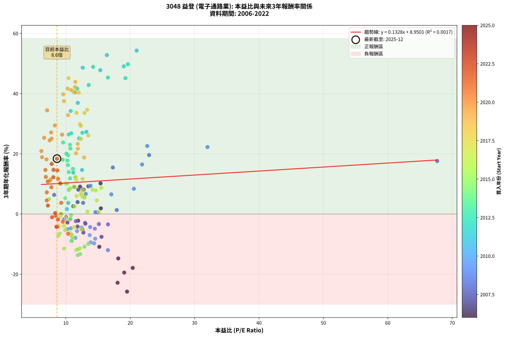
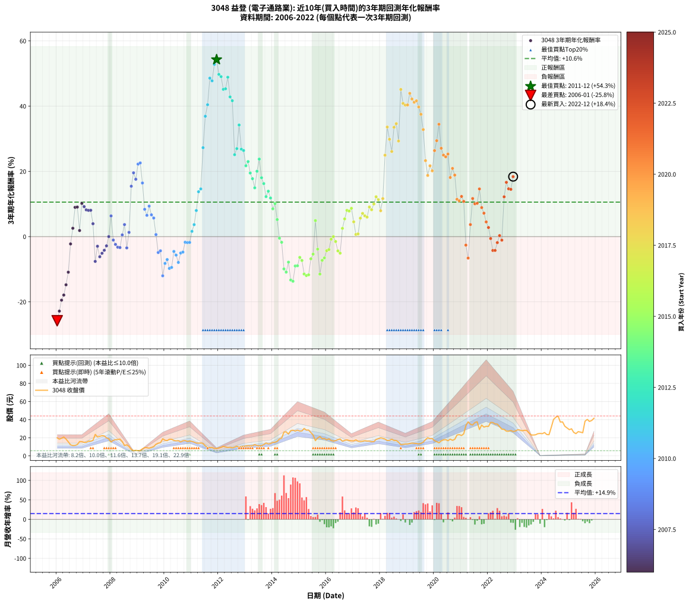

# 3048 益登 - 本益比與未來報酬率分析

!!! info "報告資訊"
    - **股票代號**: 3048
    - **公司名稱**: 益登
    - **產業別**: 電子通路業
    - **分析期間**: 2006-2022 (204 個數據點)
    - **資料來源**: Type 12 (ShowMonthlyK_ChartFlow) 月收盤價與本益比
    - **報酬率口徑**: 含現金股利 (簡化: 年度合計，假設每年7/1入帳)
    - **報告生成時間**: 2026-01-11 21:01:44 CST

## 📈 視覺化圖表

### 圖表1: 本益比 vs 未來報酬率關係

*圖表1：3048 益登 本益比與3年期未來報酬率關係 (2006-2022)*

### 圖表2: 歷年買入時點的3年期實際報酬率

*圖表2：3048 益登 歷年買入時點的3年期實際報酬率 (2006-2022)*

## 📍 買點訊號說明

本報告提供兩種買點提示訊號（顯示於圖表2的股價子圖中）：

### ▲ 小綠色三角形（回測驗證）
- **計算方式**: 使用全部歷史資料計算本益比第25百分位數
- **用途**: 事後驗證，顯示歷史上哪些時點確實為低估區
- **限制**: 當下無法判斷，僅供回測參考
- **特性**: 後見之明（Look-Ahead Bias）

### ▲ 小橘色三角形（即時訊號）
- **計算方式**: 使用截至當月的過去5年資料計算本益比第25百分位數
- **用途**: 實際投資決策，當時即可判斷
- **優勢**: 可操作性強，符合實務需求
- **特性**: 無後見之明，滾動窗口計算

!!! tip "如何使用兩種訊號"
    - **綠色▲** 幫助理解歷史估值機會，驗證策略有效性
    - **橘色▲** 可作為實際買進參考，但仍需搭配基本面分析
    - 兩種訊號重疊時，表示即時判斷與事後驗證一致，信心度較高
    - 僅有綠色▲時，表示當時無法判斷（需要未來資料才能確認）
    - 僅有橘色▲時，表示即時判斷為買點，但事後可能不是最佳時機

## 📊 估值分析摘要

| 指標 | 數值 |
|:---:|:---:|
| **目前本益比** (2022-12) | **8.63 倍** |
| **歷史平均本益比** | 12.18 倍 |
| **估值水準** | 🟢 相對低估 |
| **預期3年年化報酬率** | **+10.10%** |
| **歷史平均報酬率** | +10.57% |
| **相關係數 (R²)** | 0.0017 |
| **趨勢線斜率** | 0.1328 |

!!! abstract "核心洞察"
    目前本益比顯著低於歷史平均，預期未來報酬率可能較高

    根據歷史數據回測，3048 益登 在目前本益比 **8.6倍** 的估值水準下，
    預期未來3年年化報酬率約為 **+10.1%**。

    **重要提醒**: 本分析基於歷史數據統計，實際報酬率會受到公司基本面變化、產業趨勢、
    總體經濟環境等多重因素影響。R² = 0.00 表示本益比可解釋約 0.2% 的報酬率變異。

## 📈 歷史估值統計

### 最佳買點 (最高報酬率)

| 項目 | 數值 |
|:---:|:---:|
| 起始時間 | 2011-12 |
| 當時本益比 | 21.00 倍 |
| 起始價格 | 8.2 元 |
| 3年後價格 | 28.4 元 |
| **3年年化報酬率** | **+54.27%** |

### 最差買點 (最低報酬率)

| 項目 | 數值 |
|:---:|:---:|
| 起始時間 | 2006-01 |
| 當時本益比 | 19.51 倍 |
| 起始價格 | 19.9 元 |
| 3年後價格 | 5.7 元 |
| **3年年化報酬率** | **-25.79%** |

## 🎯 投資啟示

### 本益比與報酬率關係

趨勢線方程式: **y = 0.1328x + 8.9501**

!!! info "弱相關或正相關"
    本益比與未來報酬率相關性較弱。這可能表示該股票的報酬率更多受到
    公司成長性、產業趨勢等因素影響，而非估值水準。**需綜合考量多項指標**。

### 估值區間建議

基於歷史數據分析:

- **🟢 低估區** (P/E < 9.7): 預期報酬率較高，可考慮增加持股
- **🟡 合理區** (P/E 9.7-14.6): 預期報酬率符合長期趨勢，正常持有
- **🔴 高估區** (P/E > 14.6): 預期報酬率較低，可考慮減碼或觀望

!!! danger "風險提示"
    - 過去表現不代表未來結果
    - 本分析假設公司基本面無重大結構性變化
    - 產業環境劇變可能使歷史規律失效
    - 應結合公司財報、產業趨勢、總體經濟等多重因素綜合判斷

!!! success "長期投資觀點"
    歷史數據顯示，在合理或低估的估值水準買入並長期持有，
    往往能獲得較佳的投資報酬。**耐心等待好價格**是價值投資的核心原則。

## 📊 數據品質

- **資料來源**: GoodInfo.tw Type 12 (ShowMonthlyK_ChartFlow)
- **資料頻率**: 月度收盤價與本益比
- **回測期間**: 2006-2022
- **數據點數量**: 204 個 (每個點代表一次3年期回測)

### 計算方法說明

1. **3年期年化報酬率**:
   - 對每個歷史時點，計算其後3年的實際投資報酬率
   - 期末價值(不含股利): 期末價格
   - 期末價值(含現金股利): 期末價格 + 持有期間內的現金股利合計 (簡化: 年度合計，假設每年7/1入帳)
   - 公式: 年化報酬率 = [(期末價值/期初價格)^(1/年數) - 1] × 100%

2. **本益比 (P/E Ratio)**:
   - 使用當時的月收盤價與EPS計算
   - 資料來源: Type 12 月度河流圖本益比數據

3. **趨勢線 (Linear Regression)**:
   - 使用最小平方法擬合線性趨勢線
   - R²值衡量本益比對報酬率的解釋能力

---

*本報告由 Stock Analysis System v1.9.0 自動生成*
*數據更新時間: 2026-01-11 21:01:44 CST*

## 📋 月度回測明細表

（每一列對應時間線圖中的一個買入點；可用來對照 SVG 圖上的每個點。）

| 買入月份 | 賣出月份 | 回測期限_年 | 實際持有年數 | 買入本益比_倍 | 買入收盤價_元 | 賣出收盤價_元 | 現金股利合計_元 | 總報酬率_pct | 年化報酬率_pct |
| --- | --- | --- | --- | --- | --- | --- | --- | --- | --- |
| 2006-01 | 2009-01 | 3 | 3.001 | 19.51 | 19.90 | 5.68 | 2.45 | -59.15 | -25.79 |
| 2006-02 | 2009-02 | 3 | 3.001 | 18.04 | 18.40 | 6.00 | 2.45 | -54.08 | -22.84 |
| 2006-03 | 2009-03 | 3 | 3.001 | 19.07 | 19.45 | 7.70 | 2.45 | -47.81 | -19.49 |
| 2006-04 | 2009-04 | 3 | 3.001 | 20.39 | 20.80 | 9.05 | 2.45 | -44.71 | -17.92 |
| 2006-05 | 2009-05 | 3 | 3.001 | 18.14 | 18.50 | 9.00 | 2.45 | -38.11 | -14.78 |
| 2006-06 | 2009-06 | 3 | 3.001 | 15.20 | 15.50 | 8.51 | 2.45 | -29.29 | -10.91 |
| 2006-07 | 2009-07 | 3 | 3.001 | 11.91 | 12.15 | 9.20 | 2.15 | -6.58 | -2.24 |
| 2006-08 | 2009-08 | 3 | 3.001 | 11.18 | 11.40 | 10.15 | 2.15 | +7.89 | +2.56 |
| 2006-09 | 2009-09 | 3 | 3.001 | 11.32 | 11.55 | 12.80 | 2.15 | +29.44 | +8.98 |
| 2006-10 | 2009-10 | 3 | 3.001 | 12.21 | 12.45 | 14.00 | 2.15 | +29.72 | +9.06 |
| 2006-11 | 2009-11 | 3 | 3.001 | 15.44 | 15.75 | 14.50 | 2.15 | +5.71 | +1.87 |
| 2006-12 | 2009-12 | 3 | 3.001 | 15.39 | 15.70 | 18.85 | 2.15 | +33.76 | +10.18 |
| 2007-01 | 2010-01 | 3 | 3.001 | 13.49 | 14.90 | 17.25 | 2.15 | +30.20 | +9.19 |
| 2007-02 | 2010-02 | 3 | 3.001 | 12.62 | 15.00 | 16.85 | 2.15 | +26.67 | +8.20 |
| 2007-03 | 2010-03 | 3 | 3.001 | 12.77 | 16.25 | 18.35 | 2.15 | +26.15 | +8.05 |
| 2007-04 | 2010-04 | 3 | 3.001 | 11.94 | 16.20 | 18.30 | 2.15 | +26.23 | +8.07 |
| 2007-05 | 2010-05 | 3 | 3.001 | 11.83 | 17.05 | 17.00 | 2.15 | +12.32 | +3.95 |
| 2007-06 | 2010-06 | 3 | 3.001 | 15.54 | 23.70 | 16.55 | 2.15 | -21.10 | -7.59 |
| 2007-07 | 2010-07 | 3 | 3.001 | 12.99 | 20.90 | 16.70 | 2.40 | -8.61 | -2.96 |
| 2007-08 | 2010-08 | 3 | 3.001 | 12.73 | 21.55 | 15.40 | 2.40 | -17.40 | -6.17 |
| 2007-09 | 2010-09 | 3 | 3.001 | 12.55 | 22.30 | 16.65 | 2.40 | -14.57 | -5.11 |
| 2007-10 | 2010-10 | 3 | 3.001 | 11.82 | 22.00 | 16.95 | 2.40 | -12.05 | -4.19 |
| 2007-11 | 2010-11 | 3 | 3.001 | 10.25 | 19.95 | 15.90 | 2.40 | -8.27 | -2.84 |
| 2007-12 | 2010-12 | 3 | 3.001 | 9.26 | 18.80 | 16.40 | 2.40 | -0.00 | -0.00 |
| 2008-01 | 2011-01 | 3 | 3.001 | 8.19 | 15.30 | 16.00 | 2.40 | +20.26 | +6.34 |
| 2008-02 | 2011-03 | 3 | 3.080 | 10.05 | 17.15 | 14.20 | 2.40 | -3.21 | -1.05 |
| 2008-03 | 2011-03 | 3 | 2.998 | 11.55 | 17.85 | 14.20 | 2.40 | -7.00 | -2.39 |
| 2008-04 | 2011-04 | 3 | 2.998 | 13.05 | 18.05 | 13.95 | 2.40 | -9.42 | -3.25 |
| 2008-05 | 2011-05 | 3 | 2.998 | 15.14 | 18.50 | 14.30 | 2.40 | -9.73 | -3.36 |
| 2008-06 | 2011-06 | 3 | 2.998 | 14.91 | 15.80 | 13.65 | 2.40 | +1.58 | +0.53 |
| 2008-07 | 2011-07 | 3 | 2.998 | 12.69 | 11.40 | 11.00 | 1.71 | +11.47 | +3.69 |
| 2008-08 | 2011-08 | 3 | 2.998 | 16.56 | 12.20 | 9.27 | 1.71 | -10.02 | -3.46 |
| 2008-09 | 2011-09 | 3 | 2.998 | 17.91 | 10.30 | 9.00 | 1.71 | +3.96 | +1.30 |
| 2008-10 | 2011-10 | 3 | 2.998 | 17.30 | 7.15 | 9.29 | 1.71 | +53.82 | +15.45 |
| 2008-11 | 2011-11 | 3 | 2.998 | 22.93 | 5.77 | 8.15 | 1.71 | +70.85 | +19.56 |
| 2008-12 | 2011-12 | 3 | 2.998 | 67.67 | 6.09 | 8.19 | 1.71 | +62.53 | +17.59 |
| 2009-01 | 2012-01 | 3 | 2.998 | 32.00 | 5.68 | 8.66 | 1.71 | +82.54 | +22.23 |
| 2009-02 | 2012-02 | 3 | 2.998 | 22.64 | 6.00 | 9.34 | 1.71 | +84.13 | +22.59 |
| 2009-03 | 2012-03 | 3 | 3.001 | 21.84 | 7.70 | 10.45 | 1.71 | +57.90 | +16.44 |
| 2009-04 | 2012-04 | 3 | 3.001 | 20.57 | 9.05 | 9.81 | 1.71 | +27.27 | +8.37 |
| 2009-05 | 2012-05 | 3 | 3.001 | 17.06 | 9.00 | 9.17 | 1.71 | +20.87 | +6.52 |
| 2009-06 | 2012-06 | 3 | 3.001 | 13.84 | 8.51 | 9.42 | 1.71 | +30.76 | +9.35 |
| 2009-07 | 2012-07 | 3 | 3.001 | 13.10 | 9.20 | 8.78 | 2.39 | +21.39 | +6.67 |
| 2009-08 | 2012-08 | 3 | 3.001 | 12.85 | 10.15 | 9.60 | 2.39 | +18.11 | +5.70 |
| 2009-09 | 2012-09 | 3 | 3.001 | 14.59 | 12.80 | 10.65 | 2.39 | +1.86 | +0.62 |
| 2009-10 | 2012-10 | 3 | 3.001 | 14.51 | 14.00 | 9.66 | 2.39 | -13.94 | -4.88 |
| 2009-11 | 2012-11 | 3 | 3.001 | 13.78 | 14.50 | 10.30 | 2.39 | -12.50 | -4.35 |
| 2009-12 | 2012-12 | 3 | 3.001 | 16.54 | 18.85 | 10.45 | 2.39 | -31.89 | -12.02 |
| 2010-01 | 2013-01 | 3 | 3.001 | 14.56 | 17.25 | 10.95 | 2.39 | -22.68 | -8.21 |
| 2010-02 | 2013-02 | 3 | 3.001 | 13.70 | 16.85 | 11.15 | 2.39 | -19.66 | -7.03 |
| 2010-03 | 2013-03 | 3 | 3.001 | 14.39 | 18.35 | 11.10 | 2.39 | -26.50 | -9.75 |
| 2010-04 | 2013-04 | 3 | 3.001 | 13.86 | 18.30 | 11.20 | 2.39 | -25.75 | -9.45 |
| 2010-05 | 2013-05 | 3 | 3.001 | 12.45 | 17.00 | 12.40 | 2.39 | -13.01 | -4.54 |
| 2010-06 | 2013-06 | 3 | 3.001 | 11.74 | 16.55 | 11.50 | 2.39 | -16.08 | -5.68 |
| 2010-07 | 2013-07 | 3 | 3.001 | 11.48 | 16.70 | 11.15 | 1.89 | -21.93 | -7.92 |
| 2010-08 | 2013-08 | 3 | 3.001 | 10.27 | 15.40 | 11.30 | 1.89 | -14.36 | -5.04 |
| 2010-09 | 2013-09 | 3 | 3.001 | 10.78 | 16.65 | 12.50 | 1.89 | -13.59 | -4.75 |
| 2010-10 | 2013-10 | 3 | 3.001 | 10.66 | 16.95 | 14.20 | 1.89 | -5.09 | -1.72 |
| 2010-11 | 2013-11 | 3 | 3.001 | 9.72 | 15.90 | 13.15 | 1.89 | -5.42 | -1.84 |
| 2010-12 | 2013-12 | 3 | 3.001 | 9.76 | 16.40 | 13.65 | 1.89 | -5.26 | -1.78 |
| 2011-01 | 2014-01 | 3 | 3.001 | 10.17 | 16.00 | 14.90 | 1.89 | +4.93 | +1.62 |
| 2011-02 | 2014-02 | 3 | 3.001 | 10.38 | 15.20 | 15.05 | 1.89 | +11.43 | +3.67 |
| 2011-03 | 2014-03 | 3 | 3.001 | 10.46 | 14.20 | 16.00 | 1.89 | +25.97 | +8.00 |
| 2011-04 | 2014-04 | 3 | 3.001 | 11.16 | 13.95 | 18.65 | 1.89 | +47.23 | +13.76 |
| 2011-05 | 2014-05 | 3 | 3.001 | 12.52 | 14.30 | 19.65 | 1.89 | +50.62 | +14.62 |
| 2011-06 | 2014-06 | 3 | 3.001 | 13.19 | 13.65 | 26.25 | 1.89 | +106.14 | +27.26 |
| 2011-07 | 2014-07 | 3 | 3.001 | 11.86 | 11.00 | 26.55 | 1.68 | +156.64 | +36.90 |
| 2011-08 | 2014-08 | 3 | 3.001 | 11.30 | 9.27 | 24.00 | 1.68 | +177.02 | +40.43 |
| 2011-09 | 2014-09 | 3 | 3.001 | 12.63 | 9.00 | 27.85 | 1.68 | +228.11 | +48.58 |
| 2011-10 | 2014-10 | 3 | 3.001 | 15.36 | 9.29 | 28.30 | 1.68 | +222.71 | +47.76 |
| 2011-11 | 2014-11 | 3 | 3.001 | 16.38 | 8.15 | 27.40 | 1.68 | +256.81 | +52.79 |
| 2011-12 | 2014-12 | 3 | 3.001 | 21.00 | 8.19 | 28.40 | 1.68 | +267.28 | +54.27 |
| 2012-01 | 2015-01 | 3 | 3.001 | 19.64 | 8.66 | 27.40 | 1.68 | +235.80 | +49.73 |
| 2012-02 | 2015-03 | 3 | 3.080 | 19.00 | 9.34 | 30.25 | 1.68 | +241.86 | +49.05 |
| 2012-03 | 2015-03 | 3 | 2.998 | 19.26 | 10.45 | 30.25 | 1.68 | +205.55 | +45.15 |
| 2012-04 | 2015-04 | 3 | 2.998 | 16.53 | 9.81 | 28.40 | 1.68 | +206.63 | +45.32 |
| 2012-05 | 2015-05 | 3 | 2.998 | 14.24 | 9.17 | 28.55 | 1.68 | +229.66 | +48.87 |
| 2012-06 | 2015-06 | 3 | 2.998 | 13.55 | 9.42 | 25.75 | 1.68 | +191.19 | +42.83 |
| 2012-07 | 2015-07 | 3 | 2.998 | 11.77 | 8.78 | 22.95 | 1.99 | +184.08 | +41.66 |
| 2012-08 | 2015-08 | 3 | 2.998 | 12.05 | 9.60 | 16.80 | 1.99 | +95.75 | +25.11 |
| 2012-09 | 2015-09 | 3 | 2.998 | 12.57 | 10.65 | 19.80 | 1.99 | +104.62 | +26.98 |
| 2012-10 | 2015-10 | 3 | 2.998 | 10.75 | 9.66 | 21.35 | 1.99 | +141.64 | +34.22 |
| 2012-11 | 2015-11 | 3 | 2.998 | 10.85 | 10.30 | 19.00 | 1.99 | +103.81 | +26.81 |
| 2012-12 | 2015-12 | 3 | 2.998 | 10.45 | 10.45 | 19.10 | 1.99 | +101.84 | +26.40 |
| 2013-01 | 2016-01 | 3 | 2.998 | 10.70 | 10.95 | 17.75 | 1.99 | +80.29 | +21.73 |
| 2013-02 | 2016-02 | 3 | 2.998 | 10.65 | 11.15 | 18.75 | 1.99 | +86.03 | +23.00 |
| 2013-03 | 2016-03 | 3 | 3.001 | 10.37 | 11.10 | 16.95 | 1.99 | +70.65 | +19.50 |
| 2013-04 | 2016-04 | 3 | 3.001 | 10.24 | 11.20 | 16.30 | 1.99 | +63.32 | +17.76 |
| 2013-05 | 2016-05 | 3 | 3.001 | 11.10 | 12.40 | 16.85 | 1.99 | +51.95 | +14.96 |
| 2013-06 | 2016-06 | 3 | 3.001 | 10.09 | 11.50 | 17.90 | 1.99 | +72.97 | +20.04 |
| 2013-07 | 2016-07 | 3 | 3.001 | 9.58 | 11.15 | 18.65 | 2.49 | +89.61 | +23.77 |
| 2013-08 | 2016-08 | 3 | 3.001 | 9.52 | 11.30 | 16.10 | 2.49 | +64.53 | +18.05 |
| 2013-09 | 2016-09 | 3 | 3.001 | 10.33 | 12.50 | 17.15 | 2.49 | +57.14 | +16.25 |
| 2013-10 | 2016-10 | 3 | 3.001 | 11.51 | 14.20 | 17.60 | 2.49 | +41.49 | +12.26 |
| 2013-11 | 2016-11 | 3 | 3.001 | 10.46 | 13.15 | 16.95 | 2.49 | +47.85 | +13.92 |
| 2013-12 | 2016-12 | 3 | 3.001 | 10.66 | 13.65 | 16.60 | 2.49 | +39.87 | +11.83 |
| 2014-01 | 2017-01 | 3 | 3.001 | 10.71 | 14.90 | 16.55 | 2.49 | +27.80 | +8.52 |
| 2014-02 | 2017-02 | 3 | 3.001 | 10.02 | 15.05 | 17.60 | 2.49 | +33.50 | +10.11 |
| 2014-03 | 2017-03 | 3 | 3.001 | 9.92 | 16.00 | 16.15 | 2.49 | +16.51 | +5.23 |
| 2014-04 | 2017-04 | 3 | 3.001 | 10.82 | 18.65 | 15.90 | 2.49 | -1.38 | -0.46 |
| 2014-05 | 2017-05 | 3 | 3.001 | 10.71 | 19.65 | 16.15 | 2.49 | -5.13 | -1.74 |
| 2014-06 | 2017-06 | 3 | 3.001 | 13.50 | 26.25 | 16.70 | 2.49 | -26.89 | -9.91 |
| 2014-07 | 2017-07 | 3 | 3.001 | 12.91 | 26.55 | 16.30 | 2.49 | -29.22 | -10.88 |
| 2014-08 | 2017-08 | 3 | 3.001 | 11.08 | 24.00 | 16.30 | 2.49 | -21.70 | -7.83 |
| 2014-09 | 2017-09 | 3 | 3.001 | 12.23 | 27.85 | 15.65 | 2.49 | -34.86 | -13.31 |
| 2014-10 | 2017-10 | 3 | 3.001 | 11.85 | 28.30 | 15.70 | 2.49 | -35.72 | -13.69 |
| 2014-11 | 2017-11 | 3 | 3.001 | 10.96 | 27.40 | 18.15 | 2.49 | -24.66 | -9.01 |
| 2014-12 | 2017-12 | 3 | 3.001 | 10.88 | 28.40 | 18.95 | 2.49 | -24.50 | -8.94 |
| 2015-01 | 2018-01 | 3 | 3.001 | 10.67 | 27.40 | 20.00 | 2.49 | -17.91 | -6.37 |
| 2015-02 | 2018-02 | 3 | 3.001 | 10.88 | 27.50 | 19.40 | 2.49 | -20.39 | -7.32 |
| 2015-03 | 2018-03 | 3 | 3.001 | 12.17 | 30.25 | 18.50 | 2.49 | -30.60 | -11.46 |
| 2015-04 | 2018-04 | 3 | 3.001 | 11.62 | 28.40 | 16.90 | 2.49 | -31.72 | -11.94 |
| 2015-05 | 2018-05 | 3 | 3.001 | 11.89 | 28.55 | 17.15 | 2.49 | -31.20 | -11.72 |
| 2015-06 | 2018-06 | 3 | 3.001 | 10.91 | 25.75 | 18.35 | 2.49 | -19.06 | -6.80 |
| 2015-07 | 2018-07 | 3 | 3.001 | 9.90 | 22.95 | 16.95 | 2.50 | -15.25 | -5.37 |
| 2015-08 | 2018-08 | 3 | 3.001 | 7.38 | 16.80 | 16.90 | 2.50 | +15.48 | +4.91 |
| 2015-09 | 2018-09 | 3 | 3.001 | 8.86 | 19.80 | 15.10 | 2.50 | -11.11 | -3.85 |
| 2015-10 | 2018-10 | 3 | 3.001 | 9.73 | 21.35 | 12.30 | 2.50 | -30.68 | -11.50 |
| 2015-11 | 2018-11 | 3 | 3.001 | 8.83 | 19.00 | 12.65 | 2.50 | -20.26 | -7.27 |
| 2015-12 | 2018-12 | 3 | 3.001 | 9.05 | 19.10 | 13.10 | 2.50 | -18.32 | -6.52 |
| 2016-01 | 2019-01 | 3 | 3.001 | 8.77 | 17.75 | 13.05 | 2.50 | -12.39 | -4.31 |
| 2016-02 | 2019-03 | 3 | 3.080 | 9.68 | 18.75 | 14.05 | 2.50 | -11.73 | -3.97 |
| 2016-03 | 2019-03 | 3 | 2.998 | 9.16 | 16.95 | 14.05 | 2.50 | -2.36 | -0.79 |
| 2016-04 | 2019-04 | 3 | 2.998 | 9.24 | 16.30 | 13.80 | 2.50 | +0.00 | +0.00 |
| 2016-05 | 2019-05 | 3 | 2.998 | 10.05 | 16.85 | 13.60 | 2.50 | -4.45 | -1.51 |
| 2016-06 | 2019-06 | 3 | 2.998 | 11.26 | 17.90 | 13.15 | 2.50 | -12.57 | -4.38 |
| 2016-07 | 2019-07 | 3 | 2.998 | 12.41 | 18.65 | 13.75 | 2.20 | -14.48 | -5.08 |
| 2016-08 | 2019-08 | 3 | 2.998 | 11.36 | 16.10 | 15.15 | 2.20 | +7.76 | +2.53 |
| 2016-09 | 2019-09 | 3 | 2.998 | 12.89 | 17.15 | 17.90 | 2.20 | +17.20 | +5.44 |
| 2016-10 | 2019-10 | 3 | 2.998 | 14.16 | 17.60 | 20.00 | 2.20 | +26.14 | +8.05 |
| 2016-11 | 2019-11 | 3 | 2.998 | 14.65 | 16.95 | 19.05 | 2.20 | +25.37 | +7.83 |
| 2016-12 | 2019-12 | 3 | 2.998 | 15.51 | 16.60 | 19.10 | 2.20 | +28.31 | +8.67 |
| 2017-01 | 2020-01 | 3 | 2.998 | 14.82 | 16.55 | 16.70 | 2.20 | +14.20 | +4.53 |
| 2017-02 | 2020-02 | 3 | 2.998 | 15.13 | 17.60 | 15.75 | 2.20 | +1.99 | +0.66 |
| 2017-03 | 2020-03 | 3 | 3.001 | 13.35 | 16.15 | 14.35 | 2.20 | +2.48 | +0.82 |
| 2017-04 | 2020-04 | 3 | 3.001 | 12.65 | 15.90 | 16.55 | 2.20 | +17.92 | +5.65 |
| 2017-05 | 2020-05 | 3 | 3.001 | 12.39 | 16.15 | 17.65 | 2.20 | +22.91 | +7.12 |
| 2017-06 | 2020-06 | 3 | 3.001 | 12.37 | 16.70 | 17.90 | 2.20 | +20.36 | +6.37 |
| 2017-07 | 2020-07 | 3 | 3.001 | 11.67 | 16.30 | 16.70 | 2.70 | +19.02 | +5.97 |
| 2017-08 | 2020-08 | 3 | 3.001 | 11.29 | 16.30 | 18.45 | 2.70 | +29.75 | +9.07 |
| 2017-09 | 2020-09 | 3 | 3.001 | 10.50 | 15.65 | 17.15 | 2.70 | +26.84 | +8.24 |
| 2017-10 | 2020-10 | 3 | 3.001 | 10.22 | 15.70 | 18.20 | 2.70 | +33.12 | +10.00 |
| 2017-11 | 2020-11 | 3 | 3.001 | 11.46 | 18.15 | 22.95 | 2.70 | +41.32 | +12.22 |
| 2017-12 | 2020-12 | 3 | 3.001 | 11.63 | 18.95 | 23.45 | 2.70 | +37.99 | +11.33 |
| 2018-01 | 2021-01 | 3 | 3.001 | 12.62 | 20.00 | 22.45 | 2.70 | +25.75 | +7.93 |
| 2018-02 | 2021-02 | 3 | 3.001 | 12.60 | 19.40 | 24.30 | 2.70 | +39.18 | +11.65 |
| 2018-03 | 2021-03 | 3 | 3.001 | 12.37 | 18.50 | 33.40 | 2.70 | +95.14 | +24.96 |
| 2018-04 | 2021-04 | 3 | 3.001 | 11.66 | 16.90 | 37.60 | 2.70 | +138.46 | +33.59 |
| 2018-05 | 2021-05 | 3 | 3.001 | 12.21 | 17.15 | 34.85 | 2.70 | +118.95 | +29.84 |
| 2018-06 | 2021-06 | 3 | 3.001 | 13.49 | 18.35 | 34.10 | 2.70 | +100.54 | +26.10 |
| 2018-07 | 2021-07 | 3 | 3.001 | 12.89 | 16.95 | 36.75 | 3.60 | +138.05 | +33.51 |
| 2018-08 | 2021-08 | 3 | 3.001 | 13.31 | 16.90 | 37.65 | 3.60 | +144.08 | +34.63 |
| 2018-09 | 2021-09 | 3 | 3.001 | 12.33 | 15.10 | 29.05 | 3.60 | +116.23 | +29.30 |
| 2018-10 | 2021-10 | 3 | 3.001 | 10.42 | 12.30 | 34.00 | 3.60 | +205.69 | +45.12 |
| 2018-11 | 2021-11 | 3 | 3.001 | 11.15 | 12.65 | 31.75 | 3.60 | +179.45 | +40.84 |
| 2018-12 | 2021-12 | 3 | 3.001 | 12.02 | 13.10 | 32.60 | 3.60 | +176.34 | +40.32 |
| 2019-01 | 2022-01 | 3 | 3.001 | 11.48 | 13.05 | 32.50 | 3.60 | +176.63 | +40.37 |
| 2019-02 | 2022-02 | 3 | 3.001 | 11.49 | 13.60 | 36.95 | 3.60 | +198.16 | +43.92 |
| 2019-03 | 2022-03 | 3 | 3.001 | 11.42 | 14.05 | 36.80 | 3.60 | +187.54 | +42.19 |
| 2019-04 | 2022-04 | 3 | 3.001 | 10.81 | 13.80 | 35.25 | 3.60 | +181.52 | +41.19 |
| 2019-05 | 2022-05 | 3 | 3.001 | 10.28 | 13.60 | 35.05 | 3.60 | +184.19 | +41.63 |
| 2019-06 | 2022-06 | 3 | 3.001 | 9.60 | 13.15 | 32.30 | 3.60 | +173.00 | +39.75 |
| 2019-07 | 2022-07 | 3 | 3.001 | 9.71 | 13.75 | 29.45 | 6.30 | +160.00 | +37.50 |
| 2019-08 | 2022-08 | 3 | 3.001 | 10.35 | 15.15 | 29.20 | 6.30 | +134.32 | +32.81 |
| 2019-09 | 2022-09 | 3 | 3.001 | 11.85 | 17.90 | 27.25 | 6.30 | +87.43 | +23.29 |
| 2019-10 | 2022-10 | 3 | 3.001 | 12.85 | 20.00 | 27.20 | 6.30 | +67.50 | +18.76 |
| 2019-11 | 2022-11 | 3 | 3.001 | 11.88 | 19.05 | 28.05 | 6.30 | +80.31 | +21.71 |
| 2019-12 | 2022-12 | 3 | 3.001 | 11.58 | 19.10 | 26.85 | 6.30 | +73.56 | +20.17 |
| 2020-01 | 2023-01 | 3 | 3.001 | 9.42 | 16.70 | 27.40 | 6.30 | +101.80 | +26.36 |
| 2020-02 | 2023-03 | 3 | 3.080 | 8.30 | 15.75 | 28.55 | 6.30 | +121.27 | +29.42 |
| 2020-03 | 2023-03 | 3 | 2.998 | 7.10 | 14.35 | 28.55 | 6.30 | +142.86 | +34.44 |
| 2020-04 | 2023-04 | 3 | 2.998 | 7.72 | 16.55 | 27.65 | 6.30 | +105.14 | +27.08 |
| 2020-05 | 2023-05 | 3 | 2.998 | 7.79 | 17.65 | 28.15 | 6.30 | +95.18 | +24.99 |
| 2020-06 | 2023-06 | 3 | 2.998 | 7.49 | 17.90 | 28.20 | 6.30 | +92.74 | +24.47 |
| 2020-07 | 2023-07 | 3 | 2.998 | 6.64 | 16.70 | 25.55 | 7.30 | +96.71 | +25.32 |
| 2020-08 | 2023-08 | 3 | 2.998 | 7.00 | 18.45 | 23.10 | 7.30 | +64.77 | +18.13 |
| 2020-09 | 2023-09 | 3 | 2.998 | 6.21 | 17.15 | 23.00 | 7.30 | +76.68 | +20.91 |
| 2020-10 | 2023-10 | 3 | 2.998 | 6.31 | 18.20 | 23.25 | 7.30 | +67.86 | +18.86 |
| 2020-11 | 2023-11 | 3 | 2.998 | 7.63 | 22.95 | 24.45 | 7.30 | +38.34 | +11.43 |
| 2020-12 | 2023-12 | 3 | 2.998 | 7.49 | 23.45 | 24.75 | 7.30 | +36.67 | +10.98 |
| 2021-01 | 2024-01 | 3 | 2.998 | 6.90 | 22.45 | 24.50 | 7.30 | +41.65 | +12.32 |
| 2021-02 | 2024-02 | 3 | 2.998 | 7.19 | 24.30 | 25.75 | 7.30 | +36.01 | +10.80 |
| 2021-03 | 2024-03 | 3 | 3.001 | 9.53 | 33.40 | 23.55 | 7.30 | -7.63 | -2.61 |
| 2021-04 | 2024-04 | 3 | 3.001 | 10.36 | 37.60 | 23.35 | 7.30 | -18.48 | -6.58 |
| 2021-05 | 2024-05 | 3 | 3.001 | 9.28 | 34.85 | 31.55 | 7.30 | +11.48 | +3.69 |
| 2021-06 | 2024-06 | 3 | 3.001 | 8.79 | 34.10 | 40.20 | 7.30 | +39.30 | +11.68 |
| 2021-07 | 2024-07 | 3 | 3.001 | 9.18 | 36.75 | 42.60 | 6.40 | +33.33 | +10.06 |
| 2021-08 | 2024-08 | 3 | 3.001 | 9.12 | 37.65 | 44.00 | 6.40 | +33.86 | +10.21 |
| 2021-09 | 2024-09 | 3 | 3.001 | 6.83 | 29.05 | 37.35 | 6.40 | +50.60 | +14.62 |
| 2021-10 | 2024-10 | 3 | 3.001 | 7.76 | 34.00 | 37.50 | 6.40 | +29.12 | +8.89 |
| 2021-11 | 2024-11 | 3 | 3.001 | 7.05 | 31.75 | 32.70 | 6.40 | +23.15 | +7.19 |
| 2021-12 | 2024-12 | 3 | 3.001 | 7.04 | 32.60 | 30.80 | 6.40 | +14.11 | +4.50 |
| 2022-01 | 2025-01 | 3 | 3.001 | 7.22 | 32.50 | 28.90 | 6.40 | +8.62 | +2.79 |
| 2022-02 | 2025-02 | 3 | 3.001 | 8.44 | 36.95 | 29.90 | 6.40 | -1.76 | -0.59 |
| 2022-03 | 2025-03 | 3 | 3.001 | 8.66 | 36.80 | 25.90 | 6.40 | -12.23 | -4.25 |
| 2022-04 | 2025-04 | 3 | 3.001 | 8.55 | 35.25 | 24.55 | 6.40 | -12.20 | -4.24 |
| 2022-05 | 2025-05 | 3 | 3.001 | 8.77 | 35.05 | 26.75 | 6.40 | -5.42 | -1.84 |
| 2022-06 | 2025-06 | 3 | 3.001 | 8.35 | 32.30 | 26.20 | 6.40 | +0.93 | +0.31 |
| 2022-07 | 2025-07 | 3 | 3.001 | 7.87 | 29.45 | 25.50 | 3.00 | -3.23 | -1.09 |
| 2022-08 | 2025-08 | 3 | 3.001 | 8.07 | 29.20 | 38.25 | 3.00 | +41.27 | +12.20 |
| 2022-09 | 2025-09 | 3 | 3.001 | 7.81 | 27.25 | 40.25 | 3.00 | +58.72 | +16.64 |
| 2022-10 | 2025-10 | 3 | 3.001 | 8.09 | 27.20 | 38.00 | 3.00 | +50.74 | +14.65 |
| 2022-11 | 2025-11 | 3 | 3.001 | 8.67 | 28.05 | 39.10 | 3.00 | +50.09 | +14.49 |
| 2022-12 | 2025-12 | 3 | 3.001 | 8.63 | 26.85 | 41.55 | 3.00 | +65.92 | +18.38 |
