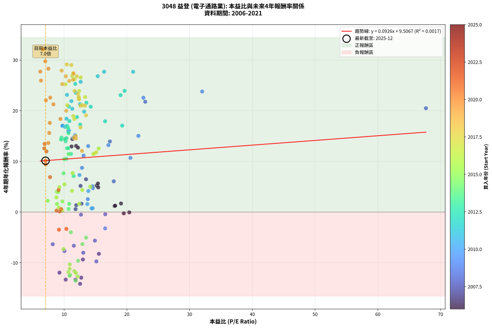
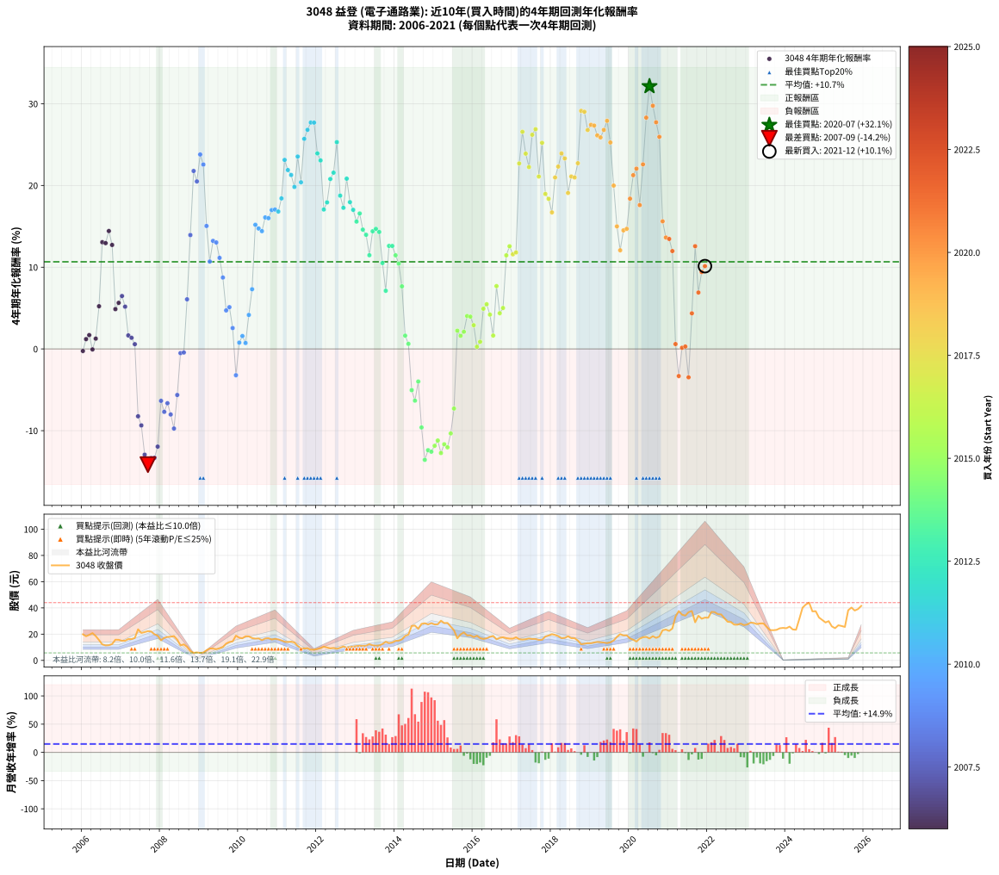

# 3048 益登 - 本益比與未來報酬率分析

!!! info "報告資訊"
    - **股票代號**: 3048
    - **公司名稱**: 益登
    - **產業別**: 電子通路業
    - **分析期間**: 2006-2021 (192 個數據點)
    - **資料來源**: Type 12 (ShowMonthlyK_ChartFlow) 月收盤價與本益比
    - **報酬率口徑**: 含現金股利 (簡化: 年度合計，假設每年7/1入帳)
    - **報告生成時間**: 2026-01-09 21:01:12 CST

## 📈 視覺化圖表

### 圖表1: 本益比 vs 未來報酬率關係

*圖表1：3048 益登 本益比與4年期未來報酬率關係 (2006-2021)*

### 圖表2: 歷年買入時點的4年期實際報酬率

*圖表2：3048 益登 歷年買入時點的4年期實際報酬率 (2006-2021)*

## 📍 買點訊號說明

本報告提供兩種買點提示訊號（顯示於圖表2的股價子圖中）：

### ▲ 小綠色三角形（回測驗證）
- **計算方式**: 使用全部歷史資料計算本益比第25百分位數
- **用途**: 事後驗證，顯示歷史上哪些時點確實為低估區
- **限制**: 當下無法判斷，僅供回測參考
- **特性**: 後見之明（Look-Ahead Bias）

### ▲ 小橘色三角形（即時訊號）
- **計算方式**: 使用截至當月的過去5年資料計算本益比第25百分位數
- **用途**: 實際投資決策，當時即可判斷
- **優勢**: 可操作性強，符合實務需求
- **特性**: 無後見之明，滾動窗口計算

!!! tip "如何使用兩種訊號"
    - **綠色▲** 幫助理解歷史估值機會，驗證策略有效性
    - **橘色▲** 可作為實際買進參考，但仍需搭配基本面分析
    - 兩種訊號重疊時，表示即時判斷與事後驗證一致，信心度較高
    - 僅有綠色▲時，表示當時無法判斷（需要未來資料才能確認）
    - 僅有橘色▲時，表示即時判斷為買點，但事後可能不是最佳時機

## 📊 估值分析摘要

| 指標 | 數值 |
|:---:|:---:|
| **目前本益比** (2021-12) | **7.04 倍** |
| **歷史平均本益比** | 12.42 倍 |
| **估值水準** | 🟢 相對低估 |
| **預期4年年化報酬率** | **+10.16%** |
| **歷史平均報酬率** | +10.66% |
| **相關係數 (R²)** | 0.0017 |
| **趨勢線斜率** | 0.0926 |

!!! abstract "核心洞察"
    目前本益比顯著低於歷史平均，預期未來報酬率可能較高

    根據歷史數據回測，3048 益登 在目前本益比 **7.0倍** 的估值水準下，
    預期未來4年年化報酬率約為 **+10.2%**。

    **重要提醒**: 本分析基於歷史數據統計，實際報酬率會受到公司基本面變化、產業趨勢、
    總體經濟環境等多重因素影響。R² = 0.00 表示本益比可解釋約 0.2% 的報酬率變異。

## 📈 歷史估值統計

### 最佳買點 (最高報酬率)

| 項目 | 數值 |
|:---:|:---:|
| 起始時間 | 2020-07 |
| 當時本益比 | 6.64 倍 |
| 起始價格 | 16.7 元 |
| 4年後價格 | 42.6 元 |
| **4年年化報酬率** | **+32.13%** |

### 最差買點 (最低報酬率)

| 項目 | 數值 |
|:---:|:---:|
| 起始時間 | 2007-09 |
| 當時本益比 | 12.55 倍 |
| 起始價格 | 22.3 元 |
| 4年後價格 | 9.0 元 |
| **4年年化報酬率** | **-14.16%** |

## 🎯 投資啟示

### 本益比與報酬率關係

趨勢線方程式: **y = 0.0926x + 9.5067**

!!! info "弱相關或正相關"
    本益比與未來報酬率相關性較弱。這可能表示該股票的報酬率更多受到
    公司成長性、產業趨勢等因素影響，而非估值水準。**需綜合考量多項指標**。

### 估值區間建議

基於歷史數據分析:

- **🟢 低估區** (P/E < 9.9): 預期報酬率較高，可考慮增加持股
- **🟡 合理區** (P/E 9.9-14.9): 預期報酬率符合長期趨勢，正常持有
- **🔴 高估區** (P/E > 14.9): 預期報酬率較低，可考慮減碼或觀望

!!! danger "風險提示"
    - 過去表現不代表未來結果
    - 本分析假設公司基本面無重大結構性變化
    - 產業環境劇變可能使歷史規律失效
    - 應結合公司財報、產業趨勢、總體經濟等多重因素綜合判斷

!!! success "長期投資觀點"
    歷史數據顯示，在合理或低估的估值水準買入並長期持有，
    往往能獲得較佳的投資報酬。**耐心等待好價格**是價值投資的核心原則。

## 📊 數據品質

- **資料來源**: GoodInfo.tw Type 12 (ShowMonthlyK_ChartFlow)
- **資料頻率**: 月度收盤價與本益比
- **回測期間**: 2006-2021
- **數據點數量**: 192 個 (每個點代表一次4年期回測)

### 計算方法說明

1. **4年期年化報酬率**:
   - 對每個歷史時點，計算其後4年的實際投資報酬率
   - 期末價值(不含股利): 期末價格
   - 期末價值(含現金股利): 期末價格 + 持有期間內的現金股利合計 (簡化: 年度合計，假設每年7/1入帳)
   - 公式: 年化報酬率 = [(期末價值/期初價格)^(1/年數) - 1] × 100%

2. **本益比 (P/E Ratio)**:
   - 使用當時的月收盤價與EPS計算
   - 資料來源: Type 12 月度河流圖本益比數據

3. **趨勢線 (Linear Regression)**:
   - 使用最小平方法擬合線性趨勢線
   - R²值衡量本益比對報酬率的解釋能力

---

*本報告由 Stock Analysis System v1.9.0 自動生成*
*數據更新時間: 2026-01-09 21:01:12 CST*

## 📋 月度回測明細表

（每一列對應時間線圖中的一個買入點；可用來對照 SVG 圖上的每個點。）

| 買入月份 | 賣出月份 | 回測期限_年 | 實際持有年數 | 買入本益比_倍 | 買入收盤價_元 | 賣出收盤價_元 | 現金股利合計_元 | 總報酬率_pct | 年化報酬率_pct |
| --- | --- | --- | --- | --- | --- | --- | --- | --- | --- |
| 2006-01 | 2010-01 | 4 | 4.000 | 19.51 | 19.90 | 17.25 | 2.45 | -1.01 | -0.25 |
| 2006-02 | 2010-02 | 4 | 4.000 | 18.04 | 18.40 | 16.85 | 2.45 | +4.89 | +1.20 |
| 2006-03 | 2010-03 | 4 | 4.000 | 19.07 | 19.45 | 18.35 | 2.45 | +6.94 | +1.69 |
| 2006-04 | 2010-04 | 4 | 4.000 | 20.39 | 20.80 | 18.30 | 2.45 | -0.24 | -0.06 |
| 2006-05 | 2010-05 | 4 | 4.000 | 18.14 | 18.50 | 17.00 | 2.45 | +5.14 | +1.26 |
| 2006-06 | 2010-06 | 4 | 4.000 | 15.20 | 15.50 | 16.55 | 2.45 | +22.58 | +5.22 |
| 2006-07 | 2010-07 | 4 | 4.000 | 11.91 | 12.15 | 16.70 | 3.15 | +63.37 | +13.06 |
| 2006-08 | 2010-08 | 4 | 4.000 | 11.18 | 11.40 | 15.40 | 3.15 | +62.72 | +12.94 |
| 2006-09 | 2010-09 | 4 | 4.000 | 11.32 | 11.55 | 16.65 | 3.15 | +71.43 | +14.42 |
| 2006-10 | 2010-10 | 4 | 4.000 | 12.21 | 12.45 | 16.95 | 3.15 | +61.45 | +12.72 |
| 2006-11 | 2010-11 | 4 | 4.000 | 15.44 | 15.75 | 15.90 | 3.15 | +20.95 | +4.87 |
| 2006-12 | 2010-12 | 4 | 4.000 | 15.39 | 15.70 | 16.40 | 3.15 | +24.52 | +5.64 |
| 2007-01 | 2011-01 | 4 | 4.000 | 13.49 | 14.90 | 16.00 | 3.15 | +28.52 | +6.47 |
| 2007-02 | 2011-02 | 4 | 4.000 | 12.62 | 15.00 | 15.20 | 3.15 | +22.33 | +5.17 |
| 2007-03 | 2011-03 | 4 | 4.000 | 12.77 | 16.25 | 14.20 | 3.15 | +6.77 | +1.65 |
| 2007-04 | 2011-04 | 4 | 4.000 | 11.94 | 16.20 | 13.95 | 3.15 | +5.56 | +1.36 |
| 2007-05 | 2011-05 | 4 | 4.000 | 11.83 | 17.05 | 14.30 | 3.15 | +2.35 | +0.58 |
| 2007-06 | 2011-06 | 4 | 4.000 | 15.54 | 23.70 | 13.65 | 3.15 | -29.11 | -8.24 |
| 2007-07 | 2011-07 | 4 | 4.000 | 12.99 | 20.90 | 11.00 | 3.11 | -32.50 | -9.36 |
| 2007-08 | 2011-08 | 4 | 4.000 | 12.73 | 21.55 | 9.27 | 3.11 | -42.56 | -12.94 |
| 2007-09 | 2011-09 | 4 | 4.000 | 12.55 | 22.30 | 9.00 | 3.11 | -45.70 | -14.16 |
| 2007-10 | 2011-10 | 4 | 4.000 | 11.82 | 22.00 | 9.29 | 3.11 | -43.65 | -13.36 |
| 2007-11 | 2011-11 | 4 | 4.000 | 10.25 | 19.95 | 8.15 | 3.11 | -43.57 | -13.33 |
| 2007-12 | 2011-12 | 4 | 4.000 | 9.26 | 18.80 | 8.19 | 3.11 | -39.90 | -11.95 |
| 2008-01 | 2012-01 | 4 | 4.000 | 8.19 | 15.30 | 8.66 | 3.11 | -23.08 | -6.35 |
| 2008-02 | 2012-02 | 4 | 4.000 | 10.05 | 17.15 | 9.34 | 3.11 | -27.42 | -7.70 |
| 2008-03 | 2012-03 | 4 | 4.000 | 11.55 | 17.85 | 10.45 | 3.11 | -24.04 | -6.64 |
| 2008-04 | 2012-04 | 4 | 4.000 | 13.05 | 18.05 | 9.81 | 3.11 | -28.43 | -8.02 |
| 2008-05 | 2012-05 | 4 | 4.000 | 15.14 | 18.50 | 9.17 | 3.11 | -33.63 | -9.74 |
| 2008-06 | 2012-06 | 4 | 4.000 | 14.91 | 15.80 | 9.42 | 3.11 | -20.71 | -5.64 |
| 2008-07 | 2012-07 | 4 | 4.000 | 12.69 | 11.40 | 8.78 | 2.39 | -2.04 | -0.51 |
| 2008-08 | 2012-08 | 4 | 4.000 | 16.56 | 12.20 | 9.60 | 2.39 | -1.74 | -0.44 |
| 2008-09 | 2012-09 | 4 | 4.000 | 17.91 | 10.30 | 10.65 | 2.39 | +26.58 | +6.07 |
| 2008-10 | 2012-10 | 4 | 4.000 | 17.30 | 7.15 | 9.66 | 2.39 | +68.50 | +13.93 |
| 2008-11 | 2012-11 | 4 | 4.000 | 22.93 | 5.77 | 10.30 | 2.39 | +119.90 | +21.77 |
| 2008-12 | 2012-12 | 4 | 4.000 | 67.67 | 6.09 | 10.45 | 2.39 | +110.80 | +20.50 |
| 2009-01 | 2013-01 | 4 | 4.000 | 32.00 | 5.68 | 10.95 | 2.39 | +134.82 | +23.79 |
| 2009-02 | 2013-02 | 4 | 4.000 | 22.64 | 6.00 | 11.15 | 2.39 | +125.63 | +22.56 |
| 2009-03 | 2013-03 | 4 | 4.000 | 21.84 | 7.70 | 11.10 | 2.39 | +75.17 | +15.04 |
| 2009-04 | 2013-04 | 4 | 4.000 | 20.57 | 9.05 | 11.20 | 2.39 | +50.14 | +10.69 |
| 2009-05 | 2013-05 | 4 | 4.000 | 17.06 | 9.00 | 12.40 | 2.39 | +64.31 | +13.22 |
| 2009-06 | 2013-06 | 4 | 4.000 | 13.84 | 8.51 | 11.50 | 2.39 | +63.20 | +13.03 |
| 2009-07 | 2013-07 | 4 | 4.000 | 13.10 | 9.20 | 11.15 | 2.89 | +52.59 | +11.14 |
| 2009-08 | 2013-08 | 4 | 4.000 | 12.85 | 10.15 | 11.30 | 2.89 | +39.78 | +8.73 |
| 2009-09 | 2013-09 | 4 | 4.000 | 14.59 | 12.80 | 12.50 | 2.89 | +20.22 | +4.71 |
| 2009-10 | 2013-10 | 4 | 4.000 | 14.51 | 14.00 | 14.20 | 2.89 | +22.06 | +5.11 |
| 2009-11 | 2013-11 | 4 | 4.000 | 13.78 | 14.50 | 13.15 | 2.89 | +10.61 | +2.55 |
| 2009-12 | 2013-12 | 4 | 4.000 | 16.54 | 18.85 | 13.65 | 2.89 | -12.27 | -3.22 |
| 2010-01 | 2014-01 | 4 | 4.000 | 14.56 | 17.25 | 14.90 | 2.89 | +3.12 | +0.77 |
| 2010-02 | 2014-02 | 4 | 4.000 | 13.70 | 16.85 | 15.05 | 2.89 | +6.46 | +1.58 |
| 2010-03 | 2014-03 | 4 | 4.000 | 14.39 | 18.35 | 16.00 | 2.89 | +2.93 | +0.73 |
| 2010-04 | 2014-04 | 4 | 4.000 | 13.86 | 18.30 | 18.65 | 2.89 | +17.69 | +4.16 |
| 2010-05 | 2014-05 | 4 | 4.000 | 12.45 | 17.00 | 19.65 | 2.89 | +32.58 | +7.30 |
| 2010-06 | 2014-06 | 4 | 4.000 | 11.74 | 16.55 | 26.25 | 2.89 | +76.06 | +15.19 |
| 2010-07 | 2014-07 | 4 | 4.000 | 11.48 | 16.70 | 26.55 | 2.39 | +73.28 | +14.73 |
| 2010-08 | 2014-08 | 4 | 4.000 | 10.27 | 15.40 | 24.00 | 2.39 | +71.35 | +14.41 |
| 2010-09 | 2014-09 | 4 | 4.000 | 10.78 | 16.65 | 27.85 | 2.39 | +81.61 | +16.09 |
| 2010-10 | 2014-10 | 4 | 4.000 | 10.66 | 16.95 | 28.30 | 2.39 | +81.05 | +16.00 |
| 2010-11 | 2014-11 | 4 | 4.000 | 9.72 | 15.90 | 27.40 | 2.39 | +87.35 | +16.99 |
| 2010-12 | 2014-12 | 4 | 4.000 | 9.76 | 16.40 | 28.40 | 2.39 | +87.73 | +17.05 |
| 2011-01 | 2015-01 | 4 | 4.000 | 10.17 | 16.00 | 27.40 | 2.39 | +86.17 | +16.81 |
| 2011-02 | 2015-02 | 4 | 4.000 | 10.38 | 15.20 | 27.50 | 2.39 | +96.63 | +18.42 |
| 2011-03 | 2015-03 | 4 | 4.000 | 10.46 | 14.20 | 30.25 | 2.39 | +129.85 | +23.13 |
| 2011-04 | 2015-04 | 4 | 4.000 | 11.16 | 13.95 | 28.40 | 2.39 | +120.70 | +21.89 |
| 2011-05 | 2015-05 | 4 | 4.000 | 12.52 | 14.30 | 28.55 | 2.39 | +116.35 | +21.28 |
| 2011-06 | 2015-06 | 4 | 4.000 | 13.19 | 13.65 | 25.75 | 2.39 | +106.14 | +19.82 |
| 2011-07 | 2015-07 | 4 | 4.000 | 11.86 | 11.00 | 22.95 | 2.67 | +132.93 | +23.54 |
| 2011-08 | 2015-08 | 4 | 4.000 | 11.30 | 9.27 | 16.80 | 2.67 | +110.05 | +20.39 |
| 2011-09 | 2015-09 | 4 | 4.000 | 12.63 | 9.00 | 19.80 | 2.67 | +149.69 | +25.70 |
| 2011-10 | 2015-10 | 4 | 4.000 | 15.36 | 9.29 | 21.35 | 2.67 | +158.58 | +26.81 |
| 2011-11 | 2015-11 | 4 | 4.000 | 16.38 | 8.15 | 19.00 | 2.67 | +165.91 | +27.70 |
| 2011-12 | 2015-12 | 4 | 4.000 | 21.00 | 8.19 | 19.10 | 2.67 | +165.84 | +27.69 |
| 2012-01 | 2016-01 | 4 | 4.000 | 19.64 | 8.66 | 17.75 | 2.67 | +135.82 | +23.92 |
| 2012-02 | 2016-02 | 4 | 4.000 | 19.00 | 9.34 | 18.75 | 2.67 | +129.36 | +23.06 |
| 2012-03 | 2016-03 | 4 | 4.000 | 19.26 | 10.45 | 16.95 | 2.67 | +87.77 | +17.06 |
| 2012-04 | 2016-04 | 4 | 4.000 | 16.53 | 9.81 | 16.30 | 2.67 | +93.39 | +17.93 |
| 2012-05 | 2016-05 | 4 | 4.000 | 14.24 | 9.17 | 16.85 | 2.67 | +112.89 | +20.79 |
| 2012-06 | 2016-06 | 4 | 4.000 | 13.55 | 9.42 | 17.90 | 2.67 | +118.39 | +21.56 |
| 2012-07 | 2016-07 | 4 | 4.000 | 11.77 | 8.78 | 18.65 | 2.99 | +146.49 | +25.30 |
| 2012-08 | 2016-08 | 4 | 4.000 | 12.05 | 9.60 | 16.10 | 2.99 | +98.88 | +18.75 |
| 2012-09 | 2016-09 | 4 | 4.000 | 12.57 | 10.65 | 17.15 | 2.99 | +89.13 | +17.27 |
| 2012-10 | 2016-10 | 4 | 4.000 | 10.75 | 9.66 | 17.60 | 2.99 | +113.17 | +20.83 |
| 2012-11 | 2016-11 | 4 | 4.000 | 10.85 | 10.30 | 16.95 | 2.99 | +93.61 | +17.96 |
| 2012-12 | 2016-12 | 4 | 4.000 | 10.45 | 10.45 | 16.60 | 2.99 | +87.48 | +17.01 |
| 2013-01 | 2017-01 | 4 | 4.000 | 10.70 | 10.95 | 16.55 | 2.99 | +78.47 | +15.58 |
| 2013-02 | 2017-02 | 4 | 4.000 | 10.65 | 11.15 | 17.60 | 2.99 | +84.68 | +16.58 |
| 2013-03 | 2017-03 | 4 | 4.000 | 10.37 | 11.10 | 16.15 | 2.99 | +72.45 | +14.60 |
| 2013-04 | 2017-04 | 4 | 4.000 | 10.24 | 11.20 | 15.90 | 2.99 | +68.68 | +13.96 |
| 2013-05 | 2017-05 | 4 | 4.000 | 11.10 | 12.40 | 16.15 | 2.99 | +54.37 | +11.47 |
| 2013-06 | 2017-06 | 4 | 4.000 | 10.09 | 11.50 | 16.70 | 2.99 | +71.23 | +14.39 |
| 2013-07 | 2017-07 | 4 | 4.000 | 9.58 | 11.15 | 16.30 | 2.99 | +73.02 | +14.69 |
| 2013-08 | 2017-08 | 4 | 4.000 | 9.52 | 11.30 | 16.30 | 2.99 | +70.73 | +14.31 |
| 2013-09 | 2017-09 | 4 | 4.000 | 10.33 | 12.50 | 15.65 | 2.99 | +49.14 | +10.51 |
| 2013-10 | 2017-10 | 4 | 4.000 | 11.51 | 14.20 | 15.70 | 2.99 | +31.63 | +7.11 |
| 2013-11 | 2017-11 | 4 | 4.000 | 10.46 | 13.15 | 18.15 | 2.99 | +60.78 | +12.60 |
| 2013-12 | 2017-12 | 4 | 4.000 | 10.66 | 13.65 | 18.95 | 2.99 | +60.75 | +12.60 |
| 2014-01 | 2018-01 | 4 | 4.000 | 10.71 | 14.90 | 20.00 | 2.99 | +54.31 | +11.45 |
| 2014-02 | 2018-02 | 4 | 4.000 | 10.02 | 15.05 | 19.40 | 2.99 | +48.78 | +10.44 |
| 2014-03 | 2018-03 | 4 | 4.000 | 9.92 | 16.00 | 18.50 | 2.99 | +34.33 | +7.66 |
| 2014-04 | 2018-04 | 4 | 4.000 | 10.82 | 18.65 | 16.90 | 2.99 | +6.66 | +1.62 |
| 2014-05 | 2018-05 | 4 | 4.000 | 10.71 | 19.65 | 17.15 | 2.99 | +2.50 | +0.62 |
| 2014-06 | 2018-06 | 4 | 4.000 | 13.50 | 26.25 | 18.35 | 2.99 | -18.70 | -5.04 |
| 2014-07 | 2018-07 | 4 | 4.000 | 12.91 | 26.55 | 16.95 | 3.49 | -23.01 | -6.33 |
| 2014-08 | 2018-08 | 4 | 4.000 | 11.08 | 24.00 | 16.90 | 3.49 | -15.03 | -3.99 |
| 2014-09 | 2018-09 | 4 | 4.000 | 12.23 | 27.85 | 15.10 | 3.49 | -33.24 | -9.61 |
| 2014-10 | 2018-10 | 4 | 4.000 | 11.85 | 28.30 | 12.30 | 3.49 | -44.20 | -13.57 |
| 2014-11 | 2018-11 | 4 | 4.000 | 10.96 | 27.40 | 12.65 | 3.49 | -41.09 | -12.39 |
| 2014-12 | 2018-12 | 4 | 4.000 | 10.88 | 28.40 | 13.10 | 3.49 | -41.58 | -12.57 |
| 2015-01 | 2019-01 | 4 | 4.000 | 10.67 | 27.40 | 13.05 | 3.49 | -39.63 | -11.85 |
| 2015-02 | 2019-02 | 4 | 4.000 | 10.88 | 27.50 | 13.60 | 3.49 | -37.85 | -11.21 |
| 2015-03 | 2019-03 | 4 | 4.000 | 12.17 | 30.25 | 14.05 | 3.49 | -42.01 | -12.74 |
| 2015-04 | 2019-04 | 4 | 4.000 | 11.62 | 28.40 | 13.80 | 3.49 | -39.11 | -11.67 |
| 2015-05 | 2019-05 | 4 | 4.000 | 11.89 | 28.55 | 13.60 | 3.49 | -40.13 | -12.04 |
| 2015-06 | 2019-06 | 4 | 4.000 | 10.91 | 25.75 | 13.15 | 3.49 | -35.37 | -10.34 |
| 2015-07 | 2019-07 | 4 | 4.000 | 9.90 | 22.95 | 13.75 | 3.20 | -26.14 | -7.30 |
| 2015-08 | 2019-08 | 4 | 4.000 | 7.38 | 16.80 | 15.15 | 3.20 | +9.23 | +2.23 |
| 2015-09 | 2019-09 | 4 | 4.000 | 8.86 | 19.80 | 17.90 | 3.20 | +6.57 | +1.60 |
| 2015-10 | 2019-10 | 4 | 4.000 | 9.73 | 21.35 | 20.00 | 3.20 | +8.67 | +2.10 |
| 2015-11 | 2019-11 | 4 | 4.000 | 8.83 | 19.00 | 19.05 | 3.20 | +17.11 | +4.03 |
| 2015-12 | 2019-12 | 4 | 4.000 | 9.05 | 19.10 | 19.10 | 3.20 | +16.75 | +3.95 |
| 2016-01 | 2020-01 | 4 | 4.000 | 8.77 | 17.75 | 16.70 | 3.20 | +12.11 | +2.90 |
| 2016-02 | 2020-02 | 4 | 4.000 | 9.68 | 18.75 | 15.75 | 3.20 | +1.07 | +0.27 |
| 2016-03 | 2020-03 | 4 | 4.000 | 9.16 | 16.95 | 14.35 | 3.20 | +3.54 | +0.87 |
| 2016-04 | 2020-04 | 4 | 4.000 | 9.24 | 16.30 | 16.55 | 3.20 | +21.17 | +4.92 |
| 2016-05 | 2020-05 | 4 | 4.000 | 10.05 | 16.85 | 17.65 | 3.20 | +23.74 | +5.47 |
| 2016-06 | 2020-06 | 4 | 4.000 | 11.26 | 17.90 | 17.90 | 3.20 | +17.88 | +4.20 |
| 2016-07 | 2020-07 | 4 | 4.000 | 12.41 | 18.65 | 16.70 | 3.20 | +6.70 | +1.64 |
| 2016-08 | 2020-08 | 4 | 4.000 | 11.36 | 16.10 | 18.45 | 3.20 | +34.47 | +7.69 |
| 2016-09 | 2020-09 | 4 | 4.000 | 12.89 | 17.15 | 17.15 | 3.20 | +18.66 | +4.37 |
| 2016-10 | 2020-10 | 4 | 4.000 | 14.16 | 17.60 | 18.20 | 3.20 | +21.59 | +5.01 |
| 2016-11 | 2020-11 | 4 | 4.000 | 14.65 | 16.95 | 22.95 | 3.20 | +54.28 | +11.45 |
| 2016-12 | 2020-12 | 4 | 4.000 | 15.51 | 16.60 | 23.45 | 3.20 | +60.54 | +12.56 |
| 2017-01 | 2021-01 | 4 | 4.000 | 14.82 | 16.55 | 22.45 | 3.20 | +54.98 | +11.58 |
| 2017-02 | 2021-02 | 4 | 4.000 | 15.13 | 17.60 | 24.30 | 3.20 | +56.25 | +11.80 |
| 2017-03 | 2021-03 | 4 | 4.000 | 13.35 | 16.15 | 33.40 | 3.20 | +126.63 | +22.70 |
| 2017-04 | 2021-04 | 4 | 4.000 | 12.65 | 15.90 | 37.60 | 3.20 | +156.60 | +26.57 |
| 2017-05 | 2021-05 | 4 | 4.000 | 12.39 | 16.15 | 34.85 | 3.20 | +135.60 | +23.89 |
| 2017-06 | 2021-06 | 4 | 4.000 | 12.37 | 16.70 | 34.10 | 3.20 | +123.35 | +22.25 |
| 2017-07 | 2021-07 | 4 | 4.000 | 11.67 | 16.30 | 36.75 | 4.60 | +153.68 | +26.20 |
| 2017-08 | 2021-08 | 4 | 4.000 | 11.29 | 16.30 | 37.65 | 4.60 | +159.20 | +26.88 |
| 2017-09 | 2021-09 | 4 | 4.000 | 10.50 | 15.65 | 29.05 | 4.60 | +115.02 | +21.09 |
| 2017-10 | 2021-10 | 4 | 4.000 | 10.22 | 15.70 | 34.00 | 4.60 | +145.86 | +25.22 |
| 2017-11 | 2021-11 | 4 | 4.000 | 11.46 | 18.15 | 31.75 | 4.60 | +100.28 | +18.96 |
| 2017-12 | 2021-12 | 4 | 4.000 | 11.63 | 18.95 | 32.60 | 4.60 | +96.31 | +18.37 |
| 2018-01 | 2022-01 | 4 | 4.000 | 12.62 | 20.00 | 32.50 | 4.60 | +85.50 | +16.70 |
| 2018-02 | 2022-02 | 4 | 4.000 | 12.60 | 19.40 | 36.95 | 4.60 | +114.18 | +20.97 |
| 2018-03 | 2022-03 | 4 | 4.000 | 12.37 | 18.50 | 36.80 | 4.60 | +123.78 | +22.31 |
| 2018-04 | 2022-04 | 4 | 4.000 | 11.66 | 16.90 | 35.25 | 4.60 | +135.80 | +23.92 |
| 2018-05 | 2022-05 | 4 | 4.000 | 12.21 | 17.15 | 35.05 | 4.60 | +131.20 | +23.31 |
| 2018-06 | 2022-06 | 4 | 4.000 | 13.49 | 18.35 | 32.30 | 4.60 | +101.09 | +19.08 |
| 2018-07 | 2022-07 | 4 | 4.000 | 12.89 | 16.95 | 29.45 | 7.00 | +115.04 | +21.10 |
| 2018-08 | 2022-08 | 4 | 4.000 | 13.31 | 16.90 | 29.20 | 7.00 | +114.20 | +20.98 |
| 2018-09 | 2022-09 | 4 | 4.000 | 12.33 | 15.10 | 27.25 | 7.00 | +126.82 | +22.72 |
| 2018-10 | 2022-10 | 4 | 4.000 | 10.42 | 12.30 | 27.20 | 7.00 | +178.05 | +29.13 |
| 2018-11 | 2022-11 | 4 | 4.000 | 11.15 | 12.65 | 28.05 | 7.00 | +177.08 | +29.02 |
| 2018-12 | 2022-12 | 4 | 4.000 | 12.02 | 13.10 | 26.85 | 7.00 | +158.40 | +26.79 |
| 2019-01 | 2023-01 | 4 | 4.000 | 11.48 | 13.05 | 27.40 | 7.00 | +163.60 | +27.42 |
| 2019-02 | 2023-02 | 4 | 4.000 | 11.49 | 13.60 | 28.75 | 7.00 | +162.87 | +27.33 |
| 2019-03 | 2023-03 | 4 | 4.000 | 11.42 | 14.05 | 28.55 | 7.00 | +153.02 | +26.12 |
| 2019-04 | 2023-04 | 4 | 4.000 | 10.81 | 13.80 | 27.65 | 7.00 | +151.09 | +25.88 |
| 2019-05 | 2023-05 | 4 | 4.000 | 10.28 | 13.60 | 28.15 | 7.00 | +158.46 | +26.79 |
| 2019-06 | 2023-06 | 4 | 4.000 | 9.60 | 13.15 | 28.20 | 7.00 | +167.68 | +27.91 |
| 2019-07 | 2023-07 | 4 | 4.000 | 9.71 | 13.75 | 25.55 | 8.30 | +146.18 | +25.26 |
| 2019-08 | 2023-08 | 4 | 4.000 | 10.35 | 15.15 | 23.10 | 8.30 | +107.26 | +19.99 |
| 2019-09 | 2023-09 | 4 | 4.000 | 11.85 | 17.90 | 23.00 | 8.30 | +74.86 | +14.99 |
| 2019-10 | 2023-10 | 4 | 4.000 | 12.85 | 20.00 | 23.25 | 8.30 | +57.75 | +12.07 |
| 2019-11 | 2023-11 | 4 | 4.000 | 11.88 | 19.05 | 24.45 | 8.30 | +71.92 | +14.51 |
| 2019-12 | 2023-12 | 4 | 4.000 | 11.58 | 19.10 | 24.75 | 8.30 | +73.04 | +14.69 |
| 2020-01 | 2024-01 | 4 | 4.000 | 9.42 | 16.70 | 24.50 | 8.30 | +96.41 | +18.38 |
| 2020-02 | 2024-02 | 4 | 4.000 | 8.30 | 15.75 | 25.75 | 8.30 | +116.19 | +21.26 |
| 2020-03 | 2024-03 | 4 | 4.000 | 7.10 | 14.35 | 23.55 | 8.30 | +121.95 | +22.06 |
| 2020-04 | 2024-04 | 4 | 4.000 | 7.72 | 16.55 | 23.35 | 8.30 | +91.24 | +17.60 |
| 2020-05 | 2024-05 | 4 | 4.000 | 7.79 | 17.65 | 31.55 | 8.30 | +125.78 | +22.58 |
| 2020-06 | 2024-06 | 4 | 4.000 | 7.49 | 17.90 | 40.20 | 8.30 | +170.95 | +28.30 |
| 2020-07 | 2024-07 | 4 | 4.000 | 6.64 | 16.70 | 42.60 | 8.30 | +204.79 | +32.13 |
| 2020-08 | 2024-08 | 4 | 4.000 | 7.00 | 18.45 | 44.00 | 8.30 | +183.47 | +29.76 |
| 2020-09 | 2024-09 | 4 | 4.000 | 6.21 | 17.15 | 37.35 | 8.30 | +166.18 | +27.73 |
| 2020-10 | 2024-10 | 4 | 4.000 | 6.31 | 18.20 | 37.50 | 8.30 | +151.65 | +25.95 |
| 2020-11 | 2024-11 | 4 | 4.000 | 7.63 | 22.95 | 32.70 | 8.30 | +78.65 | +15.61 |
| 2020-12 | 2024-12 | 4 | 4.000 | 7.49 | 23.45 | 30.80 | 8.30 | +66.74 | +13.63 |
| 2021-01 | 2025-01 | 4 | 4.000 | 6.90 | 22.45 | 28.90 | 8.30 | +65.70 | +13.46 |
| 2021-02 | 2025-02 | 4 | 4.000 | 7.19 | 24.30 | 29.90 | 8.30 | +57.20 | +11.97 |
| 2021-03 | 2025-03 | 4 | 4.000 | 9.53 | 33.40 | 25.90 | 8.30 | +2.40 | +0.59 |
| 2021-04 | 2025-04 | 4 | 4.000 | 10.36 | 37.60 | 24.55 | 8.30 | -12.63 | -3.32 |
| 2021-05 | 2025-05 | 4 | 4.000 | 9.28 | 34.85 | 26.75 | 8.30 | +0.57 | +0.14 |
| 2021-06 | 2025-06 | 4 | 4.000 | 8.79 | 34.10 | 26.20 | 8.30 | +1.17 | +0.29 |
| 2021-07 | 2025-07 | 4 | 4.000 | 9.18 | 36.75 | 25.50 | 6.40 | -13.20 | -3.48 |
| 2021-08 | 2025-08 | 4 | 4.000 | 9.12 | 37.65 | 38.25 | 6.40 | +18.59 | +4.36 |
| 2021-09 | 2025-09 | 4 | 4.000 | 6.83 | 29.05 | 40.25 | 6.40 | +60.59 | +12.57 |
| 2021-10 | 2025-10 | 4 | 4.000 | 7.76 | 34.00 | 38.00 | 6.40 | +30.59 | +6.90 |
| 2021-11 | 2025-11 | 4 | 4.000 | 7.05 | 31.75 | 39.10 | 6.40 | +43.31 | +9.41 |
| 2021-12 | 2025-12 | 4 | 4.000 | 7.04 | 32.60 | 41.55 | 6.40 | +47.09 | +10.13 |
