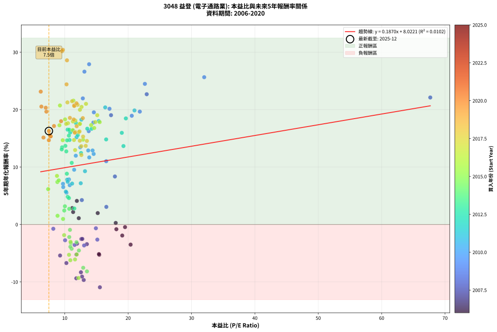
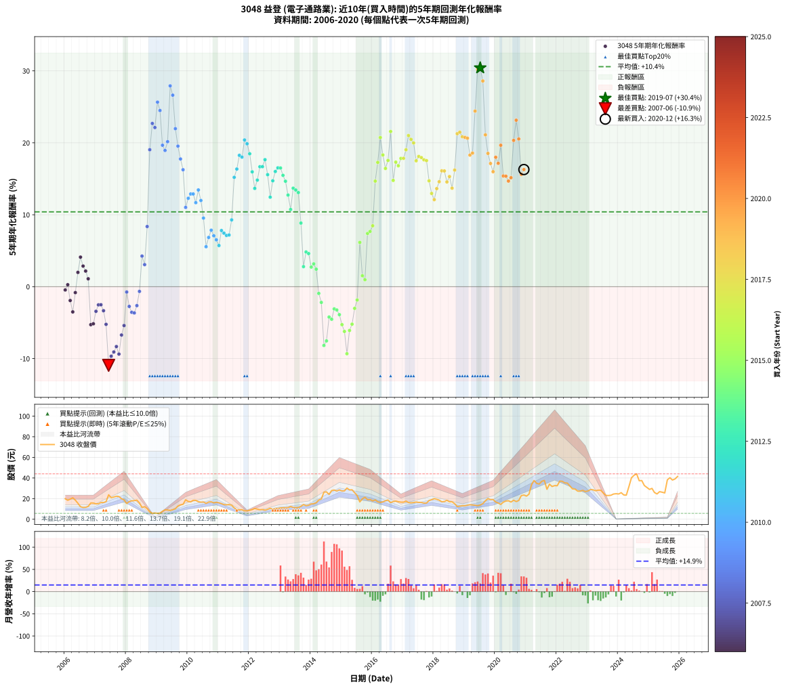

# 3048 益登 - 本益比與未來報酬率分析

!!! info "報告資訊"
    - **股票代號**: 3048
    - **公司名稱**: 益登
    - **產業別**: 電子通路業
    - **分析期間**: 2006-2020 (180 個數據點)
    - **資料來源**: Type 12 (ShowMonthlyK_ChartFlow) 月收盤價與本益比
    - **報酬率口徑**: 含現金股利 (簡化: 年度合計，假設每年7/1入帳)
    - **報告生成時間**: 2026-01-10 18:51:59 CST

## 📈 視覺化圖表

### 圖表1: 本益比 vs 未來報酬率關係

*圖表1：3048 益登 本益比與5年期未來報酬率關係 (2006-2020)*

### 圖表2: 歷年買入時點的5年期實際報酬率

*圖表2：3048 益登 歷年買入時點的5年期實際報酬率 (2006-2020)*

## 📍 買點訊號說明

本報告提供兩種買點提示訊號（顯示於圖表2的股價子圖中）：

### ▲ 小綠色三角形（回測驗證）
- **計算方式**: 使用全部歷史資料計算本益比第25百分位數
- **用途**: 事後驗證，顯示歷史上哪些時點確實為低估區
- **限制**: 當下無法判斷，僅供回測參考
- **特性**: 後見之明（Look-Ahead Bias）

### ▲ 小橘色三角形（即時訊號）
- **計算方式**: 使用截至當月的過去5年資料計算本益比第25百分位數
- **用途**: 實際投資決策，當時即可判斷
- **優勢**: 可操作性強，符合實務需求
- **特性**: 無後見之明，滾動窗口計算

!!! tip "如何使用兩種訊號"
    - **綠色▲** 幫助理解歷史估值機會，驗證策略有效性
    - **橘色▲** 可作為實際買進參考，但仍需搭配基本面分析
    - 兩種訊號重疊時，表示即時判斷與事後驗證一致，信心度較高
    - 僅有綠色▲時，表示當時無法判斷（需要未來資料才能確認）
    - 僅有橘色▲時，表示即時判斷為買點，但事後可能不是最佳時機

## 📊 估值分析摘要

| 指標 | 數值 |
|:---:|:---:|
| **目前本益比** (2020-12) | **7.49 倍** |
| **歷史平均本益比** | 12.70 倍 |
| **估值水準** | 🟢 相對低估 |
| **預期5年年化報酬率** | **+9.42%** |
| **歷史平均報酬率** | +10.40% |
| **相關係數 (R²)** | 0.0102 |
| **趨勢線斜率** | 0.1870 |

!!! abstract "核心洞察"
    目前本益比顯著低於歷史平均，預期未來報酬率可能較高

    根據歷史數據回測，3048 益登 在目前本益比 **7.5倍** 的估值水準下，
    預期未來5年年化報酬率約為 **+9.4%**。

    **重要提醒**: 本分析基於歷史數據統計，實際報酬率會受到公司基本面變化、產業趨勢、
    總體經濟環境等多重因素影響。R² = 0.01 表示本益比可解釋約 1.0% 的報酬率變異。

## 📈 歷史估值統計

### 最佳買點 (最高報酬率)

| 項目 | 數值 |
|:---:|:---:|
| 起始時間 | 2019-07 |
| 當時本益比 | 9.71 倍 |
| 起始價格 | 13.8 元 |
| 5年後價格 | 42.6 元 |
| **5年年化報酬率** | **+30.41%** |

### 最差買點 (最低報酬率)

| 項目 | 數值 |
|:---:|:---:|
| 起始時間 | 2007-06 |
| 當時本益比 | 15.54 倍 |
| 起始價格 | 23.7 元 |
| 5年後價格 | 9.4 元 |
| **5年年化報酬率** | **-10.94%** |

## 🎯 投資啟示

### 本益比與報酬率關係

趨勢線方程式: **y = 0.1870x + 8.0221**

!!! info "弱相關或正相關"
    本益比與未來報酬率相關性較弱。這可能表示該股票的報酬率更多受到
    公司成長性、產業趨勢等因素影響，而非估值水準。**需綜合考量多項指標**。

### 估值區間建議

基於歷史數據分析:

- **🟢 低估區** (P/E < 10.2): 預期報酬率較高，可考慮增加持股
- **🟡 合理區** (P/E 10.2-15.2): 預期報酬率符合長期趨勢，正常持有
- **🔴 高估區** (P/E > 15.2): 預期報酬率較低，可考慮減碼或觀望

!!! danger "風險提示"
    - 過去表現不代表未來結果
    - 本分析假設公司基本面無重大結構性變化
    - 產業環境劇變可能使歷史規律失效
    - 應結合公司財報、產業趨勢、總體經濟等多重因素綜合判斷

!!! success "長期投資觀點"
    歷史數據顯示，在合理或低估的估值水準買入並長期持有，
    往往能獲得較佳的投資報酬。**耐心等待好價格**是價值投資的核心原則。

## 📊 數據品質

- **資料來源**: GoodInfo.tw Type 12 (ShowMonthlyK_ChartFlow)
- **資料頻率**: 月度收盤價與本益比
- **回測期間**: 2006-2020
- **數據點數量**: 180 個 (每個點代表一次5年期回測)

### 計算方法說明

1. **5年期年化報酬率**:
   - 對每個歷史時點，計算其後5年的實際投資報酬率
   - 期末價值(不含股利): 期末價格
   - 期末價值(含現金股利): 期末價格 + 持有期間內的現金股利合計 (簡化: 年度合計，假設每年7/1入帳)
   - 公式: 年化報酬率 = [(期末價值/期初價格)^(1/年數) - 1] × 100%

2. **本益比 (P/E Ratio)**:
   - 使用當時的月收盤價與EPS計算
   - 資料來源: Type 12 月度河流圖本益比數據

3. **趨勢線 (Linear Regression)**:
   - 使用最小平方法擬合線性趨勢線
   - R²值衡量本益比對報酬率的解釋能力

---

*本報告由 Stock Analysis System v1.9.0 自動生成*
*數據更新時間: 2026-01-10 18:51:59 CST*

## 📋 月度回測明細表

（每一列對應時間線圖中的一個買入點；可用來對照 SVG 圖上的每個點。）

| 買入月份 | 賣出月份 | 回測期限_年 | 實際持有年數 | 買入本益比_倍 | 買入收盤價_元 | 賣出收盤價_元 | 現金股利合計_元 | 總報酬率_pct | 年化報酬率_pct |
| --- | --- | --- | --- | --- | --- | --- | --- | --- | --- |
| 2006-01 | 2011-01 | 5 | 4.999 | 19.51 | 19.90 | 16.00 | 3.45 | -2.26 | -0.46 |
| 2006-02 | 2011-02 | 5 | 4.999 | 18.04 | 18.40 | 15.20 | 3.45 | +1.36 | +0.27 |
| 2006-03 | 2011-03 | 5 | 4.999 | 19.07 | 19.45 | 14.20 | 3.45 | -9.25 | -1.92 |
| 2006-04 | 2011-04 | 5 | 4.999 | 20.39 | 20.80 | 13.95 | 3.45 | -16.35 | -3.51 |
| 2006-05 | 2011-05 | 5 | 4.999 | 18.14 | 18.50 | 14.30 | 3.45 | -4.05 | -0.82 |
| 2006-06 | 2011-06 | 5 | 4.999 | 15.20 | 15.50 | 13.65 | 3.45 | +10.32 | +1.98 |
| 2006-07 | 2011-07 | 5 | 4.999 | 11.91 | 12.15 | 11.00 | 3.86 | +22.29 | +4.11 |
| 2006-08 | 2011-08 | 5 | 4.999 | 11.18 | 11.40 | 9.27 | 3.86 | +15.16 | +2.86 |
| 2006-09 | 2011-09 | 5 | 4.999 | 11.32 | 11.55 | 9.00 | 3.86 | +11.32 | +2.17 |
| 2006-10 | 2011-10 | 5 | 4.999 | 12.21 | 12.45 | 9.29 | 3.86 | +5.61 | +1.10 |
| 2006-11 | 2011-11 | 5 | 4.999 | 15.44 | 15.75 | 8.15 | 3.86 | -23.76 | -5.28 |
| 2006-12 | 2011-12 | 5 | 4.999 | 15.39 | 15.70 | 8.19 | 3.86 | -23.26 | -5.16 |
| 2007-01 | 2012-01 | 5 | 4.999 | 13.49 | 14.90 | 8.66 | 3.86 | -15.99 | -3.42 |
| 2007-02 | 2012-02 | 5 | 4.999 | 12.62 | 15.00 | 9.34 | 3.86 | -12.01 | -2.53 |
| 2007-03 | 2012-03 | 5 | 5.002 | 12.77 | 16.25 | 10.45 | 3.86 | -11.95 | -2.51 |
| 2007-04 | 2012-04 | 5 | 5.002 | 11.94 | 16.20 | 9.81 | 3.86 | -15.63 | -3.34 |
| 2007-05 | 2012-05 | 5 | 5.002 | 11.83 | 17.05 | 9.17 | 3.86 | -23.59 | -5.24 |
| 2007-06 | 2012-06 | 5 | 5.002 | 15.54 | 23.70 | 9.42 | 3.86 | -43.97 | -10.94 |
| 2007-07 | 2012-07 | 5 | 5.002 | 12.99 | 20.90 | 8.78 | 3.79 | -39.87 | -9.67 |
| 2007-08 | 2012-08 | 5 | 5.002 | 12.73 | 21.55 | 9.60 | 3.79 | -37.87 | -9.08 |
| 2007-09 | 2012-09 | 5 | 5.002 | 12.55 | 22.30 | 10.65 | 3.79 | -35.26 | -8.32 |
| 2007-10 | 2012-10 | 5 | 5.002 | 11.82 | 22.00 | 9.66 | 3.79 | -38.87 | -9.37 |
| 2007-11 | 2012-11 | 5 | 5.002 | 10.25 | 19.95 | 10.30 | 3.79 | -29.38 | -6.72 |
| 2007-12 | 2012-12 | 5 | 5.002 | 9.26 | 18.80 | 10.45 | 3.79 | -24.27 | -5.41 |
| 2008-01 | 2013-01 | 5 | 5.002 | 8.19 | 15.30 | 10.95 | 3.79 | -3.67 | -0.75 |
| 2008-02 | 2013-03 | 5 | 5.081 | 10.05 | 17.15 | 11.10 | 3.79 | -13.19 | -2.75 |
| 2008-03 | 2013-03 | 5 | 4.999 | 11.55 | 17.85 | 11.10 | 3.79 | -16.59 | -3.56 |
| 2008-04 | 2013-04 | 5 | 4.999 | 13.05 | 18.05 | 11.20 | 3.79 | -16.96 | -3.65 |
| 2008-05 | 2013-05 | 5 | 4.999 | 15.14 | 18.50 | 12.40 | 3.79 | -12.50 | -2.64 |
| 2008-06 | 2013-06 | 5 | 4.999 | 14.91 | 15.80 | 11.50 | 3.79 | -3.24 | -0.66 |
| 2008-07 | 2013-07 | 5 | 4.999 | 12.69 | 11.40 | 11.15 | 2.89 | +23.14 | +4.25 |
| 2008-08 | 2013-08 | 5 | 4.999 | 16.56 | 12.20 | 11.30 | 2.89 | +16.30 | +3.07 |
| 2008-09 | 2013-09 | 5 | 4.999 | 17.91 | 10.30 | 12.50 | 2.89 | +49.40 | +8.36 |
| 2008-10 | 2013-10 | 5 | 4.999 | 17.30 | 7.15 | 14.20 | 2.89 | +138.99 | +19.04 |
| 2008-11 | 2013-11 | 5 | 4.999 | 22.93 | 5.77 | 13.15 | 2.89 | +177.95 | +22.69 |
| 2008-12 | 2013-12 | 5 | 4.999 | 67.67 | 6.09 | 13.65 | 2.89 | +171.56 | +22.12 |
| 2009-01 | 2014-01 | 5 | 4.999 | 32.00 | 5.68 | 14.90 | 2.89 | +213.17 | +25.65 |
| 2009-02 | 2014-02 | 5 | 4.999 | 22.64 | 6.00 | 15.05 | 2.89 | +198.97 | +24.49 |
| 2009-03 | 2014-03 | 5 | 4.999 | 21.84 | 7.70 | 16.00 | 2.89 | +145.30 | +19.66 |
| 2009-04 | 2014-04 | 5 | 4.999 | 20.57 | 9.05 | 18.65 | 2.89 | +137.99 | +18.94 |
| 2009-05 | 2014-05 | 5 | 4.999 | 17.06 | 9.00 | 19.65 | 2.89 | +150.42 | +20.16 |
| 2009-06 | 2014-06 | 5 | 4.999 | 13.84 | 8.51 | 26.25 | 2.89 | +242.40 | +27.91 |
| 2009-07 | 2014-07 | 5 | 4.999 | 13.10 | 9.20 | 26.55 | 3.39 | +225.41 | +26.62 |
| 2009-08 | 2014-08 | 5 | 4.999 | 12.85 | 10.15 | 24.00 | 3.39 | +169.83 | +21.96 |
| 2009-09 | 2014-09 | 5 | 4.999 | 14.59 | 12.80 | 27.85 | 3.39 | +144.05 | +19.54 |
| 2009-10 | 2014-10 | 5 | 4.999 | 14.51 | 14.00 | 28.30 | 3.39 | +126.34 | +17.75 |
| 2009-11 | 2014-11 | 5 | 4.999 | 13.78 | 14.50 | 27.40 | 3.39 | +112.33 | +16.26 |
| 2009-12 | 2014-12 | 5 | 4.999 | 16.54 | 18.85 | 28.40 | 3.39 | +68.64 | +11.02 |
| 2010-01 | 2015-01 | 5 | 4.999 | 14.56 | 17.25 | 27.40 | 3.39 | +78.48 | +12.29 |
| 2010-02 | 2015-02 | 5 | 4.999 | 13.70 | 16.85 | 27.50 | 3.39 | +83.31 | +12.89 |
| 2010-03 | 2015-03 | 5 | 4.999 | 14.39 | 18.35 | 30.25 | 3.39 | +83.31 | +12.89 |
| 2010-04 | 2015-04 | 5 | 4.999 | 13.86 | 18.30 | 28.40 | 3.39 | +73.70 | +11.68 |
| 2010-05 | 2015-05 | 5 | 4.999 | 12.45 | 17.00 | 28.55 | 3.39 | +87.87 | +13.44 |
| 2010-06 | 2015-06 | 5 | 4.999 | 11.74 | 16.55 | 25.75 | 3.39 | +76.06 | +11.98 |
| 2010-07 | 2015-07 | 5 | 4.999 | 11.48 | 16.70 | 22.95 | 3.38 | +57.66 | +9.53 |
| 2010-08 | 2015-08 | 5 | 4.999 | 10.27 | 15.40 | 16.80 | 3.38 | +31.04 | +5.56 |
| 2010-09 | 2015-09 | 5 | 4.999 | 10.78 | 16.65 | 19.80 | 3.38 | +39.22 | +6.84 |
| 2010-10 | 2015-10 | 5 | 4.999 | 10.66 | 16.95 | 21.35 | 3.38 | +45.90 | +7.85 |
| 2010-11 | 2015-11 | 5 | 4.999 | 9.72 | 15.90 | 19.00 | 3.38 | +40.75 | +7.08 |
| 2010-12 | 2015-12 | 5 | 4.999 | 9.76 | 16.40 | 19.10 | 3.38 | +37.07 | +6.51 |
| 2011-01 | 2016-01 | 5 | 4.999 | 10.17 | 16.00 | 17.75 | 3.38 | +32.06 | +5.72 |
| 2011-02 | 2016-02 | 5 | 4.999 | 10.38 | 15.20 | 18.75 | 3.38 | +45.59 | +7.80 |
| 2011-03 | 2016-03 | 5 | 5.002 | 10.46 | 14.20 | 16.95 | 3.38 | +43.17 | +7.44 |
| 2011-04 | 2016-04 | 5 | 5.002 | 11.16 | 13.95 | 16.30 | 3.38 | +41.08 | +7.12 |
| 2011-05 | 2016-05 | 5 | 5.002 | 12.52 | 14.30 | 16.85 | 3.38 | +41.47 | +7.18 |
| 2011-06 | 2016-06 | 5 | 5.002 | 13.19 | 13.65 | 17.90 | 3.38 | +55.90 | +9.28 |
| 2011-07 | 2016-07 | 5 | 5.002 | 11.86 | 11.00 | 18.65 | 3.67 | +102.93 | +15.20 |
| 2011-08 | 2016-08 | 5 | 5.002 | 11.30 | 9.27 | 16.10 | 3.67 | +113.29 | +16.35 |
| 2011-09 | 2016-09 | 5 | 5.002 | 12.63 | 9.00 | 17.15 | 3.67 | +131.36 | +18.26 |
| 2011-10 | 2016-10 | 5 | 5.002 | 15.36 | 9.29 | 17.60 | 3.67 | +128.98 | +18.01 |
| 2011-11 | 2016-11 | 5 | 5.002 | 16.38 | 8.15 | 16.95 | 3.67 | +153.03 | +20.39 |
| 2011-12 | 2016-12 | 5 | 5.002 | 21.00 | 8.19 | 16.60 | 3.67 | +147.52 | +19.86 |
| 2012-01 | 2017-01 | 5 | 5.002 | 19.64 | 8.66 | 16.55 | 3.67 | +133.51 | +18.48 |
| 2012-02 | 2017-03 | 5 | 5.081 | 19.00 | 9.34 | 16.15 | 3.67 | +112.23 | +15.96 |
| 2012-03 | 2017-03 | 5 | 4.999 | 19.26 | 10.45 | 16.15 | 3.67 | +89.68 | +13.66 |
| 2012-04 | 2017-04 | 5 | 4.999 | 16.53 | 9.81 | 15.90 | 3.67 | +99.51 | +14.82 |
| 2012-05 | 2017-05 | 5 | 4.999 | 14.24 | 9.17 | 16.15 | 3.67 | +116.16 | +16.67 |
| 2012-06 | 2017-06 | 5 | 4.999 | 13.55 | 9.42 | 16.70 | 3.67 | +116.26 | +16.68 |
| 2012-07 | 2017-07 | 5 | 4.999 | 11.77 | 8.78 | 16.30 | 3.49 | +125.42 | +17.65 |
| 2012-08 | 2017-08 | 5 | 4.999 | 12.05 | 9.60 | 16.30 | 3.49 | +106.17 | +15.57 |
| 2012-09 | 2017-09 | 5 | 4.999 | 12.57 | 10.65 | 15.65 | 3.49 | +79.74 | +12.44 |
| 2012-10 | 2017-10 | 5 | 4.999 | 10.75 | 9.66 | 15.70 | 3.49 | +98.67 | +14.72 |
| 2012-11 | 2017-11 | 5 | 4.999 | 10.85 | 10.30 | 18.15 | 3.49 | +110.12 | +16.01 |
| 2012-12 | 2017-12 | 5 | 4.999 | 10.45 | 10.45 | 18.95 | 3.49 | +114.76 | +16.52 |
| 2013-01 | 2018-01 | 5 | 4.999 | 10.70 | 10.95 | 20.00 | 3.49 | +114.54 | +16.50 |
| 2013-02 | 2018-02 | 5 | 4.999 | 10.65 | 11.15 | 19.40 | 3.49 | +105.31 | +15.48 |
| 2013-03 | 2018-03 | 5 | 4.999 | 10.37 | 11.10 | 18.50 | 3.49 | +98.13 | +14.66 |
| 2013-04 | 2018-04 | 5 | 4.999 | 10.24 | 11.20 | 16.90 | 3.49 | +82.07 | +12.73 |
| 2013-05 | 2018-05 | 5 | 4.999 | 11.10 | 12.40 | 17.15 | 3.49 | +66.47 | +10.73 |
| 2013-06 | 2018-06 | 5 | 4.999 | 10.09 | 11.50 | 18.35 | 3.49 | +89.93 | +13.69 |
| 2013-07 | 2018-07 | 5 | 4.999 | 9.58 | 11.15 | 16.95 | 3.99 | +87.82 | +13.44 |
| 2013-08 | 2018-08 | 5 | 4.999 | 9.52 | 11.30 | 16.90 | 3.99 | +84.88 | +13.08 |
| 2013-09 | 2018-09 | 5 | 4.999 | 10.33 | 12.50 | 15.10 | 3.99 | +52.74 | +8.84 |
| 2013-10 | 2018-10 | 5 | 4.999 | 11.51 | 14.20 | 12.30 | 3.99 | +14.73 | +2.79 |
| 2013-11 | 2018-11 | 5 | 4.999 | 10.46 | 13.15 | 12.65 | 3.99 | +26.56 | +4.82 |
| 2013-12 | 2018-12 | 5 | 4.999 | 10.66 | 13.65 | 13.10 | 3.99 | +25.22 | +4.60 |
| 2014-01 | 2019-01 | 5 | 4.999 | 10.71 | 14.90 | 13.05 | 3.99 | +14.38 | +2.72 |
| 2014-02 | 2019-02 | 5 | 4.999 | 10.02 | 15.05 | 13.60 | 3.99 | +16.89 | +3.17 |
| 2014-03 | 2019-03 | 5 | 4.999 | 9.92 | 16.00 | 14.05 | 3.99 | +12.76 | +2.43 |
| 2014-04 | 2019-04 | 5 | 4.999 | 10.82 | 18.65 | 13.80 | 3.99 | -4.60 | -0.94 |
| 2014-05 | 2019-05 | 5 | 4.999 | 10.71 | 19.65 | 13.60 | 3.99 | -10.47 | -2.19 |
| 2014-06 | 2019-06 | 5 | 4.999 | 13.50 | 26.25 | 13.15 | 3.99 | -34.70 | -8.17 |
| 2014-07 | 2019-07 | 5 | 4.999 | 12.91 | 26.55 | 13.75 | 4.19 | -32.42 | -7.54 |
| 2014-08 | 2019-08 | 5 | 4.999 | 11.08 | 24.00 | 15.15 | 4.19 | -19.41 | -4.22 |
| 2014-09 | 2019-09 | 5 | 4.999 | 12.23 | 27.85 | 17.90 | 4.19 | -20.68 | -4.53 |
| 2014-10 | 2019-10 | 5 | 4.999 | 11.85 | 28.30 | 20.00 | 4.19 | -14.52 | -3.09 |
| 2014-11 | 2019-11 | 5 | 4.999 | 10.96 | 27.40 | 19.05 | 4.19 | -15.18 | -3.24 |
| 2014-12 | 2019-12 | 5 | 4.999 | 10.88 | 28.40 | 19.10 | 4.19 | -17.99 | -3.89 |
| 2015-01 | 2020-01 | 5 | 4.999 | 10.67 | 27.40 | 16.70 | 4.19 | -23.75 | -5.28 |
| 2015-02 | 2020-02 | 5 | 4.999 | 10.88 | 27.50 | 15.75 | 4.19 | -27.48 | -6.23 |
| 2015-03 | 2020-03 | 5 | 5.002 | 12.17 | 30.25 | 14.35 | 4.19 | -38.70 | -9.32 |
| 2015-04 | 2020-04 | 5 | 5.002 | 11.62 | 28.40 | 16.55 | 4.19 | -26.96 | -6.09 |
| 2015-05 | 2020-05 | 5 | 5.002 | 11.89 | 28.55 | 17.65 | 4.19 | -23.50 | -5.21 |
| 2015-06 | 2020-06 | 5 | 5.002 | 10.91 | 25.75 | 17.90 | 4.19 | -14.21 | -3.02 |
| 2015-07 | 2020-07 | 5 | 5.002 | 9.90 | 22.95 | 16.70 | 4.20 | -8.93 | -1.85 |
| 2015-08 | 2020-08 | 5 | 5.002 | 7.38 | 16.80 | 18.45 | 4.20 | +34.82 | +6.16 |
| 2015-09 | 2020-09 | 5 | 5.002 | 8.86 | 19.80 | 17.15 | 4.20 | +7.83 | +1.52 |
| 2015-10 | 2020-10 | 5 | 5.002 | 9.73 | 21.35 | 18.20 | 4.20 | +4.92 | +0.96 |
| 2015-11 | 2020-11 | 5 | 5.002 | 8.83 | 19.00 | 22.95 | 4.20 | +42.89 | +7.40 |
| 2015-12 | 2020-12 | 5 | 5.002 | 9.05 | 19.10 | 23.45 | 4.20 | +44.76 | +7.68 |
| 2016-01 | 2021-01 | 5 | 5.002 | 8.77 | 17.75 | 22.45 | 4.20 | +50.14 | +8.46 |
| 2016-02 | 2021-03 | 5 | 5.081 | 9.68 | 18.75 | 33.40 | 4.20 | +100.53 | +14.67 |
| 2016-03 | 2021-03 | 5 | 4.999 | 9.16 | 16.95 | 33.40 | 4.20 | +121.83 | +17.28 |
| 2016-04 | 2021-04 | 5 | 4.999 | 9.24 | 16.30 | 37.60 | 4.20 | +156.44 | +20.73 |
| 2016-05 | 2021-05 | 5 | 4.999 | 10.05 | 16.85 | 34.85 | 4.20 | +131.75 | +18.31 |
| 2016-06 | 2021-06 | 5 | 4.999 | 11.26 | 17.90 | 34.10 | 4.20 | +113.97 | +16.43 |
| 2016-07 | 2021-07 | 5 | 4.999 | 12.41 | 18.65 | 36.75 | 5.10 | +124.40 | +17.55 |
| 2016-08 | 2021-08 | 5 | 4.999 | 11.36 | 16.10 | 37.65 | 5.10 | +165.53 | +21.57 |
| 2016-09 | 2021-09 | 5 | 4.999 | 12.89 | 17.15 | 29.05 | 5.10 | +99.13 | +14.77 |
| 2016-10 | 2021-10 | 5 | 4.999 | 14.16 | 17.60 | 34.00 | 5.10 | +122.16 | +17.31 |
| 2016-11 | 2021-11 | 5 | 4.999 | 14.65 | 16.95 | 31.75 | 5.10 | +117.40 | +16.81 |
| 2016-12 | 2021-12 | 5 | 4.999 | 15.51 | 16.60 | 32.60 | 5.10 | +127.11 | +17.83 |
| 2017-01 | 2022-01 | 5 | 4.999 | 14.82 | 16.55 | 32.50 | 5.10 | +127.19 | +17.84 |
| 2017-02 | 2022-02 | 5 | 4.999 | 15.13 | 17.60 | 36.95 | 5.10 | +138.92 | +19.03 |
| 2017-03 | 2022-03 | 5 | 4.999 | 13.35 | 16.15 | 36.80 | 5.10 | +159.44 | +21.01 |
| 2017-04 | 2022-04 | 5 | 4.999 | 12.65 | 15.90 | 35.25 | 5.10 | +153.77 | +20.48 |
| 2017-05 | 2022-05 | 5 | 4.999 | 12.39 | 16.15 | 35.05 | 5.10 | +148.61 | +19.98 |
| 2017-06 | 2022-06 | 5 | 4.999 | 12.37 | 16.70 | 32.30 | 5.10 | +123.95 | +17.50 |
| 2017-07 | 2022-07 | 5 | 4.999 | 11.67 | 16.30 | 29.45 | 8.00 | +129.75 | +18.10 |
| 2017-08 | 2022-08 | 5 | 4.999 | 11.29 | 16.30 | 29.20 | 8.00 | +128.22 | +17.95 |
| 2017-09 | 2022-09 | 5 | 4.999 | 10.50 | 15.65 | 27.25 | 8.00 | +125.24 | +17.64 |
| 2017-10 | 2022-10 | 5 | 4.999 | 10.22 | 15.70 | 27.20 | 8.00 | +124.20 | +17.53 |
| 2017-11 | 2022-11 | 5 | 4.999 | 11.46 | 18.15 | 28.05 | 8.00 | +98.62 | +14.71 |
| 2017-12 | 2022-12 | 5 | 4.999 | 11.63 | 18.95 | 26.85 | 8.00 | +83.91 | +12.96 |
| 2018-01 | 2023-01 | 5 | 4.999 | 12.62 | 20.00 | 27.40 | 8.00 | +77.00 | +12.10 |
| 2018-02 | 2023-02 | 5 | 4.999 | 12.60 | 19.40 | 28.75 | 8.00 | +89.43 | +13.63 |
| 2018-03 | 2023-03 | 5 | 4.999 | 12.37 | 18.50 | 28.55 | 8.00 | +97.57 | +14.59 |
| 2018-04 | 2023-04 | 5 | 4.999 | 11.66 | 16.90 | 27.65 | 8.00 | +110.95 | +16.10 |
| 2018-05 | 2023-05 | 5 | 4.999 | 12.21 | 17.15 | 28.15 | 8.00 | +110.79 | +16.09 |
| 2018-06 | 2023-06 | 5 | 4.999 | 13.49 | 18.35 | 28.20 | 8.00 | +97.28 | +14.56 |
| 2018-07 | 2023-07 | 5 | 4.999 | 12.89 | 16.95 | 25.55 | 9.00 | +103.83 | +15.31 |
| 2018-08 | 2023-08 | 5 | 4.999 | 13.31 | 16.90 | 23.10 | 9.00 | +89.94 | +13.69 |
| 2018-09 | 2023-09 | 5 | 4.999 | 12.33 | 15.10 | 23.00 | 9.00 | +111.92 | +16.21 |
| 2018-10 | 2023-10 | 5 | 4.999 | 10.42 | 12.30 | 23.25 | 9.00 | +162.20 | +21.27 |
| 2018-11 | 2023-11 | 5 | 4.999 | 11.15 | 12.65 | 24.45 | 9.00 | +164.43 | +21.47 |
| 2018-12 | 2023-12 | 5 | 4.999 | 12.02 | 13.10 | 24.75 | 9.00 | +157.63 | +20.84 |
| 2019-01 | 2024-01 | 5 | 4.999 | 11.48 | 13.05 | 24.50 | 9.00 | +156.70 | +20.75 |
| 2019-02 | 2024-02 | 5 | 4.999 | 11.49 | 13.60 | 25.75 | 9.00 | +155.51 | +20.64 |
| 2019-03 | 2024-03 | 5 | 5.002 | 11.42 | 14.05 | 23.55 | 9.00 | +131.67 | +18.29 |
| 2019-04 | 2024-04 | 5 | 5.002 | 10.81 | 13.80 | 23.35 | 9.00 | +134.42 | +18.57 |
| 2019-05 | 2024-05 | 5 | 5.002 | 10.28 | 13.60 | 31.55 | 9.00 | +198.16 | +24.41 |
| 2019-06 | 2024-06 | 5 | 5.002 | 9.60 | 13.15 | 40.20 | 9.00 | +274.14 | +30.18 |
| 2019-07 | 2024-07 | 5 | 5.002 | 9.71 | 13.75 | 42.60 | 9.30 | +277.45 | +30.41 |
| 2019-08 | 2024-08 | 5 | 5.002 | 10.35 | 15.15 | 44.00 | 9.30 | +251.82 | +28.59 |
| 2019-09 | 2024-09 | 5 | 5.002 | 11.85 | 17.90 | 37.35 | 9.30 | +160.61 | +21.11 |
| 2019-10 | 2024-10 | 5 | 5.002 | 12.85 | 20.00 | 37.50 | 9.30 | +134.00 | +18.53 |
| 2019-11 | 2024-11 | 5 | 5.002 | 11.88 | 19.05 | 32.70 | 9.30 | +120.47 | +17.12 |
| 2019-12 | 2024-12 | 5 | 5.002 | 11.58 | 19.10 | 30.80 | 9.30 | +109.95 | +15.98 |
| 2020-01 | 2025-01 | 5 | 5.002 | 9.42 | 16.70 | 28.90 | 9.30 | +128.74 | +17.99 |
| 2020-02 | 2025-03 | 5 | 5.081 | 8.30 | 15.75 | 25.90 | 9.30 | +123.49 | +17.15 |
| 2020-03 | 2025-03 | 5 | 4.999 | 7.10 | 14.35 | 25.90 | 9.30 | +145.30 | +19.66 |
| 2020-04 | 2025-04 | 5 | 4.999 | 7.72 | 16.55 | 24.55 | 9.30 | +104.53 | +15.39 |
| 2020-05 | 2025-05 | 5 | 4.999 | 7.79 | 17.65 | 26.75 | 9.30 | +104.25 | +15.36 |
| 2020-06 | 2025-06 | 5 | 4.999 | 7.49 | 17.90 | 26.20 | 9.30 | +98.32 | +14.68 |
| 2020-07 | 2025-07 | 5 | 4.999 | 6.64 | 16.70 | 25.50 | 8.30 | +102.40 | +15.15 |
| 2020-08 | 2025-08 | 5 | 4.999 | 7.00 | 18.45 | 38.25 | 8.30 | +152.30 | +20.34 |
| 2020-09 | 2025-09 | 5 | 4.999 | 6.21 | 17.15 | 40.25 | 8.30 | +183.09 | +23.14 |
| 2020-10 | 2025-10 | 5 | 4.999 | 6.31 | 18.20 | 38.00 | 8.30 | +154.40 | +20.53 |
| 2020-11 | 2025-11 | 5 | 4.999 | 7.63 | 22.95 | 39.10 | 8.30 | +106.54 | +15.61 |
| 2020-12 | 2025-12 | 5 | 4.999 | 7.49 | 23.45 | 41.55 | 8.30 | +112.58 | +16.28 |
