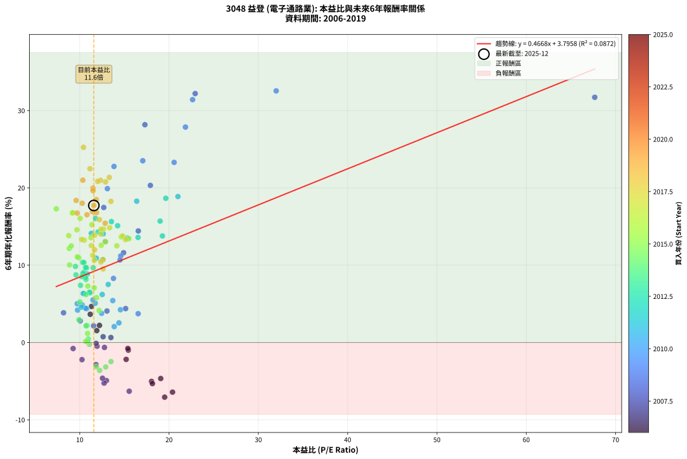
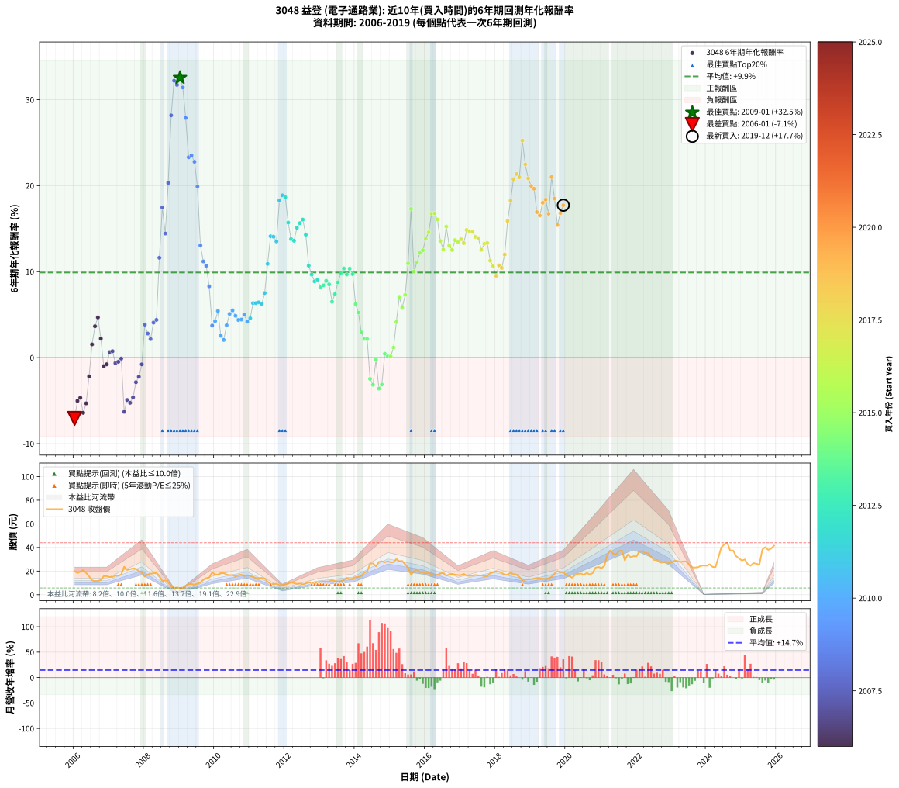

# 3048 益登 - 本益比與未來報酬率分析

!!! info "報告資訊"
    - **股票代號**: 3048
    - **公司名稱**: 益登
    - **產業別**: 電子通路業
    - **分析期間**: 2006-2019 (168 個數據點)
    - **資料來源**: Type 12 (ShowMonthlyK_ChartFlow) 月收盤價與本益比
    - **報酬率口徑**: 含現金股利 (簡化: 年度合計，假設每年7/1入帳)
    - **報告生成時間**: 2026-01-06 18:52:51 CST

## 📈 視覺化圖表

### 圖表1: 本益比 vs 未來報酬率關係

*圖表1：3048 益登 本益比與6年期未來報酬率關係 (2006-2019)*

### 圖表2: 歷年買入時點的6年期實際報酬率

*圖表2：3048 益登 歷年買入時點的6年期實際報酬率 (2006-2019)*

## 📍 買點訊號說明

本報告提供兩種買點提示訊號（顯示於圖表2的股價子圖中）：

### ▲ 小綠色三角形（回測驗證）
- **計算方式**: 使用全部歷史資料計算本益比第25百分位數
- **用途**: 事後驗證，顯示歷史上哪些時點確實為低估區
- **限制**: 當下無法判斷，僅供回測參考
- **特性**: 後見之明（Look-Ahead Bias）

### ▲ 小橘色三角形（即時訊號）
- **計算方式**: 使用截至當月的過去5年資料計算本益比第25百分位數
- **用途**: 實際投資決策，當時即可判斷
- **優勢**: 可操作性強，符合實務需求
- **特性**: 無後見之明，滾動窗口計算

!!! tip "如何使用兩種訊號"
    - **綠色▲** 幫助理解歷史估值機會，驗證策略有效性
    - **橘色▲** 可作為實際買進參考，但仍需搭配基本面分析
    - 兩種訊號重疊時，表示即時判斷與事後驗證一致，信心度較高
    - 僅有綠色▲時，表示當時無法判斷（需要未來資料才能確認）
    - 僅有橘色▲時，表示即時判斷為買點，但事後可能不是最佳時機

## 📊 估值分析摘要

| 指標 | 數值 |
|:---:|:---:|
| **目前本益比** (2019-12) | **11.58 倍** |
| **歷史平均本益比** | 13.08 倍 |
| **估值水準** | 🟡 合理範圍 |
| **預期6年年化報酬率** | **+9.20%** |
| **歷史平均報酬率** | +9.90% |
| **相關係數 (R²)** | 0.0872 |
| **趨勢線斜率** | 0.4668 |

!!! abstract "核心洞察"
    目前本益比接近歷史平均，預期報酬率符合長期趨勢

    根據歷史數據回測，3048 益登 在目前本益比 **11.6倍** 的估值水準下，
    預期未來6年年化報酬率約為 **+9.2%**。

    **重要提醒**: 本分析基於歷史數據統計，實際報酬率會受到公司基本面變化、產業趨勢、
    總體經濟環境等多重因素影響。R² = 0.09 表示本益比可解釋約 8.7% 的報酬率變異。

## 📈 歷史估值統計

### 最佳買點 (最高報酬率)

| 項目 | 數值 |
|:---:|:---:|
| 起始時間 | 2009-01 |
| 當時本益比 | 32.00 倍 |
| 起始價格 | 5.7 元 |
| 6年後價格 | 27.4 元 |
| **6年年化報酬率** | **+32.55%** |

### 最差買點 (最低報酬率)

| 項目 | 數值 |
|:---:|:---:|
| 起始時間 | 2006-01 |
| 當時本益比 | 19.51 倍 |
| 起始價格 | 19.9 元 |
| 6年後價格 | 8.7 元 |
| **6年年化報酬率** | **-7.07%** |

## 🎯 投資啟示

### 本益比與報酬率關係

趨勢線方程式: **y = 0.4668x + 3.7958**

!!! info "弱相關或正相關"
    本益比與未來報酬率相關性較弱。這可能表示該股票的報酬率更多受到
    公司成長性、產業趨勢等因素影響，而非估值水準。**需綜合考量多項指標**。

### 估值區間建議

基於歷史數據分析:

- **🟢 低估區** (P/E < 10.5): 預期報酬率較高，可考慮增加持股
- **🟡 合理區** (P/E 10.5-15.7): 預期報酬率符合長期趨勢，正常持有
- **🔴 高估區** (P/E > 15.7): 預期報酬率較低，可考慮減碼或觀望

!!! danger "風險提示"
    - 過去表現不代表未來結果
    - 本分析假設公司基本面無重大結構性變化
    - 產業環境劇變可能使歷史規律失效
    - 應結合公司財報、產業趨勢、總體經濟等多重因素綜合判斷

!!! success "長期投資觀點"
    歷史數據顯示，在合理或低估的估值水準買入並長期持有，
    往往能獲得較佳的投資報酬。**耐心等待好價格**是價值投資的核心原則。

## 📊 數據品質

- **資料來源**: GoodInfo.tw Type 12 (ShowMonthlyK_ChartFlow)
- **資料頻率**: 月度收盤價與本益比
- **回測期間**: 2006-2019
- **數據點數量**: 168 個 (每個點代表一次6年期回測)

### 計算方法說明

1. **6年期年化報酬率**:
   - 對每個歷史時點，計算其後6年的實際投資報酬率
   - 期末價值(不含股利): 期末價格
   - 期末價值(含現金股利): 期末價格 + 持有期間內的現金股利合計 (簡化: 年度合計，假設每年7/1入帳)
   - 公式: 年化報酬率 = [(期末價值/期初價格)^(1/年數) - 1] × 100%

2. **本益比 (P/E Ratio)**:
   - 使用當時的月收盤價與EPS計算
   - 資料來源: Type 12 月度河流圖本益比數據

3. **趨勢線 (Linear Regression)**:
   - 使用最小平方法擬合線性趨勢線
   - R²值衡量本益比對報酬率的解釋能力

---

*本報告由 Stock Analysis System v1.9.0 自動生成*
*數據更新時間: 2026-01-06 18:52:51 CST*

## 📋 月度回測明細表

（每一列對應時間線圖中的一個買入點；可用來對照 SVG 圖上的每個點。）

| 買入月份 | 賣出月份 | 回測期限_年 | 實際持有年數 | 買入本益比_倍 | 買入收盤價_元 | 賣出收盤價_元 | 現金股利合計_元 | 總報酬率_pct | 年化報酬率_pct |
| --- | --- | --- | --- | --- | --- | --- | --- | --- | --- |
| 2006-01 | 2012-01 | 6 | 5.999 | 19.51 | 19.90 | 8.66 | 4.16 | -35.59 | -7.07 |
| 2006-02 | 2012-02 | 6 | 5.999 | 18.04 | 18.40 | 9.34 | 4.16 | -26.64 | -5.03 |
| 2006-03 | 2012-03 | 6 | 6.001 | 19.07 | 19.45 | 10.45 | 4.16 | -24.89 | -4.66 |
| 2006-04 | 2012-04 | 6 | 6.001 | 20.39 | 20.80 | 9.81 | 4.16 | -32.85 | -6.42 |
| 2006-05 | 2012-05 | 6 | 6.001 | 18.14 | 18.50 | 9.17 | 4.16 | -27.96 | -5.32 |
| 2006-06 | 2012-06 | 6 | 6.001 | 15.20 | 15.50 | 9.42 | 4.16 | -12.40 | -2.18 |
| 2006-07 | 2012-07 | 6 | 6.001 | 11.91 | 12.15 | 8.78 | 4.54 | +9.61 | +1.54 |
| 2006-08 | 2012-08 | 6 | 6.001 | 11.18 | 11.40 | 9.60 | 4.54 | +24.02 | +3.65 |
| 2006-09 | 2012-09 | 6 | 6.001 | 11.32 | 11.55 | 10.65 | 4.54 | +31.50 | +4.67 |
| 2006-10 | 2012-10 | 6 | 6.001 | 12.21 | 12.45 | 9.66 | 4.54 | +14.04 | +2.21 |
| 2006-11 | 2012-11 | 6 | 6.001 | 15.44 | 15.75 | 10.30 | 4.54 | -5.79 | -0.99 |
| 2006-12 | 2012-12 | 6 | 6.001 | 15.39 | 15.70 | 10.45 | 4.54 | -4.54 | -0.77 |
| 2007-01 | 2013-01 | 6 | 6.001 | 13.49 | 14.90 | 10.95 | 4.54 | +3.95 | +0.65 |
| 2007-02 | 2013-02 | 6 | 6.001 | 12.62 | 15.00 | 11.15 | 4.54 | +4.59 | +0.75 |
| 2007-03 | 2013-03 | 6 | 6.001 | 12.77 | 16.25 | 11.10 | 4.54 | -3.77 | -0.64 |
| 2007-04 | 2013-04 | 6 | 6.001 | 11.94 | 16.20 | 11.20 | 4.54 | -2.85 | -0.48 |
| 2007-05 | 2013-05 | 6 | 6.001 | 11.83 | 17.05 | 12.40 | 4.54 | -0.66 | -0.11 |
| 2007-06 | 2013-06 | 6 | 6.001 | 15.54 | 23.70 | 11.50 | 4.54 | -32.33 | -6.30 |
| 2007-07 | 2013-07 | 6 | 6.001 | 12.99 | 20.90 | 11.15 | 4.29 | -26.13 | -4.92 |
| 2007-08 | 2013-08 | 6 | 6.001 | 12.73 | 21.55 | 11.30 | 4.29 | -27.67 | -5.25 |
| 2007-09 | 2013-09 | 6 | 6.001 | 12.55 | 22.30 | 12.50 | 4.29 | -24.72 | -4.62 |
| 2007-10 | 2013-10 | 6 | 6.001 | 11.82 | 22.00 | 14.20 | 4.29 | -15.96 | -2.86 |
| 2007-11 | 2013-11 | 6 | 6.001 | 10.25 | 19.95 | 13.15 | 4.29 | -12.59 | -2.22 |
| 2007-12 | 2013-12 | 6 | 6.001 | 9.26 | 18.80 | 13.65 | 4.29 | -4.59 | -0.78 |
| 2008-01 | 2014-01 | 6 | 6.001 | 8.19 | 15.30 | 14.90 | 4.29 | +25.41 | +3.85 |
| 2008-02 | 2014-03 | 6 | 6.081 | 10.05 | 17.15 | 16.00 | 4.29 | +18.30 | +2.80 |
| 2008-03 | 2014-03 | 6 | 5.999 | 11.55 | 17.85 | 16.00 | 4.29 | +13.66 | +2.16 |
| 2008-04 | 2014-04 | 6 | 5.999 | 13.05 | 18.05 | 18.65 | 4.29 | +27.08 | +4.08 |
| 2008-05 | 2014-05 | 6 | 5.999 | 15.14 | 18.50 | 19.65 | 4.29 | +29.39 | +4.39 |
| 2008-06 | 2014-06 | 6 | 5.999 | 14.91 | 15.80 | 26.25 | 4.29 | +93.28 | +11.61 |
| 2008-07 | 2014-07 | 6 | 5.999 | 12.69 | 11.40 | 26.55 | 3.39 | +162.61 | +17.46 |
| 2008-08 | 2014-08 | 6 | 5.999 | 16.56 | 12.20 | 24.00 | 3.39 | +124.49 | +14.43 |
| 2008-09 | 2014-09 | 6 | 5.999 | 17.91 | 10.30 | 27.85 | 3.39 | +203.28 | +20.32 |
| 2008-10 | 2014-10 | 6 | 5.999 | 17.30 | 7.15 | 28.30 | 3.39 | +343.19 | +28.17 |
| 2008-11 | 2014-11 | 6 | 5.999 | 22.93 | 5.77 | 27.40 | 3.39 | +433.59 | +32.20 |
| 2008-12 | 2014-12 | 6 | 5.999 | 67.67 | 6.09 | 28.40 | 3.39 | +421.97 | +31.71 |
| 2009-01 | 2015-01 | 6 | 5.999 | 32.00 | 5.68 | 27.40 | 3.39 | +442.04 | +32.55 |
| 2009-02 | 2015-02 | 6 | 5.999 | 22.64 | 6.00 | 27.50 | 3.39 | +414.80 | +31.41 |
| 2009-03 | 2015-03 | 6 | 5.999 | 21.84 | 7.70 | 30.25 | 3.39 | +336.86 | +27.86 |
| 2009-04 | 2015-04 | 6 | 5.999 | 20.57 | 9.05 | 28.40 | 3.39 | +251.25 | +23.30 |
| 2009-05 | 2015-05 | 6 | 5.999 | 17.06 | 9.00 | 28.55 | 3.39 | +254.87 | +23.51 |
| 2009-06 | 2015-06 | 6 | 5.999 | 13.84 | 8.51 | 25.75 | 3.39 | +242.40 | +22.77 |
| 2009-07 | 2015-07 | 6 | 5.999 | 13.10 | 9.20 | 22.95 | 4.38 | +197.07 | +19.90 |
| 2009-08 | 2015-08 | 6 | 5.999 | 12.85 | 10.15 | 16.80 | 4.38 | +108.67 | +13.05 |
| 2009-09 | 2015-09 | 6 | 5.999 | 14.59 | 12.80 | 19.80 | 4.38 | +88.91 | +11.19 |
| 2009-10 | 2015-10 | 6 | 5.999 | 14.51 | 14.00 | 21.35 | 4.38 | +83.79 | +10.68 |
| 2009-11 | 2015-11 | 6 | 5.999 | 13.78 | 14.50 | 19.00 | 4.38 | +61.24 | +8.29 |
| 2009-12 | 2015-12 | 6 | 5.999 | 16.54 | 18.85 | 19.10 | 4.38 | +24.56 | +3.73 |
| 2010-01 | 2016-01 | 6 | 5.999 | 14.56 | 17.25 | 17.75 | 4.38 | +28.29 | +4.24 |
| 2010-02 | 2016-02 | 6 | 5.999 | 13.70 | 16.85 | 18.75 | 4.38 | +37.27 | +5.42 |
| 2010-03 | 2016-03 | 6 | 6.001 | 14.39 | 18.35 | 16.95 | 4.38 | +16.24 | +2.54 |
| 2010-04 | 2016-04 | 6 | 6.001 | 13.86 | 18.30 | 16.30 | 4.38 | +13.01 | +2.06 |
| 2010-05 | 2016-05 | 6 | 6.001 | 12.45 | 17.00 | 16.85 | 4.38 | +24.88 | +3.77 |
| 2010-06 | 2016-06 | 6 | 6.001 | 11.74 | 16.55 | 17.90 | 4.38 | +34.62 | +5.08 |
| 2010-07 | 2016-07 | 6 | 6.001 | 11.48 | 16.70 | 18.65 | 4.38 | +37.90 | +5.50 |
| 2010-08 | 2016-08 | 6 | 6.001 | 10.27 | 15.40 | 16.10 | 4.38 | +32.99 | +4.86 |
| 2010-09 | 2016-09 | 6 | 6.001 | 10.78 | 16.65 | 17.15 | 4.38 | +29.31 | +4.38 |
| 2010-10 | 2016-10 | 6 | 6.001 | 10.66 | 16.95 | 17.60 | 4.38 | +29.68 | +4.43 |
| 2010-11 | 2016-11 | 6 | 6.001 | 9.72 | 15.90 | 16.95 | 4.38 | +34.15 | +5.02 |
| 2010-12 | 2016-12 | 6 | 6.001 | 9.76 | 16.40 | 16.60 | 4.38 | +27.93 | +4.19 |
| 2011-01 | 2017-01 | 6 | 6.001 | 10.17 | 16.00 | 16.55 | 4.38 | +30.81 | +4.58 |
| 2011-02 | 2017-02 | 6 | 6.001 | 10.38 | 15.20 | 17.60 | 4.38 | +44.61 | +6.34 |
| 2011-03 | 2017-03 | 6 | 6.001 | 10.46 | 14.20 | 16.15 | 4.38 | +44.58 | +6.34 |
| 2011-04 | 2017-04 | 6 | 6.001 | 11.16 | 13.95 | 15.90 | 4.38 | +45.38 | +6.43 |
| 2011-05 | 2017-05 | 6 | 6.001 | 12.52 | 14.30 | 16.15 | 4.38 | +43.57 | +6.21 |
| 2011-06 | 2017-06 | 6 | 6.001 | 13.19 | 13.65 | 16.70 | 4.38 | +54.43 | +7.51 |
| 2011-07 | 2017-07 | 6 | 6.001 | 11.86 | 11.00 | 16.30 | 4.17 | +86.11 | +10.90 |
| 2011-08 | 2017-08 | 6 | 6.001 | 11.30 | 9.27 | 16.30 | 4.17 | +120.84 | +14.11 |
| 2011-09 | 2017-09 | 6 | 6.001 | 12.63 | 9.00 | 15.65 | 4.17 | +120.24 | +14.06 |
| 2011-10 | 2017-10 | 6 | 6.001 | 15.36 | 9.29 | 15.70 | 4.17 | +113.91 | +13.51 |
| 2011-11 | 2017-11 | 6 | 6.001 | 16.38 | 8.15 | 18.15 | 4.17 | +173.89 | +18.28 |
| 2011-12 | 2017-12 | 6 | 6.001 | 21.00 | 8.19 | 18.95 | 4.17 | +182.32 | +18.88 |
| 2012-01 | 2018-01 | 6 | 6.001 | 19.64 | 8.66 | 20.00 | 4.17 | +179.12 | +18.65 |
| 2012-02 | 2018-03 | 6 | 6.081 | 19.00 | 9.34 | 18.50 | 4.17 | +142.74 | +15.70 |
| 2012-03 | 2018-03 | 6 | 5.999 | 19.26 | 10.45 | 18.50 | 4.17 | +116.96 | +13.78 |
| 2012-04 | 2018-04 | 6 | 5.999 | 16.53 | 9.81 | 16.90 | 4.17 | +114.80 | +13.59 |
| 2012-05 | 2018-05 | 6 | 5.999 | 14.24 | 9.17 | 17.15 | 4.17 | +132.52 | +15.10 |
| 2012-06 | 2018-06 | 6 | 5.999 | 13.55 | 9.42 | 18.35 | 4.17 | +139.09 | +15.64 |
| 2012-07 | 2018-07 | 6 | 5.999 | 11.77 | 8.78 | 16.95 | 4.49 | +144.21 | +16.05 |
| 2012-08 | 2018-08 | 6 | 5.999 | 12.05 | 9.60 | 16.90 | 4.49 | +122.83 | +14.29 |
| 2012-09 | 2018-09 | 6 | 5.999 | 12.57 | 10.65 | 15.10 | 4.49 | +83.96 | +10.70 |
| 2012-10 | 2018-10 | 6 | 5.999 | 10.75 | 9.66 | 12.30 | 4.49 | +73.83 | +9.66 |
| 2012-11 | 2018-11 | 6 | 5.999 | 10.85 | 10.30 | 12.65 | 4.49 | +66.43 | +8.86 |
| 2012-12 | 2018-12 | 6 | 5.999 | 10.45 | 10.45 | 13.10 | 4.49 | +68.34 | +9.07 |
| 2013-01 | 2019-01 | 6 | 5.999 | 10.70 | 10.95 | 13.05 | 4.49 | +60.20 | +8.17 |
| 2013-02 | 2019-02 | 6 | 5.999 | 10.65 | 11.15 | 13.60 | 4.49 | +62.26 | +8.40 |
| 2013-03 | 2019-03 | 6 | 5.999 | 10.37 | 11.10 | 14.05 | 4.49 | +67.05 | +8.93 |
| 2013-04 | 2019-04 | 6 | 5.999 | 10.24 | 11.20 | 13.80 | 4.49 | +63.32 | +8.52 |
| 2013-05 | 2019-05 | 6 | 5.999 | 11.10 | 12.40 | 13.60 | 4.49 | +45.90 | +6.50 |
| 2013-06 | 2019-06 | 6 | 5.999 | 10.09 | 11.50 | 13.15 | 4.49 | +53.41 | +7.39 |
| 2013-07 | 2019-07 | 6 | 5.999 | 9.58 | 11.15 | 13.75 | 4.69 | +65.40 | +8.75 |
| 2013-08 | 2019-08 | 6 | 5.999 | 9.52 | 11.30 | 15.15 | 4.69 | +75.59 | +9.84 |
| 2013-09 | 2019-09 | 6 | 5.999 | 10.33 | 12.50 | 17.90 | 4.69 | +80.74 | +10.37 |
| 2013-10 | 2019-10 | 6 | 5.999 | 11.51 | 14.20 | 20.00 | 4.69 | +73.89 | +9.66 |
| 2013-11 | 2019-11 | 6 | 5.999 | 10.46 | 13.15 | 19.05 | 4.69 | +80.55 | +10.35 |
| 2013-12 | 2019-12 | 6 | 5.999 | 10.66 | 13.65 | 19.10 | 4.69 | +74.30 | +9.70 |
| 2014-01 | 2020-01 | 6 | 5.999 | 10.71 | 14.90 | 16.70 | 4.69 | +43.57 | +6.21 |
| 2014-02 | 2020-02 | 6 | 5.999 | 10.02 | 15.05 | 15.75 | 4.69 | +35.83 | +5.24 |
| 2014-03 | 2020-03 | 6 | 6.001 | 9.92 | 16.00 | 14.35 | 4.69 | +19.01 | +2.94 |
| 2014-04 | 2020-04 | 6 | 6.001 | 10.82 | 18.65 | 16.55 | 4.69 | +13.90 | +2.19 |
| 2014-05 | 2020-05 | 6 | 6.001 | 10.71 | 19.65 | 17.65 | 4.69 | +13.70 | +2.16 |
| 2014-06 | 2020-06 | 6 | 6.001 | 13.50 | 26.25 | 17.90 | 4.69 | -13.94 | -2.47 |
| 2014-07 | 2020-07 | 6 | 6.001 | 12.91 | 26.55 | 16.70 | 5.19 | -17.54 | -3.16 |
| 2014-08 | 2020-08 | 6 | 6.001 | 11.08 | 24.00 | 18.45 | 5.19 | -1.49 | -0.25 |
| 2014-09 | 2020-09 | 6 | 6.001 | 12.23 | 27.85 | 17.15 | 5.19 | -19.78 | -3.61 |
| 2014-10 | 2020-10 | 6 | 6.001 | 11.85 | 28.30 | 18.20 | 5.19 | -17.34 | -3.12 |
| 2014-11 | 2020-11 | 6 | 6.001 | 10.96 | 27.40 | 22.95 | 5.19 | +2.71 | +0.45 |
| 2014-12 | 2020-12 | 6 | 6.001 | 10.88 | 28.40 | 23.45 | 5.19 | +0.85 | +0.14 |
| 2015-01 | 2021-01 | 6 | 6.001 | 10.67 | 27.40 | 22.45 | 5.19 | +0.88 | +0.15 |
| 2015-02 | 2021-02 | 6 | 6.001 | 10.88 | 27.50 | 24.30 | 5.19 | +7.24 | +1.17 |
| 2015-03 | 2021-03 | 6 | 6.001 | 12.17 | 30.25 | 33.40 | 5.19 | +27.58 | +4.14 |
| 2015-04 | 2021-04 | 6 | 6.001 | 11.62 | 28.40 | 37.60 | 5.19 | +50.68 | +7.07 |
| 2015-05 | 2021-05 | 6 | 6.001 | 11.89 | 28.55 | 34.85 | 5.19 | +40.25 | +5.80 |
| 2015-06 | 2021-06 | 6 | 6.001 | 10.91 | 25.75 | 34.10 | 5.19 | +52.59 | +7.30 |
| 2015-07 | 2021-07 | 6 | 6.001 | 9.90 | 22.95 | 36.75 | 6.10 | +86.71 | +10.96 |
| 2015-08 | 2021-08 | 6 | 6.001 | 7.38 | 16.80 | 37.65 | 6.10 | +160.42 | +17.29 |
| 2015-09 | 2021-09 | 6 | 6.001 | 8.86 | 19.80 | 29.05 | 6.10 | +77.53 | +10.04 |
| 2015-10 | 2021-10 | 6 | 6.001 | 9.73 | 21.35 | 34.00 | 6.10 | +87.82 | +11.07 |
| 2015-11 | 2021-11 | 6 | 6.001 | 8.83 | 19.00 | 31.75 | 6.10 | +99.21 | +12.17 |
| 2015-12 | 2021-12 | 6 | 6.001 | 9.05 | 19.10 | 32.60 | 6.10 | +102.62 | +12.49 |
| 2016-01 | 2022-01 | 6 | 6.001 | 8.77 | 17.75 | 32.50 | 6.10 | +117.46 | +13.82 |
| 2016-02 | 2022-03 | 6 | 6.081 | 9.68 | 18.75 | 36.80 | 6.10 | +128.80 | +14.58 |
| 2016-03 | 2022-03 | 6 | 5.999 | 9.16 | 16.95 | 36.80 | 6.10 | +153.10 | +16.74 |
| 2016-04 | 2022-04 | 6 | 5.999 | 9.24 | 16.30 | 35.25 | 6.10 | +153.68 | +16.79 |
| 2016-05 | 2022-05 | 6 | 5.999 | 10.05 | 16.85 | 35.05 | 6.10 | +144.21 | +16.05 |
| 2016-06 | 2022-06 | 6 | 5.999 | 11.26 | 17.90 | 32.30 | 6.10 | +114.53 | +13.57 |
| 2016-07 | 2022-07 | 6 | 5.999 | 12.41 | 18.65 | 29.45 | 8.50 | +103.49 | +12.57 |
| 2016-08 | 2022-08 | 6 | 5.999 | 11.36 | 16.10 | 29.20 | 8.50 | +134.16 | +15.24 |
| 2016-09 | 2022-09 | 6 | 5.999 | 12.89 | 17.15 | 27.25 | 8.50 | +108.45 | +13.03 |
| 2016-10 | 2022-10 | 6 | 5.999 | 14.16 | 17.60 | 27.20 | 8.50 | +102.84 | +12.51 |
| 2016-11 | 2022-11 | 6 | 5.999 | 14.65 | 16.95 | 28.05 | 8.50 | +115.63 | +13.67 |
| 2016-12 | 2022-12 | 6 | 5.999 | 15.51 | 16.60 | 26.85 | 8.50 | +112.95 | +13.43 |
| 2017-01 | 2023-01 | 6 | 5.999 | 14.82 | 16.55 | 27.40 | 8.50 | +116.92 | +13.78 |
| 2017-02 | 2023-02 | 6 | 5.999 | 15.13 | 17.60 | 28.75 | 8.50 | +111.65 | +13.31 |
| 2017-03 | 2023-03 | 6 | 5.999 | 13.35 | 16.15 | 28.55 | 8.50 | +129.41 | +14.85 |
| 2017-04 | 2023-04 | 6 | 5.999 | 12.65 | 15.90 | 27.65 | 8.50 | +127.36 | +14.67 |
| 2017-05 | 2023-05 | 6 | 5.999 | 12.39 | 16.15 | 28.15 | 8.50 | +126.93 | +14.64 |
| 2017-06 | 2023-06 | 6 | 5.999 | 12.37 | 16.70 | 28.20 | 8.50 | +119.76 | +14.03 |
| 2017-07 | 2023-07 | 6 | 5.999 | 11.67 | 16.30 | 25.55 | 10.00 | +118.10 | +13.88 |
| 2017-08 | 2023-08 | 6 | 5.999 | 11.29 | 16.30 | 23.10 | 10.00 | +103.07 | +12.53 |
| 2017-09 | 2023-09 | 6 | 5.999 | 10.50 | 15.65 | 23.00 | 10.00 | +110.86 | +13.24 |
| 2017-10 | 2023-10 | 6 | 5.999 | 10.22 | 15.70 | 23.25 | 10.00 | +111.78 | +13.33 |
| 2017-11 | 2023-11 | 6 | 5.999 | 11.46 | 18.15 | 24.45 | 10.00 | +89.81 | +11.27 |
| 2017-12 | 2023-12 | 6 | 5.999 | 11.63 | 18.95 | 24.75 | 10.00 | +83.38 | +10.64 |
| 2018-01 | 2024-01 | 6 | 5.999 | 12.62 | 20.00 | 24.50 | 10.00 | +72.50 | +9.52 |
| 2018-02 | 2024-02 | 6 | 5.999 | 12.60 | 19.40 | 25.75 | 10.00 | +84.28 | +10.73 |
| 2018-03 | 2024-03 | 6 | 6.001 | 12.37 | 18.50 | 23.55 | 10.00 | +81.35 | +10.43 |
| 2018-04 | 2024-04 | 6 | 6.001 | 11.66 | 16.90 | 23.35 | 10.00 | +97.34 | +11.99 |
| 2018-05 | 2024-05 | 6 | 6.001 | 12.21 | 17.15 | 31.55 | 10.00 | +142.27 | +15.89 |
| 2018-06 | 2024-06 | 6 | 6.001 | 13.49 | 18.35 | 40.20 | 10.00 | +173.57 | +18.26 |
| 2018-07 | 2024-07 | 6 | 6.001 | 12.89 | 16.95 | 42.60 | 10.00 | +210.32 | +20.77 |
| 2018-08 | 2024-08 | 6 | 6.001 | 13.31 | 16.90 | 44.00 | 10.00 | +219.53 | +21.36 |
| 2018-09 | 2024-09 | 6 | 6.001 | 12.33 | 15.10 | 37.35 | 10.00 | +213.58 | +20.98 |
| 2018-10 | 2024-10 | 6 | 6.001 | 10.42 | 12.30 | 37.50 | 10.00 | +286.18 | +25.25 |
| 2018-11 | 2024-11 | 6 | 6.001 | 11.15 | 12.65 | 32.70 | 10.00 | +237.55 | +22.47 |
| 2018-12 | 2024-12 | 6 | 6.001 | 12.02 | 13.10 | 30.80 | 10.00 | +211.45 | +20.84 |
| 2019-01 | 2025-01 | 6 | 6.001 | 11.48 | 13.05 | 28.90 | 10.00 | +198.08 | +19.96 |
| 2019-02 | 2025-02 | 6 | 6.001 | 11.49 | 13.60 | 29.90 | 10.00 | +193.38 | +19.64 |
| 2019-03 | 2025-03 | 6 | 6.001 | 11.42 | 14.05 | 25.90 | 10.00 | +155.52 | +16.92 |
| 2019-04 | 2025-04 | 6 | 6.001 | 10.81 | 13.80 | 24.55 | 10.00 | +150.36 | +16.52 |
| 2019-05 | 2025-05 | 6 | 6.001 | 10.28 | 13.60 | 26.75 | 10.00 | +170.22 | +18.01 |
| 2019-06 | 2025-06 | 6 | 6.001 | 9.60 | 13.15 | 26.20 | 10.00 | +175.29 | +18.38 |
| 2019-07 | 2025-07 | 6 | 6.001 | 9.71 | 13.75 | 25.50 | 9.30 | +153.09 | +16.73 |
| 2019-08 | 2025-08 | 6 | 6.001 | 10.35 | 15.15 | 38.25 | 9.30 | +213.86 | +21.00 |
| 2019-09 | 2025-09 | 6 | 6.001 | 11.85 | 17.90 | 40.25 | 9.30 | +176.82 | +18.49 |
| 2019-10 | 2025-10 | 6 | 6.001 | 12.85 | 20.00 | 38.00 | 9.30 | +136.50 | +15.42 |
| 2019-11 | 2025-11 | 6 | 6.001 | 11.88 | 19.05 | 39.10 | 9.30 | +154.07 | +16.81 |
| 2019-12 | 2025-12 | 6 | 6.001 | 11.58 | 19.10 | 41.55 | 9.30 | +166.23 | +17.72 |
