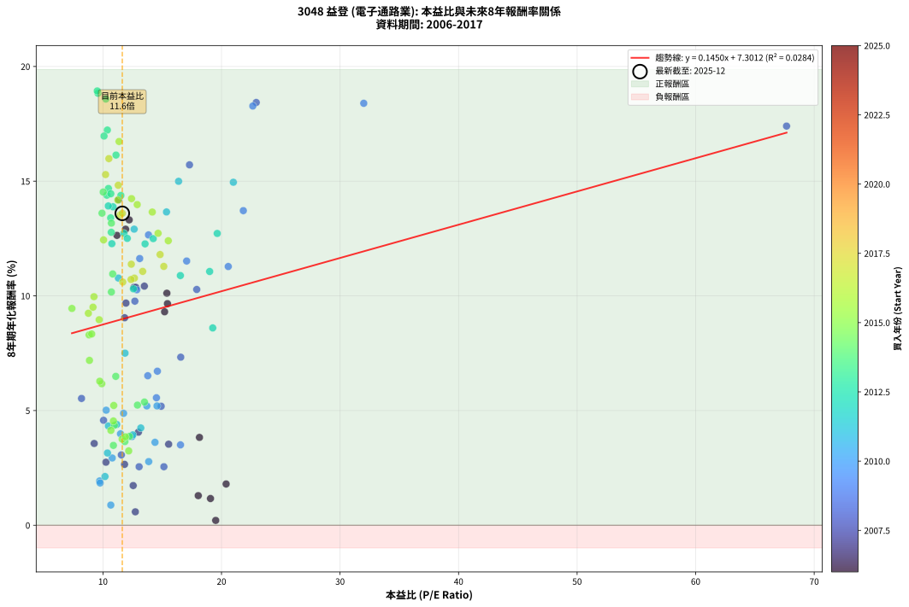
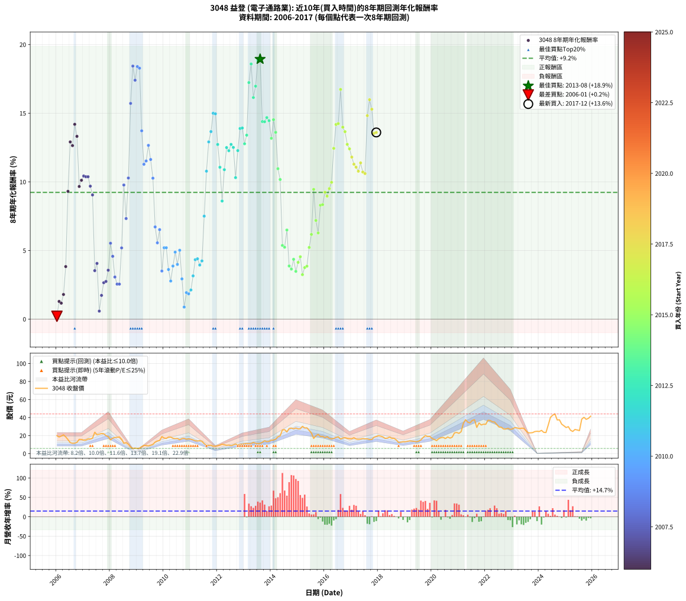

# 3048 益登 - 本益比與未來報酬率分析

!!! info "報告資訊"
    - **股票代號**: 3048
    - **公司名稱**: 益登
    - **產業別**: 電子通路業
    - **分析期間**: 2006-2017 (144 個數據點)
    - **資料來源**: Type 12 (ShowMonthlyK_ChartFlow) 月收盤價與本益比
    - **報酬率口徑**: 含現金股利 (簡化: 年度合計，假設每年7/1入帳)
    - **報告生成時間**: 2026-01-05 00:53:15 CST

## 📈 視覺化圖表

### 圖表1: 本益比 vs 未來報酬率關係

*圖表1：3048 益登 本益比與8年期未來報酬率關係 (2006-2017)*

### 圖表2: 歷年買入時點的8年期實際報酬率

*圖表2：3048 益登 歷年買入時點的8年期實際報酬率 (2006-2017)*

## 📍 買點訊號說明

本報告提供兩種買點提示訊號（顯示於圖表2的股價子圖中）：

### ▲ 小綠色三角形（回測驗證）
- **計算方式**: 使用全部歷史資料計算本益比第25百分位數
- **用途**: 事後驗證，顯示歷史上哪些時點確實為低估區
- **限制**: 當下無法判斷，僅供回測參考
- **特性**: 後見之明（Look-Ahead Bias）

### ▲ 小橘色三角形（即時訊號）
- **計算方式**: 使用截至當月的過去5年資料計算本益比第25百分位數
- **用途**: 實際投資決策，當時即可判斷
- **優勢**: 可操作性強，符合實務需求
- **特性**: 無後見之明，滾動窗口計算

!!! tip "如何使用兩種訊號"
    - **綠色▲** 幫助理解歷史估值機會，驗證策略有效性
    - **橘色▲** 可作為實際買進參考，但仍需搭配基本面分析
    - 兩種訊號重疊時，表示即時判斷與事後驗證一致，信心度較高
    - 僅有綠色▲時，表示當時無法判斷（需要未來資料才能確認）
    - 僅有橘色▲時，表示即時判斷為買點，但事後可能不是最佳時機

## 📊 估值分析摘要

| 指標 | 數值 |
|:---:|:---:|
| **目前本益比** (2017-12) | **11.63 倍** |
| **歷史平均本益比** | 13.31 倍 |
| **估值水準** | 🟡 合理範圍 |
| **預期8年年化報酬率** | **+8.99%** |
| **歷史平均報酬率** | +9.23% |
| **相關係數 (R²)** | 0.0284 |
| **趨勢線斜率** | 0.1450 |

!!! abstract "核心洞察"
    目前本益比接近歷史平均，預期報酬率符合長期趨勢

    根據歷史數據回測，3048 益登 在目前本益比 **11.6倍** 的估值水準下，
    預期未來8年年化報酬率約為 **+9.0%**。

    **重要提醒**: 本分析基於歷史數據統計，實際報酬率會受到公司基本面變化、產業趨勢、
    總體經濟環境等多重因素影響。R² = 0.03 表示本益比可解釋約 2.8% 的報酬率變異。

## 📈 歷史估值統計

### 最佳買點 (最高報酬率)

| 項目 | 數值 |
|:---:|:---:|
| 起始時間 | 2013-08 |
| 當時本益比 | 9.52 倍 |
| 起始價格 | 11.3 元 |
| 8年後價格 | 37.6 元 |
| **8年年化報酬率** | **+18.93%** |

### 最差買點 (最低報酬率)

| 項目 | 數值 |
|:---:|:---:|
| 起始時間 | 2006-01 |
| 當時本益比 | 19.51 倍 |
| 起始價格 | 19.9 元 |
| 8年後價格 | 14.9 元 |
| **8年年化報酬率** | **+0.21%** |

## 🎯 投資啟示

### 本益比與報酬率關係

趨勢線方程式: **y = 0.1450x + 7.3012**

!!! info "弱相關或正相關"
    本益比與未來報酬率相關性較弱。這可能表示該股票的報酬率更多受到
    公司成長性、產業趨勢等因素影響，而非估值水準。**需綜合考量多項指標**。

### 估值區間建議

基於歷史數據分析:

- **🟢 低估區** (P/E < 10.6): 預期報酬率較高，可考慮增加持股
- **🟡 合理區** (P/E 10.6-16.0): 預期報酬率符合長期趨勢，正常持有
- **🔴 高估區** (P/E > 16.0): 預期報酬率較低，可考慮減碼或觀望

!!! danger "風險提示"
    - 過去表現不代表未來結果
    - 本分析假設公司基本面無重大結構性變化
    - 產業環境劇變可能使歷史規律失效
    - 應結合公司財報、產業趨勢、總體經濟等多重因素綜合判斷

!!! success "長期投資觀點"
    歷史數據顯示，在合理或低估的估值水準買入並長期持有，
    往往能獲得較佳的投資報酬。**耐心等待好價格**是價值投資的核心原則。

## 📊 數據品質

- **資料來源**: GoodInfo.tw Type 12 (ShowMonthlyK_ChartFlow)
- **資料頻率**: 月度收盤價與本益比
- **回測期間**: 2006-2017
- **數據點數量**: 144 個 (每個點代表一次8年期回測)

### 計算方法說明

1. **8年期年化報酬率**:
   - 對每個歷史時點，計算其後8年的實際投資報酬率
   - 期末價值(不含股利): 期末價格
   - 期末價值(含現金股利): 期末價格 + 持有期間內的現金股利合計 (簡化: 年度合計，假設每年7/1入帳)
   - 公式: 年化報酬率 = [(期末價值/期初價格)^(1/年數) - 1] × 100%

2. **本益比 (P/E Ratio)**:
   - 使用當時的月收盤價與EPS計算
   - 資料來源: Type 12 月度河流圖本益比數據

3. **趨勢線 (Linear Regression)**:
   - 使用最小平方法擬合線性趨勢線
   - R²值衡量本益比對報酬率的解釋能力

---

*本報告由 Stock Analysis System v1.9.0 自動生成*
*數據更新時間: 2026-01-05 00:53:15 CST*

## 📋 月度回測明細表

（每一列對應時間線圖中的一個買入點；可用來對照 SVG 圖上的每個點。）

| 買入月份 | 賣出月份 | 回測期限_年 | 實際持有年數 | 買入本益比_倍 | 買入收盤價_元 | 賣出收盤價_元 | 現金股利合計_元 | 總報酬率_pct | 年化報酬率_pct |
| --- | --- | --- | --- | --- | --- | --- | --- | --- | --- |
| 2006-01 | 2014-01 | 8 | 8.000 | 19.51 | 19.90 | 14.90 | 5.34 | +1.70 | +0.21 |
| 2006-02 | 2014-02 | 8 | 8.000 | 18.04 | 18.40 | 15.05 | 5.34 | +10.80 | +1.29 |
| 2006-03 | 2014-03 | 8 | 8.000 | 19.07 | 19.45 | 16.00 | 5.34 | +9.71 | +1.16 |
| 2006-04 | 2014-04 | 8 | 8.000 | 20.39 | 20.80 | 18.65 | 5.34 | +15.33 | +1.80 |
| 2006-05 | 2014-05 | 8 | 8.000 | 18.14 | 18.50 | 19.65 | 5.34 | +35.07 | +3.83 |
| 2006-06 | 2014-06 | 8 | 8.000 | 15.20 | 15.50 | 26.25 | 5.34 | +103.79 | +9.31 |
| 2006-07 | 2014-07 | 8 | 8.000 | 11.91 | 12.15 | 26.55 | 5.54 | +164.10 | +12.91 |
| 2006-08 | 2014-08 | 8 | 8.000 | 11.18 | 11.40 | 24.00 | 5.54 | +159.11 | +12.64 |
| 2006-09 | 2014-09 | 8 | 8.000 | 11.32 | 11.55 | 27.85 | 5.54 | +189.07 | +14.19 |
| 2006-10 | 2014-10 | 8 | 8.000 | 12.21 | 12.45 | 28.30 | 5.54 | +171.79 | +13.31 |
| 2006-11 | 2014-11 | 8 | 8.000 | 15.44 | 15.75 | 27.40 | 5.54 | +109.13 | +9.66 |
| 2006-12 | 2014-12 | 8 | 8.000 | 15.39 | 15.70 | 28.40 | 5.54 | +116.17 | +10.12 |
| 2007-01 | 2015-01 | 8 | 8.000 | 13.49 | 14.90 | 27.40 | 5.54 | +121.06 | +10.42 |
| 2007-02 | 2015-02 | 8 | 8.000 | 12.62 | 15.00 | 27.50 | 5.54 | +120.25 | +10.37 |
| 2007-03 | 2015-03 | 8 | 8.000 | 12.77 | 16.25 | 30.25 | 5.54 | +120.23 | +10.37 |
| 2007-04 | 2015-04 | 8 | 8.000 | 11.94 | 16.20 | 28.40 | 5.54 | +109.49 | +9.68 |
| 2007-05 | 2015-05 | 8 | 8.000 | 11.83 | 17.05 | 28.55 | 5.54 | +99.93 | +9.05 |
| 2007-06 | 2015-06 | 8 | 8.000 | 15.54 | 23.70 | 25.75 | 5.54 | +32.02 | +3.53 |
| 2007-07 | 2015-07 | 8 | 8.000 | 12.99 | 20.90 | 22.95 | 5.78 | +37.46 | +4.06 |
| 2007-08 | 2015-08 | 8 | 8.000 | 12.73 | 21.55 | 16.80 | 5.78 | +4.78 | +0.59 |
| 2007-09 | 2015-09 | 8 | 8.000 | 12.55 | 22.30 | 19.80 | 5.78 | +14.71 | +1.73 |
| 2007-10 | 2015-10 | 8 | 8.000 | 11.82 | 22.00 | 21.35 | 5.78 | +23.32 | +2.65 |
| 2007-11 | 2015-11 | 8 | 8.000 | 10.25 | 19.95 | 19.00 | 5.78 | +24.21 | +2.75 |
| 2007-12 | 2015-12 | 8 | 8.000 | 9.26 | 18.80 | 19.10 | 5.78 | +32.34 | +3.56 |
| 2008-01 | 2016-01 | 8 | 8.000 | 8.19 | 15.30 | 17.75 | 5.78 | +53.79 | +5.53 |
| 2008-02 | 2016-02 | 8 | 8.000 | 10.05 | 17.15 | 18.75 | 5.78 | +43.03 | +4.58 |
| 2008-03 | 2016-03 | 8 | 8.000 | 11.55 | 17.85 | 16.95 | 5.78 | +27.34 | +3.07 |
| 2008-04 | 2016-04 | 8 | 8.000 | 13.05 | 18.05 | 16.30 | 5.78 | +22.33 | +2.55 |
| 2008-05 | 2016-05 | 8 | 8.000 | 15.14 | 18.50 | 16.85 | 5.78 | +22.32 | +2.55 |
| 2008-06 | 2016-06 | 8 | 8.000 | 14.91 | 15.80 | 17.90 | 5.78 | +49.87 | +5.19 |
| 2008-07 | 2016-07 | 8 | 8.000 | 12.69 | 11.40 | 18.65 | 5.38 | +110.79 | +9.77 |
| 2008-08 | 2016-08 | 8 | 8.000 | 16.56 | 12.20 | 16.10 | 5.38 | +76.07 | +7.33 |
| 2008-09 | 2016-09 | 8 | 8.000 | 17.91 | 10.30 | 17.15 | 5.38 | +118.74 | +10.28 |
| 2008-10 | 2016-10 | 8 | 8.000 | 17.30 | 7.15 | 17.60 | 5.38 | +221.40 | +15.71 |
| 2008-11 | 2016-11 | 8 | 8.000 | 22.93 | 5.77 | 16.95 | 5.38 | +287.00 | +18.43 |
| 2008-12 | 2016-12 | 8 | 8.000 | 67.67 | 6.09 | 16.60 | 5.38 | +260.92 | +17.40 |
| 2009-01 | 2017-01 | 8 | 8.000 | 32.00 | 5.68 | 16.55 | 5.38 | +286.09 | +18.40 |
| 2009-02 | 2017-02 | 8 | 8.000 | 22.64 | 6.00 | 17.60 | 5.38 | +283.00 | +18.28 |
| 2009-03 | 2017-03 | 8 | 8.000 | 21.84 | 7.70 | 16.15 | 5.38 | +179.61 | +13.72 |
| 2009-04 | 2017-04 | 8 | 8.000 | 20.57 | 9.05 | 15.90 | 5.38 | +135.14 | +11.28 |
| 2009-05 | 2017-05 | 8 | 8.000 | 17.06 | 9.00 | 16.15 | 5.38 | +139.22 | +11.52 |
| 2009-06 | 2017-06 | 8 | 8.000 | 13.84 | 8.51 | 16.70 | 5.38 | +159.46 | +12.66 |
| 2009-07 | 2017-07 | 8 | 8.000 | 13.10 | 9.20 | 16.30 | 5.88 | +141.09 | +11.63 |
| 2009-08 | 2017-08 | 8 | 8.000 | 12.85 | 10.15 | 16.30 | 5.88 | +118.52 | +10.26 |
| 2009-09 | 2017-09 | 8 | 8.000 | 14.59 | 12.80 | 15.65 | 5.88 | +68.20 | +6.72 |
| 2009-10 | 2017-10 | 8 | 8.000 | 14.51 | 14.00 | 15.70 | 5.88 | +54.14 | +5.56 |
| 2009-11 | 2017-11 | 8 | 8.000 | 13.78 | 14.50 | 18.15 | 5.88 | +65.72 | +6.52 |
| 2009-12 | 2017-12 | 8 | 8.000 | 16.54 | 18.85 | 18.95 | 5.88 | +31.72 | +3.50 |
| 2010-01 | 2018-01 | 8 | 8.000 | 14.56 | 17.25 | 20.00 | 5.88 | +50.03 | +5.20 |
| 2010-02 | 2018-02 | 8 | 8.000 | 13.70 | 16.85 | 19.40 | 5.88 | +50.03 | +5.20 |
| 2010-03 | 2018-03 | 8 | 8.000 | 14.39 | 18.35 | 18.50 | 5.88 | +32.86 | +3.62 |
| 2010-04 | 2018-04 | 8 | 8.000 | 13.86 | 18.30 | 16.90 | 5.88 | +24.48 | +2.78 |
| 2010-05 | 2018-05 | 8 | 8.000 | 12.45 | 17.00 | 17.15 | 5.88 | +35.47 | +3.87 |
| 2010-06 | 2018-06 | 8 | 8.000 | 11.74 | 16.55 | 18.35 | 5.88 | +46.40 | +4.88 |
| 2010-07 | 2018-07 | 8 | 8.000 | 11.48 | 16.70 | 16.95 | 5.88 | +36.71 | +3.99 |
| 2010-08 | 2018-08 | 8 | 8.000 | 10.27 | 15.40 | 16.90 | 5.88 | +47.92 | +5.02 |
| 2010-09 | 2018-09 | 8 | 8.000 | 10.78 | 16.65 | 15.10 | 5.88 | +26.01 | +2.93 |
| 2010-10 | 2018-10 | 8 | 8.000 | 10.66 | 16.95 | 12.30 | 5.88 | +7.26 | +0.88 |
| 2010-11 | 2018-11 | 8 | 8.000 | 9.72 | 15.90 | 12.65 | 5.88 | +16.54 | +1.93 |
| 2010-12 | 2018-12 | 8 | 8.000 | 9.76 | 16.40 | 13.10 | 5.88 | +15.73 | +1.84 |
| 2011-01 | 2019-01 | 8 | 8.000 | 10.17 | 16.00 | 13.05 | 5.88 | +18.31 | +2.12 |
| 2011-02 | 2019-02 | 8 | 8.000 | 10.38 | 15.20 | 13.60 | 5.88 | +28.16 | +3.15 |
| 2011-03 | 2019-03 | 8 | 8.000 | 10.46 | 14.20 | 14.05 | 5.88 | +40.35 | +4.33 |
| 2011-04 | 2019-04 | 8 | 8.000 | 11.16 | 13.95 | 13.80 | 5.88 | +41.08 | +4.40 |
| 2011-05 | 2019-05 | 8 | 8.000 | 12.52 | 14.30 | 13.60 | 5.88 | +36.22 | +3.94 |
| 2011-06 | 2019-06 | 8 | 8.000 | 13.19 | 13.65 | 13.15 | 5.88 | +39.41 | +4.24 |
| 2011-07 | 2019-07 | 8 | 8.000 | 11.86 | 11.00 | 13.75 | 5.87 | +78.38 | +7.50 |
| 2011-08 | 2019-08 | 8 | 8.000 | 11.30 | 9.27 | 15.15 | 5.87 | +126.77 | +10.78 |
| 2011-09 | 2019-09 | 8 | 8.000 | 12.63 | 9.00 | 17.90 | 5.87 | +164.13 | +12.91 |
| 2011-10 | 2019-10 | 8 | 8.000 | 15.36 | 9.29 | 20.00 | 5.87 | +178.49 | +13.66 |
| 2011-11 | 2019-11 | 8 | 8.000 | 16.38 | 8.15 | 19.05 | 5.87 | +205.79 | +14.99 |
| 2011-12 | 2019-12 | 8 | 8.000 | 21.00 | 8.19 | 19.10 | 5.87 | +204.91 | +14.95 |
| 2012-01 | 2020-01 | 8 | 8.000 | 19.64 | 8.66 | 16.70 | 5.87 | +160.65 | +12.72 |
| 2012-02 | 2020-02 | 8 | 8.000 | 19.00 | 9.34 | 15.75 | 5.87 | +131.50 | +11.06 |
| 2012-03 | 2020-03 | 8 | 8.000 | 19.26 | 10.45 | 14.35 | 5.87 | +93.51 | +8.60 |
| 2012-04 | 2020-04 | 8 | 8.000 | 16.53 | 9.81 | 16.55 | 5.87 | +128.56 | +10.89 |
| 2012-05 | 2020-05 | 8 | 8.000 | 14.24 | 9.17 | 17.65 | 5.87 | +156.51 | +12.50 |
| 2012-06 | 2020-06 | 8 | 8.000 | 13.55 | 9.42 | 17.90 | 5.87 | +152.36 | +12.27 |
| 2012-07 | 2020-07 | 8 | 8.000 | 11.77 | 8.78 | 16.70 | 6.19 | +160.73 | +12.73 |
| 2012-08 | 2020-08 | 8 | 8.000 | 12.05 | 9.60 | 18.45 | 6.19 | +156.69 | +12.51 |
| 2012-09 | 2020-09 | 8 | 8.000 | 12.57 | 10.65 | 17.15 | 6.19 | +119.17 | +10.31 |
| 2012-10 | 2020-10 | 8 | 8.000 | 10.75 | 9.66 | 18.20 | 6.19 | +152.51 | +12.28 |
| 2012-11 | 2020-11 | 8 | 8.000 | 10.85 | 10.30 | 22.95 | 6.19 | +182.93 | +13.88 |
| 2012-12 | 2020-12 | 8 | 8.000 | 10.45 | 10.45 | 23.45 | 6.19 | +183.66 | +13.92 |
| 2013-01 | 2021-01 | 8 | 8.000 | 10.70 | 10.95 | 22.45 | 6.19 | +161.57 | +12.77 |
| 2013-02 | 2021-02 | 8 | 8.000 | 10.65 | 11.15 | 24.30 | 6.19 | +173.47 | +13.40 |
| 2013-03 | 2021-03 | 8 | 8.000 | 10.37 | 11.10 | 33.40 | 6.19 | +256.68 | +17.23 |
| 2013-04 | 2021-04 | 8 | 8.000 | 10.24 | 11.20 | 37.60 | 6.19 | +291.00 | +18.58 |
| 2013-05 | 2021-05 | 8 | 8.000 | 11.10 | 12.40 | 34.85 | 6.19 | +230.98 | +16.14 |
| 2013-06 | 2021-06 | 8 | 8.000 | 10.09 | 11.50 | 34.10 | 6.19 | +250.37 | +16.97 |
| 2013-07 | 2021-07 | 8 | 8.000 | 9.58 | 11.15 | 36.75 | 7.59 | +297.69 | +18.83 |
| 2013-08 | 2021-08 | 8 | 8.000 | 9.52 | 11.30 | 37.65 | 7.59 | +300.37 | +18.93 |
| 2013-09 | 2021-09 | 8 | 8.000 | 10.33 | 12.50 | 29.05 | 7.59 | +193.14 | +14.39 |
| 2013-10 | 2021-10 | 8 | 8.000 | 11.51 | 14.20 | 34.00 | 7.59 | +192.90 | +14.38 |
| 2013-11 | 2021-11 | 8 | 8.000 | 10.46 | 13.15 | 31.75 | 7.59 | +199.18 | +14.68 |
| 2013-12 | 2021-12 | 8 | 8.000 | 10.66 | 13.65 | 32.60 | 7.59 | +194.45 | +14.45 |
| 2014-01 | 2022-01 | 8 | 8.000 | 10.71 | 14.90 | 32.50 | 7.59 | +169.07 | +13.17 |
| 2014-02 | 2022-02 | 8 | 8.000 | 10.02 | 15.05 | 36.95 | 7.59 | +195.96 | +14.53 |
| 2014-03 | 2022-03 | 8 | 8.000 | 9.92 | 16.00 | 36.80 | 7.59 | +177.45 | +13.61 |
| 2014-04 | 2022-04 | 8 | 8.000 | 10.82 | 18.65 | 35.25 | 7.59 | +129.72 | +10.96 |
| 2014-05 | 2022-05 | 8 | 8.000 | 10.71 | 19.65 | 35.05 | 7.59 | +117.01 | +10.17 |
| 2014-06 | 2022-06 | 8 | 8.000 | 13.50 | 26.25 | 32.30 | 7.59 | +51.97 | +5.37 |
| 2014-07 | 2022-07 | 8 | 8.000 | 12.91 | 26.55 | 29.45 | 10.49 | +50.44 | +5.24 |
| 2014-08 | 2022-08 | 8 | 8.000 | 11.08 | 24.00 | 29.20 | 10.49 | +65.38 | +6.49 |
| 2014-09 | 2022-09 | 8 | 8.000 | 12.23 | 27.85 | 27.25 | 10.49 | +35.52 | +3.87 |
| 2014-10 | 2022-10 | 8 | 8.000 | 11.85 | 28.30 | 27.20 | 10.49 | +33.19 | +3.65 |
| 2014-11 | 2022-11 | 8 | 8.000 | 10.96 | 27.40 | 28.05 | 10.49 | +40.66 | +4.36 |
| 2014-12 | 2022-12 | 8 | 8.000 | 10.88 | 28.40 | 26.85 | 10.49 | +31.49 | +3.48 |
| 2015-01 | 2023-01 | 8 | 8.000 | 10.67 | 27.40 | 27.40 | 10.49 | +38.29 | +4.14 |
| 2015-02 | 2023-02 | 8 | 8.000 | 10.88 | 27.50 | 28.75 | 10.49 | +42.70 | +4.54 |
| 2015-03 | 2023-03 | 8 | 8.000 | 12.17 | 30.25 | 28.55 | 10.49 | +29.06 | +3.24 |
| 2015-04 | 2023-04 | 8 | 8.000 | 11.62 | 28.40 | 27.65 | 10.49 | +34.30 | +3.76 |
| 2015-05 | 2023-05 | 8 | 8.000 | 11.89 | 28.55 | 28.15 | 10.49 | +35.35 | +3.86 |
| 2015-06 | 2023-06 | 8 | 8.000 | 10.91 | 25.75 | 28.20 | 10.49 | +50.26 | +5.22 |
| 2015-07 | 2023-07 | 8 | 8.000 | 9.90 | 22.95 | 25.55 | 11.50 | +61.44 | +6.17 |
| 2015-08 | 2023-08 | 8 | 8.000 | 7.38 | 16.80 | 23.10 | 11.50 | +105.95 | +9.45 |
| 2015-09 | 2023-09 | 8 | 8.000 | 8.86 | 19.80 | 23.00 | 11.50 | +74.24 | +7.19 |
| 2015-10 | 2023-10 | 8 | 8.000 | 9.73 | 21.35 | 23.25 | 11.50 | +62.76 | +6.28 |
| 2015-11 | 2023-11 | 8 | 8.000 | 8.83 | 19.00 | 24.45 | 11.50 | +89.21 | +8.30 |
| 2015-12 | 2023-12 | 8 | 8.000 | 9.05 | 19.10 | 24.75 | 11.50 | +89.79 | +8.34 |
| 2016-01 | 2024-01 | 8 | 8.000 | 8.77 | 17.75 | 24.50 | 11.50 | +102.82 | +9.24 |
| 2016-02 | 2024-02 | 8 | 8.000 | 9.68 | 18.75 | 25.75 | 11.50 | +98.67 | +8.96 |
| 2016-03 | 2024-03 | 8 | 8.000 | 9.16 | 16.95 | 23.55 | 11.50 | +106.78 | +9.51 |
| 2016-04 | 2024-04 | 8 | 8.000 | 9.24 | 16.30 | 23.35 | 11.50 | +113.80 | +9.96 |
| 2016-05 | 2024-05 | 8 | 8.000 | 10.05 | 16.85 | 31.55 | 11.50 | +155.49 | +12.44 |
| 2016-06 | 2024-06 | 8 | 8.000 | 11.26 | 17.90 | 40.20 | 11.50 | +188.83 | +14.18 |
| 2016-07 | 2024-07 | 8 | 8.000 | 12.41 | 18.65 | 42.60 | 11.50 | +190.08 | +14.24 |
| 2016-08 | 2024-08 | 8 | 8.000 | 11.36 | 16.10 | 44.00 | 11.50 | +244.72 | +16.73 |
| 2016-09 | 2024-09 | 8 | 8.000 | 12.89 | 17.15 | 37.35 | 11.50 | +184.84 | +13.98 |
| 2016-10 | 2024-10 | 8 | 8.000 | 14.16 | 17.60 | 37.50 | 11.50 | +178.41 | +13.65 |
| 2016-11 | 2024-11 | 8 | 8.000 | 14.65 | 16.95 | 32.70 | 11.50 | +160.77 | +12.73 |
| 2016-12 | 2024-12 | 8 | 8.000 | 15.51 | 16.60 | 30.80 | 11.50 | +154.82 | +12.40 |
| 2017-01 | 2025-01 | 8 | 8.000 | 14.82 | 16.55 | 28.90 | 11.50 | +144.11 | +11.80 |
| 2017-02 | 2025-02 | 8 | 8.000 | 15.13 | 17.60 | 29.90 | 11.50 | +135.23 | +11.28 |
| 2017-03 | 2025-03 | 8 | 8.000 | 13.35 | 16.15 | 25.90 | 11.50 | +131.58 | +11.07 |
| 2017-04 | 2025-04 | 8 | 8.000 | 12.65 | 15.90 | 24.55 | 11.50 | +126.73 | +10.77 |
| 2017-05 | 2025-05 | 8 | 8.000 | 12.39 | 16.15 | 26.75 | 11.50 | +136.84 | +11.38 |
| 2017-06 | 2025-06 | 8 | 8.000 | 12.37 | 16.70 | 26.20 | 11.50 | +125.75 | +10.71 |
| 2017-07 | 2025-07 | 8 | 8.000 | 11.67 | 16.30 | 25.50 | 11.00 | +123.93 | +10.60 |
| 2017-08 | 2025-08 | 8 | 8.000 | 11.29 | 16.30 | 38.25 | 11.00 | +202.15 | +14.82 |
| 2017-09 | 2025-09 | 8 | 8.000 | 10.50 | 15.65 | 40.25 | 11.00 | +227.48 | +15.98 |
| 2017-10 | 2025-10 | 8 | 8.000 | 10.22 | 15.70 | 38.00 | 11.00 | +212.10 | +15.29 |
| 2017-11 | 2025-11 | 8 | 8.000 | 11.46 | 18.15 | 39.10 | 11.00 | +176.03 | +13.53 |
| 2017-12 | 2025-12 | 8 | 8.000 | 11.63 | 18.95 | 41.55 | 11.00 | +177.31 | +13.60 |
