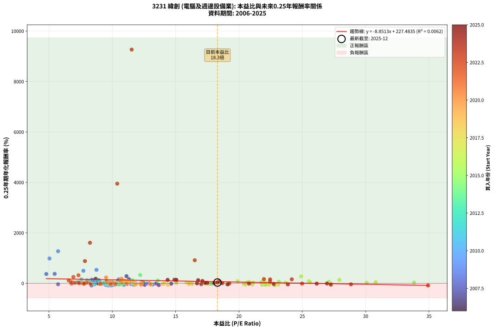
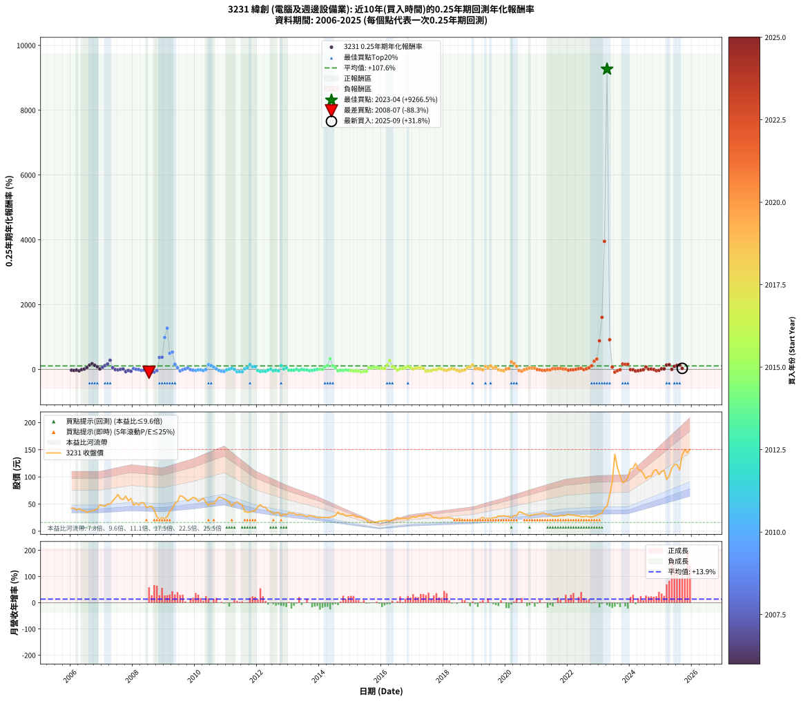

# 3231 緯創 - 本益比與未來報酬率分析

!!! info "報告資訊"
    - **股票代號**: 3231
    - **公司名稱**: 緯創
    - **產業別**: 電腦及週邊設備業
    - **分析期間**: 2006-2025 (237 個數據點)
    - **資料來源**: Type 12 (ShowMonthlyK_ChartFlow) 月收盤價與本益比
    - **報酬率口徑**: 含現金股利 (簡化: 年度合計，假設每年7/1入帳)
    - **報告生成時間**: 2026-01-04 08:27:17 CST

## 📈 視覺化圖表

### 圖表1: 本益比 vs 未來報酬率關係

*圖表1：3231 緯創 本益比與0.25年期未來報酬率關係 (2006-2025)*

### 圖表2: 歷年買入時點的0.25年期實際報酬率

*圖表2：3231 緯創 歷年買入時點的0.25年期實際報酬率 (2006-2025)*

## 📍 買點訊號說明

本報告提供兩種買點提示訊號（顯示於圖表2的股價子圖中）：

### ▲ 小綠色三角形（回測驗證）
- **計算方式**: 使用全部歷史資料計算本益比第25百分位數
- **用途**: 事後驗證，顯示歷史上哪些時點確實為低估區
- **限制**: 當下無法判斷，僅供回測參考
- **特性**: 後見之明（Look-Ahead Bias）

### ▲ 小橘色三角形（即時訊號）
- **計算方式**: 使用截至當月的過去5年資料計算本益比第25百分位數
- **用途**: 實際投資決策，當時即可判斷
- **優勢**: 可操作性強，符合實務需求
- **特性**: 無後見之明，滾動窗口計算

!!! tip "如何使用兩種訊號"
    - **綠色▲** 幫助理解歷史估值機會，驗證策略有效性
    - **橘色▲** 可作為實際買進參考，但仍需搭配基本面分析
    - 兩種訊號重疊時，表示即時判斷與事後驗證一致，信心度較高
    - 僅有綠色▲時，表示當時無法判斷（需要未來資料才能確認）
    - 僅有橘色▲時，表示即時判斷為買點，但事後可能不是最佳時機

## 📊 估值分析摘要

| 指標 | 數值 |
|:---:|:---:|
| **目前本益比** (2025-09) | **18.30 倍** |
| **歷史平均本益比** | 13.54 倍 |
| **估值水準** | 🔴 相對高估 |
| **預期0.25年年化報酬率** | **+65.51%** |
| **歷史平均報酬率** | +107.61% |
| **相關係數 (R²)** | 0.0062 |
| **趨勢線斜率** | -8.8513 |

!!! abstract "核心洞察"
    目前本益比顯著高於歷史平均，預期未來報酬率可能較低

    根據歷史數據回測，3231 緯創 在目前本益比 **18.3倍** 的估值水準下，
    預期未來0.25年年化報酬率約為 **+65.5%**。

    **重要提醒**: 本分析基於歷史數據統計，實際報酬率會受到公司基本面變化、產業趨勢、
    總體經濟環境等多重因素影響。R² = 0.01 表示本益比可解釋約 0.6% 的報酬率變異。

## 📈 歷史估值統計

### 最佳買點 (最高報酬率)

| 項目 | 數值 |
|:---:|:---:|
| 起始時間 | 2023-04 |
| 當時本益比 | 11.53 倍 |
| 起始價格 | 46.5 元 |
| 0.25年後價格 | 141.5 元 |
| **0.25年年化報酬率** | **+9266.54%** |

### 最差買點 (最低報酬率)

| 項目 | 數值 |
|:---:|:---:|
| 起始時間 | 2008-07 |
| 當時本益比 | 9.69 倍 |
| 起始價格 | 45.2 元 |
| 0.25年後價格 | 26.4 元 |
| **0.25年年化報酬率** | **-88.26%** |

## 🎯 投資啟示

### 本益比與報酬率關係

趨勢線方程式: **y = -8.8513x + 227.4835**

!!! warning "強負相關"
    本益比與未來報酬率呈現強負相關。在高本益比時期買入，未來報酬率顯著較低；
    在低本益比時期買入，未來報酬率顯著較高。**估值紀律至關重要**。

### 估值區間建議

基於歷史數據分析:

- **🟢 低估區** (P/E < 10.8): 預期報酬率較高，可考慮增加持股
- **🟡 合理區** (P/E 10.8-16.3): 預期報酬率符合長期趨勢，正常持有
- **🔴 高估區** (P/E > 16.3): 預期報酬率較低，可考慮減碼或觀望

!!! danger "風險提示"
    - 過去表現不代表未來結果
    - 本分析假設公司基本面無重大結構性變化
    - 產業環境劇變可能使歷史規律失效
    - 應結合公司財報、產業趨勢、總體經濟等多重因素綜合判斷

!!! success "長期投資觀點"
    歷史數據顯示，在合理或低估的估值水準買入並長期持有，
    往往能獲得較佳的投資報酬。**耐心等待好價格**是價值投資的核心原則。

## 📊 數據品質

- **資料來源**: GoodInfo.tw Type 12 (ShowMonthlyK_ChartFlow)
- **資料頻率**: 月度收盤價與本益比
- **回測期間**: 2006-2025
- **數據點數量**: 237 個 (每個點代表一次0.25年期回測)

### 計算方法說明

1. **0.25年期年化報酬率**:
   - 對每個歷史時點，計算其後0.25年的實際投資報酬率
   - 期末價值(不含股利): 期末價格
   - 期末價值(含現金股利): 期末價格 + 持有期間內的現金股利合計 (簡化: 年度合計，假設每年7/1入帳)
   - 公式: 年化報酬率 = [(期末價值/期初價格)^(1/年數) - 1] × 100%

2. **本益比 (P/E Ratio)**:
   - 使用當時的月收盤價與EPS計算
   - 資料來源: Type 12 月度河流圖本益比數據

3. **趨勢線 (Linear Regression)**:
   - 使用最小平方法擬合線性趨勢線
   - R²值衡量本益比對報酬率的解釋能力

---

*本報告由 Stock Analysis System v1.9.0 自動生成*
*數據更新時間: 2026-01-04 08:27:17 CST*

## 📋 月度回測明細表

（每一列對應時間線圖中的一個買入點；可用來對照 SVG 圖上的每個點。）

| 買入月份 | 賣出月份 | 回測期限_年 | 實際持有年數 | 買入本益比_倍 | 買入收盤價_元 | 賣出收盤價_元 | 現金股利合計_元 | 總報酬率_pct | 年化報酬率_pct |
| --- | --- | --- | --- | --- | --- | --- | --- | --- | --- |
| 2006-01 | 2006-05 | 0.25 | 0.329 | 9.84 | 42.50 | 38.60 | 0.00 | -9.18 | -25.40 |
| 2006-02 | 2006-05 | 0.25 | 0.246 | 9.86 | 42.60 | 38.60 | 0.00 | -9.39 | -32.98 |
| 2006-03 | 2006-07 | 0.25 | 0.334 | 9.00 | 38.90 | 34.30 | 1.51 | -7.93 | -21.92 |
| 2006-04 | 2006-07 | 0.25 | 0.249 | 9.63 | 41.60 | 34.30 | 1.51 | -13.91 | -45.18 |
| 2006-05 | 2006-08 | 0.25 | 0.252 | 8.94 | 38.60 | 36.55 | 1.51 | -1.39 | -5.40 |
| 2006-06 | 2006-09 | 0.25 | 0.252 | 8.80 | 38.00 | 37.55 | 1.51 | +2.80 | +11.59 |
| 2006-07 | 2006-10 | 0.25 | 0.252 | 7.94 | 34.30 | 38.50 | 0.00 | +12.24 | +58.19 |
| 2006-08 | 2006-12 | 0.25 | 0.334 | 8.46 | 36.55 | 48.40 | 0.00 | +32.42 | +131.81 |
| 2006-09 | 2006-12 | 0.25 | 0.249 | 8.69 | 37.55 | 48.40 | 0.00 | +28.89 | +176.98 |
| 2006-10 | 2007-01 | 0.25 | 0.252 | 8.91 | 38.50 | 47.30 | 0.00 | +22.86 | +126.43 |
| 2006-11 | 2007-03 | 0.25 | 0.329 | 9.55 | 41.25 | 50.20 | 0.00 | +21.70 | +81.79 |
| 2006-12 | 2007-03 | 0.25 | 0.246 | 11.20 | 48.40 | 50.20 | 0.00 | +3.72 | +15.97 |
| 2007-01 | 2007-05 | 0.25 | 0.329 | 10.85 | 47.30 | 55.80 | 0.00 | +17.97 | +65.37 |
| 2007-02 | 2007-05 | 0.25 | 0.246 | 10.45 | 46.00 | 55.80 | 0.00 | +21.30 | +118.98 |
| 2007-03 | 2007-07 | 0.25 | 0.334 | 11.31 | 50.20 | 67.40 | 2.20 | +38.64 | +165.93 |
| 2007-04 | 2007-07 | 0.25 | 0.249 | 11.12 | 49.80 | 67.40 | 2.20 | +39.75 | +283.19 |
| 2007-05 | 2007-08 | 0.25 | 0.252 | 12.35 | 55.80 | 60.00 | 2.20 | +11.46 | +53.85 |
| 2007-06 | 2007-09 | 0.25 | 0.252 | 13.46 | 61.40 | 58.30 | 2.20 | -1.47 | -5.72 |
| 2007-07 | 2007-10 | 0.25 | 0.252 | 14.65 | 67.40 | 64.50 | 0.00 | -4.30 | -16.02 |
| 2007-08 | 2007-12 | 0.25 | 0.334 | 12.93 | 60.00 | 60.30 | 0.00 | +0.50 | +1.50 |
| 2007-09 | 2007-12 | 0.25 | 0.249 | 12.46 | 58.30 | 60.30 | 0.00 | +3.43 | +14.50 |
| 2007-10 | 2008-01 | 0.25 | 0.252 | 13.67 | 64.50 | 48.00 | 0.00 | -25.58 | -69.06 |
| 2007-11 | 2008-03 | 0.25 | 0.331 | 11.72 | 55.80 | 48.40 | 0.00 | -13.26 | -34.91 |
| 2007-12 | 2008-03 | 0.25 | 0.249 | 12.56 | 60.30 | 48.40 | 0.00 | -19.73 | -58.62 |
| 2008-01 | 2008-05 | 0.25 | 0.331 | 10.04 | 48.00 | 52.00 | 0.00 | +8.33 | +27.33 |
| 2008-02 | 2008-05 | 0.25 | 0.249 | 10.86 | 51.70 | 52.00 | 0.00 | +0.58 | +2.35 |
| 2008-03 | 2008-07 | 0.25 | 0.334 | 10.21 | 48.40 | 45.20 | 2.65 | -1.13 | -3.34 |
| 2008-04 | 2008-07 | 0.25 | 0.249 | 11.14 | 52.60 | 45.20 | 2.65 | -9.02 | -31.58 |
| 2008-05 | 2008-08 | 0.25 | 0.252 | 11.05 | 52.00 | 46.00 | 2.65 | -6.43 | -23.21 |
| 2008-06 | 2008-09 | 0.25 | 0.252 | 9.26 | 43.40 | 38.70 | 2.65 | -4.71 | -17.45 |
| 2008-07 | 2008-10 | 0.25 | 0.252 | 9.69 | 45.20 | 26.35 | 0.00 | -41.70 | -88.26 |
| 2008-08 | 2008-12 | 0.25 | 0.334 | 9.90 | 46.00 | 24.90 | 0.00 | -45.87 | -84.08 |
| 2008-09 | 2008-12 | 0.25 | 0.249 | 8.36 | 38.70 | 24.90 | 0.00 | -35.66 | -82.97 |
| 2008-10 | 2009-01 | 0.25 | 0.252 | 5.72 | 26.35 | 23.30 | 0.00 | -11.57 | -38.64 |
| 2008-11 | 2009-03 | 0.25 | 0.329 | 4.79 | 22.00 | 36.55 | 0.00 | +66.14 | +368.86 |
| 2008-12 | 2009-03 | 0.25 | 0.246 | 5.45 | 24.90 | 36.55 | 0.00 | +46.79 | +374.76 |
| 2009-01 | 2009-05 | 0.25 | 0.329 | 5.04 | 23.30 | 51.00 | 0.00 | +118.88 | +985.24 |
| 2009-02 | 2009-05 | 0.25 | 0.246 | 5.72 | 26.75 | 51.00 | 0.00 | +90.65 | +1271.93 |
| 2009-03 | 2009-07 | 0.25 | 0.334 | 7.72 | 36.55 | 65.40 | 0.98 | +81.62 | +496.92 |
| 2009-04 | 2009-07 | 0.25 | 0.249 | 8.75 | 41.90 | 65.40 | 0.98 | +58.43 | +534.04 |
| 2009-05 | 2009-08 | 0.25 | 0.252 | 10.53 | 51.00 | 63.80 | 0.98 | +27.03 | +158.50 |
| 2009-06 | 2009-09 | 0.25 | 0.252 | 11.12 | 54.50 | 59.80 | 0.98 | +11.53 | +54.21 |
| 2009-07 | 2009-10 | 0.25 | 0.252 | 13.20 | 65.40 | 55.50 | 0.00 | -15.14 | -47.88 |
| 2009-08 | 2009-12 | 0.25 | 0.334 | 12.73 | 63.80 | 62.10 | 0.00 | -2.66 | -7.77 |
| 2009-09 | 2009-12 | 0.25 | 0.249 | 11.81 | 59.80 | 62.10 | 0.00 | +3.85 | +16.36 |
| 2009-10 | 2010-01 | 0.25 | 0.252 | 10.84 | 55.50 | 60.90 | 0.00 | +9.73 | +44.57 |
| 2009-11 | 2010-03 | 0.25 | 0.329 | 11.42 | 59.10 | 57.70 | 0.00 | -2.37 | -7.04 |
| 2009-12 | 2010-03 | 0.25 | 0.246 | 11.87 | 62.10 | 57.70 | 0.00 | -7.09 | -25.79 |
| 2010-01 | 2010-05 | 0.25 | 0.329 | 11.48 | 60.90 | 53.20 | 0.00 | -12.64 | -33.73 |
| 2010-02 | 2010-05 | 0.25 | 0.246 | 10.22 | 55.00 | 53.20 | 0.00 | -3.27 | -12.63 |
| 2010-03 | 2010-07 | 0.25 | 0.334 | 10.57 | 57.70 | 51.70 | 2.72 | -5.69 | -16.08 |
| 2010-04 | 2010-07 | 0.25 | 0.249 | 10.98 | 60.80 | 51.70 | 2.72 | -10.50 | -35.92 |
| 2010-05 | 2010-08 | 0.25 | 0.252 | 9.48 | 53.20 | 50.10 | 2.72 | -0.72 | -2.81 |
| 2010-06 | 2010-09 | 0.25 | 0.252 | 8.37 | 47.60 | 57.00 | 2.72 | +25.46 | +146.08 |
| 2010-07 | 2010-10 | 0.25 | 0.252 | 8.97 | 51.70 | 62.90 | 0.00 | +21.66 | +117.82 |
| 2010-08 | 2010-12 | 0.25 | 0.334 | 8.57 | 50.10 | 59.40 | 0.00 | +18.56 | +66.49 |
| 2010-09 | 2010-12 | 0.25 | 0.249 | 9.63 | 57.00 | 59.40 | 0.00 | +4.21 | +18.00 |
| 2010-10 | 2011-01 | 0.25 | 0.252 | 10.49 | 62.90 | 57.00 | 0.00 | -9.38 | -32.36 |
| 2010-11 | 2011-03 | 0.25 | 0.329 | 10.18 | 61.80 | 46.60 | 0.00 | -24.60 | -57.65 |
| 2010-12 | 2011-03 | 0.25 | 0.246 | 9.66 | 59.40 | 46.60 | 0.00 | -21.55 | -62.65 |
| 2011-01 | 2011-05 | 0.25 | 0.329 | 9.50 | 57.00 | 54.00 | 0.00 | -5.26 | -15.17 |
| 2011-02 | 2011-05 | 0.25 | 0.246 | 9.04 | 52.90 | 54.00 | 0.00 | +2.08 | +8.71 |
| 2011-03 | 2011-07 | 0.25 | 0.334 | 8.17 | 46.60 | 48.50 | 3.20 | +10.94 | +36.44 |
| 2011-04 | 2011-07 | 0.25 | 0.249 | 9.27 | 51.50 | 48.50 | 3.20 | +0.38 | +1.54 |
| 2011-05 | 2011-08 | 0.25 | 0.252 | 9.99 | 54.00 | 36.10 | 3.20 | -27.23 | -71.69 |
| 2011-06 | 2011-09 | 0.25 | 0.252 | 9.71 | 51.00 | 34.95 | 3.20 | -25.20 | -68.43 |
| 2011-07 | 2011-10 | 0.25 | 0.252 | 9.50 | 48.50 | 35.20 | 0.00 | -27.42 | -71.99 |
| 2011-08 | 2011-12 | 0.25 | 0.334 | 7.28 | 36.10 | 38.35 | 0.00 | +6.23 | +19.84 |
| 2011-09 | 2011-12 | 0.25 | 0.249 | 7.27 | 34.95 | 38.35 | 0.00 | +9.73 | +45.15 |
| 2011-10 | 2012-01 | 0.25 | 0.252 | 7.56 | 35.20 | 44.40 | 0.00 | +26.14 | +151.39 |
| 2011-11 | 2012-03 | 0.25 | 0.331 | 8.14 | 36.70 | 44.50 | 0.00 | +21.25 | +78.91 |
| 2011-12 | 2012-03 | 0.25 | 0.249 | 8.80 | 38.35 | 44.50 | 0.00 | +16.04 | +81.66 |
| 2012-01 | 2012-05 | 0.25 | 0.331 | 10.39 | 44.40 | 37.90 | 0.00 | -14.64 | -37.99 |
| 2012-02 | 2012-05 | 0.25 | 0.249 | 11.69 | 48.95 | 37.90 | 0.00 | -22.57 | -64.19 |
| 2012-03 | 2012-07 | 0.25 | 0.334 | 10.85 | 44.50 | 32.35 | 2.20 | -22.36 | -53.13 |
| 2012-04 | 2012-07 | 0.25 | 0.249 | 10.92 | 43.85 | 32.35 | 2.20 | -21.21 | -61.59 |
| 2012-05 | 2012-08 | 0.25 | 0.252 | 9.64 | 37.90 | 33.50 | 2.20 | -5.80 | -21.13 |
| 2012-06 | 2012-09 | 0.25 | 0.252 | 9.49 | 36.50 | 35.20 | 2.20 | +2.47 | +10.15 |
| 2012-07 | 2012-10 | 0.25 | 0.252 | 8.61 | 32.35 | 28.05 | 0.00 | -13.29 | -43.23 |
| 2012-08 | 2012-12 | 0.25 | 0.334 | 9.12 | 33.50 | 30.10 | 0.00 | -10.15 | -27.41 |
| 2012-09 | 2012-12 | 0.25 | 0.249 | 9.81 | 35.20 | 30.10 | 0.00 | -14.49 | -46.65 |
| 2012-10 | 2013-01 | 0.25 | 0.252 | 8.01 | 28.05 | 34.20 | 0.00 | +21.93 | +119.68 |
| 2012-11 | 2013-03 | 0.25 | 0.329 | 9.34 | 31.90 | 33.25 | 0.00 | +4.23 | +13.45 |
| 2012-12 | 2013-03 | 0.25 | 0.246 | 9.04 | 30.10 | 33.25 | 0.00 | +10.47 | +49.77 |
| 2013-01 | 2013-05 | 0.25 | 0.329 | 10.48 | 34.20 | 30.80 | 0.00 | -9.94 | -27.29 |
| 2013-02 | 2013-05 | 0.25 | 0.246 | 10.33 | 33.00 | 30.80 | 0.00 | -6.67 | -24.42 |
| 2013-03 | 2013-07 | 0.25 | 0.334 | 10.64 | 33.25 | 28.60 | 1.50 | -9.47 | -25.77 |
| 2013-04 | 2013-07 | 0.25 | 0.249 | 9.80 | 29.95 | 28.60 | 1.50 | +0.50 | +2.03 |
| 2013-05 | 2013-08 | 0.25 | 0.252 | 10.31 | 30.80 | 26.85 | 1.50 | -7.95 | -28.04 |
| 2013-06 | 2013-09 | 0.25 | 0.252 | 10.36 | 30.25 | 28.65 | 1.50 | -0.33 | -1.31 |
| 2013-07 | 2013-10 | 0.25 | 0.252 | 10.03 | 28.60 | 27.60 | 0.00 | -3.50 | -13.18 |
| 2013-08 | 2013-12 | 0.25 | 0.334 | 9.65 | 26.85 | 25.05 | 0.00 | -6.70 | -18.76 |
| 2013-09 | 2013-12 | 0.25 | 0.249 | 10.55 | 28.65 | 25.05 | 0.00 | -12.57 | -41.66 |
| 2013-10 | 2014-01 | 0.25 | 0.252 | 10.43 | 27.60 | 25.10 | 0.00 | -9.06 | -31.41 |
| 2013-11 | 2014-03 | 0.25 | 0.329 | 10.30 | 26.55 | 25.05 | 0.00 | -5.65 | -16.22 |
| 2013-12 | 2014-03 | 0.25 | 0.246 | 9.98 | 25.05 | 25.05 | 0.00 | +0.00 | +0.00 |
| 2014-01 | 2014-05 | 0.25 | 0.329 | 10.35 | 25.10 | 25.50 | 0.00 | +1.59 | +4.93 |
| 2014-02 | 2014-05 | 0.25 | 0.246 | 10.76 | 25.20 | 25.50 | 0.00 | +1.19 | +4.92 |
| 2014-03 | 2014-07 | 0.25 | 0.334 | 11.10 | 25.05 | 28.90 | 1.80 | +22.56 | +83.88 |
| 2014-04 | 2014-07 | 0.25 | 0.249 | 11.59 | 25.20 | 28.90 | 1.80 | +21.83 | +120.92 |
| 2014-05 | 2014-08 | 0.25 | 0.252 | 12.20 | 25.50 | 35.00 | 1.80 | +44.32 | +329.10 |
| 2014-06 | 2014-09 | 0.25 | 0.252 | 13.59 | 27.25 | 31.05 | 1.80 | +20.56 | +110.07 |
| 2014-07 | 2014-10 | 0.25 | 0.252 | 15.04 | 28.90 | 31.90 | 0.00 | +10.38 | +48.01 |
| 2014-08 | 2014-12 | 0.25 | 0.334 | 19.05 | 35.00 | 28.70 | 0.00 | -18.00 | -44.80 |
| 2014-09 | 2014-12 | 0.25 | 0.249 | 17.71 | 31.05 | 28.70 | 0.00 | -7.57 | -27.09 |
| 2014-10 | 2015-01 | 0.25 | 0.252 | 19.11 | 31.90 | 29.00 | 0.00 | -9.09 | -31.50 |
| 2014-11 | 2015-03 | 0.25 | 0.329 | 17.86 | 28.30 | 26.60 | 0.00 | -6.01 | -17.19 |
| 2014-12 | 2015-03 | 0.25 | 0.246 | 19.12 | 28.70 | 26.60 | 0.00 | -7.32 | -26.54 |
| 2015-01 | 2015-05 | 0.25 | 0.329 | 20.40 | 29.00 | 25.20 | 0.00 | -13.10 | -34.79 |
| 2015-02 | 2015-05 | 0.25 | 0.246 | 22.09 | 29.65 | 25.20 | 0.00 | -15.01 | -48.31 |
| 2015-03 | 2015-07 | 0.25 | 0.334 | 21.06 | 26.60 | 20.65 | 1.23 | -17.74 | -44.28 |
| 2015-04 | 2015-07 | 0.25 | 0.249 | 22.09 | 26.15 | 20.65 | 1.23 | -16.33 | -51.11 |
| 2015-05 | 2015-08 | 0.25 | 0.252 | 22.81 | 25.20 | 16.10 | 1.23 | -31.23 | -77.38 |
| 2015-06 | 2015-09 | 0.25 | 0.252 | 22.82 | 23.40 | 17.15 | 1.23 | -21.45 | -61.66 |
| 2015-07 | 2015-10 | 0.25 | 0.252 | 21.83 | 20.65 | 16.40 | 0.00 | -20.58 | -59.94 |
| 2015-08 | 2015-12 | 0.25 | 0.334 | 18.57 | 16.10 | 18.60 | 0.00 | +15.53 | +54.06 |
| 2015-09 | 2015-12 | 0.25 | 0.249 | 21.77 | 17.15 | 18.60 | 0.00 | +8.45 | +38.51 |
| 2015-10 | 2016-01 | 0.25 | 0.252 | 23.15 | 16.40 | 18.60 | 0.00 | +13.41 | +64.83 |
| 2015-11 | 2016-03 | 0.25 | 0.331 | 27.10 | 17.05 | 19.90 | 0.00 | +16.72 | +59.45 |
| 2015-12 | 2016-03 | 0.25 | 0.249 | 33.82 | 18.60 | 19.90 | 0.00 | +6.99 | +31.15 |
| 2016-01 | 2016-05 | 0.25 | 0.331 | 30.79 | 18.60 | 20.95 | 0.00 | +12.63 | +43.21 |
| 2016-02 | 2016-05 | 0.25 | 0.249 | 30.08 | 19.80 | 20.95 | 0.00 | +5.81 | +25.43 |
| 2016-03 | 2016-07 | 0.25 | 0.334 | 27.93 | 19.90 | 25.35 | 1.20 | +33.40 | +136.98 |
| 2016-04 | 2016-07 | 0.25 | 0.249 | 24.91 | 19.10 | 25.35 | 1.20 | +38.99 | +274.88 |
| 2016-05 | 2016-08 | 0.25 | 0.252 | 25.52 | 20.95 | 23.30 | 1.20 | +16.93 | +86.07 |
| 2016-06 | 2016-09 | 0.25 | 0.252 | 25.60 | 22.40 | 23.30 | 1.20 | +9.36 | +42.66 |
| 2016-07 | 2016-10 | 0.25 | 0.252 | 27.28 | 25.35 | 23.80 | 0.00 | -6.11 | -22.16 |
| 2016-08 | 2016-12 | 0.25 | 0.334 | 23.69 | 23.30 | 24.95 | 0.00 | +7.08 | +22.73 |
| 2016-09 | 2016-12 | 0.25 | 0.249 | 22.46 | 23.30 | 24.95 | 0.00 | +7.08 | +31.60 |
| 2016-10 | 2017-01 | 0.25 | 0.252 | 21.80 | 23.80 | 26.65 | 0.00 | +11.97 | +56.68 |
| 2016-11 | 2017-03 | 0.25 | 0.329 | 19.90 | 22.80 | 27.80 | 0.00 | +21.93 | +82.85 |
| 2016-12 | 2017-03 | 0.25 | 0.246 | 20.79 | 24.95 | 27.80 | 0.00 | +11.42 | +55.11 |
| 2017-01 | 2017-05 | 0.25 | 0.329 | 21.78 | 26.65 | 27.80 | 0.00 | +4.32 | +13.72 |
| 2017-02 | 2017-05 | 0.25 | 0.246 | 20.66 | 25.75 | 27.80 | 0.00 | +7.96 | +36.46 |
| 2017-03 | 2017-07 | 0.25 | 0.334 | 21.89 | 27.80 | 30.50 | 1.18 | +13.97 | +47.92 |
| 2017-04 | 2017-07 | 0.25 | 0.249 | 22.04 | 28.50 | 30.50 | 1.18 | +11.17 | +52.97 |
| 2017-05 | 2017-08 | 0.25 | 0.252 | 21.11 | 27.80 | 28.50 | 1.18 | +6.78 | +29.74 |
| 2017-06 | 2017-09 | 0.25 | 0.252 | 23.10 | 30.95 | 24.50 | 1.18 | -17.01 | -52.31 |
| 2017-07 | 2017-10 | 0.25 | 0.252 | 22.37 | 30.50 | 25.15 | 0.00 | -17.54 | -53.50 |
| 2017-08 | 2017-12 | 0.25 | 0.334 | 20.55 | 28.50 | 23.95 | 0.00 | -15.96 | -40.59 |
| 2017-09 | 2017-12 | 0.25 | 0.249 | 17.38 | 24.50 | 23.95 | 0.00 | -2.24 | -8.71 |
| 2017-10 | 2018-01 | 0.25 | 0.252 | 17.55 | 25.15 | 24.50 | 0.00 | -2.58 | -9.87 |
| 2017-11 | 2018-03 | 0.25 | 0.329 | 15.86 | 23.10 | 24.90 | 0.00 | +7.79 | +25.66 |
| 2017-12 | 2018-03 | 0.25 | 0.246 | 16.18 | 23.95 | 24.90 | 0.00 | +3.97 | +17.10 |
| 2018-01 | 2018-05 | 0.25 | 0.329 | 16.30 | 24.50 | 22.55 | 0.00 | -7.96 | -22.31 |
| 2018-02 | 2018-05 | 0.25 | 0.246 | 16.05 | 24.50 | 22.55 | 0.00 | -7.96 | -28.58 |
| 2018-03 | 2018-07 | 0.25 | 0.334 | 16.06 | 24.90 | 23.65 | 1.17 | -0.33 | -0.97 |
| 2018-04 | 2018-07 | 0.25 | 0.249 | 15.06 | 23.70 | 23.65 | 1.17 | +4.72 | +20.34 |
| 2018-05 | 2018-08 | 0.25 | 0.252 | 14.12 | 22.55 | 21.75 | 1.17 | +1.64 | +6.66 |
| 2018-06 | 2018-09 | 0.25 | 0.252 | 13.98 | 22.65 | 19.90 | 1.17 | -6.98 | -24.97 |
| 2018-07 | 2018-10 | 0.25 | 0.252 | 14.39 | 23.65 | 18.90 | 0.00 | -20.08 | -58.94 |
| 2018-08 | 2018-12 | 0.25 | 0.334 | 13.05 | 21.75 | 19.10 | 0.00 | -12.18 | -32.23 |
| 2018-09 | 2018-12 | 0.25 | 0.249 | 11.78 | 19.90 | 19.10 | 0.00 | -4.02 | -15.18 |
| 2018-10 | 2019-01 | 0.25 | 0.252 | 11.03 | 18.90 | 21.10 | 0.00 | +11.64 | +54.83 |
| 2018-11 | 2019-03 | 0.25 | 0.329 | 11.26 | 19.55 | 23.70 | 0.00 | +21.23 | +79.66 |
| 2018-12 | 2019-03 | 0.25 | 0.246 | 10.85 | 19.10 | 23.70 | 0.00 | +24.08 | +140.06 |
| 2019-01 | 2019-05 | 0.25 | 0.329 | 11.64 | 21.10 | 22.50 | 0.00 | +6.64 | +21.60 |
| 2019-02 | 2019-05 | 0.25 | 0.246 | 11.44 | 21.35 | 22.50 | 0.00 | +5.39 | +23.73 |
| 2019-03 | 2019-07 | 0.25 | 0.334 | 12.34 | 23.70 | 23.30 | 1.49 | +4.59 | +14.38 |
| 2019-04 | 2019-07 | 0.25 | 0.249 | 12.97 | 25.60 | 23.30 | 1.49 | -3.17 | -12.14 |
| 2019-05 | 2019-08 | 0.25 | 0.252 | 11.10 | 22.50 | 24.90 | 1.49 | +17.28 | +88.29 |
| 2019-06 | 2019-09 | 0.25 | 0.252 | 11.63 | 24.20 | 25.05 | 1.49 | +9.66 | +44.22 |
| 2019-07 | 2019-10 | 0.25 | 0.252 | 10.92 | 23.30 | 27.95 | 0.00 | +19.96 | +105.94 |
| 2019-08 | 2019-12 | 0.25 | 0.334 | 11.39 | 24.90 | 28.35 | 0.00 | +13.86 | +47.47 |
| 2019-09 | 2019-12 | 0.25 | 0.249 | 11.18 | 25.05 | 28.35 | 0.00 | +13.17 | +64.33 |
| 2019-10 | 2020-01 | 0.25 | 0.252 | 12.19 | 27.95 | 27.25 | 0.00 | -2.50 | -9.58 |
| 2019-11 | 2020-03 | 0.25 | 0.331 | 11.80 | 27.70 | 24.50 | 0.00 | -11.55 | -30.97 |
| 2019-12 | 2020-03 | 0.25 | 0.249 | 11.81 | 28.35 | 24.50 | 0.00 | -13.58 | -44.34 |
| 2020-01 | 2020-05 | 0.25 | 0.331 | 11.08 | 27.25 | 28.60 | 0.00 | +4.95 | +15.71 |
| 2020-02 | 2020-05 | 0.25 | 0.249 | 10.75 | 27.05 | 28.60 | 0.00 | +5.73 | +25.06 |
| 2020-03 | 2020-07 | 0.25 | 0.334 | 9.51 | 24.50 | 34.50 | 2.04 | +49.15 | +230.99 |
| 2020-04 | 2020-07 | 0.25 | 0.249 | 10.73 | 28.25 | 34.50 | 2.04 | +29.35 | +180.95 |
| 2020-05 | 2020-08 | 0.25 | 0.252 | 10.63 | 28.60 | 31.90 | 2.04 | +18.68 | +97.36 |
| 2020-06 | 2020-09 | 0.25 | 0.252 | 13.02 | 35.80 | 29.80 | 2.04 | -11.06 | -37.20 |
| 2020-07 | 2020-10 | 0.25 | 0.252 | 12.28 | 34.50 | 28.50 | 0.00 | -17.39 | -53.16 |
| 2020-08 | 2020-12 | 0.25 | 0.334 | 11.13 | 31.90 | 31.00 | 0.00 | -2.82 | -8.21 |
| 2020-09 | 2020-12 | 0.25 | 0.249 | 10.19 | 29.80 | 31.00 | 0.00 | +4.03 | +17.17 |
| 2020-10 | 2021-01 | 0.25 | 0.252 | 9.55 | 28.50 | 31.25 | 0.00 | +9.65 | +44.15 |
| 2020-11 | 2021-03 | 0.25 | 0.329 | 9.81 | 29.85 | 33.50 | 0.00 | +12.23 | +42.07 |
| 2020-12 | 2021-03 | 0.25 | 0.246 | 10.00 | 31.00 | 33.50 | 0.00 | +8.06 | +36.99 |
| 2021-01 | 2021-05 | 0.25 | 0.329 | 9.90 | 31.25 | 30.75 | 0.00 | -1.60 | -4.79 |
| 2021-02 | 2021-05 | 0.25 | 0.246 | 9.97 | 32.00 | 30.75 | 0.00 | -3.91 | -14.93 |
| 2021-03 | 2021-07 | 0.25 | 0.334 | 10.26 | 33.50 | 27.75 | 2.20 | -10.60 | -28.49 |
| 2021-04 | 2021-07 | 0.25 | 0.249 | 9.85 | 32.70 | 27.75 | 2.20 | -8.41 | -29.71 |
| 2021-05 | 2021-08 | 0.25 | 0.252 | 9.11 | 30.75 | 27.40 | 2.20 | -3.74 | -14.04 |
| 2021-06 | 2021-09 | 0.25 | 0.252 | 9.04 | 31.00 | 27.50 | 2.20 | -4.19 | -15.64 |
| 2021-07 | 2021-10 | 0.25 | 0.252 | 7.96 | 27.75 | 29.20 | 0.00 | +5.23 | +22.41 |
| 2021-08 | 2021-12 | 0.25 | 0.334 | 7.74 | 27.40 | 29.15 | 0.00 | +6.39 | +20.36 |
| 2021-09 | 2021-12 | 0.25 | 0.249 | 7.65 | 27.50 | 29.15 | 0.00 | +6.00 | +26.35 |
| 2021-10 | 2022-01 | 0.25 | 0.252 | 8.00 | 29.20 | 31.35 | 0.00 | +7.36 | +32.59 |
| 2021-11 | 2022-03 | 0.25 | 0.329 | 7.72 | 28.60 | 29.75 | 0.00 | +4.02 | +12.75 |
| 2021-12 | 2022-03 | 0.25 | 0.246 | 7.75 | 29.15 | 29.75 | 0.00 | +2.06 | +8.62 |
| 2022-01 | 2022-05 | 0.25 | 0.329 | 8.29 | 31.35 | 28.40 | 0.00 | -9.41 | -25.98 |
| 2022-02 | 2022-05 | 0.25 | 0.246 | 7.73 | 29.40 | 28.40 | 0.00 | -3.40 | -13.10 |
| 2022-03 | 2022-07 | 0.25 | 0.334 | 7.78 | 29.75 | 26.50 | 2.20 | -3.53 | -10.20 |
| 2022-04 | 2022-07 | 0.25 | 0.249 | 7.42 | 28.50 | 26.50 | 2.20 | +0.70 | +2.85 |
| 2022-05 | 2022-08 | 0.25 | 0.252 | 7.35 | 28.40 | 27.70 | 2.20 | +5.28 | +22.67 |
| 2022-06 | 2022-09 | 0.25 | 0.252 | 6.87 | 26.70 | 26.55 | 2.20 | +7.68 | +34.14 |
| 2022-07 | 2022-10 | 0.25 | 0.252 | 6.78 | 26.50 | 26.05 | 0.00 | -1.70 | -6.57 |
| 2022-08 | 2022-12 | 0.25 | 0.334 | 7.05 | 27.70 | 29.40 | 0.00 | +6.14 | +19.52 |
| 2022-09 | 2022-12 | 0.25 | 0.249 | 6.73 | 26.55 | 29.40 | 0.00 | +10.73 | +50.57 |
| 2022-10 | 2023-01 | 0.25 | 0.252 | 6.56 | 26.05 | 31.50 | 0.00 | +20.92 | +112.59 |
| 2022-11 | 2023-03 | 0.25 | 0.329 | 6.93 | 27.65 | 41.85 | 0.00 | +51.36 | +253.08 |
| 2022-12 | 2023-03 | 0.25 | 0.246 | 7.33 | 29.40 | 41.85 | 0.00 | +42.35 | +319.12 |
| 2023-01 | 2023-05 | 0.25 | 0.329 | 7.84 | 31.50 | 66.70 | 0.00 | +111.75 | +881.07 |
| 2023-02 | 2023-05 | 0.25 | 0.246 | 8.24 | 33.15 | 66.70 | 0.00 | +101.21 | +1607.19 |
| 2023-03 | 2023-07 | 0.25 | 0.334 | 10.39 | 41.85 | 141.50 | 2.60 | +244.32 | +3951.31 |
| 2023-04 | 2023-07 | 0.25 | 0.249 | 11.53 | 46.50 | 141.50 | 2.60 | +209.89 | +9266.54 |
| 2023-05 | 2023-08 | 0.25 | 0.252 | 16.51 | 66.70 | 117.00 | 2.60 | +79.31 | +915.84 |
| 2023-06 | 2023-09 | 0.25 | 0.252 | 22.45 | 90.80 | 101.50 | 2.60 | +14.65 | +72.06 |
| 2023-07 | 2023-10 | 0.25 | 0.252 | 34.93 | 141.50 | 89.40 | 0.00 | -36.82 | -83.85 |
| 2023-08 | 2023-12 | 0.25 | 0.334 | 28.84 | 117.00 | 98.60 | 0.00 | -15.73 | -40.09 |
| 2023-09 | 2023-12 | 0.25 | 0.249 | 24.98 | 101.50 | 98.60 | 0.00 | -2.86 | -10.98 |
| 2023-10 | 2024-01 | 0.25 | 0.252 | 21.97 | 89.40 | 114.50 | 0.00 | +28.08 | +167.09 |
| 2023-11 | 2024-03 | 0.25 | 0.331 | 22.46 | 91.50 | 125.00 | 0.00 | +36.61 | +156.44 |
| 2023-12 | 2024-03 | 0.25 | 0.249 | 24.17 | 98.60 | 125.00 | 0.00 | +26.77 | +159.15 |
| 2024-01 | 2024-05 | 0.25 | 0.331 | 26.95 | 114.50 | 112.00 | 0.00 | -2.18 | -6.45 |
| 2024-02 | 2024-05 | 0.25 | 0.249 | 26.14 | 115.50 | 112.00 | 0.00 | -3.03 | -11.62 |
| 2024-03 | 2024-07 | 0.25 | 0.334 | 27.25 | 125.00 | 96.80 | 2.60 | -20.48 | -49.65 |
| 2024-04 | 2024-07 | 0.25 | 0.249 | 23.86 | 113.50 | 96.80 | 2.60 | -12.42 | -41.28 |
| 2024-05 | 2024-08 | 0.25 | 0.252 | 22.74 | 112.00 | 101.50 | 2.60 | -7.05 | -25.21 |
| 2024-06 | 2024-09 | 0.25 | 0.252 | 20.80 | 106.00 | 101.00 | 2.60 | -2.27 | -8.69 |
| 2024-07 | 2024-10 | 0.25 | 0.252 | 18.39 | 96.80 | 111.00 | 0.00 | +14.67 | +72.19 |
| 2024-08 | 2024-12 | 0.25 | 0.334 | 18.68 | 101.50 | 104.00 | 0.00 | +2.46 | +7.56 |
| 2024-09 | 2024-12 | 0.25 | 0.249 | 18.03 | 101.00 | 104.00 | 0.00 | +2.97 | +12.47 |
| 2024-10 | 2025-01 | 0.25 | 0.252 | 19.23 | 111.00 | 110.00 | 0.00 | -0.90 | -3.53 |
| 2024-11 | 2025-03 | 0.25 | 0.329 | 19.11 | 113.50 | 95.30 | 0.00 | -16.04 | -41.26 |
| 2024-12 | 2025-03 | 0.25 | 0.246 | 17.02 | 104.00 | 95.30 | 0.00 | -8.37 | -29.85 |
| 2025-01 | 2025-05 | 0.25 | 0.329 | 17.50 | 110.00 | 116.50 | 0.00 | +5.91 | +19.09 |
| 2025-02 | 2025-05 | 0.25 | 0.246 | 17.34 | 112.00 | 116.50 | 0.00 | +4.02 | +17.34 |
| 2025-03 | 2025-07 | 0.25 | 0.334 | 14.37 | 95.30 | 123.00 | 3.80 | +33.05 | +135.13 |
| 2025-04 | 2025-07 | 0.25 | 0.249 | 14.91 | 101.50 | 123.00 | 3.80 | +24.93 | +144.30 |
| 2025-05 | 2025-08 | 0.25 | 0.252 | 16.69 | 116.50 | 113.00 | 3.80 | +0.26 | +1.02 |
| 2025-06 | 2025-09 | 0.25 | 0.252 | 17.12 | 122.50 | 140.50 | 3.80 | +17.80 | +91.59 |
| 2025-07 | 2025-10 | 0.25 | 0.252 | 16.78 | 123.00 | 150.50 | 0.00 | +22.36 | +122.80 |
| 2025-08 | 2025-12 | 0.25 | 0.334 | 15.06 | 113.00 | 150.50 | 0.00 | +33.19 | +135.84 |
| 2025-09 | 2025-12 | 0.25 | 0.249 | 18.30 | 140.50 | 150.50 | 0.00 | +7.12 | +31.78 |
