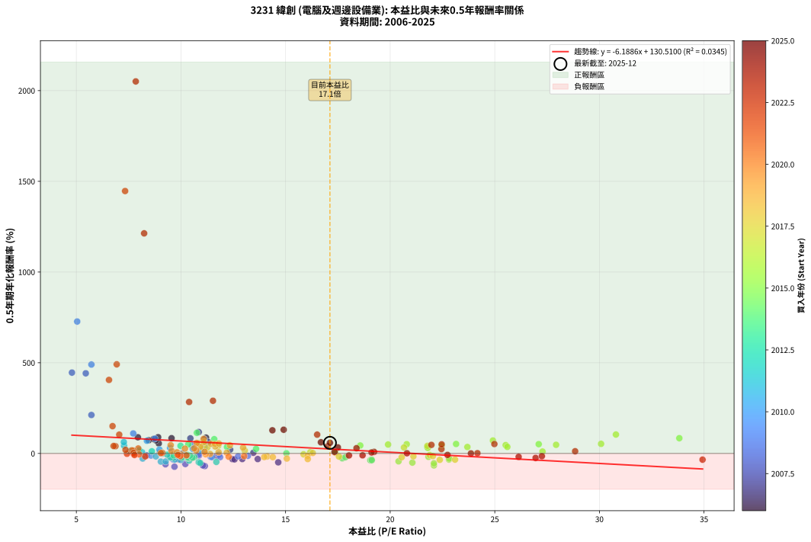

# 3231 緯創 - 本益比與未來報酬率分析

!!! info "報告資訊"
    - **股票代號**: 3231
    - **公司名稱**: 緯創
    - **產業別**: 電腦及週邊設備業
    - **分析期間**: 2006-2025 (234 個數據點)
    - **資料來源**: Type 12 (ShowMonthlyK_ChartFlow) 月收盤價與本益比
    - **報酬率口徑**: 含現金股利 (簡化: 年度合計，假設每年7/1入帳)
    - **報告生成時間**: 2026-01-22 23:21:25 CST

## 📈 視覺化圖表

### 圖表1: 本益比 vs 未來報酬率關係

*圖表1：3231 緯創 本益比與0.5年期未來報酬率關係 (2006-2025)*

### 圖表2: 歷年買入時點的0.5年期實際報酬率

*圖表2：3231 緯創 歷年買入時點的0.5年期實際報酬率 (2006-2025)*

## 📍 買點訊號說明

本報告提供兩種買點提示訊號（顯示於圖表2的股價子圖中）：

### ▲ 小綠色三角形（回測驗證）
- **計算方式**: 使用全部歷史資料計算本益比第25百分位數
- **用途**: 事後驗證，顯示歷史上哪些時點確實為低估區
- **限制**: 當下無法判斷，僅供回測參考
- **特性**: 後見之明（Look-Ahead Bias）

### ▲ 小橘色三角形（即時訊號）
- **計算方式**: 使用截至當月的過去5年資料計算本益比第25百分位數
- **用途**: 實際投資決策，當時即可判斷
- **優勢**: 可操作性強，符合實務需求
- **特性**: 無後見之明，滾動窗口計算

!!! tip "如何使用兩種訊號"
    - **綠色▲** 幫助理解歷史估值機會，驗證策略有效性
    - **橘色▲** 可作為實際買進參考，但仍需搭配基本面分析
    - 兩種訊號重疊時，表示即時判斷與事後驗證一致，信心度較高
    - 僅有綠色▲時，表示當時無法判斷（需要未來資料才能確認）
    - 僅有橘色▲時，表示即時判斷為買點，但事後可能不是最佳時機

## 📊 估值分析摘要

| 指標 | 數值 |
|:---:|:---:|
| **目前本益比** (2025-06) | **17.12 倍** |
| **歷史平均本益比** | 13.50 倍 |
| **估值水準** | 🔴 相對高估 |
| **預期0.5年年化報酬率** | **+24.56%** |
| **歷史平均報酬率** | +46.95% |
| **相關係數 (R²)** | 0.0345 |
| **趨勢線斜率** | -6.1886 |

!!! abstract "核心洞察"
    目前本益比顯著高於歷史平均，預期未來報酬率可能較低

    根據歷史數據回測，3231 緯創 在目前本益比 **17.1倍** 的估值水準下，
    預期未來0.5年年化報酬率約為 **+24.6%**。

    **重要提醒**: 本分析基於歷史數據統計，實際報酬率會受到公司基本面變化、產業趨勢、
    總體經濟環境等多重因素影響。R² = 0.03 表示本益比可解釋約 3.4% 的報酬率變異。

## 📈 歷史估值統計

### 最佳買點 (最高報酬率)

| 項目 | 數值 |
|:---:|:---:|
| 起始時間 | 2023-01 |
| 當時本益比 | 7.84 倍 |
| 起始價格 | 31.5 元 |
| 0.5年後價格 | 141.5 元 |
| **0.5年年化報酬率** | **+2050.59%** |

### 最差買點 (最低報酬率)

| 項目 | 數值 |
|:---:|:---:|
| 起始時間 | 2008-07 |
| 當時本益比 | 9.69 倍 |
| 起始價格 | 45.2 元 |
| 0.5年後價格 | 23.3 元 |
| **0.5年年化報酬率** | **-73.16%** |

## 🎯 投資啟示

### 本益比與報酬率關係

趨勢線方程式: **y = -6.1886x + 130.5100**

!!! warning "強負相關"
    本益比與未來報酬率呈現強負相關。在高本益比時期買入，未來報酬率顯著較低；
    在低本益比時期買入，未來報酬率顯著較高。**估值紀律至關重要**。

### 估值區間建議

基於歷史數據分析:

- **🟢 低估區** (P/E < 10.8): 預期報酬率較高，可考慮增加持股
- **🟡 合理區** (P/E 10.8-16.2): 預期報酬率符合長期趨勢，正常持有
- **🔴 高估區** (P/E > 16.2): 預期報酬率較低，可考慮減碼或觀望

!!! danger "風險提示"
    - 過去表現不代表未來結果
    - 本分析假設公司基本面無重大結構性變化
    - 產業環境劇變可能使歷史規律失效
    - 應結合公司財報、產業趨勢、總體經濟等多重因素綜合判斷

!!! success "長期投資觀點"
    歷史數據顯示，在合理或低估的估值水準買入並長期持有，
    往往能獲得較佳的投資報酬。**耐心等待好價格**是價值投資的核心原則。

## 📊 數據品質

- **資料來源**: GoodInfo.tw Type 12 (ShowMonthlyK_ChartFlow)
- **資料頻率**: 月度收盤價與本益比
- **回測期間**: 2006-2025
- **數據點數量**: 234 個 (每個點代表一次0.5年期回測)

### 計算方法說明

1. **0.5年期年化報酬率**:
   - 對每個歷史時點，計算其後0.5年的實際投資報酬率
   - 期末價值(不含股利): 期末價格
   - 期末價值(含現金股利): 期末價格 + 持有期間內的現金股利合計 (簡化: 年度合計，假設每年7/1入帳)
   - 公式: 年化報酬率 = [(期末價值/期初價格)^(1/年數) - 1] × 100%

2. **本益比 (P/E Ratio)**:
   - 使用當時的月收盤價與EPS計算
   - 資料來源: Type 12 月度河流圖本益比數據

3. **趨勢線 (Linear Regression)**:
   - 使用最小平方法擬合線性趨勢線
   - R²值衡量本益比對報酬率的解釋能力

---

*本報告由 Stock Analysis System v1.9.0 自動生成*
*數據更新時間: 2026-01-22 23:21:25 CST*

## 📋 月度回測明細表

（每一列對應時間線圖中的一個買入點；可用來對照 SVG 圖上的每個點。）

| 買入月份 | 賣出月份 | 回測期限_年 | 實際持有年數 | 買入本益比_倍 | 買入收盤價_元 | 賣出收盤價_元 | 現金股利合計_元 | 總報酬率_pct | 年化報酬率_pct |
| --- | --- | --- | --- | --- | --- | --- | --- | --- | --- |
| 2006-01 | 2006-07 | 0.5 | 0.496 | 9.84 | 42.50 | 34.30 | 1.51 | -15.73 | -29.21 |
| 2006-02 | 2006-08 | 0.5 | 0.498 | 9.86 | 42.60 | 36.55 | 1.51 | -10.65 | -20.22 |
| 2006-03 | 2006-10 | 0.5 | 0.586 | 9.00 | 38.90 | 38.50 | 1.51 | +2.86 | +4.94 |
| 2006-04 | 2006-10 | 0.5 | 0.501 | 9.63 | 41.60 | 38.50 | 1.51 | -3.81 | -7.46 |
| 2006-05 | 2006-12 | 0.5 | 0.586 | 8.94 | 38.60 | 48.40 | 1.51 | +29.31 | +55.07 |
| 2006-06 | 2006-12 | 0.5 | 0.501 | 8.80 | 38.00 | 48.40 | 1.51 | +31.35 | +72.34 |
| 2006-07 | 2007-01 | 0.5 | 0.504 | 7.94 | 34.30 | 47.30 | 0.00 | +37.90 | +89.26 |
| 2006-08 | 2007-03 | 0.5 | 0.580 | 8.46 | 36.55 | 50.20 | 0.00 | +37.35 | +72.76 |
| 2006-09 | 2007-03 | 0.5 | 0.496 | 8.69 | 37.55 | 50.20 | 0.00 | +33.69 | +79.66 |
| 2006-10 | 2007-05 | 0.5 | 0.580 | 8.91 | 38.50 | 55.80 | 0.00 | +44.94 | +89.53 |
| 2006-11 | 2007-05 | 0.5 | 0.496 | 9.55 | 41.25 | 55.80 | 0.00 | +35.27 | +83.98 |
| 2006-12 | 2007-07 | 0.5 | 0.580 | 11.20 | 48.40 | 67.40 | 2.20 | +43.79 | +86.97 |
| 2007-01 | 2007-07 | 0.5 | 0.496 | 10.85 | 47.30 | 67.40 | 2.20 | +47.14 | +118.00 |
| 2007-02 | 2007-08 | 0.5 | 0.498 | 10.45 | 46.00 | 60.00 | 2.20 | +35.21 | +83.19 |
| 2007-03 | 2007-10 | 0.5 | 0.586 | 11.31 | 50.20 | 64.50 | 2.20 | +32.86 | +62.41 |
| 2007-04 | 2007-10 | 0.5 | 0.501 | 11.12 | 49.80 | 64.50 | 2.20 | +33.93 | +79.15 |
| 2007-05 | 2007-12 | 0.5 | 0.586 | 12.35 | 55.80 | 60.30 | 2.20 | +12.00 | +21.34 |
| 2007-06 | 2007-12 | 0.5 | 0.501 | 13.46 | 61.40 | 60.30 | 2.20 | +1.79 | +3.59 |
| 2007-07 | 2008-01 | 0.5 | 0.504 | 14.65 | 67.40 | 48.00 | 0.00 | -28.78 | -49.02 |
| 2007-08 | 2008-03 | 0.5 | 0.583 | 12.93 | 60.00 | 48.40 | 0.00 | -19.33 | -30.82 |
| 2007-09 | 2008-03 | 0.5 | 0.498 | 12.46 | 58.30 | 48.40 | 0.00 | -16.98 | -31.17 |
| 2007-10 | 2008-05 | 0.5 | 0.583 | 13.67 | 64.50 | 52.00 | 0.00 | -19.38 | -30.89 |
| 2007-11 | 2008-05 | 0.5 | 0.498 | 11.72 | 55.80 | 52.00 | 0.00 | -6.81 | -13.20 |
| 2007-12 | 2008-07 | 0.5 | 0.583 | 12.56 | 60.30 | 45.20 | 2.65 | -20.64 | -32.73 |
| 2008-01 | 2008-07 | 0.5 | 0.498 | 10.04 | 48.00 | 45.20 | 2.65 | -0.30 | -0.61 |
| 2008-02 | 2008-08 | 0.5 | 0.501 | 10.86 | 51.70 | 46.00 | 2.65 | -5.89 | -11.41 |
| 2008-03 | 2008-10 | 0.5 | 0.586 | 10.21 | 48.40 | 26.35 | 2.65 | -40.07 | -58.27 |
| 2008-04 | 2008-10 | 0.5 | 0.501 | 11.14 | 52.60 | 26.35 | 2.65 | -44.86 | -69.52 |
| 2008-05 | 2008-12 | 0.5 | 0.586 | 11.05 | 52.00 | 24.90 | 2.65 | -47.01 | -66.17 |
| 2008-06 | 2008-12 | 0.5 | 0.501 | 9.26 | 43.40 | 24.90 | 2.65 | -36.51 | -59.62 |
| 2008-07 | 2009-01 | 0.5 | 0.504 | 9.69 | 45.20 | 23.30 | 0.00 | -48.45 | -73.16 |
| 2008-08 | 2009-03 | 0.5 | 0.580 | 9.90 | 46.00 | 36.55 | 0.00 | -20.54 | -32.71 |
| 2008-09 | 2009-03 | 0.5 | 0.496 | 8.36 | 38.70 | 36.55 | 0.00 | -5.56 | -10.89 |
| 2008-10 | 2009-05 | 0.5 | 0.580 | 5.72 | 26.35 | 51.00 | 0.00 | +93.55 | +211.96 |
| 2008-11 | 2009-05 | 0.5 | 0.496 | 4.79 | 22.00 | 51.00 | 0.00 | +131.82 | +445.57 |
| 2008-12 | 2009-07 | 0.5 | 0.580 | 5.45 | 24.90 | 65.40 | 0.98 | +166.60 | +441.63 |
| 2009-01 | 2009-07 | 0.5 | 0.496 | 5.04 | 23.30 | 65.40 | 0.98 | +184.91 | +727.12 |
| 2009-02 | 2009-08 | 0.5 | 0.498 | 5.72 | 26.75 | 63.80 | 0.98 | +142.18 | +490.08 |
| 2009-03 | 2009-10 | 0.5 | 0.586 | 7.72 | 36.55 | 55.50 | 0.98 | +54.54 | +110.20 |
| 2009-04 | 2009-10 | 0.5 | 0.501 | 8.75 | 41.90 | 55.50 | 0.98 | +34.80 | +81.50 |
| 2009-05 | 2009-12 | 0.5 | 0.586 | 10.53 | 51.00 | 62.10 | 0.98 | +23.69 | +43.75 |
| 2009-06 | 2009-12 | 0.5 | 0.501 | 11.12 | 54.50 | 62.10 | 0.98 | +15.75 | +33.90 |
| 2009-07 | 2010-01 | 0.5 | 0.504 | 13.20 | 65.40 | 60.90 | 0.00 | -6.88 | -13.20 |
| 2009-08 | 2010-03 | 0.5 | 0.580 | 12.73 | 63.80 | 57.70 | 0.00 | -9.56 | -15.90 |
| 2009-09 | 2010-03 | 0.5 | 0.496 | 11.81 | 59.80 | 57.70 | 0.00 | -3.51 | -6.96 |
| 2009-10 | 2010-05 | 0.5 | 0.580 | 10.84 | 55.50 | 53.20 | 0.00 | -4.14 | -7.03 |
| 2009-11 | 2010-05 | 0.5 | 0.496 | 11.42 | 59.10 | 53.20 | 0.00 | -9.98 | -19.12 |
| 2009-12 | 2010-07 | 0.5 | 0.580 | 11.87 | 62.10 | 51.70 | 2.72 | -12.37 | -20.35 |
| 2010-01 | 2010-07 | 0.5 | 0.496 | 11.48 | 60.90 | 51.70 | 2.72 | -10.64 | -20.31 |
| 2010-02 | 2010-08 | 0.5 | 0.498 | 10.22 | 55.00 | 50.10 | 2.72 | -3.97 | -7.80 |
| 2010-03 | 2010-10 | 0.5 | 0.586 | 10.57 | 57.70 | 62.90 | 2.72 | +13.72 | +24.55 |
| 2010-04 | 2010-10 | 0.5 | 0.501 | 10.98 | 60.80 | 62.90 | 2.72 | +7.93 | +16.44 |
| 2010-05 | 2010-12 | 0.5 | 0.586 | 9.48 | 53.20 | 59.40 | 2.72 | +16.77 | +30.28 |
| 2010-06 | 2010-12 | 0.5 | 0.501 | 8.37 | 47.60 | 59.40 | 2.72 | +30.50 | +70.12 |
| 2010-07 | 2011-01 | 0.5 | 0.504 | 8.97 | 51.70 | 57.00 | 0.00 | +10.25 | +21.38 |
| 2010-08 | 2011-03 | 0.5 | 0.580 | 8.57 | 50.10 | 46.60 | 0.00 | -6.99 | -11.73 |
| 2010-09 | 2011-03 | 0.5 | 0.496 | 9.63 | 57.00 | 46.60 | 0.00 | -18.25 | -33.40 |
| 2010-10 | 2011-05 | 0.5 | 0.580 | 10.49 | 62.90 | 54.00 | 0.00 | -14.15 | -23.11 |
| 2010-11 | 2011-05 | 0.5 | 0.496 | 10.18 | 61.80 | 54.00 | 0.00 | -12.62 | -23.83 |
| 2010-12 | 2011-07 | 0.5 | 0.580 | 9.66 | 59.40 | 48.50 | 3.20 | -12.97 | -21.28 |
| 2011-01 | 2011-07 | 0.5 | 0.496 | 9.50 | 57.00 | 48.50 | 3.20 | -9.31 | -17.89 |
| 2011-02 | 2011-08 | 0.5 | 0.498 | 9.04 | 52.90 | 36.10 | 3.20 | -25.72 | -44.93 |
| 2011-03 | 2011-10 | 0.5 | 0.586 | 8.17 | 46.60 | 35.20 | 3.20 | -17.61 | -28.14 |
| 2011-04 | 2011-10 | 0.5 | 0.501 | 9.27 | 51.50 | 35.20 | 3.20 | -25.44 | -44.35 |
| 2011-05 | 2011-12 | 0.5 | 0.586 | 9.99 | 54.00 | 38.35 | 3.20 | -23.06 | -36.08 |
| 2011-06 | 2011-12 | 0.5 | 0.501 | 9.71 | 51.00 | 38.35 | 3.20 | -18.54 | -33.58 |
| 2011-07 | 2012-01 | 0.5 | 0.504 | 9.50 | 48.50 | 44.40 | 0.00 | -8.45 | -16.08 |
| 2011-08 | 2012-03 | 0.5 | 0.583 | 7.28 | 36.10 | 44.50 | 0.00 | +23.27 | +43.15 |
| 2011-09 | 2012-03 | 0.5 | 0.498 | 7.27 | 34.95 | 44.50 | 0.00 | +27.32 | +62.39 |
| 2011-10 | 2012-05 | 0.5 | 0.583 | 7.56 | 35.20 | 37.90 | 0.00 | +7.67 | +13.51 |
| 2011-11 | 2012-05 | 0.5 | 0.498 | 8.14 | 36.70 | 37.90 | 0.00 | +3.27 | +6.67 |
| 2011-12 | 2012-07 | 0.5 | 0.583 | 8.80 | 38.35 | 32.35 | 2.20 | -9.91 | -16.38 |
| 2012-01 | 2012-07 | 0.5 | 0.498 | 10.39 | 44.40 | 32.35 | 2.20 | -22.18 | -39.55 |
| 2012-02 | 2012-08 | 0.5 | 0.501 | 11.69 | 48.95 | 33.50 | 2.20 | -27.07 | -46.74 |
| 2012-03 | 2012-10 | 0.5 | 0.586 | 10.85 | 44.50 | 28.05 | 2.20 | -32.02 | -48.25 |
| 2012-04 | 2012-10 | 0.5 | 0.501 | 10.92 | 43.85 | 28.05 | 2.20 | -31.01 | -52.34 |
| 2012-05 | 2012-12 | 0.5 | 0.586 | 9.64 | 37.90 | 30.10 | 2.20 | -14.78 | -23.88 |
| 2012-06 | 2012-12 | 0.5 | 0.501 | 9.49 | 36.50 | 30.10 | 2.20 | -11.51 | -21.65 |
| 2012-07 | 2013-01 | 0.5 | 0.504 | 8.61 | 32.35 | 34.20 | 0.00 | +5.72 | +11.67 |
| 2012-08 | 2013-03 | 0.5 | 0.580 | 9.12 | 33.50 | 33.25 | 0.00 | -0.75 | -1.28 |
| 2012-09 | 2013-03 | 0.5 | 0.496 | 9.81 | 35.20 | 33.25 | 0.00 | -5.54 | -10.86 |
| 2012-10 | 2013-05 | 0.5 | 0.580 | 8.01 | 28.05 | 30.80 | 0.00 | +9.80 | +17.48 |
| 2012-11 | 2013-05 | 0.5 | 0.496 | 9.34 | 31.90 | 30.80 | 0.00 | -3.45 | -6.84 |
| 2012-12 | 2013-07 | 0.5 | 0.580 | 9.04 | 30.10 | 28.60 | 1.50 | +0.00 | +0.00 |
| 2013-01 | 2013-07 | 0.5 | 0.496 | 10.48 | 34.20 | 28.60 | 1.50 | -11.99 | -22.72 |
| 2013-02 | 2013-08 | 0.5 | 0.498 | 10.33 | 33.00 | 26.85 | 1.50 | -14.09 | -26.27 |
| 2013-03 | 2013-10 | 0.5 | 0.586 | 10.64 | 33.25 | 27.60 | 1.50 | -12.48 | -20.35 |
| 2013-04 | 2013-10 | 0.5 | 0.501 | 9.80 | 29.95 | 27.60 | 1.50 | -2.84 | -5.58 |
| 2013-05 | 2013-12 | 0.5 | 0.586 | 10.31 | 30.80 | 25.05 | 1.50 | -13.80 | -22.39 |
| 2013-06 | 2013-12 | 0.5 | 0.501 | 10.36 | 30.25 | 25.05 | 1.50 | -12.23 | -22.93 |
| 2013-07 | 2014-01 | 0.5 | 0.504 | 10.03 | 28.60 | 25.10 | 0.00 | -12.24 | -22.83 |
| 2013-08 | 2014-03 | 0.5 | 0.580 | 9.65 | 26.85 | 25.05 | 0.00 | -6.70 | -11.27 |
| 2013-09 | 2014-03 | 0.5 | 0.496 | 10.55 | 28.65 | 25.05 | 0.00 | -12.57 | -23.74 |
| 2013-10 | 2014-05 | 0.5 | 0.580 | 10.43 | 27.60 | 25.50 | 0.00 | -7.61 | -12.75 |
| 2013-11 | 2014-05 | 0.5 | 0.496 | 10.30 | 26.55 | 25.50 | 0.00 | -3.95 | -7.82 |
| 2013-12 | 2014-07 | 0.5 | 0.580 | 9.98 | 25.05 | 28.90 | 1.80 | +22.56 | +41.98 |
| 2014-01 | 2014-07 | 0.5 | 0.496 | 10.35 | 25.10 | 28.90 | 1.80 | +22.32 | +50.16 |
| 2014-02 | 2014-08 | 0.5 | 0.498 | 10.76 | 25.20 | 35.00 | 1.80 | +46.04 | +113.83 |
| 2014-03 | 2014-10 | 0.5 | 0.586 | 11.10 | 25.05 | 31.90 | 1.80 | +34.54 | +65.93 |
| 2014-04 | 2014-10 | 0.5 | 0.501 | 11.59 | 25.20 | 31.90 | 1.80 | +33.74 | +78.65 |
| 2014-05 | 2014-12 | 0.5 | 0.586 | 12.20 | 25.50 | 28.70 | 1.80 | +19.62 | +35.76 |
| 2014-06 | 2014-12 | 0.5 | 0.501 | 13.59 | 27.25 | 28.70 | 1.80 | +11.93 | +25.23 |
| 2014-07 | 2015-01 | 0.5 | 0.504 | 15.04 | 28.90 | 29.00 | 0.00 | +0.35 | +0.69 |
| 2014-08 | 2015-03 | 0.5 | 0.580 | 19.05 | 35.00 | 26.60 | 0.00 | -24.00 | -37.68 |
| 2014-09 | 2015-03 | 0.5 | 0.496 | 17.71 | 31.05 | 26.60 | 0.00 | -14.33 | -26.81 |
| 2014-10 | 2015-05 | 0.5 | 0.580 | 19.11 | 31.90 | 25.20 | 0.00 | -21.00 | -33.38 |
| 2014-11 | 2015-05 | 0.5 | 0.496 | 17.86 | 28.30 | 25.20 | 0.00 | -10.95 | -20.87 |
| 2014-12 | 2015-07 | 0.5 | 0.580 | 19.12 | 28.70 | 20.65 | 1.23 | -23.76 | -37.34 |
| 2015-01 | 2015-07 | 0.5 | 0.496 | 20.40 | 29.00 | 20.65 | 1.23 | -24.55 | -43.36 |
| 2015-02 | 2015-08 | 0.5 | 0.498 | 22.09 | 29.65 | 16.10 | 1.23 | -41.55 | -65.96 |
| 2015-03 | 2015-10 | 0.5 | 0.586 | 21.06 | 26.60 | 16.40 | 1.23 | -33.72 | -50.44 |
| 2015-04 | 2015-10 | 0.5 | 0.501 | 22.09 | 26.15 | 16.40 | 1.23 | -32.58 | -54.47 |
| 2015-05 | 2015-12 | 0.5 | 0.586 | 22.81 | 25.20 | 18.60 | 1.23 | -21.31 | -33.57 |
| 2015-06 | 2015-12 | 0.5 | 0.501 | 22.82 | 23.40 | 18.60 | 1.23 | -15.26 | -28.14 |
| 2015-07 | 2016-01 | 0.5 | 0.504 | 21.83 | 20.65 | 18.60 | 0.00 | -9.93 | -18.74 |
| 2015-08 | 2016-03 | 0.5 | 0.583 | 18.57 | 16.10 | 19.90 | 0.00 | +23.60 | +43.82 |
| 2015-09 | 2016-03 | 0.5 | 0.498 | 21.77 | 17.15 | 19.90 | 0.00 | +16.03 | +34.78 |
| 2015-10 | 2016-05 | 0.5 | 0.583 | 23.15 | 16.40 | 20.95 | 0.00 | +27.74 | +52.18 |
| 2015-11 | 2016-05 | 0.5 | 0.498 | 27.10 | 17.05 | 20.95 | 0.00 | +22.87 | +51.19 |
| 2015-12 | 2016-07 | 0.5 | 0.583 | 33.82 | 18.60 | 25.35 | 1.20 | +42.73 | +84.05 |
| 2016-01 | 2016-07 | 0.5 | 0.498 | 30.79 | 18.60 | 25.35 | 1.20 | +42.73 | +104.20 |
| 2016-02 | 2016-08 | 0.5 | 0.501 | 30.08 | 19.80 | 23.30 | 1.20 | +23.72 | +52.94 |
| 2016-03 | 2016-10 | 0.5 | 0.586 | 27.93 | 19.90 | 23.80 | 1.20 | +25.61 | +47.58 |
| 2016-04 | 2016-10 | 0.5 | 0.501 | 24.91 | 19.10 | 23.80 | 1.20 | +30.87 | +71.09 |
| 2016-05 | 2016-12 | 0.5 | 0.586 | 25.52 | 20.95 | 24.95 | 1.20 | +24.81 | +45.97 |
| 2016-06 | 2016-12 | 0.5 | 0.501 | 25.60 | 22.40 | 24.95 | 1.20 | +16.73 | +36.17 |
| 2016-07 | 2017-01 | 0.5 | 0.504 | 27.28 | 25.35 | 26.65 | 0.00 | +5.13 | +10.44 |
| 2016-08 | 2017-03 | 0.5 | 0.580 | 23.69 | 23.30 | 27.80 | 0.00 | +19.31 | +35.56 |
| 2016-09 | 2017-03 | 0.5 | 0.496 | 22.46 | 23.30 | 27.80 | 0.00 | +19.31 | +42.81 |
| 2016-10 | 2017-05 | 0.5 | 0.580 | 21.80 | 23.80 | 27.80 | 0.00 | +16.81 | +30.69 |
| 2016-11 | 2017-05 | 0.5 | 0.496 | 19.90 | 22.80 | 27.80 | 0.00 | +21.93 | +49.20 |
| 2016-12 | 2017-07 | 0.5 | 0.580 | 20.79 | 24.95 | 30.50 | 1.18 | +26.99 | +50.93 |
| 2017-01 | 2017-07 | 0.5 | 0.496 | 21.78 | 26.65 | 30.50 | 1.18 | +18.89 | +41.79 |
| 2017-02 | 2017-08 | 0.5 | 0.498 | 20.66 | 25.75 | 28.50 | 1.18 | +15.28 | +33.02 |
| 2017-03 | 2017-10 | 0.5 | 0.586 | 21.89 | 27.80 | 25.15 | 1.18 | -5.27 | -8.83 |
| 2017-04 | 2017-10 | 0.5 | 0.501 | 22.04 | 28.50 | 25.15 | 1.18 | -7.60 | -14.59 |
| 2017-05 | 2017-12 | 0.5 | 0.586 | 21.11 | 27.80 | 23.95 | 1.18 | -9.59 | -15.81 |
| 2017-06 | 2017-12 | 0.5 | 0.501 | 23.10 | 30.95 | 23.95 | 1.18 | -18.79 | -34.00 |
| 2017-07 | 2018-01 | 0.5 | 0.504 | 22.37 | 30.50 | 24.50 | 0.00 | -19.67 | -35.26 |
| 2017-08 | 2018-03 | 0.5 | 0.580 | 20.55 | 28.50 | 24.90 | 0.00 | -12.63 | -20.76 |
| 2017-09 | 2018-03 | 0.5 | 0.496 | 17.38 | 24.50 | 24.90 | 0.00 | +1.63 | +3.32 |
| 2017-10 | 2018-05 | 0.5 | 0.580 | 17.55 | 25.15 | 22.55 | 0.00 | -10.34 | -17.14 |
| 2017-11 | 2018-05 | 0.5 | 0.496 | 15.86 | 23.10 | 22.55 | 0.00 | -2.38 | -4.75 |
| 2017-12 | 2018-07 | 0.5 | 0.580 | 16.18 | 23.95 | 23.65 | 1.17 | +3.63 | +6.33 |
| 2018-01 | 2018-07 | 0.5 | 0.496 | 16.30 | 24.50 | 23.65 | 1.17 | +1.30 | +2.64 |
| 2018-02 | 2018-08 | 0.5 | 0.498 | 16.05 | 24.50 | 21.75 | 1.17 | -6.45 | -12.53 |
| 2018-03 | 2018-10 | 0.5 | 0.586 | 16.06 | 24.90 | 18.90 | 1.17 | -19.40 | -30.80 |
| 2018-04 | 2018-10 | 0.5 | 0.501 | 15.06 | 23.70 | 18.90 | 1.17 | -15.32 | -28.25 |
| 2018-05 | 2018-12 | 0.5 | 0.586 | 14.12 | 22.55 | 19.10 | 1.17 | -10.12 | -16.64 |
| 2018-06 | 2018-12 | 0.5 | 0.501 | 13.98 | 22.65 | 19.10 | 1.17 | -10.51 | -19.88 |
| 2018-07 | 2019-01 | 0.5 | 0.504 | 14.39 | 23.65 | 21.10 | 0.00 | -10.78 | -20.27 |
| 2018-08 | 2019-03 | 0.5 | 0.580 | 13.05 | 21.75 | 23.70 | 0.00 | +8.97 | +15.94 |
| 2018-09 | 2019-03 | 0.5 | 0.496 | 11.78 | 19.90 | 23.70 | 0.00 | +19.10 | +42.28 |
| 2018-10 | 2019-05 | 0.5 | 0.580 | 11.03 | 18.90 | 22.50 | 0.00 | +19.05 | +35.04 |
| 2018-11 | 2019-05 | 0.5 | 0.496 | 11.26 | 19.55 | 22.50 | 0.00 | +15.09 | +32.79 |
| 2018-12 | 2019-07 | 0.5 | 0.580 | 10.85 | 19.10 | 23.30 | 1.49 | +29.78 | +56.69 |
| 2019-01 | 2019-07 | 0.5 | 0.496 | 11.64 | 21.10 | 23.30 | 1.49 | +17.48 | +38.41 |
| 2019-02 | 2019-08 | 0.5 | 0.498 | 11.44 | 21.35 | 24.90 | 1.49 | +23.60 | +52.99 |
| 2019-03 | 2019-10 | 0.5 | 0.586 | 12.34 | 23.70 | 27.95 | 1.49 | +24.21 | +44.78 |
| 2019-04 | 2019-10 | 0.5 | 0.501 | 12.97 | 25.60 | 27.95 | 1.49 | +14.99 | +32.16 |
| 2019-05 | 2019-12 | 0.5 | 0.586 | 11.10 | 22.50 | 28.35 | 1.49 | +32.61 | +61.89 |
| 2019-06 | 2019-12 | 0.5 | 0.501 | 11.63 | 24.20 | 28.35 | 1.49 | +23.30 | +51.89 |
| 2019-07 | 2020-01 | 0.5 | 0.504 | 10.92 | 23.30 | 27.25 | 0.00 | +16.95 | +36.46 |
| 2019-08 | 2020-03 | 0.5 | 0.583 | 11.39 | 24.90 | 24.50 | 0.00 | -1.61 | -2.74 |
| 2019-09 | 2020-03 | 0.5 | 0.498 | 11.18 | 25.05 | 24.50 | 0.00 | -2.20 | -4.36 |
| 2019-10 | 2020-05 | 0.5 | 0.583 | 12.19 | 27.95 | 28.60 | 0.00 | +2.33 | +4.02 |
| 2019-11 | 2020-05 | 0.5 | 0.498 | 11.80 | 27.70 | 28.60 | 0.00 | +3.25 | +6.63 |
| 2019-12 | 2020-07 | 0.5 | 0.583 | 11.81 | 28.35 | 34.50 | 2.04 | +28.90 | +54.54 |
| 2020-01 | 2020-07 | 0.5 | 0.498 | 11.08 | 27.25 | 34.50 | 2.04 | +34.10 | +80.19 |
| 2020-02 | 2020-08 | 0.5 | 0.501 | 10.75 | 27.05 | 31.90 | 2.04 | +25.48 | +57.30 |
| 2020-03 | 2020-10 | 0.5 | 0.586 | 9.51 | 24.50 | 28.50 | 2.04 | +24.66 | +45.68 |
| 2020-04 | 2020-10 | 0.5 | 0.501 | 10.73 | 28.25 | 28.50 | 2.04 | +8.11 | +16.85 |
| 2020-05 | 2020-12 | 0.5 | 0.586 | 10.63 | 28.60 | 31.00 | 2.04 | +15.53 | +27.94 |
| 2020-06 | 2020-12 | 0.5 | 0.501 | 13.02 | 35.80 | 31.00 | 2.04 | -7.70 | -14.79 |
| 2020-07 | 2021-01 | 0.5 | 0.504 | 12.28 | 34.50 | 31.25 | 0.00 | -9.42 | -17.83 |
| 2020-08 | 2021-03 | 0.5 | 0.580 | 11.13 | 31.90 | 33.50 | 0.00 | +5.02 | +8.80 |
| 2020-09 | 2021-03 | 0.5 | 0.496 | 10.19 | 29.80 | 33.50 | 0.00 | +12.42 | +26.64 |
| 2020-10 | 2021-05 | 0.5 | 0.580 | 9.55 | 28.50 | 30.75 | 0.00 | +7.89 | +13.99 |
| 2020-11 | 2021-05 | 0.5 | 0.496 | 9.81 | 29.85 | 30.75 | 0.00 | +3.02 | +6.18 |
| 2020-12 | 2021-07 | 0.5 | 0.580 | 10.00 | 31.00 | 27.75 | 2.20 | -3.39 | -5.76 |
| 2021-01 | 2021-07 | 0.5 | 0.496 | 9.90 | 31.25 | 27.75 | 2.20 | -4.16 | -8.22 |
| 2021-02 | 2021-08 | 0.5 | 0.498 | 9.97 | 32.00 | 27.40 | 2.20 | -7.50 | -14.48 |
| 2021-03 | 2021-10 | 0.5 | 0.586 | 10.26 | 33.50 | 29.20 | 2.20 | -6.27 | -10.46 |
| 2021-04 | 2021-10 | 0.5 | 0.501 | 9.85 | 32.70 | 29.20 | 2.20 | -3.98 | -7.78 |
| 2021-05 | 2021-12 | 0.5 | 0.586 | 9.11 | 30.75 | 29.15 | 2.20 | +1.95 | +3.35 |
| 2021-06 | 2021-12 | 0.5 | 0.501 | 9.04 | 31.00 | 29.15 | 2.20 | +1.13 | +2.27 |
| 2021-07 | 2022-01 | 0.5 | 0.504 | 7.96 | 27.75 | 31.35 | 0.00 | +12.97 | +27.40 |
| 2021-08 | 2022-03 | 0.5 | 0.580 | 7.74 | 27.40 | 29.75 | 0.00 | +8.58 | +15.23 |
| 2021-09 | 2022-03 | 0.5 | 0.496 | 7.65 | 27.50 | 29.75 | 0.00 | +8.18 | +17.20 |
| 2021-10 | 2022-05 | 0.5 | 0.580 | 8.00 | 29.20 | 28.40 | 0.00 | -2.74 | -4.67 |
| 2021-11 | 2022-05 | 0.5 | 0.496 | 7.72 | 28.60 | 28.40 | 0.00 | -0.70 | -1.41 |
| 2021-12 | 2022-07 | 0.5 | 0.580 | 7.75 | 29.15 | 26.50 | 2.20 | -1.54 | -2.64 |
| 2022-01 | 2022-07 | 0.5 | 0.496 | 8.29 | 31.35 | 26.50 | 2.20 | -8.45 | -16.32 |
| 2022-02 | 2022-08 | 0.5 | 0.498 | 7.73 | 29.40 | 27.70 | 2.20 | +1.70 | +3.44 |
| 2022-03 | 2022-10 | 0.5 | 0.586 | 7.78 | 29.75 | 26.05 | 2.20 | -5.04 | -8.45 |
| 2022-04 | 2022-10 | 0.5 | 0.501 | 7.42 | 28.50 | 26.05 | 2.20 | -0.88 | -1.74 |
| 2022-05 | 2022-12 | 0.5 | 0.586 | 7.35 | 28.40 | 29.40 | 2.20 | +11.27 | +19.99 |
| 2022-06 | 2022-12 | 0.5 | 0.501 | 6.87 | 26.70 | 29.40 | 2.20 | +18.35 | +39.98 |
| 2022-07 | 2023-01 | 0.5 | 0.504 | 6.78 | 26.50 | 31.50 | 0.00 | +18.87 | +40.93 |
| 2022-08 | 2023-03 | 0.5 | 0.580 | 7.05 | 27.70 | 41.85 | 0.00 | +51.08 | +103.59 |
| 2022-09 | 2023-03 | 0.5 | 0.496 | 6.73 | 26.55 | 41.85 | 0.00 | +57.63 | +150.50 |
| 2022-10 | 2023-05 | 0.5 | 0.580 | 6.56 | 26.05 | 66.70 | 0.00 | +156.05 | +405.22 |
| 2022-11 | 2023-05 | 0.5 | 0.496 | 6.93 | 27.65 | 66.70 | 0.00 | +141.23 | +491.19 |
| 2022-12 | 2023-07 | 0.5 | 0.580 | 7.33 | 29.40 | 141.50 | 2.60 | +390.13 | +1446.41 |
| 2023-01 | 2023-07 | 0.5 | 0.496 | 7.84 | 31.50 | 141.50 | 2.60 | +357.46 | +2050.59 |
| 2023-02 | 2023-08 | 0.5 | 0.498 | 8.24 | 33.15 | 117.00 | 2.60 | +260.78 | +1213.15 |
| 2023-03 | 2023-10 | 0.5 | 0.586 | 10.39 | 41.85 | 89.40 | 2.60 | +119.83 | +283.59 |
| 2023-04 | 2023-10 | 0.5 | 0.501 | 11.53 | 46.50 | 89.40 | 2.60 | +97.85 | +290.34 |
| 2023-05 | 2023-12 | 0.5 | 0.586 | 16.51 | 66.70 | 98.60 | 2.60 | +51.72 | +103.71 |
| 2023-06 | 2023-12 | 0.5 | 0.501 | 22.45 | 90.80 | 98.60 | 2.60 | +11.45 | +24.16 |
| 2023-07 | 2024-01 | 0.5 | 0.504 | 34.93 | 141.50 | 114.50 | 0.00 | -19.08 | -34.31 |
| 2023-08 | 2024-03 | 0.5 | 0.583 | 28.84 | 117.00 | 125.00 | 0.00 | +6.84 | +12.01 |
| 2023-09 | 2024-03 | 0.5 | 0.498 | 24.98 | 101.50 | 125.00 | 0.00 | +23.15 | +51.88 |
| 2023-10 | 2024-05 | 0.5 | 0.583 | 21.97 | 89.40 | 112.00 | 0.00 | +25.28 | +47.18 |
| 2023-11 | 2024-05 | 0.5 | 0.498 | 22.46 | 91.50 | 112.00 | 0.00 | +22.40 | +50.04 |
| 2023-12 | 2024-07 | 0.5 | 0.583 | 24.17 | 98.60 | 96.80 | 2.60 | +0.81 | +1.39 |
| 2024-01 | 2024-07 | 0.5 | 0.498 | 26.95 | 114.50 | 96.80 | 2.60 | -13.19 | -24.71 |
| 2024-02 | 2024-08 | 0.5 | 0.501 | 26.14 | 115.50 | 101.50 | 2.60 | -9.87 | -18.73 |
| 2024-03 | 2024-10 | 0.5 | 0.586 | 27.25 | 125.00 | 111.00 | 2.60 | -9.12 | -15.06 |
| 2024-04 | 2024-10 | 0.5 | 0.501 | 23.86 | 113.50 | 111.00 | 2.60 | +0.09 | +0.17 |
| 2024-05 | 2024-12 | 0.5 | 0.586 | 22.74 | 112.00 | 104.00 | 2.60 | -4.82 | -8.09 |
| 2024-06 | 2024-12 | 0.5 | 0.501 | 20.80 | 106.00 | 104.00 | 2.60 | +0.57 | +1.13 |
| 2024-07 | 2025-01 | 0.5 | 0.504 | 18.39 | 96.80 | 110.00 | 0.00 | +13.64 | +28.89 |
| 2024-08 | 2025-03 | 0.5 | 0.580 | 18.68 | 101.50 | 95.30 | 0.00 | -6.11 | -10.29 |
| 2024-09 | 2025-03 | 0.5 | 0.496 | 18.03 | 101.00 | 95.30 | 0.00 | -5.64 | -11.06 |
| 2024-10 | 2025-05 | 0.5 | 0.580 | 19.23 | 111.00 | 116.50 | 0.00 | +4.95 | +8.69 |
| 2024-11 | 2025-05 | 0.5 | 0.496 | 19.11 | 113.50 | 116.50 | 0.00 | +2.64 | +5.41 |
| 2024-12 | 2025-07 | 0.5 | 0.580 | 17.02 | 104.00 | 123.00 | 3.80 | +21.92 | +40.71 |
| 2025-01 | 2025-07 | 0.5 | 0.496 | 17.50 | 110.00 | 123.00 | 3.80 | +15.27 | +33.22 |
| 2025-02 | 2025-08 | 0.5 | 0.498 | 17.34 | 112.00 | 113.00 | 3.80 | +4.28 | +8.78 |
| 2025-03 | 2025-10 | 0.5 | 0.586 | 14.37 | 95.30 | 150.50 | 3.80 | +61.91 | +127.60 |
| 2025-04 | 2025-10 | 0.5 | 0.501 | 14.91 | 101.50 | 150.50 | 3.80 | +52.02 | +130.70 |
| 2025-05 | 2025-12 | 0.5 | 0.586 | 16.69 | 116.50 | 150.50 | 3.80 | +32.45 | +61.54 |
| 2025-06 | 2025-12 | 0.5 | 0.501 | 17.12 | 122.50 | 150.50 | 3.80 | +25.96 | +58.51 |
