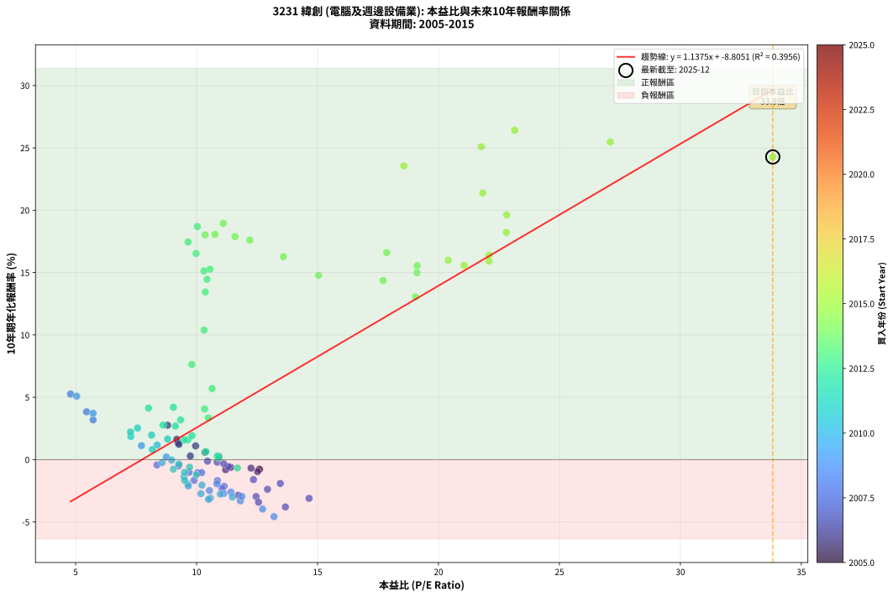
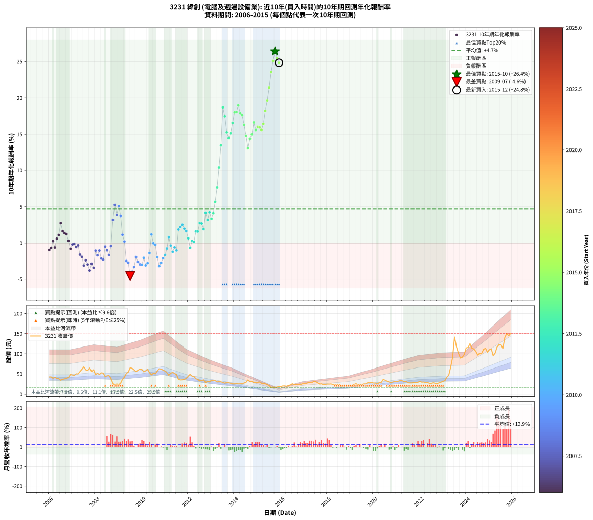

# 3231 緯創 - 本益比與未來報酬率分析

!!! info "報告資訊"
    - **股票代號**: 3231
    - **公司名稱**: 緯創
    - **產業別**: 電腦及週邊設備業
    - **分析期間**: 2005-2015 (121 個數據點)
    - **資料來源**: Type 12 (ShowMonthlyK_ChartFlow) 月收盤價與本益比
    - **報酬率口徑**: 含現金股利 (簡化: 年度合計，假設每年7/1入帳)
    - **報告生成時間**: 2025-12-23 12:19:16 CST

## 📈 視覺化圖表

### 圖表1: 本益比 vs 未來報酬率關係

*圖表1：3231 緯創 本益比與10年期未來報酬率關係 (2005-2015)*

### 圖表2: 歷年買入時點的10年期實際報酬率

*圖表2：3231 緯創 歷年買入時點的10年期實際報酬率 (2005-2015)*

## 📍 買點訊號說明

本報告提供兩種買點提示訊號（顯示於圖表2的股價子圖中）：

### ▲ 小綠色三角形（回測驗證）
- **計算方式**: 使用全部歷史資料計算本益比第25百分位數
- **用途**: 事後驗證，顯示歷史上哪些時點確實為低估區
- **限制**: 當下無法判斷，僅供回測參考
- **特性**: 後見之明（Look-Ahead Bias）

### ▲ 小橘色三角形（即時訊號）
- **計算方式**: 使用截至當月的過去5年資料計算本益比第25百分位數
- **用途**: 實際投資決策，當時即可判斷
- **優勢**: 可操作性強，符合實務需求
- **特性**: 無後見之明，滾動窗口計算

!!! tip "如何使用兩種訊號"
    - **綠色▲** 幫助理解歷史估值機會，驗證策略有效性
    - **橘色▲** 可作為實際買進參考，但仍需搭配基本面分析
    - 兩種訊號重疊時，表示即時判斷與事後驗證一致，信心度較高
    - 僅有綠色▲時，表示當時無法判斷（需要未來資料才能確認）
    - 僅有橘色▲時，表示即時判斷為買點，但事後可能不是最佳時機

## 📊 估值分析摘要

| 指標 | 數值 |
|:---:|:---:|
| **目前本益比** (2015-12) | **33.82 倍** |
| **歷史平均本益比** | 11.82 倍 |
| **估值水準** | 🔴 相對高估 |
| **預期10年年化報酬率** | **+29.67%** |
| **歷史平均報酬率** | +4.64% |
| **相關係數 (R²)** | 0.3956 |
| **趨勢線斜率** | 1.1375 |

!!! abstract "核心洞察"
    目前本益比顯著高於歷史平均，預期未來報酬率可能較低

    根據歷史數據回測，3231 緯創 在目前本益比 **33.8倍** 的估值水準下，
    預期未來10年年化報酬率約為 **+29.7%**。

    **重要提醒**: 本分析基於歷史數據統計，實際報酬率會受到公司基本面變化、產業趨勢、
    總體經濟環境等多重因素影響。R² = 0.40 表示本益比可解釋約 39.6% 的報酬率變異。

## 📈 歷史估值統計

### 最佳買點 (最高報酬率)

| 項目 | 數值 |
|:---:|:---:|
| 起始時間 | 2015-10 |
| 當時本益比 | 23.15 倍 |
| 起始價格 | 16.4 元 |
| 10年後價格 | 150.5 元 |
| **10年年化報酬率** | **+26.41%** |

### 最差買點 (最低報酬率)

| 項目 | 數值 |
|:---:|:---:|
| 起始時間 | 2009-07 |
| 當時本益比 | 13.20 倍 |
| 起始價格 | 65.4 元 |
| 10年後價格 | 23.3 元 |
| **10年年化報酬率** | **-4.57%** |

## 🎯 投資啟示

### 本益比與報酬率關係

趨勢線方程式: **y = 1.1375x + -8.8051**

!!! info "弱相關或正相關"
    本益比與未來報酬率相關性較弱。這可能表示該股票的報酬率更多受到
    公司成長性、產業趨勢等因素影響，而非估值水準。**需綜合考量多項指標**。

### 估值區間建議

基於歷史數據分析:

- **🟢 低估區** (P/E < 9.5): 預期報酬率較高，可考慮增加持股
- **🟡 合理區** (P/E 9.5-14.2): 預期報酬率符合長期趨勢，正常持有
- **🔴 高估區** (P/E > 14.2): 預期報酬率較低，可考慮減碼或觀望

!!! danger "風險提示"
    - 過去表現不代表未來結果
    - 本分析假設公司基本面無重大結構性變化
    - 產業環境劇變可能使歷史規律失效
    - 應結合公司財報、產業趨勢、總體經濟等多重因素綜合判斷

!!! success "長期投資觀點"
    歷史數據顯示，在合理或低估的估值水準買入並長期持有，
    往往能獲得較佳的投資報酬。**耐心等待好價格**是價值投資的核心原則。

## 📊 數據品質

- **資料來源**: GoodInfo.tw Type 12 (ShowMonthlyK_ChartFlow)
- **資料頻率**: 月度收盤價與本益比
- **回測期間**: 2005-2015
- **數據點數量**: 121 個 (每個點代表一次10年期回測)

### 計算方法說明

1. **10年期年化報酬率**:
   - 對每個歷史時點，計算其後10年的實際投資報酬率
   - 期末價值(不含股利): 期末價格
   - 期末價值(含現金股利): 期末價格 + 持有期間內的現金股利合計 (簡化: 年度合計，假設每年7/1入帳)
   - 公式: 年化報酬率 = [(期末價值/期初價格)^(1/年數) - 1] × 100%

2. **本益比 (P/E Ratio)**:
   - 使用當時的月收盤價與EPS計算
   - 資料來源: Type 12 月度河流圖本益比數據

3. **趨勢線 (Linear Regression)**:
   - 使用最小平方法擬合線性趨勢線
   - R²值衡量本益比對報酬率的解釋能力

---

*本報告由 Stock Analysis System v1.9.0 自動生成*
*數據更新時間: 2025-12-23 12:19:16 CST*

## 📋 月度回測明細表

（每一列對應時間線圖中的一個買入點；可用來對照 SVG 圖上的每個點。）

| 買入月份 | 賣出月份 | 回測期限_年 | 實際持有年數 | 買入本益比_倍 | 買入收盤價_元 | 賣出收盤價_元 | 現金股利合計_元 | 總報酬率_pct | 年化報酬率_pct |
| --- | --- | --- | --- | --- | --- | --- | --- | --- | --- |
| 2005-12 | 2015-12 | 10 | 9.999 | 12.60 | 41.70 | 18.60 | 19.99 | -7.45 | -0.77 |
| 2006-01 | 2016-01 | 10 | 9.999 | 12.52 | 42.50 | 18.60 | 19.99 | -9.19 | -0.96 |
| 2006-02 | 2016-02 | 10 | 9.999 | 12.25 | 42.60 | 19.80 | 19.99 | -6.59 | -0.68 |
| 2006-03 | 2016-03 | 10 | 10.001 | 10.92 | 38.90 | 19.90 | 19.99 | +2.56 | +0.25 |
| 2006-04 | 2016-04 | 10 | 10.001 | 11.41 | 41.60 | 19.10 | 19.99 | -6.02 | -0.62 |
| 2006-05 | 2016-05 | 10 | 10.001 | 10.35 | 38.60 | 20.95 | 19.99 | +6.07 | +0.59 |
| 2006-06 | 2016-06 | 10 | 10.001 | 9.96 | 38.00 | 22.40 | 19.99 | +11.56 | +1.10 |
| 2006-07 | 2016-07 | 10 | 10.001 | 8.80 | 34.30 | 25.35 | 19.68 | +31.27 | +2.76 |
| 2006-08 | 2016-08 | 10 | 10.001 | 9.18 | 36.55 | 23.30 | 19.68 | +17.58 | +1.63 |
| 2006-09 | 2016-09 | 10 | 10.001 | 9.23 | 37.55 | 23.30 | 19.68 | +14.45 | +1.36 |
| 2006-10 | 2016-10 | 10 | 10.001 | 9.27 | 38.50 | 23.80 | 19.68 | +12.93 | +1.22 |
| 2006-11 | 2016-11 | 10 | 10.001 | 9.74 | 41.25 | 22.80 | 19.68 | +2.97 | +0.29 |
| 2006-12 | 2016-12 | 10 | 10.001 | 11.20 | 48.40 | 24.95 | 19.68 | -7.80 | -0.81 |
| 2007-01 | 2017-01 | 10 | 10.001 | 10.85 | 47.30 | 26.65 | 19.68 | -2.06 | -0.21 |
| 2007-02 | 2017-02 | 10 | 10.001 | 10.45 | 46.00 | 25.75 | 19.68 | -1.25 | -0.13 |
| 2007-03 | 2017-03 | 10 | 10.001 | 11.31 | 50.20 | 27.80 | 19.68 | -5.42 | -0.56 |
| 2007-04 | 2017-04 | 10 | 10.001 | 11.12 | 49.80 | 28.50 | 19.68 | -3.26 | -0.33 |
| 2007-05 | 2017-05 | 10 | 10.001 | 12.35 | 55.80 | 27.80 | 19.68 | -14.92 | -1.60 |
| 2007-06 | 2017-06 | 10 | 10.001 | 13.46 | 61.40 | 30.95 | 19.68 | -17.55 | -1.91 |
| 2007-07 | 2017-07 | 10 | 10.001 | 14.65 | 67.40 | 30.50 | 18.66 | -27.05 | -3.10 |
| 2007-08 | 2017-08 | 10 | 10.001 | 12.93 | 60.00 | 28.50 | 18.66 | -21.39 | -2.38 |
| 2007-09 | 2017-09 | 10 | 10.001 | 12.46 | 58.30 | 24.50 | 18.66 | -25.96 | -2.96 |
| 2007-10 | 2017-10 | 10 | 10.001 | 13.67 | 64.50 | 25.15 | 18.66 | -32.07 | -3.79 |
| 2007-11 | 2017-11 | 10 | 10.001 | 11.72 | 55.80 | 23.10 | 18.66 | -25.15 | -2.86 |
| 2007-12 | 2017-12 | 10 | 10.001 | 12.56 | 60.30 | 23.95 | 18.66 | -29.33 | -3.41 |
| 2008-01 | 2018-01 | 10 | 10.001 | 10.04 | 48.00 | 24.50 | 18.66 | -10.07 | -1.06 |
| 2008-02 | 2018-03 | 10 | 10.081 | 10.86 | 51.70 | 24.90 | 18.66 | -15.74 | -1.68 |
| 2008-03 | 2018-03 | 10 | 9.999 | 10.21 | 48.40 | 24.90 | 18.66 | -9.99 | -1.05 |
| 2008-04 | 2018-04 | 10 | 9.999 | 11.14 | 52.60 | 23.70 | 18.66 | -19.46 | -2.14 |
| 2008-05 | 2018-05 | 10 | 9.999 | 11.05 | 52.00 | 22.55 | 18.66 | -20.74 | -2.30 |
| 2008-06 | 2018-06 | 10 | 9.999 | 9.26 | 43.40 | 22.65 | 18.66 | -4.80 | -0.49 |
| 2008-07 | 2018-07 | 10 | 9.999 | 9.69 | 45.20 | 23.65 | 17.18 | -9.67 | -1.01 |
| 2008-08 | 2018-08 | 10 | 9.999 | 9.90 | 46.00 | 21.75 | 17.18 | -15.37 | -1.66 |
| 2008-09 | 2018-09 | 10 | 9.999 | 8.36 | 38.70 | 19.90 | 17.18 | -4.19 | -0.43 |
| 2008-10 | 2018-10 | 10 | 9.999 | 5.72 | 26.35 | 18.90 | 17.18 | +36.93 | +3.19 |
| 2008-11 | 2018-11 | 10 | 9.999 | 4.79 | 22.00 | 19.55 | 17.18 | +66.95 | +5.26 |
| 2008-12 | 2018-12 | 10 | 9.999 | 5.45 | 24.90 | 19.10 | 17.18 | +45.70 | +3.84 |
| 2009-01 | 2019-01 | 10 | 9.999 | 5.04 | 23.30 | 21.10 | 17.18 | +64.29 | +5.09 |
| 2009-02 | 2019-02 | 10 | 9.999 | 5.72 | 26.75 | 21.35 | 17.18 | +44.04 | +3.72 |
| 2009-03 | 2019-03 | 10 | 9.999 | 7.72 | 36.55 | 23.70 | 17.18 | +11.85 | +1.13 |
| 2009-04 | 2019-04 | 10 | 9.999 | 8.75 | 41.90 | 25.60 | 17.18 | +2.10 | +0.21 |
| 2009-05 | 2019-05 | 10 | 9.999 | 10.53 | 51.00 | 22.50 | 17.18 | -22.20 | -2.48 |
| 2009-06 | 2019-06 | 10 | 9.999 | 11.12 | 54.50 | 24.20 | 17.18 | -24.07 | -2.72 |
| 2009-07 | 2019-07 | 10 | 9.999 | 13.20 | 65.40 | 23.30 | 17.68 | -37.33 | -4.57 |
| 2009-08 | 2019-08 | 10 | 9.999 | 12.73 | 63.80 | 24.90 | 17.68 | -33.25 | -3.96 |
| 2009-09 | 2019-09 | 10 | 9.999 | 11.81 | 59.80 | 25.05 | 17.68 | -28.54 | -3.30 |
| 2009-10 | 2019-10 | 10 | 9.999 | 10.84 | 55.50 | 27.95 | 17.68 | -17.77 | -1.94 |
| 2009-11 | 2019-11 | 10 | 9.999 | 11.42 | 59.10 | 27.70 | 17.68 | -23.21 | -2.61 |
| 2009-12 | 2019-12 | 10 | 9.999 | 11.87 | 62.10 | 28.35 | 17.68 | -25.87 | -2.95 |
| 2010-01 | 2020-01 | 10 | 9.999 | 11.48 | 60.90 | 27.25 | 17.68 | -26.22 | -2.99 |
| 2010-02 | 2020-02 | 10 | 9.999 | 10.22 | 55.00 | 27.05 | 17.68 | -18.66 | -2.04 |
| 2010-03 | 2020-03 | 10 | 10.001 | 10.57 | 57.70 | 24.50 | 17.68 | -26.89 | -3.08 |
| 2010-04 | 2020-04 | 10 | 10.001 | 10.98 | 60.80 | 28.25 | 17.68 | -24.45 | -2.76 |
| 2010-05 | 2020-05 | 10 | 10.001 | 9.48 | 53.20 | 28.60 | 17.68 | -13.00 | -1.38 |
| 2010-06 | 2020-06 | 10 | 10.001 | 8.37 | 47.60 | 35.80 | 17.68 | +12.36 | +1.17 |
| 2010-07 | 2020-07 | 10 | 10.001 | 8.97 | 51.70 | 34.50 | 17.01 | -0.37 | -0.04 |
| 2010-08 | 2020-08 | 10 | 10.001 | 8.57 | 50.10 | 31.90 | 17.01 | -2.38 | -0.24 |
| 2010-09 | 2020-09 | 10 | 10.001 | 9.63 | 57.00 | 29.80 | 17.01 | -17.88 | -1.95 |
| 2010-10 | 2020-10 | 10 | 10.001 | 10.49 | 62.90 | 28.50 | 17.01 | -27.65 | -3.18 |
| 2010-11 | 2020-11 | 10 | 10.001 | 10.18 | 61.80 | 29.85 | 17.01 | -24.18 | -2.73 |
| 2010-12 | 2020-12 | 10 | 10.001 | 9.66 | 59.40 | 31.00 | 17.01 | -19.18 | -2.11 |
| 2011-01 | 2021-01 | 10 | 10.001 | 9.50 | 57.00 | 31.25 | 17.01 | -15.34 | -1.65 |
| 2011-02 | 2021-02 | 10 | 10.001 | 9.04 | 52.90 | 32.00 | 17.01 | -7.36 | -0.76 |
| 2011-03 | 2021-03 | 10 | 10.001 | 8.17 | 46.60 | 33.50 | 17.01 | +8.39 | +0.81 |
| 2011-04 | 2021-04 | 10 | 10.001 | 9.27 | 51.50 | 32.70 | 17.01 | -3.48 | -0.35 |
| 2011-05 | 2021-05 | 10 | 10.001 | 9.99 | 54.00 | 30.75 | 17.01 | -11.56 | -1.22 |
| 2011-06 | 2021-06 | 10 | 10.001 | 9.71 | 51.00 | 31.00 | 17.01 | -5.87 | -0.60 |
| 2011-07 | 2021-07 | 10 | 10.001 | 9.50 | 48.50 | 27.75 | 16.01 | -9.77 | -1.02 |
| 2011-08 | 2021-08 | 10 | 10.001 | 7.28 | 36.10 | 27.40 | 16.01 | +20.25 | +1.86 |
| 2011-09 | 2021-09 | 10 | 10.001 | 7.27 | 34.95 | 27.50 | 16.01 | +24.50 | +2.22 |
| 2011-10 | 2021-10 | 10 | 10.001 | 7.56 | 35.20 | 29.20 | 16.01 | +28.44 | +2.53 |
| 2011-11 | 2021-11 | 10 | 10.001 | 8.14 | 36.70 | 28.60 | 16.01 | +21.56 | +1.97 |
| 2011-12 | 2021-12 | 10 | 10.001 | 8.80 | 38.35 | 29.15 | 16.01 | +17.76 | +1.65 |
| 2012-01 | 2022-01 | 10 | 10.001 | 10.39 | 44.40 | 31.35 | 16.01 | +6.67 | +0.65 |
| 2012-02 | 2022-03 | 10 | 10.081 | 11.69 | 48.95 | 29.75 | 16.01 | -6.51 | -0.67 |
| 2012-03 | 2022-03 | 10 | 9.999 | 10.85 | 44.50 | 29.75 | 16.01 | +2.84 | +0.28 |
| 2012-04 | 2022-04 | 10 | 9.999 | 10.92 | 43.85 | 28.50 | 16.01 | +1.51 | +0.15 |
| 2012-05 | 2022-05 | 10 | 9.999 | 9.64 | 37.90 | 28.40 | 16.01 | +17.18 | +1.60 |
| 2012-06 | 2022-06 | 10 | 9.999 | 9.49 | 36.50 | 26.70 | 16.01 | +17.02 | +1.58 |
| 2012-07 | 2022-07 | 10 | 9.999 | 8.61 | 32.35 | 26.50 | 16.01 | +31.41 | +2.77 |
| 2012-08 | 2022-08 | 10 | 9.999 | 9.12 | 33.50 | 27.70 | 16.01 | +30.48 | +2.70 |
| 2012-09 | 2022-09 | 10 | 9.999 | 9.81 | 35.20 | 26.55 | 16.01 | +20.91 | +1.92 |
| 2012-10 | 2022-10 | 10 | 9.999 | 8.01 | 28.05 | 26.05 | 16.01 | +49.95 | +4.14 |
| 2012-11 | 2022-11 | 10 | 9.999 | 9.34 | 31.90 | 27.65 | 16.01 | +36.87 | +3.19 |
| 2012-12 | 2022-12 | 10 | 9.999 | 9.04 | 30.10 | 29.40 | 16.01 | +50.87 | +4.20 |
| 2013-01 | 2023-01 | 10 | 9.999 | 10.48 | 34.20 | 31.50 | 16.01 | +38.92 | +3.34 |
| 2013-02 | 2023-02 | 10 | 9.999 | 10.33 | 33.00 | 33.15 | 16.01 | +48.98 | +4.07 |
| 2013-03 | 2023-03 | 10 | 9.999 | 10.64 | 33.25 | 41.85 | 16.01 | +74.02 | +5.70 |
| 2013-04 | 2023-04 | 10 | 9.999 | 9.80 | 29.95 | 46.50 | 16.01 | +108.72 | +7.64 |
| 2013-05 | 2023-05 | 10 | 9.999 | 10.31 | 30.80 | 66.70 | 16.01 | +168.55 | +10.38 |
| 2013-06 | 2023-06 | 10 | 9.999 | 10.36 | 30.25 | 90.80 | 16.01 | +253.10 | +13.45 |
| 2013-07 | 2023-07 | 10 | 9.999 | 10.03 | 28.60 | 141.50 | 17.11 | +454.58 | +18.69 |
| 2013-08 | 2023-08 | 10 | 9.999 | 9.65 | 26.85 | 117.00 | 17.11 | +399.48 | +17.45 |
| 2013-09 | 2023-09 | 10 | 9.999 | 10.55 | 28.65 | 101.50 | 17.11 | +314.00 | +15.27 |
| 2013-10 | 2023-10 | 10 | 9.999 | 10.43 | 27.60 | 89.40 | 17.11 | +285.91 | +14.46 |
| 2013-11 | 2023-11 | 10 | 9.999 | 10.30 | 26.55 | 91.50 | 17.11 | +309.08 | +15.13 |
| 2013-12 | 2023-12 | 10 | 9.999 | 9.98 | 25.05 | 98.60 | 17.11 | +361.92 | +16.54 |
| 2014-01 | 2024-01 | 10 | 9.999 | 10.35 | 25.10 | 114.50 | 17.11 | +424.35 | +18.02 |
| 2014-02 | 2024-02 | 10 | 9.999 | 10.76 | 25.20 | 115.50 | 17.11 | +426.23 | +18.07 |
| 2014-03 | 2024-03 | 10 | 10.001 | 11.10 | 25.05 | 125.00 | 17.11 | +467.31 | +18.95 |
| 2014-04 | 2024-04 | 10 | 10.001 | 11.59 | 25.20 | 113.50 | 17.11 | +418.30 | +17.88 |
| 2014-05 | 2024-05 | 10 | 10.001 | 12.20 | 25.50 | 112.00 | 17.11 | +406.32 | +17.61 |
| 2014-06 | 2024-06 | 10 | 10.001 | 13.59 | 27.25 | 106.00 | 17.11 | +351.78 | +16.27 |
| 2014-07 | 2024-07 | 10 | 10.001 | 15.04 | 28.90 | 96.80 | 17.91 | +296.91 | +14.78 |
| 2014-08 | 2024-08 | 10 | 10.001 | 19.05 | 35.00 | 101.50 | 17.91 | +241.17 | +13.05 |
| 2014-09 | 2024-09 | 10 | 10.001 | 17.71 | 31.05 | 101.00 | 17.91 | +282.96 | +14.37 |
| 2014-10 | 2024-10 | 10 | 10.001 | 19.11 | 31.90 | 111.00 | 17.91 | +304.10 | +14.98 |
| 2014-11 | 2024-11 | 10 | 10.001 | 17.86 | 28.30 | 113.50 | 17.91 | +364.34 | +16.59 |
| 2014-12 | 2024-12 | 10 | 10.001 | 19.12 | 28.70 | 104.00 | 17.91 | +324.77 | +15.56 |
| 2015-01 | 2025-01 | 10 | 10.001 | 20.40 | 29.00 | 110.00 | 17.91 | +341.06 | +16.00 |
| 2015-02 | 2025-02 | 10 | 10.001 | 22.09 | 29.65 | 112.00 | 17.91 | +338.14 | +15.92 |
| 2015-03 | 2025-03 | 10 | 10.001 | 21.06 | 26.60 | 95.30 | 17.91 | +325.59 | +15.58 |
| 2015-04 | 2025-04 | 10 | 10.001 | 22.09 | 26.15 | 101.50 | 17.91 | +356.63 | +16.40 |
| 2015-05 | 2025-05 | 10 | 10.001 | 22.81 | 25.20 | 116.50 | 17.91 | +433.37 | +18.22 |
| 2015-06 | 2025-06 | 10 | 10.001 | 22.82 | 23.40 | 122.50 | 17.91 | +500.03 | +19.62 |
| 2015-07 | 2025-07 | 10 | 10.001 | 21.83 | 20.65 | 123.00 | 20.48 | +594.80 | +21.39 |
| 2015-08 | 2025-08 | 10 | 10.001 | 18.57 | 16.10 | 113.00 | 20.48 | +729.05 | +23.55 |
| 2015-09 | 2025-09 | 10 | 10.001 | 21.77 | 17.15 | 140.50 | 20.48 | +838.64 | +25.09 |
| 2015-10 | 2025-10 | 10 | 10.001 | 23.15 | 16.40 | 150.50 | 20.48 | +942.54 | +26.41 |
| 2015-11 | 2025-11 | 10 | 10.001 | 27.10 | 17.05 | 144.50 | 20.48 | +867.61 | +25.47 |
| 2015-12 | 2025-12 | 10 | 10.001 | 33.82 | 18.60 | 143.00 | 20.48 | +778.91 | +24.27 |
