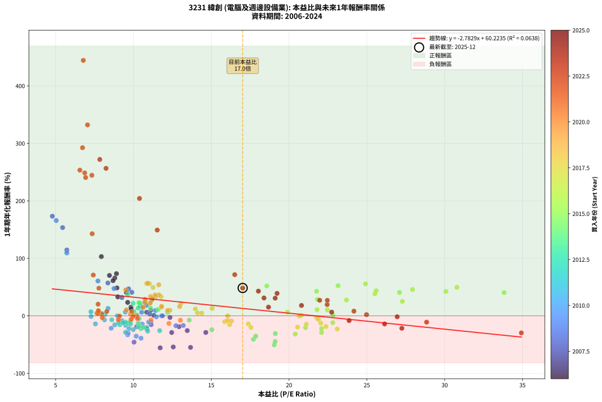
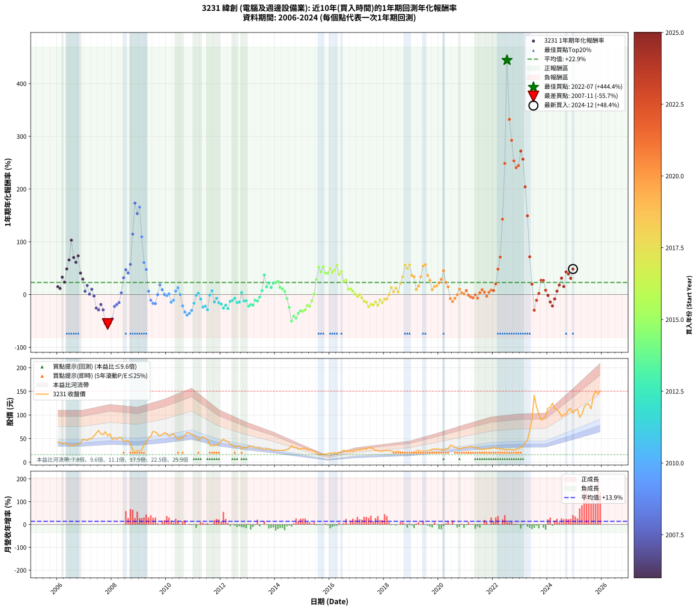

# 3231 緯創 - 本益比與未來報酬率分析

!!! info "報告資訊"
    - **股票代號**: 3231
    - **公司名稱**: 緯創
    - **產業別**: 電腦及週邊設備業
    - **分析期間**: 2006-2024 (228 個數據點)
    - **資料來源**: Type 12 (ShowMonthlyK_ChartFlow) 月收盤價與本益比
    - **報酬率口徑**: 含現金股利 (簡化: 年度合計，假設每年7/1入帳)
    - **報告生成時間**: 2026-01-10 21:00:35 CST

## 📈 視覺化圖表

### 圖表1: 本益比 vs 未來報酬率關係

*圖表1：3231 緯創 本益比與1年期未來報酬率關係 (2006-2024)*

### 圖表2: 歷年買入時點的1年期實際報酬率

*圖表2：3231 緯創 歷年買入時點的1年期實際報酬率 (2006-2024)*

## 📍 買點訊號說明

本報告提供兩種買點提示訊號（顯示於圖表2的股價子圖中）：

### ▲ 小綠色三角形（回測驗證）
- **計算方式**: 使用全部歷史資料計算本益比第25百分位數
- **用途**: 事後驗證，顯示歷史上哪些時點確實為低估區
- **限制**: 當下無法判斷，僅供回測參考
- **特性**: 後見之明（Look-Ahead Bias）

### ▲ 小橘色三角形（即時訊號）
- **計算方式**: 使用截至當月的過去5年資料計算本益比第25百分位數
- **用途**: 實際投資決策，當時即可判斷
- **優勢**: 可操作性強，符合實務需求
- **特性**: 無後見之明，滾動窗口計算

!!! tip "如何使用兩種訊號"
    - **綠色▲** 幫助理解歷史估值機會，驗證策略有效性
    - **橘色▲** 可作為實際買進參考，但仍需搭配基本面分析
    - 兩種訊號重疊時，表示即時判斷與事後驗證一致，信心度較高
    - 僅有綠色▲時，表示當時無法判斷（需要未來資料才能確認）
    - 僅有橘色▲時，表示即時判斷為買點，但事後可能不是最佳時機

## 📊 估值分析摘要

| 指標 | 數值 |
|:---:|:---:|
| **目前本益比** (2024-12) | **17.02 倍** |
| **歷史平均本益比** | 13.43 倍 |
| **估值水準** | 🔴 相對高估 |
| **預期1年年化報酬率** | **+12.86%** |
| **歷史平均報酬率** | +22.85% |
| **相關係數 (R²)** | 0.0638 |
| **趨勢線斜率** | -2.7829 |

!!! abstract "核心洞察"
    目前本益比顯著高於歷史平均，預期未來報酬率可能較低

    根據歷史數據回測，3231 緯創 在目前本益比 **17.0倍** 的估值水準下，
    預期未來1年年化報酬率約為 **+12.9%**。

    **重要提醒**: 本分析基於歷史數據統計，實際報酬率會受到公司基本面變化、產業趨勢、
    總體經濟環境等多重因素影響。R² = 0.06 表示本益比可解釋約 6.4% 的報酬率變異。

## 📈 歷史估值統計

### 最佳買點 (最高報酬率)

| 項目 | 數值 |
|:---:|:---:|
| 起始時間 | 2022-07 |
| 當時本益比 | 6.78 倍 |
| 起始價格 | 26.5 元 |
| 1年後價格 | 141.5 元 |
| **1年年化報酬率** | **+444.40%** |

### 最差買點 (最低報酬率)

| 項目 | 數值 |
|:---:|:---:|
| 起始時間 | 2007-11 |
| 當時本益比 | 11.72 倍 |
| 起始價格 | 55.8 元 |
| 1年後價格 | 22.0 元 |
| **1年年化報酬率** | **-55.74%** |

## 🎯 投資啟示

### 本益比與報酬率關係

趨勢線方程式: **y = -2.7829x + 60.2235**

!!! warning "強負相關"
    本益比與未來報酬率呈現強負相關。在高本益比時期買入，未來報酬率顯著較低；
    在低本益比時期買入，未來報酬率顯著較高。**估值紀律至關重要**。

### 估值區間建議

基於歷史數據分析:

- **🟢 低估區** (P/E < 10.7): 預期報酬率較高，可考慮增加持股
- **🟡 合理區** (P/E 10.7-16.1): 預期報酬率符合長期趨勢，正常持有
- **🔴 高估區** (P/E > 16.1): 預期報酬率較低，可考慮減碼或觀望

!!! danger "風險提示"
    - 過去表現不代表未來結果
    - 本分析假設公司基本面無重大結構性變化
    - 產業環境劇變可能使歷史規律失效
    - 應結合公司財報、產業趨勢、總體經濟等多重因素綜合判斷

!!! success "長期投資觀點"
    歷史數據顯示，在合理或低估的估值水準買入並長期持有，
    往往能獲得較佳的投資報酬。**耐心等待好價格**是價值投資的核心原則。

## 📊 數據品質

- **資料來源**: GoodInfo.tw Type 12 (ShowMonthlyK_ChartFlow)
- **資料頻率**: 月度收盤價與本益比
- **回測期間**: 2006-2024
- **數據點數量**: 228 個 (每個點代表一次1年期回測)

### 計算方法說明

1. **1年期年化報酬率**:
   - 對每個歷史時點，計算其後1年的實際投資報酬率
   - 期末價值(不含股利): 期末價格
   - 期末價值(含現金股利): 期末價格 + 持有期間內的現金股利合計 (簡化: 年度合計，假設每年7/1入帳)
   - 公式: 年化報酬率 = [(期末價值/期初價格)^(1/年數) - 1] × 100%

2. **本益比 (P/E Ratio)**:
   - 使用當時的月收盤價與EPS計算
   - 資料來源: Type 12 月度河流圖本益比數據

3. **趨勢線 (Linear Regression)**:
   - 使用最小平方法擬合線性趨勢線
   - R²值衡量本益比對報酬率的解釋能力

---

*本報告由 Stock Analysis System v1.9.0 自動生成*
*數據更新時間: 2026-01-10 21:00:35 CST*

## 📋 月度回測明細表

（每一列對應時間線圖中的一個買入點；可用來對照 SVG 圖上的每個點。）

| 買入月份 | 賣出月份 | 回測期限_年 | 實際持有年數 | 買入本益比_倍 | 買入收盤價_元 | 賣出收盤價_元 | 現金股利合計_元 | 總報酬率_pct | 年化報酬率_pct |
| --- | --- | --- | --- | --- | --- | --- | --- | --- | --- |
| 2006-01 | 2007-01 | 1 | 0.999 | 9.84 | 42.50 | 47.30 | 1.51 | +14.86 | +14.87 |
| 2006-02 | 2007-02 | 1 | 0.999 | 9.86 | 42.60 | 46.00 | 1.51 | +11.54 | +11.54 |
| 2006-03 | 2007-03 | 1 | 0.999 | 9.00 | 38.90 | 50.20 | 1.51 | +32.94 | +32.97 |
| 2006-04 | 2007-04 | 1 | 0.999 | 9.63 | 41.60 | 49.80 | 1.51 | +23.35 | +23.37 |
| 2006-05 | 2007-05 | 1 | 0.999 | 8.94 | 38.60 | 55.80 | 1.51 | +48.48 | +48.52 |
| 2006-06 | 2007-06 | 1 | 0.999 | 8.80 | 38.00 | 61.40 | 1.51 | +65.56 | +65.62 |
| 2006-07 | 2007-07 | 1 | 0.999 | 7.94 | 34.30 | 67.40 | 2.20 | +102.90 | +103.00 |
| 2006-08 | 2007-08 | 1 | 0.999 | 8.46 | 36.55 | 60.00 | 2.20 | +70.17 | +70.23 |
| 2006-09 | 2007-09 | 1 | 0.999 | 8.69 | 37.55 | 58.30 | 2.20 | +61.11 | +61.16 |
| 2006-10 | 2007-10 | 1 | 0.999 | 8.91 | 38.50 | 64.50 | 2.20 | +73.24 | +73.30 |
| 2006-11 | 2007-11 | 1 | 0.999 | 9.55 | 41.25 | 55.80 | 2.20 | +40.60 | +40.63 |
| 2006-12 | 2007-12 | 1 | 0.999 | 11.20 | 48.40 | 60.30 | 2.20 | +29.12 | +29.15 |
| 2007-01 | 2008-01 | 1 | 0.999 | 10.85 | 47.30 | 48.00 | 2.20 | +6.12 | +6.13 |
| 2007-02 | 2008-02 | 1 | 0.999 | 10.45 | 46.00 | 51.70 | 2.20 | +17.17 | +17.18 |
| 2007-03 | 2008-03 | 1 | 1.002 | 11.31 | 50.20 | 48.40 | 2.20 | +0.79 | +0.79 |
| 2007-04 | 2008-04 | 1 | 1.002 | 11.12 | 49.80 | 52.60 | 2.20 | +10.03 | +10.01 |
| 2007-05 | 2008-05 | 1 | 1.002 | 12.35 | 55.80 | 52.00 | 2.20 | -2.87 | -2.87 |
| 2007-06 | 2008-06 | 1 | 1.002 | 13.46 | 61.40 | 43.40 | 2.20 | -25.74 | -25.69 |
| 2007-07 | 2008-07 | 1 | 1.002 | 14.65 | 67.40 | 45.20 | 2.65 | -29.00 | -28.95 |
| 2007-08 | 2008-08 | 1 | 1.002 | 12.93 | 60.00 | 46.00 | 2.65 | -18.91 | -18.88 |
| 2007-09 | 2008-09 | 1 | 1.002 | 12.46 | 58.30 | 38.70 | 2.65 | -29.07 | -29.02 |
| 2007-10 | 2008-10 | 1 | 1.002 | 13.67 | 64.50 | 26.35 | 2.65 | -55.03 | -54.96 |
| 2007-11 | 2008-11 | 1 | 1.002 | 11.72 | 55.80 | 22.00 | 2.65 | -55.82 | -55.74 |
| 2007-12 | 2008-12 | 1 | 1.002 | 12.56 | 60.30 | 24.90 | 2.65 | -54.31 | -54.23 |
| 2008-01 | 2009-01 | 1 | 1.002 | 10.04 | 48.00 | 23.30 | 2.65 | -45.93 | -45.86 |
| 2008-02 | 2009-03 | 1 | 1.081 | 10.86 | 51.70 | 36.55 | 2.65 | -24.17 | -22.57 |
| 2008-03 | 2009-03 | 1 | 0.999 | 10.21 | 48.40 | 36.55 | 2.65 | -19.00 | -19.01 |
| 2008-04 | 2009-04 | 1 | 0.999 | 11.14 | 52.60 | 41.90 | 2.65 | -15.30 | -15.31 |
| 2008-05 | 2009-05 | 1 | 0.999 | 11.05 | 52.00 | 51.00 | 2.65 | +3.18 | +3.18 |
| 2008-06 | 2009-06 | 1 | 0.999 | 9.26 | 43.40 | 54.50 | 2.65 | +31.69 | +31.72 |
| 2008-07 | 2009-07 | 1 | 0.999 | 9.69 | 45.20 | 65.40 | 0.98 | +46.87 | +46.90 |
| 2008-08 | 2009-08 | 1 | 0.999 | 9.90 | 46.00 | 63.80 | 0.98 | +40.83 | +40.87 |
| 2008-09 | 2009-09 | 1 | 0.999 | 8.36 | 38.70 | 59.80 | 0.98 | +57.06 | +57.11 |
| 2008-10 | 2009-10 | 1 | 0.999 | 5.72 | 26.35 | 55.50 | 0.98 | +114.36 | +114.47 |
| 2008-11 | 2009-11 | 1 | 0.999 | 4.79 | 22.00 | 59.10 | 0.98 | +173.10 | +173.29 |
| 2008-12 | 2009-12 | 1 | 0.999 | 5.45 | 24.90 | 62.10 | 0.98 | +153.35 | +153.51 |
| 2009-01 | 2010-01 | 1 | 0.999 | 5.04 | 23.30 | 60.90 | 0.98 | +165.59 | +165.77 |
| 2009-02 | 2010-02 | 1 | 0.999 | 5.72 | 26.75 | 55.00 | 0.98 | +109.28 | +109.39 |
| 2009-03 | 2010-03 | 1 | 0.999 | 7.72 | 36.55 | 57.70 | 0.98 | +60.56 | +60.61 |
| 2009-04 | 2010-04 | 1 | 0.999 | 8.75 | 41.90 | 60.80 | 0.98 | +47.45 | +47.49 |
| 2009-05 | 2010-05 | 1 | 0.999 | 10.53 | 51.00 | 53.20 | 0.98 | +6.24 | +6.25 |
| 2009-06 | 2010-06 | 1 | 0.999 | 11.12 | 54.50 | 47.60 | 0.98 | -10.86 | -10.86 |
| 2009-07 | 2010-07 | 1 | 0.999 | 13.20 | 65.40 | 51.70 | 2.72 | -16.79 | -16.80 |
| 2009-08 | 2010-08 | 1 | 0.999 | 12.73 | 63.80 | 50.10 | 2.72 | -17.21 | -17.22 |
| 2009-09 | 2010-09 | 1 | 0.999 | 11.81 | 59.80 | 57.00 | 2.72 | -0.14 | -0.14 |
| 2009-10 | 2010-10 | 1 | 0.999 | 10.84 | 55.50 | 62.90 | 2.72 | +18.23 | +18.25 |
| 2009-11 | 2010-11 | 1 | 0.999 | 11.42 | 59.10 | 61.80 | 2.72 | +9.17 | +9.18 |
| 2009-12 | 2010-12 | 1 | 0.999 | 11.87 | 62.10 | 59.40 | 2.72 | +0.03 | +0.03 |
| 2010-01 | 2011-01 | 1 | 0.999 | 11.48 | 60.90 | 57.00 | 2.72 | -1.94 | -1.94 |
| 2010-02 | 2011-02 | 1 | 0.999 | 10.22 | 55.00 | 52.90 | 2.72 | +1.13 | +1.13 |
| 2010-03 | 2011-03 | 1 | 0.999 | 10.57 | 57.70 | 46.60 | 2.72 | -14.53 | -14.53 |
| 2010-04 | 2011-04 | 1 | 0.999 | 10.98 | 60.80 | 51.50 | 2.72 | -10.82 | -10.83 |
| 2010-05 | 2011-05 | 1 | 0.999 | 9.48 | 53.20 | 54.00 | 2.72 | +6.61 | +6.62 |
| 2010-06 | 2011-06 | 1 | 0.999 | 8.37 | 47.60 | 51.00 | 2.72 | +12.86 | +12.86 |
| 2010-07 | 2011-07 | 1 | 0.999 | 8.97 | 51.70 | 48.50 | 3.20 | -0.01 | -0.01 |
| 2010-08 | 2011-08 | 1 | 0.999 | 8.57 | 50.10 | 36.10 | 3.20 | -21.56 | -21.58 |
| 2010-09 | 2011-09 | 1 | 0.999 | 9.63 | 57.00 | 34.95 | 3.20 | -33.08 | -33.10 |
| 2010-10 | 2011-10 | 1 | 0.999 | 10.49 | 62.90 | 35.20 | 3.20 | -38.96 | -38.98 |
| 2010-11 | 2011-11 | 1 | 0.999 | 10.18 | 61.80 | 36.70 | 3.20 | -35.44 | -35.46 |
| 2010-12 | 2011-12 | 1 | 0.999 | 9.66 | 59.40 | 38.35 | 3.20 | -30.06 | -30.07 |
| 2011-01 | 2012-01 | 1 | 0.999 | 9.50 | 57.00 | 44.40 | 3.20 | -16.50 | -16.51 |
| 2011-02 | 2012-02 | 1 | 0.999 | 9.04 | 52.90 | 48.95 | 3.20 | -1.43 | -1.43 |
| 2011-03 | 2012-03 | 1 | 1.002 | 8.17 | 46.60 | 44.50 | 3.20 | +2.35 | +2.35 |
| 2011-04 | 2012-04 | 1 | 1.002 | 9.27 | 51.50 | 43.85 | 3.20 | -8.65 | -8.63 |
| 2011-05 | 2012-05 | 1 | 1.002 | 9.99 | 54.00 | 37.90 | 3.20 | -23.90 | -23.85 |
| 2011-06 | 2012-06 | 1 | 1.002 | 9.71 | 51.00 | 36.50 | 3.20 | -22.16 | -22.12 |
| 2011-07 | 2012-07 | 1 | 1.002 | 9.50 | 48.50 | 32.35 | 2.20 | -28.76 | -28.71 |
| 2011-08 | 2012-08 | 1 | 1.002 | 7.28 | 36.10 | 33.50 | 2.20 | -1.11 | -1.11 |
| 2011-09 | 2012-09 | 1 | 1.002 | 7.27 | 34.95 | 35.20 | 2.20 | +7.01 | +7.00 |
| 2011-10 | 2012-10 | 1 | 1.002 | 7.56 | 35.20 | 28.05 | 2.20 | -14.06 | -14.04 |
| 2011-11 | 2012-11 | 1 | 1.002 | 8.14 | 36.70 | 31.90 | 2.20 | -7.08 | -7.07 |
| 2011-12 | 2012-12 | 1 | 1.002 | 8.80 | 38.35 | 30.10 | 2.20 | -15.78 | -15.75 |
| 2012-01 | 2013-01 | 1 | 1.002 | 10.39 | 44.40 | 34.20 | 2.20 | -18.02 | -17.98 |
| 2012-02 | 2013-03 | 1 | 1.081 | 11.69 | 48.95 | 33.25 | 2.20 | -27.58 | -25.80 |
| 2012-03 | 2013-03 | 1 | 0.999 | 10.85 | 44.50 | 33.25 | 2.20 | -20.34 | -20.35 |
| 2012-04 | 2013-04 | 1 | 0.999 | 10.92 | 43.85 | 29.95 | 2.20 | -26.68 | -26.70 |
| 2012-05 | 2013-05 | 1 | 0.999 | 9.64 | 37.90 | 30.80 | 2.20 | -12.93 | -12.94 |
| 2012-06 | 2013-06 | 1 | 0.999 | 9.49 | 36.50 | 30.25 | 2.20 | -11.10 | -11.10 |
| 2012-07 | 2013-07 | 1 | 0.999 | 8.61 | 32.35 | 28.60 | 1.50 | -6.96 | -6.96 |
| 2012-08 | 2013-08 | 1 | 0.999 | 9.12 | 33.50 | 26.85 | 1.50 | -15.37 | -15.38 |
| 2012-09 | 2013-09 | 1 | 0.999 | 9.81 | 35.20 | 28.65 | 1.50 | -14.35 | -14.36 |
| 2012-10 | 2013-10 | 1 | 0.999 | 8.01 | 28.05 | 27.60 | 1.50 | +3.74 | +3.75 |
| 2012-11 | 2013-11 | 1 | 0.999 | 9.34 | 31.90 | 26.55 | 1.50 | -12.07 | -12.08 |
| 2012-12 | 2013-12 | 1 | 0.999 | 9.04 | 30.10 | 25.05 | 1.50 | -11.79 | -11.80 |
| 2013-01 | 2014-01 | 1 | 0.999 | 10.48 | 34.20 | 25.10 | 1.50 | -22.22 | -22.24 |
| 2013-02 | 2014-02 | 1 | 0.999 | 10.33 | 33.00 | 25.20 | 1.50 | -19.09 | -19.10 |
| 2013-03 | 2014-03 | 1 | 0.999 | 10.64 | 33.25 | 25.05 | 1.50 | -20.15 | -20.16 |
| 2013-04 | 2014-04 | 1 | 0.999 | 9.80 | 29.95 | 25.20 | 1.50 | -10.85 | -10.86 |
| 2013-05 | 2014-05 | 1 | 0.999 | 10.31 | 30.80 | 25.50 | 1.50 | -12.34 | -12.35 |
| 2013-06 | 2014-06 | 1 | 0.999 | 10.36 | 30.25 | 27.25 | 1.50 | -4.96 | -4.96 |
| 2013-07 | 2014-07 | 1 | 0.999 | 10.03 | 28.60 | 28.90 | 1.80 | +7.35 | +7.35 |
| 2013-08 | 2014-08 | 1 | 0.999 | 9.65 | 26.85 | 35.00 | 1.80 | +37.07 | +37.09 |
| 2013-09 | 2014-09 | 1 | 0.999 | 10.55 | 28.65 | 31.05 | 1.80 | +14.67 | +14.68 |
| 2013-10 | 2014-10 | 1 | 0.999 | 10.43 | 27.60 | 31.90 | 1.80 | +22.11 | +22.13 |
| 2013-11 | 2014-11 | 1 | 0.999 | 10.30 | 26.55 | 28.30 | 1.80 | +13.38 | +13.39 |
| 2013-12 | 2014-12 | 1 | 0.999 | 9.98 | 25.05 | 28.70 | 1.80 | +21.76 | +21.78 |
| 2014-01 | 2015-01 | 1 | 0.999 | 10.35 | 25.10 | 29.00 | 1.80 | +22.72 | +22.73 |
| 2014-02 | 2015-02 | 1 | 0.999 | 10.76 | 25.20 | 29.65 | 1.80 | +24.81 | +24.83 |
| 2014-03 | 2015-03 | 1 | 0.999 | 11.10 | 25.05 | 26.60 | 1.80 | +13.38 | +13.39 |
| 2014-04 | 2015-04 | 1 | 0.999 | 11.59 | 25.20 | 26.15 | 1.80 | +10.92 | +10.93 |
| 2014-05 | 2015-05 | 1 | 0.999 | 12.20 | 25.50 | 25.20 | 1.80 | +5.89 | +5.89 |
| 2014-06 | 2015-06 | 1 | 0.999 | 13.59 | 27.25 | 23.40 | 1.80 | -7.52 | -7.52 |
| 2014-07 | 2015-07 | 1 | 0.999 | 15.04 | 28.90 | 20.65 | 1.23 | -24.29 | -24.31 |
| 2014-08 | 2015-08 | 1 | 0.999 | 19.05 | 35.00 | 16.10 | 1.23 | -50.49 | -50.51 |
| 2014-09 | 2015-09 | 1 | 0.999 | 17.71 | 31.05 | 17.15 | 1.23 | -40.81 | -40.83 |
| 2014-10 | 2015-10 | 1 | 0.999 | 19.11 | 31.90 | 16.40 | 1.23 | -44.73 | -44.76 |
| 2014-11 | 2015-11 | 1 | 0.999 | 17.86 | 28.30 | 17.05 | 1.23 | -35.41 | -35.43 |
| 2014-12 | 2015-12 | 1 | 0.999 | 19.12 | 28.70 | 18.60 | 1.23 | -30.91 | -30.92 |
| 2015-01 | 2016-01 | 1 | 0.999 | 20.40 | 29.00 | 18.60 | 1.23 | -31.62 | -31.64 |
| 2015-02 | 2016-02 | 1 | 0.999 | 22.09 | 29.65 | 19.80 | 1.23 | -29.07 | -29.09 |
| 2015-03 | 2016-03 | 1 | 1.002 | 21.06 | 26.60 | 19.90 | 1.23 | -20.56 | -20.53 |
| 2015-04 | 2016-04 | 1 | 1.002 | 22.09 | 26.15 | 19.10 | 1.23 | -22.26 | -22.22 |
| 2015-05 | 2016-05 | 1 | 1.002 | 22.81 | 25.20 | 20.95 | 1.23 | -11.98 | -11.96 |
| 2015-06 | 2016-06 | 1 | 1.002 | 22.82 | 23.40 | 22.40 | 1.23 | +0.98 | +0.98 |
| 2015-07 | 2016-07 | 1 | 1.002 | 21.83 | 20.65 | 25.35 | 1.20 | +28.56 | +28.49 |
| 2015-08 | 2016-08 | 1 | 1.002 | 18.57 | 16.10 | 23.30 | 1.20 | +52.16 | +52.02 |
| 2015-09 | 2016-09 | 1 | 1.002 | 21.77 | 17.15 | 23.30 | 1.20 | +42.84 | +42.74 |
| 2015-10 | 2016-10 | 1 | 1.002 | 23.15 | 16.40 | 23.80 | 1.20 | +52.42 | +52.29 |
| 2015-11 | 2016-11 | 1 | 1.002 | 27.10 | 17.05 | 22.80 | 1.20 | +40.74 | +40.65 |
| 2015-12 | 2016-12 | 1 | 1.002 | 33.82 | 18.60 | 24.95 | 1.20 | +40.58 | +40.48 |
| 2016-01 | 2017-01 | 1 | 1.002 | 30.79 | 18.60 | 26.65 | 1.20 | +49.72 | +49.59 |
| 2016-02 | 2017-03 | 1 | 1.081 | 30.08 | 19.80 | 27.80 | 1.20 | +46.45 | +42.30 |
| 2016-03 | 2017-03 | 1 | 0.999 | 27.93 | 19.90 | 27.80 | 1.20 | +45.71 | +45.75 |
| 2016-04 | 2017-04 | 1 | 0.999 | 24.91 | 19.10 | 28.50 | 1.20 | +55.48 | +55.53 |
| 2016-05 | 2017-05 | 1 | 0.999 | 25.52 | 20.95 | 27.80 | 1.20 | +38.41 | +38.44 |
| 2016-06 | 2017-06 | 1 | 0.999 | 25.60 | 22.40 | 30.95 | 1.20 | +43.51 | +43.55 |
| 2016-07 | 2017-07 | 1 | 0.999 | 27.28 | 25.35 | 30.50 | 1.18 | +24.99 | +25.01 |
| 2016-08 | 2017-08 | 1 | 0.999 | 23.69 | 23.30 | 28.50 | 1.18 | +27.40 | +27.42 |
| 2016-09 | 2017-09 | 1 | 0.999 | 22.46 | 23.30 | 24.50 | 1.18 | +10.23 | +10.24 |
| 2016-10 | 2017-10 | 1 | 0.999 | 21.80 | 23.80 | 25.15 | 1.18 | +10.65 | +10.65 |
| 2016-11 | 2017-11 | 1 | 0.999 | 19.90 | 22.80 | 23.10 | 1.18 | +6.51 | +6.51 |
| 2016-12 | 2017-12 | 1 | 0.999 | 20.79 | 24.95 | 23.95 | 1.18 | +0.74 | +0.74 |
| 2017-01 | 2018-01 | 1 | 0.999 | 21.78 | 26.65 | 24.50 | 1.18 | -3.62 | -3.63 |
| 2017-02 | 2018-02 | 1 | 0.999 | 20.66 | 25.75 | 24.50 | 1.18 | -0.26 | -0.26 |
| 2017-03 | 2018-03 | 1 | 0.999 | 21.89 | 27.80 | 24.90 | 1.18 | -6.17 | -6.18 |
| 2017-04 | 2018-04 | 1 | 0.999 | 22.04 | 28.50 | 23.70 | 1.18 | -12.69 | -12.70 |
| 2017-05 | 2018-05 | 1 | 0.999 | 21.11 | 27.80 | 22.55 | 1.18 | -14.63 | -14.64 |
| 2017-06 | 2018-06 | 1 | 0.999 | 23.10 | 30.95 | 22.65 | 1.18 | -22.99 | -23.01 |
| 2017-07 | 2018-07 | 1 | 0.999 | 22.37 | 30.50 | 23.65 | 1.17 | -18.63 | -18.64 |
| 2017-08 | 2018-08 | 1 | 0.999 | 20.55 | 28.50 | 21.75 | 1.17 | -19.58 | -19.59 |
| 2017-09 | 2018-09 | 1 | 0.999 | 17.38 | 24.50 | 19.90 | 1.17 | -14.00 | -14.01 |
| 2017-10 | 2018-10 | 1 | 0.999 | 17.55 | 25.15 | 18.90 | 1.17 | -20.20 | -20.22 |
| 2017-11 | 2018-11 | 1 | 0.999 | 15.86 | 23.10 | 19.55 | 1.17 | -10.31 | -10.31 |
| 2017-12 | 2018-12 | 1 | 0.999 | 16.18 | 23.95 | 19.10 | 1.17 | -15.37 | -15.38 |
| 2018-01 | 2019-01 | 1 | 0.999 | 16.30 | 24.50 | 21.10 | 1.17 | -9.11 | -9.11 |
| 2018-02 | 2019-02 | 1 | 0.999 | 16.05 | 24.50 | 21.35 | 1.17 | -8.09 | -8.09 |
| 2018-03 | 2019-03 | 1 | 0.999 | 16.06 | 24.90 | 23.70 | 1.17 | -0.12 | -0.12 |
| 2018-04 | 2019-04 | 1 | 0.999 | 15.06 | 23.70 | 25.60 | 1.17 | +12.95 | +12.96 |
| 2018-05 | 2019-05 | 1 | 0.999 | 14.12 | 22.55 | 22.50 | 1.17 | +4.96 | +4.97 |
| 2018-06 | 2019-06 | 1 | 0.999 | 13.98 | 22.65 | 24.20 | 1.17 | +12.00 | +12.01 |
| 2018-07 | 2019-07 | 1 | 0.999 | 14.39 | 23.65 | 23.30 | 1.49 | +4.81 | +4.82 |
| 2018-08 | 2019-08 | 1 | 0.999 | 13.05 | 21.75 | 24.90 | 1.49 | +21.32 | +21.34 |
| 2018-09 | 2019-09 | 1 | 0.999 | 11.78 | 19.90 | 25.05 | 1.49 | +33.36 | +33.38 |
| 2018-10 | 2019-10 | 1 | 0.999 | 11.03 | 18.90 | 27.95 | 1.49 | +55.76 | +55.80 |
| 2018-11 | 2019-11 | 1 | 0.999 | 11.26 | 19.55 | 27.70 | 1.49 | +49.30 | +49.34 |
| 2018-12 | 2019-12 | 1 | 0.999 | 10.85 | 19.10 | 28.35 | 1.49 | +56.22 | +56.27 |
| 2019-01 | 2020-01 | 1 | 0.999 | 11.64 | 21.10 | 27.25 | 1.49 | +36.20 | +36.23 |
| 2019-02 | 2020-02 | 1 | 0.999 | 11.44 | 21.35 | 27.05 | 1.49 | +33.67 | +33.69 |
| 2019-03 | 2020-03 | 1 | 1.002 | 12.34 | 23.70 | 24.50 | 1.49 | +9.65 | +9.63 |
| 2019-04 | 2020-04 | 1 | 1.002 | 12.97 | 25.60 | 28.25 | 1.49 | +16.16 | +16.13 |
| 2019-05 | 2020-05 | 1 | 1.002 | 11.10 | 22.50 | 28.60 | 1.49 | +33.72 | +33.64 |
| 2019-06 | 2020-06 | 1 | 1.002 | 11.63 | 24.20 | 35.80 | 1.49 | +54.08 | +53.95 |
| 2019-07 | 2020-07 | 1 | 1.002 | 10.92 | 23.30 | 34.50 | 2.04 | +56.83 | +56.69 |
| 2019-08 | 2020-08 | 1 | 1.002 | 11.39 | 24.90 | 31.90 | 2.04 | +36.31 | +36.23 |
| 2019-09 | 2020-09 | 1 | 1.002 | 11.18 | 25.05 | 29.80 | 2.04 | +27.11 | +27.05 |
| 2019-10 | 2020-10 | 1 | 1.002 | 12.19 | 27.95 | 28.50 | 2.04 | +9.27 | +9.25 |
| 2019-11 | 2020-11 | 1 | 1.002 | 11.80 | 27.70 | 29.85 | 2.04 | +15.13 | +15.10 |
| 2019-12 | 2020-12 | 1 | 1.002 | 11.81 | 28.35 | 31.00 | 2.04 | +16.55 | +16.51 |
| 2020-01 | 2021-01 | 1 | 1.002 | 11.08 | 27.25 | 31.25 | 2.04 | +22.17 | +22.12 |
| 2020-02 | 2021-03 | 1 | 1.081 | 10.75 | 27.05 | 33.50 | 2.04 | +31.39 | +28.72 |
| 2020-03 | 2021-03 | 1 | 0.999 | 9.51 | 24.50 | 33.50 | 2.04 | +45.07 | +45.11 |
| 2020-04 | 2021-04 | 1 | 0.999 | 10.73 | 28.25 | 32.70 | 2.04 | +22.98 | +23.00 |
| 2020-05 | 2021-05 | 1 | 0.999 | 10.63 | 28.60 | 30.75 | 2.04 | +14.66 | +14.67 |
| 2020-06 | 2021-06 | 1 | 0.999 | 13.02 | 35.80 | 31.00 | 2.04 | -7.70 | -7.71 |
| 2020-07 | 2021-07 | 1 | 0.999 | 12.28 | 34.50 | 27.75 | 2.20 | -13.19 | -13.20 |
| 2020-08 | 2021-08 | 1 | 0.999 | 11.13 | 31.90 | 27.40 | 2.20 | -7.21 | -7.21 |
| 2020-09 | 2021-09 | 1 | 0.999 | 10.19 | 29.80 | 27.50 | 2.20 | -0.34 | -0.34 |
| 2020-10 | 2021-10 | 1 | 0.999 | 9.55 | 28.50 | 29.20 | 2.20 | +10.18 | +10.18 |
| 2020-11 | 2021-11 | 1 | 0.999 | 9.81 | 29.85 | 28.60 | 2.20 | +3.18 | +3.18 |
| 2020-12 | 2021-12 | 1 | 0.999 | 10.00 | 31.00 | 29.15 | 2.20 | +1.13 | +1.13 |
| 2021-01 | 2022-01 | 1 | 0.999 | 9.90 | 31.25 | 31.35 | 2.20 | +7.36 | +7.37 |
| 2021-02 | 2022-02 | 1 | 0.999 | 9.97 | 32.00 | 29.40 | 2.20 | -1.25 | -1.25 |
| 2021-03 | 2022-03 | 1 | 0.999 | 10.26 | 33.50 | 29.75 | 2.20 | -4.63 | -4.63 |
| 2021-04 | 2022-04 | 1 | 0.999 | 9.85 | 32.70 | 28.50 | 2.20 | -6.12 | -6.12 |
| 2021-05 | 2022-05 | 1 | 0.999 | 9.11 | 30.75 | 28.40 | 2.20 | -0.49 | -0.49 |
| 2021-06 | 2022-06 | 1 | 0.999 | 9.04 | 31.00 | 26.70 | 2.20 | -6.77 | -6.78 |
| 2021-07 | 2022-07 | 1 | 0.999 | 7.96 | 27.75 | 26.50 | 2.20 | +3.42 | +3.43 |
| 2021-08 | 2022-08 | 1 | 0.999 | 7.74 | 27.40 | 27.70 | 2.20 | +9.12 | +9.13 |
| 2021-09 | 2022-09 | 1 | 0.999 | 7.65 | 27.50 | 26.55 | 2.20 | +4.55 | +4.55 |
| 2021-10 | 2022-10 | 1 | 0.999 | 8.00 | 29.20 | 26.05 | 2.20 | -3.25 | -3.26 |
| 2021-11 | 2022-11 | 1 | 0.999 | 7.72 | 28.60 | 27.65 | 2.20 | +4.37 | +4.37 |
| 2021-12 | 2022-12 | 1 | 0.999 | 7.75 | 29.15 | 29.40 | 2.20 | +8.40 | +8.41 |
| 2022-01 | 2023-01 | 1 | 0.999 | 8.29 | 31.35 | 31.50 | 2.20 | +7.50 | +7.50 |
| 2022-02 | 2023-02 | 1 | 0.999 | 7.73 | 29.40 | 33.15 | 2.20 | +20.24 | +20.25 |
| 2022-03 | 2023-03 | 1 | 0.999 | 7.78 | 29.75 | 41.85 | 2.20 | +48.07 | +48.11 |
| 2022-04 | 2023-04 | 1 | 0.999 | 7.42 | 28.50 | 46.50 | 2.20 | +70.88 | +70.94 |
| 2022-05 | 2023-05 | 1 | 0.999 | 7.35 | 28.40 | 66.70 | 2.20 | +142.61 | +142.75 |
| 2022-06 | 2023-06 | 1 | 0.999 | 6.87 | 26.70 | 90.80 | 2.20 | +248.31 | +248.61 |
| 2022-07 | 2023-07 | 1 | 0.999 | 6.78 | 26.50 | 141.50 | 2.60 | +443.77 | +444.40 |
| 2022-08 | 2023-08 | 1 | 0.999 | 7.05 | 27.70 | 117.00 | 2.60 | +331.77 | +332.20 |
| 2022-09 | 2023-09 | 1 | 0.999 | 6.73 | 26.55 | 101.50 | 2.60 | +292.09 | +292.45 |
| 2022-10 | 2023-10 | 1 | 0.999 | 6.56 | 26.05 | 89.40 | 2.60 | +253.16 | +253.47 |
| 2022-11 | 2023-11 | 1 | 0.999 | 6.93 | 27.65 | 91.50 | 2.60 | +240.32 | +240.61 |
| 2022-12 | 2023-12 | 1 | 0.999 | 7.33 | 29.40 | 98.60 | 2.60 | +244.21 | +244.51 |
| 2023-01 | 2024-01 | 1 | 0.999 | 7.84 | 31.50 | 114.50 | 2.60 | +271.74 | +272.08 |
| 2023-02 | 2024-02 | 1 | 0.999 | 8.24 | 33.15 | 115.50 | 2.60 | +256.26 | +256.57 |
| 2023-03 | 2024-03 | 1 | 1.002 | 10.39 | 41.85 | 125.00 | 2.60 | +204.90 | +204.20 |
| 2023-04 | 2024-04 | 1 | 1.002 | 11.53 | 46.50 | 113.50 | 2.60 | +149.68 | +149.21 |
| 2023-05 | 2024-05 | 1 | 1.002 | 16.51 | 66.70 | 112.00 | 2.60 | +71.81 | +71.62 |
| 2023-06 | 2024-06 | 1 | 1.002 | 22.45 | 90.80 | 106.00 | 2.60 | +19.60 | +19.56 |
| 2023-07 | 2024-07 | 1 | 1.002 | 34.93 | 141.50 | 96.80 | 2.60 | -29.75 | -29.70 |
| 2023-08 | 2024-08 | 1 | 1.002 | 28.84 | 117.00 | 101.50 | 2.60 | -11.03 | -11.01 |
| 2023-09 | 2024-09 | 1 | 1.002 | 24.98 | 101.50 | 101.00 | 2.60 | +2.07 | +2.06 |
| 2023-10 | 2024-10 | 1 | 1.002 | 21.97 | 89.40 | 111.00 | 2.60 | +27.07 | +27.01 |
| 2023-11 | 2024-11 | 1 | 1.002 | 22.46 | 91.50 | 113.50 | 2.60 | +26.88 | +26.82 |
| 2023-12 | 2024-12 | 1 | 1.002 | 24.17 | 98.60 | 104.00 | 2.60 | +8.11 | +8.10 |
| 2024-01 | 2025-01 | 1 | 1.002 | 26.95 | 114.50 | 110.00 | 2.60 | -1.66 | -1.66 |
| 2024-02 | 2025-03 | 1 | 1.081 | 26.14 | 115.50 | 95.30 | 2.60 | -15.24 | -14.18 |
| 2024-03 | 2025-03 | 1 | 0.999 | 27.25 | 125.00 | 95.30 | 2.60 | -21.68 | -21.69 |
| 2024-04 | 2025-04 | 1 | 0.999 | 23.86 | 113.50 | 101.50 | 2.60 | -8.28 | -8.29 |
| 2024-05 | 2025-05 | 1 | 0.999 | 22.74 | 112.00 | 116.50 | 2.60 | +6.34 | +6.34 |
| 2024-06 | 2025-06 | 1 | 0.999 | 20.80 | 106.00 | 122.50 | 2.60 | +18.02 | +18.03 |
| 2024-07 | 2025-07 | 1 | 0.999 | 18.39 | 96.80 | 123.00 | 3.80 | +30.99 | +31.01 |
| 2024-08 | 2025-08 | 1 | 0.999 | 18.68 | 101.50 | 113.00 | 3.80 | +15.07 | +15.08 |
| 2024-09 | 2025-09 | 1 | 0.999 | 18.03 | 101.00 | 140.50 | 3.80 | +42.87 | +42.91 |
| 2024-10 | 2025-10 | 1 | 0.999 | 19.23 | 111.00 | 150.50 | 3.80 | +39.01 | +39.04 |
| 2024-11 | 2025-11 | 1 | 0.999 | 19.11 | 113.50 | 144.50 | 3.80 | +30.66 | +30.68 |
| 2024-12 | 2025-12 | 1 | 0.999 | 17.02 | 104.00 | 150.50 | 3.80 | +48.36 | +48.40 |
