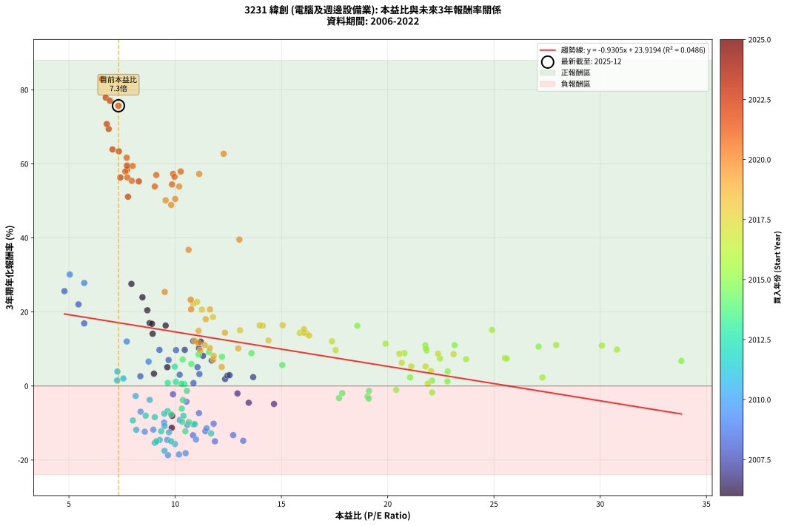
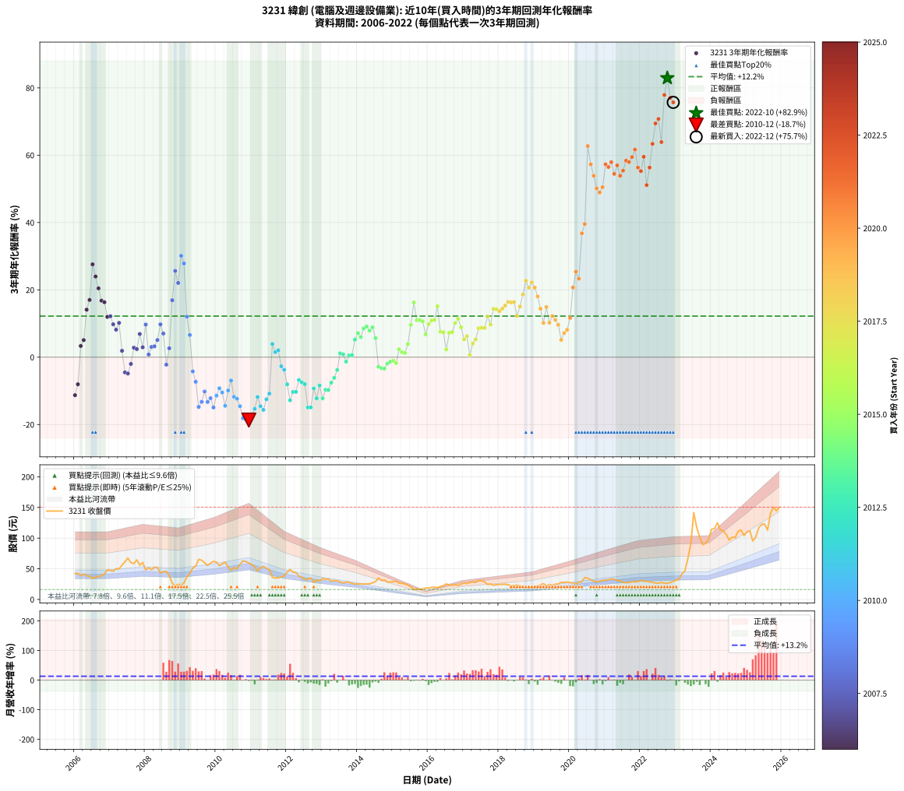

# 3231 緯創 - 本益比與未來報酬率分析

!!! info "報告資訊"
    - **股票代號**: 3231
    - **公司名稱**: 緯創
    - **產業別**: 電腦及週邊設備業
    - **分析期間**: 2006-2022 (204 個數據點)
    - **資料來源**: Type 12 (ShowMonthlyK_ChartFlow) 月收盤價與本益比
    - **報酬率口徑**: 含現金股利 (簡化: 年度合計，假設每年7/1入帳)
    - **報告生成時間**: 2026-01-04 08:49:52 CST

## 📈 視覺化圖表

### 圖表1: 本益比 vs 未來報酬率關係

*圖表1：3231 緯創 本益比與3年期未來報酬率關係 (2006-2022)*

### 圖表2: 歷年買入時點的3年期實際報酬率

*圖表2：3231 緯創 歷年買入時點的3年期實際報酬率 (2006-2022)*

## 📍 買點訊號說明

本報告提供兩種買點提示訊號（顯示於圖表2的股價子圖中）：

### ▲ 小綠色三角形（回測驗證）
- **計算方式**: 使用全部歷史資料計算本益比第25百分位數
- **用途**: 事後驗證，顯示歷史上哪些時點確實為低估區
- **限制**: 當下無法判斷，僅供回測參考
- **特性**: 後見之明（Look-Ahead Bias）

### ▲ 小橘色三角形（即時訊號）
- **計算方式**: 使用截至當月的過去5年資料計算本益比第25百分位數
- **用途**: 實際投資決策，當時即可判斷
- **優勢**: 可操作性強，符合實務需求
- **特性**: 無後見之明，滾動窗口計算

!!! tip "如何使用兩種訊號"
    - **綠色▲** 幫助理解歷史估值機會，驗證策略有效性
    - **橘色▲** 可作為實際買進參考，但仍需搭配基本面分析
    - 兩種訊號重疊時，表示即時判斷與事後驗證一致，信心度較高
    - 僅有綠色▲時，表示當時無法判斷（需要未來資料才能確認）
    - 僅有橘色▲時，表示即時判斷為買點，但事後可能不是最佳時機

## 📊 估值分析摘要

| 指標 | 數值 |
|:---:|:---:|
| **目前本益比** (2022-12) | **7.33 倍** |
| **歷史平均本益比** | 12.59 倍 |
| **估值水準** | 🟢 相對低估 |
| **預期3年年化報酬率** | **+17.10%** |
| **歷史平均報酬率** | +12.20% |
| **相關係數 (R²)** | 0.0486 |
| **趨勢線斜率** | -0.9305 |

!!! abstract "核心洞察"
    目前本益比顯著低於歷史平均，預期未來報酬率可能較高

    根據歷史數據回測，3231 緯創 在目前本益比 **7.3倍** 的估值水準下，
    預期未來3年年化報酬率約為 **+17.1%**。

    **重要提醒**: 本分析基於歷史數據統計，實際報酬率會受到公司基本面變化、產業趨勢、
    總體經濟環境等多重因素影響。R² = 0.05 表示本益比可解釋約 4.9% 的報酬率變異。

## 📈 歷史估值統計

### 最佳買點 (最高報酬率)

| 項目 | 數值 |
|:---:|:---:|
| 起始時間 | 2022-10 |
| 當時本益比 | 6.56 倍 |
| 起始價格 | 26.1 元 |
| 3年後價格 | 150.5 元 |
| **3年年化報酬率** | **+82.92%** |

### 最差買點 (最低報酬率)

| 項目 | 數值 |
|:---:|:---:|
| 起始時間 | 2010-12 |
| 當時本益比 | 9.66 倍 |
| 起始價格 | 59.4 元 |
| 3年後價格 | 25.1 元 |
| **3年年化報酬率** | **-18.67%** |

## 🎯 投資啟示

### 本益比與報酬率關係

趨勢線方程式: **y = -0.9305x + 23.9194**

!!! warning "強負相關"
    本益比與未來報酬率呈現強負相關。在高本益比時期買入，未來報酬率顯著較低；
    在低本益比時期買入，未來報酬率顯著較高。**估值紀律至關重要**。

### 估值區間建議

基於歷史數據分析:

- **🟢 低估區** (P/E < 10.1): 預期報酬率較高，可考慮增加持股
- **🟡 合理區** (P/E 10.1-15.1): 預期報酬率符合長期趨勢，正常持有
- **🔴 高估區** (P/E > 15.1): 預期報酬率較低，可考慮減碼或觀望

!!! danger "風險提示"
    - 過去表現不代表未來結果
    - 本分析假設公司基本面無重大結構性變化
    - 產業環境劇變可能使歷史規律失效
    - 應結合公司財報、產業趨勢、總體經濟等多重因素綜合判斷

!!! success "長期投資觀點"
    歷史數據顯示，在合理或低估的估值水準買入並長期持有，
    往往能獲得較佳的投資報酬。**耐心等待好價格**是價值投資的核心原則。

## 📊 數據品質

- **資料來源**: GoodInfo.tw Type 12 (ShowMonthlyK_ChartFlow)
- **資料頻率**: 月度收盤價與本益比
- **回測期間**: 2006-2022
- **數據點數量**: 204 個 (每個點代表一次3年期回測)

### 計算方法說明

1. **3年期年化報酬率**:
   - 對每個歷史時點，計算其後3年的實際投資報酬率
   - 期末價值(不含股利): 期末價格
   - 期末價值(含現金股利): 期末價格 + 持有期間內的現金股利合計 (簡化: 年度合計，假設每年7/1入帳)
   - 公式: 年化報酬率 = [(期末價值/期初價格)^(1/年數) - 1] × 100%

2. **本益比 (P/E Ratio)**:
   - 使用當時的月收盤價與EPS計算
   - 資料來源: Type 12 月度河流圖本益比數據

3. **趨勢線 (Linear Regression)**:
   - 使用最小平方法擬合線性趨勢線
   - R²值衡量本益比對報酬率的解釋能力

---

*本報告由 Stock Analysis System v1.9.0 自動生成*
*數據更新時間: 2026-01-04 08:49:52 CST*

## 📋 月度回測明細表

（每一列對應時間線圖中的一個買入點；可用來對照 SVG 圖上的每個點。）

| 買入月份 | 賣出月份 | 回測期限_年 | 實際持有年數 | 買入本益比_倍 | 買入收盤價_元 | 賣出收盤價_元 | 現金股利合計_元 | 總報酬率_pct | 年化報酬率_pct |
| --- | --- | --- | --- | --- | --- | --- | --- | --- | --- |
| 2006-01 | 2009-01 | 3 | 3.001 | 9.84 | 42.50 | 23.30 | 6.36 | -30.20 | -11.29 |
| 2006-02 | 2009-02 | 3 | 3.001 | 9.86 | 42.60 | 26.75 | 6.36 | -22.27 | -8.05 |
| 2006-03 | 2009-03 | 3 | 3.001 | 9.00 | 38.90 | 36.55 | 6.36 | +10.32 | +3.33 |
| 2006-04 | 2009-04 | 3 | 3.001 | 9.63 | 41.60 | 41.90 | 6.36 | +16.02 | +5.08 |
| 2006-05 | 2009-05 | 3 | 3.001 | 8.94 | 38.60 | 51.00 | 6.36 | +48.61 | +14.11 |
| 2006-06 | 2009-06 | 3 | 3.001 | 8.80 | 38.00 | 54.50 | 6.36 | +60.17 | +17.00 |
| 2006-07 | 2009-07 | 3 | 3.001 | 7.94 | 34.30 | 65.40 | 5.83 | +107.68 | +27.58 |
| 2006-08 | 2009-08 | 3 | 3.001 | 8.46 | 36.55 | 63.80 | 5.83 | +90.51 | +23.96 |
| 2006-09 | 2009-09 | 3 | 3.001 | 8.69 | 37.55 | 59.80 | 5.83 | +74.79 | +20.45 |
| 2006-10 | 2009-10 | 3 | 3.001 | 8.91 | 38.50 | 55.50 | 5.83 | +59.31 | +16.79 |
| 2006-11 | 2009-11 | 3 | 3.001 | 9.55 | 41.25 | 59.10 | 5.83 | +57.41 | +16.32 |
| 2006-12 | 2009-12 | 3 | 3.001 | 11.20 | 48.40 | 62.10 | 5.83 | +40.36 | +11.96 |
| 2007-01 | 2010-01 | 3 | 3.001 | 10.85 | 47.30 | 60.90 | 5.83 | +41.08 | +12.15 |
| 2007-02 | 2010-02 | 3 | 3.001 | 10.45 | 46.00 | 55.00 | 5.83 | +32.25 | +9.76 |
| 2007-03 | 2010-03 | 3 | 3.001 | 11.31 | 50.20 | 57.70 | 5.83 | +26.56 | +8.17 |
| 2007-04 | 2010-04 | 3 | 3.001 | 11.12 | 49.80 | 60.80 | 5.83 | +33.80 | +10.19 |
| 2007-05 | 2010-05 | 3 | 3.001 | 12.35 | 55.80 | 53.20 | 5.83 | +5.79 | +1.89 |
| 2007-06 | 2010-06 | 3 | 3.001 | 13.46 | 61.40 | 47.60 | 5.83 | -12.98 | -4.53 |
| 2007-07 | 2010-07 | 3 | 3.001 | 14.65 | 67.40 | 51.70 | 6.36 | -13.86 | -4.85 |
| 2007-08 | 2010-08 | 3 | 3.001 | 12.93 | 60.00 | 50.10 | 6.36 | -5.91 | -2.01 |
| 2007-09 | 2010-09 | 3 | 3.001 | 12.46 | 58.30 | 57.00 | 6.36 | +8.67 | +2.81 |
| 2007-10 | 2010-10 | 3 | 3.001 | 13.67 | 64.50 | 62.90 | 6.36 | +7.37 | +2.40 |
| 2007-11 | 2010-11 | 3 | 3.001 | 11.72 | 55.80 | 61.80 | 6.36 | +22.14 | +6.89 |
| 2007-12 | 2010-12 | 3 | 3.001 | 12.56 | 60.30 | 59.40 | 6.36 | +9.05 | +2.93 |
| 2008-01 | 2011-01 | 3 | 3.001 | 10.04 | 48.00 | 57.00 | 6.36 | +31.99 | +9.69 |
| 2008-02 | 2011-03 | 3 | 3.080 | 10.86 | 51.70 | 46.60 | 6.36 | +2.43 | +0.78 |
| 2008-03 | 2011-03 | 3 | 2.998 | 10.21 | 48.40 | 46.60 | 6.36 | +9.41 | +3.05 |
| 2008-04 | 2011-04 | 3 | 2.998 | 11.14 | 52.60 | 51.50 | 6.36 | +9.99 | +3.23 |
| 2008-05 | 2011-05 | 3 | 2.998 | 11.05 | 52.00 | 54.00 | 6.36 | +16.07 | +5.10 |
| 2008-06 | 2011-06 | 3 | 2.998 | 9.26 | 43.40 | 51.00 | 6.36 | +32.16 | +9.75 |
| 2008-07 | 2011-07 | 3 | 2.998 | 9.69 | 45.20 | 48.50 | 6.90 | +22.56 | +7.02 |
| 2008-08 | 2011-08 | 3 | 2.998 | 9.90 | 46.00 | 36.10 | 6.90 | -6.53 | -2.23 |
| 2008-09 | 2011-09 | 3 | 2.998 | 8.36 | 38.70 | 34.95 | 6.90 | +8.13 | +2.64 |
| 2008-10 | 2011-10 | 3 | 2.998 | 5.72 | 26.35 | 35.20 | 6.90 | +59.76 | +16.92 |
| 2008-11 | 2011-11 | 3 | 2.998 | 4.79 | 22.00 | 36.70 | 6.90 | +98.17 | +25.63 |
| 2008-12 | 2011-12 | 3 | 2.998 | 5.45 | 24.90 | 38.35 | 6.90 | +81.72 | +22.05 |
| 2009-01 | 2012-01 | 3 | 2.998 | 5.04 | 23.30 | 44.40 | 6.90 | +120.16 | +30.11 |
| 2009-02 | 2012-02 | 3 | 2.998 | 5.72 | 26.75 | 48.95 | 6.90 | +108.78 | +27.83 |
| 2009-03 | 2012-03 | 3 | 3.001 | 7.72 | 36.55 | 44.50 | 6.90 | +40.62 | +12.03 |
| 2009-04 | 2012-04 | 3 | 3.001 | 8.75 | 41.90 | 43.85 | 6.90 | +21.12 | +6.59 |
| 2009-05 | 2012-05 | 3 | 3.001 | 10.53 | 51.00 | 37.90 | 6.90 | -12.16 | -4.23 |
| 2009-06 | 2012-06 | 3 | 3.001 | 11.12 | 54.50 | 36.50 | 6.90 | -20.37 | -7.31 |
| 2009-07 | 2012-07 | 3 | 3.001 | 13.20 | 65.40 | 32.35 | 8.12 | -38.13 | -14.78 |
| 2009-08 | 2012-08 | 3 | 3.001 | 12.73 | 63.80 | 33.50 | 8.12 | -34.77 | -13.27 |
| 2009-09 | 2012-09 | 3 | 3.001 | 11.81 | 59.80 | 35.20 | 8.12 | -27.57 | -10.19 |
| 2009-10 | 2012-10 | 3 | 3.001 | 10.84 | 55.50 | 28.05 | 8.12 | -34.84 | -13.30 |
| 2009-11 | 2012-11 | 3 | 3.001 | 11.42 | 59.10 | 31.90 | 8.12 | -32.29 | -12.19 |
| 2009-12 | 2012-12 | 3 | 3.001 | 11.87 | 62.10 | 30.10 | 8.12 | -38.46 | -14.94 |
| 2010-01 | 2013-01 | 3 | 3.001 | 11.48 | 60.90 | 34.20 | 8.12 | -30.52 | -11.43 |
| 2010-02 | 2013-02 | 3 | 3.001 | 10.22 | 55.00 | 33.00 | 8.12 | -25.25 | -9.24 |
| 2010-03 | 2013-03 | 3 | 3.001 | 10.57 | 57.70 | 33.25 | 8.12 | -28.31 | -10.50 |
| 2010-04 | 2013-04 | 3 | 3.001 | 10.98 | 60.80 | 29.95 | 8.12 | -37.39 | -14.45 |
| 2010-05 | 2013-05 | 3 | 3.001 | 9.48 | 53.20 | 30.80 | 8.12 | -26.85 | -9.90 |
| 2010-06 | 2013-06 | 3 | 3.001 | 8.37 | 47.60 | 30.25 | 8.12 | -19.40 | -6.94 |
| 2010-07 | 2013-07 | 3 | 3.001 | 8.97 | 51.70 | 28.60 | 6.90 | -31.34 | -11.78 |
| 2010-08 | 2013-08 | 3 | 3.001 | 8.57 | 50.10 | 26.85 | 6.90 | -32.64 | -12.34 |
| 2010-09 | 2013-09 | 3 | 3.001 | 9.63 | 57.00 | 28.65 | 6.90 | -37.64 | -14.56 |
| 2010-10 | 2013-10 | 3 | 3.001 | 10.49 | 62.90 | 27.60 | 6.90 | -45.16 | -18.14 |
| 2010-11 | 2013-11 | 3 | 3.001 | 10.18 | 61.80 | 26.55 | 6.90 | -45.88 | -18.50 |
| 2010-12 | 2013-12 | 3 | 3.001 | 9.66 | 59.40 | 25.05 | 6.90 | -46.22 | -18.67 |
| 2011-01 | 2014-01 | 3 | 3.001 | 9.50 | 57.00 | 25.10 | 6.90 | -43.87 | -17.51 |
| 2011-02 | 2014-02 | 3 | 3.001 | 9.04 | 52.90 | 25.20 | 6.90 | -39.33 | -15.34 |
| 2011-03 | 2014-03 | 3 | 3.001 | 8.17 | 46.60 | 25.05 | 6.90 | -31.45 | -11.82 |
| 2011-04 | 2014-04 | 3 | 3.001 | 9.27 | 51.50 | 25.20 | 6.90 | -37.68 | -14.58 |
| 2011-05 | 2014-05 | 3 | 3.001 | 9.99 | 54.00 | 25.50 | 6.90 | -40.01 | -15.66 |
| 2011-06 | 2014-06 | 3 | 3.001 | 9.71 | 51.00 | 27.25 | 6.90 | -33.05 | -12.51 |
| 2011-07 | 2014-07 | 3 | 3.001 | 9.50 | 48.50 | 28.90 | 5.50 | -29.07 | -10.81 |
| 2011-08 | 2014-08 | 3 | 3.001 | 7.28 | 36.10 | 35.00 | 5.50 | +12.19 | +3.91 |
| 2011-09 | 2014-09 | 3 | 3.001 | 7.27 | 34.95 | 31.05 | 5.50 | +4.58 | +1.50 |
| 2011-10 | 2014-10 | 3 | 3.001 | 7.56 | 35.20 | 31.90 | 5.50 | +6.26 | +2.04 |
| 2011-11 | 2014-11 | 3 | 3.001 | 8.14 | 36.70 | 28.30 | 5.50 | -7.90 | -2.70 |
| 2011-12 | 2014-12 | 3 | 3.001 | 8.80 | 38.35 | 28.70 | 5.50 | -10.82 | -3.74 |
| 2012-01 | 2015-01 | 3 | 3.001 | 10.39 | 44.40 | 29.00 | 5.50 | -22.29 | -8.06 |
| 2012-02 | 2015-03 | 3 | 3.080 | 11.69 | 48.95 | 26.60 | 5.50 | -34.42 | -12.80 |
| 2012-03 | 2015-03 | 3 | 2.998 | 10.85 | 44.50 | 26.60 | 5.50 | -27.86 | -10.32 |
| 2012-04 | 2015-04 | 3 | 2.998 | 10.92 | 43.85 | 26.15 | 5.50 | -27.82 | -10.30 |
| 2012-05 | 2015-05 | 3 | 2.998 | 9.64 | 37.90 | 25.20 | 5.50 | -18.99 | -6.78 |
| 2012-06 | 2015-06 | 3 | 2.998 | 9.49 | 36.50 | 23.40 | 5.50 | -20.82 | -7.49 |
| 2012-07 | 2015-07 | 3 | 2.998 | 8.61 | 32.35 | 20.65 | 4.53 | -22.16 | -8.02 |
| 2012-08 | 2015-08 | 3 | 2.998 | 9.12 | 33.50 | 16.10 | 4.53 | -38.41 | -14.93 |
| 2012-09 | 2015-09 | 3 | 2.998 | 9.81 | 35.20 | 17.15 | 4.53 | -38.40 | -14.92 |
| 2012-10 | 2015-10 | 3 | 2.998 | 8.01 | 28.05 | 16.40 | 4.53 | -25.38 | -9.30 |
| 2012-11 | 2015-11 | 3 | 2.998 | 9.34 | 31.90 | 17.05 | 4.53 | -32.34 | -12.22 |
| 2012-12 | 2015-12 | 3 | 2.998 | 9.04 | 30.10 | 18.60 | 4.53 | -23.15 | -8.41 |
| 2013-01 | 2016-01 | 3 | 2.998 | 10.48 | 34.20 | 18.60 | 4.53 | -32.36 | -12.23 |
| 2013-02 | 2016-02 | 3 | 2.998 | 10.33 | 33.00 | 19.80 | 4.53 | -26.27 | -9.66 |
| 2013-03 | 2016-03 | 3 | 3.001 | 10.64 | 33.25 | 19.90 | 4.53 | -26.52 | -9.76 |
| 2013-04 | 2016-04 | 3 | 3.001 | 9.80 | 29.95 | 19.10 | 4.53 | -21.10 | -7.59 |
| 2013-05 | 2016-05 | 3 | 3.001 | 10.31 | 30.80 | 20.95 | 4.53 | -17.27 | -6.12 |
| 2013-06 | 2016-06 | 3 | 3.001 | 10.36 | 30.25 | 22.40 | 4.53 | -10.97 | -3.80 |
| 2013-07 | 2016-07 | 3 | 3.001 | 10.03 | 28.60 | 25.35 | 4.23 | +3.42 | +1.13 |
| 2013-08 | 2016-08 | 3 | 3.001 | 9.65 | 26.85 | 23.30 | 4.23 | +2.53 | +0.84 |
| 2013-09 | 2016-09 | 3 | 3.001 | 10.55 | 28.65 | 23.30 | 4.23 | -3.91 | -1.32 |
| 2013-10 | 2016-10 | 3 | 3.001 | 10.43 | 27.60 | 23.80 | 4.23 | +1.55 | +0.52 |
| 2013-11 | 2016-11 | 3 | 3.001 | 10.30 | 26.55 | 22.80 | 4.23 | +1.80 | +0.60 |
| 2013-12 | 2016-12 | 3 | 3.001 | 9.98 | 25.05 | 24.95 | 4.23 | +16.48 | +5.22 |
| 2014-01 | 2017-01 | 3 | 3.001 | 10.35 | 25.10 | 26.65 | 4.23 | +23.02 | +7.15 |
| 2014-02 | 2017-02 | 3 | 3.001 | 10.76 | 25.20 | 25.75 | 4.23 | +18.96 | +5.96 |
| 2014-03 | 2017-03 | 3 | 3.001 | 11.10 | 25.05 | 27.80 | 4.23 | +27.86 | +8.54 |
| 2014-04 | 2017-04 | 3 | 3.001 | 11.59 | 25.20 | 28.50 | 4.23 | +29.88 | +9.10 |
| 2014-05 | 2017-05 | 3 | 3.001 | 12.20 | 25.50 | 27.80 | 4.23 | +25.60 | +7.89 |
| 2014-06 | 2017-06 | 3 | 3.001 | 13.59 | 27.25 | 30.95 | 4.23 | +29.10 | +8.88 |
| 2014-07 | 2017-07 | 3 | 3.001 | 15.04 | 28.90 | 30.50 | 3.61 | +18.03 | +5.68 |
| 2014-08 | 2017-08 | 3 | 3.001 | 19.05 | 35.00 | 28.50 | 3.61 | -8.25 | -2.83 |
| 2014-09 | 2017-09 | 3 | 3.001 | 17.71 | 31.05 | 24.50 | 3.61 | -9.47 | -3.26 |
| 2014-10 | 2017-10 | 3 | 3.001 | 19.11 | 31.90 | 25.15 | 3.61 | -9.84 | -3.39 |
| 2014-11 | 2017-11 | 3 | 3.001 | 17.86 | 28.30 | 23.10 | 3.61 | -5.61 | -1.91 |
| 2014-12 | 2017-12 | 3 | 3.001 | 19.12 | 28.70 | 23.95 | 3.61 | -3.97 | -1.34 |
| 2015-01 | 2018-01 | 3 | 3.001 | 20.40 | 29.00 | 24.50 | 3.61 | -3.07 | -1.03 |
| 2015-02 | 2018-02 | 3 | 3.001 | 22.09 | 29.65 | 24.50 | 3.61 | -5.19 | -1.76 |
| 2015-03 | 2018-03 | 3 | 3.001 | 21.06 | 26.60 | 24.90 | 3.61 | +7.18 | +2.34 |
| 2015-04 | 2018-04 | 3 | 3.001 | 22.09 | 26.15 | 23.70 | 3.61 | +4.44 | +1.46 |
| 2015-05 | 2018-05 | 3 | 3.001 | 22.81 | 25.20 | 22.55 | 3.61 | +3.81 | +1.26 |
| 2015-06 | 2018-06 | 3 | 3.001 | 22.82 | 23.40 | 22.65 | 3.61 | +12.23 | +3.92 |
| 2015-07 | 2018-07 | 3 | 3.001 | 21.83 | 20.65 | 23.65 | 3.55 | +31.72 | +9.62 |
| 2015-08 | 2018-08 | 3 | 3.001 | 18.57 | 16.10 | 21.75 | 3.55 | +57.14 | +16.26 |
| 2015-09 | 2018-09 | 3 | 3.001 | 21.77 | 17.15 | 19.90 | 3.55 | +36.73 | +10.99 |
| 2015-10 | 2018-10 | 3 | 3.001 | 23.15 | 16.40 | 18.90 | 3.55 | +36.89 | +11.03 |
| 2015-11 | 2018-11 | 3 | 3.001 | 27.10 | 17.05 | 19.55 | 3.55 | +35.48 | +10.65 |
| 2015-12 | 2018-12 | 3 | 3.001 | 33.82 | 18.60 | 19.10 | 3.55 | +21.77 | +6.79 |
| 2016-01 | 2019-01 | 3 | 3.001 | 30.79 | 18.60 | 21.10 | 3.55 | +32.53 | +9.84 |
| 2016-02 | 2019-03 | 3 | 3.080 | 30.08 | 19.80 | 23.70 | 3.55 | +37.63 | +10.93 |
| 2016-03 | 2019-03 | 3 | 2.998 | 27.93 | 19.90 | 23.70 | 3.55 | +36.93 | +11.05 |
| 2016-04 | 2019-04 | 3 | 2.998 | 24.91 | 19.10 | 25.60 | 3.55 | +52.62 | +15.14 |
| 2016-05 | 2019-05 | 3 | 2.998 | 25.52 | 20.95 | 22.50 | 3.55 | +24.34 | +7.54 |
| 2016-06 | 2019-06 | 3 | 2.998 | 25.60 | 22.40 | 24.20 | 3.55 | +23.88 | +7.41 |
| 2016-07 | 2019-07 | 3 | 2.998 | 27.28 | 25.35 | 23.30 | 3.84 | +7.07 | +2.30 |
| 2016-08 | 2019-08 | 3 | 2.998 | 23.69 | 23.30 | 24.90 | 3.84 | +23.35 | +7.25 |
| 2016-09 | 2019-09 | 3 | 2.998 | 22.46 | 23.30 | 25.05 | 3.84 | +24.00 | +7.44 |
| 2016-10 | 2019-10 | 3 | 2.998 | 21.80 | 23.80 | 27.95 | 3.84 | +33.58 | +10.14 |
| 2016-11 | 2019-11 | 3 | 2.998 | 19.90 | 22.80 | 27.70 | 3.84 | +38.34 | +11.43 |
| 2016-12 | 2019-12 | 3 | 2.998 | 20.79 | 24.95 | 28.35 | 3.84 | +29.02 | +8.87 |
| 2017-01 | 2020-01 | 3 | 2.998 | 21.78 | 26.65 | 27.25 | 3.84 | +16.66 | +5.28 |
| 2017-02 | 2020-02 | 3 | 2.998 | 20.66 | 25.75 | 27.05 | 3.84 | +19.97 | +6.26 |
| 2017-03 | 2020-03 | 3 | 3.001 | 21.89 | 27.80 | 24.50 | 3.84 | +1.95 | +0.64 |
| 2017-04 | 2020-04 | 3 | 3.001 | 22.04 | 28.50 | 28.25 | 3.84 | +12.60 | +4.03 |
| 2017-05 | 2020-05 | 3 | 3.001 | 21.11 | 27.80 | 28.60 | 3.84 | +16.69 | +5.28 |
| 2017-06 | 2020-06 | 3 | 3.001 | 23.10 | 30.95 | 35.80 | 3.84 | +28.08 | +8.60 |
| 2017-07 | 2020-07 | 3 | 3.001 | 22.37 | 30.50 | 34.50 | 4.70 | +28.52 | +8.72 |
| 2017-08 | 2020-08 | 3 | 3.001 | 20.55 | 28.50 | 31.90 | 4.70 | +28.42 | +8.69 |
| 2017-09 | 2020-09 | 3 | 3.001 | 17.38 | 24.50 | 29.80 | 4.70 | +40.81 | +12.08 |
| 2017-10 | 2020-10 | 3 | 3.001 | 17.55 | 25.15 | 28.50 | 4.70 | +32.00 | +9.69 |
| 2017-11 | 2020-11 | 3 | 3.001 | 15.86 | 23.10 | 29.85 | 4.70 | +49.56 | +14.36 |
| 2017-12 | 2020-12 | 3 | 3.001 | 16.18 | 23.95 | 31.00 | 4.70 | +49.06 | +14.23 |
| 2018-01 | 2021-01 | 3 | 3.001 | 16.30 | 24.50 | 31.25 | 4.70 | +46.73 | +13.63 |
| 2018-02 | 2021-02 | 3 | 3.001 | 16.05 | 24.50 | 32.00 | 4.70 | +49.79 | +14.41 |
| 2018-03 | 2021-03 | 3 | 3.001 | 16.06 | 24.90 | 33.50 | 4.70 | +53.41 | +15.33 |
| 2018-04 | 2021-04 | 3 | 3.001 | 15.06 | 23.70 | 32.70 | 4.70 | +57.80 | +16.42 |
| 2018-05 | 2021-05 | 3 | 3.001 | 14.12 | 22.55 | 30.75 | 4.70 | +57.20 | +16.27 |
| 2018-06 | 2021-06 | 3 | 3.001 | 13.98 | 22.65 | 31.00 | 4.70 | +57.61 | +16.37 |
| 2018-07 | 2021-07 | 3 | 3.001 | 14.39 | 23.65 | 27.75 | 5.73 | +41.56 | +12.28 |
| 2018-08 | 2021-08 | 3 | 3.001 | 13.05 | 21.75 | 27.40 | 5.73 | +52.32 | +15.06 |
| 2018-09 | 2021-09 | 3 | 3.001 | 11.78 | 19.90 | 27.50 | 5.73 | +66.98 | +18.63 |
| 2018-10 | 2021-10 | 3 | 3.001 | 11.03 | 18.90 | 29.20 | 5.73 | +84.81 | +22.71 |
| 2018-11 | 2021-11 | 3 | 3.001 | 11.26 | 19.55 | 28.60 | 5.73 | +75.60 | +20.64 |
| 2018-12 | 2021-12 | 3 | 3.001 | 10.85 | 19.10 | 29.15 | 5.73 | +82.62 | +22.23 |
| 2019-01 | 2022-01 | 3 | 3.001 | 11.64 | 21.10 | 31.35 | 5.73 | +75.73 | +20.67 |
| 2019-02 | 2022-02 | 3 | 3.001 | 11.44 | 21.35 | 29.40 | 5.73 | +64.54 | +18.05 |
| 2019-03 | 2022-03 | 3 | 3.001 | 12.34 | 23.70 | 29.75 | 5.73 | +49.70 | +14.39 |
| 2019-04 | 2022-04 | 3 | 3.001 | 12.97 | 25.60 | 28.50 | 5.73 | +33.71 | +10.17 |
| 2019-05 | 2022-05 | 3 | 3.001 | 11.10 | 22.50 | 28.40 | 5.73 | +51.69 | +14.90 |
| 2019-06 | 2022-06 | 3 | 3.001 | 11.63 | 24.20 | 26.70 | 5.73 | +34.01 | +10.25 |
| 2019-07 | 2022-07 | 3 | 3.001 | 10.92 | 23.30 | 26.50 | 6.44 | +41.38 | +12.23 |
| 2019-08 | 2022-08 | 3 | 3.001 | 11.39 | 24.90 | 27.70 | 6.44 | +37.12 | +11.09 |
| 2019-09 | 2022-09 | 3 | 3.001 | 11.18 | 25.05 | 26.55 | 6.44 | +31.70 | +9.61 |
| 2019-10 | 2022-10 | 3 | 3.001 | 12.19 | 27.95 | 26.05 | 6.44 | +16.25 | +5.15 |
| 2019-11 | 2022-11 | 3 | 3.001 | 11.80 | 27.70 | 27.65 | 6.44 | +23.08 | +7.16 |
| 2019-12 | 2022-12 | 3 | 3.001 | 11.81 | 28.35 | 29.40 | 6.44 | +26.43 | +8.13 |
| 2020-01 | 2023-01 | 3 | 3.001 | 11.08 | 27.25 | 31.50 | 6.44 | +39.24 | +11.66 |
| 2020-02 | 2023-03 | 3 | 3.080 | 10.75 | 27.05 | 41.85 | 6.44 | +78.53 | +20.70 |
| 2020-03 | 2023-03 | 3 | 2.998 | 9.51 | 24.50 | 41.85 | 6.44 | +97.11 | +25.40 |
| 2020-04 | 2023-04 | 3 | 2.998 | 10.73 | 28.25 | 46.50 | 6.44 | +87.41 | +23.31 |
| 2020-05 | 2023-05 | 3 | 2.998 | 10.63 | 28.60 | 66.70 | 6.44 | +155.74 | +36.78 |
| 2020-06 | 2023-06 | 3 | 2.998 | 13.02 | 35.80 | 90.80 | 6.44 | +171.63 | +39.56 |
| 2020-07 | 2023-07 | 3 | 2.998 | 12.28 | 34.50 | 141.50 | 7.00 | +330.43 | +62.72 |
| 2020-08 | 2023-08 | 3 | 2.998 | 11.13 | 31.90 | 117.00 | 7.00 | +288.71 | +57.28 |
| 2020-09 | 2023-09 | 3 | 2.998 | 10.19 | 29.80 | 101.50 | 7.00 | +264.09 | +53.89 |
| 2020-10 | 2023-10 | 3 | 2.998 | 9.55 | 28.50 | 89.40 | 7.00 | +238.24 | +50.15 |
| 2020-11 | 2023-11 | 3 | 2.998 | 9.81 | 29.85 | 91.50 | 7.00 | +229.98 | +48.92 |
| 2020-12 | 2023-12 | 3 | 2.998 | 10.00 | 31.00 | 98.60 | 7.00 | +240.64 | +50.51 |
| 2021-01 | 2024-01 | 3 | 2.998 | 9.90 | 31.25 | 114.50 | 7.00 | +288.80 | +57.29 |
| 2021-02 | 2024-02 | 3 | 2.998 | 9.97 | 32.00 | 115.50 | 7.00 | +282.81 | +56.48 |
| 2021-03 | 2024-03 | 3 | 3.001 | 10.26 | 33.50 | 125.00 | 7.00 | +294.03 | +57.93 |
| 2021-04 | 2024-04 | 3 | 3.001 | 9.85 | 32.70 | 113.50 | 7.00 | +268.50 | +54.44 |
| 2021-05 | 2024-05 | 3 | 3.001 | 9.11 | 30.75 | 112.00 | 7.00 | +286.99 | +56.98 |
| 2021-06 | 2024-06 | 3 | 3.001 | 9.04 | 31.00 | 106.00 | 7.00 | +264.51 | +53.88 |
| 2021-07 | 2024-07 | 3 | 3.001 | 7.96 | 27.75 | 96.80 | 7.40 | +275.49 | +55.41 |
| 2021-08 | 2024-08 | 3 | 3.001 | 7.74 | 27.40 | 101.50 | 7.40 | +297.44 | +58.38 |
| 2021-09 | 2024-09 | 3 | 3.001 | 7.65 | 27.50 | 101.00 | 7.40 | +294.17 | +57.95 |
| 2021-10 | 2024-10 | 3 | 3.001 | 8.00 | 29.20 | 111.00 | 7.40 | +305.47 | +59.44 |
| 2021-11 | 2024-11 | 3 | 3.001 | 7.72 | 28.60 | 113.50 | 7.40 | +322.72 | +61.67 |
| 2021-12 | 2024-12 | 3 | 3.001 | 7.75 | 29.15 | 104.00 | 7.40 | +282.15 | +56.33 |
| 2022-01 | 2025-01 | 3 | 3.001 | 8.29 | 31.35 | 110.00 | 7.40 | +274.48 | +55.27 |
| 2022-02 | 2025-02 | 3 | 3.001 | 7.73 | 29.40 | 112.00 | 7.40 | +306.12 | +59.53 |
| 2022-03 | 2025-03 | 3 | 3.001 | 7.78 | 29.75 | 95.30 | 7.40 | +245.20 | +51.12 |
| 2022-04 | 2025-04 | 3 | 3.001 | 7.42 | 28.50 | 101.50 | 7.40 | +282.10 | +56.32 |
| 2022-05 | 2025-05 | 3 | 3.001 | 7.35 | 28.40 | 116.50 | 7.40 | +336.26 | +63.38 |
| 2022-06 | 2025-06 | 3 | 3.001 | 6.87 | 26.70 | 122.50 | 7.40 | +386.51 | +69.43 |
| 2022-07 | 2025-07 | 3 | 3.001 | 6.78 | 26.50 | 123.00 | 9.00 | +398.10 | +70.76 |
| 2022-08 | 2025-08 | 3 | 3.001 | 7.05 | 27.70 | 113.00 | 9.00 | +340.42 | +63.90 |
| 2022-09 | 2025-09 | 3 | 3.001 | 6.73 | 26.55 | 140.50 | 9.00 | +463.08 | +77.88 |
| 2022-10 | 2025-10 | 3 | 3.001 | 6.56 | 26.05 | 150.50 | 9.00 | +512.27 | +82.92 |
| 2022-11 | 2025-11 | 3 | 3.001 | 6.93 | 27.65 | 144.50 | 9.00 | +455.14 | +77.04 |
| 2022-12 | 2025-12 | 3 | 3.001 | 7.33 | 29.40 | 150.50 | 9.00 | +442.51 | +75.69 |
