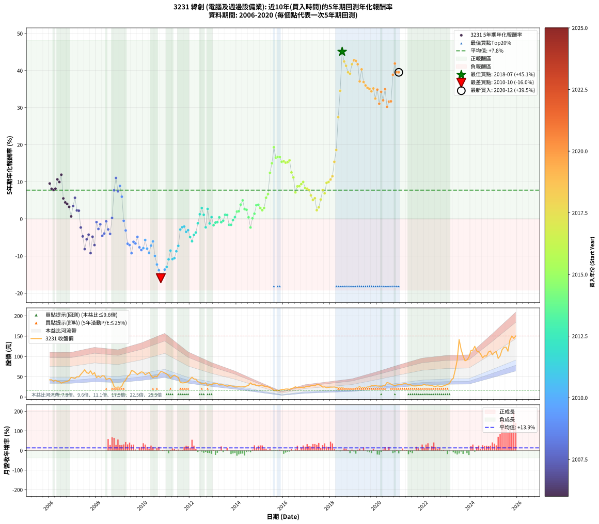

# 3231 緯創 - 本益比與未來報酬率分析

!!! info "報告資訊"
    - **股票代號**: 3231
    - **公司名稱**: 緯創
    - **產業別**: 電腦及週邊設備業
    - **分析期間**: 2006-2020 (180 個數據點)
    - **資料來源**: Type 12 (ShowMonthlyK_ChartFlow) 月收盤價與本益比
    - **報酬率口徑**: 含現金股利 (簡化: 年度合計，假設每年7/1入帳)
    - **報告生成時間**: 2026-01-06 00:56:04 CST

## 📈 視覺化圖表

### 圖表1: 本益比 vs 未來報酬率關係

*圖表1：3231 緯創 本益比與5年期未來報酬率關係 (2006-2020)*

### 圖表2: 歷年買入時點的5年期實際報酬率

*圖表2：3231 緯創 歷年買入時點的5年期實際報酬率 (2006-2020)*

## 📍 買點訊號說明

本報告提供兩種買點提示訊號（顯示於圖表2的股價子圖中）：

### ▲ 小綠色三角形（回測驗證）
- **計算方式**: 使用全部歷史資料計算本益比第25百分位數
- **用途**: 事後驗證，顯示歷史上哪些時點確實為低估區
- **限制**: 當下無法判斷，僅供回測參考
- **特性**: 後見之明（Look-Ahead Bias）

### ▲ 小橘色三角形（即時訊號）
- **計算方式**: 使用截至當月的過去5年資料計算本益比第25百分位數
- **用途**: 實際投資決策，當時即可判斷
- **優勢**: 可操作性強，符合實務需求
- **特性**: 無後見之明，滾動窗口計算

!!! tip "如何使用兩種訊號"
    - **綠色▲** 幫助理解歷史估值機會，驗證策略有效性
    - **橘色▲** 可作為實際買進參考，但仍需搭配基本面分析
    - 兩種訊號重疊時，表示即時判斷與事後驗證一致，信心度較高
    - 僅有綠色▲時，表示當時無法判斷（需要未來資料才能確認）
    - 僅有橘色▲時，表示即時判斷為買點，但事後可能不是最佳時機

## 📊 估值分析摘要

| 指標 | 數值 |
|:---:|:---:|
| **目前本益比** (2020-12) | **10.00 倍** |
| **歷史平均本益比** | 13.21 倍 |
| **估值水準** | 🟢 相對低估 |
| **預期5年年化報酬率** | **+6.59%** |
| **歷史平均報酬率** | +7.76% |
| **相關係數 (R²)** | 0.0169 |
| **趨勢線斜率** | 0.3627 |

!!! abstract "核心洞察"
    目前本益比顯著低於歷史平均，預期未來報酬率可能較高

    根據歷史數據回測，3231 緯創 在目前本益比 **10.0倍** 的估值水準下，
    預期未來5年年化報酬率約為 **+6.6%**。

    **重要提醒**: 本分析基於歷史數據統計，實際報酬率會受到公司基本面變化、產業趨勢、
    總體經濟環境等多重因素影響。R² = 0.02 表示本益比可解釋約 1.7% 的報酬率變異。

## 📈 歷史估值統計

### 最佳買點 (最高報酬率)

| 項目 | 數值 |
|:---:|:---:|
| 起始時間 | 2018-07 |
| 當時本益比 | 14.39 倍 |
| 起始價格 | 23.6 元 |
| 5年後價格 | 141.5 元 |
| **5年年化報酬率** | **+45.09%** |

### 最差買點 (最低報酬率)

| 項目 | 數值 |
|:---:|:---:|
| 起始時間 | 2010-10 |
| 當時本益比 | 10.49 倍 |
| 起始價格 | 62.9 元 |
| 5年後價格 | 16.4 元 |
| **5年年化報酬率** | **-15.99%** |

## 🎯 投資啟示

### 本益比與報酬率關係

趨勢線方程式: **y = 0.3627x + 2.9660**

!!! info "弱相關或正相關"
    本益比與未來報酬率相關性較弱。這可能表示該股票的報酬率更多受到
    公司成長性、產業趨勢等因素影響，而非估值水準。**需綜合考量多項指標**。

### 估值區間建議

基於歷史數據分析:

- **🟢 低估區** (P/E < 10.6): 預期報酬率較高，可考慮增加持股
- **🟡 合理區** (P/E 10.6-15.8): 預期報酬率符合長期趨勢，正常持有
- **🔴 高估區** (P/E > 15.8): 預期報酬率較低，可考慮減碼或觀望

!!! danger "風險提示"
    - 過去表現不代表未來結果
    - 本分析假設公司基本面無重大結構性變化
    - 產業環境劇變可能使歷史規律失效
    - 應結合公司財報、產業趨勢、總體經濟等多重因素綜合判斷

!!! success "長期投資觀點"
    歷史數據顯示，在合理或低估的估值水準買入並長期持有，
    往往能獲得較佳的投資報酬。**耐心等待好價格**是價值投資的核心原則。

## 📊 數據品質

- **資料來源**: GoodInfo.tw Type 12 (ShowMonthlyK_ChartFlow)
- **資料頻率**: 月度收盤價與本益比
- **回測期間**: 2006-2020
- **數據點數量**: 180 個 (每個點代表一次5年期回測)

### 計算方法說明

1. **5年期年化報酬率**:
   - 對每個歷史時點，計算其後5年的實際投資報酬率
   - 期末價值(不含股利): 期末價格
   - 期末價值(含現金股利): 期末價格 + 持有期間內的現金股利合計 (簡化: 年度合計，假設每年7/1入帳)
   - 公式: 年化報酬率 = [(期末價值/期初價格)^(1/年數) - 1] × 100%

2. **本益比 (P/E Ratio)**:
   - 使用當時的月收盤價與EPS計算
   - 資料來源: Type 12 月度河流圖本益比數據

3. **趨勢線 (Linear Regression)**:
   - 使用最小平方法擬合線性趨勢線
   - R²值衡量本益比對報酬率的解釋能力

---

*本報告由 Stock Analysis System v1.9.0 自動生成*
*數據更新時間: 2026-01-06 00:56:04 CST*

## 📋 月度回測明細表

（每一列對應時間線圖中的一個買入點；可用來對照 SVG 圖上的每個點。）

| 買入月份 | 賣出月份 | 回測期限_年 | 實際持有年數 | 買入本益比_倍 | 買入收盤價_元 | 賣出收盤價_元 | 現金股利合計_元 | 總報酬率_pct | 年化報酬率_pct |
| --- | --- | --- | --- | --- | --- | --- | --- | --- | --- |
| 2006-01 | 2011-01 | 5 | 4.999 | 9.84 | 42.50 | 57.00 | 10.07 | +57.80 | +9.55 |
| 2006-02 | 2011-02 | 5 | 4.999 | 9.86 | 42.60 | 52.90 | 10.07 | +47.81 | +8.13 |
| 2006-03 | 2011-03 | 5 | 4.999 | 9.00 | 38.90 | 46.60 | 10.07 | +45.67 | +7.81 |
| 2006-04 | 2011-04 | 5 | 4.999 | 9.63 | 41.60 | 51.50 | 10.07 | +48.00 | +8.16 |
| 2006-05 | 2011-05 | 5 | 4.999 | 8.94 | 38.60 | 54.00 | 10.07 | +65.97 | +10.67 |
| 2006-06 | 2011-06 | 5 | 4.999 | 8.80 | 38.00 | 51.00 | 10.07 | +60.70 | +9.95 |
| 2006-07 | 2011-07 | 5 | 4.999 | 7.94 | 34.30 | 48.50 | 11.75 | +75.65 | +11.93 |
| 2006-08 | 2011-08 | 5 | 4.999 | 8.46 | 36.55 | 36.10 | 11.75 | +30.91 | +5.54 |
| 2006-09 | 2011-09 | 5 | 4.999 | 8.69 | 37.55 | 34.95 | 11.75 | +24.36 | +4.46 |
| 2006-10 | 2011-10 | 5 | 4.999 | 8.91 | 38.50 | 35.20 | 11.75 | +21.94 | +4.05 |
| 2006-11 | 2011-11 | 5 | 4.999 | 9.55 | 41.25 | 36.70 | 11.75 | +17.45 | +3.27 |
| 2006-12 | 2011-12 | 5 | 4.999 | 11.20 | 48.40 | 38.35 | 11.75 | +3.51 | +0.69 |
| 2007-01 | 2012-01 | 5 | 4.999 | 10.85 | 47.30 | 44.40 | 11.75 | +18.71 | +3.49 |
| 2007-02 | 2012-02 | 5 | 4.999 | 10.45 | 46.00 | 48.95 | 11.75 | +31.95 | +5.70 |
| 2007-03 | 2012-03 | 5 | 5.002 | 11.31 | 50.20 | 44.50 | 11.75 | +12.05 | +2.30 |
| 2007-04 | 2012-04 | 5 | 5.002 | 11.12 | 49.80 | 43.85 | 11.75 | +11.64 | +2.23 |
| 2007-05 | 2012-05 | 5 | 5.002 | 12.35 | 55.80 | 37.90 | 11.75 | -11.03 | -2.31 |
| 2007-06 | 2012-06 | 5 | 5.002 | 13.46 | 61.40 | 36.50 | 11.75 | -21.42 | -4.70 |
| 2007-07 | 2012-07 | 5 | 5.002 | 14.65 | 67.40 | 32.35 | 11.75 | -34.57 | -8.13 |
| 2007-08 | 2012-08 | 5 | 5.002 | 12.93 | 60.00 | 33.50 | 11.75 | -24.58 | -5.48 |
| 2007-09 | 2012-09 | 5 | 5.002 | 12.46 | 58.30 | 35.20 | 11.75 | -19.46 | -4.24 |
| 2007-10 | 2012-10 | 5 | 5.002 | 13.67 | 64.50 | 28.05 | 11.75 | -38.29 | -9.20 |
| 2007-11 | 2012-11 | 5 | 5.002 | 11.72 | 55.80 | 31.90 | 11.75 | -21.77 | -4.79 |
| 2007-12 | 2012-12 | 5 | 5.002 | 12.56 | 60.30 | 30.10 | 11.75 | -30.59 | -7.04 |
| 2008-01 | 2013-01 | 5 | 5.002 | 10.04 | 48.00 | 34.20 | 11.75 | -4.27 | -0.87 |
| 2008-02 | 2013-03 | 5 | 5.081 | 10.86 | 51.70 | 33.25 | 11.75 | -12.96 | -2.69 |
| 2008-03 | 2013-03 | 5 | 4.999 | 10.21 | 48.40 | 33.25 | 11.75 | -7.02 | -1.45 |
| 2008-04 | 2013-04 | 5 | 4.999 | 11.14 | 52.60 | 29.95 | 11.75 | -20.72 | -4.54 |
| 2008-05 | 2013-05 | 5 | 4.999 | 11.05 | 52.00 | 30.80 | 11.75 | -18.17 | -3.93 |
| 2008-06 | 2013-06 | 5 | 4.999 | 9.26 | 43.40 | 30.25 | 11.75 | -3.22 | -0.65 |
| 2008-07 | 2013-07 | 5 | 4.999 | 9.69 | 45.20 | 28.60 | 10.60 | -13.28 | -2.81 |
| 2008-08 | 2013-08 | 5 | 4.999 | 9.90 | 46.00 | 26.85 | 10.60 | -18.59 | -4.03 |
| 2008-09 | 2013-09 | 5 | 4.999 | 8.36 | 38.70 | 28.65 | 10.60 | +1.42 | +0.28 |
| 2008-10 | 2013-10 | 5 | 4.999 | 5.72 | 26.35 | 27.60 | 10.60 | +44.96 | +7.71 |
| 2008-11 | 2013-11 | 5 | 4.999 | 4.79 | 22.00 | 26.55 | 10.60 | +68.85 | +11.05 |
| 2008-12 | 2013-12 | 5 | 4.999 | 5.45 | 24.90 | 25.05 | 10.60 | +43.16 | +7.44 |
| 2009-01 | 2014-01 | 5 | 4.999 | 5.04 | 23.30 | 25.10 | 10.60 | +53.21 | +8.91 |
| 2009-02 | 2014-02 | 5 | 4.999 | 5.72 | 26.75 | 25.20 | 10.60 | +33.82 | +6.00 |
| 2009-03 | 2014-03 | 5 | 4.999 | 7.72 | 36.55 | 25.05 | 10.60 | -2.47 | -0.50 |
| 2009-04 | 2014-04 | 5 | 4.999 | 8.75 | 41.90 | 25.20 | 10.60 | -14.56 | -3.10 |
| 2009-05 | 2014-05 | 5 | 4.999 | 10.53 | 51.00 | 25.50 | 10.60 | -29.22 | -6.68 |
| 2009-06 | 2014-06 | 5 | 4.999 | 11.12 | 54.50 | 27.25 | 10.60 | -30.55 | -7.03 |
| 2009-07 | 2014-07 | 5 | 4.999 | 13.20 | 65.40 | 28.90 | 11.42 | -38.35 | -9.22 |
| 2009-08 | 2014-08 | 5 | 4.999 | 12.73 | 63.80 | 35.00 | 11.42 | -27.25 | -6.16 |
| 2009-09 | 2014-09 | 5 | 4.999 | 11.81 | 59.80 | 31.05 | 11.42 | -28.98 | -6.62 |
| 2009-10 | 2014-10 | 5 | 4.999 | 10.84 | 55.50 | 31.90 | 11.42 | -21.95 | -4.84 |
| 2009-11 | 2014-11 | 5 | 4.999 | 11.42 | 59.10 | 28.30 | 11.42 | -32.80 | -7.64 |
| 2009-12 | 2014-12 | 5 | 4.999 | 11.87 | 62.10 | 28.70 | 11.42 | -35.40 | -8.37 |
| 2010-01 | 2015-01 | 5 | 4.999 | 11.48 | 60.90 | 29.00 | 11.42 | -33.63 | -7.87 |
| 2010-02 | 2015-02 | 5 | 4.999 | 10.22 | 55.00 | 29.65 | 11.42 | -25.33 | -5.68 |
| 2010-03 | 2015-03 | 5 | 4.999 | 10.57 | 57.70 | 26.60 | 11.42 | -34.11 | -8.01 |
| 2010-04 | 2015-04 | 5 | 4.999 | 10.98 | 60.80 | 26.15 | 11.42 | -38.21 | -9.18 |
| 2010-05 | 2015-05 | 5 | 4.999 | 9.48 | 53.20 | 25.20 | 11.42 | -31.17 | -7.20 |
| 2010-06 | 2015-06 | 5 | 4.999 | 8.37 | 47.60 | 23.40 | 11.42 | -26.86 | -6.06 |
| 2010-07 | 2015-07 | 5 | 4.999 | 8.97 | 51.70 | 20.65 | 9.93 | -40.85 | -9.97 |
| 2010-08 | 2015-08 | 5 | 4.999 | 8.57 | 50.10 | 16.10 | 9.93 | -48.05 | -12.28 |
| 2010-09 | 2015-09 | 5 | 4.999 | 9.63 | 57.00 | 17.15 | 9.93 | -52.49 | -13.83 |
| 2010-10 | 2015-10 | 5 | 4.999 | 10.49 | 62.90 | 16.40 | 9.93 | -58.14 | -15.99 |
| 2010-11 | 2015-11 | 5 | 4.999 | 10.18 | 61.80 | 17.05 | 9.93 | -56.35 | -15.28 |
| 2010-12 | 2015-12 | 5 | 4.999 | 9.66 | 59.40 | 18.60 | 9.93 | -51.97 | -13.64 |
| 2011-01 | 2016-01 | 5 | 4.999 | 9.50 | 57.00 | 18.60 | 9.93 | -49.95 | -12.93 |
| 2011-02 | 2016-02 | 5 | 4.999 | 9.04 | 52.90 | 19.80 | 9.93 | -43.80 | -10.89 |
| 2011-03 | 2016-03 | 5 | 5.002 | 8.17 | 46.60 | 19.90 | 9.93 | -35.99 | -8.53 |
| 2011-04 | 2016-04 | 5 | 5.002 | 9.27 | 51.50 | 19.10 | 9.93 | -43.63 | -10.83 |
| 2011-05 | 2016-05 | 5 | 5.002 | 9.99 | 54.00 | 20.95 | 9.93 | -42.82 | -10.57 |
| 2011-06 | 2016-06 | 5 | 5.002 | 9.71 | 51.00 | 22.40 | 9.93 | -36.61 | -8.71 |
| 2011-07 | 2016-07 | 5 | 5.002 | 9.50 | 48.50 | 25.35 | 7.93 | -31.38 | -7.25 |
| 2011-08 | 2016-08 | 5 | 5.002 | 7.28 | 36.10 | 23.30 | 7.93 | -13.49 | -2.86 |
| 2011-09 | 2016-09 | 5 | 5.002 | 7.27 | 34.95 | 23.30 | 7.93 | -10.65 | -2.23 |
| 2011-10 | 2016-10 | 5 | 5.002 | 7.56 | 35.20 | 23.80 | 7.93 | -9.86 | -2.05 |
| 2011-11 | 2016-11 | 5 | 5.002 | 8.14 | 36.70 | 22.80 | 7.93 | -16.27 | -3.49 |
| 2011-12 | 2016-12 | 5 | 5.002 | 8.80 | 38.35 | 24.95 | 7.93 | -14.27 | -3.03 |
| 2012-01 | 2017-01 | 5 | 5.002 | 10.39 | 44.40 | 26.65 | 7.93 | -22.12 | -4.87 |
| 2012-02 | 2017-03 | 5 | 5.081 | 11.69 | 48.95 | 27.80 | 7.93 | -27.01 | -6.01 |
| 2012-03 | 2017-03 | 5 | 4.999 | 10.85 | 44.50 | 27.80 | 7.93 | -19.71 | -4.30 |
| 2012-04 | 2017-04 | 5 | 4.999 | 10.92 | 43.85 | 28.50 | 7.93 | -16.92 | -3.64 |
| 2012-05 | 2017-05 | 5 | 4.999 | 9.64 | 37.90 | 27.80 | 7.93 | -5.73 | -1.17 |
| 2012-06 | 2017-06 | 5 | 4.999 | 9.49 | 36.50 | 30.95 | 7.93 | +6.52 | +1.27 |
| 2012-07 | 2017-07 | 5 | 4.999 | 8.61 | 32.35 | 30.50 | 6.91 | +15.65 | +2.95 |
| 2012-08 | 2017-08 | 5 | 4.999 | 9.12 | 33.50 | 28.50 | 6.91 | +5.71 | +1.12 |
| 2012-09 | 2017-09 | 5 | 4.999 | 9.81 | 35.20 | 24.50 | 6.91 | -10.76 | -2.25 |
| 2012-10 | 2017-10 | 5 | 4.999 | 8.01 | 28.05 | 25.15 | 6.91 | +14.31 | +2.71 |
| 2012-11 | 2017-11 | 5 | 4.999 | 9.34 | 31.90 | 23.10 | 6.91 | -5.92 | -1.21 |
| 2012-12 | 2017-12 | 5 | 4.999 | 9.04 | 30.10 | 23.95 | 6.91 | +2.53 | +0.50 |
| 2013-01 | 2018-01 | 5 | 4.999 | 10.48 | 34.20 | 24.50 | 6.91 | -8.15 | -1.69 |
| 2013-02 | 2018-02 | 5 | 4.999 | 10.33 | 33.00 | 24.50 | 6.91 | -4.81 | -0.98 |
| 2013-03 | 2018-03 | 5 | 4.999 | 10.64 | 33.25 | 24.90 | 6.91 | -4.32 | -0.88 |
| 2013-04 | 2018-04 | 5 | 4.999 | 9.80 | 29.95 | 23.70 | 6.91 | +2.21 | +0.44 |
| 2013-05 | 2018-05 | 5 | 4.999 | 10.31 | 30.80 | 22.55 | 6.91 | -4.34 | -0.88 |
| 2013-06 | 2018-06 | 5 | 4.999 | 10.36 | 30.25 | 22.65 | 6.91 | -2.27 | -0.46 |
| 2013-07 | 2018-07 | 5 | 4.999 | 10.03 | 28.60 | 23.65 | 6.58 | +5.71 | +1.12 |
| 2013-08 | 2018-08 | 5 | 4.999 | 9.65 | 26.85 | 21.75 | 6.58 | +5.52 | +1.08 |
| 2013-09 | 2018-09 | 5 | 4.999 | 10.55 | 28.65 | 19.90 | 6.58 | -7.57 | -1.56 |
| 2013-10 | 2018-10 | 5 | 4.999 | 10.43 | 27.60 | 18.90 | 6.58 | -7.67 | -1.58 |
| 2013-11 | 2018-11 | 5 | 4.999 | 10.30 | 26.55 | 19.55 | 6.58 | -1.57 | -0.32 |
| 2013-12 | 2018-12 | 5 | 4.999 | 9.98 | 25.05 | 19.10 | 6.58 | +2.52 | +0.50 |
| 2014-01 | 2019-01 | 5 | 4.999 | 10.35 | 25.10 | 21.10 | 6.58 | +10.29 | +1.98 |
| 2014-02 | 2019-02 | 5 | 4.999 | 10.76 | 25.20 | 21.35 | 6.58 | +10.84 | +2.08 |
| 2014-03 | 2019-03 | 5 | 4.999 | 11.10 | 25.05 | 23.70 | 6.58 | +20.89 | +3.87 |
| 2014-04 | 2019-04 | 5 | 4.999 | 11.59 | 25.20 | 25.60 | 6.58 | +27.71 | +5.01 |
| 2014-05 | 2019-05 | 5 | 4.999 | 12.20 | 25.50 | 22.50 | 6.58 | +14.05 | +2.66 |
| 2014-06 | 2019-06 | 5 | 4.999 | 13.59 | 27.25 | 24.20 | 6.58 | +12.96 | +2.47 |
| 2014-07 | 2019-07 | 5 | 4.999 | 15.04 | 28.90 | 23.30 | 6.27 | +2.31 | +0.46 |
| 2014-08 | 2019-08 | 5 | 4.999 | 19.05 | 35.00 | 24.90 | 6.27 | -10.95 | -2.29 |
| 2014-09 | 2019-09 | 5 | 4.999 | 17.71 | 31.05 | 25.05 | 6.27 | +0.86 | +0.17 |
| 2014-10 | 2019-10 | 5 | 4.999 | 19.11 | 31.90 | 27.95 | 6.27 | +7.27 | +1.41 |
| 2014-11 | 2019-11 | 5 | 4.999 | 17.86 | 28.30 | 27.70 | 6.27 | +20.03 | +3.72 |
| 2014-12 | 2019-12 | 5 | 4.999 | 19.12 | 28.70 | 28.35 | 6.27 | +20.62 | +3.82 |
| 2015-01 | 2020-01 | 5 | 4.999 | 20.40 | 29.00 | 27.25 | 6.27 | +15.58 | +2.94 |
| 2015-02 | 2020-02 | 5 | 4.999 | 22.09 | 29.65 | 27.05 | 6.27 | +12.37 | +2.36 |
| 2015-03 | 2020-03 | 5 | 5.002 | 21.06 | 26.60 | 24.50 | 6.27 | +15.67 | +2.95 |
| 2015-04 | 2020-04 | 5 | 5.002 | 22.09 | 26.15 | 28.25 | 6.27 | +32.00 | +5.71 |
| 2015-05 | 2020-05 | 5 | 5.002 | 22.81 | 25.20 | 28.60 | 6.27 | +38.37 | +6.71 |
| 2015-06 | 2020-06 | 5 | 5.002 | 22.82 | 23.40 | 35.80 | 6.27 | +79.78 | +12.44 |
| 2015-07 | 2020-07 | 5 | 5.002 | 21.83 | 20.65 | 34.50 | 7.08 | +101.36 | +15.02 |
| 2015-08 | 2020-08 | 5 | 5.002 | 18.57 | 16.10 | 31.90 | 7.08 | +142.11 | +19.34 |
| 2015-09 | 2020-09 | 5 | 5.002 | 21.77 | 17.15 | 29.80 | 7.08 | +115.04 | +16.54 |
| 2015-10 | 2020-10 | 5 | 5.002 | 23.15 | 16.40 | 28.50 | 7.08 | +116.95 | +16.75 |
| 2015-11 | 2020-11 | 5 | 5.002 | 27.10 | 17.05 | 29.85 | 7.08 | +116.60 | +16.71 |
| 2015-12 | 2020-12 | 5 | 5.002 | 33.82 | 18.60 | 31.00 | 7.08 | +104.73 | +15.40 |
| 2016-01 | 2021-01 | 5 | 5.002 | 30.79 | 18.60 | 31.25 | 7.08 | +106.08 | +15.55 |
| 2016-02 | 2021-03 | 5 | 5.081 | 30.08 | 19.80 | 33.50 | 7.08 | +104.95 | +15.17 |
| 2016-03 | 2021-03 | 5 | 4.999 | 27.93 | 19.90 | 33.50 | 7.08 | +103.92 | +15.32 |
| 2016-04 | 2021-04 | 5 | 4.999 | 24.91 | 19.10 | 32.70 | 7.08 | +108.27 | +15.81 |
| 2016-05 | 2021-05 | 5 | 4.999 | 25.52 | 20.95 | 30.75 | 7.08 | +80.57 | +12.55 |
| 2016-06 | 2021-06 | 5 | 4.999 | 25.60 | 22.40 | 31.00 | 7.08 | +70.00 | +11.20 |
| 2016-07 | 2021-07 | 5 | 4.999 | 27.28 | 25.35 | 27.75 | 8.08 | +41.35 | +7.17 |
| 2016-08 | 2021-08 | 5 | 4.999 | 23.69 | 23.30 | 27.40 | 8.08 | +52.29 | +8.78 |
| 2016-09 | 2021-09 | 5 | 4.999 | 22.46 | 23.30 | 27.50 | 8.08 | +52.72 | +8.84 |
| 2016-10 | 2021-10 | 5 | 4.999 | 21.80 | 23.80 | 29.20 | 8.08 | +56.65 | +9.39 |
| 2016-11 | 2021-11 | 5 | 4.999 | 19.90 | 22.80 | 28.60 | 8.08 | +60.89 | +9.98 |
| 2016-12 | 2021-12 | 5 | 4.999 | 20.79 | 24.95 | 29.15 | 8.08 | +49.23 | +8.34 |
| 2017-01 | 2022-01 | 5 | 4.999 | 21.78 | 26.65 | 31.35 | 8.08 | +47.97 | +8.15 |
| 2017-02 | 2022-02 | 5 | 4.999 | 20.66 | 25.75 | 29.40 | 8.08 | +45.57 | +7.80 |
| 2017-03 | 2022-03 | 5 | 4.999 | 21.89 | 27.80 | 29.75 | 8.08 | +36.09 | +6.36 |
| 2017-04 | 2022-04 | 5 | 4.999 | 22.04 | 28.50 | 28.50 | 8.08 | +28.36 | +5.12 |
| 2017-05 | 2022-05 | 5 | 4.999 | 21.11 | 27.80 | 28.40 | 8.08 | +31.23 | +5.59 |
| 2017-06 | 2022-06 | 5 | 4.999 | 23.10 | 30.95 | 26.70 | 8.08 | +12.38 | +2.36 |
| 2017-07 | 2022-07 | 5 | 4.999 | 22.37 | 30.50 | 26.50 | 9.10 | +16.72 | +3.14 |
| 2017-08 | 2022-08 | 5 | 4.999 | 20.55 | 28.50 | 27.70 | 9.10 | +29.12 | +5.24 |
| 2017-09 | 2022-09 | 5 | 4.999 | 17.38 | 24.50 | 26.55 | 9.10 | +45.51 | +7.79 |
| 2017-10 | 2022-10 | 5 | 4.999 | 17.55 | 25.15 | 26.05 | 9.10 | +39.76 | +6.92 |
| 2017-11 | 2022-11 | 5 | 4.999 | 15.86 | 23.10 | 27.65 | 9.10 | +59.09 | +9.73 |
| 2017-12 | 2022-12 | 5 | 4.999 | 16.18 | 23.95 | 29.40 | 9.10 | +60.75 | +9.96 |
| 2018-01 | 2023-01 | 5 | 4.999 | 16.30 | 24.50 | 31.50 | 9.10 | +65.71 | +10.63 |
| 2018-02 | 2023-02 | 5 | 4.999 | 16.05 | 24.50 | 33.15 | 9.10 | +72.44 | +11.52 |
| 2018-03 | 2023-03 | 5 | 4.999 | 16.06 | 24.90 | 41.85 | 9.10 | +104.61 | +15.40 |
| 2018-04 | 2023-04 | 5 | 4.999 | 15.06 | 23.70 | 46.50 | 9.10 | +134.59 | +18.60 |
| 2018-05 | 2023-05 | 5 | 4.999 | 14.12 | 22.55 | 66.70 | 9.10 | +236.14 | +27.44 |
| 2018-06 | 2023-06 | 5 | 4.999 | 13.98 | 22.65 | 90.80 | 9.10 | +341.06 | +34.56 |
| 2018-07 | 2023-07 | 5 | 4.999 | 14.39 | 23.65 | 141.50 | 10.53 | +542.83 | +45.09 |
| 2018-08 | 2023-08 | 5 | 4.999 | 13.05 | 21.75 | 117.00 | 10.53 | +486.34 | +42.45 |
| 2018-09 | 2023-09 | 5 | 4.999 | 11.78 | 19.90 | 101.50 | 10.53 | +462.96 | +41.29 |
| 2018-10 | 2023-10 | 5 | 4.999 | 11.03 | 18.90 | 89.40 | 10.53 | +428.72 | +39.53 |
| 2018-11 | 2023-11 | 5 | 4.999 | 11.26 | 19.55 | 91.50 | 10.53 | +421.89 | +39.17 |
| 2018-12 | 2023-12 | 5 | 4.999 | 10.85 | 19.10 | 98.60 | 10.53 | +471.36 | +41.71 |
| 2019-01 | 2024-01 | 5 | 4.999 | 11.64 | 21.10 | 114.50 | 10.53 | +492.55 | +42.75 |
| 2019-02 | 2024-02 | 5 | 4.999 | 11.44 | 21.35 | 115.50 | 10.53 | +490.30 | +42.64 |
| 2019-03 | 2024-03 | 5 | 5.002 | 12.34 | 23.70 | 125.00 | 10.53 | +471.85 | +41.71 |
| 2019-04 | 2024-04 | 5 | 5.002 | 12.97 | 25.60 | 113.50 | 10.53 | +384.49 | +37.09 |
| 2019-05 | 2024-05 | 5 | 5.002 | 11.10 | 22.50 | 112.00 | 10.53 | +444.57 | +40.33 |
| 2019-06 | 2024-06 | 5 | 5.002 | 11.63 | 24.20 | 106.00 | 10.53 | +381.52 | +36.92 |
| 2019-07 | 2024-07 | 5 | 5.002 | 10.92 | 23.30 | 96.80 | 11.64 | +365.41 | +35.99 |
| 2019-08 | 2024-08 | 5 | 5.002 | 11.39 | 24.90 | 101.50 | 11.64 | +354.38 | +35.34 |
| 2019-09 | 2024-09 | 5 | 5.002 | 11.18 | 25.05 | 101.00 | 11.64 | +349.66 | +35.06 |
| 2019-10 | 2024-10 | 5 | 5.002 | 12.19 | 27.95 | 111.00 | 11.64 | +338.78 | +34.40 |
| 2019-11 | 2024-11 | 5 | 5.002 | 11.80 | 27.70 | 113.50 | 11.64 | +351.77 | +35.19 |
| 2019-12 | 2024-12 | 5 | 5.002 | 11.81 | 28.35 | 104.00 | 11.64 | +307.90 | +32.45 |
| 2020-01 | 2025-01 | 5 | 5.002 | 11.08 | 27.25 | 110.00 | 11.64 | +346.39 | +34.86 |
| 2020-02 | 2025-03 | 5 | 5.081 | 10.75 | 27.05 | 95.30 | 11.64 | +295.34 | +31.06 |
| 2020-03 | 2025-03 | 5 | 4.999 | 9.51 | 24.50 | 95.30 | 11.64 | +336.49 | +34.28 |
| 2020-04 | 2025-04 | 5 | 4.999 | 10.73 | 28.25 | 101.50 | 11.64 | +300.50 | +31.99 |
| 2020-05 | 2025-05 | 5 | 4.999 | 10.63 | 28.60 | 116.50 | 11.64 | +348.04 | +34.98 |
| 2020-06 | 2025-06 | 5 | 4.999 | 13.02 | 35.80 | 122.50 | 11.64 | +274.69 | +30.24 |
| 2020-07 | 2025-07 | 5 | 4.999 | 12.28 | 34.50 | 123.00 | 13.40 | +295.35 | +31.65 |
| 2020-08 | 2025-08 | 5 | 4.999 | 11.13 | 31.90 | 113.00 | 13.40 | +296.23 | +31.71 |
| 2020-09 | 2025-09 | 5 | 4.999 | 10.19 | 29.80 | 140.50 | 13.40 | +416.43 | +38.87 |
| 2020-10 | 2025-10 | 5 | 4.999 | 9.55 | 28.50 | 150.50 | 13.40 | +475.08 | +41.89 |
| 2020-11 | 2025-11 | 5 | 4.999 | 9.81 | 29.85 | 144.50 | 13.40 | +428.97 | +39.54 |
| 2020-12 | 2025-12 | 5 | 4.999 | 10.00 | 31.00 | 150.50 | 13.40 | +428.70 | +39.53 |
