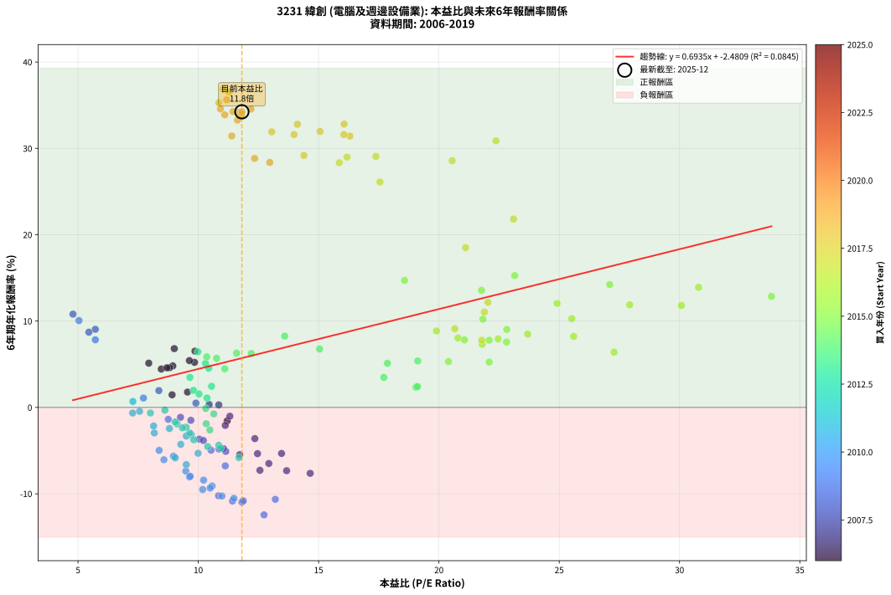
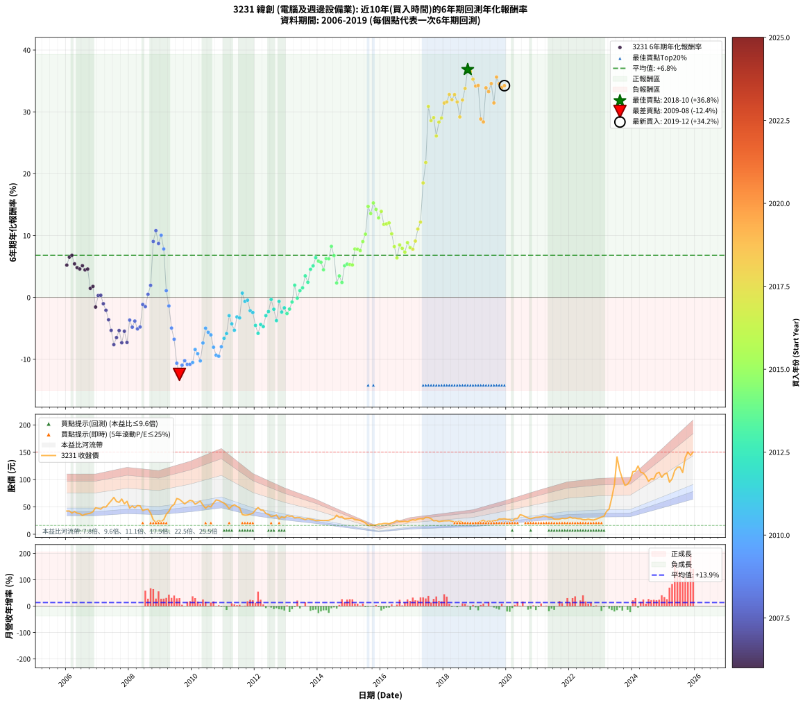

# 3231 緯創 - 本益比與未來報酬率分析

!!! info "報告資訊"
    - **股票代號**: 3231
    - **公司名稱**: 緯創
    - **產業別**: 電腦及週邊設備業
    - **分析期間**: 2006-2019 (168 個數據點)
    - **資料來源**: Type 12 (ShowMonthlyK_ChartFlow) 月收盤價與本益比
    - **報酬率口徑**: 含現金股利 (簡化: 年度合計，假設每年7/1入帳)
    - **報告生成時間**: 2026-01-06 00:56:08 CST

## 📈 視覺化圖表

### 圖表1: 本益比 vs 未來報酬率關係

*圖表1：3231 緯創 本益比與6年期未來報酬率關係 (2006-2019)*

### 圖表2: 歷年買入時點的6年期實際報酬率

*圖表2：3231 緯創 歷年買入時點的6年期實際報酬率 (2006-2019)*

## 📍 買點訊號說明

本報告提供兩種買點提示訊號（顯示於圖表2的股價子圖中）：

### ▲ 小綠色三角形（回測驗證）
- **計算方式**: 使用全部歷史資料計算本益比第25百分位數
- **用途**: 事後驗證，顯示歷史上哪些時點確實為低估區
- **限制**: 當下無法判斷，僅供回測參考
- **特性**: 後見之明（Look-Ahead Bias）

### ▲ 小橘色三角形（即時訊號）
- **計算方式**: 使用截至當月的過去5年資料計算本益比第25百分位數
- **用途**: 實際投資決策，當時即可判斷
- **優勢**: 可操作性強，符合實務需求
- **特性**: 無後見之明，滾動窗口計算

!!! tip "如何使用兩種訊號"
    - **綠色▲** 幫助理解歷史估值機會，驗證策略有效性
    - **橘色▲** 可作為實際買進參考，但仍需搭配基本面分析
    - 兩種訊號重疊時，表示即時判斷與事後驗證一致，信心度較高
    - 僅有綠色▲時，表示當時無法判斷（需要未來資料才能確認）
    - 僅有橘色▲時，表示即時判斷為買點，但事後可能不是最佳時機

## 📊 估值分析摘要

| 指標 | 數值 |
|:---:|:---:|
| **目前本益比** (2019-12) | **11.81 倍** |
| **歷史平均本益比** | 13.39 倍 |
| **估值水準** | 🟡 合理範圍 |
| **預期6年年化報酬率** | **+5.71%** |
| **歷史平均報酬率** | +6.80% |
| **相關係數 (R²)** | 0.0845 |
| **趨勢線斜率** | 0.6935 |

!!! abstract "核心洞察"
    目前本益比接近歷史平均，預期報酬率符合長期趨勢

    根據歷史數據回測，3231 緯創 在目前本益比 **11.8倍** 的估值水準下，
    預期未來6年年化報酬率約為 **+5.7%**。

    **重要提醒**: 本分析基於歷史數據統計，實際報酬率會受到公司基本面變化、產業趨勢、
    總體經濟環境等多重因素影響。R² = 0.08 表示本益比可解釋約 8.5% 的報酬率變異。

## 📈 歷史估值統計

### 最佳買點 (最高報酬率)

| 項目 | 數值 |
|:---:|:---:|
| 起始時間 | 2018-10 |
| 當時本益比 | 11.03 倍 |
| 起始價格 | 18.9 元 |
| 6年後價格 | 111.0 元 |
| **6年年化報酬率** | **+36.84%** |

### 最差買點 (最低報酬率)

| 項目 | 數值 |
|:---:|:---:|
| 起始時間 | 2009-08 |
| 當時本益比 | 12.73 倍 |
| 起始價格 | 63.8 元 |
| 6年後價格 | 16.1 元 |
| **6年年化報酬率** | **-12.44%** |

## 🎯 投資啟示

### 本益比與報酬率關係

趨勢線方程式: **y = 0.6935x + -2.4809**

!!! info "弱相關或正相關"
    本益比與未來報酬率相關性較弱。這可能表示該股票的報酬率更多受到
    公司成長性、產業趨勢等因素影響，而非估值水準。**需綜合考量多項指標**。

### 估值區間建議

基於歷史數據分析:

- **🟢 低估區** (P/E < 10.7): 預期報酬率較高，可考慮增加持股
- **🟡 合理區** (P/E 10.7-16.1): 預期報酬率符合長期趨勢，正常持有
- **🔴 高估區** (P/E > 16.1): 預期報酬率較低，可考慮減碼或觀望

!!! danger "風險提示"
    - 過去表現不代表未來結果
    - 本分析假設公司基本面無重大結構性變化
    - 產業環境劇變可能使歷史規律失效
    - 應結合公司財報、產業趨勢、總體經濟等多重因素綜合判斷

!!! success "長期投資觀點"
    歷史數據顯示，在合理或低估的估值水準買入並長期持有，
    往往能獲得較佳的投資報酬。**耐心等待好價格**是價值投資的核心原則。

## 📊 數據品質

- **資料來源**: GoodInfo.tw Type 12 (ShowMonthlyK_ChartFlow)
- **資料頻率**: 月度收盤價與本益比
- **回測期間**: 2006-2019
- **數據點數量**: 168 個 (每個點代表一次6年期回測)

### 計算方法說明

1. **6年期年化報酬率**:
   - 對每個歷史時點，計算其後6年的實際投資報酬率
   - 期末價值(不含股利): 期末價格
   - 期末價值(含現金股利): 期末價格 + 持有期間內的現金股利合計 (簡化: 年度合計，假設每年7/1入帳)
   - 公式: 年化報酬率 = [(期末價值/期初價格)^(1/年數) - 1] × 100%

2. **本益比 (P/E Ratio)**:
   - 使用當時的月收盤價與EPS計算
   - 資料來源: Type 12 月度河流圖本益比數據

3. **趨勢線 (Linear Regression)**:
   - 使用最小平方法擬合線性趨勢線
   - R²值衡量本益比對報酬率的解釋能力

---

*本報告由 Stock Analysis System v1.9.0 自動生成*
*數據更新時間: 2026-01-06 00:56:08 CST*

## 📋 月度回測明細表

（每一列對應時間線圖中的一個買入點；可用來對照 SVG 圖上的每個點。）

| 買入月份 | 賣出月份 | 回測期限_年 | 實際持有年數 | 買入本益比_倍 | 買入收盤價_元 | 賣出收盤價_元 | 現金股利合計_元 | 總報酬率_pct | 年化報酬率_pct |
| --- | --- | --- | --- | --- | --- | --- | --- | --- | --- |
| 2006-01 | 2012-01 | 6 | 5.999 | 9.84 | 42.50 | 44.40 | 13.26 | +35.68 | +5.22 |
| 2006-02 | 2012-02 | 6 | 5.999 | 9.86 | 42.60 | 48.95 | 13.26 | +46.04 | +6.52 |
| 2006-03 | 2012-03 | 6 | 6.001 | 9.00 | 38.90 | 44.50 | 13.26 | +48.49 | +6.81 |
| 2006-04 | 2012-04 | 6 | 6.001 | 9.63 | 41.60 | 43.85 | 13.26 | +37.29 | +5.42 |
| 2006-05 | 2012-05 | 6 | 6.001 | 8.94 | 38.60 | 37.90 | 13.26 | +32.54 | +4.81 |
| 2006-06 | 2012-06 | 6 | 6.001 | 8.80 | 38.00 | 36.50 | 13.26 | +30.95 | +4.60 |
| 2006-07 | 2012-07 | 6 | 6.001 | 7.94 | 34.30 | 32.35 | 13.95 | +34.98 | +5.13 |
| 2006-08 | 2012-08 | 6 | 6.001 | 8.46 | 36.55 | 33.50 | 13.95 | +29.82 | +4.44 |
| 2006-09 | 2012-09 | 6 | 6.001 | 8.69 | 37.55 | 35.20 | 13.95 | +30.89 | +4.59 |
| 2006-10 | 2012-10 | 6 | 6.001 | 8.91 | 38.50 | 28.05 | 13.95 | +9.09 | +1.46 |
| 2006-11 | 2012-11 | 6 | 6.001 | 9.55 | 41.25 | 31.90 | 13.95 | +11.15 | +1.78 |
| 2006-12 | 2012-12 | 6 | 6.001 | 11.20 | 48.40 | 30.10 | 13.95 | -8.99 | -1.56 |
| 2007-01 | 2013-01 | 6 | 6.001 | 10.85 | 47.30 | 34.20 | 13.95 | +1.79 | +0.30 |
| 2007-02 | 2013-02 | 6 | 6.001 | 10.45 | 46.00 | 33.00 | 13.95 | +2.06 | +0.34 |
| 2007-03 | 2013-03 | 6 | 6.001 | 11.31 | 50.20 | 33.25 | 13.95 | -5.98 | -1.02 |
| 2007-04 | 2013-04 | 6 | 6.001 | 11.12 | 49.80 | 29.95 | 13.95 | -11.85 | -2.08 |
| 2007-05 | 2013-05 | 6 | 6.001 | 12.35 | 55.80 | 30.80 | 13.95 | -19.81 | -3.61 |
| 2007-06 | 2013-06 | 6 | 6.001 | 13.46 | 61.40 | 30.25 | 13.95 | -28.02 | -5.33 |
| 2007-07 | 2013-07 | 6 | 6.001 | 14.65 | 67.40 | 28.60 | 13.25 | -37.91 | -7.63 |
| 2007-08 | 2013-08 | 6 | 6.001 | 12.93 | 60.00 | 26.85 | 13.25 | -33.16 | -6.49 |
| 2007-09 | 2013-09 | 6 | 6.001 | 12.46 | 58.30 | 28.65 | 13.25 | -28.13 | -5.35 |
| 2007-10 | 2013-10 | 6 | 6.001 | 13.67 | 64.50 | 27.60 | 13.25 | -36.66 | -7.33 |
| 2007-11 | 2013-11 | 6 | 6.001 | 11.72 | 55.80 | 26.55 | 13.25 | -28.67 | -5.47 |
| 2007-12 | 2013-12 | 6 | 6.001 | 12.56 | 60.30 | 25.05 | 13.25 | -36.48 | -7.28 |
| 2008-01 | 2014-01 | 6 | 6.001 | 10.04 | 48.00 | 25.10 | 13.25 | -20.10 | -3.67 |
| 2008-02 | 2014-03 | 6 | 6.081 | 10.86 | 51.70 | 25.05 | 13.25 | -25.91 | -4.81 |
| 2008-03 | 2014-03 | 6 | 5.999 | 10.21 | 48.40 | 25.05 | 13.25 | -20.86 | -3.83 |
| 2008-04 | 2014-04 | 6 | 5.999 | 11.14 | 52.60 | 25.20 | 13.25 | -26.90 | -5.09 |
| 2008-05 | 2014-05 | 6 | 5.999 | 11.05 | 52.00 | 25.50 | 13.25 | -25.48 | -4.78 |
| 2008-06 | 2014-06 | 6 | 5.999 | 9.26 | 43.40 | 27.25 | 13.25 | -6.68 | -1.15 |
| 2008-07 | 2014-07 | 6 | 5.999 | 9.69 | 45.20 | 28.90 | 12.40 | -8.63 | -1.49 |
| 2008-08 | 2014-08 | 6 | 5.999 | 9.90 | 46.00 | 35.00 | 12.40 | +3.04 | +0.50 |
| 2008-09 | 2014-09 | 6 | 5.999 | 8.36 | 38.70 | 31.05 | 12.40 | +12.27 | +1.95 |
| 2008-10 | 2014-10 | 6 | 5.999 | 5.72 | 26.35 | 31.90 | 12.40 | +68.12 | +9.05 |
| 2008-11 | 2014-11 | 6 | 5.999 | 4.79 | 22.00 | 28.30 | 12.40 | +85.00 | +10.80 |
| 2008-12 | 2014-12 | 6 | 5.999 | 5.45 | 24.90 | 28.70 | 12.40 | +65.06 | +8.71 |
| 2009-01 | 2015-01 | 6 | 5.999 | 5.04 | 23.30 | 29.00 | 12.40 | +77.68 | +10.06 |
| 2009-02 | 2015-02 | 6 | 5.999 | 5.72 | 26.75 | 29.65 | 12.40 | +57.20 | +7.83 |
| 2009-03 | 2015-03 | 6 | 5.999 | 7.72 | 36.55 | 26.60 | 12.40 | +6.70 | +1.09 |
| 2009-04 | 2015-04 | 6 | 5.999 | 8.75 | 41.90 | 26.15 | 12.40 | -8.00 | -1.38 |
| 2009-05 | 2015-05 | 6 | 5.999 | 10.53 | 51.00 | 25.20 | 12.40 | -26.27 | -4.95 |
| 2009-06 | 2015-06 | 6 | 5.999 | 11.12 | 54.50 | 23.40 | 12.40 | -34.31 | -6.77 |
| 2009-07 | 2015-07 | 6 | 5.999 | 13.20 | 65.40 | 20.65 | 12.65 | -49.09 | -10.64 |
| 2009-08 | 2015-08 | 6 | 5.999 | 12.73 | 63.80 | 16.10 | 12.65 | -54.94 | -12.44 |
| 2009-09 | 2015-09 | 6 | 5.999 | 11.81 | 59.80 | 17.15 | 12.65 | -50.17 | -10.96 |
| 2009-10 | 2015-10 | 6 | 5.999 | 10.84 | 55.50 | 16.40 | 12.65 | -47.66 | -10.23 |
| 2009-11 | 2015-11 | 6 | 5.999 | 11.42 | 59.10 | 17.05 | 12.65 | -49.75 | -10.84 |
| 2009-12 | 2015-12 | 6 | 5.999 | 11.87 | 62.10 | 18.60 | 12.65 | -49.68 | -10.82 |
| 2010-01 | 2016-01 | 6 | 5.999 | 11.48 | 60.90 | 18.60 | 12.65 | -48.69 | -10.53 |
| 2010-02 | 2016-02 | 6 | 5.999 | 10.22 | 55.00 | 19.80 | 12.65 | -41.01 | -8.42 |
| 2010-03 | 2016-03 | 6 | 6.001 | 10.57 | 57.70 | 19.90 | 12.65 | -43.59 | -9.10 |
| 2010-04 | 2016-04 | 6 | 6.001 | 10.98 | 60.80 | 19.10 | 12.65 | -47.78 | -10.26 |
| 2010-05 | 2016-05 | 6 | 6.001 | 9.48 | 53.20 | 20.95 | 12.65 | -36.85 | -7.37 |
| 2010-06 | 2016-06 | 6 | 6.001 | 8.37 | 47.60 | 22.40 | 12.65 | -26.37 | -4.97 |
| 2010-07 | 2016-07 | 6 | 6.001 | 8.97 | 51.70 | 25.35 | 11.12 | -29.45 | -5.65 |
| 2010-08 | 2016-08 | 6 | 6.001 | 8.57 | 50.10 | 23.30 | 11.12 | -31.29 | -6.06 |
| 2010-09 | 2016-09 | 6 | 6.001 | 9.63 | 57.00 | 23.30 | 11.12 | -39.61 | -8.06 |
| 2010-10 | 2016-10 | 6 | 6.001 | 10.49 | 62.90 | 23.80 | 11.12 | -44.48 | -9.34 |
| 2010-11 | 2016-11 | 6 | 6.001 | 10.18 | 61.80 | 22.80 | 11.12 | -45.11 | -9.51 |
| 2010-12 | 2016-12 | 6 | 6.001 | 9.66 | 59.40 | 24.95 | 11.12 | -39.27 | -7.97 |
| 2011-01 | 2017-01 | 6 | 6.001 | 9.50 | 57.00 | 26.65 | 11.12 | -33.73 | -6.63 |
| 2011-02 | 2017-02 | 6 | 6.001 | 9.04 | 52.90 | 25.75 | 11.12 | -30.29 | -5.84 |
| 2011-03 | 2017-03 | 6 | 6.001 | 8.17 | 46.60 | 27.80 | 11.12 | -16.47 | -2.95 |
| 2011-04 | 2017-04 | 6 | 6.001 | 9.27 | 51.50 | 28.50 | 11.12 | -23.06 | -4.27 |
| 2011-05 | 2017-05 | 6 | 6.001 | 9.99 | 54.00 | 27.80 | 11.12 | -27.92 | -5.31 |
| 2011-06 | 2017-06 | 6 | 6.001 | 9.71 | 51.00 | 30.95 | 11.12 | -17.50 | -3.15 |
| 2011-07 | 2017-07 | 6 | 6.001 | 9.50 | 48.50 | 30.50 | 9.11 | -18.32 | -3.32 |
| 2011-08 | 2017-08 | 6 | 6.001 | 7.28 | 36.10 | 28.50 | 9.11 | +4.19 | +0.69 |
| 2011-09 | 2017-09 | 6 | 6.001 | 7.27 | 34.95 | 24.50 | 9.11 | -3.83 | -0.65 |
| 2011-10 | 2017-10 | 6 | 6.001 | 7.56 | 35.20 | 25.15 | 9.11 | -2.66 | -0.45 |
| 2011-11 | 2017-11 | 6 | 6.001 | 8.14 | 36.70 | 23.10 | 9.11 | -12.23 | -2.15 |
| 2011-12 | 2017-12 | 6 | 6.001 | 8.80 | 38.35 | 23.95 | 9.11 | -13.79 | -2.44 |
| 2012-01 | 2018-01 | 6 | 6.001 | 10.39 | 44.40 | 24.50 | 9.11 | -24.30 | -4.53 |
| 2012-02 | 2018-03 | 6 | 6.081 | 11.69 | 48.95 | 24.90 | 9.11 | -30.51 | -5.81 |
| 2012-03 | 2018-03 | 6 | 5.999 | 10.85 | 44.50 | 24.90 | 9.11 | -23.57 | -4.38 |
| 2012-04 | 2018-04 | 6 | 5.999 | 10.92 | 43.85 | 23.70 | 9.11 | -25.17 | -4.72 |
| 2012-05 | 2018-05 | 6 | 5.999 | 9.64 | 37.90 | 22.55 | 9.11 | -16.46 | -2.95 |
| 2012-06 | 2018-06 | 6 | 5.999 | 9.49 | 36.50 | 22.65 | 9.11 | -12.98 | -2.29 |
| 2012-07 | 2018-07 | 6 | 5.999 | 8.61 | 32.35 | 23.65 | 8.08 | -1.91 | -0.32 |
| 2012-08 | 2018-08 | 6 | 5.999 | 9.12 | 33.50 | 21.75 | 8.08 | -10.95 | -1.91 |
| 2012-09 | 2018-09 | 6 | 5.999 | 9.81 | 35.20 | 19.90 | 8.08 | -20.51 | -3.75 |
| 2012-10 | 2018-10 | 6 | 5.999 | 8.01 | 28.05 | 18.90 | 8.08 | -3.81 | -0.65 |
| 2012-11 | 2018-11 | 6 | 5.999 | 9.34 | 31.90 | 19.55 | 8.08 | -13.38 | -2.37 |
| 2012-12 | 2018-12 | 6 | 5.999 | 9.04 | 30.10 | 19.10 | 8.08 | -9.69 | -1.69 |
| 2013-01 | 2019-01 | 6 | 5.999 | 10.48 | 34.20 | 21.10 | 8.08 | -14.67 | -2.61 |
| 2013-02 | 2019-02 | 6 | 5.999 | 10.33 | 33.00 | 21.35 | 8.08 | -10.81 | -1.89 |
| 2013-03 | 2019-03 | 6 | 5.999 | 10.64 | 33.25 | 23.70 | 8.08 | -4.42 | -0.75 |
| 2013-04 | 2019-04 | 6 | 5.999 | 9.80 | 29.95 | 25.60 | 8.08 | +12.46 | +1.98 |
| 2013-05 | 2019-05 | 6 | 5.999 | 10.31 | 30.80 | 22.50 | 8.08 | -0.71 | -0.12 |
| 2013-06 | 2019-06 | 6 | 5.999 | 10.36 | 30.25 | 24.20 | 8.08 | +6.72 | +1.09 |
| 2013-07 | 2019-07 | 6 | 5.999 | 10.03 | 28.60 | 23.30 | 8.07 | +9.69 | +1.55 |
| 2013-08 | 2019-08 | 6 | 5.999 | 9.65 | 26.85 | 24.90 | 8.07 | +22.79 | +3.48 |
| 2013-09 | 2019-09 | 6 | 5.999 | 10.55 | 28.65 | 25.05 | 8.07 | +15.60 | +2.45 |
| 2013-10 | 2019-10 | 6 | 5.999 | 10.43 | 27.60 | 27.95 | 8.07 | +30.51 | +4.54 |
| 2013-11 | 2019-11 | 6 | 5.999 | 10.30 | 26.55 | 27.70 | 8.07 | +34.73 | +5.09 |
| 2013-12 | 2019-12 | 6 | 5.999 | 9.98 | 25.05 | 28.35 | 8.07 | +45.39 | +6.44 |
| 2014-01 | 2020-01 | 6 | 5.999 | 10.35 | 25.10 | 27.25 | 8.07 | +40.72 | +5.86 |
| 2014-02 | 2020-02 | 6 | 5.999 | 10.76 | 25.20 | 27.05 | 8.07 | +39.37 | +5.69 |
| 2014-03 | 2020-03 | 6 | 6.001 | 11.10 | 25.05 | 24.50 | 8.07 | +30.02 | +4.47 |
| 2014-04 | 2020-04 | 6 | 6.001 | 11.59 | 25.20 | 28.25 | 8.07 | +44.13 | +6.28 |
| 2014-05 | 2020-05 | 6 | 6.001 | 12.20 | 25.50 | 28.60 | 8.07 | +43.80 | +6.24 |
| 2014-06 | 2020-06 | 6 | 6.001 | 13.59 | 27.25 | 35.80 | 8.07 | +60.99 | +8.26 |
| 2014-07 | 2020-07 | 6 | 6.001 | 15.04 | 28.90 | 34.50 | 8.31 | +48.13 | +6.77 |
| 2014-08 | 2020-08 | 6 | 6.001 | 19.05 | 35.00 | 31.90 | 8.31 | +14.89 | +2.34 |
| 2014-09 | 2020-09 | 6 | 6.001 | 17.71 | 31.05 | 29.80 | 8.31 | +22.74 | +3.47 |
| 2014-10 | 2020-10 | 6 | 6.001 | 19.11 | 31.90 | 28.50 | 8.31 | +15.39 | +2.41 |
| 2014-11 | 2020-11 | 6 | 6.001 | 17.86 | 28.30 | 29.85 | 8.31 | +34.84 | +5.11 |
| 2014-12 | 2020-12 | 6 | 6.001 | 19.12 | 28.70 | 31.00 | 8.31 | +36.97 | +5.38 |
| 2015-01 | 2021-01 | 6 | 6.001 | 20.40 | 29.00 | 31.25 | 8.31 | +36.41 | +5.31 |
| 2015-02 | 2021-02 | 6 | 6.001 | 22.09 | 29.65 | 32.00 | 8.31 | +35.95 | +5.25 |
| 2015-03 | 2021-03 | 6 | 6.001 | 21.06 | 26.60 | 33.50 | 8.31 | +57.18 | +7.83 |
| 2015-04 | 2021-04 | 6 | 6.001 | 22.09 | 26.15 | 32.70 | 8.31 | +56.83 | +7.79 |
| 2015-05 | 2021-05 | 6 | 6.001 | 22.81 | 25.20 | 30.75 | 8.31 | +55.00 | +7.58 |
| 2015-06 | 2021-06 | 6 | 6.001 | 22.82 | 23.40 | 31.00 | 8.31 | +67.99 | +9.03 |
| 2015-07 | 2021-07 | 6 | 6.001 | 21.83 | 20.65 | 27.75 | 9.28 | +79.32 | +10.22 |
| 2015-08 | 2021-08 | 6 | 6.001 | 18.57 | 16.10 | 27.40 | 9.28 | +127.83 | +14.71 |
| 2015-09 | 2021-09 | 6 | 6.001 | 21.77 | 17.15 | 27.50 | 9.28 | +114.46 | +13.56 |
| 2015-10 | 2021-10 | 6 | 6.001 | 23.15 | 16.40 | 29.20 | 9.28 | +134.63 | +15.27 |
| 2015-11 | 2021-11 | 6 | 6.001 | 27.10 | 17.05 | 28.60 | 9.28 | +122.17 | +14.23 |
| 2015-12 | 2021-12 | 6 | 6.001 | 33.82 | 18.60 | 29.15 | 9.28 | +106.61 | +12.85 |
| 2016-01 | 2022-01 | 6 | 6.001 | 30.79 | 18.60 | 31.35 | 9.28 | +118.44 | +13.90 |
| 2016-02 | 2022-03 | 6 | 6.081 | 30.08 | 19.80 | 29.75 | 9.28 | +97.12 | +11.81 |
| 2016-03 | 2022-03 | 6 | 5.999 | 27.93 | 19.90 | 29.75 | 9.28 | +96.13 | +11.88 |
| 2016-04 | 2022-04 | 6 | 5.999 | 24.91 | 19.10 | 28.50 | 9.28 | +97.80 | +12.04 |
| 2016-05 | 2022-05 | 6 | 5.999 | 25.52 | 20.95 | 28.40 | 9.28 | +79.86 | +10.28 |
| 2016-06 | 2022-06 | 6 | 5.999 | 25.60 | 22.40 | 26.70 | 9.28 | +60.63 | +8.22 |
| 2016-07 | 2022-07 | 6 | 5.999 | 27.28 | 25.35 | 26.50 | 10.28 | +45.10 | +6.40 |
| 2016-08 | 2022-08 | 6 | 5.999 | 23.69 | 23.30 | 27.70 | 10.28 | +63.02 | +8.49 |
| 2016-09 | 2022-09 | 6 | 5.999 | 22.46 | 23.30 | 26.55 | 10.28 | +58.08 | +7.93 |
| 2016-10 | 2022-10 | 6 | 5.999 | 21.80 | 23.80 | 26.05 | 10.28 | +52.66 | +7.31 |
| 2016-11 | 2022-11 | 6 | 5.999 | 19.90 | 22.80 | 27.65 | 10.28 | +66.37 | +8.86 |
| 2016-12 | 2022-12 | 6 | 5.999 | 20.79 | 24.95 | 29.40 | 10.28 | +59.05 | +8.04 |
| 2017-01 | 2023-01 | 6 | 5.999 | 21.78 | 26.65 | 31.50 | 10.28 | +56.78 | +7.78 |
| 2017-02 | 2023-02 | 6 | 5.999 | 20.66 | 25.75 | 33.15 | 10.28 | +68.67 | +9.11 |
| 2017-03 | 2023-03 | 6 | 5.999 | 21.89 | 27.80 | 41.85 | 10.28 | +87.53 | +11.05 |
| 2017-04 | 2023-04 | 6 | 5.999 | 22.04 | 28.50 | 46.50 | 10.28 | +99.24 | +12.18 |
| 2017-05 | 2023-05 | 6 | 5.999 | 21.11 | 27.80 | 66.70 | 10.28 | +176.92 | +18.51 |
| 2017-06 | 2023-06 | 6 | 5.999 | 23.10 | 30.95 | 90.80 | 10.28 | +226.60 | +21.81 |
| 2017-07 | 2023-07 | 6 | 5.999 | 22.37 | 30.50 | 141.50 | 11.70 | +402.29 | +30.87 |
| 2017-08 | 2023-08 | 6 | 5.999 | 20.55 | 28.50 | 117.00 | 11.70 | +351.57 | +28.57 |
| 2017-09 | 2023-09 | 6 | 5.999 | 17.38 | 24.50 | 101.50 | 11.70 | +362.03 | +29.06 |
| 2017-10 | 2023-10 | 6 | 5.999 | 17.55 | 25.15 | 89.40 | 11.70 | +301.98 | +26.10 |
| 2017-11 | 2023-11 | 6 | 5.999 | 15.86 | 23.10 | 91.50 | 11.70 | +346.74 | +28.34 |
| 2017-12 | 2023-12 | 6 | 5.999 | 16.18 | 23.95 | 98.60 | 11.70 | +360.53 | +28.99 |
| 2018-01 | 2024-01 | 6 | 5.999 | 16.30 | 24.50 | 114.50 | 11.70 | +415.09 | +31.42 |
| 2018-02 | 2024-02 | 6 | 5.999 | 16.05 | 24.50 | 115.50 | 11.70 | +419.18 | +31.60 |
| 2018-03 | 2024-03 | 6 | 6.001 | 16.06 | 24.90 | 125.00 | 11.70 | +448.99 | +32.81 |
| 2018-04 | 2024-04 | 6 | 6.001 | 15.06 | 23.70 | 113.50 | 11.70 | +428.26 | +31.96 |
| 2018-05 | 2024-05 | 6 | 6.001 | 14.12 | 22.55 | 112.00 | 11.70 | +448.55 | +32.79 |
| 2018-06 | 2024-06 | 6 | 6.001 | 13.98 | 22.65 | 106.00 | 11.70 | +419.64 | +31.60 |
| 2018-07 | 2024-07 | 6 | 6.001 | 14.39 | 23.65 | 96.80 | 13.13 | +364.81 | +29.18 |
| 2018-08 | 2024-08 | 6 | 6.001 | 13.05 | 21.75 | 101.50 | 13.13 | +427.03 | +31.91 |
| 2018-09 | 2024-09 | 6 | 6.001 | 11.78 | 19.90 | 101.00 | 13.13 | +473.51 | +33.78 |
| 2018-10 | 2024-10 | 6 | 6.001 | 11.03 | 18.90 | 111.00 | 13.13 | +556.76 | +36.84 |
| 2018-11 | 2024-11 | 6 | 6.001 | 11.26 | 19.55 | 113.50 | 13.13 | +547.71 | +36.52 |
| 2018-12 | 2024-12 | 6 | 6.001 | 10.85 | 19.10 | 104.00 | 13.13 | +513.24 | +35.28 |
| 2019-01 | 2025-01 | 6 | 6.001 | 11.64 | 21.10 | 110.00 | 13.13 | +483.55 | +34.17 |
| 2019-02 | 2025-02 | 6 | 6.001 | 11.44 | 21.35 | 112.00 | 13.13 | +486.08 | +34.27 |
| 2019-03 | 2025-03 | 6 | 6.001 | 12.34 | 23.70 | 95.30 | 13.13 | +357.50 | +28.84 |
| 2019-04 | 2025-04 | 6 | 6.001 | 12.97 | 25.60 | 101.50 | 13.13 | +347.77 | +28.38 |
| 2019-05 | 2025-05 | 6 | 6.001 | 11.10 | 22.50 | 116.50 | 13.13 | +476.12 | +33.88 |
| 2019-06 | 2025-06 | 6 | 6.001 | 11.63 | 24.20 | 122.50 | 13.13 | +460.45 | +33.27 |
| 2019-07 | 2025-07 | 6 | 6.001 | 10.92 | 23.30 | 123.00 | 15.44 | +494.16 | +34.57 |
| 2019-08 | 2025-08 | 6 | 6.001 | 11.39 | 24.90 | 113.00 | 15.44 | +415.82 | +31.44 |
| 2019-09 | 2025-09 | 6 | 6.001 | 11.18 | 25.05 | 140.50 | 15.44 | +522.51 | +35.62 |
| 2019-10 | 2025-10 | 6 | 6.001 | 12.19 | 27.95 | 150.50 | 15.44 | +493.70 | +34.55 |
| 2019-11 | 2025-11 | 6 | 6.001 | 11.80 | 27.70 | 144.50 | 15.44 | +477.40 | +33.93 |
| 2019-12 | 2025-12 | 6 | 6.001 | 11.81 | 28.35 | 150.50 | 15.44 | +485.32 | +34.24 |
