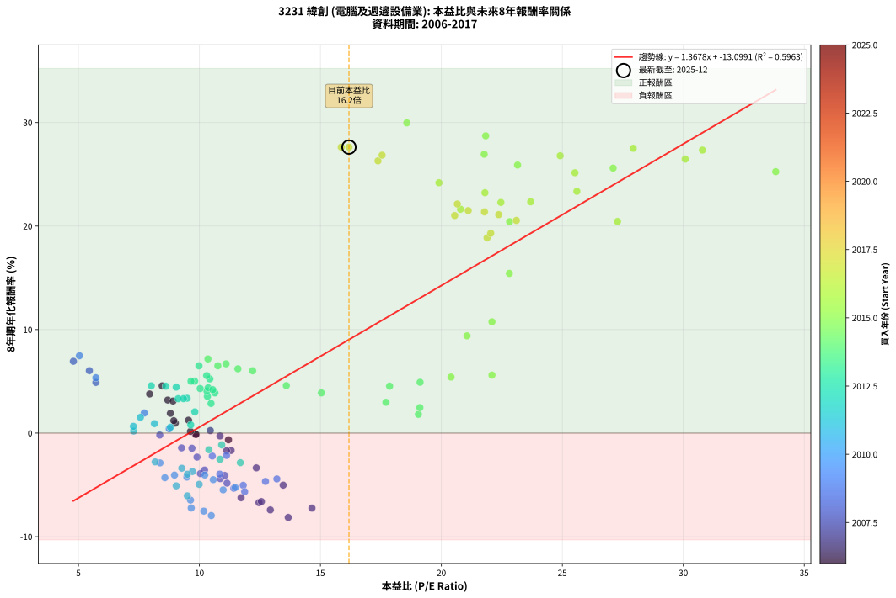
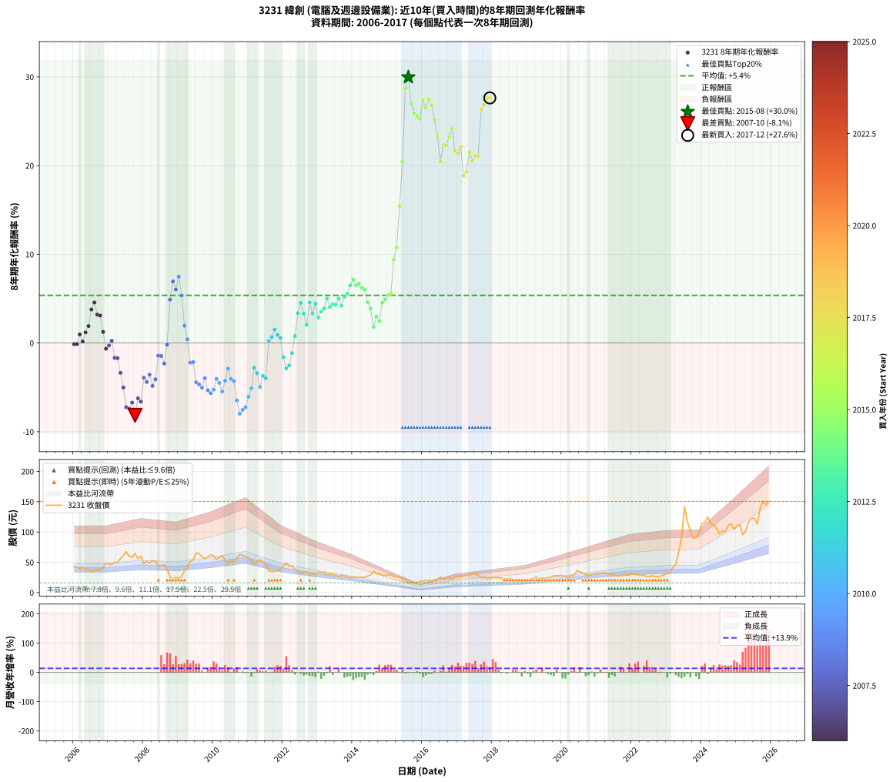

# 3231 緯創 - 本益比與未來報酬率分析

!!! info "報告資訊"
    - **股票代號**: 3231
    - **公司名稱**: 緯創
    - **產業別**: 電腦及週邊設備業
    - **分析期間**: 2006-2017 (144 個數據點)
    - **資料來源**: Type 12 (ShowMonthlyK_ChartFlow) 月收盤價與本益比
    - **報酬率口徑**: 含現金股利 (簡化: 年度合計，假設每年7/1入帳)
    - **報告生成時間**: 2026-01-13 13:41:53 CST

## 📈 視覺化圖表

### 圖表1: 本益比 vs 未來報酬率關係

*圖表1：3231 緯創 本益比與8年期未來報酬率關係 (2006-2017)*

### 圖表2: 歷年買入時點的8年期實際報酬率

*圖表2：3231 緯創 歷年買入時點的8年期實際報酬率 (2006-2017)*

## 📍 買點訊號說明

本報告提供兩種買點提示訊號（顯示於圖表2的股價子圖中）：

### ▲ 小綠色三角形（回測驗證）
- **計算方式**: 使用全部歷史資料計算本益比第25百分位數
- **用途**: 事後驗證，顯示歷史上哪些時點確實為低估區
- **限制**: 當下無法判斷，僅供回測參考
- **特性**: 後見之明（Look-Ahead Bias）

### ▲ 小橘色三角形（即時訊號）
- **計算方式**: 使用截至當月的過去5年資料計算本益比第25百分位數
- **用途**: 實際投資決策，當時即可判斷
- **優勢**: 可操作性強，符合實務需求
- **特性**: 無後見之明，滾動窗口計算

!!! tip "如何使用兩種訊號"
    - **綠色▲** 幫助理解歷史估值機會，驗證策略有效性
    - **橘色▲** 可作為實際買進參考，但仍需搭配基本面分析
    - 兩種訊號重疊時，表示即時判斷與事後驗證一致，信心度較高
    - 僅有綠色▲時，表示當時無法判斷（需要未來資料才能確認）
    - 僅有橘色▲時，表示即時判斷為買點，但事後可能不是最佳時機

## 📊 估值分析摘要

| 指標 | 數值 |
|:---:|:---:|
| **目前本益比** (2017-12) | **16.18 倍** |
| **歷史平均本益比** | 13.50 倍 |
| **估值水準** | 🟡 合理範圍 |
| **預期8年年化報酬率** | **+9.03%** |
| **歷史平均報酬率** | +5.37% |
| **相關係數 (R²)** | 0.5963 |
| **趨勢線斜率** | 1.3678 |

!!! abstract "核心洞察"
    目前本益比接近歷史平均，預期報酬率符合長期趨勢

    根據歷史數據回測，3231 緯創 在目前本益比 **16.2倍** 的估值水準下，
    預期未來8年年化報酬率約為 **+9.0%**。

    **重要提醒**: 本分析基於歷史數據統計，實際報酬率會受到公司基本面變化、產業趨勢、
    總體經濟環境等多重因素影響。R² = 0.60 表示本益比可解釋約 59.6% 的報酬率變異。

## 📈 歷史估值統計

### 最佳買點 (最高報酬率)

| 項目 | 數值 |
|:---:|:---:|
| 起始時間 | 2015-08 |
| 當時本益比 | 18.57 倍 |
| 起始價格 | 16.1 元 |
| 8年後價格 | 117.0 元 |
| **8年年化報酬率** | **+29.97%** |

### 最差買點 (最低報酬率)

| 項目 | 數值 |
|:---:|:---:|
| 起始時間 | 2007-10 |
| 當時本益比 | 13.67 倍 |
| 起始價格 | 64.5 元 |
| 8年後價格 | 16.4 元 |
| **8年年化報酬率** | **-8.15%** |

## 🎯 投資啟示

### 本益比與報酬率關係

趨勢線方程式: **y = 1.3678x + -13.0991**

!!! info "弱相關或正相關"
    本益比與未來報酬率相關性較弱。這可能表示該股票的報酬率更多受到
    公司成長性、產業趨勢等因素影響，而非估值水準。**需綜合考量多項指標**。

### 估值區間建議

基於歷史數據分析:

- **🟢 低估區** (P/E < 10.8): 預期報酬率較高，可考慮增加持股
- **🟡 合理區** (P/E 10.8-16.2): 預期報酬率符合長期趨勢，正常持有
- **🔴 高估區** (P/E > 16.2): 預期報酬率較低，可考慮減碼或觀望

!!! danger "風險提示"
    - 過去表現不代表未來結果
    - 本分析假設公司基本面無重大結構性變化
    - 產業環境劇變可能使歷史規律失效
    - 應結合公司財報、產業趨勢、總體經濟等多重因素綜合判斷

!!! success "長期投資觀點"
    歷史數據顯示，在合理或低估的估值水準買入並長期持有，
    往往能獲得較佳的投資報酬。**耐心等待好價格**是價值投資的核心原則。

## 📊 數據品質

- **資料來源**: GoodInfo.tw Type 12 (ShowMonthlyK_ChartFlow)
- **資料頻率**: 月度收盤價與本益比
- **回測期間**: 2006-2017
- **數據點數量**: 144 個 (每個點代表一次8年期回測)

### 計算方法說明

1. **8年期年化報酬率**:
   - 對每個歷史時點，計算其後8年的實際投資報酬率
   - 期末價值(不含股利): 期末價格
   - 期末價值(含現金股利): 期末價格 + 持有期間內的現金股利合計 (簡化: 年度合計，假設每年7/1入帳)
   - 公式: 年化報酬率 = [(期末價值/期初價格)^(1/年數) - 1] × 100%

2. **本益比 (P/E Ratio)**:
   - 使用當時的月收盤價與EPS計算
   - 資料來源: Type 12 月度河流圖本益比數據

3. **趨勢線 (Linear Regression)**:
   - 使用最小平方法擬合線性趨勢線
   - R²值衡量本益比對報酬率的解釋能力

---

*本報告由 Stock Analysis System v1.9.0 自動生成*
*數據更新時間: 2026-01-13 13:41:53 CST*

## 📋 月度回測明細表

（每一列對應時間線圖中的一個買入點；可用來對照 SVG 圖上的每個點。）

| 買入月份 | 賣出月份 | 回測期限_年 | 實際持有年數 | 買入本益比_倍 | 買入收盤價_元 | 賣出收盤價_元 | 現金股利合計_元 | 總報酬率_pct | 年化報酬率_pct |
| --- | --- | --- | --- | --- | --- | --- | --- | --- | --- |
| 2006-01 | 2014-01 | 8 | 8.000 | 9.84 | 42.50 | 25.10 | 16.96 | -1.03 | -0.13 |
| 2006-02 | 2014-02 | 8 | 8.000 | 9.86 | 42.60 | 25.20 | 16.96 | -1.03 | -0.13 |
| 2006-03 | 2014-03 | 8 | 8.000 | 9.00 | 38.90 | 25.05 | 16.96 | +8.00 | +0.97 |
| 2006-04 | 2014-04 | 8 | 8.000 | 9.63 | 41.60 | 25.20 | 16.96 | +1.35 | +0.17 |
| 2006-05 | 2014-05 | 8 | 8.000 | 8.94 | 38.60 | 25.50 | 16.96 | +10.01 | +1.20 |
| 2006-06 | 2014-06 | 8 | 8.000 | 8.80 | 38.00 | 27.25 | 16.96 | +16.35 | +1.91 |
| 2006-07 | 2014-07 | 8 | 8.000 | 7.94 | 34.30 | 28.90 | 17.25 | +34.55 | +3.78 |
| 2006-08 | 2014-08 | 8 | 8.000 | 8.46 | 36.55 | 35.00 | 17.25 | +42.95 | +4.57 |
| 2006-09 | 2014-09 | 8 | 8.000 | 8.69 | 37.55 | 31.05 | 17.25 | +28.63 | +3.20 |
| 2006-10 | 2014-10 | 8 | 8.000 | 8.91 | 38.50 | 31.90 | 17.25 | +27.66 | +3.10 |
| 2006-11 | 2014-11 | 8 | 8.000 | 9.55 | 41.25 | 28.30 | 17.25 | +10.42 | +1.25 |
| 2006-12 | 2014-12 | 8 | 8.000 | 11.20 | 48.40 | 28.70 | 17.25 | -5.06 | -0.65 |
| 2007-01 | 2015-01 | 8 | 8.000 | 10.85 | 47.30 | 29.00 | 17.25 | -2.22 | -0.28 |
| 2007-02 | 2015-02 | 8 | 8.000 | 10.45 | 46.00 | 29.65 | 17.25 | +1.96 | +0.24 |
| 2007-03 | 2015-03 | 8 | 8.000 | 11.31 | 50.20 | 26.60 | 17.25 | -12.65 | -1.68 |
| 2007-04 | 2015-04 | 8 | 8.000 | 11.12 | 49.80 | 26.15 | 17.25 | -12.85 | -1.70 |
| 2007-05 | 2015-05 | 8 | 8.000 | 12.35 | 55.80 | 25.20 | 17.25 | -23.92 | -3.36 |
| 2007-06 | 2015-06 | 8 | 8.000 | 13.46 | 61.40 | 23.40 | 17.25 | -33.79 | -5.02 |
| 2007-07 | 2015-07 | 8 | 8.000 | 14.65 | 67.40 | 20.65 | 16.28 | -45.20 | -7.24 |
| 2007-08 | 2015-08 | 8 | 8.000 | 12.93 | 60.00 | 16.10 | 16.28 | -46.03 | -7.42 |
| 2007-09 | 2015-09 | 8 | 8.000 | 12.46 | 58.30 | 17.15 | 16.28 | -42.65 | -6.71 |
| 2007-10 | 2015-10 | 8 | 8.000 | 13.67 | 64.50 | 16.40 | 16.28 | -49.33 | -8.15 |
| 2007-11 | 2015-11 | 8 | 8.000 | 11.72 | 55.80 | 17.05 | 16.28 | -40.26 | -6.24 |
| 2007-12 | 2015-12 | 8 | 8.000 | 12.56 | 60.30 | 18.60 | 16.28 | -42.15 | -6.61 |
| 2008-01 | 2016-01 | 8 | 8.000 | 10.04 | 48.00 | 18.60 | 16.28 | -27.32 | -3.91 |
| 2008-02 | 2016-02 | 8 | 8.000 | 10.86 | 51.70 | 19.80 | 16.28 | -30.21 | -4.40 |
| 2008-03 | 2016-03 | 8 | 8.000 | 10.21 | 48.40 | 19.90 | 16.28 | -25.24 | -3.57 |
| 2008-04 | 2016-04 | 8 | 8.000 | 11.14 | 52.60 | 19.10 | 16.28 | -32.73 | -4.83 |
| 2008-05 | 2016-05 | 8 | 8.000 | 11.05 | 52.00 | 20.95 | 16.28 | -28.40 | -4.09 |
| 2008-06 | 2016-06 | 8 | 8.000 | 9.26 | 43.40 | 22.40 | 16.28 | -10.87 | -1.43 |
| 2008-07 | 2016-07 | 8 | 8.000 | 9.69 | 45.20 | 25.35 | 14.83 | -11.11 | -1.46 |
| 2008-08 | 2016-08 | 8 | 8.000 | 9.90 | 46.00 | 23.30 | 14.83 | -17.12 | -2.32 |
| 2008-09 | 2016-09 | 8 | 8.000 | 8.36 | 38.70 | 23.30 | 14.83 | -1.48 | -0.19 |
| 2008-10 | 2016-10 | 8 | 8.000 | 5.72 | 26.35 | 23.80 | 14.83 | +46.59 | +4.90 |
| 2008-11 | 2016-11 | 8 | 8.000 | 4.79 | 22.00 | 22.80 | 14.83 | +71.03 | +6.94 |
| 2008-12 | 2016-12 | 8 | 8.000 | 5.45 | 24.90 | 24.95 | 14.83 | +59.75 | +6.03 |
| 2009-01 | 2017-01 | 8 | 8.000 | 5.04 | 23.30 | 26.65 | 14.83 | +78.01 | +7.47 |
| 2009-02 | 2017-02 | 8 | 8.000 | 5.72 | 26.75 | 25.75 | 14.83 | +51.69 | +5.35 |
| 2009-03 | 2017-03 | 8 | 8.000 | 7.72 | 36.55 | 27.80 | 14.83 | +16.63 | +1.94 |
| 2009-04 | 2017-04 | 8 | 8.000 | 8.75 | 41.90 | 28.50 | 14.83 | +3.41 | +0.42 |
| 2009-05 | 2017-05 | 8 | 8.000 | 10.53 | 51.00 | 27.80 | 14.83 | -16.42 | -2.22 |
| 2009-06 | 2017-06 | 8 | 8.000 | 11.12 | 54.50 | 30.95 | 14.83 | -16.01 | -2.16 |
| 2009-07 | 2017-07 | 8 | 8.000 | 13.20 | 65.40 | 30.50 | 15.03 | -30.39 | -4.43 |
| 2009-08 | 2017-08 | 8 | 8.000 | 12.73 | 63.80 | 28.50 | 15.03 | -31.77 | -4.67 |
| 2009-09 | 2017-09 | 8 | 8.000 | 11.81 | 59.80 | 24.50 | 15.03 | -33.90 | -5.04 |
| 2009-10 | 2017-10 | 8 | 8.000 | 10.84 | 55.50 | 25.15 | 15.03 | -27.61 | -3.96 |
| 2009-11 | 2017-11 | 8 | 8.000 | 11.42 | 59.10 | 23.10 | 15.03 | -35.49 | -5.33 |
| 2009-12 | 2017-12 | 8 | 8.000 | 11.87 | 62.10 | 23.95 | 15.03 | -37.23 | -5.66 |
| 2010-01 | 2018-01 | 8 | 8.000 | 11.48 | 60.90 | 24.50 | 15.03 | -35.09 | -5.26 |
| 2010-02 | 2018-02 | 8 | 8.000 | 10.22 | 55.00 | 24.50 | 15.03 | -28.13 | -4.04 |
| 2010-03 | 2018-03 | 8 | 8.000 | 10.57 | 57.70 | 24.90 | 15.03 | -30.80 | -4.50 |
| 2010-04 | 2018-04 | 8 | 8.000 | 10.98 | 60.80 | 23.70 | 15.03 | -36.30 | -5.48 |
| 2010-05 | 2018-05 | 8 | 8.000 | 9.48 | 53.20 | 22.55 | 15.03 | -29.36 | -4.25 |
| 2010-06 | 2018-06 | 8 | 8.000 | 8.37 | 47.60 | 22.65 | 15.03 | -20.84 | -2.88 |
| 2010-07 | 2018-07 | 8 | 8.000 | 8.97 | 51.70 | 23.65 | 13.48 | -28.19 | -4.05 |
| 2010-08 | 2018-08 | 8 | 8.000 | 8.57 | 50.10 | 21.75 | 13.48 | -29.68 | -4.31 |
| 2010-09 | 2018-09 | 8 | 8.000 | 9.63 | 57.00 | 19.90 | 13.48 | -41.44 | -6.47 |
| 2010-10 | 2018-10 | 8 | 8.000 | 10.49 | 62.90 | 18.90 | 13.48 | -48.52 | -7.97 |
| 2010-11 | 2018-11 | 8 | 8.000 | 10.18 | 61.80 | 19.55 | 13.48 | -46.56 | -7.53 |
| 2010-12 | 2018-12 | 8 | 8.000 | 9.66 | 59.40 | 19.10 | 13.48 | -45.15 | -7.23 |
| 2011-01 | 2019-01 | 8 | 8.000 | 9.50 | 57.00 | 21.10 | 13.48 | -39.34 | -6.06 |
| 2011-02 | 2019-02 | 8 | 8.000 | 9.04 | 52.90 | 21.35 | 13.48 | -34.16 | -5.09 |
| 2011-03 | 2019-03 | 8 | 8.000 | 8.17 | 46.60 | 23.70 | 13.48 | -20.22 | -2.78 |
| 2011-04 | 2019-04 | 8 | 8.000 | 9.27 | 51.50 | 25.60 | 13.48 | -24.12 | -3.39 |
| 2011-05 | 2019-05 | 8 | 8.000 | 9.99 | 54.00 | 22.50 | 13.48 | -33.37 | -4.95 |
| 2011-06 | 2019-06 | 8 | 8.000 | 9.71 | 51.00 | 24.20 | 13.48 | -26.12 | -3.71 |
| 2011-07 | 2019-07 | 8 | 8.000 | 9.50 | 48.50 | 23.30 | 11.77 | -27.69 | -3.97 |
| 2011-08 | 2019-08 | 8 | 8.000 | 7.28 | 36.10 | 24.90 | 11.77 | +1.58 | +0.20 |
| 2011-09 | 2019-09 | 8 | 8.000 | 7.27 | 34.95 | 25.05 | 11.77 | +5.35 | +0.65 |
| 2011-10 | 2019-10 | 8 | 8.000 | 7.56 | 35.20 | 27.95 | 11.77 | +12.84 | +1.52 |
| 2011-11 | 2019-11 | 8 | 8.000 | 8.14 | 36.70 | 27.70 | 11.77 | +7.55 | +0.91 |
| 2011-12 | 2019-12 | 8 | 8.000 | 8.80 | 38.35 | 28.35 | 11.77 | +4.62 | +0.57 |
| 2012-01 | 2020-01 | 8 | 8.000 | 10.39 | 44.40 | 27.25 | 11.77 | -12.12 | -1.60 |
| 2012-02 | 2020-02 | 8 | 8.000 | 11.69 | 48.95 | 27.05 | 11.77 | -20.69 | -2.86 |
| 2012-03 | 2020-03 | 8 | 8.000 | 10.85 | 44.50 | 24.50 | 11.77 | -18.49 | -2.52 |
| 2012-04 | 2020-04 | 8 | 8.000 | 10.92 | 43.85 | 28.25 | 11.77 | -8.73 | -1.14 |
| 2012-05 | 2020-05 | 8 | 8.000 | 9.64 | 37.90 | 28.60 | 11.77 | +6.52 | +0.79 |
| 2012-06 | 2020-06 | 8 | 8.000 | 9.49 | 36.50 | 35.80 | 11.77 | +30.33 | +3.37 |
| 2012-07 | 2020-07 | 8 | 8.000 | 8.61 | 32.35 | 34.50 | 11.61 | +42.54 | +4.53 |
| 2012-08 | 2020-08 | 8 | 8.000 | 9.12 | 33.50 | 31.90 | 11.61 | +29.89 | +3.32 |
| 2012-09 | 2020-09 | 8 | 8.000 | 9.81 | 35.20 | 29.80 | 11.61 | +17.65 | +2.05 |
| 2012-10 | 2020-10 | 8 | 8.000 | 8.01 | 28.05 | 28.50 | 11.61 | +43.00 | +4.57 |
| 2012-11 | 2020-11 | 8 | 8.000 | 9.34 | 31.90 | 29.85 | 11.61 | +29.97 | +3.33 |
| 2012-12 | 2020-12 | 8 | 8.000 | 9.04 | 30.10 | 31.00 | 11.61 | +41.57 | +4.44 |
| 2013-01 | 2021-01 | 8 | 8.000 | 10.48 | 34.20 | 31.25 | 11.61 | +25.33 | +2.86 |
| 2013-02 | 2021-02 | 8 | 8.000 | 10.33 | 33.00 | 32.00 | 11.61 | +32.16 | +3.55 |
| 2013-03 | 2021-03 | 8 | 8.000 | 10.64 | 33.25 | 33.50 | 11.61 | +35.68 | +3.89 |
| 2013-04 | 2021-04 | 8 | 8.000 | 9.80 | 29.95 | 32.70 | 11.61 | +47.95 | +5.02 |
| 2013-05 | 2021-05 | 8 | 8.000 | 10.31 | 30.80 | 30.75 | 11.61 | +37.54 | +4.06 |
| 2013-06 | 2021-06 | 8 | 8.000 | 10.36 | 30.25 | 31.00 | 11.61 | +40.87 | +4.38 |
| 2013-07 | 2021-07 | 8 | 8.000 | 10.03 | 28.60 | 27.75 | 12.31 | +40.08 | +4.30 |
| 2013-08 | 2021-08 | 8 | 8.000 | 9.65 | 26.85 | 27.40 | 12.31 | +47.90 | +5.01 |
| 2013-09 | 2021-09 | 8 | 8.000 | 10.55 | 28.65 | 27.50 | 12.31 | +38.96 | +4.20 |
| 2013-10 | 2021-10 | 8 | 8.000 | 10.43 | 27.60 | 29.20 | 12.31 | +50.41 | +5.23 |
| 2013-11 | 2021-11 | 8 | 8.000 | 10.30 | 26.55 | 28.60 | 12.31 | +54.09 | +5.55 |
| 2013-12 | 2021-12 | 8 | 8.000 | 9.98 | 25.05 | 29.15 | 12.31 | +65.52 | +6.50 |
| 2014-01 | 2022-01 | 8 | 8.000 | 10.35 | 25.10 | 31.35 | 12.31 | +73.95 | +7.17 |
| 2014-02 | 2022-02 | 8 | 8.000 | 10.76 | 25.20 | 29.40 | 12.31 | +65.52 | +6.50 |
| 2014-03 | 2022-03 | 8 | 8.000 | 11.10 | 25.05 | 29.75 | 12.31 | +67.91 | +6.69 |
| 2014-04 | 2022-04 | 8 | 8.000 | 11.59 | 25.20 | 28.50 | 12.31 | +61.95 | +6.21 |
| 2014-05 | 2022-05 | 8 | 8.000 | 12.20 | 25.50 | 28.40 | 12.31 | +59.65 | +6.02 |
| 2014-06 | 2022-06 | 8 | 8.000 | 13.59 | 27.25 | 26.70 | 12.31 | +43.16 | +4.59 |
| 2014-07 | 2022-07 | 8 | 8.000 | 15.04 | 28.90 | 26.50 | 12.71 | +35.67 | +3.89 |
| 2014-08 | 2022-08 | 8 | 8.000 | 19.05 | 35.00 | 27.70 | 12.71 | +15.46 | +1.81 |
| 2014-09 | 2022-09 | 8 | 8.000 | 17.71 | 31.05 | 26.55 | 12.71 | +26.44 | +2.98 |
| 2014-10 | 2022-10 | 8 | 8.000 | 19.11 | 31.90 | 26.05 | 12.71 | +21.50 | +2.46 |
| 2014-11 | 2022-11 | 8 | 8.000 | 17.86 | 28.30 | 27.65 | 12.71 | +42.61 | +4.54 |
| 2014-12 | 2022-12 | 8 | 8.000 | 19.12 | 28.70 | 29.40 | 12.71 | +46.72 | +4.91 |
| 2015-01 | 2023-01 | 8 | 8.000 | 20.40 | 29.00 | 31.50 | 12.71 | +52.45 | +5.41 |
| 2015-02 | 2023-02 | 8 | 8.000 | 22.09 | 29.65 | 33.15 | 12.71 | +54.67 | +5.60 |
| 2015-03 | 2023-03 | 8 | 8.000 | 21.06 | 26.60 | 41.85 | 12.71 | +105.11 | +9.40 |
| 2015-04 | 2023-04 | 8 | 8.000 | 22.09 | 26.15 | 46.50 | 12.71 | +126.42 | +10.76 |
| 2015-05 | 2023-05 | 8 | 8.000 | 22.81 | 25.20 | 66.70 | 12.71 | +215.12 | +15.43 |
| 2015-06 | 2023-06 | 8 | 8.000 | 22.82 | 23.40 | 90.80 | 12.71 | +342.35 | +20.43 |
| 2015-07 | 2023-07 | 8 | 8.000 | 21.83 | 20.65 | 141.50 | 14.08 | +653.41 | +28.71 |
| 2015-08 | 2023-08 | 8 | 8.000 | 18.57 | 16.10 | 117.00 | 14.08 | +714.16 | +29.97 |
| 2015-09 | 2023-09 | 8 | 8.000 | 21.77 | 17.15 | 101.50 | 14.08 | +573.93 | +26.93 |
| 2015-10 | 2023-10 | 8 | 8.000 | 23.15 | 16.40 | 89.40 | 14.08 | +530.97 | +25.89 |
| 2015-11 | 2023-11 | 8 | 8.000 | 27.10 | 17.05 | 91.50 | 14.08 | +519.23 | +25.60 |
| 2015-12 | 2023-12 | 8 | 8.000 | 33.82 | 18.60 | 98.60 | 14.08 | +505.80 | +25.25 |
| 2016-01 | 2024-01 | 8 | 8.000 | 30.79 | 18.60 | 114.50 | 14.08 | +591.28 | +27.34 |
| 2016-02 | 2024-02 | 8 | 8.000 | 30.08 | 19.80 | 115.50 | 14.08 | +554.44 | +26.47 |
| 2016-03 | 2024-03 | 8 | 8.000 | 27.93 | 19.90 | 125.00 | 14.08 | +598.89 | +27.51 |
| 2016-04 | 2024-04 | 8 | 8.000 | 24.91 | 19.10 | 113.50 | 14.08 | +567.95 | +26.79 |
| 2016-05 | 2024-05 | 8 | 8.000 | 25.52 | 20.95 | 112.00 | 14.08 | +501.81 | +25.15 |
| 2016-06 | 2024-06 | 8 | 8.000 | 25.60 | 22.40 | 106.00 | 14.08 | +436.07 | +23.35 |
| 2016-07 | 2024-07 | 8 | 8.000 | 27.28 | 25.35 | 96.80 | 15.48 | +342.92 | +20.45 |
| 2016-08 | 2024-08 | 8 | 8.000 | 23.69 | 23.30 | 101.50 | 15.48 | +402.06 | +22.35 |
| 2016-09 | 2024-09 | 8 | 8.000 | 22.46 | 23.30 | 101.00 | 15.48 | +399.92 | +22.28 |
| 2016-10 | 2024-10 | 8 | 8.000 | 21.80 | 23.80 | 111.00 | 15.48 | +431.43 | +23.22 |
| 2016-11 | 2024-11 | 8 | 8.000 | 19.90 | 22.80 | 113.50 | 15.48 | +465.71 | +24.19 |
| 2016-12 | 2024-12 | 8 | 8.000 | 20.79 | 24.95 | 104.00 | 15.48 | +378.88 | +21.63 |
| 2017-01 | 2025-01 | 8 | 8.000 | 21.78 | 26.65 | 110.00 | 15.48 | +370.85 | +21.37 |
| 2017-02 | 2025-02 | 8 | 8.000 | 20.66 | 25.75 | 112.00 | 15.48 | +395.07 | +22.13 |
| 2017-03 | 2025-03 | 8 | 8.000 | 21.89 | 27.80 | 95.30 | 15.48 | +298.49 | +18.86 |
| 2017-04 | 2025-04 | 8 | 8.000 | 22.04 | 28.50 | 101.50 | 15.48 | +310.46 | +19.31 |
| 2017-05 | 2025-05 | 8 | 8.000 | 21.11 | 27.80 | 116.50 | 15.48 | +374.75 | +21.49 |
| 2017-06 | 2025-06 | 8 | 8.000 | 23.10 | 30.95 | 122.50 | 15.48 | +345.82 | +20.54 |
| 2017-07 | 2025-07 | 8 | 8.000 | 22.37 | 30.50 | 123.00 | 18.10 | +362.61 | +21.10 |
| 2017-08 | 2025-08 | 8 | 8.000 | 20.55 | 28.50 | 113.00 | 18.10 | +359.99 | +21.02 |
| 2017-09 | 2025-09 | 8 | 8.000 | 17.38 | 24.50 | 140.50 | 18.10 | +547.33 | +26.30 |
| 2017-10 | 2025-10 | 8 | 8.000 | 17.55 | 25.15 | 150.50 | 18.10 | +570.36 | +26.85 |
| 2017-11 | 2025-11 | 8 | 8.000 | 15.86 | 23.10 | 144.50 | 18.10 | +603.88 | +27.63 |
| 2017-12 | 2025-12 | 8 | 8.000 | 16.18 | 23.95 | 150.50 | 18.10 | +603.95 | +27.63 |
