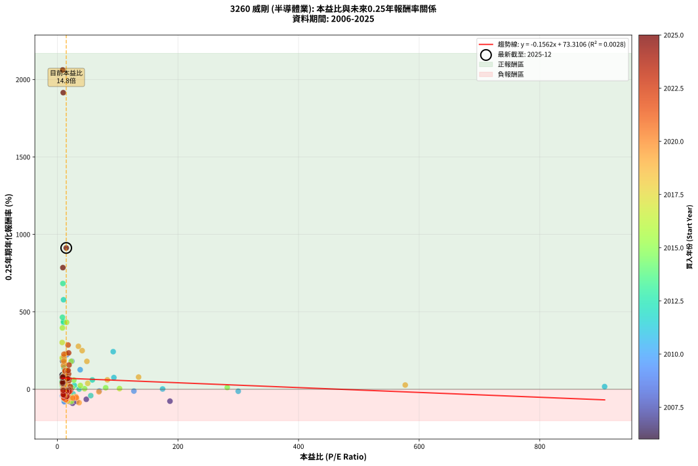
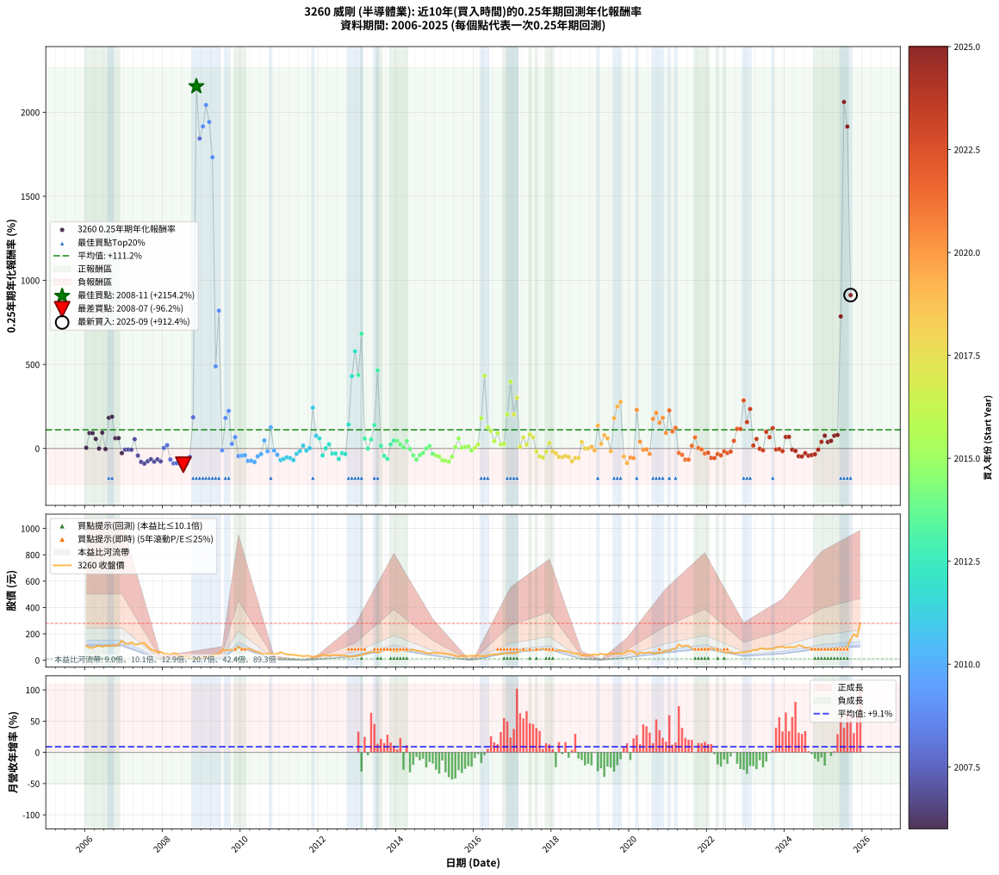

# 3260 威剛 - 本益比與未來報酬率分析

!!! info "報告資訊"
    - **股票代號**: 3260
    - **公司名稱**: 威剛
    - **產業別**: 半導體業
    - **分析期間**: 2006-2025 (237 個數據點)
    - **資料來源**: Type 12 (ShowMonthlyK_ChartFlow) 月收盤價與本益比
    - **報酬率口徑**: 含現金股利 (簡化: 年度合計，假設每年7/1入帳)
    - **報告生成時間**: 2026-01-04 08:49:55 CST

## 📈 視覺化圖表

### 圖表1: 本益比 vs 未來報酬率關係

*圖表1：3260 威剛 本益比與0.25年期未來報酬率關係 (2006-2025)*

### 圖表2: 歷年買入時點的0.25年期實際報酬率

*圖表2：3260 威剛 歷年買入時點的0.25年期實際報酬率 (2006-2025)*

## 📍 買點訊號說明

本報告提供兩種買點提示訊號（顯示於圖表2的股價子圖中）：

### ▲ 小綠色三角形（回測驗證）
- **計算方式**: 使用全部歷史資料計算本益比第25百分位數
- **用途**: 事後驗證，顯示歷史上哪些時點確實為低估區
- **限制**: 當下無法判斷，僅供回測參考
- **特性**: 後見之明（Look-Ahead Bias）

### ▲ 小橘色三角形（即時訊號）
- **計算方式**: 使用截至當月的過去5年資料計算本益比第25百分位數
- **用途**: 實際投資決策，當時即可判斷
- **優勢**: 可操作性強，符合實務需求
- **特性**: 無後見之明，滾動窗口計算

!!! tip "如何使用兩種訊號"
    - **綠色▲** 幫助理解歷史估值機會，驗證策略有效性
    - **橘色▲** 可作為實際買進參考，但仍需搭配基本面分析
    - 兩種訊號重疊時，表示即時判斷與事後驗證一致，信心度較高
    - 僅有綠色▲時，表示當時無法判斷（需要未來資料才能確認）
    - 僅有橘色▲時，表示即時判斷為買點，但事後可能不是最佳時機

## 📊 估值分析摘要

| 指標 | 數值 |
|:---:|:---:|
| **目前本益比** (2025-09) | **14.81 倍** |
| **歷史平均本益比** | 30.68 倍 |
| **估值水準** | 🟢 相對低估 |
| **預期0.25年年化報酬率** | **+71.00%** |
| **歷史平均報酬率** | +111.20% |
| **相關係數 (R²)** | 0.0028 |
| **趨勢線斜率** | -0.1562 |

!!! abstract "核心洞察"
    目前本益比顯著低於歷史平均，預期未來報酬率可能較高

    根據歷史數據回測，3260 威剛 在目前本益比 **14.8倍** 的估值水準下，
    預期未來0.25年年化報酬率約為 **+71.0%**。

    **重要提醒**: 本分析基於歷史數據統計，實際報酬率會受到公司基本面變化、產業趨勢、
    總體經濟環境等多重因素影響。R² = 0.00 表示本益比可解釋約 0.3% 的報酬率變異。

## 📈 歷史估值統計

### 最佳買點 (最高報酬率)

| 項目 | 數值 |
|:---:|:---:|
| 起始時間 | 2008-11 |
| 當時本益比 | nan 倍 |
| 起始價格 | 10.6 元 |
| 0.25年後價格 | 29.5 元 |
| **0.25年年化報酬率** | **+2154.22%** |

### 最差買點 (最低報酬率)

| 項目 | 數值 |
|:---:|:---:|
| 起始時間 | 2008-07 |
| 當時本益比 | nan 倍 |
| 起始價格 | 30.9 元 |
| 0.25年後價格 | 13.6 元 |
| **0.25年年化報酬率** | **-96.21%** |

## 🎯 投資啟示

### 本益比與報酬率關係

趨勢線方程式: **y = -0.1562x + 73.3106**

!!! note "負相關"
    本益比與未來報酬率呈現負相關。較低的本益比通常帶來較高的未來報酬率，
    但相關性不算非常強。**估值仍是重要參考指標之一**。

### 估值區間建議

基於歷史數據分析:

- **🟢 低估區** (P/E < 24.5): 預期報酬率較高，可考慮增加持股
- **🟡 合理區** (P/E 24.5-36.8): 預期報酬率符合長期趨勢，正常持有
- **🔴 高估區** (P/E > 36.8): 預期報酬率較低，可考慮減碼或觀望

!!! danger "風險提示"
    - 過去表現不代表未來結果
    - 本分析假設公司基本面無重大結構性變化
    - 產業環境劇變可能使歷史規律失效
    - 應結合公司財報、產業趨勢、總體經濟等多重因素綜合判斷

!!! success "長期投資觀點"
    歷史數據顯示，在合理或低估的估值水準買入並長期持有，
    往往能獲得較佳的投資報酬。**耐心等待好價格**是價值投資的核心原則。

## 📊 數據品質

- **資料來源**: GoodInfo.tw Type 12 (ShowMonthlyK_ChartFlow)
- **資料頻率**: 月度收盤價與本益比
- **回測期間**: 2006-2025
- **數據點數量**: 237 個 (每個點代表一次0.25年期回測)

### 計算方法說明

1. **0.25年期年化報酬率**:
   - 對每個歷史時點，計算其後0.25年的實際投資報酬率
   - 期末價值(不含股利): 期末價格
   - 期末價值(含現金股利): 期末價格 + 持有期間內的現金股利合計 (簡化: 年度合計，假設每年7/1入帳)
   - 公式: 年化報酬率 = [(期末價值/期初價格)^(1/年數) - 1] × 100%

2. **本益比 (P/E Ratio)**:
   - 使用當時的月收盤價與EPS計算
   - 資料來源: Type 12 月度河流圖本益比數據

3. **趨勢線 (Linear Regression)**:
   - 使用最小平方法擬合線性趨勢線
   - R²值衡量本益比對報酬率的解釋能力

---

*本報告由 Stock Analysis System v1.9.0 自動生成*
*數據更新時間: 2026-01-04 08:49:55 CST*

## 📋 月度回測明細表

（每一列對應時間線圖中的一個買入點；可用來對照 SVG 圖上的每個點。）

| 買入月份 | 賣出月份 | 回測期限_年 | 實際持有年數 | 買入本益比_倍 | 買入收盤價_元 | 賣出收盤價_元 | 現金股利合計_元 | 總報酬率_pct | 年化報酬率_pct |
| --- | --- | --- | --- | --- | --- | --- | --- | --- | --- |
| 2006-01 | 2006-05 | 0.25 | 0.329 | 9.22 | 109.00 | 110.50 | 0.00 | +1.38 | +4.25 |
| 2006-02 | 2006-05 | 0.25 | 0.246 | 7.96 | 94.10 | 110.50 | 0.00 | +17.43 | +91.94 |
| 2006-03 | 2006-07 | 0.25 | 0.334 | 7.93 | 93.70 | 111.00 | 5.37 | +24.20 | +91.31 |
| 2006-04 | 2006-07 | 0.25 | 0.249 | 8.80 | 104.00 | 111.00 | 5.37 | +11.90 | +57.01 |
| 2006-05 | 2006-08 | 0.25 | 0.252 | 9.35 | 110.50 | 105.00 | 5.37 | -0.12 | -0.46 |
| 2006-06 | 2006-09 | 0.25 | 0.252 | 8.54 | 101.00 | 114.00 | 5.37 | +18.19 | +94.16 |
| 2006-07 | 2006-10 | 0.25 | 0.252 | 9.39 | 111.00 | 110.00 | 0.00 | -0.90 | -3.53 |
| 2006-08 | 2006-12 | 0.25 | 0.334 | 8.88 | 105.00 | 148.50 | 0.00 | +41.43 | +182.28 |
| 2006-09 | 2006-12 | 0.25 | 0.249 | 9.64 | 114.00 | 148.50 | 0.00 | +30.26 | +188.98 |
| 2006-10 | 2007-01 | 0.25 | 0.252 | 9.31 | 110.00 | 124.00 | 0.00 | +12.73 | +60.90 |
| 2006-11 | 2007-03 | 0.25 | 0.329 | 9.90 | 117.00 | 137.00 | 0.00 | +17.09 | +61.66 |
| 2006-12 | 2007-03 | 0.25 | 0.246 | 12.56 | 148.50 | 137.00 | 0.00 | -7.74 | -27.90 |
| 2007-01 | 2007-05 | 0.25 | 0.329 | 11.41 | 124.00 | 121.00 | 0.00 | -2.42 | -7.18 |
| 2007-02 | 2007-05 | 0.25 | 0.246 | 12.42 | 123.00 | 121.00 | 0.00 | -1.63 | -6.44 |
| 2007-03 | 2007-07 | 0.25 | 0.334 | 15.31 | 137.00 | 130.00 | 3.38 | -2.64 | -7.71 |
| 2007-04 | 2007-07 | 0.25 | 0.249 | 14.95 | 119.50 | 130.00 | 3.38 | +11.61 | +55.42 |
| 2007-05 | 2007-08 | 0.25 | 0.252 | 17.20 | 121.00 | 102.00 | 3.38 | -12.91 | -42.24 |
| 2007-06 | 2007-09 | 0.25 | 0.252 | 21.13 | 128.50 | 81.90 | 3.38 | -33.64 | -80.36 |
| 2007-07 | 2007-10 | 0.25 | 0.252 | 25.37 | 130.00 | 72.50 | 0.00 | -44.23 | -90.16 |
| 2007-08 | 2007-12 | 0.25 | 0.334 | 24.48 | 102.00 | 63.50 | 0.00 | -37.75 | -75.80 |
| 2007-09 | 2007-12 | 0.25 | 0.249 | 25.51 | 81.90 | 63.50 | 0.00 | -22.47 | -63.99 |
| 2007-10 | 2008-01 | 0.25 | 0.252 | 32.17 | 72.50 | 49.10 | 0.00 | -32.28 | -78.72 |
| 2007-11 | 2008-03 | 0.25 | 0.331 | 48.05 | 62.30 | 44.10 | 0.00 | -29.21 | -64.76 |
| 2007-12 | 2008-03 | 0.25 | 0.249 | 186.80 | 63.50 | 44.10 | 0.00 | -30.55 | -76.85 |
| 2008-01 | 2008-05 | 0.25 | 0.331 |  | 49.10 | 49.65 | 0.00 | +1.12 | +3.42 |
| 2008-02 | 2008-05 | 0.25 | 0.249 |  | 47.50 | 49.65 | 0.00 | +4.53 | +19.44 |
| 2008-03 | 2008-07 | 0.25 | 0.334 |  | 44.10 | 30.90 | 0.03 | -29.86 | -65.42 |
| 2008-04 | 2008-07 | 0.25 | 0.249 |  | 53.20 | 30.90 | 0.03 | -41.86 | -88.66 |
| 2008-05 | 2008-08 | 0.25 | 0.252 |  | 49.65 | 29.60 | 0.03 | -40.32 | -87.12 |
| 2008-06 | 2008-09 | 0.25 | 0.252 |  | 31.40 | 16.90 | 0.03 | -46.08 | -91.39 |
| 2008-07 | 2008-10 | 0.25 | 0.252 |  | 30.90 | 13.55 | 0.00 | -56.15 | -96.21 |
| 2008-08 | 2008-12 | 0.25 | 0.334 |  | 29.60 | 14.20 | 0.00 | -52.03 | -88.91 |
| 2008-09 | 2008-12 | 0.25 | 0.249 |  | 16.90 | 14.20 | 0.00 | -15.98 | -50.28 |
| 2008-10 | 2009-01 | 0.25 | 0.252 |  | 13.55 | 17.65 | 0.00 | +30.26 | +185.62 |
| 2008-11 | 2009-03 | 0.25 | 0.329 |  | 10.60 | 29.50 | 0.00 | +178.30 | +2154.22 |
| 2008-12 | 2009-03 | 0.25 | 0.246 |  | 14.20 | 29.50 | 0.00 | +107.75 | +1843.83 |
| 2009-01 | 2009-05 | 0.25 | 0.329 |  | 17.65 | 47.35 | 0.00 | +168.27 | +1915.93 |
| 2009-02 | 2009-05 | 0.25 | 0.246 |  | 22.25 | 47.35 | 0.00 | +112.81 | +2043.35 |
| 2009-03 | 2009-07 | 0.25 | 0.334 |  | 29.50 | 80.80 | 0.00 | +173.90 | +1942.10 |
| 2009-04 | 2009-07 | 0.25 | 0.249 |  | 39.15 | 80.80 | 0.00 | +106.39 | +1732.49 |
| 2009-05 | 2009-08 | 0.25 | 0.252 |  | 47.35 | 74.00 | 0.00 | +56.28 | +488.64 |
| 2009-06 | 2009-09 | 0.25 | 0.252 |  | 44.60 | 78.00 | 0.00 | +74.89 | +819.99 |
| 2009-07 | 2009-10 | 0.25 | 0.252 | 69.56 | 80.80 | 78.50 | 0.00 | -2.85 | -10.83 |
| 2009-08 | 2009-12 | 0.25 | 0.334 | 24.16 | 74.00 | 104.50 | 0.00 | +41.22 | +181.02 |
| 2009-09 | 2009-12 | 0.25 | 0.249 | 15.71 | 78.00 | 104.50 | 0.00 | +33.97 | +223.47 |
| 2009-10 | 2010-01 | 0.25 | 0.252 | 11.43 | 78.50 | 83.40 | 0.00 | +6.24 | +27.17 |
| 2009-11 | 2010-03 | 0.25 | 0.329 | 8.68 | 76.10 | 90.20 | 0.00 | +18.53 | +67.76 |
| 2009-12 | 2010-03 | 0.25 | 0.246 | 9.79 | 104.50 | 90.20 | 0.00 | -13.68 | -44.97 |
| 2010-01 | 2010-05 | 0.25 | 0.329 | 8.57 | 83.40 | 69.50 | 0.00 | -16.67 | -42.59 |
| 2010-02 | 2010-05 | 0.25 | 0.246 | 8.96 | 78.80 | 69.50 | 0.00 | -11.80 | -39.93 |
| 2010-03 | 2010-07 | 0.25 | 0.334 | 11.48 | 90.20 | 54.50 | 2.98 | -36.27 | -74.05 |
| 2010-04 | 2010-07 | 0.25 | 0.249 | 11.50 | 79.60 | 54.50 | 2.98 | -27.79 | -72.93 |
| 2010-05 | 2010-08 | 0.25 | 0.252 | 11.62 | 69.50 | 43.00 | 2.98 | -33.84 | -80.60 |
| 2010-06 | 2010-09 | 0.25 | 0.252 | 12.57 | 63.40 | 51.20 | 2.98 | -14.54 | -46.42 |
| 2010-07 | 2010-10 | 0.25 | 0.252 | 13.27 | 54.50 | 49.10 | 0.00 | -9.91 | -33.92 |
| 2010-08 | 2010-12 | 0.25 | 0.334 | 13.56 | 43.00 | 49.00 | 0.00 | +13.95 | +47.85 |
| 2010-09 | 2010-12 | 0.25 | 0.249 | 22.93 | 51.20 | 49.00 | 0.00 | -4.30 | -16.16 |
| 2010-10 | 2011-01 | 0.25 | 0.252 | 37.92 | 49.10 | 60.30 | 0.00 | +22.81 | +126.09 |
| 2010-11 | 2011-03 | 0.25 | 0.329 | 127.00 | 45.40 | 43.60 | 0.00 | -3.96 | -11.59 |
| 2010-12 | 2011-03 | 0.25 | 0.246 |  | 49.00 | 43.60 | 0.00 | -11.02 | -37.74 |
| 2011-01 | 2011-05 | 0.25 | 0.329 |  | 60.30 | 40.80 | 0.00 | -32.34 | -69.55 |
| 2011-02 | 2011-05 | 0.25 | 0.246 |  | 51.70 | 40.80 | 0.00 | -21.08 | -61.75 |
| 2011-03 | 2011-07 | 0.25 | 0.334 |  | 43.60 | 34.00 | 0.00 | -22.02 | -52.51 |
| 2011-04 | 2011-07 | 0.25 | 0.249 |  | 41.85 | 34.00 | 0.00 | -18.76 | -56.56 |
| 2011-05 | 2011-08 | 0.25 | 0.252 |  | 40.80 | 30.25 | 0.00 | -25.86 | -69.51 |
| 2011-06 | 2011-09 | 0.25 | 0.252 |  | 36.30 | 33.00 | 0.00 | -9.09 | -31.50 |
| 2011-07 | 2011-10 | 0.25 | 0.252 |  | 34.00 | 32.60 | 0.00 | -4.12 | -15.37 |
| 2011-08 | 2011-12 | 0.25 | 0.334 | 907.50 | 30.25 | 31.90 | 0.00 | +5.45 | +17.23 |
| 2011-09 | 2011-12 | 0.25 | 0.249 | 300.00 | 33.00 | 31.90 | 0.00 | -3.33 | -12.72 |
| 2011-10 | 2012-01 | 0.25 | 0.252 | 174.60 | 32.60 | 32.75 | 0.00 | +0.46 | +1.84 |
| 2011-11 | 2012-03 | 0.25 | 0.331 | 92.66 | 24.40 | 36.70 | 0.00 | +50.41 | +242.87 |
| 2011-12 | 2012-03 | 0.25 | 0.249 | 93.82 | 31.90 | 36.70 | 0.00 | +15.05 | +75.52 |
| 2012-01 | 2012-05 | 0.25 | 0.331 | 58.08 | 32.75 | 38.30 | 0.00 | +16.95 | +60.41 |
| 2012-02 | 2012-05 | 0.25 | 0.249 | 55.47 | 43.70 | 38.30 | 0.00 | -12.36 | -41.10 |
| 2012-03 | 2012-07 | 0.25 | 0.334 | 36.27 | 36.70 | 36.55 | 0.30 | +0.41 | +1.23 |
| 2012-04 | 2012-07 | 0.25 | 0.249 | 28.20 | 34.85 | 36.55 | 0.30 | +5.74 | +25.10 |
| 2012-05 | 2012-08 | 0.25 | 0.252 | 26.24 | 38.30 | 34.70 | 0.30 | -8.62 | -30.07 |
| 2012-06 | 2012-09 | 0.25 | 0.252 | 22.57 | 38.00 | 34.50 | 0.30 | -8.42 | -29.48 |
| 2012-07 | 2012-10 | 0.25 | 0.252 | 19.16 | 36.55 | 28.60 | 0.00 | -21.75 | -62.23 |
| 2012-08 | 2012-12 | 0.25 | 0.334 | 16.28 | 34.70 | 31.20 | 0.00 | -10.09 | -27.26 |
| 2012-09 | 2012-12 | 0.25 | 0.249 | 14.65 | 34.50 | 31.20 | 0.00 | -9.57 | -33.21 |
| 2012-10 | 2013-01 | 0.25 | 0.252 | 11.09 | 28.60 | 35.75 | 0.00 | +25.00 | +142.52 |
| 2012-11 | 2013-03 | 0.25 | 0.329 | 10.31 | 28.90 | 50.00 | 0.00 | +73.01 | +430.43 |
| 2012-12 | 2013-03 | 0.25 | 0.246 | 10.31 | 31.20 | 50.00 | 0.00 | +60.26 | +577.97 |
| 2013-01 | 2013-05 | 0.25 | 0.329 | 10.12 | 35.75 | 62.10 | 0.00 | +73.71 | +436.96 |
| 2013-02 | 2013-05 | 0.25 | 0.246 | 9.27 | 37.40 | 62.10 | 0.00 | +66.04 | +682.94 |
| 2013-03 | 2013-07 | 0.25 | 0.334 | 11.01 | 50.00 | 56.00 | 2.35 | +16.69 | +58.76 |
| 2013-04 | 2013-07 | 0.25 | 0.249 | 11.58 | 58.40 | 56.00 | 2.35 | -0.09 | -0.36 |
| 2013-05 | 2013-08 | 0.25 | 0.252 | 11.19 | 62.10 | 66.80 | 2.35 | +11.35 | +53.23 |
| 2013-06 | 2013-09 | 0.25 | 0.252 | 11.07 | 67.00 | 81.10 | 2.35 | +24.55 | +139.05 |
| 2013-07 | 2013-10 | 0.25 | 0.252 | 8.54 | 56.00 | 86.60 | 0.00 | +54.64 | +464.50 |
| 2013-08 | 2013-12 | 0.25 | 0.334 | 9.46 | 66.80 | 70.20 | 0.00 | +5.09 | +16.02 |
| 2013-09 | 2013-12 | 0.25 | 0.249 | 10.72 | 81.10 | 70.20 | 0.00 | -13.44 | -43.97 |
| 2013-10 | 2014-01 | 0.25 | 0.252 | 10.73 | 86.60 | 68.00 | 0.00 | -21.48 | -61.71 |
| 2013-11 | 2014-03 | 0.25 | 0.329 | 8.38 | 71.90 | 77.20 | 0.00 | +7.37 | +24.17 |
| 2013-12 | 2014-03 | 0.25 | 0.246 | 7.73 | 70.20 | 77.20 | 0.00 | +9.97 | +47.07 |
| 2014-01 | 2014-05 | 0.25 | 0.329 | 7.89 | 68.00 | 77.00 | 0.00 | +13.24 | +45.98 |
| 2014-02 | 2014-05 | 0.25 | 0.246 | 8.95 | 73.00 | 77.00 | 0.00 | +5.48 | +24.17 |
| 2014-03 | 2014-07 | 0.25 | 0.334 | 10.04 | 77.20 | 71.70 | 7.00 | +1.95 | +5.95 |
| 2014-04 | 2014-07 | 0.25 | 0.249 | 9.94 | 71.80 | 71.70 | 7.00 | +9.62 | +44.56 |
| 2014-05 | 2014-08 | 0.25 | 0.252 | 11.38 | 77.00 | 69.30 | 7.00 | -0.90 | -3.54 |
| 2014-06 | 2014-09 | 0.25 | 0.252 | 12.75 | 80.30 | 63.40 | 7.00 | -12.32 | -40.68 |
| 2014-07 | 2014-10 | 0.25 | 0.252 | 12.28 | 71.70 | 54.70 | 0.00 | -23.71 | -65.85 |
| 2014-08 | 2014-12 | 0.25 | 0.334 | 12.90 | 69.30 | 58.60 | 0.00 | -15.44 | -39.47 |
| 2014-09 | 2014-12 | 0.25 | 0.249 | 12.91 | 63.40 | 58.60 | 0.00 | -7.57 | -27.09 |
| 2014-10 | 2015-01 | 0.25 | 0.252 | 12.30 | 54.70 | 54.70 | 0.00 | +0.00 | +0.00 |
| 2014-11 | 2015-03 | 0.25 | 0.329 | 12.75 | 50.80 | 53.20 | 0.00 | +4.72 | +15.09 |
| 2014-12 | 2015-03 | 0.25 | 0.246 | 16.65 | 58.60 | 53.20 | 0.00 | -9.22 | -32.45 |
| 2015-01 | 2015-05 | 0.25 | 0.329 | 17.04 | 54.70 | 45.80 | 0.00 | -16.27 | -41.75 |
| 2015-02 | 2015-05 | 0.25 | 0.246 | 18.59 | 53.90 | 45.80 | 0.00 | -15.03 | -48.36 |
| 2015-03 | 2015-07 | 0.25 | 0.334 | 20.54 | 53.20 | 33.00 | 2.52 | -33.24 | -70.17 |
| 2015-04 | 2015-07 | 0.25 | 0.249 | 21.38 | 48.75 | 33.00 | 2.52 | -27.14 | -71.95 |
| 2015-05 | 2015-08 | 0.25 | 0.252 | 23.25 | 45.80 | 28.50 | 2.52 | -32.28 | -78.72 |
| 2015-06 | 2015-09 | 0.25 | 0.252 | 25.36 | 42.10 | 33.00 | 2.52 | -15.63 | -49.08 |
| 2015-07 | 2015-10 | 0.25 | 0.252 | 24.44 | 33.00 | 33.70 | 0.00 | +2.12 | +8.69 |
| 2015-08 | 2015-12 | 0.25 | 0.334 | 27.40 | 28.50 | 33.30 | 0.00 | +16.84 | +59.36 |
| 2015-09 | 2015-12 | 0.25 | 0.249 | 45.21 | 33.00 | 33.30 | 0.00 | +0.91 | +3.70 |
| 2015-10 | 2016-01 | 0.25 | 0.252 | 80.24 | 33.70 | 34.50 | 0.00 | +2.37 | +9.76 |
| 2015-11 | 2016-03 | 0.25 | 0.331 | 281.80 | 31.00 | 32.15 | 0.00 | +3.71 | +11.62 |
| 2015-12 | 2016-03 | 0.25 | 0.249 |  | 33.30 | 32.15 | 0.00 | -3.45 | -13.16 |
| 2016-01 | 2016-05 | 0.25 | 0.331 | 103.20 | 34.50 | 35.00 | 0.00 | +1.45 | +4.44 |
| 2016-02 | 2016-05 | 0.25 | 0.249 | 38.18 | 33.15 | 35.00 | 0.00 | +5.58 | +24.35 |
| 2016-03 | 2016-07 | 0.25 | 0.334 | 22.92 | 32.15 | 44.85 | 0.50 | +41.06 | +180.07 |
| 2016-04 | 2016-07 | 0.25 | 0.249 | 15.44 | 29.90 | 44.85 | 0.50 | +51.67 | +432.24 |
| 2016-05 | 2016-08 | 0.25 | 0.252 | 14.17 | 35.00 | 42.45 | 0.50 | +22.71 | +125.38 |
| 2016-06 | 2016-09 | 0.25 | 0.252 | 14.01 | 42.10 | 49.90 | 0.50 | +19.71 | +104.30 |
| 2016-07 | 2016-10 | 0.25 | 0.252 | 12.67 | 44.85 | 49.10 | 0.00 | +9.48 | +43.25 |
| 2016-08 | 2016-12 | 0.25 | 0.334 | 10.42 | 42.45 | 52.70 | 0.00 | +24.15 | +91.08 |
| 2016-09 | 2016-12 | 0.25 | 0.249 | 10.83 | 49.90 | 52.70 | 0.00 | +5.61 | +24.50 |
| 2016-10 | 2017-01 | 0.25 | 0.252 | 9.55 | 49.10 | 52.20 | 0.00 | +6.31 | +27.51 |
| 2016-11 | 2017-03 | 0.25 | 0.329 | 9.58 | 54.40 | 78.20 | 0.00 | +43.75 | +201.80 |
| 2016-12 | 2017-03 | 0.25 | 0.246 | 8.49 | 52.70 | 78.20 | 0.00 | +48.39 | +396.12 |
| 2017-01 | 2017-05 | 0.25 | 0.329 | 8.15 | 52.20 | 75.10 | 0.00 | +43.87 | +202.57 |
| 2017-02 | 2017-05 | 0.25 | 0.246 | 8.07 | 53.30 | 75.10 | 0.00 | +40.90 | +302.10 |
| 2017-03 | 2017-07 | 0.25 | 0.334 | 11.49 | 78.20 | 77.10 | 4.00 | +3.71 | +11.52 |
| 2017-04 | 2017-07 | 0.25 | 0.249 | 10.21 | 71.50 | 77.10 | 4.00 | +13.43 | +65.81 |
| 2017-05 | 2017-08 | 0.25 | 0.252 | 10.43 | 75.10 | 75.10 | 4.00 | +5.33 | +22.88 |
| 2017-06 | 2017-09 | 0.25 | 0.252 | 10.09 | 74.70 | 83.00 | 4.00 | +16.47 | +83.15 |
| 2017-07 | 2017-10 | 0.25 | 0.252 | 10.15 | 77.10 | 87.70 | 0.00 | +13.75 | +66.77 |
| 2017-08 | 2017-12 | 0.25 | 0.334 | 9.63 | 75.10 | 70.50 | 0.00 | -6.13 | -17.24 |
| 2017-09 | 2017-12 | 0.25 | 0.249 | 10.38 | 83.00 | 70.50 | 0.00 | -15.06 | -48.06 |
| 2017-10 | 2018-01 | 0.25 | 0.252 | 10.70 | 87.70 | 71.90 | 0.00 | -18.02 | -54.55 |
| 2017-11 | 2018-03 | 0.25 | 0.329 | 9.70 | 81.40 | 75.60 | 0.00 | -7.13 | -20.15 |
| 2017-12 | 2018-03 | 0.25 | 0.246 | 8.21 | 70.50 | 75.60 | 0.00 | +7.23 | +32.77 |
| 2018-01 | 2018-05 | 0.25 | 0.329 | 9.21 | 71.90 | 67.60 | 0.00 | -5.98 | -17.11 |
| 2018-02 | 2018-05 | 0.25 | 0.246 | 10.47 | 73.50 | 67.60 | 0.00 | -8.03 | -28.79 |
| 2018-03 | 2018-07 | 0.25 | 0.334 | 12.12 | 75.60 | 54.00 | 6.00 | -20.63 | -49.94 |
| 2018-04 | 2018-07 | 0.25 | 0.249 | 13.18 | 71.90 | 54.00 | 6.00 | -16.55 | -51.63 |
| 2018-05 | 2018-08 | 0.25 | 0.252 | 14.48 | 67.60 | 52.30 | 6.00 | -13.76 | -44.43 |
| 2018-06 | 2018-09 | 0.25 | 0.252 | 16.91 | 65.70 | 49.10 | 6.00 | -16.13 | -50.27 |
| 2018-07 | 2018-10 | 0.25 | 0.252 | 17.41 | 54.00 | 37.70 | 0.00 | -30.19 | -75.99 |
| 2018-08 | 2018-12 | 0.25 | 0.334 | 22.58 | 52.30 | 39.80 | 0.00 | -23.90 | -55.86 |
| 2018-09 | 2018-12 | 0.25 | 0.249 | 32.04 | 49.10 | 39.80 | 0.00 | -18.94 | -56.95 |
| 2018-10 | 2019-01 | 0.25 | 0.252 | 50.38 | 37.70 | 40.90 | 0.00 | +8.49 | +38.19 |
| 2018-11 | 2019-03 | 0.25 | 0.329 |  | 39.80 | 39.85 | 0.00 | +0.13 | +0.38 |
| 2018-12 | 2019-03 | 0.25 | 0.246 |  | 39.80 | 39.85 | 0.00 | +0.13 | +0.51 |
| 2019-01 | 2019-05 | 0.25 | 0.329 |  | 40.90 | 42.25 | 0.00 | +3.30 | +10.39 |
| 2019-02 | 2019-05 | 0.25 | 0.246 |  | 43.55 | 42.25 | 0.00 | -2.99 | -11.57 |
| 2019-03 | 2019-07 | 0.25 | 0.334 |  | 39.85 | 52.90 | 0.20 | +33.25 | +136.17 |
| 2019-04 | 2019-07 | 0.25 | 0.249 | 576.90 | 50.00 | 52.90 | 0.20 | +6.20 | +27.31 |
| 2019-05 | 2019-08 | 0.25 | 0.252 | 134.80 | 42.25 | 48.70 | 0.20 | +15.74 | +78.66 |
| 2019-06 | 2019-09 | 0.25 | 0.252 | 82.96 | 44.80 | 50.30 | 0.20 | +12.72 | +60.88 |
| 2019-07 | 2019-10 | 0.25 | 0.252 | 69.00 | 52.90 | 50.60 | 0.00 | -4.35 | -16.18 |
| 2019-08 | 2019-12 | 0.25 | 0.334 | 49.03 | 48.70 | 68.70 | 0.00 | +41.07 | +180.13 |
| 2019-09 | 2019-12 | 0.25 | 0.249 | 41.23 | 50.30 | 68.70 | 0.00 | +36.58 | +249.47 |
| 2019-10 | 2020-01 | 0.25 | 0.252 | 34.98 | 50.60 | 70.70 | 0.00 | +39.72 | +277.34 |
| 2019-11 | 2020-03 | 0.25 | 0.331 | 30.96 | 51.80 | 41.75 | 0.00 | -19.40 | -47.85 |
| 2019-12 | 2020-03 | 0.25 | 0.249 | 36.16 | 68.70 | 41.75 | 0.00 | -39.23 | -86.45 |
| 2020-01 | 2020-05 | 0.25 | 0.331 | 31.42 | 70.70 | 54.50 | 0.00 | -22.91 | -54.41 |
| 2020-02 | 2020-05 | 0.25 | 0.249 | 25.85 | 67.20 | 54.50 | 0.00 | -18.90 | -56.86 |
| 2020-03 | 2020-07 | 0.25 | 0.334 | 14.15 | 41.75 | 60.80 | 1.41 | +49.01 | +230.04 |
| 2020-04 | 2020-07 | 0.25 | 0.249 | 17.33 | 57.20 | 60.80 | 1.41 | +8.76 | +40.08 |
| 2020-05 | 2020-08 | 0.25 | 0.252 | 14.93 | 54.50 | 52.00 | 1.41 | -2.00 | -7.70 |
| 2020-06 | 2020-09 | 0.25 | 0.252 | 14.30 | 57.20 | 55.00 | 1.41 | -1.38 | -5.37 |
| 2020-07 | 2020-10 | 0.25 | 0.252 | 13.98 | 60.80 | 55.00 | 0.00 | -9.54 | -32.84 |
| 2020-08 | 2020-12 | 0.25 | 0.334 | 11.06 | 52.00 | 73.00 | 0.00 | +40.38 | +176.09 |
| 2020-09 | 2020-12 | 0.25 | 0.249 | 10.89 | 55.00 | 73.00 | 0.00 | +32.73 | +211.55 |
| 2020-10 | 2021-01 | 0.25 | 0.252 | 10.19 | 55.00 | 69.50 | 0.00 | +26.36 | +153.19 |
| 2020-11 | 2021-03 | 0.25 | 0.329 | 10.61 | 61.00 | 85.80 | 0.00 | +40.66 | +182.46 |
| 2020-12 | 2021-03 | 0.25 | 0.246 | 11.97 | 73.00 | 85.80 | 0.00 | +17.53 | +92.64 |
| 2021-01 | 2021-05 | 0.25 | 0.329 | 10.94 | 69.50 | 102.50 | 0.00 | +47.48 | +226.29 |
| 2021-02 | 2021-05 | 0.25 | 0.246 | 13.06 | 86.30 | 102.50 | 0.00 | +18.77 | +101.01 |
| 2021-03 | 2021-07 | 0.25 | 0.334 | 12.51 | 85.80 | 109.00 | 3.18 | +30.75 | +123.16 |
| 2021-04 | 2021-07 | 0.25 | 0.249 | 17.01 | 121.00 | 109.00 | 3.18 | -7.29 | -26.19 |
| 2021-05 | 2021-08 | 0.25 | 0.252 | 13.91 | 102.50 | 87.80 | 3.18 | -11.24 | -37.70 |
| 2021-06 | 2021-09 | 0.25 | 0.252 | 14.63 | 111.50 | 81.40 | 3.18 | -24.14 | -66.61 |
| 2021-07 | 2021-10 | 0.25 | 0.252 | 13.84 | 109.00 | 83.00 | 0.00 | -23.85 | -66.10 |
| 2021-08 | 2021-12 | 0.25 | 0.334 | 10.80 | 87.80 | 92.30 | 0.00 | +5.13 | +16.14 |
| 2021-09 | 2021-12 | 0.25 | 0.249 | 9.71 | 81.40 | 92.30 | 0.00 | +13.39 | +65.60 |
| 2021-10 | 2022-01 | 0.25 | 0.252 | 9.61 | 83.00 | 83.60 | 0.00 | +0.72 | +2.90 |
| 2021-11 | 2022-03 | 0.25 | 0.329 | 9.69 | 86.10 | 84.50 | 0.00 | -1.86 | -5.55 |
| 2021-12 | 2022-03 | 0.25 | 0.246 | 10.10 | 92.30 | 84.50 | 0.00 | -8.45 | -30.12 |
| 2022-01 | 2022-05 | 0.25 | 0.329 | 9.67 | 83.60 | 75.90 | 0.00 | -9.21 | -25.48 |
| 2022-02 | 2022-05 | 0.25 | 0.246 | 11.40 | 92.90 | 75.90 | 0.00 | -18.30 | -55.97 |
| 2022-03 | 2022-07 | 0.25 | 0.334 | 11.04 | 84.50 | 58.40 | 5.43 | -24.46 | -56.81 |
| 2022-04 | 2022-07 | 0.25 | 0.249 | 9.86 | 70.60 | 58.40 | 5.43 | -9.58 | -33.26 |
| 2022-05 | 2022-08 | 0.25 | 0.252 | 11.39 | 75.90 | 61.10 | 5.43 | -12.34 | -40.72 |
| 2022-06 | 2022-09 | 0.25 | 0.252 | 9.75 | 60.10 | 51.90 | 5.43 | -4.60 | -17.06 |
| 2022-07 | 2022-10 | 0.25 | 0.252 | 10.30 | 58.40 | 53.90 | 0.00 | -7.71 | -27.26 |
| 2022-08 | 2022-12 | 0.25 | 0.334 | 11.81 | 61.10 | 57.00 | 0.00 | -6.71 | -18.78 |
| 2022-09 | 2022-12 | 0.25 | 0.249 | 11.10 | 51.90 | 57.00 | 0.00 | +9.83 | +45.68 |
| 2022-10 | 2023-01 | 0.25 | 0.252 | 12.89 | 53.90 | 65.50 | 0.00 | +21.52 | +116.81 |
| 2022-11 | 2023-03 | 0.25 | 0.329 | 16.74 | 61.70 | 79.50 | 0.00 | +28.85 | +116.30 |
| 2022-12 | 2023-03 | 0.25 | 0.246 | 17.87 | 57.00 | 79.50 | 0.00 | +39.47 | +285.83 |
| 2023-01 | 2023-05 | 0.25 | 0.329 | 19.50 | 65.50 | 89.30 | 0.00 | +36.34 | +156.87 |
| 2023-02 | 2023-05 | 0.25 | 0.246 | 18.80 | 66.30 | 89.30 | 0.00 | +34.69 | +234.89 |
| 2023-03 | 2023-07 | 0.25 | 0.334 | 21.52 | 79.50 | 81.90 | 2.00 | +5.53 | +17.50 |
| 2023-04 | 2023-07 | 0.25 | 0.249 | 19.41 | 75.00 | 81.90 | 2.00 | +11.87 | +56.85 |
| 2023-05 | 2023-08 | 0.25 | 0.252 | 22.15 | 89.30 | 86.80 | 2.00 | -0.56 | -2.20 |
| 2023-06 | 2023-09 | 0.25 | 0.252 | 21.19 | 89.00 | 84.50 | 2.00 | -2.81 | -10.70 |
| 2023-07 | 2023-10 | 0.25 | 0.252 | 18.75 | 81.90 | 97.40 | 0.00 | +18.93 | +99.00 |
| 2023-08 | 2023-12 | 0.25 | 0.334 | 19.13 | 86.80 | 103.00 | 0.00 | +18.66 | +66.92 |
| 2023-09 | 2023-12 | 0.25 | 0.249 | 17.96 | 84.50 | 103.00 | 0.00 | +21.89 | +121.36 |
| 2023-10 | 2024-01 | 0.25 | 0.252 | 19.99 | 97.40 | 95.90 | 0.00 | -1.54 | -5.98 |
| 2023-11 | 2024-03 | 0.25 | 0.331 | 19.83 | 100.00 | 98.70 | 0.00 | -1.30 | -3.87 |
| 2023-12 | 2024-03 | 0.25 | 0.249 | 19.77 | 103.00 | 98.70 | 0.00 | -4.17 | -15.73 |
| 2024-01 | 2024-05 | 0.25 | 0.331 | 17.29 | 95.90 | 114.00 | 0.00 | +18.87 | +68.52 |
| 2024-02 | 2024-05 | 0.25 | 0.249 | 17.00 | 100.00 | 114.00 | 0.00 | +14.00 | +69.20 |
| 2024-03 | 2024-07 | 0.25 | 0.334 | 15.87 | 98.70 | 93.30 | 3.00 | -2.43 | -7.10 |
| 2024-04 | 2024-07 | 0.25 | 0.249 | 15.25 | 100.00 | 93.30 | 3.00 | -3.70 | -14.04 |
| 2024-05 | 2024-08 | 0.25 | 0.252 | 16.54 | 114.00 | 94.60 | 3.00 | -14.39 | -46.02 |
| 2024-06 | 2024-09 | 0.25 | 0.252 | 14.94 | 108.00 | 88.70 | 3.00 | -15.09 | -47.77 |
| 2024-07 | 2024-10 | 0.25 | 0.252 | 12.33 | 93.30 | 85.70 | 0.00 | -8.15 | -28.63 |
| 2024-08 | 2024-12 | 0.25 | 0.334 | 11.97 | 94.60 | 78.40 | 0.00 | -17.12 | -43.01 |
| 2024-09 | 2024-12 | 0.25 | 0.249 | 10.76 | 88.70 | 78.40 | 0.00 | -11.61 | -39.07 |
| 2024-10 | 2025-01 | 0.25 | 0.252 | 9.99 | 85.70 | 77.00 | 0.00 | -10.15 | -34.62 |
| 2024-11 | 2025-03 | 0.25 | 0.329 | 9.78 | 87.20 | 85.10 | 0.00 | -2.41 | -7.15 |
| 2024-12 | 2025-03 | 0.25 | 0.246 | 8.48 | 78.40 | 85.10 | 0.00 | +8.55 | +39.49 |
| 2025-01 | 2025-05 | 0.25 | 0.329 | 8.19 | 77.00 | 92.80 | 0.00 | +20.52 | +76.49 |
| 2025-02 | 2025-05 | 0.25 | 0.246 | 8.97 | 85.70 | 92.80 | 0.00 | +8.28 | +38.13 |
| 2025-03 | 2025-07 | 0.25 | 0.334 | 8.77 | 85.10 | 91.30 | 5.12 | +13.30 | +45.35 |
| 2025-04 | 2025-07 | 0.25 | 0.249 | 8.50 | 83.70 | 91.30 | 5.12 | +15.20 | +76.46 |
| 2025-05 | 2025-08 | 0.25 | 0.252 | 9.28 | 92.80 | 102.50 | 5.12 | +15.97 | +80.09 |
| 2025-06 | 2025-09 | 0.25 | 0.252 | 9.22 | 93.60 | 157.00 | 5.12 | +73.21 | +785.39 |
| 2025-07 | 2025-10 | 0.25 | 0.252 | 8.86 | 91.30 | 198.00 | 0.00 | +116.87 | +2061.37 |
| 2025-08 | 2025-12 | 0.25 | 0.334 | 9.81 | 102.50 | 279.50 | 0.00 | +172.68 | +1915.10 |
| 2025-09 | 2025-12 | 0.25 | 0.249 | 14.81 | 157.00 | 279.50 | 0.00 | +78.03 | +912.44 |
