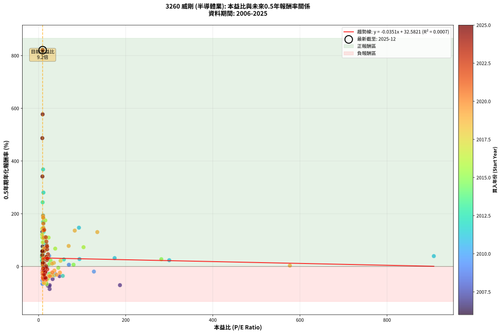
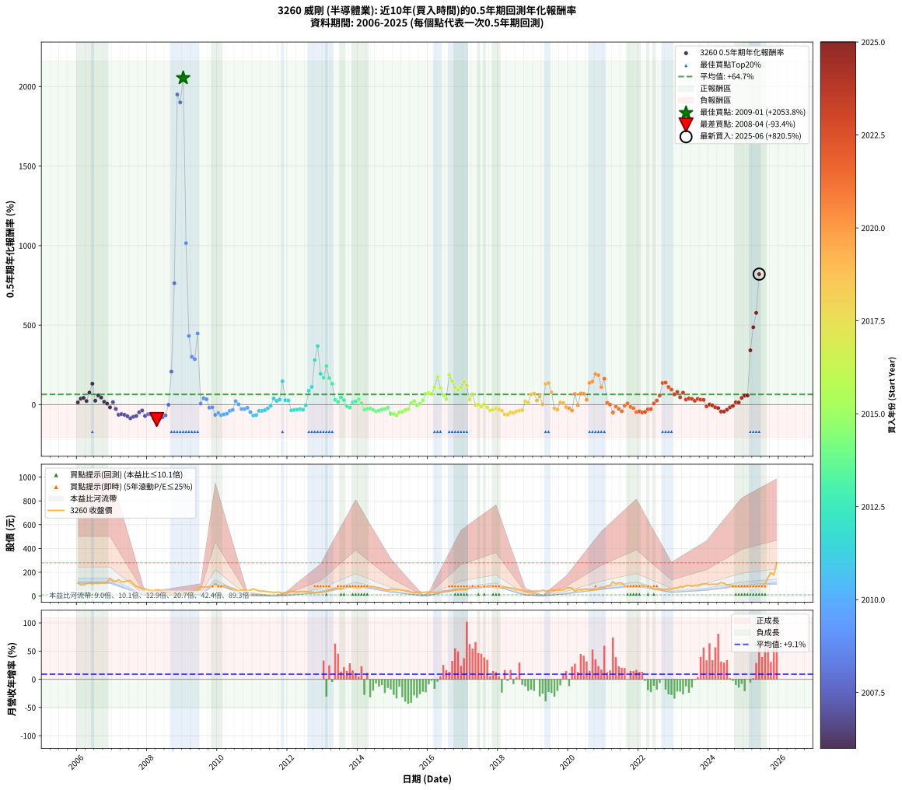

# 3260 威剛 - 本益比與未來報酬率分析

!!! info "報告資訊"
    - **股票代號**: 3260
    - **公司名稱**: 威剛
    - **產業別**: 半導體業
    - **分析期間**: 2006-2025 (234 個數據點)
    - **資料來源**: Type 12 (ShowMonthlyK_ChartFlow) 月收盤價與本益比
    - **報酬率口徑**: 含現金股利 (簡化: 年度合計，假設每年7/1入帳)
    - **報告生成時間**: 2026-01-12 21:06:35 CST

## 📈 視覺化圖表

### 圖表1: 本益比 vs 未來報酬率關係

*圖表1：3260 威剛 本益比與0.5年期未來報酬率關係 (2006-2025)*

### 圖表2: 歷年買入時點的0.5年期實際報酬率

*圖表2：3260 威剛 歷年買入時點的0.5年期實際報酬率 (2006-2025)*

## 📍 買點訊號說明

本報告提供兩種買點提示訊號（顯示於圖表2的股價子圖中）：

### ▲ 小綠色三角形（回測驗證）
- **計算方式**: 使用全部歷史資料計算本益比第25百分位數
- **用途**: 事後驗證，顯示歷史上哪些時點確實為低估區
- **限制**: 當下無法判斷，僅供回測參考
- **特性**: 後見之明（Look-Ahead Bias）

### ▲ 小橘色三角形（即時訊號）
- **計算方式**: 使用截至當月的過去5年資料計算本益比第25百分位數
- **用途**: 實際投資決策，當時即可判斷
- **優勢**: 可操作性強，符合實務需求
- **特性**: 無後見之明，滾動窗口計算

!!! tip "如何使用兩種訊號"
    - **綠色▲** 幫助理解歷史估值機會，驗證策略有效性
    - **橘色▲** 可作為實際買進參考，但仍需搭配基本面分析
    - 兩種訊號重疊時，表示即時判斷與事後驗證一致，信心度較高
    - 僅有綠色▲時，表示當時無法判斷（需要未來資料才能確認）
    - 僅有橘色▲時，表示即時判斷為買點，但事後可能不是最佳時機

## 📊 估值分析摘要

| 指標 | 數值 |
|:---:|:---:|
| **目前本益比** (2025-06) | **9.22 倍** |
| **歷史平均本益比** | 30.97 倍 |
| **估值水準** | 🟢 相對低估 |
| **預期0.5年年化報酬率** | **+32.26%** |
| **歷史平均報酬率** | +64.75% |
| **相關係數 (R²)** | 0.0007 |
| **趨勢線斜率** | -0.0351 |

!!! abstract "核心洞察"
    目前本益比顯著低於歷史平均，預期未來報酬率可能較高

    根據歷史數據回測，3260 威剛 在目前本益比 **9.2倍** 的估值水準下，
    預期未來0.5年年化報酬率約為 **+32.3%**。

    **重要提醒**: 本分析基於歷史數據統計，實際報酬率會受到公司基本面變化、產業趨勢、
    總體經濟環境等多重因素影響。R² = 0.00 表示本益比可解釋約 0.1% 的報酬率變異。

## 📈 歷史估值統計

### 最佳買點 (最高報酬率)

| 項目 | 數值 |
|:---:|:---:|
| 起始時間 | 2009-01 |
| 當時本益比 | nan 倍 |
| 起始價格 | 17.6 元 |
| 0.5年後價格 | 80.8 元 |
| **0.5年年化報酬率** | **+2053.75%** |

### 最差買點 (最低報酬率)

| 項目 | 數值 |
|:---:|:---:|
| 起始時間 | 2008-04 |
| 當時本益比 | nan 倍 |
| 起始價格 | 53.2 元 |
| 0.5年後價格 | 13.6 元 |
| **0.5年年化報酬率** | **-93.45%** |

## 🎯 投資啟示

### 本益比與報酬率關係

趨勢線方程式: **y = -0.0351x + 32.5821**

!!! note "負相關"
    本益比與未來報酬率呈現負相關。較低的本益比通常帶來較高的未來報酬率，
    但相關性不算非常強。**估值仍是重要參考指標之一**。

### 估值區間建議

基於歷史數據分析:

- **🟢 低估區** (P/E < 24.8): 預期報酬率較高，可考慮增加持股
- **🟡 合理區** (P/E 24.8-37.2): 預期報酬率符合長期趨勢，正常持有
- **🔴 高估區** (P/E > 37.2): 預期報酬率較低，可考慮減碼或觀望

!!! danger "風險提示"
    - 過去表現不代表未來結果
    - 本分析假設公司基本面無重大結構性變化
    - 產業環境劇變可能使歷史規律失效
    - 應結合公司財報、產業趨勢、總體經濟等多重因素綜合判斷

!!! success "長期投資觀點"
    歷史數據顯示，在合理或低估的估值水準買入並長期持有，
    往往能獲得較佳的投資報酬。**耐心等待好價格**是價值投資的核心原則。

## 📊 數據品質

- **資料來源**: GoodInfo.tw Type 12 (ShowMonthlyK_ChartFlow)
- **資料頻率**: 月度收盤價與本益比
- **回測期間**: 2006-2025
- **數據點數量**: 234 個 (每個點代表一次0.5年期回測)

### 計算方法說明

1. **0.5年期年化報酬率**:
   - 對每個歷史時點，計算其後0.5年的實際投資報酬率
   - 期末價值(不含股利): 期末價格
   - 期末價值(含現金股利): 期末價格 + 持有期間內的現金股利合計 (簡化: 年度合計，假設每年7/1入帳)
   - 公式: 年化報酬率 = [(期末價值/期初價格)^(1/年數) - 1] × 100%

2. **本益比 (P/E Ratio)**:
   - 使用當時的月收盤價與EPS計算
   - 資料來源: Type 12 月度河流圖本益比數據

3. **趨勢線 (Linear Regression)**:
   - 使用最小平方法擬合線性趨勢線
   - R²值衡量本益比對報酬率的解釋能力

---

*本報告由 Stock Analysis System v1.9.0 自動生成*
*數據更新時間: 2026-01-12 21:06:35 CST*

## 📋 月度回測明細表

（每一列對應時間線圖中的一個買入點；可用來對照 SVG 圖上的每個點。）

| 買入月份 | 賣出月份 | 回測期限_年 | 實際持有年數 | 買入本益比_倍 | 買入收盤價_元 | 賣出收盤價_元 | 現金股利合計_元 | 總報酬率_pct | 年化報酬率_pct |
| --- | --- | --- | --- | --- | --- | --- | --- | --- | --- |
| 2006-01 | 2006-07 | 0.5 | 0.496 | 9.22 | 109.00 | 111.00 | 5.37 | +6.76 | +14.12 |
| 2006-02 | 2006-08 | 0.5 | 0.498 | 7.96 | 94.10 | 105.00 | 5.37 | +17.29 | +37.73 |
| 2006-03 | 2006-10 | 0.5 | 0.586 | 7.93 | 93.70 | 110.00 | 5.37 | +23.13 | +42.63 |
| 2006-04 | 2006-10 | 0.5 | 0.501 | 8.80 | 104.00 | 110.00 | 5.37 | +10.93 | +23.01 |
| 2006-05 | 2006-12 | 0.5 | 0.586 | 9.35 | 110.50 | 148.50 | 5.37 | +39.25 | +75.97 |
| 2006-06 | 2006-12 | 0.5 | 0.501 | 8.54 | 101.00 | 148.50 | 5.37 | +52.35 | +131.70 |
| 2006-07 | 2007-01 | 0.5 | 0.504 | 9.39 | 111.00 | 124.00 | 0.00 | +11.71 | +24.59 |
| 2006-08 | 2007-03 | 0.5 | 0.580 | 8.88 | 105.00 | 137.00 | 0.00 | +30.48 | +58.14 |
| 2006-09 | 2007-03 | 0.5 | 0.496 | 9.64 | 114.00 | 137.00 | 0.00 | +20.18 | +44.90 |
| 2006-10 | 2007-05 | 0.5 | 0.580 | 9.31 | 110.00 | 121.00 | 0.00 | +10.00 | +17.85 |
| 2006-11 | 2007-05 | 0.5 | 0.496 | 9.90 | 117.00 | 121.00 | 0.00 | +3.42 | +7.02 |
| 2006-12 | 2007-07 | 0.5 | 0.580 | 12.56 | 148.50 | 130.00 | 3.38 | -10.18 | -16.89 |
| 2007-01 | 2007-07 | 0.5 | 0.496 | 11.41 | 124.00 | 130.00 | 3.38 | +7.56 | +15.85 |
| 2007-02 | 2007-08 | 0.5 | 0.498 | 12.42 | 123.00 | 102.00 | 3.38 | -14.33 | -26.68 |
| 2007-03 | 2007-10 | 0.5 | 0.586 | 15.31 | 137.00 | 72.50 | 3.38 | -44.62 | -63.52 |
| 2007-04 | 2007-10 | 0.5 | 0.501 | 14.95 | 119.50 | 72.50 | 3.38 | -36.50 | -59.61 |
| 2007-05 | 2007-12 | 0.5 | 0.586 | 17.20 | 121.00 | 63.50 | 3.38 | -44.73 | -63.65 |
| 2007-06 | 2007-12 | 0.5 | 0.501 | 21.13 | 128.50 | 63.50 | 3.38 | -47.96 | -72.84 |
| 2007-07 | 2008-01 | 0.5 | 0.504 | 25.37 | 130.00 | 49.10 | 0.00 | -62.23 | -85.53 |
| 2007-08 | 2008-03 | 0.5 | 0.583 | 24.48 | 102.00 | 44.10 | 0.00 | -56.76 | -76.26 |
| 2007-09 | 2008-03 | 0.5 | 0.498 | 25.51 | 81.90 | 44.10 | 0.00 | -46.15 | -71.13 |
| 2007-10 | 2008-05 | 0.5 | 0.583 | 32.17 | 72.50 | 49.65 | 0.00 | -31.52 | -47.75 |
| 2007-11 | 2008-05 | 0.5 | 0.498 | 48.05 | 62.30 | 49.65 | 0.00 | -20.30 | -36.59 |
| 2007-12 | 2008-07 | 0.5 | 0.583 | 186.80 | 63.50 | 30.90 | 0.03 | -51.29 | -70.87 |
| 2008-01 | 2008-07 | 0.5 | 0.498 |  | 49.10 | 30.90 | 0.03 | -37.00 | -60.44 |
| 2008-02 | 2008-08 | 0.5 | 0.501 |  | 47.50 | 29.60 | 0.03 | -37.62 | -61.01 |
| 2008-03 | 2008-10 | 0.5 | 0.586 |  | 44.10 | 13.55 | 0.03 | -69.20 | -86.60 |
| 2008-04 | 2008-10 | 0.5 | 0.501 |  | 53.20 | 13.55 | 0.03 | -74.47 | -93.45 |
| 2008-05 | 2008-12 | 0.5 | 0.586 |  | 49.65 | 14.20 | 0.03 | -71.34 | -88.15 |
| 2008-06 | 2008-12 | 0.5 | 0.501 |  | 31.40 | 14.20 | 0.03 | -54.68 | -79.39 |
| 2008-07 | 2009-01 | 0.5 | 0.504 |  | 30.90 | 17.65 | 0.00 | -42.88 | -67.10 |
| 2008-08 | 2009-03 | 0.5 | 0.580 |  | 29.60 | 29.50 | 0.00 | -0.34 | -0.58 |
| 2008-09 | 2009-03 | 0.5 | 0.496 |  | 16.90 | 29.50 | 0.00 | +74.56 | +207.76 |
| 2008-10 | 2009-05 | 0.5 | 0.580 |  | 13.55 | 47.35 | 0.00 | +249.45 | +763.33 |
| 2008-11 | 2009-05 | 0.5 | 0.496 |  | 10.60 | 47.35 | 0.00 | +346.70 | +1949.74 |
| 2008-12 | 2009-07 | 0.5 | 0.580 |  | 14.20 | 80.80 | 0.00 | +469.01 | +1899.79 |
| 2009-01 | 2009-07 | 0.5 | 0.496 |  | 17.65 | 80.80 | 0.00 | +357.79 | +2053.75 |
| 2009-02 | 2009-08 | 0.5 | 0.498 |  | 22.25 | 74.00 | 0.00 | +232.58 | +1015.29 |
| 2009-03 | 2009-10 | 0.5 | 0.586 |  | 29.50 | 78.50 | 0.00 | +166.10 | +431.45 |
| 2009-04 | 2009-10 | 0.5 | 0.501 |  | 39.15 | 78.50 | 0.00 | +100.51 | +300.90 |
| 2009-05 | 2009-12 | 0.5 | 0.586 |  | 47.35 | 104.50 | 0.00 | +120.70 | +286.17 |
| 2009-06 | 2009-12 | 0.5 | 0.501 |  | 44.60 | 104.50 | 0.00 | +134.30 | +447.08 |
| 2009-07 | 2010-01 | 0.5 | 0.504 | 69.56 | 80.80 | 83.40 | 0.00 | +3.22 | +6.49 |
| 2009-08 | 2010-03 | 0.5 | 0.580 | 24.16 | 74.00 | 90.20 | 0.00 | +21.89 | +40.64 |
| 2009-09 | 2010-03 | 0.5 | 0.496 | 15.71 | 78.00 | 90.20 | 0.00 | +15.64 | +34.08 |
| 2009-10 | 2010-05 | 0.5 | 0.580 | 11.43 | 78.50 | 69.50 | 0.00 | -11.46 | -18.93 |
| 2009-11 | 2010-05 | 0.5 | 0.496 | 8.68 | 76.10 | 69.50 | 0.00 | -8.67 | -16.73 |
| 2009-12 | 2010-07 | 0.5 | 0.580 | 9.79 | 104.50 | 54.50 | 2.98 | -45.00 | -64.29 |
| 2010-01 | 2010-07 | 0.5 | 0.496 | 8.57 | 83.40 | 54.50 | 2.98 | -31.08 | -52.82 |
| 2010-02 | 2010-08 | 0.5 | 0.498 | 8.96 | 78.80 | 43.00 | 2.98 | -41.65 | -66.08 |
| 2010-03 | 2010-10 | 0.5 | 0.586 | 11.48 | 90.20 | 49.10 | 2.98 | -42.26 | -60.84 |
| 2010-04 | 2010-10 | 0.5 | 0.501 | 11.50 | 79.60 | 49.10 | 2.98 | -34.57 | -57.12 |
| 2010-05 | 2010-12 | 0.5 | 0.586 | 11.62 | 69.50 | 49.00 | 2.98 | -25.21 | -39.09 |
| 2010-06 | 2010-12 | 0.5 | 0.501 | 12.57 | 63.40 | 49.00 | 2.98 | -18.01 | -32.73 |
| 2010-07 | 2011-01 | 0.5 | 0.504 | 13.27 | 54.50 | 60.30 | 0.00 | +10.64 | +22.23 |
| 2010-08 | 2011-03 | 0.5 | 0.580 | 13.56 | 43.00 | 43.60 | 0.00 | +1.40 | +2.42 |
| 2010-09 | 2011-03 | 0.5 | 0.496 | 22.93 | 51.20 | 43.60 | 0.00 | -14.84 | -27.69 |
| 2010-10 | 2011-05 | 0.5 | 0.580 | 37.92 | 49.10 | 40.80 | 0.00 | -16.90 | -27.32 |
| 2010-11 | 2011-05 | 0.5 | 0.496 | 127.00 | 45.40 | 40.80 | 0.00 | -10.13 | -19.39 |
| 2010-12 | 2011-07 | 0.5 | 0.580 |  | 49.00 | 34.00 | 0.00 | -30.61 | -46.72 |
| 2011-01 | 2011-07 | 0.5 | 0.496 |  | 60.30 | 34.00 | 0.00 | -43.62 | -68.53 |
| 2011-02 | 2011-08 | 0.5 | 0.498 |  | 51.70 | 30.25 | 0.00 | -41.49 | -65.89 |
| 2011-03 | 2011-10 | 0.5 | 0.586 |  | 43.60 | 32.60 | 0.00 | -25.23 | -39.12 |
| 2011-04 | 2011-10 | 0.5 | 0.501 |  | 41.85 | 32.60 | 0.00 | -22.10 | -39.26 |
| 2011-05 | 2011-12 | 0.5 | 0.586 |  | 40.80 | 31.90 | 0.00 | -21.81 | -34.30 |
| 2011-06 | 2011-12 | 0.5 | 0.501 |  | 36.30 | 31.90 | 0.00 | -12.12 | -22.73 |
| 2011-07 | 2012-01 | 0.5 | 0.504 |  | 34.00 | 32.75 | 0.00 | -3.68 | -7.17 |
| 2011-08 | 2012-03 | 0.5 | 0.583 | 907.50 | 30.25 | 36.70 | 0.00 | +21.32 | +39.30 |
| 2011-09 | 2012-03 | 0.5 | 0.498 | 300.00 | 33.00 | 36.70 | 0.00 | +11.21 | +23.77 |
| 2011-10 | 2012-05 | 0.5 | 0.583 | 174.60 | 32.60 | 38.30 | 0.00 | +17.48 | +31.83 |
| 2011-11 | 2012-05 | 0.5 | 0.498 | 92.66 | 24.40 | 38.30 | 0.00 | +56.97 | +147.15 |
| 2011-12 | 2012-07 | 0.5 | 0.583 | 93.82 | 31.90 | 36.55 | 0.30 | +15.52 | +28.06 |
| 2012-01 | 2012-07 | 0.5 | 0.498 | 58.08 | 32.75 | 36.55 | 0.30 | +12.52 | +26.71 |
| 2012-02 | 2012-08 | 0.5 | 0.501 | 55.47 | 43.70 | 34.70 | 0.30 | -19.91 | -35.80 |
| 2012-03 | 2012-10 | 0.5 | 0.586 | 36.27 | 36.70 | 28.60 | 0.30 | -21.25 | -33.49 |
| 2012-04 | 2012-10 | 0.5 | 0.501 | 28.20 | 34.85 | 28.60 | 0.30 | -17.07 | -31.18 |
| 2012-05 | 2012-12 | 0.5 | 0.586 | 26.24 | 38.30 | 31.20 | 0.30 | -17.75 | -28.37 |
| 2012-06 | 2012-12 | 0.5 | 0.501 | 22.57 | 38.00 | 31.20 | 0.30 | -17.11 | -31.23 |
| 2012-07 | 2013-01 | 0.5 | 0.504 | 19.16 | 36.55 | 35.75 | 0.00 | -2.19 | -4.30 |
| 2012-08 | 2013-03 | 0.5 | 0.580 | 16.28 | 34.70 | 50.00 | 0.00 | +44.09 | +87.64 |
| 2012-09 | 2013-03 | 0.5 | 0.496 | 14.65 | 34.50 | 50.00 | 0.00 | +44.93 | +111.44 |
| 2012-10 | 2013-05 | 0.5 | 0.580 | 11.09 | 28.60 | 62.10 | 0.00 | +117.13 | +280.31 |
| 2012-11 | 2013-05 | 0.5 | 0.496 | 10.31 | 28.90 | 62.10 | 0.00 | +114.88 | +368.11 |
| 2012-12 | 2013-07 | 0.5 | 0.580 | 10.31 | 31.20 | 56.00 | 2.35 | +87.01 | +194.03 |
| 2013-01 | 2013-07 | 0.5 | 0.496 | 10.12 | 35.75 | 56.00 | 2.35 | +63.21 | +168.72 |
| 2013-02 | 2013-08 | 0.5 | 0.498 | 9.27 | 37.40 | 66.80 | 2.35 | +84.89 | +243.27 |
| 2013-03 | 2013-10 | 0.5 | 0.586 | 11.01 | 50.00 | 86.60 | 2.35 | +77.89 | +167.28 |
| 2013-04 | 2013-10 | 0.5 | 0.501 | 11.58 | 58.40 | 86.60 | 2.35 | +52.31 | +131.57 |
| 2013-05 | 2013-12 | 0.5 | 0.586 | 11.19 | 62.10 | 70.20 | 2.35 | +16.82 | +30.39 |
| 2013-06 | 2013-12 | 0.5 | 0.501 | 11.07 | 67.00 | 70.20 | 2.35 | +8.28 | +17.21 |
| 2013-07 | 2014-01 | 0.5 | 0.504 | 8.54 | 56.00 | 68.00 | 0.00 | +21.43 | +47.02 |
| 2013-08 | 2014-03 | 0.5 | 0.580 | 9.46 | 66.80 | 77.20 | 0.00 | +15.57 | +28.31 |
| 2013-09 | 2014-03 | 0.5 | 0.496 | 10.72 | 81.10 | 77.20 | 0.00 | -4.81 | -9.47 |
| 2013-10 | 2014-05 | 0.5 | 0.580 | 10.73 | 86.60 | 77.00 | 0.00 | -11.09 | -18.33 |
| 2013-11 | 2014-05 | 0.5 | 0.496 | 8.38 | 71.90 | 77.00 | 0.00 | +7.09 | +14.83 |
| 2013-12 | 2014-07 | 0.5 | 0.580 | 7.73 | 70.20 | 71.70 | 7.00 | +12.11 | +21.77 |
| 2014-01 | 2014-07 | 0.5 | 0.496 | 7.89 | 68.00 | 71.70 | 7.00 | +15.74 | +34.31 |
| 2014-02 | 2014-08 | 0.5 | 0.498 | 8.95 | 73.00 | 69.30 | 7.00 | +4.53 | +9.29 |
| 2014-03 | 2014-10 | 0.5 | 0.586 | 10.04 | 77.20 | 54.70 | 7.00 | -20.07 | -31.78 |
| 2014-04 | 2014-10 | 0.5 | 0.501 | 9.94 | 71.80 | 54.70 | 7.00 | -14.06 | -26.10 |
| 2014-05 | 2014-12 | 0.5 | 0.586 | 11.38 | 77.00 | 58.60 | 7.00 | -14.80 | -23.92 |
| 2014-06 | 2014-12 | 0.5 | 0.501 | 12.75 | 80.30 | 58.60 | 7.00 | -18.30 | -33.20 |
| 2014-07 | 2015-01 | 0.5 | 0.504 | 12.28 | 71.70 | 54.70 | 0.00 | -23.71 | -41.56 |
| 2014-08 | 2015-03 | 0.5 | 0.580 | 12.90 | 69.30 | 53.20 | 0.00 | -23.23 | -36.59 |
| 2014-09 | 2015-03 | 0.5 | 0.496 | 12.91 | 63.40 | 53.20 | 0.00 | -16.09 | -29.81 |
| 2014-10 | 2015-05 | 0.5 | 0.580 | 12.30 | 54.70 | 45.80 | 0.00 | -16.27 | -26.36 |
| 2014-11 | 2015-05 | 0.5 | 0.496 | 12.75 | 50.80 | 45.80 | 0.00 | -9.84 | -18.87 |
| 2014-12 | 2015-07 | 0.5 | 0.580 | 16.65 | 58.60 | 33.00 | 2.52 | -39.39 | -57.80 |
| 2015-01 | 2015-07 | 0.5 | 0.496 | 17.04 | 54.70 | 33.00 | 2.52 | -35.07 | -58.16 |
| 2015-02 | 2015-08 | 0.5 | 0.498 | 18.59 | 53.90 | 28.50 | 2.52 | -42.45 | -67.01 |
| 2015-03 | 2015-10 | 0.5 | 0.586 | 20.54 | 53.20 | 33.70 | 2.52 | -31.92 | -48.12 |
| 2015-04 | 2015-10 | 0.5 | 0.501 | 21.38 | 48.75 | 33.70 | 2.52 | -25.71 | -44.74 |
| 2015-05 | 2015-12 | 0.5 | 0.586 | 23.25 | 45.80 | 33.30 | 2.52 | -21.79 | -34.27 |
| 2015-06 | 2015-12 | 0.5 | 0.501 | 25.36 | 42.10 | 33.30 | 2.52 | -14.92 | -27.57 |
| 2015-07 | 2016-01 | 0.5 | 0.504 | 24.44 | 33.00 | 34.50 | 0.00 | +4.55 | +9.22 |
| 2015-08 | 2016-03 | 0.5 | 0.583 | 27.40 | 28.50 | 32.15 | 0.00 | +12.81 | +22.95 |
| 2015-09 | 2016-03 | 0.5 | 0.498 | 45.21 | 33.00 | 32.15 | 0.00 | -2.58 | -5.10 |
| 2015-10 | 2016-05 | 0.5 | 0.583 | 80.24 | 33.70 | 35.00 | 0.00 | +3.86 | +6.71 |
| 2015-11 | 2016-05 | 0.5 | 0.498 | 281.80 | 31.00 | 35.00 | 0.00 | +12.90 | +27.58 |
| 2015-12 | 2016-07 | 0.5 | 0.583 |  | 33.30 | 44.85 | 0.50 | +36.19 | +69.83 |
| 2016-01 | 2016-07 | 0.5 | 0.498 | 103.20 | 34.50 | 44.85 | 0.50 | +31.45 | +73.11 |
| 2016-02 | 2016-08 | 0.5 | 0.501 | 38.18 | 33.15 | 42.45 | 0.50 | +29.56 | +67.69 |
| 2016-03 | 2016-10 | 0.5 | 0.586 | 22.92 | 32.15 | 49.10 | 0.50 | +54.28 | +109.60 |
| 2016-04 | 2016-10 | 0.5 | 0.501 | 15.44 | 29.90 | 49.10 | 0.50 | +65.89 | +174.61 |
| 2016-05 | 2016-12 | 0.5 | 0.586 | 14.17 | 35.00 | 52.70 | 0.50 | +52.00 | +104.35 |
| 2016-06 | 2016-12 | 0.5 | 0.501 | 14.01 | 42.10 | 52.70 | 0.50 | +26.37 | +59.53 |
| 2016-07 | 2017-01 | 0.5 | 0.504 | 12.67 | 44.85 | 52.20 | 0.00 | +16.39 | +35.15 |
| 2016-08 | 2017-03 | 0.5 | 0.580 | 10.42 | 42.45 | 78.20 | 0.00 | +84.22 | +186.50 |
| 2016-09 | 2017-03 | 0.5 | 0.496 | 10.83 | 49.90 | 78.20 | 0.00 | +56.71 | +147.58 |
| 2016-10 | 2017-05 | 0.5 | 0.580 | 9.55 | 49.10 | 75.10 | 0.00 | +52.95 | +107.96 |
| 2016-11 | 2017-05 | 0.5 | 0.496 | 9.58 | 54.40 | 75.10 | 0.00 | +38.05 | +91.69 |
| 2016-12 | 2017-07 | 0.5 | 0.580 | 8.49 | 52.70 | 77.10 | 4.00 | +53.89 | +110.16 |
| 2017-01 | 2017-07 | 0.5 | 0.496 | 8.15 | 52.20 | 77.10 | 4.00 | +55.36 | +143.30 |
| 2017-02 | 2017-08 | 0.5 | 0.498 | 8.07 | 53.30 | 75.10 | 4.00 | +48.41 | +120.84 |
| 2017-03 | 2017-10 | 0.5 | 0.586 | 11.49 | 78.20 | 87.70 | 4.00 | +17.26 | +31.23 |
| 2017-04 | 2017-10 | 0.5 | 0.501 | 10.21 | 71.50 | 87.70 | 4.00 | +28.25 | +64.32 |
| 2017-05 | 2017-12 | 0.5 | 0.586 | 10.43 | 75.10 | 70.50 | 4.00 | -0.80 | -1.36 |
| 2017-06 | 2017-12 | 0.5 | 0.501 | 10.09 | 74.70 | 70.50 | 4.00 | -0.27 | -0.53 |
| 2017-07 | 2018-01 | 0.5 | 0.504 | 10.15 | 77.10 | 71.90 | 0.00 | -6.74 | -12.94 |
| 2017-08 | 2018-03 | 0.5 | 0.580 | 9.63 | 75.10 | 75.60 | 0.00 | +0.67 | +1.15 |
| 2017-09 | 2018-03 | 0.5 | 0.496 | 10.38 | 83.00 | 75.60 | 0.00 | -8.92 | -17.18 |
| 2017-10 | 2018-05 | 0.5 | 0.580 | 10.70 | 87.70 | 67.60 | 0.00 | -22.92 | -36.14 |
| 2017-11 | 2018-05 | 0.5 | 0.496 | 9.70 | 81.40 | 67.60 | 0.00 | -16.95 | -31.26 |
| 2017-12 | 2018-07 | 0.5 | 0.580 | 8.21 | 70.50 | 54.00 | 6.00 | -14.89 | -24.26 |
| 2018-01 | 2018-07 | 0.5 | 0.496 | 9.21 | 71.90 | 54.00 | 6.00 | -16.55 | -30.59 |
| 2018-02 | 2018-08 | 0.5 | 0.498 | 10.47 | 73.50 | 52.30 | 6.00 | -20.68 | -37.18 |
| 2018-03 | 2018-10 | 0.5 | 0.586 | 12.12 | 75.60 | 37.70 | 6.00 | -42.20 | -60.76 |
| 2018-04 | 2018-10 | 0.5 | 0.501 | 13.18 | 71.90 | 37.70 | 6.00 | -39.22 | -62.98 |
| 2018-05 | 2018-12 | 0.5 | 0.586 | 14.48 | 67.60 | 39.80 | 6.00 | -32.25 | -48.55 |
| 2018-06 | 2018-12 | 0.5 | 0.501 | 16.91 | 65.70 | 39.80 | 6.00 | -30.29 | -51.33 |
| 2018-07 | 2019-01 | 0.5 | 0.504 | 17.41 | 54.00 | 40.90 | 0.00 | -24.26 | -42.39 |
| 2018-08 | 2019-03 | 0.5 | 0.580 | 22.58 | 52.30 | 39.85 | 0.00 | -23.80 | -37.40 |
| 2018-09 | 2019-03 | 0.5 | 0.496 | 32.04 | 49.10 | 39.85 | 0.00 | -18.84 | -34.38 |
| 2018-10 | 2019-05 | 0.5 | 0.580 | 50.38 | 37.70 | 42.25 | 0.00 | +12.07 | +21.69 |
| 2018-11 | 2019-05 | 0.5 | 0.496 |  | 39.80 | 42.25 | 0.00 | +6.16 | +12.81 |
| 2018-12 | 2019-07 | 0.5 | 0.580 |  | 39.80 | 52.90 | 0.20 | +33.42 | +64.33 |
| 2019-01 | 2019-07 | 0.5 | 0.496 |  | 40.90 | 52.90 | 0.20 | +29.83 | +69.35 |
| 2019-02 | 2019-08 | 0.5 | 0.498 |  | 43.55 | 48.70 | 0.20 | +12.28 | +26.18 |
| 2019-03 | 2019-10 | 0.5 | 0.586 |  | 39.85 | 50.60 | 0.20 | +27.48 | +51.34 |
| 2019-04 | 2019-10 | 0.5 | 0.501 | 576.90 | 50.00 | 50.60 | 0.20 | +1.60 | +3.22 |
| 2019-05 | 2019-12 | 0.5 | 0.586 | 134.80 | 42.25 | 68.70 | 0.20 | +63.08 | +130.41 |
| 2019-06 | 2019-12 | 0.5 | 0.501 | 82.96 | 44.80 | 68.70 | 0.20 | +53.79 | +136.11 |
| 2019-07 | 2020-01 | 0.5 | 0.504 | 69.00 | 52.90 | 70.70 | 0.00 | +33.65 | +77.85 |
| 2019-08 | 2020-03 | 0.5 | 0.583 | 49.03 | 48.70 | 41.75 | 0.00 | -14.27 | -23.21 |
| 2019-09 | 2020-03 | 0.5 | 0.498 | 41.23 | 50.30 | 41.75 | 0.00 | -17.00 | -31.19 |
| 2019-10 | 2020-05 | 0.5 | 0.583 | 34.98 | 50.60 | 54.50 | 0.00 | +7.71 | +13.58 |
| 2019-11 | 2020-05 | 0.5 | 0.498 | 30.96 | 51.80 | 54.50 | 0.00 | +5.21 | +10.74 |
| 2019-12 | 2020-07 | 0.5 | 0.583 | 36.16 | 68.70 | 60.80 | 1.41 | -9.45 | -15.65 |
| 2020-01 | 2020-07 | 0.5 | 0.498 | 31.42 | 70.70 | 60.80 | 1.41 | -12.01 | -22.64 |
| 2020-02 | 2020-08 | 0.5 | 0.501 | 25.85 | 67.20 | 52.00 | 1.41 | -20.52 | -36.77 |
| 2020-03 | 2020-10 | 0.5 | 0.586 | 14.15 | 41.75 | 55.00 | 1.41 | +35.12 | +67.14 |
| 2020-04 | 2020-10 | 0.5 | 0.501 | 17.33 | 57.20 | 55.00 | 1.41 | -1.38 | -2.73 |
| 2020-05 | 2020-12 | 0.5 | 0.586 | 14.93 | 54.50 | 73.00 | 1.41 | +36.53 | +70.15 |
| 2020-06 | 2020-12 | 0.5 | 0.501 | 14.30 | 57.20 | 73.00 | 1.41 | +30.09 | +69.05 |
| 2020-07 | 2021-01 | 0.5 | 0.504 | 13.98 | 60.80 | 69.50 | 0.00 | +14.31 | +30.41 |
| 2020-08 | 2021-03 | 0.5 | 0.580 | 11.06 | 52.00 | 85.80 | 0.00 | +65.00 | +136.97 |
| 2020-09 | 2021-03 | 0.5 | 0.496 | 10.89 | 55.00 | 85.80 | 0.00 | +56.00 | +145.31 |
| 2020-10 | 2021-05 | 0.5 | 0.580 | 10.19 | 55.00 | 102.50 | 0.00 | +86.36 | +192.28 |
| 2020-11 | 2021-05 | 0.5 | 0.496 | 10.61 | 61.00 | 102.50 | 0.00 | +68.03 | +184.99 |
| 2020-12 | 2021-07 | 0.5 | 0.580 | 11.97 | 73.00 | 109.00 | 3.18 | +53.68 | +109.65 |
| 2021-01 | 2021-07 | 0.5 | 0.496 | 10.94 | 69.50 | 109.00 | 3.18 | +61.42 | +162.80 |
| 2021-02 | 2021-08 | 0.5 | 0.498 | 13.06 | 86.30 | 87.80 | 3.18 | +5.43 | +11.19 |
| 2021-03 | 2021-10 | 0.5 | 0.586 | 12.51 | 85.80 | 83.00 | 3.18 | +0.45 | +0.77 |
| 2021-04 | 2021-10 | 0.5 | 0.501 | 17.01 | 121.00 | 83.00 | 3.18 | -28.77 | -49.20 |
| 2021-05 | 2021-12 | 0.5 | 0.586 | 13.91 | 102.50 | 92.30 | 3.18 | -6.84 | -11.40 |
| 2021-06 | 2021-12 | 0.5 | 0.501 | 14.63 | 111.50 | 92.30 | 3.18 | -14.36 | -26.62 |
| 2021-07 | 2022-01 | 0.5 | 0.504 | 13.84 | 109.00 | 83.60 | 0.00 | -23.30 | -40.94 |
| 2021-08 | 2022-03 | 0.5 | 0.580 | 10.80 | 87.80 | 84.50 | 0.00 | -3.76 | -6.39 |
| 2021-09 | 2022-03 | 0.5 | 0.496 | 9.71 | 81.40 | 84.50 | 0.00 | +3.81 | +7.83 |
| 2021-10 | 2022-05 | 0.5 | 0.580 | 9.61 | 83.00 | 75.90 | 0.00 | -8.55 | -14.28 |
| 2021-11 | 2022-05 | 0.5 | 0.496 | 9.69 | 86.10 | 75.90 | 0.00 | -11.85 | -22.47 |
| 2021-12 | 2022-07 | 0.5 | 0.580 | 10.10 | 92.30 | 58.40 | 5.43 | -30.84 | -47.02 |
| 2022-01 | 2022-07 | 0.5 | 0.496 | 9.67 | 83.60 | 58.40 | 5.43 | -23.64 | -41.98 |
| 2022-02 | 2022-08 | 0.5 | 0.498 | 11.40 | 92.90 | 61.10 | 5.43 | -28.38 | -48.82 |
| 2022-03 | 2022-10 | 0.5 | 0.586 | 11.04 | 84.50 | 53.90 | 5.43 | -29.78 | -45.31 |
| 2022-04 | 2022-10 | 0.5 | 0.501 | 9.86 | 70.60 | 53.90 | 5.43 | -15.96 | -29.32 |
| 2022-05 | 2022-12 | 0.5 | 0.586 | 11.39 | 75.90 | 57.00 | 5.43 | -17.74 | -28.35 |
| 2022-06 | 2022-12 | 0.5 | 0.501 | 9.75 | 60.10 | 57.00 | 5.43 | +3.88 | +7.90 |
| 2022-07 | 2023-01 | 0.5 | 0.504 | 10.30 | 58.40 | 65.50 | 0.00 | +12.16 | +25.58 |
| 2022-08 | 2023-03 | 0.5 | 0.580 | 11.81 | 61.10 | 79.50 | 0.00 | +30.11 | +57.39 |
| 2022-09 | 2023-03 | 0.5 | 0.496 | 11.10 | 51.90 | 79.50 | 0.00 | +53.18 | +136.44 |
| 2022-10 | 2023-05 | 0.5 | 0.580 | 12.89 | 53.90 | 89.30 | 0.00 | +65.68 | +138.65 |
| 2022-11 | 2023-05 | 0.5 | 0.496 | 16.74 | 61.70 | 89.30 | 0.00 | +44.73 | +110.87 |
| 2022-12 | 2023-07 | 0.5 | 0.580 | 17.87 | 57.00 | 81.90 | 2.00 | +47.19 | +94.65 |
| 2023-01 | 2023-07 | 0.5 | 0.496 | 19.50 | 65.50 | 81.90 | 2.00 | +28.09 | +64.81 |
| 2023-02 | 2023-08 | 0.5 | 0.498 | 18.80 | 66.30 | 86.80 | 2.00 | +33.94 | +79.75 |
| 2023-03 | 2023-10 | 0.5 | 0.586 | 21.52 | 79.50 | 97.40 | 2.00 | +25.03 | +46.42 |
| 2023-04 | 2023-10 | 0.5 | 0.501 | 19.41 | 75.00 | 97.40 | 2.00 | +32.53 | +75.45 |
| 2023-05 | 2023-12 | 0.5 | 0.586 | 22.15 | 89.30 | 103.00 | 2.00 | +17.58 | +31.84 |
| 2023-06 | 2023-12 | 0.5 | 0.501 | 21.19 | 89.00 | 103.00 | 2.00 | +17.98 | +39.09 |
| 2023-07 | 2024-01 | 0.5 | 0.504 | 18.75 | 81.90 | 95.90 | 0.00 | +17.09 | +36.79 |
| 2023-08 | 2024-03 | 0.5 | 0.583 | 19.13 | 86.80 | 98.70 | 0.00 | +13.71 | +24.65 |
| 2023-09 | 2024-03 | 0.5 | 0.498 | 17.96 | 84.50 | 98.70 | 0.00 | +16.80 | +36.58 |
| 2023-10 | 2024-05 | 0.5 | 0.583 | 19.99 | 97.40 | 114.00 | 0.00 | +17.04 | +30.98 |
| 2023-11 | 2024-05 | 0.5 | 0.498 | 19.83 | 100.00 | 114.00 | 0.00 | +14.00 | +30.08 |
| 2023-12 | 2024-07 | 0.5 | 0.583 | 19.77 | 103.00 | 93.30 | 3.00 | -6.50 | -10.89 |
| 2024-01 | 2024-07 | 0.5 | 0.498 | 17.29 | 95.90 | 93.30 | 3.00 | +0.42 | +0.84 |
| 2024-02 | 2024-08 | 0.5 | 0.501 | 17.00 | 100.00 | 94.60 | 3.00 | -2.40 | -4.73 |
| 2024-03 | 2024-10 | 0.5 | 0.586 | 15.87 | 98.70 | 85.70 | 3.00 | -10.13 | -16.67 |
| 2024-04 | 2024-10 | 0.5 | 0.501 | 15.25 | 100.00 | 85.70 | 3.00 | -11.30 | -21.28 |
| 2024-05 | 2024-12 | 0.5 | 0.586 | 16.54 | 114.00 | 78.40 | 3.00 | -28.60 | -43.72 |
| 2024-06 | 2024-12 | 0.5 | 0.501 | 14.94 | 108.00 | 78.40 | 3.00 | -24.63 | -43.13 |
| 2024-07 | 2025-01 | 0.5 | 0.504 | 12.33 | 93.30 | 77.00 | 0.00 | -17.47 | -31.69 |
| 2024-08 | 2025-03 | 0.5 | 0.580 | 11.97 | 94.60 | 85.10 | 0.00 | -10.04 | -16.67 |
| 2024-09 | 2025-03 | 0.5 | 0.496 | 10.76 | 88.70 | 85.10 | 0.00 | -4.06 | -8.02 |
| 2024-10 | 2025-05 | 0.5 | 0.580 | 9.99 | 85.70 | 92.80 | 0.00 | +8.28 | +14.70 |
| 2024-11 | 2025-05 | 0.5 | 0.496 | 9.78 | 87.20 | 92.80 | 0.00 | +6.42 | +13.38 |
| 2024-12 | 2025-07 | 0.5 | 0.580 | 8.48 | 78.40 | 91.30 | 5.12 | +22.99 | +42.83 |
| 2025-01 | 2025-07 | 0.5 | 0.496 | 8.19 | 77.00 | 91.30 | 5.12 | +25.22 | +57.44 |
| 2025-02 | 2025-08 | 0.5 | 0.498 | 8.97 | 85.70 | 102.50 | 5.12 | +25.58 | +57.95 |
| 2025-03 | 2025-10 | 0.5 | 0.586 | 8.77 | 85.10 | 198.00 | 5.12 | +138.69 | +341.43 |
| 2025-04 | 2025-10 | 0.5 | 0.501 | 8.50 | 83.70 | 198.00 | 5.12 | +142.68 | +486.79 |
| 2025-05 | 2025-12 | 0.5 | 0.586 | 9.28 | 92.80 | 279.50 | 5.12 | +206.70 | +577.21 |
| 2025-06 | 2025-12 | 0.5 | 0.501 | 9.22 | 93.60 | 279.50 | 5.12 | +204.08 | +820.46 |
