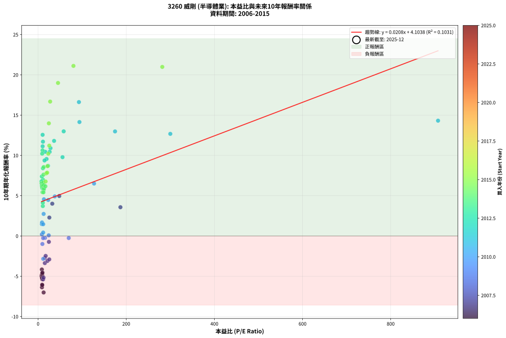
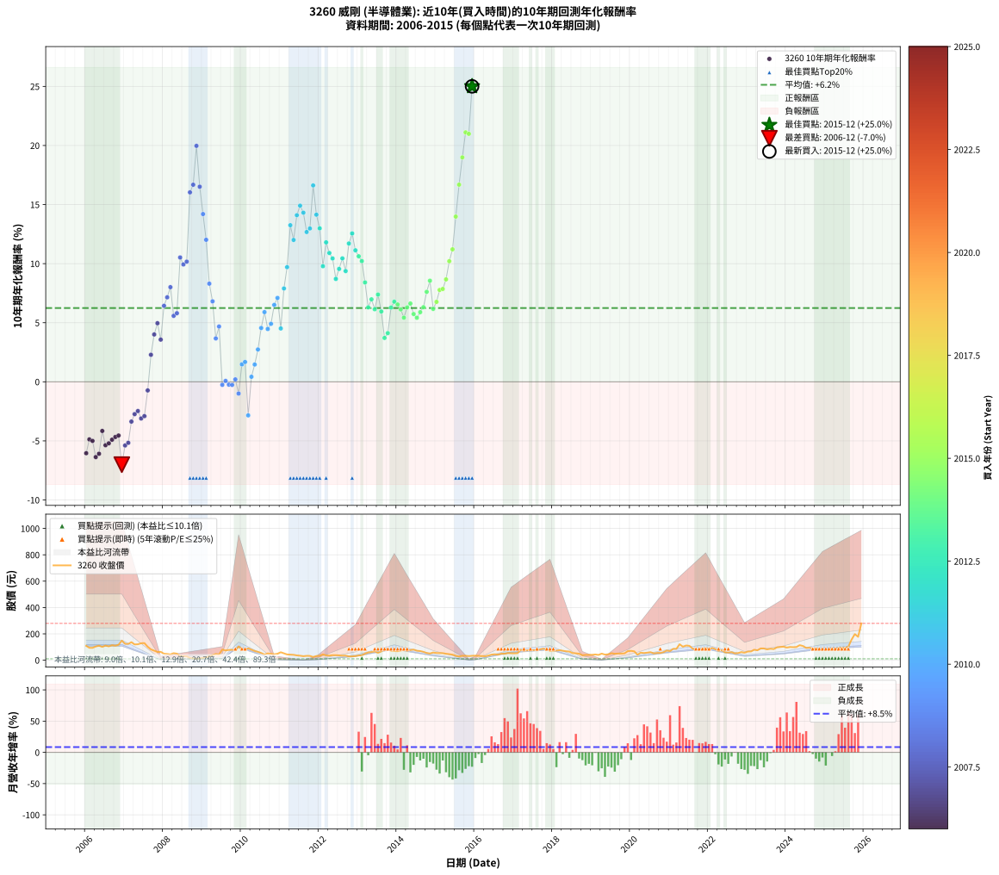

# 3260 威剛 - 本益比與未來報酬率分析

!!! info "報告資訊"
    - **股票代號**: 3260
    - **公司名稱**: 威剛
    - **產業別**: 半導體業
    - **分析期間**: 2006-2015 (120 個數據點)
    - **資料來源**: Type 12 (ShowMonthlyK_ChartFlow) 月收盤價與本益比
    - **報酬率口徑**: 含現金股利 (簡化: 年度合計，假設每年7/1入帳)
    - **報告生成時間**: 2026-01-06 00:56:58 CST

## 📈 視覺化圖表

### 圖表1: 本益比 vs 未來報酬率關係

*圖表1：3260 威剛 本益比與10年期未來報酬率關係 (2006-2015)*

### 圖表2: 歷年買入時點的10年期實際報酬率

*圖表2：3260 威剛 歷年買入時點的10年期實際報酬率 (2006-2015)*

## 📍 買點訊號說明

本報告提供兩種買點提示訊號（顯示於圖表2的股價子圖中）：

### ▲ 小綠色三角形（回測驗證）
- **計算方式**: 使用全部歷史資料計算本益比第25百分位數
- **用途**: 事後驗證，顯示歷史上哪些時點確實為低估區
- **限制**: 當下無法判斷，僅供回測參考
- **特性**: 後見之明（Look-Ahead Bias）

### ▲ 小橘色三角形（即時訊號）
- **計算方式**: 使用截至當月的過去5年資料計算本益比第25百分位數
- **用途**: 實際投資決策，當時即可判斷
- **優勢**: 可操作性強，符合實務需求
- **特性**: 無後見之明，滾動窗口計算

!!! tip "如何使用兩種訊號"
    - **綠色▲** 幫助理解歷史估值機會，驗證策略有效性
    - **橘色▲** 可作為實際買進參考，但仍需搭配基本面分析
    - 兩種訊號重疊時，表示即時判斷與事後驗證一致，信心度較高
    - 僅有綠色▲時，表示當時無法判斷（需要未來資料才能確認）
    - 僅有橘色▲時，表示即時判斷為買點，但事後可能不是最佳時機

## 📊 估值分析摘要

| 指標 | 數值 |
|:---:|:---:|
| **目前本益比** (2015-12) | **nan 倍** |
| **歷史平均本益比** | 39.66 倍 |
| **估值水準** | 🟡 合理範圍 |
| **預期10年年化報酬率** | **+nan%** |
| **歷史平均報酬率** | +6.24% |
| **相關係數 (R²)** | 0.1031 |
| **趨勢線斜率** | 0.0208 |

!!! abstract "核心洞察"
    目前本益比接近歷史平均，預期報酬率符合長期趨勢

    根據歷史數據回測，3260 威剛 在目前本益比 **nan倍** 的估值水準下，
    預期未來10年年化報酬率約為 **+nan%**。

    **重要提醒**: 本分析基於歷史數據統計，實際報酬率會受到公司基本面變化、產業趨勢、
    總體經濟環境等多重因素影響。R² = 0.10 表示本益比可解釋約 10.3% 的報酬率變異。

## 📈 歷史估值統計

### 最佳買點 (最高報酬率)

| 項目 | 數值 |
|:---:|:---:|
| 起始時間 | 2015-12 |
| 當時本益比 | nan 倍 |
| 起始價格 | 33.3 元 |
| 10年後價格 | 279.5 元 |
| **10年年化報酬率** | **+25.01%** |

### 最差買點 (最低報酬率)

| 項目 | 數值 |
|:---:|:---:|
| 起始時間 | 2006-12 |
| 當時本益比 | 12.56 倍 |
| 起始價格 | 148.5 元 |
| 10年後價格 | 52.7 元 |
| **10年年化報酬率** | **-7.01%** |

## 🎯 投資啟示

### 本益比與報酬率關係

趨勢線方程式: **y = 0.0208x + 4.1038**

!!! info "弱相關或正相關"
    本益比與未來報酬率相關性較弱。這可能表示該股票的報酬率更多受到
    公司成長性、產業趨勢等因素影響，而非估值水準。**需綜合考量多項指標**。

### 估值區間建議

基於歷史數據分析:

- **🟢 低估區** (P/E < 31.7): 預期報酬率較高，可考慮增加持股
- **🟡 合理區** (P/E 31.7-47.6): 預期報酬率符合長期趨勢，正常持有
- **🔴 高估區** (P/E > 47.6): 預期報酬率較低，可考慮減碼或觀望

!!! danger "風險提示"
    - 過去表現不代表未來結果
    - 本分析假設公司基本面無重大結構性變化
    - 產業環境劇變可能使歷史規律失效
    - 應結合公司財報、產業趨勢、總體經濟等多重因素綜合判斷

!!! success "長期投資觀點"
    歷史數據顯示，在合理或低估的估值水準買入並長期持有，
    往往能獲得較佳的投資報酬。**耐心等待好價格**是價值投資的核心原則。

## 📊 數據品質

- **資料來源**: GoodInfo.tw Type 12 (ShowMonthlyK_ChartFlow)
- **資料頻率**: 月度收盤價與本益比
- **回測期間**: 2006-2015
- **數據點數量**: 120 個 (每個點代表一次10年期回測)

### 計算方法說明

1. **10年期年化報酬率**:
   - 對每個歷史時點，計算其後10年的實際投資報酬率
   - 期末價值(不含股利): 期末價格
   - 期末價值(含現金股利): 期末價格 + 持有期間內的現金股利合計 (簡化: 年度合計，假設每年7/1入帳)
   - 公式: 年化報酬率 = [(期末價值/期初價格)^(1/年數) - 1] × 100%

2. **本益比 (P/E Ratio)**:
   - 使用當時的月收盤價與EPS計算
   - 資料來源: Type 12 月度河流圖本益比數據

3. **趨勢線 (Linear Regression)**:
   - 使用最小平方法擬合線性趨勢線
   - R²值衡量本益比對報酬率的解釋能力

---

*本報告由 Stock Analysis System v1.9.0 自動生成*
*數據更新時間: 2026-01-06 00:56:58 CST*

## 📋 月度回測明細表

（每一列對應時間線圖中的一個買入點；可用來對照 SVG 圖上的每個點。）

| 買入月份 | 賣出月份 | 回測期限_年 | 實際持有年數 | 買入本益比_倍 | 買入收盤價_元 | 賣出收盤價_元 | 現金股利合計_元 | 總報酬率_pct | 年化報酬率_pct |
| --- | --- | --- | --- | --- | --- | --- | --- | --- | --- |
| 2006-01 | 2016-01 | 10 | 9.999 | 9.22 | 109.00 | 34.50 | 23.93 | -46.39 | -6.05 |
| 2006-02 | 2016-02 | 10 | 9.999 | 7.96 | 94.10 | 33.15 | 23.93 | -39.34 | -4.88 |
| 2006-03 | 2016-03 | 10 | 10.001 | 7.93 | 93.70 | 32.15 | 23.93 | -40.15 | -5.00 |
| 2006-04 | 2016-04 | 10 | 10.001 | 8.80 | 104.00 | 29.90 | 23.93 | -48.24 | -6.37 |
| 2006-05 | 2016-05 | 10 | 10.001 | 9.35 | 110.50 | 35.00 | 23.93 | -46.67 | -6.09 |
| 2006-06 | 2016-06 | 10 | 10.001 | 8.54 | 101.00 | 42.10 | 23.93 | -34.62 | -4.16 |
| 2006-07 | 2016-07 | 10 | 10.001 | 9.39 | 111.00 | 44.85 | 19.06 | -42.43 | -5.37 |
| 2006-08 | 2016-08 | 10 | 10.001 | 8.88 | 105.00 | 42.45 | 19.06 | -41.42 | -5.21 |
| 2006-09 | 2016-09 | 10 | 10.001 | 9.64 | 114.00 | 49.90 | 19.06 | -39.51 | -4.90 |
| 2006-10 | 2016-10 | 10 | 10.001 | 9.31 | 110.00 | 49.10 | 19.06 | -38.04 | -4.67 |
| 2006-11 | 2016-11 | 10 | 10.001 | 9.90 | 117.00 | 54.40 | 19.06 | -37.22 | -4.55 |
| 2006-12 | 2016-12 | 10 | 10.001 | 12.56 | 148.50 | 52.70 | 19.06 | -51.68 | -7.01 |
| 2007-01 | 2017-01 | 10 | 10.001 | 11.41 | 124.00 | 52.20 | 19.06 | -42.53 | -5.39 |
| 2007-02 | 2017-02 | 10 | 10.001 | 12.42 | 123.00 | 53.30 | 19.06 | -41.17 | -5.17 |
| 2007-03 | 2017-03 | 10 | 10.001 | 15.31 | 137.00 | 78.20 | 19.06 | -29.01 | -3.37 |
| 2007-04 | 2017-04 | 10 | 10.001 | 14.95 | 119.50 | 71.50 | 19.06 | -24.22 | -2.73 |
| 2007-05 | 2017-05 | 10 | 10.001 | 17.20 | 121.00 | 75.10 | 19.06 | -22.18 | -2.48 |
| 2007-06 | 2017-06 | 10 | 10.001 | 21.13 | 128.50 | 74.70 | 19.06 | -27.04 | -3.10 |
| 2007-07 | 2017-07 | 10 | 10.001 | 25.37 | 130.00 | 77.10 | 19.68 | -25.55 | -2.91 |
| 2007-08 | 2017-08 | 10 | 10.001 | 24.48 | 102.00 | 75.10 | 19.68 | -7.08 | -0.73 |
| 2007-09 | 2017-09 | 10 | 10.001 | 25.51 | 81.90 | 83.00 | 19.68 | +25.37 | +2.29 |
| 2007-10 | 2017-10 | 10 | 10.001 | 32.17 | 72.50 | 87.70 | 19.68 | +48.11 | +4.01 |
| 2007-11 | 2017-11 | 10 | 10.001 | 48.05 | 62.30 | 81.40 | 19.68 | +62.25 | +4.96 |
| 2007-12 | 2017-12 | 10 | 10.001 | 186.80 | 63.50 | 70.50 | 19.68 | +42.02 | +3.57 |
| 2008-01 | 2018-01 | 10 | 10.001 |  | 49.10 | 71.90 | 19.68 | +86.52 | +6.43 |
| 2008-02 | 2018-03 | 10 | 10.081 |  | 47.50 | 75.60 | 19.68 | +100.59 | +7.15 |
| 2008-03 | 2018-03 | 10 | 9.999 |  | 44.10 | 75.60 | 19.68 | +116.06 | +8.01 |
| 2008-04 | 2018-04 | 10 | 9.999 |  | 53.20 | 71.90 | 19.68 | +72.14 | +5.58 |
| 2008-05 | 2018-05 | 10 | 9.999 |  | 49.65 | 67.60 | 19.68 | +75.79 | +5.80 |
| 2008-06 | 2018-06 | 10 | 9.999 |  | 31.40 | 65.70 | 19.68 | +171.91 | +10.52 |
| 2008-07 | 2018-07 | 10 | 9.999 |  | 30.90 | 54.00 | 25.65 | +157.76 | +9.93 |
| 2008-08 | 2018-08 | 10 | 9.999 |  | 29.60 | 52.30 | 25.65 | +163.34 | +10.17 |
| 2008-09 | 2018-09 | 10 | 9.999 |  | 16.90 | 49.10 | 25.65 | +342.30 | +16.03 |
| 2008-10 | 2018-10 | 10 | 9.999 |  | 13.55 | 37.70 | 25.65 | +367.52 | +16.68 |
| 2008-11 | 2018-11 | 10 | 9.999 |  | 10.60 | 39.80 | 25.65 | +517.44 | +19.97 |
| 2008-12 | 2018-12 | 10 | 9.999 |  | 14.20 | 39.80 | 25.65 | +360.91 | +16.51 |
| 2009-01 | 2019-01 | 10 | 9.999 |  | 17.65 | 40.90 | 25.65 | +277.05 | +14.20 |
| 2009-02 | 2019-02 | 10 | 9.999 |  | 22.25 | 43.55 | 25.65 | +211.01 | +12.02 |
| 2009-03 | 2019-03 | 10 | 9.999 |  | 29.50 | 39.85 | 25.65 | +122.03 | +8.30 |
| 2009-04 | 2019-04 | 10 | 9.999 |  | 39.15 | 50.00 | 25.65 | +93.23 | +6.81 |
| 2009-05 | 2019-05 | 10 | 9.999 |  | 47.35 | 42.25 | 25.65 | +43.40 | +3.67 |
| 2009-06 | 2019-06 | 10 | 9.999 |  | 44.60 | 44.80 | 25.65 | +57.96 | +4.68 |
| 2009-07 | 2019-07 | 10 | 9.999 | 69.56 | 80.80 | 52.90 | 25.85 | -2.54 | -0.26 |
| 2009-08 | 2019-08 | 10 | 9.999 | 24.16 | 74.00 | 48.70 | 25.85 | +0.74 | +0.07 |
| 2009-09 | 2019-09 | 10 | 9.999 | 15.71 | 78.00 | 50.30 | 25.85 | -2.37 | -0.24 |
| 2009-10 | 2019-10 | 10 | 9.999 | 11.43 | 78.50 | 50.60 | 25.85 | -2.61 | -0.26 |
| 2009-11 | 2019-11 | 10 | 9.999 | 8.68 | 76.10 | 51.80 | 25.85 | +2.04 | +0.20 |
| 2009-12 | 2019-12 | 10 | 9.999 | 9.79 | 104.50 | 68.70 | 25.85 | -9.52 | -1.00 |
| 2010-01 | 2020-01 | 10 | 9.999 | 8.57 | 83.40 | 70.70 | 25.85 | +15.77 | +1.47 |
| 2010-02 | 2020-02 | 10 | 9.999 | 8.96 | 78.80 | 67.20 | 25.85 | +18.08 | +1.68 |
| 2010-03 | 2020-03 | 10 | 10.001 | 11.48 | 90.20 | 41.75 | 25.85 | -25.06 | -2.84 |
| 2010-04 | 2020-04 | 10 | 10.001 | 11.50 | 79.60 | 57.20 | 25.85 | +4.33 | +0.43 |
| 2010-05 | 2020-05 | 10 | 10.001 | 11.62 | 69.50 | 54.50 | 25.85 | +15.61 | +1.46 |
| 2010-06 | 2020-06 | 10 | 10.001 | 12.57 | 63.40 | 57.20 | 25.85 | +30.99 | +2.74 |
| 2010-07 | 2020-07 | 10 | 10.001 | 13.27 | 54.50 | 60.80 | 24.28 | +56.11 | +4.55 |
| 2010-08 | 2020-08 | 10 | 10.001 | 13.56 | 43.00 | 52.00 | 24.28 | +77.40 | +5.90 |
| 2010-09 | 2020-09 | 10 | 10.001 | 22.93 | 51.20 | 55.00 | 24.28 | +54.84 | +4.47 |
| 2010-10 | 2020-10 | 10 | 10.001 | 37.92 | 49.10 | 55.00 | 24.28 | +61.47 | +4.91 |
| 2010-11 | 2020-11 | 10 | 10.001 | 127.00 | 45.40 | 61.00 | 24.28 | +87.84 | +6.51 |
| 2010-12 | 2020-12 | 10 | 10.001 |  | 49.00 | 73.00 | 24.28 | +98.53 | +7.10 |
| 2011-01 | 2021-01 | 10 | 10.001 |  | 60.30 | 69.50 | 24.28 | +55.52 | +4.51 |
| 2011-02 | 2021-02 | 10 | 10.001 |  | 51.70 | 86.30 | 24.28 | +113.89 | +7.90 |
| 2011-03 | 2021-03 | 10 | 10.001 |  | 43.60 | 85.80 | 24.28 | +152.48 | +9.70 |
| 2011-04 | 2021-04 | 10 | 10.001 |  | 41.85 | 121.00 | 24.28 | +247.14 | +13.25 |
| 2011-05 | 2021-05 | 10 | 10.001 |  | 40.80 | 102.50 | 24.28 | +210.74 | +12.00 |
| 2011-06 | 2021-06 | 10 | 10.001 |  | 36.30 | 111.50 | 24.28 | +274.05 | +14.10 |
| 2011-07 | 2021-07 | 10 | 10.001 |  | 34.00 | 109.00 | 27.46 | +301.36 | +14.91 |
| 2011-08 | 2021-08 | 10 | 10.001 | 907.50 | 30.25 | 87.80 | 27.46 | +281.04 | +14.31 |
| 2011-09 | 2021-09 | 10 | 10.001 | 300.00 | 33.00 | 81.40 | 27.46 | +229.89 | +12.68 |
| 2011-10 | 2021-10 | 10 | 10.001 | 174.60 | 32.60 | 83.00 | 27.46 | +238.85 | +12.98 |
| 2011-11 | 2021-11 | 10 | 10.001 | 92.66 | 24.40 | 86.10 | 27.46 | +365.43 | +16.62 |
| 2011-12 | 2021-12 | 10 | 10.001 | 93.82 | 31.90 | 92.30 | 27.46 | +275.44 | +14.14 |
| 2012-01 | 2022-01 | 10 | 10.001 | 58.08 | 32.75 | 83.60 | 27.46 | +239.13 | +12.99 |
| 2012-02 | 2022-03 | 10 | 10.081 | 55.47 | 43.70 | 84.50 | 27.46 | +156.21 | +9.78 |
| 2012-03 | 2022-03 | 10 | 9.999 | 36.27 | 36.70 | 84.50 | 27.46 | +205.08 | +11.80 |
| 2012-04 | 2022-04 | 10 | 9.999 | 28.20 | 34.85 | 70.60 | 27.46 | +181.39 | +10.90 |
| 2012-05 | 2022-05 | 10 | 9.999 | 26.24 | 38.30 | 75.90 | 27.46 | +169.88 | +10.44 |
| 2012-06 | 2022-06 | 10 | 9.999 | 22.57 | 38.00 | 60.10 | 27.46 | +130.43 | +8.71 |
| 2012-07 | 2022-07 | 10 | 9.999 | 19.16 | 36.55 | 58.40 | 32.60 | +148.97 | +9.55 |
| 2012-08 | 2022-08 | 10 | 9.999 | 16.28 | 34.70 | 61.10 | 32.60 | +170.02 | +10.44 |
| 2012-09 | 2022-09 | 10 | 9.999 | 14.65 | 34.50 | 51.90 | 32.60 | +144.92 | +9.37 |
| 2012-10 | 2022-10 | 10 | 9.999 | 11.09 | 28.60 | 53.90 | 32.60 | +202.44 | +11.70 |
| 2012-11 | 2022-11 | 10 | 9.999 | 10.31 | 28.90 | 61.70 | 32.60 | +226.29 | +12.56 |
| 2012-12 | 2022-12 | 10 | 9.999 | 10.31 | 31.20 | 57.00 | 32.60 | +187.17 | +11.13 |
| 2013-01 | 2023-01 | 10 | 9.999 | 10.12 | 35.75 | 65.50 | 32.60 | +174.40 | +10.62 |
| 2013-02 | 2023-02 | 10 | 9.999 | 9.27 | 37.40 | 66.30 | 32.60 | +164.43 | +10.21 |
| 2013-03 | 2023-03 | 10 | 9.999 | 11.01 | 50.00 | 79.50 | 32.60 | +124.20 | +8.41 |
| 2013-04 | 2023-04 | 10 | 9.999 | 11.58 | 58.40 | 75.00 | 32.60 | +84.24 | +6.30 |
| 2013-05 | 2023-05 | 10 | 9.999 | 11.19 | 62.10 | 89.30 | 32.60 | +96.29 | +6.98 |
| 2013-06 | 2023-06 | 10 | 9.999 | 11.07 | 67.00 | 89.00 | 32.60 | +81.49 | +6.14 |
| 2013-07 | 2023-07 | 10 | 9.999 | 8.54 | 56.00 | 81.90 | 32.25 | +103.84 | +7.38 |
| 2013-08 | 2023-08 | 10 | 9.999 | 9.46 | 66.80 | 86.80 | 32.25 | +78.22 | +5.95 |
| 2013-09 | 2023-09 | 10 | 9.999 | 10.72 | 81.10 | 84.50 | 32.25 | +43.96 | +3.71 |
| 2013-10 | 2023-10 | 10 | 9.999 | 10.73 | 86.60 | 97.40 | 32.25 | +49.71 | +4.12 |
| 2013-11 | 2023-11 | 10 | 9.999 | 8.38 | 71.90 | 100.00 | 32.25 | +83.94 | +6.28 |
| 2013-12 | 2023-12 | 10 | 9.999 | 7.73 | 70.20 | 103.00 | 32.25 | +92.67 | +6.78 |
| 2014-01 | 2024-01 | 10 | 9.999 | 7.89 | 68.00 | 95.90 | 32.25 | +88.46 | +6.54 |
| 2014-02 | 2024-02 | 10 | 9.999 | 8.95 | 73.00 | 100.00 | 32.25 | +81.17 | +6.12 |
| 2014-03 | 2024-03 | 10 | 10.001 | 10.04 | 77.20 | 98.70 | 32.25 | +69.63 | +5.43 |
| 2014-04 | 2024-04 | 10 | 10.001 | 9.94 | 71.80 | 100.00 | 32.25 | +84.19 | +6.30 |
| 2014-05 | 2024-05 | 10 | 10.001 | 11.38 | 77.00 | 114.00 | 32.25 | +89.94 | +6.62 |
| 2014-06 | 2024-06 | 10 | 10.001 | 12.75 | 80.30 | 108.00 | 32.25 | +74.66 | +5.73 |
| 2014-07 | 2024-07 | 10 | 10.001 | 12.28 | 71.70 | 93.30 | 28.25 | +69.52 | +5.42 |
| 2014-08 | 2024-08 | 10 | 10.001 | 12.90 | 69.30 | 94.60 | 28.25 | +77.27 | +5.89 |
| 2014-09 | 2024-09 | 10 | 10.001 | 12.91 | 63.40 | 88.70 | 28.25 | +84.46 | +6.31 |
| 2014-10 | 2024-10 | 10 | 10.001 | 12.30 | 54.70 | 85.70 | 28.25 | +108.31 | +7.61 |
| 2014-11 | 2024-11 | 10 | 10.001 | 12.75 | 50.80 | 87.20 | 28.25 | +127.26 | +8.55 |
| 2014-12 | 2024-12 | 10 | 10.001 | 16.65 | 58.60 | 78.40 | 28.25 | +81.99 | +6.17 |
| 2015-01 | 2025-01 | 10 | 10.001 | 17.04 | 54.70 | 77.00 | 28.25 | +92.41 | +6.76 |
| 2015-02 | 2025-02 | 10 | 10.001 | 18.59 | 53.90 | 85.70 | 28.25 | +111.40 | +7.77 |
| 2015-03 | 2025-03 | 10 | 10.001 | 20.54 | 53.20 | 85.10 | 28.25 | +113.06 | +7.86 |
| 2015-04 | 2025-04 | 10 | 10.001 | 21.38 | 48.75 | 83.70 | 28.25 | +129.63 | +8.67 |
| 2015-05 | 2025-05 | 10 | 10.001 | 23.25 | 45.80 | 92.80 | 28.25 | +164.29 | +10.21 |
| 2015-06 | 2025-06 | 10 | 10.001 | 25.36 | 42.10 | 93.60 | 28.25 | +189.42 | +11.21 |
| 2015-07 | 2025-07 | 10 | 10.001 | 24.44 | 33.00 | 91.30 | 30.85 | +270.15 | +13.98 |
| 2015-08 | 2025-08 | 10 | 10.001 | 27.40 | 28.50 | 102.50 | 30.85 | +367.90 | +16.68 |
| 2015-09 | 2025-09 | 10 | 10.001 | 45.21 | 33.00 | 157.00 | 30.85 | +469.25 | +18.99 |
| 2015-10 | 2025-10 | 10 | 10.001 | 80.24 | 33.70 | 198.00 | 30.85 | +579.08 | +21.11 |
| 2015-11 | 2025-11 | 10 | 10.001 | 281.80 | 31.00 | 177.50 | 30.85 | +572.10 | +20.99 |
| 2015-12 | 2025-12 | 10 | 10.001 |  | 33.30 | 279.50 | 30.85 | +831.98 | +25.01 |
