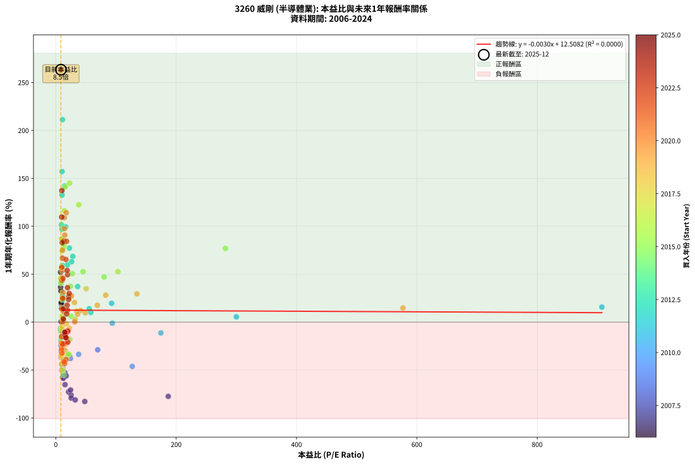
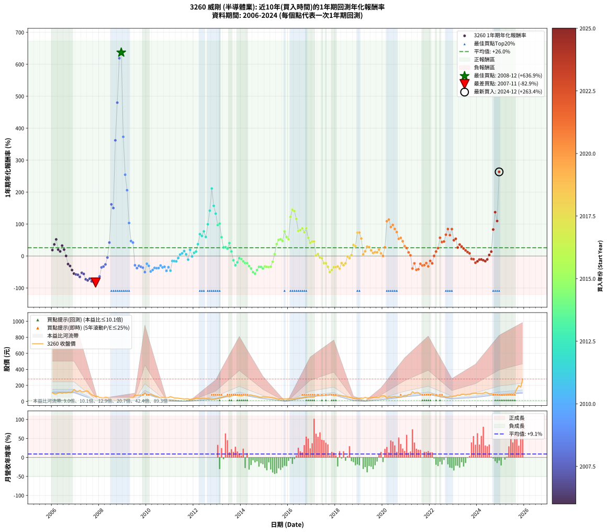

# 3260 威剛 - 本益比與未來報酬率分析

!!! info "報告資訊"
    - **股票代號**: 3260
    - **公司名稱**: 威剛
    - **產業別**: 半導體業
    - **分析期間**: 2006-2024 (228 個數據點)
    - **資料來源**: Type 12 (ShowMonthlyK_ChartFlow) 月收盤價與本益比
    - **報酬率口徑**: 含現金股利 (簡化: 年度合計，假設每年7/1入帳)
    - **報告生成時間**: 2026-01-04 08:27:22 CST

## 📈 視覺化圖表

### 圖表1: 本益比 vs 未來報酬率關係

*圖表1：3260 威剛 本益比與1年期未來報酬率關係 (2006-2024)*

### 圖表2: 歷年買入時點的1年期實際報酬率

*圖表2：3260 威剛 歷年買入時點的1年期實際報酬率 (2006-2024)*

## 📍 買點訊號說明

本報告提供兩種買點提示訊號（顯示於圖表2的股價子圖中）：

### ▲ 小綠色三角形（回測驗證）
- **計算方式**: 使用全部歷史資料計算本益比第25百分位數
- **用途**: 事後驗證，顯示歷史上哪些時點確實為低估區
- **限制**: 當下無法判斷，僅供回測參考
- **特性**: 後見之明（Look-Ahead Bias）

### ▲ 小橘色三角形（即時訊號）
- **計算方式**: 使用截至當月的過去5年資料計算本益比第25百分位數
- **用途**: 實際投資決策，當時即可判斷
- **優勢**: 可操作性強，符合實務需求
- **特性**: 無後見之明，滾動窗口計算

!!! tip "如何使用兩種訊號"
    - **綠色▲** 幫助理解歷史估值機會，驗證策略有效性
    - **橘色▲** 可作為實際買進參考，但仍需搭配基本面分析
    - 兩種訊號重疊時，表示即時判斷與事後驗證一致，信心度較高
    - 僅有綠色▲時，表示當時無法判斷（需要未來資料才能確認）
    - 僅有橘色▲時，表示即時判斷為買點，但事後可能不是最佳時機

## 📊 估值分析摘要

| 指標 | 數值 |
|:---:|:---:|
| **目前本益比** (2024-12) | **8.48 倍** |
| **歷史平均本益比** | 31.65 倍 |
| **估值水準** | 🟢 相對低估 |
| **預期1年年化報酬率** | **+12.48%** |
| **歷史平均報酬率** | +25.98% |
| **相關係數 (R²)** | 0.0000 |
| **趨勢線斜率** | -0.0030 |

!!! abstract "核心洞察"
    目前本益比顯著低於歷史平均，預期未來報酬率可能較高

    根據歷史數據回測，3260 威剛 在目前本益比 **8.5倍** 的估值水準下，
    預期未來1年年化報酬率約為 **+12.5%**。

    **重要提醒**: 本分析基於歷史數據統計，實際報酬率會受到公司基本面變化、產業趨勢、
    總體經濟環境等多重因素影響。R² = 0.00 表示本益比可解釋約 0.0% 的報酬率變異。

## 📈 歷史估值統計

### 最佳買點 (最高報酬率)

| 項目 | 數值 |
|:---:|:---:|
| 起始時間 | 2008-12 |
| 當時本益比 | nan 倍 |
| 起始價格 | 14.2 元 |
| 1年後價格 | 104.5 元 |
| **1年年化報酬率** | **+636.92%** |

### 最差買點 (最低報酬率)

| 項目 | 數值 |
|:---:|:---:|
| 起始時間 | 2007-11 |
| 當時本益比 | 48.05 倍 |
| 起始價格 | 62.3 元 |
| 1年後價格 | 10.6 元 |
| **1年年化報酬率** | **-82.87%** |

## 🎯 投資啟示

### 本益比與報酬率關係

趨勢線方程式: **y = -0.0030x + 12.5082**

!!! note "負相關"
    本益比與未來報酬率呈現負相關。較低的本益比通常帶來較高的未來報酬率，
    但相關性不算非常強。**估值仍是重要參考指標之一**。

### 估值區間建議

基於歷史數據分析:

- **🟢 低估區** (P/E < 25.3): 預期報酬率較高，可考慮增加持股
- **🟡 合理區** (P/E 25.3-38.0): 預期報酬率符合長期趨勢，正常持有
- **🔴 高估區** (P/E > 38.0): 預期報酬率較低，可考慮減碼或觀望

!!! danger "風險提示"
    - 過去表現不代表未來結果
    - 本分析假設公司基本面無重大結構性變化
    - 產業環境劇變可能使歷史規律失效
    - 應結合公司財報、產業趨勢、總體經濟等多重因素綜合判斷

!!! success "長期投資觀點"
    歷史數據顯示，在合理或低估的估值水準買入並長期持有，
    往往能獲得較佳的投資報酬。**耐心等待好價格**是價值投資的核心原則。

## 📊 數據品質

- **資料來源**: GoodInfo.tw Type 12 (ShowMonthlyK_ChartFlow)
- **資料頻率**: 月度收盤價與本益比
- **回測期間**: 2006-2024
- **數據點數量**: 228 個 (每個點代表一次1年期回測)

### 計算方法說明

1. **1年期年化報酬率**:
   - 對每個歷史時點，計算其後1年的實際投資報酬率
   - 期末價值(不含股利): 期末價格
   - 期末價值(含現金股利): 期末價格 + 持有期間內的現金股利合計 (簡化: 年度合計，假設每年7/1入帳)
   - 公式: 年化報酬率 = [(期末價值/期初價格)^(1/年數) - 1] × 100%

2. **本益比 (P/E Ratio)**:
   - 使用當時的月收盤價與EPS計算
   - 資料來源: Type 12 月度河流圖本益比數據

3. **趨勢線 (Linear Regression)**:
   - 使用最小平方法擬合線性趨勢線
   - R²值衡量本益比對報酬率的解釋能力

---

*本報告由 Stock Analysis System v1.9.0 自動生成*
*數據更新時間: 2026-01-04 08:27:22 CST*

## 📋 月度回測明細表

（每一列對應時間線圖中的一個買入點；可用來對照 SVG 圖上的每個點。）

| 買入月份 | 賣出月份 | 回測期限_年 | 實際持有年數 | 買入本益比_倍 | 買入收盤價_元 | 賣出收盤價_元 | 現金股利合計_元 | 總報酬率_pct | 年化報酬率_pct |
| --- | --- | --- | --- | --- | --- | --- | --- | --- | --- |
| 2006-01 | 2007-01 | 1 | 0.999 | 9.22 | 109.00 | 124.00 | 5.37 | +18.69 | +18.70 |
| 2006-02 | 2007-02 | 1 | 0.999 | 7.96 | 94.10 | 123.00 | 5.37 | +36.42 | +36.45 |
| 2006-03 | 2007-03 | 1 | 0.999 | 7.93 | 93.70 | 137.00 | 5.37 | +51.94 | +51.99 |
| 2006-04 | 2007-04 | 1 | 0.999 | 8.80 | 104.00 | 119.50 | 5.37 | +20.07 | +20.08 |
| 2006-05 | 2007-05 | 1 | 0.999 | 9.35 | 110.50 | 121.00 | 5.37 | +14.36 | +14.37 |
| 2006-06 | 2007-06 | 1 | 0.999 | 8.54 | 101.00 | 128.50 | 5.37 | +32.55 | +32.57 |
| 2006-07 | 2007-07 | 1 | 0.999 | 9.39 | 111.00 | 130.00 | 3.38 | +20.16 | +20.17 |
| 2006-08 | 2007-08 | 1 | 0.999 | 8.88 | 105.00 | 102.00 | 3.38 | +0.36 | +0.36 |
| 2006-09 | 2007-09 | 1 | 0.999 | 9.64 | 114.00 | 81.90 | 3.38 | -25.20 | -25.21 |
| 2006-10 | 2007-10 | 1 | 0.999 | 9.31 | 110.00 | 72.50 | 3.38 | -31.02 | -31.04 |
| 2006-11 | 2007-11 | 1 | 0.999 | 9.90 | 117.00 | 62.30 | 3.38 | -43.87 | -43.89 |
| 2006-12 | 2007-12 | 1 | 0.999 | 12.56 | 148.50 | 63.50 | 3.38 | -54.96 | -54.99 |
| 2007-01 | 2008-01 | 1 | 0.999 | 11.41 | 124.00 | 49.10 | 3.38 | -57.68 | -57.70 |
| 2007-02 | 2008-02 | 1 | 0.999 | 12.42 | 123.00 | 47.50 | 3.38 | -58.64 | -58.66 |
| 2007-03 | 2008-03 | 1 | 1.002 | 15.31 | 137.00 | 44.10 | 3.38 | -65.35 | -65.27 |
| 2007-04 | 2008-04 | 1 | 1.002 | 14.95 | 119.50 | 53.20 | 3.38 | -52.66 | -52.58 |
| 2007-05 | 2008-05 | 1 | 1.002 | 17.20 | 121.00 | 49.65 | 3.38 | -56.18 | -56.10 |
| 2007-06 | 2008-06 | 1 | 1.002 | 21.13 | 128.50 | 31.40 | 3.38 | -72.94 | -72.86 |
| 2007-07 | 2008-07 | 1 | 1.002 | 25.37 | 130.00 | 30.90 | 0.03 | -76.21 | -76.14 |
| 2007-08 | 2008-08 | 1 | 1.002 | 24.48 | 102.00 | 29.60 | 0.03 | -70.95 | -70.88 |
| 2007-09 | 2008-09 | 1 | 1.002 | 25.51 | 81.90 | 16.90 | 0.03 | -79.33 | -79.26 |
| 2007-10 | 2008-10 | 1 | 1.002 | 32.17 | 72.50 | 13.55 | 0.03 | -81.27 | -81.20 |
| 2007-11 | 2008-11 | 1 | 1.002 | 48.05 | 62.30 | 10.60 | 0.03 | -82.93 | -82.87 |
| 2007-12 | 2008-12 | 1 | 1.002 | 186.80 | 63.50 | 14.20 | 0.03 | -77.59 | -77.52 |
| 2008-01 | 2009-01 | 1 | 1.002 |  | 49.10 | 17.65 | 0.03 | -63.99 | -63.91 |
| 2008-02 | 2009-03 | 1 | 1.081 |  | 47.50 | 29.50 | 0.03 | -37.83 | -35.56 |
| 2008-03 | 2009-03 | 1 | 0.999 |  | 44.10 | 29.50 | 0.03 | -33.03 | -33.05 |
| 2008-04 | 2009-04 | 1 | 0.999 |  | 53.20 | 39.15 | 0.03 | -26.35 | -26.37 |
| 2008-05 | 2009-05 | 1 | 0.999 |  | 49.65 | 47.35 | 0.03 | -4.57 | -4.57 |
| 2008-06 | 2009-06 | 1 | 0.999 |  | 31.40 | 44.60 | 0.03 | +42.14 | +42.17 |
| 2008-07 | 2009-07 | 1 | 0.999 |  | 30.90 | 80.80 | 0.00 | +161.49 | +161.66 |
| 2008-08 | 2009-08 | 1 | 0.999 |  | 29.60 | 74.00 | 0.00 | +150.00 | +150.16 |
| 2008-09 | 2009-09 | 1 | 0.999 |  | 16.90 | 78.00 | 0.00 | +361.54 | +362.02 |
| 2008-10 | 2009-10 | 1 | 0.999 |  | 13.55 | 78.50 | 0.00 | +479.34 | +480.03 |
| 2008-11 | 2009-11 | 1 | 0.999 |  | 10.60 | 76.10 | 0.00 | +617.92 | +618.89 |
| 2008-12 | 2009-12 | 1 | 0.999 |  | 14.20 | 104.50 | 0.00 | +635.92 | +636.92 |
| 2009-01 | 2010-01 | 1 | 0.999 |  | 17.65 | 83.40 | 0.00 | +372.52 | +373.02 |
| 2009-02 | 2010-02 | 1 | 0.999 |  | 22.25 | 78.80 | 0.00 | +254.16 | +254.46 |
| 2009-03 | 2010-03 | 1 | 0.999 |  | 29.50 | 90.20 | 0.00 | +205.76 | +206.00 |
| 2009-04 | 2010-04 | 1 | 0.999 |  | 39.15 | 79.60 | 0.00 | +103.32 | +103.42 |
| 2009-05 | 2010-05 | 1 | 0.999 |  | 47.35 | 69.50 | 0.00 | +46.78 | +46.82 |
| 2009-06 | 2010-06 | 1 | 0.999 |  | 44.60 | 63.40 | 0.00 | +42.15 | +42.19 |
| 2009-07 | 2010-07 | 1 | 0.999 | 69.56 | 80.80 | 54.50 | 2.98 | -28.86 | -28.88 |
| 2009-08 | 2010-08 | 1 | 0.999 | 24.16 | 74.00 | 43.00 | 2.98 | -37.86 | -37.89 |
| 2009-09 | 2010-09 | 1 | 0.999 | 15.71 | 78.00 | 51.20 | 2.98 | -30.54 | -30.56 |
| 2009-10 | 2010-10 | 1 | 0.999 | 11.43 | 78.50 | 49.10 | 2.98 | -33.66 | -33.67 |
| 2009-11 | 2010-11 | 1 | 0.999 | 8.68 | 76.10 | 45.40 | 2.98 | -36.43 | -36.45 |
| 2009-12 | 2010-12 | 1 | 0.999 | 9.79 | 104.50 | 49.00 | 2.98 | -50.26 | -50.28 |
| 2010-01 | 2011-01 | 1 | 0.999 | 8.57 | 83.40 | 60.30 | 2.98 | -24.12 | -24.14 |
| 2010-02 | 2011-02 | 1 | 0.999 | 8.96 | 78.80 | 51.70 | 2.98 | -30.61 | -30.63 |
| 2010-03 | 2011-03 | 1 | 0.999 | 11.48 | 90.20 | 43.60 | 2.98 | -48.36 | -48.38 |
| 2010-04 | 2011-04 | 1 | 0.999 | 11.50 | 79.60 | 41.85 | 2.98 | -43.68 | -43.70 |
| 2010-05 | 2011-05 | 1 | 0.999 | 11.62 | 69.50 | 40.80 | 2.98 | -37.01 | -37.03 |
| 2010-06 | 2011-06 | 1 | 0.999 | 12.57 | 63.40 | 36.30 | 2.98 | -38.04 | -38.06 |
| 2010-07 | 2011-07 | 1 | 0.999 | 13.27 | 54.50 | 34.00 | 0.00 | -37.61 | -37.63 |
| 2010-08 | 2011-08 | 1 | 0.999 | 13.56 | 43.00 | 30.25 | 0.00 | -29.65 | -29.67 |
| 2010-09 | 2011-09 | 1 | 0.999 | 22.93 | 51.20 | 33.00 | 0.00 | -35.55 | -35.57 |
| 2010-10 | 2011-10 | 1 | 0.999 | 37.92 | 49.10 | 32.60 | 0.00 | -33.60 | -33.62 |
| 2010-11 | 2011-11 | 1 | 0.999 | 127.00 | 45.40 | 24.40 | 0.00 | -46.26 | -46.28 |
| 2010-12 | 2011-12 | 1 | 0.999 |  | 49.00 | 31.90 | 0.00 | -34.90 | -34.92 |
| 2011-01 | 2012-01 | 1 | 0.999 |  | 60.30 | 32.75 | 0.00 | -45.69 | -45.71 |
| 2011-02 | 2012-02 | 1 | 0.999 |  | 51.70 | 43.70 | 0.00 | -15.47 | -15.48 |
| 2011-03 | 2012-03 | 1 | 1.002 |  | 43.60 | 36.70 | 0.00 | -15.83 | -15.80 |
| 2011-04 | 2012-04 | 1 | 1.002 |  | 41.85 | 34.85 | 0.00 | -16.73 | -16.70 |
| 2011-05 | 2012-05 | 1 | 1.002 |  | 40.80 | 38.30 | 0.00 | -6.13 | -6.12 |
| 2011-06 | 2012-06 | 1 | 1.002 |  | 36.30 | 38.00 | 0.00 | +4.68 | +4.67 |
| 2011-07 | 2012-07 | 1 | 1.002 |  | 34.00 | 36.55 | 0.30 | +8.38 | +8.36 |
| 2011-08 | 2012-08 | 1 | 1.002 | 907.50 | 30.25 | 34.70 | 0.30 | +15.70 | +15.67 |
| 2011-09 | 2012-09 | 1 | 1.002 | 300.00 | 33.00 | 34.50 | 0.30 | +5.45 | +5.44 |
| 2011-10 | 2012-10 | 1 | 1.002 | 174.60 | 32.60 | 28.60 | 0.30 | -11.35 | -11.33 |
| 2011-11 | 2012-11 | 1 | 1.002 | 92.66 | 24.40 | 28.90 | 0.30 | +19.67 | +19.63 |
| 2011-12 | 2012-12 | 1 | 1.002 | 93.82 | 31.90 | 31.20 | 0.30 | -1.25 | -1.25 |
| 2012-01 | 2013-01 | 1 | 1.002 | 58.08 | 32.75 | 35.75 | 0.30 | +10.08 | +10.05 |
| 2012-02 | 2013-03 | 1 | 1.081 | 55.47 | 43.70 | 50.00 | 0.30 | +15.10 | +13.89 |
| 2012-03 | 2013-03 | 1 | 0.999 | 36.27 | 36.70 | 50.00 | 0.30 | +37.06 | +37.09 |
| 2012-04 | 2013-04 | 1 | 0.999 | 28.20 | 34.85 | 58.40 | 0.30 | +68.44 | +68.50 |
| 2012-05 | 2013-05 | 1 | 0.999 | 26.24 | 38.30 | 62.10 | 0.30 | +62.92 | +62.98 |
| 2012-06 | 2013-06 | 1 | 0.999 | 22.57 | 38.00 | 67.00 | 0.30 | +77.11 | +77.17 |
| 2012-07 | 2013-07 | 1 | 0.999 | 19.16 | 36.55 | 56.00 | 2.35 | +59.64 | +59.69 |
| 2012-08 | 2013-08 | 1 | 0.999 | 16.28 | 34.70 | 66.80 | 2.35 | +99.27 | +99.37 |
| 2012-09 | 2013-09 | 1 | 0.999 | 14.65 | 34.50 | 81.10 | 2.35 | +141.88 | +142.02 |
| 2012-10 | 2013-10 | 1 | 0.999 | 11.09 | 28.60 | 86.60 | 2.35 | +211.00 | +211.25 |
| 2012-11 | 2013-11 | 1 | 0.999 | 10.31 | 28.90 | 71.90 | 2.35 | +156.91 | +157.08 |
| 2012-12 | 2013-12 | 1 | 0.999 | 10.31 | 31.20 | 70.20 | 2.35 | +132.52 | +132.66 |
| 2013-01 | 2014-01 | 1 | 0.999 | 10.12 | 35.75 | 68.00 | 2.35 | +96.77 | +96.87 |
| 2013-02 | 2014-02 | 1 | 0.999 | 9.27 | 37.40 | 73.00 | 2.35 | +101.46 | +101.56 |
| 2013-03 | 2014-03 | 1 | 0.999 | 11.01 | 50.00 | 77.20 | 2.35 | +59.09 | +59.14 |
| 2013-04 | 2014-04 | 1 | 0.999 | 11.58 | 58.40 | 71.80 | 2.35 | +26.96 | +26.98 |
| 2013-05 | 2014-05 | 1 | 0.999 | 11.19 | 62.10 | 77.00 | 2.35 | +27.77 | +27.79 |
| 2013-06 | 2014-06 | 1 | 0.999 | 11.07 | 67.00 | 80.30 | 2.35 | +23.35 | +23.37 |
| 2013-07 | 2014-07 | 1 | 0.999 | 8.54 | 56.00 | 71.70 | 7.00 | +40.54 | +40.58 |
| 2013-08 | 2014-08 | 1 | 0.999 | 9.46 | 66.80 | 69.30 | 7.00 | +14.23 | +14.24 |
| 2013-09 | 2014-09 | 1 | 0.999 | 10.72 | 81.10 | 63.40 | 7.00 | -13.19 | -13.20 |
| 2013-10 | 2014-10 | 1 | 0.999 | 10.73 | 86.60 | 54.70 | 7.00 | -28.75 | -28.76 |
| 2013-11 | 2014-11 | 1 | 0.999 | 8.38 | 71.90 | 50.80 | 7.00 | -19.61 | -19.62 |
| 2013-12 | 2014-12 | 1 | 0.999 | 7.73 | 70.20 | 58.60 | 7.00 | -6.55 | -6.55 |
| 2014-01 | 2015-01 | 1 | 0.999 | 7.89 | 68.00 | 54.70 | 7.00 | -9.26 | -9.26 |
| 2014-02 | 2015-02 | 1 | 0.999 | 8.95 | 73.00 | 53.90 | 7.00 | -16.57 | -16.58 |
| 2014-03 | 2015-03 | 1 | 0.999 | 10.04 | 77.20 | 53.20 | 7.00 | -22.02 | -22.03 |
| 2014-04 | 2015-04 | 1 | 0.999 | 9.94 | 71.80 | 48.75 | 7.00 | -22.35 | -22.36 |
| 2014-05 | 2015-05 | 1 | 0.999 | 11.38 | 77.00 | 45.80 | 7.00 | -31.42 | -31.44 |
| 2014-06 | 2015-06 | 1 | 0.999 | 12.75 | 80.30 | 42.10 | 7.00 | -38.85 | -38.87 |
| 2014-07 | 2015-07 | 1 | 0.999 | 12.28 | 71.70 | 33.00 | 2.52 | -50.46 | -50.49 |
| 2014-08 | 2015-08 | 1 | 0.999 | 12.90 | 69.30 | 28.50 | 2.52 | -55.24 | -55.27 |
| 2014-09 | 2015-09 | 1 | 0.999 | 12.91 | 63.40 | 33.00 | 2.52 | -43.98 | -44.00 |
| 2014-10 | 2015-10 | 1 | 0.999 | 12.30 | 54.70 | 33.70 | 2.52 | -33.79 | -33.81 |
| 2014-11 | 2015-11 | 1 | 0.999 | 12.75 | 50.80 | 31.00 | 2.52 | -34.02 | -34.04 |
| 2014-12 | 2015-12 | 1 | 0.999 | 16.65 | 58.60 | 33.30 | 2.52 | -38.88 | -38.90 |
| 2015-01 | 2016-01 | 1 | 0.999 | 17.04 | 54.70 | 34.50 | 2.52 | -32.33 | -32.34 |
| 2015-02 | 2016-02 | 1 | 0.999 | 18.59 | 53.90 | 33.15 | 2.52 | -33.83 | -33.84 |
| 2015-03 | 2016-03 | 1 | 1.002 | 20.54 | 53.20 | 32.15 | 2.52 | -34.83 | -34.78 |
| 2015-04 | 2016-04 | 1 | 1.002 | 21.38 | 48.75 | 29.90 | 2.52 | -33.50 | -33.45 |
| 2015-05 | 2016-05 | 1 | 1.002 | 23.25 | 45.80 | 35.00 | 2.52 | -18.08 | -18.05 |
| 2015-06 | 2016-06 | 1 | 1.002 | 25.36 | 42.10 | 42.10 | 2.52 | +5.98 | +5.97 |
| 2015-07 | 2016-07 | 1 | 1.002 | 24.44 | 33.00 | 44.85 | 0.50 | +37.42 | +37.33 |
| 2015-08 | 2016-08 | 1 | 1.002 | 27.40 | 28.50 | 42.45 | 0.50 | +50.70 | +50.58 |
| 2015-09 | 2016-09 | 1 | 1.002 | 45.21 | 33.00 | 49.90 | 0.50 | +52.73 | +52.59 |
| 2015-10 | 2016-10 | 1 | 1.002 | 80.24 | 33.70 | 49.10 | 0.50 | +47.18 | +47.06 |
| 2015-11 | 2016-11 | 1 | 1.002 | 281.80 | 31.00 | 54.40 | 0.50 | +77.10 | +76.89 |
| 2015-12 | 2016-12 | 1 | 1.002 |  | 33.30 | 52.70 | 0.50 | +59.76 | +59.61 |
| 2016-01 | 2017-01 | 1 | 1.002 | 103.20 | 34.50 | 52.20 | 0.50 | +52.75 | +52.62 |
| 2016-02 | 2017-03 | 1 | 1.081 | 38.18 | 33.15 | 78.20 | 0.50 | +137.41 | +122.44 |
| 2016-03 | 2017-03 | 1 | 0.999 | 22.92 | 32.15 | 78.20 | 0.50 | +144.79 | +144.94 |
| 2016-04 | 2017-04 | 1 | 0.999 | 15.44 | 29.90 | 71.50 | 0.50 | +140.80 | +140.95 |
| 2016-05 | 2017-05 | 1 | 0.999 | 14.17 | 35.00 | 75.10 | 0.50 | +116.00 | +116.11 |
| 2016-06 | 2017-06 | 1 | 0.999 | 14.01 | 42.10 | 74.70 | 0.50 | +78.62 | +78.69 |
| 2016-07 | 2017-07 | 1 | 0.999 | 12.67 | 44.85 | 77.10 | 4.00 | +80.82 | +80.90 |
| 2016-08 | 2017-08 | 1 | 0.999 | 10.42 | 42.45 | 75.10 | 4.00 | +86.34 | +86.42 |
| 2016-09 | 2017-09 | 1 | 0.999 | 10.83 | 49.90 | 83.00 | 4.00 | +74.35 | +74.42 |
| 2016-10 | 2017-10 | 1 | 0.999 | 9.55 | 49.10 | 87.70 | 4.00 | +86.76 | +86.84 |
| 2016-11 | 2017-11 | 1 | 0.999 | 9.58 | 54.40 | 81.40 | 4.00 | +56.99 | +57.03 |
| 2016-12 | 2017-12 | 1 | 0.999 | 8.49 | 52.70 | 70.50 | 4.00 | +41.37 | +41.40 |
| 2017-01 | 2018-01 | 1 | 0.999 | 8.15 | 52.20 | 71.90 | 4.00 | +45.40 | +45.44 |
| 2017-02 | 2018-02 | 1 | 0.999 | 8.07 | 53.30 | 73.50 | 4.00 | +45.40 | +45.44 |
| 2017-03 | 2018-03 | 1 | 0.999 | 11.49 | 78.20 | 75.60 | 4.00 | +1.79 | +1.79 |
| 2017-04 | 2018-04 | 1 | 0.999 | 10.21 | 71.50 | 71.90 | 4.00 | +6.15 | +6.16 |
| 2017-05 | 2018-05 | 1 | 0.999 | 10.43 | 75.10 | 67.60 | 4.00 | -4.66 | -4.66 |
| 2017-06 | 2018-06 | 1 | 0.999 | 10.09 | 74.70 | 65.70 | 4.00 | -6.69 | -6.70 |
| 2017-07 | 2018-07 | 1 | 0.999 | 10.15 | 77.10 | 54.00 | 6.00 | -22.18 | -22.19 |
| 2017-08 | 2018-08 | 1 | 0.999 | 9.63 | 75.10 | 52.30 | 6.00 | -22.37 | -22.38 |
| 2017-09 | 2018-09 | 1 | 0.999 | 10.38 | 83.00 | 49.10 | 6.00 | -33.61 | -33.63 |
| 2017-10 | 2018-10 | 1 | 0.999 | 10.70 | 87.70 | 37.70 | 6.00 | -50.17 | -50.19 |
| 2017-11 | 2018-11 | 1 | 0.999 | 9.70 | 81.40 | 39.80 | 6.00 | -43.73 | -43.76 |
| 2017-12 | 2018-12 | 1 | 0.999 | 8.21 | 70.50 | 39.80 | 6.00 | -35.04 | -35.05 |
| 2018-01 | 2019-01 | 1 | 0.999 | 9.21 | 71.90 | 40.90 | 6.00 | -34.77 | -34.79 |
| 2018-02 | 2019-02 | 1 | 0.999 | 10.47 | 73.50 | 43.55 | 6.00 | -32.59 | -32.60 |
| 2018-03 | 2019-03 | 1 | 0.999 | 12.12 | 75.60 | 39.85 | 6.00 | -39.35 | -39.37 |
| 2018-04 | 2019-04 | 1 | 0.999 | 13.18 | 71.90 | 50.00 | 6.00 | -22.11 | -22.13 |
| 2018-05 | 2019-05 | 1 | 0.999 | 14.48 | 67.60 | 42.25 | 6.00 | -28.62 | -28.64 |
| 2018-06 | 2019-06 | 1 | 0.999 | 16.91 | 65.70 | 44.80 | 6.00 | -22.68 | -22.69 |
| 2018-07 | 2019-07 | 1 | 0.999 | 17.41 | 54.00 | 52.90 | 0.20 | -1.67 | -1.67 |
| 2018-08 | 2019-08 | 1 | 0.999 | 22.58 | 52.30 | 48.70 | 0.20 | -6.50 | -6.51 |
| 2018-09 | 2019-09 | 1 | 0.999 | 32.04 | 49.10 | 50.30 | 0.20 | +2.85 | +2.85 |
| 2018-10 | 2019-10 | 1 | 0.999 | 50.38 | 37.70 | 50.60 | 0.20 | +34.75 | +34.78 |
| 2018-11 | 2019-11 | 1 | 0.999 |  | 39.80 | 51.80 | 0.20 | +30.65 | +30.68 |
| 2018-12 | 2019-12 | 1 | 0.999 |  | 39.80 | 68.70 | 0.20 | +73.12 | +73.18 |
| 2019-01 | 2020-01 | 1 | 0.999 |  | 40.90 | 70.70 | 0.20 | +73.35 | +73.41 |
| 2019-02 | 2020-02 | 1 | 0.999 |  | 43.55 | 67.20 | 0.20 | +54.76 | +54.81 |
| 2019-03 | 2020-03 | 1 | 1.002 |  | 39.85 | 41.75 | 0.20 | +5.27 | +5.26 |
| 2019-04 | 2020-04 | 1 | 1.002 | 576.90 | 50.00 | 57.20 | 0.20 | +14.80 | +14.77 |
| 2019-05 | 2020-05 | 1 | 1.002 | 134.80 | 42.25 | 54.50 | 0.20 | +29.47 | +29.40 |
| 2019-06 | 2020-06 | 1 | 1.002 | 82.96 | 44.80 | 57.20 | 0.20 | +28.13 | +28.06 |
| 2019-07 | 2020-07 | 1 | 1.002 | 69.00 | 52.90 | 60.80 | 1.41 | +17.60 | +17.56 |
| 2019-08 | 2020-08 | 1 | 1.002 | 49.03 | 48.70 | 52.00 | 1.41 | +9.67 | +9.65 |
| 2019-09 | 2020-09 | 1 | 1.002 | 41.23 | 50.30 | 55.00 | 1.41 | +12.15 | +12.12 |
| 2019-10 | 2020-10 | 1 | 1.002 | 34.98 | 50.60 | 55.00 | 1.41 | +11.48 | +11.46 |
| 2019-11 | 2020-11 | 1 | 1.002 | 30.96 | 51.80 | 61.00 | 1.41 | +20.48 | +20.44 |
| 2019-12 | 2020-12 | 1 | 1.002 | 36.16 | 68.70 | 73.00 | 1.41 | +8.31 | +8.30 |
| 2020-01 | 2021-01 | 1 | 1.002 | 31.42 | 70.70 | 69.50 | 1.41 | +0.30 | +0.30 |
| 2020-02 | 2021-03 | 1 | 1.081 | 25.85 | 67.20 | 85.80 | 1.41 | +29.78 | +27.26 |
| 2020-03 | 2021-03 | 1 | 0.999 | 14.15 | 41.75 | 85.80 | 1.41 | +108.89 | +108.99 |
| 2020-04 | 2021-04 | 1 | 0.999 | 17.33 | 57.20 | 121.00 | 1.41 | +114.01 | +114.12 |
| 2020-05 | 2021-05 | 1 | 0.999 | 14.93 | 54.50 | 102.50 | 1.41 | +90.66 | +90.75 |
| 2020-06 | 2021-06 | 1 | 0.999 | 14.30 | 57.20 | 111.50 | 1.41 | +97.40 | +97.49 |
| 2020-07 | 2021-07 | 1 | 0.999 | 13.98 | 60.80 | 109.00 | 3.18 | +84.51 | +84.59 |
| 2020-08 | 2021-08 | 1 | 0.999 | 11.06 | 52.00 | 87.80 | 3.18 | +74.97 | +75.04 |
| 2020-09 | 2021-09 | 1 | 0.999 | 10.89 | 55.00 | 81.40 | 3.18 | +53.79 | +53.83 |
| 2020-10 | 2021-10 | 1 | 0.999 | 10.19 | 55.00 | 83.00 | 3.18 | +56.70 | +56.75 |
| 2020-11 | 2021-11 | 1 | 0.999 | 10.61 | 61.00 | 86.10 | 3.18 | +46.37 | +46.41 |
| 2020-12 | 2021-12 | 1 | 0.999 | 11.97 | 73.00 | 92.30 | 3.18 | +30.80 | +30.82 |
| 2021-01 | 2022-01 | 1 | 0.999 | 10.94 | 69.50 | 83.60 | 3.18 | +24.87 | +24.89 |
| 2021-02 | 2022-02 | 1 | 0.999 | 13.06 | 86.30 | 92.90 | 3.18 | +11.34 | +11.35 |
| 2021-03 | 2022-03 | 1 | 0.999 | 12.51 | 85.80 | 84.50 | 3.18 | +2.20 | +2.20 |
| 2021-04 | 2022-04 | 1 | 0.999 | 17.01 | 121.00 | 70.60 | 3.18 | -39.02 | -39.04 |
| 2021-05 | 2022-05 | 1 | 0.999 | 13.91 | 102.50 | 75.90 | 3.18 | -22.84 | -22.86 |
| 2021-06 | 2022-06 | 1 | 0.999 | 14.63 | 111.50 | 60.10 | 3.18 | -43.24 | -43.27 |
| 2021-07 | 2022-07 | 1 | 0.999 | 13.84 | 109.00 | 58.40 | 5.43 | -41.44 | -41.46 |
| 2021-08 | 2022-08 | 1 | 0.999 | 10.80 | 87.80 | 61.10 | 5.43 | -24.22 | -24.24 |
| 2021-09 | 2022-09 | 1 | 0.999 | 9.71 | 81.40 | 51.90 | 5.43 | -29.57 | -29.58 |
| 2021-10 | 2022-10 | 1 | 0.999 | 9.61 | 83.00 | 53.90 | 5.43 | -28.51 | -28.53 |
| 2021-11 | 2022-11 | 1 | 0.999 | 9.69 | 86.10 | 61.70 | 5.43 | -22.03 | -22.04 |
| 2021-12 | 2022-12 | 1 | 0.999 | 10.10 | 92.30 | 57.00 | 5.43 | -32.36 | -32.38 |
| 2022-01 | 2023-01 | 1 | 0.999 | 9.67 | 83.60 | 65.50 | 5.43 | -15.15 | -15.16 |
| 2022-02 | 2023-02 | 1 | 0.999 | 11.40 | 92.90 | 66.30 | 5.43 | -22.78 | -22.80 |
| 2022-03 | 2023-03 | 1 | 0.999 | 11.04 | 84.50 | 79.50 | 5.43 | +0.51 | +0.51 |
| 2022-04 | 2023-04 | 1 | 0.999 | 9.86 | 70.60 | 75.00 | 5.43 | +13.93 | +13.94 |
| 2022-05 | 2023-05 | 1 | 0.999 | 11.39 | 75.90 | 89.30 | 5.43 | +24.81 | +24.83 |
| 2022-06 | 2023-06 | 1 | 0.999 | 9.75 | 60.10 | 89.00 | 5.43 | +57.13 | +57.18 |
| 2022-07 | 2023-07 | 1 | 0.999 | 10.30 | 58.40 | 81.90 | 2.00 | +43.66 | +43.70 |
| 2022-08 | 2023-08 | 1 | 0.999 | 11.81 | 61.10 | 86.80 | 2.00 | +45.34 | +45.37 |
| 2022-09 | 2023-09 | 1 | 0.999 | 11.10 | 51.90 | 84.50 | 2.00 | +66.67 | +66.72 |
| 2022-10 | 2023-10 | 1 | 0.999 | 12.89 | 53.90 | 97.40 | 2.00 | +84.42 | +84.49 |
| 2022-11 | 2023-11 | 1 | 0.999 | 16.74 | 61.70 | 100.00 | 2.00 | +65.32 | +65.37 |
| 2022-12 | 2023-12 | 1 | 0.999 | 17.87 | 57.00 | 103.00 | 2.00 | +84.21 | +84.29 |
| 2023-01 | 2024-01 | 1 | 0.999 | 19.50 | 65.50 | 95.90 | 2.00 | +49.47 | +49.51 |
| 2023-02 | 2024-02 | 1 | 0.999 | 18.80 | 66.30 | 100.00 | 2.00 | +53.85 | +53.89 |
| 2023-03 | 2024-03 | 1 | 1.002 | 21.52 | 79.50 | 98.70 | 2.00 | +26.67 | +26.61 |
| 2023-04 | 2024-04 | 1 | 1.002 | 19.41 | 75.00 | 100.00 | 2.00 | +36.00 | +35.91 |
| 2023-05 | 2024-05 | 1 | 1.002 | 22.15 | 89.30 | 114.00 | 2.00 | +29.90 | +29.83 |
| 2023-06 | 2024-06 | 1 | 1.002 | 21.19 | 89.00 | 108.00 | 2.00 | +23.60 | +23.54 |
| 2023-07 | 2024-07 | 1 | 1.002 | 18.75 | 81.90 | 93.30 | 3.00 | +17.58 | +17.54 |
| 2023-08 | 2024-08 | 1 | 1.002 | 19.13 | 86.80 | 94.60 | 3.00 | +12.44 | +12.42 |
| 2023-09 | 2024-09 | 1 | 1.002 | 17.96 | 84.50 | 88.70 | 3.00 | +8.52 | +8.50 |
| 2023-10 | 2024-10 | 1 | 1.002 | 19.99 | 97.40 | 85.70 | 3.00 | -8.93 | -8.91 |
| 2023-11 | 2024-11 | 1 | 1.002 | 19.83 | 100.00 | 87.20 | 3.00 | -9.80 | -9.78 |
| 2023-12 | 2024-12 | 1 | 1.002 | 19.77 | 103.00 | 78.40 | 3.00 | -20.97 | -20.93 |
| 2024-01 | 2025-01 | 1 | 1.002 | 17.29 | 95.90 | 77.00 | 3.00 | -16.58 | -16.55 |
| 2024-02 | 2025-03 | 1 | 1.081 | 17.00 | 100.00 | 85.10 | 3.00 | -11.90 | -11.06 |
| 2024-03 | 2025-03 | 1 | 0.999 | 15.87 | 98.70 | 85.10 | 3.00 | -10.74 | -10.75 |
| 2024-04 | 2025-04 | 1 | 0.999 | 15.25 | 100.00 | 83.70 | 3.00 | -13.30 | -13.31 |
| 2024-05 | 2025-05 | 1 | 0.999 | 16.54 | 114.00 | 92.80 | 3.00 | -15.96 | -15.97 |
| 2024-06 | 2025-06 | 1 | 0.999 | 14.94 | 108.00 | 93.60 | 3.00 | -10.56 | -10.56 |
| 2024-07 | 2025-07 | 1 | 0.999 | 12.33 | 93.30 | 91.30 | 5.12 | +3.35 | +3.35 |
| 2024-08 | 2025-08 | 1 | 0.999 | 11.97 | 94.60 | 102.50 | 5.12 | +13.77 | +13.78 |
| 2024-09 | 2025-09 | 1 | 0.999 | 10.76 | 88.70 | 157.00 | 5.12 | +82.78 | +82.85 |
| 2024-10 | 2025-10 | 1 | 0.999 | 9.99 | 85.70 | 198.00 | 5.12 | +137.02 | +137.16 |
| 2024-11 | 2025-11 | 1 | 0.999 | 9.78 | 87.20 | 177.50 | 5.12 | +109.43 | +109.53 |
| 2024-12 | 2025-12 | 1 | 0.999 | 8.48 | 78.40 | 279.50 | 5.12 | +263.04 | +263.36 |
