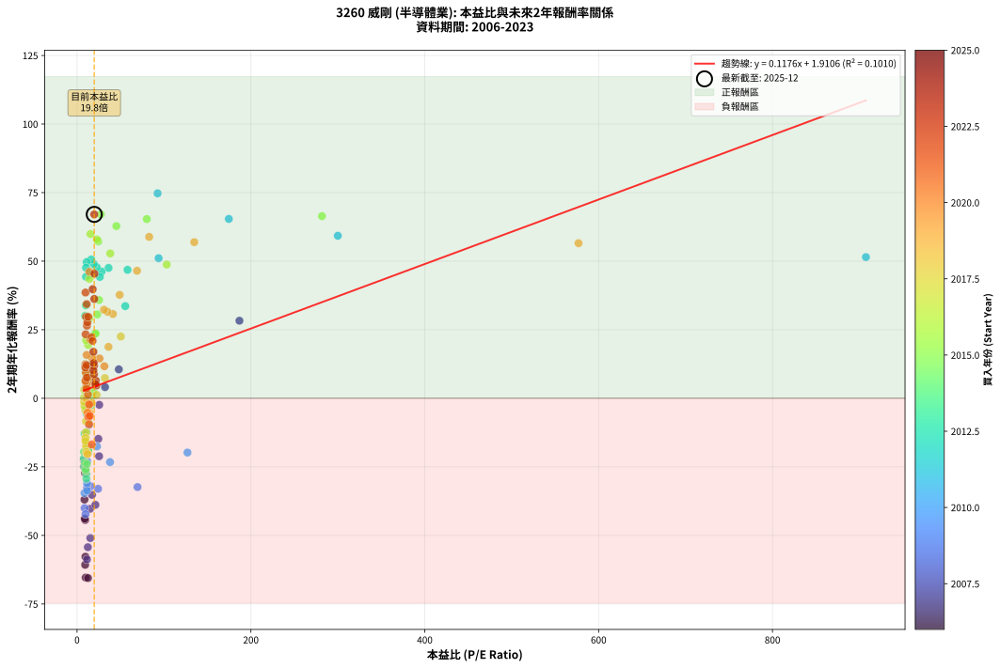
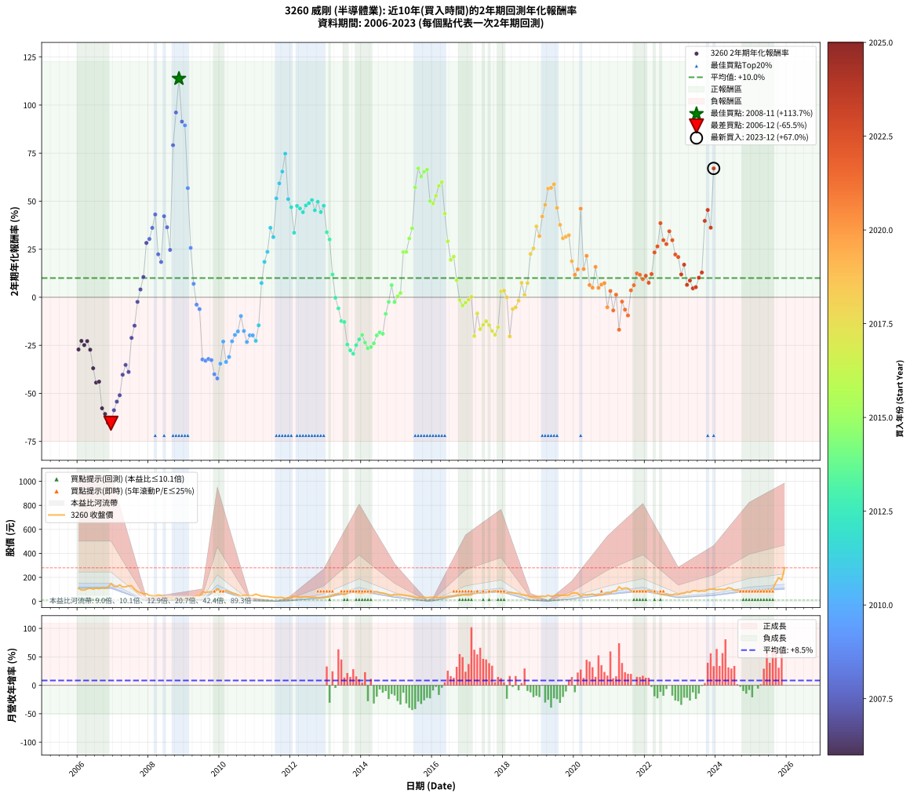

# 3260 威剛 - 本益比與未來報酬率分析

!!! info "報告資訊"
    - **股票代號**: 3260
    - **公司名稱**: 威剛
    - **產業別**: 半導體業
    - **分析期間**: 2006-2023 (216 個數據點)
    - **資料來源**: Type 12 (ShowMonthlyK_ChartFlow) 月收盤價與本益比
    - **報酬率口徑**: 含現金股利 (簡化: 年度合計，假設每年7/1入帳)
    - **報告生成時間**: 2026-01-04 08:27:23 CST

## 📈 視覺化圖表

### 圖表1: 本益比 vs 未來報酬率關係

*圖表1：3260 威剛 本益比與2年期未來報酬率關係 (2006-2023)*

### 圖表2: 歷年買入時點的2年期實際報酬率

*圖表2：3260 威剛 歷年買入時點的2年期實際報酬率 (2006-2023)*

## 📍 買點訊號說明

本報告提供兩種買點提示訊號（顯示於圖表2的股價子圖中）：

### ▲ 小綠色三角形（回測驗證）
- **計算方式**: 使用全部歷史資料計算本益比第25百分位數
- **用途**: 事後驗證，顯示歷史上哪些時點確實為低估區
- **限制**: 當下無法判斷，僅供回測參考
- **特性**: 後見之明（Look-Ahead Bias）

### ▲ 小橘色三角形（即時訊號）
- **計算方式**: 使用截至當月的過去5年資料計算本益比第25百分位數
- **用途**: 實際投資決策，當時即可判斷
- **優勢**: 可操作性強，符合實務需求
- **特性**: 無後見之明，滾動窗口計算

!!! tip "如何使用兩種訊號"
    - **綠色▲** 幫助理解歷史估值機會，驗證策略有效性
    - **橘色▲** 可作為實際買進參考，但仍需搭配基本面分析
    - 兩種訊號重疊時，表示即時判斷與事後驗證一致，信心度較高
    - 僅有綠色▲時，表示當時無法判斷（需要未來資料才能確認）
    - 僅有橘色▲時，表示即時判斷為買點，但事後可能不是最佳時機

## 📊 估值分析摘要

| 指標 | 數值 |
|:---:|:---:|
| **目前本益比** (2023-12) | **19.77 倍** |
| **歷史平均本益比** | 32.85 倍 |
| **估值水準** | 🟢 相對低估 |
| **預期2年年化報酬率** | **+4.24%** |
| **歷史平均報酬率** | +10.00% |
| **相關係數 (R²)** | 0.1010 |
| **趨勢線斜率** | 0.1176 |

!!! abstract "核心洞察"
    目前本益比顯著低於歷史平均，預期未來報酬率可能較高

    根據歷史數據回測，3260 威剛 在目前本益比 **19.8倍** 的估值水準下，
    預期未來2年年化報酬率約為 **+4.2%**。

    **重要提醒**: 本分析基於歷史數據統計，實際報酬率會受到公司基本面變化、產業趨勢、
    總體經濟環境等多重因素影響。R² = 0.10 表示本益比可解釋約 10.1% 的報酬率變異。

## 📈 歷史估值統計

### 最佳買點 (最高報酬率)

| 項目 | 數值 |
|:---:|:---:|
| 起始時間 | 2008-11 |
| 當時本益比 | nan 倍 |
| 起始價格 | 10.6 元 |
| 2年後價格 | 45.4 元 |
| **2年年化報酬率** | **+113.75%** |

### 最差買點 (最低報酬率)

| 項目 | 數值 |
|:---:|:---:|
| 起始時間 | 2006-12 |
| 當時本益比 | 12.56 倍 |
| 起始價格 | 148.5 元 |
| 2年後價格 | 14.2 元 |
| **2年年化報酬率** | **-65.54%** |

## 🎯 投資啟示

### 本益比與報酬率關係

趨勢線方程式: **y = 0.1176x + 1.9106**

!!! info "弱相關或正相關"
    本益比與未來報酬率相關性較弱。這可能表示該股票的報酬率更多受到
    公司成長性、產業趨勢等因素影響，而非估值水準。**需綜合考量多項指標**。

### 估值區間建議

基於歷史數據分析:

- **🟢 低估區** (P/E < 26.3): 預期報酬率較高，可考慮增加持股
- **🟡 合理區** (P/E 26.3-39.4): 預期報酬率符合長期趨勢，正常持有
- **🔴 高估區** (P/E > 39.4): 預期報酬率較低，可考慮減碼或觀望

!!! danger "風險提示"
    - 過去表現不代表未來結果
    - 本分析假設公司基本面無重大結構性變化
    - 產業環境劇變可能使歷史規律失效
    - 應結合公司財報、產業趨勢、總體經濟等多重因素綜合判斷

!!! success "長期投資觀點"
    歷史數據顯示，在合理或低估的估值水準買入並長期持有，
    往往能獲得較佳的投資報酬。**耐心等待好價格**是價值投資的核心原則。

## 📊 數據品質

- **資料來源**: GoodInfo.tw Type 12 (ShowMonthlyK_ChartFlow)
- **資料頻率**: 月度收盤價與本益比
- **回測期間**: 2006-2023
- **數據點數量**: 216 個 (每個點代表一次2年期回測)

### 計算方法說明

1. **2年期年化報酬率**:
   - 對每個歷史時點，計算其後2年的實際投資報酬率
   - 期末價值(不含股利): 期末價格
   - 期末價值(含現金股利): 期末價格 + 持有期間內的現金股利合計 (簡化: 年度合計，假設每年7/1入帳)
   - 公式: 年化報酬率 = [(期末價值/期初價格)^(1/年數) - 1] × 100%

2. **本益比 (P/E Ratio)**:
   - 使用當時的月收盤價與EPS計算
   - 資料來源: Type 12 月度河流圖本益比數據

3. **趨勢線 (Linear Regression)**:
   - 使用最小平方法擬合線性趨勢線
   - R²值衡量本益比對報酬率的解釋能力

---

*本報告由 Stock Analysis System v1.9.0 自動生成*
*數據更新時間: 2026-01-04 08:27:23 CST*

## 📋 月度回測明細表

（每一列對應時間線圖中的一個買入點；可用來對照 SVG 圖上的每個點。）

| 買入月份 | 賣出月份 | 回測期限_年 | 實際持有年數 | 買入本益比_倍 | 買入收盤價_元 | 賣出收盤價_元 | 現金股利合計_元 | 總報酬率_pct | 年化報酬率_pct |
| --- | --- | --- | --- | --- | --- | --- | --- | --- | --- |
| 2006-01 | 2008-01 | 2 | 1.999 | 9.22 | 109.00 | 49.10 | 8.75 | -46.93 | -27.16 |
| 2006-02 | 2008-02 | 2 | 1.999 | 7.96 | 94.10 | 47.50 | 8.75 | -40.22 | -22.70 |
| 2006-03 | 2008-03 | 2 | 2.001 | 7.93 | 93.70 | 44.10 | 8.75 | -43.60 | -24.88 |
| 2006-04 | 2008-04 | 2 | 2.001 | 8.80 | 104.00 | 53.20 | 8.75 | -40.43 | -22.81 |
| 2006-05 | 2008-05 | 2 | 2.001 | 9.35 | 110.50 | 49.65 | 8.75 | -47.15 | -27.29 |
| 2006-06 | 2008-06 | 2 | 2.001 | 8.54 | 101.00 | 31.40 | 8.75 | -60.25 | -36.93 |
| 2006-07 | 2008-07 | 2 | 2.001 | 9.39 | 111.00 | 30.90 | 3.41 | -69.09 | -44.38 |
| 2006-08 | 2008-08 | 2 | 2.001 | 8.88 | 105.00 | 29.60 | 3.41 | -68.56 | -43.91 |
| 2006-09 | 2008-09 | 2 | 2.001 | 9.64 | 114.00 | 16.90 | 3.41 | -82.19 | -57.77 |
| 2006-10 | 2008-10 | 2 | 2.001 | 9.31 | 110.00 | 13.55 | 3.41 | -84.58 | -60.71 |
| 2006-11 | 2008-11 | 2 | 2.001 | 9.90 | 117.00 | 10.60 | 3.41 | -88.03 | -65.37 |
| 2006-12 | 2008-12 | 2 | 2.001 | 12.56 | 148.50 | 14.20 | 3.41 | -88.14 | -65.54 |
| 2007-01 | 2009-01 | 2 | 2.001 | 11.41 | 124.00 | 17.65 | 3.41 | -83.02 | -58.76 |
| 2007-02 | 2009-02 | 2 | 2.001 | 12.42 | 123.00 | 22.25 | 3.41 | -79.14 | -54.30 |
| 2007-03 | 2009-03 | 2 | 2.001 | 15.31 | 137.00 | 29.50 | 3.41 | -75.98 | -50.96 |
| 2007-04 | 2009-04 | 2 | 2.001 | 14.95 | 119.50 | 39.15 | 3.41 | -64.39 | -40.30 |
| 2007-05 | 2009-05 | 2 | 2.001 | 17.20 | 121.00 | 47.35 | 3.41 | -58.05 | -35.21 |
| 2007-06 | 2009-06 | 2 | 2.001 | 21.13 | 128.50 | 44.60 | 3.41 | -62.64 | -38.86 |
| 2007-07 | 2009-07 | 2 | 2.001 | 25.37 | 130.00 | 80.80 | 0.03 | -37.82 | -21.13 |
| 2007-08 | 2009-08 | 2 | 2.001 | 24.48 | 102.00 | 74.00 | 0.03 | -27.42 | -14.80 |
| 2007-09 | 2009-09 | 2 | 2.001 | 25.51 | 81.90 | 78.00 | 0.03 | -4.72 | -2.39 |
| 2007-10 | 2009-10 | 2 | 2.001 | 32.17 | 72.50 | 78.50 | 0.03 | +8.32 | +4.07 |
| 2007-11 | 2009-11 | 2 | 2.001 | 48.05 | 62.30 | 76.10 | 0.03 | +22.20 | +10.54 |
| 2007-12 | 2009-12 | 2 | 2.001 | 186.80 | 63.50 | 104.50 | 0.03 | +64.62 | +28.28 |
| 2008-01 | 2010-01 | 2 | 2.001 |  | 49.10 | 83.40 | 0.03 | +69.92 | +30.33 |
| 2008-02 | 2010-03 | 2 | 2.081 |  | 47.50 | 90.20 | 0.03 | +89.96 | +36.12 |
| 2008-03 | 2010-03 | 2 | 1.999 |  | 44.10 | 90.20 | 0.03 | +104.61 | +43.08 |
| 2008-04 | 2010-04 | 2 | 1.999 |  | 53.20 | 79.60 | 0.03 | +49.68 | +22.36 |
| 2008-05 | 2010-05 | 2 | 1.999 |  | 49.65 | 69.50 | 0.03 | +40.04 | +18.35 |
| 2008-06 | 2010-06 | 2 | 1.999 |  | 31.40 | 63.40 | 0.03 | +102.01 | +42.17 |
| 2008-07 | 2010-07 | 2 | 1.999 |  | 30.90 | 54.50 | 2.98 | +86.02 | +36.42 |
| 2008-08 | 2010-08 | 2 | 1.999 |  | 29.60 | 43.00 | 2.98 | +55.34 | +24.65 |
| 2008-09 | 2010-09 | 2 | 1.999 |  | 16.90 | 51.20 | 2.98 | +220.59 | +79.12 |
| 2008-10 | 2010-10 | 2 | 1.999 |  | 13.55 | 49.10 | 2.98 | +284.35 | +96.14 |
| 2008-11 | 2010-11 | 2 | 1.999 |  | 10.60 | 45.40 | 2.98 | +356.42 | +113.75 |
| 2008-12 | 2010-12 | 2 | 1.999 |  | 14.20 | 49.00 | 2.98 | +266.06 | +91.41 |
| 2009-01 | 2011-01 | 2 | 1.999 |  | 17.65 | 60.30 | 2.98 | +258.53 | +89.43 |
| 2009-02 | 2011-02 | 2 | 1.999 |  | 22.25 | 51.70 | 2.98 | +145.75 | +56.81 |
| 2009-03 | 2011-03 | 2 | 1.999 |  | 29.50 | 43.60 | 2.98 | +57.90 | +25.68 |
| 2009-04 | 2011-04 | 2 | 1.999 |  | 39.15 | 41.85 | 2.98 | +14.51 | +7.01 |
| 2009-05 | 2011-05 | 2 | 1.999 |  | 47.35 | 40.80 | 2.98 | -7.54 | -3.85 |
| 2009-06 | 2011-06 | 2 | 1.999 |  | 44.60 | 36.30 | 2.98 | -11.93 | -6.16 |
| 2009-07 | 2011-07 | 2 | 1.999 | 69.56 | 80.80 | 34.00 | 2.98 | -54.23 | -32.37 |
| 2009-08 | 2011-08 | 2 | 1.999 | 24.16 | 74.00 | 30.25 | 2.98 | -55.09 | -33.01 |
| 2009-09 | 2011-09 | 2 | 1.999 | 15.71 | 78.00 | 33.00 | 2.98 | -53.87 | -32.10 |
| 2009-10 | 2011-10 | 2 | 1.999 | 11.43 | 78.50 | 32.60 | 2.98 | -54.68 | -32.69 |
| 2009-11 | 2011-11 | 2 | 1.999 | 8.68 | 76.10 | 24.40 | 2.98 | -64.02 | -40.04 |
| 2009-12 | 2011-12 | 2 | 1.999 | 9.79 | 104.50 | 31.90 | 2.98 | -66.62 | -42.25 |
| 2010-01 | 2012-01 | 2 | 1.999 | 8.57 | 83.40 | 32.75 | 2.98 | -57.16 | -34.57 |
| 2010-02 | 2012-02 | 2 | 1.999 | 8.96 | 78.80 | 43.70 | 2.98 | -40.76 | -23.05 |
| 2010-03 | 2012-03 | 2 | 2.001 | 11.48 | 90.20 | 36.70 | 2.98 | -56.01 | -33.66 |
| 2010-04 | 2012-04 | 2 | 2.001 | 11.50 | 79.60 | 34.85 | 2.98 | -52.47 | -31.04 |
| 2010-05 | 2012-05 | 2 | 2.001 | 11.62 | 69.50 | 38.30 | 2.98 | -40.60 | -22.92 |
| 2010-06 | 2012-06 | 2 | 2.001 | 12.57 | 63.40 | 38.00 | 2.98 | -35.36 | -19.59 |
| 2010-07 | 2012-07 | 2 | 2.001 | 13.27 | 54.50 | 36.55 | 0.30 | -32.39 | -17.76 |
| 2010-08 | 2012-08 | 2 | 2.001 | 13.56 | 43.00 | 34.70 | 0.30 | -18.60 | -9.77 |
| 2010-09 | 2012-09 | 2 | 2.001 | 22.93 | 51.20 | 34.50 | 0.30 | -32.03 | -17.55 |
| 2010-10 | 2012-10 | 2 | 2.001 | 37.92 | 49.10 | 28.60 | 0.30 | -41.14 | -23.27 |
| 2010-11 | 2012-11 | 2 | 2.001 | 127.00 | 45.40 | 28.90 | 0.30 | -35.68 | -19.79 |
| 2010-12 | 2012-12 | 2 | 2.001 |  | 49.00 | 31.20 | 0.30 | -35.71 | -19.81 |
| 2011-01 | 2013-01 | 2 | 2.001 |  | 60.30 | 35.75 | 0.30 | -40.22 | -22.67 |
| 2011-02 | 2013-02 | 2 | 2.001 |  | 51.70 | 37.40 | 0.30 | -27.08 | -14.60 |
| 2011-03 | 2013-03 | 2 | 2.001 |  | 43.60 | 50.00 | 0.30 | +15.37 | +7.40 |
| 2011-04 | 2013-04 | 2 | 2.001 |  | 41.85 | 58.40 | 0.30 | +40.26 | +18.42 |
| 2011-05 | 2013-05 | 2 | 2.001 |  | 40.80 | 62.10 | 0.30 | +52.94 | +23.65 |
| 2011-06 | 2013-06 | 2 | 2.001 |  | 36.30 | 67.00 | 0.30 | +85.40 | +36.13 |
| 2011-07 | 2013-07 | 2 | 2.001 |  | 34.00 | 56.00 | 2.65 | +72.49 | +31.31 |
| 2011-08 | 2013-08 | 2 | 2.001 | 907.50 | 30.25 | 66.80 | 2.65 | +129.58 | +51.47 |
| 2011-09 | 2013-09 | 2 | 2.001 | 300.00 | 33.00 | 81.10 | 2.65 | +153.78 | +59.25 |
| 2011-10 | 2013-10 | 2 | 2.001 | 174.60 | 32.60 | 86.60 | 2.65 | +173.76 | +65.40 |
| 2011-11 | 2013-11 | 2 | 2.001 | 92.66 | 24.40 | 71.90 | 2.65 | +205.52 | +74.72 |
| 2011-12 | 2013-12 | 2 | 2.001 | 93.82 | 31.90 | 70.20 | 2.65 | +128.36 | +51.07 |
| 2012-01 | 2014-01 | 2 | 2.001 | 58.08 | 32.75 | 68.00 | 2.65 | +115.72 | +46.83 |
| 2012-02 | 2014-03 | 2 | 2.081 | 55.47 | 43.70 | 77.20 | 2.65 | +82.72 | +33.60 |
| 2012-03 | 2014-03 | 2 | 1.999 | 36.27 | 36.70 | 77.20 | 2.65 | +117.57 | +47.54 |
| 2012-04 | 2014-04 | 2 | 1.999 | 28.20 | 34.85 | 71.80 | 2.65 | +113.62 | +46.20 |
| 2012-05 | 2014-05 | 2 | 1.999 | 26.24 | 38.30 | 77.00 | 2.65 | +107.96 | +44.24 |
| 2012-06 | 2014-06 | 2 | 1.999 | 22.57 | 38.00 | 80.30 | 2.65 | +118.28 | +47.78 |
| 2012-07 | 2014-07 | 2 | 1.999 | 19.16 | 36.55 | 71.70 | 9.35 | +121.75 | +48.95 |
| 2012-08 | 2014-08 | 2 | 1.999 | 16.28 | 34.70 | 69.30 | 9.35 | +126.66 | +50.59 |
| 2012-09 | 2014-09 | 2 | 1.999 | 14.65 | 34.50 | 63.40 | 9.35 | +110.87 | +45.25 |
| 2012-10 | 2014-10 | 2 | 1.999 | 11.09 | 28.60 | 54.70 | 9.35 | +123.95 | +49.69 |
| 2012-11 | 2014-11 | 2 | 1.999 | 10.31 | 28.90 | 50.80 | 9.35 | +108.13 | +44.31 |
| 2012-12 | 2014-12 | 2 | 1.999 | 10.31 | 31.20 | 58.60 | 9.35 | +117.79 | +47.62 |
| 2013-01 | 2015-01 | 2 | 1.999 | 10.12 | 35.75 | 54.70 | 9.35 | +79.16 | +33.88 |
| 2013-02 | 2015-02 | 2 | 1.999 | 9.27 | 37.40 | 53.90 | 9.35 | +69.12 | +30.07 |
| 2013-03 | 2015-03 | 2 | 1.999 | 11.01 | 50.00 | 53.20 | 9.35 | +25.10 | +11.86 |
| 2013-04 | 2015-04 | 2 | 1.999 | 11.58 | 58.40 | 48.75 | 9.35 | -0.51 | -0.26 |
| 2013-05 | 2015-05 | 2 | 1.999 | 11.19 | 62.10 | 45.80 | 9.35 | -11.19 | -5.76 |
| 2013-06 | 2015-06 | 2 | 1.999 | 11.07 | 67.00 | 42.10 | 9.35 | -23.21 | -12.38 |
| 2013-07 | 2015-07 | 2 | 1.999 | 8.54 | 56.00 | 33.00 | 9.52 | -24.07 | -12.87 |
| 2013-08 | 2015-08 | 2 | 1.999 | 9.46 | 66.80 | 28.50 | 9.52 | -43.08 | -24.57 |
| 2013-09 | 2015-09 | 2 | 1.999 | 10.72 | 81.10 | 33.00 | 9.52 | -47.57 | -27.61 |
| 2013-10 | 2015-10 | 2 | 1.999 | 10.73 | 86.60 | 33.70 | 9.52 | -50.09 | -29.37 |
| 2013-11 | 2015-11 | 2 | 1.999 | 8.38 | 71.90 | 31.00 | 9.52 | -43.64 | -24.94 |
| 2013-12 | 2015-12 | 2 | 1.999 | 7.73 | 70.20 | 33.30 | 9.52 | -39.00 | -21.91 |
| 2014-01 | 2016-01 | 2 | 1.999 | 7.89 | 68.00 | 34.50 | 9.52 | -35.26 | -19.55 |
| 2014-02 | 2016-02 | 2 | 1.999 | 8.95 | 73.00 | 33.15 | 9.52 | -41.55 | -23.56 |
| 2014-03 | 2016-03 | 2 | 2.001 | 10.04 | 77.20 | 32.15 | 9.52 | -46.02 | -26.51 |
| 2014-04 | 2016-04 | 2 | 2.001 | 9.94 | 71.80 | 29.90 | 9.52 | -45.09 | -25.89 |
| 2014-05 | 2016-05 | 2 | 2.001 | 11.38 | 77.00 | 35.00 | 9.52 | -42.18 | -23.95 |
| 2014-06 | 2016-06 | 2 | 2.001 | 12.75 | 80.30 | 42.10 | 9.52 | -35.71 | -19.81 |
| 2014-07 | 2016-07 | 2 | 2.001 | 12.28 | 71.70 | 44.85 | 3.02 | -33.24 | -18.28 |
| 2014-08 | 2016-08 | 2 | 2.001 | 12.90 | 69.30 | 42.45 | 3.02 | -34.39 | -18.99 |
| 2014-09 | 2016-09 | 2 | 2.001 | 12.91 | 63.40 | 49.90 | 3.02 | -16.53 | -8.63 |
| 2014-10 | 2016-10 | 2 | 2.001 | 12.30 | 54.70 | 49.10 | 3.02 | -4.72 | -2.39 |
| 2014-11 | 2016-11 | 2 | 2.001 | 12.75 | 50.80 | 54.40 | 3.02 | +13.03 | +6.31 |
| 2014-12 | 2016-12 | 2 | 2.001 | 16.65 | 58.60 | 52.70 | 3.02 | -4.92 | -2.49 |
| 2015-01 | 2017-01 | 2 | 2.001 | 17.04 | 54.70 | 52.20 | 3.02 | +0.95 | +0.47 |
| 2015-02 | 2017-02 | 2 | 2.001 | 18.59 | 53.90 | 53.30 | 3.02 | +4.49 | +2.22 |
| 2015-03 | 2017-03 | 2 | 2.001 | 20.54 | 53.20 | 78.20 | 3.02 | +52.67 | +23.54 |
| 2015-04 | 2017-04 | 2 | 2.001 | 21.38 | 48.75 | 71.50 | 3.02 | +52.86 | +23.62 |
| 2015-05 | 2017-05 | 2 | 2.001 | 23.25 | 45.80 | 75.10 | 3.02 | +70.56 | +30.58 |
| 2015-06 | 2017-06 | 2 | 2.001 | 25.36 | 42.10 | 74.70 | 3.02 | +84.60 | +35.84 |
| 2015-07 | 2017-07 | 2 | 2.001 | 24.44 | 33.00 | 77.10 | 4.50 | +147.27 | +57.20 |
| 2015-08 | 2017-08 | 2 | 2.001 | 27.40 | 28.50 | 75.10 | 4.50 | +179.30 | +67.06 |
| 2015-09 | 2017-09 | 2 | 2.001 | 45.21 | 33.00 | 83.00 | 4.50 | +165.15 | +62.78 |
| 2015-10 | 2017-10 | 2 | 2.001 | 80.24 | 33.70 | 87.70 | 4.50 | +173.59 | +65.35 |
| 2015-11 | 2017-11 | 2 | 2.001 | 281.80 | 31.00 | 81.40 | 4.50 | +177.10 | +66.40 |
| 2015-12 | 2017-12 | 2 | 2.001 |  | 33.30 | 70.50 | 4.50 | +125.23 | +50.03 |
| 2016-01 | 2018-01 | 2 | 2.001 | 103.20 | 34.50 | 71.90 | 4.50 | +121.45 | +48.77 |
| 2016-02 | 2018-03 | 2 | 2.081 | 38.18 | 33.15 | 75.60 | 4.50 | +141.63 | +52.81 |
| 2016-03 | 2018-03 | 2 | 1.999 | 22.92 | 32.15 | 75.60 | 4.50 | +149.14 | +57.89 |
| 2016-04 | 2018-04 | 2 | 1.999 | 15.44 | 29.90 | 71.90 | 4.50 | +155.52 | +59.90 |
| 2016-05 | 2018-05 | 2 | 1.999 | 14.17 | 35.00 | 67.60 | 4.50 | +106.00 | +43.56 |
| 2016-06 | 2018-06 | 2 | 1.999 | 14.01 | 42.10 | 65.70 | 4.50 | +66.75 | +29.15 |
| 2016-07 | 2018-07 | 2 | 1.999 | 12.67 | 44.85 | 54.00 | 10.00 | +42.70 | +19.47 |
| 2016-08 | 2018-08 | 2 | 1.999 | 10.42 | 42.45 | 52.30 | 10.00 | +46.76 | +21.16 |
| 2016-09 | 2018-09 | 2 | 1.999 | 10.83 | 49.90 | 49.10 | 10.00 | +18.44 | +8.84 |
| 2016-10 | 2018-10 | 2 | 1.999 | 9.55 | 49.10 | 37.70 | 10.00 | -2.85 | -1.44 |
| 2016-11 | 2018-11 | 2 | 1.999 | 9.58 | 54.40 | 39.80 | 10.00 | -8.46 | -4.32 |
| 2016-12 | 2018-12 | 2 | 1.999 | 8.49 | 52.70 | 39.80 | 10.00 | -5.50 | -2.79 |
| 2017-01 | 2019-01 | 2 | 1.999 | 8.15 | 52.20 | 40.90 | 10.00 | -2.49 | -1.25 |
| 2017-02 | 2019-02 | 2 | 1.999 | 8.07 | 53.30 | 43.55 | 10.00 | +0.47 | +0.23 |
| 2017-03 | 2019-03 | 2 | 1.999 | 11.49 | 78.20 | 39.85 | 10.00 | -36.25 | -20.17 |
| 2017-04 | 2019-04 | 2 | 1.999 | 10.21 | 71.50 | 50.00 | 10.00 | -16.08 | -8.40 |
| 2017-05 | 2019-05 | 2 | 1.999 | 10.43 | 75.10 | 42.25 | 10.00 | -30.43 | -16.60 |
| 2017-06 | 2019-06 | 2 | 1.999 | 10.09 | 74.70 | 44.80 | 10.00 | -26.64 | -14.36 |
| 2017-07 | 2019-07 | 2 | 1.999 | 10.15 | 77.10 | 52.90 | 6.20 | -23.35 | -12.46 |
| 2017-08 | 2019-08 | 2 | 1.999 | 9.63 | 75.10 | 48.70 | 6.20 | -26.90 | -14.51 |
| 2017-09 | 2019-09 | 2 | 1.999 | 10.38 | 83.00 | 50.30 | 6.20 | -31.93 | -17.50 |
| 2017-10 | 2019-10 | 2 | 1.999 | 10.70 | 87.70 | 50.60 | 6.20 | -35.23 | -19.53 |
| 2017-11 | 2019-11 | 2 | 1.999 | 9.70 | 81.40 | 51.80 | 6.20 | -28.75 | -15.60 |
| 2017-12 | 2019-12 | 2 | 1.999 | 8.21 | 70.50 | 68.70 | 6.20 | +6.24 | +3.08 |
| 2018-01 | 2020-01 | 2 | 1.999 | 9.21 | 71.90 | 70.70 | 6.20 | +6.95 | +3.42 |
| 2018-02 | 2020-02 | 2 | 1.999 | 10.47 | 73.50 | 67.20 | 6.20 | -0.14 | -0.07 |
| 2018-03 | 2020-03 | 2 | 2.001 | 12.12 | 75.60 | 41.75 | 6.20 | -36.57 | -20.35 |
| 2018-04 | 2020-04 | 2 | 2.001 | 13.18 | 71.90 | 57.20 | 6.20 | -11.82 | -6.09 |
| 2018-05 | 2020-05 | 2 | 2.001 | 14.48 | 67.60 | 54.50 | 6.20 | -10.21 | -5.24 |
| 2018-06 | 2020-06 | 2 | 2.001 | 16.91 | 65.70 | 57.20 | 6.20 | -3.50 | -1.76 |
| 2018-07 | 2020-07 | 2 | 2.001 | 17.41 | 54.00 | 60.80 | 1.61 | +15.58 | +7.50 |
| 2018-08 | 2020-08 | 2 | 2.001 | 22.58 | 52.30 | 52.00 | 1.61 | +2.51 | +1.24 |
| 2018-09 | 2020-09 | 2 | 2.001 | 32.04 | 49.10 | 55.00 | 1.61 | +15.30 | +7.37 |
| 2018-10 | 2020-10 | 2 | 2.001 | 50.38 | 37.70 | 55.00 | 1.61 | +50.16 | +22.52 |
| 2018-11 | 2020-11 | 2 | 2.001 |  | 39.80 | 61.00 | 1.61 | +57.31 | +25.41 |
| 2018-12 | 2020-12 | 2 | 2.001 |  | 39.80 | 73.00 | 1.61 | +87.46 | +36.89 |
| 2019-01 | 2021-01 | 2 | 2.001 |  | 40.90 | 69.50 | 1.61 | +73.87 | +31.83 |
| 2019-02 | 2021-02 | 2 | 2.001 |  | 43.55 | 86.30 | 1.61 | +101.86 | +42.04 |
| 2019-03 | 2021-03 | 2 | 2.001 |  | 39.85 | 85.80 | 1.61 | +119.35 | +48.06 |
| 2019-04 | 2021-04 | 2 | 2.001 | 576.90 | 50.00 | 121.00 | 1.61 | +145.22 | +56.55 |
| 2019-05 | 2021-05 | 2 | 2.001 | 134.80 | 42.25 | 102.50 | 1.61 | +146.42 | +56.93 |
| 2019-06 | 2021-06 | 2 | 2.001 | 82.96 | 44.80 | 111.50 | 1.61 | +152.48 | +58.85 |
| 2019-07 | 2021-07 | 2 | 2.001 | 69.00 | 52.90 | 109.00 | 4.60 | +114.74 | +46.50 |
| 2019-08 | 2021-08 | 2 | 2.001 | 49.03 | 48.70 | 87.80 | 4.60 | +89.72 | +37.71 |
| 2019-09 | 2021-09 | 2 | 2.001 | 41.23 | 50.30 | 81.40 | 4.60 | +70.96 | +30.73 |
| 2019-10 | 2021-10 | 2 | 2.001 | 34.98 | 50.60 | 83.00 | 4.60 | +73.11 | +31.55 |
| 2019-11 | 2021-11 | 2 | 2.001 | 30.96 | 51.80 | 86.10 | 4.60 | +75.09 | +32.30 |
| 2019-12 | 2021-12 | 2 | 2.001 | 36.16 | 68.70 | 92.30 | 4.60 | +41.04 | +18.75 |
| 2020-01 | 2022-01 | 2 | 2.001 | 31.42 | 70.70 | 83.60 | 4.60 | +24.75 | +11.68 |
| 2020-02 | 2022-03 | 2 | 2.081 | 25.85 | 67.20 | 84.50 | 4.60 | +32.58 | +14.52 |
| 2020-03 | 2022-03 | 2 | 1.999 | 14.15 | 41.75 | 84.50 | 4.60 | +113.40 | +46.12 |
| 2020-04 | 2022-04 | 2 | 1.999 | 17.33 | 57.20 | 70.60 | 4.60 | +31.46 | +14.67 |
| 2020-05 | 2022-05 | 2 | 1.999 | 14.93 | 54.50 | 75.90 | 4.60 | +47.70 | +21.55 |
| 2020-06 | 2022-06 | 2 | 1.999 | 14.30 | 57.20 | 60.10 | 4.60 | +13.10 | +6.35 |
| 2020-07 | 2022-07 | 2 | 1.999 | 13.98 | 60.80 | 58.40 | 8.62 | +10.23 | +4.99 |
| 2020-08 | 2022-08 | 2 | 1.999 | 11.06 | 52.00 | 61.10 | 8.62 | +34.07 | +15.80 |
| 2020-09 | 2022-09 | 2 | 1.999 | 10.89 | 55.00 | 51.90 | 8.62 | +10.03 | +4.90 |
| 2020-10 | 2022-10 | 2 | 1.999 | 10.19 | 55.00 | 53.90 | 8.62 | +13.67 | +6.62 |
| 2020-11 | 2022-11 | 2 | 1.999 | 10.61 | 61.00 | 61.70 | 8.62 | +15.28 | +7.37 |
| 2020-12 | 2022-12 | 2 | 1.999 | 11.97 | 73.00 | 57.00 | 8.62 | -10.11 | -5.19 |
| 2021-01 | 2023-01 | 2 | 1.999 | 10.94 | 69.50 | 65.50 | 8.62 | +6.64 | +3.27 |
| 2021-02 | 2023-02 | 2 | 1.999 | 13.06 | 86.30 | 66.30 | 8.62 | -13.19 | -6.83 |
| 2021-03 | 2023-03 | 2 | 1.999 | 12.51 | 85.80 | 79.50 | 8.62 | +2.70 | +1.34 |
| 2021-04 | 2023-04 | 2 | 1.999 | 17.01 | 121.00 | 75.00 | 8.62 | -30.89 | -16.88 |
| 2021-05 | 2023-05 | 2 | 1.999 | 13.91 | 102.50 | 89.30 | 8.62 | -4.47 | -2.26 |
| 2021-06 | 2023-06 | 2 | 1.999 | 14.63 | 111.50 | 89.00 | 8.62 | -12.45 | -6.44 |
| 2021-07 | 2023-07 | 2 | 1.999 | 13.84 | 109.00 | 81.90 | 7.43 | -18.04 | -9.48 |
| 2021-08 | 2023-08 | 2 | 1.999 | 10.80 | 87.80 | 86.80 | 7.43 | +7.33 | +3.60 |
| 2021-09 | 2023-09 | 2 | 1.999 | 9.71 | 81.40 | 84.50 | 7.43 | +12.94 | +6.28 |
| 2021-10 | 2023-10 | 2 | 1.999 | 9.61 | 83.00 | 97.40 | 7.43 | +26.31 | +12.39 |
| 2021-11 | 2023-11 | 2 | 1.999 | 9.69 | 86.10 | 100.00 | 7.43 | +24.78 | +11.71 |
| 2021-12 | 2023-12 | 2 | 1.999 | 10.10 | 92.30 | 103.00 | 7.43 | +19.65 | +9.39 |
| 2022-01 | 2024-01 | 2 | 1.999 | 9.67 | 83.60 | 95.90 | 7.43 | +23.61 | +11.19 |
| 2022-02 | 2024-02 | 2 | 1.999 | 11.40 | 92.90 | 100.00 | 7.43 | +15.64 | +7.54 |
| 2022-03 | 2024-03 | 2 | 2.001 | 11.04 | 84.50 | 98.70 | 7.43 | +25.60 | +12.06 |
| 2022-04 | 2024-04 | 2 | 2.001 | 9.86 | 70.60 | 100.00 | 7.43 | +52.17 | +23.34 |
| 2022-05 | 2024-05 | 2 | 2.001 | 11.39 | 75.90 | 114.00 | 7.43 | +59.99 | +26.47 |
| 2022-06 | 2024-06 | 2 | 2.001 | 9.75 | 60.10 | 108.00 | 7.43 | +92.07 | +38.56 |
| 2022-07 | 2024-07 | 2 | 2.001 | 10.30 | 58.40 | 93.30 | 5.00 | +68.32 | +29.72 |
| 2022-08 | 2024-08 | 2 | 2.001 | 11.81 | 61.10 | 94.60 | 5.00 | +63.01 | +27.65 |
| 2022-09 | 2024-09 | 2 | 2.001 | 11.10 | 51.90 | 88.70 | 5.00 | +80.54 | +34.34 |
| 2022-10 | 2024-10 | 2 | 2.001 | 12.89 | 53.90 | 85.70 | 5.00 | +68.27 | +29.70 |
| 2022-11 | 2024-11 | 2 | 2.001 | 16.74 | 61.70 | 87.20 | 5.00 | +49.43 | +22.23 |
| 2022-12 | 2024-12 | 2 | 2.001 | 17.87 | 57.00 | 78.40 | 5.00 | +46.32 | +20.95 |
| 2023-01 | 2025-01 | 2 | 2.001 | 19.50 | 65.50 | 77.00 | 5.00 | +25.19 | +11.88 |
| 2023-02 | 2025-02 | 2 | 2.001 | 18.80 | 66.30 | 85.70 | 5.00 | +36.80 | +16.95 |
| 2023-03 | 2025-03 | 2 | 2.001 | 21.52 | 79.50 | 85.10 | 5.00 | +13.33 | +6.45 |
| 2023-04 | 2025-04 | 2 | 2.001 | 19.41 | 75.00 | 83.70 | 5.00 | +18.27 | +8.74 |
| 2023-05 | 2025-05 | 2 | 2.001 | 22.15 | 89.30 | 92.80 | 5.00 | +9.52 | +4.65 |
| 2023-06 | 2025-06 | 2 | 2.001 | 21.19 | 89.00 | 93.60 | 5.00 | +10.79 | +5.25 |
| 2023-07 | 2025-07 | 2 | 2.001 | 18.75 | 81.90 | 91.30 | 8.12 | +21.39 | +10.17 |
| 2023-08 | 2025-08 | 2 | 2.001 | 19.13 | 86.80 | 102.50 | 8.12 | +27.44 | +12.88 |
| 2023-09 | 2025-09 | 2 | 2.001 | 17.96 | 84.50 | 157.00 | 8.12 | +95.41 | +39.76 |
| 2023-10 | 2025-10 | 2 | 2.001 | 19.99 | 97.40 | 198.00 | 8.12 | +111.62 | +45.44 |
| 2023-11 | 2025-11 | 2 | 2.001 | 19.83 | 100.00 | 177.50 | 8.12 | +85.62 | +36.21 |
| 2023-12 | 2025-12 | 2 | 2.001 | 19.77 | 103.00 | 279.50 | 8.12 | +179.24 | +67.05 |
