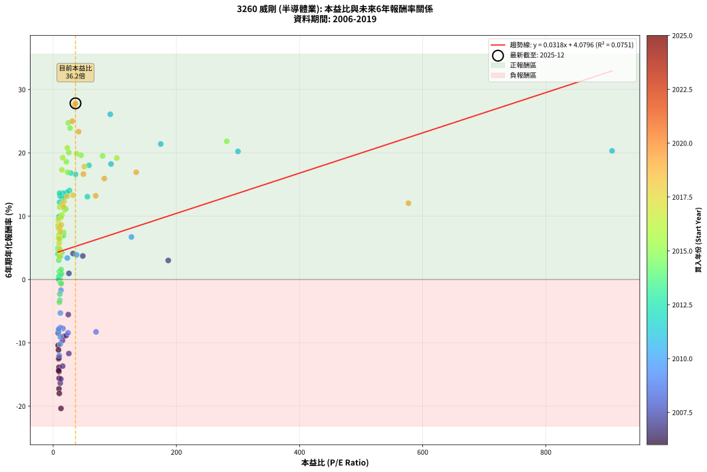
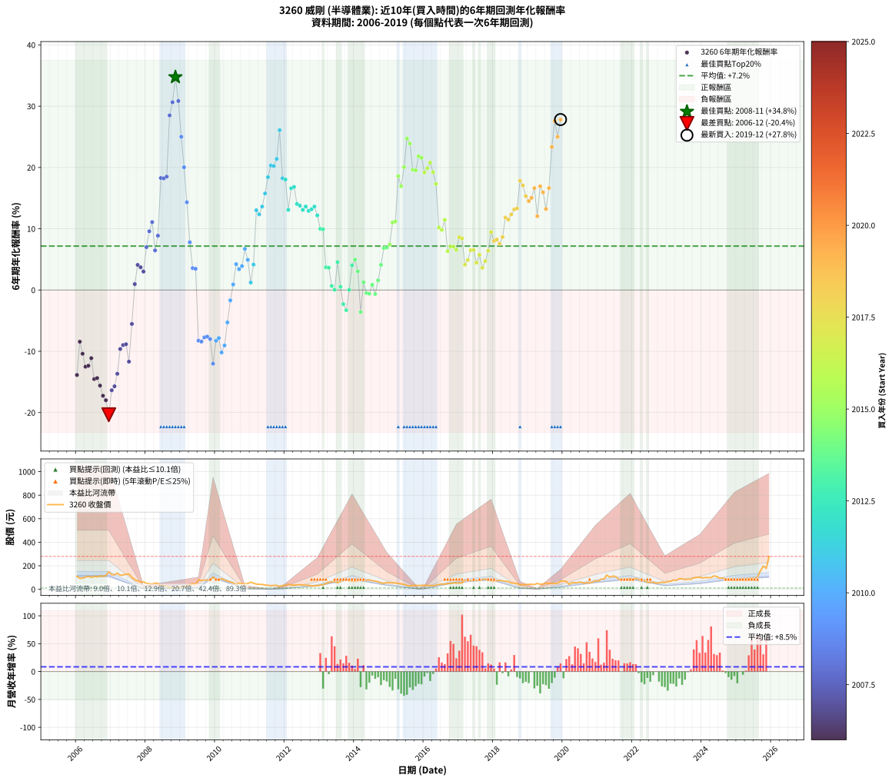

# 3260 威剛 - 本益比與未來報酬率分析

!!! info "報告資訊"
    - **股票代號**: 3260
    - **公司名稱**: 威剛
    - **產業別**: 半導體業
    - **分析期間**: 2006-2019 (168 個數據點)
    - **資料來源**: Type 12 (ShowMonthlyK_ChartFlow) 月收盤價與本益比
    - **報酬率口徑**: 含現金股利 (簡化: 年度合計，假設每年7/1入帳)
    - **報告生成時間**: 2026-01-10 18:53:37 CST

## 📈 視覺化圖表

### 圖表1: 本益比 vs 未來報酬率關係

*圖表1：3260 威剛 本益比與6年期未來報酬率關係 (2006-2019)*

### 圖表2: 歷年買入時點的6年期實際報酬率

*圖表2：3260 威剛 歷年買入時點的6年期實際報酬率 (2006-2019)*

## 📍 買點訊號說明

本報告提供兩種買點提示訊號（顯示於圖表2的股價子圖中）：

### ▲ 小綠色三角形（回測驗證）
- **計算方式**: 使用全部歷史資料計算本益比第25百分位數
- **用途**: 事後驗證，顯示歷史上哪些時點確實為低估區
- **限制**: 當下無法判斷，僅供回測參考
- **特性**: 後見之明（Look-Ahead Bias）

### ▲ 小橘色三角形（即時訊號）
- **計算方式**: 使用截至當月的過去5年資料計算本益比第25百分位數
- **用途**: 實際投資決策，當時即可判斷
- **優勢**: 可操作性強，符合實務需求
- **特性**: 無後見之明，滾動窗口計算

!!! tip "如何使用兩種訊號"
    - **綠色▲** 幫助理解歷史估值機會，驗證策略有效性
    - **橘色▲** 可作為實際買進參考，但仍需搭配基本面分析
    - 兩種訊號重疊時，表示即時判斷與事後驗證一致，信心度較高
    - 僅有綠色▲時，表示當時無法判斷（需要未來資料才能確認）
    - 僅有橘色▲時，表示即時判斷為買點，但事後可能不是最佳時機

## 📊 估值分析摘要

| 指標 | 數值 |
|:---:|:---:|
| **目前本益比** (2019-12) | **36.16 倍** |
| **歷史平均本益比** | 39.19 倍 |
| **估值水準** | 🟡 合理範圍 |
| **預期6年年化報酬率** | **+5.23%** |
| **歷史平均報酬率** | +7.17% |
| **相關係數 (R²)** | 0.0751 |
| **趨勢線斜率** | 0.0318 |

!!! abstract "核心洞察"
    目前本益比接近歷史平均，預期報酬率符合長期趨勢

    根據歷史數據回測，3260 威剛 在目前本益比 **36.2倍** 的估值水準下，
    預期未來6年年化報酬率約為 **+5.2%**。

    **重要提醒**: 本分析基於歷史數據統計，實際報酬率會受到公司基本面變化、產業趨勢、
    總體經濟環境等多重因素影響。R² = 0.08 表示本益比可解釋約 7.5% 的報酬率變異。

## 📈 歷史估值統計

### 最佳買點 (最高報酬率)

| 項目 | 數值 |
|:---:|:---:|
| 起始時間 | 2008-11 |
| 當時本益比 | nan 倍 |
| 起始價格 | 10.6 元 |
| 6年後價格 | 50.8 元 |
| **6年年化報酬率** | **+34.75%** |

### 最差買點 (最低報酬率)

| 項目 | 數值 |
|:---:|:---:|
| 起始時間 | 2006-12 |
| 當時本益比 | 12.56 倍 |
| 起始價格 | 148.5 元 |
| 6年後價格 | 31.2 元 |
| **6年年化報酬率** | **-20.36%** |

## 🎯 投資啟示

### 本益比與報酬率關係

趨勢線方程式: **y = 0.0318x + 4.0796**

!!! info "弱相關或正相關"
    本益比與未來報酬率相關性較弱。這可能表示該股票的報酬率更多受到
    公司成長性、產業趨勢等因素影響，而非估值水準。**需綜合考量多項指標**。

### 估值區間建議

基於歷史數據分析:

- **🟢 低估區** (P/E < 31.3): 預期報酬率較高，可考慮增加持股
- **🟡 合理區** (P/E 31.3-47.0): 預期報酬率符合長期趨勢，正常持有
- **🔴 高估區** (P/E > 47.0): 預期報酬率較低，可考慮減碼或觀望

!!! danger "風險提示"
    - 過去表現不代表未來結果
    - 本分析假設公司基本面無重大結構性變化
    - 產業環境劇變可能使歷史規律失效
    - 應結合公司財報、產業趨勢、總體經濟等多重因素綜合判斷

!!! success "長期投資觀點"
    歷史數據顯示，在合理或低估的估值水準買入並長期持有，
    往往能獲得較佳的投資報酬。**耐心等待好價格**是價值投資的核心原則。

## 📊 數據品質

- **資料來源**: GoodInfo.tw Type 12 (ShowMonthlyK_ChartFlow)
- **資料頻率**: 月度收盤價與本益比
- **回測期間**: 2006-2019
- **數據點數量**: 168 個 (每個點代表一次6年期回測)

### 計算方法說明

1. **6年期年化報酬率**:
   - 對每個歷史時點，計算其後6年的實際投資報酬率
   - 期末價值(不含股利): 期末價格
   - 期末價值(含現金股利): 期末價格 + 持有期間內的現金股利合計 (簡化: 年度合計，假設每年7/1入帳)
   - 公式: 年化報酬率 = [(期末價值/期初價格)^(1/年數) - 1] × 100%

2. **本益比 (P/E Ratio)**:
   - 使用當時的月收盤價與EPS計算
   - 資料來源: Type 12 月度河流圖本益比數據

3. **趨勢線 (Linear Regression)**:
   - 使用最小平方法擬合線性趨勢線
   - R²值衡量本益比對報酬率的解釋能力

---

*本報告由 Stock Analysis System v1.9.0 自動生成*
*數據更新時間: 2026-01-10 18:53:37 CST*

## 📋 月度回測明細表

（每一列對應時間線圖中的一個買入點；可用來對照 SVG 圖上的每個點。）

| 買入月份 | 賣出月份 | 回測期限_年 | 實際持有年數 | 買入本益比_倍 | 買入收盤價_元 | 賣出收盤價_元 | 現金股利合計_元 | 總報酬率_pct | 年化報酬率_pct |
| --- | --- | --- | --- | --- | --- | --- | --- | --- | --- |
| 2006-01 | 2012-01 | 6 | 5.999 | 9.22 | 109.00 | 32.75 | 11.76 | -59.16 | -13.87 |
| 2006-02 | 2012-02 | 6 | 5.999 | 7.96 | 94.10 | 43.70 | 11.76 | -41.06 | -8.44 |
| 2006-03 | 2012-03 | 6 | 6.001 | 7.93 | 93.70 | 36.70 | 11.76 | -48.28 | -10.40 |
| 2006-04 | 2012-04 | 6 | 6.001 | 8.80 | 104.00 | 34.85 | 11.76 | -55.18 | -12.52 |
| 2006-05 | 2012-05 | 6 | 6.001 | 9.35 | 110.50 | 38.30 | 11.76 | -54.70 | -12.36 |
| 2006-06 | 2012-06 | 6 | 6.001 | 8.54 | 101.00 | 38.00 | 11.76 | -50.73 | -11.13 |
| 2006-07 | 2012-07 | 6 | 6.001 | 9.39 | 111.00 | 36.55 | 6.69 | -61.05 | -14.54 |
| 2006-08 | 2012-08 | 6 | 6.001 | 8.88 | 105.00 | 34.70 | 6.69 | -60.58 | -14.37 |
| 2006-09 | 2012-09 | 6 | 6.001 | 9.64 | 114.00 | 34.50 | 6.69 | -63.87 | -15.60 |
| 2006-10 | 2012-10 | 6 | 6.001 | 9.31 | 110.00 | 28.60 | 6.69 | -67.92 | -17.26 |
| 2006-11 | 2012-11 | 6 | 6.001 | 9.90 | 117.00 | 28.90 | 6.69 | -69.58 | -17.99 |
| 2006-12 | 2012-12 | 6 | 6.001 | 12.56 | 148.50 | 31.20 | 6.69 | -74.49 | -20.36 |
| 2007-01 | 2013-01 | 6 | 6.001 | 11.41 | 124.00 | 35.75 | 6.69 | -65.78 | -16.36 |
| 2007-02 | 2013-02 | 6 | 6.001 | 12.42 | 123.00 | 37.40 | 6.69 | -64.16 | -15.71 |
| 2007-03 | 2013-03 | 6 | 6.001 | 15.31 | 137.00 | 50.00 | 6.69 | -58.62 | -13.67 |
| 2007-04 | 2013-04 | 6 | 6.001 | 14.95 | 119.50 | 58.40 | 6.69 | -45.53 | -9.63 |
| 2007-05 | 2013-05 | 6 | 6.001 | 17.20 | 121.00 | 62.10 | 6.69 | -43.15 | -8.98 |
| 2007-06 | 2013-06 | 6 | 6.001 | 21.13 | 128.50 | 67.00 | 6.69 | -42.65 | -8.85 |
| 2007-07 | 2013-07 | 6 | 6.001 | 25.37 | 130.00 | 56.00 | 5.66 | -52.57 | -11.69 |
| 2007-08 | 2013-08 | 6 | 6.001 | 24.48 | 102.00 | 66.80 | 5.66 | -28.96 | -5.54 |
| 2007-09 | 2013-09 | 6 | 6.001 | 25.51 | 81.90 | 81.10 | 5.66 | +5.93 | +0.96 |
| 2007-10 | 2013-10 | 6 | 6.001 | 32.17 | 72.50 | 86.60 | 5.66 | +27.25 | +4.10 |
| 2007-11 | 2013-11 | 6 | 6.001 | 48.05 | 62.30 | 71.90 | 5.66 | +24.49 | +3.72 |
| 2007-12 | 2013-12 | 6 | 6.001 | 186.80 | 63.50 | 70.20 | 5.66 | +19.46 | +3.01 |
| 2008-01 | 2014-01 | 6 | 6.001 |  | 49.10 | 68.00 | 5.66 | +50.02 | +6.99 |
| 2008-02 | 2014-03 | 6 | 6.081 |  | 47.50 | 77.20 | 5.66 | +74.44 | +9.58 |
| 2008-03 | 2014-03 | 6 | 5.999 |  | 44.10 | 77.20 | 5.66 | +87.89 | +11.09 |
| 2008-04 | 2014-04 | 6 | 5.999 |  | 53.20 | 71.80 | 5.66 | +45.60 | +6.46 |
| 2008-05 | 2014-05 | 6 | 5.999 |  | 49.65 | 77.00 | 5.66 | +66.48 | +8.87 |
| 2008-06 | 2014-06 | 6 | 5.999 |  | 31.40 | 80.30 | 5.66 | +173.75 | +18.28 |
| 2008-07 | 2014-07 | 6 | 5.999 |  | 30.90 | 71.70 | 12.63 | +172.92 | +18.22 |
| 2008-08 | 2014-08 | 6 | 5.999 |  | 29.60 | 69.30 | 12.63 | +176.79 | +18.50 |
| 2008-09 | 2014-09 | 6 | 5.999 |  | 16.90 | 63.40 | 12.63 | +349.89 | +28.49 |
| 2008-10 | 2014-10 | 6 | 5.999 |  | 13.55 | 54.70 | 12.63 | +396.91 | +30.64 |
| 2008-11 | 2014-11 | 6 | 5.999 |  | 10.60 | 50.80 | 12.63 | +498.41 | +34.75 |
| 2008-12 | 2014-12 | 6 | 5.999 |  | 14.20 | 58.60 | 12.63 | +401.63 | +30.84 |
| 2009-01 | 2015-01 | 6 | 5.999 |  | 17.65 | 54.70 | 12.63 | +281.48 | +25.01 |
| 2009-02 | 2015-02 | 6 | 5.999 |  | 22.25 | 53.90 | 12.63 | +199.02 | +20.03 |
| 2009-03 | 2015-03 | 6 | 5.999 |  | 29.50 | 53.20 | 12.63 | +123.16 | +14.32 |
| 2009-04 | 2015-04 | 6 | 5.999 |  | 39.15 | 48.75 | 12.63 | +56.78 | +7.78 |
| 2009-05 | 2015-05 | 6 | 5.999 |  | 47.35 | 45.80 | 12.63 | +23.40 | +3.57 |
| 2009-06 | 2015-06 | 6 | 5.999 |  | 44.60 | 42.10 | 12.63 | +22.72 | +3.47 |
| 2009-07 | 2015-07 | 6 | 5.999 | 69.56 | 80.80 | 33.00 | 15.15 | -40.41 | -8.27 |
| 2009-08 | 2015-08 | 6 | 5.999 | 24.16 | 74.00 | 28.50 | 15.15 | -41.01 | -8.42 |
| 2009-09 | 2015-09 | 6 | 5.999 | 15.71 | 78.00 | 33.00 | 15.15 | -38.27 | -7.73 |
| 2009-10 | 2015-10 | 6 | 5.999 | 11.43 | 78.50 | 33.70 | 15.15 | -37.77 | -7.60 |
| 2009-11 | 2015-11 | 6 | 5.999 | 8.68 | 76.10 | 31.00 | 15.15 | -39.36 | -8.00 |
| 2009-12 | 2015-12 | 6 | 5.999 | 9.79 | 104.50 | 33.30 | 15.15 | -53.64 | -12.03 |
| 2010-01 | 2016-01 | 6 | 5.999 | 8.57 | 83.40 | 34.50 | 15.15 | -40.47 | -8.28 |
| 2010-02 | 2016-02 | 6 | 5.999 | 8.96 | 78.80 | 33.15 | 15.15 | -38.71 | -7.84 |
| 2010-03 | 2016-03 | 6 | 6.001 | 11.48 | 90.20 | 32.15 | 15.15 | -47.56 | -10.20 |
| 2010-04 | 2016-04 | 6 | 6.001 | 11.50 | 79.60 | 29.90 | 15.15 | -43.41 | -9.05 |
| 2010-05 | 2016-05 | 6 | 6.001 | 11.62 | 69.50 | 35.00 | 15.15 | -27.84 | -5.29 |
| 2010-06 | 2016-06 | 6 | 6.001 | 12.57 | 63.40 | 42.10 | 15.15 | -9.70 | -1.69 |
| 2010-07 | 2016-07 | 6 | 6.001 | 13.27 | 54.50 | 44.85 | 12.67 | +5.54 | +0.90 |
| 2010-08 | 2016-08 | 6 | 6.001 | 13.56 | 43.00 | 42.45 | 12.67 | +28.18 | +4.22 |
| 2010-09 | 2016-09 | 6 | 6.001 | 22.93 | 51.20 | 49.90 | 12.67 | +22.21 | +3.40 |
| 2010-10 | 2016-10 | 6 | 6.001 | 37.92 | 49.10 | 49.10 | 12.67 | +25.80 | +3.90 |
| 2010-11 | 2016-11 | 6 | 6.001 | 127.00 | 45.40 | 54.40 | 12.67 | +47.73 | +6.72 |
| 2010-12 | 2016-12 | 6 | 6.001 |  | 49.00 | 52.70 | 12.67 | +33.41 | +4.92 |
| 2011-01 | 2017-01 | 6 | 6.001 |  | 60.30 | 52.20 | 12.67 | +7.58 | +1.22 |
| 2011-02 | 2017-02 | 6 | 6.001 |  | 51.70 | 53.30 | 12.67 | +27.60 | +4.14 |
| 2011-03 | 2017-03 | 6 | 6.001 |  | 43.60 | 78.20 | 12.67 | +108.42 | +13.02 |
| 2011-04 | 2017-04 | 6 | 6.001 |  | 41.85 | 71.50 | 12.67 | +101.12 | +12.35 |
| 2011-05 | 2017-05 | 6 | 6.001 |  | 40.80 | 75.10 | 12.67 | +115.12 | +13.61 |
| 2011-06 | 2017-06 | 6 | 6.001 |  | 36.30 | 74.70 | 12.67 | +140.69 | +15.76 |
| 2011-07 | 2017-07 | 6 | 6.001 |  | 34.00 | 77.10 | 16.67 | +175.79 | +18.42 |
| 2011-08 | 2017-08 | 6 | 6.001 | 907.50 | 30.25 | 75.10 | 16.67 | +203.37 | +20.31 |
| 2011-09 | 2017-09 | 6 | 6.001 | 300.00 | 33.00 | 83.00 | 16.67 | +202.03 | +20.22 |
| 2011-10 | 2017-10 | 6 | 6.001 | 174.60 | 32.60 | 87.70 | 16.67 | +220.15 | +21.40 |
| 2011-11 | 2017-11 | 6 | 6.001 | 92.66 | 24.40 | 81.40 | 16.67 | +301.92 | +26.09 |
| 2011-12 | 2017-12 | 6 | 6.001 | 93.82 | 31.90 | 70.50 | 16.67 | +173.26 | +18.23 |
| 2012-01 | 2018-01 | 6 | 6.001 | 58.08 | 32.75 | 71.90 | 16.67 | +170.44 | +18.03 |
| 2012-02 | 2018-03 | 6 | 6.081 | 55.47 | 43.70 | 75.60 | 16.67 | +111.14 | +13.08 |
| 2012-03 | 2018-03 | 6 | 5.999 | 36.27 | 36.70 | 75.60 | 16.67 | +151.41 | +16.61 |
| 2012-04 | 2018-04 | 6 | 5.999 | 28.20 | 34.85 | 71.90 | 16.67 | +154.14 | +16.82 |
| 2012-05 | 2018-05 | 6 | 5.999 | 26.24 | 38.30 | 67.60 | 16.67 | +120.02 | +14.05 |
| 2012-06 | 2018-06 | 6 | 5.999 | 22.57 | 38.00 | 65.70 | 16.67 | +116.76 | +13.77 |
| 2012-07 | 2018-07 | 6 | 5.999 | 19.16 | 36.55 | 54.00 | 22.37 | +108.94 | +13.07 |
| 2012-08 | 2018-08 | 6 | 5.999 | 16.28 | 34.70 | 52.30 | 22.37 | +115.18 | +13.63 |
| 2012-09 | 2018-09 | 6 | 5.999 | 14.65 | 34.50 | 49.10 | 22.37 | +107.16 | +12.91 |
| 2012-10 | 2018-10 | 6 | 5.999 | 11.09 | 28.60 | 37.70 | 22.37 | +110.03 | +13.17 |
| 2012-11 | 2018-11 | 6 | 5.999 | 10.31 | 28.90 | 39.80 | 22.37 | +115.12 | +13.62 |
| 2012-12 | 2018-12 | 6 | 5.999 | 10.31 | 31.20 | 39.80 | 22.37 | +99.26 | +12.18 |
| 2013-01 | 2019-01 | 6 | 5.999 | 10.12 | 35.75 | 40.90 | 22.37 | +76.98 | +9.98 |
| 2013-02 | 2019-02 | 6 | 5.999 | 9.27 | 37.40 | 43.55 | 22.37 | +76.25 | +9.91 |
| 2013-03 | 2019-03 | 6 | 5.999 | 11.01 | 50.00 | 39.85 | 22.37 | +24.44 | +3.71 |
| 2013-04 | 2019-04 | 6 | 5.999 | 11.58 | 58.40 | 50.00 | 22.37 | +23.92 | +3.64 |
| 2013-05 | 2019-05 | 6 | 5.999 | 11.19 | 62.10 | 42.25 | 22.37 | +4.06 | +0.67 |
| 2013-06 | 2019-06 | 6 | 5.999 | 11.07 | 67.00 | 44.80 | 22.37 | +0.25 | +0.04 |
| 2013-07 | 2019-07 | 6 | 5.999 | 8.54 | 56.00 | 52.90 | 20.22 | +30.58 | +4.55 |
| 2013-08 | 2019-08 | 6 | 5.999 | 9.46 | 66.80 | 48.70 | 20.22 | +3.18 | +0.52 |
| 2013-09 | 2019-09 | 6 | 5.999 | 10.72 | 81.10 | 50.30 | 20.22 | -13.04 | -2.30 |
| 2013-10 | 2019-10 | 6 | 5.999 | 10.73 | 86.60 | 50.60 | 20.22 | -18.22 | -3.30 |
| 2013-11 | 2019-11 | 6 | 5.999 | 8.38 | 71.90 | 51.80 | 20.22 | +0.17 | +0.03 |
| 2013-12 | 2019-12 | 6 | 5.999 | 7.73 | 70.20 | 68.70 | 20.22 | +26.67 | +4.02 |
| 2014-01 | 2020-01 | 6 | 5.999 | 7.89 | 68.00 | 70.70 | 20.22 | +33.71 | +4.96 |
| 2014-02 | 2020-02 | 6 | 5.999 | 8.95 | 73.00 | 67.20 | 20.22 | +19.76 | +3.05 |
| 2014-03 | 2020-03 | 6 | 6.001 | 10.04 | 77.20 | 41.75 | 20.22 | -19.73 | -3.59 |
| 2014-04 | 2020-04 | 6 | 6.001 | 9.94 | 71.80 | 57.20 | 20.22 | +7.83 | +1.26 |
| 2014-05 | 2020-05 | 6 | 6.001 | 11.38 | 77.00 | 54.50 | 20.22 | -2.96 | -0.50 |
| 2014-06 | 2020-06 | 6 | 6.001 | 12.75 | 80.30 | 57.20 | 20.22 | -3.58 | -0.61 |
| 2014-07 | 2020-07 | 6 | 6.001 | 12.28 | 71.70 | 60.80 | 14.63 | +5.20 | +0.85 |
| 2014-08 | 2020-08 | 6 | 6.001 | 12.90 | 69.30 | 52.00 | 14.63 | -3.85 | -0.65 |
| 2014-09 | 2020-09 | 6 | 6.001 | 12.91 | 63.40 | 55.00 | 14.63 | +9.82 | +1.57 |
| 2014-10 | 2020-10 | 6 | 6.001 | 12.30 | 54.70 | 55.00 | 14.63 | +27.29 | +4.10 |
| 2014-11 | 2020-11 | 6 | 6.001 | 12.75 | 50.80 | 61.00 | 14.63 | +48.88 | +6.86 |
| 2014-12 | 2020-12 | 6 | 6.001 | 16.65 | 58.60 | 73.00 | 14.63 | +49.54 | +6.93 |
| 2015-01 | 2021-01 | 6 | 6.001 | 17.04 | 54.70 | 69.50 | 14.63 | +53.80 | +7.44 |
| 2015-02 | 2021-02 | 6 | 6.001 | 18.59 | 53.90 | 86.30 | 14.63 | +87.25 | +11.02 |
| 2015-03 | 2021-03 | 6 | 6.001 | 20.54 | 53.20 | 85.80 | 14.63 | +88.78 | +11.17 |
| 2015-04 | 2021-04 | 6 | 6.001 | 21.38 | 48.75 | 121.00 | 14.63 | +178.21 | +18.59 |
| 2015-05 | 2021-05 | 6 | 6.001 | 23.25 | 45.80 | 102.50 | 14.63 | +155.74 | +16.94 |
| 2015-06 | 2021-06 | 6 | 6.001 | 25.36 | 42.10 | 111.50 | 14.63 | +199.59 | +20.06 |
| 2015-07 | 2021-07 | 6 | 6.001 | 24.44 | 33.00 | 109.00 | 15.29 | +276.65 | +24.73 |
| 2015-08 | 2021-08 | 6 | 6.001 | 27.40 | 28.50 | 87.80 | 15.29 | +261.74 | +23.89 |
| 2015-09 | 2021-09 | 6 | 6.001 | 45.21 | 33.00 | 81.40 | 15.29 | +193.02 | +19.62 |
| 2015-10 | 2021-10 | 6 | 6.001 | 80.24 | 33.70 | 83.00 | 15.29 | +191.68 | +19.53 |
| 2015-11 | 2021-11 | 6 | 6.001 | 281.80 | 31.00 | 86.10 | 15.29 | +227.08 | +21.83 |
| 2015-12 | 2021-12 | 6 | 6.001 |  | 33.30 | 92.30 | 15.29 | +223.11 | +21.58 |
| 2016-01 | 2022-01 | 6 | 6.001 | 103.20 | 34.50 | 83.60 | 15.29 | +186.65 | +19.18 |
| 2016-02 | 2022-03 | 6 | 6.081 | 38.18 | 33.15 | 84.50 | 15.29 | +201.04 | +19.87 |
| 2016-03 | 2022-03 | 6 | 5.999 | 22.92 | 32.15 | 84.50 | 15.29 | +210.40 | +20.78 |
| 2016-04 | 2022-04 | 6 | 5.999 | 15.44 | 29.90 | 70.60 | 15.29 | +187.27 | +19.23 |
| 2016-05 | 2022-05 | 6 | 5.999 | 14.17 | 35.00 | 75.90 | 15.29 | +160.56 | +17.31 |
| 2016-06 | 2022-06 | 6 | 5.999 | 14.01 | 42.10 | 60.10 | 15.29 | +79.09 | +10.20 |
| 2016-07 | 2022-07 | 6 | 5.999 | 12.67 | 44.85 | 58.40 | 20.23 | +75.32 | +9.81 |
| 2016-08 | 2022-08 | 6 | 5.999 | 10.42 | 42.45 | 61.10 | 20.23 | +91.59 | +11.45 |
| 2016-09 | 2022-09 | 6 | 5.999 | 10.83 | 49.90 | 51.90 | 20.23 | +44.55 | +6.33 |
| 2016-10 | 2022-10 | 6 | 5.999 | 9.55 | 49.10 | 53.90 | 20.23 | +50.98 | +7.11 |
| 2016-11 | 2022-11 | 6 | 5.999 | 9.58 | 54.40 | 61.70 | 20.23 | +50.60 | +7.06 |
| 2016-12 | 2022-12 | 6 | 5.999 | 8.49 | 52.70 | 57.00 | 20.23 | +46.54 | +6.58 |
| 2017-01 | 2023-01 | 6 | 5.999 | 8.15 | 52.20 | 65.50 | 20.23 | +64.23 | +8.62 |
| 2017-02 | 2023-02 | 6 | 5.999 | 8.07 | 53.30 | 66.30 | 20.23 | +62.34 | +8.41 |
| 2017-03 | 2023-03 | 6 | 5.999 | 11.49 | 78.20 | 79.50 | 20.23 | +27.53 | +4.14 |
| 2017-04 | 2023-04 | 6 | 5.999 | 10.21 | 71.50 | 75.00 | 20.23 | +33.19 | +4.89 |
| 2017-05 | 2023-05 | 6 | 5.999 | 10.43 | 75.10 | 89.30 | 20.23 | +45.84 | +6.49 |
| 2017-06 | 2023-06 | 6 | 5.999 | 10.09 | 74.70 | 89.00 | 20.23 | +46.22 | +6.54 |
| 2017-07 | 2023-07 | 6 | 5.999 | 10.15 | 77.10 | 81.90 | 18.23 | +29.87 | +4.45 |
| 2017-08 | 2023-08 | 6 | 5.999 | 9.63 | 75.10 | 86.80 | 18.23 | +39.85 | +5.75 |
| 2017-09 | 2023-09 | 6 | 5.999 | 10.38 | 83.00 | 84.50 | 18.23 | +23.77 | +3.62 |
| 2017-10 | 2023-10 | 6 | 5.999 | 10.70 | 87.70 | 97.40 | 18.23 | +31.85 | +4.72 |
| 2017-11 | 2023-11 | 6 | 5.999 | 9.70 | 81.40 | 100.00 | 18.23 | +45.24 | +6.42 |
| 2017-12 | 2023-12 | 6 | 5.999 | 8.21 | 70.50 | 103.00 | 18.23 | +71.96 | +9.46 |
| 2018-01 | 2024-01 | 6 | 5.999 | 9.21 | 71.90 | 95.90 | 18.23 | +58.73 | +8.01 |
| 2018-02 | 2024-02 | 6 | 5.999 | 10.47 | 73.50 | 100.00 | 18.23 | +60.86 | +8.25 |
| 2018-03 | 2024-03 | 6 | 6.001 | 12.12 | 75.60 | 98.70 | 18.23 | +54.67 | +7.54 |
| 2018-04 | 2024-04 | 6 | 6.001 | 13.18 | 71.90 | 100.00 | 18.23 | +64.44 | +8.64 |
| 2018-05 | 2024-05 | 6 | 6.001 | 14.48 | 67.60 | 114.00 | 18.23 | +95.61 | +11.83 |
| 2018-06 | 2024-06 | 6 | 6.001 | 16.91 | 65.70 | 108.00 | 18.23 | +92.13 | +11.49 |
| 2018-07 | 2024-07 | 6 | 6.001 | 17.41 | 54.00 | 93.30 | 15.23 | +100.98 | +12.33 |
| 2018-08 | 2024-08 | 6 | 6.001 | 22.58 | 52.30 | 94.60 | 15.23 | +110.00 | +13.16 |
| 2018-09 | 2024-09 | 6 | 6.001 | 32.04 | 49.10 | 88.70 | 15.23 | +111.67 | +13.31 |
| 2018-10 | 2024-10 | 6 | 6.001 | 50.38 | 37.70 | 85.70 | 15.23 | +167.72 | +17.83 |
| 2018-11 | 2024-11 | 6 | 6.001 |  | 39.80 | 87.20 | 15.23 | +157.36 | +17.06 |
| 2018-12 | 2024-12 | 6 | 6.001 |  | 39.80 | 78.40 | 15.23 | +135.25 | +15.32 |
| 2019-01 | 2025-01 | 6 | 6.001 |  | 40.90 | 77.00 | 15.23 | +125.50 | +14.51 |
| 2019-02 | 2025-02 | 6 | 6.001 |  | 43.55 | 85.70 | 15.23 | +131.75 | +15.03 |
| 2019-03 | 2025-03 | 6 | 6.001 |  | 39.85 | 85.10 | 15.23 | +151.77 | +16.63 |
| 2019-04 | 2025-04 | 6 | 6.001 | 576.90 | 50.00 | 83.70 | 15.23 | +97.86 | +12.04 |
| 2019-05 | 2025-05 | 6 | 6.001 | 134.80 | 42.25 | 92.80 | 15.23 | +155.69 | +16.93 |
| 2019-06 | 2025-06 | 6 | 6.001 | 82.96 | 44.80 | 93.60 | 15.23 | +142.92 | +15.94 |
| 2019-07 | 2025-07 | 6 | 6.001 | 69.00 | 52.90 | 91.30 | 20.15 | +110.68 | +13.22 |
| 2019-08 | 2025-08 | 6 | 6.001 | 49.03 | 48.70 | 102.50 | 20.15 | +151.85 | +16.64 |
| 2019-09 | 2025-09 | 6 | 6.001 | 41.23 | 50.30 | 157.00 | 20.15 | +252.19 | +23.34 |
| 2019-10 | 2025-10 | 6 | 6.001 | 34.98 | 50.60 | 198.00 | 20.15 | +331.13 | +27.57 |
| 2019-11 | 2025-11 | 6 | 6.001 | 30.96 | 51.80 | 177.50 | 20.15 | +281.57 | +25.00 |
| 2019-12 | 2025-12 | 6 | 6.001 | 36.16 | 68.70 | 279.50 | 20.15 | +336.17 | +27.82 |
