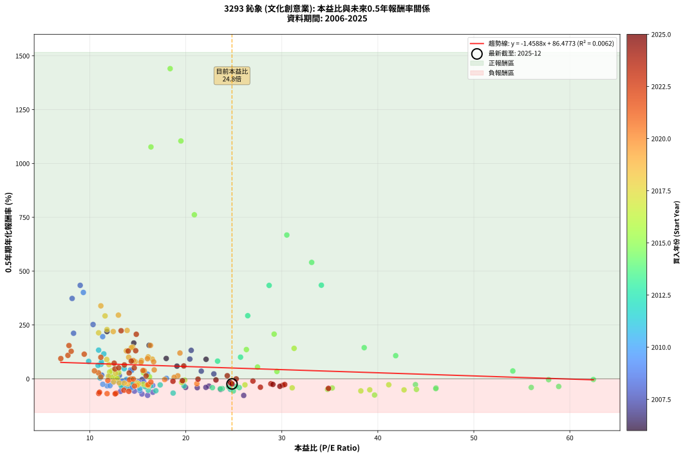
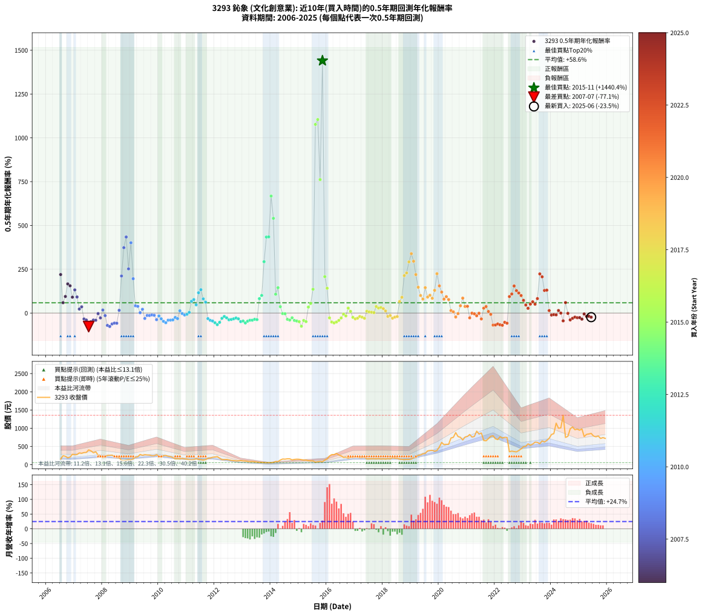

# 3293 鈊象 - 本益比與未來報酬率分析

!!! info "報告資訊"
    - **股票代號**: 3293
    - **公司名稱**: 鈊象
    - **產業別**: 文化創意業
    - **分析期間**: 2006-2025 (228 個數據點)
    - **資料來源**: Type 12 (ShowMonthlyK_ChartFlow) 月收盤價與本益比
    - **報酬率口徑**: 含現金股利 (簡化: 年度合計，假設每年7/1入帳)
    - **報告生成時間**: 2026-01-13 00:58:21 CST

## 📈 視覺化圖表

### 圖表1: 本益比 vs 未來報酬率關係

*圖表1：3293 鈊象 本益比與0.5年期未來報酬率關係 (2006-2025)*

### 圖表2: 歷年買入時點的0.5年期實際報酬率

*圖表2：3293 鈊象 歷年買入時點的0.5年期實際報酬率 (2006-2025)*

## 📍 買點訊號說明

本報告提供兩種買點提示訊號（顯示於圖表2的股價子圖中）：

### ▲ 小綠色三角形（回測驗證）
- **計算方式**: 使用全部歷史資料計算本益比第25百分位數
- **用途**: 事後驗證，顯示歷史上哪些時點確實為低估區
- **限制**: 當下無法判斷，僅供回測參考
- **特性**: 後見之明（Look-Ahead Bias）

### ▲ 小橘色三角形（即時訊號）
- **計算方式**: 使用截至當月的過去5年資料計算本益比第25百分位數
- **用途**: 實際投資決策，當時即可判斷
- **優勢**: 可操作性強，符合實務需求
- **特性**: 無後見之明，滾動窗口計算

!!! tip "如何使用兩種訊號"
    - **綠色▲** 幫助理解歷史估值機會，驗證策略有效性
    - **橘色▲** 可作為實際買進參考，但仍需搭配基本面分析
    - 兩種訊號重疊時，表示即時判斷與事後驗證一致，信心度較高
    - 僅有綠色▲時，表示當時無法判斷（需要未來資料才能確認）
    - 僅有橘色▲時，表示即時判斷為買點，但事後可能不是最佳時機

## 📊 估值分析摘要

| 指標 | 數值 |
|:---:|:---:|
| **目前本益比** (2025-06) | **24.81 倍** |
| **歷史平均本益比** | 19.09 倍 |
| **估值水準** | 🔴 相對高估 |
| **預期0.5年年化報酬率** | **+50.28%** |
| **歷史平均報酬率** | +58.63% |
| **相關係數 (R²)** | 0.0062 |
| **趨勢線斜率** | -1.4588 |

!!! abstract "核心洞察"
    目前本益比顯著高於歷史平均，預期未來報酬率可能較低

    根據歷史數據回測，3293 鈊象 在目前本益比 **24.8倍** 的估值水準下，
    預期未來0.5年年化報酬率約為 **+50.3%**。

    **重要提醒**: 本分析基於歷史數據統計，實際報酬率會受到公司基本面變化、產業趨勢、
    總體經濟環境等多重因素影響。R² = 0.01 表示本益比可解釋約 0.6% 的報酬率變異。

## 📈 歷史估值統計

### 最佳買點 (最高報酬率)

| 項目 | 數值 |
|:---:|:---:|
| 起始時間 | 2015-11 |
| 當時本益比 | 18.37 倍 |
| 起始價格 | 79.1 元 |
| 0.5年後價格 | 309.0 元 |
| **0.5年年化報酬率** | **+1440.38%** |

### 最差買點 (最低報酬率)

| 項目 | 數值 |
|:---:|:---:|
| 起始時間 | 2007-07 |
| 當時本益比 | 26.03 倍 |
| 起始價格 | 406.0 元 |
| 0.5年後價格 | 193.0 元 |
| **0.5年年化報酬率** | **-77.15%** |

## 🎯 投資啟示

### 本益比與報酬率關係

趨勢線方程式: **y = -1.4588x + 86.4773**

!!! warning "強負相關"
    本益比與未來報酬率呈現強負相關。在高本益比時期買入，未來報酬率顯著較低；
    在低本益比時期買入，未來報酬率顯著較高。**估值紀律至關重要**。

### 估值區間建議

基於歷史數據分析:

- **🟢 低估區** (P/E < 15.3): 預期報酬率較高，可考慮增加持股
- **🟡 合理區** (P/E 15.3-22.9): 預期報酬率符合長期趨勢，正常持有
- **🔴 高估區** (P/E > 22.9): 預期報酬率較低，可考慮減碼或觀望

!!! danger "風險提示"
    - 過去表現不代表未來結果
    - 本分析假設公司基本面無重大結構性變化
    - 產業環境劇變可能使歷史規律失效
    - 應結合公司財報、產業趨勢、總體經濟等多重因素綜合判斷

!!! success "長期投資觀點"
    歷史數據顯示，在合理或低估的估值水準買入並長期持有，
    往往能獲得較佳的投資報酬。**耐心等待好價格**是價值投資的核心原則。

## 📊 數據品質

- **資料來源**: GoodInfo.tw Type 12 (ShowMonthlyK_ChartFlow)
- **資料頻率**: 月度收盤價與本益比
- **回測期間**: 2006-2025
- **數據點數量**: 228 個 (每個點代表一次0.5年期回測)

### 計算方法說明

1. **0.5年期年化報酬率**:
   - 對每個歷史時點，計算其後0.5年的實際投資報酬率
   - 期末價值(不含股利): 期末價格
   - 期末價值(含現金股利): 期末價格 + 持有期間內的現金股利合計 (簡化: 年度合計，假設每年7/1入帳)
   - 公式: 年化報酬率 = [(期末價值/期初價格)^(1/年數) - 1] × 100%

2. **本益比 (P/E Ratio)**:
   - 使用當時的月收盤價與EPS計算
   - 資料來源: Type 12 月度河流圖本益比數據

3. **趨勢線 (Linear Regression)**:
   - 使用最小平方法擬合線性趨勢線
   - R²值衡量本益比對報酬率的解釋能力

---

*本報告由 Stock Analysis System v1.9.0 自動生成*
*數據更新時間: 2026-01-13 00:58:21 CST*

## 📋 月度回測明細表

（每一列對應時間線圖中的一個買入點；可用來對照 SVG 圖上的每個點。）

| 買入月份 | 賣出月份 | 回測期限_年 | 實際持有年數 | 買入本益比_倍 | 買入收盤價_元 | 賣出收盤價_元 | 現金股利合計_元 | 總報酬率_pct | 年化報酬率_pct |
| --- | --- | --- | --- | --- | --- | --- | --- | --- | --- |
| 2006-07 | 2007-01 | 0.5 | 0.504 | 11.79 | 152.00 | 273.00 | 0.00 | +79.61 | +219.77 |
| 2006-08 | 2007-03 | 0.5 | 0.580 | 19.08 | 246.00 | 322.00 | 0.00 | +30.89 | +59.02 |
| 2006-09 | 2007-03 | 0.5 | 0.496 | 17.96 | 231.50 | 322.00 | 0.00 | +39.09 | +94.62 |
| 2006-10 | 2007-05 | 0.5 | 0.580 | 14.58 | 188.00 | 332.00 | 0.00 | +76.60 | +166.39 |
| 2006-11 | 2007-05 | 0.5 | 0.496 | 16.18 | 208.50 | 332.00 | 0.00 | +59.23 | +155.68 |
| 2006-12 | 2007-07 | 0.5 | 0.580 | 22.11 | 285.00 | 406.00 | 8.50 | +45.44 | +90.67 |
| 2007-01 | 2007-07 | 0.5 | 0.496 | 20.56 | 273.00 | 406.00 | 8.50 | +51.83 | +132.26 |
| 2007-02 | 2007-08 | 0.5 | 0.498 | 20.42 | 279.00 | 377.50 | 8.50 | +38.35 | +91.84 |
| 2007-03 | 2007-10 | 0.5 | 0.586 | 22.92 | 322.00 | 355.00 | 8.50 | +12.89 | +22.99 |
| 2007-04 | 2007-10 | 0.5 | 0.501 | 21.61 | 312.00 | 355.00 | 8.50 | +16.51 | +35.65 |
| 2007-05 | 2007-12 | 0.5 | 0.586 | 22.40 | 332.00 | 252.50 | 8.50 | -21.39 | -33.68 |
| 2007-06 | 2007-12 | 0.5 | 0.501 | 22.09 | 336.00 | 252.50 | 8.50 | -22.32 | -39.60 |
| 2007-07 | 2008-01 | 0.5 | 0.504 | 26.03 | 406.00 | 193.00 | 0.00 | -52.46 | -77.15 |
| 2007-08 | 2008-03 | 0.5 | 0.583 | 23.62 | 377.50 | 254.00 | 0.00 | -32.72 | -49.31 |
| 2007-09 | 2008-03 | 0.5 | 0.498 | 19.98 | 327.00 | 254.00 | 0.00 | -22.32 | -39.77 |
| 2007-10 | 2008-05 | 0.5 | 0.583 | 21.19 | 355.00 | 261.00 | 0.00 | -26.48 | -40.99 |
| 2007-11 | 2008-05 | 0.5 | 0.498 | 15.46 | 265.00 | 261.00 | 0.00 | -1.51 | -3.01 |
| 2007-12 | 2008-07 | 0.5 | 0.583 | 14.40 | 252.50 | 198.50 | 10.45 | -17.25 | -27.72 |
| 2008-01 | 2008-07 | 0.5 | 0.498 | 11.24 | 193.00 | 198.50 | 10.45 | +8.26 | +17.28 |
| 2008-02 | 2008-08 | 0.5 | 0.501 | 13.02 | 219.00 | 192.00 | 10.45 | -7.56 | -14.52 |
| 2008-03 | 2008-10 | 0.5 | 0.586 | 15.43 | 254.00 | 114.00 | 10.45 | -51.00 | -70.41 |
| 2008-04 | 2008-10 | 0.5 | 0.501 | 16.02 | 258.00 | 114.00 | 10.45 | -51.76 | -76.66 |
| 2008-05 | 2008-12 | 0.5 | 0.586 | 16.57 | 261.00 | 137.00 | 10.45 | -43.51 | -62.27 |
| 2008-06 | 2008-12 | 0.5 | 0.501 | 14.65 | 225.50 | 137.00 | 10.45 | -34.61 | -57.17 |
| 2008-07 | 2009-01 | 0.5 | 0.504 | 13.20 | 198.50 | 128.00 | 0.00 | -35.52 | -58.15 |
| 2008-08 | 2009-03 | 0.5 | 0.580 | 13.08 | 192.00 | 209.00 | 0.00 | +8.85 | +15.74 |
| 2008-09 | 2009-03 | 0.5 | 0.496 | 8.31 | 119.00 | 209.00 | 0.00 | +75.63 | +211.60 |
| 2008-10 | 2009-05 | 0.5 | 0.580 | 8.16 | 114.00 | 281.00 | 0.00 | +146.49 | +373.18 |
| 2008-11 | 2009-05 | 0.5 | 0.496 | 9.00 | 122.50 | 281.00 | 0.00 | +129.39 | +434.09 |
| 2008-12 | 2009-07 | 0.5 | 0.580 | 10.34 | 137.00 | 274.50 | 9.99 | +107.66 | +252.17 |
| 2009-01 | 2009-07 | 0.5 | 0.496 | 9.33 | 128.00 | 274.50 | 9.99 | +122.26 | +401.13 |
| 2009-02 | 2009-08 | 0.5 | 0.498 | 11.34 | 161.00 | 266.50 | 9.99 | +71.73 | +196.03 |
| 2009-03 | 2009-10 | 0.5 | 0.586 | 14.24 | 209.00 | 246.00 | 9.99 | +22.48 | +41.36 |
| 2009-04 | 2009-10 | 0.5 | 0.501 | 14.35 | 217.50 | 246.00 | 9.99 | +17.70 | +38.44 |
| 2009-05 | 2009-12 | 0.5 | 0.586 | 17.98 | 281.00 | 274.50 | 9.99 | +1.24 | +2.13 |
| 2009-06 | 2009-12 | 0.5 | 0.501 | 16.02 | 258.00 | 274.50 | 9.99 | +10.27 | +21.54 |
| 2009-07 | 2010-01 | 0.5 | 0.504 | 16.56 | 274.50 | 228.00 | 0.00 | -16.94 | -30.82 |
| 2009-08 | 2010-03 | 0.5 | 0.580 | 15.62 | 266.50 | 245.00 | 0.00 | -8.07 | -13.49 |
| 2009-09 | 2010-03 | 0.5 | 0.496 | 15.06 | 264.00 | 245.00 | 0.00 | -7.20 | -13.99 |
| 2009-10 | 2010-05 | 0.5 | 0.580 | 13.66 | 246.00 | 230.50 | 0.00 | -6.30 | -10.61 |
| 2009-11 | 2010-05 | 0.5 | 0.496 | 13.34 | 246.50 | 230.50 | 0.00 | -6.49 | -12.67 |
| 2009-12 | 2010-07 | 0.5 | 0.580 | 14.48 | 274.50 | 197.50 | 10.99 | -24.05 | -37.74 |
| 2010-01 | 2010-07 | 0.5 | 0.496 | 12.41 | 228.00 | 197.50 | 10.99 | -8.56 | -16.52 |
| 2010-02 | 2010-08 | 0.5 | 0.498 | 11.81 | 210.00 | 161.50 | 10.99 | -17.86 | -32.62 |
| 2010-03 | 2010-10 | 0.5 | 0.586 | 14.26 | 245.00 | 158.00 | 10.99 | -31.02 | -46.95 |
| 2010-04 | 2010-10 | 0.5 | 0.501 | 15.22 | 252.50 | 158.00 | 10.99 | -33.07 | -55.13 |
| 2010-05 | 2010-12 | 0.5 | 0.586 | 14.40 | 230.50 | 159.00 | 10.99 | -26.25 | -40.53 |
| 2010-06 | 2010-12 | 0.5 | 0.501 | 14.28 | 220.00 | 159.00 | 10.99 | -22.73 | -40.23 |
| 2010-07 | 2011-01 | 0.5 | 0.504 | 13.33 | 197.50 | 154.00 | 0.00 | -22.03 | -38.97 |
| 2010-08 | 2011-03 | 0.5 | 0.580 | 11.35 | 161.50 | 136.50 | 0.00 | -15.48 | -25.16 |
| 2010-09 | 2011-03 | 0.5 | 0.496 | 12.10 | 165.00 | 136.50 | 0.00 | -17.27 | -31.79 |
| 2010-10 | 2011-05 | 0.5 | 0.580 | 12.11 | 158.00 | 169.50 | 0.00 | +7.28 | +12.87 |
| 2010-11 | 2011-05 | 0.5 | 0.496 | 13.81 | 172.00 | 169.50 | 0.00 | -1.45 | -2.91 |
| 2010-12 | 2011-07 | 0.5 | 0.580 | 13.41 | 159.00 | 139.00 | 9.50 | -6.60 | -11.10 |
| 2011-01 | 2011-07 | 0.5 | 0.496 | 12.85 | 154.00 | 139.00 | 9.50 | -3.57 | -7.08 |
| 2011-02 | 2011-08 | 0.5 | 0.498 | 11.07 | 134.00 | 127.00 | 9.50 | +1.87 | +3.78 |
| 2011-03 | 2011-10 | 0.5 | 0.586 | 11.16 | 136.50 | 175.00 | 9.50 | +35.16 | +67.25 |
| 2011-04 | 2011-10 | 0.5 | 0.501 | 11.21 | 138.50 | 175.00 | 9.50 | +33.21 | +77.25 |
| 2011-05 | 2011-12 | 0.5 | 0.586 | 13.58 | 169.50 | 203.00 | 9.50 | +25.37 | +47.09 |
| 2011-06 | 2011-12 | 0.5 | 0.501 | 11.46 | 144.50 | 203.00 | 9.50 | +47.06 | +115.92 |
| 2011-07 | 2012-01 | 0.5 | 0.504 | 10.92 | 139.00 | 213.00 | 0.00 | +53.24 | +133.32 |
| 2011-08 | 2012-03 | 0.5 | 0.583 | 9.88 | 127.00 | 179.50 | 0.00 | +41.34 | +80.99 |
| 2011-09 | 2012-03 | 0.5 | 0.498 | 10.86 | 141.00 | 179.50 | 0.00 | +27.30 | +62.33 |
| 2011-10 | 2012-05 | 0.5 | 0.583 | 13.36 | 175.00 | 140.00 | 0.00 | -20.00 | -31.79 |
| 2011-11 | 2012-05 | 0.5 | 0.498 | 13.84 | 183.00 | 140.00 | 0.00 | -23.50 | -41.58 |
| 2011-12 | 2012-07 | 0.5 | 0.583 | 15.21 | 203.00 | 131.50 | 11.00 | -29.80 | -45.49 |
| 2012-01 | 2012-07 | 0.5 | 0.498 | 16.88 | 213.00 | 131.50 | 11.00 | -33.10 | -55.37 |
| 2012-02 | 2012-08 | 0.5 | 0.501 | 18.68 | 222.00 | 118.00 | 11.00 | -41.89 | -66.16 |
| 2012-03 | 2012-10 | 0.5 | 0.586 | 16.09 | 179.50 | 104.50 | 11.00 | -35.65 | -52.88 |
| 2012-04 | 2012-10 | 0.5 | 0.501 | 13.24 | 138.00 | 104.50 | 11.00 | -16.30 | -29.90 |
| 2012-05 | 2012-12 | 0.5 | 0.586 | 14.45 | 140.00 | 112.50 | 11.00 | -11.79 | -19.27 |
| 2012-06 | 2012-12 | 0.5 | 0.501 | 16.19 | 145.00 | 112.50 | 11.00 | -14.83 | -27.41 |
| 2012-07 | 2013-01 | 0.5 | 0.504 | 15.99 | 131.50 | 103.00 | 0.00 | -21.67 | -38.42 |
| 2012-08 | 2013-03 | 0.5 | 0.580 | 15.75 | 118.00 | 90.80 | 0.00 | -23.05 | -36.33 |
| 2012-09 | 2013-03 | 0.5 | 0.496 | 16.34 | 110.50 | 90.80 | 0.00 | -17.83 | -32.72 |
| 2012-10 | 2013-05 | 0.5 | 0.580 | 17.33 | 104.50 | 86.20 | 0.00 | -17.51 | -28.23 |
| 2012-11 | 2013-05 | 0.5 | 0.496 | 19.82 | 105.00 | 86.20 | 0.00 | -17.90 | -32.84 |
| 2012-12 | 2013-07 | 0.5 | 0.580 | 24.64 | 112.50 | 70.80 | 5.50 | -32.18 | -48.78 |
| 2013-01 | 2013-07 | 0.5 | 0.496 | 23.80 | 103.00 | 70.80 | 5.50 | -25.92 | -45.42 |
| 2013-02 | 2013-08 | 0.5 | 0.498 | 24.95 | 102.00 | 61.90 | 5.50 | -33.92 | -56.46 |
| 2013-03 | 2013-10 | 0.5 | 0.586 | 23.59 | 90.80 | 57.60 | 5.50 | -30.51 | -46.27 |
| 2013-04 | 2013-10 | 0.5 | 0.501 | 22.77 | 82.20 | 57.60 | 5.50 | -23.24 | -41.01 |
| 2013-05 | 2013-12 | 0.5 | 0.586 | 25.57 | 86.20 | 58.00 | 5.50 | -26.33 | -40.65 |
| 2013-06 | 2013-12 | 0.5 | 0.501 | 25.25 | 79.10 | 58.00 | 5.50 | -19.72 | -35.50 |
| 2013-07 | 2014-01 | 0.5 | 0.504 | 24.46 | 70.80 | 55.90 | 0.00 | -21.05 | -37.44 |
| 2013-08 | 2014-03 | 0.5 | 0.580 | 23.31 | 61.90 | 87.70 | 0.00 | +41.68 | +82.26 |
| 2013-09 | 2014-03 | 0.5 | 0.496 | 25.70 | 62.10 | 87.70 | 0.00 | +41.22 | +100.68 |
| 2013-10 | 2014-05 | 0.5 | 0.580 | 26.45 | 57.60 | 127.50 | 0.00 | +121.35 | +293.14 |
| 2013-11 | 2014-05 | 0.5 | 0.496 | 28.68 | 55.60 | 127.50 | 0.00 | +129.32 | +433.76 |
| 2013-12 | 2014-07 | 0.5 | 0.580 | 34.12 | 58.00 | 151.50 | 2.00 | +164.65 | +434.81 |
| 2014-01 | 2014-07 | 0.5 | 0.496 | 30.52 | 55.90 | 151.50 | 2.00 | +174.59 | +667.79 |
| 2014-02 | 2014-08 | 0.5 | 0.498 | 33.11 | 65.00 | 162.00 | 2.00 | +152.30 | +540.61 |
| 2014-03 | 2014-10 | 0.5 | 0.586 | 41.86 | 87.70 | 132.50 | 2.00 | +53.36 | +107.47 |
| 2014-04 | 2014-10 | 0.5 | 0.501 | 38.58 | 85.90 | 132.50 | 2.00 | +56.57 | +144.70 |
| 2014-05 | 2014-12 | 0.5 | 0.586 | 54.06 | 127.50 | 151.00 | 2.00 | +20.00 | +36.50 |
| 2014-06 | 2014-12 | 0.5 | 0.501 | 62.45 | 155.50 | 151.00 | 2.00 | -1.61 | -3.19 |
| 2014-07 | 2015-01 | 0.5 | 0.504 | 57.79 | 151.50 | 148.50 | 0.00 | -1.98 | -3.89 |
| 2014-08 | 2015-03 | 0.5 | 0.580 | 58.84 | 162.00 | 125.50 | 0.00 | -22.53 | -35.59 |
| 2014-09 | 2015-03 | 0.5 | 0.496 | 55.98 | 161.50 | 125.50 | 0.00 | -22.29 | -39.89 |
| 2014-10 | 2015-05 | 0.5 | 0.580 | 43.92 | 132.50 | 110.50 | 0.00 | -16.60 | -26.86 |
| 2014-11 | 2015-05 | 0.5 | 0.496 | 46.06 | 145.00 | 110.50 | 0.00 | -23.79 | -42.21 |
| 2014-12 | 2015-07 | 0.5 | 0.580 | 46.04 | 151.00 | 103.50 | 2.80 | -29.60 | -45.38 |
| 2015-01 | 2015-07 | 0.5 | 0.496 | 44.02 | 148.50 | 103.50 | 2.80 | -28.42 | -49.07 |
| 2015-02 | 2015-08 | 0.5 | 0.498 | 39.66 | 137.50 | 65.90 | 2.80 | -50.04 | -75.16 |
| 2015-03 | 2015-10 | 0.5 | 0.586 | 35.25 | 125.50 | 88.00 | 2.80 | -27.65 | -42.44 |
| 2015-04 | 2015-10 | 0.5 | 0.501 | 34.76 | 127.00 | 88.00 | 2.80 | -28.50 | -48.81 |
| 2015-05 | 2015-12 | 0.5 | 0.586 | 29.49 | 110.50 | 128.50 | 2.80 | +18.82 | +34.23 |
| 2015-06 | 2015-12 | 0.5 | 0.501 | 27.47 | 105.50 | 128.50 | 2.80 | +24.45 | +54.75 |
| 2015-07 | 2016-01 | 0.5 | 0.504 | 26.31 | 103.50 | 159.50 | 0.00 | +54.11 | +135.96 |
| 2015-08 | 2016-03 | 0.5 | 0.583 | 16.37 | 65.90 | 277.50 | 0.00 | +321.09 | +1076.73 |
| 2015-09 | 2016-03 | 0.5 | 0.498 | 19.49 | 80.30 | 277.50 | 0.00 | +245.58 | +1104.46 |
| 2015-10 | 2016-05 | 0.5 | 0.583 | 20.89 | 88.00 | 309.00 | 0.00 | +251.14 | +761.74 |
| 2015-11 | 2016-05 | 0.5 | 0.498 | 18.37 | 79.10 | 309.00 | 0.00 | +290.64 | +1440.38 |
| 2015-12 | 2016-07 | 0.5 | 0.583 | 29.20 | 128.50 | 243.00 | 4.50 | +92.61 | +207.72 |
| 2016-01 | 2016-07 | 0.5 | 0.498 | 31.28 | 159.50 | 243.00 | 4.50 | +55.17 | +141.51 |
| 2016-02 | 2016-08 | 0.5 | 0.501 | 41.14 | 238.50 | 198.50 | 4.50 | -14.88 | -27.51 |
| 2016-03 | 2016-10 | 0.5 | 0.586 | 42.73 | 277.50 | 177.50 | 4.50 | -34.41 | -51.32 |
| 2016-04 | 2016-10 | 0.5 | 0.501 | 38.23 | 275.00 | 177.50 | 4.50 | -33.82 | -56.13 |
| 2016-05 | 2016-12 | 0.5 | 0.586 | 39.16 | 309.00 | 199.00 | 4.50 | -34.14 | -50.98 |
| 2016-06 | 2016-12 | 0.5 | 0.501 | 31.08 | 267.00 | 199.00 | 4.50 | -23.78 | -41.84 |
| 2016-07 | 2017-01 | 0.5 | 0.504 | 26.16 | 243.00 | 206.00 | 0.00 | -15.23 | -27.96 |
| 2016-08 | 2017-03 | 0.5 | 0.580 | 19.88 | 198.50 | 191.50 | 0.00 | -3.53 | -6.00 |
| 2016-09 | 2017-03 | 0.5 | 0.496 | 19.56 | 209.00 | 191.50 | 0.00 | -8.37 | -16.18 |
| 2016-10 | 2017-05 | 0.5 | 0.580 | 15.59 | 177.50 | 205.00 | 0.00 | +15.49 | +28.17 |
| 2016-11 | 2017-05 | 0.5 | 0.496 | 16.22 | 196.00 | 205.00 | 0.00 | +4.59 | +9.48 |
| 2016-12 | 2017-07 | 0.5 | 0.580 | 15.57 | 199.00 | 159.00 | 10.00 | -15.08 | -24.54 |
| 2017-01 | 2017-07 | 0.5 | 0.496 | 16.10 | 206.00 | 159.00 | 10.00 | -17.96 | -32.94 |
| 2017-02 | 2017-08 | 0.5 | 0.498 | 16.08 | 206.00 | 163.50 | 10.00 | -15.78 | -29.15 |
| 2017-03 | 2017-10 | 0.5 | 0.586 | 14.93 | 191.50 | 159.00 | 10.00 | -11.75 | -19.21 |
| 2017-04 | 2017-10 | 0.5 | 0.501 | 15.07 | 193.50 | 159.00 | 10.00 | -12.66 | -23.68 |
| 2017-05 | 2017-12 | 0.5 | 0.586 | 15.94 | 205.00 | 156.50 | 10.00 | -18.78 | -29.89 |
| 2017-06 | 2017-12 | 0.5 | 0.501 | 12.31 | 158.50 | 156.50 | 10.00 | +5.05 | +10.33 |
| 2017-07 | 2018-01 | 0.5 | 0.504 | 12.33 | 159.00 | 164.00 | 0.00 | +3.14 | +6.34 |
| 2017-08 | 2018-03 | 0.5 | 0.580 | 12.67 | 163.50 | 168.00 | 0.00 | +2.75 | +4.79 |
| 2017-09 | 2018-03 | 0.5 | 0.496 | 12.85 | 166.00 | 168.00 | 0.00 | +1.20 | +2.45 |
| 2017-10 | 2018-05 | 0.5 | 0.580 | 12.29 | 159.00 | 191.00 | 0.00 | +20.13 | +37.15 |
| 2017-11 | 2018-05 | 0.5 | 0.496 | 13.01 | 168.50 | 191.00 | 0.00 | +13.35 | +28.78 |
| 2017-12 | 2018-07 | 0.5 | 0.580 | 12.07 | 156.50 | 172.50 | 11.00 | +17.25 | +31.55 |
| 2018-01 | 2018-07 | 0.5 | 0.496 | 12.68 | 164.00 | 172.50 | 11.00 | +11.89 | +25.45 |
| 2018-02 | 2018-08 | 0.5 | 0.498 | 11.94 | 154.00 | 152.00 | 11.00 | +5.84 | +12.07 |
| 2018-03 | 2018-10 | 0.5 | 0.586 | 13.07 | 168.00 | 137.50 | 11.00 | -11.61 | -18.99 |
| 2018-04 | 2018-10 | 0.5 | 0.501 | 12.48 | 160.00 | 137.50 | 11.00 | -7.19 | -13.83 |
| 2018-05 | 2018-12 | 0.5 | 0.586 | 14.95 | 191.00 | 145.00 | 11.00 | -18.32 | -29.21 |
| 2018-06 | 2018-12 | 0.5 | 0.501 | 13.97 | 178.00 | 145.00 | 11.00 | -12.36 | -23.15 |
| 2018-07 | 2019-01 | 0.5 | 0.504 | 13.58 | 172.50 | 154.00 | 0.00 | -10.72 | -20.16 |
| 2018-08 | 2019-03 | 0.5 | 0.580 | 12.00 | 152.00 | 204.00 | 0.00 | +34.21 | +66.02 |
| 2018-09 | 2019-03 | 0.5 | 0.496 | 11.76 | 148.50 | 204.00 | 0.00 | +37.37 | +89.79 |
| 2018-10 | 2019-05 | 0.5 | 0.580 | 10.92 | 137.50 | 267.00 | 0.00 | +94.18 | +213.72 |
| 2018-11 | 2019-05 | 0.5 | 0.496 | 11.79 | 148.00 | 267.00 | 0.00 | +80.41 | +228.93 |
| 2018-12 | 2019-07 | 0.5 | 0.580 | 11.59 | 145.00 | 309.50 | 11.00 | +121.03 | +292.16 |
| 2019-01 | 2019-07 | 0.5 | 0.496 | 11.15 | 154.00 | 309.50 | 11.00 | +108.12 | +338.86 |
| 2019-02 | 2019-08 | 0.5 | 0.498 | 12.98 | 196.00 | 378.00 | 11.00 | +98.47 | +295.76 |
| 2019-03 | 2019-10 | 0.5 | 0.586 | 12.44 | 204.00 | 392.00 | 11.00 | +97.55 | +219.63 |
| 2019-04 | 2019-10 | 0.5 | 0.501 | 14.46 | 256.00 | 392.00 | 11.00 | +57.42 | +147.36 |
| 2019-05 | 2019-12 | 0.5 | 0.586 | 14.05 | 267.00 | 390.00 | 11.00 | +50.19 | +100.20 |
| 2019-06 | 2019-12 | 0.5 | 0.501 | 14.73 | 299.00 | 390.00 | 11.00 | +34.11 | +79.65 |
| 2019-07 | 2020-01 | 0.5 | 0.504 | 14.33 | 309.50 | 486.00 | 0.00 | +57.03 | +144.92 |
| 2019-08 | 2020-03 | 0.5 | 0.583 | 16.51 | 378.00 | 552.00 | 0.00 | +46.03 | +91.42 |
| 2019-09 | 2020-03 | 0.5 | 0.498 | 16.08 | 389.00 | 552.00 | 0.00 | +41.90 | +101.85 |
| 2019-10 | 2020-05 | 0.5 | 0.583 | 15.38 | 392.00 | 560.00 | 0.00 | +42.86 | +84.34 |
| 2019-11 | 2020-05 | 0.5 | 0.498 | 13.81 | 370.00 | 560.00 | 0.00 | +51.35 | +129.73 |
| 2019-12 | 2020-07 | 0.5 | 0.583 | 13.89 | 390.00 | 750.00 | 25.00 | +98.72 | +224.65 |
| 2020-01 | 2020-07 | 0.5 | 0.498 | 16.32 | 486.00 | 750.00 | 25.00 | +59.47 | +155.11 |
| 2020-02 | 2020-08 | 0.5 | 0.501 | 19.39 | 610.00 | 880.00 | 25.00 | +48.36 | +119.75 |
| 2020-03 | 2020-10 | 0.5 | 0.586 | 16.65 | 552.00 | 752.00 | 25.00 | +40.76 | +79.24 |
| 2020-04 | 2020-10 | 0.5 | 0.501 | 16.01 | 558.00 | 752.00 | 25.00 | +39.25 | +93.64 |
| 2020-05 | 2020-12 | 0.5 | 0.586 | 15.33 | 560.00 | 758.00 | 25.00 | +39.82 | +77.20 |
| 2020-06 | 2020-12 | 0.5 | 0.501 | 19.17 | 733.00 | 758.00 | 25.00 | +6.82 | +14.08 |
| 2020-07 | 2021-01 | 0.5 | 0.504 | 18.79 | 750.00 | 776.00 | 0.00 | +3.47 | +7.00 |
| 2020-08 | 2021-03 | 0.5 | 0.580 | 21.15 | 880.00 | 759.00 | 0.00 | -13.75 | -22.50 |
| 2020-09 | 2021-03 | 0.5 | 0.496 | 17.80 | 771.00 | 759.00 | 0.00 | -1.56 | -3.12 |
| 2020-10 | 2021-05 | 0.5 | 0.580 | 16.71 | 752.00 | 920.00 | 0.00 | +22.34 | +41.54 |
| 2020-11 | 2021-05 | 0.5 | 0.496 | 14.52 | 678.00 | 920.00 | 0.00 | +35.69 | +85.14 |
| 2020-12 | 2021-07 | 0.5 | 0.580 | 15.67 | 758.00 | 870.00 | 42.00 | +20.32 | +37.53 |
| 2021-01 | 2021-07 | 0.5 | 0.496 | 15.54 | 776.00 | 870.00 | 42.00 | +17.53 | +38.52 |
| 2021-02 | 2021-08 | 0.5 | 0.498 | 16.07 | 828.00 | 664.00 | 42.00 | -14.73 | -27.38 |
| 2021-03 | 2021-10 | 0.5 | 0.586 | 14.30 | 759.00 | 714.00 | 42.00 | -0.40 | -0.67 |
| 2021-04 | 2021-10 | 0.5 | 0.501 | 14.14 | 773.00 | 714.00 | 42.00 | -2.20 | -4.34 |
| 2021-05 | 2021-12 | 0.5 | 0.586 | 16.36 | 920.00 | 793.00 | 42.00 | -9.24 | -15.25 |
| 2021-06 | 2021-12 | 0.5 | 0.501 | 14.53 | 840.00 | 793.00 | 42.00 | -0.60 | -1.18 |
| 2021-07 | 2022-01 | 0.5 | 0.504 | 14.66 | 870.00 | 709.00 | 0.00 | -18.51 | -33.38 |
| 2021-08 | 2022-03 | 0.5 | 0.580 | 10.90 | 664.00 | 766.00 | 0.00 | +15.36 | +27.92 |
| 2021-09 | 2022-03 | 0.5 | 0.496 | 10.48 | 655.00 | 766.00 | 0.00 | +16.95 | +37.15 |
| 2021-10 | 2022-05 | 0.5 | 0.580 | 11.14 | 714.00 | 751.00 | 0.00 | +5.18 | +9.09 |
| 2021-11 | 2022-05 | 0.5 | 0.496 | 11.88 | 780.00 | 751.00 | 0.00 | -3.72 | -7.36 |
| 2021-12 | 2022-07 | 0.5 | 0.580 | 11.80 | 793.00 | 354.00 | 50.00 | -49.05 | -68.71 |
| 2022-01 | 2022-07 | 0.5 | 0.496 | 10.93 | 709.00 | 354.00 | 50.00 | -43.02 | -67.86 |
| 2022-02 | 2022-08 | 0.5 | 0.498 | 11.01 | 688.00 | 373.00 | 50.00 | -38.52 | -62.33 |
| 2022-03 | 2022-10 | 0.5 | 0.586 | 12.74 | 766.00 | 351.50 | 50.00 | -47.58 | -66.80 |
| 2022-04 | 2022-10 | 0.5 | 0.501 | 12.64 | 730.00 | 351.50 | 50.00 | -45.00 | -69.68 |
| 2022-05 | 2022-12 | 0.5 | 0.586 | 13.55 | 751.00 | 433.50 | 50.00 | -35.62 | -52.84 |
| 2022-06 | 2022-12 | 0.5 | 0.501 | 14.06 | 746.00 | 433.50 | 50.00 | -35.19 | -57.92 |
| 2022-07 | 2023-01 | 0.5 | 0.504 | 6.98 | 354.00 | 494.50 | 0.00 | +39.69 | +94.16 |
| 2022-08 | 2023-03 | 0.5 | 0.580 | 7.72 | 373.00 | 572.00 | 0.00 | +53.35 | +108.89 |
| 2022-09 | 2023-03 | 0.5 | 0.496 | 7.83 | 360.00 | 572.00 | 0.00 | +58.89 | +154.56 |
| 2022-10 | 2023-05 | 0.5 | 0.580 | 8.06 | 351.50 | 567.00 | 0.00 | +61.31 | +127.91 |
| 2022-11 | 2023-05 | 0.5 | 0.496 | 9.42 | 388.50 | 567.00 | 0.00 | +45.95 | +114.45 |
| 2022-12 | 2023-07 | 0.5 | 0.580 | 11.15 | 433.50 | 613.00 | 35.00 | +49.48 | +99.89 |
| 2023-01 | 2023-07 | 0.5 | 0.496 | 12.54 | 494.50 | 613.00 | 35.00 | +31.04 | +72.55 |
| 2023-02 | 2023-08 | 0.5 | 0.498 | 12.62 | 505.00 | 575.00 | 35.00 | +20.79 | +46.10 |
| 2023-03 | 2023-10 | 0.5 | 0.586 | 14.10 | 572.00 | 623.00 | 35.00 | +15.03 | +27.01 |
| 2023-04 | 2023-10 | 0.5 | 0.501 | 13.01 | 535.00 | 623.00 | 35.00 | +22.99 | +51.14 |
| 2023-05 | 2023-12 | 0.5 | 0.586 | 13.60 | 567.00 | 724.00 | 35.00 | +33.86 | +64.50 |
| 2023-06 | 2023-12 | 0.5 | 0.501 | 14.63 | 618.00 | 724.00 | 35.00 | +22.82 | +50.71 |
| 2023-07 | 2024-01 | 0.5 | 0.504 | 14.32 | 613.00 | 830.00 | 0.00 | +35.40 | +82.50 |
| 2023-08 | 2024-03 | 0.5 | 0.583 | 13.26 | 575.00 | 1140.00 | 0.00 | +98.26 | +223.37 |
| 2023-09 | 2024-03 | 0.5 | 0.498 | 14.84 | 652.00 | 1140.00 | 0.00 | +74.85 | +206.89 |
| 2023-10 | 2024-05 | 0.5 | 0.583 | 14.00 | 623.00 | 1010.00 | 0.00 | +62.12 | +128.99 |
| 2023-11 | 2024-05 | 0.5 | 0.498 | 14.78 | 666.00 | 1010.00 | 0.00 | +51.65 | +130.64 |
| 2023-12 | 2024-07 | 0.5 | 0.583 | 15.87 | 724.00 | 747.00 | 35.00 | +8.01 | +14.13 |
| 2024-01 | 2024-07 | 0.5 | 0.498 | 18.66 | 830.00 | 747.00 | 35.00 | -5.78 | -11.27 |
| 2024-02 | 2024-08 | 0.5 | 0.501 | 19.65 | 852.00 | 779.00 | 35.00 | -4.46 | -8.70 |
| 2024-03 | 2024-10 | 0.5 | 0.586 | 26.99 | 1140.00 | 1035.00 | 35.00 | -6.14 | -10.25 |
| 2024-04 | 2024-10 | 0.5 | 0.501 | 24.32 | 1000.00 | 1035.00 | 35.00 | +7.00 | +14.46 |
| 2024-05 | 2024-12 | 0.5 | 0.586 | 25.25 | 1010.00 | 974.00 | 35.00 | -0.10 | -0.17 |
| 2024-06 | 2024-12 | 0.5 | 0.501 | 34.86 | 1355.00 | 974.00 | 35.00 | -25.54 | -44.48 |
| 2024-07 | 2025-01 | 0.5 | 0.504 | 19.79 | 747.00 | 946.00 | 0.00 | +26.64 | +59.81 |
| 2024-08 | 2025-03 | 0.5 | 0.580 | 21.27 | 779.00 | 772.00 | 0.00 | -0.90 | -1.54 |
| 2024-09 | 2025-03 | 0.5 | 0.496 | 27.77 | 986.00 | 772.00 | 0.00 | -21.70 | -38.97 |
| 2024-10 | 2025-05 | 0.5 | 0.580 | 30.10 | 1035.00 | 843.00 | 0.00 | -18.55 | -29.78 |
| 2024-11 | 2025-05 | 0.5 | 0.496 | 28.86 | 960.00 | 843.00 | 0.00 | -12.19 | -23.07 |
| 2024-12 | 2025-07 | 0.5 | 0.580 | 30.30 | 974.00 | 786.00 | 29.00 | -16.32 | -26.44 |
| 2025-01 | 2025-07 | 0.5 | 0.496 | 29.07 | 946.00 | 786.00 | 29.00 | -13.85 | -25.98 |
| 2025-02 | 2025-08 | 0.5 | 0.498 | 29.80 | 982.00 | 765.00 | 29.00 | -19.14 | -34.72 |
| 2025-03 | 2025-10 | 0.5 | 0.586 | 23.14 | 772.00 | 720.00 | 29.00 | -2.98 | -5.03 |
| 2025-04 | 2025-10 | 0.5 | 0.501 | 24.64 | 832.00 | 720.00 | 29.00 | -9.98 | -18.92 |
| 2025-05 | 2025-12 | 0.5 | 0.586 | 24.67 | 843.00 | 721.00 | 29.00 | -11.03 | -18.09 |
| 2025-06 | 2025-12 | 0.5 | 0.501 | 24.81 | 858.00 | 721.00 | 29.00 | -12.59 | -23.55 |
