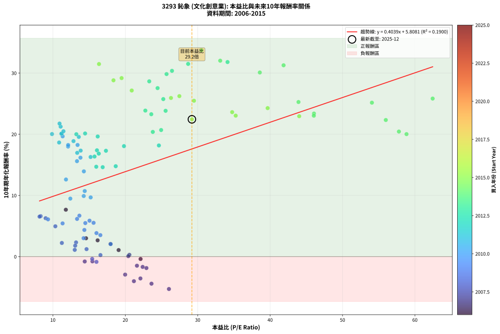
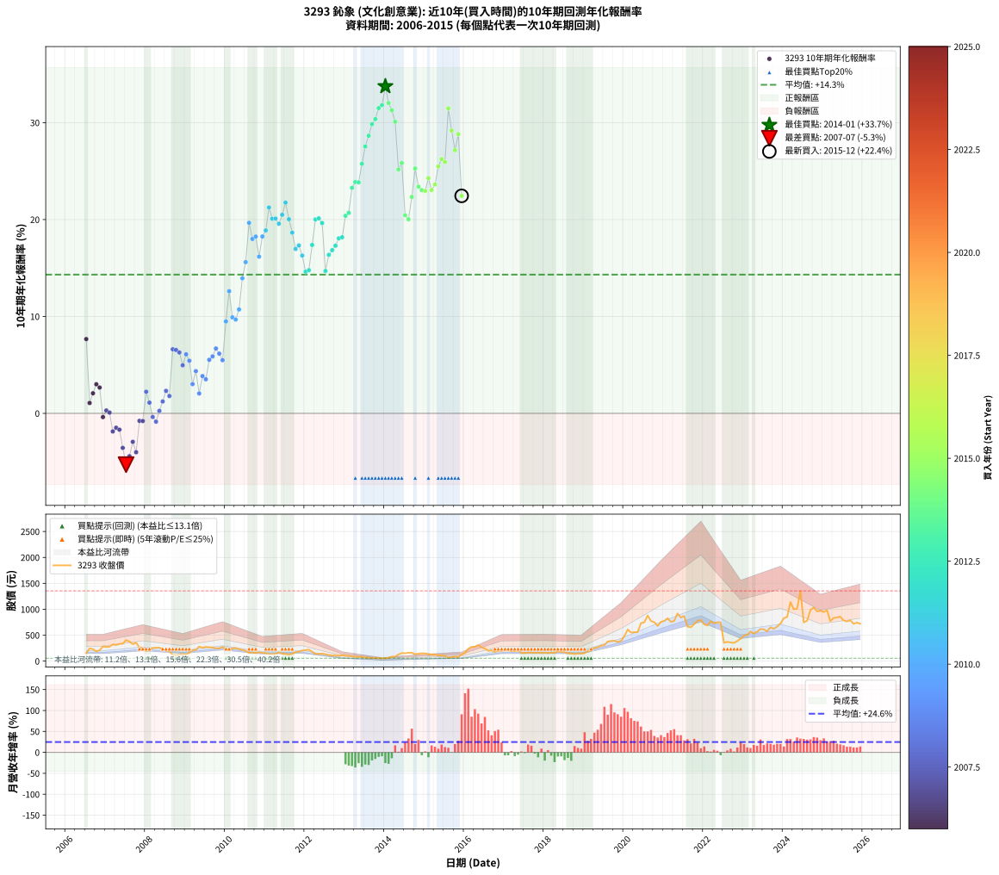

# 3293 鈊象 - 本益比與未來報酬率分析

!!! info "報告資訊"
    - **股票代號**: 3293
    - **公司名稱**: 鈊象
    - **產業別**: 文化創意業
    - **分析期間**: 2006-2015 (114 個數據點)
    - **資料來源**: Type 12 (ShowMonthlyK_ChartFlow) 月收盤價與本益比
    - **報酬率口徑**: 含現金股利 (簡化: 年度合計，假設每年7/1入帳)
    - **報告生成時間**: 2026-01-10 22:53:52 CST

## 📈 視覺化圖表

### 圖表1: 本益比 vs 未來報酬率關係

*圖表1：3293 鈊象 本益比與10年期未來報酬率關係 (2006-2015)*

### 圖表2: 歷年買入時點的10年期實際報酬率

*圖表2：3293 鈊象 歷年買入時點的10年期實際報酬率 (2006-2015)*

## 📍 買點訊號說明

本報告提供兩種買點提示訊號（顯示於圖表2的股價子圖中）：

### ▲ 小綠色三角形（回測驗證）
- **計算方式**: 使用全部歷史資料計算本益比第25百分位數
- **用途**: 事後驗證，顯示歷史上哪些時點確實為低估區
- **限制**: 當下無法判斷，僅供回測參考
- **特性**: 後見之明（Look-Ahead Bias）

### ▲ 小橘色三角形（即時訊號）
- **計算方式**: 使用截至當月的過去5年資料計算本益比第25百分位數
- **用途**: 實際投資決策，當時即可判斷
- **優勢**: 可操作性強，符合實務需求
- **特性**: 無後見之明，滾動窗口計算

!!! tip "如何使用兩種訊號"
    - **綠色▲** 幫助理解歷史估值機會，驗證策略有效性
    - **橘色▲** 可作為實際買進參考，但仍需搭配基本面分析
    - 兩種訊號重疊時，表示即時判斷與事後驗證一致，信心度較高
    - 僅有綠色▲時，表示當時無法判斷（需要未來資料才能確認）
    - 僅有橘色▲時，表示即時判斷為買點，但事後可能不是最佳時機

## 📊 估值分析摘要

| 指標 | 數值 |
|:---:|:---:|
| **目前本益比** (2015-12) | **29.20 倍** |
| **歷史平均本益比** | 21.07 倍 |
| **估值水準** | 🔴 相對高估 |
| **預期10年年化報酬率** | **+17.60%** |
| **歷史平均報酬率** | +14.32% |
| **相關係數 (R²)** | 0.1900 |
| **趨勢線斜率** | 0.4039 |

!!! abstract "核心洞察"
    目前本益比顯著高於歷史平均，預期未來報酬率可能較低

    根據歷史數據回測，3293 鈊象 在目前本益比 **29.2倍** 的估值水準下，
    預期未來10年年化報酬率約為 **+17.6%**。

    **重要提醒**: 本分析基於歷史數據統計，實際報酬率會受到公司基本面變化、產業趨勢、
    總體經濟環境等多重因素影響。R² = 0.19 表示本益比可解釋約 19.0% 的報酬率變異。

## 📈 歷史估值統計

### 最佳買點 (最高報酬率)

| 項目 | 數值 |
|:---:|:---:|
| 起始時間 | 2014-01 |
| 當時本益比 | 30.52 倍 |
| 起始價格 | 55.9 元 |
| 10年後價格 | 830.0 元 |
| **10年年化報酬率** | **+33.74%** |

### 最差買點 (最低報酬率)

| 項目 | 數值 |
|:---:|:---:|
| 起始時間 | 2007-07 |
| 當時本益比 | 26.03 倍 |
| 起始價格 | 406.0 元 |
| 10年後價格 | 159.0 元 |
| **10年年化報酬率** | **-5.29%** |

## 🎯 投資啟示

### 本益比與報酬率關係

趨勢線方程式: **y = 0.4039x + 5.8081**

!!! info "弱相關或正相關"
    本益比與未來報酬率相關性較弱。這可能表示該股票的報酬率更多受到
    公司成長性、產業趨勢等因素影響，而非估值水準。**需綜合考量多項指標**。

### 估值區間建議

基於歷史數據分析:

- **🟢 低估區** (P/E < 16.9): 預期報酬率較高，可考慮增加持股
- **🟡 合理區** (P/E 16.9-25.3): 預期報酬率符合長期趨勢，正常持有
- **🔴 高估區** (P/E > 25.3): 預期報酬率較低，可考慮減碼或觀望

!!! danger "風險提示"
    - 過去表現不代表未來結果
    - 本分析假設公司基本面無重大結構性變化
    - 產業環境劇變可能使歷史規律失效
    - 應結合公司財報、產業趨勢、總體經濟等多重因素綜合判斷

!!! success "長期投資觀點"
    歷史數據顯示，在合理或低估的估值水準買入並長期持有，
    往往能獲得較佳的投資報酬。**耐心等待好價格**是價值投資的核心原則。

## 📊 數據品質

- **資料來源**: GoodInfo.tw Type 12 (ShowMonthlyK_ChartFlow)
- **資料頻率**: 月度收盤價與本益比
- **回測期間**: 2006-2015
- **數據點數量**: 114 個 (每個點代表一次10年期回測)

### 計算方法說明

1. **10年期年化報酬率**:
   - 對每個歷史時點，計算其後10年的實際投資報酬率
   - 期末價值(不含股利): 期末價格
   - 期末價值(含現金股利): 期末價格 + 持有期間內的現金股利合計 (簡化: 年度合計，假設每年7/1入帳)
   - 公式: 年化報酬率 = [(期末價值/期初價格)^(1/年數) - 1] × 100%

2. **本益比 (P/E Ratio)**:
   - 使用當時的月收盤價與EPS計算
   - 資料來源: Type 12 月度河流圖本益比數據

3. **趨勢線 (Linear Regression)**:
   - 使用最小平方法擬合線性趨勢線
   - R²值衡量本益比對報酬率的解釋能力

---

*本報告由 Stock Analysis System v1.9.0 自動生成*
*數據更新時間: 2026-01-10 22:53:52 CST*

## 📋 月度回測明細表

（每一列對應時間線圖中的一個買入點；可用來對照 SVG 圖上的每個點。）

| 買入月份 | 賣出月份 | 回測期限_年 | 實際持有年數 | 買入本益比_倍 | 買入收盤價_元 | 賣出收盤價_元 | 現金股利合計_元 | 總報酬率_pct | 年化報酬率_pct |
| --- | --- | --- | --- | --- | --- | --- | --- | --- | --- |
| 2006-07 | 2016-07 | 10 | 10.001 | 11.79 | 152.00 | 243.00 | 75.23 | +109.36 | +7.67 |
| 2006-08 | 2016-08 | 10 | 10.001 | 19.08 | 246.00 | 198.50 | 75.23 | +11.27 | +1.07 |
| 2006-09 | 2016-09 | 10 | 10.001 | 17.96 | 231.50 | 209.00 | 75.23 | +22.78 | +2.07 |
| 2006-10 | 2016-10 | 10 | 10.001 | 14.58 | 188.00 | 177.50 | 75.23 | +34.43 | +3.00 |
| 2006-11 | 2016-11 | 10 | 10.001 | 16.18 | 208.50 | 196.00 | 75.23 | +30.09 | +2.66 |
| 2006-12 | 2016-12 | 10 | 10.001 | 22.11 | 285.00 | 199.00 | 75.23 | -3.78 | -0.38 |
| 2007-01 | 2017-01 | 10 | 10.001 | 20.56 | 273.00 | 206.00 | 75.23 | +3.01 | +0.30 |
| 2007-02 | 2017-02 | 10 | 10.001 | 20.42 | 279.00 | 206.00 | 75.23 | +0.80 | +0.08 |
| 2007-03 | 2017-03 | 10 | 10.001 | 22.92 | 322.00 | 191.50 | 75.23 | -17.17 | -1.87 |
| 2007-04 | 2017-04 | 10 | 10.001 | 21.61 | 312.00 | 193.50 | 75.23 | -13.87 | -1.48 |
| 2007-05 | 2017-05 | 10 | 10.001 | 22.40 | 332.00 | 205.00 | 75.23 | -15.59 | -1.68 |
| 2007-06 | 2017-06 | 10 | 10.001 | 22.09 | 336.00 | 158.50 | 75.23 | -30.44 | -3.56 |
| 2007-07 | 2017-07 | 10 | 10.001 | 26.03 | 406.00 | 159.00 | 76.73 | -41.94 | -5.29 |
| 2007-08 | 2017-08 | 10 | 10.001 | 23.62 | 377.50 | 163.50 | 76.73 | -36.36 | -4.42 |
| 2007-09 | 2017-09 | 10 | 10.001 | 19.98 | 327.00 | 166.00 | 76.73 | -25.77 | -2.94 |
| 2007-10 | 2017-10 | 10 | 10.001 | 21.19 | 355.00 | 159.00 | 76.73 | -33.60 | -4.01 |
| 2007-11 | 2017-11 | 10 | 10.001 | 15.46 | 265.00 | 168.50 | 76.73 | -7.46 | -0.77 |
| 2007-12 | 2017-12 | 10 | 10.001 | 14.40 | 252.50 | 156.50 | 76.73 | -7.63 | -0.79 |
| 2008-01 | 2018-01 | 10 | 10.001 | 11.24 | 193.00 | 164.00 | 76.73 | +24.73 | +2.23 |
| 2008-02 | 2018-03 | 10 | 10.081 | 13.02 | 219.00 | 168.00 | 76.73 | +11.75 | +1.11 |
| 2008-03 | 2018-03 | 10 | 9.999 | 15.43 | 254.00 | 168.00 | 76.73 | -3.65 | -0.37 |
| 2008-04 | 2018-04 | 10 | 9.999 | 16.02 | 258.00 | 160.00 | 76.73 | -8.24 | -0.86 |
| 2008-05 | 2018-05 | 10 | 9.999 | 16.57 | 261.00 | 191.00 | 76.73 | +2.58 | +0.25 |
| 2008-06 | 2018-06 | 10 | 9.999 | 14.65 | 225.50 | 178.00 | 76.73 | +12.96 | +1.23 |
| 2008-07 | 2018-07 | 10 | 9.999 | 13.20 | 198.50 | 172.50 | 77.28 | +25.83 | +2.32 |
| 2008-08 | 2018-08 | 10 | 9.999 | 13.08 | 192.00 | 152.00 | 77.28 | +19.42 | +1.79 |
| 2008-09 | 2018-09 | 10 | 9.999 | 8.31 | 119.00 | 148.50 | 77.28 | +89.73 | +6.61 |
| 2008-10 | 2018-10 | 10 | 9.999 | 8.16 | 114.00 | 137.50 | 77.28 | +88.40 | +6.54 |
| 2008-11 | 2018-11 | 10 | 9.999 | 9.00 | 122.50 | 148.00 | 77.28 | +83.90 | +6.28 |
| 2008-12 | 2018-12 | 10 | 9.999 | 10.34 | 137.00 | 145.00 | 77.28 | +62.25 | +4.96 |
| 2009-01 | 2019-01 | 10 | 9.999 | 9.33 | 128.00 | 154.00 | 77.28 | +80.69 | +6.10 |
| 2009-02 | 2019-02 | 10 | 9.999 | 11.34 | 161.00 | 196.00 | 77.28 | +69.74 | +5.43 |
| 2009-03 | 2019-03 | 10 | 9.999 | 14.24 | 209.00 | 204.00 | 77.28 | +34.58 | +3.02 |
| 2009-04 | 2019-04 | 10 | 9.999 | 14.35 | 217.50 | 256.00 | 77.28 | +53.23 | +4.36 |
| 2009-05 | 2019-05 | 10 | 9.999 | 17.98 | 281.00 | 267.00 | 77.28 | +22.52 | +2.05 |
| 2009-06 | 2019-06 | 10 | 9.999 | 16.02 | 258.00 | 299.00 | 77.28 | +45.84 | +3.85 |
| 2009-07 | 2019-07 | 10 | 9.999 | 16.56 | 274.50 | 309.50 | 78.28 | +41.27 | +3.52 |
| 2009-08 | 2019-08 | 10 | 9.999 | 15.62 | 266.50 | 378.00 | 78.28 | +71.21 | +5.53 |
| 2009-09 | 2019-09 | 10 | 9.999 | 15.06 | 264.00 | 389.00 | 78.28 | +77.00 | +5.88 |
| 2009-10 | 2019-10 | 10 | 9.999 | 13.66 | 246.00 | 392.00 | 78.28 | +91.17 | +6.70 |
| 2009-11 | 2019-11 | 10 | 9.999 | 13.34 | 246.50 | 370.00 | 78.28 | +81.86 | +6.16 |
| 2009-12 | 2019-12 | 10 | 9.999 | 14.48 | 274.50 | 390.00 | 78.28 | +70.60 | +5.49 |
| 2010-01 | 2020-01 | 10 | 9.999 | 12.41 | 228.00 | 486.00 | 78.28 | +147.49 | +9.49 |
| 2010-02 | 2020-02 | 10 | 9.999 | 11.81 | 210.00 | 610.00 | 78.28 | +227.75 | +12.61 |
| 2010-03 | 2020-03 | 10 | 10.001 | 14.26 | 245.00 | 552.00 | 78.28 | +157.26 | +9.91 |
| 2010-04 | 2020-04 | 10 | 10.001 | 15.22 | 252.50 | 558.00 | 78.28 | +151.99 | +9.68 |
| 2010-05 | 2020-05 | 10 | 10.001 | 14.40 | 230.50 | 560.00 | 78.28 | +176.91 | +10.72 |
| 2010-06 | 2020-06 | 10 | 10.001 | 14.28 | 220.00 | 733.00 | 78.28 | +268.77 | +13.94 |
| 2010-07 | 2020-07 | 10 | 10.001 | 13.33 | 197.50 | 750.00 | 92.30 | +326.48 | +15.61 |
| 2010-08 | 2020-08 | 10 | 10.001 | 11.35 | 161.50 | 880.00 | 92.30 | +502.04 | +19.66 |
| 2010-09 | 2020-09 | 10 | 10.001 | 12.10 | 165.00 | 771.00 | 92.30 | +423.21 | +17.99 |
| 2010-10 | 2020-10 | 10 | 10.001 | 12.11 | 158.00 | 752.00 | 92.30 | +434.36 | +18.24 |
| 2010-11 | 2020-11 | 10 | 10.001 | 13.81 | 172.00 | 678.00 | 92.30 | +347.85 | +16.17 |
| 2010-12 | 2020-12 | 10 | 10.001 | 13.41 | 159.00 | 758.00 | 92.30 | +434.78 | +18.25 |
| 2011-01 | 2021-01 | 10 | 10.001 | 12.85 | 154.00 | 776.00 | 92.30 | +463.83 | +18.88 |
| 2011-02 | 2021-02 | 10 | 10.001 | 11.07 | 134.00 | 828.00 | 92.30 | +586.79 | +21.25 |
| 2011-03 | 2021-03 | 10 | 10.001 | 11.16 | 136.50 | 759.00 | 92.30 | +523.66 | +20.08 |
| 2011-04 | 2021-04 | 10 | 10.001 | 11.21 | 138.50 | 773.00 | 92.30 | +524.76 | +20.10 |
| 2011-05 | 2021-05 | 10 | 10.001 | 13.58 | 169.50 | 920.00 | 92.30 | +497.22 | +19.56 |
| 2011-06 | 2021-06 | 10 | 10.001 | 11.46 | 144.50 | 840.00 | 92.30 | +545.19 | +20.49 |
| 2011-07 | 2021-07 | 10 | 10.001 | 10.92 | 139.00 | 870.00 | 124.80 | +615.68 | +21.75 |
| 2011-08 | 2021-08 | 10 | 10.001 | 9.88 | 127.00 | 664.00 | 124.80 | +521.10 | +20.03 |
| 2011-09 | 2021-09 | 10 | 10.001 | 10.86 | 141.00 | 655.00 | 124.80 | +453.05 | +18.65 |
| 2011-10 | 2021-10 | 10 | 10.001 | 13.36 | 175.00 | 714.00 | 124.80 | +379.31 | +16.96 |
| 2011-11 | 2021-11 | 10 | 10.001 | 13.84 | 183.00 | 780.00 | 124.80 | +394.42 | +17.33 |
| 2011-12 | 2021-12 | 10 | 10.001 | 15.21 | 203.00 | 793.00 | 124.80 | +352.12 | +16.28 |
| 2012-01 | 2022-01 | 10 | 10.001 | 16.88 | 213.00 | 709.00 | 124.80 | +291.45 | +14.62 |
| 2012-02 | 2022-03 | 10 | 10.081 | 18.68 | 222.00 | 766.00 | 124.80 | +301.26 | +14.78 |
| 2012-03 | 2022-03 | 10 | 9.999 | 16.09 | 179.50 | 766.00 | 124.80 | +396.26 | +17.38 |
| 2012-04 | 2022-04 | 10 | 9.999 | 13.24 | 138.00 | 730.00 | 124.80 | +519.42 | +20.01 |
| 2012-05 | 2022-05 | 10 | 9.999 | 14.45 | 140.00 | 751.00 | 124.80 | +525.57 | +20.13 |
| 2012-06 | 2022-06 | 10 | 9.999 | 16.19 | 145.00 | 746.00 | 124.80 | +500.55 | +19.64 |
| 2012-07 | 2022-07 | 10 | 9.999 | 15.99 | 131.50 | 354.00 | 163.80 | +293.76 | +14.69 |
| 2012-08 | 2022-08 | 10 | 9.999 | 15.75 | 118.00 | 373.00 | 163.80 | +354.91 | +16.36 |
| 2012-09 | 2022-09 | 10 | 9.999 | 16.34 | 110.50 | 360.00 | 163.80 | +374.02 | +16.84 |
| 2012-10 | 2022-10 | 10 | 9.999 | 17.33 | 104.50 | 351.50 | 163.80 | +393.11 | +17.30 |
| 2012-11 | 2022-11 | 10 | 9.999 | 19.82 | 105.00 | 388.50 | 163.80 | +426.00 | +18.06 |
| 2012-12 | 2022-12 | 10 | 9.999 | 24.64 | 112.50 | 433.50 | 163.80 | +430.93 | +18.17 |
| 2013-01 | 2023-01 | 10 | 9.999 | 23.80 | 103.00 | 494.50 | 163.80 | +539.12 | +20.38 |
| 2013-02 | 2023-02 | 10 | 9.999 | 24.95 | 102.00 | 505.00 | 163.80 | +555.68 | +20.69 |
| 2013-03 | 2023-03 | 10 | 9.999 | 23.59 | 90.80 | 572.00 | 163.80 | +710.35 | +23.28 |
| 2013-04 | 2023-04 | 10 | 9.999 | 22.77 | 82.20 | 535.00 | 163.80 | +750.12 | +23.87 |
| 2013-05 | 2023-05 | 10 | 9.999 | 25.57 | 86.20 | 567.00 | 163.80 | +747.79 | +23.83 |
| 2013-06 | 2023-06 | 10 | 9.999 | 25.25 | 79.10 | 618.00 | 163.80 | +888.36 | +25.75 |
| 2013-07 | 2023-07 | 10 | 9.999 | 24.46 | 70.80 | 613.00 | 193.30 | +1038.83 | +27.54 |
| 2013-08 | 2023-08 | 10 | 9.999 | 23.31 | 61.90 | 575.00 | 193.30 | +1141.19 | +28.65 |
| 2013-09 | 2023-09 | 10 | 9.999 | 25.70 | 62.10 | 652.00 | 193.30 | +1261.18 | +29.84 |
| 2013-10 | 2023-10 | 10 | 9.999 | 26.45 | 57.60 | 623.00 | 193.30 | +1317.18 | +30.36 |
| 2013-11 | 2023-11 | 10 | 9.999 | 28.68 | 55.60 | 666.00 | 193.30 | +1445.49 | +31.50 |
| 2013-12 | 2023-12 | 10 | 9.999 | 34.12 | 58.00 | 724.00 | 193.30 | +1481.54 | +31.80 |
| 2014-01 | 2024-01 | 10 | 9.999 | 30.52 | 55.90 | 830.00 | 193.30 | +1730.58 | +33.74 |
| 2014-02 | 2024-02 | 10 | 9.999 | 33.11 | 65.00 | 852.00 | 193.30 | +1508.15 | +32.02 |
| 2014-03 | 2024-03 | 10 | 10.001 | 41.86 | 87.70 | 1140.00 | 193.30 | +1420.29 | +31.27 |
| 2014-04 | 2024-04 | 10 | 10.001 | 38.58 | 85.90 | 1000.00 | 193.30 | +1289.17 | +30.09 |
| 2014-05 | 2024-05 | 10 | 10.001 | 54.06 | 127.50 | 1010.00 | 193.30 | +843.76 | +25.16 |
| 2014-06 | 2024-06 | 10 | 10.001 | 62.45 | 155.50 | 1355.00 | 193.30 | +895.69 | +25.83 |
| 2014-07 | 2024-07 | 10 | 10.001 | 57.79 | 151.50 | 747.00 | 226.30 | +542.44 | +20.44 |
| 2014-08 | 2024-08 | 10 | 10.001 | 58.84 | 162.00 | 779.00 | 226.30 | +520.56 | +20.02 |
| 2014-09 | 2024-09 | 10 | 10.001 | 55.98 | 161.50 | 986.00 | 226.30 | +650.65 | +22.33 |
| 2014-10 | 2024-10 | 10 | 10.001 | 43.92 | 132.50 | 1035.00 | 226.30 | +851.92 | +25.27 |
| 2014-11 | 2024-11 | 10 | 10.001 | 46.06 | 145.00 | 960.00 | 226.30 | +718.14 | +23.39 |
| 2014-12 | 2024-12 | 10 | 10.001 | 46.04 | 151.00 | 974.00 | 226.30 | +694.90 | +23.03 |
| 2015-01 | 2025-01 | 10 | 10.001 | 44.02 | 148.50 | 946.00 | 226.30 | +689.43 | +22.95 |
| 2015-02 | 2025-02 | 10 | 10.001 | 39.66 | 137.50 | 982.00 | 226.30 | +778.76 | +24.27 |
| 2015-03 | 2025-03 | 10 | 10.001 | 35.25 | 125.50 | 772.00 | 226.30 | +695.46 | +23.04 |
| 2015-04 | 2025-04 | 10 | 10.001 | 34.76 | 127.00 | 832.00 | 226.30 | +733.31 | +23.61 |
| 2015-05 | 2025-05 | 10 | 10.001 | 29.49 | 110.50 | 843.00 | 226.30 | +867.69 | +25.48 |
| 2015-06 | 2025-06 | 10 | 10.001 | 27.47 | 105.50 | 858.00 | 226.30 | +927.77 | +26.23 |
| 2015-07 | 2025-07 | 10 | 10.001 | 26.31 | 103.50 | 786.00 | 252.50 | +903.38 | +25.93 |
| 2015-08 | 2025-08 | 10 | 10.001 | 16.37 | 65.90 | 765.00 | 252.50 | +1444.01 | +31.48 |
| 2015-09 | 2025-09 | 10 | 10.001 | 19.49 | 80.30 | 787.00 | 252.50 | +1194.52 | +29.18 |
| 2015-10 | 2025-10 | 10 | 10.001 | 20.89 | 88.00 | 720.00 | 252.50 | +1005.11 | +27.15 |
| 2015-11 | 2025-11 | 10 | 10.001 | 18.37 | 79.10 | 743.00 | 252.50 | +1158.53 | +28.82 |
| 2015-12 | 2025-12 | 10 | 10.001 | 29.20 | 128.50 | 721.00 | 252.50 | +657.59 | +22.44 |
