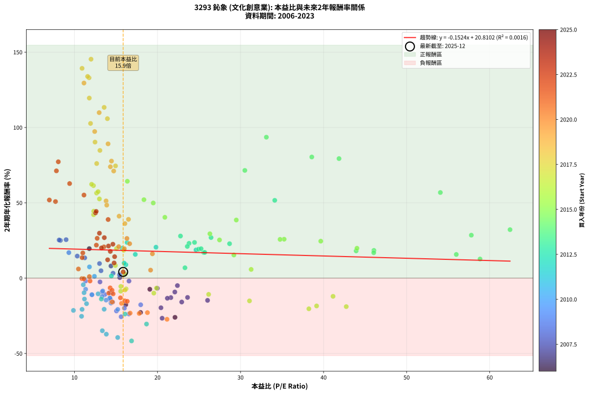
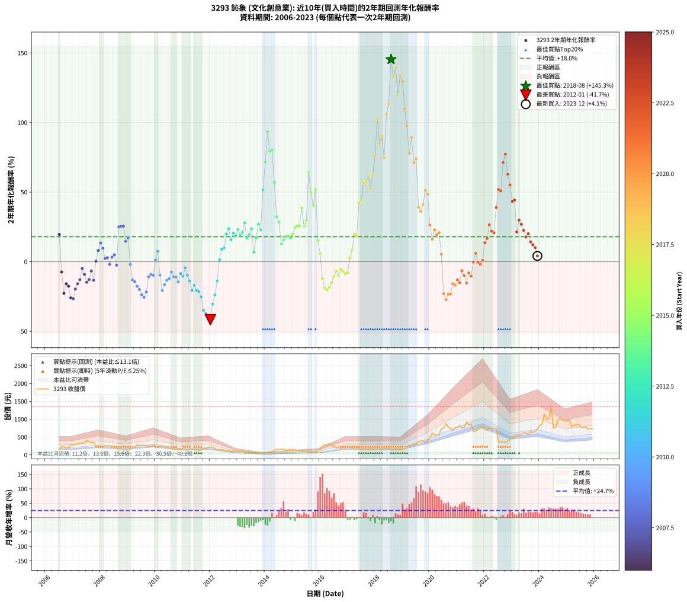

# 3293 鈊象 - 本益比與未來報酬率分析

!!! info "報告資訊"
    - **股票代號**: 3293
    - **公司名稱**: 鈊象
    - **產業別**: 文化創意業
    - **分析期間**: 2006-2023 (210 個數據點)
    - **資料來源**: Type 12 (ShowMonthlyK_ChartFlow) 月收盤價與本益比
    - **報酬率口徑**: 含現金股利 (簡化: 年度合計，假設每年7/1入帳)
    - **報告生成時間**: 2026-01-11 21:03:57 CST

## 📈 視覺化圖表

### 圖表1: 本益比 vs 未來報酬率關係

*圖表1：3293 鈊象 本益比與2年期未來報酬率關係 (2006-2023)*

### 圖表2: 歷年買入時點的2年期實際報酬率

*圖表2：3293 鈊象 歷年買入時點的2年期實際報酬率 (2006-2023)*

## 📍 買點訊號說明

本報告提供兩種買點提示訊號（顯示於圖表2的股價子圖中）：

### ▲ 小綠色三角形（回測驗證）
- **計算方式**: 使用全部歷史資料計算本益比第25百分位數
- **用途**: 事後驗證，顯示歷史上哪些時點確實為低估區
- **限制**: 當下無法判斷，僅供回測參考
- **特性**: 後見之明（Look-Ahead Bias）

### ▲ 小橘色三角形（即時訊號）
- **計算方式**: 使用截至當月的過去5年資料計算本益比第25百分位數
- **用途**: 實際投資決策，當時即可判斷
- **優勢**: 可操作性強，符合實務需求
- **特性**: 無後見之明，滾動窗口計算

!!! tip "如何使用兩種訊號"
    - **綠色▲** 幫助理解歷史估值機會，驗證策略有效性
    - **橘色▲** 可作為實際買進參考，但仍需搭配基本面分析
    - 兩種訊號重疊時，表示即時判斷與事後驗證一致，信心度較高
    - 僅有綠色▲時，表示當時無法判斷（需要未來資料才能確認）
    - 僅有橘色▲時，表示即時判斷為買點，但事後可能不是最佳時機

## 📊 估值分析摘要

| 指標 | 數值 |
|:---:|:---:|
| **目前本益比** (2023-12) | **15.87 倍** |
| **歷史平均本益比** | 18.51 倍 |
| **估值水準** | 🟡 合理範圍 |
| **預期2年年化報酬率** | **+18.39%** |
| **歷史平均報酬率** | +17.99% |
| **相關係數 (R²)** | 0.0016 |
| **趨勢線斜率** | -0.1524 |

!!! abstract "核心洞察"
    目前本益比接近歷史平均，預期報酬率符合長期趨勢

    根據歷史數據回測，3293 鈊象 在目前本益比 **15.9倍** 的估值水準下，
    預期未來2年年化報酬率約為 **+18.4%**。

    **重要提醒**: 本分析基於歷史數據統計，實際報酬率會受到公司基本面變化、產業趨勢、
    總體經濟環境等多重因素影響。R² = 0.00 表示本益比可解釋約 0.2% 的報酬率變異。

## 📈 歷史估值統計

### 最佳買點 (最高報酬率)

| 項目 | 數值 |
|:---:|:---:|
| 起始時間 | 2018-08 |
| 當時本益比 | 12.00 倍 |
| 起始價格 | 152.0 元 |
| 2年後價格 | 880.0 元 |
| **2年年化報酬率** | **+145.33%** |

### 最差買點 (最低報酬率)

| 項目 | 數值 |
|:---:|:---:|
| 起始時間 | 2012-01 |
| 當時本益比 | 16.88 倍 |
| 起始價格 | 213.0 元 |
| 2年後價格 | 55.9 元 |
| **2年年化報酬率** | **-41.68%** |

## 🎯 投資啟示

### 本益比與報酬率關係

趨勢線方程式: **y = -0.1524x + 20.8102**

!!! note "負相關"
    本益比與未來報酬率呈現負相關。較低的本益比通常帶來較高的未來報酬率，
    但相關性不算非常強。**估值仍是重要參考指標之一**。

### 估值區間建議

基於歷史數據分析:

- **🟢 低估區** (P/E < 14.8): 預期報酬率較高，可考慮增加持股
- **🟡 合理區** (P/E 14.8-22.2): 預期報酬率符合長期趨勢，正常持有
- **🔴 高估區** (P/E > 22.2): 預期報酬率較低，可考慮減碼或觀望

!!! danger "風險提示"
    - 過去表現不代表未來結果
    - 本分析假設公司基本面無重大結構性變化
    - 產業環境劇變可能使歷史規律失效
    - 應結合公司財報、產業趨勢、總體經濟等多重因素綜合判斷

!!! success "長期投資觀點"
    歷史數據顯示，在合理或低估的估值水準買入並長期持有，
    往往能獲得較佳的投資報酬。**耐心等待好價格**是價值投資的核心原則。

## 📊 數據品質

- **資料來源**: GoodInfo.tw Type 12 (ShowMonthlyK_ChartFlow)
- **資料頻率**: 月度收盤價與本益比
- **回測期間**: 2006-2023
- **數據點數量**: 210 個 (每個點代表一次2年期回測)

### 計算方法說明

1. **2年期年化報酬率**:
   - 對每個歷史時點，計算其後2年的實際投資報酬率
   - 期末價值(不含股利): 期末價格
   - 期末價值(含現金股利): 期末價格 + 持有期間內的現金股利合計 (簡化: 年度合計，假設每年7/1入帳)
   - 公式: 年化報酬率 = [(期末價值/期初價格)^(1/年數) - 1] × 100%

2. **本益比 (P/E Ratio)**:
   - 使用當時的月收盤價與EPS計算
   - 資料來源: Type 12 月度河流圖本益比數據

3. **趨勢線 (Linear Regression)**:
   - 使用最小平方法擬合線性趨勢線
   - R²值衡量本益比對報酬率的解釋能力

---

*本報告由 Stock Analysis System v1.9.0 自動生成*
*數據更新時間: 2026-01-11 21:03:57 CST*

## 📋 月度回測明細表

（每一列對應時間線圖中的一個買入點；可用來對照 SVG 圖上的每個點。）

| 買入月份 | 賣出月份 | 回測期限_年 | 實際持有年數 | 買入本益比_倍 | 買入收盤價_元 | 賣出收盤價_元 | 現金股利合計_元 | 總報酬率_pct | 年化報酬率_pct |
| --- | --- | --- | --- | --- | --- | --- | --- | --- | --- |
| 2006-07 | 2008-07 | 2 | 2.001 | 11.79 | 152.00 | 198.50 | 18.95 | +43.06 | +19.59 |
| 2006-08 | 2008-08 | 2 | 2.001 | 19.08 | 246.00 | 192.00 | 18.95 | -14.25 | -7.39 |
| 2006-09 | 2008-09 | 2 | 2.001 | 17.96 | 231.50 | 119.00 | 18.95 | -40.41 | -22.79 |
| 2006-10 | 2008-10 | 2 | 2.001 | 14.58 | 188.00 | 114.00 | 18.95 | -29.28 | -15.90 |
| 2006-11 | 2008-11 | 2 | 2.001 | 16.18 | 208.50 | 122.50 | 18.95 | -32.16 | -17.62 |
| 2006-12 | 2008-12 | 2 | 2.001 | 22.11 | 285.00 | 137.00 | 18.95 | -45.28 | -26.01 |
| 2007-01 | 2009-01 | 2 | 2.001 | 20.56 | 273.00 | 128.00 | 18.95 | -46.17 | -26.62 |
| 2007-02 | 2009-02 | 2 | 2.001 | 20.42 | 279.00 | 161.00 | 18.95 | -35.50 | -19.68 |
| 2007-03 | 2009-03 | 2 | 2.001 | 22.92 | 322.00 | 209.00 | 18.95 | -29.21 | -15.85 |
| 2007-04 | 2009-04 | 2 | 2.001 | 21.61 | 312.00 | 217.50 | 18.95 | -24.21 | -12.94 |
| 2007-05 | 2009-05 | 2 | 2.001 | 22.40 | 332.00 | 281.00 | 18.95 | -9.65 | -4.95 |
| 2007-06 | 2009-06 | 2 | 2.001 | 22.09 | 336.00 | 258.00 | 18.95 | -17.57 | -9.21 |
| 2007-07 | 2009-07 | 2 | 2.001 | 26.03 | 406.00 | 274.50 | 20.44 | -27.35 | -14.76 |
| 2007-08 | 2009-08 | 2 | 2.001 | 23.62 | 377.50 | 266.50 | 20.44 | -23.99 | -12.81 |
| 2007-09 | 2009-09 | 2 | 2.001 | 19.98 | 327.00 | 264.00 | 20.44 | -13.01 | -6.73 |
| 2007-10 | 2009-10 | 2 | 2.001 | 21.19 | 355.00 | 246.00 | 20.44 | -24.95 | -13.36 |
| 2007-11 | 2009-11 | 2 | 2.001 | 15.46 | 265.00 | 246.50 | 20.44 | +0.73 | +0.37 |
| 2007-12 | 2009-12 | 2 | 2.001 | 14.40 | 252.50 | 274.50 | 20.44 | +16.81 | +8.07 |
| 2008-01 | 2010-01 | 2 | 2.001 | 11.24 | 193.00 | 228.00 | 20.44 | +28.73 | +13.45 |
| 2008-02 | 2010-03 | 2 | 2.081 | 13.02 | 219.00 | 245.00 | 20.44 | +21.21 | +9.68 |
| 2008-03 | 2010-03 | 2 | 1.999 | 15.43 | 254.00 | 245.00 | 20.44 | +4.51 | +2.23 |
| 2008-04 | 2010-04 | 2 | 1.999 | 16.02 | 258.00 | 252.50 | 20.44 | +5.79 | +2.86 |
| 2008-05 | 2010-05 | 2 | 1.999 | 16.57 | 261.00 | 230.50 | 20.44 | -3.85 | -1.95 |
| 2008-06 | 2010-06 | 2 | 1.999 | 14.65 | 225.50 | 220.00 | 20.44 | +6.63 | +3.26 |
| 2008-07 | 2010-07 | 2 | 1.999 | 13.20 | 198.50 | 197.50 | 20.98 | +10.07 | +4.92 |
| 2008-08 | 2010-08 | 2 | 1.999 | 13.08 | 192.00 | 161.50 | 20.98 | -4.96 | -2.51 |
| 2008-09 | 2010-09 | 2 | 1.999 | 8.31 | 119.00 | 165.00 | 20.98 | +56.29 | +25.03 |
| 2008-10 | 2010-10 | 2 | 1.999 | 8.16 | 114.00 | 158.00 | 20.98 | +57.00 | +25.32 |
| 2008-11 | 2010-11 | 2 | 1.999 | 9.00 | 122.50 | 172.00 | 20.98 | +57.54 | +25.53 |
| 2008-12 | 2010-12 | 2 | 1.999 | 10.34 | 137.00 | 159.00 | 20.98 | +31.37 | +14.63 |
| 2009-01 | 2011-01 | 2 | 1.999 | 9.33 | 128.00 | 154.00 | 20.98 | +36.71 | +16.93 |
| 2009-02 | 2011-02 | 2 | 1.999 | 11.34 | 161.00 | 134.00 | 20.98 | -3.74 | -1.89 |
| 2009-03 | 2011-03 | 2 | 1.999 | 14.24 | 209.00 | 136.50 | 20.98 | -24.65 | -13.20 |
| 2009-04 | 2011-04 | 2 | 1.999 | 14.35 | 217.50 | 138.50 | 20.98 | -26.67 | -14.38 |
| 2009-05 | 2011-05 | 2 | 1.999 | 17.98 | 281.00 | 169.50 | 20.98 | -32.21 | -17.68 |
| 2009-06 | 2011-06 | 2 | 1.999 | 16.02 | 258.00 | 144.50 | 20.98 | -35.86 | -19.92 |
| 2009-07 | 2011-07 | 2 | 1.999 | 16.56 | 274.50 | 139.00 | 20.49 | -41.90 | -23.79 |
| 2009-08 | 2011-08 | 2 | 1.999 | 15.62 | 266.50 | 127.00 | 20.49 | -44.66 | -25.62 |
| 2009-09 | 2011-09 | 2 | 1.999 | 15.06 | 264.00 | 141.00 | 20.49 | -38.83 | -21.80 |
| 2009-10 | 2011-10 | 2 | 1.999 | 13.66 | 246.00 | 175.00 | 20.49 | -20.53 | -10.86 |
| 2009-11 | 2011-11 | 2 | 1.999 | 13.34 | 246.50 | 183.00 | 20.49 | -17.45 | -9.15 |
| 2009-12 | 2011-12 | 2 | 1.999 | 14.48 | 274.50 | 203.00 | 20.49 | -18.58 | -9.77 |
| 2010-01 | 2012-01 | 2 | 1.999 | 12.41 | 228.00 | 213.00 | 20.49 | +2.41 | +1.20 |
| 2010-02 | 2012-02 | 2 | 1.999 | 11.81 | 210.00 | 222.00 | 20.49 | +15.47 | +7.46 |
| 2010-03 | 2012-03 | 2 | 2.001 | 14.26 | 245.00 | 179.50 | 20.49 | -18.37 | -9.65 |
| 2010-04 | 2012-04 | 2 | 2.001 | 15.22 | 252.50 | 138.00 | 20.49 | -37.23 | -20.76 |
| 2010-05 | 2012-05 | 2 | 2.001 | 14.40 | 230.50 | 140.00 | 20.49 | -30.37 | -16.55 |
| 2010-06 | 2012-06 | 2 | 2.001 | 14.28 | 220.00 | 145.00 | 20.49 | -24.78 | -13.26 |
| 2010-07 | 2012-07 | 2 | 2.001 | 13.33 | 197.50 | 131.50 | 20.50 | -23.04 | -12.26 |
| 2010-08 | 2012-08 | 2 | 2.001 | 11.35 | 161.50 | 118.00 | 20.50 | -14.24 | -7.39 |
| 2010-09 | 2012-09 | 2 | 2.001 | 12.10 | 165.00 | 110.50 | 20.50 | -20.61 | -10.89 |
| 2010-10 | 2012-10 | 2 | 2.001 | 12.11 | 158.00 | 104.50 | 20.50 | -20.89 | -11.05 |
| 2010-11 | 2012-11 | 2 | 2.001 | 13.81 | 172.00 | 105.00 | 20.50 | -27.03 | -14.57 |
| 2010-12 | 2012-12 | 2 | 2.001 | 13.41 | 159.00 | 112.50 | 20.50 | -16.35 | -8.54 |
| 2011-01 | 2013-01 | 2 | 2.001 | 12.85 | 154.00 | 103.00 | 20.50 | -19.81 | -10.44 |
| 2011-02 | 2013-02 | 2 | 2.001 | 11.07 | 134.00 | 102.00 | 20.50 | -8.58 | -4.38 |
| 2011-03 | 2013-03 | 2 | 2.001 | 11.16 | 136.50 | 90.80 | 20.50 | -18.46 | -9.70 |
| 2011-04 | 2013-04 | 2 | 2.001 | 11.21 | 138.50 | 82.20 | 20.50 | -25.85 | -13.88 |
| 2011-05 | 2013-05 | 2 | 2.001 | 13.58 | 169.50 | 86.20 | 20.50 | -37.05 | -20.65 |
| 2011-06 | 2013-06 | 2 | 2.001 | 11.46 | 144.50 | 79.10 | 20.50 | -31.07 | -16.97 |
| 2011-07 | 2013-07 | 2 | 2.001 | 10.92 | 139.00 | 70.80 | 16.50 | -37.19 | -20.74 |
| 2011-08 | 2013-08 | 2 | 2.001 | 9.88 | 127.00 | 61.90 | 16.50 | -38.27 | -21.42 |
| 2011-09 | 2013-09 | 2 | 2.001 | 10.86 | 141.00 | 62.10 | 16.50 | -44.26 | -25.32 |
| 2011-10 | 2013-10 | 2 | 2.001 | 13.36 | 175.00 | 57.60 | 16.50 | -57.66 | -34.91 |
| 2011-11 | 2013-11 | 2 | 2.001 | 13.84 | 183.00 | 55.60 | 16.50 | -60.60 | -37.21 |
| 2011-12 | 2013-12 | 2 | 2.001 | 15.21 | 203.00 | 58.00 | 16.50 | -63.30 | -39.40 |
| 2012-01 | 2014-01 | 2 | 2.001 | 16.88 | 213.00 | 55.90 | 16.50 | -66.01 | -41.68 |
| 2012-02 | 2014-03 | 2 | 2.081 | 18.68 | 222.00 | 87.70 | 16.50 | -53.06 | -30.48 |
| 2012-03 | 2014-03 | 2 | 1.999 | 16.09 | 179.50 | 87.70 | 16.50 | -41.95 | -23.82 |
| 2012-04 | 2014-04 | 2 | 1.999 | 13.24 | 138.00 | 85.90 | 16.50 | -25.80 | -13.87 |
| 2012-05 | 2014-05 | 2 | 1.999 | 14.45 | 140.00 | 127.50 | 16.50 | +2.86 | +1.42 |
| 2012-06 | 2014-06 | 2 | 1.999 | 16.19 | 145.00 | 155.50 | 16.50 | +18.62 | +8.92 |
| 2012-07 | 2014-07 | 2 | 1.999 | 15.99 | 131.50 | 151.50 | 7.50 | +20.91 | +9.97 |
| 2012-08 | 2014-08 | 2 | 1.999 | 15.75 | 118.00 | 162.00 | 7.50 | +43.64 | +19.86 |
| 2012-09 | 2014-09 | 2 | 1.999 | 16.34 | 110.50 | 161.50 | 7.50 | +52.94 | +23.69 |
| 2012-10 | 2014-10 | 2 | 1.999 | 17.33 | 104.50 | 132.50 | 7.50 | +33.97 | +15.76 |
| 2012-11 | 2014-11 | 2 | 1.999 | 19.82 | 105.00 | 145.00 | 7.50 | +45.23 | +20.53 |
| 2012-12 | 2014-12 | 2 | 1.999 | 24.64 | 112.50 | 151.00 | 7.50 | +40.88 | +18.71 |
| 2013-01 | 2015-01 | 2 | 1.999 | 23.80 | 103.00 | 148.50 | 7.50 | +51.45 | +23.08 |
| 2013-02 | 2015-02 | 2 | 1.999 | 24.95 | 102.00 | 137.50 | 7.50 | +42.15 | +19.24 |
| 2013-03 | 2015-03 | 2 | 1.999 | 23.59 | 90.80 | 125.50 | 7.50 | +46.47 | +21.04 |
| 2013-04 | 2015-04 | 2 | 1.999 | 22.77 | 82.20 | 127.00 | 7.50 | +63.62 | +27.94 |
| 2013-05 | 2015-05 | 2 | 1.999 | 25.57 | 86.20 | 110.50 | 7.50 | +36.89 | +17.01 |
| 2013-06 | 2015-06 | 2 | 1.999 | 25.25 | 79.10 | 105.50 | 7.50 | +42.85 | +19.53 |
| 2013-07 | 2015-07 | 2 | 1.999 | 24.46 | 70.80 | 103.50 | 4.79 | +52.96 | +23.69 |
| 2013-08 | 2015-08 | 2 | 1.999 | 23.31 | 61.90 | 65.90 | 4.79 | +14.21 | +6.87 |
| 2013-09 | 2015-09 | 2 | 1.999 | 25.70 | 62.10 | 80.30 | 4.79 | +37.03 | +17.07 |
| 2013-10 | 2015-10 | 2 | 1.999 | 26.45 | 57.60 | 88.00 | 4.79 | +61.10 | +26.95 |
| 2013-11 | 2015-11 | 2 | 1.999 | 28.68 | 55.60 | 79.10 | 4.79 | +50.89 | +22.85 |
| 2013-12 | 2015-12 | 2 | 1.999 | 34.12 | 58.00 | 128.50 | 4.79 | +129.82 | +51.64 |
| 2014-01 | 2016-01 | 2 | 1.999 | 30.52 | 55.90 | 159.50 | 4.79 | +193.91 | +71.50 |
| 2014-02 | 2016-02 | 2 | 1.999 | 33.11 | 65.00 | 238.50 | 4.79 | +274.30 | +93.56 |
| 2014-03 | 2016-03 | 2 | 2.001 | 41.86 | 87.70 | 277.50 | 4.79 | +221.89 | +79.34 |
| 2014-04 | 2016-04 | 2 | 2.001 | 38.58 | 85.90 | 275.00 | 4.79 | +225.72 | +80.40 |
| 2014-05 | 2016-05 | 2 | 2.001 | 54.06 | 127.50 | 309.00 | 4.79 | +146.11 | +56.83 |
| 2014-06 | 2016-06 | 2 | 2.001 | 62.45 | 155.50 | 267.00 | 4.79 | +74.79 | +32.18 |
| 2014-07 | 2016-07 | 2 | 2.001 | 57.79 | 151.50 | 243.00 | 7.30 | +65.21 | +28.51 |
| 2014-08 | 2016-08 | 2 | 2.001 | 58.84 | 162.00 | 198.50 | 7.30 | +27.04 | +12.70 |
| 2014-09 | 2016-09 | 2 | 2.001 | 55.98 | 161.50 | 209.00 | 7.30 | +33.93 | +15.72 |
| 2014-10 | 2016-10 | 2 | 2.001 | 43.92 | 132.50 | 177.50 | 7.30 | +39.47 | +18.08 |
| 2014-11 | 2016-11 | 2 | 2.001 | 46.06 | 145.00 | 196.00 | 7.30 | +40.21 | +18.40 |
| 2014-12 | 2016-12 | 2 | 2.001 | 46.04 | 151.00 | 199.00 | 7.30 | +36.62 | +16.87 |
| 2015-01 | 2017-01 | 2 | 2.001 | 44.02 | 148.50 | 206.00 | 7.30 | +43.64 | +19.83 |
| 2015-02 | 2017-02 | 2 | 2.001 | 39.66 | 137.50 | 206.00 | 7.30 | +55.13 | +24.53 |
| 2015-03 | 2017-03 | 2 | 2.001 | 35.25 | 125.50 | 191.50 | 7.30 | +58.41 | +25.84 |
| 2015-04 | 2017-04 | 2 | 2.001 | 34.76 | 127.00 | 193.50 | 7.30 | +58.11 | +25.72 |
| 2015-05 | 2017-05 | 2 | 2.001 | 29.49 | 110.50 | 205.00 | 7.30 | +92.13 | +38.58 |
| 2015-06 | 2017-06 | 2 | 2.001 | 27.47 | 105.50 | 158.50 | 7.30 | +57.16 | +25.34 |
| 2015-07 | 2017-07 | 2 | 2.001 | 26.31 | 103.50 | 159.00 | 14.50 | +67.63 | +29.45 |
| 2015-08 | 2017-08 | 2 | 2.001 | 16.37 | 65.90 | 163.50 | 14.50 | +170.11 | +64.29 |
| 2015-09 | 2017-09 | 2 | 2.001 | 19.49 | 80.30 | 166.00 | 14.50 | +124.78 | +49.89 |
| 2015-10 | 2017-10 | 2 | 2.001 | 20.89 | 88.00 | 159.00 | 14.50 | +97.16 | +40.38 |
| 2015-11 | 2017-11 | 2 | 2.001 | 18.37 | 79.10 | 168.50 | 14.50 | +131.35 | +52.06 |
| 2015-12 | 2017-12 | 2 | 2.001 | 29.20 | 128.50 | 156.50 | 14.50 | +33.07 | +15.35 |
| 2016-01 | 2018-01 | 2 | 2.001 | 31.28 | 159.50 | 164.00 | 14.50 | +11.91 | +5.78 |
| 2016-02 | 2018-03 | 2 | 2.081 | 41.14 | 238.50 | 168.00 | 14.50 | -23.48 | -12.07 |
| 2016-03 | 2018-03 | 2 | 1.999 | 42.73 | 277.50 | 168.00 | 14.50 | -34.23 | -18.92 |
| 2016-04 | 2018-04 | 2 | 1.999 | 38.23 | 275.00 | 160.00 | 14.50 | -36.55 | -20.35 |
| 2016-05 | 2018-05 | 2 | 1.999 | 39.16 | 309.00 | 191.00 | 14.50 | -33.50 | -18.46 |
| 2016-06 | 2018-06 | 2 | 1.999 | 31.08 | 267.00 | 178.00 | 14.50 | -27.90 | -15.10 |
| 2016-07 | 2018-07 | 2 | 1.999 | 26.16 | 243.00 | 172.50 | 21.00 | -20.37 | -10.77 |
| 2016-08 | 2018-08 | 2 | 1.999 | 19.88 | 198.50 | 152.00 | 21.00 | -12.85 | -6.65 |
| 2016-09 | 2018-09 | 2 | 1.999 | 19.56 | 209.00 | 148.50 | 21.00 | -18.90 | -9.95 |
| 2016-10 | 2018-10 | 2 | 1.999 | 15.59 | 177.50 | 137.50 | 21.00 | -10.70 | -5.51 |
| 2016-11 | 2018-11 | 2 | 1.999 | 16.22 | 196.00 | 148.00 | 21.00 | -13.78 | -7.15 |
| 2016-12 | 2018-12 | 2 | 1.999 | 15.57 | 199.00 | 145.00 | 21.00 | -16.58 | -8.67 |
| 2017-01 | 2019-01 | 2 | 1.999 | 16.10 | 206.00 | 154.00 | 21.00 | -15.05 | -7.84 |
| 2017-02 | 2019-02 | 2 | 1.999 | 16.08 | 206.00 | 196.00 | 21.00 | +5.34 | +2.64 |
| 2017-03 | 2019-03 | 2 | 1.999 | 14.93 | 191.50 | 204.00 | 21.00 | +17.49 | +8.40 |
| 2017-04 | 2019-04 | 2 | 1.999 | 15.07 | 193.50 | 256.00 | 21.00 | +43.15 | +19.66 |
| 2017-05 | 2019-05 | 2 | 1.999 | 15.94 | 205.00 | 267.00 | 21.00 | +40.49 | +18.54 |
| 2017-06 | 2019-06 | 2 | 1.999 | 12.31 | 158.50 | 299.00 | 21.00 | +101.89 | +42.12 |
| 2017-07 | 2019-07 | 2 | 1.999 | 12.33 | 159.00 | 309.50 | 22.00 | +108.49 | +44.43 |
| 2017-08 | 2019-08 | 2 | 1.999 | 12.67 | 163.50 | 378.00 | 22.00 | +144.65 | +56.46 |
| 2017-09 | 2019-09 | 2 | 1.999 | 12.85 | 166.00 | 389.00 | 22.00 | +147.59 | +57.40 |
| 2017-10 | 2019-10 | 2 | 1.999 | 12.29 | 159.00 | 392.00 | 22.00 | +160.38 | +61.42 |
| 2017-11 | 2019-11 | 2 | 1.999 | 13.01 | 168.50 | 370.00 | 22.00 | +132.64 | +52.57 |
| 2017-12 | 2019-12 | 2 | 1.999 | 12.07 | 156.50 | 390.00 | 22.00 | +163.26 | +62.31 |
| 2018-01 | 2020-01 | 2 | 1.999 | 12.68 | 164.00 | 486.00 | 22.00 | +209.76 | +76.07 |
| 2018-02 | 2020-02 | 2 | 1.999 | 11.94 | 154.00 | 610.00 | 22.00 | +310.39 | +102.68 |
| 2018-03 | 2020-03 | 2 | 2.001 | 13.07 | 168.00 | 552.00 | 22.00 | +241.67 | +84.76 |
| 2018-04 | 2020-04 | 2 | 2.001 | 12.48 | 160.00 | 558.00 | 22.00 | +262.50 | +90.31 |
| 2018-05 | 2020-05 | 2 | 2.001 | 14.95 | 191.00 | 560.00 | 22.00 | +204.71 | +74.49 |
| 2018-06 | 2020-06 | 2 | 2.001 | 13.97 | 178.00 | 733.00 | 22.00 | +324.16 | +105.85 |
| 2018-07 | 2020-07 | 2 | 2.001 | 13.58 | 172.50 | 750.00 | 36.00 | +355.65 | +113.35 |
| 2018-08 | 2020-08 | 2 | 2.001 | 12.00 | 152.00 | 880.00 | 36.00 | +502.63 | +145.33 |
| 2018-09 | 2020-09 | 2 | 2.001 | 11.76 | 148.50 | 771.00 | 36.00 | +443.43 | +132.98 |
| 2018-10 | 2020-10 | 2 | 2.001 | 10.92 | 137.50 | 752.00 | 36.00 | +473.09 | +139.25 |
| 2018-11 | 2020-11 | 2 | 2.001 | 11.79 | 148.00 | 678.00 | 36.00 | +382.43 | +119.53 |
| 2018-12 | 2020-12 | 2 | 2.001 | 11.59 | 145.00 | 758.00 | 36.00 | +447.59 | +133.87 |
| 2019-01 | 2021-01 | 2 | 2.001 | 11.15 | 154.00 | 776.00 | 36.00 | +427.27 | +129.49 |
| 2019-02 | 2021-02 | 2 | 2.001 | 12.98 | 196.00 | 828.00 | 36.00 | +340.82 | +109.85 |
| 2019-03 | 2021-03 | 2 | 2.001 | 12.44 | 204.00 | 759.00 | 36.00 | +289.71 | +97.32 |
| 2019-04 | 2021-04 | 2 | 2.001 | 14.46 | 256.00 | 773.00 | 36.00 | +216.02 | +77.70 |
| 2019-05 | 2021-05 | 2 | 2.001 | 14.05 | 267.00 | 920.00 | 36.00 | +258.05 | +89.14 |
| 2019-06 | 2021-06 | 2 | 2.001 | 14.73 | 299.00 | 840.00 | 36.00 | +192.98 | +71.10 |
| 2019-07 | 2021-07 | 2 | 2.001 | 14.33 | 309.50 | 870.00 | 67.00 | +202.75 | +73.93 |
| 2019-08 | 2021-08 | 2 | 2.001 | 16.51 | 378.00 | 664.00 | 67.00 | +93.39 | +39.03 |
| 2019-09 | 2021-09 | 2 | 2.001 | 16.08 | 389.00 | 655.00 | 67.00 | +85.60 | +36.21 |
| 2019-10 | 2021-10 | 2 | 2.001 | 15.38 | 392.00 | 714.00 | 67.00 | +99.23 | +41.12 |
| 2019-11 | 2021-11 | 2 | 2.001 | 13.81 | 370.00 | 780.00 | 67.00 | +128.92 | +51.26 |
| 2019-12 | 2021-12 | 2 | 2.001 | 13.89 | 390.00 | 793.00 | 67.00 | +120.51 | +48.46 |
| 2020-01 | 2022-01 | 2 | 2.001 | 16.32 | 486.00 | 709.00 | 67.00 | +59.67 | +26.34 |
| 2020-02 | 2022-03 | 2 | 2.081 | 19.39 | 610.00 | 766.00 | 67.00 | +36.56 | +16.15 |
| 2020-03 | 2022-03 | 2 | 1.999 | 16.65 | 552.00 | 766.00 | 67.00 | +50.91 | +22.86 |
| 2020-04 | 2022-04 | 2 | 1.999 | 16.01 | 558.00 | 730.00 | 67.00 | +42.83 | +19.53 |
| 2020-05 | 2022-05 | 2 | 1.999 | 15.33 | 560.00 | 751.00 | 67.00 | +46.07 | +20.88 |
| 2020-06 | 2022-06 | 2 | 1.999 | 19.17 | 733.00 | 746.00 | 67.00 | +10.91 | +5.32 |
| 2020-07 | 2022-07 | 2 | 1.999 | 18.79 | 750.00 | 354.00 | 92.00 | -40.53 | -22.90 |
| 2020-08 | 2022-08 | 2 | 1.999 | 21.15 | 880.00 | 373.00 | 92.00 | -47.16 | -27.32 |
| 2020-09 | 2022-09 | 2 | 1.999 | 17.80 | 771.00 | 360.00 | 92.00 | -41.37 | -23.45 |
| 2020-10 | 2022-10 | 2 | 1.999 | 16.71 | 752.00 | 351.50 | 92.00 | -41.02 | -23.22 |
| 2020-11 | 2022-11 | 2 | 1.999 | 14.52 | 678.00 | 388.50 | 92.00 | -29.13 | -15.83 |
| 2020-12 | 2022-12 | 2 | 1.999 | 15.67 | 758.00 | 433.50 | 92.00 | -30.67 | -16.75 |
| 2021-01 | 2023-01 | 2 | 1.999 | 15.54 | 776.00 | 494.50 | 92.00 | -24.42 | -13.07 |
| 2021-02 | 2023-02 | 2 | 1.999 | 16.07 | 828.00 | 505.00 | 92.00 | -27.90 | -15.10 |
| 2021-03 | 2023-03 | 2 | 1.999 | 14.30 | 759.00 | 572.00 | 92.00 | -12.52 | -6.47 |
| 2021-04 | 2023-04 | 2 | 1.999 | 14.14 | 773.00 | 535.00 | 92.00 | -18.89 | -9.94 |
| 2021-05 | 2023-05 | 2 | 1.999 | 16.36 | 920.00 | 567.00 | 92.00 | -28.37 | -15.37 |
| 2021-06 | 2023-06 | 2 | 1.999 | 14.53 | 840.00 | 618.00 | 92.00 | -15.48 | -8.07 |
| 2021-07 | 2023-07 | 2 | 1.999 | 14.66 | 870.00 | 613.00 | 85.00 | -19.77 | -10.44 |
| 2021-08 | 2023-08 | 2 | 1.999 | 10.90 | 664.00 | 575.00 | 85.00 | -0.60 | -0.30 |
| 2021-09 | 2023-09 | 2 | 1.999 | 10.48 | 655.00 | 652.00 | 85.00 | +12.52 | +6.08 |
| 2021-10 | 2023-10 | 2 | 1.999 | 11.14 | 714.00 | 623.00 | 85.00 | -0.84 | -0.42 |
| 2021-11 | 2023-11 | 2 | 1.999 | 11.88 | 780.00 | 666.00 | 85.00 | -3.72 | -1.88 |
| 2021-12 | 2023-12 | 2 | 1.999 | 11.80 | 793.00 | 724.00 | 85.00 | +2.02 | +1.00 |
| 2022-01 | 2024-01 | 2 | 1.999 | 10.93 | 709.00 | 830.00 | 85.00 | +29.06 | +13.61 |
| 2022-02 | 2024-02 | 2 | 1.999 | 11.01 | 688.00 | 852.00 | 85.00 | +36.19 | +16.71 |
| 2022-03 | 2024-03 | 2 | 2.001 | 12.74 | 766.00 | 1140.00 | 85.00 | +59.92 | +26.44 |
| 2022-04 | 2024-04 | 2 | 2.001 | 12.64 | 730.00 | 1000.00 | 85.00 | +48.63 | +21.90 |
| 2022-05 | 2024-05 | 2 | 2.001 | 13.55 | 751.00 | 1010.00 | 85.00 | +45.81 | +20.73 |
| 2022-06 | 2024-06 | 2 | 2.001 | 14.06 | 746.00 | 1355.00 | 85.00 | +93.03 | +38.90 |
| 2022-07 | 2024-07 | 2 | 2.001 | 6.98 | 354.00 | 747.00 | 70.00 | +130.79 | +51.87 |
| 2022-08 | 2024-08 | 2 | 2.001 | 7.72 | 373.00 | 779.00 | 70.00 | +127.61 | +50.83 |
| 2022-09 | 2024-09 | 2 | 2.001 | 7.83 | 360.00 | 986.00 | 70.00 | +193.33 | +71.21 |
| 2022-10 | 2024-10 | 2 | 2.001 | 8.06 | 351.50 | 1035.00 | 70.00 | +214.37 | +77.23 |
| 2022-11 | 2024-11 | 2 | 2.001 | 9.42 | 388.50 | 960.00 | 70.00 | +165.12 | +62.77 |
| 2022-12 | 2024-12 | 2 | 2.001 | 11.15 | 433.50 | 974.00 | 70.00 | +140.83 | +55.14 |
| 2023-01 | 2025-01 | 2 | 2.001 | 12.54 | 494.50 | 946.00 | 70.00 | +105.46 | +43.30 |
| 2023-02 | 2025-02 | 2 | 2.001 | 12.62 | 505.00 | 982.00 | 70.00 | +108.32 | +44.30 |
| 2023-03 | 2025-03 | 2 | 2.001 | 14.10 | 572.00 | 772.00 | 70.00 | +47.20 | +21.31 |
| 2023-04 | 2025-04 | 2 | 2.001 | 13.01 | 535.00 | 832.00 | 70.00 | +68.60 | +29.82 |
| 2023-05 | 2025-05 | 2 | 2.001 | 13.60 | 567.00 | 843.00 | 70.00 | +61.02 | +26.87 |
| 2023-06 | 2025-06 | 2 | 2.001 | 14.63 | 618.00 | 858.00 | 70.00 | +50.16 | +22.52 |
| 2023-07 | 2025-07 | 2 | 2.001 | 14.32 | 613.00 | 786.00 | 64.00 | +38.66 | +17.74 |
| 2023-08 | 2025-08 | 2 | 2.001 | 13.26 | 575.00 | 765.00 | 64.00 | +44.17 | +20.06 |
| 2023-09 | 2025-09 | 2 | 2.001 | 14.84 | 652.00 | 787.00 | 64.00 | +30.52 | +14.24 |
| 2023-10 | 2025-10 | 2 | 2.001 | 14.00 | 623.00 | 720.00 | 64.00 | +25.84 | +12.17 |
| 2023-11 | 2025-11 | 2 | 2.001 | 14.78 | 666.00 | 743.00 | 64.00 | +21.17 | +10.07 |
| 2023-12 | 2025-12 | 2 | 2.001 | 15.87 | 724.00 | 721.00 | 64.00 | +8.43 | +4.12 |
