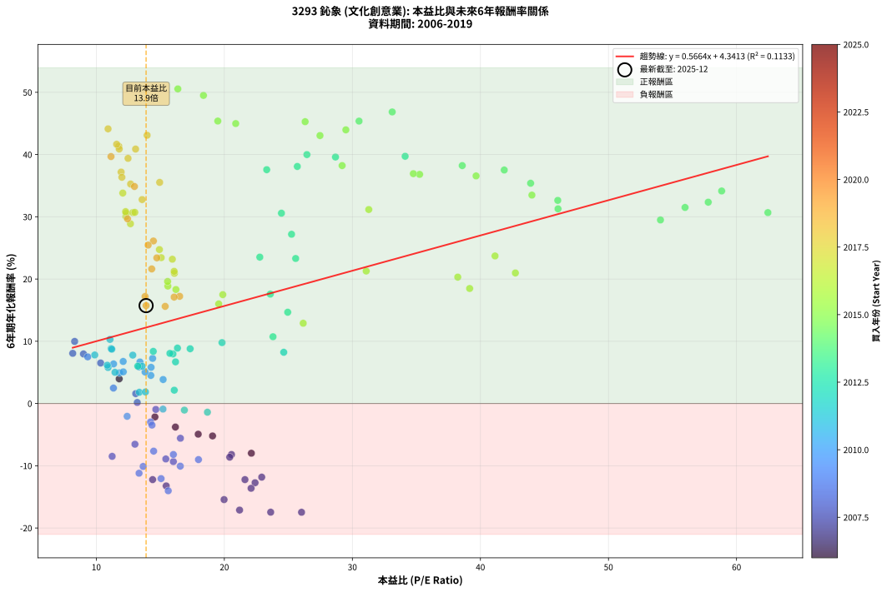
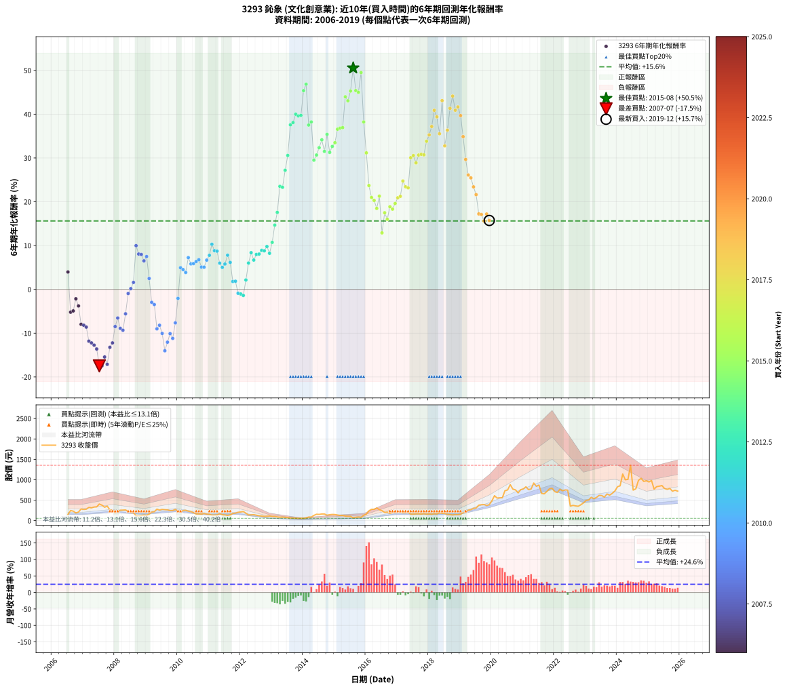

# 3293 鈊象 - 本益比與未來報酬率分析

!!! info "報告資訊"
    - **股票代號**: 3293
    - **公司名稱**: 鈊象
    - **產業別**: 文化創意業
    - **分析期間**: 2006-2019 (162 個數據點)
    - **資料來源**: Type 12 (ShowMonthlyK_ChartFlow) 月收盤價與本益比
    - **報酬率口徑**: 含現金股利 (簡化: 年度合計，假設每年7/1入帳)
    - **報告生成時間**: 2026-01-10 21:02:21 CST

## 📈 視覺化圖表

### 圖表1: 本益比 vs 未來報酬率關係

*圖表1：3293 鈊象 本益比與6年期未來報酬率關係 (2006-2019)*

### 圖表2: 歷年買入時點的6年期實際報酬率

*圖表2：3293 鈊象 歷年買入時點的6年期實際報酬率 (2006-2019)*

## 📍 買點訊號說明

本報告提供兩種買點提示訊號（顯示於圖表2的股價子圖中）：

### ▲ 小綠色三角形（回測驗證）
- **計算方式**: 使用全部歷史資料計算本益比第25百分位數
- **用途**: 事後驗證，顯示歷史上哪些時點確實為低估區
- **限制**: 當下無法判斷，僅供回測參考
- **特性**: 後見之明（Look-Ahead Bias）

### ▲ 小橘色三角形（即時訊號）
- **計算方式**: 使用截至當月的過去5年資料計算本益比第25百分位數
- **用途**: 實際投資決策，當時即可判斷
- **優勢**: 可操作性強，符合實務需求
- **特性**: 無後見之明，滾動窗口計算

!!! tip "如何使用兩種訊號"
    - **綠色▲** 幫助理解歷史估值機會，驗證策略有效性
    - **橘色▲** 可作為實際買進參考，但仍需搭配基本面分析
    - 兩種訊號重疊時，表示即時判斷與事後驗證一致，信心度較高
    - 僅有綠色▲時，表示當時無法判斷（需要未來資料才能確認）
    - 僅有橘色▲時，表示即時判斷為買點，但事後可能不是最佳時機

## 📊 估值分析摘要

| 指標 | 數值 |
|:---:|:---:|
| **目前本益比** (2019-12) | **13.89 倍** |
| **歷史平均本益比** | 19.90 倍 |
| **估值水準** | 🟢 相對低估 |
| **預期6年年化報酬率** | **+12.21%** |
| **歷史平均報酬率** | +15.62% |
| **相關係數 (R²)** | 0.1133 |
| **趨勢線斜率** | 0.5664 |

!!! abstract "核心洞察"
    目前本益比顯著低於歷史平均，預期未來報酬率可能較高

    根據歷史數據回測，3293 鈊象 在目前本益比 **13.9倍** 的估值水準下，
    預期未來6年年化報酬率約為 **+12.2%**。

    **重要提醒**: 本分析基於歷史數據統計，實際報酬率會受到公司基本面變化、產業趨勢、
    總體經濟環境等多重因素影響。R² = 0.11 表示本益比可解釋約 11.3% 的報酬率變異。

## 📈 歷史估值統計

### 最佳買點 (最高報酬率)

| 項目 | 數值 |
|:---:|:---:|
| 起始時間 | 2015-08 |
| 當時本益比 | 16.37 倍 |
| 起始價格 | 65.9 元 |
| 6年後價格 | 664.0 元 |
| **6年年化報酬率** | **+50.54%** |

### 最差買點 (最低報酬率)

| 項目 | 數值 |
|:---:|:---:|
| 起始時間 | 2007-07 |
| 當時本益比 | 26.03 倍 |
| 起始價格 | 406.0 元 |
| 6年後價格 | 70.8 元 |
| **6年年化報酬率** | **-17.47%** |

## 🎯 投資啟示

### 本益比與報酬率關係

趨勢線方程式: **y = 0.5664x + 4.3413**

!!! info "弱相關或正相關"
    本益比與未來報酬率相關性較弱。這可能表示該股票的報酬率更多受到
    公司成長性、產業趨勢等因素影響，而非估值水準。**需綜合考量多項指標**。

### 估值區間建議

基於歷史數據分析:

- **🟢 低估區** (P/E < 15.9): 預期報酬率較高，可考慮增加持股
- **🟡 合理區** (P/E 15.9-23.9): 預期報酬率符合長期趨勢，正常持有
- **🔴 高估區** (P/E > 23.9): 預期報酬率較低，可考慮減碼或觀望

!!! danger "風險提示"
    - 過去表現不代表未來結果
    - 本分析假設公司基本面無重大結構性變化
    - 產業環境劇變可能使歷史規律失效
    - 應結合公司財報、產業趨勢、總體經濟等多重因素綜合判斷

!!! success "長期投資觀點"
    歷史數據顯示，在合理或低估的估值水準買入並長期持有，
    往往能獲得較佳的投資報酬。**耐心等待好價格**是價值投資的核心原則。

## 📊 數據品質

- **資料來源**: GoodInfo.tw Type 12 (ShowMonthlyK_ChartFlow)
- **資料頻率**: 月度收盤價與本益比
- **回測期間**: 2006-2019
- **數據點數量**: 162 個 (每個點代表一次6年期回測)

### 計算方法說明

1. **6年期年化報酬率**:
   - 對每個歷史時點，計算其後6年的實際投資報酬率
   - 期末價值(不含股利): 期末價格
   - 期末價值(含現金股利): 期末價格 + 持有期間內的現金股利合計 (簡化: 年度合計，假設每年7/1入帳)
   - 公式: 年化報酬率 = [(期末價值/期初價格)^(1/年數) - 1] × 100%

2. **本益比 (P/E Ratio)**:
   - 使用當時的月收盤價與EPS計算
   - 資料來源: Type 12 月度河流圖本益比數據

3. **趨勢線 (Linear Regression)**:
   - 使用最小平方法擬合線性趨勢線
   - R²值衡量本益比對報酬率的解釋能力

---

*本報告由 Stock Analysis System v1.9.0 自動生成*
*數據更新時間: 2026-01-10 21:02:21 CST*

## 📋 月度回測明細表

（每一列對應時間線圖中的一個買入點；可用來對照 SVG 圖上的每個點。）

| 買入月份 | 賣出月份 | 回測期限_年 | 實際持有年數 | 買入本益比_倍 | 買入收盤價_元 | 賣出收盤價_元 | 現金股利合計_元 | 總報酬率_pct | 年化報酬率_pct |
| --- | --- | --- | --- | --- | --- | --- | --- | --- | --- |
| 2006-07 | 2012-07 | 6 | 6.001 | 11.79 | 152.00 | 131.50 | 60.43 | +26.27 | +3.96 |
| 2006-08 | 2012-08 | 6 | 6.001 | 19.08 | 246.00 | 118.00 | 60.43 | -27.47 | -5.21 |
| 2006-09 | 2012-09 | 6 | 6.001 | 17.96 | 231.50 | 110.50 | 60.43 | -26.16 | -4.93 |
| 2006-10 | 2012-10 | 6 | 6.001 | 14.58 | 188.00 | 104.50 | 60.43 | -12.27 | -2.16 |
| 2006-11 | 2012-11 | 6 | 6.001 | 16.18 | 208.50 | 105.00 | 60.43 | -20.66 | -3.78 |
| 2006-12 | 2012-12 | 6 | 6.001 | 22.11 | 285.00 | 112.50 | 60.43 | -39.32 | -7.99 |
| 2007-01 | 2013-01 | 6 | 6.001 | 20.56 | 273.00 | 103.00 | 60.43 | -40.13 | -8.19 |
| 2007-02 | 2013-02 | 6 | 6.001 | 20.42 | 279.00 | 102.00 | 60.43 | -41.78 | -8.62 |
| 2007-03 | 2013-03 | 6 | 6.001 | 22.92 | 322.00 | 90.80 | 60.43 | -53.03 | -11.83 |
| 2007-04 | 2013-04 | 6 | 6.001 | 21.61 | 312.00 | 82.20 | 60.43 | -54.28 | -12.23 |
| 2007-05 | 2013-05 | 6 | 6.001 | 22.40 | 332.00 | 86.20 | 60.43 | -55.83 | -12.73 |
| 2007-06 | 2013-06 | 6 | 6.001 | 22.09 | 336.00 | 79.10 | 60.43 | -58.47 | -13.62 |
| 2007-07 | 2013-07 | 6 | 6.001 | 26.03 | 406.00 | 70.80 | 57.43 | -68.42 | -17.47 |
| 2007-08 | 2013-08 | 6 | 6.001 | 23.62 | 377.50 | 61.90 | 57.43 | -68.39 | -17.46 |
| 2007-09 | 2013-09 | 6 | 6.001 | 19.98 | 327.00 | 62.10 | 57.43 | -63.45 | -15.44 |
| 2007-10 | 2013-10 | 6 | 6.001 | 21.19 | 355.00 | 57.60 | 57.43 | -67.60 | -17.12 |
| 2007-11 | 2013-11 | 6 | 6.001 | 15.46 | 265.00 | 55.60 | 57.43 | -57.35 | -13.24 |
| 2007-12 | 2013-12 | 6 | 6.001 | 14.40 | 252.50 | 58.00 | 57.43 | -54.28 | -12.23 |
| 2008-01 | 2014-01 | 6 | 6.001 | 11.24 | 193.00 | 55.90 | 57.43 | -41.28 | -8.49 |
| 2008-02 | 2014-03 | 6 | 6.081 | 13.02 | 219.00 | 87.70 | 57.43 | -33.73 | -6.54 |
| 2008-03 | 2014-03 | 6 | 5.999 | 15.43 | 254.00 | 87.70 | 57.43 | -42.86 | -8.91 |
| 2008-04 | 2014-04 | 6 | 5.999 | 16.02 | 258.00 | 85.90 | 57.43 | -44.44 | -9.33 |
| 2008-05 | 2014-05 | 6 | 5.999 | 16.57 | 261.00 | 127.50 | 57.43 | -29.14 | -5.58 |
| 2008-06 | 2014-06 | 6 | 5.999 | 14.65 | 225.50 | 155.50 | 57.43 | -5.57 | -0.95 |
| 2008-07 | 2014-07 | 6 | 5.999 | 13.20 | 198.50 | 151.50 | 48.98 | +1.00 | +0.17 |
| 2008-08 | 2014-08 | 6 | 5.999 | 13.08 | 192.00 | 162.00 | 48.98 | +9.88 | +1.58 |
| 2008-09 | 2014-09 | 6 | 5.999 | 8.31 | 119.00 | 161.50 | 48.98 | +76.87 | +9.97 |
| 2008-10 | 2014-10 | 6 | 5.999 | 8.16 | 114.00 | 132.50 | 48.98 | +59.19 | +8.06 |
| 2008-11 | 2014-11 | 6 | 5.999 | 9.00 | 122.50 | 145.00 | 48.98 | +58.35 | +7.96 |
| 2008-12 | 2014-12 | 6 | 5.999 | 10.34 | 137.00 | 151.00 | 48.98 | +45.97 | +6.51 |
| 2009-01 | 2015-01 | 6 | 5.999 | 9.33 | 128.00 | 148.50 | 48.98 | +54.28 | +7.50 |
| 2009-02 | 2015-02 | 6 | 5.999 | 11.34 | 161.00 | 137.50 | 48.98 | +15.82 | +2.48 |
| 2009-03 | 2015-03 | 6 | 5.999 | 14.24 | 209.00 | 125.50 | 48.98 | -16.52 | -2.96 |
| 2009-04 | 2015-04 | 6 | 5.999 | 14.35 | 217.50 | 127.00 | 48.98 | -19.09 | -3.47 |
| 2009-05 | 2015-05 | 6 | 5.999 | 17.98 | 281.00 | 110.50 | 48.98 | -43.25 | -9.01 |
| 2009-06 | 2015-06 | 6 | 5.999 | 16.02 | 258.00 | 105.50 | 48.98 | -40.12 | -8.20 |
| 2009-07 | 2015-07 | 6 | 5.999 | 16.56 | 274.50 | 103.50 | 41.78 | -47.07 | -10.06 |
| 2009-08 | 2015-08 | 6 | 5.999 | 15.62 | 266.50 | 65.90 | 41.78 | -59.59 | -14.02 |
| 2009-09 | 2015-09 | 6 | 5.999 | 15.06 | 264.00 | 80.30 | 41.78 | -53.76 | -12.06 |
| 2009-10 | 2015-10 | 6 | 5.999 | 13.66 | 246.00 | 88.00 | 41.78 | -47.24 | -10.11 |
| 2009-11 | 2015-11 | 6 | 5.999 | 13.34 | 246.50 | 79.10 | 41.78 | -50.96 | -11.20 |
| 2009-12 | 2015-12 | 6 | 5.999 | 14.48 | 274.50 | 128.50 | 41.78 | -37.97 | -7.65 |
| 2010-01 | 2016-01 | 6 | 5.999 | 12.41 | 228.00 | 159.50 | 41.78 | -11.72 | -2.06 |
| 2010-02 | 2016-02 | 6 | 5.999 | 11.81 | 210.00 | 238.50 | 41.78 | +33.47 | +4.93 |
| 2010-03 | 2016-03 | 6 | 6.001 | 14.26 | 245.00 | 277.50 | 41.78 | +30.32 | +4.51 |
| 2010-04 | 2016-04 | 6 | 6.001 | 15.22 | 252.50 | 275.00 | 41.78 | +25.46 | +3.85 |
| 2010-05 | 2016-05 | 6 | 6.001 | 14.40 | 230.50 | 309.00 | 41.78 | +52.18 | +7.25 |
| 2010-06 | 2016-06 | 6 | 6.001 | 14.28 | 220.00 | 267.00 | 41.78 | +40.36 | +5.81 |
| 2010-07 | 2016-07 | 6 | 6.001 | 13.33 | 197.50 | 243.00 | 35.30 | +40.91 | +5.88 |
| 2010-08 | 2016-08 | 6 | 6.001 | 11.35 | 161.50 | 198.50 | 35.30 | +44.76 | +6.36 |
| 2010-09 | 2016-09 | 6 | 6.001 | 12.10 | 165.00 | 209.00 | 35.30 | +48.06 | +6.76 |
| 2010-10 | 2016-10 | 6 | 6.001 | 12.11 | 158.00 | 177.50 | 35.30 | +34.68 | +5.09 |
| 2010-11 | 2016-11 | 6 | 6.001 | 13.81 | 172.00 | 196.00 | 35.30 | +34.47 | +5.06 |
| 2010-12 | 2016-12 | 6 | 6.001 | 13.41 | 159.00 | 199.00 | 35.30 | +47.36 | +6.67 |
| 2011-01 | 2017-01 | 6 | 6.001 | 12.85 | 154.00 | 206.00 | 35.30 | +56.69 | +7.77 |
| 2011-02 | 2017-02 | 6 | 6.001 | 11.07 | 134.00 | 206.00 | 35.30 | +80.07 | +10.30 |
| 2011-03 | 2017-03 | 6 | 6.001 | 11.16 | 136.50 | 191.50 | 35.30 | +66.15 | +8.83 |
| 2011-04 | 2017-04 | 6 | 6.001 | 11.21 | 138.50 | 193.50 | 35.30 | +65.19 | +8.72 |
| 2011-05 | 2017-05 | 6 | 6.001 | 13.58 | 169.50 | 205.00 | 35.30 | +41.77 | +5.99 |
| 2011-06 | 2017-06 | 6 | 6.001 | 11.46 | 144.50 | 158.50 | 35.30 | +34.11 | +5.01 |
| 2011-07 | 2017-07 | 6 | 6.001 | 10.92 | 139.00 | 159.00 | 35.80 | +40.14 | +5.78 |
| 2011-08 | 2017-08 | 6 | 6.001 | 9.88 | 127.00 | 163.50 | 35.80 | +56.93 | +7.80 |
| 2011-09 | 2017-09 | 6 | 6.001 | 10.86 | 141.00 | 166.00 | 35.80 | +43.12 | +6.16 |
| 2011-10 | 2017-10 | 6 | 6.001 | 13.36 | 175.00 | 159.00 | 35.80 | +11.31 | +1.80 |
| 2011-11 | 2017-11 | 6 | 6.001 | 13.84 | 183.00 | 168.50 | 35.80 | +11.64 | +1.85 |
| 2011-12 | 2017-12 | 6 | 6.001 | 15.21 | 203.00 | 156.50 | 35.80 | -5.27 | -0.90 |
| 2012-01 | 2018-01 | 6 | 6.001 | 16.88 | 213.00 | 164.00 | 35.80 | -6.20 | -1.06 |
| 2012-02 | 2018-03 | 6 | 6.081 | 18.68 | 222.00 | 168.00 | 35.80 | -8.20 | -1.40 |
| 2012-03 | 2018-03 | 6 | 5.999 | 16.09 | 179.50 | 168.00 | 35.80 | +13.53 | +2.14 |
| 2012-04 | 2018-04 | 6 | 5.999 | 13.24 | 138.00 | 160.00 | 35.80 | +41.88 | +6.00 |
| 2012-05 | 2018-05 | 6 | 5.999 | 14.45 | 140.00 | 191.00 | 35.80 | +62.00 | +8.37 |
| 2012-06 | 2018-06 | 6 | 5.999 | 16.19 | 145.00 | 178.00 | 35.80 | +47.44 | +6.69 |
| 2012-07 | 2018-07 | 6 | 5.999 | 15.99 | 131.50 | 172.50 | 35.80 | +58.40 | +7.97 |
| 2012-08 | 2018-08 | 6 | 5.999 | 15.75 | 118.00 | 152.00 | 35.80 | +59.15 | +8.05 |
| 2012-09 | 2018-09 | 6 | 5.999 | 16.34 | 110.50 | 148.50 | 35.80 | +66.78 | +8.90 |
| 2012-10 | 2018-10 | 6 | 5.999 | 17.33 | 104.50 | 137.50 | 35.80 | +65.83 | +8.80 |
| 2012-11 | 2018-11 | 6 | 5.999 | 19.82 | 105.00 | 148.00 | 35.80 | +75.04 | +9.78 |
| 2012-12 | 2018-12 | 6 | 5.999 | 24.64 | 112.50 | 145.00 | 35.80 | +60.71 | +8.23 |
| 2013-01 | 2019-01 | 6 | 5.999 | 23.80 | 103.00 | 154.00 | 35.80 | +84.27 | +10.73 |
| 2013-02 | 2019-02 | 6 | 5.999 | 24.95 | 102.00 | 196.00 | 35.80 | +127.25 | +14.66 |
| 2013-03 | 2019-03 | 6 | 5.999 | 23.59 | 90.80 | 204.00 | 35.80 | +164.09 | +17.57 |
| 2013-04 | 2019-04 | 6 | 5.999 | 22.77 | 82.20 | 256.00 | 35.80 | +254.98 | +23.52 |
| 2013-05 | 2019-05 | 6 | 5.999 | 25.57 | 86.20 | 267.00 | 35.80 | +251.27 | +23.30 |
| 2013-06 | 2019-06 | 6 | 5.999 | 25.25 | 79.10 | 299.00 | 35.80 | +323.26 | +27.19 |
| 2013-07 | 2019-07 | 6 | 5.999 | 24.46 | 70.80 | 309.50 | 41.30 | +395.47 | +30.58 |
| 2013-08 | 2019-08 | 6 | 5.999 | 23.31 | 61.90 | 378.00 | 41.30 | +577.37 | +37.56 |
| 2013-09 | 2019-09 | 6 | 5.999 | 25.70 | 62.10 | 389.00 | 41.30 | +592.91 | +38.08 |
| 2013-10 | 2019-10 | 6 | 5.999 | 26.45 | 57.60 | 392.00 | 41.30 | +652.25 | +39.99 |
| 2013-11 | 2019-11 | 6 | 5.999 | 28.68 | 55.60 | 370.00 | 41.30 | +639.74 | +39.60 |
| 2013-12 | 2019-12 | 6 | 5.999 | 34.12 | 58.00 | 390.00 | 41.30 | +643.61 | +39.72 |
| 2014-01 | 2020-01 | 6 | 5.999 | 30.52 | 55.90 | 486.00 | 41.30 | +843.28 | +45.37 |
| 2014-02 | 2020-02 | 6 | 5.999 | 33.11 | 65.00 | 610.00 | 41.30 | +901.99 | +46.84 |
| 2014-03 | 2020-03 | 6 | 6.001 | 41.86 | 87.70 | 552.00 | 41.30 | +576.51 | +37.51 |
| 2014-04 | 2020-04 | 6 | 6.001 | 38.58 | 85.90 | 558.00 | 41.30 | +597.67 | +38.22 |
| 2014-05 | 2020-05 | 6 | 6.001 | 54.06 | 127.50 | 560.00 | 41.30 | +371.60 | +29.49 |
| 2014-06 | 2020-06 | 6 | 6.001 | 62.45 | 155.50 | 733.00 | 41.30 | +397.94 | +30.67 |
| 2014-07 | 2020-07 | 6 | 6.001 | 57.79 | 151.50 | 750.00 | 64.30 | +437.49 | +32.34 |
| 2014-08 | 2020-08 | 6 | 6.001 | 58.84 | 162.00 | 880.00 | 64.30 | +482.90 | +34.14 |
| 2014-09 | 2020-09 | 6 | 6.001 | 55.98 | 161.50 | 771.00 | 64.30 | +417.21 | +31.50 |
| 2014-10 | 2020-10 | 6 | 6.001 | 43.92 | 132.50 | 752.00 | 64.30 | +516.08 | +35.39 |
| 2014-11 | 2020-11 | 6 | 6.001 | 46.06 | 145.00 | 678.00 | 64.30 | +411.93 | +31.27 |
| 2014-12 | 2020-12 | 6 | 6.001 | 46.04 | 151.00 | 758.00 | 64.30 | +444.57 | +32.63 |
| 2015-01 | 2021-01 | 6 | 6.001 | 44.02 | 148.50 | 776.00 | 64.30 | +465.86 | +33.48 |
| 2015-02 | 2021-02 | 6 | 6.001 | 39.66 | 137.50 | 828.00 | 64.30 | +548.95 | +36.56 |
| 2015-03 | 2021-03 | 6 | 6.001 | 35.25 | 125.50 | 759.00 | 64.30 | +556.02 | +36.81 |
| 2015-04 | 2021-04 | 6 | 6.001 | 34.76 | 127.00 | 773.00 | 64.30 | +559.29 | +36.92 |
| 2015-05 | 2021-05 | 6 | 6.001 | 29.49 | 110.50 | 920.00 | 64.30 | +790.77 | +43.97 |
| 2015-06 | 2021-06 | 6 | 6.001 | 27.47 | 105.50 | 840.00 | 64.30 | +757.16 | +43.05 |
| 2015-07 | 2021-07 | 6 | 6.001 | 26.31 | 103.50 | 870.00 | 103.50 | +840.58 | +45.28 |
| 2015-08 | 2021-08 | 6 | 6.001 | 16.37 | 65.90 | 664.00 | 103.50 | +1064.64 | +50.54 |
| 2015-09 | 2021-09 | 6 | 6.001 | 19.49 | 80.30 | 655.00 | 103.50 | +844.58 | +45.38 |
| 2015-10 | 2021-10 | 6 | 6.001 | 20.89 | 88.00 | 714.00 | 103.50 | +828.98 | +44.98 |
| 2015-11 | 2021-11 | 6 | 6.001 | 18.37 | 79.10 | 780.00 | 103.50 | +1016.94 | +49.50 |
| 2015-12 | 2021-12 | 6 | 6.001 | 29.20 | 128.50 | 793.00 | 103.50 | +597.67 | +38.22 |
| 2016-01 | 2022-01 | 6 | 6.001 | 31.28 | 159.50 | 709.00 | 103.50 | +409.40 | +31.16 |
| 2016-02 | 2022-03 | 6 | 6.081 | 41.14 | 238.50 | 766.00 | 103.50 | +264.57 | +23.70 |
| 2016-03 | 2022-03 | 6 | 5.999 | 42.73 | 277.50 | 766.00 | 103.50 | +213.33 | +20.97 |
| 2016-04 | 2022-04 | 6 | 5.999 | 38.23 | 275.00 | 730.00 | 103.50 | +203.09 | +20.30 |
| 2016-05 | 2022-05 | 6 | 5.999 | 39.16 | 309.00 | 751.00 | 103.50 | +176.54 | +18.48 |
| 2016-06 | 2022-06 | 6 | 5.999 | 31.08 | 267.00 | 746.00 | 103.50 | +218.16 | +21.28 |
| 2016-07 | 2022-07 | 6 | 5.999 | 26.16 | 243.00 | 354.00 | 149.00 | +107.00 | +12.89 |
| 2016-08 | 2022-08 | 6 | 5.999 | 19.88 | 198.50 | 373.00 | 149.00 | +162.97 | +17.49 |
| 2016-09 | 2022-09 | 6 | 5.999 | 19.56 | 209.00 | 360.00 | 149.00 | +143.54 | +16.00 |
| 2016-10 | 2022-10 | 6 | 5.999 | 15.59 | 177.50 | 351.50 | 149.00 | +181.97 | +18.86 |
| 2016-11 | 2022-11 | 6 | 5.999 | 16.22 | 196.00 | 388.50 | 149.00 | +174.23 | +18.31 |
| 2016-12 | 2022-12 | 6 | 5.999 | 15.57 | 199.00 | 433.50 | 149.00 | +192.71 | +19.61 |
| 2017-01 | 2023-01 | 6 | 5.999 | 16.10 | 206.00 | 494.50 | 149.00 | +212.38 | +20.91 |
| 2017-02 | 2023-02 | 6 | 5.999 | 16.08 | 206.00 | 505.00 | 149.00 | +217.48 | +21.24 |
| 2017-03 | 2023-03 | 6 | 5.999 | 14.93 | 191.50 | 572.00 | 149.00 | +276.50 | +24.73 |
| 2017-04 | 2023-04 | 6 | 5.999 | 15.07 | 193.50 | 535.00 | 149.00 | +253.49 | +23.43 |
| 2017-05 | 2023-05 | 6 | 5.999 | 15.94 | 205.00 | 567.00 | 149.00 | +249.27 | +23.18 |
| 2017-06 | 2023-06 | 6 | 5.999 | 12.31 | 158.50 | 618.00 | 149.00 | +383.91 | +30.06 |
| 2017-07 | 2023-07 | 6 | 5.999 | 12.33 | 159.00 | 613.00 | 174.00 | +394.97 | +30.55 |
| 2017-08 | 2023-08 | 6 | 5.999 | 12.67 | 163.50 | 575.00 | 174.00 | +358.10 | +28.88 |
| 2017-09 | 2023-09 | 6 | 5.999 | 12.85 | 166.00 | 652.00 | 174.00 | +397.59 | +30.67 |
| 2017-10 | 2023-10 | 6 | 5.999 | 12.29 | 159.00 | 623.00 | 174.00 | +401.26 | +30.83 |
| 2017-11 | 2023-11 | 6 | 5.999 | 13.01 | 168.50 | 666.00 | 174.00 | +398.52 | +30.71 |
| 2017-12 | 2023-12 | 6 | 5.999 | 12.07 | 156.50 | 724.00 | 174.00 | +473.80 | +33.81 |
| 2018-01 | 2024-01 | 6 | 5.999 | 12.68 | 164.00 | 830.00 | 174.00 | +512.20 | +35.26 |
| 2018-02 | 2024-02 | 6 | 5.999 | 11.94 | 154.00 | 852.00 | 174.00 | +566.23 | +37.18 |
| 2018-03 | 2024-03 | 6 | 6.001 | 13.07 | 168.00 | 1140.00 | 174.00 | +682.14 | +40.88 |
| 2018-04 | 2024-04 | 6 | 6.001 | 12.48 | 160.00 | 1000.00 | 174.00 | +633.75 | +39.39 |
| 2018-05 | 2024-05 | 6 | 6.001 | 14.95 | 191.00 | 1010.00 | 174.00 | +519.90 | +35.53 |
| 2018-06 | 2024-06 | 6 | 6.001 | 13.97 | 178.00 | 1355.00 | 174.00 | +758.99 | +43.10 |
| 2018-07 | 2024-07 | 6 | 6.001 | 13.58 | 172.50 | 747.00 | 198.00 | +447.83 | +32.76 |
| 2018-08 | 2024-08 | 6 | 6.001 | 12.00 | 152.00 | 779.00 | 198.00 | +542.76 | +36.35 |
| 2018-09 | 2024-09 | 6 | 6.001 | 11.76 | 148.50 | 986.00 | 198.00 | +697.31 | +41.33 |
| 2018-10 | 2024-10 | 6 | 6.001 | 10.92 | 137.50 | 1035.00 | 198.00 | +796.73 | +44.13 |
| 2018-11 | 2024-11 | 6 | 6.001 | 11.79 | 148.00 | 960.00 | 198.00 | +682.43 | +40.89 |
| 2018-12 | 2024-12 | 6 | 6.001 | 11.59 | 145.00 | 974.00 | 198.00 | +708.28 | +41.65 |
| 2019-01 | 2025-01 | 6 | 6.001 | 11.15 | 154.00 | 946.00 | 198.00 | +642.86 | +39.67 |
| 2019-02 | 2025-02 | 6 | 6.001 | 12.98 | 196.00 | 982.00 | 198.00 | +502.04 | +34.87 |
| 2019-03 | 2025-03 | 6 | 6.001 | 12.44 | 204.00 | 772.00 | 198.00 | +375.49 | +29.67 |
| 2019-04 | 2025-04 | 6 | 6.001 | 14.46 | 256.00 | 832.00 | 198.00 | +302.34 | +26.11 |
| 2019-05 | 2025-05 | 6 | 6.001 | 14.05 | 267.00 | 843.00 | 198.00 | +289.89 | +25.45 |
| 2019-06 | 2025-06 | 6 | 6.001 | 14.73 | 299.00 | 858.00 | 198.00 | +253.18 | +23.40 |
| 2019-07 | 2025-07 | 6 | 6.001 | 14.33 | 309.50 | 786.00 | 216.00 | +223.75 | +21.62 |
| 2019-08 | 2025-08 | 6 | 6.001 | 16.51 | 378.00 | 765.00 | 216.00 | +159.52 | +17.22 |
| 2019-09 | 2025-09 | 6 | 6.001 | 16.08 | 389.00 | 787.00 | 216.00 | +157.84 | +17.10 |
| 2019-10 | 2025-10 | 6 | 6.001 | 15.38 | 392.00 | 720.00 | 216.00 | +138.78 | +15.61 |
| 2019-11 | 2025-11 | 6 | 6.001 | 13.81 | 370.00 | 743.00 | 216.00 | +159.19 | +17.20 |
| 2019-12 | 2025-12 | 6 | 6.001 | 13.89 | 390.00 | 721.00 | 216.00 | +140.26 | +15.73 |
