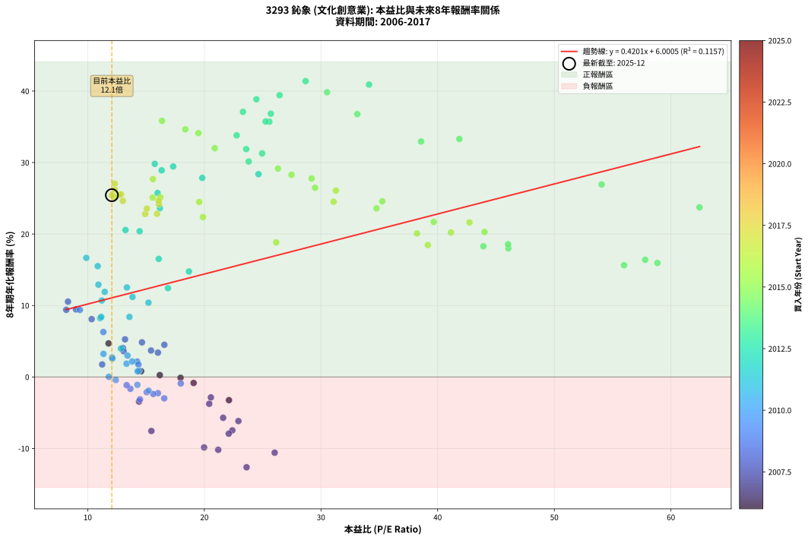
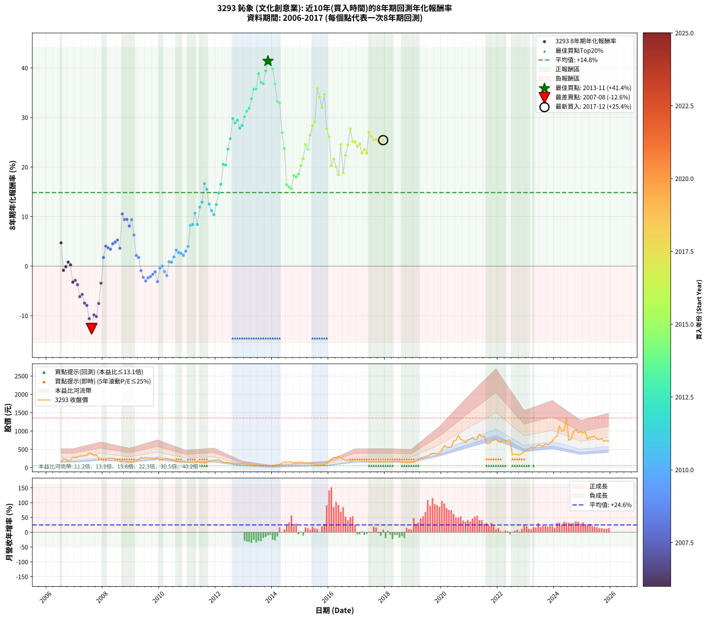

# 3293 鈊象 - 本益比與未來報酬率分析

!!! info "報告資訊"
    - **股票代號**: 3293
    - **公司名稱**: 鈊象
    - **產業別**: 文化創意業
    - **分析期間**: 2006-2017 (138 個數據點)
    - **資料來源**: Type 12 (ShowMonthlyK_ChartFlow) 月收盤價與本益比
    - **報酬率口徑**: 含現金股利 (簡化: 年度合計，假設每年7/1入帳)
    - **報告生成時間**: 2026-01-07 21:04:08 CST

## 📈 視覺化圖表

### 圖表1: 本益比 vs 未來報酬率關係

*圖表1：3293 鈊象 本益比與8年期未來報酬率關係 (2006-2017)*

### 圖表2: 歷年買入時點的8年期實際報酬率

*圖表2：3293 鈊象 歷年買入時點的8年期實際報酬率 (2006-2017)*

## 📍 買點訊號說明

本報告提供兩種買點提示訊號（顯示於圖表2的股價子圖中）：

### ▲ 小綠色三角形（回測驗證）
- **計算方式**: 使用全部歷史資料計算本益比第25百分位數
- **用途**: 事後驗證，顯示歷史上哪些時點確實為低估區
- **限制**: 當下無法判斷，僅供回測參考
- **特性**: 後見之明（Look-Ahead Bias）

### ▲ 小橘色三角形（即時訊號）
- **計算方式**: 使用截至當月的過去5年資料計算本益比第25百分位數
- **用途**: 實際投資決策，當時即可判斷
- **優勢**: 可操作性強，符合實務需求
- **特性**: 無後見之明，滾動窗口計算

!!! tip "如何使用兩種訊號"
    - **綠色▲** 幫助理解歷史估值機會，驗證策略有效性
    - **橘色▲** 可作為實際買進參考，但仍需搭配基本面分析
    - 兩種訊號重疊時，表示即時判斷與事後驗證一致，信心度較高
    - 僅有綠色▲時，表示當時無法判斷（需要未來資料才能確認）
    - 僅有橘色▲時，表示即時判斷為買點，但事後可能不是最佳時機

## 📊 估值分析摘要

| 指標 | 數值 |
|:---:|:---:|
| **目前本益比** (2017-12) | **12.07 倍** |
| **歷史平均本益比** | 21.04 倍 |
| **估值水準** | 🟢 相對低估 |
| **預期8年年化報酬率** | **+11.07%** |
| **歷史平均報酬率** | +14.84% |
| **相關係數 (R²)** | 0.1157 |
| **趨勢線斜率** | 0.4201 |

!!! abstract "核心洞察"
    目前本益比顯著低於歷史平均，預期未來報酬率可能較高

    根據歷史數據回測，3293 鈊象 在目前本益比 **12.1倍** 的估值水準下，
    預期未來8年年化報酬率約為 **+11.1%**。

    **重要提醒**: 本分析基於歷史數據統計，實際報酬率會受到公司基本面變化、產業趨勢、
    總體經濟環境等多重因素影響。R² = 0.12 表示本益比可解釋約 11.6% 的報酬率變異。

## 📈 歷史估值統計

### 最佳買點 (最高報酬率)

| 項目 | 數值 |
|:---:|:---:|
| 起始時間 | 2013-11 |
| 當時本益比 | 28.68 倍 |
| 起始價格 | 55.6 元 |
| 8年後價格 | 780.0 元 |
| **8年年化報酬率** | **+41.40%** |

### 最差買點 (最低報酬率)

| 項目 | 數值 |
|:---:|:---:|
| 起始時間 | 2007-08 |
| 當時本益比 | 23.62 倍 |
| 起始價格 | 377.5 元 |
| 8年後價格 | 65.9 元 |
| **8年年化報酬率** | **-12.63%** |

## 🎯 投資啟示

### 本益比與報酬率關係

趨勢線方程式: **y = 0.4201x + 6.0005**

!!! info "弱相關或正相關"
    本益比與未來報酬率相關性較弱。這可能表示該股票的報酬率更多受到
    公司成長性、產業趨勢等因素影響，而非估值水準。**需綜合考量多項指標**。

### 估值區間建議

基於歷史數據分析:

- **🟢 低估區** (P/E < 16.8): 預期報酬率較高，可考慮增加持股
- **🟡 合理區** (P/E 16.8-25.3): 預期報酬率符合長期趨勢，正常持有
- **🔴 高估區** (P/E > 25.3): 預期報酬率較低，可考慮減碼或觀望

!!! danger "風險提示"
    - 過去表現不代表未來結果
    - 本分析假設公司基本面無重大結構性變化
    - 產業環境劇變可能使歷史規律失效
    - 應結合公司財報、產業趨勢、總體經濟等多重因素綜合判斷

!!! success "長期投資觀點"
    歷史數據顯示，在合理或低估的估值水準買入並長期持有，
    往往能獲得較佳的投資報酬。**耐心等待好價格**是價值投資的核心原則。

## 📊 數據品質

- **資料來源**: GoodInfo.tw Type 12 (ShowMonthlyK_ChartFlow)
- **資料頻率**: 月度收盤價與本益比
- **回測期間**: 2006-2017
- **數據點數量**: 138 個 (每個點代表一次8年期回測)

### 計算方法說明

1. **8年期年化報酬率**:
   - 對每個歷史時點，計算其後8年的實際投資報酬率
   - 期末價值(不含股利): 期末價格
   - 期末價值(含現金股利): 期末價格 + 持有期間內的現金股利合計 (簡化: 年度合計，假設每年7/1入帳)
   - 公式: 年化報酬率 = [(期末價值/期初價格)^(1/年數) - 1] × 100%

2. **本益比 (P/E Ratio)**:
   - 使用當時的月收盤價與EPS計算
   - 資料來源: Type 12 月度河流圖本益比數據

3. **趨勢線 (Linear Regression)**:
   - 使用最小平方法擬合線性趨勢線
   - R²值衡量本益比對報酬率的解釋能力

---

*本報告由 Stock Analysis System v1.9.0 自動生成*
*數據更新時間: 2026-01-07 21:04:08 CST*

## 📋 月度回測明細表

（每一列對應時間線圖中的一個買入點；可用來對照 SVG 圖上的每個點。）

| 買入月份 | 賣出月份 | 回測期限_年 | 實際持有年數 | 買入本益比_倍 | 買入收盤價_元 | 賣出收盤價_元 | 現金股利合計_元 | 總報酬率_pct | 年化報酬率_pct |
| --- | --- | --- | --- | --- | --- | --- | --- | --- | --- |
| 2006-07 | 2014-07 | 8 | 8.000 | 11.79 | 152.00 | 151.50 | 67.93 | +44.36 | +4.70 |
| 2006-08 | 2014-08 | 8 | 8.000 | 19.08 | 246.00 | 162.00 | 67.93 | -6.53 | -0.84 |
| 2006-09 | 2014-09 | 8 | 8.000 | 17.96 | 231.50 | 161.50 | 67.93 | -0.90 | -0.11 |
| 2006-10 | 2014-10 | 8 | 8.000 | 14.58 | 188.00 | 132.50 | 67.93 | +6.61 | +0.80 |
| 2006-11 | 2014-11 | 8 | 8.000 | 16.18 | 208.50 | 145.00 | 67.93 | +2.12 | +0.26 |
| 2006-12 | 2014-12 | 8 | 8.000 | 22.11 | 285.00 | 151.00 | 67.93 | -23.18 | -3.24 |
| 2007-01 | 2015-01 | 8 | 8.000 | 20.56 | 273.00 | 148.50 | 67.93 | -20.72 | -2.86 |
| 2007-02 | 2015-02 | 8 | 8.000 | 20.42 | 279.00 | 137.50 | 67.93 | -26.37 | -3.75 |
| 2007-03 | 2015-03 | 8 | 8.000 | 22.92 | 322.00 | 125.50 | 67.93 | -39.93 | -6.17 |
| 2007-04 | 2015-04 | 8 | 8.000 | 21.61 | 312.00 | 127.00 | 67.93 | -37.52 | -5.71 |
| 2007-05 | 2015-05 | 8 | 8.000 | 22.40 | 332.00 | 110.50 | 67.93 | -46.26 | -7.47 |
| 2007-06 | 2015-06 | 8 | 8.000 | 22.09 | 336.00 | 105.50 | 67.93 | -48.38 | -7.93 |
| 2007-07 | 2015-07 | 8 | 8.000 | 26.03 | 406.00 | 103.50 | 62.23 | -59.18 | -10.60 |
| 2007-08 | 2015-08 | 8 | 8.000 | 23.62 | 377.50 | 65.90 | 62.23 | -66.06 | -12.63 |
| 2007-09 | 2015-09 | 8 | 8.000 | 19.98 | 327.00 | 80.30 | 62.23 | -56.41 | -9.86 |
| 2007-10 | 2015-10 | 8 | 8.000 | 21.19 | 355.00 | 88.00 | 62.23 | -57.68 | -10.19 |
| 2007-11 | 2015-11 | 8 | 8.000 | 15.46 | 265.00 | 79.10 | 62.23 | -46.67 | -7.56 |
| 2007-12 | 2015-12 | 8 | 8.000 | 14.40 | 252.50 | 128.50 | 62.23 | -24.46 | -3.45 |
| 2008-01 | 2016-01 | 8 | 8.000 | 11.24 | 193.00 | 159.50 | 62.23 | +14.88 | +1.75 |
| 2008-02 | 2016-02 | 8 | 8.000 | 13.02 | 219.00 | 238.50 | 62.23 | +37.32 | +4.04 |
| 2008-03 | 2016-03 | 8 | 8.000 | 15.43 | 254.00 | 277.50 | 62.23 | +33.75 | +3.70 |
| 2008-04 | 2016-04 | 8 | 8.000 | 16.02 | 258.00 | 275.00 | 62.23 | +30.71 | +3.40 |
| 2008-05 | 2016-05 | 8 | 8.000 | 16.57 | 261.00 | 309.00 | 62.23 | +42.23 | +4.50 |
| 2008-06 | 2016-06 | 8 | 8.000 | 14.65 | 225.50 | 267.00 | 62.23 | +46.00 | +4.84 |
| 2008-07 | 2016-07 | 8 | 8.000 | 13.20 | 198.50 | 243.00 | 56.28 | +50.77 | +5.27 |
| 2008-08 | 2016-08 | 8 | 8.000 | 13.08 | 192.00 | 198.50 | 56.28 | +32.70 | +3.60 |
| 2008-09 | 2016-09 | 8 | 8.000 | 8.31 | 119.00 | 209.00 | 56.28 | +122.92 | +10.54 |
| 2008-10 | 2016-10 | 8 | 8.000 | 8.16 | 114.00 | 177.50 | 56.28 | +105.07 | +9.39 |
| 2008-11 | 2016-11 | 8 | 8.000 | 9.00 | 122.50 | 196.00 | 56.28 | +105.94 | +9.45 |
| 2008-12 | 2016-12 | 8 | 8.000 | 10.34 | 137.00 | 199.00 | 56.28 | +86.33 | +8.09 |
| 2009-01 | 2017-01 | 8 | 8.000 | 9.33 | 128.00 | 206.00 | 56.28 | +104.90 | +9.38 |
| 2009-02 | 2017-02 | 8 | 8.000 | 11.34 | 161.00 | 206.00 | 56.28 | +62.91 | +6.29 |
| 2009-03 | 2017-03 | 8 | 8.000 | 14.24 | 209.00 | 191.50 | 56.28 | +18.55 | +2.15 |
| 2009-04 | 2017-04 | 8 | 8.000 | 14.35 | 217.50 | 193.50 | 56.28 | +14.84 | +1.74 |
| 2009-05 | 2017-05 | 8 | 8.000 | 17.98 | 281.00 | 205.00 | 56.28 | -7.02 | -0.91 |
| 2009-06 | 2017-06 | 8 | 8.000 | 16.02 | 258.00 | 158.50 | 56.28 | -16.75 | -2.27 |
| 2009-07 | 2017-07 | 8 | 8.000 | 16.56 | 274.50 | 159.00 | 56.29 | -21.57 | -2.99 |
| 2009-08 | 2017-08 | 8 | 8.000 | 15.62 | 266.50 | 163.50 | 56.29 | -17.53 | -2.38 |
| 2009-09 | 2017-09 | 8 | 8.000 | 15.06 | 264.00 | 166.00 | 56.29 | -15.80 | -2.13 |
| 2009-10 | 2017-10 | 8 | 8.000 | 13.66 | 246.00 | 159.00 | 56.29 | -12.49 | -1.65 |
| 2009-11 | 2017-11 | 8 | 8.000 | 13.34 | 246.50 | 168.50 | 56.29 | -8.81 | -1.15 |
| 2009-12 | 2017-12 | 8 | 8.000 | 14.48 | 274.50 | 156.50 | 56.29 | -22.48 | -3.13 |
| 2010-01 | 2018-01 | 8 | 8.000 | 12.41 | 228.00 | 164.00 | 56.29 | -3.38 | -0.43 |
| 2010-02 | 2018-02 | 8 | 8.000 | 11.81 | 210.00 | 154.00 | 56.29 | +0.14 | +0.02 |
| 2010-03 | 2018-03 | 8 | 8.000 | 14.26 | 245.00 | 168.00 | 56.29 | -8.46 | -1.10 |
| 2010-04 | 2018-04 | 8 | 8.000 | 15.22 | 252.50 | 160.00 | 56.29 | -14.34 | -1.92 |
| 2010-05 | 2018-05 | 8 | 8.000 | 14.40 | 230.50 | 191.00 | 56.29 | +7.28 | +0.88 |
| 2010-06 | 2018-06 | 8 | 8.000 | 14.28 | 220.00 | 178.00 | 56.29 | +6.49 | +0.79 |
| 2010-07 | 2018-07 | 8 | 8.000 | 13.33 | 197.50 | 172.50 | 56.30 | +15.85 | +1.86 |
| 2010-08 | 2018-08 | 8 | 8.000 | 11.35 | 161.50 | 152.00 | 56.30 | +28.98 | +3.23 |
| 2010-09 | 2018-09 | 8 | 8.000 | 12.10 | 165.00 | 148.50 | 56.30 | +24.12 | +2.74 |
| 2010-10 | 2018-10 | 8 | 8.000 | 12.11 | 158.00 | 137.50 | 56.30 | +22.66 | +2.59 |
| 2010-11 | 2018-11 | 8 | 8.000 | 13.81 | 172.00 | 148.00 | 56.30 | +18.78 | +2.17 |
| 2010-12 | 2018-12 | 8 | 8.000 | 13.41 | 159.00 | 145.00 | 56.30 | +26.60 | +2.99 |
| 2011-01 | 2019-01 | 8 | 8.000 | 12.85 | 154.00 | 154.00 | 56.30 | +36.56 | +3.97 |
| 2011-02 | 2019-02 | 8 | 8.000 | 11.07 | 134.00 | 196.00 | 56.30 | +88.28 | +8.23 |
| 2011-03 | 2019-03 | 8 | 8.000 | 11.16 | 136.50 | 204.00 | 56.30 | +90.69 | +8.40 |
| 2011-04 | 2019-04 | 8 | 8.000 | 11.21 | 138.50 | 256.00 | 56.30 | +125.48 | +10.70 |
| 2011-05 | 2019-05 | 8 | 8.000 | 13.58 | 169.50 | 267.00 | 56.30 | +90.73 | +8.41 |
| 2011-06 | 2019-06 | 8 | 8.000 | 11.46 | 144.50 | 299.00 | 56.30 | +145.88 | +11.90 |
| 2011-07 | 2019-07 | 8 | 8.000 | 10.92 | 139.00 | 309.50 | 57.80 | +164.24 | +12.91 |
| 2011-08 | 2019-08 | 8 | 8.000 | 9.88 | 127.00 | 378.00 | 57.80 | +243.15 | +16.66 |
| 2011-09 | 2019-09 | 8 | 8.000 | 10.86 | 141.00 | 389.00 | 57.80 | +216.88 | +15.51 |
| 2011-10 | 2019-10 | 8 | 8.000 | 13.36 | 175.00 | 392.00 | 57.80 | +157.03 | +12.52 |
| 2011-11 | 2019-11 | 8 | 8.000 | 13.84 | 183.00 | 370.00 | 57.80 | +133.77 | +11.20 |
| 2011-12 | 2019-12 | 8 | 8.000 | 15.21 | 203.00 | 390.00 | 57.80 | +120.59 | +10.39 |
| 2012-01 | 2020-01 | 8 | 8.000 | 16.88 | 213.00 | 486.00 | 57.80 | +155.30 | +12.43 |
| 2012-02 | 2020-02 | 8 | 8.000 | 18.68 | 222.00 | 610.00 | 57.80 | +200.81 | +14.76 |
| 2012-03 | 2020-03 | 8 | 8.000 | 16.09 | 179.50 | 552.00 | 57.80 | +239.72 | +16.52 |
| 2012-04 | 2020-04 | 8 | 8.000 | 13.24 | 138.00 | 558.00 | 57.80 | +346.23 | +20.56 |
| 2012-05 | 2020-05 | 8 | 8.000 | 14.45 | 140.00 | 560.00 | 57.80 | +341.28 | +20.39 |
| 2012-06 | 2020-06 | 8 | 8.000 | 16.19 | 145.00 | 733.00 | 57.80 | +445.38 | +23.62 |
| 2012-07 | 2020-07 | 8 | 8.000 | 15.99 | 131.50 | 750.00 | 71.80 | +524.94 | +25.74 |
| 2012-08 | 2020-08 | 8 | 8.000 | 15.75 | 118.00 | 880.00 | 71.80 | +706.61 | +29.82 |
| 2012-09 | 2020-09 | 8 | 8.000 | 16.34 | 110.50 | 771.00 | 71.80 | +662.71 | +28.91 |
| 2012-10 | 2020-10 | 8 | 8.000 | 17.33 | 104.50 | 752.00 | 71.80 | +688.32 | +29.45 |
| 2012-11 | 2020-11 | 8 | 8.000 | 19.82 | 105.00 | 678.00 | 71.80 | +614.09 | +27.86 |
| 2012-12 | 2020-12 | 8 | 8.000 | 24.64 | 112.50 | 758.00 | 71.80 | +637.60 | +28.37 |
| 2013-01 | 2021-01 | 8 | 8.000 | 23.80 | 103.00 | 776.00 | 71.80 | +723.10 | +30.15 |
| 2013-02 | 2021-02 | 8 | 8.000 | 24.95 | 102.00 | 828.00 | 71.80 | +782.15 | +31.28 |
| 2013-03 | 2021-03 | 8 | 8.000 | 23.59 | 90.80 | 759.00 | 71.80 | +814.97 | +31.88 |
| 2013-04 | 2021-04 | 8 | 8.000 | 22.77 | 82.20 | 773.00 | 71.80 | +927.73 | +33.81 |
| 2013-05 | 2021-05 | 8 | 8.000 | 25.57 | 86.20 | 920.00 | 71.80 | +1050.57 | +35.71 |
| 2013-06 | 2021-06 | 8 | 8.000 | 25.25 | 79.10 | 840.00 | 71.80 | +1052.71 | +35.74 |
| 2013-07 | 2021-07 | 8 | 8.000 | 24.46 | 70.80 | 870.00 | 108.30 | +1281.77 | +38.85 |
| 2013-08 | 2021-08 | 8 | 8.000 | 23.31 | 61.90 | 664.00 | 108.30 | +1147.65 | +37.09 |
| 2013-09 | 2021-09 | 8 | 8.000 | 25.70 | 62.10 | 655.00 | 108.30 | +1129.14 | +36.84 |
| 2013-10 | 2021-10 | 8 | 8.000 | 26.45 | 57.60 | 714.00 | 108.30 | +1327.60 | +39.42 |
| 2013-11 | 2021-11 | 8 | 8.000 | 28.68 | 55.60 | 780.00 | 108.30 | +1497.65 | +41.40 |
| 2013-12 | 2021-12 | 8 | 8.000 | 34.12 | 58.00 | 793.00 | 108.30 | +1453.96 | +40.91 |
| 2014-01 | 2022-01 | 8 | 8.000 | 30.52 | 55.90 | 709.00 | 108.30 | +1362.07 | +39.84 |
| 2014-02 | 2022-02 | 8 | 8.000 | 33.11 | 65.00 | 688.00 | 108.30 | +1125.07 | +36.78 |
| 2014-03 | 2022-03 | 8 | 8.000 | 41.86 | 87.70 | 766.00 | 108.30 | +896.92 | +33.30 |
| 2014-04 | 2022-04 | 8 | 8.000 | 38.58 | 85.90 | 730.00 | 108.30 | +875.90 | +32.95 |
| 2014-05 | 2022-05 | 8 | 8.000 | 54.06 | 127.50 | 751.00 | 108.30 | +573.96 | +26.93 |
| 2014-06 | 2022-06 | 8 | 8.000 | 62.45 | 155.50 | 746.00 | 108.30 | +449.39 | +23.73 |
| 2014-07 | 2022-07 | 8 | 8.000 | 57.79 | 151.50 | 354.00 | 156.30 | +236.83 | +16.39 |
| 2014-08 | 2022-08 | 8 | 8.000 | 58.84 | 162.00 | 373.00 | 156.30 | +226.73 | +15.95 |
| 2014-09 | 2022-09 | 8 | 8.000 | 55.98 | 161.50 | 360.00 | 156.30 | +219.69 | +15.64 |
| 2014-10 | 2022-10 | 8 | 8.000 | 43.92 | 132.50 | 351.50 | 156.30 | +283.25 | +18.29 |
| 2014-11 | 2022-11 | 8 | 8.000 | 46.06 | 145.00 | 388.50 | 156.30 | +275.72 | +17.99 |
| 2014-12 | 2022-12 | 8 | 8.000 | 46.04 | 151.00 | 433.50 | 156.30 | +290.60 | +18.57 |
| 2015-01 | 2023-01 | 8 | 8.000 | 44.02 | 148.50 | 494.50 | 156.30 | +338.25 | +20.29 |
| 2015-02 | 2023-02 | 8 | 8.000 | 39.66 | 137.50 | 505.00 | 156.30 | +380.95 | +21.69 |
| 2015-03 | 2023-03 | 8 | 8.000 | 35.25 | 125.50 | 572.00 | 156.30 | +480.32 | +24.58 |
| 2015-04 | 2023-04 | 8 | 8.000 | 34.76 | 127.00 | 535.00 | 156.30 | +444.33 | +23.59 |
| 2015-05 | 2023-05 | 8 | 8.000 | 29.49 | 110.50 | 567.00 | 156.30 | +554.57 | +26.47 |
| 2015-06 | 2023-06 | 8 | 8.000 | 27.47 | 105.50 | 618.00 | 156.30 | +633.93 | +28.29 |
| 2015-07 | 2023-07 | 8 | 8.000 | 26.31 | 103.50 | 613.00 | 188.50 | +674.40 | +29.16 |
| 2015-08 | 2023-08 | 8 | 8.000 | 16.37 | 65.90 | 575.00 | 188.50 | +1058.57 | +35.83 |
| 2015-09 | 2023-09 | 8 | 8.000 | 19.49 | 80.30 | 652.00 | 188.50 | +946.70 | +34.12 |
| 2015-10 | 2023-10 | 8 | 8.000 | 20.89 | 88.00 | 623.00 | 188.50 | +822.16 | +32.01 |
| 2015-11 | 2023-11 | 8 | 8.000 | 18.37 | 79.10 | 666.00 | 188.50 | +980.28 | +34.65 |
| 2015-12 | 2023-12 | 8 | 8.000 | 29.20 | 128.50 | 724.00 | 188.50 | +610.12 | +27.77 |
| 2016-01 | 2024-01 | 8 | 8.000 | 31.28 | 159.50 | 830.00 | 188.50 | +538.56 | +26.08 |
| 2016-02 | 2024-02 | 8 | 8.000 | 41.14 | 238.50 | 852.00 | 188.50 | +336.27 | +20.22 |
| 2016-03 | 2024-03 | 8 | 8.000 | 42.73 | 277.50 | 1140.00 | 188.50 | +378.74 | +21.62 |
| 2016-04 | 2024-04 | 8 | 8.000 | 38.23 | 275.00 | 1000.00 | 188.50 | +332.18 | +20.08 |
| 2016-05 | 2024-05 | 8 | 8.000 | 39.16 | 309.00 | 1010.00 | 188.50 | +287.86 | +18.46 |
| 2016-06 | 2024-06 | 8 | 8.000 | 31.08 | 267.00 | 1355.00 | 188.50 | +478.09 | +24.52 |
| 2016-07 | 2024-07 | 8 | 8.000 | 26.16 | 243.00 | 747.00 | 219.00 | +297.53 | +18.83 |
| 2016-08 | 2024-08 | 8 | 8.000 | 19.88 | 198.50 | 779.00 | 219.00 | +402.77 | +22.37 |
| 2016-09 | 2024-09 | 8 | 8.000 | 19.56 | 209.00 | 986.00 | 219.00 | +476.56 | +24.48 |
| 2016-10 | 2024-10 | 8 | 8.000 | 15.59 | 177.50 | 1035.00 | 219.00 | +606.48 | +27.68 |
| 2016-11 | 2024-11 | 8 | 8.000 | 16.22 | 196.00 | 960.00 | 219.00 | +501.53 | +25.14 |
| 2016-12 | 2024-12 | 8 | 8.000 | 15.57 | 199.00 | 974.00 | 219.00 | +499.50 | +25.09 |
| 2017-01 | 2025-01 | 8 | 8.000 | 16.10 | 206.00 | 946.00 | 219.00 | +465.53 | +24.18 |
| 2017-02 | 2025-02 | 8 | 8.000 | 16.08 | 206.00 | 982.00 | 219.00 | +483.01 | +24.65 |
| 2017-03 | 2025-03 | 8 | 8.000 | 14.93 | 191.50 | 772.00 | 219.00 | +417.49 | +22.81 |
| 2017-04 | 2025-04 | 8 | 8.000 | 15.07 | 193.50 | 832.00 | 219.00 | +443.15 | +23.56 |
| 2017-05 | 2025-05 | 8 | 8.000 | 15.94 | 205.00 | 843.00 | 219.00 | +418.05 | +22.83 |
| 2017-06 | 2025-06 | 8 | 8.000 | 12.31 | 158.50 | 858.00 | 219.00 | +579.50 | +27.06 |
| 2017-07 | 2025-07 | 8 | 8.000 | 12.33 | 159.00 | 786.00 | 238.00 | +544.03 | +26.22 |
| 2017-08 | 2025-08 | 8 | 8.000 | 12.67 | 163.50 | 765.00 | 238.00 | +513.46 | +25.45 |
| 2017-09 | 2025-09 | 8 | 8.000 | 12.85 | 166.00 | 787.00 | 238.00 | +517.47 | +25.55 |
| 2017-10 | 2025-10 | 8 | 8.000 | 12.29 | 159.00 | 720.00 | 238.00 | +502.52 | +25.17 |
| 2017-11 | 2025-11 | 8 | 8.000 | 13.01 | 168.50 | 743.00 | 238.00 | +482.20 | +24.63 |
| 2017-12 | 2025-12 | 8 | 8.000 | 12.07 | 156.50 | 721.00 | 238.00 | +512.78 | +25.43 |
