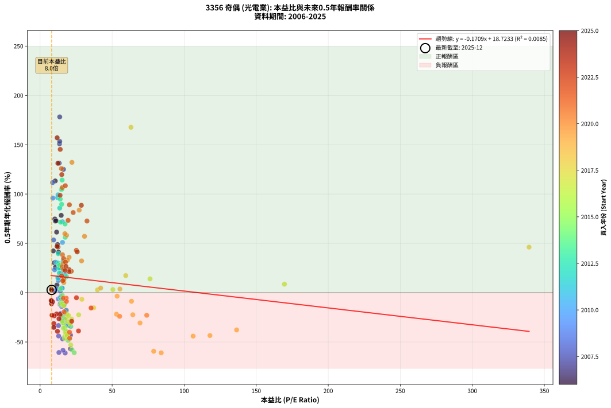
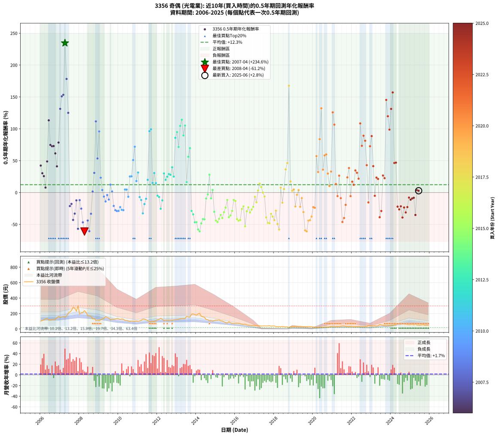

# 3356 奇偶 - 本益比與未來報酬率分析

!!! info "報告資訊"
    - **股票代號**: 3356
    - **公司名稱**: 奇偶
    - **產業別**: 光電業
    - **分析期間**: 2006-2025 (234 個數據點)
    - **資料來源**: Type 12 (ShowMonthlyK_ChartFlow) 月收盤價與本益比
    - **報酬率口徑**: 含現金股利 (簡化: 年度合計，假設每年7/1入帳)
    - **報告生成時間**: 2026-01-13 13:43:33 CST

## 📈 視覺化圖表

### 圖表1: 本益比 vs 未來報酬率關係

*圖表1：3356 奇偶 本益比與0.5年期未來報酬率關係 (2006-2025)*

### 圖表2: 歷年買入時點的0.5年期實際報酬率

*圖表2：3356 奇偶 歷年買入時點的0.5年期實際報酬率 (2006-2025)*

## 📍 買點訊號說明

本報告提供兩種買點提示訊號（顯示於圖表2的股價子圖中）：

### ▲ 小綠色三角形（回測驗證）
- **計算方式**: 使用全部歷史資料計算本益比第25百分位數
- **用途**: 事後驗證，顯示歷史上哪些時點確實為低估區
- **限制**: 當下無法判斷，僅供回測參考
- **特性**: 後見之明（Look-Ahead Bias）

### ▲ 小橘色三角形（即時訊號）
- **計算方式**: 使用截至當月的過去5年資料計算本益比第25百分位數
- **用途**: 實際投資決策，當時即可判斷
- **優勢**: 可操作性強，符合實務需求
- **特性**: 無後見之明，滾動窗口計算

!!! tip "如何使用兩種訊號"
    - **綠色▲** 幫助理解歷史估值機會，驗證策略有效性
    - **橘色▲** 可作為實際買進參考，但仍需搭配基本面分析
    - 兩種訊號重疊時，表示即時判斷與事後驗證一致，信心度較高
    - 僅有綠色▲時，表示當時無法判斷（需要未來資料才能確認）
    - 僅有橘色▲時，表示即時判斷為買點，但事後可能不是最佳時機

## 📊 估值分析摘要

| 指標 | 數值 |
|:---:|:---:|
| **目前本益比** (2025-06) | **8.02 倍** |
| **歷史平均本益比** | 23.09 倍 |
| **估值水準** | 🟢 相對低估 |
| **預期0.5年年化報酬率** | **+17.35%** |
| **歷史平均報酬率** | +12.30% |
| **相關係數 (R²)** | 0.0085 |
| **趨勢線斜率** | -0.1709 |

!!! abstract "核心洞察"
    目前本益比顯著低於歷史平均，預期未來報酬率可能較高

    根據歷史數據回測，3356 奇偶 在目前本益比 **8.0倍** 的估值水準下，
    預期未來0.5年年化報酬率約為 **+17.4%**。

    **重要提醒**: 本分析基於歷史數據統計，實際報酬率會受到公司基本面變化、產業趨勢、
    總體經濟環境等多重因素影響。R² = 0.01 表示本益比可解釋約 0.8% 的報酬率變異。

## 📈 歷史估值統計

### 最佳買點 (最高報酬率)

| 項目 | 數值 |
|:---:|:---:|
| 起始時間 | 2007-04 |
| 當時本益比 | 12.54 倍 |
| 起始價格 | 152.5 元 |
| 0.5年後價格 | 270.5 元 |
| **0.5年年化報酬率** | **+234.60%** |

### 最差買點 (最低報酬率)

| 項目 | 數值 |
|:---:|:---:|
| 起始時間 | 2008-04 |
| 當時本益比 | 17.41 倍 |
| 起始價格 | 237.0 元 |
| 0.5年後價格 | 136.5 元 |
| **0.5年年化報酬率** | **-61.19%** |

## 🎯 投資啟示

### 本益比與報酬率關係

趨勢線方程式: **y = -0.1709x + 18.7233**

!!! note "負相關"
    本益比與未來報酬率呈現負相關。較低的本益比通常帶來較高的未來報酬率，
    但相關性不算非常強。**估值仍是重要參考指標之一**。

### 估值區間建議

基於歷史數據分析:

- **🟢 低估區** (P/E < 18.5): 預期報酬率較高，可考慮增加持股
- **🟡 合理區** (P/E 18.5-27.7): 預期報酬率符合長期趨勢，正常持有
- **🔴 高估區** (P/E > 27.7): 預期報酬率較低，可考慮減碼或觀望

!!! danger "風險提示"
    - 過去表現不代表未來結果
    - 本分析假設公司基本面無重大結構性變化
    - 產業環境劇變可能使歷史規律失效
    - 應結合公司財報、產業趨勢、總體經濟等多重因素綜合判斷

!!! success "長期投資觀點"
    歷史數據顯示，在合理或低估的估值水準買入並長期持有，
    往往能獲得較佳的投資報酬。**耐心等待好價格**是價值投資的核心原則。

## 📊 數據品質

- **資料來源**: GoodInfo.tw Type 12 (ShowMonthlyK_ChartFlow)
- **資料頻率**: 月度收盤價與本益比
- **回測期間**: 2006-2025
- **數據點數量**: 234 個 (每個點代表一次0.5年期回測)

### 計算方法說明

1. **0.5年期年化報酬率**:
   - 對每個歷史時點，計算其後0.5年的實際投資報酬率
   - 期末價值(不含股利): 期末價格
   - 期末價值(含現金股利): 期末價格 + 持有期間內的現金股利合計 (簡化: 年度合計，假設每年7/1入帳)
   - 公式: 年化報酬率 = [(期末價值/期初價格)^(1/年數) - 1] × 100%

2. **本益比 (P/E Ratio)**:
   - 使用當時的月收盤價與EPS計算
   - 資料來源: Type 12 月度河流圖本益比數據

3. **趨勢線 (Linear Regression)**:
   - 使用最小平方法擬合線性趨勢線
   - R²值衡量本益比對報酬率的解釋能力

---

*本報告由 Stock Analysis System v1.9.0 自動生成*
*數據更新時間: 2026-01-13 13:43:33 CST*

## 📋 月度回測明細表

（每一列對應時間線圖中的一個買入點；可用來對照 SVG 圖上的每個點。）

| 買入月份 | 賣出月份 | 回測期限_年 | 實際持有年數 | 買入本益比_倍 | 買入收盤價_元 | 賣出收盤價_元 | 現金股利合計_元 | 總報酬率_pct | 年化報酬率_pct |
| --- | --- | --- | --- | --- | --- | --- | --- | --- | --- |
| 2006-01 | 2006-07 | 0.5 | 0.496 | 9.14 | 102.00 | 114.00 | 7.50 | +19.12 | +42.34 |
| 2006-02 | 2006-08 | 0.5 | 0.498 | 9.86 | 110.00 | 118.00 | 7.50 | +14.09 | +30.29 |
| 2006-03 | 2006-10 | 0.5 | 0.586 | 10.62 | 118.50 | 128.00 | 7.50 | +14.35 | +25.71 |
| 2006-04 | 2006-10 | 0.5 | 0.501 | 11.69 | 130.50 | 128.00 | 7.50 | +3.83 | +7.79 |
| 2006-05 | 2006-12 | 0.5 | 0.586 | 12.14 | 135.50 | 163.50 | 7.50 | +26.20 | +48.76 |
| 2006-06 | 2006-12 | 0.5 | 0.501 | 10.48 | 117.00 | 163.50 | 7.50 | +46.15 | +113.28 |
| 2006-07 | 2007-01 | 0.5 | 0.504 | 10.22 | 114.00 | 151.00 | 0.00 | +32.46 | +74.71 |
| 2006-08 | 2007-03 | 0.5 | 0.580 | 10.57 | 118.00 | 162.00 | 0.00 | +37.29 | +72.63 |
| 2006-09 | 2007-03 | 0.5 | 0.496 | 11.07 | 123.50 | 162.00 | 0.00 | +31.17 | +72.91 |
| 2006-10 | 2007-05 | 0.5 | 0.580 | 11.47 | 128.00 | 169.00 | 0.00 | +32.03 | +61.40 |
| 2006-11 | 2007-05 | 0.5 | 0.496 | 12.77 | 142.50 | 169.00 | 0.00 | +18.60 | +41.08 |
| 2006-12 | 2007-07 | 0.5 | 0.580 | 14.65 | 163.50 | 220.00 | 8.80 | +39.94 | +78.42 |
| 2007-01 | 2007-07 | 0.5 | 0.496 | 13.23 | 151.00 | 220.00 | 8.80 | +51.52 | +131.31 |
| 2007-02 | 2007-08 | 0.5 | 0.498 | 13.46 | 157.00 | 239.50 | 8.80 | +58.15 | +150.91 |
| 2007-03 | 2007-10 | 0.5 | 0.586 | 13.60 | 162.00 | 270.50 | 8.80 | +72.41 | +153.37 |
| 2007-04 | 2007-10 | 0.5 | 0.501 | 12.54 | 152.50 | 270.50 | 8.80 | +83.15 | +234.60 |
| 2007-05 | 2007-12 | 0.5 | 0.586 | 13.61 | 169.00 | 299.00 | 8.80 | +82.13 | +178.24 |
| 2007-06 | 2007-12 | 0.5 | 0.501 | 16.19 | 205.00 | 299.00 | 8.80 | +50.15 | +125.06 |
| 2007-07 | 2008-01 | 0.5 | 0.504 | 17.03 | 220.00 | 195.00 | 0.00 | -11.36 | -21.29 |
| 2007-08 | 2008-03 | 0.5 | 0.583 | 18.19 | 239.50 | 213.50 | 0.00 | -10.86 | -17.89 |
| 2007-09 | 2008-03 | 0.5 | 0.498 | 21.05 | 282.50 | 213.50 | 0.00 | -24.42 | -42.99 |
| 2007-10 | 2008-05 | 0.5 | 0.583 | 19.79 | 270.50 | 214.00 | 0.00 | -20.89 | -33.09 |
| 2007-11 | 2008-05 | 0.5 | 0.498 | 16.42 | 228.50 | 214.00 | 0.00 | -6.35 | -12.33 |
| 2007-12 | 2008-07 | 0.5 | 0.583 | 21.10 | 299.00 | 172.00 | 11.00 | -38.80 | -56.91 |
| 2008-01 | 2008-07 | 0.5 | 0.498 | 13.90 | 195.00 | 172.00 | 11.00 | -6.15 | -11.97 |
| 2008-02 | 2008-08 | 0.5 | 0.501 | 14.83 | 206.00 | 167.00 | 11.00 | -13.59 | -25.29 |
| 2008-03 | 2008-10 | 0.5 | 0.586 | 15.53 | 213.50 | 136.50 | 11.00 | -30.91 | -46.80 |
| 2008-04 | 2008-10 | 0.5 | 0.501 | 17.41 | 237.00 | 136.50 | 11.00 | -37.76 | -61.19 |
| 2008-05 | 2008-12 | 0.5 | 0.586 | 15.89 | 214.00 | 117.00 | 11.00 | -40.19 | -58.40 |
| 2008-06 | 2008-12 | 0.5 | 0.501 | 12.83 | 171.00 | 117.00 | 11.00 | -25.15 | -43.90 |
| 2008-07 | 2009-01 | 0.5 | 0.504 | 13.04 | 172.00 | 107.50 | 0.00 | -37.50 | -60.66 |
| 2008-08 | 2009-03 | 0.5 | 0.580 | 12.80 | 167.00 | 132.00 | 0.00 | -20.96 | -33.32 |
| 2008-09 | 2009-03 | 0.5 | 0.496 | 10.15 | 131.00 | 132.00 | 0.00 | +0.76 | +1.55 |
| 2008-10 | 2009-05 | 0.5 | 0.580 | 10.69 | 136.50 | 159.50 | 0.00 | +16.85 | +30.77 |
| 2008-11 | 2009-05 | 0.5 | 0.496 | 8.71 | 110.00 | 159.50 | 0.00 | +45.00 | +111.66 |
| 2008-12 | 2009-07 | 0.5 | 0.580 | 9.37 | 117.00 | 140.00 | 10.00 | +28.21 | +53.43 |
| 2009-01 | 2009-07 | 0.5 | 0.496 | 8.86 | 107.50 | 140.00 | 10.00 | +39.53 | +95.87 |
| 2009-02 | 2009-08 | 0.5 | 0.498 | 10.07 | 118.50 | 121.50 | 10.00 | +10.97 | +23.23 |
| 2009-03 | 2009-10 | 0.5 | 0.586 | 11.57 | 132.00 | 125.00 | 10.00 | +2.27 | +3.91 |
| 2009-04 | 2009-10 | 0.5 | 0.501 | 12.63 | 139.50 | 125.00 | 10.00 | -3.23 | -6.33 |
| 2009-05 | 2009-12 | 0.5 | 0.586 | 14.93 | 159.50 | 136.00 | 10.00 | -8.46 | -14.01 |
| 2009-06 | 2009-12 | 0.5 | 0.501 | 14.44 | 149.00 | 136.00 | 10.00 | -2.01 | -3.98 |
| 2009-07 | 2010-01 | 0.5 | 0.504 | 14.06 | 140.00 | 132.00 | 0.00 | -5.71 | -11.02 |
| 2009-08 | 2010-03 | 0.5 | 0.580 | 12.66 | 121.50 | 130.00 | 0.00 | +7.00 | +12.36 |
| 2009-09 | 2010-03 | 0.5 | 0.496 | 13.97 | 129.00 | 130.00 | 0.00 | +0.78 | +1.57 |
| 2009-10 | 2010-05 | 0.5 | 0.580 | 14.09 | 125.00 | 109.00 | 0.00 | -12.80 | -21.02 |
| 2009-11 | 2010-05 | 0.5 | 0.496 | 15.04 | 128.00 | 109.00 | 0.00 | -14.84 | -27.69 |
| 2009-12 | 2010-07 | 0.5 | 0.580 | 16.69 | 136.00 | 103.50 | 8.00 | -18.01 | -28.98 |
| 2010-01 | 2010-07 | 0.5 | 0.496 | 16.54 | 132.00 | 103.50 | 8.00 | -15.53 | -28.86 |
| 2010-02 | 2010-08 | 0.5 | 0.498 | 15.63 | 122.00 | 99.20 | 8.00 | -12.13 | -22.86 |
| 2010-03 | 2010-10 | 0.5 | 0.586 | 17.03 | 130.00 | 100.00 | 8.00 | -16.92 | -27.13 |
| 2010-04 | 2010-10 | 0.5 | 0.501 | 17.02 | 127.00 | 100.00 | 8.00 | -14.96 | -27.64 |
| 2010-05 | 2010-12 | 0.5 | 0.586 | 14.95 | 109.00 | 104.00 | 8.00 | +2.75 | +4.74 |
| 2010-06 | 2010-12 | 0.5 | 0.501 | 15.38 | 109.50 | 104.00 | 8.00 | +2.28 | +4.61 |
| 2010-07 | 2011-01 | 0.5 | 0.504 | 14.90 | 103.50 | 100.00 | 0.00 | -3.38 | -6.60 |
| 2010-08 | 2011-03 | 0.5 | 0.580 | 14.64 | 99.20 | 113.00 | 0.00 | +13.91 | +25.16 |
| 2010-09 | 2011-03 | 0.5 | 0.496 | 15.29 | 101.00 | 113.00 | 0.00 | +11.88 | +25.43 |
| 2010-10 | 2011-05 | 0.5 | 0.580 | 15.54 | 100.00 | 127.00 | 0.00 | +27.00 | +50.95 |
| 2010-11 | 2011-05 | 0.5 | 0.496 | 15.51 | 97.10 | 127.00 | 0.00 | +30.79 | +71.89 |
| 2010-12 | 2011-07 | 0.5 | 0.580 | 17.08 | 104.00 | 109.50 | 4.98 | +10.08 | +17.99 |
| 2011-01 | 2011-07 | 0.5 | 0.496 | 15.89 | 100.00 | 109.50 | 4.98 | +14.48 | +31.38 |
| 2011-02 | 2011-08 | 0.5 | 0.498 | 15.78 | 102.50 | 93.80 | 4.98 | -3.63 | -7.15 |
| 2011-03 | 2011-10 | 0.5 | 0.586 | 16.87 | 113.00 | 100.00 | 4.98 | -7.10 | -11.81 |
| 2011-04 | 2011-10 | 0.5 | 0.501 | 18.54 | 128.00 | 100.00 | 4.98 | -17.98 | -32.68 |
| 2011-05 | 2011-12 | 0.5 | 0.586 | 17.87 | 127.00 | 108.00 | 4.98 | -11.04 | -18.10 |
| 2011-06 | 2011-12 | 0.5 | 0.501 | 16.28 | 119.00 | 108.00 | 4.98 | -5.06 | -9.84 |
| 2011-07 | 2012-01 | 0.5 | 0.504 | 14.57 | 109.50 | 120.00 | 0.00 | +9.59 | +19.93 |
| 2011-08 | 2012-03 | 0.5 | 0.583 | 12.16 | 93.80 | 139.00 | 0.00 | +48.19 | +96.29 |
| 2011-09 | 2012-03 | 0.5 | 0.498 | 12.45 | 98.60 | 139.00 | 0.00 | +40.97 | +99.20 |
| 2011-10 | 2012-05 | 0.5 | 0.583 | 12.31 | 100.00 | 108.50 | 0.00 | +8.50 | +15.02 |
| 2011-11 | 2012-05 | 0.5 | 0.498 | 11.41 | 95.00 | 108.50 | 0.00 | +14.21 | +30.56 |
| 2011-12 | 2012-07 | 0.5 | 0.583 | 12.66 | 108.00 | 110.00 | 7.00 | +8.33 | +14.71 |
| 2012-01 | 2012-07 | 0.5 | 0.498 | 14.03 | 120.00 | 110.00 | 7.00 | -2.50 | -4.95 |
| 2012-02 | 2012-08 | 0.5 | 0.501 | 14.52 | 124.50 | 113.00 | 7.00 | -3.61 | -7.08 |
| 2012-03 | 2012-10 | 0.5 | 0.586 | 16.18 | 139.00 | 110.00 | 7.00 | -15.83 | -25.48 |
| 2012-04 | 2012-10 | 0.5 | 0.501 | 14.51 | 125.00 | 110.00 | 7.00 | -6.40 | -12.37 |
| 2012-05 | 2012-12 | 0.5 | 0.586 | 12.57 | 108.50 | 119.50 | 7.00 | +16.59 | +29.95 |
| 2012-06 | 2012-12 | 0.5 | 0.501 | 13.35 | 115.50 | 119.50 | 7.00 | +9.52 | +19.91 |
| 2012-07 | 2013-01 | 0.5 | 0.504 | 12.68 | 110.00 | 123.00 | 0.00 | +11.82 | +24.82 |
| 2012-08 | 2013-03 | 0.5 | 0.580 | 12.99 | 113.00 | 131.00 | 0.00 | +15.93 | +29.00 |
| 2012-09 | 2013-03 | 0.5 | 0.496 | 13.31 | 116.00 | 131.00 | 0.00 | +12.93 | +27.81 |
| 2012-10 | 2013-05 | 0.5 | 0.580 | 12.59 | 110.00 | 133.50 | 0.00 | +21.36 | +39.60 |
| 2012-11 | 2013-05 | 0.5 | 0.496 | 13.64 | 119.50 | 133.50 | 0.00 | +11.72 | +25.05 |
| 2012-12 | 2013-07 | 0.5 | 0.580 | 13.61 | 119.50 | 164.50 | 6.70 | +43.26 | +85.78 |
| 2013-01 | 2013-07 | 0.5 | 0.496 | 13.96 | 123.00 | 164.50 | 6.70 | +39.19 | +94.88 |
| 2013-02 | 2013-08 | 0.5 | 0.498 | 14.19 | 125.50 | 157.50 | 6.70 | +30.84 | +71.50 |
| 2013-03 | 2013-10 | 0.5 | 0.586 | 14.77 | 131.00 | 192.50 | 6.70 | +52.06 | +104.49 |
| 2013-04 | 2013-10 | 0.5 | 0.501 | 15.28 | 136.00 | 192.50 | 6.70 | +46.47 | +114.20 |
| 2013-05 | 2013-12 | 0.5 | 0.586 | 14.94 | 133.50 | 187.50 | 6.70 | +45.47 | +89.59 |
| 2013-06 | 2013-12 | 0.5 | 0.501 | 15.11 | 135.50 | 187.50 | 6.70 | +43.32 | +105.11 |
| 2013-07 | 2014-01 | 0.5 | 0.504 | 18.29 | 164.50 | 177.50 | 0.00 | +7.90 | +16.30 |
| 2013-08 | 2014-03 | 0.5 | 0.580 | 17.45 | 157.50 | 204.00 | 0.00 | +29.52 | +56.16 |
| 2013-09 | 2014-03 | 0.5 | 0.496 | 17.33 | 157.00 | 204.00 | 0.00 | +29.94 | +69.63 |
| 2013-10 | 2014-05 | 0.5 | 0.580 | 21.18 | 192.50 | 158.00 | 0.00 | -17.92 | -28.84 |
| 2013-11 | 2014-05 | 0.5 | 0.496 | 21.33 | 194.50 | 158.00 | 0.00 | -18.77 | -34.26 |
| 2013-12 | 2014-07 | 0.5 | 0.580 | 20.49 | 187.50 | 123.00 | 7.20 | -30.56 | -46.65 |
| 2014-01 | 2014-07 | 0.5 | 0.496 | 19.79 | 177.50 | 123.00 | 7.20 | -26.65 | -46.49 |
| 2014-02 | 2014-08 | 0.5 | 0.498 | 22.18 | 195.00 | 119.50 | 7.20 | -35.03 | -57.91 |
| 2014-03 | 2014-10 | 0.5 | 0.586 | 23.69 | 204.00 | 110.50 | 7.20 | -42.30 | -60.89 |
| 2014-04 | 2014-10 | 0.5 | 0.501 | 19.45 | 164.00 | 110.50 | 7.20 | -28.23 | -48.42 |
| 2014-05 | 2014-12 | 0.5 | 0.586 | 19.14 | 158.00 | 108.00 | 7.20 | -27.09 | -41.68 |
| 2014-06 | 2014-12 | 0.5 | 0.501 | 18.76 | 151.50 | 108.00 | 7.20 | -23.96 | -42.11 |
| 2014-07 | 2015-01 | 0.5 | 0.504 | 15.58 | 123.00 | 117.00 | 0.00 | -4.88 | -9.45 |
| 2014-08 | 2015-03 | 0.5 | 0.580 | 15.49 | 119.50 | 117.50 | 0.00 | -1.67 | -2.87 |
| 2014-09 | 2015-03 | 0.5 | 0.496 | 13.80 | 104.00 | 117.50 | 0.00 | +12.98 | +27.93 |
| 2014-10 | 2015-05 | 0.5 | 0.580 | 15.02 | 110.50 | 104.50 | 0.00 | -5.43 | -9.17 |
| 2014-11 | 2015-05 | 0.5 | 0.496 | 14.28 | 102.50 | 104.50 | 0.00 | +1.95 | +3.98 |
| 2014-12 | 2015-07 | 0.5 | 0.580 | 15.43 | 108.00 | 82.30 | 5.40 | -18.80 | -30.14 |
| 2015-01 | 2015-07 | 0.5 | 0.496 | 17.21 | 117.00 | 82.30 | 5.40 | -25.04 | -44.10 |
| 2015-02 | 2015-08 | 0.5 | 0.498 | 17.21 | 113.50 | 77.90 | 5.40 | -26.61 | -46.25 |
| 2015-03 | 2015-10 | 0.5 | 0.586 | 18.37 | 117.50 | 80.70 | 5.40 | -26.72 | -41.18 |
| 2015-04 | 2015-10 | 0.5 | 0.501 | 17.28 | 107.00 | 80.70 | 5.40 | -19.53 | -35.19 |
| 2015-05 | 2015-12 | 0.5 | 0.586 | 17.44 | 104.50 | 72.00 | 5.40 | -25.93 | -40.09 |
| 2015-06 | 2015-12 | 0.5 | 0.501 | 16.08 | 93.10 | 72.00 | 5.40 | -16.86 | -30.83 |
| 2015-07 | 2016-01 | 0.5 | 0.504 | 14.73 | 82.30 | 71.90 | 0.00 | -12.64 | -23.52 |
| 2015-08 | 2016-03 | 0.5 | 0.583 | 14.46 | 77.90 | 72.50 | 0.00 | -6.93 | -11.59 |
| 2015-09 | 2016-03 | 0.5 | 0.498 | 17.84 | 92.50 | 72.50 | 0.00 | -21.62 | -38.67 |
| 2015-10 | 2016-05 | 0.5 | 0.583 | 16.19 | 80.70 | 62.20 | 0.00 | -22.92 | -36.01 |
| 2015-11 | 2016-05 | 0.5 | 0.498 | 15.41 | 73.70 | 62.20 | 0.00 | -15.60 | -28.86 |
| 2015-12 | 2016-07 | 0.5 | 0.583 | 15.72 | 72.00 | 63.00 | 4.00 | -6.94 | -11.61 |
| 2016-01 | 2016-07 | 0.5 | 0.498 | 16.54 | 71.90 | 63.00 | 4.00 | -6.82 | -13.21 |
| 2016-02 | 2016-08 | 0.5 | 0.501 | 18.12 | 74.60 | 52.90 | 4.00 | -23.73 | -41.76 |
| 2016-03 | 2016-10 | 0.5 | 0.586 | 18.66 | 72.50 | 47.50 | 4.00 | -28.97 | -44.22 |
| 2016-04 | 2016-10 | 0.5 | 0.501 | 18.70 | 68.30 | 47.50 | 4.00 | -24.60 | -43.08 |
| 2016-05 | 2016-12 | 0.5 | 0.586 | 18.18 | 62.20 | 48.20 | 4.00 | -16.08 | -25.86 |
| 2016-06 | 2016-12 | 0.5 | 0.501 | 18.50 | 59.00 | 48.20 | 4.00 | -11.53 | -21.68 |
| 2016-07 | 2017-01 | 0.5 | 0.504 | 21.30 | 63.00 | 43.05 | 0.00 | -31.67 | -53.04 |
| 2016-08 | 2017-03 | 0.5 | 0.580 | 19.40 | 52.90 | 43.20 | 0.00 | -18.34 | -29.46 |
| 2016-09 | 2017-03 | 0.5 | 0.496 | 19.74 | 49.25 | 43.20 | 0.00 | -12.28 | -23.24 |
| 2016-10 | 2017-05 | 0.5 | 0.580 | 20.99 | 47.50 | 38.15 | 0.00 | -19.68 | -31.45 |
| 2016-11 | 2017-05 | 0.5 | 0.496 | 21.90 | 44.50 | 38.15 | 0.00 | -14.27 | -26.71 |
| 2016-12 | 2017-07 | 0.5 | 0.580 | 26.78 | 48.20 | 40.60 | 0.99 | -13.71 | -22.43 |
| 2017-01 | 2017-07 | 0.5 | 0.496 | 28.99 | 43.05 | 40.60 | 0.99 | -3.38 | -6.71 |
| 2017-02 | 2017-08 | 0.5 | 0.498 | 37.18 | 43.50 | 39.05 | 0.99 | -7.94 | -15.31 |
| 2017-03 | 2017-10 | 0.5 | 0.586 | 50.53 | 43.20 | 43.00 | 0.99 | +1.84 | +3.16 |
| 2017-04 | 2017-10 | 0.5 | 0.501 | 76.30 | 41.20 | 43.00 | 0.99 | +6.78 | +13.99 |
| 2017-05 | 2017-12 | 0.5 | 0.586 | 169.60 | 38.15 | 39.05 | 0.99 | +4.96 | +8.62 |
| 2017-06 | 2017-12 | 0.5 | 0.501 |  | 40.05 | 39.05 | 0.99 | -0.01 | -0.03 |
| 2017-07 | 2018-01 | 0.5 | 0.504 |  | 40.60 | 39.30 | 0.00 | -3.20 | -6.26 |
| 2017-08 | 2018-03 | 0.5 | 0.580 |  | 39.05 | 29.30 | 0.00 | -24.97 | -39.04 |
| 2017-09 | 2018-03 | 0.5 | 0.496 |  | 40.35 | 29.30 | 0.00 | -27.39 | -47.57 |
| 2017-10 | 2018-05 | 0.5 | 0.580 |  | 43.00 | 29.35 | 0.00 | -31.74 | -48.21 |
| 2017-11 | 2018-05 | 0.5 | 0.496 |  | 35.90 | 29.35 | 0.00 | -18.25 | -33.40 |
| 2017-12 | 2018-07 | 0.5 | 0.580 |  | 39.05 | 29.65 | 0.00 | -24.07 | -37.78 |
| 2018-01 | 2018-07 | 0.5 | 0.496 |  | 39.30 | 29.65 | 0.00 | -24.55 | -43.37 |
| 2018-02 | 2018-08 | 0.5 | 0.498 |  | 33.40 | 28.25 | 0.00 | -15.42 | -28.54 |
| 2018-03 | 2018-10 | 0.5 | 0.586 |  | 29.30 | 19.65 | 0.00 | -32.94 | -49.43 |
| 2018-04 | 2018-10 | 0.5 | 0.501 |  | 30.35 | 19.65 | 0.00 | -35.26 | -58.01 |
| 2018-05 | 2018-12 | 0.5 | 0.586 |  | 29.35 | 30.65 | 0.00 | +4.43 | +7.68 |
| 2018-06 | 2018-12 | 0.5 | 0.501 |  | 33.45 | 30.65 | 0.00 | -8.37 | -16.01 |
| 2018-07 | 2019-01 | 0.5 | 0.504 |  | 29.65 | 30.45 | 0.00 | +2.70 | +5.43 |
| 2018-08 | 2019-03 | 0.5 | 0.580 |  | 28.25 | 33.80 | 0.00 | +19.65 | +36.21 |
| 2018-09 | 2019-03 | 0.5 | 0.496 | 339.40 | 28.00 | 33.80 | 0.00 | +20.71 | +46.21 |
| 2018-10 | 2019-05 | 0.5 | 0.580 | 63.05 | 19.65 | 34.80 | 0.00 | +77.10 | +167.70 |
| 2018-11 | 2019-05 | 0.5 | 0.496 | 59.45 | 32.15 | 34.80 | 0.00 | +8.24 | +17.33 |
| 2018-12 | 2019-07 | 0.5 | 0.580 | 39.81 | 30.65 | 31.15 | 0.00 | +1.63 | +2.83 |
| 2019-01 | 2019-07 | 0.5 | 0.496 | 42.05 | 30.45 | 31.15 | 0.00 | +2.30 | +4.69 |
| 2019-02 | 2019-08 | 0.5 | 0.498 | 53.00 | 35.95 | 31.80 | 0.00 | -11.54 | -21.82 |
| 2019-03 | 2019-10 | 0.5 | 0.586 | 53.44 | 33.80 | 33.10 | 0.00 | -2.07 | -3.51 |
| 2019-04 | 2019-10 | 0.5 | 0.501 | 55.40 | 32.50 | 33.10 | 0.00 | +1.85 | +3.72 |
| 2019-05 | 2019-12 | 0.5 | 0.586 | 64.35 | 34.80 | 30.00 | 0.00 | -13.79 | -22.38 |
| 2019-06 | 2019-12 | 0.5 | 0.501 | 63.43 | 31.40 | 30.00 | 0.00 | -4.46 | -8.70 |
| 2019-07 | 2020-01 | 0.5 | 0.504 | 69.35 | 31.15 | 25.90 | 0.00 | -16.85 | -30.68 |
| 2019-08 | 2020-03 | 0.5 | 0.583 | 78.84 | 31.80 | 18.80 | 0.00 | -40.88 | -59.40 |
| 2019-09 | 2020-03 | 0.5 | 0.498 | 84.06 | 30.05 | 18.80 | 0.00 | -37.44 | -60.99 |
| 2019-10 | 2020-05 | 0.5 | 0.583 | 106.20 | 33.10 | 23.60 | 0.00 | -28.70 | -44.02 |
| 2019-11 | 2020-05 | 0.5 | 0.498 | 117.90 | 31.35 | 23.60 | 0.00 | -24.72 | -43.44 |
| 2019-12 | 2020-07 | 0.5 | 0.583 | 136.40 | 30.00 | 22.75 | 0.00 | -24.17 | -37.77 |
| 2020-01 | 2020-07 | 0.5 | 0.498 | 74.00 | 25.90 | 22.75 | 0.00 | -12.16 | -22.91 |
| 2020-02 | 2020-08 | 0.5 | 0.501 | 55.21 | 26.50 | 23.10 | 0.00 | -12.83 | -23.97 |
| 2020-03 | 2020-10 | 0.5 | 0.586 | 30.82 | 18.80 | 24.50 | 0.00 | +30.32 | +57.14 |
| 2020-04 | 2020-10 | 0.5 | 0.501 | 28.78 | 21.30 | 24.50 | 0.00 | +15.02 | +32.23 |
| 2020-05 | 2020-12 | 0.5 | 0.586 | 27.13 | 23.60 | 33.70 | 0.00 | +42.80 | +83.68 |
| 2020-06 | 2020-12 | 0.5 | 0.501 | 22.10 | 22.10 | 33.70 | 0.00 | +52.49 | +132.13 |
| 2020-07 | 2021-01 | 0.5 | 0.504 | 20.13 | 22.75 | 26.55 | 0.00 | +16.70 | +35.88 |
| 2020-08 | 2021-03 | 0.5 | 0.580 | 18.33 | 23.10 | 30.15 | 0.00 | +30.52 | +58.23 |
| 2020-09 | 2021-03 | 0.5 | 0.496 | 17.19 | 23.90 | 30.15 | 0.00 | +26.15 | +59.81 |
| 2020-10 | 2021-05 | 0.5 | 0.580 | 16.12 | 24.50 | 28.50 | 0.00 | +16.33 | +29.76 |
| 2020-11 | 2021-05 | 0.5 | 0.496 | 16.45 | 27.15 | 28.50 | 0.00 | +4.97 | +10.29 |
| 2020-12 | 2021-07 | 0.5 | 0.580 | 18.93 | 33.70 | 38.75 | 1.00 | +17.96 | +32.91 |
| 2021-01 | 2021-07 | 0.5 | 0.496 | 14.78 | 26.55 | 38.75 | 1.00 | +49.72 | +125.80 |
| 2021-02 | 2021-08 | 0.5 | 0.498 | 15.34 | 27.80 | 38.90 | 1.00 | +43.53 | +106.52 |
| 2021-03 | 2021-10 | 0.5 | 0.586 | 16.50 | 30.15 | 31.45 | 1.00 | +7.63 | +13.37 |
| 2021-04 | 2021-10 | 0.5 | 0.501 | 18.12 | 33.40 | 31.45 | 1.00 | -2.84 | -5.59 |
| 2021-05 | 2021-12 | 0.5 | 0.586 | 15.33 | 28.50 | 31.70 | 1.00 | +14.74 | +26.45 |
| 2021-06 | 2021-12 | 0.5 | 0.501 | 18.27 | 34.25 | 31.70 | 1.00 | -4.52 | -8.82 |
| 2021-07 | 2022-01 | 0.5 | 0.504 | 20.49 | 38.75 | 28.35 | 0.00 | -26.84 | -46.22 |
| 2021-08 | 2022-03 | 0.5 | 0.580 | 20.40 | 38.90 | 28.90 | 0.00 | -25.71 | -40.07 |
| 2021-09 | 2022-03 | 0.5 | 0.496 | 16.72 | 32.15 | 28.90 | 0.00 | -10.11 | -19.35 |
| 2021-10 | 2022-05 | 0.5 | 0.580 | 16.23 | 31.45 | 35.60 | 0.00 | +13.20 | +23.81 |
| 2021-11 | 2022-05 | 0.5 | 0.496 | 15.51 | 30.30 | 35.60 | 0.00 | +17.49 | +38.44 |
| 2021-12 | 2022-07 | 0.5 | 0.580 | 16.09 | 31.70 | 29.45 | 1.20 | -3.31 | -5.64 |
| 2022-01 | 2022-07 | 0.5 | 0.496 | 14.88 | 28.35 | 29.45 | 1.20 | +8.11 | +17.05 |
| 2022-02 | 2022-08 | 0.5 | 0.498 | 15.76 | 29.00 | 29.50 | 1.20 | +5.86 | +12.11 |
| 2022-03 | 2022-10 | 0.5 | 0.586 | 16.28 | 28.90 | 33.20 | 1.20 | +19.03 | +34.63 |
| 2022-04 | 2022-10 | 0.5 | 0.501 | 17.57 | 30.05 | 33.20 | 1.20 | +14.48 | +30.97 |
| 2022-05 | 2022-12 | 0.5 | 0.586 | 21.64 | 35.60 | 38.75 | 1.20 | +12.22 | +21.75 |
| 2022-06 | 2022-12 | 0.5 | 0.501 | 17.50 | 27.65 | 38.75 | 1.20 | +44.48 | +108.44 |
| 2022-07 | 2023-01 | 0.5 | 0.504 | 19.44 | 29.45 | 38.85 | 0.00 | +31.92 | +73.31 |
| 2022-08 | 2023-03 | 0.5 | 0.580 | 20.34 | 29.50 | 42.70 | 0.00 | +44.75 | +89.11 |
| 2022-09 | 2023-03 | 0.5 | 0.496 | 22.96 | 31.80 | 42.70 | 0.00 | +34.28 | +81.26 |
| 2022-10 | 2023-05 | 0.5 | 0.580 | 25.15 | 33.20 | 40.85 | 0.00 | +23.04 | +42.94 |
| 2022-11 | 2023-05 | 0.5 | 0.496 | 35.38 | 44.40 | 40.85 | 0.00 | -8.00 | -15.48 |
| 2022-12 | 2023-07 | 0.5 | 0.580 | 32.56 | 38.75 | 51.80 | 1.40 | +37.29 | +72.64 |
| 2023-01 | 2023-07 | 0.5 | 0.496 | 28.62 | 38.85 | 51.80 | 1.40 | +36.94 | +88.58 |
| 2023-02 | 2023-08 | 0.5 | 0.498 | 25.77 | 39.30 | 45.30 | 1.40 | +18.83 | +41.37 |
| 2023-03 | 2023-10 | 0.5 | 0.586 | 25.23 | 42.70 | 40.00 | 1.40 | -3.04 | -5.14 |
| 2023-04 | 2023-10 | 0.5 | 0.501 | 20.03 | 37.25 | 40.00 | 1.40 | +11.14 | +23.47 |
| 2023-05 | 2023-12 | 0.5 | 0.586 | 20.15 | 40.85 | 44.35 | 1.40 | +12.00 | +21.33 |
| 2023-06 | 2023-12 | 0.5 | 0.501 | 26.65 | 58.50 | 44.35 | 1.40 | -21.79 | -38.78 |
| 2023-07 | 2024-01 | 0.5 | 0.504 | 21.93 | 51.80 | 43.60 | 0.00 | -15.83 | -28.97 |
| 2023-08 | 2024-03 | 0.5 | 0.583 | 17.91 | 45.30 | 52.00 | 0.00 | +14.79 | +26.68 |
| 2023-09 | 2024-03 | 0.5 | 0.498 | 17.42 | 47.00 | 52.00 | 0.00 | +10.64 | +22.49 |
| 2023-10 | 2024-05 | 0.5 | 0.583 | 13.96 | 40.00 | 67.50 | 0.00 | +68.75 | +145.29 |
| 2023-11 | 2024-05 | 0.5 | 0.498 | 15.04 | 45.60 | 67.50 | 0.00 | +48.03 | +119.71 |
| 2023-12 | 2024-07 | 0.5 | 0.583 | 13.86 | 44.35 | 63.30 | 2.90 | +49.27 | +98.75 |
| 2024-01 | 2024-07 | 0.5 | 0.498 | 12.34 | 43.60 | 63.30 | 2.90 | +51.83 | +131.20 |
| 2024-02 | 2024-08 | 0.5 | 0.501 | 11.84 | 45.80 | 70.60 | 2.90 | +60.48 | +157.04 |
| 2024-03 | 2024-10 | 0.5 | 0.586 | 12.38 | 52.00 | 62.10 | 2.90 | +25.00 | +46.35 |
| 2024-04 | 2024-10 | 0.5 | 0.501 | 11.82 | 53.60 | 62.10 | 2.90 | +21.27 | +46.94 |
| 2024-05 | 2024-12 | 0.5 | 0.586 | 13.87 | 67.50 | 55.40 | 2.90 | -13.63 | -22.13 |
| 2024-06 | 2024-12 | 0.5 | 0.501 | 13.08 | 68.00 | 55.40 | 2.90 | -14.26 | -26.45 |
| 2024-07 | 2025-01 | 0.5 | 0.504 | 11.44 | 63.30 | 56.00 | 0.00 | -11.53 | -21.59 |
| 2024-08 | 2025-03 | 0.5 | 0.580 | 12.03 | 70.60 | 52.90 | 0.00 | -25.07 | -39.18 |
| 2024-09 | 2025-03 | 0.5 | 0.496 | 9.74 | 60.40 | 52.90 | 0.00 | -12.42 | -23.47 |
| 2024-10 | 2025-05 | 0.5 | 0.580 | 9.51 | 62.10 | 49.95 | 0.00 | -19.57 | -31.28 |
| 2024-11 | 2025-05 | 0.5 | 0.496 | 8.27 | 56.80 | 49.95 | 0.00 | -12.06 | -22.84 |
| 2024-12 | 2025-07 | 0.5 | 0.580 | 7.69 | 55.40 | 48.80 | 4.00 | -4.69 | -7.95 |
| 2025-01 | 2025-07 | 0.5 | 0.496 | 7.95 | 56.00 | 48.80 | 4.00 | -5.71 | -11.20 |
| 2025-02 | 2025-08 | 0.5 | 0.498 | 8.61 | 59.30 | 52.50 | 4.00 | -4.72 | -9.25 |
| 2025-03 | 2025-10 | 0.5 | 0.586 | 7.85 | 52.90 | 46.30 | 4.00 | -4.91 | -8.24 |
| 2025-04 | 2025-10 | 0.5 | 0.501 | 9.50 | 62.50 | 46.30 | 4.00 | -19.52 | -35.17 |
| 2025-05 | 2025-12 | 0.5 | 0.586 | 7.77 | 49.95 | 47.00 | 4.00 | +2.10 | +3.61 |
| 2025-06 | 2025-12 | 0.5 | 0.501 | 8.02 | 50.30 | 47.00 | 4.00 | +1.39 | +2.80 |
