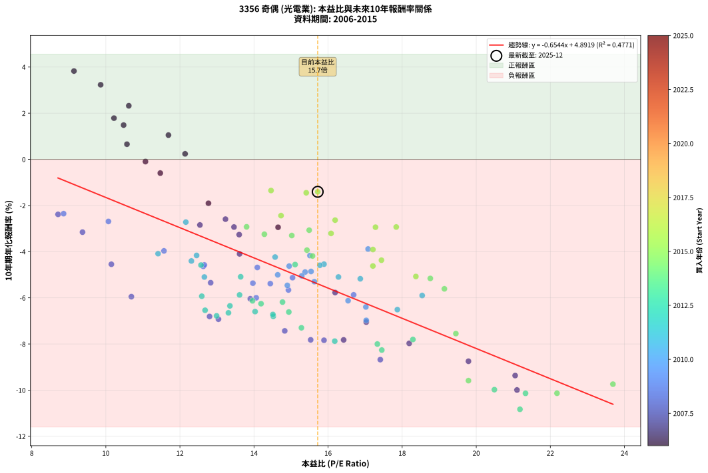
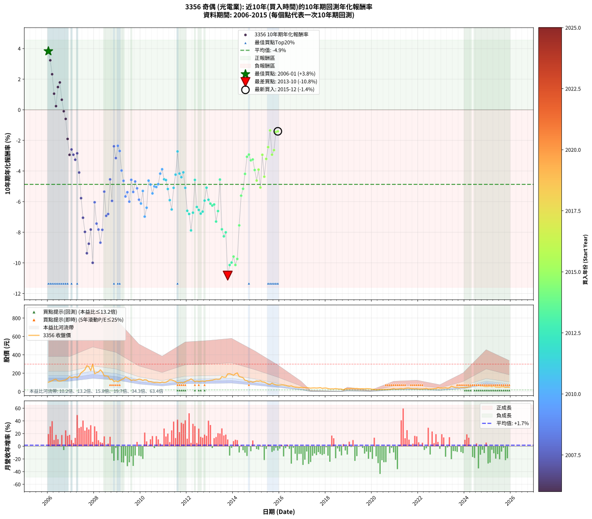

# 3356 奇偶 - 本益比與未來報酬率分析

!!! info "報告資訊"
    - **股票代號**: 3356
    - **公司名稱**: 奇偶
    - **產業別**: 光電業
    - **分析期間**: 2006-2015 (120 個數據點)
    - **資料來源**: Type 12 (ShowMonthlyK_ChartFlow) 月收盤價與本益比
    - **報酬率口徑**: 含現金股利 (簡化: 年度合計，假設每年7/1入帳)
    - **報告生成時間**: 2026-01-04 08:27:33 CST

## 📈 視覺化圖表

### 圖表1: 本益比 vs 未來報酬率關係

*圖表1：3356 奇偶 本益比與10年期未來報酬率關係 (2006-2015)*

### 圖表2: 歷年買入時點的10年期實際報酬率

*圖表2：3356 奇偶 歷年買入時點的10年期實際報酬率 (2006-2015)*

## 📍 買點訊號說明

本報告提供兩種買點提示訊號（顯示於圖表2的股價子圖中）：

### ▲ 小綠色三角形（回測驗證）
- **計算方式**: 使用全部歷史資料計算本益比第25百分位數
- **用途**: 事後驗證，顯示歷史上哪些時點確實為低估區
- **限制**: 當下無法判斷，僅供回測參考
- **特性**: 後見之明（Look-Ahead Bias）

### ▲ 小橘色三角形（即時訊號）
- **計算方式**: 使用截至當月的過去5年資料計算本益比第25百分位數
- **用途**: 實際投資決策，當時即可判斷
- **優勢**: 可操作性強，符合實務需求
- **特性**: 無後見之明，滾動窗口計算

!!! tip "如何使用兩種訊號"
    - **綠色▲** 幫助理解歷史估值機會，驗證策略有效性
    - **橘色▲** 可作為實際買進參考，但仍需搭配基本面分析
    - 兩種訊號重疊時，表示即時判斷與事後驗證一致，信心度較高
    - 僅有綠色▲時，表示當時無法判斷（需要未來資料才能確認）
    - 僅有橘色▲時，表示即時判斷為買點，但事後可能不是最佳時機

## 📊 估值分析摘要

| 指標 | 數值 |
|:---:|:---:|
| **目前本益比** (2015-12) | **15.72 倍** |
| **歷史平均本益比** | 14.92 倍 |
| **估值水準** | 🟡 合理範圍 |
| **預期10年年化報酬率** | **-5.40%** |
| **歷史平均報酬率** | -4.87% |
| **相關係數 (R²)** | 0.4771 |
| **趨勢線斜率** | -0.6544 |

!!! abstract "核心洞察"
    目前本益比接近歷史平均，預期報酬率符合長期趨勢

    根據歷史數據回測，3356 奇偶 在目前本益比 **15.7倍** 的估值水準下，
    預期未來10年年化報酬率約為 **-5.4%**。

    **重要提醒**: 本分析基於歷史數據統計，實際報酬率會受到公司基本面變化、產業趨勢、
    總體經濟環境等多重因素影響。R² = 0.48 表示本益比可解釋約 47.7% 的報酬率變異。

## 📈 歷史估值統計

### 最佳買點 (最高報酬率)

| 項目 | 數值 |
|:---:|:---:|
| 起始時間 | 2006-01 |
| 當時本益比 | 9.14 倍 |
| 起始價格 | 102.0 元 |
| 10年後價格 | 71.9 元 |
| **10年年化報酬率** | **+3.83%** |

### 最差買點 (最低報酬率)

| 項目 | 數值 |
|:---:|:---:|
| 起始時間 | 2013-10 |
| 當時本益比 | 21.18 倍 |
| 起始價格 | 192.5 元 |
| 10年後價格 | 40.0 元 |
| **10年年化報酬率** | **-10.83%** |

## 🎯 投資啟示

### 本益比與報酬率關係

趨勢線方程式: **y = -0.6544x + 4.8919**

!!! warning "強負相關"
    本益比與未來報酬率呈現強負相關。在高本益比時期買入，未來報酬率顯著較低；
    在低本益比時期買入，未來報酬率顯著較高。**估值紀律至關重要**。

### 估值區間建議

基於歷史數據分析:

- **🟢 低估區** (P/E < 11.9): 預期報酬率較高，可考慮增加持股
- **🟡 合理區** (P/E 11.9-17.9): 預期報酬率符合長期趨勢，正常持有
- **🔴 高估區** (P/E > 17.9): 預期報酬率較低，可考慮減碼或觀望

!!! danger "風險提示"
    - 過去表現不代表未來結果
    - 本分析假設公司基本面無重大結構性變化
    - 產業環境劇變可能使歷史規律失效
    - 應結合公司財報、產業趨勢、總體經濟等多重因素綜合判斷

!!! success "長期投資觀點"
    歷史數據顯示，在合理或低估的估值水準買入並長期持有，
    往往能獲得較佳的投資報酬。**耐心等待好價格**是價值投資的核心原則。

## 📊 數據品質

- **資料來源**: GoodInfo.tw Type 12 (ShowMonthlyK_ChartFlow)
- **資料頻率**: 月度收盤價與本益比
- **回測期間**: 2006-2015
- **數據點數量**: 120 個 (每個點代表一次10年期回測)

### 計算方法說明

1. **10年期年化報酬率**:
   - 對每個歷史時點，計算其後10年的實際投資報酬率
   - 期末價值(不含股利): 期末價格
   - 期末價值(含現金股利): 期末價格 + 持有期間內的現金股利合計 (簡化: 年度合計，假設每年7/1入帳)
   - 公式: 年化報酬率 = [(期末價值/期初價格)^(1/年數) - 1] × 100%

2. **本益比 (P/E Ratio)**:
   - 使用當時的月收盤價與EPS計算
   - 資料來源: Type 12 月度河流圖本益比數據

3. **趨勢線 (Linear Regression)**:
   - 使用最小平方法擬合線性趨勢線
   - R²值衡量本益比對報酬率的解釋能力

---

*本報告由 Stock Analysis System v1.9.0 自動生成*
*數據更新時間: 2026-01-04 08:27:33 CST*

## 📋 月度回測明細表

（每一列對應時間線圖中的一個買入點；可用來對照 SVG 圖上的每個點。）

| 買入月份 | 賣出月份 | 回測期限_年 | 實際持有年數 | 買入本益比_倍 | 買入收盤價_元 | 賣出收盤價_元 | 現金股利合計_元 | 總報酬率_pct | 年化報酬率_pct |
| --- | --- | --- | --- | --- | --- | --- | --- | --- | --- |
| 2006-01 | 2016-01 | 10 | 9.999 | 9.14 | 102.00 | 71.90 | 76.58 | +45.57 | +3.83 |
| 2006-02 | 2016-02 | 10 | 9.999 | 9.86 | 110.00 | 74.60 | 76.58 | +37.44 | +3.23 |
| 2006-03 | 2016-03 | 10 | 10.001 | 10.62 | 118.50 | 72.50 | 76.58 | +25.81 | +2.32 |
| 2006-04 | 2016-04 | 10 | 10.001 | 11.69 | 130.50 | 68.30 | 76.58 | +11.02 | +1.05 |
| 2006-05 | 2016-05 | 10 | 10.001 | 12.14 | 135.50 | 62.20 | 76.58 | +2.42 | +0.24 |
| 2006-06 | 2016-06 | 10 | 10.001 | 10.48 | 117.00 | 59.00 | 76.58 | +15.88 | +1.48 |
| 2006-07 | 2016-07 | 10 | 10.001 | 10.22 | 114.00 | 63.00 | 73.08 | +19.37 | +1.79 |
| 2006-08 | 2016-08 | 10 | 10.001 | 10.57 | 118.00 | 52.90 | 73.08 | +6.76 | +0.66 |
| 2006-09 | 2016-09 | 10 | 10.001 | 11.07 | 123.50 | 49.25 | 73.08 | -0.95 | -0.10 |
| 2006-10 | 2016-10 | 10 | 10.001 | 11.47 | 128.00 | 47.50 | 73.08 | -5.80 | -0.60 |
| 2006-11 | 2016-11 | 10 | 10.001 | 12.77 | 142.50 | 44.50 | 73.08 | -17.49 | -1.90 |
| 2006-12 | 2016-12 | 10 | 10.001 | 14.65 | 163.50 | 48.20 | 73.08 | -25.82 | -2.94 |
| 2007-01 | 2017-01 | 10 | 10.001 | 13.23 | 151.00 | 43.05 | 73.08 | -23.09 | -2.59 |
| 2007-02 | 2017-02 | 10 | 10.001 | 13.46 | 157.00 | 43.50 | 73.08 | -25.74 | -2.93 |
| 2007-03 | 2017-03 | 10 | 10.001 | 13.60 | 162.00 | 43.20 | 73.08 | -28.22 | -3.26 |
| 2007-04 | 2017-04 | 10 | 10.001 | 12.54 | 152.50 | 41.20 | 73.08 | -25.06 | -2.84 |
| 2007-05 | 2017-05 | 10 | 10.001 | 13.61 | 169.00 | 38.15 | 73.08 | -34.18 | -4.10 |
| 2007-06 | 2017-06 | 10 | 10.001 | 16.19 | 205.00 | 40.05 | 73.08 | -44.81 | -5.77 |
| 2007-07 | 2017-07 | 10 | 10.001 | 17.03 | 220.00 | 40.60 | 65.28 | -51.88 | -7.05 |
| 2007-08 | 2017-08 | 10 | 10.001 | 18.19 | 239.50 | 39.05 | 65.28 | -56.44 | -7.97 |
| 2007-09 | 2017-09 | 10 | 10.001 | 21.05 | 282.50 | 40.35 | 65.28 | -62.61 | -9.37 |
| 2007-10 | 2017-10 | 10 | 10.001 | 19.79 | 270.50 | 43.00 | 65.28 | -59.97 | -8.75 |
| 2007-11 | 2017-11 | 10 | 10.001 | 16.42 | 228.50 | 35.90 | 65.28 | -55.72 | -7.82 |
| 2007-12 | 2017-12 | 10 | 10.001 | 21.10 | 299.00 | 39.05 | 65.28 | -65.11 | -9.99 |
| 2008-01 | 2018-01 | 10 | 10.001 | 13.90 | 195.00 | 39.30 | 65.28 | -46.37 | -6.04 |
| 2008-02 | 2018-03 | 10 | 10.081 | 14.83 | 206.00 | 29.30 | 65.28 | -54.09 | -7.43 |
| 2008-03 | 2018-03 | 10 | 9.999 | 15.53 | 213.50 | 29.30 | 65.28 | -55.70 | -7.82 |
| 2008-04 | 2018-04 | 10 | 9.999 | 17.41 | 237.00 | 30.35 | 65.28 | -59.65 | -8.68 |
| 2008-05 | 2018-05 | 10 | 9.999 | 15.89 | 214.00 | 29.35 | 65.28 | -55.78 | -7.84 |
| 2008-06 | 2018-06 | 10 | 9.999 | 12.83 | 171.00 | 33.45 | 65.28 | -42.27 | -5.35 |
| 2008-07 | 2018-07 | 10 | 9.999 | 13.04 | 172.00 | 29.65 | 54.28 | -51.21 | -6.93 |
| 2008-08 | 2018-08 | 10 | 9.999 | 12.80 | 167.00 | 28.25 | 54.28 | -50.58 | -6.81 |
| 2008-09 | 2018-09 | 10 | 9.999 | 10.15 | 131.00 | 28.00 | 54.28 | -37.19 | -4.55 |
| 2008-10 | 2018-10 | 10 | 9.999 | 10.69 | 136.50 | 19.65 | 54.28 | -45.84 | -5.95 |
| 2008-11 | 2018-11 | 10 | 9.999 | 8.71 | 110.00 | 32.15 | 54.28 | -21.43 | -2.38 |
| 2008-12 | 2018-12 | 10 | 9.999 | 9.37 | 117.00 | 30.65 | 54.28 | -27.41 | -3.15 |
| 2009-01 | 2019-01 | 10 | 9.999 | 8.86 | 107.50 | 30.45 | 54.28 | -21.19 | -2.35 |
| 2009-02 | 2019-02 | 10 | 9.999 | 10.07 | 118.50 | 35.95 | 54.28 | -23.86 | -2.69 |
| 2009-03 | 2019-03 | 10 | 9.999 | 11.57 | 132.00 | 33.80 | 54.28 | -33.28 | -3.97 |
| 2009-04 | 2019-04 | 10 | 9.999 | 12.63 | 139.50 | 32.50 | 54.28 | -37.80 | -4.64 |
| 2009-05 | 2019-05 | 10 | 9.999 | 14.93 | 159.50 | 34.80 | 54.28 | -44.15 | -5.66 |
| 2009-06 | 2019-06 | 10 | 9.999 | 14.44 | 149.00 | 31.40 | 54.28 | -42.50 | -5.38 |
| 2009-07 | 2019-07 | 10 | 9.999 | 14.06 | 140.00 | 31.15 | 44.27 | -46.12 | -6.00 |
| 2009-08 | 2019-08 | 10 | 9.999 | 12.66 | 121.50 | 31.80 | 44.27 | -37.39 | -4.57 |
| 2009-09 | 2019-09 | 10 | 9.999 | 13.97 | 129.00 | 30.05 | 44.27 | -42.38 | -5.37 |
| 2009-10 | 2019-10 | 10 | 9.999 | 14.09 | 125.00 | 33.10 | 44.27 | -38.10 | -4.68 |
| 2009-11 | 2019-11 | 10 | 9.999 | 15.04 | 128.00 | 31.35 | 44.27 | -40.92 | -5.13 |
| 2009-12 | 2019-12 | 10 | 9.999 | 16.69 | 136.00 | 30.00 | 44.27 | -45.39 | -5.87 |
| 2010-01 | 2020-01 | 10 | 9.999 | 16.54 | 132.00 | 25.90 | 44.27 | -46.84 | -6.12 |
| 2010-02 | 2020-02 | 10 | 9.999 | 15.63 | 122.00 | 26.50 | 44.27 | -41.99 | -5.30 |
| 2010-03 | 2020-03 | 10 | 10.001 | 17.03 | 130.00 | 18.80 | 44.27 | -51.48 | -6.98 |
| 2010-04 | 2020-04 | 10 | 10.001 | 17.02 | 127.00 | 21.30 | 44.27 | -48.37 | -6.40 |
| 2010-05 | 2020-05 | 10 | 10.001 | 14.95 | 109.00 | 23.60 | 44.27 | -37.73 | -4.63 |
| 2010-06 | 2020-06 | 10 | 10.001 | 15.38 | 109.50 | 22.10 | 44.27 | -39.38 | -4.88 |
| 2010-07 | 2020-07 | 10 | 10.001 | 14.90 | 103.50 | 22.75 | 36.27 | -42.97 | -5.46 |
| 2010-08 | 2020-08 | 10 | 10.001 | 14.64 | 99.20 | 23.10 | 36.27 | -40.15 | -5.00 |
| 2010-09 | 2020-09 | 10 | 10.001 | 15.29 | 101.00 | 23.90 | 36.27 | -40.42 | -5.05 |
| 2010-10 | 2020-10 | 10 | 10.001 | 15.54 | 100.00 | 24.50 | 36.27 | -39.23 | -4.86 |
| 2010-11 | 2020-11 | 10 | 10.001 | 15.51 | 97.10 | 27.15 | 36.27 | -34.68 | -4.17 |
| 2010-12 | 2020-12 | 10 | 10.001 | 17.08 | 104.00 | 33.70 | 36.27 | -32.72 | -3.88 |
| 2011-01 | 2021-01 | 10 | 10.001 | 15.89 | 100.00 | 26.55 | 36.27 | -37.17 | -4.54 |
| 2011-02 | 2021-02 | 10 | 10.001 | 15.78 | 102.50 | 27.80 | 36.27 | -37.49 | -4.59 |
| 2011-03 | 2021-03 | 10 | 10.001 | 16.87 | 113.00 | 30.15 | 36.27 | -41.22 | -5.17 |
| 2011-04 | 2021-04 | 10 | 10.001 | 18.54 | 128.00 | 33.40 | 36.27 | -45.57 | -5.90 |
| 2011-05 | 2021-05 | 10 | 10.001 | 17.87 | 127.00 | 28.50 | 36.27 | -49.00 | -6.51 |
| 2011-06 | 2021-06 | 10 | 10.001 | 16.28 | 119.00 | 34.25 | 36.27 | -40.74 | -5.10 |
| 2011-07 | 2021-07 | 10 | 10.001 | 14.57 | 109.50 | 38.75 | 32.30 | -35.12 | -4.23 |
| 2011-08 | 2021-08 | 10 | 10.001 | 12.16 | 93.80 | 38.90 | 32.30 | -24.10 | -2.72 |
| 2011-09 | 2021-09 | 10 | 10.001 | 12.45 | 98.60 | 32.15 | 32.30 | -34.64 | -4.16 |
| 2011-10 | 2021-10 | 10 | 10.001 | 12.31 | 100.00 | 31.45 | 32.30 | -36.25 | -4.40 |
| 2011-11 | 2021-11 | 10 | 10.001 | 11.41 | 95.00 | 30.30 | 32.30 | -34.11 | -4.09 |
| 2011-12 | 2021-12 | 10 | 10.001 | 12.66 | 108.00 | 31.70 | 32.30 | -40.75 | -5.10 |
| 2012-01 | 2022-01 | 10 | 10.001 | 14.03 | 120.00 | 28.35 | 32.30 | -49.46 | -6.60 |
| 2012-02 | 2022-03 | 10 | 10.081 | 14.52 | 124.50 | 28.90 | 32.30 | -50.85 | -6.80 |
| 2012-03 | 2022-03 | 10 | 9.999 | 16.18 | 139.00 | 28.90 | 32.30 | -55.97 | -7.88 |
| 2012-04 | 2022-04 | 10 | 9.999 | 14.51 | 125.00 | 30.05 | 32.30 | -50.12 | -6.72 |
| 2012-05 | 2022-05 | 10 | 9.999 | 12.57 | 108.50 | 35.60 | 32.30 | -37.42 | -4.58 |
| 2012-06 | 2022-06 | 10 | 9.999 | 13.35 | 115.50 | 27.65 | 32.30 | -48.10 | -6.35 |
| 2012-07 | 2022-07 | 10 | 9.999 | 12.68 | 110.00 | 29.45 | 26.50 | -49.14 | -6.54 |
| 2012-08 | 2022-08 | 10 | 9.999 | 12.99 | 113.00 | 29.50 | 26.50 | -50.45 | -6.78 |
| 2012-09 | 2022-09 | 10 | 9.999 | 13.31 | 116.00 | 31.80 | 26.50 | -49.75 | -6.65 |
| 2012-10 | 2022-10 | 10 | 9.999 | 12.59 | 110.00 | 33.20 | 26.50 | -45.73 | -5.93 |
| 2012-11 | 2022-11 | 10 | 9.999 | 13.64 | 119.50 | 44.40 | 26.50 | -40.67 | -5.09 |
| 2012-12 | 2022-12 | 10 | 9.999 | 13.61 | 119.50 | 38.75 | 26.50 | -45.40 | -5.87 |
| 2013-01 | 2023-01 | 10 | 9.999 | 13.96 | 123.00 | 38.85 | 26.50 | -46.87 | -6.13 |
| 2013-02 | 2023-02 | 10 | 9.999 | 14.19 | 125.50 | 39.30 | 26.50 | -47.57 | -6.25 |
| 2013-03 | 2023-03 | 10 | 9.999 | 14.77 | 131.00 | 42.70 | 26.50 | -47.18 | -6.18 |
| 2013-04 | 2023-04 | 10 | 9.999 | 15.28 | 136.00 | 37.25 | 26.50 | -53.13 | -7.30 |
| 2013-05 | 2023-05 | 10 | 9.999 | 14.94 | 133.50 | 40.85 | 26.50 | -49.55 | -6.61 |
| 2013-06 | 2023-06 | 10 | 9.999 | 15.11 | 135.50 | 58.50 | 26.50 | -37.27 | -4.56 |
| 2013-07 | 2023-07 | 10 | 9.999 | 18.29 | 164.50 | 51.80 | 21.20 | -55.63 | -7.80 |
| 2013-08 | 2023-08 | 10 | 9.999 | 17.45 | 157.50 | 45.30 | 21.20 | -57.78 | -8.26 |
| 2013-09 | 2023-09 | 10 | 9.999 | 17.33 | 157.00 | 47.00 | 21.20 | -56.56 | -8.00 |
| 2013-10 | 2023-10 | 10 | 9.999 | 21.18 | 192.50 | 40.00 | 21.20 | -68.21 | -10.83 |
| 2013-11 | 2023-11 | 10 | 9.999 | 21.33 | 194.50 | 45.60 | 21.20 | -65.66 | -10.14 |
| 2013-12 | 2023-12 | 10 | 9.999 | 20.49 | 187.50 | 44.35 | 21.20 | -65.04 | -9.98 |
| 2014-01 | 2024-01 | 10 | 9.999 | 19.79 | 177.50 | 43.60 | 21.20 | -63.50 | -9.59 |
| 2014-02 | 2024-02 | 10 | 9.999 | 22.18 | 195.00 | 45.80 | 21.20 | -65.64 | -10.13 |
| 2014-03 | 2024-03 | 10 | 10.001 | 23.69 | 204.00 | 52.00 | 21.20 | -64.12 | -9.74 |
| 2014-04 | 2024-04 | 10 | 10.001 | 19.45 | 164.00 | 53.60 | 21.20 | -54.39 | -7.55 |
| 2014-05 | 2024-05 | 10 | 10.001 | 19.14 | 158.00 | 67.50 | 21.20 | -43.86 | -5.61 |
| 2014-06 | 2024-06 | 10 | 10.001 | 18.76 | 151.50 | 68.00 | 21.20 | -41.13 | -5.16 |
| 2014-07 | 2024-07 | 10 | 10.001 | 15.58 | 123.00 | 63.30 | 16.89 | -34.80 | -4.19 |
| 2014-08 | 2024-08 | 10 | 10.001 | 15.49 | 119.50 | 70.60 | 16.89 | -26.78 | -3.07 |
| 2014-09 | 2024-09 | 10 | 10.001 | 13.80 | 104.00 | 60.40 | 16.89 | -25.68 | -2.92 |
| 2014-10 | 2024-10 | 10 | 10.001 | 15.02 | 110.50 | 62.10 | 16.89 | -28.51 | -3.30 |
| 2014-11 | 2024-11 | 10 | 10.001 | 14.28 | 102.50 | 56.80 | 16.89 | -28.10 | -3.25 |
| 2014-12 | 2024-12 | 10 | 10.001 | 15.43 | 108.00 | 55.40 | 16.89 | -33.06 | -3.93 |
| 2015-01 | 2025-01 | 10 | 10.001 | 17.21 | 117.00 | 56.00 | 16.89 | -37.70 | -4.62 |
| 2015-02 | 2025-02 | 10 | 10.001 | 17.21 | 113.50 | 59.30 | 16.89 | -32.87 | -3.91 |
| 2015-03 | 2025-03 | 10 | 10.001 | 18.37 | 117.50 | 52.90 | 16.89 | -40.60 | -5.07 |
| 2015-04 | 2025-04 | 10 | 10.001 | 17.28 | 107.00 | 62.50 | 16.89 | -25.80 | -2.94 |
| 2015-05 | 2025-05 | 10 | 10.001 | 17.44 | 104.50 | 49.95 | 16.89 | -36.03 | -4.37 |
| 2015-06 | 2025-06 | 10 | 10.001 | 16.08 | 93.10 | 50.30 | 16.89 | -27.82 | -3.21 |
| 2015-07 | 2025-07 | 10 | 10.001 | 14.73 | 82.30 | 48.80 | 15.49 | -21.88 | -2.44 |
| 2015-08 | 2025-08 | 10 | 10.001 | 14.46 | 77.90 | 52.50 | 15.49 | -12.72 | -1.35 |
| 2015-09 | 2025-09 | 10 | 10.001 | 17.84 | 92.50 | 53.20 | 15.49 | -25.74 | -2.93 |
| 2015-10 | 2025-10 | 10 | 10.001 | 16.19 | 80.70 | 46.30 | 15.49 | -23.43 | -2.63 |
| 2015-11 | 2025-11 | 10 | 10.001 | 15.41 | 73.70 | 48.20 | 15.49 | -13.58 | -1.45 |
| 2015-12 | 2025-12 | 10 | 10.001 | 15.72 | 72.00 | 47.00 | 15.49 | -13.20 | -1.41 |
