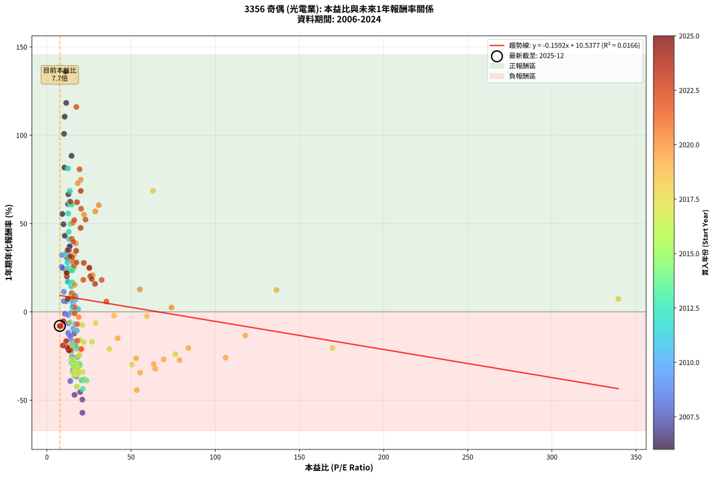
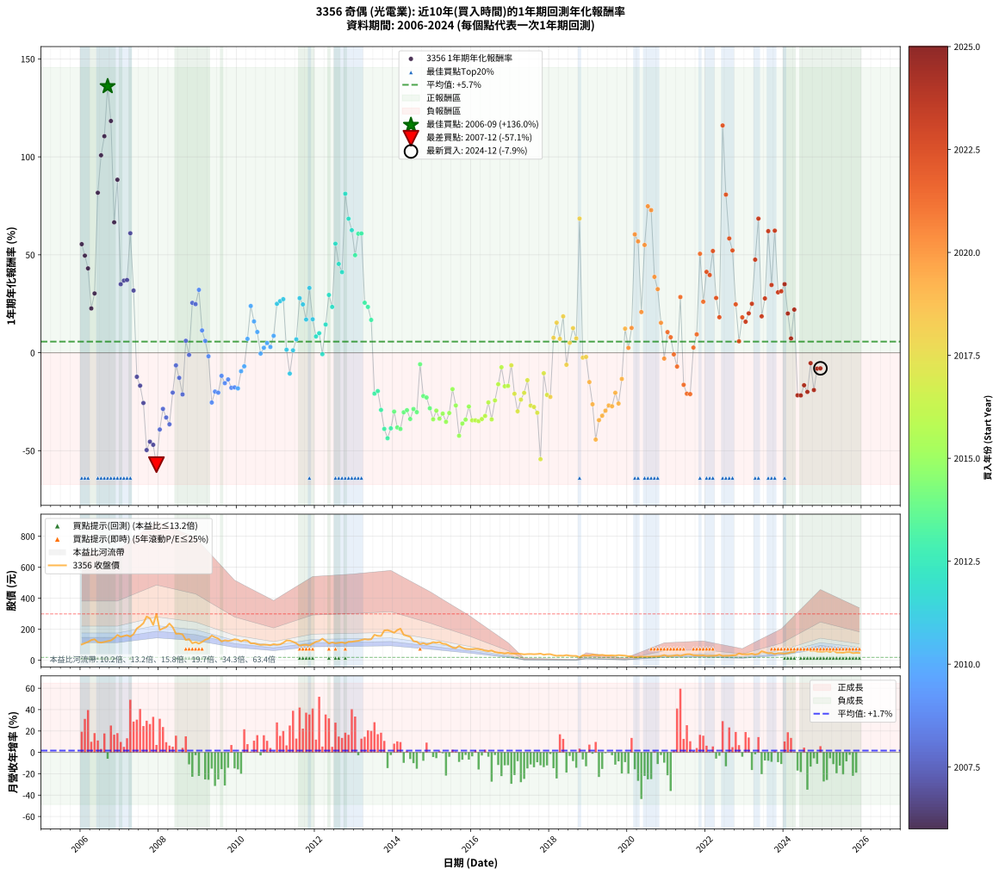

# 3356 奇偶 - 本益比與未來報酬率分析

!!! info "報告資訊"
    - **股票代號**: 3356
    - **公司名稱**: 奇偶
    - **產業別**: 光電業
    - **分析期間**: 2006-2024 (228 個數據點)
    - **資料來源**: Type 12 (ShowMonthlyK_ChartFlow) 月收盤價與本益比
    - **報酬率口徑**: 含現金股利 (簡化: 年度合計，假設每年7/1入帳)
    - **報告生成時間**: 2026-01-10 18:54:42 CST

## 📈 視覺化圖表

### 圖表1: 本益比 vs 未來報酬率關係

*圖表1：3356 奇偶 本益比與1年期未來報酬率關係 (2006-2024)*

### 圖表2: 歷年買入時點的1年期實際報酬率

*圖表2：3356 奇偶 歷年買入時點的1年期實際報酬率 (2006-2024)*

## 📍 買點訊號說明

本報告提供兩種買點提示訊號（顯示於圖表2的股價子圖中）：

### ▲ 小綠色三角形（回測驗證）
- **計算方式**: 使用全部歷史資料計算本益比第25百分位數
- **用途**: 事後驗證，顯示歷史上哪些時點確實為低估區
- **限制**: 當下無法判斷，僅供回測參考
- **特性**: 後見之明（Look-Ahead Bias）

### ▲ 小橘色三角形（即時訊號）
- **計算方式**: 使用截至當月的過去5年資料計算本益比第25百分位數
- **用途**: 實際投資決策，當時即可判斷
- **優勢**: 可操作性強，符合實務需求
- **特性**: 無後見之明，滾動窗口計算

!!! tip "如何使用兩種訊號"
    - **綠色▲** 幫助理解歷史估值機會，驗證策略有效性
    - **橘色▲** 可作為實際買進參考，但仍需搭配基本面分析
    - 兩種訊號重疊時，表示即時判斷與事後驗證一致，信心度較高
    - 僅有綠色▲時，表示當時無法判斷（需要未來資料才能確認）
    - 僅有橘色▲時，表示即時判斷為買點，但事後可能不是最佳時機

## 📊 估值分析摘要

| 指標 | 數值 |
|:---:|:---:|
| **目前本益比** (2024-12) | **7.69 倍** |
| **歷史平均本益比** | 23.51 倍 |
| **估值水準** | 🟢 相對低估 |
| **預期1年年化報酬率** | **+9.31%** |
| **歷史平均報酬率** | +5.70% |
| **相關係數 (R²)** | 0.0166 |
| **趨勢線斜率** | -0.1592 |

!!! abstract "核心洞察"
    目前本益比顯著低於歷史平均，預期未來報酬率可能較高

    根據歷史數據回測，3356 奇偶 在目前本益比 **7.7倍** 的估值水準下，
    預期未來1年年化報酬率約為 **+9.3%**。

    **重要提醒**: 本分析基於歷史數據統計，實際報酬率會受到公司基本面變化、產業趨勢、
    總體經濟環境等多重因素影響。R² = 0.02 表示本益比可解釋約 1.7% 的報酬率變異。

## 📈 歷史估值統計

### 最佳買點 (最高報酬率)

| 項目 | 數值 |
|:---:|:---:|
| 起始時間 | 2006-09 |
| 當時本益比 | 11.07 倍 |
| 起始價格 | 123.5 元 |
| 1年後價格 | 282.5 元 |
| **1年年化報酬率** | **+136.01%** |

### 最差買點 (最低報酬率)

| 項目 | 數值 |
|:---:|:---:|
| 起始時間 | 2007-12 |
| 當時本益比 | 21.10 倍 |
| 起始價格 | 299.0 元 |
| 1年後價格 | 117.0 元 |
| **1年年化報酬率** | **-57.12%** |

## 🎯 投資啟示

### 本益比與報酬率關係

趨勢線方程式: **y = -0.1592x + 10.5377**

!!! note "負相關"
    本益比與未來報酬率呈現負相關。較低的本益比通常帶來較高的未來報酬率，
    但相關性不算非常強。**估值仍是重要參考指標之一**。

### 估值區間建議

基於歷史數據分析:

- **🟢 低估區** (P/E < 18.8): 預期報酬率較高，可考慮增加持股
- **🟡 合理區** (P/E 18.8-28.2): 預期報酬率符合長期趨勢，正常持有
- **🔴 高估區** (P/E > 28.2): 預期報酬率較低，可考慮減碼或觀望

!!! danger "風險提示"
    - 過去表現不代表未來結果
    - 本分析假設公司基本面無重大結構性變化
    - 產業環境劇變可能使歷史規律失效
    - 應結合公司財報、產業趨勢、總體經濟等多重因素綜合判斷

!!! success "長期投資觀點"
    歷史數據顯示，在合理或低估的估值水準買入並長期持有，
    往往能獲得較佳的投資報酬。**耐心等待好價格**是價值投資的核心原則。

## 📊 數據品質

- **資料來源**: GoodInfo.tw Type 12 (ShowMonthlyK_ChartFlow)
- **資料頻率**: 月度收盤價與本益比
- **回測期間**: 2006-2024
- **數據點數量**: 228 個 (每個點代表一次1年期回測)

### 計算方法說明

1. **1年期年化報酬率**:
   - 對每個歷史時點，計算其後1年的實際投資報酬率
   - 期末價值(不含股利): 期末價格
   - 期末價值(含現金股利): 期末價格 + 持有期間內的現金股利合計 (簡化: 年度合計，假設每年7/1入帳)
   - 公式: 年化報酬率 = [(期末價值/期初價格)^(1/年數) - 1] × 100%

2. **本益比 (P/E Ratio)**:
   - 使用當時的月收盤價與EPS計算
   - 資料來源: Type 12 月度河流圖本益比數據

3. **趨勢線 (Linear Regression)**:
   - 使用最小平方法擬合線性趨勢線
   - R²值衡量本益比對報酬率的解釋能力

---

*本報告由 Stock Analysis System v1.9.0 自動生成*
*數據更新時間: 2026-01-10 18:54:42 CST*

## 📋 月度回測明細表

（每一列對應時間線圖中的一個買入點；可用來對照 SVG 圖上的每個點。）

| 買入月份 | 賣出月份 | 回測期限_年 | 實際持有年數 | 買入本益比_倍 | 買入收盤價_元 | 賣出收盤價_元 | 現金股利合計_元 | 總報酬率_pct | 年化報酬率_pct |
| --- | --- | --- | --- | --- | --- | --- | --- | --- | --- |
| 2006-01 | 2007-01 | 1 | 0.999 | 9.14 | 102.00 | 151.00 | 7.50 | +55.39 | +55.44 |
| 2006-02 | 2007-02 | 1 | 0.999 | 9.86 | 110.00 | 157.00 | 7.50 | +49.55 | +49.59 |
| 2006-03 | 2007-03 | 1 | 0.999 | 10.62 | 118.50 | 162.00 | 7.50 | +43.04 | +43.07 |
| 2006-04 | 2007-04 | 1 | 0.999 | 11.69 | 130.50 | 152.50 | 7.50 | +22.61 | +22.62 |
| 2006-05 | 2007-05 | 1 | 0.999 | 12.14 | 135.50 | 169.00 | 7.50 | +30.26 | +30.28 |
| 2006-06 | 2007-06 | 1 | 0.999 | 10.48 | 117.00 | 205.00 | 7.50 | +81.62 | +81.70 |
| 2006-07 | 2007-07 | 1 | 0.999 | 10.22 | 114.00 | 220.00 | 8.80 | +100.70 | +100.80 |
| 2006-08 | 2007-08 | 1 | 0.999 | 10.57 | 118.00 | 239.50 | 8.80 | +110.42 | +110.53 |
| 2006-09 | 2007-09 | 1 | 0.999 | 11.07 | 123.50 | 282.50 | 8.80 | +135.87 | +136.01 |
| 2006-10 | 2007-10 | 1 | 0.999 | 11.47 | 128.00 | 270.50 | 8.80 | +118.20 | +118.32 |
| 2006-11 | 2007-11 | 1 | 0.999 | 12.77 | 142.50 | 228.50 | 8.80 | +66.53 | +66.58 |
| 2006-12 | 2007-12 | 1 | 0.999 | 14.65 | 163.50 | 299.00 | 8.80 | +88.26 | +88.34 |
| 2007-01 | 2008-01 | 1 | 0.999 | 13.23 | 151.00 | 195.00 | 8.80 | +34.97 | +34.99 |
| 2007-02 | 2008-02 | 1 | 0.999 | 13.46 | 157.00 | 206.00 | 8.80 | +36.82 | +36.84 |
| 2007-03 | 2008-03 | 1 | 1.002 | 13.60 | 162.00 | 213.50 | 8.80 | +37.22 | +37.13 |
| 2007-04 | 2008-04 | 1 | 1.002 | 12.54 | 152.50 | 237.00 | 8.80 | +61.18 | +61.02 |
| 2007-05 | 2008-05 | 1 | 1.002 | 13.61 | 169.00 | 214.00 | 8.80 | +31.83 | +31.76 |
| 2007-06 | 2008-06 | 1 | 1.002 | 16.19 | 205.00 | 171.00 | 8.80 | -12.29 | -12.27 |
| 2007-07 | 2008-07 | 1 | 1.002 | 17.03 | 220.00 | 172.00 | 11.00 | -16.82 | -16.79 |
| 2007-08 | 2008-08 | 1 | 1.002 | 18.19 | 239.50 | 167.00 | 11.00 | -25.68 | -25.63 |
| 2007-09 | 2008-09 | 1 | 1.002 | 21.05 | 282.50 | 131.00 | 11.00 | -49.73 | -49.66 |
| 2007-10 | 2008-10 | 1 | 1.002 | 19.79 | 270.50 | 136.50 | 11.00 | -45.47 | -45.40 |
| 2007-11 | 2008-11 | 1 | 1.002 | 16.42 | 228.50 | 110.00 | 11.00 | -47.05 | -46.98 |
| 2007-12 | 2008-12 | 1 | 1.002 | 21.10 | 299.00 | 117.00 | 11.00 | -57.19 | -57.12 |
| 2008-01 | 2009-01 | 1 | 1.002 | 13.90 | 195.00 | 107.50 | 11.00 | -39.23 | -39.17 |
| 2008-02 | 2009-03 | 1 | 1.081 | 14.83 | 206.00 | 132.00 | 11.00 | -30.58 | -28.65 |
| 2008-03 | 2009-03 | 1 | 0.999 | 15.53 | 213.50 | 132.00 | 11.00 | -33.02 | -33.04 |
| 2008-04 | 2009-04 | 1 | 0.999 | 17.41 | 237.00 | 139.50 | 11.00 | -36.50 | -36.52 |
| 2008-05 | 2009-05 | 1 | 0.999 | 15.89 | 214.00 | 159.50 | 11.00 | -20.33 | -20.34 |
| 2008-06 | 2009-06 | 1 | 0.999 | 12.83 | 171.00 | 149.00 | 11.00 | -6.43 | -6.44 |
| 2008-07 | 2009-07 | 1 | 0.999 | 13.04 | 172.00 | 140.00 | 10.00 | -12.79 | -12.80 |
| 2008-08 | 2009-08 | 1 | 0.999 | 12.80 | 167.00 | 121.50 | 10.00 | -21.26 | -21.27 |
| 2008-09 | 2009-09 | 1 | 0.999 | 10.15 | 131.00 | 129.00 | 10.00 | +6.11 | +6.11 |
| 2008-10 | 2009-10 | 1 | 0.999 | 10.69 | 136.50 | 125.00 | 10.00 | -1.10 | -1.10 |
| 2008-11 | 2009-11 | 1 | 0.999 | 8.71 | 110.00 | 128.00 | 10.00 | +25.45 | +25.47 |
| 2008-12 | 2009-12 | 1 | 0.999 | 9.37 | 117.00 | 136.00 | 10.00 | +24.79 | +24.81 |
| 2009-01 | 2010-01 | 1 | 0.999 | 8.86 | 107.50 | 132.00 | 10.00 | +32.09 | +32.12 |
| 2009-02 | 2010-02 | 1 | 0.999 | 10.07 | 118.50 | 122.00 | 10.00 | +11.39 | +11.40 |
| 2009-03 | 2010-03 | 1 | 0.999 | 11.57 | 132.00 | 130.00 | 10.00 | +6.06 | +6.06 |
| 2009-04 | 2010-04 | 1 | 0.999 | 12.63 | 139.50 | 127.00 | 10.00 | -1.79 | -1.79 |
| 2009-05 | 2010-05 | 1 | 0.999 | 14.93 | 159.50 | 109.00 | 10.00 | -25.39 | -25.41 |
| 2009-06 | 2010-06 | 1 | 0.999 | 14.44 | 149.00 | 109.50 | 10.00 | -19.80 | -19.81 |
| 2009-07 | 2010-07 | 1 | 0.999 | 14.06 | 140.00 | 103.50 | 8.00 | -20.36 | -20.37 |
| 2009-08 | 2010-08 | 1 | 0.999 | 12.66 | 121.50 | 99.20 | 8.00 | -11.77 | -11.78 |
| 2009-09 | 2010-09 | 1 | 0.999 | 13.97 | 129.00 | 101.00 | 8.00 | -15.50 | -15.51 |
| 2009-10 | 2010-10 | 1 | 0.999 | 14.09 | 125.00 | 100.00 | 8.00 | -13.60 | -13.61 |
| 2009-11 | 2010-11 | 1 | 0.999 | 15.04 | 128.00 | 97.10 | 8.00 | -17.89 | -17.90 |
| 2009-12 | 2010-12 | 1 | 0.999 | 16.69 | 136.00 | 104.00 | 8.00 | -17.65 | -17.66 |
| 2010-01 | 2011-01 | 1 | 0.999 | 16.54 | 132.00 | 100.00 | 8.00 | -18.18 | -18.19 |
| 2010-02 | 2011-02 | 1 | 0.999 | 15.63 | 122.00 | 102.50 | 8.00 | -9.43 | -9.43 |
| 2010-03 | 2011-03 | 1 | 0.999 | 17.03 | 130.00 | 113.00 | 8.00 | -6.92 | -6.93 |
| 2010-04 | 2011-04 | 1 | 0.999 | 17.02 | 127.00 | 128.00 | 8.00 | +7.09 | +7.09 |
| 2010-05 | 2011-05 | 1 | 0.999 | 14.95 | 109.00 | 127.00 | 8.00 | +23.85 | +23.87 |
| 2010-06 | 2011-06 | 1 | 0.999 | 15.38 | 109.50 | 119.00 | 8.00 | +15.98 | +15.99 |
| 2010-07 | 2011-07 | 1 | 0.999 | 14.90 | 103.50 | 109.50 | 4.98 | +10.61 | +10.62 |
| 2010-08 | 2011-08 | 1 | 0.999 | 14.64 | 99.20 | 93.80 | 4.98 | -0.42 | -0.42 |
| 2010-09 | 2011-09 | 1 | 0.999 | 15.29 | 101.00 | 98.60 | 4.98 | +2.56 | +2.56 |
| 2010-10 | 2011-10 | 1 | 0.999 | 15.54 | 100.00 | 100.00 | 4.98 | +4.98 | +4.98 |
| 2010-11 | 2011-11 | 1 | 0.999 | 15.51 | 97.10 | 95.00 | 4.98 | +2.97 | +2.97 |
| 2010-12 | 2011-12 | 1 | 0.999 | 17.08 | 104.00 | 108.00 | 4.98 | +8.64 | +8.64 |
| 2011-01 | 2012-01 | 1 | 0.999 | 15.89 | 100.00 | 120.00 | 4.98 | +24.98 | +25.00 |
| 2011-02 | 2012-02 | 1 | 0.999 | 15.78 | 102.50 | 124.50 | 4.98 | +26.32 | +26.34 |
| 2011-03 | 2012-03 | 1 | 1.002 | 16.87 | 113.00 | 139.00 | 4.98 | +27.42 | +27.35 |
| 2011-04 | 2012-04 | 1 | 1.002 | 18.54 | 128.00 | 125.00 | 4.98 | +1.55 | +1.54 |
| 2011-05 | 2012-05 | 1 | 1.002 | 17.87 | 127.00 | 108.50 | 4.98 | -10.64 | -10.62 |
| 2011-06 | 2012-06 | 1 | 1.002 | 16.28 | 119.00 | 115.50 | 4.98 | +1.24 | +1.24 |
| 2011-07 | 2012-07 | 1 | 1.002 | 14.57 | 109.50 | 110.00 | 7.00 | +6.85 | +6.83 |
| 2011-08 | 2012-08 | 1 | 1.002 | 12.16 | 93.80 | 113.00 | 7.00 | +27.93 | +27.87 |
| 2011-09 | 2012-09 | 1 | 1.002 | 12.45 | 98.60 | 116.00 | 7.00 | +24.75 | +24.69 |
| 2011-10 | 2012-10 | 1 | 1.002 | 12.31 | 100.00 | 110.00 | 7.00 | +17.00 | +16.96 |
| 2011-11 | 2012-11 | 1 | 1.002 | 11.41 | 95.00 | 119.50 | 7.00 | +33.16 | +33.08 |
| 2011-12 | 2012-12 | 1 | 1.002 | 12.66 | 108.00 | 119.50 | 7.00 | +17.13 | +17.09 |
| 2012-01 | 2013-01 | 1 | 1.002 | 14.03 | 120.00 | 123.00 | 7.00 | +8.33 | +8.32 |
| 2012-02 | 2013-03 | 1 | 1.081 | 14.52 | 124.50 | 131.00 | 7.00 | +10.84 | +9.99 |
| 2012-03 | 2013-03 | 1 | 0.999 | 16.18 | 139.00 | 131.00 | 7.00 | -0.72 | -0.72 |
| 2012-04 | 2013-04 | 1 | 0.999 | 14.51 | 125.00 | 136.00 | 7.00 | +14.40 | +14.41 |
| 2012-05 | 2013-05 | 1 | 0.999 | 12.57 | 108.50 | 133.50 | 7.00 | +29.49 | +29.52 |
| 2012-06 | 2013-06 | 1 | 0.999 | 13.35 | 115.50 | 135.50 | 7.00 | +23.38 | +23.39 |
| 2012-07 | 2013-07 | 1 | 0.999 | 12.68 | 110.00 | 164.50 | 6.70 | +55.64 | +55.68 |
| 2012-08 | 2013-08 | 1 | 0.999 | 12.99 | 113.00 | 157.50 | 6.70 | +45.31 | +45.35 |
| 2012-09 | 2013-09 | 1 | 0.999 | 13.31 | 116.00 | 157.00 | 6.70 | +41.12 | +41.15 |
| 2012-10 | 2013-10 | 1 | 0.999 | 12.59 | 110.00 | 192.50 | 6.70 | +81.09 | +81.16 |
| 2012-11 | 2013-11 | 1 | 0.999 | 13.64 | 119.50 | 194.50 | 6.70 | +68.37 | +68.43 |
| 2012-12 | 2013-12 | 1 | 0.999 | 13.61 | 119.50 | 187.50 | 6.70 | +62.51 | +62.56 |
| 2013-01 | 2014-01 | 1 | 0.999 | 13.96 | 123.00 | 177.50 | 6.70 | +49.76 | +49.80 |
| 2013-02 | 2014-02 | 1 | 0.999 | 14.19 | 125.50 | 195.00 | 6.70 | +60.72 | +60.77 |
| 2013-03 | 2014-03 | 1 | 0.999 | 14.77 | 131.00 | 204.00 | 6.70 | +60.84 | +60.89 |
| 2013-04 | 2014-04 | 1 | 0.999 | 15.28 | 136.00 | 164.00 | 6.70 | +25.51 | +25.53 |
| 2013-05 | 2014-05 | 1 | 0.999 | 14.94 | 133.50 | 158.00 | 6.70 | +23.37 | +23.39 |
| 2013-06 | 2014-06 | 1 | 0.999 | 15.11 | 135.50 | 151.50 | 6.70 | +16.75 | +16.77 |
| 2013-07 | 2014-07 | 1 | 0.999 | 18.29 | 164.50 | 123.00 | 7.20 | -20.85 | -20.86 |
| 2013-08 | 2014-08 | 1 | 0.999 | 17.45 | 157.50 | 119.50 | 7.20 | -19.56 | -19.57 |
| 2013-09 | 2014-09 | 1 | 0.999 | 17.33 | 157.00 | 104.00 | 7.20 | -29.17 | -29.19 |
| 2013-10 | 2014-10 | 1 | 0.999 | 21.18 | 192.50 | 110.50 | 7.20 | -38.86 | -38.88 |
| 2013-11 | 2014-11 | 1 | 0.999 | 21.33 | 194.50 | 102.50 | 7.20 | -43.60 | -43.62 |
| 2013-12 | 2014-12 | 1 | 0.999 | 20.49 | 187.50 | 108.00 | 7.20 | -38.56 | -38.58 |
| 2014-01 | 2015-01 | 1 | 0.999 | 19.79 | 177.50 | 117.00 | 7.20 | -30.03 | -30.05 |
| 2014-02 | 2015-02 | 1 | 0.999 | 22.18 | 195.00 | 113.50 | 7.20 | -38.10 | -38.12 |
| 2014-03 | 2015-03 | 1 | 0.999 | 23.69 | 204.00 | 117.50 | 7.20 | -38.87 | -38.89 |
| 2014-04 | 2015-04 | 1 | 0.999 | 19.45 | 164.00 | 107.00 | 7.20 | -30.37 | -30.38 |
| 2014-05 | 2015-05 | 1 | 0.999 | 19.14 | 158.00 | 104.50 | 7.20 | -29.30 | -29.32 |
| 2014-06 | 2015-06 | 1 | 0.999 | 18.76 | 151.50 | 93.10 | 7.20 | -33.80 | -33.81 |
| 2014-07 | 2015-07 | 1 | 0.999 | 15.58 | 123.00 | 82.30 | 5.40 | -28.70 | -28.72 |
| 2014-08 | 2015-08 | 1 | 0.999 | 15.49 | 119.50 | 77.90 | 5.40 | -30.29 | -30.31 |
| 2014-09 | 2015-09 | 1 | 0.999 | 13.80 | 104.00 | 92.50 | 5.40 | -5.87 | -5.87 |
| 2014-10 | 2015-10 | 1 | 0.999 | 15.02 | 110.50 | 80.70 | 5.40 | -22.08 | -22.09 |
| 2014-11 | 2015-11 | 1 | 0.999 | 14.28 | 102.50 | 73.70 | 5.40 | -22.83 | -22.84 |
| 2014-12 | 2015-12 | 1 | 0.999 | 15.43 | 108.00 | 72.00 | 5.40 | -28.33 | -28.35 |
| 2015-01 | 2016-01 | 1 | 0.999 | 17.21 | 117.00 | 71.90 | 5.40 | -33.93 | -33.95 |
| 2015-02 | 2016-02 | 1 | 0.999 | 17.21 | 113.50 | 74.60 | 5.40 | -29.52 | -29.53 |
| 2015-03 | 2016-03 | 1 | 1.002 | 18.37 | 117.50 | 72.50 | 5.40 | -33.70 | -33.65 |
| 2015-04 | 2016-04 | 1 | 1.002 | 17.28 | 107.00 | 68.30 | 5.40 | -31.12 | -31.07 |
| 2015-05 | 2016-05 | 1 | 1.002 | 17.44 | 104.50 | 62.20 | 5.40 | -35.31 | -35.25 |
| 2015-06 | 2016-06 | 1 | 1.002 | 16.08 | 93.10 | 59.00 | 5.40 | -30.83 | -30.77 |
| 2015-07 | 2016-07 | 1 | 1.002 | 14.73 | 82.30 | 63.00 | 4.00 | -18.59 | -18.56 |
| 2015-08 | 2016-08 | 1 | 1.002 | 14.46 | 77.90 | 52.90 | 4.00 | -26.96 | -26.91 |
| 2015-09 | 2016-09 | 1 | 1.002 | 17.84 | 92.50 | 49.25 | 4.00 | -42.43 | -42.37 |
| 2015-10 | 2016-10 | 1 | 1.002 | 16.19 | 80.70 | 47.50 | 4.00 | -36.18 | -36.12 |
| 2015-11 | 2016-11 | 1 | 1.002 | 15.41 | 73.70 | 44.50 | 4.00 | -34.19 | -34.14 |
| 2015-12 | 2016-12 | 1 | 1.002 | 15.72 | 72.00 | 48.20 | 4.00 | -27.50 | -27.45 |
| 2016-01 | 2017-01 | 1 | 1.002 | 16.54 | 71.90 | 43.05 | 4.00 | -34.56 | -34.51 |
| 2016-02 | 2017-03 | 1 | 1.081 | 18.12 | 74.60 | 43.20 | 4.00 | -36.73 | -34.51 |
| 2016-03 | 2017-03 | 1 | 0.999 | 18.66 | 72.50 | 43.20 | 4.00 | -34.90 | -34.92 |
| 2016-04 | 2017-04 | 1 | 0.999 | 18.70 | 68.30 | 41.20 | 4.00 | -33.82 | -33.84 |
| 2016-05 | 2017-05 | 1 | 0.999 | 18.18 | 62.20 | 38.15 | 4.00 | -32.23 | -32.25 |
| 2016-06 | 2017-06 | 1 | 0.999 | 18.50 | 59.00 | 40.05 | 4.00 | -25.34 | -25.35 |
| 2016-07 | 2017-07 | 1 | 0.999 | 21.30 | 63.00 | 40.60 | 0.99 | -33.98 | -34.00 |
| 2016-08 | 2017-08 | 1 | 0.999 | 19.40 | 52.90 | 39.05 | 0.99 | -24.30 | -24.32 |
| 2016-09 | 2017-09 | 1 | 0.999 | 19.74 | 49.25 | 40.35 | 0.99 | -16.05 | -16.06 |
| 2016-10 | 2017-10 | 1 | 0.999 | 20.99 | 47.50 | 43.00 | 0.99 | -7.38 | -7.39 |
| 2016-11 | 2017-11 | 1 | 0.999 | 21.90 | 44.50 | 35.90 | 0.99 | -17.09 | -17.10 |
| 2016-12 | 2017-12 | 1 | 0.999 | 26.78 | 48.20 | 39.05 | 0.99 | -16.92 | -16.93 |
| 2017-01 | 2018-01 | 1 | 0.999 | 28.99 | 43.05 | 39.30 | 0.99 | -6.40 | -6.41 |
| 2017-02 | 2018-02 | 1 | 0.999 | 37.18 | 43.50 | 33.40 | 0.99 | -20.93 | -20.95 |
| 2017-03 | 2018-03 | 1 | 0.999 | 50.53 | 43.20 | 29.30 | 0.99 | -29.88 | -29.89 |
| 2017-04 | 2018-04 | 1 | 0.999 | 76.30 | 41.20 | 30.35 | 0.99 | -23.92 | -23.94 |
| 2017-05 | 2018-05 | 1 | 0.999 | 169.60 | 38.15 | 29.35 | 0.99 | -20.46 | -20.47 |
| 2017-06 | 2018-06 | 1 | 0.999 |  | 40.05 | 33.45 | 0.99 | -14.00 | -14.01 |
| 2017-07 | 2018-07 | 1 | 0.999 |  | 40.60 | 29.65 | 0.00 | -26.97 | -26.99 |
| 2017-08 | 2018-08 | 1 | 0.999 |  | 39.05 | 28.25 | 0.00 | -27.66 | -27.67 |
| 2017-09 | 2018-09 | 1 | 0.999 |  | 40.35 | 28.00 | 0.00 | -30.61 | -30.62 |
| 2017-10 | 2018-10 | 1 | 0.999 |  | 43.00 | 19.65 | 0.00 | -54.30 | -54.33 |
| 2017-11 | 2018-11 | 1 | 0.999 |  | 35.90 | 32.15 | 0.00 | -10.45 | -10.45 |
| 2017-12 | 2018-12 | 1 | 0.999 |  | 39.05 | 30.65 | 0.00 | -21.51 | -21.52 |
| 2018-01 | 2019-01 | 1 | 0.999 |  | 39.30 | 30.45 | 0.00 | -22.52 | -22.53 |
| 2018-02 | 2019-02 | 1 | 0.999 |  | 33.40 | 35.95 | 0.00 | +7.63 | +7.64 |
| 2018-03 | 2019-03 | 1 | 0.999 |  | 29.30 | 33.80 | 0.00 | +15.36 | +15.37 |
| 2018-04 | 2019-04 | 1 | 0.999 |  | 30.35 | 32.50 | 0.00 | +7.08 | +7.09 |
| 2018-05 | 2019-05 | 1 | 0.999 |  | 29.35 | 34.80 | 0.00 | +18.57 | +18.58 |
| 2018-06 | 2019-06 | 1 | 0.999 |  | 33.45 | 31.40 | 0.00 | -6.13 | -6.13 |
| 2018-07 | 2019-07 | 1 | 0.999 |  | 29.65 | 31.15 | 0.00 | +5.06 | +5.06 |
| 2018-08 | 2019-08 | 1 | 0.999 |  | 28.25 | 31.80 | 0.00 | +12.57 | +12.58 |
| 2018-09 | 2019-09 | 1 | 0.999 | 339.40 | 28.00 | 30.05 | 0.00 | +7.32 | +7.33 |
| 2018-10 | 2019-10 | 1 | 0.999 | 63.05 | 19.65 | 33.10 | 0.00 | +68.45 | +68.51 |
| 2018-11 | 2019-11 | 1 | 0.999 | 59.45 | 32.15 | 31.35 | 0.00 | -2.49 | -2.49 |
| 2018-12 | 2019-12 | 1 | 0.999 | 39.81 | 30.65 | 30.00 | 0.00 | -2.12 | -2.12 |
| 2019-01 | 2020-01 | 1 | 0.999 | 42.05 | 30.45 | 25.90 | 0.00 | -14.94 | -14.95 |
| 2019-02 | 2020-02 | 1 | 0.999 | 53.00 | 35.95 | 26.50 | 0.00 | -26.29 | -26.30 |
| 2019-03 | 2020-03 | 1 | 1.002 | 53.44 | 33.80 | 18.80 | 0.00 | -44.38 | -44.31 |
| 2019-04 | 2020-04 | 1 | 1.002 | 55.40 | 32.50 | 21.30 | 0.00 | -34.46 | -34.40 |
| 2019-05 | 2020-05 | 1 | 1.002 | 64.35 | 34.80 | 23.60 | 0.00 | -32.18 | -32.13 |
| 2019-06 | 2020-06 | 1 | 1.002 | 63.43 | 31.40 | 22.10 | 0.00 | -29.62 | -29.57 |
| 2019-07 | 2020-07 | 1 | 1.002 | 69.35 | 31.15 | 22.75 | 0.00 | -26.97 | -26.92 |
| 2019-08 | 2020-08 | 1 | 1.002 | 78.84 | 31.80 | 23.10 | 0.00 | -27.36 | -27.31 |
| 2019-09 | 2020-09 | 1 | 1.002 | 84.06 | 30.05 | 23.90 | 0.00 | -20.47 | -20.43 |
| 2019-10 | 2020-10 | 1 | 1.002 | 106.20 | 33.10 | 24.50 | 0.00 | -25.98 | -25.94 |
| 2019-11 | 2020-11 | 1 | 1.002 | 117.90 | 31.35 | 27.15 | 0.00 | -13.40 | -13.37 |
| 2019-12 | 2020-12 | 1 | 1.002 | 136.40 | 30.00 | 33.70 | 0.00 | +12.33 | +12.31 |
| 2020-01 | 2021-01 | 1 | 1.002 | 74.00 | 25.90 | 26.55 | 0.00 | +2.51 | +2.50 |
| 2020-02 | 2021-03 | 1 | 1.081 | 55.21 | 26.50 | 30.15 | 0.00 | +13.77 | +12.67 |
| 2020-03 | 2021-03 | 1 | 0.999 | 30.82 | 18.80 | 30.15 | 0.00 | +60.37 | +60.42 |
| 2020-04 | 2021-04 | 1 | 0.999 | 28.78 | 21.30 | 33.40 | 0.00 | +56.81 | +56.86 |
| 2020-05 | 2021-05 | 1 | 0.999 | 27.13 | 23.60 | 28.50 | 0.00 | +20.76 | +20.78 |
| 2020-06 | 2021-06 | 1 | 0.999 | 22.10 | 22.10 | 34.25 | 0.00 | +54.98 | +55.02 |
| 2020-07 | 2021-07 | 1 | 0.999 | 20.13 | 22.75 | 38.75 | 1.00 | +74.73 | +74.80 |
| 2020-08 | 2021-08 | 1 | 0.999 | 18.33 | 23.10 | 38.90 | 1.00 | +72.73 | +72.80 |
| 2020-09 | 2021-09 | 1 | 0.999 | 17.19 | 23.90 | 32.15 | 1.00 | +38.71 | +38.74 |
| 2020-10 | 2021-10 | 1 | 0.999 | 16.12 | 24.50 | 31.45 | 1.00 | +32.45 | +32.48 |
| 2020-11 | 2021-11 | 1 | 0.999 | 16.45 | 27.15 | 30.30 | 1.00 | +15.29 | +15.30 |
| 2020-12 | 2021-12 | 1 | 0.999 | 18.93 | 33.70 | 31.70 | 1.00 | -2.96 | -2.97 |
| 2021-01 | 2022-01 | 1 | 0.999 | 14.78 | 26.55 | 28.35 | 1.00 | +10.55 | +10.56 |
| 2021-02 | 2022-02 | 1 | 0.999 | 15.34 | 27.80 | 29.00 | 1.00 | +7.92 | +7.92 |
| 2021-03 | 2022-03 | 1 | 0.999 | 16.50 | 30.15 | 28.90 | 1.00 | -0.83 | -0.83 |
| 2021-04 | 2022-04 | 1 | 0.999 | 18.12 | 33.40 | 30.05 | 1.00 | -7.03 | -7.04 |
| 2021-05 | 2022-05 | 1 | 0.999 | 15.33 | 28.50 | 35.60 | 1.00 | +28.42 | +28.45 |
| 2021-06 | 2022-06 | 1 | 0.999 | 18.27 | 34.25 | 27.65 | 1.00 | -16.35 | -16.36 |
| 2021-07 | 2022-07 | 1 | 0.999 | 20.49 | 38.75 | 29.45 | 1.20 | -20.90 | -20.92 |
| 2021-08 | 2022-08 | 1 | 0.999 | 20.40 | 38.90 | 29.50 | 1.20 | -21.08 | -21.09 |
| 2021-09 | 2022-09 | 1 | 0.999 | 16.72 | 32.15 | 31.80 | 1.20 | +2.64 | +2.65 |
| 2021-10 | 2022-10 | 1 | 0.999 | 16.23 | 31.45 | 33.20 | 1.20 | +9.38 | +9.39 |
| 2021-11 | 2022-11 | 1 | 0.999 | 15.51 | 30.30 | 44.40 | 1.20 | +50.50 | +50.54 |
| 2021-12 | 2022-12 | 1 | 0.999 | 16.09 | 31.70 | 38.75 | 1.20 | +26.03 | +26.05 |
| 2022-01 | 2023-01 | 1 | 0.999 | 14.88 | 28.35 | 38.85 | 1.20 | +41.27 | +41.30 |
| 2022-02 | 2023-02 | 1 | 0.999 | 15.76 | 29.00 | 39.30 | 1.20 | +39.66 | +39.69 |
| 2022-03 | 2023-03 | 1 | 0.999 | 16.28 | 28.90 | 42.70 | 1.20 | +51.90 | +51.95 |
| 2022-04 | 2023-04 | 1 | 0.999 | 17.57 | 30.05 | 37.25 | 1.20 | +27.95 | +27.98 |
| 2022-05 | 2023-05 | 1 | 0.999 | 21.64 | 35.60 | 40.85 | 1.20 | +18.12 | +18.13 |
| 2022-06 | 2023-06 | 1 | 0.999 | 17.50 | 27.65 | 58.50 | 1.20 | +115.91 | +116.03 |
| 2022-07 | 2023-07 | 1 | 0.999 | 19.44 | 29.45 | 51.80 | 1.40 | +80.65 | +80.72 |
| 2022-08 | 2023-08 | 1 | 0.999 | 20.34 | 29.50 | 45.30 | 1.40 | +58.31 | +58.35 |
| 2022-09 | 2023-09 | 1 | 0.999 | 22.96 | 31.80 | 47.00 | 1.40 | +52.20 | +52.25 |
| 2022-10 | 2023-10 | 1 | 0.999 | 25.15 | 33.20 | 40.00 | 1.40 | +24.70 | +24.72 |
| 2022-11 | 2023-11 | 1 | 0.999 | 35.38 | 44.40 | 45.60 | 1.40 | +5.86 | +5.86 |
| 2022-12 | 2023-12 | 1 | 0.999 | 32.56 | 38.75 | 44.35 | 1.40 | +18.06 | +18.08 |
| 2023-01 | 2024-01 | 1 | 0.999 | 28.62 | 38.85 | 43.60 | 1.40 | +15.83 | +15.84 |
| 2023-02 | 2024-02 | 1 | 0.999 | 25.77 | 39.30 | 45.80 | 1.40 | +20.10 | +20.12 |
| 2023-03 | 2024-03 | 1 | 1.002 | 25.23 | 42.70 | 52.00 | 1.40 | +25.06 | +25.00 |
| 2023-04 | 2024-04 | 1 | 1.002 | 20.03 | 37.25 | 53.60 | 1.40 | +47.65 | +47.53 |
| 2023-05 | 2024-05 | 1 | 1.002 | 20.15 | 40.85 | 67.50 | 1.40 | +68.67 | +68.49 |
| 2023-06 | 2024-06 | 1 | 1.002 | 26.65 | 58.50 | 68.00 | 1.40 | +18.63 | +18.59 |
| 2023-07 | 2024-07 | 1 | 1.002 | 21.93 | 51.80 | 63.30 | 2.90 | +27.80 | +27.74 |
| 2023-08 | 2024-08 | 1 | 1.002 | 17.91 | 45.30 | 70.60 | 2.90 | +62.25 | +62.09 |
| 2023-09 | 2024-09 | 1 | 1.002 | 17.42 | 47.00 | 60.40 | 2.90 | +34.68 | +34.60 |
| 2023-10 | 2024-10 | 1 | 1.002 | 13.96 | 40.00 | 62.10 | 2.90 | +62.50 | +62.34 |
| 2023-11 | 2024-11 | 1 | 1.002 | 15.04 | 45.60 | 56.80 | 2.90 | +30.92 | +30.85 |
| 2023-12 | 2024-12 | 1 | 1.002 | 13.86 | 44.35 | 55.40 | 2.90 | +31.45 | +31.38 |
| 2024-01 | 2025-01 | 1 | 1.002 | 12.34 | 43.60 | 56.00 | 2.90 | +35.09 | +35.01 |
| 2024-02 | 2025-03 | 1 | 1.081 | 11.84 | 45.80 | 52.90 | 2.90 | +21.83 | +20.04 |
| 2024-03 | 2025-03 | 1 | 0.999 | 12.38 | 52.00 | 52.90 | 2.90 | +7.31 | +7.31 |
| 2024-04 | 2025-04 | 1 | 0.999 | 11.82 | 53.60 | 62.50 | 2.90 | +22.01 | +22.03 |
| 2024-05 | 2025-05 | 1 | 0.999 | 13.87 | 67.50 | 49.95 | 2.90 | -21.70 | -21.72 |
| 2024-06 | 2025-06 | 1 | 0.999 | 13.08 | 68.00 | 50.30 | 2.90 | -21.76 | -21.78 |
| 2024-07 | 2025-07 | 1 | 0.999 | 11.44 | 63.30 | 48.80 | 4.00 | -16.59 | -16.60 |
| 2024-08 | 2025-08 | 1 | 0.999 | 12.03 | 70.60 | 52.50 | 4.00 | -19.97 | -19.98 |
| 2024-09 | 2025-09 | 1 | 0.999 | 9.74 | 60.40 | 53.20 | 4.00 | -5.30 | -5.30 |
| 2024-10 | 2025-10 | 1 | 0.999 | 9.51 | 62.10 | 46.30 | 4.00 | -19.00 | -19.01 |
| 2024-11 | 2025-11 | 1 | 0.999 | 8.27 | 56.80 | 48.20 | 4.00 | -8.10 | -8.10 |
| 2024-12 | 2025-12 | 1 | 0.999 | 7.69 | 55.40 | 47.00 | 4.00 | -7.94 | -7.95 |
