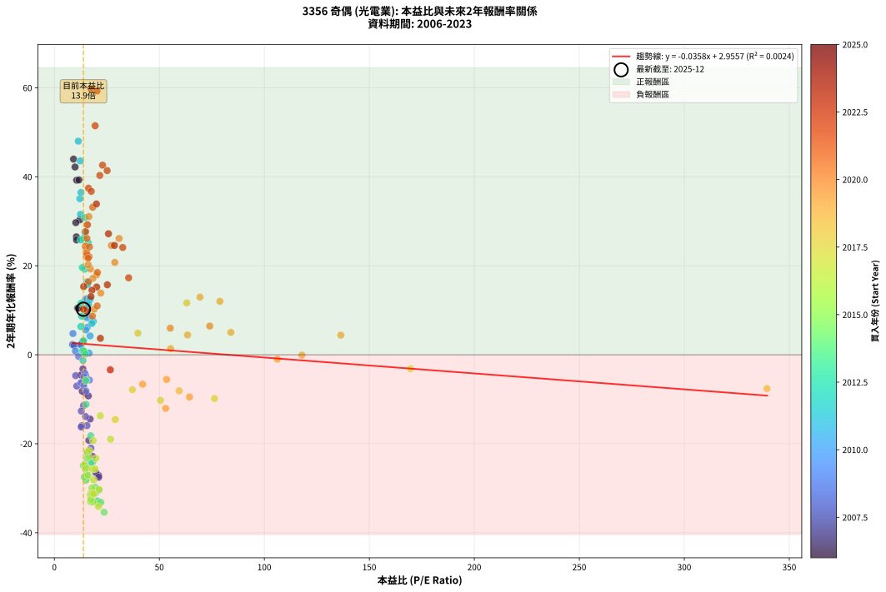
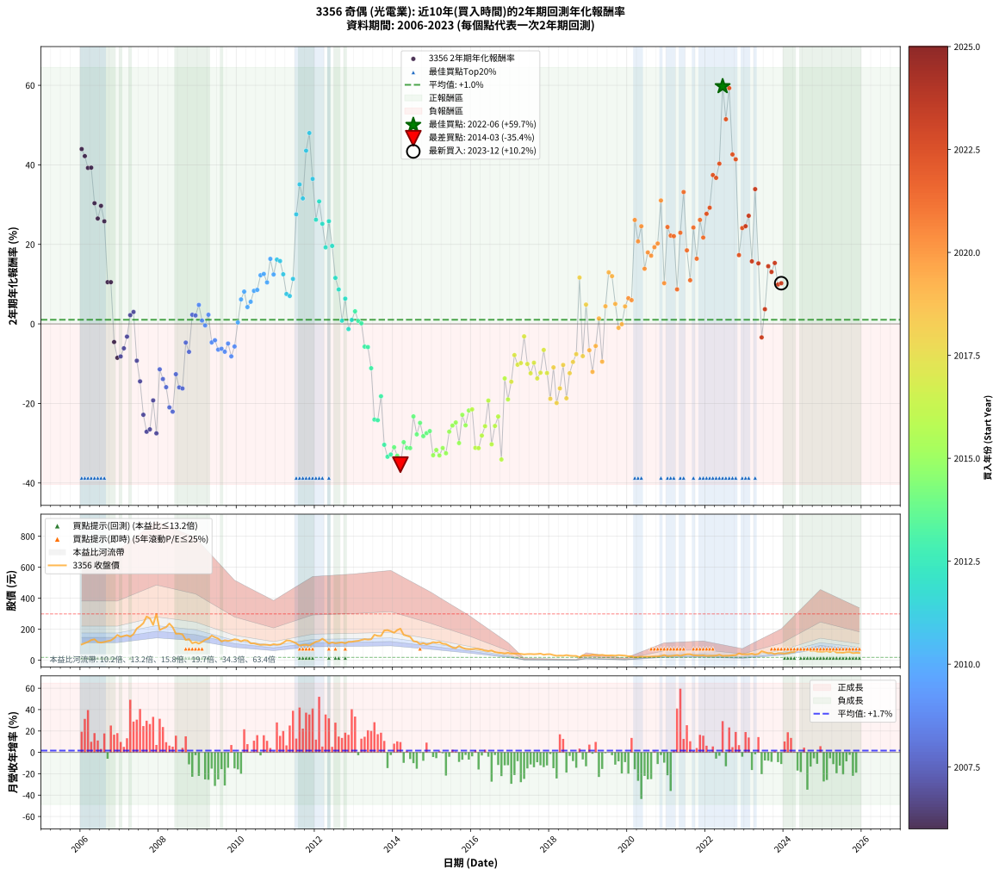

# 3356 奇偶 - 本益比與未來報酬率分析

!!! info "報告資訊"
    - **股票代號**: 3356
    - **公司名稱**: 奇偶
    - **產業別**: 光電業
    - **分析期間**: 2006-2023 (216 個數據點)
    - **資料來源**: Type 12 (ShowMonthlyK_ChartFlow) 月收盤價與本益比
    - **報酬率口徑**: 含現金股利 (簡化: 年度合計，假設每年7/1入帳)
    - **報告生成時間**: 2026-01-11 18:53:39 CST

## 📈 視覺化圖表

### 圖表1: 本益比 vs 未來報酬率關係

*圖表1：3356 奇偶 本益比與2年期未來報酬率關係 (2006-2023)*

### 圖表2: 歷年買入時點的2年期實際報酬率

*圖表2：3356 奇偶 歷年買入時點的2年期實際報酬率 (2006-2023)*

## 📍 買點訊號說明

本報告提供兩種買點提示訊號（顯示於圖表2的股價子圖中）：

### ▲ 小綠色三角形（回測驗證）
- **計算方式**: 使用全部歷史資料計算本益比第25百分位數
- **用途**: 事後驗證，顯示歷史上哪些時點確實為低估區
- **限制**: 當下無法判斷，僅供回測參考
- **特性**: 後見之明（Look-Ahead Bias）

### ▲ 小橘色三角形（即時訊號）
- **計算方式**: 使用截至當月的過去5年資料計算本益比第25百分位數
- **用途**: 實際投資決策，當時即可判斷
- **優勢**: 可操作性強，符合實務需求
- **特性**: 無後見之明，滾動窗口計算

!!! tip "如何使用兩種訊號"
    - **綠色▲** 幫助理解歷史估值機會，驗證策略有效性
    - **橘色▲** 可作為實際買進參考，但仍需搭配基本面分析
    - 兩種訊號重疊時，表示即時判斷與事後驗證一致，信心度較高
    - 僅有綠色▲時，表示當時無法判斷（需要未來資料才能確認）
    - 僅有橘色▲時，表示即時判斷為買點，但事後可能不是最佳時機

## 📊 估值分析摘要

| 指標 | 數值 |
|:---:|:---:|
| **目前本益比** (2023-12) | **13.86 倍** |
| **歷史平均本益比** | 24.24 倍 |
| **估值水準** | 🟢 相對低估 |
| **預期2年年化報酬率** | **+2.46%** |
| **歷史平均報酬率** | +1.05% |
| **相關係數 (R²)** | 0.0024 |
| **趨勢線斜率** | -0.0358 |

!!! abstract "核心洞察"
    目前本益比顯著低於歷史平均，預期未來報酬率可能較高

    根據歷史數據回測，3356 奇偶 在目前本益比 **13.9倍** 的估值水準下，
    預期未來2年年化報酬率約為 **+2.5%**。

    **重要提醒**: 本分析基於歷史數據統計，實際報酬率會受到公司基本面變化、產業趨勢、
    總體經濟環境等多重因素影響。R² = 0.00 表示本益比可解釋約 0.2% 的報酬率變異。

## 📈 歷史估值統計

### 最佳買點 (最高報酬率)

| 項目 | 數值 |
|:---:|:---:|
| 起始時間 | 2022-06 |
| 當時本益比 | 17.50 倍 |
| 起始價格 | 27.6 元 |
| 2年後價格 | 68.0 元 |
| **2年年化報酬率** | **+59.74%** |

### 最差買點 (最低報酬率)

| 項目 | 數值 |
|:---:|:---:|
| 起始時間 | 2014-03 |
| 當時本益比 | 23.69 倍 |
| 起始價格 | 204.0 元 |
| 2年後價格 | 72.5 元 |
| **2年年化報酬率** | **-35.39%** |

## 🎯 投資啟示

### 本益比與報酬率關係

趨勢線方程式: **y = -0.0358x + 2.9557**

!!! note "負相關"
    本益比與未來報酬率呈現負相關。較低的本益比通常帶來較高的未來報酬率，
    但相關性不算非常強。**估值仍是重要參考指標之一**。

### 估值區間建議

基於歷史數據分析:

- **🟢 低估區** (P/E < 19.4): 預期報酬率較高，可考慮增加持股
- **🟡 合理區** (P/E 19.4-29.1): 預期報酬率符合長期趨勢，正常持有
- **🔴 高估區** (P/E > 29.1): 預期報酬率較低，可考慮減碼或觀望

!!! danger "風險提示"
    - 過去表現不代表未來結果
    - 本分析假設公司基本面無重大結構性變化
    - 產業環境劇變可能使歷史規律失效
    - 應結合公司財報、產業趨勢、總體經濟等多重因素綜合判斷

!!! success "長期投資觀點"
    歷史數據顯示，在合理或低估的估值水準買入並長期持有，
    往往能獲得較佳的投資報酬。**耐心等待好價格**是價值投資的核心原則。

## 📊 數據品質

- **資料來源**: GoodInfo.tw Type 12 (ShowMonthlyK_ChartFlow)
- **資料頻率**: 月度收盤價與本益比
- **回測期間**: 2006-2023
- **數據點數量**: 216 個 (每個點代表一次2年期回測)

### 計算方法說明

1. **2年期年化報酬率**:
   - 對每個歷史時點，計算其後2年的實際投資報酬率
   - 期末價值(不含股利): 期末價格
   - 期末價值(含現金股利): 期末價格 + 持有期間內的現金股利合計 (簡化: 年度合計，假設每年7/1入帳)
   - 公式: 年化報酬率 = [(期末價值/期初價格)^(1/年數) - 1] × 100%

2. **本益比 (P/E Ratio)**:
   - 使用當時的月收盤價與EPS計算
   - 資料來源: Type 12 月度河流圖本益比數據

3. **趨勢線 (Linear Regression)**:
   - 使用最小平方法擬合線性趨勢線
   - R²值衡量本益比對報酬率的解釋能力

---

*本報告由 Stock Analysis System v1.9.0 自動生成*
*數據更新時間: 2026-01-11 18:53:39 CST*

## 📋 月度回測明細表

（每一列對應時間線圖中的一個買入點；可用來對照 SVG 圖上的每個點。）

| 買入月份 | 賣出月份 | 回測期限_年 | 實際持有年數 | 買入本益比_倍 | 買入收盤價_元 | 賣出收盤價_元 | 現金股利合計_元 | 總報酬率_pct | 年化報酬率_pct |
| --- | --- | --- | --- | --- | --- | --- | --- | --- | --- |
| 2006-01 | 2008-01 | 2 | 1.999 | 9.14 | 102.00 | 195.00 | 16.30 | +107.16 | +43.97 |
| 2006-02 | 2008-02 | 2 | 1.999 | 9.86 | 110.00 | 206.00 | 16.30 | +102.09 | +42.19 |
| 2006-03 | 2008-03 | 2 | 2.001 | 10.62 | 118.50 | 213.50 | 16.30 | +93.92 | +39.23 |
| 2006-04 | 2008-04 | 2 | 2.001 | 11.69 | 130.50 | 237.00 | 16.30 | +94.10 | +39.29 |
| 2006-05 | 2008-05 | 2 | 2.001 | 12.14 | 135.50 | 214.00 | 16.30 | +69.96 | +30.35 |
| 2006-06 | 2008-06 | 2 | 2.001 | 10.48 | 117.00 | 171.00 | 16.30 | +60.09 | +26.50 |
| 2006-07 | 2008-07 | 2 | 2.001 | 10.22 | 114.00 | 172.00 | 19.80 | +68.25 | +29.69 |
| 2006-08 | 2008-08 | 2 | 2.001 | 10.57 | 118.00 | 167.00 | 19.80 | +58.31 | +25.80 |
| 2006-09 | 2008-09 | 2 | 2.001 | 11.07 | 123.50 | 131.00 | 19.80 | +22.11 | +10.49 |
| 2006-10 | 2008-10 | 2 | 2.001 | 11.47 | 128.00 | 136.50 | 19.80 | +22.11 | +10.50 |
| 2006-11 | 2008-11 | 2 | 2.001 | 12.77 | 142.50 | 110.00 | 19.80 | -8.91 | -4.56 |
| 2006-12 | 2008-12 | 2 | 2.001 | 14.65 | 163.50 | 117.00 | 19.80 | -16.33 | -8.52 |
| 2007-01 | 2009-01 | 2 | 2.001 | 13.23 | 151.00 | 107.50 | 19.80 | -15.70 | -8.18 |
| 2007-02 | 2009-02 | 2 | 2.001 | 13.46 | 157.00 | 118.50 | 19.80 | -11.91 | -6.14 |
| 2007-03 | 2009-03 | 2 | 2.001 | 13.60 | 162.00 | 132.00 | 19.80 | -6.30 | -3.20 |
| 2007-04 | 2009-04 | 2 | 2.001 | 12.54 | 152.50 | 139.50 | 19.80 | +4.46 | +2.20 |
| 2007-05 | 2009-05 | 2 | 2.001 | 13.61 | 169.00 | 159.50 | 19.80 | +6.09 | +3.00 |
| 2007-06 | 2009-06 | 2 | 2.001 | 16.19 | 205.00 | 149.00 | 19.80 | -17.66 | -9.25 |
| 2007-07 | 2009-07 | 2 | 2.001 | 17.03 | 220.00 | 140.00 | 21.00 | -26.82 | -14.44 |
| 2007-08 | 2009-08 | 2 | 2.001 | 18.19 | 239.50 | 121.50 | 21.00 | -40.50 | -22.85 |
| 2007-09 | 2009-09 | 2 | 2.001 | 21.05 | 282.50 | 129.00 | 21.00 | -46.90 | -27.12 |
| 2007-10 | 2009-10 | 2 | 2.001 | 19.79 | 270.50 | 125.00 | 21.00 | -46.03 | -26.52 |
| 2007-11 | 2009-11 | 2 | 2.001 | 16.42 | 228.50 | 128.00 | 21.00 | -34.79 | -19.24 |
| 2007-12 | 2009-12 | 2 | 2.001 | 21.10 | 299.00 | 136.00 | 21.00 | -47.49 | -27.52 |
| 2008-01 | 2010-01 | 2 | 2.001 | 13.90 | 195.00 | 132.00 | 21.00 | -21.54 | -11.41 |
| 2008-02 | 2010-03 | 2 | 2.081 | 14.83 | 206.00 | 130.00 | 21.00 | -26.70 | -13.87 |
| 2008-03 | 2010-03 | 2 | 1.999 | 15.53 | 213.50 | 130.00 | 21.00 | -29.27 | -15.91 |
| 2008-04 | 2010-04 | 2 | 1.999 | 17.41 | 237.00 | 127.00 | 21.00 | -37.55 | -20.99 |
| 2008-05 | 2010-05 | 2 | 1.999 | 15.89 | 214.00 | 109.00 | 21.00 | -39.25 | -22.07 |
| 2008-06 | 2010-06 | 2 | 1.999 | 12.83 | 171.00 | 109.50 | 21.00 | -23.68 | -12.65 |
| 2008-07 | 2010-07 | 2 | 1.999 | 13.04 | 172.00 | 103.50 | 18.00 | -29.36 | -15.96 |
| 2008-08 | 2010-08 | 2 | 1.999 | 12.80 | 167.00 | 99.20 | 18.00 | -29.82 | -16.24 |
| 2008-09 | 2010-09 | 2 | 1.999 | 10.15 | 131.00 | 101.00 | 18.00 | -9.16 | -4.69 |
| 2008-10 | 2010-10 | 2 | 1.999 | 10.69 | 136.50 | 100.00 | 18.00 | -13.55 | -7.03 |
| 2008-11 | 2010-11 | 2 | 1.999 | 8.71 | 110.00 | 97.10 | 18.00 | +4.64 | +2.29 |
| 2008-12 | 2010-12 | 2 | 1.999 | 9.37 | 117.00 | 104.00 | 18.00 | +4.27 | +2.12 |
| 2009-01 | 2011-01 | 2 | 1.999 | 8.86 | 107.50 | 100.00 | 18.00 | +9.77 | +4.77 |
| 2009-02 | 2011-02 | 2 | 1.999 | 10.07 | 118.50 | 102.50 | 18.00 | +1.69 | +0.84 |
| 2009-03 | 2011-03 | 2 | 1.999 | 11.57 | 132.00 | 113.00 | 18.00 | -0.76 | -0.38 |
| 2009-04 | 2011-04 | 2 | 1.999 | 12.63 | 139.50 | 128.00 | 18.00 | +4.66 | +2.30 |
| 2009-05 | 2011-05 | 2 | 1.999 | 14.93 | 159.50 | 127.00 | 18.00 | -9.09 | -4.66 |
| 2009-06 | 2011-06 | 2 | 1.999 | 14.44 | 149.00 | 119.00 | 18.00 | -8.05 | -4.11 |
| 2009-07 | 2011-07 | 2 | 1.999 | 14.06 | 140.00 | 109.50 | 12.98 | -12.51 | -6.47 |
| 2009-08 | 2011-08 | 2 | 1.999 | 12.66 | 121.50 | 93.80 | 12.98 | -12.11 | -6.26 |
| 2009-09 | 2011-09 | 2 | 1.999 | 13.97 | 129.00 | 98.60 | 12.98 | -13.50 | -7.00 |
| 2009-10 | 2011-10 | 2 | 1.999 | 14.09 | 125.00 | 100.00 | 12.98 | -9.62 | -4.93 |
| 2009-11 | 2011-11 | 2 | 1.999 | 15.04 | 128.00 | 95.00 | 12.98 | -15.64 | -8.16 |
| 2009-12 | 2011-12 | 2 | 1.999 | 16.69 | 136.00 | 108.00 | 12.98 | -11.04 | -5.69 |
| 2010-01 | 2012-01 | 2 | 1.999 | 16.54 | 132.00 | 120.00 | 12.98 | +0.74 | +0.37 |
| 2010-02 | 2012-02 | 2 | 1.999 | 15.63 | 122.00 | 124.50 | 12.98 | +12.69 | +6.16 |
| 2010-03 | 2012-03 | 2 | 2.001 | 17.03 | 130.00 | 139.00 | 12.98 | +16.91 | +8.12 |
| 2010-04 | 2012-04 | 2 | 2.001 | 17.02 | 127.00 | 125.00 | 12.98 | +8.65 | +4.23 |
| 2010-05 | 2012-05 | 2 | 2.001 | 14.95 | 109.00 | 108.50 | 12.98 | +11.45 | +5.57 |
| 2010-06 | 2012-06 | 2 | 2.001 | 15.38 | 109.50 | 115.50 | 12.98 | +17.33 | +8.32 |
| 2010-07 | 2012-07 | 2 | 2.001 | 14.90 | 103.50 | 110.00 | 11.98 | +17.86 | +8.56 |
| 2010-08 | 2012-08 | 2 | 2.001 | 14.64 | 99.20 | 113.00 | 11.98 | +25.99 | +12.24 |
| 2010-09 | 2012-09 | 2 | 2.001 | 15.29 | 101.00 | 116.00 | 11.98 | +26.71 | +12.56 |
| 2010-10 | 2012-10 | 2 | 2.001 | 15.54 | 100.00 | 110.00 | 11.98 | +21.98 | +10.44 |
| 2010-11 | 2012-11 | 2 | 2.001 | 15.51 | 97.10 | 119.50 | 11.98 | +35.41 | +16.35 |
| 2010-12 | 2012-12 | 2 | 2.001 | 17.08 | 104.00 | 119.50 | 11.98 | +26.42 | +12.43 |
| 2011-01 | 2013-01 | 2 | 2.001 | 15.89 | 100.00 | 123.00 | 11.98 | +34.98 | +16.17 |
| 2011-02 | 2013-02 | 2 | 2.001 | 15.78 | 102.50 | 125.50 | 11.98 | +34.13 | +15.80 |
| 2011-03 | 2013-03 | 2 | 2.001 | 16.87 | 113.00 | 131.00 | 11.98 | +26.53 | +12.48 |
| 2011-04 | 2013-04 | 2 | 2.001 | 18.54 | 128.00 | 136.00 | 11.98 | +15.61 | +7.52 |
| 2011-05 | 2013-05 | 2 | 2.001 | 17.87 | 127.00 | 133.50 | 11.98 | +14.55 | +7.02 |
| 2011-06 | 2013-06 | 2 | 2.001 | 16.28 | 119.00 | 135.50 | 11.98 | +23.93 | +11.32 |
| 2011-07 | 2013-07 | 2 | 2.001 | 14.57 | 109.50 | 164.50 | 13.70 | +62.74 | +27.55 |
| 2011-08 | 2013-08 | 2 | 2.001 | 12.16 | 93.80 | 157.50 | 13.70 | +82.52 | +35.07 |
| 2011-09 | 2013-09 | 2 | 2.001 | 12.45 | 98.60 | 157.00 | 13.70 | +73.12 | +31.55 |
| 2011-10 | 2013-10 | 2 | 2.001 | 12.31 | 100.00 | 192.50 | 13.70 | +106.20 | +43.56 |
| 2011-11 | 2013-11 | 2 | 2.001 | 11.41 | 95.00 | 194.50 | 13.70 | +119.16 | +48.00 |
| 2011-12 | 2013-12 | 2 | 2.001 | 12.66 | 108.00 | 187.50 | 13.70 | +86.30 | +36.46 |
| 2012-01 | 2014-01 | 2 | 2.001 | 14.03 | 120.00 | 177.50 | 13.70 | +59.33 | +26.21 |
| 2012-02 | 2014-03 | 2 | 2.081 | 14.52 | 124.50 | 204.00 | 13.70 | +74.86 | +30.81 |
| 2012-03 | 2014-03 | 2 | 1.999 | 16.18 | 139.00 | 204.00 | 13.70 | +56.62 | +25.17 |
| 2012-04 | 2014-04 | 2 | 1.999 | 14.51 | 125.00 | 164.00 | 13.70 | +42.16 | +19.25 |
| 2012-05 | 2014-05 | 2 | 1.999 | 12.57 | 108.50 | 158.00 | 13.70 | +58.25 | +25.82 |
| 2012-06 | 2014-06 | 2 | 1.999 | 13.35 | 115.50 | 151.50 | 13.70 | +43.03 | +19.61 |
| 2012-07 | 2014-07 | 2 | 1.999 | 12.68 | 110.00 | 123.00 | 13.90 | +24.45 | +11.57 |
| 2012-08 | 2014-08 | 2 | 1.999 | 12.99 | 113.00 | 119.50 | 13.90 | +18.05 | +8.66 |
| 2012-09 | 2014-09 | 2 | 1.999 | 13.31 | 116.00 | 104.00 | 13.90 | +1.64 | +0.82 |
| 2012-10 | 2014-10 | 2 | 1.999 | 12.59 | 110.00 | 110.50 | 13.90 | +13.09 | +6.35 |
| 2012-11 | 2014-11 | 2 | 1.999 | 13.64 | 119.50 | 102.50 | 13.90 | -2.59 | -1.31 |
| 2012-12 | 2014-12 | 2 | 1.999 | 13.61 | 119.50 | 108.00 | 13.90 | +2.01 | +1.00 |
| 2013-01 | 2015-01 | 2 | 1.999 | 13.96 | 123.00 | 117.00 | 13.90 | +6.42 | +3.16 |
| 2013-02 | 2015-02 | 2 | 1.999 | 14.19 | 125.50 | 113.50 | 13.90 | +1.51 | +0.75 |
| 2013-03 | 2015-03 | 2 | 1.999 | 14.77 | 131.00 | 117.50 | 13.90 | +0.31 | +0.15 |
| 2013-04 | 2015-04 | 2 | 1.999 | 15.28 | 136.00 | 107.00 | 13.90 | -11.10 | -5.72 |
| 2013-05 | 2015-05 | 2 | 1.999 | 14.94 | 133.50 | 104.50 | 13.90 | -11.31 | -5.83 |
| 2013-06 | 2015-06 | 2 | 1.999 | 15.11 | 135.50 | 93.10 | 13.90 | -21.03 | -11.14 |
| 2013-07 | 2015-07 | 2 | 1.999 | 18.29 | 164.50 | 82.30 | 12.60 | -42.31 | -24.06 |
| 2013-08 | 2015-08 | 2 | 1.999 | 17.45 | 157.50 | 77.90 | 12.60 | -42.54 | -24.21 |
| 2013-09 | 2015-09 | 2 | 1.999 | 17.33 | 157.00 | 92.50 | 12.60 | -33.06 | -18.19 |
| 2013-10 | 2015-10 | 2 | 1.999 | 21.18 | 192.50 | 80.70 | 12.60 | -51.53 | -30.40 |
| 2013-11 | 2015-11 | 2 | 1.999 | 21.33 | 194.50 | 73.70 | 12.60 | -55.63 | -33.41 |
| 2013-12 | 2015-12 | 2 | 1.999 | 20.49 | 187.50 | 72.00 | 12.60 | -54.88 | -32.85 |
| 2014-01 | 2016-01 | 2 | 1.999 | 19.79 | 177.50 | 71.90 | 12.60 | -52.39 | -31.02 |
| 2014-02 | 2016-02 | 2 | 1.999 | 22.18 | 195.00 | 74.60 | 12.60 | -55.28 | -33.15 |
| 2014-03 | 2016-03 | 2 | 2.001 | 23.69 | 204.00 | 72.50 | 12.60 | -58.28 | -35.39 |
| 2014-04 | 2016-04 | 2 | 2.001 | 19.45 | 164.00 | 68.30 | 12.60 | -50.67 | -29.75 |
| 2014-05 | 2016-05 | 2 | 2.001 | 19.14 | 158.00 | 62.20 | 12.60 | -52.66 | -31.18 |
| 2014-06 | 2016-06 | 2 | 2.001 | 18.76 | 151.50 | 59.00 | 12.60 | -52.74 | -31.24 |
| 2014-07 | 2016-07 | 2 | 2.001 | 15.58 | 123.00 | 63.00 | 9.40 | -41.14 | -23.26 |
| 2014-08 | 2016-08 | 2 | 2.001 | 15.49 | 119.50 | 52.90 | 9.40 | -47.87 | -27.78 |
| 2014-09 | 2016-09 | 2 | 2.001 | 13.80 | 104.00 | 49.25 | 9.40 | -43.61 | -24.89 |
| 2014-10 | 2016-10 | 2 | 2.001 | 15.02 | 110.50 | 47.50 | 9.40 | -48.51 | -28.22 |
| 2014-11 | 2016-11 | 2 | 2.001 | 14.28 | 102.50 | 44.50 | 9.40 | -47.41 | -27.47 |
| 2014-12 | 2016-12 | 2 | 2.001 | 15.43 | 108.00 | 48.20 | 9.40 | -46.67 | -26.95 |
| 2015-01 | 2017-01 | 2 | 2.001 | 17.21 | 117.00 | 43.05 | 9.40 | -55.17 | -33.03 |
| 2015-02 | 2017-02 | 2 | 2.001 | 17.21 | 113.50 | 43.50 | 9.40 | -53.39 | -31.71 |
| 2015-03 | 2017-03 | 2 | 2.001 | 18.37 | 117.50 | 43.20 | 9.40 | -55.23 | -33.07 |
| 2015-04 | 2017-04 | 2 | 2.001 | 17.28 | 107.00 | 41.20 | 9.40 | -52.71 | -31.21 |
| 2015-05 | 2017-05 | 2 | 2.001 | 17.44 | 104.50 | 38.15 | 9.40 | -54.50 | -32.53 |
| 2015-06 | 2017-06 | 2 | 2.001 | 16.08 | 93.10 | 40.05 | 9.40 | -46.89 | -27.10 |
| 2015-07 | 2017-07 | 2 | 2.001 | 14.73 | 82.30 | 40.60 | 4.99 | -44.60 | -25.55 |
| 2015-08 | 2017-08 | 2 | 2.001 | 14.46 | 77.90 | 39.05 | 4.99 | -43.46 | -24.79 |
| 2015-09 | 2017-09 | 2 | 2.001 | 17.84 | 92.50 | 40.35 | 4.99 | -50.98 | -29.97 |
| 2015-10 | 2017-10 | 2 | 2.001 | 16.19 | 80.70 | 43.00 | 4.99 | -40.53 | -22.87 |
| 2015-11 | 2017-11 | 2 | 2.001 | 15.41 | 73.70 | 35.90 | 4.99 | -44.51 | -25.50 |
| 2015-12 | 2017-12 | 2 | 2.001 | 15.72 | 72.00 | 39.05 | 4.99 | -38.83 | -21.77 |
| 2016-01 | 2018-01 | 2 | 2.001 | 16.54 | 71.90 | 39.30 | 4.99 | -38.39 | -21.50 |
| 2016-02 | 2018-03 | 2 | 2.081 | 18.12 | 74.60 | 29.30 | 4.99 | -54.03 | -31.17 |
| 2016-03 | 2018-03 | 2 | 1.999 | 18.66 | 72.50 | 29.30 | 4.99 | -52.70 | -31.24 |
| 2016-04 | 2018-04 | 2 | 1.999 | 18.70 | 68.30 | 30.35 | 4.99 | -48.25 | -28.08 |
| 2016-05 | 2018-05 | 2 | 1.999 | 18.18 | 62.20 | 29.35 | 4.99 | -44.78 | -25.71 |
| 2016-06 | 2018-06 | 2 | 1.999 | 18.50 | 59.00 | 33.45 | 4.99 | -34.84 | -19.29 |
| 2016-07 | 2018-07 | 2 | 1.999 | 21.30 | 63.00 | 29.65 | 0.99 | -51.36 | -30.27 |
| 2016-08 | 2018-08 | 2 | 1.999 | 19.40 | 52.90 | 28.25 | 0.99 | -44.72 | -25.66 |
| 2016-09 | 2018-09 | 2 | 1.999 | 19.74 | 49.25 | 28.00 | 0.99 | -41.13 | -23.29 |
| 2016-10 | 2018-10 | 2 | 1.999 | 20.99 | 47.50 | 19.65 | 0.99 | -56.54 | -34.09 |
| 2016-11 | 2018-11 | 2 | 1.999 | 21.90 | 44.50 | 32.15 | 0.99 | -25.52 | -13.71 |
| 2016-12 | 2018-12 | 2 | 1.999 | 26.78 | 48.20 | 30.65 | 0.99 | -34.35 | -18.99 |
| 2017-01 | 2019-01 | 2 | 1.999 | 28.99 | 43.05 | 30.45 | 0.99 | -26.96 | -14.55 |
| 2017-02 | 2019-02 | 2 | 1.999 | 37.18 | 43.50 | 35.95 | 0.99 | -15.07 | -7.85 |
| 2017-03 | 2019-03 | 2 | 1.999 | 50.53 | 43.20 | 33.80 | 0.99 | -19.46 | -10.26 |
| 2017-04 | 2019-04 | 2 | 1.999 | 76.30 | 41.20 | 32.50 | 0.99 | -18.70 | -9.84 |
| 2017-05 | 2019-05 | 2 | 1.999 | 169.60 | 38.15 | 34.80 | 0.99 | -6.18 | -3.14 |
| 2017-06 | 2019-06 | 2 | 1.999 |  | 40.05 | 31.40 | 0.99 | -19.12 | -10.07 |
| 2017-07 | 2019-07 | 2 | 1.999 |  | 40.60 | 31.15 | 0.00 | -23.28 | -12.42 |
| 2017-08 | 2019-08 | 2 | 1.999 |  | 39.05 | 31.80 | 0.00 | -18.57 | -9.77 |
| 2017-09 | 2019-09 | 2 | 1.999 |  | 40.35 | 30.05 | 0.00 | -25.53 | -13.71 |
| 2017-10 | 2019-10 | 2 | 1.999 |  | 43.00 | 33.10 | 0.00 | -23.02 | -12.27 |
| 2017-11 | 2019-11 | 2 | 1.999 |  | 35.90 | 31.35 | 0.00 | -12.67 | -6.56 |
| 2017-12 | 2019-12 | 2 | 1.999 |  | 39.05 | 30.00 | 0.00 | -23.18 | -12.36 |
| 2018-01 | 2020-01 | 2 | 1.999 |  | 39.30 | 25.90 | 0.00 | -34.10 | -18.83 |
| 2018-02 | 2020-02 | 2 | 1.999 |  | 33.40 | 26.50 | 0.00 | -20.66 | -10.93 |
| 2018-03 | 2020-03 | 2 | 2.001 |  | 29.30 | 18.80 | 0.00 | -35.84 | -19.89 |
| 2018-04 | 2020-04 | 2 | 2.001 |  | 30.35 | 21.30 | 0.00 | -29.82 | -16.22 |
| 2018-05 | 2020-05 | 2 | 2.001 |  | 29.35 | 23.60 | 0.00 | -19.59 | -10.32 |
| 2018-06 | 2020-06 | 2 | 2.001 |  | 33.45 | 22.10 | 0.00 | -33.93 | -18.71 |
| 2018-07 | 2020-07 | 2 | 2.001 |  | 29.65 | 22.75 | 0.00 | -23.27 | -12.40 |
| 2018-08 | 2020-08 | 2 | 2.001 |  | 28.25 | 23.10 | 0.00 | -18.23 | -9.57 |
| 2018-09 | 2020-09 | 2 | 2.001 | 339.40 | 28.00 | 23.90 | 0.00 | -14.64 | -7.61 |
| 2018-10 | 2020-10 | 2 | 2.001 | 63.05 | 19.65 | 24.50 | 0.00 | +24.68 | +11.65 |
| 2018-11 | 2020-11 | 2 | 2.001 | 59.45 | 32.15 | 27.15 | 0.00 | -15.55 | -8.10 |
| 2018-12 | 2020-12 | 2 | 2.001 | 39.81 | 30.65 | 33.70 | 0.00 | +9.95 | +4.85 |
| 2019-01 | 2021-01 | 2 | 2.001 | 42.05 | 30.45 | 26.55 | 0.00 | -12.81 | -6.62 |
| 2019-02 | 2021-02 | 2 | 2.001 | 53.00 | 35.95 | 27.80 | 0.00 | -22.67 | -12.06 |
| 2019-03 | 2021-03 | 2 | 2.001 | 53.44 | 33.80 | 30.15 | 0.00 | -10.80 | -5.55 |
| 2019-04 | 2021-04 | 2 | 2.001 | 55.40 | 32.50 | 33.40 | 0.00 | +2.77 | +1.37 |
| 2019-05 | 2021-05 | 2 | 2.001 | 64.35 | 34.80 | 28.50 | 0.00 | -18.10 | -9.50 |
| 2019-06 | 2021-06 | 2 | 2.001 | 63.43 | 31.40 | 34.25 | 0.00 | +9.08 | +4.44 |
| 2019-07 | 2021-07 | 2 | 2.001 | 69.35 | 31.15 | 38.75 | 1.00 | +27.61 | +12.96 |
| 2019-08 | 2021-08 | 2 | 2.001 | 78.84 | 31.80 | 38.90 | 1.00 | +25.47 | +12.01 |
| 2019-09 | 2021-09 | 2 | 2.001 | 84.06 | 30.05 | 32.15 | 1.00 | +10.32 | +5.03 |
| 2019-10 | 2021-10 | 2 | 2.001 | 106.20 | 33.10 | 31.45 | 1.00 | -1.96 | -0.98 |
| 2019-11 | 2021-11 | 2 | 2.001 | 117.90 | 31.35 | 30.30 | 1.00 | -0.16 | -0.08 |
| 2019-12 | 2021-12 | 2 | 2.001 | 136.40 | 30.00 | 31.70 | 1.00 | +9.00 | +4.40 |
| 2020-01 | 2022-01 | 2 | 2.001 | 74.00 | 25.90 | 28.35 | 1.00 | +13.32 | +6.45 |
| 2020-02 | 2022-03 | 2 | 2.081 | 55.21 | 26.50 | 28.90 | 1.00 | +12.83 | +5.97 |
| 2020-03 | 2022-03 | 2 | 1.999 | 30.82 | 18.80 | 28.90 | 1.00 | +59.05 | +26.13 |
| 2020-04 | 2022-04 | 2 | 1.999 | 28.78 | 21.30 | 30.05 | 1.00 | +45.78 | +20.75 |
| 2020-05 | 2022-05 | 2 | 1.999 | 27.13 | 23.60 | 35.60 | 1.00 | +55.09 | +24.55 |
| 2020-06 | 2022-06 | 2 | 1.999 | 22.10 | 22.10 | 27.65 | 1.00 | +29.64 | +13.87 |
| 2020-07 | 2022-07 | 2 | 1.999 | 20.13 | 22.75 | 29.45 | 2.20 | +39.13 | +17.96 |
| 2020-08 | 2022-08 | 2 | 1.999 | 18.33 | 23.10 | 29.50 | 2.20 | +37.23 | +17.16 |
| 2020-09 | 2022-09 | 2 | 1.999 | 17.19 | 23.90 | 31.80 | 2.20 | +42.26 | +19.29 |
| 2020-10 | 2022-10 | 2 | 1.999 | 16.12 | 24.50 | 33.20 | 2.20 | +44.49 | +20.22 |
| 2020-11 | 2022-11 | 2 | 1.999 | 16.45 | 27.15 | 44.40 | 2.20 | +71.64 | +31.04 |
| 2020-12 | 2022-12 | 2 | 1.999 | 18.93 | 33.70 | 38.75 | 2.20 | +21.52 | +10.24 |
| 2021-01 | 2023-01 | 2 | 1.999 | 14.78 | 26.55 | 38.85 | 2.20 | +54.62 | +24.36 |
| 2021-02 | 2023-02 | 2 | 1.999 | 15.34 | 27.80 | 39.30 | 2.20 | +49.28 | +22.20 |
| 2021-03 | 2023-03 | 2 | 1.999 | 16.50 | 30.15 | 42.70 | 2.20 | +48.93 | +22.05 |
| 2021-04 | 2023-04 | 2 | 1.999 | 18.12 | 33.40 | 37.25 | 2.20 | +18.12 | +8.69 |
| 2021-05 | 2023-05 | 2 | 1.999 | 15.33 | 28.50 | 40.85 | 2.20 | +51.06 | +22.92 |
| 2021-06 | 2023-06 | 2 | 1.999 | 18.27 | 34.25 | 58.50 | 2.20 | +77.23 | +33.15 |
| 2021-07 | 2023-07 | 2 | 1.999 | 20.49 | 38.75 | 51.80 | 2.60 | +40.39 | +18.50 |
| 2021-08 | 2023-08 | 2 | 1.999 | 20.40 | 38.90 | 45.30 | 2.60 | +23.14 | +10.97 |
| 2021-09 | 2023-09 | 2 | 1.999 | 16.72 | 32.15 | 47.00 | 2.60 | +54.28 | +24.23 |
| 2021-10 | 2023-10 | 2 | 1.999 | 16.23 | 31.45 | 40.00 | 2.60 | +35.45 | +16.40 |
| 2021-11 | 2023-11 | 2 | 1.999 | 15.51 | 30.30 | 45.60 | 2.60 | +59.08 | +26.15 |
| 2021-12 | 2023-12 | 2 | 1.999 | 16.09 | 31.70 | 44.35 | 2.60 | +48.11 | +21.72 |
| 2022-01 | 2024-01 | 2 | 1.999 | 14.88 | 28.35 | 43.60 | 2.60 | +62.96 | +27.68 |
| 2022-02 | 2024-02 | 2 | 1.999 | 15.76 | 29.00 | 45.80 | 2.60 | +66.90 | +29.21 |
| 2022-03 | 2024-03 | 2 | 2.001 | 16.28 | 28.90 | 52.00 | 2.60 | +88.93 | +37.42 |
| 2022-04 | 2024-04 | 2 | 2.001 | 17.57 | 30.05 | 53.60 | 2.60 | +87.02 | +36.73 |
| 2022-05 | 2024-05 | 2 | 2.001 | 21.64 | 35.60 | 67.50 | 2.60 | +96.91 | +40.29 |
| 2022-06 | 2024-06 | 2 | 2.001 | 17.50 | 27.65 | 68.00 | 2.60 | +155.33 | +59.74 |
| 2022-07 | 2024-07 | 2 | 2.001 | 19.44 | 29.45 | 63.30 | 4.30 | +129.54 | +51.46 |
| 2022-08 | 2024-08 | 2 | 2.001 | 20.34 | 29.50 | 70.60 | 4.30 | +153.90 | +59.29 |
| 2022-09 | 2024-09 | 2 | 2.001 | 22.96 | 31.80 | 60.40 | 4.30 | +103.46 | +42.60 |
| 2022-10 | 2024-10 | 2 | 2.001 | 25.15 | 33.20 | 62.10 | 4.30 | +100.00 | +41.39 |
| 2022-11 | 2024-11 | 2 | 2.001 | 35.38 | 44.40 | 56.80 | 4.30 | +37.61 | +17.30 |
| 2022-12 | 2024-12 | 2 | 2.001 | 32.56 | 38.75 | 55.40 | 4.30 | +54.06 | +24.10 |
| 2023-01 | 2025-01 | 2 | 2.001 | 28.62 | 38.85 | 56.00 | 4.30 | +55.21 | +24.57 |
| 2023-02 | 2025-02 | 2 | 2.001 | 25.77 | 39.30 | 59.30 | 4.30 | +61.83 | +27.19 |
| 2023-03 | 2025-03 | 2 | 2.001 | 25.23 | 42.70 | 52.90 | 4.30 | +33.96 | +15.73 |
| 2023-04 | 2025-04 | 2 | 2.001 | 20.03 | 37.25 | 62.50 | 4.30 | +79.33 | +33.89 |
| 2023-05 | 2025-05 | 2 | 2.001 | 20.15 | 40.85 | 49.95 | 4.30 | +32.80 | +15.23 |
| 2023-06 | 2025-06 | 2 | 2.001 | 26.65 | 58.50 | 50.30 | 4.30 | -6.67 | -3.39 |
| 2023-07 | 2025-07 | 2 | 2.001 | 21.93 | 51.80 | 48.80 | 6.90 | +7.53 | +3.69 |
| 2023-08 | 2025-08 | 2 | 2.001 | 17.91 | 45.30 | 52.50 | 6.90 | +31.13 | +14.50 |
| 2023-09 | 2025-09 | 2 | 2.001 | 17.42 | 47.00 | 53.20 | 6.90 | +27.87 | +13.07 |
| 2023-10 | 2025-10 | 2 | 2.001 | 13.96 | 40.00 | 46.30 | 6.90 | +33.00 | +15.31 |
| 2023-11 | 2025-11 | 2 | 2.001 | 15.04 | 45.60 | 48.20 | 6.90 | +20.83 | +9.92 |
| 2023-12 | 2025-12 | 2 | 2.001 | 13.86 | 44.35 | 47.00 | 6.90 | +21.53 | +10.23 |
