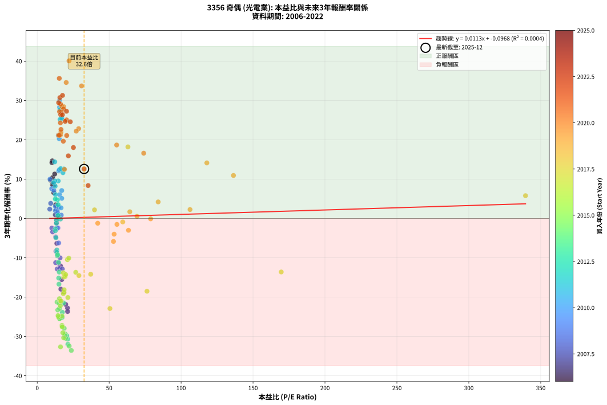

# 3356 奇偶 - 本益比與未來報酬率分析

!!! info "報告資訊"
    - **股票代號**: 3356
    - **公司名稱**: 奇偶
    - **產業別**: 光電業
    - **分析期間**: 2006-2022 (204 個數據點)
    - **資料來源**: Type 12 (ShowMonthlyK_ChartFlow) 月收盤價與本益比
    - **報酬率口徑**: 含現金股利 (簡化: 年度合計，假設每年7/1入帳)
    - **報告生成時間**: 2026-01-10 18:54:50 CST

## 📈 視覺化圖表

### 圖表1: 本益比 vs 未來報酬率關係

*圖表1：3356 奇偶 本益比與3年期未來報酬率關係 (2006-2022)*

### 圖表2: 歷年買入時點的3年期實際報酬率

*圖表2：3356 奇偶 歷年買入時點的3年期實際報酬率 (2006-2022)*

## 📍 買點訊號說明

本報告提供兩種買點提示訊號（顯示於圖表2的股價子圖中）：

### ▲ 小綠色三角形（回測驗證）
- **計算方式**: 使用全部歷史資料計算本益比第25百分位數
- **用途**: 事後驗證，顯示歷史上哪些時點確實為低估區
- **限制**: 當下無法判斷，僅供回測參考
- **特性**: 後見之明（Look-Ahead Bias）

### ▲ 小橘色三角形（即時訊號）
- **計算方式**: 使用截至當月的過去5年資料計算本益比第25百分位數
- **用途**: 實際投資決策，當時即可判斷
- **優勢**: 可操作性強，符合實務需求
- **特性**: 無後見之明，滾動窗口計算

!!! tip "如何使用兩種訊號"
    - **綠色▲** 幫助理解歷史估值機會，驗證策略有效性
    - **橘色▲** 可作為實際買進參考，但仍需搭配基本面分析
    - 兩種訊號重疊時，表示即時判斷與事後驗證一致，信心度較高
    - 僅有綠色▲時，表示當時無法判斷（需要未來資料才能確認）
    - 僅有橘色▲時，表示即時判斷為買點，但事後可能不是最佳時機

## 📊 估值分析摘要

| 指標 | 數值 |
|:---:|:---:|
| **目前本益比** (2022-12) | **32.56 倍** |
| **歷史平均本益比** | 24.48 倍 |
| **估值水準** | 🔴 相對高估 |
| **預期3年年化報酬率** | **+0.27%** |
| **歷史平均報酬率** | -0.27% |
| **相關係數 (R²)** | 0.0004 |
| **趨勢線斜率** | 0.0113 |

!!! abstract "核心洞察"
    目前本益比顯著高於歷史平均，預期未來報酬率可能較低

    根據歷史數據回測，3356 奇偶 在目前本益比 **32.6倍** 的估值水準下，
    預期未來3年年化報酬率約為 **+0.3%**。

    **重要提醒**: 本分析基於歷史數據統計，實際報酬率會受到公司基本面變化、產業趨勢、
    總體經濟環境等多重因素影響。R² = 0.00 表示本益比可解釋約 0.0% 的報酬率變異。

## 📈 歷史估值統計

### 最佳買點 (最高報酬率)

| 項目 | 數值 |
|:---:|:---:|
| 起始時間 | 2020-06 |
| 當時本益比 | 22.10 倍 |
| 起始價格 | 22.1 元 |
| 3年後價格 | 58.5 元 |
| **3年年化報酬率** | **+40.08%** |

### 最差買點 (最低報酬率)

| 項目 | 數值 |
|:---:|:---:|
| 起始時間 | 2014-03 |
| 當時本益比 | 23.69 倍 |
| 起始價格 | 204.0 元 |
| 3年後價格 | 43.2 元 |
| **3年年化報酬率** | **-33.56%** |

## 🎯 投資啟示

### 本益比與報酬率關係

趨勢線方程式: **y = 0.0113x + -0.0968**

!!! info "弱相關或正相關"
    本益比與未來報酬率相關性較弱。這可能表示該股票的報酬率更多受到
    公司成長性、產業趨勢等因素影響，而非估值水準。**需綜合考量多項指標**。

### 估值區間建議

基於歷史數據分析:

- **🟢 低估區** (P/E < 19.6): 預期報酬率較高，可考慮增加持股
- **🟡 合理區** (P/E 19.6-29.4): 預期報酬率符合長期趨勢，正常持有
- **🔴 高估區** (P/E > 29.4): 預期報酬率較低，可考慮減碼或觀望

!!! danger "風險提示"
    - 過去表現不代表未來結果
    - 本分析假設公司基本面無重大結構性變化
    - 產業環境劇變可能使歷史規律失效
    - 應結合公司財報、產業趨勢、總體經濟等多重因素綜合判斷

!!! success "長期投資觀點"
    歷史數據顯示，在合理或低估的估值水準買入並長期持有，
    往往能獲得較佳的投資報酬。**耐心等待好價格**是價值投資的核心原則。

## 📊 數據品質

- **資料來源**: GoodInfo.tw Type 12 (ShowMonthlyK_ChartFlow)
- **資料頻率**: 月度收盤價與本益比
- **回測期間**: 2006-2022
- **數據點數量**: 204 個 (每個點代表一次3年期回測)

### 計算方法說明

1. **3年期年化報酬率**:
   - 對每個歷史時點，計算其後3年的實際投資報酬率
   - 期末價值(不含股利): 期末價格
   - 期末價值(含現金股利): 期末價格 + 持有期間內的現金股利合計 (簡化: 年度合計，假設每年7/1入帳)
   - 公式: 年化報酬率 = [(期末價值/期初價格)^(1/年數) - 1] × 100%

2. **本益比 (P/E Ratio)**:
   - 使用當時的月收盤價與EPS計算
   - 資料來源: Type 12 月度河流圖本益比數據

3. **趨勢線 (Linear Regression)**:
   - 使用最小平方法擬合線性趨勢線
   - R²值衡量本益比對報酬率的解釋能力

---

*本報告由 Stock Analysis System v1.9.0 自動生成*
*數據更新時間: 2026-01-10 18:54:50 CST*

## 📋 月度回測明細表

（每一列對應時間線圖中的一個買入點；可用來對照 SVG 圖上的每個點。）

| 買入月份 | 賣出月份 | 回測期限_年 | 實際持有年數 | 買入本益比_倍 | 買入收盤價_元 | 賣出收盤價_元 | 現金股利合計_元 | 總報酬率_pct | 年化報酬率_pct |
| --- | --- | --- | --- | --- | --- | --- | --- | --- | --- |
| 2006-01 | 2009-01 | 3 | 3.001 | 9.14 | 102.00 | 107.50 | 27.30 | +32.16 | +9.74 |
| 2006-02 | 2009-02 | 3 | 3.001 | 9.86 | 110.00 | 118.50 | 27.30 | +32.55 | +9.84 |
| 2006-03 | 2009-03 | 3 | 3.001 | 10.62 | 118.50 | 132.00 | 27.30 | +34.43 | +10.36 |
| 2006-04 | 2009-04 | 3 | 3.001 | 11.69 | 130.50 | 139.50 | 27.30 | +27.82 | +8.52 |
| 2006-05 | 2009-05 | 3 | 3.001 | 12.14 | 135.50 | 159.50 | 27.30 | +37.86 | +11.29 |
| 2006-06 | 2009-06 | 3 | 3.001 | 10.48 | 117.00 | 149.00 | 27.30 | +50.68 | +14.64 |
| 2006-07 | 2009-07 | 3 | 3.001 | 10.22 | 114.00 | 140.00 | 29.80 | +48.95 | +14.20 |
| 2006-08 | 2009-08 | 3 | 3.001 | 10.57 | 118.00 | 121.50 | 29.80 | +28.22 | +8.64 |
| 2006-09 | 2009-09 | 3 | 3.001 | 11.07 | 123.50 | 129.00 | 29.80 | +28.58 | +8.74 |
| 2006-10 | 2009-10 | 3 | 3.001 | 11.47 | 128.00 | 125.00 | 29.80 | +20.94 | +6.54 |
| 2006-11 | 2009-11 | 3 | 3.001 | 12.77 | 142.50 | 128.00 | 29.80 | +10.74 | +3.46 |
| 2006-12 | 2009-12 | 3 | 3.001 | 14.65 | 163.50 | 136.00 | 29.80 | +1.41 | +0.47 |
| 2007-01 | 2010-01 | 3 | 3.001 | 13.23 | 151.00 | 132.00 | 29.80 | +7.15 | +2.33 |
| 2007-02 | 2010-02 | 3 | 3.001 | 13.46 | 157.00 | 122.00 | 29.80 | -3.31 | -1.12 |
| 2007-03 | 2010-03 | 3 | 3.001 | 13.60 | 162.00 | 130.00 | 29.80 | -1.36 | -0.45 |
| 2007-04 | 2010-04 | 3 | 3.001 | 12.54 | 152.50 | 127.00 | 29.80 | +2.82 | +0.93 |
| 2007-05 | 2010-05 | 3 | 3.001 | 13.61 | 169.00 | 109.00 | 29.80 | -17.87 | -6.35 |
| 2007-06 | 2010-06 | 3 | 3.001 | 16.19 | 205.00 | 109.50 | 29.80 | -32.05 | -12.08 |
| 2007-07 | 2010-07 | 3 | 3.001 | 17.03 | 220.00 | 103.50 | 29.00 | -39.77 | -15.55 |
| 2007-08 | 2010-08 | 3 | 3.001 | 18.19 | 239.50 | 99.20 | 29.00 | -46.47 | -18.80 |
| 2007-09 | 2010-09 | 3 | 3.001 | 21.05 | 282.50 | 101.00 | 29.00 | -53.98 | -22.79 |
| 2007-10 | 2010-10 | 3 | 3.001 | 19.79 | 270.50 | 100.00 | 29.00 | -52.31 | -21.87 |
| 2007-11 | 2010-11 | 3 | 3.001 | 16.42 | 228.50 | 97.10 | 29.00 | -44.81 | -17.97 |
| 2007-12 | 2010-12 | 3 | 3.001 | 21.10 | 299.00 | 104.00 | 29.00 | -55.52 | -23.66 |
| 2008-01 | 2011-01 | 3 | 3.001 | 13.90 | 195.00 | 100.00 | 29.00 | -33.85 | -12.86 |
| 2008-02 | 2011-03 | 3 | 3.080 | 14.83 | 206.00 | 113.00 | 29.00 | -31.07 | -11.38 |
| 2008-03 | 2011-03 | 3 | 2.998 | 15.53 | 213.50 | 113.00 | 29.00 | -33.49 | -12.72 |
| 2008-04 | 2011-04 | 3 | 2.998 | 17.41 | 237.00 | 128.00 | 29.00 | -33.76 | -12.83 |
| 2008-05 | 2011-05 | 3 | 2.998 | 15.89 | 214.00 | 127.00 | 29.00 | -27.10 | -10.01 |
| 2008-06 | 2011-06 | 3 | 2.998 | 12.83 | 171.00 | 119.00 | 29.00 | -13.45 | -4.70 |
| 2008-07 | 2011-07 | 3 | 2.998 | 13.04 | 172.00 | 109.50 | 22.98 | -22.98 | -8.34 |
| 2008-08 | 2011-08 | 3 | 2.998 | 12.80 | 167.00 | 93.80 | 22.98 | -30.07 | -11.25 |
| 2008-09 | 2011-09 | 3 | 2.998 | 10.15 | 131.00 | 98.60 | 22.98 | -7.19 | -2.46 |
| 2008-10 | 2011-10 | 3 | 2.998 | 10.69 | 136.50 | 100.00 | 22.98 | -9.90 | -3.42 |
| 2008-11 | 2011-11 | 3 | 2.998 | 8.71 | 110.00 | 95.00 | 22.98 | +7.26 | +2.36 |
| 2008-12 | 2011-12 | 3 | 2.998 | 9.37 | 117.00 | 108.00 | 22.98 | +11.95 | +3.84 |
| 2009-01 | 2012-01 | 3 | 2.998 | 8.86 | 107.50 | 120.00 | 22.98 | +33.01 | +9.98 |
| 2009-02 | 2012-02 | 3 | 2.998 | 10.07 | 118.50 | 124.50 | 22.98 | +24.46 | +7.57 |
| 2009-03 | 2012-03 | 3 | 3.001 | 11.57 | 132.00 | 139.00 | 22.98 | +22.71 | +7.06 |
| 2009-04 | 2012-04 | 3 | 3.001 | 12.63 | 139.50 | 125.00 | 22.98 | +6.08 | +1.99 |
| 2009-05 | 2012-05 | 3 | 3.001 | 14.93 | 159.50 | 108.50 | 22.98 | -17.57 | -6.24 |
| 2009-06 | 2012-06 | 3 | 3.001 | 14.44 | 149.00 | 115.50 | 22.98 | -7.06 | -2.41 |
| 2009-07 | 2012-07 | 3 | 3.001 | 14.06 | 140.00 | 110.00 | 19.98 | -7.16 | -2.44 |
| 2009-08 | 2012-08 | 3 | 3.001 | 12.66 | 121.50 | 113.00 | 19.98 | +9.45 | +3.05 |
| 2009-09 | 2012-09 | 3 | 3.001 | 13.97 | 129.00 | 116.00 | 19.98 | +5.41 | +1.77 |
| 2009-10 | 2012-10 | 3 | 3.001 | 14.09 | 125.00 | 110.00 | 19.98 | +3.98 | +1.31 |
| 2009-11 | 2012-11 | 3 | 3.001 | 15.04 | 128.00 | 119.50 | 19.98 | +8.97 | +2.90 |
| 2009-12 | 2012-12 | 3 | 3.001 | 16.69 | 136.00 | 119.50 | 19.98 | +2.56 | +0.85 |
| 2010-01 | 2013-01 | 3 | 3.001 | 16.54 | 132.00 | 123.00 | 19.98 | +8.32 | +2.70 |
| 2010-02 | 2013-02 | 3 | 3.001 | 15.63 | 122.00 | 125.50 | 19.98 | +19.25 | +6.04 |
| 2010-03 | 2013-03 | 3 | 3.001 | 17.03 | 130.00 | 131.00 | 19.98 | +16.14 | +5.11 |
| 2010-04 | 2013-04 | 3 | 3.001 | 17.02 | 127.00 | 136.00 | 19.98 | +22.82 | +7.09 |
| 2010-05 | 2013-05 | 3 | 3.001 | 14.95 | 109.00 | 133.50 | 19.98 | +40.81 | +12.08 |
| 2010-06 | 2013-06 | 3 | 3.001 | 15.38 | 109.50 | 135.50 | 19.98 | +41.99 | +12.39 |
| 2010-07 | 2013-07 | 3 | 3.001 | 14.90 | 103.50 | 164.50 | 18.68 | +76.99 | +20.96 |
| 2010-08 | 2013-08 | 3 | 3.001 | 14.64 | 99.20 | 157.50 | 18.68 | +77.60 | +21.10 |
| 2010-09 | 2013-09 | 3 | 3.001 | 15.29 | 101.00 | 157.00 | 18.68 | +73.94 | +20.26 |
| 2010-10 | 2013-10 | 3 | 3.001 | 15.54 | 100.00 | 192.50 | 18.68 | +111.18 | +28.29 |
| 2010-11 | 2013-11 | 3 | 3.001 | 15.51 | 97.10 | 194.50 | 18.68 | +119.55 | +29.96 |
| 2010-12 | 2013-12 | 3 | 3.001 | 17.08 | 104.00 | 187.50 | 18.68 | +98.25 | +25.62 |
| 2011-01 | 2014-01 | 3 | 3.001 | 15.89 | 100.00 | 177.50 | 18.68 | +96.18 | +25.18 |
| 2011-02 | 2014-02 | 3 | 3.001 | 15.78 | 102.50 | 195.00 | 18.68 | +108.47 | +27.74 |
| 2011-03 | 2014-03 | 3 | 3.001 | 16.87 | 113.00 | 204.00 | 18.68 | +97.06 | +25.37 |
| 2011-04 | 2014-04 | 3 | 3.001 | 18.54 | 128.00 | 164.00 | 18.68 | +42.72 | +12.59 |
| 2011-05 | 2014-05 | 3 | 3.001 | 17.87 | 127.00 | 158.00 | 18.68 | +39.12 | +11.63 |
| 2011-06 | 2014-06 | 3 | 3.001 | 16.28 | 119.00 | 151.50 | 18.68 | +43.01 | +12.66 |
| 2011-07 | 2014-07 | 3 | 3.001 | 14.57 | 109.50 | 123.00 | 20.90 | +31.42 | +9.53 |
| 2011-08 | 2014-08 | 3 | 3.001 | 12.16 | 93.80 | 119.50 | 20.90 | +49.68 | +14.39 |
| 2011-09 | 2014-09 | 3 | 3.001 | 12.45 | 98.60 | 104.00 | 20.90 | +26.67 | +8.20 |
| 2011-10 | 2014-10 | 3 | 3.001 | 12.31 | 100.00 | 110.50 | 20.90 | +31.40 | +9.53 |
| 2011-11 | 2014-11 | 3 | 3.001 | 11.41 | 95.00 | 102.50 | 20.90 | +29.89 | +9.11 |
| 2011-12 | 2014-12 | 3 | 3.001 | 12.66 | 108.00 | 108.00 | 20.90 | +19.35 | +6.07 |
| 2012-01 | 2015-01 | 3 | 3.001 | 14.03 | 120.00 | 117.00 | 20.90 | +14.92 | +4.74 |
| 2012-02 | 2015-03 | 3 | 3.080 | 14.52 | 124.50 | 117.50 | 20.90 | +11.16 | +3.50 |
| 2012-03 | 2015-03 | 3 | 2.998 | 16.18 | 139.00 | 117.50 | 20.90 | -0.43 | -0.14 |
| 2012-04 | 2015-04 | 3 | 2.998 | 14.51 | 125.00 | 107.00 | 20.90 | +2.32 | +0.77 |
| 2012-05 | 2015-05 | 3 | 2.998 | 12.57 | 108.50 | 104.50 | 20.90 | +15.58 | +4.95 |
| 2012-06 | 2015-06 | 3 | 2.998 | 13.35 | 115.50 | 93.10 | 20.90 | -1.30 | -0.44 |
| 2012-07 | 2015-07 | 3 | 2.998 | 12.68 | 110.00 | 82.30 | 19.30 | -7.64 | -2.61 |
| 2012-08 | 2015-08 | 3 | 2.998 | 12.99 | 113.00 | 77.90 | 19.30 | -13.98 | -4.90 |
| 2012-09 | 2015-09 | 3 | 2.998 | 13.31 | 116.00 | 92.50 | 19.30 | -3.62 | -1.22 |
| 2012-10 | 2015-10 | 3 | 2.998 | 12.59 | 110.00 | 80.70 | 19.30 | -9.09 | -3.13 |
| 2012-11 | 2015-11 | 3 | 2.998 | 13.64 | 119.50 | 73.70 | 19.30 | -22.18 | -8.02 |
| 2012-12 | 2015-12 | 3 | 2.998 | 13.61 | 119.50 | 72.00 | 19.30 | -23.60 | -8.59 |
| 2013-01 | 2016-01 | 3 | 2.998 | 13.96 | 123.00 | 71.90 | 19.30 | -25.85 | -9.50 |
| 2013-02 | 2016-02 | 3 | 2.998 | 14.19 | 125.50 | 74.60 | 19.30 | -25.18 | -9.22 |
| 2013-03 | 2016-03 | 3 | 3.001 | 14.77 | 131.00 | 72.50 | 19.30 | -29.92 | -11.17 |
| 2013-04 | 2016-04 | 3 | 3.001 | 15.28 | 136.00 | 68.30 | 19.30 | -35.59 | -13.64 |
| 2013-05 | 2016-05 | 3 | 3.001 | 14.94 | 133.50 | 62.20 | 19.30 | -38.95 | -15.16 |
| 2013-06 | 2016-06 | 3 | 3.001 | 15.11 | 135.50 | 59.00 | 19.30 | -42.21 | -16.70 |
| 2013-07 | 2016-07 | 3 | 3.001 | 18.29 | 164.50 | 63.00 | 16.60 | -51.61 | -21.49 |
| 2013-08 | 2016-08 | 3 | 3.001 | 17.45 | 157.50 | 52.90 | 16.60 | -55.87 | -23.86 |
| 2013-09 | 2016-09 | 3 | 3.001 | 17.33 | 157.00 | 49.25 | 16.60 | -58.06 | -25.14 |
| 2013-10 | 2016-10 | 3 | 3.001 | 21.18 | 192.50 | 47.50 | 16.60 | -66.70 | -30.68 |
| 2013-11 | 2016-11 | 3 | 3.001 | 21.33 | 194.50 | 44.50 | 16.60 | -68.59 | -32.02 |
| 2013-12 | 2016-12 | 3 | 3.001 | 20.49 | 187.50 | 48.20 | 16.60 | -65.44 | -29.82 |
| 2014-01 | 2017-01 | 3 | 3.001 | 19.79 | 177.50 | 43.05 | 16.60 | -66.39 | -30.47 |
| 2014-02 | 2017-02 | 3 | 3.001 | 22.18 | 195.00 | 43.50 | 16.60 | -69.18 | -32.45 |
| 2014-03 | 2017-03 | 3 | 3.001 | 23.69 | 204.00 | 43.20 | 16.60 | -70.69 | -33.56 |
| 2014-04 | 2017-04 | 3 | 3.001 | 19.45 | 164.00 | 41.20 | 16.60 | -64.76 | -29.36 |
| 2014-05 | 2017-05 | 3 | 3.001 | 19.14 | 158.00 | 38.15 | 16.60 | -65.35 | -29.76 |
| 2014-06 | 2017-06 | 3 | 3.001 | 18.76 | 151.50 | 40.05 | 16.60 | -62.61 | -27.95 |
| 2014-07 | 2017-07 | 3 | 3.001 | 15.58 | 123.00 | 40.60 | 10.39 | -58.54 | -25.43 |
| 2014-08 | 2017-08 | 3 | 3.001 | 15.49 | 119.50 | 39.05 | 10.39 | -58.62 | -25.48 |
| 2014-09 | 2017-09 | 3 | 3.001 | 13.80 | 104.00 | 40.35 | 10.39 | -51.21 | -21.27 |
| 2014-10 | 2017-10 | 3 | 3.001 | 15.02 | 110.50 | 43.00 | 10.39 | -51.68 | -21.52 |
| 2014-11 | 2017-11 | 3 | 3.001 | 14.28 | 102.50 | 35.90 | 10.39 | -54.84 | -23.27 |
| 2014-12 | 2017-12 | 3 | 3.001 | 15.43 | 108.00 | 39.05 | 10.39 | -54.22 | -22.92 |
| 2015-01 | 2018-01 | 3 | 3.001 | 17.21 | 117.00 | 39.30 | 10.39 | -57.53 | -24.83 |
| 2015-02 | 2018-02 | 3 | 3.001 | 17.21 | 113.50 | 33.40 | 10.39 | -61.41 | -27.19 |
| 2015-03 | 2018-03 | 3 | 3.001 | 18.37 | 117.50 | 29.30 | 10.39 | -66.22 | -30.35 |
| 2015-04 | 2018-04 | 3 | 3.001 | 17.28 | 107.00 | 30.35 | 10.39 | -61.92 | -27.51 |
| 2015-05 | 2018-05 | 3 | 3.001 | 17.44 | 104.50 | 29.35 | 10.39 | -61.97 | -27.54 |
| 2015-06 | 2018-06 | 3 | 3.001 | 16.08 | 93.10 | 33.45 | 10.39 | -52.91 | -22.19 |
| 2015-07 | 2018-07 | 3 | 3.001 | 14.73 | 82.30 | 29.65 | 4.99 | -57.91 | -25.05 |
| 2015-08 | 2018-08 | 3 | 3.001 | 14.46 | 77.90 | 28.25 | 4.99 | -57.32 | -24.71 |
| 2015-09 | 2018-09 | 3 | 3.001 | 17.84 | 92.50 | 28.00 | 4.99 | -64.33 | -29.08 |
| 2015-10 | 2018-10 | 3 | 3.001 | 16.19 | 80.70 | 19.65 | 4.99 | -69.46 | -32.65 |
| 2015-11 | 2018-11 | 3 | 3.001 | 15.41 | 73.70 | 32.15 | 4.99 | -49.60 | -20.42 |
| 2015-12 | 2018-12 | 3 | 3.001 | 15.72 | 72.00 | 30.65 | 4.99 | -50.49 | -20.89 |
| 2016-01 | 2019-01 | 3 | 3.001 | 16.54 | 71.90 | 30.45 | 4.99 | -50.70 | -21.00 |
| 2016-02 | 2019-03 | 3 | 3.080 | 18.12 | 74.60 | 33.80 | 4.99 | -48.00 | -19.13 |
| 2016-03 | 2019-03 | 3 | 2.998 | 18.66 | 72.50 | 33.80 | 4.99 | -46.49 | -18.83 |
| 2016-04 | 2019-04 | 3 | 2.998 | 18.70 | 68.30 | 32.50 | 4.99 | -45.10 | -18.13 |
| 2016-05 | 2019-05 | 3 | 2.998 | 18.18 | 62.20 | 34.80 | 4.99 | -36.02 | -13.84 |
| 2016-06 | 2019-06 | 3 | 2.998 | 18.50 | 59.00 | 31.40 | 4.99 | -38.32 | -14.88 |
| 2016-07 | 2019-07 | 3 | 2.998 | 21.30 | 63.00 | 31.15 | 0.99 | -48.98 | -20.10 |
| 2016-08 | 2019-08 | 3 | 2.998 | 19.40 | 52.90 | 31.80 | 0.99 | -38.01 | -14.74 |
| 2016-09 | 2019-09 | 3 | 2.998 | 19.74 | 49.25 | 30.05 | 0.99 | -36.97 | -14.27 |
| 2016-10 | 2019-10 | 3 | 2.998 | 20.99 | 47.50 | 33.10 | 0.99 | -28.22 | -10.47 |
| 2016-11 | 2019-11 | 3 | 2.998 | 21.90 | 44.50 | 31.35 | 0.99 | -27.32 | -10.10 |
| 2016-12 | 2019-12 | 3 | 2.998 | 26.78 | 48.20 | 30.00 | 0.99 | -35.70 | -13.70 |
| 2017-01 | 2020-01 | 3 | 2.998 | 28.99 | 43.05 | 25.90 | 0.99 | -37.53 | -14.52 |
| 2017-02 | 2020-02 | 3 | 2.998 | 37.18 | 43.50 | 26.50 | 0.99 | -36.80 | -14.19 |
| 2017-03 | 2020-03 | 3 | 3.001 | 50.53 | 43.20 | 18.80 | 0.99 | -54.18 | -22.90 |
| 2017-04 | 2020-04 | 3 | 3.001 | 76.30 | 41.20 | 21.30 | 0.99 | -45.89 | -18.51 |
| 2017-05 | 2020-05 | 3 | 3.001 | 169.60 | 38.15 | 23.60 | 0.99 | -35.53 | -13.61 |
| 2017-06 | 2020-06 | 3 | 3.001 |  | 40.05 | 22.10 | 0.99 | -42.34 | -16.76 |
| 2017-07 | 2020-07 | 3 | 3.001 |  | 40.60 | 22.75 | 0.00 | -43.97 | -17.55 |
| 2017-08 | 2020-08 | 3 | 3.001 |  | 39.05 | 23.10 | 0.00 | -40.85 | -16.05 |
| 2017-09 | 2020-09 | 3 | 3.001 |  | 40.35 | 23.90 | 0.00 | -40.77 | -16.01 |
| 2017-10 | 2020-10 | 3 | 3.001 |  | 43.00 | 24.50 | 0.00 | -43.02 | -17.09 |
| 2017-11 | 2020-11 | 3 | 3.001 |  | 35.90 | 27.15 | 0.00 | -24.37 | -8.89 |
| 2017-12 | 2020-12 | 3 | 3.001 |  | 39.05 | 33.70 | 0.00 | -13.70 | -4.79 |
| 2018-01 | 2021-01 | 3 | 3.001 |  | 39.30 | 26.55 | 0.00 | -32.44 | -12.25 |
| 2018-02 | 2021-02 | 3 | 3.001 |  | 33.40 | 27.80 | 0.00 | -16.77 | -5.93 |
| 2018-03 | 2021-03 | 3 | 3.001 |  | 29.30 | 30.15 | 0.00 | +2.90 | +0.96 |
| 2018-04 | 2021-04 | 3 | 3.001 |  | 30.35 | 33.40 | 0.00 | +10.05 | +3.24 |
| 2018-05 | 2021-05 | 3 | 3.001 |  | 29.35 | 28.50 | 0.00 | -2.90 | -0.97 |
| 2018-06 | 2021-06 | 3 | 3.001 |  | 33.45 | 34.25 | 0.00 | +2.39 | +0.79 |
| 2018-07 | 2021-07 | 3 | 3.001 |  | 29.65 | 38.75 | 1.00 | +34.07 | +10.26 |
| 2018-08 | 2021-08 | 3 | 3.001 |  | 28.25 | 38.90 | 1.00 | +41.24 | +12.20 |
| 2018-09 | 2021-09 | 3 | 3.001 | 339.40 | 28.00 | 32.15 | 1.00 | +18.40 | +5.79 |
| 2018-10 | 2021-10 | 3 | 3.001 | 63.05 | 19.65 | 31.45 | 1.00 | +65.15 | +18.20 |
| 2018-11 | 2021-11 | 3 | 3.001 | 59.45 | 32.15 | 30.30 | 1.00 | -2.64 | -0.89 |
| 2018-12 | 2021-12 | 3 | 3.001 | 39.81 | 30.65 | 31.70 | 1.00 | +6.69 | +2.18 |
| 2019-01 | 2022-01 | 3 | 3.001 | 42.05 | 30.45 | 28.35 | 1.00 | -3.61 | -1.22 |
| 2019-02 | 2022-02 | 3 | 3.001 | 53.00 | 35.95 | 29.00 | 1.00 | -16.55 | -5.85 |
| 2019-03 | 2022-03 | 3 | 3.001 | 53.44 | 33.80 | 28.90 | 1.00 | -11.54 | -4.00 |
| 2019-04 | 2022-04 | 3 | 3.001 | 55.40 | 32.50 | 30.05 | 1.00 | -4.46 | -1.51 |
| 2019-05 | 2022-05 | 3 | 3.001 | 64.35 | 34.80 | 35.60 | 1.00 | +5.18 | +1.70 |
| 2019-06 | 2022-06 | 3 | 3.001 | 63.43 | 31.40 | 27.65 | 1.00 | -8.75 | -3.01 |
| 2019-07 | 2022-07 | 3 | 3.001 | 69.35 | 31.15 | 29.45 | 2.20 | +1.61 | +0.53 |
| 2019-08 | 2022-08 | 3 | 3.001 | 78.84 | 31.80 | 29.50 | 2.20 | -0.31 | -0.10 |
| 2019-09 | 2022-09 | 3 | 3.001 | 84.06 | 30.05 | 31.80 | 2.20 | +13.15 | +4.20 |
| 2019-10 | 2022-10 | 3 | 3.001 | 106.20 | 33.10 | 33.20 | 2.20 | +6.95 | +2.26 |
| 2019-11 | 2022-11 | 3 | 3.001 | 117.90 | 31.35 | 44.40 | 2.20 | +48.65 | +14.12 |
| 2019-12 | 2022-12 | 3 | 3.001 | 136.40 | 30.00 | 38.75 | 2.20 | +36.50 | +10.93 |
| 2020-01 | 2023-01 | 3 | 3.001 | 74.00 | 25.90 | 38.85 | 2.20 | +58.50 | +16.59 |
| 2020-02 | 2023-03 | 3 | 3.080 | 55.21 | 26.50 | 42.70 | 2.20 | +69.44 | +18.67 |
| 2020-03 | 2023-03 | 3 | 2.998 | 30.82 | 18.80 | 42.70 | 2.20 | +138.84 | +33.70 |
| 2020-04 | 2023-04 | 3 | 2.998 | 28.78 | 21.30 | 37.25 | 2.20 | +85.22 | +22.83 |
| 2020-05 | 2023-05 | 3 | 2.998 | 27.13 | 23.60 | 40.85 | 2.20 | +82.42 | +22.20 |
| 2020-06 | 2023-06 | 3 | 2.998 | 22.10 | 22.10 | 58.50 | 2.20 | +174.67 | +40.08 |
| 2020-07 | 2023-07 | 3 | 2.998 | 20.13 | 22.75 | 51.80 | 3.60 | +143.52 | +34.57 |
| 2020-08 | 2023-08 | 3 | 2.998 | 18.33 | 23.10 | 45.30 | 3.60 | +111.69 | +28.42 |
| 2020-09 | 2023-09 | 3 | 2.998 | 17.19 | 23.90 | 47.00 | 3.60 | +111.72 | +28.43 |
| 2020-10 | 2023-10 | 3 | 2.998 | 16.12 | 24.50 | 40.00 | 3.60 | +77.96 | +21.20 |
| 2020-11 | 2023-11 | 3 | 2.998 | 16.45 | 27.15 | 45.60 | 3.60 | +81.22 | +21.93 |
| 2020-12 | 2023-12 | 3 | 2.998 | 18.93 | 33.70 | 44.35 | 3.60 | +42.29 | +12.48 |
| 2021-01 | 2024-01 | 3 | 2.998 | 14.78 | 26.55 | 43.60 | 3.60 | +77.78 | +21.16 |
| 2021-02 | 2024-02 | 3 | 2.998 | 15.34 | 27.80 | 45.80 | 3.60 | +77.70 | +21.14 |
| 2021-03 | 2024-03 | 3 | 3.001 | 16.50 | 30.15 | 52.00 | 3.60 | +84.41 | +22.62 |
| 2021-04 | 2024-04 | 3 | 3.001 | 18.12 | 33.40 | 53.60 | 3.60 | +71.26 | +19.64 |
| 2021-05 | 2024-05 | 3 | 3.001 | 15.33 | 28.50 | 67.50 | 3.60 | +149.48 | +35.62 |
| 2021-06 | 2024-06 | 3 | 3.001 | 18.27 | 34.25 | 68.00 | 3.60 | +109.05 | +27.86 |
| 2021-07 | 2024-07 | 3 | 3.001 | 20.49 | 38.75 | 63.30 | 5.50 | +77.55 | +21.08 |
| 2021-08 | 2024-08 | 3 | 3.001 | 20.40 | 38.90 | 70.60 | 5.50 | +95.63 | +25.06 |
| 2021-09 | 2024-09 | 3 | 3.001 | 16.72 | 32.15 | 60.40 | 5.50 | +104.98 | +27.02 |
| 2021-10 | 2024-10 | 3 | 3.001 | 16.23 | 31.45 | 62.10 | 5.50 | +114.94 | +29.05 |
| 2021-11 | 2024-11 | 3 | 3.001 | 15.51 | 30.30 | 56.80 | 5.50 | +105.61 | +27.15 |
| 2021-12 | 2024-12 | 3 | 3.001 | 16.09 | 31.70 | 55.40 | 5.50 | +92.11 | +24.31 |
| 2022-01 | 2025-01 | 3 | 3.001 | 14.88 | 28.35 | 56.00 | 5.50 | +116.93 | +29.44 |
| 2022-02 | 2025-02 | 3 | 3.001 | 15.76 | 29.00 | 59.30 | 5.50 | +123.45 | +30.73 |
| 2022-03 | 2025-03 | 3 | 3.001 | 16.28 | 28.90 | 52.90 | 5.50 | +102.08 | +26.42 |
| 2022-04 | 2025-04 | 3 | 3.001 | 17.57 | 30.05 | 62.50 | 5.50 | +126.29 | +31.28 |
| 2022-05 | 2025-05 | 3 | 3.001 | 21.64 | 35.60 | 49.95 | 5.50 | +55.76 | +15.91 |
| 2022-06 | 2025-06 | 3 | 3.001 | 17.50 | 27.65 | 50.30 | 5.50 | +101.81 | +26.36 |
| 2022-07 | 2025-07 | 3 | 3.001 | 19.44 | 29.45 | 48.80 | 8.30 | +93.89 | +24.69 |
| 2022-08 | 2025-08 | 3 | 3.001 | 20.34 | 29.50 | 52.50 | 8.30 | +106.10 | +27.25 |
| 2022-09 | 2025-09 | 3 | 3.001 | 22.96 | 31.80 | 53.20 | 8.30 | +93.40 | +24.58 |
| 2022-10 | 2025-10 | 3 | 3.001 | 25.15 | 33.20 | 46.30 | 8.30 | +64.46 | +18.03 |
| 2022-11 | 2025-11 | 3 | 3.001 | 35.38 | 44.40 | 48.20 | 8.30 | +27.25 | +8.36 |
| 2022-12 | 2025-12 | 3 | 3.001 | 32.56 | 38.75 | 47.00 | 8.30 | +42.71 | +12.58 |
