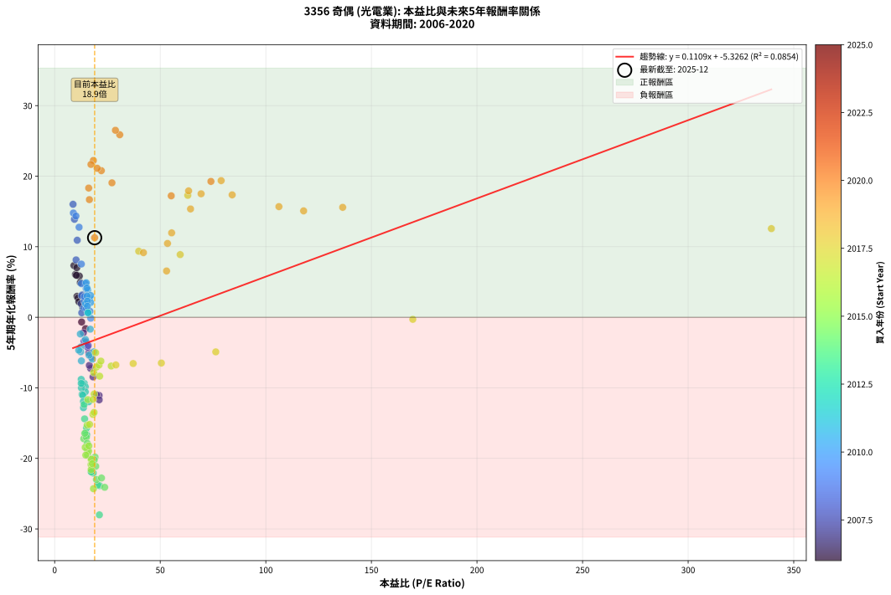
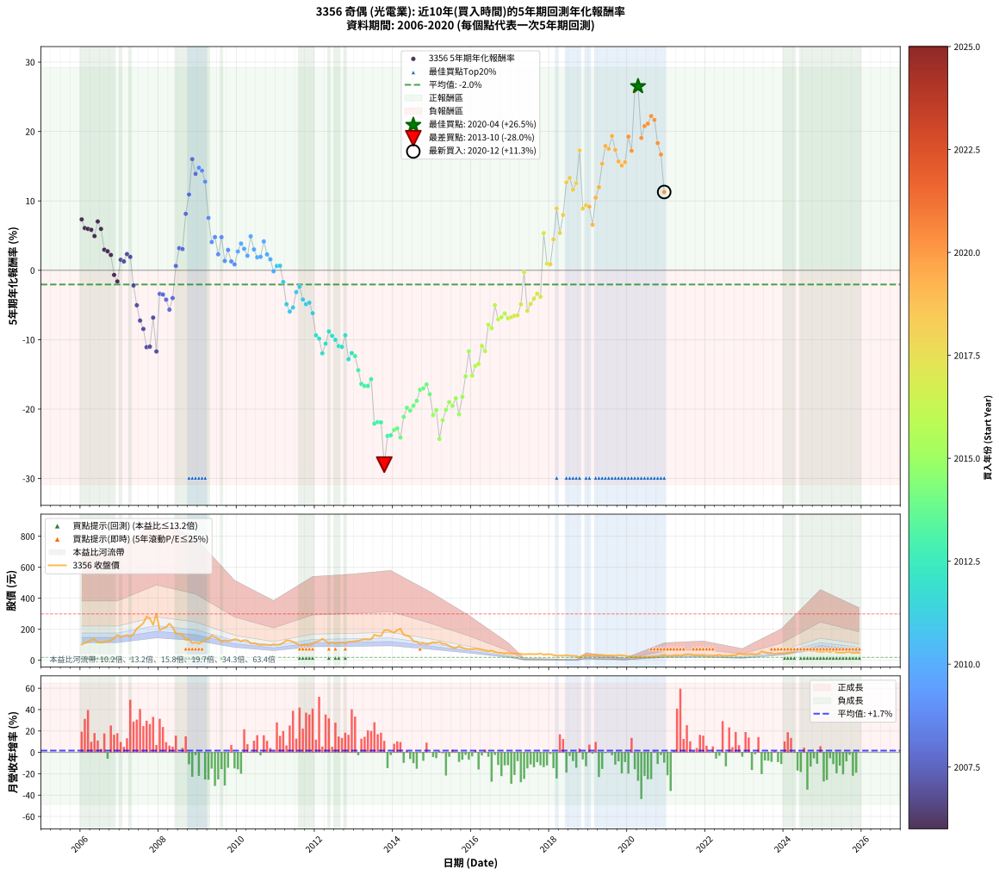

# 3356 奇偶 - 本益比與未來報酬率分析

!!! info "報告資訊"
    - **股票代號**: 3356
    - **公司名稱**: 奇偶
    - **產業別**: 光電業
    - **分析期間**: 2006-2020 (180 個數據點)
    - **資料來源**: Type 12 (ShowMonthlyK_ChartFlow) 月收盤價與本益比
    - **報酬率口徑**: 含現金股利 (簡化: 年度合計，假設每年7/1入帳)
    - **報告生成時間**: 2026-01-06 18:55:50 CST

## 📈 視覺化圖表

### 圖表1: 本益比 vs 未來報酬率關係

*圖表1：3356 奇偶 本益比與5年期未來報酬率關係 (2006-2020)*

### 圖表2: 歷年買入時點的5年期實際報酬率

*圖表2：3356 奇偶 歷年買入時點的5年期實際報酬率 (2006-2020)*

## 📍 買點訊號說明

本報告提供兩種買點提示訊號（顯示於圖表2的股價子圖中）：

### ▲ 小綠色三角形（回測驗證）
- **計算方式**: 使用全部歷史資料計算本益比第25百分位數
- **用途**: 事後驗證，顯示歷史上哪些時點確實為低估區
- **限制**: 當下無法判斷，僅供回測參考
- **特性**: 後見之明（Look-Ahead Bias）

### ▲ 小橘色三角形（即時訊號）
- **計算方式**: 使用截至當月的過去5年資料計算本益比第25百分位數
- **用途**: 實際投資決策，當時即可判斷
- **優勢**: 可操作性強，符合實務需求
- **特性**: 無後見之明，滾動窗口計算

!!! tip "如何使用兩種訊號"
    - **綠色▲** 幫助理解歷史估值機會，驗證策略有效性
    - **橘色▲** 可作為實際買進參考，但仍需搭配基本面分析
    - 兩種訊號重疊時，表示即時判斷與事後驗證一致，信心度較高
    - 僅有綠色▲時，表示當時無法判斷（需要未來資料才能確認）
    - 僅有橘色▲時，表示即時判斷為買點，但事後可能不是最佳時機

## 📊 估值分析摘要

| 指標 | 數值 |
|:---:|:---:|
| **目前本益比** (2020-12) | **18.93 倍** |
| **歷史平均本益比** | 25.23 倍 |
| **估值水準** | 🟢 相對低估 |
| **預期5年年化報酬率** | **-3.23%** |
| **歷史平均報酬率** | -2.04% |
| **相關係數 (R²)** | 0.0854 |
| **趨勢線斜率** | 0.1109 |

!!! abstract "核心洞察"
    目前本益比顯著低於歷史平均，預期未來報酬率可能較高

    根據歷史數據回測，3356 奇偶 在目前本益比 **18.9倍** 的估值水準下，
    預期未來5年年化報酬率約為 **-3.2%**。

    **重要提醒**: 本分析基於歷史數據統計，實際報酬率會受到公司基本面變化、產業趨勢、
    總體經濟環境等多重因素影響。R² = 0.09 表示本益比可解釋約 8.5% 的報酬率變異。

## 📈 歷史估值統計

### 最佳買點 (最高報酬率)

| 項目 | 數值 |
|:---:|:---:|
| 起始時間 | 2020-04 |
| 當時本益比 | 28.78 倍 |
| 起始價格 | 21.3 元 |
| 5年後價格 | 62.5 元 |
| **5年年化報酬率** | **+26.51%** |

### 最差買點 (最低報酬率)

| 項目 | 數值 |
|:---:|:---:|
| 起始時間 | 2013-10 |
| 當時本益比 | 21.18 倍 |
| 起始價格 | 192.5 元 |
| 5年後價格 | 19.6 元 |
| **5年年化報酬率** | **-28.00%** |

## 🎯 投資啟示

### 本益比與報酬率關係

趨勢線方程式: **y = 0.1109x + -5.3262**

!!! info "弱相關或正相關"
    本益比與未來報酬率相關性較弱。這可能表示該股票的報酬率更多受到
    公司成長性、產業趨勢等因素影響，而非估值水準。**需綜合考量多項指標**。

### 估值區間建議

基於歷史數據分析:

- **🟢 低估區** (P/E < 20.2): 預期報酬率較高，可考慮增加持股
- **🟡 合理區** (P/E 20.2-30.3): 預期報酬率符合長期趨勢，正常持有
- **🔴 高估區** (P/E > 30.3): 預期報酬率較低，可考慮減碼或觀望

!!! danger "風險提示"
    - 過去表現不代表未來結果
    - 本分析假設公司基本面無重大結構性變化
    - 產業環境劇變可能使歷史規律失效
    - 應結合公司財報、產業趨勢、總體經濟等多重因素綜合判斷

!!! success "長期投資觀點"
    歷史數據顯示，在合理或低估的估值水準買入並長期持有，
    往往能獲得較佳的投資報酬。**耐心等待好價格**是價值投資的核心原則。

## 📊 數據品質

- **資料來源**: GoodInfo.tw Type 12 (ShowMonthlyK_ChartFlow)
- **資料頻率**: 月度收盤價與本益比
- **回測期間**: 2006-2020
- **數據點數量**: 180 個 (每個點代表一次5年期回測)

### 計算方法說明

1. **5年期年化報酬率**:
   - 對每個歷史時點，計算其後5年的實際投資報酬率
   - 期末價值(不含股利): 期末價格
   - 期末價值(含現金股利): 期末價格 + 持有期間內的現金股利合計 (簡化: 年度合計，假設每年7/1入帳)
   - 公式: 年化報酬率 = [(期末價值/期初價格)^(1/年數) - 1] × 100%

2. **本益比 (P/E Ratio)**:
   - 使用當時的月收盤價與EPS計算
   - 資料來源: Type 12 月度河流圖本益比數據

3. **趨勢線 (Linear Regression)**:
   - 使用最小平方法擬合線性趨勢線
   - R²值衡量本益比對報酬率的解釋能力

---

*本報告由 Stock Analysis System v1.9.0 自動生成*
*數據更新時間: 2026-01-06 18:55:50 CST*

## 📋 月度回測明細表

（每一列對應時間線圖中的一個買入點；可用來對照 SVG 圖上的每個點。）

| 買入月份 | 賣出月份 | 回測期限_年 | 實際持有年數 | 買入本益比_倍 | 買入收盤價_元 | 賣出收盤價_元 | 現金股利合計_元 | 總報酬率_pct | 年化報酬率_pct |
| --- | --- | --- | --- | --- | --- | --- | --- | --- | --- |
| 2006-01 | 2011-01 | 5 | 4.999 | 9.14 | 102.00 | 100.00 | 45.30 | +42.45 | +7.33 |
| 2006-02 | 2011-02 | 5 | 4.999 | 9.86 | 110.00 | 102.50 | 45.30 | +34.36 | +6.09 |
| 2006-03 | 2011-03 | 5 | 4.999 | 10.62 | 118.50 | 113.00 | 45.30 | +33.59 | +5.96 |
| 2006-04 | 2011-04 | 5 | 4.999 | 11.69 | 130.50 | 128.00 | 45.30 | +32.80 | +5.84 |
| 2006-05 | 2011-05 | 5 | 4.999 | 12.14 | 135.50 | 127.00 | 45.30 | +27.16 | +4.92 |
| 2006-06 | 2011-06 | 5 | 4.999 | 10.48 | 117.00 | 119.00 | 45.30 | +40.43 | +7.03 |
| 2006-07 | 2011-07 | 5 | 4.999 | 10.22 | 114.00 | 109.50 | 42.78 | +33.58 | +5.96 |
| 2006-08 | 2011-08 | 5 | 4.999 | 10.57 | 118.00 | 93.80 | 42.78 | +15.75 | +2.97 |
| 2006-09 | 2011-09 | 5 | 4.999 | 11.07 | 123.50 | 98.60 | 42.78 | +14.48 | +2.74 |
| 2006-10 | 2011-10 | 5 | 4.999 | 11.47 | 128.00 | 100.00 | 42.78 | +11.55 | +2.21 |
| 2006-11 | 2011-11 | 5 | 4.999 | 12.77 | 142.50 | 95.00 | 42.78 | -3.31 | -0.67 |
| 2006-12 | 2011-12 | 5 | 4.999 | 14.65 | 163.50 | 108.00 | 42.78 | -7.78 | -1.61 |
| 2007-01 | 2012-01 | 5 | 4.999 | 13.23 | 151.00 | 120.00 | 42.78 | +7.80 | +1.51 |
| 2007-02 | 2012-02 | 5 | 4.999 | 13.46 | 157.00 | 124.50 | 42.78 | +6.55 | +1.28 |
| 2007-03 | 2012-03 | 5 | 5.002 | 13.60 | 162.00 | 139.00 | 42.78 | +12.21 | +2.33 |
| 2007-04 | 2012-04 | 5 | 5.002 | 12.54 | 152.50 | 125.00 | 42.78 | +10.02 | +1.93 |
| 2007-05 | 2012-05 | 5 | 5.002 | 13.61 | 169.00 | 108.50 | 42.78 | -10.48 | -2.19 |
| 2007-06 | 2012-06 | 5 | 5.002 | 16.19 | 205.00 | 115.50 | 42.78 | -22.79 | -5.04 |
| 2007-07 | 2012-07 | 5 | 5.002 | 17.03 | 220.00 | 110.00 | 40.98 | -31.37 | -7.25 |
| 2007-08 | 2012-08 | 5 | 5.002 | 18.19 | 239.50 | 113.00 | 40.98 | -35.71 | -8.45 |
| 2007-09 | 2012-09 | 5 | 5.002 | 21.05 | 282.50 | 116.00 | 40.98 | -44.43 | -11.08 |
| 2007-10 | 2012-10 | 5 | 5.002 | 19.79 | 270.50 | 110.00 | 40.98 | -44.18 | -11.00 |
| 2007-11 | 2012-11 | 5 | 5.002 | 16.42 | 228.50 | 119.50 | 40.98 | -29.77 | -6.82 |
| 2007-12 | 2012-12 | 5 | 5.002 | 21.10 | 299.00 | 119.50 | 40.98 | -46.33 | -11.70 |
| 2008-01 | 2013-01 | 5 | 5.002 | 13.90 | 195.00 | 123.00 | 40.98 | -15.91 | -3.40 |
| 2008-02 | 2013-03 | 5 | 5.081 | 14.83 | 206.00 | 131.00 | 40.98 | -16.51 | -3.49 |
| 2008-03 | 2013-03 | 5 | 4.999 | 15.53 | 213.50 | 131.00 | 40.98 | -19.45 | -4.23 |
| 2008-04 | 2013-04 | 5 | 4.999 | 17.41 | 237.00 | 136.00 | 40.98 | -25.32 | -5.67 |
| 2008-05 | 2013-05 | 5 | 4.999 | 15.89 | 214.00 | 133.50 | 40.98 | -18.47 | -4.00 |
| 2008-06 | 2013-06 | 5 | 4.999 | 12.83 | 171.00 | 135.50 | 40.98 | +3.21 | +0.63 |
| 2008-07 | 2013-07 | 5 | 4.999 | 13.04 | 172.00 | 164.50 | 36.68 | +16.97 | +3.18 |
| 2008-08 | 2013-08 | 5 | 4.999 | 12.80 | 167.00 | 157.50 | 36.68 | +16.28 | +3.06 |
| 2008-09 | 2013-09 | 5 | 4.999 | 10.15 | 131.00 | 157.00 | 36.68 | +47.85 | +8.14 |
| 2008-10 | 2013-10 | 5 | 4.999 | 10.69 | 136.50 | 192.50 | 36.68 | +67.90 | +10.92 |
| 2008-11 | 2013-11 | 5 | 4.999 | 8.71 | 110.00 | 194.50 | 36.68 | +110.16 | +16.02 |
| 2008-12 | 2013-12 | 5 | 4.999 | 9.37 | 117.00 | 187.50 | 36.68 | +91.61 | +13.89 |
| 2009-01 | 2014-01 | 5 | 4.999 | 8.86 | 107.50 | 177.50 | 36.68 | +99.24 | +14.78 |
| 2009-02 | 2014-02 | 5 | 4.999 | 10.07 | 118.50 | 195.00 | 36.68 | +95.51 | +14.35 |
| 2009-03 | 2014-03 | 5 | 4.999 | 11.57 | 132.00 | 204.00 | 36.68 | +82.33 | +12.77 |
| 2009-04 | 2014-04 | 5 | 4.999 | 12.63 | 139.50 | 164.00 | 36.68 | +43.86 | +7.55 |
| 2009-05 | 2014-05 | 5 | 4.999 | 14.93 | 159.50 | 158.00 | 36.68 | +22.06 | +4.07 |
| 2009-06 | 2014-06 | 5 | 4.999 | 14.44 | 149.00 | 151.50 | 36.68 | +26.30 | +4.78 |
| 2009-07 | 2014-07 | 5 | 4.999 | 14.06 | 140.00 | 123.00 | 33.88 | +12.06 | +2.30 |
| 2009-08 | 2014-08 | 5 | 4.999 | 12.66 | 121.50 | 119.50 | 33.88 | +26.24 | +4.77 |
| 2009-09 | 2014-09 | 5 | 4.999 | 13.97 | 129.00 | 104.00 | 33.88 | +6.88 | +1.34 |
| 2009-10 | 2014-10 | 5 | 4.999 | 14.09 | 125.00 | 110.50 | 33.88 | +15.50 | +2.93 |
| 2009-11 | 2014-11 | 5 | 4.999 | 15.04 | 128.00 | 102.50 | 33.88 | +6.55 | +1.28 |
| 2009-12 | 2014-12 | 5 | 4.999 | 16.69 | 136.00 | 108.00 | 33.88 | +4.32 | +0.85 |
| 2010-01 | 2015-01 | 5 | 4.999 | 16.54 | 132.00 | 117.00 | 33.88 | +14.30 | +2.71 |
| 2010-02 | 2015-02 | 5 | 4.999 | 15.63 | 122.00 | 113.50 | 33.88 | +20.80 | +3.85 |
| 2010-03 | 2015-03 | 5 | 4.999 | 17.03 | 130.00 | 117.50 | 33.88 | +16.45 | +3.09 |
| 2010-04 | 2015-04 | 5 | 4.999 | 17.02 | 127.00 | 107.00 | 33.88 | +10.93 | +2.10 |
| 2010-05 | 2015-05 | 5 | 4.999 | 14.95 | 109.00 | 104.50 | 33.88 | +26.96 | +4.89 |
| 2010-06 | 2015-06 | 5 | 4.999 | 15.38 | 109.50 | 93.10 | 33.88 | +15.96 | +3.01 |
| 2010-07 | 2015-07 | 5 | 4.999 | 14.90 | 103.50 | 82.30 | 31.28 | +9.74 | +1.88 |
| 2010-08 | 2015-08 | 5 | 4.999 | 14.64 | 99.20 | 77.90 | 31.28 | +10.06 | +1.94 |
| 2010-09 | 2015-09 | 5 | 4.999 | 15.29 | 101.00 | 92.50 | 31.28 | +22.56 | +4.15 |
| 2010-10 | 2015-10 | 5 | 4.999 | 15.54 | 100.00 | 80.70 | 31.28 | +11.98 | +2.29 |
| 2010-11 | 2015-11 | 5 | 4.999 | 15.51 | 97.10 | 73.70 | 31.28 | +8.12 | +1.57 |
| 2010-12 | 2015-12 | 5 | 4.999 | 17.08 | 104.00 | 72.00 | 31.28 | -0.69 | -0.14 |
| 2011-01 | 2016-01 | 5 | 4.999 | 15.89 | 100.00 | 71.90 | 31.28 | +3.18 | +0.63 |
| 2011-02 | 2016-02 | 5 | 4.999 | 15.78 | 102.50 | 74.60 | 31.28 | +3.30 | +0.65 |
| 2011-03 | 2016-03 | 5 | 5.002 | 16.87 | 113.00 | 72.50 | 31.28 | -8.16 | -1.69 |
| 2011-04 | 2016-04 | 5 | 5.002 | 18.54 | 128.00 | 68.30 | 31.28 | -22.20 | -4.90 |
| 2011-05 | 2016-05 | 5 | 5.002 | 17.87 | 127.00 | 62.20 | 31.28 | -26.39 | -5.94 |
| 2011-06 | 2016-06 | 5 | 5.002 | 16.28 | 119.00 | 59.00 | 31.28 | -24.13 | -5.37 |
| 2011-07 | 2016-07 | 5 | 5.002 | 14.57 | 109.50 | 63.00 | 30.30 | -14.79 | -3.15 |
| 2011-08 | 2016-08 | 5 | 5.002 | 12.16 | 93.80 | 52.90 | 30.30 | -11.30 | -2.37 |
| 2011-09 | 2016-09 | 5 | 5.002 | 12.45 | 98.60 | 49.25 | 30.30 | -19.32 | -4.20 |
| 2011-10 | 2016-10 | 5 | 5.002 | 12.31 | 100.00 | 47.50 | 30.30 | -22.20 | -4.89 |
| 2011-11 | 2016-11 | 5 | 5.002 | 11.41 | 95.00 | 44.50 | 30.30 | -21.26 | -4.67 |
| 2011-12 | 2016-12 | 5 | 5.002 | 12.66 | 108.00 | 48.20 | 30.30 | -27.31 | -6.18 |
| 2012-01 | 2017-01 | 5 | 5.002 | 14.03 | 120.00 | 43.05 | 30.30 | -38.88 | -9.37 |
| 2012-02 | 2017-03 | 5 | 5.081 | 14.52 | 124.50 | 43.20 | 30.30 | -40.96 | -9.85 |
| 2012-03 | 2017-03 | 5 | 4.999 | 16.18 | 139.00 | 43.20 | 30.30 | -47.12 | -11.97 |
| 2012-04 | 2017-04 | 5 | 4.999 | 14.51 | 125.00 | 41.20 | 30.30 | -42.80 | -10.57 |
| 2012-05 | 2017-05 | 5 | 4.999 | 12.57 | 108.50 | 38.15 | 30.30 | -36.91 | -8.80 |
| 2012-06 | 2017-06 | 5 | 4.999 | 13.35 | 115.50 | 40.05 | 30.30 | -39.09 | -9.44 |
| 2012-07 | 2017-07 | 5 | 4.999 | 12.68 | 110.00 | 40.60 | 24.29 | -41.01 | -10.02 |
| 2012-08 | 2017-08 | 5 | 4.999 | 12.99 | 113.00 | 39.05 | 24.29 | -43.94 | -10.93 |
| 2012-09 | 2017-09 | 5 | 4.999 | 13.31 | 116.00 | 40.35 | 24.29 | -44.27 | -11.04 |
| 2012-10 | 2017-10 | 5 | 4.999 | 12.59 | 110.00 | 43.00 | 24.29 | -38.82 | -9.36 |
| 2012-11 | 2017-11 | 5 | 4.999 | 13.64 | 119.50 | 35.90 | 24.29 | -49.63 | -12.82 |
| 2012-12 | 2017-12 | 5 | 4.999 | 13.61 | 119.50 | 39.05 | 24.29 | -46.99 | -11.92 |
| 2013-01 | 2018-01 | 5 | 4.999 | 13.96 | 123.00 | 39.30 | 24.29 | -48.30 | -12.36 |
| 2013-02 | 2018-02 | 5 | 4.999 | 14.19 | 125.50 | 33.40 | 24.29 | -54.03 | -14.40 |
| 2013-03 | 2018-03 | 5 | 4.999 | 14.77 | 131.00 | 29.30 | 24.29 | -59.09 | -16.37 |
| 2013-04 | 2018-04 | 5 | 4.999 | 15.28 | 136.00 | 30.35 | 24.29 | -59.82 | -16.67 |
| 2013-05 | 2018-05 | 5 | 4.999 | 14.94 | 133.50 | 29.35 | 24.29 | -59.82 | -16.67 |
| 2013-06 | 2018-06 | 5 | 4.999 | 15.11 | 135.50 | 33.45 | 24.29 | -57.38 | -15.69 |
| 2013-07 | 2018-07 | 5 | 4.999 | 18.29 | 164.50 | 29.65 | 17.59 | -71.28 | -22.08 |
| 2013-08 | 2018-08 | 5 | 4.999 | 17.45 | 157.50 | 28.25 | 17.59 | -70.89 | -21.88 |
| 2013-09 | 2018-09 | 5 | 4.999 | 17.33 | 157.00 | 28.00 | 17.59 | -70.96 | -21.91 |
| 2013-10 | 2018-10 | 5 | 4.999 | 21.18 | 192.50 | 19.65 | 17.59 | -80.65 | -28.00 |
| 2013-11 | 2018-11 | 5 | 4.999 | 21.33 | 194.50 | 32.15 | 17.59 | -74.42 | -23.87 |
| 2013-12 | 2018-12 | 5 | 4.999 | 20.49 | 187.50 | 30.65 | 17.59 | -74.27 | -23.78 |
| 2014-01 | 2019-01 | 5 | 4.999 | 19.79 | 177.50 | 30.45 | 17.59 | -72.93 | -23.00 |
| 2014-02 | 2019-02 | 5 | 4.999 | 22.18 | 195.00 | 35.95 | 17.59 | -72.54 | -22.78 |
| 2014-03 | 2019-03 | 5 | 4.999 | 23.69 | 204.00 | 33.80 | 17.59 | -74.81 | -24.10 |
| 2014-04 | 2019-04 | 5 | 4.999 | 19.45 | 164.00 | 32.50 | 17.59 | -69.45 | -21.12 |
| 2014-05 | 2019-05 | 5 | 4.999 | 19.14 | 158.00 | 34.80 | 17.59 | -66.84 | -19.81 |
| 2014-06 | 2019-06 | 5 | 4.999 | 18.76 | 151.50 | 31.40 | 17.59 | -67.66 | -20.21 |
| 2014-07 | 2019-07 | 5 | 4.999 | 15.58 | 123.00 | 31.15 | 10.39 | -66.22 | -19.52 |
| 2014-08 | 2019-08 | 5 | 4.999 | 15.49 | 119.50 | 31.80 | 10.39 | -64.69 | -18.80 |
| 2014-09 | 2019-09 | 5 | 4.999 | 13.80 | 104.00 | 30.05 | 10.39 | -61.11 | -17.21 |
| 2014-10 | 2019-10 | 5 | 4.999 | 15.02 | 110.50 | 33.10 | 10.39 | -60.64 | -17.01 |
| 2014-11 | 2019-11 | 5 | 4.999 | 14.28 | 102.50 | 31.35 | 10.39 | -59.27 | -16.45 |
| 2014-12 | 2019-12 | 5 | 4.999 | 15.43 | 108.00 | 30.00 | 10.39 | -62.60 | -17.86 |
| 2015-01 | 2020-01 | 5 | 4.999 | 17.21 | 117.00 | 25.90 | 10.39 | -68.98 | -20.87 |
| 2015-02 | 2020-02 | 5 | 4.999 | 17.21 | 113.50 | 26.50 | 10.39 | -67.49 | -20.13 |
| 2015-03 | 2020-03 | 5 | 5.002 | 18.37 | 117.50 | 18.80 | 10.39 | -75.15 | -24.30 |
| 2015-04 | 2020-04 | 5 | 5.002 | 17.28 | 107.00 | 21.30 | 10.39 | -70.38 | -21.59 |
| 2015-05 | 2020-05 | 5 | 5.002 | 17.44 | 104.50 | 23.60 | 10.39 | -67.47 | -20.11 |
| 2015-06 | 2020-06 | 5 | 5.002 | 16.08 | 93.10 | 22.10 | 10.39 | -65.10 | -18.98 |
| 2015-07 | 2020-07 | 5 | 5.002 | 14.73 | 82.30 | 22.75 | 4.99 | -66.29 | -19.54 |
| 2015-08 | 2020-08 | 5 | 5.002 | 14.46 | 77.90 | 23.10 | 4.99 | -63.94 | -18.44 |
| 2015-09 | 2020-09 | 5 | 5.002 | 17.84 | 92.50 | 23.90 | 4.99 | -68.76 | -20.75 |
| 2015-10 | 2020-10 | 5 | 5.002 | 16.19 | 80.70 | 24.50 | 4.99 | -63.45 | -18.23 |
| 2015-11 | 2020-11 | 5 | 5.002 | 15.41 | 73.70 | 27.15 | 4.99 | -56.39 | -15.29 |
| 2015-12 | 2020-12 | 5 | 5.002 | 15.72 | 72.00 | 33.70 | 4.99 | -46.26 | -11.67 |
| 2016-01 | 2021-01 | 5 | 5.002 | 16.54 | 71.90 | 26.55 | 4.99 | -56.13 | -15.19 |
| 2016-02 | 2021-03 | 5 | 5.081 | 18.12 | 74.60 | 30.15 | 4.99 | -52.89 | -13.77 |
| 2016-03 | 2021-03 | 5 | 4.999 | 18.66 | 72.50 | 30.15 | 4.99 | -51.53 | -13.48 |
| 2016-04 | 2021-04 | 5 | 4.999 | 18.70 | 68.30 | 33.40 | 4.99 | -43.79 | -10.88 |
| 2016-05 | 2021-05 | 5 | 4.999 | 18.18 | 62.20 | 28.50 | 4.99 | -46.15 | -11.65 |
| 2016-06 | 2021-06 | 5 | 4.999 | 18.50 | 59.00 | 34.25 | 4.99 | -33.48 | -7.83 |
| 2016-07 | 2021-07 | 5 | 4.999 | 21.30 | 63.00 | 38.75 | 1.99 | -35.33 | -8.35 |
| 2016-08 | 2021-08 | 5 | 4.999 | 19.40 | 52.90 | 38.90 | 1.99 | -22.69 | -5.02 |
| 2016-09 | 2021-09 | 5 | 4.999 | 19.74 | 49.25 | 32.15 | 1.99 | -30.67 | -7.06 |
| 2016-10 | 2021-10 | 5 | 4.999 | 20.99 | 47.50 | 31.45 | 1.99 | -29.59 | -6.78 |
| 2016-11 | 2021-11 | 5 | 4.999 | 21.90 | 44.50 | 30.30 | 1.99 | -27.43 | -6.21 |
| 2016-12 | 2021-12 | 5 | 4.999 | 26.78 | 48.20 | 31.70 | 1.99 | -30.09 | -6.91 |
| 2017-01 | 2022-01 | 5 | 4.999 | 28.99 | 43.05 | 28.35 | 1.99 | -29.51 | -6.76 |
| 2017-02 | 2022-02 | 5 | 4.999 | 37.18 | 43.50 | 29.00 | 1.99 | -28.75 | -6.55 |
| 2017-03 | 2022-03 | 5 | 4.999 | 50.53 | 43.20 | 28.90 | 1.99 | -28.48 | -6.49 |
| 2017-04 | 2022-04 | 5 | 4.999 | 76.30 | 41.20 | 30.05 | 1.99 | -22.22 | -4.90 |
| 2017-05 | 2022-05 | 5 | 4.999 | 169.60 | 38.15 | 35.60 | 1.99 | -1.45 | -0.29 |
| 2017-06 | 2022-06 | 5 | 4.999 |  | 40.05 | 27.65 | 1.99 | -25.98 | -5.84 |
| 2017-07 | 2022-07 | 5 | 4.999 |  | 40.60 | 29.45 | 2.20 | -22.04 | -4.86 |
| 2017-08 | 2022-08 | 5 | 4.999 |  | 39.05 | 29.50 | 2.20 | -18.82 | -4.08 |
| 2017-09 | 2022-09 | 5 | 4.999 |  | 40.35 | 31.80 | 2.20 | -15.73 | -3.37 |
| 2017-10 | 2022-10 | 5 | 4.999 |  | 43.00 | 33.20 | 2.20 | -17.67 | -3.82 |
| 2017-11 | 2022-11 | 5 | 4.999 |  | 35.90 | 44.40 | 2.20 | +29.81 | +5.36 |
| 2017-12 | 2022-12 | 5 | 4.999 |  | 39.05 | 38.75 | 2.20 | +4.87 | +0.96 |
| 2018-01 | 2023-01 | 5 | 4.999 |  | 39.30 | 38.85 | 2.20 | +4.46 | +0.88 |
| 2018-02 | 2023-02 | 5 | 4.999 |  | 33.40 | 39.30 | 2.20 | +24.25 | +4.44 |
| 2018-03 | 2023-03 | 5 | 4.999 |  | 29.30 | 42.70 | 2.20 | +53.25 | +8.91 |
| 2018-04 | 2023-04 | 5 | 4.999 |  | 30.35 | 37.25 | 2.20 | +29.99 | +5.39 |
| 2018-05 | 2023-05 | 5 | 4.999 |  | 29.35 | 40.85 | 2.20 | +46.68 | +7.96 |
| 2018-06 | 2023-06 | 5 | 4.999 |  | 33.45 | 58.50 | 2.20 | +81.47 | +12.66 |
| 2018-07 | 2023-07 | 5 | 4.999 |  | 29.65 | 51.80 | 3.60 | +86.85 | +13.32 |
| 2018-08 | 2023-08 | 5 | 4.999 |  | 28.25 | 45.30 | 3.60 | +73.10 | +11.60 |
| 2018-09 | 2023-09 | 5 | 4.999 | 339.40 | 28.00 | 47.00 | 3.60 | +80.72 | +12.57 |
| 2018-10 | 2023-10 | 5 | 4.999 | 63.05 | 19.65 | 40.00 | 3.60 | +121.89 | +17.28 |
| 2018-11 | 2023-11 | 5 | 4.999 | 59.45 | 32.15 | 45.60 | 3.60 | +53.04 | +8.88 |
| 2018-12 | 2023-12 | 5 | 4.999 | 39.81 | 30.65 | 44.35 | 3.60 | +56.45 | +9.37 |
| 2019-01 | 2024-01 | 5 | 4.999 | 42.05 | 30.45 | 43.60 | 3.60 | +55.01 | +9.16 |
| 2019-02 | 2024-02 | 5 | 4.999 | 53.00 | 35.95 | 45.80 | 3.60 | +37.42 | +6.56 |
| 2019-03 | 2024-03 | 5 | 5.002 | 53.44 | 33.80 | 52.00 | 3.60 | +64.50 | +10.46 |
| 2019-04 | 2024-04 | 5 | 5.002 | 55.40 | 32.50 | 53.60 | 3.60 | +76.00 | +11.97 |
| 2019-05 | 2024-05 | 5 | 5.002 | 64.35 | 34.80 | 67.50 | 3.60 | +104.31 | +15.35 |
| 2019-06 | 2024-06 | 5 | 5.002 | 63.43 | 31.40 | 68.00 | 3.60 | +128.03 | +17.91 |
| 2019-07 | 2024-07 | 5 | 5.002 | 69.35 | 31.15 | 63.30 | 6.50 | +124.08 | +17.50 |
| 2019-08 | 2024-08 | 5 | 5.002 | 78.84 | 31.80 | 70.60 | 6.50 | +142.46 | +19.37 |
| 2019-09 | 2024-09 | 5 | 5.002 | 84.06 | 30.05 | 60.40 | 6.50 | +122.63 | +17.35 |
| 2019-10 | 2024-10 | 5 | 5.002 | 106.20 | 33.10 | 62.10 | 6.50 | +107.25 | +15.68 |
| 2019-11 | 2024-11 | 5 | 5.002 | 117.90 | 31.35 | 56.80 | 6.50 | +101.92 | +15.08 |
| 2019-12 | 2024-12 | 5 | 5.002 | 136.40 | 30.00 | 55.40 | 6.50 | +106.34 | +15.58 |
| 2020-01 | 2025-01 | 5 | 5.002 | 74.00 | 25.90 | 56.00 | 6.50 | +141.32 | +19.26 |
| 2020-02 | 2025-03 | 5 | 5.081 | 55.21 | 26.50 | 52.90 | 6.50 | +124.15 | +17.22 |
| 2020-03 | 2025-03 | 5 | 4.999 | 30.82 | 18.80 | 52.90 | 6.50 | +215.96 | +25.88 |
| 2020-04 | 2025-04 | 5 | 4.999 | 28.78 | 21.30 | 62.50 | 6.50 | +223.95 | +26.51 |
| 2020-05 | 2025-05 | 5 | 4.999 | 27.13 | 23.60 | 49.95 | 6.50 | +139.20 | +19.06 |
| 2020-06 | 2025-06 | 5 | 4.999 | 22.10 | 22.10 | 50.30 | 6.50 | +157.02 | +20.78 |
| 2020-07 | 2025-07 | 5 | 4.999 | 20.13 | 22.75 | 48.80 | 10.50 | +160.66 | +21.12 |
| 2020-08 | 2025-08 | 5 | 4.999 | 18.33 | 23.10 | 52.50 | 10.50 | +172.73 | +22.22 |
| 2020-09 | 2025-09 | 5 | 4.999 | 17.19 | 23.90 | 53.20 | 10.50 | +166.53 | +21.66 |
| 2020-10 | 2025-10 | 5 | 4.999 | 16.12 | 24.50 | 46.30 | 10.50 | +131.84 | +18.32 |
| 2020-11 | 2025-11 | 5 | 4.999 | 16.45 | 27.15 | 48.20 | 10.50 | +116.21 | +16.68 |
| 2020-12 | 2025-12 | 5 | 4.999 | 18.93 | 33.70 | 47.00 | 10.50 | +70.63 | +11.28 |
