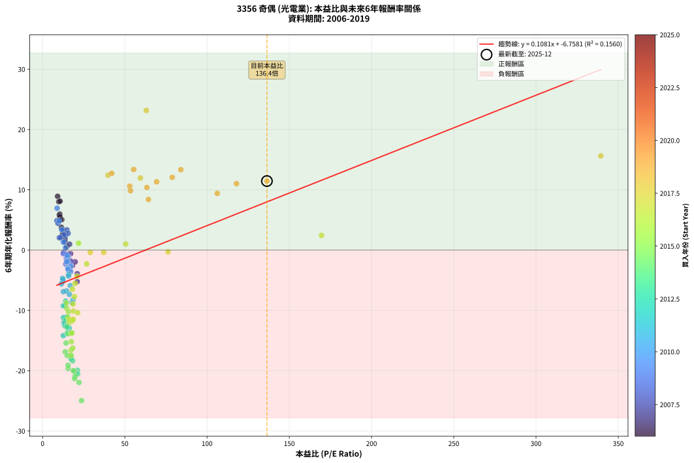
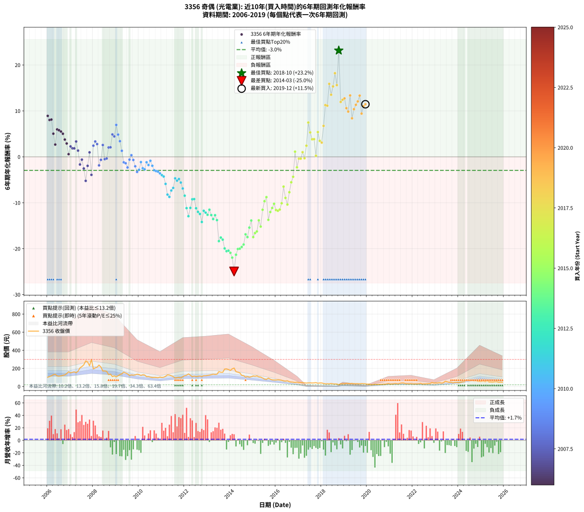

# 3356 奇偶 - 本益比與未來報酬率分析

!!! info "報告資訊"
    - **股票代號**: 3356
    - **公司名稱**: 奇偶
    - **產業別**: 光電業
    - **分析期間**: 2006-2019 (168 個數據點)
    - **資料來源**: Type 12 (ShowMonthlyK_ChartFlow) 月收盤價與本益比
    - **報酬率口徑**: 含現金股利 (簡化: 年度合計，假設每年7/1入帳)
    - **報告生成時間**: 2026-01-09 21:04:18 CST

## 📈 視覺化圖表

### 圖表1: 本益比 vs 未來報酬率關係

*圖表1：3356 奇偶 本益比與6年期未來報酬率關係 (2006-2019)*

### 圖表2: 歷年買入時點的6年期實際報酬率

*圖表2：3356 奇偶 歷年買入時點的6年期實際報酬率 (2006-2019)*

## 📍 買點訊號說明

本報告提供兩種買點提示訊號（顯示於圖表2的股價子圖中）：

### ▲ 小綠色三角形（回測驗證）
- **計算方式**: 使用全部歷史資料計算本益比第25百分位數
- **用途**: 事後驗證，顯示歷史上哪些時點確實為低估區
- **限制**: 當下無法判斷，僅供回測參考
- **特性**: 後見之明（Look-Ahead Bias）

### ▲ 小橘色三角形（即時訊號）
- **計算方式**: 使用截至當月的過去5年資料計算本益比第25百分位數
- **用途**: 實際投資決策，當時即可判斷
- **優勢**: 可操作性強，符合實務需求
- **特性**: 無後見之明，滾動窗口計算

!!! tip "如何使用兩種訊號"
    - **綠色▲** 幫助理解歷史估值機會，驗證策略有效性
    - **橘色▲** 可作為實際買進參考，但仍需搭配基本面分析
    - 兩種訊號重疊時，表示即時判斷與事後驗證一致，信心度較高
    - 僅有綠色▲時，表示當時無法判斷（需要未來資料才能確認）
    - 僅有橘色▲時，表示即時判斷為買點，但事後可能不是最佳時機

## 📊 估值分析摘要

| 指標 | 數值 |
|:---:|:---:|
| **目前本益比** (2019-12) | **136.40 倍** |
| **歷史平均本益比** | 24.95 倍 |
| **估值水準** | 🔴 相對高估 |
| **預期6年年化報酬率** | **+7.99%** |
| **歷史平均報酬率** | -2.95% |
| **相關係數 (R²)** | 0.1560 |
| **趨勢線斜率** | 0.1081 |

!!! abstract "核心洞察"
    目前本益比顯著高於歷史平均，預期未來報酬率可能較低

    根據歷史數據回測，3356 奇偶 在目前本益比 **136.4倍** 的估值水準下，
    預期未來6年年化報酬率約為 **+8.0%**。

    **重要提醒**: 本分析基於歷史數據統計，實際報酬率會受到公司基本面變化、產業趨勢、
    總體經濟環境等多重因素影響。R² = 0.16 表示本益比可解釋約 15.6% 的報酬率變異。

## 📈 歷史估值統計

### 最佳買點 (最高報酬率)

| 項目 | 數值 |
|:---:|:---:|
| 起始時間 | 2018-10 |
| 當時本益比 | 63.05 倍 |
| 起始價格 | 19.6 元 |
| 6年後價格 | 62.1 元 |
| **6年年化報酬率** | **+23.16%** |

### 最差買點 (最低報酬率)

| 項目 | 數值 |
|:---:|:---:|
| 起始時間 | 2014-03 |
| 當時本益比 | 23.69 倍 |
| 起始價格 | 204.0 元 |
| 6年後價格 | 18.8 元 |
| **6年年化報酬率** | **-24.97%** |

## 🎯 投資啟示

### 本益比與報酬率關係

趨勢線方程式: **y = 0.1081x + -6.7581**

!!! info "弱相關或正相關"
    本益比與未來報酬率相關性較弱。這可能表示該股票的報酬率更多受到
    公司成長性、產業趨勢等因素影響，而非估值水準。**需綜合考量多項指標**。

### 估值區間建議

基於歷史數據分析:

- **🟢 低估區** (P/E < 20.0): 預期報酬率較高，可考慮增加持股
- **🟡 合理區** (P/E 20.0-29.9): 預期報酬率符合長期趨勢，正常持有
- **🔴 高估區** (P/E > 29.9): 預期報酬率較低，可考慮減碼或觀望

!!! danger "風險提示"
    - 過去表現不代表未來結果
    - 本分析假設公司基本面無重大結構性變化
    - 產業環境劇變可能使歷史規律失效
    - 應結合公司財報、產業趨勢、總體經濟等多重因素綜合判斷

!!! success "長期投資觀點"
    歷史數據顯示，在合理或低估的估值水準買入並長期持有，
    往往能獲得較佳的投資報酬。**耐心等待好價格**是價值投資的核心原則。

## 📊 數據品質

- **資料來源**: GoodInfo.tw Type 12 (ShowMonthlyK_ChartFlow)
- **資料頻率**: 月度收盤價與本益比
- **回測期間**: 2006-2019
- **數據點數量**: 168 個 (每個點代表一次6年期回測)

### 計算方法說明

1. **6年期年化報酬率**:
   - 對每個歷史時點，計算其後6年的實際投資報酬率
   - 期末價值(不含股利): 期末價格
   - 期末價值(含現金股利): 期末價格 + 持有期間內的現金股利合計 (簡化: 年度合計，假設每年7/1入帳)
   - 公式: 年化報酬率 = [(期末價值/期初價格)^(1/年數) - 1] × 100%

2. **本益比 (P/E Ratio)**:
   - 使用當時的月收盤價與EPS計算
   - 資料來源: Type 12 月度河流圖本益比數據

3. **趨勢線 (Linear Regression)**:
   - 使用最小平方法擬合線性趨勢線
   - R²值衡量本益比對報酬率的解釋能力

---

*本報告由 Stock Analysis System v1.9.0 自動生成*
*數據更新時間: 2026-01-09 21:04:18 CST*

## 📋 月度回測明細表

（每一列對應時間線圖中的一個買入點；可用來對照 SVG 圖上的每個點。）

| 買入月份 | 賣出月份 | 回測期限_年 | 實際持有年數 | 買入本益比_倍 | 買入收盤價_元 | 賣出收盤價_元 | 現金股利合計_元 | 總報酬率_pct | 年化報酬率_pct |
| --- | --- | --- | --- | --- | --- | --- | --- | --- | --- |
| 2006-01 | 2012-01 | 6 | 5.999 | 9.14 | 102.00 | 120.00 | 50.28 | +66.94 | +8.92 |
| 2006-02 | 2012-02 | 6 | 5.999 | 9.86 | 110.00 | 124.50 | 50.28 | +58.89 | +8.03 |
| 2006-03 | 2012-03 | 6 | 6.001 | 10.62 | 118.50 | 139.00 | 50.28 | +59.73 | +8.12 |
| 2006-04 | 2012-04 | 6 | 6.001 | 11.69 | 130.50 | 125.00 | 50.28 | +34.31 | +5.04 |
| 2006-05 | 2012-05 | 6 | 6.001 | 12.14 | 135.50 | 108.50 | 50.28 | +17.18 | +2.68 |
| 2006-06 | 2012-06 | 6 | 6.001 | 10.48 | 117.00 | 115.50 | 50.28 | +41.69 | +5.98 |
| 2006-07 | 2012-07 | 6 | 6.001 | 10.22 | 114.00 | 110.00 | 49.78 | +40.16 | +5.79 |
| 2006-08 | 2012-08 | 6 | 6.001 | 10.57 | 118.00 | 113.00 | 49.78 | +37.95 | +5.51 |
| 2006-09 | 2012-09 | 6 | 6.001 | 11.07 | 123.50 | 116.00 | 49.78 | +34.24 | +5.03 |
| 2006-10 | 2012-10 | 6 | 6.001 | 11.47 | 128.00 | 110.00 | 49.78 | +24.83 | +3.76 |
| 2006-11 | 2012-11 | 6 | 6.001 | 12.77 | 142.50 | 119.50 | 49.78 | +18.79 | +2.91 |
| 2006-12 | 2012-12 | 6 | 6.001 | 14.65 | 163.50 | 119.50 | 49.78 | +3.54 | +0.58 |
| 2007-01 | 2013-01 | 6 | 6.001 | 13.23 | 151.00 | 123.00 | 49.78 | +14.42 | +2.27 |
| 2007-02 | 2013-02 | 6 | 6.001 | 13.46 | 157.00 | 125.50 | 49.78 | +11.64 | +1.85 |
| 2007-03 | 2013-03 | 6 | 6.001 | 13.60 | 162.00 | 131.00 | 49.78 | +11.59 | +1.84 |
| 2007-04 | 2013-04 | 6 | 6.001 | 12.54 | 152.50 | 136.00 | 49.78 | +21.82 | +3.34 |
| 2007-05 | 2013-05 | 6 | 6.001 | 13.61 | 169.00 | 133.50 | 49.78 | +8.45 | +1.36 |
| 2007-06 | 2013-06 | 6 | 6.001 | 16.19 | 205.00 | 135.50 | 49.78 | -9.62 | -1.67 |
| 2007-07 | 2013-07 | 6 | 6.001 | 17.03 | 220.00 | 164.50 | 47.68 | -3.55 | -0.60 |
| 2007-08 | 2013-08 | 6 | 6.001 | 18.19 | 239.50 | 157.50 | 47.68 | -14.33 | -2.54 |
| 2007-09 | 2013-09 | 6 | 6.001 | 21.05 | 282.50 | 157.00 | 47.68 | -27.55 | -5.23 |
| 2007-10 | 2013-10 | 6 | 6.001 | 19.79 | 270.50 | 192.50 | 47.68 | -11.21 | -1.96 |
| 2007-11 | 2013-11 | 6 | 6.001 | 16.42 | 228.50 | 194.50 | 47.68 | +5.99 | +0.97 |
| 2007-12 | 2013-12 | 6 | 6.001 | 21.10 | 299.00 | 187.50 | 47.68 | -21.34 | -3.92 |
| 2008-01 | 2014-01 | 6 | 6.001 | 13.90 | 195.00 | 177.50 | 47.68 | +15.48 | +2.43 |
| 2008-02 | 2014-03 | 6 | 6.081 | 14.83 | 206.00 | 204.00 | 47.68 | +22.18 | +3.35 |
| 2008-03 | 2014-03 | 6 | 5.999 | 15.53 | 213.50 | 204.00 | 47.68 | +17.88 | +2.78 |
| 2008-04 | 2014-04 | 6 | 5.999 | 17.41 | 237.00 | 164.00 | 47.68 | -10.68 | -1.87 |
| 2008-05 | 2014-05 | 6 | 5.999 | 15.89 | 214.00 | 158.00 | 47.68 | -3.89 | -0.66 |
| 2008-06 | 2014-06 | 6 | 5.999 | 12.83 | 171.00 | 151.50 | 47.68 | +16.48 | +2.58 |
| 2008-07 | 2014-07 | 6 | 5.999 | 13.04 | 172.00 | 123.00 | 43.88 | -2.98 | -0.50 |
| 2008-08 | 2014-08 | 6 | 5.999 | 12.80 | 167.00 | 119.50 | 43.88 | -2.17 | -0.36 |
| 2008-09 | 2014-09 | 6 | 5.999 | 10.15 | 131.00 | 104.00 | 43.88 | +12.89 | +2.04 |
| 2008-10 | 2014-10 | 6 | 5.999 | 10.69 | 136.50 | 110.50 | 43.88 | +13.10 | +2.07 |
| 2008-11 | 2014-11 | 6 | 5.999 | 8.71 | 110.00 | 102.50 | 43.88 | +33.07 | +4.88 |
| 2008-12 | 2014-12 | 6 | 5.999 | 9.37 | 117.00 | 108.00 | 43.88 | +29.81 | +4.45 |
| 2009-01 | 2015-01 | 6 | 5.999 | 8.86 | 107.50 | 117.00 | 43.88 | +49.66 | +6.95 |
| 2009-02 | 2015-02 | 6 | 5.999 | 10.07 | 118.50 | 113.50 | 43.88 | +32.81 | +4.84 |
| 2009-03 | 2015-03 | 6 | 5.999 | 11.57 | 132.00 | 117.50 | 43.88 | +22.26 | +3.41 |
| 2009-04 | 2015-04 | 6 | 5.999 | 12.63 | 139.50 | 107.00 | 43.88 | +8.16 | +1.32 |
| 2009-05 | 2015-05 | 6 | 5.999 | 14.93 | 159.50 | 104.50 | 43.88 | -6.97 | -1.20 |
| 2009-06 | 2015-06 | 6 | 5.999 | 14.44 | 149.00 | 93.10 | 43.88 | -8.07 | -1.39 |
| 2009-07 | 2015-07 | 6 | 5.999 | 14.06 | 140.00 | 82.30 | 39.28 | -13.16 | -2.32 |
| 2009-08 | 2015-08 | 6 | 5.999 | 12.66 | 121.50 | 77.90 | 39.28 | -3.55 | -0.60 |
| 2009-09 | 2015-09 | 6 | 5.999 | 13.97 | 129.00 | 92.50 | 39.28 | +2.16 | +0.36 |
| 2009-10 | 2015-10 | 6 | 5.999 | 14.09 | 125.00 | 80.70 | 39.28 | -4.02 | -0.68 |
| 2009-11 | 2015-11 | 6 | 5.999 | 15.04 | 128.00 | 73.70 | 39.28 | -11.73 | -2.06 |
| 2009-12 | 2015-12 | 6 | 5.999 | 16.69 | 136.00 | 72.00 | 39.28 | -18.18 | -3.29 |
| 2010-01 | 2016-01 | 6 | 5.999 | 16.54 | 132.00 | 71.90 | 39.28 | -15.77 | -2.82 |
| 2010-02 | 2016-02 | 6 | 5.999 | 15.63 | 122.00 | 74.60 | 39.28 | -6.65 | -1.14 |
| 2010-03 | 2016-03 | 6 | 6.001 | 17.03 | 130.00 | 72.50 | 39.28 | -14.01 | -2.48 |
| 2010-04 | 2016-04 | 6 | 6.001 | 17.02 | 127.00 | 68.30 | 39.28 | -15.29 | -2.73 |
| 2010-05 | 2016-05 | 6 | 6.001 | 14.95 | 109.00 | 62.20 | 39.28 | -6.90 | -1.18 |
| 2010-06 | 2016-06 | 6 | 6.001 | 15.38 | 109.50 | 59.00 | 39.28 | -10.25 | -1.79 |
| 2010-07 | 2016-07 | 6 | 6.001 | 14.90 | 103.50 | 63.00 | 35.28 | -5.04 | -0.86 |
| 2010-08 | 2016-08 | 6 | 6.001 | 14.64 | 99.20 | 52.90 | 35.28 | -11.11 | -1.94 |
| 2010-09 | 2016-09 | 6 | 6.001 | 15.29 | 101.00 | 49.25 | 35.28 | -16.31 | -2.92 |
| 2010-10 | 2016-10 | 6 | 6.001 | 15.54 | 100.00 | 47.50 | 35.28 | -17.22 | -3.10 |
| 2010-11 | 2016-11 | 6 | 6.001 | 15.51 | 97.10 | 44.50 | 35.28 | -17.84 | -3.22 |
| 2010-12 | 2016-12 | 6 | 6.001 | 17.08 | 104.00 | 48.20 | 35.28 | -19.73 | -3.60 |
| 2011-01 | 2017-01 | 6 | 6.001 | 15.89 | 100.00 | 43.05 | 35.28 | -21.67 | -3.99 |
| 2011-02 | 2017-02 | 6 | 6.001 | 15.78 | 102.50 | 43.50 | 35.28 | -23.14 | -4.29 |
| 2011-03 | 2017-03 | 6 | 6.001 | 16.87 | 113.00 | 43.20 | 35.28 | -30.55 | -5.89 |
| 2011-04 | 2017-04 | 6 | 6.001 | 18.54 | 128.00 | 41.20 | 35.28 | -40.25 | -8.22 |
| 2011-05 | 2017-05 | 6 | 6.001 | 17.87 | 127.00 | 38.15 | 35.28 | -42.18 | -8.72 |
| 2011-06 | 2017-06 | 6 | 6.001 | 16.28 | 119.00 | 40.05 | 35.28 | -36.70 | -7.34 |
| 2011-07 | 2017-07 | 6 | 6.001 | 14.57 | 109.50 | 40.60 | 31.29 | -34.34 | -6.77 |
| 2011-08 | 2017-08 | 6 | 6.001 | 12.16 | 93.80 | 39.05 | 31.29 | -25.01 | -4.68 |
| 2011-09 | 2017-09 | 6 | 6.001 | 12.45 | 98.60 | 40.35 | 31.29 | -27.34 | -5.18 |
| 2011-10 | 2017-10 | 6 | 6.001 | 12.31 | 100.00 | 43.00 | 31.29 | -25.71 | -4.83 |
| 2011-11 | 2017-11 | 6 | 6.001 | 11.41 | 95.00 | 35.90 | 31.29 | -29.27 | -5.61 |
| 2011-12 | 2017-12 | 6 | 6.001 | 12.66 | 108.00 | 39.05 | 31.29 | -34.87 | -6.89 |
| 2012-01 | 2018-01 | 6 | 6.001 | 14.03 | 120.00 | 39.30 | 31.29 | -41.17 | -8.46 |
| 2012-02 | 2018-03 | 6 | 6.081 | 14.52 | 124.50 | 29.30 | 31.29 | -51.33 | -11.17 |
| 2012-03 | 2018-03 | 6 | 5.999 | 16.18 | 139.00 | 29.30 | 31.29 | -56.41 | -12.93 |
| 2012-04 | 2018-04 | 6 | 5.999 | 14.51 | 125.00 | 30.35 | 31.29 | -50.68 | -11.12 |
| 2012-05 | 2018-05 | 6 | 5.999 | 12.57 | 108.50 | 29.35 | 31.29 | -44.11 | -9.24 |
| 2012-06 | 2018-06 | 6 | 5.999 | 13.35 | 115.50 | 33.45 | 31.29 | -43.94 | -9.20 |
| 2012-07 | 2018-07 | 6 | 5.999 | 12.68 | 110.00 | 29.65 | 24.29 | -50.96 | -11.20 |
| 2012-08 | 2018-08 | 6 | 5.999 | 12.99 | 113.00 | 28.25 | 24.29 | -53.50 | -11.98 |
| 2012-09 | 2018-09 | 6 | 5.999 | 13.31 | 116.00 | 28.00 | 24.29 | -54.92 | -12.44 |
| 2012-10 | 2018-10 | 6 | 5.999 | 12.59 | 110.00 | 19.65 | 24.29 | -60.05 | -14.18 |
| 2012-11 | 2018-11 | 6 | 5.999 | 13.64 | 119.50 | 32.15 | 24.29 | -52.77 | -11.75 |
| 2012-12 | 2018-12 | 6 | 5.999 | 13.61 | 119.50 | 30.65 | 24.29 | -54.02 | -12.15 |
| 2013-01 | 2019-01 | 6 | 5.999 | 13.96 | 123.00 | 30.45 | 24.29 | -55.49 | -12.62 |
| 2013-02 | 2019-02 | 6 | 5.999 | 14.19 | 125.50 | 35.95 | 24.29 | -52.00 | -11.52 |
| 2013-03 | 2019-03 | 6 | 5.999 | 14.77 | 131.00 | 33.80 | 24.29 | -55.65 | -12.68 |
| 2013-04 | 2019-04 | 6 | 5.999 | 15.28 | 136.00 | 32.50 | 24.29 | -58.24 | -13.55 |
| 2013-05 | 2019-05 | 6 | 5.999 | 14.94 | 133.50 | 34.80 | 24.29 | -55.73 | -12.70 |
| 2013-06 | 2019-06 | 6 | 5.999 | 15.11 | 135.50 | 31.40 | 24.29 | -58.90 | -13.78 |
| 2013-07 | 2019-07 | 6 | 5.999 | 18.29 | 164.50 | 31.15 | 17.59 | -70.37 | -18.35 |
| 2013-08 | 2019-08 | 6 | 5.999 | 17.45 | 157.50 | 31.80 | 17.59 | -68.64 | -17.58 |
| 2013-09 | 2019-09 | 6 | 5.999 | 17.33 | 157.00 | 30.05 | 17.59 | -69.65 | -18.03 |
| 2013-10 | 2019-10 | 6 | 5.999 | 21.18 | 192.50 | 33.10 | 17.59 | -73.67 | -19.94 |
| 2013-11 | 2019-11 | 6 | 5.999 | 21.33 | 194.50 | 31.35 | 17.59 | -74.84 | -20.55 |
| 2013-12 | 2019-12 | 6 | 5.999 | 20.49 | 187.50 | 30.00 | 17.59 | -74.62 | -20.43 |
| 2014-01 | 2020-01 | 6 | 5.999 | 19.79 | 177.50 | 25.90 | 17.59 | -75.50 | -20.90 |
| 2014-02 | 2020-02 | 6 | 5.999 | 22.18 | 195.00 | 26.50 | 17.59 | -77.39 | -21.95 |
| 2014-03 | 2020-03 | 6 | 6.001 | 23.69 | 204.00 | 18.80 | 17.59 | -82.16 | -24.97 |
| 2014-04 | 2020-04 | 6 | 6.001 | 19.45 | 164.00 | 21.30 | 17.59 | -76.28 | -21.32 |
| 2014-05 | 2020-05 | 6 | 6.001 | 19.14 | 158.00 | 23.60 | 17.59 | -73.93 | -20.07 |
| 2014-06 | 2020-06 | 6 | 6.001 | 18.76 | 151.50 | 22.10 | 17.59 | -73.80 | -20.00 |
| 2014-07 | 2020-07 | 6 | 6.001 | 15.58 | 123.00 | 22.75 | 10.39 | -73.05 | -19.63 |
| 2014-08 | 2020-08 | 6 | 6.001 | 15.49 | 119.50 | 23.10 | 10.39 | -71.97 | -19.10 |
| 2014-09 | 2020-09 | 6 | 6.001 | 13.80 | 104.00 | 23.90 | 10.39 | -67.03 | -16.88 |
| 2014-10 | 2020-10 | 6 | 6.001 | 15.02 | 110.50 | 24.50 | 10.39 | -68.42 | -17.48 |
| 2014-11 | 2020-11 | 6 | 6.001 | 14.28 | 102.50 | 27.15 | 10.39 | -63.37 | -15.41 |
| 2014-12 | 2020-12 | 6 | 6.001 | 15.43 | 108.00 | 33.70 | 10.39 | -59.17 | -13.87 |
| 2015-01 | 2021-01 | 6 | 6.001 | 17.21 | 117.00 | 26.55 | 10.39 | -68.42 | -17.48 |
| 2015-02 | 2021-02 | 6 | 6.001 | 17.21 | 113.50 | 27.80 | 10.39 | -66.35 | -16.60 |
| 2015-03 | 2021-03 | 6 | 6.001 | 18.37 | 117.50 | 30.15 | 10.39 | -65.49 | -16.25 |
| 2015-04 | 2021-04 | 6 | 6.001 | 17.28 | 107.00 | 33.40 | 10.39 | -59.07 | -13.83 |
| 2015-05 | 2021-05 | 6 | 6.001 | 17.44 | 104.50 | 28.50 | 10.39 | -62.78 | -15.18 |
| 2015-06 | 2021-06 | 6 | 6.001 | 16.08 | 93.10 | 34.25 | 10.39 | -52.05 | -11.53 |
| 2015-07 | 2021-07 | 6 | 6.001 | 14.73 | 82.30 | 38.75 | 5.99 | -45.63 | -9.66 |
| 2015-08 | 2021-08 | 6 | 6.001 | 14.46 | 77.90 | 38.90 | 5.99 | -42.37 | -8.77 |
| 2015-09 | 2021-09 | 6 | 6.001 | 17.84 | 92.50 | 32.15 | 5.99 | -58.76 | -13.72 |
| 2015-10 | 2021-10 | 6 | 6.001 | 16.19 | 80.70 | 31.45 | 5.99 | -53.60 | -12.01 |
| 2015-11 | 2021-11 | 6 | 6.001 | 15.41 | 73.70 | 30.30 | 5.99 | -50.75 | -11.13 |
| 2015-12 | 2021-12 | 6 | 6.001 | 15.72 | 72.00 | 31.70 | 5.99 | -47.65 | -10.22 |
| 2016-01 | 2022-01 | 6 | 6.001 | 16.54 | 71.90 | 28.35 | 5.99 | -52.23 | -11.58 |
| 2016-02 | 2022-03 | 6 | 6.081 | 18.12 | 74.60 | 28.90 | 5.99 | -53.22 | -11.75 |
| 2016-03 | 2022-03 | 6 | 5.999 | 18.66 | 72.50 | 28.90 | 5.99 | -51.87 | -11.48 |
| 2016-04 | 2022-04 | 6 | 5.999 | 18.70 | 68.30 | 30.05 | 5.99 | -47.23 | -10.11 |
| 2016-05 | 2022-05 | 6 | 5.999 | 18.18 | 62.20 | 35.60 | 5.99 | -33.13 | -6.49 |
| 2016-06 | 2022-06 | 6 | 5.999 | 18.50 | 59.00 | 27.65 | 5.99 | -42.97 | -8.94 |
| 2016-07 | 2022-07 | 6 | 5.999 | 21.30 | 63.00 | 29.45 | 3.19 | -48.18 | -10.38 |
| 2016-08 | 2022-08 | 6 | 5.999 | 19.40 | 52.90 | 29.50 | 3.19 | -38.19 | -7.71 |
| 2016-09 | 2022-09 | 6 | 5.999 | 19.74 | 49.25 | 31.80 | 3.19 | -28.94 | -5.54 |
| 2016-10 | 2022-10 | 6 | 5.999 | 20.99 | 47.50 | 33.20 | 3.19 | -23.38 | -4.34 |
| 2016-11 | 2022-11 | 6 | 5.999 | 21.90 | 44.50 | 44.40 | 3.19 | +6.96 | +1.13 |
| 2016-12 | 2022-12 | 6 | 5.999 | 26.78 | 48.20 | 38.75 | 3.19 | -12.98 | -2.29 |
| 2017-01 | 2023-01 | 6 | 5.999 | 28.99 | 43.05 | 38.85 | 3.19 | -2.33 | -0.39 |
| 2017-02 | 2023-02 | 6 | 5.999 | 37.18 | 43.50 | 39.30 | 3.19 | -2.31 | -0.39 |
| 2017-03 | 2023-03 | 6 | 5.999 | 50.53 | 43.20 | 42.70 | 3.19 | +6.24 | +1.01 |
| 2017-04 | 2023-04 | 6 | 5.999 | 76.30 | 41.20 | 37.25 | 3.19 | -1.83 | -0.31 |
| 2017-05 | 2023-05 | 6 | 5.999 | 169.60 | 38.15 | 40.85 | 3.19 | +15.45 | +2.42 |
| 2017-06 | 2023-06 | 6 | 5.999 |  | 40.05 | 58.50 | 3.19 | +54.04 | +7.47 |
| 2017-07 | 2023-07 | 6 | 5.999 |  | 40.60 | 51.80 | 3.60 | +36.46 | +5.32 |
| 2017-08 | 2023-08 | 6 | 5.999 |  | 39.05 | 45.30 | 3.60 | +25.23 | +3.82 |
| 2017-09 | 2023-09 | 6 | 5.999 |  | 40.35 | 47.00 | 3.60 | +25.41 | +3.85 |
| 2017-10 | 2023-10 | 6 | 5.999 |  | 43.00 | 40.00 | 3.60 | +1.40 | +0.23 |
| 2017-11 | 2023-11 | 6 | 5.999 |  | 35.90 | 45.60 | 3.60 | +37.05 | +5.39 |
| 2017-12 | 2023-12 | 6 | 5.999 |  | 39.05 | 44.35 | 3.60 | +22.79 | +3.48 |
| 2018-01 | 2024-01 | 6 | 5.999 |  | 39.30 | 43.60 | 3.60 | +20.10 | +3.10 |
| 2018-02 | 2024-02 | 6 | 5.999 |  | 33.40 | 45.80 | 3.60 | +47.91 | +6.74 |
| 2018-03 | 2024-03 | 6 | 6.001 |  | 29.30 | 52.00 | 3.60 | +89.76 | +11.27 |
| 2018-04 | 2024-04 | 6 | 6.001 |  | 30.35 | 53.60 | 3.60 | +88.47 | +11.14 |
| 2018-05 | 2024-05 | 6 | 6.001 |  | 29.35 | 67.50 | 3.60 | +142.25 | +15.89 |
| 2018-06 | 2024-06 | 6 | 6.001 |  | 33.45 | 68.00 | 3.60 | +114.05 | +13.52 |
| 2018-07 | 2024-07 | 6 | 6.001 |  | 29.65 | 63.30 | 6.50 | +135.42 | +15.33 |
| 2018-08 | 2024-08 | 6 | 6.001 |  | 28.25 | 70.60 | 6.50 | +172.92 | +18.21 |
| 2018-09 | 2024-09 | 6 | 6.001 | 339.40 | 28.00 | 60.40 | 6.50 | +138.93 | +15.62 |
| 2018-10 | 2024-10 | 6 | 6.001 | 63.05 | 19.65 | 62.10 | 6.50 | +249.11 | +23.16 |
| 2018-11 | 2024-11 | 6 | 6.001 | 59.45 | 32.15 | 56.80 | 6.50 | +96.89 | +11.95 |
| 2018-12 | 2024-12 | 6 | 6.001 | 39.81 | 30.65 | 55.40 | 6.50 | +101.96 | +12.43 |
| 2019-01 | 2025-01 | 6 | 6.001 | 42.05 | 30.45 | 56.00 | 6.50 | +105.26 | +12.73 |
| 2019-02 | 2025-02 | 6 | 6.001 | 53.00 | 35.95 | 59.30 | 6.50 | +83.03 | +10.60 |
| 2019-03 | 2025-03 | 6 | 6.001 | 53.44 | 33.80 | 52.90 | 6.50 | +75.74 | +9.85 |
| 2019-04 | 2025-04 | 6 | 6.001 | 55.40 | 32.50 | 62.50 | 6.50 | +112.31 | +13.37 |
| 2019-05 | 2025-05 | 6 | 6.001 | 64.35 | 34.80 | 49.95 | 6.50 | +62.22 | +8.39 |
| 2019-06 | 2025-06 | 6 | 6.001 | 63.43 | 31.40 | 50.30 | 6.50 | +80.89 | +10.38 |
| 2019-07 | 2025-07 | 6 | 6.001 | 69.35 | 31.15 | 48.80 | 10.50 | +90.37 | +11.32 |
| 2019-08 | 2025-08 | 6 | 6.001 | 78.84 | 31.80 | 52.50 | 10.50 | +98.12 | +12.07 |
| 2019-09 | 2025-09 | 6 | 6.001 | 84.06 | 30.05 | 53.20 | 10.50 | +111.98 | +13.34 |
| 2019-10 | 2025-10 | 6 | 6.001 | 106.20 | 33.10 | 46.30 | 10.50 | +71.60 | +9.42 |
| 2019-11 | 2025-11 | 6 | 6.001 | 117.90 | 31.35 | 48.20 | 10.50 | +87.24 | +11.02 |
| 2019-12 | 2025-12 | 6 | 6.001 | 136.40 | 30.00 | 47.00 | 10.50 | +91.67 | +11.45 |
