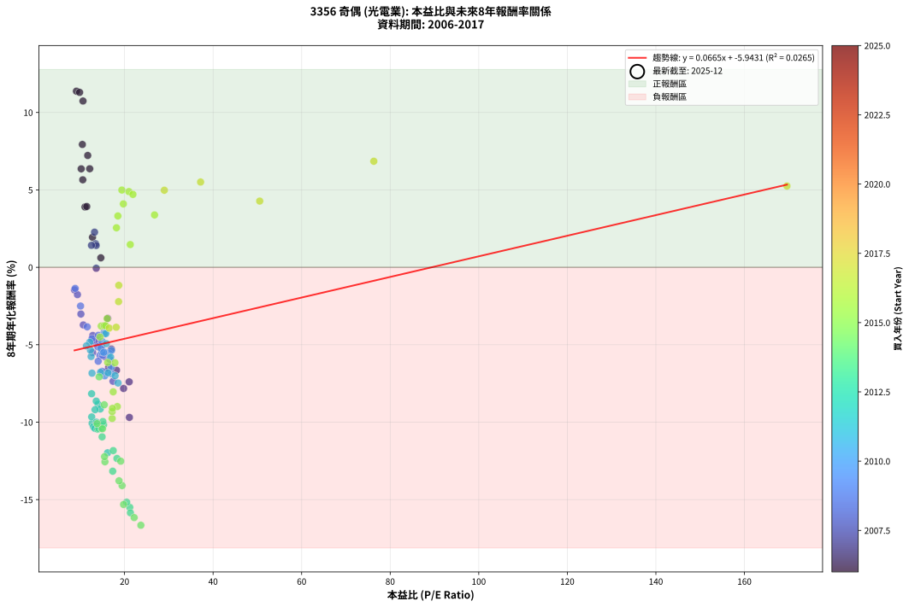

# 3356 奇偶 - 本益比與未來報酬率分析

!!! info "報告資訊"
    - **股票代號**: 3356
    - **公司名稱**: 奇偶
    - **產業別**: 光電業
    - **分析期間**: 2006-2017 (144 個數據點)
    - **資料來源**: Type 12 (ShowMonthlyK_ChartFlow) 月收盤價與本益比
    - **報酬率口徑**: 含現金股利 (簡化: 年度合計，假設每年7/1入帳)
    - **報告生成時間**: 2026-01-06 00:58:19 CST

## 📈 視覺化圖表

### 圖表1: 本益比 vs 未來報酬率關係

*圖表1：3356 奇偶 本益比與8年期未來報酬率關係 (2006-2017)*

### 圖表2: 歷年買入時點的8年期實際報酬率

*圖表2：3356 奇偶 歷年買入時點的8年期實際報酬率 (2006-2017)*

## 📍 買點訊號說明

本報告提供兩種買點提示訊號（顯示於圖表2的股價子圖中）：

### ▲ 小綠色三角形（回測驗證）
- **計算方式**: 使用全部歷史資料計算本益比第25百分位數
- **用途**: 事後驗證，顯示歷史上哪些時點確實為低估區
- **限制**: 當下無法判斷，僅供回測參考
- **特性**: 後見之明（Look-Ahead Bias）

### ▲ 小橘色三角形（即時訊號）
- **計算方式**: 使用截至當月的過去5年資料計算本益比第25百分位數
- **用途**: 實際投資決策，當時即可判斷
- **優勢**: 可操作性強，符合實務需求
- **特性**: 無後見之明，滾動窗口計算

!!! tip "如何使用兩種訊號"
    - **綠色▲** 幫助理解歷史估值機會，驗證策略有效性
    - **橘色▲** 可作為實際買進參考，但仍需搭配基本面分析
    - 兩種訊號重疊時，表示即時判斷與事後驗證一致，信心度較高
    - 僅有綠色▲時，表示當時無法判斷（需要未來資料才能確認）
    - 僅有橘色▲時，表示即時判斷為買點，但事後可能不是最佳時機

## 📊 估值分析摘要

| 指標 | 數值 |
|:---:|:---:|
| **目前本益比** (2017-12) | **nan 倍** |
| **歷史平均本益比** | 17.46 倍 |
| **估值水準** | 🟡 合理範圍 |
| **預期8年年化報酬率** | **+nan%** |
| **歷史平均報酬率** | -4.30% |
| **相關係數 (R²)** | 0.0265 |
| **趨勢線斜率** | 0.0665 |

!!! abstract "核心洞察"
    目前本益比接近歷史平均，預期報酬率符合長期趨勢

    根據歷史數據回測，3356 奇偶 在目前本益比 **nan倍** 的估值水準下，
    預期未來8年年化報酬率約為 **+nan%**。

    **重要提醒**: 本分析基於歷史數據統計，實際報酬率會受到公司基本面變化、產業趨勢、
    總體經濟環境等多重因素影響。R² = 0.03 表示本益比可解釋約 2.7% 的報酬率變異。

## 📈 歷史估值統計

### 最佳買點 (最高報酬率)

| 項目 | 數值 |
|:---:|:---:|
| 起始時間 | 2006-01 |
| 當時本益比 | 9.14 倍 |
| 起始價格 | 102.0 元 |
| 8年後價格 | 177.5 元 |
| **8年年化報酬率** | **+11.37%** |

### 最差買點 (最低報酬率)

| 項目 | 數值 |
|:---:|:---:|
| 起始時間 | 2014-03 |
| 當時本益比 | 23.69 倍 |
| 起始價格 | 204.0 元 |
| 8年後價格 | 28.9 元 |
| **8年年化報酬率** | **-16.66%** |

## 🎯 投資啟示

### 本益比與報酬率關係

趨勢線方程式: **y = 0.0665x + -5.9431**

!!! info "弱相關或正相關"
    本益比與未來報酬率相關性較弱。這可能表示該股票的報酬率更多受到
    公司成長性、產業趨勢等因素影響，而非估值水準。**需綜合考量多項指標**。

### 估值區間建議

基於歷史數據分析:

- **🟢 低估區** (P/E < 14.0): 預期報酬率較高，可考慮增加持股
- **🟡 合理區** (P/E 14.0-20.9): 預期報酬率符合長期趨勢，正常持有
- **🔴 高估區** (P/E > 20.9): 預期報酬率較低，可考慮減碼或觀望

!!! danger "風險提示"
    - 過去表現不代表未來結果
    - 本分析假設公司基本面無重大結構性變化
    - 產業環境劇變可能使歷史規律失效
    - 應結合公司財報、產業趨勢、總體經濟等多重因素綜合判斷

!!! success "長期投資觀點"
    歷史數據顯示，在合理或低估的估值水準買入並長期持有，
    往往能獲得較佳的投資報酬。**耐心等待好價格**是價值投資的核心原則。

## 📊 數據品質

- **資料來源**: GoodInfo.tw Type 12 (ShowMonthlyK_ChartFlow)
- **資料頻率**: 月度收盤價與本益比
- **回測期間**: 2006-2017
- **數據點數量**: 144 個 (每個點代表一次8年期回測)

### 計算方法說明

1. **8年期年化報酬率**:
   - 對每個歷史時點，計算其後8年的實際投資報酬率
   - 期末價值(不含股利): 期末價格
   - 期末價值(含現金股利): 期末價格 + 持有期間內的現金股利合計 (簡化: 年度合計，假設每年7/1入帳)
   - 公式: 年化報酬率 = [(期末價值/期初價格)^(1/年數) - 1] × 100%

2. **本益比 (P/E Ratio)**:
   - 使用當時的月收盤價與EPS計算
   - 資料來源: Type 12 月度河流圖本益比數據

3. **趨勢線 (Linear Regression)**:
   - 使用最小平方法擬合線性趨勢線
   - R²值衡量本益比對報酬率的解釋能力

---

*本報告由 Stock Analysis System v1.9.0 自動生成*
*數據更新時間: 2026-01-06 00:58:19 CST*

## 📋 月度回測明細表

（每一列對應時間線圖中的一個買入點；可用來對照 SVG 圖上的每個點。）

| 買入月份 | 賣出月份 | 回測期限_年 | 實際持有年數 | 買入本益比_倍 | 買入收盤價_元 | 賣出收盤價_元 | 現金股利合計_元 | 總報酬率_pct | 年化報酬率_pct |
| --- | --- | --- | --- | --- | --- | --- | --- | --- | --- |
| 2006-01 | 2014-01 | 8 | 8.000 | 9.14 | 102.00 | 177.50 | 63.98 | +136.75 | +11.37 |
| 2006-02 | 2014-02 | 8 | 8.000 | 9.86 | 110.00 | 195.00 | 63.98 | +135.44 | +11.30 |
| 2006-03 | 2014-03 | 8 | 8.000 | 10.62 | 118.50 | 204.00 | 63.98 | +126.14 | +10.74 |
| 2006-04 | 2014-04 | 8 | 8.000 | 11.69 | 130.50 | 164.00 | 63.98 | +74.70 | +7.22 |
| 2006-05 | 2014-05 | 8 | 8.000 | 12.14 | 135.50 | 158.00 | 63.98 | +63.82 | +6.36 |
| 2006-06 | 2014-06 | 8 | 8.000 | 10.48 | 117.00 | 151.50 | 63.98 | +84.17 | +7.93 |
| 2006-07 | 2014-07 | 8 | 8.000 | 10.22 | 114.00 | 123.00 | 63.68 | +63.76 | +6.36 |
| 2006-08 | 2014-08 | 8 | 8.000 | 10.57 | 118.00 | 119.50 | 63.68 | +55.24 | +5.65 |
| 2006-09 | 2014-09 | 8 | 8.000 | 11.07 | 123.50 | 104.00 | 63.68 | +35.77 | +3.90 |
| 2006-10 | 2014-10 | 8 | 8.000 | 11.47 | 128.00 | 110.50 | 63.68 | +36.08 | +3.93 |
| 2006-11 | 2014-11 | 8 | 8.000 | 12.77 | 142.50 | 102.50 | 63.68 | +16.62 | +1.94 |
| 2006-12 | 2014-12 | 8 | 8.000 | 14.65 | 163.50 | 108.00 | 63.68 | +5.00 | +0.61 |
| 2007-01 | 2015-01 | 8 | 8.000 | 13.23 | 151.00 | 117.00 | 63.68 | +19.66 | +2.27 |
| 2007-02 | 2015-02 | 8 | 8.000 | 13.46 | 157.00 | 113.50 | 63.68 | +12.85 | +1.52 |
| 2007-03 | 2015-03 | 8 | 8.000 | 13.60 | 162.00 | 117.50 | 63.68 | +11.84 | +1.41 |
| 2007-04 | 2015-04 | 8 | 8.000 | 12.54 | 152.50 | 107.00 | 63.68 | +11.92 | +1.42 |
| 2007-05 | 2015-05 | 8 | 8.000 | 13.61 | 169.00 | 104.50 | 63.68 | -0.48 | -0.06 |
| 2007-06 | 2015-06 | 8 | 8.000 | 16.19 | 205.00 | 93.10 | 63.68 | -23.52 | -3.30 |
| 2007-07 | 2015-07 | 8 | 8.000 | 17.03 | 220.00 | 82.30 | 60.28 | -35.19 | -5.28 |
| 2007-08 | 2015-08 | 8 | 8.000 | 18.19 | 239.50 | 77.90 | 60.28 | -42.30 | -6.64 |
| 2007-09 | 2015-09 | 8 | 8.000 | 21.05 | 282.50 | 92.50 | 60.28 | -45.92 | -7.40 |
| 2007-10 | 2015-10 | 8 | 8.000 | 19.79 | 270.50 | 80.70 | 60.28 | -47.88 | -7.82 |
| 2007-11 | 2015-11 | 8 | 8.000 | 16.42 | 228.50 | 73.70 | 60.28 | -41.36 | -6.46 |
| 2007-12 | 2015-12 | 8 | 8.000 | 21.10 | 299.00 | 72.00 | 60.28 | -55.76 | -9.69 |
| 2008-01 | 2016-01 | 8 | 8.000 | 13.90 | 195.00 | 71.90 | 60.28 | -32.21 | -4.74 |
| 2008-02 | 2016-02 | 8 | 8.000 | 14.83 | 206.00 | 74.60 | 60.28 | -34.52 | -5.16 |
| 2008-03 | 2016-03 | 8 | 8.000 | 15.53 | 213.50 | 72.50 | 60.28 | -37.81 | -5.76 |
| 2008-04 | 2016-04 | 8 | 8.000 | 17.41 | 237.00 | 68.30 | 60.28 | -45.75 | -7.36 |
| 2008-05 | 2016-05 | 8 | 8.000 | 15.89 | 214.00 | 62.20 | 60.28 | -42.77 | -6.74 |
| 2008-06 | 2016-06 | 8 | 8.000 | 12.83 | 171.00 | 59.00 | 60.28 | -30.25 | -4.40 |
| 2008-07 | 2016-07 | 8 | 8.000 | 13.04 | 172.00 | 63.00 | 53.28 | -32.39 | -4.78 |
| 2008-08 | 2016-08 | 8 | 8.000 | 12.80 | 167.00 | 52.90 | 53.28 | -36.42 | -5.50 |
| 2008-09 | 2016-09 | 8 | 8.000 | 10.15 | 131.00 | 49.25 | 53.28 | -21.73 | -3.02 |
| 2008-10 | 2016-10 | 8 | 8.000 | 10.69 | 136.50 | 47.50 | 53.28 | -26.17 | -3.72 |
| 2008-11 | 2016-11 | 8 | 8.000 | 8.71 | 110.00 | 44.50 | 53.28 | -11.11 | -1.46 |
| 2008-12 | 2016-12 | 8 | 8.000 | 9.37 | 117.00 | 48.20 | 53.28 | -13.26 | -1.76 |
| 2009-01 | 2017-01 | 8 | 8.000 | 8.86 | 107.50 | 43.05 | 53.28 | -10.39 | -1.36 |
| 2009-02 | 2017-02 | 8 | 8.000 | 10.07 | 118.50 | 43.50 | 53.28 | -18.33 | -2.50 |
| 2009-03 | 2017-03 | 8 | 8.000 | 11.57 | 132.00 | 43.20 | 53.28 | -26.91 | -3.84 |
| 2009-04 | 2017-04 | 8 | 8.000 | 12.63 | 139.50 | 41.20 | 53.28 | -32.27 | -4.75 |
| 2009-05 | 2017-05 | 8 | 8.000 | 14.93 | 159.50 | 38.15 | 53.28 | -42.68 | -6.72 |
| 2009-06 | 2017-06 | 8 | 8.000 | 14.44 | 149.00 | 40.05 | 53.28 | -37.36 | -5.68 |
| 2009-07 | 2017-07 | 8 | 8.000 | 14.06 | 140.00 | 40.60 | 44.27 | -39.38 | -6.06 |
| 2009-08 | 2017-08 | 8 | 8.000 | 12.66 | 121.50 | 39.05 | 44.27 | -31.42 | -4.61 |
| 2009-09 | 2017-09 | 8 | 8.000 | 13.97 | 129.00 | 40.35 | 44.27 | -34.40 | -5.13 |
| 2009-10 | 2017-10 | 8 | 8.000 | 14.09 | 125.00 | 43.00 | 44.27 | -30.18 | -4.39 |
| 2009-11 | 2017-11 | 8 | 8.000 | 15.04 | 128.00 | 35.90 | 44.27 | -37.36 | -5.68 |
| 2009-12 | 2017-12 | 8 | 8.000 | 16.69 | 136.00 | 39.05 | 44.27 | -38.73 | -5.94 |
| 2010-01 | 2018-01 | 8 | 8.000 | 16.54 | 132.00 | 39.30 | 44.27 | -36.69 | -5.55 |
| 2010-02 | 2018-02 | 8 | 8.000 | 15.63 | 122.00 | 33.40 | 44.27 | -36.33 | -5.49 |
| 2010-03 | 2018-03 | 8 | 8.000 | 17.03 | 130.00 | 29.30 | 44.27 | -43.40 | -6.87 |
| 2010-04 | 2018-04 | 8 | 8.000 | 17.02 | 127.00 | 30.35 | 44.27 | -41.24 | -6.43 |
| 2010-05 | 2018-05 | 8 | 8.000 | 14.95 | 109.00 | 29.35 | 44.27 | -32.45 | -4.79 |
| 2010-06 | 2018-06 | 8 | 8.000 | 15.38 | 109.50 | 33.45 | 44.27 | -29.02 | -4.19 |
| 2010-07 | 2018-07 | 8 | 8.000 | 14.90 | 103.50 | 29.65 | 36.27 | -36.30 | -5.48 |
| 2010-08 | 2018-08 | 8 | 8.000 | 14.64 | 99.20 | 28.25 | 36.27 | -34.95 | -5.23 |
| 2010-09 | 2018-09 | 8 | 8.000 | 15.29 | 101.00 | 28.00 | 36.27 | -36.36 | -5.49 |
| 2010-10 | 2018-10 | 8 | 8.000 | 15.54 | 100.00 | 19.65 | 36.27 | -44.08 | -7.01 |
| 2010-11 | 2018-11 | 8 | 8.000 | 15.51 | 97.10 | 32.15 | 36.27 | -29.53 | -4.28 |
| 2010-12 | 2018-12 | 8 | 8.000 | 17.08 | 104.00 | 30.65 | 36.27 | -35.65 | -5.36 |
| 2011-01 | 2019-01 | 8 | 8.000 | 15.89 | 100.00 | 30.45 | 36.27 | -33.28 | -4.93 |
| 2011-02 | 2019-02 | 8 | 8.000 | 15.78 | 102.50 | 35.95 | 36.27 | -29.54 | -4.28 |
| 2011-03 | 2019-03 | 8 | 8.000 | 16.87 | 113.00 | 33.80 | 36.27 | -37.99 | -5.80 |
| 2011-04 | 2019-04 | 8 | 8.000 | 18.54 | 128.00 | 32.50 | 36.27 | -46.27 | -7.47 |
| 2011-05 | 2019-05 | 8 | 8.000 | 17.87 | 127.00 | 34.80 | 36.27 | -44.04 | -7.00 |
| 2011-06 | 2019-06 | 8 | 8.000 | 16.28 | 119.00 | 31.40 | 36.27 | -43.13 | -6.81 |
| 2011-07 | 2019-07 | 8 | 8.000 | 14.57 | 109.50 | 31.15 | 31.29 | -42.97 | -6.78 |
| 2011-08 | 2019-08 | 8 | 8.000 | 12.16 | 93.80 | 31.80 | 31.29 | -32.74 | -4.84 |
| 2011-09 | 2019-09 | 8 | 8.000 | 12.45 | 98.60 | 30.05 | 31.29 | -37.78 | -5.76 |
| 2011-10 | 2019-10 | 8 | 8.000 | 12.31 | 100.00 | 33.10 | 31.29 | -35.61 | -5.35 |
| 2011-11 | 2019-11 | 8 | 8.000 | 11.41 | 95.00 | 31.35 | 31.29 | -34.06 | -5.07 |
| 2011-12 | 2019-12 | 8 | 8.000 | 12.66 | 108.00 | 30.00 | 31.29 | -43.25 | -6.84 |
| 2012-01 | 2020-01 | 8 | 8.000 | 14.03 | 120.00 | 25.90 | 31.29 | -52.34 | -8.85 |
| 2012-02 | 2020-02 | 8 | 8.000 | 14.52 | 124.50 | 26.50 | 31.29 | -53.58 | -9.15 |
| 2012-03 | 2020-03 | 8 | 8.000 | 16.18 | 139.00 | 18.80 | 31.29 | -63.96 | -11.98 |
| 2012-04 | 2020-04 | 8 | 8.000 | 14.51 | 125.00 | 21.30 | 31.29 | -57.92 | -10.26 |
| 2012-05 | 2020-05 | 8 | 8.000 | 12.57 | 108.50 | 23.60 | 31.29 | -49.41 | -8.16 |
| 2012-06 | 2020-06 | 8 | 8.000 | 13.35 | 115.50 | 22.10 | 31.29 | -53.77 | -9.19 |
| 2012-07 | 2020-07 | 8 | 8.000 | 12.68 | 110.00 | 22.75 | 24.29 | -57.23 | -10.07 |
| 2012-08 | 2020-08 | 8 | 8.000 | 12.99 | 113.00 | 23.10 | 24.29 | -58.06 | -10.29 |
| 2012-09 | 2020-09 | 8 | 8.000 | 13.31 | 116.00 | 23.90 | 24.29 | -58.45 | -10.40 |
| 2012-10 | 2020-10 | 8 | 8.000 | 12.59 | 110.00 | 24.50 | 24.29 | -55.64 | -9.66 |
| 2012-11 | 2020-11 | 8 | 8.000 | 13.64 | 119.50 | 27.15 | 24.29 | -56.95 | -10.00 |
| 2012-12 | 2020-12 | 8 | 8.000 | 13.61 | 119.50 | 33.70 | 24.29 | -51.47 | -8.64 |
| 2013-01 | 2021-01 | 8 | 8.000 | 13.96 | 123.00 | 26.55 | 24.29 | -58.66 | -10.45 |
| 2013-02 | 2021-02 | 8 | 8.000 | 14.19 | 125.50 | 27.80 | 24.29 | -58.49 | -10.41 |
| 2013-03 | 2021-03 | 8 | 8.000 | 14.77 | 131.00 | 30.15 | 24.29 | -58.44 | -10.39 |
| 2013-04 | 2021-04 | 8 | 8.000 | 15.28 | 136.00 | 33.40 | 24.29 | -57.58 | -10.16 |
| 2013-05 | 2021-05 | 8 | 8.000 | 14.94 | 133.50 | 28.50 | 24.29 | -60.45 | -10.95 |
| 2013-06 | 2021-06 | 8 | 8.000 | 15.11 | 135.50 | 34.25 | 24.29 | -56.79 | -9.96 |
| 2013-07 | 2021-07 | 8 | 8.000 | 18.29 | 164.50 | 38.75 | 18.60 | -65.14 | -12.34 |
| 2013-08 | 2021-08 | 8 | 8.000 | 17.45 | 157.50 | 38.90 | 18.60 | -63.50 | -11.84 |
| 2013-09 | 2021-09 | 8 | 8.000 | 17.33 | 157.00 | 32.15 | 18.60 | -67.68 | -13.17 |
| 2013-10 | 2021-10 | 8 | 8.000 | 21.18 | 192.50 | 31.45 | 18.60 | -74.00 | -15.50 |
| 2013-11 | 2021-11 | 8 | 8.000 | 21.33 | 194.50 | 30.30 | 18.60 | -74.86 | -15.85 |
| 2013-12 | 2021-12 | 8 | 8.000 | 20.49 | 187.50 | 31.70 | 18.60 | -73.18 | -15.17 |
| 2014-01 | 2022-01 | 8 | 8.000 | 19.79 | 177.50 | 28.35 | 18.60 | -73.55 | -15.32 |
| 2014-02 | 2022-02 | 8 | 8.000 | 22.18 | 195.00 | 29.00 | 18.60 | -75.59 | -16.16 |
| 2014-03 | 2022-03 | 8 | 8.000 | 23.69 | 204.00 | 28.90 | 18.60 | -76.72 | -16.66 |
| 2014-04 | 2022-04 | 8 | 8.000 | 19.45 | 164.00 | 30.05 | 18.60 | -70.34 | -14.09 |
| 2014-05 | 2022-05 | 8 | 8.000 | 19.14 | 158.00 | 35.60 | 18.60 | -65.70 | -12.52 |
| 2014-06 | 2022-06 | 8 | 8.000 | 18.76 | 151.50 | 27.65 | 18.60 | -69.48 | -13.79 |
| 2014-07 | 2022-07 | 8 | 8.000 | 15.58 | 123.00 | 29.45 | 12.59 | -65.82 | -12.56 |
| 2014-08 | 2022-08 | 8 | 8.000 | 15.49 | 119.50 | 29.50 | 12.59 | -64.77 | -12.23 |
| 2014-09 | 2022-09 | 8 | 8.000 | 13.80 | 104.00 | 31.80 | 12.59 | -57.31 | -10.09 |
| 2014-10 | 2022-10 | 8 | 8.000 | 15.02 | 110.50 | 33.20 | 12.59 | -58.56 | -10.43 |
| 2014-11 | 2022-11 | 8 | 8.000 | 14.28 | 102.50 | 44.40 | 12.59 | -44.40 | -7.07 |
| 2014-12 | 2022-12 | 8 | 8.000 | 15.43 | 108.00 | 38.75 | 12.59 | -52.46 | -8.88 |
| 2015-01 | 2023-01 | 8 | 8.000 | 17.21 | 117.00 | 38.85 | 12.59 | -56.03 | -9.76 |
| 2015-02 | 2023-02 | 8 | 8.000 | 17.21 | 113.50 | 39.30 | 12.59 | -54.28 | -9.32 |
| 2015-03 | 2023-03 | 8 | 8.000 | 18.37 | 117.50 | 42.70 | 12.59 | -52.94 | -8.99 |
| 2015-04 | 2023-04 | 8 | 8.000 | 17.28 | 107.00 | 37.25 | 12.59 | -53.42 | -9.11 |
| 2015-05 | 2023-05 | 8 | 8.000 | 17.44 | 104.50 | 40.85 | 12.59 | -48.86 | -8.04 |
| 2015-06 | 2023-06 | 8 | 8.000 | 16.08 | 93.10 | 58.50 | 12.59 | -23.64 | -3.31 |
| 2015-07 | 2023-07 | 8 | 8.000 | 14.73 | 82.30 | 51.80 | 8.59 | -26.62 | -3.79 |
| 2015-08 | 2023-08 | 8 | 8.000 | 14.46 | 77.90 | 45.30 | 8.59 | -30.82 | -4.50 |
| 2015-09 | 2023-09 | 8 | 8.000 | 17.84 | 92.50 | 47.00 | 8.59 | -39.90 | -6.17 |
| 2015-10 | 2023-10 | 8 | 8.000 | 16.19 | 80.70 | 40.00 | 8.59 | -39.78 | -6.14 |
| 2015-11 | 2023-11 | 8 | 8.000 | 15.41 | 73.70 | 45.60 | 8.59 | -26.47 | -3.77 |
| 2015-12 | 2023-12 | 8 | 8.000 | 15.72 | 72.00 | 44.35 | 8.59 | -26.47 | -3.77 |
| 2016-01 | 2024-01 | 8 | 8.000 | 16.54 | 71.90 | 43.60 | 8.59 | -27.41 | -3.92 |
| 2016-02 | 2024-02 | 8 | 8.000 | 18.12 | 74.60 | 45.80 | 8.59 | -27.08 | -3.87 |
| 2016-03 | 2024-03 | 8 | 8.000 | 18.66 | 72.50 | 52.00 | 8.59 | -16.42 | -2.22 |
| 2016-04 | 2024-04 | 8 | 8.000 | 18.70 | 68.30 | 53.60 | 8.59 | -8.94 | -1.16 |
| 2016-05 | 2024-05 | 8 | 8.000 | 18.18 | 62.20 | 67.50 | 8.59 | +22.34 | +2.55 |
| 2016-06 | 2024-06 | 8 | 8.000 | 18.50 | 59.00 | 68.00 | 8.59 | +29.82 | +3.32 |
| 2016-07 | 2024-07 | 8 | 8.000 | 21.30 | 63.00 | 63.30 | 7.49 | +12.37 | +1.47 |
| 2016-08 | 2024-08 | 8 | 8.000 | 19.40 | 52.90 | 70.60 | 7.49 | +47.63 | +4.99 |
| 2016-09 | 2024-09 | 8 | 8.000 | 19.74 | 49.25 | 60.40 | 7.49 | +37.86 | +4.09 |
| 2016-10 | 2024-10 | 8 | 8.000 | 20.99 | 47.50 | 62.10 | 7.49 | +46.52 | +4.89 |
| 2016-11 | 2024-11 | 8 | 8.000 | 21.90 | 44.50 | 56.80 | 7.49 | +44.48 | +4.71 |
| 2016-12 | 2024-12 | 8 | 8.000 | 26.78 | 48.20 | 55.40 | 7.49 | +30.49 | +3.38 |
| 2017-01 | 2025-01 | 8 | 8.000 | 28.99 | 43.05 | 56.00 | 7.49 | +47.49 | +4.98 |
| 2017-02 | 2025-02 | 8 | 8.000 | 37.18 | 43.50 | 59.30 | 7.49 | +53.55 | +5.51 |
| 2017-03 | 2025-03 | 8 | 8.000 | 50.53 | 43.20 | 52.90 | 7.49 | +39.80 | +4.28 |
| 2017-04 | 2025-04 | 8 | 8.000 | 76.30 | 41.20 | 62.50 | 7.49 | +69.89 | +6.85 |
| 2017-05 | 2025-05 | 8 | 8.000 | 169.60 | 38.15 | 49.95 | 7.49 | +50.58 | +5.25 |
| 2017-06 | 2025-06 | 8 | 8.000 |  | 40.05 | 50.30 | 7.49 | +44.31 | +4.69 |
| 2017-07 | 2025-07 | 8 | 8.000 |  | 40.60 | 48.80 | 10.50 | +46.06 | +4.85 |
| 2017-08 | 2025-08 | 8 | 8.000 |  | 39.05 | 52.50 | 10.50 | +61.33 | +6.16 |
| 2017-09 | 2025-09 | 8 | 8.000 |  | 40.35 | 53.20 | 10.50 | +57.87 | +5.87 |
| 2017-10 | 2025-10 | 8 | 8.000 |  | 43.00 | 46.30 | 10.50 | +32.10 | +3.54 |
| 2017-11 | 2025-11 | 8 | 8.000 |  | 35.90 | 48.20 | 10.50 | +63.51 | +6.34 |
| 2017-12 | 2025-12 | 8 | 8.000 |  | 39.05 | 47.00 | 10.50 | +47.25 | +4.96 |
