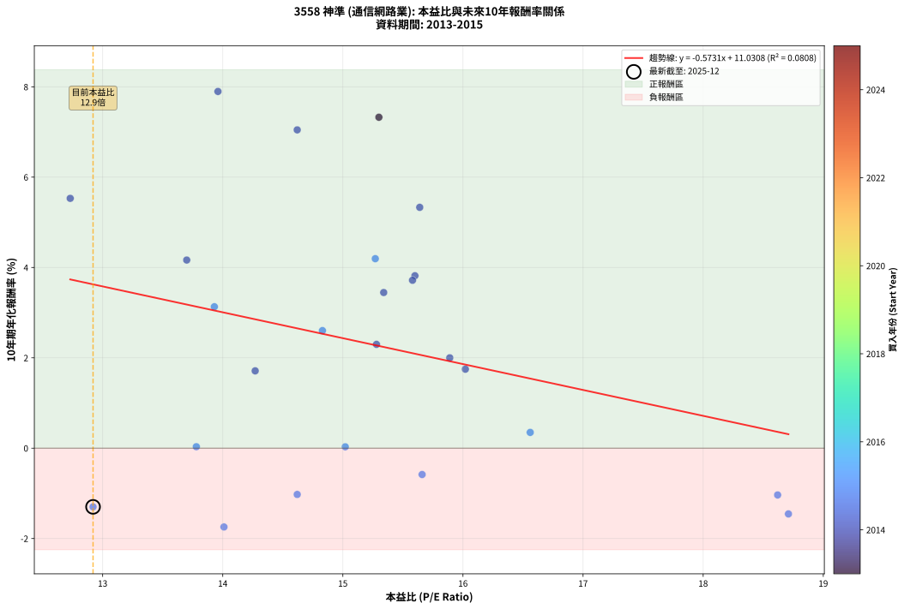
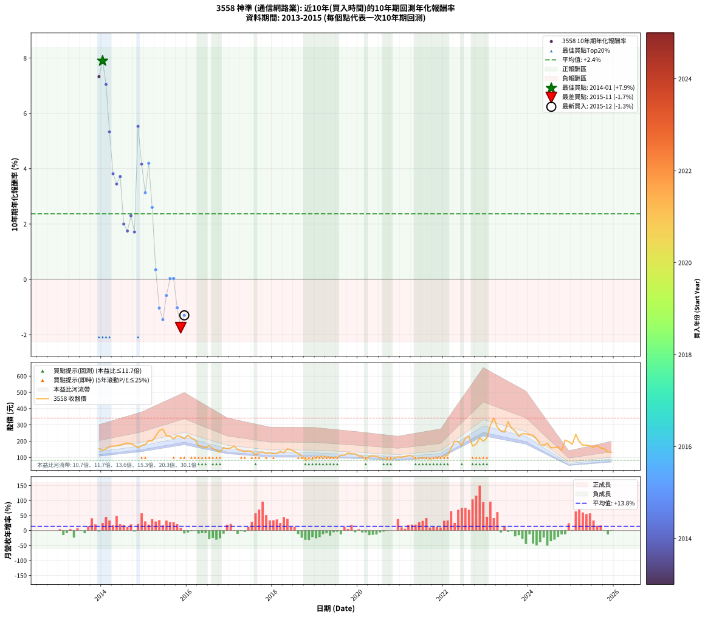

# 3558 神準 - 本益比與未來報酬率分析

!!! info "報告資訊"
    - **股票代號**: 3558
    - **公司名稱**: 神準
    - **產業別**: 通信網路業
    - **分析期間**: 2013-2015 (25 個數據點)
    - **資料來源**: Type 12 (ShowMonthlyK_ChartFlow) 月收盤價與本益比
    - **報酬率口徑**: 含現金股利 (簡化: 年度合計，假設每年7/1入帳)
    - **報告生成時間**: 2026-01-09 21:05:02 CST

## 📈 視覺化圖表

### 圖表1: 本益比 vs 未來報酬率關係

*圖表1：3558 神準 本益比與10年期未來報酬率關係 (2013-2015)*

### 圖表2: 歷年買入時點的10年期實際報酬率

*圖表2：3558 神準 歷年買入時點的10年期實際報酬率 (2013-2015)*

## 📍 買點訊號說明

本報告提供兩種買點提示訊號（顯示於圖表2的股價子圖中）：

### ▲ 小綠色三角形（回測驗證）
- **計算方式**: 使用全部歷史資料計算本益比第25百分位數
- **用途**: 事後驗證，顯示歷史上哪些時點確實為低估區
- **限制**: 當下無法判斷，僅供回測參考
- **特性**: 後見之明（Look-Ahead Bias）

### ▲ 小橘色三角形（即時訊號）
- **計算方式**: 使用截至當月的過去5年資料計算本益比第25百分位數
- **用途**: 實際投資決策，當時即可判斷
- **優勢**: 可操作性強，符合實務需求
- **特性**: 無後見之明，滾動窗口計算

!!! tip "如何使用兩種訊號"
    - **綠色▲** 幫助理解歷史估值機會，驗證策略有效性
    - **橘色▲** 可作為實際買進參考，但仍需搭配基本面分析
    - 兩種訊號重疊時，表示即時判斷與事後驗證一致，信心度較高
    - 僅有綠色▲時，表示當時無法判斷（需要未來資料才能確認）
    - 僅有橘色▲時，表示即時判斷為買點，但事後可能不是最佳時機

## 📊 估值分析摘要

| 指標 | 數值 |
|:---:|:---:|
| **目前本益比** (2015-12) | **12.92 倍** |
| **歷史平均本益比** | 15.11 倍 |
| **估值水準** | 🟡 合理範圍 |
| **預期10年年化報酬率** | **+3.63%** |
| **歷史平均報酬率** | +2.37% |
| **相關係數 (R²)** | 0.0808 |
| **趨勢線斜率** | -0.5731 |

!!! abstract "核心洞察"
    目前本益比接近歷史平均，預期報酬率符合長期趨勢

    根據歷史數據回測，3558 神準 在目前本益比 **12.9倍** 的估值水準下，
    預期未來10年年化報酬率約為 **+3.6%**。

    **重要提醒**: 本分析基於歷史數據統計，實際報酬率會受到公司基本面變化、產業趨勢、
    總體經濟環境等多重因素影響。R² = 0.08 表示本益比可解釋約 8.1% 的報酬率變異。

## 📈 歷史估值統計

### 最佳買點 (最高報酬率)

| 項目 | 數值 |
|:---:|:---:|
| 起始時間 | 2014-01 |
| 當時本益比 | 13.96 倍 |
| 起始價格 | 143.0 元 |
| 10年後價格 | 239.5 元 |
| **10年年化報酬率** | **+7.90%** |

### 最差買點 (最低報酬率)

| 項目 | 數值 |
|:---:|:---:|
| 起始時間 | 2015-11 |
| 當時本益比 | 14.01 倍 |
| 起始價格 | 228.0 元 |
| 10年後價格 | 133.5 元 |
| **10年年化報酬率** | **-1.74%** |

## 🎯 投資啟示

### 本益比與報酬率關係

趨勢線方程式: **y = -0.5731x + 11.0308**

!!! warning "強負相關"
    本益比與未來報酬率呈現強負相關。在高本益比時期買入，未來報酬率顯著較低；
    在低本益比時期買入，未來報酬率顯著較高。**估值紀律至關重要**。

### 估值區間建議

基於歷史數據分析:

- **🟢 低估區** (P/E < 12.1): 預期報酬率較高，可考慮增加持股
- **🟡 合理區** (P/E 12.1-18.1): 預期報酬率符合長期趨勢，正常持有
- **🔴 高估區** (P/E > 18.1): 預期報酬率較低，可考慮減碼或觀望

!!! danger "風險提示"
    - 過去表現不代表未來結果
    - 本分析假設公司基本面無重大結構性變化
    - 產業環境劇變可能使歷史規律失效
    - 應結合公司財報、產業趨勢、總體經濟等多重因素綜合判斷

!!! success "長期投資觀點"
    歷史數據顯示，在合理或低估的估值水準買入並長期持有，
    往往能獲得較佳的投資報酬。**耐心等待好價格**是價值投資的核心原則。

## 📊 數據品質

- **資料來源**: GoodInfo.tw Type 12 (ShowMonthlyK_ChartFlow)
- **資料頻率**: 月度收盤價與本益比
- **回測期間**: 2013-2015
- **數據點數量**: 25 個 (每個點代表一次10年期回測)

### 計算方法說明

1. **10年期年化報酬率**:
   - 對每個歷史時點，計算其後10年的實際投資報酬率
   - 期末價值(不含股利): 期末價格
   - 期末價值(含現金股利): 期末價格 + 持有期間內的現金股利合計 (簡化: 年度合計，假設每年7/1入帳)
   - 公式: 年化報酬率 = [(期末價值/期初價格)^(1/年數) - 1] × 100%

2. **本益比 (P/E Ratio)**:
   - 使用當時的月收盤價與EPS計算
   - 資料來源: Type 12 月度河流圖本益比數據

3. **趨勢線 (Linear Regression)**:
   - 使用最小平方法擬合線性趨勢線
   - R²值衡量本益比對報酬率的解釋能力

---

*本報告由 Stock Analysis System v1.9.0 自動生成*
*數據更新時間: 2026-01-09 21:05:02 CST*

## 📋 月度回測明細表

（每一列對應時間線圖中的一個買入點；可用來對照 SVG 圖上的每個點。）

| 買入月份 | 賣出月份 | 回測期限_年 | 實際持有年數 | 買入本益比_倍 | 買入收盤價_元 | 賣出收盤價_元 | 現金股利合計_元 | 總報酬率_pct | 年化報酬率_pct |
| --- | --- | --- | --- | --- | --- | --- | --- | --- | --- |
| 2013-12 | 2023-12 | 10 | 9.999 | 15.30 | 153.50 | 245.00 | 66.26 | +102.78 | +7.33 |
| 2014-01 | 2024-01 | 10 | 9.999 | 13.96 | 143.00 | 239.50 | 66.26 | +113.82 | +7.90 |
| 2014-02 | 2024-02 | 10 | 9.999 | 14.62 | 153.00 | 236.00 | 66.26 | +97.56 | +7.05 |
| 2014-03 | 2024-03 | 10 | 10.001 | 15.64 | 167.00 | 214.50 | 66.26 | +68.12 | +5.33 |
| 2014-04 | 2024-04 | 10 | 10.001 | 15.60 | 170.00 | 181.00 | 66.26 | +45.45 | +3.82 |
| 2014-05 | 2024-05 | 10 | 10.001 | 15.34 | 170.50 | 173.00 | 66.26 | +40.33 | +3.45 |
| 2014-06 | 2024-06 | 10 | 10.001 | 15.58 | 176.50 | 188.00 | 66.26 | +44.06 | +3.72 |
| 2014-07 | 2024-07 | 10 | 10.001 | 15.89 | 183.50 | 159.50 | 64.19 | +21.90 | +2.00 |
| 2014-08 | 2024-08 | 10 | 10.001 | 16.02 | 188.50 | 160.00 | 64.19 | +18.93 | +1.75 |
| 2014-09 | 2024-09 | 10 | 10.001 | 15.28 | 183.00 | 165.50 | 64.19 | +25.51 | +2.30 |
| 2014-10 | 2024-10 | 10 | 10.001 | 14.27 | 174.00 | 142.00 | 64.19 | +18.50 | +1.71 |
| 2014-11 | 2024-11 | 10 | 10.001 | 12.73 | 158.00 | 206.50 | 64.19 | +71.32 | +5.53 |
| 2014-12 | 2024-12 | 10 | 10.001 | 13.70 | 173.00 | 196.00 | 64.19 | +50.40 | +4.17 |
| 2015-01 | 2025-01 | 10 | 10.001 | 13.93 | 180.50 | 181.50 | 64.19 | +36.12 | +3.13 |
| 2015-02 | 2025-02 | 10 | 10.001 | 15.27 | 203.00 | 242.00 | 64.19 | +50.83 | +4.20 |
| 2015-03 | 2025-03 | 10 | 10.001 | 14.83 | 202.00 | 197.00 | 64.19 | +29.30 | +2.60 |
| 2015-04 | 2025-04 | 10 | 10.001 | 16.56 | 231.00 | 175.00 | 64.19 | +3.55 | +0.35 |
| 2015-05 | 2025-05 | 10 | 10.001 | 18.62 | 266.00 | 175.50 | 64.19 | -9.89 | -1.04 |
| 2015-06 | 2025-06 | 10 | 10.001 | 18.71 | 273.50 | 172.00 | 64.19 | -13.64 | -1.46 |
| 2015-07 | 2025-07 | 10 | 10.001 | 15.66 | 234.00 | 163.00 | 57.70 | -5.68 | -0.58 |
| 2015-08 | 2025-08 | 10 | 10.001 | 15.02 | 229.50 | 172.50 | 57.70 | +0.31 | +0.03 |
| 2015-09 | 2025-09 | 10 | 10.001 | 13.78 | 215.00 | 158.00 | 57.70 | +0.33 | +0.03 |
| 2015-10 | 2025-10 | 10 | 10.001 | 14.62 | 233.00 | 152.50 | 57.70 | -9.79 | -1.02 |
| 2015-11 | 2025-11 | 10 | 10.001 | 14.01 | 228.00 | 133.50 | 57.70 | -16.14 | -1.74 |
| 2015-12 | 2025-12 | 10 | 10.001 | 12.92 | 214.50 | 130.50 | 57.70 | -12.26 | -1.30 |
