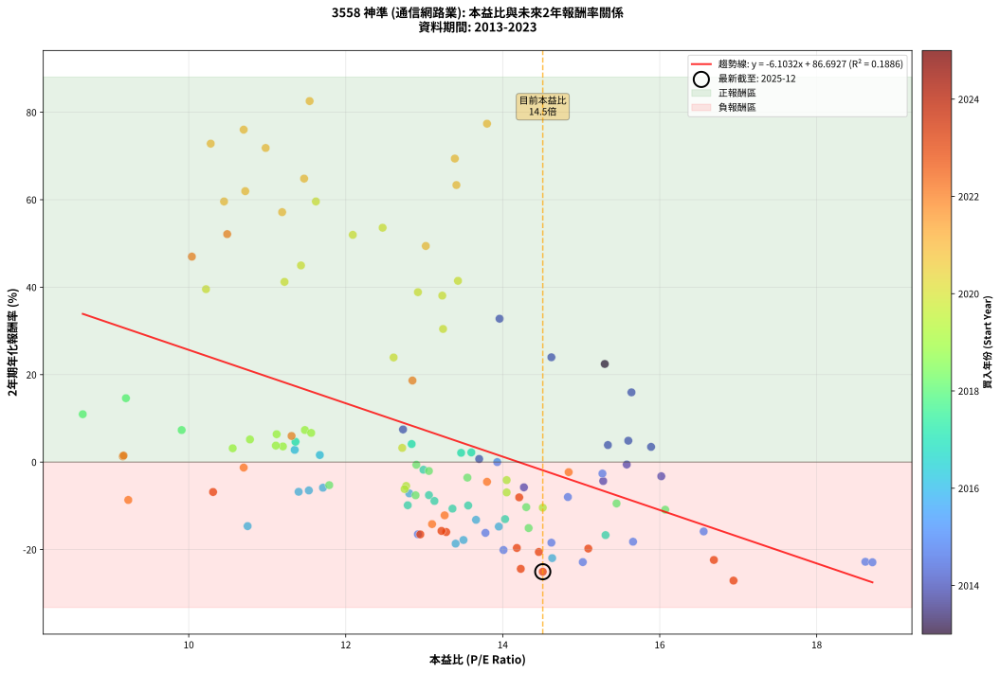
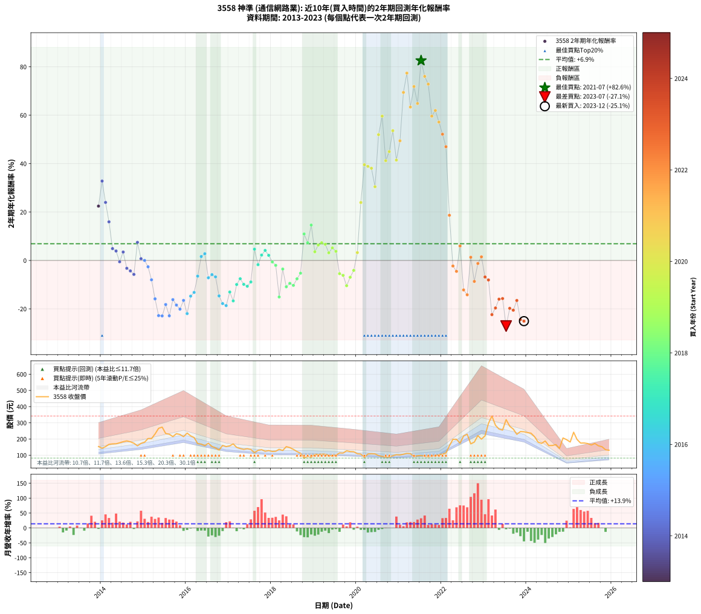

# 3558 神準 - 本益比與未來報酬率分析

!!! info "報告資訊"
    - **股票代號**: 3558
    - **公司名稱**: 神準
    - **產業別**: 通信網路業
    - **分析期間**: 2013-2023 (121 個數據點)
    - **資料來源**: Type 12 (ShowMonthlyK_ChartFlow) 月收盤價與本益比
    - **報酬率口徑**: 含現金股利 (簡化: 年度合計，假設每年7/1入帳)
    - **報告生成時間**: 2026-01-04 08:50:07 CST

## 📈 視覺化圖表

### 圖表1: 本益比 vs 未來報酬率關係

*圖表1：3558 神準 本益比與2年期未來報酬率關係 (2013-2023)*

### 圖表2: 歷年買入時點的2年期實際報酬率

*圖表2：3558 神準 歷年買入時點的2年期實際報酬率 (2013-2023)*

## 📍 買點訊號說明

本報告提供兩種買點提示訊號（顯示於圖表2的股價子圖中）：

### ▲ 小綠色三角形（回測驗證）
- **計算方式**: 使用全部歷史資料計算本益比第25百分位數
- **用途**: 事後驗證，顯示歷史上哪些時點確實為低估區
- **限制**: 當下無法判斷，僅供回測參考
- **特性**: 後見之明（Look-Ahead Bias）

### ▲ 小橘色三角形（即時訊號）
- **計算方式**: 使用截至當月的過去5年資料計算本益比第25百分位數
- **用途**: 實際投資決策，當時即可判斷
- **優勢**: 可操作性強，符合實務需求
- **特性**: 無後見之明，滾動窗口計算

!!! tip "如何使用兩種訊號"
    - **綠色▲** 幫助理解歷史估值機會，驗證策略有效性
    - **橘色▲** 可作為實際買進參考，但仍需搭配基本面分析
    - 兩種訊號重疊時，表示即時判斷與事後驗證一致，信心度較高
    - 僅有綠色▲時，表示當時無法判斷（需要未來資料才能確認）
    - 僅有橘色▲時，表示即時判斷為買點，但事後可能不是最佳時機

## 📊 估值分析摘要

| 指標 | 數值 |
|:---:|:---:|
| **目前本益比** (2023-12) | **14.51 倍** |
| **歷史平均本益比** | 13.07 倍 |
| **估值水準** | 🟡 合理範圍 |
| **預期2年年化報酬率** | **-1.87%** |
| **歷史平均報酬率** | +6.90% |
| **相關係數 (R²)** | 0.1886 |
| **趨勢線斜率** | -6.1032 |

!!! abstract "核心洞察"
    目前本益比接近歷史平均，預期報酬率符合長期趨勢

    根據歷史數據回測，3558 神準 在目前本益比 **14.5倍** 的估值水準下，
    預期未來2年年化報酬率約為 **-1.9%**。

    **重要提醒**: 本分析基於歷史數據統計，實際報酬率會受到公司基本面變化、產業趨勢、
    總體經濟環境等多重因素影響。R² = 0.19 表示本益比可解釋約 18.9% 的報酬率變異。

## 📈 歷史估值統計

### 最佳買點 (最高報酬率)

| 項目 | 數值 |
|:---:|:---:|
| 起始時間 | 2021-07 |
| 當時本益比 | 11.54 倍 |
| 起始價格 | 98.5 元 |
| 2年後價格 | 320.0 元 |
| **2年年化報酬率** | **+82.56%** |

### 最差買點 (最低報酬率)

| 項目 | 數值 |
|:---:|:---:|
| 起始時間 | 2023-07 |
| 當時本益比 | 16.94 倍 |
| 起始價格 | 320.0 元 |
| 2年後價格 | 163.0 元 |
| **2年年化報酬率** | **-27.10%** |

## 🎯 投資啟示

### 本益比與報酬率關係

趨勢線方程式: **y = -6.1032x + 86.6927**

!!! warning "強負相關"
    本益比與未來報酬率呈現強負相關。在高本益比時期買入，未來報酬率顯著較低；
    在低本益比時期買入，未來報酬率顯著較高。**估值紀律至關重要**。

### 估值區間建議

基於歷史數據分析:

- **🟢 低估區** (P/E < 10.5): 預期報酬率較高，可考慮增加持股
- **🟡 合理區** (P/E 10.5-15.7): 預期報酬率符合長期趨勢，正常持有
- **🔴 高估區** (P/E > 15.7): 預期報酬率較低，可考慮減碼或觀望

!!! danger "風險提示"
    - 過去表現不代表未來結果
    - 本分析假設公司基本面無重大結構性變化
    - 產業環境劇變可能使歷史規律失效
    - 應結合公司財報、產業趨勢、總體經濟等多重因素綜合判斷

!!! success "長期投資觀點"
    歷史數據顯示，在合理或低估的估值水準買入並長期持有，
    往往能獲得較佳的投資報酬。**耐心等待好價格**是價值投資的核心原則。

## 📊 數據品質

- **資料來源**: GoodInfo.tw Type 12 (ShowMonthlyK_ChartFlow)
- **資料頻率**: 月度收盤價與本益比
- **回測期間**: 2013-2023
- **數據點數量**: 121 個 (每個點代表一次2年期回測)

### 計算方法說明

1. **2年期年化報酬率**:
   - 對每個歷史時點，計算其後2年的實際投資報酬率
   - 期末價值(不含股利): 期末價格
   - 期末價值(含現金股利): 期末價格 + 持有期間內的現金股利合計 (簡化: 年度合計，假設每年7/1入帳)
   - 公式: 年化報酬率 = [(期末價值/期初價格)^(1/年數) - 1] × 100%

2. **本益比 (P/E Ratio)**:
   - 使用當時的月收盤價與EPS計算
   - 資料來源: Type 12 月度河流圖本益比數據

3. **趨勢線 (Linear Regression)**:
   - 使用最小平方法擬合線性趨勢線
   - R²值衡量本益比對報酬率的解釋能力

---

*本報告由 Stock Analysis System v1.9.0 自動生成*
*數據更新時間: 2026-01-04 08:50:07 CST*

## 📋 月度回測明細表

（每一列對應時間線圖中的一個買入點；可用來對照 SVG 圖上的每個點。）

| 買入月份 | 賣出月份 | 回測期限_年 | 實際持有年數 | 買入本益比_倍 | 買入收盤價_元 | 賣出收盤價_元 | 現金股利合計_元 | 總報酬率_pct | 年化報酬率_pct |
| --- | --- | --- | --- | --- | --- | --- | --- | --- | --- |
| 2013-12 | 2015-12 | 2 | 1.999 | 15.30 | 153.50 | 214.50 | 15.56 | +49.88 | +22.44 |
| 2014-01 | 2016-01 | 2 | 1.999 | 13.96 | 143.00 | 236.50 | 15.56 | +76.27 | +32.79 |
| 2014-02 | 2016-02 | 2 | 1.999 | 14.62 | 153.00 | 219.50 | 15.56 | +53.64 | +23.97 |
| 2014-03 | 2016-03 | 2 | 2.001 | 15.64 | 167.00 | 209.00 | 15.56 | +34.47 | +15.95 |
| 2014-04 | 2016-04 | 2 | 2.001 | 15.60 | 170.00 | 171.50 | 15.56 | +10.04 | +4.90 |
| 2014-05 | 2016-05 | 2 | 2.001 | 15.34 | 170.50 | 168.50 | 15.56 | +7.96 | +3.90 |
| 2014-06 | 2016-06 | 2 | 2.001 | 15.58 | 176.50 | 159.00 | 15.56 | -1.10 | -0.55 |
| 2014-07 | 2016-07 | 2 | 2.001 | 15.89 | 183.50 | 174.00 | 22.49 | +7.08 | +3.48 |
| 2014-08 | 2016-08 | 2 | 2.001 | 16.02 | 188.50 | 154.00 | 22.49 | -6.37 | -3.24 |
| 2014-09 | 2016-09 | 2 | 2.001 | 15.28 | 183.00 | 145.00 | 22.49 | -8.47 | -4.33 |
| 2014-10 | 2016-10 | 2 | 2.001 | 14.27 | 174.00 | 132.00 | 22.49 | -11.21 | -5.77 |
| 2014-11 | 2016-11 | 2 | 2.001 | 12.73 | 158.00 | 160.00 | 22.49 | +15.50 | +7.47 |
| 2014-12 | 2016-12 | 2 | 2.001 | 13.70 | 173.00 | 153.00 | 22.49 | +1.44 | +0.72 |
| 2015-01 | 2017-01 | 2 | 2.001 | 13.93 | 180.50 | 158.00 | 22.49 | -0.00 | -0.00 |
| 2015-02 | 2017-02 | 2 | 2.001 | 15.27 | 203.00 | 170.00 | 22.49 | -5.18 | -2.62 |
| 2015-03 | 2017-03 | 2 | 2.001 | 14.83 | 202.00 | 148.50 | 22.49 | -15.35 | -7.99 |
| 2015-04 | 2017-04 | 2 | 2.001 | 16.56 | 231.00 | 141.00 | 22.49 | -29.22 | -15.86 |
| 2015-05 | 2017-05 | 2 | 2.001 | 18.62 | 266.00 | 136.00 | 22.49 | -40.42 | -22.80 |
| 2015-06 | 2017-06 | 2 | 2.001 | 18.71 | 273.50 | 140.00 | 22.49 | -40.59 | -22.91 |
| 2015-07 | 2017-07 | 2 | 2.001 | 15.66 | 234.00 | 135.50 | 21.00 | -33.12 | -18.21 |
| 2015-08 | 2017-08 | 2 | 2.001 | 15.02 | 229.50 | 115.50 | 21.00 | -40.52 | -22.86 |
| 2015-09 | 2017-09 | 2 | 2.001 | 13.78 | 215.00 | 130.00 | 21.00 | -29.77 | -16.19 |
| 2015-10 | 2017-10 | 2 | 2.001 | 14.62 | 233.00 | 134.00 | 21.00 | -33.48 | -18.43 |
| 2015-11 | 2017-11 | 2 | 2.001 | 14.01 | 228.00 | 124.50 | 21.00 | -36.18 | -20.10 |
| 2015-12 | 2017-12 | 2 | 2.001 | 12.92 | 214.50 | 128.50 | 21.00 | -30.30 | -16.50 |
| 2016-01 | 2018-01 | 2 | 2.001 | 14.63 | 236.50 | 123.00 | 21.00 | -39.11 | -21.96 |
| 2016-02 | 2018-03 | 2 | 2.081 | 13.95 | 219.50 | 136.50 | 21.00 | -28.25 | -14.74 |
| 2016-03 | 2018-03 | 2 | 1.999 | 13.66 | 209.00 | 136.50 | 21.00 | -24.64 | -13.20 |
| 2016-04 | 2018-04 | 2 | 1.999 | 11.53 | 171.50 | 129.00 | 21.00 | -12.54 | -6.48 |
| 2016-05 | 2018-05 | 2 | 1.999 | 11.67 | 168.50 | 153.00 | 21.00 | +3.26 | +1.62 |
| 2016-06 | 2018-06 | 2 | 1.999 | 11.35 | 159.00 | 147.00 | 21.00 | +5.66 | +2.79 |
| 2016-07 | 2018-07 | 2 | 1.999 | 12.81 | 174.00 | 136.00 | 14.00 | -13.79 | -7.16 |
| 2016-08 | 2018-08 | 2 | 1.999 | 11.71 | 154.00 | 122.50 | 14.00 | -11.36 | -5.86 |
| 2016-09 | 2018-09 | 2 | 1.999 | 11.40 | 145.00 | 112.00 | 14.00 | -13.10 | -6.79 |
| 2016-10 | 2018-10 | 2 | 1.999 | 10.75 | 132.00 | 82.20 | 14.00 | -27.12 | -14.64 |
| 2016-11 | 2018-11 | 2 | 1.999 | 13.50 | 160.00 | 94.10 | 14.00 | -32.44 | -17.81 |
| 2016-12 | 2018-12 | 2 | 1.999 | 13.40 | 153.00 | 87.30 | 14.00 | -33.79 | -18.64 |
| 2017-01 | 2019-01 | 2 | 1.999 | 14.03 | 158.00 | 105.50 | 14.00 | -24.37 | -13.04 |
| 2017-02 | 2019-02 | 2 | 1.999 | 15.31 | 170.00 | 104.00 | 14.00 | -30.59 | -16.70 |
| 2017-03 | 2019-03 | 2 | 1.999 | 13.56 | 148.50 | 106.50 | 14.00 | -18.86 | -9.93 |
| 2017-04 | 2019-04 | 2 | 1.999 | 13.06 | 141.00 | 106.50 | 14.00 | -14.54 | -7.56 |
| 2017-05 | 2019-05 | 2 | 1.999 | 12.79 | 136.00 | 96.50 | 14.00 | -18.75 | -9.87 |
| 2017-06 | 2019-06 | 2 | 1.999 | 13.36 | 140.00 | 97.80 | 14.00 | -20.14 | -10.64 |
| 2017-07 | 2019-07 | 2 | 1.999 | 13.13 | 135.50 | 100.00 | 12.50 | -16.97 | -8.89 |
| 2017-08 | 2019-08 | 2 | 1.999 | 11.36 | 115.50 | 114.00 | 12.50 | +9.52 | +4.66 |
| 2017-09 | 2019-09 | 2 | 1.999 | 12.99 | 130.00 | 113.00 | 12.50 | -3.46 | -1.75 |
| 2017-10 | 2019-10 | 2 | 1.999 | 13.60 | 134.00 | 127.50 | 12.50 | +4.48 | +2.22 |
| 2017-11 | 2019-11 | 2 | 1.999 | 12.84 | 124.50 | 122.50 | 12.50 | +8.43 | +4.13 |
| 2017-12 | 2019-12 | 2 | 1.999 | 13.47 | 128.50 | 121.50 | 12.50 | +4.28 | +2.12 |
| 2018-01 | 2020-01 | 2 | 1.999 | 12.90 | 123.00 | 109.00 | 12.50 | -1.22 | -0.61 |
| 2018-02 | 2020-02 | 2 | 1.999 | 13.06 | 124.50 | 107.00 | 12.50 | -4.02 | -2.03 |
| 2018-03 | 2020-03 | 2 | 2.001 | 14.33 | 136.50 | 85.90 | 12.50 | -27.91 | -15.09 |
| 2018-04 | 2020-04 | 2 | 2.001 | 13.55 | 129.00 | 107.50 | 12.50 | -6.98 | -3.55 |
| 2018-05 | 2020-05 | 2 | 2.001 | 16.07 | 153.00 | 109.00 | 12.50 | -20.59 | -10.88 |
| 2018-06 | 2020-06 | 2 | 2.001 | 15.45 | 147.00 | 108.00 | 12.50 | -18.03 | -9.46 |
| 2018-07 | 2020-07 | 2 | 2.001 | 14.30 | 136.00 | 97.70 | 11.70 | -19.56 | -10.30 |
| 2018-08 | 2020-08 | 2 | 2.001 | 12.89 | 122.50 | 92.90 | 11.70 | -14.61 | -7.59 |
| 2018-09 | 2020-09 | 2 | 2.001 | 11.79 | 112.00 | 88.80 | 11.70 | -10.27 | -5.27 |
| 2018-10 | 2020-10 | 2 | 2.001 | 8.65 | 82.20 | 89.50 | 11.70 | +23.11 | +10.95 |
| 2018-11 | 2020-11 | 2 | 2.001 | 9.91 | 94.10 | 96.70 | 11.70 | +15.20 | +7.32 |
| 2018-12 | 2020-12 | 2 | 2.001 | 9.20 | 87.30 | 103.00 | 11.70 | +31.39 | +14.61 |
| 2019-01 | 2021-01 | 2 | 2.001 | 11.20 | 105.50 | 101.50 | 11.70 | +7.30 | +3.58 |
| 2019-02 | 2021-02 | 2 | 2.001 | 11.12 | 104.00 | 106.00 | 11.70 | +13.17 | +6.38 |
| 2019-03 | 2021-03 | 2 | 2.001 | 11.48 | 106.50 | 111.00 | 11.70 | +15.21 | +7.33 |
| 2019-04 | 2021-04 | 2 | 2.001 | 11.56 | 106.50 | 109.50 | 11.70 | +13.80 | +6.67 |
| 2019-05 | 2021-05 | 2 | 2.001 | 10.56 | 96.50 | 91.00 | 11.70 | +6.42 | +3.16 |
| 2019-06 | 2021-06 | 2 | 2.001 | 10.78 | 97.80 | 96.50 | 11.70 | +10.63 | +5.18 |
| 2019-07 | 2021-07 | 2 | 2.001 | 11.11 | 100.00 | 98.50 | 9.20 | +7.70 | +3.78 |
| 2019-08 | 2021-08 | 2 | 2.001 | 12.77 | 114.00 | 92.70 | 9.20 | -10.61 | -5.45 |
| 2019-09 | 2021-09 | 2 | 2.001 | 12.75 | 113.00 | 90.30 | 9.20 | -11.95 | -6.16 |
| 2019-10 | 2021-10 | 2 | 2.001 | 14.51 | 127.50 | 93.10 | 9.20 | -19.76 | -10.42 |
| 2019-11 | 2021-11 | 2 | 2.001 | 14.05 | 122.50 | 96.90 | 9.20 | -13.39 | -6.93 |
| 2019-12 | 2021-12 | 2 | 2.001 | 14.05 | 121.50 | 102.50 | 9.20 | -8.07 | -4.11 |
| 2020-01 | 2022-01 | 2 | 2.001 | 12.72 | 109.00 | 107.00 | 9.20 | +6.61 | +3.25 |
| 2020-02 | 2022-03 | 2 | 2.081 | 12.61 | 107.00 | 158.00 | 9.20 | +56.26 | +23.93 |
| 2020-03 | 2022-03 | 2 | 1.999 | 10.22 | 85.90 | 158.00 | 9.20 | +94.64 | +39.55 |
| 2020-04 | 2022-04 | 2 | 1.999 | 12.92 | 107.50 | 198.00 | 9.20 | +92.74 | +38.86 |
| 2020-05 | 2022-05 | 2 | 1.999 | 13.23 | 109.00 | 198.50 | 9.20 | +90.55 | +38.07 |
| 2020-06 | 2022-06 | 2 | 1.999 | 13.24 | 108.00 | 174.50 | 9.20 | +70.09 | +30.44 |
| 2020-07 | 2022-07 | 2 | 1.999 | 12.09 | 97.70 | 218.50 | 7.00 | +130.81 | +51.97 |
| 2020-08 | 2022-08 | 2 | 1.999 | 11.62 | 92.90 | 229.50 | 7.00 | +154.57 | +59.61 |
| 2020-09 | 2022-09 | 2 | 1.999 | 11.22 | 88.80 | 170.00 | 7.00 | +99.32 | +41.22 |
| 2020-10 | 2022-10 | 2 | 1.999 | 11.43 | 89.50 | 181.00 | 7.00 | +110.06 | +44.97 |
| 2020-11 | 2022-11 | 2 | 1.999 | 12.47 | 96.70 | 221.00 | 7.00 | +135.78 | +53.60 |
| 2020-12 | 2022-12 | 2 | 1.999 | 13.43 | 103.00 | 199.00 | 7.00 | +100.00 | +41.45 |
| 2021-01 | 2023-01 | 2 | 1.999 | 13.02 | 101.50 | 219.50 | 7.00 | +123.15 | +49.42 |
| 2021-02 | 2023-02 | 2 | 1.999 | 13.39 | 106.00 | 297.00 | 7.00 | +186.79 | +69.41 |
| 2021-03 | 2023-03 | 2 | 1.999 | 13.80 | 111.00 | 342.00 | 7.00 | +214.41 | +77.39 |
| 2021-04 | 2023-04 | 2 | 1.999 | 13.41 | 109.50 | 285.00 | 7.00 | +166.67 | +63.35 |
| 2021-05 | 2023-05 | 2 | 1.999 | 10.98 | 91.00 | 261.50 | 7.00 | +195.05 | +71.84 |
| 2021-06 | 2023-06 | 2 | 1.999 | 11.47 | 96.50 | 255.00 | 7.00 | +171.50 | +64.83 |
| 2021-07 | 2023-07 | 2 | 1.999 | 11.54 | 98.50 | 320.00 | 8.00 | +232.99 | +82.56 |
| 2021-08 | 2023-08 | 2 | 1.999 | 10.70 | 92.70 | 279.00 | 8.00 | +209.60 | +76.02 |
| 2021-09 | 2023-09 | 2 | 1.999 | 10.28 | 90.30 | 261.50 | 8.00 | +198.45 | +72.82 |
| 2021-10 | 2023-10 | 2 | 1.999 | 10.45 | 93.10 | 229.00 | 8.00 | +154.56 | +59.60 |
| 2021-11 | 2023-11 | 2 | 1.999 | 10.72 | 96.90 | 246.00 | 8.00 | +162.13 | +61.96 |
| 2021-12 | 2023-12 | 2 | 1.999 | 11.19 | 102.50 | 245.00 | 8.00 | +146.83 | +57.16 |
| 2022-01 | 2024-01 | 2 | 1.999 | 10.49 | 107.00 | 239.50 | 8.00 | +131.31 | +52.13 |
| 2022-02 | 2024-02 | 2 | 1.999 | 10.04 | 113.00 | 236.00 | 8.00 | +115.93 | +46.98 |
| 2022-03 | 2024-03 | 2 | 2.001 | 12.85 | 158.00 | 214.50 | 8.00 | +40.82 | +18.65 |
| 2022-04 | 2024-04 | 2 | 2.001 | 14.84 | 198.00 | 181.00 | 8.00 | -4.55 | -2.30 |
| 2022-05 | 2024-05 | 2 | 2.001 | 13.80 | 198.50 | 173.00 | 8.00 | -8.82 | -4.51 |
| 2022-06 | 2024-06 | 2 | 2.001 | 11.31 | 174.50 | 188.00 | 8.00 | +12.32 | +5.98 |
| 2022-07 | 2024-07 | 2 | 2.001 | 13.26 | 218.50 | 159.50 | 9.00 | -22.88 | -12.18 |
| 2022-08 | 2024-08 | 2 | 2.001 | 13.10 | 229.50 | 160.00 | 9.00 | -26.36 | -14.18 |
| 2022-09 | 2024-09 | 2 | 2.001 | 9.16 | 170.00 | 165.50 | 9.00 | +2.65 | +1.31 |
| 2022-10 | 2024-10 | 2 | 2.001 | 9.23 | 181.00 | 142.00 | 9.00 | -16.57 | -8.66 |
| 2022-11 | 2024-11 | 2 | 2.001 | 10.70 | 221.00 | 206.50 | 9.00 | -2.49 | -1.25 |
| 2022-12 | 2024-12 | 2 | 2.001 | 9.17 | 199.00 | 196.00 | 9.00 | +3.02 | +1.50 |
| 2023-01 | 2025-01 | 2 | 2.001 | 10.31 | 219.50 | 181.50 | 9.00 | -13.21 | -6.84 |
| 2023-02 | 2025-02 | 2 | 2.001 | 14.21 | 297.00 | 242.00 | 9.00 | -15.49 | -8.06 |
| 2023-03 | 2025-03 | 2 | 2.001 | 16.69 | 342.00 | 197.00 | 9.00 | -39.77 | -22.38 |
| 2023-04 | 2025-04 | 2 | 2.001 | 14.18 | 285.00 | 175.00 | 9.00 | -35.44 | -19.64 |
| 2023-05 | 2025-05 | 2 | 2.001 | 13.28 | 261.50 | 175.50 | 9.00 | -29.45 | -15.99 |
| 2023-06 | 2025-06 | 2 | 2.001 | 13.22 | 255.00 | 172.00 | 9.00 | -29.02 | -15.74 |
| 2023-07 | 2025-07 | 2 | 2.001 | 16.94 | 320.00 | 163.00 | 7.00 | -46.88 | -27.10 |
| 2023-08 | 2025-08 | 2 | 2.001 | 15.09 | 279.00 | 172.50 | 7.00 | -35.66 | -19.78 |
| 2023-09 | 2025-09 | 2 | 2.001 | 14.46 | 261.50 | 158.00 | 7.00 | -36.90 | -20.55 |
| 2023-10 | 2025-10 | 2 | 2.001 | 12.95 | 229.00 | 152.50 | 7.00 | -30.35 | -16.53 |
| 2023-11 | 2025-11 | 2 | 2.001 | 14.23 | 246.00 | 133.50 | 7.00 | -42.89 | -24.41 |
| 2023-12 | 2025-12 | 2 | 2.001 | 14.51 | 245.00 | 130.50 | 7.00 | -43.88 | -25.07 |
