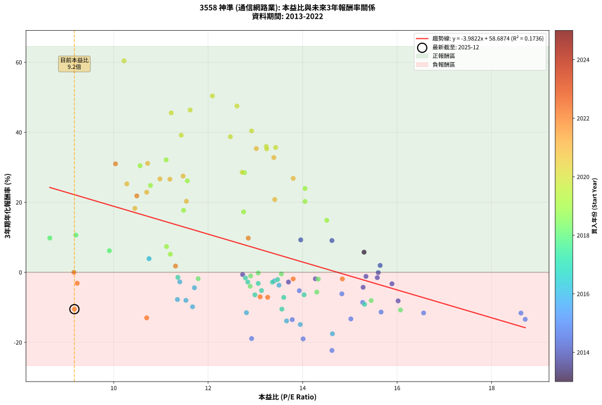
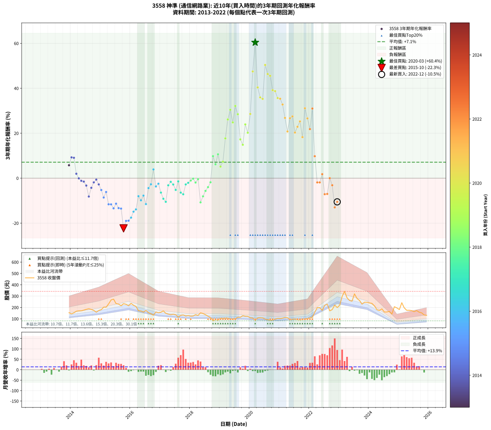

# 3558 神準 - 本益比與未來報酬率分析

!!! info "報告資訊"
    - **股票代號**: 3558
    - **公司名稱**: 神準
    - **產業別**: 通信網路業
    - **分析期間**: 2013-2022 (109 個數據點)
    - **資料來源**: Type 12 (ShowMonthlyK_ChartFlow) 月收盤價與本益比
    - **報酬率口徑**: 含現金股利 (簡化: 年度合計，假設每年7/1入帳)
    - **報告生成時間**: 2026-01-12 21:08:56 CST

## 📈 視覺化圖表

### 圖表1: 本益比 vs 未來報酬率關係

*圖表1：3558 神準 本益比與3年期未來報酬率關係 (2013-2022)*

### 圖表2: 歷年買入時點的3年期實際報酬率

*圖表2：3558 神準 歷年買入時點的3年期實際報酬率 (2013-2022)*

## 📍 買點訊號說明

本報告提供兩種買點提示訊號（顯示於圖表2的股價子圖中）：

### ▲ 小綠色三角形（回測驗證）
- **計算方式**: 使用全部歷史資料計算本益比第25百分位數
- **用途**: 事後驗證，顯示歷史上哪些時點確實為低估區
- **限制**: 當下無法判斷，僅供回測參考
- **特性**: 後見之明（Look-Ahead Bias）

### ▲ 小橘色三角形（即時訊號）
- **計算方式**: 使用截至當月的過去5年資料計算本益比第25百分位數
- **用途**: 實際投資決策，當時即可判斷
- **優勢**: 可操作性強，符合實務需求
- **特性**: 無後見之明，滾動窗口計算

!!! tip "如何使用兩種訊號"
    - **綠色▲** 幫助理解歷史估值機會，驗證策略有效性
    - **橘色▲** 可作為實際買進參考，但仍需搭配基本面分析
    - 兩種訊號重疊時，表示即時判斷與事後驗證一致，信心度較高
    - 僅有綠色▲時，表示當時無法判斷（需要未來資料才能確認）
    - 僅有橘色▲時，表示即時判斷為買點，但事後可能不是最佳時機

## 📊 估值分析摘要

| 指標 | 數值 |
|:---:|:---:|
| **目前本益比** (2022-12) | **9.17 倍** |
| **歷史平均本益比** | 12.95 倍 |
| **估值水準** | 🟢 相對低估 |
| **預期3年年化報酬率** | **+22.17%** |
| **歷史平均報酬率** | +7.11% |
| **相關係數 (R²)** | 0.1736 |
| **趨勢線斜率** | -3.9822 |

!!! abstract "核心洞察"
    目前本益比顯著低於歷史平均，預期未來報酬率可能較高

    根據歷史數據回測，3558 神準 在目前本益比 **9.2倍** 的估值水準下，
    預期未來3年年化報酬率約為 **+22.2%**。

    **重要提醒**: 本分析基於歷史數據統計，實際報酬率會受到公司基本面變化、產業趨勢、
    總體經濟環境等多重因素影響。R² = 0.17 表示本益比可解釋約 17.4% 的報酬率變異。

## 📈 歷史估值統計

### 最佳買點 (最高報酬率)

| 項目 | 數值 |
|:---:|:---:|
| 起始時間 | 2020-03 |
| 當時本益比 | 10.22 倍 |
| 起始價格 | 85.9 元 |
| 3年後價格 | 342.0 元 |
| **3年年化報酬率** | **+60.41%** |

### 最差買點 (最低報酬率)

| 項目 | 數值 |
|:---:|:---:|
| 起始時間 | 2015-10 |
| 當時本益比 | 14.62 倍 |
| 起始價格 | 233.0 元 |
| 3年後價格 | 82.2 元 |
| **3年年化報酬率** | **-22.32%** |

## 🎯 投資啟示

### 本益比與報酬率關係

趨勢線方程式: **y = -3.9822x + 58.6874**

!!! warning "強負相關"
    本益比與未來報酬率呈現強負相關。在高本益比時期買入，未來報酬率顯著較低；
    在低本益比時期買入，未來報酬率顯著較高。**估值紀律至關重要**。

### 估值區間建議

基於歷史數據分析:

- **🟢 低估區** (P/E < 10.4): 預期報酬率較高，可考慮增加持股
- **🟡 合理區** (P/E 10.4-15.5): 預期報酬率符合長期趨勢，正常持有
- **🔴 高估區** (P/E > 15.5): 預期報酬率較低，可考慮減碼或觀望

!!! danger "風險提示"
    - 過去表現不代表未來結果
    - 本分析假設公司基本面無重大結構性變化
    - 產業環境劇變可能使歷史規律失效
    - 應結合公司財報、產業趨勢、總體經濟等多重因素綜合判斷

!!! success "長期投資觀點"
    歷史數據顯示，在合理或低估的估值水準買入並長期持有，
    往往能獲得較佳的投資報酬。**耐心等待好價格**是價值投資的核心原則。

## 📊 數據品質

- **資料來源**: GoodInfo.tw Type 12 (ShowMonthlyK_ChartFlow)
- **資料頻率**: 月度收盤價與本益比
- **回測期間**: 2013-2022
- **數據點數量**: 109 個 (每個點代表一次3年期回測)

### 計算方法說明

1. **3年期年化報酬率**:
   - 對每個歷史時點，計算其後3年的實際投資報酬率
   - 期末價值(不含股利): 期末價格
   - 期末價值(含現金股利): 期末價格 + 持有期間內的現金股利合計 (簡化: 年度合計，假設每年7/1入帳)
   - 公式: 年化報酬率 = [(期末價值/期初價格)^(1/年數) - 1] × 100%

2. **本益比 (P/E Ratio)**:
   - 使用當時的月收盤價與EPS計算
   - 資料來源: Type 12 月度河流圖本益比數據

3. **趨勢線 (Linear Regression)**:
   - 使用最小平方法擬合線性趨勢線
   - R²值衡量本益比對報酬率的解釋能力

---

*本報告由 Stock Analysis System v1.9.0 自動生成*
*數據更新時間: 2026-01-12 21:08:56 CST*

## 📋 月度回測明細表

（每一列對應時間線圖中的一個買入點；可用來對照 SVG 圖上的每個點。）

| 買入月份 | 賣出月份 | 回測期限_年 | 實際持有年數 | 買入本益比_倍 | 買入收盤價_元 | 賣出收盤價_元 | 現金股利合計_元 | 總報酬率_pct | 年化報酬率_pct |
| --- | --- | --- | --- | --- | --- | --- | --- | --- | --- |
| 2013-12 | 2016-12 | 3 | 3.001 | 15.30 | 153.50 | 153.00 | 28.56 | +18.28 | +5.76 |
| 2014-01 | 2017-01 | 3 | 3.001 | 13.96 | 143.00 | 158.00 | 28.56 | +30.46 | +9.27 |
| 2014-02 | 2017-02 | 3 | 3.001 | 14.62 | 153.00 | 170.00 | 28.56 | +29.78 | +9.08 |
| 2014-03 | 2017-03 | 3 | 3.001 | 15.64 | 167.00 | 148.50 | 28.56 | +6.03 | +1.97 |
| 2014-04 | 2017-04 | 3 | 3.001 | 15.60 | 170.00 | 141.00 | 28.56 | -0.26 | -0.09 |
| 2014-05 | 2017-05 | 3 | 3.001 | 15.34 | 170.50 | 136.00 | 28.56 | -3.48 | -1.17 |
| 2014-06 | 2017-06 | 3 | 3.001 | 15.58 | 176.50 | 140.00 | 28.56 | -4.50 | -1.52 |
| 2014-07 | 2017-07 | 3 | 3.001 | 15.89 | 183.50 | 135.50 | 30.49 | -9.54 | -3.29 |
| 2014-08 | 2017-08 | 3 | 3.001 | 16.02 | 188.50 | 115.50 | 30.49 | -22.55 | -8.16 |
| 2014-09 | 2017-09 | 3 | 3.001 | 15.28 | 183.00 | 130.00 | 30.49 | -12.30 | -4.28 |
| 2014-10 | 2017-10 | 3 | 3.001 | 14.27 | 174.00 | 134.00 | 30.49 | -5.46 | -1.86 |
| 2014-11 | 2017-11 | 3 | 3.001 | 12.73 | 158.00 | 124.50 | 30.49 | -1.90 | -0.64 |
| 2014-12 | 2017-12 | 3 | 3.001 | 13.70 | 173.00 | 128.50 | 30.49 | -8.10 | -2.77 |
| 2015-01 | 2018-01 | 3 | 3.001 | 13.93 | 180.50 | 123.00 | 30.49 | -14.96 | -5.26 |
| 2015-02 | 2018-02 | 3 | 3.001 | 15.27 | 203.00 | 124.50 | 30.49 | -23.65 | -8.60 |
| 2015-03 | 2018-03 | 3 | 3.001 | 14.83 | 202.00 | 136.50 | 30.49 | -17.33 | -6.15 |
| 2015-04 | 2018-04 | 3 | 3.001 | 16.56 | 231.00 | 129.00 | 30.49 | -30.96 | -11.61 |
| 2015-05 | 2018-05 | 3 | 3.001 | 18.62 | 266.00 | 153.00 | 30.49 | -31.02 | -11.64 |
| 2015-06 | 2018-06 | 3 | 3.001 | 18.71 | 273.50 | 147.00 | 30.49 | -35.10 | -13.42 |
| 2015-07 | 2018-07 | 3 | 3.001 | 15.66 | 234.00 | 136.00 | 27.00 | -30.34 | -11.35 |
| 2015-08 | 2018-08 | 3 | 3.001 | 15.02 | 229.50 | 122.50 | 27.00 | -34.86 | -13.31 |
| 2015-09 | 2018-09 | 3 | 3.001 | 13.78 | 215.00 | 112.00 | 27.00 | -35.35 | -13.53 |
| 2015-10 | 2018-10 | 3 | 3.001 | 14.62 | 233.00 | 82.20 | 27.00 | -53.13 | -22.32 |
| 2015-11 | 2018-11 | 3 | 3.001 | 14.01 | 228.00 | 94.10 | 27.00 | -46.89 | -19.01 |
| 2015-12 | 2018-12 | 3 | 3.001 | 12.92 | 214.50 | 87.30 | 27.00 | -46.71 | -18.92 |
| 2016-01 | 2019-01 | 3 | 3.001 | 14.63 | 236.50 | 105.50 | 27.00 | -43.97 | -17.56 |
| 2016-02 | 2019-03 | 3 | 3.080 | 13.95 | 219.50 | 106.50 | 27.00 | -39.18 | -14.91 |
| 2016-03 | 2019-03 | 3 | 2.998 | 13.66 | 209.00 | 106.50 | 27.00 | -36.12 | -13.89 |
| 2016-04 | 2019-04 | 3 | 2.998 | 11.53 | 171.50 | 106.50 | 27.00 | -22.16 | -8.02 |
| 2016-05 | 2019-05 | 3 | 2.998 | 11.67 | 168.50 | 96.50 | 27.00 | -26.71 | -9.84 |
| 2016-06 | 2019-06 | 3 | 2.998 | 11.35 | 159.00 | 97.80 | 27.00 | -21.51 | -7.76 |
| 2016-07 | 2019-07 | 3 | 2.998 | 12.81 | 174.00 | 100.00 | 20.50 | -30.75 | -11.53 |
| 2016-08 | 2019-08 | 3 | 2.998 | 11.71 | 154.00 | 114.00 | 20.50 | -12.66 | -4.42 |
| 2016-09 | 2019-09 | 3 | 2.998 | 11.40 | 145.00 | 113.00 | 20.50 | -7.93 | -2.72 |
| 2016-10 | 2019-10 | 3 | 2.998 | 10.75 | 132.00 | 127.50 | 20.50 | +12.12 | +3.89 |
| 2016-11 | 2019-11 | 3 | 2.998 | 13.50 | 160.00 | 122.50 | 20.50 | -10.62 | -3.68 |
| 2016-12 | 2019-12 | 3 | 2.998 | 13.40 | 153.00 | 121.50 | 20.50 | -7.19 | -2.46 |
| 2017-01 | 2020-01 | 3 | 2.998 | 14.03 | 158.00 | 109.00 | 20.50 | -18.04 | -6.42 |
| 2017-02 | 2020-02 | 3 | 2.998 | 15.31 | 170.00 | 107.00 | 20.50 | -25.00 | -9.15 |
| 2017-03 | 2020-03 | 3 | 3.001 | 13.56 | 148.50 | 85.90 | 20.50 | -28.35 | -10.52 |
| 2017-04 | 2020-04 | 3 | 3.001 | 13.06 | 141.00 | 107.50 | 20.50 | -9.22 | -3.17 |
| 2017-05 | 2020-05 | 3 | 3.001 | 12.79 | 136.00 | 109.00 | 20.50 | -4.78 | -1.62 |
| 2017-06 | 2020-06 | 3 | 3.001 | 13.36 | 140.00 | 108.00 | 20.50 | -8.21 | -2.82 |
| 2017-07 | 2020-07 | 3 | 3.001 | 13.13 | 135.50 | 97.70 | 17.70 | -14.83 | -5.21 |
| 2017-08 | 2020-08 | 3 | 3.001 | 11.36 | 115.50 | 92.90 | 17.70 | -4.24 | -1.43 |
| 2017-09 | 2020-09 | 3 | 3.001 | 12.99 | 130.00 | 88.80 | 17.70 | -18.08 | -6.43 |
| 2017-10 | 2020-10 | 3 | 3.001 | 13.60 | 134.00 | 89.50 | 17.70 | -20.00 | -7.17 |
| 2017-11 | 2020-11 | 3 | 3.001 | 12.84 | 124.50 | 96.70 | 17.70 | -8.11 | -2.78 |
| 2017-12 | 2020-12 | 3 | 3.001 | 13.47 | 128.50 | 103.00 | 17.70 | -6.07 | -2.07 |
| 2018-01 | 2021-01 | 3 | 3.001 | 12.90 | 123.00 | 101.50 | 17.70 | -3.09 | -1.04 |
| 2018-02 | 2021-02 | 3 | 3.001 | 13.06 | 124.50 | 106.00 | 17.70 | -0.64 | -0.21 |
| 2018-03 | 2021-03 | 3 | 3.001 | 14.33 | 136.50 | 111.00 | 17.70 | -5.71 | -1.94 |
| 2018-04 | 2021-04 | 3 | 3.001 | 13.55 | 129.00 | 109.50 | 17.70 | -1.40 | -0.47 |
| 2018-05 | 2021-05 | 3 | 3.001 | 16.07 | 153.00 | 91.00 | 17.70 | -28.95 | -10.77 |
| 2018-06 | 2021-06 | 3 | 3.001 | 15.45 | 147.00 | 96.50 | 17.70 | -22.31 | -8.07 |
| 2018-07 | 2021-07 | 3 | 3.001 | 14.30 | 136.00 | 98.50 | 15.70 | -16.03 | -5.66 |
| 2018-08 | 2021-08 | 3 | 3.001 | 12.89 | 122.50 | 92.70 | 15.70 | -11.51 | -3.99 |
| 2018-09 | 2021-09 | 3 | 3.001 | 11.79 | 112.00 | 90.30 | 15.70 | -5.36 | -1.82 |
| 2018-10 | 2021-10 | 3 | 3.001 | 8.65 | 82.20 | 93.10 | 15.70 | +32.36 | +9.79 |
| 2018-11 | 2021-11 | 3 | 3.001 | 9.91 | 94.10 | 96.90 | 15.70 | +19.66 | +6.16 |
| 2018-12 | 2021-12 | 3 | 3.001 | 9.20 | 87.30 | 102.50 | 15.70 | +35.40 | +10.63 |
| 2019-01 | 2022-01 | 3 | 3.001 | 11.20 | 105.50 | 107.00 | 15.70 | +16.30 | +5.16 |
| 2019-02 | 2022-02 | 3 | 3.001 | 11.12 | 104.00 | 113.00 | 15.70 | +23.75 | +7.36 |
| 2019-03 | 2022-03 | 3 | 3.001 | 11.48 | 106.50 | 158.00 | 15.70 | +63.10 | +17.71 |
| 2019-04 | 2022-04 | 3 | 3.001 | 11.56 | 106.50 | 198.00 | 15.70 | +100.66 | +26.12 |
| 2019-05 | 2022-05 | 3 | 3.001 | 10.56 | 96.50 | 198.50 | 15.70 | +121.97 | +30.44 |
| 2019-06 | 2022-06 | 3 | 3.001 | 10.78 | 97.80 | 174.50 | 15.70 | +94.48 | +24.82 |
| 2019-07 | 2022-07 | 3 | 3.001 | 11.11 | 100.00 | 218.50 | 12.20 | +130.70 | +32.13 |
| 2019-08 | 2022-08 | 3 | 3.001 | 12.77 | 114.00 | 229.50 | 12.20 | +112.02 | +28.46 |
| 2019-09 | 2022-09 | 3 | 3.001 | 12.75 | 113.00 | 170.00 | 12.20 | +61.24 | +17.26 |
| 2019-10 | 2022-10 | 3 | 3.001 | 14.51 | 127.50 | 181.00 | 12.20 | +51.53 | +14.86 |
| 2019-11 | 2022-11 | 3 | 3.001 | 14.05 | 122.50 | 221.00 | 12.20 | +90.37 | +23.93 |
| 2019-12 | 2022-12 | 3 | 3.001 | 14.05 | 121.50 | 199.00 | 12.20 | +73.83 | +20.23 |
| 2020-01 | 2023-01 | 3 | 3.001 | 12.72 | 109.00 | 219.50 | 12.20 | +112.57 | +28.57 |
| 2020-02 | 2023-03 | 3 | 3.080 | 12.61 | 107.00 | 342.00 | 12.20 | +231.03 | +47.50 |
| 2020-03 | 2023-03 | 3 | 2.998 | 10.22 | 85.90 | 342.00 | 12.20 | +312.34 | +60.41 |
| 2020-04 | 2023-04 | 3 | 2.998 | 12.92 | 107.50 | 285.00 | 12.20 | +176.47 | +40.38 |
| 2020-05 | 2023-05 | 3 | 2.998 | 13.23 | 109.00 | 261.50 | 12.20 | +151.10 | +35.95 |
| 2020-06 | 2023-06 | 3 | 2.998 | 13.24 | 108.00 | 255.00 | 12.20 | +147.41 | +35.28 |
| 2020-07 | 2023-07 | 3 | 2.998 | 12.09 | 97.70 | 320.00 | 12.00 | +239.82 | +50.38 |
| 2020-08 | 2023-08 | 3 | 2.998 | 11.62 | 92.90 | 279.00 | 12.00 | +213.24 | +46.35 |
| 2020-09 | 2023-09 | 3 | 2.998 | 11.22 | 88.80 | 261.50 | 12.00 | +208.00 | +45.53 |
| 2020-10 | 2023-10 | 3 | 2.998 | 11.43 | 89.50 | 229.00 | 12.00 | +169.27 | +39.15 |
| 2020-11 | 2023-11 | 3 | 2.998 | 12.47 | 96.70 | 246.00 | 12.00 | +166.80 | +38.73 |
| 2020-12 | 2023-12 | 3 | 2.998 | 13.43 | 103.00 | 245.00 | 12.00 | +149.51 | +35.66 |
| 2021-01 | 2024-01 | 3 | 2.998 | 13.02 | 101.50 | 239.50 | 12.00 | +147.78 | +35.35 |
| 2021-02 | 2024-02 | 3 | 2.998 | 13.39 | 106.00 | 236.00 | 12.00 | +133.96 | +32.78 |
| 2021-03 | 2024-03 | 3 | 3.001 | 13.80 | 111.00 | 214.50 | 12.00 | +104.05 | +26.83 |
| 2021-04 | 2024-04 | 3 | 3.001 | 13.41 | 109.50 | 181.00 | 12.00 | +76.26 | +20.79 |
| 2021-05 | 2024-05 | 3 | 3.001 | 10.98 | 91.00 | 173.00 | 12.00 | +103.30 | +26.67 |
| 2021-06 | 2024-06 | 3 | 3.001 | 11.47 | 96.50 | 188.00 | 12.00 | +107.25 | +27.49 |
| 2021-07 | 2024-07 | 3 | 3.001 | 11.54 | 98.50 | 159.50 | 12.00 | +74.11 | +20.30 |
| 2021-08 | 2024-08 | 3 | 3.001 | 10.70 | 92.70 | 160.00 | 12.00 | +85.54 | +22.87 |
| 2021-09 | 2024-09 | 3 | 3.001 | 10.28 | 90.30 | 165.50 | 12.00 | +96.57 | +25.26 |
| 2021-10 | 2024-10 | 3 | 3.001 | 10.45 | 93.10 | 142.00 | 12.00 | +65.41 | +18.26 |
| 2021-11 | 2024-11 | 3 | 3.001 | 10.72 | 96.90 | 206.50 | 12.00 | +125.49 | +31.12 |
| 2021-12 | 2024-12 | 3 | 3.001 | 11.19 | 102.50 | 196.00 | 12.00 | +102.93 | +26.60 |
| 2022-01 | 2025-01 | 3 | 3.001 | 10.49 | 107.00 | 181.50 | 12.00 | +80.84 | +21.83 |
| 2022-02 | 2025-02 | 3 | 3.001 | 10.04 | 113.00 | 242.00 | 12.00 | +124.78 | +30.99 |
| 2022-03 | 2025-03 | 3 | 3.001 | 12.85 | 158.00 | 197.00 | 12.00 | +32.28 | +9.77 |
| 2022-04 | 2025-04 | 3 | 3.001 | 14.84 | 198.00 | 175.00 | 12.00 | -5.56 | -1.89 |
| 2022-05 | 2025-05 | 3 | 3.001 | 13.80 | 198.50 | 175.50 | 12.00 | -5.54 | -1.88 |
| 2022-06 | 2025-06 | 3 | 3.001 | 11.31 | 174.50 | 172.00 | 12.00 | +5.44 | +1.78 |
| 2022-07 | 2025-07 | 3 | 3.001 | 13.26 | 218.50 | 163.00 | 12.00 | -19.91 | -7.13 |
| 2022-08 | 2025-08 | 3 | 3.001 | 13.10 | 229.50 | 172.50 | 12.00 | -19.61 | -7.02 |
| 2022-09 | 2025-09 | 3 | 3.001 | 9.16 | 170.00 | 158.00 | 12.00 | +0.00 | +0.00 |
| 2022-10 | 2025-10 | 3 | 3.001 | 9.23 | 181.00 | 152.50 | 12.00 | -9.12 | -3.14 |
| 2022-11 | 2025-11 | 3 | 3.001 | 10.70 | 221.00 | 133.50 | 12.00 | -34.16 | -13.00 |
| 2022-12 | 2025-12 | 3 | 3.001 | 9.17 | 199.00 | 130.50 | 12.00 | -28.39 | -10.53 |
