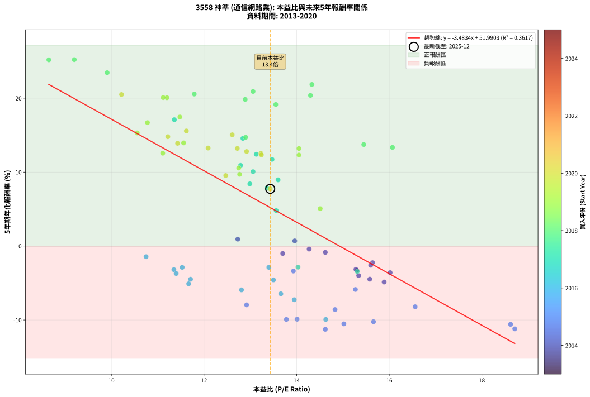
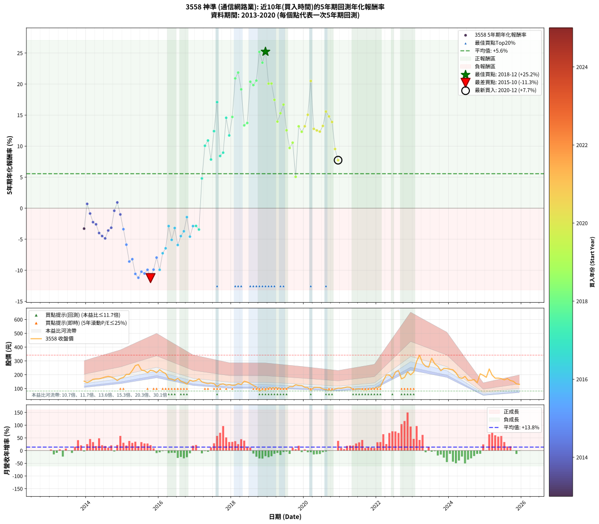

# 3558 神準 - 本益比與未來報酬率分析

!!! info "報告資訊"
    - **股票代號**: 3558
    - **公司名稱**: 神準
    - **產業別**: 通信網路業
    - **分析期間**: 2013-2020 (85 個數據點)
    - **資料來源**: Type 12 (ShowMonthlyK_ChartFlow) 月收盤價與本益比
    - **報酬率口徑**: 含現金股利 (簡化: 年度合計，假設每年7/1入帳)
    - **報告生成時間**: 2026-01-11 21:05:30 CST

## 📈 視覺化圖表

### 圖表1: 本益比 vs 未來報酬率關係

*圖表1：3558 神準 本益比與5年期未來報酬率關係 (2013-2020)*

### 圖表2: 歷年買入時點的5年期實際報酬率

*圖表2：3558 神準 歷年買入時點的5年期實際報酬率 (2013-2020)*

## 📍 買點訊號說明

本報告提供兩種買點提示訊號（顯示於圖表2的股價子圖中）：

### ▲ 小綠色三角形（回測驗證）
- **計算方式**: 使用全部歷史資料計算本益比第25百分位數
- **用途**: 事後驗證，顯示歷史上哪些時點確實為低估區
- **限制**: 當下無法判斷，僅供回測參考
- **特性**: 後見之明（Look-Ahead Bias）

### ▲ 小橘色三角形（即時訊號）
- **計算方式**: 使用截至當月的過去5年資料計算本益比第25百分位數
- **用途**: 實際投資決策，當時即可判斷
- **優勢**: 可操作性強，符合實務需求
- **特性**: 無後見之明，滾動窗口計算

!!! tip "如何使用兩種訊號"
    - **綠色▲** 幫助理解歷史估值機會，驗證策略有效性
    - **橘色▲** 可作為實際買進參考，但仍需搭配基本面分析
    - 兩種訊號重疊時，表示即時判斷與事後驗證一致，信心度較高
    - 僅有綠色▲時，表示當時無法判斷（需要未來資料才能確認）
    - 僅有橘色▲時，表示即時判斷為買點，但事後可能不是最佳時機

## 📊 估值分析摘要

| 指標 | 數值 |
|:---:|:---:|
| **目前本益比** (2020-12) | **13.43 倍** |
| **歷史平均本益比** | 13.33 倍 |
| **估值水準** | 🟡 合理範圍 |
| **預期5年年化報酬率** | **+5.21%** |
| **歷史平均報酬率** | +5.56% |
| **相關係數 (R²)** | 0.3617 |
| **趨勢線斜率** | -3.4834 |

!!! abstract "核心洞察"
    目前本益比接近歷史平均，預期報酬率符合長期趨勢

    根據歷史數據回測，3558 神準 在目前本益比 **13.4倍** 的估值水準下，
    預期未來5年年化報酬率約為 **+5.2%**。

    **重要提醒**: 本分析基於歷史數據統計，實際報酬率會受到公司基本面變化、產業趨勢、
    總體經濟環境等多重因素影響。R² = 0.36 表示本益比可解釋約 36.2% 的報酬率變異。

## 📈 歷史估值統計

### 最佳買點 (最高報酬率)

| 項目 | 數值 |
|:---:|:---:|
| 起始時間 | 2018-12 |
| 當時本益比 | 9.20 倍 |
| 起始價格 | 87.3 元 |
| 5年後價格 | 245.0 元 |
| **5年年化報酬率** | **+25.22%** |

### 最差買點 (最低報酬率)

| 項目 | 數值 |
|:---:|:---:|
| 起始時間 | 2015-10 |
| 當時本益比 | 14.62 倍 |
| 起始價格 | 233.0 元 |
| 5年後價格 | 89.5 元 |
| **5年年化報酬率** | **-11.26%** |

## 🎯 投資啟示

### 本益比與報酬率關係

趨勢線方程式: **y = -3.4834x + 51.9903**

!!! warning "強負相關"
    本益比與未來報酬率呈現強負相關。在高本益比時期買入，未來報酬率顯著較低；
    在低本益比時期買入，未來報酬率顯著較高。**估值紀律至關重要**。

### 估值區間建議

基於歷史數據分析:

- **🟢 低估區** (P/E < 10.7): 預期報酬率較高，可考慮增加持股
- **🟡 合理區** (P/E 10.7-16.0): 預期報酬率符合長期趨勢，正常持有
- **🔴 高估區** (P/E > 16.0): 預期報酬率較低，可考慮減碼或觀望

!!! danger "風險提示"
    - 過去表現不代表未來結果
    - 本分析假設公司基本面無重大結構性變化
    - 產業環境劇變可能使歷史規律失效
    - 應結合公司財報、產業趨勢、總體經濟等多重因素綜合判斷

!!! success "長期投資觀點"
    歷史數據顯示，在合理或低估的估值水準買入並長期持有，
    往往能獲得較佳的投資報酬。**耐心等待好價格**是價值投資的核心原則。

## 📊 數據品質

- **資料來源**: GoodInfo.tw Type 12 (ShowMonthlyK_ChartFlow)
- **資料頻率**: 月度收盤價與本益比
- **回測期間**: 2013-2020
- **數據點數量**: 85 個 (每個點代表一次5年期回測)

### 計算方法說明

1. **5年期年化報酬率**:
   - 對每個歷史時點，計算其後5年的實際投資報酬率
   - 期末價值(不含股利): 期末價格
   - 期末價值(含現金股利): 期末價格 + 持有期間內的現金股利合計 (簡化: 年度合計，假設每年7/1入帳)
   - 公式: 年化報酬率 = [(期末價值/期初價格)^(1/年數) - 1] × 100%

2. **本益比 (P/E Ratio)**:
   - 使用當時的月收盤價與EPS計算
   - 資料來源: Type 12 月度河流圖本益比數據

3. **趨勢線 (Linear Regression)**:
   - 使用最小平方法擬合線性趨勢線
   - R²值衡量本益比對報酬率的解釋能力

---

*本報告由 Stock Analysis System v1.9.0 自動生成*
*數據更新時間: 2026-01-11 21:05:30 CST*

## 📋 月度回測明細表

（每一列對應時間線圖中的一個買入點；可用來對照 SVG 圖上的每個點。）

| 買入月份 | 賣出月份 | 回測期限_年 | 實際持有年數 | 買入本益比_倍 | 買入收盤價_元 | 賣出收盤價_元 | 現金股利合計_元 | 總報酬率_pct | 年化報酬率_pct |
| --- | --- | --- | --- | --- | --- | --- | --- | --- | --- |
| 2013-12 | 2018-12 | 5 | 4.999 | 15.30 | 153.50 | 87.30 | 42.56 | -15.40 | -3.29 |
| 2014-01 | 2019-01 | 5 | 4.999 | 13.96 | 143.00 | 105.50 | 42.56 | +3.54 | +0.70 |
| 2014-02 | 2019-02 | 5 | 4.999 | 14.62 | 153.00 | 104.00 | 42.56 | -4.21 | -0.86 |
| 2014-03 | 2019-03 | 5 | 4.999 | 15.64 | 167.00 | 106.50 | 42.56 | -10.74 | -2.25 |
| 2014-04 | 2019-04 | 5 | 4.999 | 15.60 | 170.00 | 106.50 | 42.56 | -12.32 | -2.59 |
| 2014-05 | 2019-05 | 5 | 4.999 | 15.34 | 170.50 | 96.50 | 42.56 | -18.44 | -3.99 |
| 2014-06 | 2019-06 | 5 | 4.999 | 15.58 | 176.50 | 97.80 | 42.56 | -20.47 | -4.48 |
| 2014-07 | 2019-07 | 5 | 4.999 | 15.89 | 183.50 | 100.00 | 42.99 | -22.08 | -4.87 |
| 2014-08 | 2019-08 | 5 | 4.999 | 16.02 | 188.50 | 114.00 | 42.99 | -16.72 | -3.59 |
| 2014-09 | 2019-09 | 5 | 4.999 | 15.28 | 183.00 | 113.00 | 42.99 | -14.76 | -3.14 |
| 2014-10 | 2019-10 | 5 | 4.999 | 14.27 | 174.00 | 127.50 | 42.99 | -2.02 | -0.41 |
| 2014-11 | 2019-11 | 5 | 4.999 | 12.73 | 158.00 | 122.50 | 42.99 | +4.74 | +0.93 |
| 2014-12 | 2019-12 | 5 | 4.999 | 13.70 | 173.00 | 121.50 | 42.99 | -4.92 | -1.00 |
| 2015-01 | 2020-01 | 5 | 4.999 | 13.93 | 180.50 | 109.00 | 42.99 | -15.79 | -3.38 |
| 2015-02 | 2020-02 | 5 | 4.999 | 15.27 | 203.00 | 107.00 | 42.99 | -26.11 | -5.87 |
| 2015-03 | 2020-03 | 5 | 5.002 | 14.83 | 202.00 | 85.90 | 42.99 | -36.19 | -8.59 |
| 2015-04 | 2020-04 | 5 | 5.002 | 16.56 | 231.00 | 107.50 | 42.99 | -34.85 | -8.21 |
| 2015-05 | 2020-05 | 5 | 5.002 | 18.62 | 266.00 | 109.00 | 42.99 | -42.86 | -10.59 |
| 2015-06 | 2020-06 | 5 | 5.002 | 18.71 | 273.50 | 108.00 | 42.99 | -44.79 | -11.20 |
| 2015-07 | 2020-07 | 5 | 5.002 | 15.66 | 234.00 | 97.70 | 38.70 | -41.71 | -10.23 |
| 2015-08 | 2020-08 | 5 | 5.002 | 15.02 | 229.50 | 92.90 | 38.70 | -42.66 | -10.52 |
| 2015-09 | 2020-09 | 5 | 5.002 | 13.78 | 215.00 | 88.80 | 38.70 | -40.70 | -9.92 |
| 2015-10 | 2020-10 | 5 | 5.002 | 14.62 | 233.00 | 89.50 | 38.70 | -44.98 | -11.26 |
| 2015-11 | 2020-11 | 5 | 5.002 | 14.01 | 228.00 | 96.70 | 38.70 | -40.61 | -9.89 |
| 2015-12 | 2020-12 | 5 | 5.002 | 12.92 | 214.50 | 103.00 | 38.70 | -33.94 | -7.95 |
| 2016-01 | 2021-01 | 5 | 5.002 | 14.63 | 236.50 | 101.50 | 38.70 | -40.72 | -9.93 |
| 2016-02 | 2021-03 | 5 | 5.081 | 13.95 | 219.50 | 111.00 | 38.70 | -31.80 | -7.26 |
| 2016-03 | 2021-03 | 5 | 4.999 | 13.66 | 209.00 | 111.00 | 38.70 | -28.37 | -6.46 |
| 2016-04 | 2021-04 | 5 | 4.999 | 11.53 | 171.50 | 109.50 | 38.70 | -13.59 | -2.88 |
| 2016-05 | 2021-05 | 5 | 4.999 | 11.67 | 168.50 | 91.00 | 38.70 | -23.03 | -5.10 |
| 2016-06 | 2021-06 | 5 | 4.999 | 11.35 | 159.00 | 96.50 | 38.70 | -14.97 | -3.19 |
| 2016-07 | 2021-07 | 5 | 4.999 | 12.81 | 174.00 | 98.50 | 29.70 | -26.32 | -5.93 |
| 2016-08 | 2021-08 | 5 | 4.999 | 11.71 | 154.00 | 92.70 | 29.70 | -20.52 | -4.49 |
| 2016-09 | 2021-09 | 5 | 4.999 | 11.40 | 145.00 | 90.30 | 29.70 | -17.24 | -3.71 |
| 2016-10 | 2021-10 | 5 | 4.999 | 10.75 | 132.00 | 93.10 | 29.70 | -6.97 | -1.43 |
| 2016-11 | 2021-11 | 5 | 4.999 | 13.50 | 160.00 | 96.90 | 29.70 | -20.87 | -4.58 |
| 2016-12 | 2021-12 | 5 | 4.999 | 13.40 | 153.00 | 102.50 | 29.70 | -13.59 | -2.88 |
| 2017-01 | 2022-01 | 5 | 4.999 | 14.03 | 158.00 | 107.00 | 29.70 | -13.48 | -2.85 |
| 2017-02 | 2022-02 | 5 | 4.999 | 15.31 | 170.00 | 113.00 | 29.70 | -16.06 | -3.44 |
| 2017-03 | 2022-03 | 5 | 4.999 | 13.56 | 148.50 | 158.00 | 29.70 | +26.40 | +4.80 |
| 2017-04 | 2022-04 | 5 | 4.999 | 13.06 | 141.00 | 198.00 | 29.70 | +61.49 | +10.06 |
| 2017-05 | 2022-05 | 5 | 4.999 | 12.79 | 136.00 | 198.50 | 29.70 | +67.79 | +10.91 |
| 2017-06 | 2022-06 | 5 | 4.999 | 13.36 | 140.00 | 174.50 | 29.70 | +45.86 | +7.84 |
| 2017-07 | 2022-07 | 5 | 4.999 | 13.13 | 135.50 | 218.50 | 24.70 | +79.48 | +12.41 |
| 2017-08 | 2022-08 | 5 | 4.999 | 11.36 | 115.50 | 229.50 | 24.70 | +120.09 | +17.09 |
| 2017-09 | 2022-09 | 5 | 4.999 | 12.99 | 130.00 | 170.00 | 24.70 | +49.77 | +8.41 |
| 2017-10 | 2022-10 | 5 | 4.999 | 13.60 | 134.00 | 181.00 | 24.70 | +53.51 | +8.95 |
| 2017-11 | 2022-11 | 5 | 4.999 | 12.84 | 124.50 | 221.00 | 24.70 | +97.35 | +14.57 |
| 2017-12 | 2022-12 | 5 | 4.999 | 13.47 | 128.50 | 199.00 | 24.70 | +74.09 | +11.73 |
| 2018-01 | 2023-01 | 5 | 4.999 | 12.90 | 123.00 | 219.50 | 24.70 | +98.54 | +14.70 |
| 2018-02 | 2023-02 | 5 | 4.999 | 13.06 | 124.50 | 297.00 | 24.70 | +158.39 | +20.91 |
| 2018-03 | 2023-03 | 5 | 4.999 | 14.33 | 136.50 | 342.00 | 24.70 | +168.64 | +21.86 |
| 2018-04 | 2023-04 | 5 | 4.999 | 13.55 | 129.00 | 285.00 | 24.70 | +140.08 | +19.15 |
| 2018-05 | 2023-05 | 5 | 4.999 | 16.07 | 153.00 | 261.50 | 24.70 | +87.06 | +13.35 |
| 2018-06 | 2023-06 | 5 | 4.999 | 15.45 | 147.00 | 255.00 | 24.70 | +90.27 | +13.73 |
| 2018-07 | 2023-07 | 5 | 4.999 | 14.30 | 136.00 | 320.00 | 23.70 | +152.72 | +20.38 |
| 2018-08 | 2023-08 | 5 | 4.999 | 12.89 | 122.50 | 279.00 | 23.70 | +147.10 | +19.84 |
| 2018-09 | 2023-09 | 5 | 4.999 | 11.79 | 112.00 | 261.50 | 23.70 | +154.64 | +20.56 |
| 2018-10 | 2023-10 | 5 | 4.999 | 8.65 | 82.20 | 229.00 | 23.70 | +207.42 | +25.19 |
| 2018-11 | 2023-11 | 5 | 4.999 | 9.91 | 94.10 | 246.00 | 23.70 | +186.61 | +23.44 |
| 2018-12 | 2023-12 | 5 | 4.999 | 9.20 | 87.30 | 245.00 | 23.70 | +207.79 | +25.22 |
| 2019-01 | 2024-01 | 5 | 4.999 | 11.20 | 105.50 | 239.50 | 23.70 | +149.48 | +20.07 |
| 2019-02 | 2024-02 | 5 | 4.999 | 11.12 | 104.00 | 236.00 | 23.70 | +149.71 | +20.09 |
| 2019-03 | 2024-03 | 5 | 5.002 | 11.48 | 106.50 | 214.50 | 23.70 | +123.66 | +17.46 |
| 2019-04 | 2024-04 | 5 | 5.002 | 11.56 | 106.50 | 181.00 | 23.70 | +92.21 | +13.95 |
| 2019-05 | 2024-05 | 5 | 5.002 | 10.56 | 96.50 | 173.00 | 23.70 | +103.83 | +15.30 |
| 2019-06 | 2024-06 | 5 | 5.002 | 10.78 | 97.80 | 188.00 | 23.70 | +116.46 | +16.69 |
| 2019-07 | 2024-07 | 5 | 5.002 | 11.11 | 100.00 | 159.50 | 21.20 | +80.70 | +12.56 |
| 2019-08 | 2024-08 | 5 | 5.002 | 12.77 | 114.00 | 160.00 | 21.20 | +58.95 | +9.71 |
| 2019-09 | 2024-09 | 5 | 5.002 | 12.75 | 113.00 | 165.50 | 21.20 | +65.22 | +10.56 |
| 2019-10 | 2024-10 | 5 | 5.002 | 14.51 | 127.50 | 142.00 | 21.20 | +28.00 | +5.06 |
| 2019-11 | 2024-11 | 5 | 5.002 | 14.05 | 122.50 | 206.50 | 21.20 | +85.88 | +13.19 |
| 2019-12 | 2024-12 | 5 | 5.002 | 14.05 | 121.50 | 196.00 | 21.20 | +78.77 | +12.31 |
| 2020-01 | 2025-01 | 5 | 5.002 | 12.72 | 109.00 | 181.50 | 21.20 | +85.96 | +13.20 |
| 2020-02 | 2025-03 | 5 | 5.081 | 12.61 | 107.00 | 197.00 | 21.20 | +103.93 | +15.05 |
| 2020-03 | 2025-03 | 5 | 4.999 | 10.22 | 85.90 | 197.00 | 21.20 | +154.02 | +20.50 |
| 2020-04 | 2025-04 | 5 | 4.999 | 12.92 | 107.50 | 175.00 | 21.20 | +82.51 | +12.79 |
| 2020-05 | 2025-05 | 5 | 4.999 | 13.23 | 109.00 | 175.50 | 21.20 | +80.46 | +12.53 |
| 2020-06 | 2025-06 | 5 | 4.999 | 13.24 | 108.00 | 172.00 | 21.20 | +78.89 | +12.34 |
| 2020-07 | 2025-07 | 5 | 4.999 | 12.09 | 97.70 | 163.00 | 19.00 | +86.28 | +13.25 |
| 2020-08 | 2025-08 | 5 | 4.999 | 11.62 | 92.90 | 172.50 | 19.00 | +106.14 | +15.57 |
| 2020-09 | 2025-09 | 5 | 4.999 | 11.22 | 88.80 | 158.00 | 19.00 | +99.32 | +14.79 |
| 2020-10 | 2025-10 | 5 | 4.999 | 11.43 | 89.50 | 152.50 | 19.00 | +91.62 | +13.89 |
| 2020-11 | 2025-11 | 5 | 4.999 | 12.47 | 96.70 | 133.50 | 19.00 | +57.70 | +9.54 |
| 2020-12 | 2025-12 | 5 | 4.999 | 13.43 | 103.00 | 130.50 | 19.00 | +45.15 | +7.74 |
