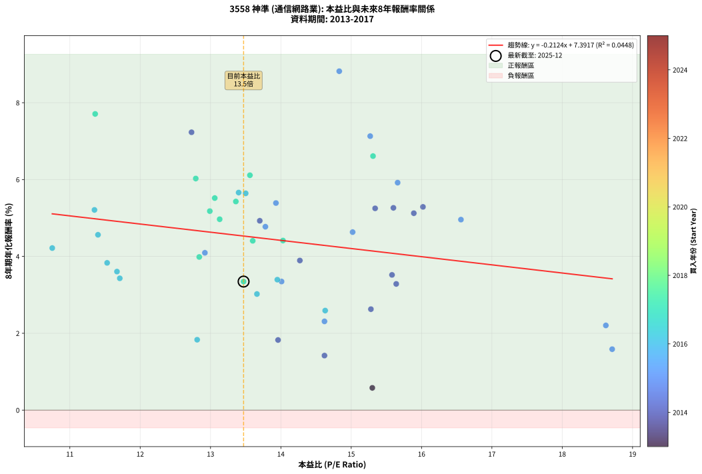
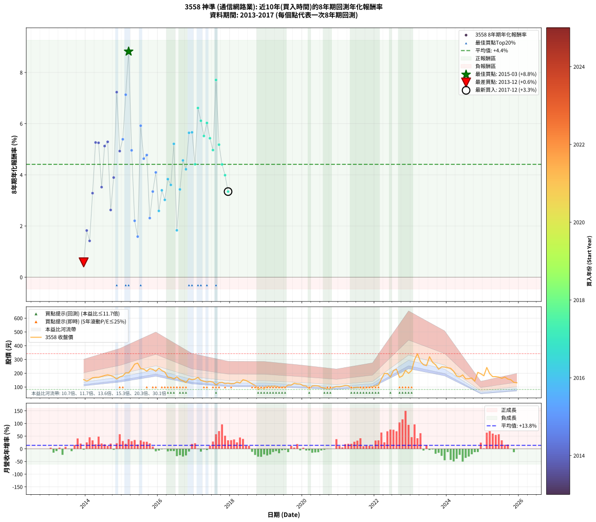

# 3558 神準 - 本益比與未來報酬率分析

!!! info "報告資訊"
    - **股票代號**: 3558
    - **公司名稱**: 神準
    - **產業別**: 通信網路業
    - **分析期間**: 2013-2017 (49 個數據點)
    - **資料來源**: Type 12 (ShowMonthlyK_ChartFlow) 月收盤價與本益比
    - **報酬率口徑**: 含現金股利 (簡化: 年度合計，假設每年7/1入帳)
    - **報告生成時間**: 2026-01-05 00:56:59 CST

## 📈 視覺化圖表

### 圖表1: 本益比 vs 未來報酬率關係

*圖表1：3558 神準 本益比與8年期未來報酬率關係 (2013-2017)*

### 圖表2: 歷年買入時點的8年期實際報酬率

*圖表2：3558 神準 歷年買入時點的8年期實際報酬率 (2013-2017)*

## 📍 買點訊號說明

本報告提供兩種買點提示訊號（顯示於圖表2的股價子圖中）：

### ▲ 小綠色三角形（回測驗證）
- **計算方式**: 使用全部歷史資料計算本益比第25百分位數
- **用途**: 事後驗證，顯示歷史上哪些時點確實為低估區
- **限制**: 當下無法判斷，僅供回測參考
- **特性**: 後見之明（Look-Ahead Bias）

### ▲ 小橘色三角形（即時訊號）
- **計算方式**: 使用截至當月的過去5年資料計算本益比第25百分位數
- **用途**: 實際投資決策，當時即可判斷
- **優勢**: 可操作性強，符合實務需求
- **特性**: 無後見之明，滾動窗口計算

!!! tip "如何使用兩種訊號"
    - **綠色▲** 幫助理解歷史估值機會，驗證策略有效性
    - **橘色▲** 可作為實際買進參考，但仍需搭配基本面分析
    - 兩種訊號重疊時，表示即時判斷與事後驗證一致，信心度較高
    - 僅有綠色▲時，表示當時無法判斷（需要未來資料才能確認）
    - 僅有橘色▲時，表示即時判斷為買點，但事後可能不是最佳時機

## 📊 估值分析摘要

| 指標 | 數值 |
|:---:|:---:|
| **目前本益比** (2017-12) | **13.47 倍** |
| **歷史平均本益比** | 14.04 倍 |
| **估值水準** | 🟡 合理範圍 |
| **預期8年年化報酬率** | **+4.53%** |
| **歷史平均報酬率** | +4.41% |
| **相關係數 (R²)** | 0.0448 |
| **趨勢線斜率** | -0.2124 |

!!! abstract "核心洞察"
    目前本益比接近歷史平均，預期報酬率符合長期趨勢

    根據歷史數據回測，3558 神準 在目前本益比 **13.5倍** 的估值水準下，
    預期未來8年年化報酬率約為 **+4.5%**。

    **重要提醒**: 本分析基於歷史數據統計，實際報酬率會受到公司基本面變化、產業趨勢、
    總體經濟環境等多重因素影響。R² = 0.04 表示本益比可解釋約 4.5% 的報酬率變異。

## 📈 歷史估值統計

### 最佳買點 (最高報酬率)

| 項目 | 數值 |
|:---:|:---:|
| 起始時間 | 2015-03 |
| 當時本益比 | 14.83 倍 |
| 起始價格 | 202.0 元 |
| 8年後價格 | 342.0 元 |
| **8年年化報酬率** | **+8.82%** |

### 最差買點 (最低報酬率)

| 項目 | 數值 |
|:---:|:---:|
| 起始時間 | 2013-12 |
| 當時本益比 | 15.30 倍 |
| 起始價格 | 153.5 元 |
| 8年後價格 | 102.5 元 |
| **8年年化報酬率** | **+0.58%** |

## 🎯 投資啟示

### 本益比與報酬率關係

趨勢線方程式: **y = -0.2124x + 7.3917**

!!! note "負相關"
    本益比與未來報酬率呈現負相關。較低的本益比通常帶來較高的未來報酬率，
    但相關性不算非常強。**估值仍是重要參考指標之一**。

### 估值區間建議

基於歷史數據分析:

- **🟢 低估區** (P/E < 11.2): 預期報酬率較高，可考慮增加持股
- **🟡 合理區** (P/E 11.2-16.8): 預期報酬率符合長期趨勢，正常持有
- **🔴 高估區** (P/E > 16.8): 預期報酬率較低，可考慮減碼或觀望

!!! danger "風險提示"
    - 過去表現不代表未來結果
    - 本分析假設公司基本面無重大結構性變化
    - 產業環境劇變可能使歷史規律失效
    - 應結合公司財報、產業趨勢、總體經濟等多重因素綜合判斷

!!! success "長期投資觀點"
    歷史數據顯示，在合理或低估的估值水準買入並長期持有，
    往往能獲得較佳的投資報酬。**耐心等待好價格**是價值投資的核心原則。

## 📊 數據品質

- **資料來源**: GoodInfo.tw Type 12 (ShowMonthlyK_ChartFlow)
- **資料頻率**: 月度收盤價與本益比
- **回測期間**: 2013-2017
- **數據點數量**: 49 個 (每個點代表一次8年期回測)

### 計算方法說明

1. **8年期年化報酬率**:
   - 對每個歷史時點，計算其後8年的實際投資報酬率
   - 期末價值(不含股利): 期末價格
   - 期末價值(含現金股利): 期末價格 + 持有期間內的現金股利合計 (簡化: 年度合計，假設每年7/1入帳)
   - 公式: 年化報酬率 = [(期末價值/期初價格)^(1/年數) - 1] × 100%

2. **本益比 (P/E Ratio)**:
   - 使用當時的月收盤價與EPS計算
   - 資料來源: Type 12 月度河流圖本益比數據

3. **趨勢線 (Linear Regression)**:
   - 使用最小平方法擬合線性趨勢線
   - R²值衡量本益比對報酬率的解釋能力

---

*本報告由 Stock Analysis System v1.9.0 自動生成*
*數據更新時間: 2026-01-05 00:56:59 CST*

## 📋 月度回測明細表

（每一列對應時間線圖中的一個買入點；可用來對照 SVG 圖上的每個點。）

| 買入月份 | 賣出月份 | 回測期限_年 | 實際持有年數 | 買入本益比_倍 | 買入收盤價_元 | 賣出收盤價_元 | 現金股利合計_元 | 總報酬率_pct | 年化報酬率_pct |
| --- | --- | --- | --- | --- | --- | --- | --- | --- | --- |
| 2013-12 | 2021-12 | 8 | 8.000 | 15.30 | 153.50 | 102.50 | 58.26 | +4.73 | +0.58 |
| 2014-01 | 2022-01 | 8 | 8.000 | 13.96 | 143.00 | 107.00 | 58.26 | +15.57 | +1.83 |
| 2014-02 | 2022-02 | 8 | 8.000 | 14.62 | 153.00 | 113.00 | 58.26 | +11.94 | +1.42 |
| 2014-03 | 2022-03 | 8 | 8.000 | 15.64 | 167.00 | 158.00 | 58.26 | +29.50 | +3.28 |
| 2014-04 | 2022-04 | 8 | 8.000 | 15.60 | 170.00 | 198.00 | 58.26 | +50.74 | +5.26 |
| 2014-05 | 2022-05 | 8 | 8.000 | 15.34 | 170.50 | 198.50 | 58.26 | +50.59 | +5.25 |
| 2014-06 | 2022-06 | 8 | 8.000 | 15.58 | 176.50 | 174.50 | 58.26 | +31.88 | +3.52 |
| 2014-07 | 2022-07 | 8 | 8.000 | 15.89 | 183.50 | 218.50 | 55.19 | +49.15 | +5.12 |
| 2014-08 | 2022-08 | 8 | 8.000 | 16.02 | 188.50 | 229.50 | 55.19 | +51.03 | +5.29 |
| 2014-09 | 2022-09 | 8 | 8.000 | 15.28 | 183.00 | 170.00 | 55.19 | +23.06 | +2.63 |
| 2014-10 | 2022-10 | 8 | 8.000 | 14.27 | 174.00 | 181.00 | 55.19 | +35.74 | +3.89 |
| 2014-11 | 2022-11 | 8 | 8.000 | 12.73 | 158.00 | 221.00 | 55.19 | +74.81 | +7.23 |
| 2014-12 | 2022-12 | 8 | 8.000 | 13.70 | 173.00 | 199.00 | 55.19 | +46.93 | +4.93 |
| 2015-01 | 2023-01 | 8 | 8.000 | 13.93 | 180.50 | 219.50 | 55.19 | +52.18 | +5.39 |
| 2015-02 | 2023-02 | 8 | 8.000 | 15.27 | 203.00 | 297.00 | 55.19 | +73.49 | +7.13 |
| 2015-03 | 2023-03 | 8 | 8.000 | 14.83 | 202.00 | 342.00 | 55.19 | +96.63 | +8.82 |
| 2015-04 | 2023-04 | 8 | 8.000 | 16.56 | 231.00 | 285.00 | 55.19 | +47.27 | +4.96 |
| 2015-05 | 2023-05 | 8 | 8.000 | 18.62 | 266.00 | 261.50 | 55.19 | +19.06 | +2.20 |
| 2015-06 | 2023-06 | 8 | 8.000 | 18.71 | 273.50 | 255.00 | 55.19 | +13.42 | +1.59 |
| 2015-07 | 2023-07 | 8 | 8.000 | 15.66 | 234.00 | 320.00 | 50.70 | +58.42 | +5.92 |
| 2015-08 | 2023-08 | 8 | 8.000 | 15.02 | 229.50 | 279.00 | 50.70 | +43.66 | +4.63 |
| 2015-09 | 2023-09 | 8 | 8.000 | 13.78 | 215.00 | 261.50 | 50.70 | +45.21 | +4.77 |
| 2015-10 | 2023-10 | 8 | 8.000 | 14.62 | 233.00 | 229.00 | 50.70 | +20.04 | +2.31 |
| 2015-11 | 2023-11 | 8 | 8.000 | 14.01 | 228.00 | 246.00 | 50.70 | +30.13 | +3.35 |
| 2015-12 | 2023-12 | 8 | 8.000 | 12.92 | 214.50 | 245.00 | 50.70 | +37.86 | +4.09 |
| 2016-01 | 2024-01 | 8 | 8.000 | 14.63 | 236.50 | 239.50 | 50.70 | +22.71 | +2.59 |
| 2016-02 | 2024-02 | 8 | 8.000 | 13.95 | 219.50 | 236.00 | 50.70 | +30.62 | +3.39 |
| 2016-03 | 2024-03 | 8 | 8.000 | 13.66 | 209.00 | 214.50 | 50.70 | +26.89 | +3.02 |
| 2016-04 | 2024-04 | 8 | 8.000 | 11.53 | 171.50 | 181.00 | 50.70 | +35.10 | +3.83 |
| 2016-05 | 2024-05 | 8 | 8.000 | 11.67 | 168.50 | 173.00 | 50.70 | +32.76 | +3.61 |
| 2016-06 | 2024-06 | 8 | 8.000 | 11.35 | 159.00 | 188.00 | 50.70 | +50.13 | +5.21 |
| 2016-07 | 2024-07 | 8 | 8.000 | 12.81 | 174.00 | 159.50 | 41.70 | +15.63 | +1.83 |
| 2016-08 | 2024-08 | 8 | 8.000 | 11.71 | 154.00 | 160.00 | 41.70 | +30.97 | +3.43 |
| 2016-09 | 2024-09 | 8 | 8.000 | 11.40 | 145.00 | 165.50 | 41.70 | +42.90 | +4.56 |
| 2016-10 | 2024-10 | 8 | 8.000 | 10.75 | 132.00 | 142.00 | 41.70 | +39.17 | +4.22 |
| 2016-11 | 2024-11 | 8 | 8.000 | 13.50 | 160.00 | 206.50 | 41.70 | +55.12 | +5.64 |
| 2016-12 | 2024-12 | 8 | 8.000 | 13.40 | 153.00 | 196.00 | 41.70 | +55.36 | +5.66 |
| 2017-01 | 2025-01 | 8 | 8.000 | 14.03 | 158.00 | 181.50 | 41.70 | +41.27 | +4.41 |
| 2017-02 | 2025-02 | 8 | 8.000 | 15.31 | 170.00 | 242.00 | 41.70 | +66.88 | +6.61 |
| 2017-03 | 2025-03 | 8 | 8.000 | 13.56 | 148.50 | 197.00 | 41.70 | +60.74 | +6.11 |
| 2017-04 | 2025-04 | 8 | 8.000 | 13.06 | 141.00 | 175.00 | 41.70 | +53.69 | +5.52 |
| 2017-05 | 2025-05 | 8 | 8.000 | 12.79 | 136.00 | 175.50 | 41.70 | +59.71 | +6.03 |
| 2017-06 | 2025-06 | 8 | 8.000 | 13.36 | 140.00 | 172.00 | 41.70 | +52.64 | +5.43 |
| 2017-07 | 2025-07 | 8 | 8.000 | 13.13 | 135.50 | 163.00 | 36.70 | +47.38 | +4.97 |
| 2017-08 | 2025-08 | 8 | 8.000 | 11.36 | 115.50 | 172.50 | 36.70 | +81.13 | +7.71 |
| 2017-09 | 2025-09 | 8 | 8.000 | 12.99 | 130.00 | 158.00 | 36.70 | +49.77 | +5.18 |
| 2017-10 | 2025-10 | 8 | 8.000 | 13.60 | 134.00 | 152.50 | 36.70 | +41.19 | +4.41 |
| 2017-11 | 2025-11 | 8 | 8.000 | 12.84 | 124.50 | 133.50 | 36.70 | +36.71 | +3.99 |
| 2017-12 | 2025-12 | 8 | 8.000 | 13.47 | 128.50 | 130.50 | 36.70 | +30.12 | +3.35 |
